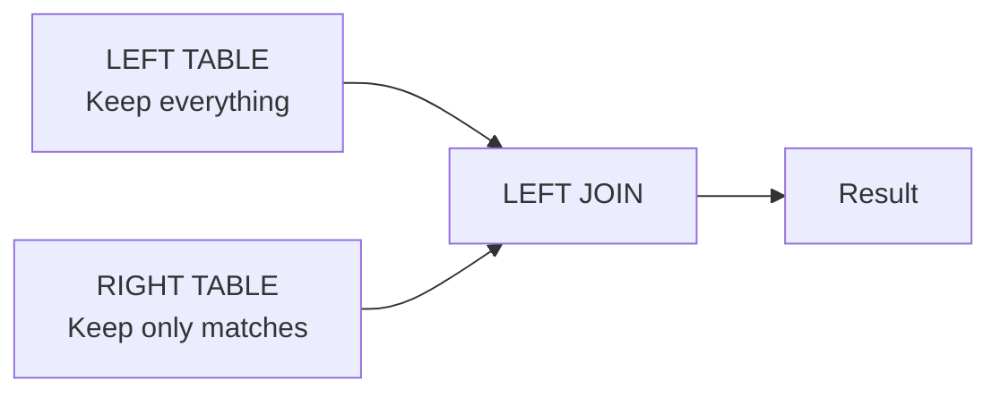
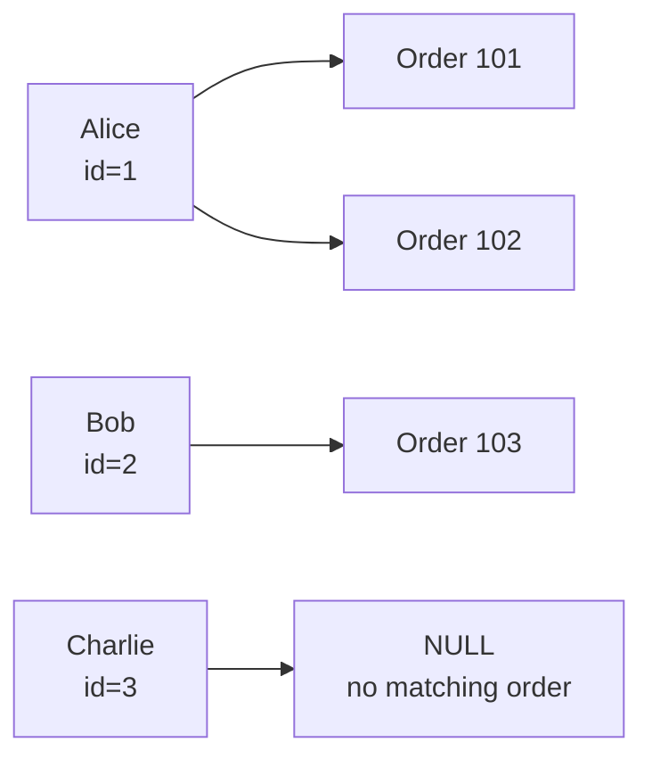
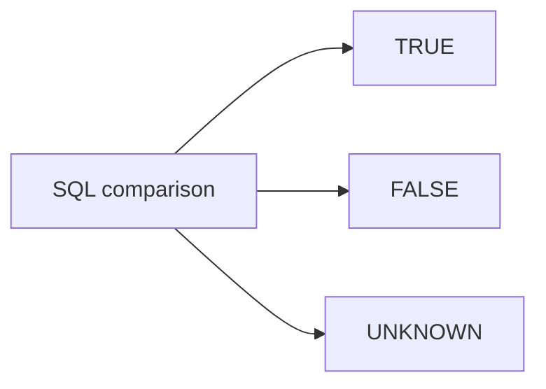
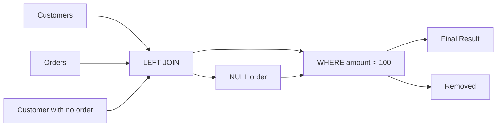
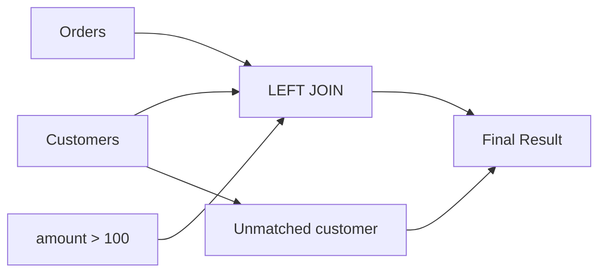
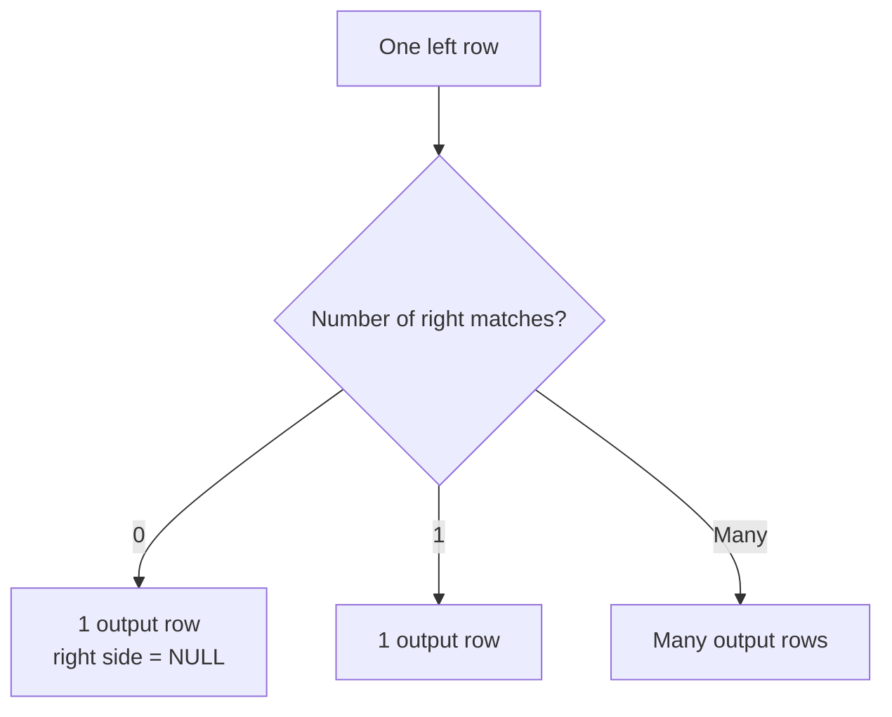
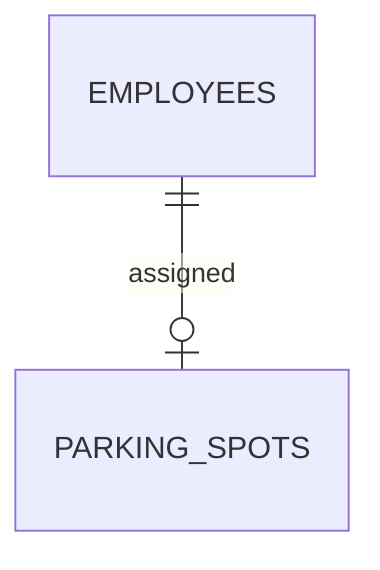

# 3. LEFT JOIN

`LEFT JOIN` is one of the most important joins in SQL because it lets you keep **all rows from the left table**, even when there is no matching row in the right table.

---

# 3.1 The Core Definition

```sql
LEFT JOIN
```

means:

> **Return every row from the left table, and matching rows from the right table.**

If no matching row exists on the right:

```text
right-side columns = NULL
```

The mental model is:



Compare that with `INNER JOIN`:

```text
INNER JOIN
    ↓
Only matches

LEFT JOIN
    ↓
All left rows
+
matching right rows
```

---

# 3.2 Example Tables

We'll continue with:

### `customers`

| id | name    |
| -: | ------- |
|  1 | Alice   |
|  2 | Bob     |
|  3 | Charlie |

### `orders`

|  id | customer_id | amount |
| --: | ----------: | -----: |
| 101 |           1 |    100 |
| 102 |           1 |    200 |
| 103 |           2 |    300 |
| 104 |           4 |    400 |

Notice:

```text
Customer 1 → has orders
Customer 2 → has orders
Customer 3 → has NO order
```

And:

```text
Order 104 → refers to customer 4
```

which doesn't exist in `customers`.

---

# 3.3 Basic LEFT JOIN

```sql
SELECT
    c.name,
    o.id AS order_id,
    o.amount
FROM customers AS c
LEFT JOIN orders AS o
    ON c.id = o.customer_id;
```

Result:

| name    | order_id | amount |
| ------- | -------: | -----: |
| Alice   |      101 |    100 |
| Alice   |      102 |    200 |
| Bob     |      103 |    300 |
| Charlie |     NULL |   NULL |

Notice Charlie.

Charlie has no matching order, but Charlie **still appears**.

Why?

Because `customers` is the **left table**.

---

# 3.4 Visualizing LEFT JOIN



The important rule:

```text
LEFT TABLE
    ↓
EVERYTHING SURVIVES

RIGHT TABLE
    ↓
Only matching rows survive
```

---

# 3.5 INNER JOIN vs LEFT JOIN

Using the same data:

### INNER JOIN

```sql
SELECT
    c.name,
    o.id AS order_id
FROM customers AS c
INNER JOIN orders AS o
    ON c.id = o.customer_id;
```

Result:

| name  | order_id |
| ----- | -------: |
| Alice |      101 |
| Alice |      102 |
| Bob   |      103 |

Charlie disappears.

---

### LEFT JOIN

```sql
SELECT
    c.name,
    o.id AS order_id
FROM customers AS c
LEFT JOIN orders AS o
    ON c.id = o.customer_id;
```

Result:

| name    | order_id |
| ------- | -------: |
| Alice   |      101 |
| Alice   |      102 |
| Bob     |      103 |
| Charlie |     NULL |

The difference:

```text
              INNER       LEFT

Alice           ✓          ✓
Bob             ✓          ✓
Charlie         ✗          ✓
```

---

# 3.6 Why Does `NULL` Appear?

Charlie has no order.

So PostgreSQL has no value for:

```text
o.id
o.amount
o.customer_id
```

Therefore:

```text
Charlie | NULL | NULL
```

`NULL` means:

> There is no matching value from the right side for this result row.

It does **not** mean:

```text
0
```

and it does **not** mean:

```text
empty string
```

and it does **not** mean:

```text
false
```

It represents a missing/unknown value in SQL's three-valued logic.

---

# 3.7 The Direction Matters

These are not necessarily equivalent:

```sql
FROM customers AS c
LEFT JOIN orders AS o
    ON c.id = o.customer_id
```

and:

```sql
FROM orders AS o
LEFT JOIN customers AS c
    ON c.id = o.customer_id
```

In the first query:

```text
customers = left
orders    = right
```

Therefore:

```text
ALL customers survive
```

In the second:

```text
orders    = left
customers = right
```

Therefore:

```text
ALL orders survive
```

This is extremely important.

---

# 3.8 LEFT JOIN Is About the Left Side

A good rule:

> **The table immediately before `LEFT JOIN` is the table whose rows you are protecting.**

Example:

```sql
FROM customers AS c
LEFT JOIN orders AS o
```

means:

```text
Protect customers.
```

Example:

```sql
FROM orders AS o
LEFT JOIN customers AS c
```

means:

```text
Protect orders.
```

---

# 3.9 Real-World Example

Suppose you want:

> Show every customer and their latest order.

The first step might be:

```sql
SELECT
    c.id,
    c.name,
    o.id AS order_id
FROM customers AS c
LEFT JOIN orders AS o
    ON c.id = o.customer_id;
```

Why `LEFT JOIN`?

Because customers who have never placed an order should still appear.

You might eventually get:

| customer | order |
| -------- | ----: |
| Alice    |   101 |
| Alice    |   102 |
| Bob      |   103 |
| Charlie  |  NULL |

Charlie is valuable information:

```text
Charlie exists
but
Charlie has no order
```

---

# 3.10 Finding Rows With No Match

One of the most useful patterns is:

```sql
SELECT
    c.id,
    c.name
FROM customers AS c
LEFT JOIN orders AS o
    ON c.id = o.customer_id
WHERE o.id IS NULL;
```

Result:

| id | name    |
| -: | ------- |
|  3 | Charlie |

Why does this work?

First:

```text
LEFT JOIN
```

keeps Charlie:

```text
Charlie | NULL
```

Then:

```sql
WHERE o.id IS NULL
```

keeps only rows where no order was matched.

So this pattern means:

> **Find rows in A that have no matching row in B.**

This is commonly called an **anti join pattern**.

We'll study anti joins more deeply later.

---

# 3.11 Important: Use `IS NULL`, Not `= NULL`

Incorrect:

```sql
WHERE o.id = NULL
```

Correct:

```sql
WHERE o.id IS NULL
```

Likewise:

```sql
WHERE o.id IS NOT NULL
```

Why?

Because SQL `NULL` doesn't behave like an ordinary value.

For example:

```text
NULL = NULL
```

does not evaluate to:

```text
TRUE
```

It evaluates to:

```text
UNKNOWN
```

SQL uses three-valued logic:



We'll cover this in detail when we study `NULL` and joins.

---

# 3.12 The Most Important LEFT JOIN Trap

Consider:

```sql
SELECT
    c.name,
    o.amount
FROM customers AS c
LEFT JOIN orders AS o
    ON c.id = o.customer_id
WHERE o.amount > 100;
```

At first glance, someone might think:

> "I'm using LEFT JOIN, so all customers should remain."

But that's not what happens.

Let's examine the result.

After the `LEFT JOIN`:

| name    | amount |
| ------- | -----: |
| Alice   |    100 |
| Alice   |    200 |
| Bob     |    300 |
| Charlie |   NULL |

Then:

```sql
WHERE o.amount > 100
```

is applied.

Evaluate:

```text
100 > 100 → FALSE
200 > 100 → TRUE
300 > 100 → TRUE
NULL > 100 → UNKNOWN
```

Therefore:

| name  | amount |
| ----- | -----: |
| Alice |    200 |
| Bob   |    300 |

Charlie disappears.

---

# 3.13 Why Did Charlie Disappear?

The `LEFT JOIN` originally preserved Charlie:

```text
Charlie | NULL
```

But then:

```sql
WHERE o.amount > 100
```

requires:

```text
o.amount > 100
```

For Charlie:

```text
NULL > 100
```

is:

```text
UNKNOWN
```

`WHERE` only keeps rows where the condition evaluates to `TRUE`.

Therefore:

```text
Charlie
   ↓
NULL > 100
   ↓
UNKNOWN
   ↓
removed
```

---

# 3.14 `ON` vs `WHERE` With LEFT JOIN

This is a critical distinction.

### Query A

```sql
SELECT
    c.name,
    o.amount
FROM customers AS c
LEFT JOIN orders AS o
    ON c.id = o.customer_id
WHERE o.amount > 100;
```

This effectively removes customers without matching orders.

---

### Query B

```sql
SELECT
    c.name,
    o.amount
FROM customers AS c
LEFT JOIN orders AS o
    ON c.id = o.customer_id
   AND o.amount > 100;
```

Now the filter is part of the matching condition.

Result:

| name    | amount |
| ------- | -----: |
| Alice   |    200 |
| Bob     |    300 |
| Charlie |   NULL |

Why?

Because:

```text
LEFT JOIN
```

still says:

> Keep every customer.

The additional condition only determines which orders are considered matches.

---

# 3.15 Visual Difference

### Filter in `WHERE`



### Filter in `ON`



The second preserves the left row.

---

# 3.16 A Very Useful Mental Model

Think of:

```sql
ON
```

as:

> **Should these two rows be considered a match?**

And:

```sql
WHERE
```

as:

> **Should this already-created result row remain in the final result?**

This distinction is especially important for outer joins.

---

# 3.17 LEFT JOIN With Aggregation

Suppose we want:

> Show every customer and the number of orders they have.

We can use:

```sql
SELECT
    c.id,
    c.name,
    COUNT(o.id) AS order_count
FROM customers AS c
LEFT JOIN orders AS o
    ON c.id = o.customer_id
GROUP BY
    c.id,
    c.name;
```

Result:

| id | name    | order_count |
| -: | ------- | ----------: |
|  1 | Alice   |           2 |
|  2 | Bob     |           1 |
|  3 | Charlie |           0 |

This is a very common real-world pattern.

---

# 3.18 Why `COUNT(o.id)` Gives Zero

For Charlie, after the join:

```text
Charlie | NULL
```

`COUNT(column)` ignores `NULL`.

Therefore:

```text
COUNT(o.id)
```

becomes:

```text
0
```

for Charlie.

This is different from:

```sql
COUNT(*)
```

which counts the result row itself.

This distinction becomes important when aggregating after `LEFT JOIN`.

---

# 3.19 `COUNT(*)` vs `COUNT(o.id)`

Consider:

```sql
SELECT
    c.name,
    COUNT(*) AS count_star,
    COUNT(o.id) AS count_order_id
FROM customers AS c
LEFT JOIN orders AS o
    ON c.id = o.customer_id
GROUP BY c.name;
```

For Charlie:

```text
Joined row:

Charlie | NULL
```

Therefore:

```text
COUNT(*)   = 1
COUNT(o.id) = 0
```

Why?

```text
COUNT(*)
    ↓
Counts rows

COUNT(o.id)
    ↓
Counts non-NULL values of o.id
```

Very important distinction.

---

# 3.20 LEFT JOIN With Multiple Matches

Remember:

```text
Alice → Order 101
Alice → Order 102
```

Therefore:

```sql
SELECT
    c.name,
    o.id
FROM customers AS c
LEFT JOIN orders AS o
    ON c.id = o.customer_id;
```

produces:

```text
Alice | 101
Alice | 102
Bob   | 103
Charlie | NULL
```

So `LEFT JOIN` does **not** mean:

```text
one left row → one result row
```

Instead:

```text
one left row
    ↓
zero, one, or many matching right rows
```

If there are many matches, the left row is repeated.

---

# 3.21 LEFT JOIN Cardinality

For each left row:

```text
0 matches
    ↓
1 result row with NULLs

1 match
    ↓
1 result row

N matches
    ↓
N result rows
```

Visualized:



This is the key behavior to remember.

---

# 3.22 LEFT JOIN Can Be Used for Optional Relationships

Suppose an employee may or may not have a parking spot.



Query:

```sql
SELECT
    e.name,
    p.spot_number
FROM employees AS e
LEFT JOIN parking_spots AS p
    ON e.id = p.employee_id;
```

Result might be:

| employee | spot  |
| -------- | ----- |
| Alice    | A-101 |
| Bob      | B-203 |
| Charlie  | NULL  |

Charlie is still an employee.

He simply has no parking spot.

---

# 3.23 LEFT JOIN and Foreign Keys

A foreign key doesn't necessarily mean every relationship has to exist.

For example, you might have:

```sql
parking_spots.employee_id
```

nullable.

Then:

```text
employee
   │
   ├── parking spot
   │
   └── no parking spot
```

A `LEFT JOIN` lets you see both cases.

---

# 3.24 RIGHT JOIN Is the Reverse

Everything we've learned about:

```sql
LEFT JOIN
```

can be expressed using:

```sql
RIGHT JOIN
```

by reversing the tables.

For example:

```sql
FROM customers AS c
LEFT JOIN orders AS o
    ON c.id = o.customer_id
```

is conceptually equivalent to:

```sql
FROM orders AS o
RIGHT JOIN customers AS c
    ON c.id = o.customer_id
```

Both preserve:

```text
customers
```

But `LEFT JOIN` is generally easier to read because the table you want to preserve is placed on the left.

We'll study `RIGHT JOIN` separately.

---

# 3.25 When Should You Think "LEFT JOIN"?

Common questions that suggest a `LEFT JOIN`:

```text
"Show all customers, including customers with no orders."

"Show all employees, even those without departments."

"Show all products, including products that have never been sold."

"Show every user and their profile, if they have one."

"Show all departments, including empty departments."
```

The common phrase is:

> **Show everything from A, whether or not B exists.**

That strongly suggests:

```sql
A
LEFT JOIN
B
```

---

# 3.26 The Core Pattern

Memorize this pattern:

```sql
SELECT
    ...
FROM parent AS p
LEFT JOIN child AS c
    ON p.id = c.parent_id;
```

It means:

```text
Give me every parent.

If children exist:
    attach them.

If children don't exist:
    return NULL for child columns.
```

---

# 3.27 LEFT JOIN Summary

```text
LEFT JOIN
    │
    ├── Keeps ALL rows from left table
    │
    ├── Keeps matching rows from right table
    │
    ├── Missing right-side values become NULL
    │
    ├── One left row can produce many result rows
    │
    ├── Useful for optional relationships
    │
    ├── Useful for finding rows with no match
    │
    └── Be careful with WHERE conditions on right-side columns
```

The most important mental picture:

```text
LEFT TABLE                    RIGHT TABLE

Alice  ────────────────────── Order 101
       └────────────────────── Order 102

Bob    ────────────────────── Order 103

Charlie ────────────────────── NULL
                              ↑
                       no matching row
```

---

# Practice Question

Given:

```text
customers

id | name
---+-------
1  | Alice
2  | Bob
3  | Charlie
```

```text
orders

id  | customer_id | amount
----+-------------+-------
101 | 1           | 100
102 | 1           | 200
103 | 2           | 300
```

What is the result of:

```sql
SELECT
    c.name,
    o.amount
FROM customers AS c
LEFT JOIN orders AS o
    ON c.id = o.customer_id;
```

And what changes if we add:

```sql
WHERE o.amount > 100;
```

The second question is especially important because it tests whether you've understood the **`ON` vs `WHERE` behavior with `LEFT JOIN`**.

---

# Next: RIGHT JOIN

We'll cover:

* what `RIGHT JOIN` actually means
* why it is simply the mirror of `LEFT JOIN`
* reversing table order
* `RIGHT JOIN` vs `LEFT JOIN`
* whether there is any practical reason to prefer it
* `NULL` behavior
* combining `RIGHT JOIN` with `WHERE`
* converting a `RIGHT JOIN` into a `LEFT JOIN` for readability.

