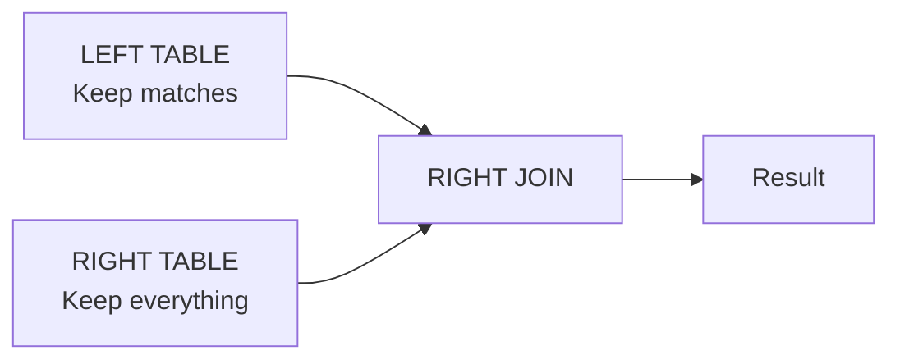
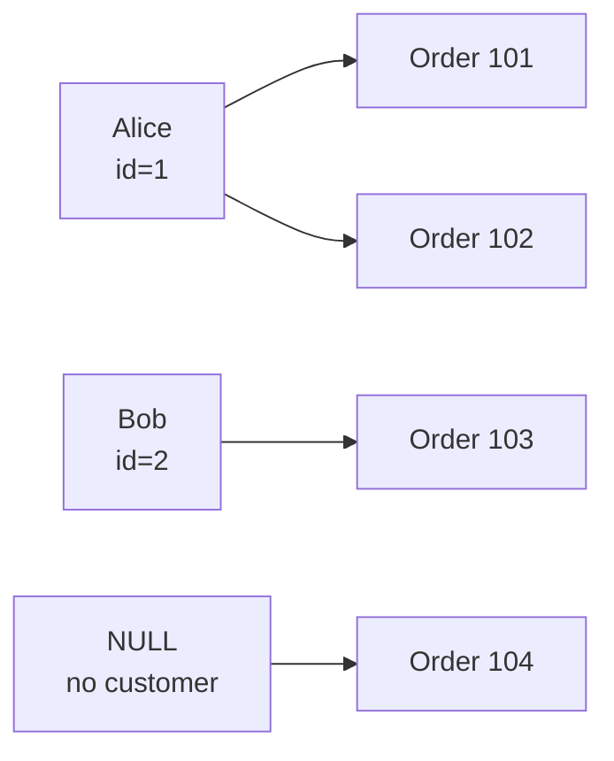
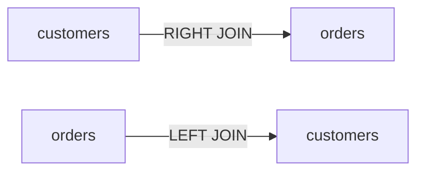
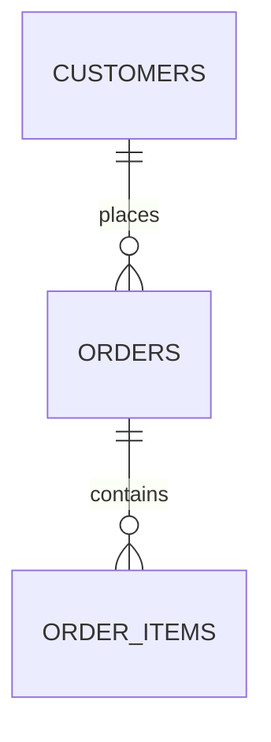
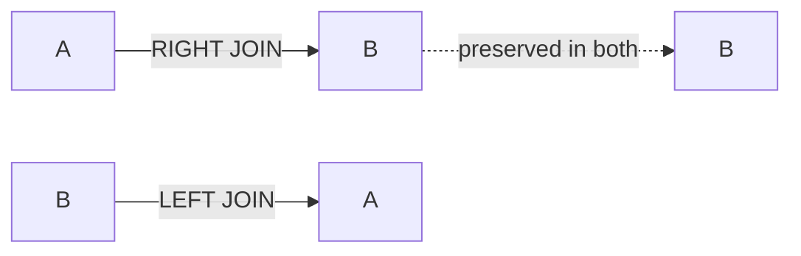

# 4. RIGHT JOIN

`RIGHT JOIN` is the mirror image of `LEFT JOIN`.

The most important thing to understand is **which table is preserved**.

---

# 4.1 Definition

A `RIGHT JOIN` returns:

> **Every row from the right table, plus matching rows from the left table.**

```sql
FROM table_a
RIGHT JOIN table_b
    ON condition
```

means:

```text
table_a → matching rows only
table_b → ALL rows
```

Think:



Compare:

```text
INNER JOIN
    → keep matches from both

LEFT JOIN
    → keep everything from left

RIGHT JOIN
    → keep everything from right
```

---

# 4.2 Example

Use our familiar tables.

### `customers`

| id | name    |
| -: | ------- |
|  1 | Alice   |
|  2 | Bob     |
|  3 | Charlie |

### `orders`

|  id | customer_id | amount |
| --: | ----------: | -----: |
| 101 |           1 |    100 |
| 102 |           1 |    200 |
| 103 |           2 |    300 |
| 104 |           4 |    400 |

Notice:

```text
customers:
1 → Alice
2 → Bob
3 → Charlie

orders:
101 → customer 1
102 → customer 1
103 → customer 2
104 → customer 4
```

Customer `4` doesn't exist.

---

# 4.3 Basic RIGHT JOIN

```sql
SELECT
    c.name,
    o.id AS order_id,
    o.amount
FROM customers AS c
RIGHT JOIN orders AS o
    ON c.id = o.customer_id;
```

Result:

| name  | order_id | amount |
| ----- | -------: | -----: |
| Alice |      101 |    100 |
| Alice |      102 |    200 |
| Bob   |      103 |    300 |
| NULL  |      104 |    400 |

Notice what happened.

Order `104` survives even though there is no matching customer.

Why?

Because:

```text
orders = RIGHT TABLE
```

and `RIGHT JOIN` preserves the right table.

---

# 4.4 Visual Representation



The preserved side is:

```text
orders
```

Therefore every order remains.

---

# 4.5 RIGHT JOIN vs LEFT JOIN

Consider:

```sql
FROM customers AS c
LEFT JOIN orders AS o
    ON c.id = o.customer_id;
```

This preserves:

```text
customers
```

Now:

```sql
FROM customers AS c
RIGHT JOIN orders AS o
    ON c.id = o.customer_id;
```

This preserves:

```text
orders
```

So:

```text
             LEFT JOIN          RIGHT JOIN

customers       ALL               MATCHES
orders          MATCHES           ALL
```

---

# 4.6 The Easy Way to Remember

Look at the direction:

```text
A LEFT JOIN B
      ↑
   preserve A
```

```text
A RIGHT JOIN B
          ↑
       preserve B
```

Or simply:

```text
LEFT JOIN
    → everything on LEFT

RIGHT JOIN
    → everything on RIGHT
```

---

# 4.7 RIGHT JOIN Is Usually Replaceable

Any `RIGHT JOIN` can be rewritten as a `LEFT JOIN` by swapping the table order.

For example:

```sql
SELECT
    c.name,
    o.id AS order_id,
    o.amount
FROM customers AS c
RIGHT JOIN orders AS o
    ON c.id = o.customer_id;
```

can be written as:

```sql
SELECT
    c.name,
    o.id AS order_id,
    o.amount
FROM orders AS o
LEFT JOIN customers AS c
    ON c.id = o.customer_id;
```

Both preserve:

```text
orders
```

and therefore produce the same set of joined rows.

---

# 4.8 Why Is LEFT JOIN Often Preferred?

Consider:

```sql
FROM customers AS c
RIGHT JOIN orders AS o
    ON c.id = o.customer_id
```

You have to mentally remember:

> "RIGHT means preserve `orders`."

Compare:

```sql
FROM orders AS o
LEFT JOIN customers AS c
    ON c.id = o.customer_id
```

Now it's immediately visible:

```text
orders
   ↓
LEFT JOIN
   ↓
preserve orders
```

This is often easier to read.

Therefore many SQL developers prefer:

```text
LEFT JOIN
```

and simply put the important/preserved table on the left.

---

# 4.9 Converting RIGHT JOIN → LEFT JOIN

Use this transformation:

```text
A RIGHT JOIN B
```

becomes:

```text
B LEFT JOIN A
```

The join condition must be adjusted to match the new aliases/table order.

Example:

```sql
FROM customers AS c
RIGHT JOIN orders AS o
    ON c.id = o.customer_id
```

becomes:

```sql
FROM orders AS o
LEFT JOIN customers AS c
    ON c.id = o.customer_id
```

Conceptually:



Both preserve:

```text
orders
```

---

# 4.10 RIGHT JOIN and NULL

With:

```sql
SELECT
    c.name,
    o.id
FROM customers AS c
RIGHT JOIN orders AS o
    ON c.id = o.customer_id;
```

Order `104` has:

```text
customer_id = 4
```

but there is no customer `4`.

Therefore:

```text
c.name = NULL
```

Result:

```text
NULL | 104
```

The `NULL` appears on the **left-side columns** because the left row doesn't exist.

---

# 4.11 Compare Where NULL Appears

### LEFT JOIN

```sql
customers
LEFT JOIN
orders
```

If order doesn't exist:

```text
customer | order
---------+------
Charlie  | NULL
```

So:

```text
RIGHT-side columns → NULL
```

---

### RIGHT JOIN

```sql
customers
RIGHT JOIN
orders
```

If customer doesn't exist:

```text
customer | order
---------+------
NULL     | 104
```

So:

```text
LEFT-side columns → NULL
```

---

# 4.12 RIGHT JOIN and `WHERE`

Consider:

```sql
SELECT
    c.name,
    o.id
FROM customers AS c
RIGHT JOIN orders AS o
    ON c.id = o.customer_id
WHERE c.name = 'Alice';
```

After the join:

```text
Alice | 101
Alice | 102
Bob   | 103
NULL  | 104
```

Then:

```sql
WHERE c.name = 'Alice'
```

keeps:

```text
Alice | 101
Alice | 102
```

and removes:

```text
Bob
NULL
```

Again, remember:

```text
JOIN
  ↓
creates joined rows

WHERE
  ↓
filters the result
```

---

# 4.13 RIGHT JOIN for Finding Orphan Rows

Suppose you want:

> Find orders that don't have a corresponding customer.

You can write:

```sql
SELECT
    o.id,
    o.customer_id
FROM customers AS c
RIGHT JOIN orders AS o
    ON c.id = o.customer_id
WHERE c.id IS NULL;
```

Result:

|  id | customer_id |
| --: | ----------: |
| 104 |           4 |

This works because:

```text
RIGHT JOIN
    ↓
preserves every order

WHERE c.id IS NULL
    ↓
keep orders with no customer
```

However, the same query is usually easier to read as:

```sql
SELECT
    o.id,
    o.customer_id
FROM orders AS o
LEFT JOIN customers AS c
    ON c.id = o.customer_id
WHERE c.id IS NULL;
```

This is one reason `LEFT JOIN` is commonly preferred.

---

# 4.14 RIGHT JOIN Does Not Mean "Join From Right to Left"

This is a common misconception.

`RIGHT JOIN` doesn't mean PostgreSQL processes the right table first.

It means:

> **The right table is preserved in the logical result.**

For example:

```sql
FROM A
RIGHT JOIN B
    ON ...
```

means:

```text
B's rows must be preserved.
```

It does **not** tell PostgreSQL:

```text
"Execute B first."
```

The PostgreSQL optimizer is free to choose an efficient physical execution strategy.

---

# 4.15 Logical vs Physical Execution

This distinction is important.

When you write:

```sql
FROM A
RIGHT JOIN B
```

you are expressing the **logical result requirement**.

PostgreSQL's optimizer might internally transform the join into an equivalent form.

For example, it may effectively reason about:

```text
B LEFT JOIN A
```

or choose a particular join algorithm.

You don't need to control that manually.

Later we'll study:

```text
Nested Loop
Hash Join
Merge Join
```

and:

```sql
EXPLAIN
EXPLAIN ANALYZE
```

to see what PostgreSQL actually chooses.

---

# 4.16 RIGHT JOIN With Multiple Tables

Suppose:



You could write:

```sql
SELECT
    c.name,
    o.id,
    oi.quantity
FROM customers AS c
RIGHT JOIN orders AS o
    ON c.id = o.customer_id
LEFT JOIN order_items AS oi
    ON o.id = oi.order_id;
```

But mixing directions can make a query harder to reason about.

Often it is clearer to start from the table you want to preserve:

```sql
SELECT
    c.name,
    o.id,
    oi.quantity
FROM orders AS o
LEFT JOIN customers AS c
    ON c.id = o.customer_id
LEFT JOIN order_items AS oi
    ON o.id = oi.order_id;
```

Now the structure is easier to read:

```text
orders
   │
   ├── customer
   │
   └── order_items
```

---

# 4.17 LEFT JOIN vs RIGHT JOIN Transformation

Let's make the equivalence explicit.

Original:

```sql
SELECT ...
FROM A
RIGHT JOIN B
    ON A.id = B.a_id;
```

Swap the tables:

```sql
SELECT ...
FROM B
LEFT JOIN A
    ON A.id = B.a_id;
```

The preserved relation remains:

```text
B
```

because:

```text
A RIGHT JOIN B
        =
B LEFT JOIN A
```

---

# 4.18 Relationship Diagram



The important concept is not the keyword.

It is:

> **Which side must survive when there is no match?**

---

# 4.19 Choosing Between LEFT and RIGHT

Technically:

```text
LEFT JOIN
```

and:

```text
RIGHT JOIN
```

can express equivalent relationships.

A useful readability rule is:

> Put the table whose rows you want to preserve on the left and use `LEFT JOIN`.

For example, instead of:

```sql
FROM departments AS d
RIGHT JOIN employees AS e
    ON d.id = e.department_id;
```

prefer:

```sql
FROM employees AS e
LEFT JOIN departments AS d
    ON d.id = e.department_id;
```

The second makes the intention immediately obvious:

```text
employees
    ↓
all employees survive
    ↓
department is optional
```

---

# 4.20 Important Exception

There is no requirement that you must never use `RIGHT JOIN`.

It is a valid SQL join type.

If a query is clearer with `RIGHT JOIN`, it can be used.

The point is simply that:

```text
RIGHT JOIN
```

usually provides little expressive power that:

```text
LEFT JOIN + reversed table order
```

cannot provide.

---

# 4.21 INNER vs LEFT vs RIGHT

A compact comparison:

| Join         | Left table    | Right table   |
| ------------ | ------------- | ------------- |
| `INNER JOIN` | Matching rows | Matching rows |
| `LEFT JOIN`  | **All rows**  | Matching rows |
| `RIGHT JOIN` | Matching rows | **All rows**  |

Visual:

```text
INNER JOIN

A        B
 \      /
  \____/
  matches


LEFT JOIN

A              B
| \            /
|  \__________/
|
ALL A


RIGHT JOIN

A              B
 \            / |
  \__________/  |
               |
              ALL B
```

---

# 4.22 The Real Question Behind Every Outer Join

Don't memorize:

```text
LEFT = this
RIGHT = that
```

Instead ask:

> **Which rows do I refuse to lose?**

If the answer is:

```text
customers
```

write:

```sql
FROM customers
LEFT JOIN ...
```

If the answer is:

```text
orders
```

write:

```sql
FROM orders
LEFT JOIN ...
```

This approach eliminates most confusion.

---

# 4.23 Summary

```text
RIGHT JOIN
    │
    ├── Keeps ALL rows from the right table
    │
    ├── Keeps matching rows from the left table
    │
    ├── Missing left-side values become NULL
    │
    ├── Equivalent to reversing tables + LEFT JOIN
    │
    └── Often rewritten as LEFT JOIN for readability
```

The fundamental transformation:

```text
A RIGHT JOIN B
      ↓
B LEFT JOIN A
```

And the most important rule:

```text
LEFT JOIN
    → preserve left

RIGHT JOIN
    → preserve right
```

---

# Next: FULL OUTER JOIN

Next we'll cover the join that preserves **both sides**:

```sql
FULL OUTER JOIN
```

We'll see:

* matched rows
* left-only rows
* right-only rows
* `NULL` on both sides
* `FULL JOIN` vs `FULL OUTER JOIN`
* visual Venn-style reasoning
* finding unmatched rows on **either side**
* combining `FULL JOIN` with `WHERE`
* practical data reconciliation examples.

