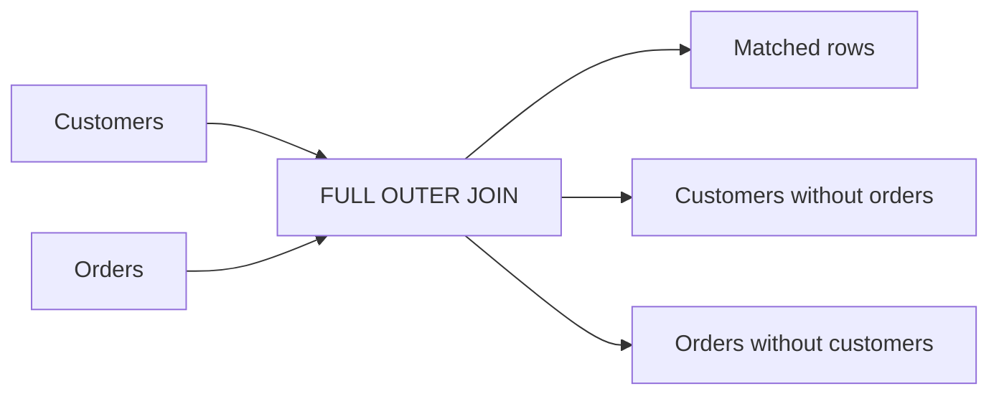
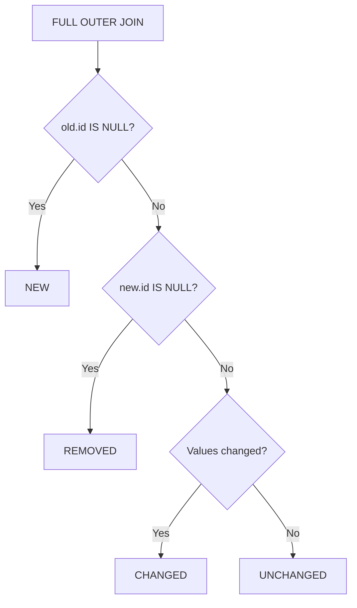
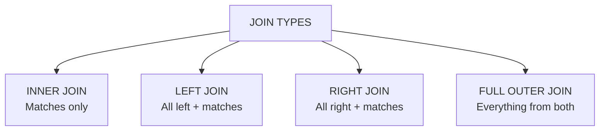

# 5. FULL OUTER JOIN

`FULL OUTER JOIN` is the join that preserves **both sides**.

If `LEFT JOIN` means:

> Keep everything from the left.

and `RIGHT JOIN` means:

> Keep everything from the right.

then `FULL OUTER JOIN` means:

> **Keep everything from both tables.**

---

# 5.1 Definition

```sql
FULL OUTER JOIN
```

returns:

```text
matched rows
+
left-only rows
+
right-only rows
```

The shorter syntax is:

```sql
FULL JOIN
```

Both mean the same thing in PostgreSQL:

```sql
FULL JOIN
```

=

```sql
FULL OUTER JOIN
```

---

# 5.2 Example Tables

Let's use:

### `customers`

| id | name    |
| -: | ------- |
|  1 | Alice   |
|  2 | Bob     |
|  3 | Charlie |

### `orders`

|  id | customer_id | amount |
| --: | ----------: | -----: |
| 101 |           1 |    100 |
| 102 |           1 |    200 |
| 103 |           2 |    300 |
| 104 |           4 |    400 |

There are three categories of rows.

### Matching

```text
Alice  ↔ Order 101
Alice  ↔ Order 102
Bob    ↔ Order 103
```

### Left-only

```text
Charlie
```

Charlie has no order.

### Right-only

```text
Order 104
```

Order 104 refers to customer `4`, which doesn't exist.

---

# 5.3 Basic FULL OUTER JOIN

```sql
SELECT
    c.name,
    o.id AS order_id,
    o.amount
FROM customers AS c
FULL OUTER JOIN orders AS o
    ON c.id = o.customer_id;
```

Result:

| name    | order_id | amount |
| ------- | -------: | -----: |
| Alice   |      101 |    100 |
| Alice   |      102 |    200 |
| Bob     |      103 |    300 |
| Charlie |     NULL |   NULL |
| NULL    |      104 |    400 |

The exact physical ordering isn't guaranteed unless you use `ORDER BY`.

---

# 5.4 Visual Model



The key idea:

```text
LEFT JOIN
    ↓
left survives

RIGHT JOIN
    ↓
right survives

FULL OUTER JOIN
    ↓
both survive
```

---

# 5.5 Venn-Style Mental Model

Think about the two sets:

```text
        CUSTOMERS              ORDERS

       ┌─────────┐          ┌─────────┐
       │         │          │         │
       │   A     │ MATCH    │    B    │
       │         │──────────│         │
       └─────────┘          └─────────┘
```

`FULL OUTER JOIN` keeps:

```text
       LEFT ONLY
           +
        MATCHES
           +
       RIGHT ONLY
```

Or:

```text
┌───────────────┬─────────────────┬───────────────┐
│ LEFT ONLY     │ MATCHED         │ RIGHT ONLY    │
│               │                 │               │
│ Charlie       │ Alice → 101     │ Order 104     │
│               │ Alice → 102     │               │
│               │ Bob → 103       │               │
└───────────────┴─────────────────┴───────────────┘
```

---

# 5.6 Where Does NULL Appear?

This is one of the most important things to understand.

For a **left-only** row:

```text
customer exists
order doesn't
```

Therefore:

```text
customer columns → values
order columns    → NULL
```

Example:

```text
Charlie | NULL | NULL
```

For a **right-only** row:

```text
order exists
customer doesn't
```

Therefore:

```text
customer columns → NULL
order columns    → values
```

Example:

```text
NULL | 104 | 400
```

So:

```text
LEFT ONLY
    ↓
right columns = NULL

RIGHT ONLY
    ↓
left columns = NULL
```

---

# 5.7 Compare All Three Outer Joins

Using:

```text
A = customers
B = orders
```

| Join              | A-only | Matches | B-only |
| ----------------- | ------ | ------- | ------ |
| `LEFT JOIN`       | Yes    | Yes     | No     |
| `RIGHT JOIN`      | No     | Yes     | Yes    |
| `FULL OUTER JOIN` | Yes    | Yes     | Yes    |

Visual:

```text
              A-only    MATCH    B-only

LEFT JOIN       ✓         ✓         ✗

RIGHT JOIN      ✗         ✓         ✓

FULL JOIN       ✓         ✓         ✓
```

This is an excellent table to remember.

---

# 5.8 FULL JOIN Is Not the Same as INNER JOIN

`INNER JOIN`:

```text
matches only
```

```text
Alice → 101
Alice → 102
Bob   → 103
```

`FULL OUTER JOIN`:

```text
matches
+
left-only
+
right-only
```

```text
Alice   → 101
Alice   → 102
Bob     → 103
Charlie → NULL
NULL    → 104
```

---

# 5.9 Finding Unmatched Rows on Either Side

This is one of the most useful applications of `FULL OUTER JOIN`.

Suppose you want:

> Find customers without orders **and** orders without customers.

You can write:

```sql
SELECT
    c.id AS customer_id,
    c.name,
    o.id AS order_id,
    o.customer_id
FROM customers AS c
FULL OUTER JOIN orders AS o
    ON c.id = o.customer_id
WHERE c.id IS NULL
   OR o.id IS NULL;
```

Result:

| customer_id | name    | order_id | customer_id |
| ----------: | ------- | -------: | ----------: |
|           3 | Charlie |     NULL |        NULL |
|        NULL | NULL    |      104 |           4 |

Now you have both kinds of unmatched data.

---

# 5.10 Why This Is Useful

This pattern is extremely useful for **data reconciliation**.

For example:

```text
System A                  System B

Customer records          Customer records
        │                         │
        └──────── FULL JOIN ──────┘
                    │
                    ▼
              Find mismatches
```

You might use it to compare:

```text
Database A vs Database B
CSV vs Database
Old system vs New system
Source system vs Reporting system
Expected data vs Actual data
```

---

# 5.11 Data Reconciliation Example

Suppose you have:

### `old_customers`

| id | name    |
| -: | ------- |
|  1 | Alice   |
|  2 | Bob     |
|  3 | Charlie |

### `new_customers`

| id | name  |
| -: | ----- |
|  1 | Alice |
|  2 | Bobby |
|  4 | David |

Now:

```sql
SELECT
    old.id AS old_id,
    old.name AS old_name,
    new.id AS new_id,
    new.name AS new_name
FROM old_customers AS old
FULL OUTER JOIN new_customers AS new
    ON old.id = new.id;
```

Possible result:

| old_id | old_name | new_id | new_name |
| -----: | -------- | -----: | -------- |
|      1 | Alice    |      1 | Alice    |
|      2 | Bob      |      2 | Bobby    |
|      3 | Charlie  |   NULL | NULL     |
|   NULL | NULL     |      4 | David    |

Now we can identify:

```text
id = 1
    → exists in both

id = 2
    → exists in both but name changed

id = 3
    → exists only in old

id = 4
    → exists only in new
```

This is a powerful real-world use case.

---

# 5.12 FULL JOIN + NULL Detection

You can categorize each row:

```sql
SELECT
    old.id AS old_id,
    old.name AS old_name,
    new.id AS new_id,
    new.name AS new_name,
    CASE
        WHEN old.id IS NULL THEN 'NEW'
        WHEN new.id IS NULL THEN 'REMOVED'
        WHEN old.name <> new.name THEN 'CHANGED'
        ELSE 'UNCHANGED'
    END AS status
FROM old_customers AS old
FULL OUTER JOIN new_customers AS new
    ON old.id = new.id;
```

Conceptually:



This is a common reconciliation pattern.

---

# 5.13 FULL JOIN and Duplicate Matches

Just like the other joins, `FULL JOIN` doesn't magically eliminate multiple matches.

Suppose:

```text
customers

id
---
1
```

and:

```text
orders

id | customer_id
---+------------
101 | 1
102 | 1
103 | 1
```

Then:

```sql
FULL JOIN
```

produces:

```text
1 → 101
1 → 102
1 → 103
```

The matching side still follows normal join cardinality.

`FULL JOIN` only changes what happens to **unmatched rows**.

---

# 5.14 FULL JOIN With `WHERE`

Be careful with:

```sql
SELECT ...
FROM A
FULL OUTER JOIN B
    ON A.id = B.id
WHERE A.id IS NOT NULL;
```

This removes the `B`-only rows.

Why?

A `B`-only row has:

```text
A.id = NULL
```

Therefore:

```text
A.id IS NOT NULL
```

is false.

So:

```text
FULL JOIN
    ↓
both sides initially preserved

WHERE A.id IS NOT NULL
    ↓
A-only + matches survive
B-only disappears
```

Conceptually, you're moving toward:

```text
LEFT JOIN
```

depending on the rest of the query.

---

# 5.15 Another Example

Start with:

```sql
SELECT
    a.id AS a_id,
    b.id AS b_id
FROM a
FULL OUTER JOIN b
    ON a.id = b.id;
```

Result categories:

```text
A-only
MATCH
B-only
```

Now:

```sql
WHERE a.id IS NULL;
```

keeps:

```text
B-only
```

So this is a useful pattern for finding:

> Rows that exist only in the right table.

Similarly:

```sql
WHERE b.id IS NULL;
```

finds:

> Rows that exist only in the left table.

---

# 5.16 Finding Only Mismatches

A very useful pattern is:

```sql
SELECT
    a.id AS a_id,
    b.id AS b_id
FROM a
FULL OUTER JOIN b
    ON a.id = b.id
WHERE a.id IS NULL
   OR b.id IS NULL;
```

This gives:

```text
A-only
+
B-only
```

but excludes matched rows.

Visually:

```text
┌──────────┐
│ A        │
│   ┌──────┼──────┐
│   │ MATCH│      │
│   └──────┼──────┘
└──────────┘
           └──────── B

FULL JOIN + NULL checks
        ↓
Keep only outer regions
```

---

# 5.17 FULL JOIN vs `UNION`

You might wonder:

> Can't I just combine two queries with `UNION`?

Sometimes you can produce similar-looking results, but they are conceptually different.

`FULL OUTER JOIN` is about:

```text
matching rows based on a relationship
```

`UNION` is about:

```text
combining result sets vertically
```

For example:

```text
JOIN

A row ───── matching ───── B row
```

versus:

```text
UNION

A results
─────────
B results
```

We'll study `UNION`, `INTERSECT`, and `EXCEPT` separately when we reach set operations.

---

# 5.18 FULL JOIN Is Not Common in CRUD Queries

In typical application queries, you'll see:

```text
INNER JOIN
LEFT JOIN
```

much more frequently than:

```text
FULL OUTER JOIN
```

That's because application queries often have a clear primary side.

For example:

```text
Get customers and their orders
    → LEFT JOIN

Get orders and their customers
    → INNER JOIN or LEFT JOIN

Get employees and departments
    → LEFT JOIN
```

`FULL JOIN` becomes particularly useful when:

```text
both sides matter independently
```

such as:

```text
data comparison
reconciliation
migration validation
synchronization
auditing
```

---

# 5.19 A Powerful Mental Model

Don't memorize the keywords individually.

Think:

```text
INNER
    → intersection

LEFT
    → left + intersection

RIGHT
    → right + intersection

FULL
    → left + intersection + right
```

In set-like notation:

```text
INNER:

      A ∩ B


LEFT:

      A


RIGHT:

      B


FULL:

      A ∪ B
```

Be careful: SQL joins are relational operations, so these set symbols are only a **mental model**, especially when duplicate rows and join cardinality are involved.

---

# 5.20 Four Join Types Together



A useful table:

| Join    | Left-only | Matching | Right-only |
| ------- | :-------: | :------: | :--------: |
| `INNER` |     ❌     |     ✅    |      ❌     |
| `LEFT`  |     ✅     |     ✅    |      ❌     |
| `RIGHT` |     ❌     |     ✅    |      ✅     |
| `FULL`  |     ✅     |     ✅    |      ✅     |

---

# 5.21 SQL Syntax

These are equivalent:

```sql
FULL JOIN
```

and:

```sql
FULL OUTER JOIN
```

For example:

```sql
SELECT *
FROM customers AS c
FULL JOIN orders AS o
    ON c.id = o.customer_id;
```

is equivalent to:

```sql
SELECT *
FROM customers AS c
FULL OUTER JOIN orders AS o
    ON c.id = o.customer_id;
```

`OUTER` is optional.

---

# 5.22 When Should You Think "FULL JOIN"?

Questions like these are strong candidates:

```text
"Show everything that exists in either system."

"Which records are missing from either side?"

"Compare these two datasets."

"Find records that exist in the old system but not the new system,
and records that exist in the new system but not the old system."

"Reconcile these two sources."
```

The key phrase is:

> **I don't want to lose unmatched rows from either side.**

That suggests:

```sql
FULL OUTER JOIN
```

---

# 5.23 Summary

```text
FULL OUTER JOIN
       │
       ├── All matching rows
       │
       ├── All left-only rows
       │
       ├── All right-only rows
       │
       ├── NULL on right for left-only rows
       │
       └── NULL on left for right-only rows
```

The fundamental model:

```text
                FULL OUTER JOIN

        LEFT ONLY     MATCHED     RIGHT ONLY
           │             │            │
           ▼             ▼            ▼
        Charlie       Alice        Order 104
                      Bob
```

And the most useful practical pattern:

```sql
SELECT ...
FROM a
FULL OUTER JOIN b
    ON a.id = b.id
WHERE a.id IS NULL
   OR b.id IS NULL;
```

This identifies records that exist on **only one side**.

---

# Join Types So Far

We now have:

```text
1. INNER JOIN
   → matching rows only

2. LEFT JOIN
   → all left rows + matches

3. RIGHT JOIN
   → all right rows + matches

4. FULL OUTER JOIN
   → all rows from both sides
```

The next join is fundamentally different.

# Next: CROSS JOIN

We'll see why:

```sql
CROSS JOIN
```

can produce:

```text
A rows × B rows
```

and why it can suddenly turn:

```text
1,000 rows + 1,000 rows
```

into:

```text
1,000,000 rows
```

We'll also understand the **Cartesian product**, when it is useful, and why accidentally creating one can be a serious query bug.

