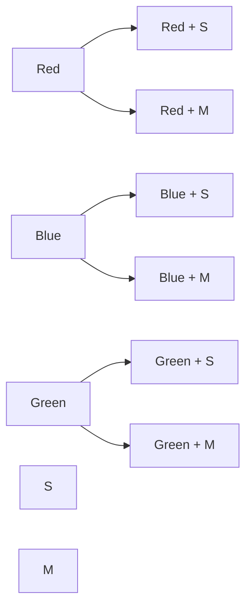

# 6. CROSS JOIN

A `CROSS JOIN` combines **every row from the first table with every row from the second table**.

It does **not require a matching condition**.

The most important formula is:

> **Number of result rows = rows in A × rows in B**

---

## 6.1 Basic Example

Suppose we have:

### `colors`

| id | color |
| -: | ----- |
|  1 | Red   |
|  2 | Blue  |
|  3 | Green |

### `sizes`

| id | size |
| -: | ---- |
|  1 | S    |
|  2 | M    |

A `CROSS JOIN`:

```sql
SELECT
    c.color,
    s.size
FROM colors AS c
CROSS JOIN sizes AS s;
```

Produces:

| color | size |
| ----- | ---- |
| Red   | S    |
| Red   | M    |
| Blue  | S    |
| Blue  | M    |
| Green | S    |
| Green | M    |

There are:

```text
3 colors × 2 sizes = 6 rows
```

---

## 6.2 Visual Mental Model

Think of it as a grid.

```text
             S          M
          +----------+----------+
Red       | Red + S  | Red + M  |
          +----------+----------+
Blue      | Blue + S | Blue + M |
          +----------+----------+
Green     | Green + S| Green + M|
          +----------+----------+
```

Every row on the left is paired with **every row on the right**.

---

## 6.3 Mermaid Visualization



The important idea is:

```text
Red   → S
Red   → M

Blue  → S
Blue  → M

Green → S
Green → M
```

---

# 6.4 CROSS JOIN Has No ON Condition

Compare this:

```sql
SELECT *
FROM customers AS c
INNER JOIN orders AS o
    ON c.id = o.customer_id;
```

Here we have:

```text
JOIN + ON
```

The database looks for **matching rows**.

But with:

```sql
SELECT *
FROM colors AS c
CROSS JOIN sizes AS s;
```

There is no:

```sql
ON ...
```

because we're explicitly saying:

> Pair every row with every other row.

---

# 6.5 The Mathematical Rule

If:

```text
Table A = M rows
Table B = N rows
```

Then:

```text
CROSS JOIN result = M × N rows
```

For example:

```text
10 × 5   = 50
100 × 20 = 2,000
1,000 × 1,000 = 1,000,000
10,000 × 10,000 = 100,000,000
```

This is why `CROSS JOIN` needs to be used carefully.

---

# 6.6 CROSS JOIN Can Cause Huge Row Counts

Imagine:

```text
products = 5,000
colors   = 20
```

You want every product in every color:

```text
5,000 × 20
= 100,000 combinations
```

That's intentional.

But imagine:

```text
customers = 1,000,000
products  = 100,000
```

A cross join would theoretically produce:

```text
1,000,000 × 100,000
= 100,000,000,000
```

That's:

```text
100 billion rows
```

So a cross join can cause **massive result sets**.

---

# 6.7 CROSS JOIN vs INNER JOIN

Consider:

```text
customers
---------
Alice
Bob
Charlie
```

and:

```text
orders
------
Order 101 → Alice
Order 102 → Alice
Order 103 → Bob
```

### INNER JOIN

```sql
SELECT
    c.name,
    o.id
FROM customers AS c
INNER JOIN orders AS o
    ON c.id = o.customer_id;
```

Result:

```text
Alice   101
Alice   102
Bob     103
```

Only related rows are combined.

### CROSS JOIN

```sql
SELECT
    c.name,
    o.id
FROM customers AS c
CROSS JOIN orders AS o;
```

Result:

```text
Alice   101
Alice   102
Alice   103

Bob     101
Bob     102
Bob     103

Charlie 101
Charlie 102
Charlie 103
```

There is **no concept of relationship** here.

If there are:

```text
3 customers × 3 orders
```

we get:

```text
9 rows
```

---

# 6.8 CROSS JOIN vs Missing JOIN Condition

This is a very important mistake.

Suppose someone writes:

```sql
SELECT
    c.name,
    o.id
FROM customers AS c,
     orders AS o;
```

Historically, this comma syntax represents a Cartesian product.

So this:

```sql
FROM customers AS c,
     orders AS o
```

is essentially a cross product.

Modern SQL should generally make the intention explicit:

```sql
FROM customers AS c
CROSS JOIN orders AS o
```

The explicit syntax makes your intention much clearer.

---

# 6.9 A Dangerous Accidental CROSS JOIN

Suppose you intended:

```sql
SELECT
    c.name,
    o.id
FROM customers AS c
JOIN orders AS o
    ON c.id = o.customer_id;
```

But accidentally wrote:

```sql
SELECT
    c.name,
    o.id
FROM customers AS c
JOIN orders AS o;
```

Depending on PostgreSQL syntax/context, an omitted join condition can lead to a Cartesian product.

The result can suddenly become enormous.

This is one reason you should always consciously ask:

> **What relationship connects these tables?**

If there isn't one, ask yourself:

> **Did I actually intend a CROSS JOIN?**

---

# 6.10 Practical Use Case: Product Variations

CROSS JOIN is not inherently bad.

There are many legitimate uses.

Suppose:

### Products

| product |
| ------- |
| T-Shirt |
| Hoodie  |

### Colors

| color |
| ----- |
| Red   |
| Blue  |
| Black |

You want to generate every possible product/color combination.

```sql
SELECT
    p.product,
    c.color
FROM products AS p
CROSS JOIN colors AS c;
```

Result:

```text
T-Shirt  Red
T-Shirt  Blue
T-Shirt  Black

Hoodie   Red
Hoodie   Blue
Hoodie   Black
```

That's exactly what a Cartesian product is useful for.

---

# 6.11 Practical Use Case: Generate All Dates × Categories

Imagine:

### Dates

```text
2026-10-01
2026-10-02
2026-10-03
```

### Categories

```text
Electronics
Clothing
Books
```

You want every date/category combination.

```sql
SELECT
    d.date,
    c.category
FROM dates AS d
CROSS JOIN categories AS c;
```

Result:

```text
2026-10-01  Electronics
2026-10-01  Clothing
2026-10-01  Books

2026-10-02  Electronics
2026-10-02  Clothing
2026-10-02  Books

2026-10-03  Electronics
2026-10-03  Clothing
2026-10-03  Books
```

This can be useful for reporting.

For example, you might then `LEFT JOIN` actual sales onto these combinations so that categories with **zero sales** still appear.

---

# 6.12 CROSS JOIN with WHERE

You can technically write:

```sql
SELECT
    p.product,
    c.color
FROM products AS p
CROSS JOIN colors AS c
WHERE c.color <> 'Black';
```

The conceptual process is:

```text
CROSS JOIN
    ↓
Generate every combination
    ↓
WHERE filters combinations
```

For example:

```text
Products × Colors
        ↓
All combinations
        ↓
Remove Black
```

This can be useful when the Cartesian product is intentional but you want to remove some combinations.

---

# 6.13 CROSS JOIN vs JOIN ... ON

The difference is fundamental.

### `JOIN ... ON`

```sql
FROM A
JOIN B
    ON A.id = B.a_id;
```

Means:

> Find related rows.

### `CROSS JOIN`

```sql
FROM A
CROSS JOIN B;
```

Means:

> Give me every possible combination.

Think:

```text
INNER JOIN
    ↓
"Which rows belong together?"

CROSS JOIN
    ↓
"What are all possible combinations?"
```

---

# 6.14 CROSS JOIN and Cardinality

You should start thinking about **cardinality** whenever you write joins.

For a normal relationship:

```text
Customer
   |
   | 1:N
   ↓
Orders
```

One customer might produce:

```text
1 → many rows
```

But with a cross join:

```text
Customer
   ×
Order
```

every customer gets paired with every order.

If there are:

```text
1,000 customers
10,000 orders
```

then:

```text
1,000 × 10,000
= 10,000,000 rows
```

This is completely different from a relationship-based join.

---

# 6.15 Important Mental Model

When you see:

```sql
A CROSS JOIN B
```

immediately think:

```text
A rows
   ↓
every row
   ×
B rows
   ↓
every row
```

Or simply:

```text
A × B
```

---

# 6.16 Join Family So Far

You now have six major join types/patterns:

| Join              | What it keeps              |
| ----------------- | -------------------------- |
| `INNER JOIN`      | Matching rows              |
| `LEFT JOIN`       | All left + matching right  |
| `RIGHT JOIN`      | All right + matching left  |
| `FULL OUTER JOIN` | Everything from both sides |
| `CROSS JOIN`      | Every possible combination |
| `SELF JOIN`       | A table joined to itself   |

The last one, `SELF JOIN`, is conceptually different because it isn't a separate join algorithm. It's a pattern where a table participates in a join **with itself**.

---

# 6.17 Golden Rule

Whenever you see:

```sql
CROSS JOIN
```

ask:

> **Do I really want every row on the left combined with every row on the right?**

If yes, `CROSS JOIN` may be exactly what you need.

If no, you probably need a relationship-based join condition.

---

# 6.18 Summary

```text
CROSS JOIN
    |
    ├── No ON condition
    |
    ├── Every A row × every B row
    |
    ├── Result size = A rows × B rows
    |
    ├── Useful for combinations
    |
    └── Can create enormous result sets
```

The most important thing to remember:

> **INNER JOIN asks "which rows match?"**
>
> **CROSS JOIN asks "what are all possible combinations?"**

---

## Next

**7. SELF JOIN**

We'll learn how a table can be joined to **itself**, including the classic example:

```text
Employee
   |
   └── manager_id
          ↓
       Employee
```

This is where organizational hierarchies, employee-manager relationships, category trees, and similar structures start becoming much clearer.

