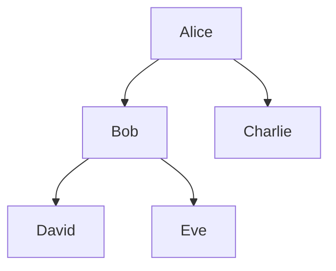

# 7. SELF JOIN

A **SELF JOIN** means joining a table **with itself**.

There is no special SQL keyword called `SELF JOIN`.

Instead, we use a normal `JOIN`, but reference the **same table twice using different aliases**.

---

## 7.1 The Basic Idea

Imagine an `employees` table:

| id | name    | manager_id |
| -: | ------- | ---------: |
|  1 | Alice   |       NULL |
|  2 | Bob     |          1 |
|  3 | Charlie |          1 |
|  4 | David   |          2 |
|  5 | Eve     |          2 |

Here:

```text
Alice
├── Bob
│   ├── David
│   └── Eve
└── Charlie
```

The important relationship is:

```text
employee.manager_id → employee.id
```

The same table contains both:

* employees
* managers

So we need to use the `employees` table twice.

---

# 7.2 Basic SELF JOIN

```sql
SELECT
    e.name AS employee,
    m.name AS manager
FROM employees AS e
LEFT JOIN employees AS m
    ON e.manager_id = m.id;
```

Notice this:

```sql
FROM employees AS e
LEFT JOIN employees AS m
```

Both `e` and `m` refer to the **same table**.

We are simply giving the two instances different aliases.

Result:

| employee | manager |
| -------- | ------- |
| Alice    | NULL    |
| Bob      | Alice   |
| Charlie  | Alice   |
| David    | Bob     |
| Eve      | Bob     |

---

# 7.3 Why Do We Need Aliases?

Without aliases, this would be ambiguous:

```sql
SELECT name
FROM employees
JOIN employees
    ON manager_id = id;
```

Which `name`?

Which `id`?

Which `manager_id`?

The database has two logical copies of `employees`.

So we give them names:

```text
e = employee
m = manager
```

Then:

```sql
e.name
m.name
e.manager_id
m.id
```

becomes clear.

---

# 7.4 Visual Model

Think of the same table appearing twice:

```text
             employees
                 │
        ┌────────┴────────┐
        ↓                 ↓
     employee           manager
       (e)                 (m)
        │                   │
        │ manager_id = id   │
        └───────────────────┘
```

Or:

```text
employees AS e
       │
       │ e.manager_id = m.id
       ↓
employees AS m
```

They are not physically two tables.

They are two **references/roles** to the same table.

---

# 7.5 Why `LEFT JOIN`?

Notice that we used:

```sql
LEFT JOIN
```

instead of:

```sql
INNER JOIN
```

Why?

Because Alice has no manager:

```text
Alice → NULL
```

If we use `INNER JOIN`, Alice disappears because there is no matching manager.

```sql
SELECT
    e.name AS employee,
    m.name AS manager
FROM employees AS e
INNER JOIN employees AS m
    ON e.manager_id = m.id;
```

Result:

| employee | manager |
| -------- | ------- |
| Bob      | Alice   |
| Charlie  | Alice   |
| David    | Bob     |
| Eve      | Bob     |

Alice is missing.

With `LEFT JOIN`:

```text
employee side = preserved
manager side = optional
```

so Alice remains.

---

# 7.6 SELF JOIN Is Still a Normal JOIN

This is an important concept.

There is no:

```sql
SELF JOIN
```

keyword.

You simply write:

```sql
FROM employees AS e
JOIN employees AS m
    ON ...
```

So:

```text
SELF JOIN
=
JOIN a table to itself
```

---

# 7.7 Common Use Case: Employee → Manager

This is probably the most common example.

Schema:

```text
employees
----------
id
name
manager_id
```

Relationship:



SQL:

```sql
SELECT
    e.name AS employee,
    m.name AS manager
FROM employees AS e
LEFT JOIN employees AS m
    ON e.manager_id = m.id;
```

---

# 7.8 Find Employees Who Have the Same Manager

A SELF JOIN can also compare rows within the same table.

Suppose:

```text
employees
----------
Alice   NULL
Bob     1
Charlie 1
David   2
Eve     2
```

We want:

> Find pairs of employees who report to the same manager.

We can join the table to itself:

```sql
SELECT
    e1.name AS employee_1,
    e2.name AS employee_2
FROM employees AS e1
JOIN employees AS e2
    ON e1.manager_id = e2.manager_id
WHERE e1.id < e2.id;
```

Result:

| employee_1 | employee_2 |
| ---------- | ---------- |
| Bob        | Charlie    |
| David      | Eve        |

---

# 7.9 Why `e1.id < e2.id`?

Without:

```sql
WHERE e1.id < e2.id
```

we could get:

```text
Bob      Bob
Bob      Charlie
Charlie  Bob
Charlie  Charlie
```

We don't want those.

There are two problems:

### Problem 1: Same row with itself

```text
Bob → Bob
```

### Problem 2: Duplicate pairs

```text
Bob → Charlie
Charlie → Bob
```

These represent the same pair.

Using:

```sql
e1.id < e2.id
```

gives us only one direction.

```text
Bob.id < Charlie.id
```

is true.

But:

```text
Charlie.id < Bob.id
```

is false.

---

# 7.10 Another Example: Find Duplicate Values

Suppose:

```text
users
-----
id   email
1    a@example.com
2    b@example.com
3    a@example.com
4    c@example.com
```

We can find duplicate emails using a SELF JOIN:

```sql
SELECT
    u1.id AS first_user,
    u2.id AS second_user,
    u1.email
FROM users AS u1
JOIN users AS u2
    ON u1.email = u2.email
   AND u1.id < u2.id;
```

Result:

| first_user | second_user | email                                 |
| ---------: | ----------: | ------------------------------------- |
|          1 |           3 | [a@example.com](mailto:a@example.com) |

Again:

```text
u1.id < u2.id
```

prevents:

```text
1 → 1
3 → 3
1 → 3
3 → 1
```

and keeps only:

```text
1 → 3
```

---

# 7.11 SELF JOIN for Comparing Rows

The key idea is broader than managers.

You can use SELF JOIN whenever you want to ask:

> **How does one row relate to another row in the same table?**

Examples:

```text
Employee → Manager
Employee → Employee
Product → Related Product
City → Nearby City
Category → Parent Category
Person → Friend
Account → Related Account
Event → Previous Event
```

---

# 7.12 Example: Products in the Same Category

Suppose:

```text
products
--------
id | name       | category_id
1  | Laptop     | 10
2  | Keyboard   | 10
3  | Mouse      | 10
4  | Chair      | 20
5  | Desk       | 20
```

Find products that belong to the same category:

```sql
SELECT
    p1.name AS product_1,
    p2.name AS product_2
FROM products AS p1
JOIN products AS p2
    ON p1.category_id = p2.category_id
   AND p1.id < p2.id;
```

Result:

| product_1 | product_2 |
| --------- | --------- |
| Laptop    | Keyboard  |
| Laptop    | Mouse     |
| Keyboard  | Mouse     |
| Chair     | Desk      |

The same table is playing two roles:

```text
products AS p1
       ↕
products AS p2
```

---

# 7.13 SELF JOIN vs Recursive Queries

This distinction is important.

Suppose:

```text
Alice
  ↓
Bob
  ↓
David
  ↓
Frank
```

A simple SELF JOIN can find:

```text
Bob → Alice
David → Bob
Frank → David
```

That's only **one level** of relationship.

But what if you want:

> Find all managers above Frank.

You might need:

```text
Frank
 ↓
David
 ↓
Bob
 ↓
Alice
```

That's a hierarchical traversal.

A normal SELF JOIN doesn't automatically keep following the chain.

For that, PostgreSQL provides **recursive CTEs**, which we'll encounter later in more advanced SQL.

---

# 7.14 SELF JOIN and NULL

Consider:

```text
id | name    | manager_id
---+---------+-----------
1  | Alice   | NULL
2  | Bob     | 1
```

With:

```sql
LEFT JOIN employees AS m
    ON e.manager_id = m.id
```

Alice produces:

```text
e.manager_id = NULL
```

There is no manager row.

So:

```text
Alice | NULL
```

appears.

This is another reason `LEFT JOIN` is commonly used with hierarchical relationships.

---

# 7.15 A Very Important Alias Mental Model

When you see:

```sql
FROM employees AS e
JOIN employees AS m
    ON e.manager_id = m.id
```

don't think:

> "There are two employee tables."

Think:

> "There is one table, but I'm looking at two rows from that table at the same time."

Conceptually:

```text
employees row #1
        ↕
employees row #2
```

The aliases tell PostgreSQL which role each instance is playing.

---

# 7.16 SELF JOIN with Different Roles

This is the most useful mental model.

The physical table:

```text
employees
```

plays two logical roles:

```text
employees AS e
    ↓
"the employee"

employees AS m
    ↓
"the manager"
```

Likewise:

```text
products AS p1
    ↓
"first product"

products AS p2
    ↓
"second product"
```

So aliases aren't just syntactic decoration.

They communicate **the role each reference plays**.

---

# 7.17 SELF JOIN vs Other Joins

| Pattern      |              Tables involved |
| ------------ | ---------------------------: |
| `INNER JOIN` | Usually two different tables |
| `LEFT JOIN`  | Usually two different tables |
| `RIGHT JOIN` | Usually two different tables |
| `FULL JOIN`  | Usually two different tables |
| `CROSS JOIN` | Usually two different tables |
| `SELF JOIN`  | **Same table twice or more** |

Important:

> `SELF JOIN` describes **what tables are being joined**, while `INNER`, `LEFT`, `RIGHT`, etc. describe **how unmatched rows are handled**.

Therefore you can actually have:

```sql
SELF JOIN + INNER JOIN
```

or:

```sql
SELF JOIN + LEFT JOIN
```

For example:

```sql
FROM employees AS e
LEFT JOIN employees AS m
    ON e.manager_id = m.id
```

This is both:

* a SELF JOIN
* a LEFT JOIN

---

# 7.18 The Most Important Pattern

When you see a table with a foreign key pointing back to itself:

```text
table
-----
id
parent_id → table.id
```

immediately think:

> **SELF JOIN**

For example:

```text
employees
    |
    └── manager_id → employees.id
```

or:

```text
categories
    |
    └── parent_category_id → categories.id
```

or:

```text
comments
    |
    └── parent_comment_id → comments.id
```

These are classic self-referencing relationships.

---

# 7.19 Summary

```text
SELF JOIN
    |
    ├── Same table referenced twice
    |
    ├── Uses aliases
    |
    ├── Useful when rows relate to other rows
    |
    ├── Common for hierarchical data
    |
    └── Can compare rows within the same table
```

The classic pattern:

```sql
SELECT
    e.name AS employee,
    m.name AS manager
FROM employees AS e
LEFT JOIN employees AS m
    ON e.manager_id = m.id;
```

Mental model:

```text
              employees
             /         \
            /           \
      employee         manager
         e                 m
          \               /
           \             /
            manager_id = id
```

And remember:

> **SELF JOIN is not a special JOIN keyword. It is a normal JOIN where the same table is referenced more than once.**

---

## Next

**8. JOIN Conditions**

We'll go deeper into **how the `ON` condition actually determines matching rows**, including:

* equality joins
* multiple conditions
* composite keys
* non-equality joins
* range joins
* accidental many-to-many joins
* joining on the wrong column
* and how to reason about the number of rows a join can produce.

