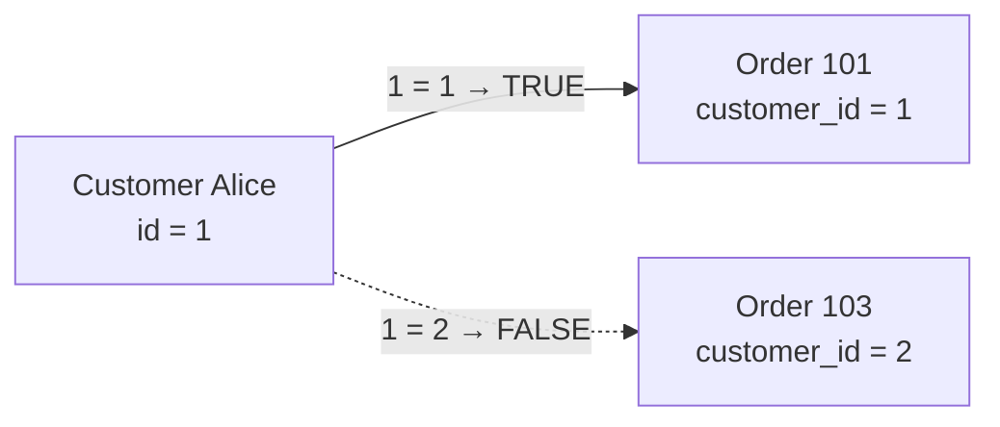

# 8. JOIN Conditions

The **join condition** is the rule that tells PostgreSQL:

> **Which row from table A should be matched with which row from table B?**

Most commonly, this is written inside `ON`.

```sql
SELECT ...
FROM table_a AS a
JOIN table_b AS b
    ON a.some_column = b.some_column;
```

The `ON` condition is one of the most important parts of understanding joins.

---

# 8.1 The Simplest Join Condition

Suppose we have:

### `customers`

| id | name    |
| -: | ------- |
|  1 | Alice   |
|  2 | Bob     |
|  3 | Charlie |

### `orders`

|  id | customer_id | amount |
| --: | ----------: | -----: |
| 101 |           1 |    100 |
| 102 |           1 |    200 |
| 103 |           2 |    300 |

The relationship is:

```text
customers.id
     ↑
     |
orders.customer_id
```

So:

```sql
SELECT
    c.name,
    o.id,
    o.amount
FROM customers AS c
JOIN orders AS o
    ON c.id = o.customer_id;
```

The condition is:

```sql
ON c.id = o.customer_id
```

Meaning:

> Match an order with the customer whose `id` equals the order's `customer_id`.

---

# 8.2 Think of `ON` as a Question

For every possible pair of rows, conceptually ask:

```text
Does this condition evaluate to TRUE?
```

For example:

```text
Alice.id = 1
Order 101.customer_id = 1

1 = 1
→ TRUE
→ Match
```

Then:

```text
Alice.id = 1
Order 103.customer_id = 2

1 = 2
→ FALSE
→ No match
```

Conceptually:



This is the core idea behind join conditions.

---

# 8.3 Equality Join

The most common type is an **equality join**.

```sql
ON a.id = b.a_id
```

Example:

```sql
SELECT *
FROM employees AS e
JOIN departments AS d
    ON e.department_id = d.id;
```

The condition:

```sql
e.department_id = d.id
```

is an equality condition.

These are often called:

> **Equi-joins**

---

# 8.4 Primary Key → Foreign Key

A very common pattern is:

```text
PRIMARY KEY
      ↑
      |
FOREIGN KEY
```

For example:

```text
customers
---------
id PK

orders
---------
id PK
customer_id FK
```

Join:

```sql
ON customers.id = orders.customer_id
```

This is usually the clearest kind of relational join because the database relationship directly explains the condition.

---

# 8.5 But JOIN Does Not Require a Foreign Key

This is important.

You can write:

```sql
SELECT *
FROM employees AS e
JOIN departments AS d
    ON e.department_code = d.code;
```

even if there is no declared foreign key.

A `JOIN` is a **query operation**.

A foreign key is a **data integrity constraint**.

They are related concepts, but they are not the same thing.

```text
JOIN
→ combines rows

FOREIGN KEY
→ constrains valid data
```

---

# 8.6 Joining on Multiple Conditions

Sometimes one condition isn't enough.

Suppose we have:

```text
student_enrollments
-------------------
student_id
course_id
semester
```

and:

```text
course_offerings
----------------
course_id
semester
teacher
```

A course might be offered in multiple semesters.

So this:

```sql
ON e.course_id = o.course_id
```

may not uniquely identify the correct row.

We need:

```sql
SELECT
    e.student_id,
    e.course_id,
    o.teacher
FROM student_enrollments AS e
JOIN course_offerings AS o
    ON e.course_id = o.course_id
   AND e.semester = o.semester;
```

Now both conditions must be true:

```text
course_id matches
AND
semester matches
```

---

# 8.7 Multiple Conditions Mean AND

Consider:

```sql
ON a.id = b.a_id
AND a.type = b.type
AND a.region = b.region
```

Conceptually:

```text
Condition 1 → TRUE
       AND
Condition 2 → TRUE
       AND
Condition 3 → TRUE
       ↓
     MATCH
```

If any condition is false:

```text
TRUE
AND
FALSE
AND
TRUE
=
FALSE
```

No match.

---

# 8.8 Composite Keys

This becomes especially important with **composite keys**.

Suppose:

```text
course_offerings
----------------
course_id
semester
PRIMARY KEY (course_id, semester)
```

The identity of a row is:

```text
(course_id, semester)
```

not just:

```text
course_id
```

Therefore, the join should normally use both:

```sql
ON e.course_id = o.course_id
AND e.semester = o.semester
```

Think:

```text
Composite key
     |
     +---- course_id
     |
     +---- semester
```

Both parts participate in the relationship.

---

# 8.9 Why a Missing Condition Can Be Dangerous

Suppose:

```text
customers
---------
1 Alice
2 Bob

orders
------
101 customer 1
102 customer 1
103 customer 2
```

Correct:

```sql
FROM customers AS c
JOIN orders AS o
    ON c.id = o.customer_id
```

Result:

```text
Alice → 101
Alice → 102
Bob   → 103
```

But imagine you accidentally join on:

```sql
ON c.id = o.id
```

Now you're comparing:

```text
customer.id
      ↕
order.id
```

instead of:

```text
customer.id
      ↕
order.customer_id
```

The query may still execute successfully.

That's the dangerous part.

SQL can be **syntactically correct but logically wrong**.

---

# 8.10 Joining on Non-Unique Columns

Consider:

### `employees`

| id | name    | department  |
| -: | ------- | ----------- |
|  1 | Alice   | Engineering |
|  2 | Bob     | Engineering |
|  3 | Charlie | Sales       |

### `department_info`

| department  | location  |
| ----------- | --------- |
| Engineering | Hyderabad |
| Sales       | Bangalore |

This works:

```sql
SELECT
    e.name,
    d.location
FROM employees AS e
JOIN department_info AS d
    ON e.department = d.department;
```

because `department_info.department` happens to be unique.

But imagine:

### `department_info`

| department  | location  |
| ----------- | --------- |
| Engineering | Hyderabad |
| Engineering | Bangalore |
| Sales       | Bangalore |

Now:

```text
Alice
  ↓
Engineering
  ↓
Hyderabad
Bangalore
```

Alice produces **two rows**.

That's not a SQL bug.

The join condition allowed two matches.

---

# 8.11 The Golden Cardinality Question

Whenever you write a join, ask:

> **For one row on the left, how many rows can match on the right?**

And then ask the reverse:

> **For one row on the right, how many rows can match on the left?**

For example:

```text
customers → orders
```

Typically:

```text
1 customer → many orders
1 order    → 1 customer
```

Therefore:

```text
customer × order
```

produces one result row per matching order.

---

# 8.12 One-to-One

Suppose:

```text
users
-----
id PK

user_profiles
-------------
user_id UNIQUE
```

Then:

```sql
ON u.id = p.user_id
```

might produce:

```text
1 user → 1 profile
1 profile → 1 user
```

So:

```text
1 × 1
```

relationship.

---

# 8.13 One-to-Many

The classic example:

```text
customer
   |
   | 1
   |
   | N
   ↓
orders
```

Join:

```sql
ON c.id = o.customer_id
```

One customer can produce multiple result rows:

```text
Alice → Order 101
Alice → Order 102
Alice → Order 103
```

This is why seeing the same customer multiple times in a join result is often **correct**.

---

# 8.14 Many-to-Many

Suppose:

```text
students
    |
    | N
    ↓
enrollments
    ↑
    | N
    |
courses
```

The bridge table:

```text
enrollments
-----------
student_id
course_id
```

allows:

```text
Student → many courses
Course  → many students
```

A query might be:

```sql
SELECT
    s.name,
    c.name AS course
FROM students AS s
JOIN enrollments AS e
    ON s.id = e.student_id
JOIN courses AS c
    ON e.course_id = c.id;
```

Here there are **two join conditions** connecting three tables.

---

# 8.15 Non-Equality Join Conditions

A join condition does not have to use `=`.

You can use:

```text
=
<>
<
>
<=
>=
```

For example:

```sql
SELECT
    e.name,
    r.level
FROM employees AS e
JOIN salary_ranges AS r
    ON e.salary >= r.min_salary
   AND e.salary < r.max_salary;
```

Suppose:

### `employees`

| name  | salary |
| ----- | -----: |
| Alice |  60000 |
| Bob   |  90000 |

### `salary_ranges`

| level  | min_salary | max_salary |
| ------ | ---------: | ---------: |
| Junior |          0 |      60000 |
| Mid    |      60000 |     100000 |
| Senior |     100000 |     200000 |

Alice:

```text
60000 >= 60000
AND
60000 < 100000

TRUE
```

So Alice is `Mid`.

This is called a **range join**.

---

# 8.16 Range Joins

Range joins are useful for:

```text
salary bands
tax brackets
price ranges
age groups
date validity periods
shipping zones
score classifications
```

Example:

```sql
SELECT
    o.id,
    r.shipping_zone
FROM orders AS o
JOIN shipping_rates AS r
    ON o.weight >= r.min_weight
   AND o.weight < r.max_weight;
```

The row is matched based on where its value falls within a range.

---

# 8.17 Date Range Join

A particularly useful real-world pattern:

```sql
SELECT
    o.id,
    p.price
FROM orders AS o
JOIN product_prices AS p
    ON o.product_id = p.product_id
   AND o.created_at >= p.valid_from
   AND o.created_at < p.valid_to;
```

This asks:

> Find the price record for this product that was valid when the order was created.

The join condition combines:

```text
same product
AND
order date is inside price validity period
```

---

# 8.18 Join Conditions Can Contain Expressions

You can also use expressions.

For example:

```sql
SELECT *
FROM users AS u
JOIN user_settings AS s
    ON LOWER(u.email) = LOWER(s.email);
```

Here the database compares:

```text
LOWER(u.email)
       =
LOWER(s.email)
```

rather than the raw column values.

Another example:

```sql
ON DATE(o.created_at) = d.calendar_date
```

---

# 8.19 Multiple Tables

With multiple joins, each `ON` normally describes the relationship introduced by that join.

```sql
SELECT
    c.name,
    o.id AS order_id,
    p.name AS product
FROM customers AS c
JOIN orders AS o
    ON c.id = o.customer_id
JOIN order_items AS oi
    ON o.id = oi.order_id
JOIN products AS p
    ON oi.product_id = p.id;
```

Think of it as:

```text
customers
    |
    | c.id = o.customer_id
    ↓
orders
    |
    | o.id = oi.order_id
    ↓
order_items
    |
    | oi.product_id = p.id
    ↓
products
```

Each condition explains one relationship.

---

# 8.20 A Join Condition Doesn't Have to Use Foreign Keys

For example:

```sql
SELECT *
FROM employees AS e
JOIN salary_ranges AS r
    ON e.salary >= r.min_salary
   AND e.salary < r.max_salary;
```

There is no:

```text
employee.salary → salary_ranges.min_salary
```

foreign key.

The join is based on a **business rule**, not a referential relationship.

This is why:

> **JOIN condition ≠ foreign key**

A join condition simply defines how rows should be related for that query.

---

# 8.21 `ON` Can Contain More Than the Key Relationship

Consider:

```sql
SELECT
    c.name,
    o.id,
    o.amount
FROM customers AS c
LEFT JOIN orders AS o
    ON c.id = o.customer_id
   AND o.amount > 100;
```

The condition contains two parts:

```text
customer relationship
        +
order filter
```

Conceptually:

```text
c.id = o.customer_id
        AND
o.amount > 100
```

So only orders above 100 are considered matching orders.

This becomes especially important with `LEFT JOIN`, because putting a condition in `ON` can preserve unmatched left rows.

We will study this much more deeply in the next concepts.

---

# 8.22 `ON` and `WHERE` Are Not Always Interchangeable

For an `INNER JOIN`, you can often see:

```sql
FROM customers AS c
JOIN orders AS o
    ON c.id = o.customer_id
WHERE o.amount > 100;
```

and:

```sql
FROM customers AS c
JOIN orders AS o
    ON c.id = o.customer_id
   AND o.amount > 100;
```

produce the same rows.

But don't conclude:

> "`ON` and `WHERE` are always interchangeable."

They are **not**, especially with `LEFT`, `RIGHT`, and `FULL OUTER JOIN`.

We'll dedicate an entire concept to this:

> **ON vs WHERE**

---

# 8.23 A Powerful Debugging Technique

When a join produces unexpected duplicates, don't immediately use:

```sql
DISTINCT
```

First investigate the join condition.

Suppose you expected:

```text
100 rows
```

but got:

```text
10,000 rows
```

Ask:

```text
1. Is the join condition correct?
2. Is the right-side column unique?
3. Can one left row match many right rows?
4. Did I accidentally create a many-to-many relationship?
5. Did I forget part of a composite key?
6. Did I join on the wrong column?
```

`DISTINCT` might hide the symptom without fixing the underlying relationship.

---

# 8.24 Example: Missing Part of a Composite Key

Suppose the real key is:

```text
(product_id, warehouse_id)
```

You incorrectly join using only:

```sql
ON a.product_id = b.product_id
```

Imagine:

```text
Warehouse A → Product 10
Warehouse B → Product 10
Warehouse C → Product 10
```

A single product row can now match three rows.

If the intended relationship was:

```sql
ON a.product_id = b.product_id
AND a.warehouse_id = b.warehouse_id
```

you've just prevented those unintended matches.

This is one of the most common sources of accidental row multiplication.

---

# 8.25 A Practical Join-Condition Checklist

Before writing a join, ask:

### 1. What represents the relationship?

```text
customer.id
        ↓
order.customer_id
```

### 2. Is the relationship one-to-one or one-to-many?

```text
1 → 1
1 → N
N → N
```

### 3. Is the joining column unique?

If not, multiple matches may be expected.

### 4. Is the key composite?

If yes, include all required columns.

```sql
ON a.x = b.x
AND a.y = b.y
```

### 5. Could this be a range relationship?

Maybe you need:

```sql
>=
<
```

instead of:

```sql
=
```

### 6. Am I joining on the correct columns?

A query can execute successfully while being logically wrong.

---

# 8.26 The Core Mental Model

When you write:

```sql
A
JOIN
B
ON condition
```

think:

```text
           Candidate row pairs
                  │
                  ▼
          Evaluate ON condition
                  │
          ┌───────┴───────┐
          │               │
        TRUE            FALSE
          │               │
        MATCH          NO MATCH
```

For an `INNER JOIN`, only the `TRUE` matches survive.

For an outer join, unmatched rows may also survive depending on which side is preserved.

---

# 8.27 Summary

The join condition answers:

> **"Under what rule should these rows be considered related?"**

Common forms:

### Equality

```sql
ON a.id = b.a_id
```

### Multiple conditions

```sql
ON a.x = b.x
AND a.y = b.y
```

### Range

```sql
ON a.value >= b.min_value
AND a.value < b.max_value
```

### Expression

```sql
ON LOWER(a.email) = LOWER(b.email)
```

### Business rule

```sql
ON a.date >= b.valid_from
AND a.date < b.valid_to
```

The most important lesson:

> **A join condition determines which row combinations are considered matches.**

And the question you should always ask is:

> **For one row on this side, how many rows can satisfy my `ON` condition on the other side?**

That question will help you predict **join cardinality, duplicates, and accidental row explosion**.

---

## Next

**9. ON vs WHERE**

We'll focus specifically on the difference between:

```sql
JOIN ... ON ...
```

and:

```sql
WHERE ...
```

especially why this seemingly small change can produce **different results with `LEFT JOIN`**, which is one of the most important SQL join concepts to understand.

