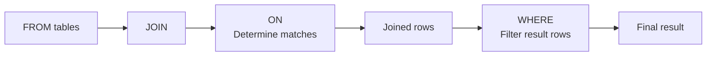

# 9. `ON` vs `WHERE`

This is one of the **most important concepts in SQL joins**.

At first glance, these can look almost identical:

```sql
JOIN orders AS o
    ON c.id = o.customer_id
```

and:

```sql
WHERE o.amount > 100
```

But they have **different jobs**.

The key distinction is:

> **`ON` determines which rows match during the join.**
>
> **`WHERE` filters rows after the join result is formed.**

This distinction becomes especially important with `LEFT JOIN`, `RIGHT JOIN`, and `FULL OUTER JOIN`.

---

# 9.1 Start With a Simple Example

Suppose we have:

### `customers`

| id | name    |
| -: | ------- |
|  1 | Alice   |
|  2 | Bob     |
|  3 | Charlie |

### `orders`

|  id | customer_id | amount |
| --: | ----------: | -----: |
| 101 |           1 |     50 |
| 102 |           1 |    200 |
| 103 |           2 |    300 |

Charlie has no orders.

---

# 9.2 Normal `LEFT JOIN`

```sql id="a5e0r4"
SELECT
    c.name,
    o.id,
    o.amount
FROM customers AS c
LEFT JOIN orders AS o
    ON c.id = o.customer_id;
```

Result:

| name    | order_id | amount |
| ------- | -------: | -----: |
| Alice   |      101 |     50 |
| Alice   |      102 |    200 |
| Bob     |      103 |    300 |
| Charlie |     NULL |   NULL |

The `ON` condition is:

```sql id="w4myqd"
c.id = o.customer_id
```

It determines which orders belong to each customer.

---

# 9.3 Add a Condition to `WHERE`

Now suppose we only want orders above 100:

```sql id="6l9v9m"
SELECT
    c.name,
    o.id,
    o.amount
FROM customers AS c
LEFT JOIN orders AS o
    ON c.id = o.customer_id
WHERE o.amount > 100;
```

Result:

| name  | order_id | amount |
| ----- | -------: | -----: |
| Alice |      102 |    200 |
| Bob   |      103 |    300 |

Notice:

```text
Charlie disappeared.
```

Why?

Because Charlie's joined row is:

```text id="q6k5vl"
Charlie | NULL | NULL
```

Then:

```text id="e0ud5b"
NULL > 100
```

doesn't evaluate to `TRUE`.

It evaluates to `UNKNOWN`.

And `WHERE` keeps only rows where the condition is `TRUE`.

---

# 9.4 Move the Condition Into `ON`

Now compare:

```sql id="02zv3s"
SELECT
    c.name,
    o.id,
    o.amount
FROM customers AS c
LEFT JOIN orders AS o
    ON c.id = o.customer_id
   AND o.amount > 100;
```

Result:

| name    | order_id | amount |
| ------- | -------: | -----: |
| Alice   |      102 |    200 |
| Bob     |      103 |    300 |
| Charlie |     NULL |   NULL |

Now Charlie remains.

Why?

Because:

```text id="v3f6th"
ON
↓
decides which orders match

LEFT JOIN
↓
preserves every customer

WHERE
↓
not being used to remove Charlie
```

This is the central concept.

---

# 9.5 Visual Comparison

## Condition in `WHERE`

```text
customers
    │
    │ LEFT JOIN
    ▼
all joined rows
    │
    │ WHERE amount > 100
    ▼
filtered result
```

```text
Alice   → 50   → REMOVE
Alice   → 200  → KEEP
Bob     → 300  → KEEP
Charlie → NULL → REMOVE
```

---

## Condition in `ON`

```text
customers
    │
    │ LEFT JOIN
    │
    │ ON customer_id
    │ AND amount > 100
    ▼
joined result
```

```text
Alice   → 50   → not a match
Alice   → 200  → match
Bob     → 300  → match
Charlie → no match
```

Because it's a `LEFT JOIN`, the unmatched customers are still preserved:

```text
Charlie → NULL
```

---

# 9.6 The Most Important Mental Model

Think of:

```sql id="qkm3g6"
ON
```

as:

> **Should these two rows be considered a match?**

Think of:

```sql id="hz4a9d"
WHERE
```

as:

> **Should this resulting row remain in the final output?**

That's the distinction you should remember.

---

# 9.7 `INNER JOIN`: Often Looks Equivalent

With an `INNER JOIN`, these two queries often produce the same result.

### Version 1

```sql id="8wzjzr"
SELECT
    c.name,
    o.amount
FROM customers AS c
INNER JOIN orders AS o
    ON c.id = o.customer_id
WHERE o.amount > 100;
```

### Version 2

```sql id="k4v1kh"
SELECT
    c.name,
    o.amount
FROM customers AS c
INNER JOIN orders AS o
    ON c.id = o.customer_id
   AND o.amount > 100;
```

Both produce:

| name  | amount |
| ----- | -----: |
| Alice |    200 |
| Bob   |    300 |

Why?

Because `INNER JOIN` already removes rows that don't match.

So the distinction can be less visible.

But with outer joins, it becomes critical.

---

# 9.8 Why `LEFT JOIN` Changes Everything

Remember:

```text id="svwzib"
LEFT JOIN
```

means:

> Keep every row from the left table.

But then:

```sql id="d3ag8j"
WHERE right_table.some_column = ...
```

can remove those rows again.

So this pattern:

```sql id="5e8gib"
LEFT JOIN
    ...
WHERE right_table.column = ...
```

can effectively behave like an `INNER JOIN` for that condition.

---

# 9.9 Example: Customers With Expensive Orders

Suppose the requirement is:

> Show **only customers who have an order above $100**.

Then this is appropriate:

```sql id="a7v6f4"
SELECT
    c.name,
    o.amount
FROM customers AS c
LEFT JOIN orders AS o
    ON c.id = o.customer_id
WHERE o.amount > 100;
```

You could also simply use:

```sql id="x2ajy1"
SELECT
    c.name,
    o.amount
FROM customers AS c
INNER JOIN orders AS o
    ON c.id = o.customer_id
WHERE o.amount > 100;
```

If you don't need customers without qualifying orders, `INNER JOIN` expresses the intent more directly.

---

# 9.10 Different Requirement: All Customers + Expensive Orders

Now suppose the requirement is:

> Show **every customer**, but only attach orders above $100.

That's different.

Use:

```sql id="nhs6a1"
SELECT
    c.name,
    o.id,
    o.amount
FROM customers AS c
LEFT JOIN orders AS o
    ON c.id = o.customer_id
   AND o.amount > 100;
```

Result:

| customer | order | amount |
| -------- | ----: | -----: |
| Alice    |   102 |    200 |
| Bob      |   103 |    300 |
| Charlie  |  NULL |   NULL |

Now we're preserving the customer population.

---

# 9.11 Think About the Requirement

This is a very useful technique.

### Requirement A

> "Give me customers **who have** expensive orders."

Think:

```text
Need only matching customers
```

Potentially:

```sql
INNER JOIN
```

---

### Requirement B

> "Give me **all customers**, and attach expensive orders if they have any."

Think:

```text
Preserve customers
```

Use:

```sql
LEFT JOIN
```

with the order condition in:

```sql
ON
```

---

# 9.12 A Common Real-World Bug

Suppose you're building a customer report.

You write:

```sql id="3kyv5f"
SELECT
    c.id,
    c.name,
    o.amount
FROM customers AS c
LEFT JOIN orders AS o
    ON c.id = o.customer_id
WHERE o.status = 'COMPLETED';
```

You may think:

> "I'm using LEFT JOIN, so every customer will appear."

Not necessarily.

The `WHERE` condition:

```sql id="gyxj7d"
o.status = 'COMPLETED'
```

removes customers whose joined `o.status` is `NULL`.

So customers without orders disappear.

---

# 9.13 Correct Version for "All Customers"

If the requirement is:

> Show every customer, but only completed orders.

Use:

```sql id="f8c1ae"
SELECT
    c.id,
    c.name,
    o.amount
FROM customers AS c
LEFT JOIN orders AS o
    ON c.id = o.customer_id
   AND o.status = 'COMPLETED';
```

Now:

```text
Customer
   │
   ├── completed order → attach it
   │
   ├── pending order   → don't attach
   │
   └── no order        → NULL
```

The customer remains in all cases.

---

# 9.14 Another Way to Think About It

Imagine the join as a **matching gate**.

```text id="m1k9w8"
LEFT TABLE             RIGHT TABLE

Alice ---------------- Order 101
   \------------------- Order 102

Bob ------------------ Order 103

Charlie                no order
```

`ON` controls which connections are allowed.

```text id="5w4t5d"
ON c.id = o.customer_id
AND o.status = 'COMPLETED'
```

Then the `LEFT JOIN` says:

> Even if no connection exists, keep the left row.

So:

```text id="3y4xj7"
Charlie → NULL
```

survives.

---

# 9.15 `WHERE` Is a Final Filter

Conceptually:

```text id="a2p8mk"
FROM
  ↓
JOIN
  ↓
ON
  ↓
WHERE
  ↓
SELECT
```

A simplified logical model is:



This is a **logical processing model**, not a claim about the exact physical execution order PostgreSQL uses internally.

The optimizer can transform the actual execution plan.

---

# 9.16 `ON` Is Not Simply "Executed Before WHERE"

For learning, it's useful to think:

```text
ON → creates matching relationships
WHERE → filters resulting rows
```

But don't interpret this as:

> PostgreSQL must physically execute `ON` first and then `WHERE`.

The optimizer is free to rearrange operations when the result remains equivalent.

The important distinction is **semantic**, not necessarily physical.

---

# 9.17 `WHERE` With the Left Table

Consider:

```sql id="8gvp0t"
SELECT
    c.name,
    o.amount
FROM customers AS c
LEFT JOIN orders AS o
    ON c.id = o.customer_id
WHERE c.name <> 'Charlie';
```

Here the `WHERE` condition is on the **left table**.

That's different.

It removes Charlie because we explicitly asked to remove Charlie.

The fact that the join is a `LEFT JOIN` doesn't protect rows from a later `WHERE` condition.

Think:

```text id="2r8xgi"
LEFT JOIN
→ preserves left rows during the join

WHERE
→ can subsequently filter any resulting rows
```

---

# 9.18 `ON` Can Also Reference Both Tables

For example:

```sql id="1g4jcm"
ON c.id = o.customer_id
AND c.region = o.region
```

The condition compares both sides.

You can also have conditions involving only one side:

```sql id="kzj1c5"
ON c.id = o.customer_id
AND o.amount > 100
```

or:

```sql id="3u5b6p"
ON c.id = o.customer_id
AND c.active = true
```

The meaning depends on the desired relationship.

---

# 9.19 A Subtle Example

Suppose:

```text
customers
---------
Alice
Bob
Charlie
```

Orders:

```text
Alice   → 50
Alice   → 200
Bob     → 300
```

Query:

```sql id="x8m5tm"
SELECT
    c.name,
    o.amount
FROM customers AS c
LEFT JOIN orders AS o
    ON c.id = o.customer_id
   AND o.amount > 100
WHERE c.name <> 'Bob';
```

First, the join considers:

```text
Alice   → 200
Bob     → 300
Charlie → NULL
```

Then `WHERE` removes Bob:

```text
Alice   → 200
Charlie → NULL
```

This demonstrates that the two clauses can perform **different filtering jobs**.

---

# 9.20 `WHERE` and NULL

This is especially important with outer joins.

Consider:

```sql id="0zq5y4"
WHERE o.amount > 100
```

If:

```text id="v4k3n9"
o.amount = NULL
```

then:

```text id="k8d4lh"
NULL > 100
```

is:

```text
UNKNOWN
```

not:

```text
FALSE
```

And `WHERE` keeps only `TRUE`.

Therefore the row disappears.

---

# 9.21 Three-Valued Logic

SQL has:

```text id="7k8t1p"
TRUE
FALSE
UNKNOWN
```

For example:

```text id="j4rc9y"
100 > 50
→ TRUE

100 > 200
→ FALSE

NULL > 100
→ UNKNOWN
```

`WHERE` behaves roughly like:

```text id="y0q5ma"
TRUE     → keep
FALSE    → remove
UNKNOWN  → remove
```

This is why `NULL` is so important when reasoning about `LEFT JOIN`.

---

# 9.22 `ON` vs `WHERE`: The Core Comparison

| Question                          | `ON`            | `WHERE`                       |
| --------------------------------- | --------------- | ----------------------------- |
| Main purpose                      | Define matching | Filter result                 |
| Used with JOIN                    | Yes             | After joined result           |
| Determines relationship           | Yes             | No                            |
| Can reference both tables         | Yes             | Yes                           |
| Important with outer joins        | **Very**        | **Very**                      |
| Can remove unmatched left rows?   | Depends on join | Yes                           |
| Can preserve unmatched left rows? | `LEFT JOIN` can | No, if condition rejects them |

---

# 9.23 The Rule to Memorize

For joins:

```text id="i7r6g5"
ON
↓
"Should these rows match?"

WHERE
↓
"Should this resulting row remain?"
```

This simple distinction solves a huge number of SQL join problems.

---

# 9.24 A Very Practical Decision Rule

When you have a `LEFT JOIN`, ask:

### "Does this condition define which right-side rows should be attached?"

Put it in:

```sql id="d7fq78"
ON
```

Example:

```sql id="v99y5x"
ON c.id = o.customer_id
AND o.status = 'COMPLETED'
```

---

### "Does this condition decide which final rows I want?"

Put it in:

```sql id="r4yb5y"
WHERE
```

Example:

```sql id="c4ctn0"
WHERE c.region = 'APAC'
```

---

# 9.25 A Classic Interview Question

### What is the difference?

```sql
SELECT *
FROM A
LEFT JOIN B
    ON A.id = B.a_id
   AND B.status = 'ACTIVE';
```

versus:

```sql
SELECT *
FROM A
LEFT JOIN B
    ON A.id = B.a_id
WHERE B.status = 'ACTIVE';
```

### First query

```text
All A rows
+
only ACTIVE B rows
```

Unmatched A rows remain.

### Second query

```text
Join A and B
+
keep only rows where B.status = ACTIVE
```

A rows with no matching B row are generally removed because:

```text
B.status = NULL
```

and:

```text
NULL = 'ACTIVE'
→ UNKNOWN
```

So the second query can effectively turn the outer join into an inner-style result for that condition.

---

# 9.26 Don't Memorize "Always Put Filters in ON"

That would be the wrong lesson.

The correct lesson is:

> **Put a condition where its semantics belong.**

If you want to filter the final result:

```sql
WHERE
```

If you want to control which rows participate in the match:

```sql
ON
```

Neither clause is universally "better."

---

# 9.27 Summary

The difference is fundamentally about **meaning**:

```text id="1s0e90"
              JOIN
                │
                ▼
          ┌─────────────┐
          │     ON      │
          │             │
          │ Which rows  │
          │   match?    │
          └──────┬──────┘
                 │
                 ▼
           Joined result
                 │
                 ▼
          ┌─────────────┐
          │   WHERE     │
          │             │
          │ Which final │
          │ rows remain?│
          └─────────────┘
```

The most important example to remember:

```sql id="6t4qzn"
-- All customers, only expensive orders attached
SELECT
    c.name,
    o.amount
FROM customers AS c
LEFT JOIN orders AS o
    ON c.id = o.customer_id
   AND o.amount > 100;
```

versus:

```sql id="y7m17p"
-- Only customers having an expensive order
SELECT
    c.name,
    o.amount
FROM customers AS c
LEFT JOIN orders AS o
    ON c.id = o.customer_id
WHERE o.amount > 100;
```

Same tables.

Similar-looking condition.

**Different meaning.**

> `ON` controls **matching**.
> `WHERE` controls **final filtering**.

---

## Next

**10. Multiple Joins**

We'll build queries involving **3, 4, and more tables**, and learn how PostgreSQL follows the chain:

```text
customers
    ↓
orders
    ↓
order_items
    ↓
products
```

including how each `ON` condition works, how rows multiply across multiple joins, and how to avoid accidentally producing incorrect results.

