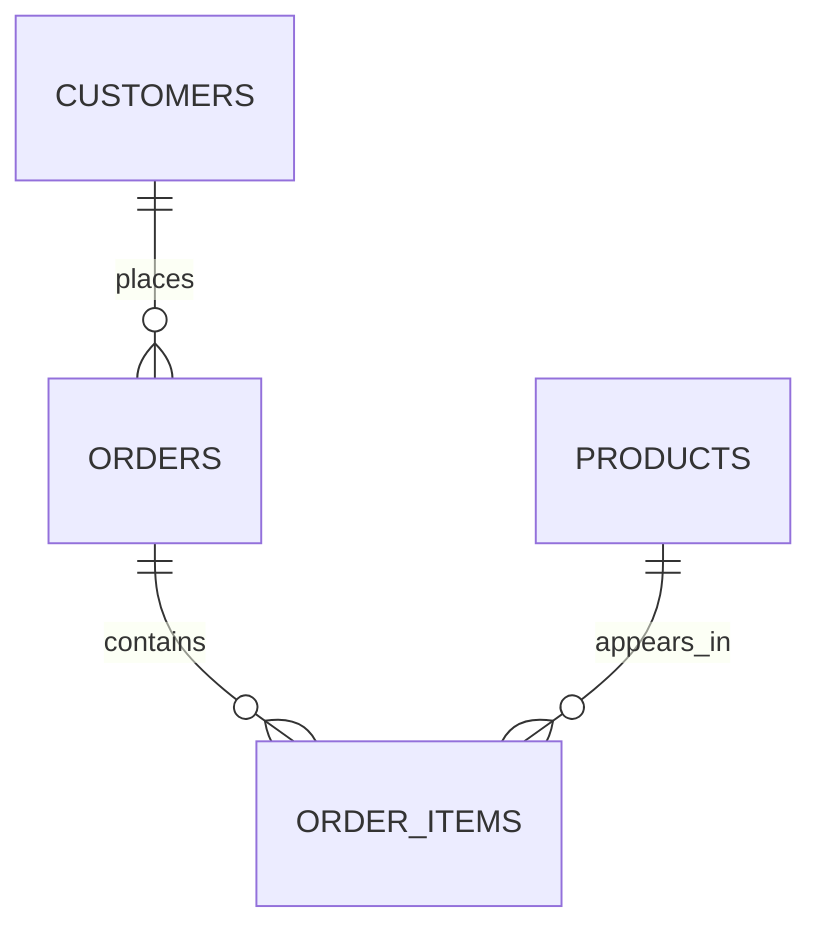

# 10. Multiple Joins

In real applications, you rarely join only two tables.

A typical query might need information spread across:

```text
customers
    ↓
orders
    ↓
order_items
    ↓
products
```

This is where **multiple joins** become important.

The key idea is:

> **You can keep adding joins, with each `ON` condition describing how the newly joined table relates to the existing result.**

---

# 10.1 A Realistic Schema

Let's use an ecommerce example.

### `customers`

| id | name  |
| -: | ----- |
|  1 | Alice |
|  2 | Bob   |

### `orders`

|  id | customer_id | order_date |
| --: | ----------: | ---------- |
| 101 |           1 | 2026-10-01 |
| 102 |           1 | 2026-10-02 |
| 103 |           2 | 2026-10-03 |

### `order_items`

| id | order_id | product_id | quantity |
| -: | -------: | ---------: | -------: |
|  1 |      101 |         10 |        2 |
|  2 |      101 |         20 |        1 |
|  3 |      102 |         20 |        3 |
|  4 |      103 |         30 |        1 |

### `products`

| id | name     | price |
| -: | -------- | ----: |
| 10 | Laptop   |  1000 |
| 20 | Mouse    |    50 |
| 30 | Keyboard |   100 |

---

# 10.2 The Relationships

The schema forms a chain:



Or mentally:

```text
customers
    │
    │ customer_id
    ▼
orders
    │
    │ order_id
    ▼
order_items
    │
    │ product_id
    ▼
products
```

There are **three relationships** to connect.

---

# 10.3 Joining Two Tables First

Start with:

```sql
SELECT
    c.name,
    o.id AS order_id
FROM customers AS c
JOIN orders AS o
    ON c.id = o.customer_id;
```

Result:

| name  | order_id |
| ----- | -------: |
| Alice |      101 |
| Alice |      102 |
| Bob   |      103 |

Now we want the items in those orders.

---

# 10.4 Add the Third Table

```sql
SELECT
    c.name,
    o.id AS order_id,
    oi.product_id,
    oi.quantity
FROM customers AS c
JOIN orders AS o
    ON c.id = o.customer_id
JOIN order_items AS oi
    ON o.id = oi.order_id;
```

Result:

| name  | order_id | product_id | quantity |
| ----- | -------: | ---------: | -------: |
| Alice |      101 |         10 |        2 |
| Alice |      101 |         20 |        1 |
| Alice |      102 |         20 |        3 |
| Bob   |      103 |         30 |        1 |

Now add `products`.

---

# 10.5 Four-Table Join

```sql
SELECT
    c.name AS customer,
    o.id AS order_id,
    p.name AS product,
    oi.quantity,
    p.price
FROM customers AS c
JOIN orders AS o
    ON c.id = o.customer_id
JOIN order_items AS oi
    ON o.id = oi.order_id
JOIN products AS p
    ON oi.product_id = p.id;
```

Result:

| customer | order_id | product  | quantity | price |
| -------- | -------: | -------- | -------: | ----: |
| Alice    |      101 | Laptop   |        2 |  1000 |
| Alice    |      101 | Mouse    |        1 |    50 |
| Alice    |      102 | Mouse    |        3 |    50 |
| Bob      |      103 | Keyboard |        1 |   100 |

This is a very common real-world query pattern.

---

# 10.6 Notice the Three `ON` Conditions

Each relationship gets its own condition:

```sql
ON c.id = o.customer_id
```

then:

```sql
ON o.id = oi.order_id
```

then:

```sql
ON oi.product_id = p.id
```

Visually:

```text
customers
    │
    │ c.id = o.customer_id
    ▼
orders
    │
    │ o.id = oi.order_id
    ▼
order_items
    │
    │ oi.product_id = p.id
    ▼
products
```

Each `ON` answers:

> **How does this table connect to what I already have?**

---

# 10.7 Don't Think of It as "One Giant Join"

A useful mental model is to build the query incrementally.

Start:

```text
customers
```

Then:

```text
customers + orders
```

Then:

```text
customers + orders + order_items
```

Then:

```text
customers + orders + order_items + products
```

This makes debugging much easier.

---

# 10.8 Add One Join at a Time

When building a complex query, start with:

```sql
SELECT ...
FROM customers AS c;
```

Then:

```sql
SELECT ...
FROM customers AS c
JOIN orders AS o
    ON c.id = o.customer_id;
```

Then:

```sql
SELECT ...
FROM customers AS c
JOIN orders AS o
    ON c.id = o.customer_id
JOIN order_items AS oi
    ON o.id = oi.order_id;
```

Then:

```sql
SELECT ...
FROM customers AS c
JOIN orders AS o
    ON c.id = o.customer_id
JOIN order_items AS oi
    ON o.id = oi.order_id
JOIN products AS p
    ON oi.product_id = p.id;
```

This approach makes it much easier to discover where an unexpected row appears or disappears.

---

# 10.9 Every Additional Join Can Change Cardinality

This is extremely important.

Suppose:

```text
1 customer
   ↓
3 orders
   ↓
2 items per order
```

The final result might contain:

```text
1 × 3 × 2
= 6 rows
```

Not because PostgreSQL is duplicating data incorrectly.

The rows represent different combinations.

For example:

```text
Alice
 ├── Order 101
 │    ├── Laptop
 │    └── Mouse
 │
 ├── Order 102
 │    ├── Keyboard
 │    └── Mouse
 │
 └── Order 103
      ├── Monitor
      └── Keyboard
```

The customer name appears repeatedly because the result is at the **order-item level**.

---

# 10.10 Ask: "What Does One Result Row Represent?"

This is one of the best techniques for complex SQL.

For our query:

```sql
SELECT
    c.name,
    o.id,
    p.name,
    oi.quantity
...
```

one result row represents:

> **One product line inside one order belonging to one customer.**

So the grain is:

```text
Customer + Order + Order Item + Product
```

Not:

```text
Customer
```

This explains why Alice appears multiple times.

---

# 10.11 The Concept of "Grain"

The **grain** of a query means:

> **What does one row in my result represent?**

Examples:

```text
Customer-level
→ one row per customer

Order-level
→ one row per order

Order-item-level
→ one row per order item

Customer-product-level
→ one row per customer/product combination
```

Before writing a complicated query, identify the desired grain.

---

# 10.12 A Common Mistake

Suppose you want:

> One row per customer with their total spending.

You write:

```sql
SELECT
    c.id,
    c.name,
    o.id,
    p.name,
    oi.quantity,
    p.price
FROM customers AS c
JOIN orders AS o
    ON c.id = o.customer_id
JOIN order_items AS oi
    ON o.id = oi.order_id
JOIN products AS p
    ON oi.product_id = p.id;
```

This is not one row per customer.

It's one row per order item.

If you want customer-level results, you'll eventually need aggregation:

```text
order items
    ↓
GROUP BY customer
    ↓
one row per customer
```

We'll study this in detail in the aggregation section.

---

# 10.13 INNER JOIN Chains

If you write:

```sql
FROM customers AS c
JOIN orders AS o
    ON c.id = o.customer_id
JOIN order_items AS oi
    ON o.id = oi.order_id
JOIN products AS p
    ON oi.product_id = p.id
```

all these are `INNER JOIN`s.

Therefore:

> A customer must have a matching order, that order must have a matching order item, and that item must have a matching product for the final row to exist.

This creates a chain of requirements.

```text
Customer
   │
   ├── no order?
   │      ↓
   │    disappears
   │
   └── order
          │
          ├── no item?
          │      ↓
          │    disappears
          │
          └── item
                 │
                 ├── no product?
                 │      ↓
                 │    disappears
                 │
                 └── product
```

---

# 10.14 One Missing Link Can Remove the Row

Suppose an order exists:

```text
Order 104
```

but has no `order_items`.

With:

```sql
JOIN order_items AS oi
```

that order won't appear in the final result.

This is a common reason why a complex query unexpectedly returns fewer rows than expected.

---

# 10.15 Mixing `INNER JOIN` and `LEFT JOIN`

Now consider:

```sql
SELECT
    c.name,
    o.id AS order_id,
    oi.id AS item_id
FROM customers AS c
LEFT JOIN orders AS o
    ON c.id = o.customer_id
LEFT JOIN order_items AS oi
    ON o.id = oi.order_id;
```

This means:

```text
Keep every customer
    ↓
Attach orders if they exist
    ↓
Attach order items if they exist
```

So a customer with no orders can still appear.

---

# 10.16 Example

Suppose:

```text
customers
---------
Alice
Bob
Charlie
```

Orders:

```text
Alice → Order 101
Bob   → Order 102
```

Order items:

```text
Order 101 → Laptop
```

Order 102 has no items.

With:

```sql
LEFT JOIN orders
LEFT JOIN order_items
```

you could get:

```text
Alice   101   Laptop
Bob     102   NULL
Charlie NULL  NULL
```

Each `LEFT JOIN` preserves the rows produced by the previous stage.

---

# 10.17 Important: Join Order and Join Type Matter

Consider:

```sql
FROM customers AS c
LEFT JOIN orders AS o
    ON c.id = o.customer_id
JOIN order_items AS oi
    ON o.id = oi.order_id
```

This is different from:

```sql
FROM customers AS c
LEFT JOIN orders AS o
    ON c.id = o.customer_id
LEFT JOIN order_items AS oi
    ON o.id = oi.order_id
```

The second version preserves customers without orders/items.

The first has an `INNER JOIN` after the `LEFT JOIN`, which can remove rows where `o.id` is `NULL`.

So when chaining joins:

> **Don't look at each JOIN independently. Consider how the entire chain affects row preservation.**

---

# 10.18 A Useful Diagram

For:

```sql
customers
LEFT JOIN orders
LEFT JOIN order_items
```

think:

```text
CUSTOMERS
   │
   │ LEFT JOIN
   ▼
CUSTOMERS + ORDERS
   │
   │ LEFT JOIN
   ▼
CUSTOMERS + ORDERS + ITEMS
```

The result of one join becomes the input to the next logical stage.

---

# 10.19 Can We Skip a Table?

Sometimes you might think:

```text
customers → products
```

But the database schema may actually require:

```text
customers
   ↓
orders
   ↓
order_items
   ↓
products
```

You cannot magically connect:

```sql
ON c.id = p.id
```

unless such a relationship actually exists.

The intermediate tables often carry the relationship information.

---

# 10.20 Many-to-Many Chains

Consider:

```text
students
    ↓
enrollments
    ↓
courses
```

A student can take many courses.

A course can have many students.

Query:

```sql
SELECT
    s.name AS student,
    c.name AS course
FROM students AS s
JOIN enrollments AS e
    ON s.id = e.student_id
JOIN courses AS c
    ON e.course_id = c.id;
```

The bridge table:

```text
enrollments
```

connects the two sides.

---

# 10.21 Another Real-World Chain

Consider an organization's structure:

```text
companies
    ↓
departments
    ↓
employees
    ↓
projects
    ↓
project_assignments
```

A report might need:

```sql
SELECT
    company.name,
    department.name,
    employee.name,
    project.name
FROM companies AS company
JOIN departments AS department
    ON department.company_id = company.id
JOIN employees AS employee
    ON employee.department_id = department.id
JOIN project_assignments AS assignment
    ON assignment.employee_id = employee.id
JOIN projects AS project
    ON project.id = assignment.project_id;
```

That's five tables.

The same principles still apply.

---

# 10.22 Multiple Joins Don't Mean Multiple Independent Queries

This:

```sql
FROM A
JOIN B ...
JOIN C ...
JOIN D ...
```

is one query.

Conceptually, you are constructing a larger relational result.

```text
A
+
B
+
C
+
D
```

But each relationship must be correctly defined.

---

# 10.23 The Danger of an Incorrect Join

Suppose:

```sql
FROM customers AS c
JOIN orders AS o
    ON c.id = o.customer_id
JOIN products AS p
    ON c.id = p.id;
```

The second relationship is probably suspicious.

Why?

You are saying:

```text
customer.id = product.id
```

That may happen to match some rows by coincidence, but it doesn't represent the ecommerce relationship.

The correct relationship is through:

```text
order_items
```

```text
orders
   ↓
order_items
   ↓
products
```

This is why understanding the schema is essential before writing multi-table joins.

---

# 10.24 A Reliable Method for Building Multiple Joins

When you need many tables, follow this process.

### Step 1: Identify the desired result grain

Example:

```text
One row per order item
```

### Step 2: Identify the tables needed

```text
customers
orders
order_items
products
```

### Step 3: Draw the relationships

```text
customers
    ↓
orders
    ↓
order_items
    ↓
products
```

### Step 4: Add one join at a time

```sql
FROM customers AS c
JOIN orders AS o
    ON c.id = o.customer_id
```

Then:

```sql
JOIN order_items AS oi
    ON o.id = oi.order_id
```

Then:

```sql
JOIN products AS p
    ON oi.product_id = p.id
```

### Step 5: Check the row count after each join

This is extremely useful when debugging.

---

# 10.25 A Powerful Debugging Technique

Suppose your query unexpectedly returns 50,000 rows.

Don't immediately inspect the entire query.

Run:

```sql
SELECT COUNT(*)
FROM customers AS c;
```

Then:

```sql
SELECT COUNT(*)
FROM customers AS c
JOIN orders AS o
    ON c.id = o.customer_id;
```

Then:

```sql
SELECT COUNT(*)
FROM customers AS c
JOIN orders AS o
    ON c.id = o.customer_id
JOIN order_items AS oi
    ON o.id = oi.order_id;
```

Then:

```sql
SELECT COUNT(*)
FROM customers AS c
JOIN orders AS o
    ON c.id = o.customer_id
JOIN order_items AS oi
    ON o.id = oi.order_id
JOIN products AS p
    ON oi.product_id = p.id;
```

You'll see where the unexpected multiplication happens.

---

# 10.26 Why `SELECT *` Can Be Misleading

With multiple joins:

```sql
SELECT *
```

can produce a huge number of columns:

```text
customer columns
+
order columns
+
order_item columns
+
product columns
```

Instead, explicitly select what you need:

```sql
SELECT
    c.name,
    o.id AS order_id,
    p.name AS product_name,
    oi.quantity
```

This makes the result much easier to understand.

---

# 10.27 Alias Every Table

For multi-table queries, aliases make SQL much easier to read.

Prefer:

```sql
FROM customers AS c
JOIN orders AS o
    ON c.id = o.customer_id
JOIN order_items AS oi
    ON o.id = oi.order_id
JOIN products AS p
    ON oi.product_id = p.id
```

instead of repeatedly writing:

```sql
customers.id
orders.customer_id
order_items.order_id
products.id
```

The aliases also make relationships visually obvious:

```text
c.id = o.customer_id
o.id = oi.order_id
oi.product_id = p.id
```

---

# 10.28 Don't Reuse Ambiguous Aliases

Avoid things like:

```sql
customers AS a
orders AS b
order_items AS c
products AS d
```

It works, but isn't very descriptive.

Prefer:

```text
c  = customers
o  = orders
oi = order_items
p  = products
```

The alias itself communicates the table's role.

---

# 10.29 Multiple Joins and `WHERE`

You can still filter the final result:

```sql
SELECT
    c.name,
    o.id AS order_id,
    p.name AS product
FROM customers AS c
JOIN orders AS o
    ON c.id = o.customer_id
JOIN order_items AS oi
    ON o.id = oi.order_id
JOIN products AS p
    ON oi.product_id = p.id
WHERE p.price > 100;
```

Here:

```text
ON
→ establishes relationships

WHERE
→ filters the resulting rows
```

The same `ON` vs `WHERE` principles still apply.

---

# 10.30 The Most Important Question

When working with multiple joins, don't just ask:

> "Does this SQL syntax look correct?"

Ask:

> **"What does one row of my final result represent?"**

For example:

```text
customers + orders
```

might mean:

```text
one row = one order
```

while:

```text
customers + orders + order_items + products
```

might mean:

```text
one row = one order item
```

That distinction is fundamental.

---

# 10.31 Multiple Joins: Mental Model

```text
                 ┌───────────────┐
                 │   customers   │
                 └───────┬───────┘
                         │
                   c.id = o.customer_id
                         │
                         ▼
                 ┌───────────────┐
                 │    orders     │
                 └───────┬───────┘
                         │
                    o.id = oi.order_id
                         │
                         ▼
                 ┌───────────────┐
                 │ order_items   │
                 └───────┬───────┘
                         │
                  oi.product_id = p.id
                         │
                         ▼
                 ┌───────────────┐
                 │   products    │
                 └───────────────┘
```

Each join adds another relationship to the result.

---

# 10.32 Summary

Multiple joins are simply a chain of normal joins:

```sql
FROM A
JOIN B
    ON ...
JOIN C
    ON ...
JOIN D
    ON ...
```

The most important principles are:

1. **Each `ON` defines a relationship.**
2. **Every additional join can change the number of rows.**
3. **Know the cardinality of each relationship.**
4. **Know the grain of your final result.**
5. **Use `LEFT JOIN` when unmatched rows must be preserved.**
6. **Be careful when mixing `LEFT JOIN` and `INNER JOIN`.**
7. **Build complex queries incrementally.**
8. **Don't use `DISTINCT` to hide an incorrectly defined join.**
9. **Understand the schema before joining tables.**
10. **Ask what one result row actually represents.**

The core pattern:

```text
A
 ↓
JOIN B
 ↓
JOIN C
 ↓
JOIN D
```

is easy.

The difficult part is understanding **how the cardinality changes at every step**.

---

## Next

**11. One-to-One / One-to-Many / Many-to-Many**

We'll formalize **relationship cardinality**, which is the key to predicting what a join will do before you even execute it:

```text
1 : 1
1 : N
N : 1
N : N
```

We'll also see why **many-to-many relationships almost always require a junction/bridge table** in a relational database.

