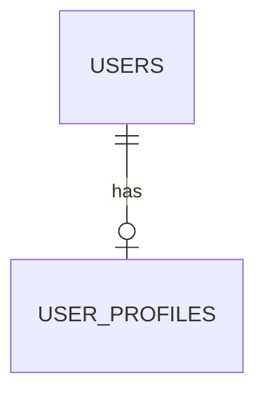
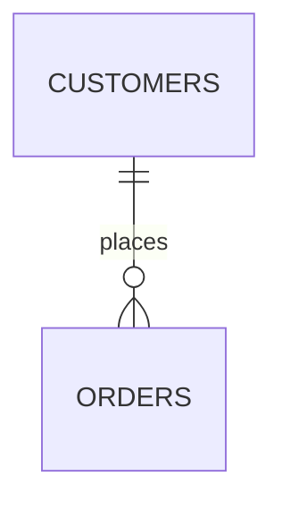
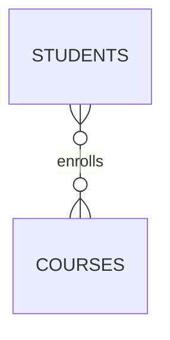
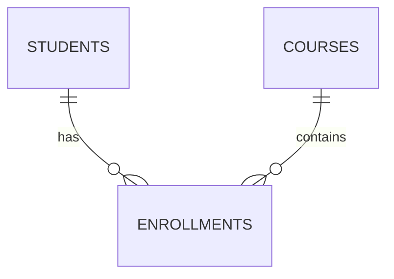

# 11. One-to-One / One-to-Many / Many-to-Many

This is one of the **most important concepts for understanding JOINs**.

Before writing a JOIN, you should know the **relationship between the tables**.

The relationship determines:

* How many rows can match?
* Can the result contain multiple rows for one entity?
* Can rows multiply?
* Do we need a bridge/junction table?
* What should the final result grain be?

---

# 1. What Does "Cardinality" Mean?

**Cardinality** describes how many rows on one side can be related to rows on the other side.

The three important relationships are:

| Relationship       | Meaning                            |
| ------------------ | ---------------------------------- |
| One-to-One (1:1)   | One row relates to at most one row |
| One-to-Many (1:N)  | One row can relate to many rows    |
| Many-to-Many (N:N) | Many rows can relate to many rows  |

There is also:

**Many-to-One (N:1)**

But this is simply the reverse perspective of **One-to-Many**.

---

# 2. One-to-One (1:1)

Suppose we have:

```text
users
----------------
id
name

user_profiles
----------------
id
user_id
address
phone
```

Each user has at most one profile.



Example data:

### users

| id | name    |
| -: | ------- |
|  1 | Alice   |
|  2 | Bob     |
|  3 | Charlie |

### user_profiles

|  id | user_id | phone |
| --: | ------: | ----- |
| 101 |       1 | 1111  |
| 102 |       2 | 2222  |
| 103 |       3 | 3333  |

A JOIN:

```sql
SELECT
    u.id,
    u.name,
    p.phone
FROM users AS u
JOIN user_profiles AS p
    ON u.id = p.user_id;
```

Result:

| id | name    | phone |
| -: | ------- | ----- |
|  1 | Alice   | 1111  |
|  2 | Bob     | 2222  |
|  3 | Charlie | 3333  |

Each user produces at most one result row.

---

# 3. How Do We Enforce 1:1?

This is important.

Just having:

```sql
user_id
```

does **not automatically guarantee** one-to-one.

We need a uniqueness constraint.

```sql
CREATE TABLE user_profiles (
    id BIGINT PRIMARY KEY,
    user_id BIGINT UNIQUE REFERENCES users(id),
    phone TEXT
);
```

The `UNIQUE` constraint means:

```text
user_id = 1
user_id = 1  <-- not allowed
```

Therefore:

```text
users
  1 ─────────── 1 user_profile
  2 ─────────── 1 user_profile
  3 ─────────── 1 user_profile
```

---

# 4. One-to-Many (1:N)

This is probably the **most common relationship in database applications**.

Example:

```text
Customer
   |
   | has many
   ↓
Orders
```



Schema:

```text
customers
----------------
id
name

orders
----------------
id
customer_id
amount
```

Example:

### customers

| id | name    |
| -: | ------- |
|  1 | Alice   |
|  2 | Bob     |
|  3 | Charlie |

### orders

|  id | customer_id | amount |
| --: | ----------: | -----: |
| 101 |           1 |    100 |
| 102 |           1 |    200 |
| 103 |           2 |    150 |

Alice has two orders.

```text
Alice
 ├── Order 101
 └── Order 102

Bob
 └── Order 103

Charlie
```

JOIN:

```sql
SELECT
    c.name,
    o.id AS order_id,
    o.amount
FROM customers AS c
JOIN orders AS o
    ON c.id = o.customer_id;
```

Result:

| name  | order_id | amount |
| ----- | -------: | -----: |
| Alice |      101 |    100 |
| Alice |      102 |    200 |
| Bob   |      103 |    150 |

Notice something important:

> Alice appears twice.

This is **not necessarily duplicate data**.

It happens because:

```text
1 customer
     ↓
2 matching orders
     ↓
2 result rows
```

---

# 5. The Most Important JOIN Rule

When joining a one-to-many relationship:

> **One row on the "one" side can become multiple result rows.**

For example:

```text
customers
     1
     |
     | 1:N
     |
     ↓
orders
   101
   102
   103
```

If Alice has 3 orders:

```text
Alice + Order 101
Alice + Order 102
Alice + Order 103
```

The JOIN produces **3 rows involving Alice**.

---

# 6. Many-to-One (N:1)

The same relationship can be viewed from the opposite direction.

From the customer's perspective:

```text
Customer → Orders
1 : N
```

From the order's perspective:

```text
Order → Customer
N : 1
```

For example:

```text
Order 101 ──→ Alice
Order 102 ──→ Alice
Order 103 ──→ Bob
```

So:

```text
Customer has many Orders

Order belongs to one Customer
```

These describe the **same database relationship**.

---

# 7. Where Is the Foreign Key?

For a normal one-to-many relationship, the foreign key lives on the **many side**.

```text
CUSTOMERS
   |
   | 1
   |
   | N
   ↓
ORDERS
```

Therefore:

```sql
orders.customer_id
```

references:

```sql
customers.id
```

Schema:

```sql
CREATE TABLE orders (
    id BIGINT PRIMARY KEY,
    customer_id BIGINT REFERENCES customers(id),
    amount NUMERIC(10, 2)
);
```

General rule:

```text
1:N relationship

ONE side       MANY side
--------       ----------
customers  ←── orders
id               customer_id
```

The many-side table stores the foreign key.

---

# 8. Many-to-Many (N:N)

Now suppose we have:

```text
Students
Courses
```

A student can take many courses.

A course can have many students.



For example:

```text
Alice
 ├── Math
 ├── Physics
 └── Chemistry

Bob
 ├── Math
 └── Physics

Charlie
 ├── Physics
 └── Chemistry
```

This is:

```text
Students ←→ Courses
    N  :  N
```

---

# 9. Why Can't We Simply Put a Foreign Key?

Imagine:

```text
students
----------------
id
name

courses
----------------
id
name
```

You might think:

```text
students
----------------
id
name
course_id
```

But Alice can have:

```text
Math
Physics
Chemistry
```

How would we store that in one `course_id`?

We could theoretically put:

```text
course_id = 1,2,3
```

inside one column, but that violates normal relational design.

Instead, we introduce a **junction/bridge table**.

---

# 10. The Bridge Table

We create:

```text
enrollments
----------------
student_id
course_id
```

Now:



The many-to-many relationship becomes **two one-to-many relationships**:

```text
Students
   |
   | 1:N
   ↓
Enrollments
   ↑
   | N:1
   |
Courses
```

Or visually:

```text
        N              N
Students ──── Enrollments ──── Courses
             student_id
             course_id
```

---

# 11. Example Data

### students

| id | name    |
| -: | ------- |
|  1 | Alice   |
|  2 | Bob     |
|  3 | Charlie |

### courses

| id | name      |
| -: | --------- |
| 10 | Math      |
| 20 | Physics   |
| 30 | Chemistry |

### enrollments

| student_id | course_id |
| ---------: | --------: |
|          1 |        10 |
|          1 |        20 |
|          1 |        30 |
|          2 |        10 |
|          2 |        20 |
|          3 |        20 |
|          3 |        30 |

The bridge table represents the relationships.

```text
Alice ───── Math
  |
  ├──────── Physics
  |
  └──────── Chemistry

Bob ─────── Math
  |
  └──────── Physics

Charlie ─── Physics
  |
  └──────── Chemistry
```

---

# 12. Joining a Many-to-Many Relationship

We need two JOINs.

```sql
SELECT
    s.name AS student,
    c.name AS course
FROM students AS s
JOIN enrollments AS e
    ON s.id = e.student_id
JOIN courses AS c
    ON e.course_id = c.id;
```

Result:

| student | course    |
| ------- | --------- |
| Alice   | Math      |
| Alice   | Physics   |
| Alice   | Chemistry |
| Bob     | Math      |
| Bob     | Physics   |
| Charlie | Physics   |
| Charlie | Chemistry |

Notice the important pattern:

```text
students
    ↓
enrollments
    ↓
courses
```

The bridge table is what allows us to represent arbitrary combinations.

---

# 13. Why Many-to-Many Causes Row Multiplication

Suppose:

```text
Alice has 3 courses
```

Then the query produces:

```text
Alice + Math
Alice + Physics
Alice + Chemistry
```

Therefore:

```text
1 student
    ↓
3 enrollment rows
    ↓
3 result rows
```

Now suppose we have another relationship.

```text
Customer
   |
   └── Orders
          |
          └── Order Items
```

Imagine:

```text
Alice
  ├── Order 1
  │     ├── Item A
  │     └── Item B
  │
  └── Order 2
        ├── Item C
        └── Item D
```

The final JOIN has:

```text
Alice + Order 1 + Item A
Alice + Order 1 + Item B
Alice + Order 2 + Item C
Alice + Order 2 + Item D
```

So Alice appears **4 times**.

This is expected if the result grain is:

> one row per order item.

---

# 14. Relationship Cardinality Predicts JOIN Behavior

This is a very useful mental model.

Suppose:

```text
A ──── B
```

Ask:

> For one row in A, how many rows can exist in B?

### 1:1

```text
A1 ─── B1
```

One A → at most one B.

---

### 1:N

```text
A1 ─── B1
    ├── B2
    └── B3
```

One A → many B rows.

Result rows can increase.

---

### N:1

```text
A1 ──┐
A2 ──┼── B1
A3 ──┘
```

Many A rows → one B.

---

### N:N

```text
A1 ──┬── B1
     ├── B2
     └── B3

A2 ──┬── B1
     └── B3
```

Many A rows can match many B rows.

This can produce significant row multiplication.

---

# 15. A Very Important Interview Question

Suppose someone asks:

> "Why did my JOIN return 10,000 rows when the first table has only 1,000 rows?"

Don't immediately think:

```text
"PostgreSQL duplicated my data."
```

Instead ask:

```text
What is the relationship between the tables?
```

For example:

```text
customers = 1,000
orders    = 10,000
```

If each customer has approximately 10 orders:

```text
1 customer
     ↓
10 orders
     ↓
10 result rows
```

Then:

```text
1,000 customers × ~10 orders
≈ 10,000 result rows
```

That's perfectly normal.

---

# 16. The "Grain" Connection

Cardinality becomes much easier when you understand **grain**.

Grain means:

> What does one row in my result represent?

Consider:

```sql
SELECT
    c.name,
    o.id,
    oi.product_id
FROM customers AS c
JOIN orders AS o
    ON c.id = o.customer_id
JOIN order_items AS oi
    ON o.id = oi.order_id;
```

What does one result row represent?

Not:

```text
one customer
```

Not:

```text
one order
```

It represents:

```text
one order item
```

Because the final table is at the `order_items` level.

Visualize it:

```text
Customer
   |
   └── Order
         |
         ├── Item
         ├── Item
         └── Item
```

The JOIN follows the relationship down to the most detailed level.

---

# 17. A Common Mistake: Expecting One Row per Customer

Suppose you write:

```sql
SELECT
    c.id,
    c.name,
    o.id AS order_id
FROM customers AS c
JOIN orders AS o
    ON c.id = o.customer_id;
```

You might expect:

```text
Alice
Bob
Charlie
```

But if Alice has 3 orders:

```text
Alice | Order 101
Alice | Order 102
Alice | Order 103
Bob   | Order 104
```

Why?

Because your query is asking for:

```text
customer + order
```

not:

```text
one row per customer
```

If you actually need one row per customer, you may need aggregation:

```sql
SELECT
    c.id,
    c.name,
    COUNT(o.id) AS order_count
FROM customers AS c
LEFT JOIN orders AS o
    ON c.id = o.customer_id
GROUP BY
    c.id,
    c.name;
```

Now the grain is:

```text
one row per customer
```

---

# 18. Don't Use DISTINCT to Hide Cardinality Problems

A common reaction to unexpected duplicates is:

```sql
SELECT DISTINCT ...
```

But this can hide the real problem.

Suppose:

```text
Alice | Order 101
Alice | Order 102
Alice | Order 103
```

If you do:

```sql
SELECT DISTINCT c.name
```

you get:

```text
Alice
```

But you've thrown away information about the orders.

Instead ask:

```text
Why am I getting multiple rows?
```

Usually the answer is:

```text
The relationship is one-to-many.
```

Or:

```text
The join condition is not unique.
```

Or:

```text
I joined through a many-to-many relationship.
```

---

# 19. Primary Key and Foreign Key Help You Understand Cardinality

Consider:

```sql
customers
-----------
id PRIMARY KEY

orders
-----------
id PRIMARY KEY
customer_id REFERENCES customers(id)
```

Because:

```text
customers.id
```

is unique, many orders can safely point to the same customer:

```text
orders.customer_id
       ↓
customer.id
```

For example:

```text
Order 1 ──┐
Order 2 ──┼── Customer 10
Order 3 ──┘
```

That's:

```text
N : 1
```

If instead:

```sql
orders.customer_id UNIQUE
```

then only one order could reference each customer, changing the relationship toward:

```text
1 : 1
```

So database constraints don't just protect data.

They also tell you something about the **possible JOIN cardinality**.

---

# 20. Quick Comparison

| Relationship | Example            | Foreign Key Pattern | JOIN Result                  |
| ------------ | ------------------ | ------------------- | ---------------------------- |
| 1:1          | User → Profile     | FK + UNIQUE         | At most one matching row     |
| 1:N          | Customer → Orders  | FK on many side     | One row can expand into many |
| N:1          | Orders → Customer  | FK on current side  | Many rows can point to one   |
| N:N          | Students ↔ Courses | Bridge table        | Many combinations            |

---

# 21. The Most Useful Mental Model

Before every JOIN, draw this:

```text
TABLE A
   |
   | ?
   |
TABLE B
```

Then answer:

```text
1. Is this 1:1?
2. Is this 1:N?
3. Is this N:1?
4. Is this N:N?
5. Which table contains the foreign key?
6. How many matching rows can one row produce?
7. What should one result row represent?
```

For example:

```text
customers
    |
    | 1:N
    ↓
orders
```

Immediately you should expect:

```text
one customer
    ↓
multiple result rows
```

For:

```text
students
    |
    | 1:N
    ↓
enrollments
    ↑
    | N:1
    |
courses
```

you should recognize:

```text
Students ↔ Courses
       N:N
```

and expect a bridge table.

---

# 22. The Golden Rule

When working with JOINs:

> **Cardinality tells you how rows can multiply.**

And:

> **The final grain tells you what each result row represents.**

These two questions will prevent many JOIN bugs:

```text
┌───────────────────────────────────────────┐
│  1. How many B rows can match one A row? │
│                                           │
│  2. What should one result row represent?│
└───────────────────────────────────────────┘
```

If you know those two answers, most JOIN behavior becomes predictable.

---

## Next

**12. Duplicate Rows & Join Explosion**

We will go deeper into **why JOINs suddenly produce 10×, 100×, or 1,000× more rows**, how many-to-many relationships cause **join explosion**, how to detect it, and how to fix it correctly without blindly using `DISTINCT`.

