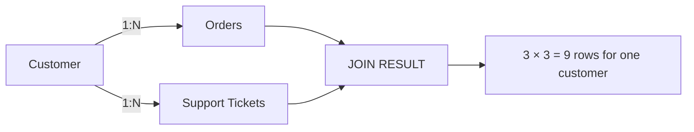
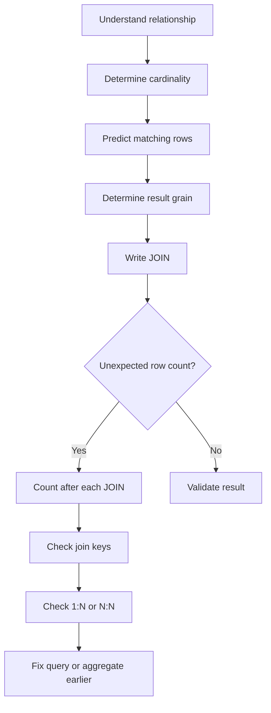

# 12. Duplicate Rows & Join Explosion

This is one of the most important practical JOIN problems.

You write a query expecting:

```text
100 rows
```

but PostgreSQL gives you:

```text
10,000 rows
```

Or you see:

```text
Alice
Alice
Alice
Alice
```

and think:

> "Why is PostgreSQL duplicating my rows?"

Usually, PostgreSQL is **not duplicating anything**.

The JOIN is producing exactly the combinations that your join condition allows.

---

# 1. What Is Join Multiplication?

Suppose we have:

```text
customers
----------------
id | name

1  | Alice
2  | Bob
```

and:

```text
orders
----------------
id | customer_id

101 | 1
102 | 1
103 | 1
104 | 2
```

Alice has 3 orders.

When we JOIN:

```sql
SELECT
    c.name,
    o.id AS order_id
FROM customers AS c
JOIN orders AS o
    ON c.id = o.customer_id;
```

PostgreSQL creates:

```text
Alice + Order 101
Alice + Order 102
Alice + Order 103
Bob   + Order 104
```

Alice appears three times.

That's not a duplicate.

They are three **different matching row combinations**.

---

# 2. Think in Terms of Row Pairs

A JOIN conceptually considers pairs of rows.

Suppose:

```text
Customer:
Alice
```

Orders:

```text
Order 101
Order 102
Order 103
```

The JOIN evaluates:

```text
Alice + Order 101 → match
Alice + Order 102 → match
Alice + Order 103 → match
```

Therefore:

```text
1 customer
     ×
3 matching orders
     =
3 result rows
```

This is the fundamental idea behind join multiplication.

---

# 3. A Simple Formula

For a particular row:

```text
result rows for that row
=
number of matching rows on the other side
```

For multiple rows:

```text
total result rows
≈
sum of matching rows for each left row
```

For a simple 1:N relationship:

```text
100 customers
10 orders per customer
```

you might get:

```text
100 × 10 = 1,000 rows
```

The important word is **might**.

Real data can have different numbers of matches for each customer.

---

# 4. Why "Duplicate" Is Often the Wrong Word

Suppose:

| customer | order_id | amount |
| -------- | -------: | -----: |
| Alice    |      101 |    100 |
| Alice    |      102 |    200 |
| Alice    |      103 |    500 |

These rows have the same customer.

But they are not duplicates because:

```text
order_id
```

is different.

The actual result grain is:

```text
one row = one customer + one order
```

not:

```text
one row = one customer
```

This distinction is extremely important.

---

# 5. The Grain Problem

Suppose your business requirement is:

> "Give me one row per customer."

But your query is:

```sql
SELECT
    c.id,
    c.name,
    o.id AS order_id
FROM customers AS c
JOIN orders AS o
    ON c.id = o.customer_id;
```

Your query actually produces:

```text
one row per customer-order combination
```

So the query's grain doesn't match the requirement.

---

# 6. Example: Expected vs Actual Grain

You want:

```text
Customer
--------
Alice
Bob
Charlie
```

But your query produces:

```text
Customer + Order
----------------
Alice + 101
Alice + 102
Alice + 103
Bob   + 104
```

The problem isn't necessarily the JOIN.

The problem may simply be:

> **You asked the database for a more detailed result than you actually wanted.**

---

# 7. Join Explosion

Now let's look at a more serious situation.

Suppose:

```text
customers
    |
    ↓
orders
    |
    ↓
order_items
```

Data:

```text
Alice
 ├── Order 1
 │     ├── Item A
 │     ├── Item B
 │     └── Item C
 │
 └── Order 2
       ├── Item D
       └── Item E
```

The result contains:

```text
Alice + Order 1 + Item A
Alice + Order 1 + Item B
Alice + Order 1 + Item C
Alice + Order 2 + Item D
Alice + Order 2 + Item E
```

That's 5 rows.

The customer didn't get duplicated.

The query is now at the:

```text
order_item
```

grain.

---

# 8. The Dangerous Case: Joining Two "Many" Sides

Here's where things become particularly dangerous.

Suppose:

```text
customers
    |
    ├── orders
    |
    └── support_tickets
```

A customer can have many orders.

A customer can also have many support tickets.

For Alice:

```text
Alice
 ├── Order 1
 ├── Order 2
 └── Order 3

Alice
 ├── Ticket A
 ├── Ticket B
 └── Ticket C
```

Now suppose you write:

```sql
SELECT
    c.name,
    o.id AS order_id,
    t.id AS ticket_id
FROM customers AS c
JOIN orders AS o
    ON c.id = o.customer_id
JOIN support_tickets AS t
    ON c.id = t.customer_id;
```

You might expect:

```text
3 orders
+
3 tickets
=
6 rows
```

But that's not what happens.

---

# 9. The Multiplication Effect

For Alice:

```text
Orders:
3

Tickets:
3
```

Every order can combine with every ticket.

Therefore:

```text
3 × 3 = 9 rows
```

Conceptually:

```text
              Tickets
             A    B    C
          ┌────┬────┬────┐
Order 1   │  ✓ │  ✓ │  ✓ │
          ├────┼────┼────┤
Order 2   │  ✓ │  ✓ │  ✓ │
          ├────┼────┼────┤
Order 3   │  ✓ │  ✓ │  ✓ │
          └────┴────┴────┘
```

Result:

```text
Order 1 + Ticket A
Order 1 + Ticket B
Order 1 + Ticket C

Order 2 + Ticket A
Order 2 + Ticket B
Order 2 + Ticket C

Order 3 + Ticket A
Order 3 + Ticket B
Order 3 + Ticket C
```

This is a classic **join explosion**.

---

# 10. Visualizing the Problem



The important part is:

```text
Customer
   |
   +---- many Orders
   |
   +---- many Tickets
```

When you join both collections directly:

```text
Orders × Tickets
```

for each customer.

---

# 11. Why This Can Become Huge

Suppose one customer has:

```text
100 orders
50 tickets
```

Then:

```text
100 × 50
=
5,000 rows
```

for **one customer**.

Now suppose:

```text
10,000 customers
```

and the average numbers are similar.

Potential result:

```text
10,000 × 100 × 50
=
50,000,000 rows
```

That's 50 million result combinations.

This is why understanding cardinality is essential for both:

* correctness
* performance

---

# 12. Many-to-Many Can Produce the Same Effect

Consider:

```text
students
    |
    ↓
enrollments
    ↑
    |
courses
```

That's naturally many-to-many.

Suppose:

```text
Alice → 5 courses
Math → 100 students
```

A query involving both sides can produce many combinations depending on the join conditions.

The bridge table itself isn't a problem.

The important question is:

> What is the grain of the intermediate and final result?

---

# 13. How to Detect Join Explosion

A very useful debugging technique is to count rows **after each JOIN**.

Start:

```sql
SELECT COUNT(*)
FROM customers;
```

Suppose:

```text
10,000
```

Then:

```sql
SELECT COUNT(*)
FROM customers AS c
JOIN orders AS o
    ON c.id = o.customer_id;
```

Suppose:

```text
120,000
```

So:

```text
10,000 → 120,000
```

That tells you the customer → orders relationship is expanding the result.

Then add another JOIN:

```sql
SELECT COUNT(*)
FROM customers AS c
JOIN orders AS o
    ON c.id = o.customer_id
JOIN support_tickets AS t
    ON c.id = t.customer_id;
```

Suppose:

```text
4,800,000
```

Now:

```text
10,000
   ↓
120,000
   ↓
4,800,000
```

You've found the likely source of the explosion.

---

# 14. Inspect Matching Counts

Another useful technique is to understand how many children each parent has.

For orders:

```sql
SELECT
    customer_id,
    COUNT(*) AS order_count
FROM orders
GROUP BY customer_id
ORDER BY order_count DESC;
```

For tickets:

```sql
SELECT
    customer_id,
    COUNT(*) AS ticket_count
FROM support_tickets
GROUP BY customer_id
ORDER BY ticket_count DESC;
```

You might discover:

```text
customer_id | order_count
------------+------------
42          | 100
17          | 80
91          | 75
```

and:

```text
customer_id | ticket_count
------------+-------------
42          | 50
17          | 20
91          | 10
```

Customer 42 could produce:

```text
100 × 50 = 5,000
```

rows in the combined JOIN.

---

# 15. The Most Common Mistake

Consider:

```sql
SELECT
    c.id,
    c.name,
    COUNT(o.id) AS order_count,
    COUNT(t.id) AS ticket_count
FROM customers AS c
LEFT JOIN orders AS o
    ON c.id = o.customer_id
LEFT JOIN support_tickets AS t
    ON c.id = t.customer_id
GROUP BY
    c.id,
    c.name;
```

At first glance this looks reasonable.

But suppose Alice has:

```text
3 orders
3 tickets
```

The JOIN produces:

```text
3 × 3 = 9 rows
```

Then:

```text
COUNT(o.id)
```

can count each order multiple times.

You could get:

```text
order_count = 9
ticket_count = 9
```

instead of:

```text
order_count = 3
ticket_count = 3
```

This is a very common SQL bug.

---

# 16. Why `COUNT(DISTINCT ...)` Sometimes Helps

You could write:

```sql
SELECT
    c.id,
    c.name,
    COUNT(DISTINCT o.id) AS order_count,
    COUNT(DISTINCT t.id) AS ticket_count
FROM customers AS c
LEFT JOIN orders AS o
    ON c.id = o.customer_id
LEFT JOIN support_tickets AS t
    ON c.id = t.customer_id
GROUP BY
    c.id,
    c.name;
```

Now:

```text
Alice
orders  = 3
tickets = 3
```

because:

```text
DISTINCT order_id
DISTINCT ticket_id
```

removes the repeated combinations during counting.

But there's an important point:

> `COUNT(DISTINCT ...)` can fix a counting symptom, but it doesn't necessarily fix an inefficient or conceptually incorrect JOIN.

If you need data from the two independent collections, you may need a different query structure.

---

# 17. Better Approach: Aggregate Before Joining

Suppose the requirement is:

> "Give me one row per customer with order count and ticket count."

Instead of joining all orders and tickets together first, aggregate them independently.

```sql
SELECT
    c.id,
    c.name,
    COALESCE(o.order_count, 0) AS order_count,
    COALESCE(t.ticket_count, 0) AS ticket_count
FROM customers AS c
LEFT JOIN (
    SELECT
        customer_id,
        COUNT(*) AS order_count
    FROM orders
    GROUP BY customer_id
) AS o
    ON c.id = o.customer_id
LEFT JOIN (
    SELECT
        customer_id,
        COUNT(*) AS ticket_count
    FROM support_tickets
    GROUP BY customer_id
) AS t
    ON c.id = t.customer_id;
```

Now the intermediate results are:

```text
orders
customer_id | order_count
------------+------------
1           | 3
2           | 5
```

and:

```text
tickets
customer_id | ticket_count
------------+-------------
1           | 3
2           | 2
```

Then:

```text
customers
    ↓
one aggregated orders row
    ↓
one aggregated tickets row
```

So there is no:

```text
3 × 3
```

explosion.

---

# 18. Why This Works

Before:

```text
Customer
   ↓
Orders ─────┐
            ├── many × many
Tickets ────┘
```

After:

```text
Orders
   ↓
GROUP BY customer_id
   ↓
one row per customer
        \
         \
          → Customers
         /
        /
Tickets
   ↓
GROUP BY customer_id
   ↓
one row per customer
```

We changed the grain **before** joining.

That's a powerful SQL technique.

---

# 19. Another Common Cause: Non-Unique Join Columns

Join explosion isn't always caused by obviously related child tables.

Consider:

```text
users
----------------
id | email

1  | alice@example.com
2  | bob@example.com
```

Suppose another table contains:

```text
subscriptions
----------------
id | email
101 | alice@example.com
102 | alice@example.com
```

Now:

```sql
SELECT *
FROM users AS u
JOIN subscriptions AS s
    ON u.email = s.email;
```

Alice produces:

```text
Alice + Subscription 101
Alice + Subscription 102
```

That's because:

```text
email
```

is not unique in `subscriptions`.

---

# 20. Joining on the Wrong Column

This can be even worse.

Suppose:

```text
customers.id
orders.customer_id
```

The correct relationship is:

```sql
ON c.id = o.customer_id
```

But someone accidentally writes:

```sql
ON c.id = o.id
```

The query may still be syntactically valid.

PostgreSQL won't necessarily tell you:

> "You probably meant customer_id."

SQL cares about whether the expression is valid, not whether it matches your business intention.

Therefore:

> A JOIN can be syntactically correct but logically wrong.

---

# 21. Missing JOIN Condition

This is the extreme case.

```sql
SELECT *
FROM customers AS c
JOIN orders AS o
    ON TRUE;
```

Every customer matches every order.

If:

```text
customers = 1,000
orders    = 10,000
```

then:

```text
1,000 × 10,000
=
10,000,000 rows
```

That's effectively a Cartesian product.

A forgotten or incorrect JOIN condition can therefore cause enormous row explosions.

---

# 22. `DISTINCT` Is Not a Universal Fix

Suppose you have:

```text
Alice | Order 101
Alice | Order 102
Alice | Order 103
```

And you write:

```sql
SELECT DISTINCT c.name
```

You get:

```text
Alice
```

But you've only hidden the multiple rows.

If your requirement was:

> "Find customers with orders"

then perhaps that's fine.

But if your requirement was:

> "Show every order"

then `DISTINCT` is wrong because you discarded information.

Always understand **why** multiple rows exist first.

---

# 23. When `DISTINCT` Is Appropriate

`DISTINCT` is perfectly valid when your desired result is actually unique.

For example:

> "Which customers have placed orders?"

```sql
SELECT DISTINCT
    c.id,
    c.name
FROM customers AS c
JOIN orders AS o
    ON c.id = o.customer_id;
```

Here the intended grain is:

```text
one row per customer
```

So `DISTINCT` can be reasonable.

But often `EXISTS` is even more semantically appropriate for this requirement, which we'll cover later under **Semi Joins / EXISTS**.

---

# 24. A Practical Debugging Workflow

When a JOIN produces unexpectedly many rows, don't immediately change the query.

Use this process.

### Step 1 — Count the first table

```sql
SELECT COUNT(*)
FROM customers;
```

### Step 2 — Add one JOIN

```sql
SELECT COUNT(*)
FROM customers AS c
JOIN orders AS o
    ON c.id = o.customer_id;
```

### Step 3 — Add the next JOIN

```sql
SELECT COUNT(*)
FROM customers AS c
JOIN orders AS o
    ON c.id = o.customer_id
JOIN order_items AS oi
    ON o.id = oi.order_id;
```

### Step 4 — Continue one JOIN at a time

```text
customers
   ↓
+ orders
   ↓
+ order_items
   ↓
+ products
```

Record:

```text
customers             10,000
customers + orders    120,000
+ order_items         800,000
+ products            800,000
```

Now you can see exactly where the expansion happened.

---

# 25. Check the Join Key

Ask:

```text
Is the JOIN column unique?
```

For example:

```sql
SELECT
    customer_id,
    COUNT(*)
FROM orders
GROUP BY customer_id
HAVING COUNT(*) > 1;
```

If many rows appear, then:

```text
customer_id
```

is not unique in orders.

That's expected for a one-to-many relationship.

But if you thought it was supposed to be one-to-one, you've found a data-model problem.

---

# 26. Use Constraints to Express Your Intent

Suppose the business rule says:

> Every user can have only one profile.

Don't just assume it.

Enforce it:

```sql
user_id BIGINT UNIQUE REFERENCES users(id)
```

Then the database guarantees:

```text
User 1 → Profile 1
```

and prevents:

```text
User 1 → Profile 1
User 1 → Profile 2
```

Constraints make your expected cardinality explicit.

---

# 27. Join Explosion Cheat Sheet

```text
1 : 1
──────────────
1 × 1 = 1


1 : N
──────────────
1 × N = N


N : 1
──────────────
N × 1 = N


N : N
──────────────
N × M = N×M
```

The dangerous one is:

```text
N × M
```

because both sides can expand.

For example:

```text
100 orders
×
50 tickets
=
5,000 combinations
```

---

# 28. The Mental Model You Should Keep

Whenever you see:

```sql
FROM A
JOIN B ON ...
JOIN C ON ...
```

don't just think:

```text
A + B + C
```

Think:

```text
A
 ↓
How many B rows per A?
 ↓
How many C rows per intermediate row?
 ↓
What is the final grain?
```

For example:

```text
Customer
   |
   | 1:N
   ↓
Order
   |
   | 1:N
   ↓
Order Item
```

means:

```text
1 Customer
   ↓
N Orders
   ↓
N × M Order Items
```

And:

```text
Customer
   ├── Orders
   └── Tickets
```

means:

```text
Orders × Tickets
```

if both are joined independently through the customer.

---

# 29. Golden Rules

### Rule 1

> Repeated values in a result don't necessarily mean duplicate rows.

### Rule 2

> A one-to-many JOIN naturally multiplies rows.

### Rule 3

> Joining two independent "many" relationships can multiply them together.

### Rule 4

> Always know the grain of your result.

### Rule 5

> Debug row counts after each JOIN.

### Rule 6

> Check whether JOIN keys are unique when you expect 1:1.

### Rule 7

> Don't use `DISTINCT` blindly to hide a JOIN problem.

### Rule 8

> If two independent child collections need to be aggregated, consider aggregating each one before joining.

### Rule 9

> A syntactically valid JOIN can still be logically incorrect.

---

# 30. The Big Picture



The key idea is:

> **JOINs don't randomly duplicate rows. Your relationship/cardinality determines how many row combinations are produced.**

Once you start thinking in terms of **cardinality + grain**, JOIN behavior becomes much easier to predict.

---

## Next

**13. NULL and Joins**

We'll focus specifically on how `NULL` behaves with `INNER`, `LEFT`, `RIGHT`, and `FULL` JOINs, why `NULL = NULL` is not `TRUE`, and why conditions involving `NULL` can unexpectedly remove rows.

