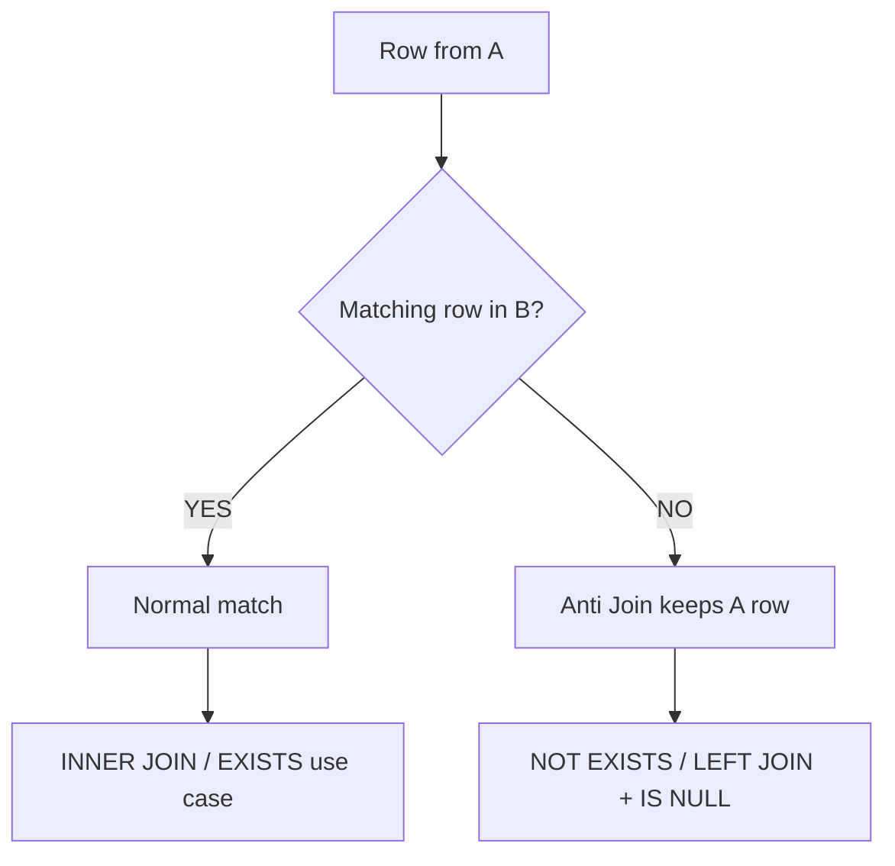

# 14. Anti Joins

An **anti join** answers a very common database question:

> **"Give me rows from A for which there is no matching row in B."**

Examples:

* Customers who have **never placed an order**
* Products that were **never purchased**
* Employees who **don't have a manager**
* Users who **don't have a subscription**
* Records in one system that are **missing from another system**

The key idea is:

```text
A
 |
 | "Does a matching row exist in B?"
 |
 └── NO → keep A
```

---

# 1. Normal JOIN vs Anti Join

A normal JOIN asks:

```text
"Does A have a matching B?"
```

and returns the matches.

An anti join asks:

```text
"Does A NOT have a matching B?"
```

and returns the unmatched A rows.

Visual:

```text
          A
          |
          ↓
    Find matching B
       /        \
     YES         NO
      |           |
      ↓           ↓
   normal      anti join
    join
```

---

# 2. Example: Customers Without Orders

Suppose:

### customers

| id | name    |
| -: | ------- |
|  1 | Alice   |
|  2 | Bob     |
|  3 | Charlie |
|  4 | David   |

### orders

|  id | customer_id |
| --: | ----------: |
| 101 |           1 |
| 102 |           1 |
| 103 |           3 |

Therefore:

```text
Alice   → has orders
Bob     → no orders
Charlie → has orders
David   → no orders
```

We want:

```text
Bob
David
```

This is an anti-join problem.

---

# 3. The Classic `LEFT JOIN ... IS NULL`

The most common pattern is:

```sql
SELECT
    c.id,
    c.name
FROM customers AS c
LEFT JOIN orders AS o
    ON c.id = o.customer_id
WHERE o.id IS NULL;
```

Let's understand it step by step.

---

# 4. Step 1: Perform the LEFT JOIN

Without the `WHERE`:

```sql
SELECT
    c.id,
    c.name,
    o.id AS order_id
FROM customers AS c
LEFT JOIN orders AS o
    ON c.id = o.customer_id;
```

Result:

| customer | order_id |
| -------- | -------: |
| Alice    |      101 |
| Alice    |      102 |
| Bob      |     NULL |
| Charlie  |      103 |
| David    |     NULL |

The LEFT JOIN preserves every customer.

For Bob and David:

```text
No matching order
        ↓
order columns become NULL
```

---

# 5. Step 2: Keep Only NULL Matches

Now:

```sql
WHERE o.id IS NULL
```

keeps:

| customer | order_id |
| -------- | -------: |
| Bob      |     NULL |
| David    |     NULL |

So the final result is:

```text
Bob
David
```

That's the classic anti-join pattern.

---

# 6. The Mental Model

Remember:

```text
FROM A
LEFT JOIN B
    ON relationship
WHERE B.id IS NULL
```

means:

> **"Give me A rows for which no matching B row exists."**

Visual:

```text
A                         B

Alice ────────────────── Order
Bob   ────────────────── [none]
Charlie ──────────────── Order
David ────────────────── [none]

          ↓

WHERE B.id IS NULL

          ↓

Bob
David
```

---

# 7. Why Do We Check `o.id IS NULL`?

You generally check a column that should be non-NULL for a real B row, typically the primary key.

For example:

```sql
WHERE o.id IS NULL
```

is good if:

```text
orders.id
```

is a primary key and therefore never NULL.

Avoid using a nullable business column as your existence indicator.

For example:

```sql
WHERE o.amount IS NULL
```

could be ambiguous.

An order might actually exist with:

```text
amount = NULL
```

So:

```text
o.amount IS NULL
```

doesn't necessarily mean:

```text
"No order exists."
```

Using the primary key makes the intention clearer.

---

# 8. Anti Join with `NOT EXISTS`

There is another very important way to express the same requirement:

```sql
SELECT
    c.id,
    c.name
FROM customers AS c
WHERE NOT EXISTS (
    SELECT 1
    FROM orders AS o
    WHERE o.customer_id = c.id
);
```

This reads almost exactly like the business requirement:

```text
For each customer:

Does an order exist?

NO → return customer
YES → don't return customer
```

---

# 9. `EXISTS` vs `NOT EXISTS`

Think of:

```sql
EXISTS (...)
```

as:

> "Does at least one matching row exist?"

And:

```sql
NOT EXISTS (...)
```

as:

> "Does no matching row exist?"

So:

```sql
WHERE NOT EXISTS (...)
```

is naturally suited for anti-join logic.

---

# 10. Comparing the Two Patterns

### Pattern 1: LEFT JOIN

```sql
SELECT c.*
FROM customers AS c
LEFT JOIN orders AS o
    ON c.id = o.customer_id
WHERE o.id IS NULL;
```

### Pattern 2: NOT EXISTS

```sql
SELECT c.*
FROM customers AS c
WHERE NOT EXISTS (
    SELECT 1
    FROM orders AS o
    WHERE o.customer_id = c.id
);
```

Both express:

```text
Customers without orders
```

Conceptually:

```text
LEFT JOIN + IS NULL
        ↓
Find matches
        ↓
Keep unmatched

NOT EXISTS
        ↓
Check whether match exists
        ↓
Keep when it doesn't
```

---

# 11. Why `NOT EXISTS` Is Often Easier to Read

Suppose the requirement is:

> "Find employees who have no active projects."

With `NOT EXISTS`:

```sql
SELECT
    e.id,
    e.name
FROM employees AS e
WHERE NOT EXISTS (
    SELECT 1
    FROM employee_projects AS ep
    WHERE ep.employee_id = e.id
      AND ep.status = 'ACTIVE'
);
```

Read it as:

```text
Give me employees
WHERE
there does NOT EXIST
an active project for that employee.
```

The SQL closely mirrors the business question.

---

# 12. `LEFT JOIN` Version

The same requirement can be written:

```sql
SELECT
    e.id,
    e.name
FROM employees AS e
LEFT JOIN employee_projects AS ep
    ON e.id = ep.employee_id
   AND ep.status = 'ACTIVE'
WHERE ep.employee_id IS NULL;
```

This is valid.

Notice something important:

```sql
ep.status = 'ACTIVE'
```

is in the `ON`, not the `WHERE`.

Why?

Because we want:

```text
all employees
+
only active projects as matches
```

Then:

```text
no active project
→ NULL
→ keep employee
```

---

# 13. Why Putting the Condition in WHERE Can Be Wrong

Consider:

```sql
SELECT
    e.id,
    e.name
FROM employees AS e
LEFT JOIN employee_projects AS ep
    ON e.id = ep.employee_id
WHERE ep.status = 'ACTIVE'
  AND ep.employee_id IS NULL;
```

This can't work as intended.

Why?

Because for an unmatched employee:

```text
ep.status = NULL
```

and:

```text
NULL = 'ACTIVE'
```

is `UNKNOWN`.

The WHERE condition removes the row.

The condition that defines which child rows count as matches should be part of the JOIN:

```sql
ON e.id = ep.employee_id
AND ep.status = 'ACTIVE'
```

---

# 14. A Powerful Way to Think About Anti Joins

An anti join is about **existence**, not about retrieving matching data.

Suppose the question is:

> "Which customers have never ordered?"

You don't actually need order information.

You only need to know:

```text
Does an order exist?
```

That is exactly what:

```sql
NOT EXISTS
```

expresses.

---

# 15. Why `SELECT 1`?

You often see:

```sql
WHERE EXISTS (
    SELECT 1
    FROM orders AS o
    WHERE o.customer_id = c.id
);
```

Why `1`?

Because `EXISTS` only cares whether the subquery produces **at least one row**.

It doesn't care about the selected value.

These are logically equivalent for `EXISTS`:

```sql
SELECT 1
```

```sql
SELECT o.id
```

```sql
SELECT *
```

But:

```sql
SELECT 1
```

communicates the intent clearly:

> "I only care whether a row exists."

---

# 16. Anti Join vs `INNER JOIN`

An INNER JOIN gives you:

```text
customers WITH orders
```

```sql
SELECT DISTINCT c.*
FROM customers AS c
JOIN orders AS o
    ON c.id = o.customer_id;
```

An anti join gives you:

```text
customers WITHOUT orders
```

```sql
SELECT c.*
FROM customers AS c
WHERE NOT EXISTS (
    SELECT 1
    FROM orders AS o
    WHERE o.customer_id = c.id
);
```

Think:

```text
Customers
     |
     +──── has matching order ────→ INNER JOIN
     |
     └──── no matching order ─────→ ANTI JOIN
```

---

# 17. Anti Join vs `NOT IN`

You might also see:

```sql
SELECT
    c.id,
    c.name
FROM customers AS c
WHERE c.id NOT IN (
    SELECT o.customer_id
    FROM orders AS o
);
```

At first glance this looks fine.

But there is an important problem:

> **`NOT IN` behaves unexpectedly when the subquery contains `NULL`.**

---

# 18. The `NOT IN` + NULL Problem

Suppose:

```text
orders.customer_id

1
3
NULL
```

Now:

```sql
WHERE c.id NOT IN (1, 3, NULL)
```

For Bob:

```text
id = 2
```

SQL effectively has to determine:

```text
2 != 1
AND
2 != 3
AND
2 != NULL
```

The last comparison is:

```text
2 != NULL
```

→ `UNKNOWN`

Therefore the overall condition isn't TRUE.

The row may not be returned.

This can surprise developers.

---

# 19. `NOT EXISTS` Avoids This Specific Problem

With:

```sql
WHERE NOT EXISTS (
    SELECT 1
    FROM orders AS o
    WHERE o.customer_id = c.id
)
```

the question is simply:

```text
"Is there an order whose customer_id equals this customer's id?"
```

A NULL `customer_id` doesn't match:

```text
NULL = c.id
```

and therefore doesn't interfere with the existence test in the same way.

This is one reason `NOT EXISTS` is often preferred when expressing anti-join logic.

---

# 20. `NOT IN` Can Be Correct

This doesn't mean:

```text
NOT IN = bad
```

It can be perfectly valid when the data and NULL behavior are controlled.

For example, if:

```sql
orders.customer_id
```

is declared:

```sql
NOT NULL
```

then:

```sql
NOT IN
```

doesn't have that particular NULL issue.

But for existence logic:

```sql
NOT EXISTS
```

often communicates the intention more directly.

---

# 21. Anti Join with a Bridge Table

Suppose:

```text
students
    |
    ↓
enrollments
    |
    ↓
courses
```

Requirement:

> Find students who aren't enrolled in any course.

You can write:

```sql
SELECT
    s.id,
    s.name
FROM students AS s
WHERE NOT EXISTS (
    SELECT 1
    FROM enrollments AS e
    WHERE e.student_id = s.id
);
```

Notice that we don't even need to JOIN `courses`.

Why?

Because the question is:

```text
Does an enrollment exist?
```

Not:

```text
Which course?
```

---

# 22. Finding Products Never Purchased

Schema:

```text
products
---------
id
name

order_items
-----------
id
product_id
quantity
```

Requirement:

> Products that have never appeared in an order.

Using `NOT EXISTS`:

```sql
SELECT
    p.id,
    p.name
FROM products AS p
WHERE NOT EXISTS (
    SELECT 1
    FROM order_items AS oi
    WHERE oi.product_id = p.id
);
```

This is a very natural anti-join query.

---

# 23. Finding Employees Without Managers

Suppose:

```text
employees
----------------
id
name
manager_id
```

Top-level employees have:

```text
manager_id = NULL
```

You could simply use:

```sql
SELECT
    id,
    name
FROM employees
WHERE manager_id IS NULL;
```

But suppose instead the requirement is:

> "Find employees whose manager_id references no actual employee."

Then an anti join is useful:

```sql
SELECT
    e.id,
    e.name
FROM employees AS e
WHERE e.manager_id IS NOT NULL
  AND NOT EXISTS (
      SELECT 1
      FROM employees AS m
      WHERE m.id = e.manager_id
  );
```

This finds broken references.

If foreign keys are properly enforced, this normally shouldn't happen.

That illustrates another important point:

> Constraints can prevent entire classes of anti-join data-quality problems.

---

# 24. Anti Join as Data Reconciliation

Suppose you have:

```text
expected_users
actual_users
```

Requirement:

> Which expected users are missing from the actual system?

```sql
SELECT
    e.id
FROM expected_users AS e
WHERE NOT EXISTS (
    SELECT 1
    FROM actual_users AS a
    WHERE a.id = e.id
);
```

Conceptually:

```text
Expected
──────────────
1
2
3
4

Actual
──────────────
1
3
4

Anti Join

──────────────
2
```

This pattern is extremely useful for:

* migrations
* synchronization
* reconciliation
* auditing
* data validation

---

# 25. Anti Join with Additional Conditions

Suppose:

> Find customers who don't have an order in the last 30 days.

You can write:

```sql
SELECT
    c.id,
    c.name
FROM customers AS c
WHERE NOT EXISTS (
    SELECT 1
    FROM orders AS o
    WHERE o.customer_id = c.id
      AND o.created_at >= CURRENT_DATE - INTERVAL '30 days'
);
```

The important thing is that the anti-join condition defines exactly what counts as a match:

```text
same customer
+
order within last 30 days
```

If no such row exists:

```text
return customer
```

---

# 26. Anti Join with LEFT JOIN

The same requirement:

```sql
SELECT
    c.id,
    c.name
FROM customers AS c
LEFT JOIN orders AS o
    ON c.id = o.customer_id
   AND o.created_at >= CURRENT_DATE - INTERVAL '30 days'
WHERE o.id IS NULL;
```

Both approaches express the same general logic.

```text
NOT EXISTS
    ↓
No qualifying order exists

LEFT JOIN + IS NULL
    ↓
No qualifying order matched
```

---

# 27. Which One Should You Think of First?

For existence questions, a useful rule is:

```text
"Does a matching row exist?"
        ↓
EXISTS

"Does a matching row NOT exist?"
        ↓
NOT EXISTS
```

For example:

```text
Customers with orders
→ EXISTS

Customers without orders
→ NOT EXISTS
```

This is conceptually clean.

Later we'll study **Semi Joins** and **EXISTS vs JOIN** in more depth.

---

# 28. Important: Anti Join Does Not Mean "Rows With NULL"

This distinction matters.

Consider:

```sql
SELECT *
FROM orders
WHERE customer_id IS NULL;
```

This means:

> Find orders whose `customer_id` value itself is NULL.

That's **not necessarily an anti join**.

An anti join means:

> Find rows for which no matching row exists in another table.

For example:

```sql
SELECT c.*
FROM customers AS c
WHERE NOT EXISTS (
    SELECT 1
    FROM orders AS o
    WHERE o.customer_id = c.id
);
```

These are different questions.

---

# 29. Another Important Distinction

Suppose:

```text
customers
Alice
Bob

orders
Order 101 → Alice
Order 102 → NULL
```

This query:

```sql
SELECT *
FROM orders
WHERE customer_id IS NULL;
```

returns:

```text
Order 102
```

But this anti join:

```sql
SELECT c.*
FROM customers AS c
WHERE NOT EXISTS (
    SELECT 1
    FROM orders AS o
    WHERE o.customer_id = c.id
);
```

returns:

```text
Bob
```

They answer completely different questions.

---

# 30. Visual Summary



---

# 31. Three Common Anti-Join Patterns

### Pattern 1 — `LEFT JOIN`

```sql
SELECT a.*
FROM A AS a
LEFT JOIN B AS b
    ON b.a_id = a.id
WHERE b.id IS NULL;
```

Think:

```text
LEFT JOIN
+
no B match
```

---

### Pattern 2 — `NOT EXISTS`

```sql
SELECT a.*
FROM A AS a
WHERE NOT EXISTS (
    SELECT 1
    FROM B AS b
    WHERE b.a_id = a.id
);
```

Think:

```text
There does NOT EXIST a matching B.
```

---

### Pattern 3 — `NOT IN`

```sql
SELECT a.*
FROM A AS a
WHERE a.id NOT IN (
    SELECT b.a_id
    FROM B AS b
);
```

Valid in appropriate circumstances, but be particularly careful about `NULL`.

---

# 32. Comparison

| Approach                | Main idea                        | NULL concern                                      |
| ----------------------- | -------------------------------- | ------------------------------------------------- |
| `LEFT JOIN ... IS NULL` | Join, then keep unmatched A      | Choose a non-NULL B column such as PK             |
| `NOT EXISTS`            | Keep A when no matching B exists | Generally robust for existence logic              |
| `NOT IN`                | A value isn't in B's values      | Can behave unexpectedly if subquery contains NULL |

---

# 33. Performance Note

You may hear:

> "`NOT EXISTS` is always faster."

That's too simplistic.

PostgreSQL's optimizer can transform logically equivalent queries into efficient execution plans.

The actual performance depends on:

* table sizes
* indexes
* statistics
* selectivity
* query structure
* PostgreSQL version
* data distribution

So don't choose a query purely because someone says one syntax is "always faster."

For example, an index on:

```sql
orders(customer_id)
```

can be very useful for:

```sql
WHERE NOT EXISTS (
    SELECT 1
    FROM orders AS o
    WHERE o.customer_id = c.id
)
```

We'll get much deeper into JOIN performance and indexes later.

---

# 34. The Key Mental Model

Think of an anti join as a **negative existence test**:

```text
                 Does B exist?
                       |
             ┌─────────┴─────────┐
             |                   |
            YES                  NO
             |                   |
          discard              keep A
```

For:

```text
customers without orders
```

the logic is:

```text
Customer
   ↓
Look for matching order
   ↓
Found? ── YES ──→ don't return customer
   |
   NO
   ↓
return customer
```

---

# 35. Golden Rules

1. **Anti join = rows in A with no matching rows in B.**

2. The classic pattern is:

```sql
LEFT JOIN ... WHERE b.id IS NULL
```

3. Another very natural pattern is:

```sql
WHERE NOT EXISTS (...)
```

4. Don't confuse:

```sql
column IS NULL
```

with an anti join.

5. Be careful with:

```sql
NOT IN (...)
```

when NULLs are possible.

6. For existence questions, `EXISTS` / `NOT EXISTS` often expresses the business requirement very clearly.

7. When using `LEFT JOIN ... IS NULL`, check a column that is guaranteed non-NULL for a real matching row, usually the primary key.

---

# Next

**15. Semi Joins**

We'll learn the positive counterpart of anti joins:

> **"Give me rows from A where at least one matching row exists in B."**

We'll see why:

```sql
EXISTS
```

can be different from:

```sql
JOIN
```

and why using a JOIN just to answer an existence question can accidentally create duplicate rows.

