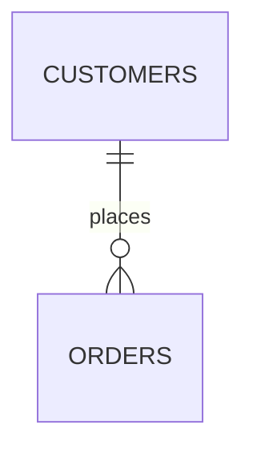

# 16. EXISTS vs JOIN

This is one of the most important practical distinctions in SQL.

Both `EXISTS` and `JOIN` can answer questions involving related tables, but they express **different intentions**.

The simplest mental model is:

```text
JOIN
→ "I need matching rows from both tables."

EXISTS
→ "I only need to know whether a matching row exists."
```

---

# 1. Start With an Example

Suppose we have:

### `customers`

| id | name    |
| -: | ------- |
|  1 | Alice   |
|  2 | Bob     |
|  3 | Charlie |

### `orders`

|  id | customer_id | amount |
| --: | ----------: | -----: |
| 101 |           1 |    100 |
| 102 |           1 |    200 |
| 103 |           2 |    500 |

Relationship:



Alice has two orders.

Bob has one.

Charlie has none.

---

# 2. Requirement: Show Customers and Their Orders

Here we need data from both tables.

```sql
SELECT
    c.name,
    o.id AS order_id,
    o.amount
FROM customers AS c
JOIN orders AS o
    ON c.id = o.customer_id;
```

Result:

| name  | order_id | amount |
| ----- | -------: | -----: |
| Alice |      101 |    100 |
| Alice |      102 |    200 |
| Bob   |      103 |    500 |

This is exactly what a `JOIN` is for.

We need:

```text
customer information
        +
order information
```

---

# 3. Requirement: Show Customers Who Have Orders

Now the requirement changes:

> Which customers have placed at least one order?

We don't need:

* order ID
* order amount
* order date
* any other order information

We only need to know:

```text
Does an order exist?
```

So:

```sql
SELECT
    c.id,
    c.name
FROM customers AS c
WHERE EXISTS (
    SELECT 1
    FROM orders AS o
    WHERE o.customer_id = c.id
);
```

Result:

| id | name  |
| -: | ----- |
|  1 | Alice |
|  2 | Bob   |

---

# 4. Why Not Just Use JOIN?

You could write:

```sql
SELECT
    c.id,
    c.name
FROM customers AS c
JOIN orders AS o
    ON c.id = o.customer_id;
```

But the intermediate result is:

```text
Alice + Order 101
Alice + Order 102
Bob   + Order 103
```

So the final output becomes:

```text
Alice
Alice
Bob
```

If you only select customer columns, Alice appears multiple times.

---

# 5. Then We Add DISTINCT

You might fix it with:

```sql
SELECT DISTINCT
    c.id,
    c.name
FROM customers AS c
JOIN orders AS o
    ON c.id = o.customer_id;
```

Result:

| id | name  |
| -: | ----- |
|  1 | Alice |
|  2 | Bob   |

Correct.

But notice what we're doing:

```text
JOIN
 ↓
create multiple customer/order combinations
 ↓
DISTINCT
 ↓
remove repeated customers
```

Whereas `EXISTS` says directly:

```text
Customer
   ↓
Does an order exist?
   ↓
YES
   ↓
Return customer
```

---

# 6. The Fundamental Difference

## `JOIN`

A join produces combinations of matching rows.

```text
A1 ─── B1
A1 ─── B2
A1 ─── B3
```

If one A row matches three B rows:

```text
1 A row
   ↓
3 result rows
```

---

## `EXISTS`

`EXISTS` only asks whether at least one match exists.

```text
A1
 │
 ├── B1 ✓
 ├── B2
 └── B3

At least one?
     ↓
    YES
     ↓
   A1 once
```

This is the essence of a semi join.

---

# 7. `EXISTS` Is About Existence, Not Data Retrieval

Consider:

```sql
WHERE EXISTS (
    SELECT 1
    FROM orders AS o
    WHERE o.customer_id = c.id
)
```

The database doesn't conceptually need:

```text
order 101
order 102
order 103
```

as output.

It needs the answer:

```text
TRUE
```

or:

```text
FALSE
```

For Alice:

```text
EXISTS → TRUE
```

For Charlie:

```text
EXISTS → FALSE
```

---

# 8. `EXISTS` With Multiple Matching Rows

This is especially important.

Alice has:

```text
Order 101
Order 102
```

The following:

```sql
WHERE EXISTS (
    SELECT 1
    FROM orders o
    WHERE o.customer_id = c.id
)
```

doesn't care whether Alice has:

```text
1 order
```

or:

```text
100 orders
```

or:

```text
1,000,000 orders
```

For the existence question, the answer is simply:

```text
TRUE
```

---

# 9. A Useful Question to Ask Yourself

Whenever you're writing a query, ask:

> **Do I need to return information from the second table?**

### Yes

Think:

```text
JOIN
```

### No

Ask:

> **Do I only need to know whether a related row exists?**

If yes:

```text
EXISTS
```

This simple question solves many query-design problems.

---

# 10. Example: Customers With an Order Over $1,000

Requirement:

> Find customers who have at least one order greater than $1,000.

Using `EXISTS`:

```sql
SELECT
    c.id,
    c.name
FROM customers AS c
WHERE EXISTS (
    SELECT 1
    FROM orders AS o
    WHERE o.customer_id = c.id
      AND o.amount > 1000
);
```

Notice that we're not asking:

```text
Which orders?
```

We're asking:

```text
Does at least one qualifying order exist?
```

---

# 11. What If We Used JOIN?

We could write:

```sql
SELECT DISTINCT
    c.id,
    c.name
FROM customers AS c
JOIN orders AS o
    ON c.id = o.customer_id
WHERE o.amount > 1000;
```

This can produce the same customer set.

But the two queries communicate different ideas.

### JOIN version

```text
Find matching customer/order rows
then
deduplicate customers
```

### EXISTS version

```text
Find customers for whom
a qualifying order exists
```

The latter directly expresses the requirement.

---

# 12. `EXISTS` Can Have Complex Conditions

Suppose:

> Find customers who have placed a successful order in the last 30 days.

```sql
SELECT
    c.id,
    c.name
FROM customers AS c
WHERE EXISTS (
    SELECT 1
    FROM orders AS o
    WHERE o.customer_id = c.id
      AND o.status = 'SUCCESS'
      AND o.created_at >= CURRENT_DATE - INTERVAL '30 days'
);
```

This is a very natural SQL representation of the business rule:

```text
customer
   │
   ▼
exists an order where:
   ├── customer matches
   ├── status = SUCCESS
   └── created recently
```

---

# 13. JOIN Is Better When You Need B's Data

Suppose the requirement is:

> Show customers and their most recent order date.

Now we need information from `orders`.

A simple join-based query might be:

```sql
SELECT
    c.id,
    c.name,
    MAX(o.created_at) AS last_order_date
FROM customers AS c
LEFT JOIN orders AS o
    ON c.id = o.customer_id
GROUP BY
    c.id,
    c.name;
```

Here `EXISTS` doesn't solve the problem because we actually need:

```text
MAX(o.created_at)
```

We need data from `orders`.

---

# 14. Another Example: Product Information

Requirement:

> Show every product that has at least one order item.

`EXISTS` is appropriate:

```sql
SELECT
    p.id,
    p.name
FROM products AS p
WHERE EXISTS (
    SELECT 1
    FROM order_items AS oi
    WHERE oi.product_id = p.id
);
```

But requirement:

> Show the product name, order ID, and quantity purchased.

Now use a join:

```sql
SELECT
    p.name,
    oi.order_id,
    oi.quantity
FROM products AS p
JOIN order_items AS oi
    ON p.id = oi.product_id;
```

Because we need information from both sides.

---

# 15. `EXISTS` vs `JOIN + DISTINCT`

This is a common interview discussion.

### Query A

```sql
SELECT DISTINCT c.id
FROM customers AS c
JOIN orders AS o
    ON c.id = o.customer_id;
```

### Query B

```sql
SELECT c.id
FROM customers AS c
WHERE EXISTS (
    SELECT 1
    FROM orders AS o
    WHERE o.customer_id = c.id
);
```

Both can represent:

> Customers having at least one order.

But their conceptual operations differ.

```text
JOIN + DISTINCT

customers
    ↓
match orders
    ↓
many rows
    ↓
DISTINCT
    ↓
unique customers
```

Versus:

```text
EXISTS

customer
    ↓
does matching order exist?
    ↓
YES
    ↓
customer
```

---

# 16. Does EXISTS Always Perform Better?

No.

This is an important rule.

Don't memorize:

```text
EXISTS = fast
JOIN = slow
```

That is not generally true.

PostgreSQL's optimizer can transform logically equivalent queries and choose an appropriate execution strategy.

Actual performance depends on things such as:

* table sizes
* indexes
* statistics
* data distribution
* selectivity
* PostgreSQL version
* query structure
* available join algorithms

So choose based primarily on **correct semantics and clarity**, then verify performance with:

```sql
EXPLAIN ANALYZE
```

We'll study that later.

---

# 17. PostgreSQL Can Recognize Semi Joins

An `EXISTS` query can be represented internally as a semi join.

For example:

```sql
SELECT c.*
FROM customers c
WHERE EXISTS (
    SELECT 1
    FROM orders o
    WHERE o.customer_id = c.id
);
```

The execution plan may contain something like:

```text
Hash Semi Join
```

or:

```text
Nested Loop Semi Join
```

or:

```text
Merge Semi Join
```

So although your SQL says:

```text
EXISTS
```

the PostgreSQL planner can reason about it as:

```text
Semi Join
```

---

# 18. Correlated `EXISTS`

The following is a **correlated subquery**:

```sql
SELECT
    c.id,
    c.name
FROM customers AS c
WHERE EXISTS (
    SELECT 1
    FROM orders AS o
    WHERE o.customer_id = c.id
);
```

Why is it correlated?

Because the inner query refers to the outer query:

```text
                 outer query
                     │
                     │ c.id
                     ▼
SELECT 1
FROM orders o
WHERE o.customer_id = c.id
```

The inner condition depends on the current customer.

---

# 19. Think About It Row by Row

Conceptually:

```text
Alice
  ↓
Does an order exist for customer_id = 1?
  ↓
YES
  ↓
keep Alice


Bob
  ↓
Does an order exist for customer_id = 2?
  ↓
YES
  ↓
keep Bob


Charlie
  ↓
Does an order exist for customer_id = 3?
  ↓
NO
  ↓
discard Charlie
```

This is a useful learning model.

The PostgreSQL optimizer may execute it much more efficiently than literally running a complete subquery independently for every row.

---

# 20. Important: "Correlated" Does Not Automatically Mean Slow

A common misconception is:

> "Correlated subqueries are always slow."

Not necessarily.

For example:

```sql
WHERE EXISTS (...)
```

is a very common and useful SQL pattern.

PostgreSQL can optimize it into a semi-join strategy.

So don't avoid `EXISTS` just because it is correlated.

---

# 21. `EXISTS` and Early Match Detection

Conceptually, an existence test doesn't need to find every matching row.

Suppose:

```text
Alice
 │
 ├── Order 101 ✓
 ├── Order 102
 ├── Order 103
 ├── Order 104
 └── Order 105
```

Once PostgreSQL establishes:

```text
At least one matching row exists
```

the existence condition is satisfied.

This is fundamentally different from a query that needs to return or aggregate every matching order.

---

# 22. Example: Employees With Active Projects

Tables:

```text
employees
----------
id
name

employee_projects
-----------------
employee_id
project_id
status
```

Requirement:

> Find employees who are assigned to at least one active project.

Use:

```sql
SELECT
    e.id,
    e.name
FROM employees AS e
WHERE EXISTS (
    SELECT 1
    FROM employee_projects AS ep
    WHERE ep.employee_id = e.id
      AND ep.status = 'ACTIVE'
);
```

Notice how cleanly it maps to the requirement:

```text
employee
   ↓
exists employee_project
   ↓
employee_id matches
   AND
status = ACTIVE
```

---

# 23. The Opposite: `NOT EXISTS`

Now change the requirement:

> Find employees who are not assigned to any active project.

```sql
SELECT
    e.id,
    e.name
FROM employees AS e
WHERE NOT EXISTS (
    SELECT 1
    FROM employee_projects AS ep
    WHERE ep.employee_id = e.id
      AND ep.status = 'ACTIVE'
);
```

This is the anti-join version.

```text
EXISTS
    ↓
at least one matching row
    ↓
keep A


NOT EXISTS
    ↓
zero matching rows
    ↓
keep A
```

---

# 24. `EXISTS` vs `IN`

For positive existence checks, these can often represent similar logic.

### EXISTS

```sql
SELECT c.*
FROM customers c
WHERE EXISTS (
    SELECT 1
    FROM orders o
    WHERE o.customer_id = c.id
);
```

### IN

```sql
SELECT c.*
FROM customers c
WHERE c.id IN (
    SELECT o.customer_id
    FROM orders o
);
```

Conceptually:

```text
EXISTS
→ Does a matching row exist?

IN
→ Is this value contained in the resulting set?
```

`EXISTS` is particularly natural when the relationship involves multiple conditions:

```sql
WHERE EXISTS (
    SELECT 1
    FROM orders o
    WHERE o.customer_id = c.id
      AND o.status = 'SUCCESS'
      AND o.amount > 1000
);
```

---

# 25. The NULL Difference to Remember

This is especially important for `NOT IN`.

Suppose:

```text
orders.customer_id

1
2
NULL
```

Then:

```sql
WHERE c.id NOT IN (
    SELECT customer_id
    FROM orders
)
```

can behave unexpectedly because SQL's three-valued logic interacts with the `NULL`.

For negative existence:

```sql
WHERE NOT EXISTS (...)
```

avoids this particular `NOT IN`/`NULL` problem.

So as a practical rule:

```text
Positive existence:
    EXISTS
    IN can sometimes work

Negative existence:
    NOT EXISTS
    be very careful with NOT IN
```

---

# 26. A Common Real-World Mistake

Suppose you need:

> Customers who have at least one successful order.

Someone writes:

```sql
SELECT c.id, c.name
FROM customers c
JOIN orders o
    ON c.id = o.customer_id
WHERE o.status = 'SUCCESS';
```

This returns one row per successful order.

If Alice has:

```text
Order 1 → SUCCESS
Order 2 → SUCCESS
Order 3 → FAILED
```

the query returns:

```text
Alice
Alice
```

If the requirement is only:

> Which customers have at least one successful order?

Then:

```sql
SELECT c.id, c.name
FROM customers c
WHERE EXISTS (
    SELECT 1
    FROM orders o
    WHERE o.customer_id = c.id
      AND o.status = 'SUCCESS'
);
```

returns:

```text
Alice
```

once.

---

# 27. When `JOIN` and `EXISTS` Produce the Same Output

Suppose `orders.customer_id` is guaranteed unique.

Then:

```sql
SELECT c.id
FROM customers c
JOIN orders o
  ON c.id = o.customer_id;
```

could naturally return each customer once.

In that specific data model:

```text
Customer 1 → at most one order
```

So there's no multiplication.

But if the relationship is:

```text
Customer 1 → many orders
```

then the difference becomes important.

This is why **cardinality** matters.

---

# 28. Connect This With What We Learned Earlier

You already learned:

```text
1 : N
```

means:

```text
one customer
    ↓
many orders
```

Therefore:

```sql
JOIN
```

can transform:

```text
1 customer
```

into:

```text
N result rows
```

But:

```sql
EXISTS
```

can transform:

```text
1 customer
```

into:

```text
1 result row
```

provided at least one matching order exists.

So:

```text
Cardinality
     ↓
determines JOIN multiplication
     ↓
which influences whether EXISTS is the better expression
```

---

# 29. A Decision Framework

When you see a query requirement, walk through these questions.

### Question 1

Do I need columns from both tables?

```text
YES
 ↓
JOIN
```

### Question 2

If not, do I only need to know whether a related row exists?

```text
YES
 ↓
EXISTS
```

### Question 3

Do I need to know that no related row exists?

```text
YES
 ↓
NOT EXISTS
```

### Question 4

Can the relationship produce multiple matches?

```text
YES
 ↓
Be careful with JOIN
```

---

# 30. Practical Comparison Table

| Requirement                            | Typical pattern   |
| -------------------------------------- | ----------------- |
| Get customer + order data              | `JOIN`            |
| Get customers having orders            | `EXISTS`          |
| Get customers without orders           | `NOT EXISTS`      |
| Get customer + number of orders        | `JOIN + GROUP BY` |
| Get customers with order > $100        | `EXISTS`          |
| Get customers + matching order details | `JOIN`            |
| Get products that were purchased       | `EXISTS`          |
| Get products + purchase details        | `JOIN`            |
| Get employees with active projects     | `EXISTS`          |
| Get employees without active projects  | `NOT EXISTS`      |

---

# 31. The Most Important Mental Model

Think of these three operators as answering three different questions:

```text
JOIN
│
└── "What matching combinations exist?"


EXISTS
│
└── "Does at least one match exist?"


NOT EXISTS
│
└── "Does no match exist?"
```

Or visually:

```text
                    Relationship
                         │
              ┌──────────┼──────────┐
              │          │          │
             JOIN      EXISTS    NOT EXISTS
              │          │          │
              ▼          ▼          ▼
        Return match   Match?     No match?
        combinations   YES → A    YES → A
```

---

# 32. Golden Rules

1. **Use `JOIN` when you need data from the related table.**
2. **Use `EXISTS` when you only care whether a related row exists.**
3. `JOIN` can multiply rows when the relationship is one-to-many.
4. `EXISTS` represents a semi-join and returns the outer row based on existence.
5. `JOIN + DISTINCT` can sometimes simulate existence, but it may be less direct semantically.
6. `EXISTS` can contain additional conditions such as status, date, amount, etc.
7. A correlated `EXISTS` references columns from the outer query.
8. Correlated `EXISTS` is not automatically slow; PostgreSQL can optimize it.
9. `NOT EXISTS` is the natural counterpart for "no matching row".
10. Be especially careful with `NOT IN` when `NULL` is possible.
11. Always consider **cardinality** before choosing a join.
12. Choose based on **what the query means**, then use `EXPLAIN ANALYZE` when performance needs verification.

---

# One-Line Rule

> **If you need the related row, use `JOIN`; if you only need to know whether the related row exists, use `EXISTS`.**

---

## Next: 17. JOIN with Aggregation

We'll combine joins with `COUNT`, `SUM`, `AVG`, `MIN`, and `MAX`, and cover the important problems around **LEFT JOIN + aggregation**, `COUNT(*)` vs `COUNT(column)`, and how join multiplication can produce incorrect aggregate results.

