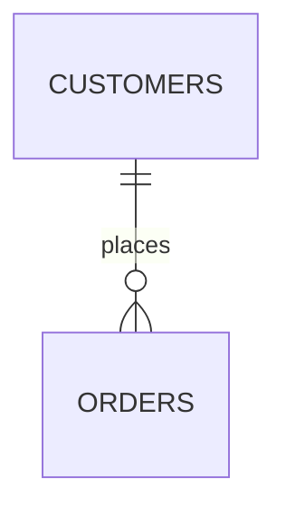

# 17. JOIN with Aggregation

Now we combine two important SQL concepts:

* **JOIN** → combines related rows
* **Aggregation** → summarizes multiple rows into a value

This is extremely common in real-world queries.

Examples:

> How many orders does each customer have?

> What is the total order amount for each customer?

> What is the average order value for each customer?

> Which customers have spent more than ₹10,000?

---

# 1. Start With the Basic Problem

Suppose we have:

### `customers`

| id | name    |
| -: | ------- |
|  1 | Alice   |
|  2 | Bob     |
|  3 | Charlie |

### `orders`

|  id | customer_id | amount |
| --: | ----------: | -----: |
| 101 |           1 |    100 |
| 102 |           1 |    200 |
| 103 |           2 |    500 |

Relationship:



We want:

> Show each customer and the number of orders they have.

---

# 2. First Join the Tables

Start with:

```sql
SELECT
    c.name,
    o.id AS order_id
FROM customers AS c
LEFT JOIN orders AS o
    ON c.id = o.customer_id;
```

Result:

| name    | order_id |
| ------- | -------: |
| Alice   |      101 |
| Alice   |      102 |
| Bob     |      103 |
| Charlie |     NULL |

Notice what the join has done.

```text
Alice
 ├── Order 101
 └── Order 102

Bob
 └── Order 103

Charlie
 └── no order
```

Now we need to summarize these rows.

That's where aggregation comes in.

---

# 3. `COUNT()` With a JOIN

```sql
SELECT
    c.id,
    c.name,
    COUNT(o.id) AS order_count
FROM customers AS c
LEFT JOIN orders AS o
    ON c.id = o.customer_id
GROUP BY
    c.id,
    c.name;
```

Result:

| id | name    | order_count |
| -: | ------- | ----------: |
|  1 | Alice   |           2 |
|  2 | Bob     |           1 |
|  3 | Charlie |           0 |

This is one of the most important JOIN + aggregation patterns.

---

# 4. Why `GROUP BY` Is Required

The join produces multiple rows:

```text
Alice  101
Alice  102
Bob    103
Charlie NULL
```

But we want:

```text
Alice    2
Bob      1
Charlie  0
```

So SQL needs to know:

> Which rows should be grouped together?

That's what `GROUP BY` specifies.

```sql
GROUP BY c.id, c.name
```

Conceptually:

```text
Joined rows
     │
     ▼
┌─────────────┐
│ Alice       │
│ Alice       │ ──→ COUNT → 2
├─────────────┤
│ Bob         │ ──→ COUNT → 1
├─────────────┤
│ Charlie     │ ──→ COUNT → 0
└─────────────┘
```

---

# 5. The Grain Changes

This connects directly to the **grain** concept we learned earlier.

Before aggregation:

```text
One row ≈ one order
```

After:

```text
One row ≈ one customer
```

So aggregation changes the grain.

```text
Before:

customer + order
customer + order
customer + order


After GROUP BY:

customer
customer
customer
```

This is a very important thing to understand.

---

# 6. `COUNT(*)` vs `COUNT(o.id)`

This is one of the most important JOIN + aggregation details.

Consider:

```sql
SELECT
    c.name,
    COUNT(*) AS count_star,
    COUNT(o.id) AS count_order_id
FROM customers AS c
LEFT JOIN orders AS o
    ON c.id = o.customer_id
GROUP BY c.id, c.name;
```

For Charlie, the joined row looks like:

| c.name  | o.id |
| ------- | ---: |
| Charlie | NULL |

### `COUNT(*)`

Counts rows:

```text
Charlie → 1
```

### `COUNT(o.id)`

Counts non-NULL `o.id` values:

```text
Charlie → 0
```

So:

| name    | `COUNT(*)` | `COUNT(o.id)` |
| ------- | ---------: | ------------: |
| Alice   |          2 |             2 |
| Bob     |          1 |             1 |
| Charlie |          1 |             0 |

---

# 7. Why Does This Happen?

Remember what a `LEFT JOIN` does.

Charlie has no matching order.

PostgreSQL still preserves Charlie:

```text
Charlie
   +
NULL order
```

Therefore there is still **one result row**.

So:

```sql
COUNT(*)
```

sees:

```text
1 row
```

But:

```sql
COUNT(o.id)
```

sees:

```text
o.id = NULL
```

and `COUNT(column)` ignores NULL.

Therefore:

```text
COUNT(*)     → 1
COUNT(o.id)  → 0
```

---

# 8. The General Rule for COUNT

### `COUNT(*)`

> Count rows.

```sql
COUNT(*)
```

### `COUNT(column)`

> Count non-NULL values in that column.

```sql
COUNT(o.id)
```

### `COUNT(DISTINCT column)`

> Count distinct non-NULL values.

```sql
COUNT(DISTINCT o.id)
```

This distinction becomes extremely important when joins are involved.

---

# 9. Counting Orders

For:

> How many orders does each customer have?

Use:

```sql
SELECT
    c.id,
    c.name,
    COUNT(o.id) AS order_count
FROM customers AS c
LEFT JOIN orders AS o
    ON c.id = o.customer_id
GROUP BY
    c.id,
    c.name;
```

Why `LEFT JOIN`?

Because we want Charlie.

If we used:

```sql
JOIN orders AS o
```

then Charlie would disappear before aggregation.

---

# 10. INNER JOIN vs LEFT JOIN With Aggregation

## INNER JOIN

```sql
SELECT
    c.name,
    COUNT(o.id) AS order_count
FROM customers AS c
JOIN orders AS o
    ON c.id = o.customer_id
GROUP BY c.id, c.name;
```

Result:

| name  | order_count |
| ----- | ----------: |
| Alice |           2 |
| Bob   |           1 |

Charlie disappears.

---

## LEFT JOIN

```sql
SELECT
    c.name,
    COUNT(o.id) AS order_count
FROM customers AS c
LEFT JOIN orders AS o
    ON c.id = o.customer_id
GROUP BY c.id, c.name;
```

Result:

| name    | order_count |
| ------- | ----------: |
| Alice   |           2 |
| Bob     |           1 |
| Charlie |           0 |

So the choice of JOIN type determines which groups can exist.

---

# 11. `SUM()` With JOIN

Now suppose we want:

> How much has each customer spent?

```sql
SELECT
    c.id,
    c.name,
    SUM(o.amount) AS total_spent
FROM customers AS c
LEFT JOIN orders AS o
    ON c.id = o.customer_id
GROUP BY
    c.id,
    c.name;
```

Potential result:

| name    | total_spent |
| ------- | ----------: |
| Alice   |         300 |
| Bob     |         500 |
| Charlie |        NULL |

Why is Charlie `NULL` rather than `0`?

Because there are no order amounts to sum.

---

# 12. Using `COALESCE()` With SUM

If the business requirement says:

> Customers with no orders should have total spending of zero.

Use:

```sql
SELECT
    c.id,
    c.name,
    COALESCE(SUM(o.amount), 0) AS total_spent
FROM customers AS c
LEFT JOIN orders AS o
    ON c.id = o.customer_id
GROUP BY
    c.id,
    c.name;
```

Result:

| name    | total_spent |
| ------- | ----------: |
| Alice   |         300 |
| Bob     |         500 |
| Charlie |           0 |

Remember:

```text
SUM(no values) → NULL
```

while:

```text
COUNT(no matching IDs) → 0
```

---

# 13. `AVG()` With JOIN

Suppose:

> What is the average order value for each customer?

```sql
SELECT
    c.id,
    c.name,
    AVG(o.amount) AS average_order_value
FROM customers AS c
LEFT JOIN orders AS o
    ON c.id = o.customer_id
GROUP BY
    c.id,
    c.name;
```

Alice:

```text
100 + 200
───────── = 150
    2
```

Bob:

```text
500
```

Charlie:

```text
NULL
```

because there are no order amounts.

---

# 14. `MIN()` and `MAX()`

You can use other aggregate functions too.

### Highest order

```sql
SELECT
    c.id,
    c.name,
    MAX(o.amount) AS largest_order
FROM customers AS c
LEFT JOIN orders AS o
    ON c.id = o.customer_id
GROUP BY c.id, c.name;
```

### Smallest order

```sql
SELECT
    c.id,
    c.name,
    MIN(o.amount) AS smallest_order
FROM customers AS c
LEFT JOIN orders AS o
    ON c.id = o.customer_id
GROUP BY c.id, c.name;
```

### Total

```sql
SUM(o.amount)
```

### Average

```sql
AVG(o.amount)
```

### Count

```sql
COUNT(o.id)
```

---

# 15. Multiple Aggregations

You can calculate several metrics together:

```sql
SELECT
    c.id,
    c.name,
    COUNT(o.id) AS order_count,
    COALESCE(SUM(o.amount), 0) AS total_spent,
    AVG(o.amount) AS average_order,
    MIN(o.amount) AS smallest_order,
    MAX(o.amount) AS largest_order
FROM customers AS c
LEFT JOIN orders AS o
    ON c.id = o.customer_id
GROUP BY
    c.id,
    c.name;
```

Conceptually:

```text
Customer
   │
   ├── orders
   │
   └── aggregate
        ├── COUNT
        ├── SUM
        ├── AVG
        ├── MIN
        └── MAX
```

---

# 16. Important: JOIN Happens Before Aggregation

A useful logical model is:

```text
FROM
  ↓
JOIN
  ↓
WHERE
  ↓
GROUP BY
  ↓
Aggregate functions
  ↓
HAVING
  ↓
SELECT
```

For our query:

```sql
SELECT
    c.name,
    COUNT(o.id)
FROM customers c
LEFT JOIN orders o
    ON c.id = o.customer_id
GROUP BY c.id, c.name;
```

Think:

```text
customers
    ↓
JOIN orders
    ↓
joined rows
    ↓
GROUP BY customer
    ↓
COUNT orders
    ↓
result
```

This is why **join multiplication can corrupt aggregates**.

---

# 17. The Dangerous Join Multiplication Problem

Consider:

### `orders`

|  id | customer_id |
| --: | ----------: |
| 101 |           1 |
| 102 |           1 |
| 103 |           1 |

Alice has 3 orders.

### `support_tickets`

|  id | customer_id |
| --: | ----------: |
| 201 |           1 |
| 202 |           1 |

Alice has 2 tickets.

Now suppose we write:

```sql
SELECT
    c.id,
    c.name,
    COUNT(o.id) AS order_count,
    COUNT(t.id) AS ticket_count
FROM customers AS c
LEFT JOIN orders AS o
    ON c.id = o.customer_id
LEFT JOIN support_tickets AS t
    ON c.id = t.customer_id
GROUP BY
    c.id,
    c.name;
```

What happens?

---

# 18. The Join Explosion

Orders:

```text
101
102
103
```

Tickets:

```text
201
202
```

The second JOIN creates:

```text
101 + 201
101 + 202

102 + 201
102 + 202

103 + 201
103 + 202
```

That's:

```text
3 × 2 = 6 rows
```

Visual:

```text
             Tickets
             201   202
           ┌─────┬─────┐
Order 101  │  X  │  X  │
Order 102  │  X  │  X  │
Order 103  │  X  │  X  │
           └─────┴─────┘

             3 × 2 = 6
```

---

# 19. The Incorrect Counts

The query sees:

```text
order 101 → appears 2 times
order 102 → appears 2 times
order 103 → appears 2 times
```

Therefore:

```text
COUNT(o.id) = 6
```

But Alice actually has:

```text
3 orders
```

Similarly:

```text
COUNT(t.id) = 6
```

but she actually has:

```text
2 tickets
```

This is the **join multiplication problem** we learned earlier.

---

# 20. `COUNT(DISTINCT ...)` Can Fix the Count

You could write:

```sql
SELECT
    c.id,
    c.name,
    COUNT(DISTINCT o.id) AS order_count,
    COUNT(DISTINCT t.id) AS ticket_count
FROM customers AS c
LEFT JOIN orders AS o
    ON c.id = o.customer_id
LEFT JOIN support_tickets AS t
    ON c.id = t.customer_id
GROUP BY
    c.id,
    c.name;
```

Now:

```text
order_count  = 3
ticket_count = 2
```

This is sometimes perfectly appropriate.

But there is a deeper issue.

We still generated:

```text
3 × 2 = 6
```

intermediate rows.

---

# 21. Better Pattern: Aggregate Before Joining

If the requirement is:

> Give me one row per customer with order count and ticket count.

Aggregate each independent child table first.

```sql
SELECT
    c.id,
    c.name,
    COALESCE(o.order_count, 0) AS order_count,
    COALESCE(t.ticket_count, 0) AS ticket_count
FROM customers AS c
LEFT JOIN (
    SELECT
        customer_id,
        COUNT(*) AS order_count
    FROM orders
    GROUP BY customer_id
) AS o
    ON c.id = o.customer_id
LEFT JOIN (
    SELECT
        customer_id,
        COUNT(*) AS ticket_count
    FROM support_tickets
    GROUP BY customer_id
) AS t
    ON c.id = t.customer_id;
```

Now:

```text
orders
   ↓
GROUP BY customer
   ↓
one row/customer

tickets
   ↓
GROUP BY customer
   ↓
one row/customer

        ↓
      JOIN
        ↓
one row/customer
```

This avoids the N × M multiplication.

---

# 22. Think About Grain

This is the most important concept when using aggregation with joins.

Before aggregation:

```text
orders
→ one row = one order
```

After:

```sql
GROUP BY customer_id
```

the grain becomes:

```text
one row = one customer
```

So:

```text
orders
3 rows
   ↓
GROUP BY customer
   ↓
1 row
```

For tickets:

```text
tickets
2 rows
   ↓
GROUP BY customer
   ↓
1 row
```

Then:

```text
customer
   +
order_summary
   +
ticket_summary
```

all have the same grain:

```text
one row = one customer
```

That is why the final join is safe.

---

# 23. A Very Useful Rule

Before joining aggregated data, ask:

> **What does one row represent in each input?**

For example:

```text
customers
→ one row = one customer

order_summary
→ one row = one customer

ticket_summary
→ one row = one customer
```

Excellent.

But:

```text
customers
→ one row = one customer

orders
→ one row = one order

tickets
→ one row = one ticket
```

Joining both children directly can create:

```text
customer × orders × tickets
```

and potentially multiply the data.

---

# 24. Aggregation With a Filter

Suppose we want:

> Number of successful orders per customer.

You could use:

```sql
SELECT
    c.id,
    c.name,
    COUNT(o.id) AS successful_orders
FROM customers AS c
LEFT JOIN orders AS o
    ON c.id = o.customer_id
   AND o.status = 'SUCCESS'
GROUP BY
    c.id,
    c.name;
```

Notice where the condition is:

```sql
AND o.status = 'SUCCESS'
```

inside `ON`.

Why?

Because we want:

```text
all customers
+
only successful orders attached to them
```

This preserves customers with zero successful orders.

---

# 25. What If We Put the Filter in WHERE?

```sql
SELECT
    c.id,
    c.name,
    COUNT(o.id) AS successful_orders
FROM customers AS c
LEFT JOIN orders AS o
    ON c.id = o.customer_id
WHERE o.status = 'SUCCESS'
GROUP BY
    c.id,
    c.name;
```

Now customers with no matching successful order can disappear.

Remember the earlier lesson:

```text
LEFT JOIN
+
WHERE condition on right table
```

can effectively remove the unmatched rows.

So for conditional aggregation with a `LEFT JOIN`, be very careful about where the condition goes.

---

# 26. PostgreSQL `FILTER`

PostgreSQL gives us another very useful technique:

```sql
COUNT(*) FILTER (WHERE ...)
```

For example:

```sql
SELECT
    c.id,
    c.name,
    COUNT(o.id) AS total_orders,
    COUNT(o.id) FILTER (
        WHERE o.status = 'SUCCESS'
    ) AS successful_orders
FROM customers AS c
LEFT JOIN orders AS o
    ON c.id = o.customer_id
GROUP BY
    c.id,
    c.name;
```

This lets us calculate multiple conditional aggregates from the same joined rows.

Example:

| name    | total_orders | successful_orders |
| ------- | -----------: | ----------------: |
| Alice   |            5 |                 4 |
| Bob     |            2 |                 1 |
| Charlie |            0 |                 0 |

---

# 27. Multiple Conditional Aggregates

You can do:

```sql
SELECT
    c.id,
    c.name,

    COUNT(o.id) AS total_orders,

    COUNT(o.id) FILTER (
        WHERE o.status = 'SUCCESS'
    ) AS successful_orders,

    COUNT(o.id) FILTER (
        WHERE o.status = 'FAILED'
    ) AS failed_orders,

    COALESCE(
        SUM(o.amount) FILTER (
            WHERE o.status = 'SUCCESS'
        ),
        0
    ) AS successful_amount

FROM customers AS c

LEFT JOIN orders AS o
    ON c.id = o.customer_id

GROUP BY
    c.id,
    c.name;
```

This is very useful in reporting queries.

---

# 28. Aggregation + JOIN + HAVING

Suppose we want:

> Customers who have placed at least 3 orders.

```sql
SELECT
    c.id,
    c.name,
    COUNT(o.id) AS order_count
FROM customers AS c
JOIN orders AS o
    ON c.id = o.customer_id
GROUP BY
    c.id,
    c.name
HAVING COUNT(o.id) >= 3;
```

Result might be:

| id | name  | order_count |
| -: | ----- | ----------: |
|  1 | Alice |           5 |
|  7 | David |           8 |

`HAVING` filters **groups**, not individual rows.

We'll explore `GROUP BY` and `HAVING` in more depth in the next concept.

---

# 29. WHERE vs HAVING

Very important distinction:

### `WHERE`

Filters rows **before grouping**.

```sql
WHERE o.status = 'SUCCESS'
```

### `HAVING`

Filters groups **after aggregation**.

```sql
HAVING COUNT(o.id) >= 3
```

Mental model:

```text
Rows
  ↓
JOIN
  ↓
WHERE
  ↓
GROUP BY
  ↓
Aggregate
  ↓
HAVING
  ↓
Final groups
```

---

# 30. Common Aggregation Mistake

Suppose you want:

> Customers who spent more than ₹10,000.

Don't write:

```sql
WHERE SUM(o.amount) > 10000
```

`SUM()` is an aggregate and operates at the group level.

Use:

```sql
HAVING SUM(o.amount) > 10000
```

Example:

```sql
SELECT
    c.id,
    c.name,
    SUM(o.amount) AS total_spent
FROM customers AS c
JOIN orders AS o
    ON c.id = o.customer_id
GROUP BY
    c.id,
    c.name
HAVING SUM(o.amount) > 10000;
```

---

# 31. Common Mistake: Using INNER JOIN When Zero Matters

Requirement:

> Show every customer and their order count, including customers with zero orders.

Wrong:

```sql
FROM customers c
JOIN orders o
    ON c.id = o.customer_id
```

Because customers with no orders disappear.

Correct:

```sql
FROM customers c
LEFT JOIN orders o
    ON c.id = o.customer_id
```

Then:

```sql
COUNT(o.id)
```

gives zero for customers with no orders.

---

# 32. Common Mistake: `COUNT(*)` for Child Counts

For:

> Number of orders per customer

Don't blindly write:

```sql
COUNT(*)
```

with a `LEFT JOIN`.

Use:

```sql
COUNT(o.id)
```

assuming `o.id` is the order's non-null primary key.

Why?

```text
No orders
    ↓
LEFT JOIN creates one NULL-extended row
    ↓
COUNT(*) = 1
COUNT(o.id) = 0
```

---

# 33. Common Mistake: Joining Multiple Child Tables

This is dangerous:

```sql
FROM customers c
LEFT JOIN orders o
    ON c.id = o.customer_id
LEFT JOIN payments p
    ON c.id = p.customer_id
LEFT JOIN tickets t
    ON c.id = t.customer_id
```

If each customer has many rows in each table:

```text
orders
×
payments
×
tickets
```

can produce huge intermediate results.

Before doing this, ask:

```text
What is the grain of each table?
```

and:

```text
Are these independent one-to-many relationships?
```

If yes, consider aggregating each child separately first.

---

# 34. Practical Pattern: One Row Per Customer

A very common reporting requirement is:

> Give me one row per customer containing several metrics.

For example:

```text
customer
order_count
total_spent
successful_orders
ticket_count
```

A safe design is:

```text
             ┌── orders ──→ aggregate ──┐
             │                           │
customers ───┼───────────────────────────┼──→ one row/customer
             │                           │
             └── tickets ─→ aggregate ──┘
```

Each branch is reduced to the same grain before joining.

---

# 35. The "Grain First" Method

When writing a JOIN + aggregation query, follow these steps.

### Step 1 — Define the desired output grain

For example:

```text
one row = one customer
```

### Step 2 — Identify the detail tables

```text
customers
orders
payments
tickets
```

### Step 3 — Determine cardinality

```text
customer 1:N orders
customer 1:N payments
customer 1:N tickets
```

### Step 4 — Ask whether independent N-side tables are being joined

If:

```text
orders × payments × tickets
```

could happen, be careful.

### Step 5 — Aggregate independently when necessary

```text
orders → one row/customer
payments → one row/customer
tickets → one row/customer
```

### Step 6 — Join the summaries

Now:

```text
customer
   +
order_summary
   +
payment_summary
   +
ticket_summary
```

all have the same grain.

---

# 36. Mental Model

The safest way to think about JOIN + aggregation is:

```text
              JOIN
               │
               ▼
        Intermediate rows
               │
               ▼
            GROUP BY
               │
               ▼
        Groups at desired
             grain
               │
               ▼
        Aggregate values
```

And always ask:

```text
"What does one row represent at this point?"
```

---

# 37. Golden Rules

1. **JOIN combines rows; aggregation summarizes rows.**
2. `GROUP BY` defines which rows belong to the same group.
3. `COUNT(*)` counts rows.
4. `COUNT(column)` counts non-NULL values.
5. With `LEFT JOIN`, `COUNT(child.id)` is usually what you want for child-row counts.
6. `SUM()` over no matching rows can return `NULL`; use `COALESCE()` when zero is the desired business value.
7. `LEFT JOIN` is important when you need groups with zero related rows.
8. JOIN happens before aggregation in the logical query model.
9. Joining multiple independent one-to-many tables can multiply rows and corrupt aggregates.
10. `COUNT(DISTINCT ...)` can sometimes correct counts, but don't use it blindly to hide join multiplication.
11. Consider aggregating independent child tables **before** joining them.
12. Always know the **grain** of the result.
13. `WHERE` filters rows; `HAVING` filters groups.
14. For conditional aggregation in PostgreSQL, `FILTER (WHERE ...)` is very useful.
15. Before writing a complicated reporting query, define: **"What should one result row represent?"**

---

# One Sentence to Remember

> **JOIN determines which detail rows come together; `GROUP BY` determines which rows are summarized together.**

---

## Next: 18. JOIN with `GROUP BY` / `HAVING`

We'll go deeper into **how `GROUP BY` actually works**, why PostgreSQL requires selected non-aggregate columns to be grouped, how `HAVING` differs from `WHERE`, and how to build queries such as:

```text
customers
→ orders
→ GROUP BY customer
→ HAVING total_spent > 10000
```

without accidentally filtering or aggregating at the wrong stage.

