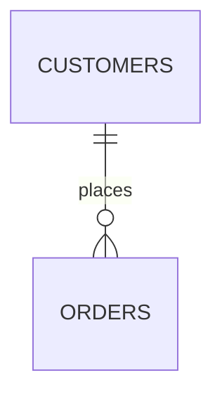
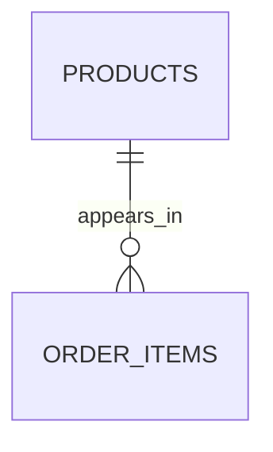

# 28. Real-World Query Design

This is the final concept in our **Database Relational Joins (PostgreSQL)** course.

So far, we've learned individual pieces:

```text
JOIN
LEFT JOIN
RIGHT JOIN
FULL JOIN
CROSS JOIN
SELF JOIN
    ↓
ON vs WHERE
    ↓
Cardinality
    ↓
Join explosion
    ↓
NULL
    ↓
EXISTS / NOT EXISTS
    ↓
Aggregation
    ↓
Subqueries / CTEs
    ↓
Join algorithms
    ↓
EXPLAIN ANALYZE
    ↓
Indexing
    ↓
Advanced JOIN patterns
```

Now the goal is to put all of that together.

The important skill is no longer:

> "Do I know SQL JOIN syntax?"

It becomes:

> **"Given a business requirement, can I design the correct query?"**

---

# 1. Start with the business requirement

Imagine the requirement is:

> "Show every customer, their number of orders, total amount spent, and their most recent order."

Don't immediately write SQL.

First break the requirement down:

```text
Customer
   |
   +---- number of orders
   |
   +---- total amount spent
   |
   +---- most recent order
```

We have three different types of information.

| Requirement       | Type               |
| ----------------- | ------------------ |
| Customer          | Base entity        |
| Number of orders  | Aggregate          |
| Total spent       | Aggregate          |
| Most recent order | Latest-row pattern |

This immediately tells us we shouldn't simply JOIN everything together.

---

# 2. Define the output grain

Ask:

> **What should one output row represent?**

The requirement says:

```text
one row per customer
```

Therefore:

```text
Output grain = customer
```

This is one of the most important decisions in query design.

---

# 3. Understand the schema

Suppose:

```text
customers
---------
id
name
email
```

```text
orders
------
id
customer_id
amount
created_at
status
```

Relationship:



Cardinality:

```text
customers 1 ───────── N orders
```

Therefore, a direct JOIN produces multiple rows per customer.

But our desired output is:

```text
1 customer → 1 result row
```

So we need to control the order side.

---

# 4. Build the order summary separately

First:

```sql
SELECT
    customer_id,
    COUNT(*) AS order_count,
    COALESCE(SUM(amount), 0) AS total_spent
FROM orders
GROUP BY customer_id;
```

Its grain is:

```text
one row per customer
```

Example:

```text
customer_id | order_count | total_spent
------------+-------------+------------
1           | 3           | 1700
2           | 1           | 300
```

Now this can safely be joined to `customers`.

---

# 5. Build the latest order separately

We also need:

```text
latest order per customer
```

Using `ROW_NUMBER()`:

```sql
SELECT
    id,
    customer_id,
    amount,
    created_at
FROM (
    SELECT
        id,
        customer_id,
        amount,
        created_at,
        ROW_NUMBER() OVER (
            PARTITION BY customer_id
            ORDER BY created_at DESC, id DESC
        ) AS rn
    FROM orders
) AS ranked_orders
WHERE rn = 1;
```

Its grain is also:

```text
one row per customer
```

Now we have:

```text
customers
    |
    +---- order_summary
    |
    +---- latest_order
```

Each side is already at the required grain.

---

# 6. Combine the results

```sql
WITH order_summary AS (
    SELECT
        customer_id,
        COUNT(*) AS order_count,
        COALESCE(SUM(amount), 0) AS total_spent
    FROM orders
    GROUP BY customer_id
),
latest_order AS (
    SELECT
        id,
        customer_id,
        amount,
        created_at
    FROM (
        SELECT
            id,
            customer_id,
            amount,
            created_at,
            ROW_NUMBER() OVER (
                PARTITION BY customer_id
                ORDER BY created_at DESC, id DESC
            ) AS rn
        FROM orders
    ) AS ranked_orders
    WHERE rn = 1
)
SELECT
    c.id,
    c.name,
    COALESCE(os.order_count, 0) AS order_count,
    COALESCE(os.total_spent, 0) AS total_spent,
    lo.id AS latest_order_id,
    lo.amount AS latest_order_amount,
    lo.created_at AS latest_order_at
FROM customers AS c
LEFT JOIN order_summary AS os
    ON c.id = os.customer_id
LEFT JOIN latest_order AS lo
    ON c.id = lo.customer_id;
```

Notice the architecture:

```text
                 customers
                 /       \
                /         \
               v           v
      order_summary     latest_order
       1 row/customer    1 row/customer
               \           /
                \         /
                 \       /
                  v     v
                 FINAL
             1 row/customer
```

This is a very strong query-design pattern.

---

# 7. Why not just JOIN `orders` once?

You might try:

```sql
SELECT
    c.id,
    c.name,
    COUNT(o.id),
    SUM(o.amount),
    MAX(o.created_at)
FROM customers AS c
LEFT JOIN orders AS o
    ON c.id = o.customer_id
GROUP BY c.id, c.name;
```

This is actually fine if you only need:

* count
* sum
* latest timestamp

But suppose you need:

```text
latest order ID
latest order amount
latest order status
latest order timestamp
```

`MAX(created_at)` gives you the timestamp, but not automatically the other columns belonging to that exact order.

That's when the **latest-row pattern** becomes useful.

---

# 8. Requirement: Customers who have never ordered

Business requirement:

> "Find customers who have never placed an order."

First recognize:

```text
Need columns from orders?
        |
        NO
        |
        v
Need existence information?
        |
        YES
        |
        v
Use NOT EXISTS
```

Query:

```sql
SELECT
    c.id,
    c.name
FROM customers AS c
WHERE NOT EXISTS (
    SELECT 1
    FROM orders AS o
    WHERE o.customer_id = c.id
);
```

This is much clearer than creating order rows and then eliminating them.

---

# 9. Requirement: Customers with at least one successful order

Use:

```sql
SELECT
    c.id,
    c.name
FROM customers AS c
WHERE EXISTS (
    SELECT 1
    FROM orders AS o
    WHERE o.customer_id = c.id
      AND o.status = 'SUCCESS'
);
```

Notice what we're **not** doing:

```sql
JOIN orders
```

because we don't need order details.

We only need the answer:

```text
Does at least one matching row exist?
```

That's exactly what `EXISTS` expresses.

---

# 10. Requirement: Customers with no successful orders

Use:

```sql
SELECT
    c.id,
    c.name
FROM customers AS c
WHERE NOT EXISTS (
    SELECT 1
    FROM orders AS o
    WHERE o.customer_id = c.id
      AND o.status = 'SUCCESS'
);
```

This is the logical opposite of `EXISTS`.

```text
EXISTS
→ at least one

NOT EXISTS
→ zero
```

---

# 11. Requirement: All customers and only successful orders

Now the requirement changes:

> "Show every customer, including customers without successful orders, but only attach successful orders."

This is different.

Use:

```sql
SELECT
    c.id,
    c.name,
    o.id AS order_id,
    o.amount
FROM customers AS c
LEFT JOIN orders AS o
    ON c.id = o.customer_id
   AND o.status = 'SUCCESS';
```

The key is:

```sql
AND o.status = 'SUCCESS'
```

inside `ON`.

Visual:

```text
customers
   |
   | LEFT JOIN
   |
   +---- successful orders
            |
            +---- matched
            |
            +---- no match → NULL
```

---

# 12. Requirement: Customers with at least 3 orders

Now we're filtering groups.

```sql
SELECT
    c.id,
    c.name,
    COUNT(o.id) AS order_count
FROM customers AS c
JOIN orders AS o
    ON c.id = o.customer_id
GROUP BY
    c.id,
    c.name
HAVING COUNT(o.id) >= 3;
```

Notice the sequence:

```text
JOIN
 ↓
rows
 ↓
GROUP BY customer
 ↓
COUNT
 ↓
HAVING count >= 3
```

`HAVING` is used because the condition is on an aggregate.

---

# 13. Requirement: Customers with zero or more orders, including zero

Now use:

```sql
SELECT
    c.id,
    c.name,
    COUNT(o.id) AS order_count
FROM customers AS c
LEFT JOIN orders AS o
    ON c.id = o.customer_id
GROUP BY
    c.id,
    c.name;
```

Why `COUNT(o.id)`?

Because:

```text
Customer with no order

customer row
     +
NULL-extended order
     ↓
o.id = NULL
     ↓
COUNT(o.id) = 0
```

Whereas:

```sql
COUNT(*)
```

would count the NULL-extended result row.

---

# 14. Requirement: Customers whose spending exceeds average customer spending

This is a more interesting problem.

First calculate spending per customer:

```sql
WITH customer_spending AS (
    SELECT
        customer_id,
        SUM(amount) AS total_spent
    FROM orders
    GROUP BY customer_id
)
SELECT
    c.id,
    c.name,
    cs.total_spent
FROM customers AS c
JOIN customer_spending AS cs
    ON c.id = cs.customer_id
WHERE cs.total_spent > (
    SELECT AVG(total_spent)
    FROM customer_spending
);
```

Notice the layers:

```text
orders
   ↓
GROUP BY customer
   ↓
customer_spending
   ↓
calculate average
   ↓
compare each customer
```

This is a classic example of **query decomposition**.

---

# 15. Requirement: Latest successful order per customer

Suppose:

> "For every customer, show their latest successful order."

First filter the relevant orders:

```sql
WITH ranked_orders AS (
    SELECT
        id,
        customer_id,
        amount,
        created_at,
        ROW_NUMBER() OVER (
            PARTITION BY customer_id
            ORDER BY created_at DESC, id DESC
        ) AS rn
    FROM orders
    WHERE status = 'SUCCESS'
)
SELECT
    c.id,
    c.name,
    ro.id AS order_id,
    ro.amount,
    ro.created_at
FROM customers AS c
LEFT JOIN ranked_orders AS ro
    ON c.id = ro.customer_id
   AND ro.rn = 1;
```

Notice the subtle but important distinction:

```text
Filter BEFORE ranking
```

not:

```text
Rank all orders
   ↓
then look for successful one
```

We want:

```text
successful orders
       ↓
rank successful orders
       ↓
take latest
```

---

# 16. Requirement: Products never purchased

Suppose:

```text
products
order_items
```

Relationship:



Requirement:

> "Find products that have never been purchased."

We don't need order-item data.

Use:

```sql
SELECT
    p.id,
    p.name
FROM products AS p
WHERE NOT EXISTS (
    SELECT 1
    FROM order_items AS oi
    WHERE oi.product_id = p.id
);
```

This is another anti-join.

---

# 17. Requirement: Students enrolled in at least one course

Schema:

```text
students
    |
    v
enrollments
    |
    v
courses
```

Requirement:

> "Find students enrolled in at least one course."

We only need student information:

```sql
SELECT
    s.id,
    s.name
FROM students AS s
WHERE EXISTS (
    SELECT 1
    FROM enrollments AS e
    WHERE e.student_id = s.id
);
```

If we need course information too:

```sql
SELECT
    s.name AS student,
    c.name AS course
FROM students AS s
JOIN enrollments AS e
    ON s.id = e.student_id
JOIN courses AS c
    ON e.course_id = c.id;
```

The requirement determines the query shape.

---

# 18. Requirement: Customers with multiple independent collections

Suppose the dashboard needs:

```text
Customer
---------
order count
ticket count
payment count
```

Schema:

```text
                 customers
                /    |     \
               /     |      \
              v      v       v
           orders tickets payments
```

A dangerous query is:

```sql
FROM customers c
LEFT JOIN orders o
    ON c.id = o.customer_id
LEFT JOIN tickets t
    ON c.id = t.customer_id
LEFT JOIN payments p
    ON c.id = p.customer_id
```

Suppose Alice has:

```text
3 orders
4 tickets
5 payments
```

Potential combinations:

```text
3 × 4 × 5 = 60 rows
```

This is the **join explosion** problem.

---

# 19. Correct design for independent collections

Aggregate each collection first:

```text
orders
   ↓
GROUP BY customer
   ↓
1 row/customer

tickets
   ↓
GROUP BY customer
   ↓
1 row/customer

payments
   ↓
GROUP BY customer
   ↓
1 row/customer
```

Then:

```text
             customers
             /   |   \
            /    |    \
           v     v     v
       orders  tickets payments
       summary summary summary
           \      |      /
            \     |     /
             \    |    /
                FINAL
```

This keeps the grain controlled.

---

# 20. Requirement: Find records missing from another system

Suppose we have:

```text
expected_customers
actual_customers
```

Requirement:

> "Which expected customers are missing from the actual system?"

Use:

```sql
SELECT
    e.id,
    e.name
FROM expected_customers AS e
WHERE NOT EXISTS (
    SELECT 1
    FROM actual_customers AS a
    WHERE a.id = e.id
);
```

This is a very common reconciliation pattern.

---

# 21. Requirement: Compare two systems

Now suppose we need:

```text
NEW
REMOVED
CHANGED
UNCHANGED
```

A `FULL OUTER JOIN` is appropriate:

```sql
SELECT
    e.id AS expected_id,
    e.name AS expected_name,
    a.id AS actual_id,
    a.name AS actual_name,
    CASE
        WHEN e.id IS NULL THEN 'NEW'
        WHEN a.id IS NULL THEN 'REMOVED'
        WHEN e.name IS DISTINCT FROM a.name THEN 'CHANGED'
        ELSE 'UNCHANGED'
    END AS status
FROM expected_customers AS e
FULL OUTER JOIN actual_customers AS a
    ON e.id = a.id;
```

Notice:

```sql
IS DISTINCT FROM
```

instead of:

```sql
<>
```

This matters when NULL values are possible.

---

# 22. Requirement: Employee and manager

Use a self-join:

```sql
SELECT
    e.name AS employee,
    m.name AS manager
FROM employees AS e
LEFT JOIN employees AS m
    ON e.manager_id = m.id;
```

Why `LEFT JOIN`?

Because the top-level employee might have:

```text
manager_id = NULL
```

and we still want that employee.

---

# 23. Requirement: Employee's entire management chain

Now a self-join isn't enough.

Suppose:

```text
Alice
  ↓
Bob
  ↓
Charlie
  ↓
David
```

If we want:

```text
David → Charlie → Bob → Alice
```

we need a recursive CTE.

```sql
WITH RECURSIVE management_chain AS (
    SELECT
        id,
        name,
        manager_id,
        0 AS level
    FROM employees
    WHERE id = 4

    UNION ALL

    SELECT
        m.id,
        m.name,
        m.manager_id,
        mc.level + 1
    FROM employees AS m
    JOIN management_chain AS mc
        ON m.id = mc.manager_id
)
SELECT *
FROM management_chain;
```

This is where **CTEs + JOINs + recursion** come together.

---

# 24. Requirement: Find orders using the price valid at order time

This is a temporal/range JOIN.

```sql
SELECT
    o.id AS order_id,
    o.product_id,
    o.created_at,
    p.price
FROM orders AS o
JOIN product_prices AS p
    ON o.product_id = p.product_id
   AND o.created_at >= p.valid_from
   AND o.created_at < p.valid_to;
```

The business relationship isn't:

```text
order.product_id = price.product_id
```

alone.

It is:

```text
same product
+
order timestamp belongs to price validity period
```

This is a good example of why understanding the **JOIN condition** matters more than memorizing JOIN types.

---

# 25. Requirement: Find the latest status of every order

Suppose:

```text
order_status_history

order_id
status
changed_at
```

We want:

```text
one latest status per order
```

Use:

```sql
WITH ranked_status AS (
    SELECT
        order_id,
        status,
        changed_at,
        ROW_NUMBER() OVER (
            PARTITION BY order_id
            ORDER BY changed_at DESC
        ) AS rn
    FROM order_status_history
)
SELECT
    o.id,
    o.created_at,
    rs.status
FROM orders AS o
LEFT JOIN ranked_status AS rs
    ON o.id = rs.order_id
   AND rs.rn = 1;
```

This pattern appears constantly in systems that store history instead of overwriting current state.

---

# 26. The most important query-design workflow

When given a SQL requirement, follow this sequence.

```text
                    BUSINESS REQUIREMENT
                             |
                             v
                  What should one row mean?
                             |
                             v
                           GRAIN
                             |
                             v
                    Identify base table
                             |
                             v
                    Identify relationships
                             |
                             v
                       CARDINALITY
                             |
                             v
             +---------------+---------------+
             |               |               |
             v               v               v
         Need rows?      Need existence?   Need summary?
             |               |               |
             v               v               v
            JOIN         EXISTS / NOT     GROUP BY
                              EXISTS          |
                                              v
                                            JOIN
```

Then ask:

```text
Does any JOIN multiply rows?
          |
          +---- YES
          |      |
          |      v
          |  Is multiplication intended?
          |      |
          |      +---- NO → change query shape
          |
          +---- YES → continue
```

Then:

```text
Do I need a specific related row?
          |
          +---- latest
          +---- earliest
          +---- highest
          +---- lowest
                    |
                    v
              ROW_NUMBER()
              DISTINCT ON
```

---

# 27. Think in terms of grain transitions

A powerful way to understand complex SQL is to track the grain after every stage.

Example:

```text
orders
↓
one row per order

GROUP BY customer_id
↓
one row per customer

JOIN customers
↓
one row per customer

JOIN latest_order
↓
still one row per customer
```

Compare that with:

```text
customers
↓
one row per customer

JOIN orders
↓
many rows per customer

JOIN order_items
↓
many rows per order

JOIN payments
↓
potential multiplication
```

The second query can become dangerous if you're expecting one row per customer.

---

# 28. Grain should be treated like a type

You can mentally think of:

```text
one row per customer
```

as a kind of type.

For example:

```text
customer_summary
    grain = customer
```

Then:

```text
latest_order
    grain = customer
```

Joining them:

```text
customer + customer
```

is safe from a grain perspective if the join key is unique on both sides.

But:

```text
customer
    +
orders
```

means:

```text
customer
    +
many orders
```

and therefore the grain changes.

This mental model is extremely useful for debugging SQL.

---

# 29. Validate assumptions with SQL

Suppose you believe:

> "There is only one profile per user."

Don't just assume it.

Check:

```sql
SELECT
    user_id,
    COUNT(*)
FROM user_profiles
GROUP BY user_id
HAVING COUNT(*) > 1;
```

If this returns rows, then your supposed 1:1 relationship isn't actually 1:1 in the data.

This matters because JOIN behavior follows **actual matching rows**, not what you mentally assumed.

---

# 30. Check uniqueness before relying on it

Suppose you're joining:

```sql
ON a.email = b.email
```

Ask:

> Is `email` unique in both tables?

Check:

```sql
SELECT
    email,
    COUNT(*)
FROM users
GROUP BY email
HAVING COUNT(*) > 1;
```

If email isn't unique:

```text
A.email = X
B.email = X
B.email = X
B.email = X
```

one A row can match three B rows.

Your JOIN is now:

```text
1 × 3 = 3 rows
```

This might be correct—or it might indicate a bug.

---

# 31. Never use `DISTINCT` as your first debugging strategy

Suppose you expected:

```text
100 customers
```

but got:

```text
2,500 rows
```

Don't immediately write:

```sql
SELECT DISTINCT ...
```

Instead ask:

```text
Why did 100 become 2,500?
```

Debug:

```text
customers
100
  ↓
JOIN orders
800
  ↓
JOIN tickets
2500
```

Now you know where multiplication happened.

Then investigate the relationship.

`DISTINCT` may hide the symptom without fixing the underlying logic.

---

# 32. Use incremental query construction

For a complex query, don't write everything at once.

Start:

```sql
SELECT *
FROM customers;
```

Then:

```sql
SELECT *
FROM customers AS c
JOIN orders AS o
    ON c.id = o.customer_id;
```

Then:

```sql
SELECT *
FROM customers AS c
JOIN orders AS o
    ON c.id = o.customer_id
JOIN order_items AS oi
    ON o.id = oi.order_id;
```

Then add the next relationship.

After every step, inspect:

```sql
SELECT COUNT(*)
```

This gives you:

```text
customers
   ↓
count

+ orders
   ↓
count

+ order_items
   ↓
count
```

You can identify the exact point where the result changes unexpectedly.

---

# 33. Then use `EXPLAIN ANALYZE`

Once the query is logically correct:

```sql
EXPLAIN (ANALYZE, BUFFERS)
SELECT ...
```

Now investigate performance.

Look for:

```text
Join algorithm
Scan type
Estimated rows
Actual rows
Loops
Execution time
Buffers
```

Especially:

```text
estimated rows ≠ actual rows
```

A large mismatch can lead to poor planner decisions.

---

# 34. Example performance investigation

Suppose you see:

```text
Nested Loop
  -> Index Scan
  -> Index Scan
       loops=1000000
```

Ask:

```text
Why is the inner operation running 1,000,000 times?
```

Maybe:

```text
outer input is unexpectedly huge
```

or:

```text
join condition isn't selective
```

or:

```text
planner underestimated rows
```

or:

```text
query genuinely needs many lookups
```

Don't conclude:

> "Nested Loop is bad."

Instead ask:

> **Why did PostgreSQL choose this plan, and what actually happened?**

---

# 35. Correctness first, performance second

A useful development order is:

```text
1. Understand requirement
       ↓
2. Define output grain
       ↓
3. Understand relationships
       ↓
4. Write logically correct query
       ↓
5. Validate row counts/results
       ↓
6. EXPLAIN
       ↓
7. EXPLAIN ANALYZE
       ↓
8. Investigate performance
       ↓
9. Add/change indexes if justified
       ↓
10. Re-measure
```

Don't optimize an incorrect query.

---

# 36. A complete mental checklist

Before finalizing a JOIN-heavy query, ask:

### Requirement

```text
What exactly does the business requirement ask for?
```

### Grain

```text
What does one output row represent?
```

### Relationships

```text
How are the tables related?
```

### Cardinality

```text
1:1?
1:N?
N:N?
```

### Preservation

```text
Which rows must never disappear?
```

This determines whether you need:

```text
INNER
LEFT
RIGHT
FULL
```

### Existence

```text
Do I actually need columns from the related table?
```

If no:

```text
EXISTS / NOT EXISTS
```

may be better conceptually.

### Multiplication

```text
Can this JOIN multiply rows?
```

### Aggregation

```text
Do I need one summary row per parent?
```

If yes:

```text
Aggregate first
```

### Specific row

```text
Do I need latest/highest/earliest?
```

Consider:

```text
ROW_NUMBER()
DISTINCT ON
```

### NULL

```text
What happens when no related row exists?
```

### Filtering

```text
Is this condition defining a match?
```

→ `ON`

or:

```text
Should this final row survive?
```

→ `WHERE`

### Performance

```text
What does EXPLAIN ANALYZE say?
```

---

# 37. The complete JOIN mental model

You can now think about PostgreSQL JOINs at several layers:

```text
                    BUSINESS REQUIREMENT
                            |
                            v
                         GRAIN
                            |
                            v
                       RELATIONSHIP
                            |
                            v
                       CARDINALITY
                            |
                            v
                     JOIN SEMANTICS
                            |
          +-----------------+----------------+
          |                 |                |
          v                 v                v
       JOIN             EXISTS          NOT EXISTS
          |
          v
   ON / WHERE
          |
          v
   Row multiplication
          |
          v
    Aggregation / ranking
          |
          v
      Final grain
          |
          v
    EXPLAIN ANALYZE
          |
          v
   Physical execution
          |
     +----+----+
     |    |    |
     v    v    v
   Loop Hash Merge
```

---

# 38. The biggest lessons from the entire course

If you remember only a few things, remember these:

### 1. JOIN is about relationships

```text
A.id = B.a_id
```

defines how rows relate.

---

### 2. Always understand cardinality

```text
1:N
```

naturally produces multiple rows.

---

### 3. Know your grain

Ask:

> **What does one result row represent?**

This prevents many SQL mistakes.

---

### 4. `LEFT JOIN` means "preserve the left side"

```text
A LEFT JOIN B
```

means:

```text
keep every A
```

---

### 5. `ON` and `WHERE` are not interchangeable with outer joins

```text
ON
→ matching logic

WHERE
→ final filtering
```

---

### 6. `EXISTS` is about existence

```text
Need B columns?
    |
    +-- YES → JOIN
    |
    +-- NO → EXISTS
```

---

### 7. `NOT EXISTS` is extremely useful

```text
"Find things that don't have..."
```

often maps naturally to:

```sql
NOT EXISTS (...)
```

---

### 8. Don't accidentally multiply independent collections

```text
3 orders × 4 tickets = 12
```

Aggregate independently when the desired grain requires it.

---

### 9. Reduce data to the correct grain before joining when appropriate

```text
raw data
   ↓
filter / rank / aggregate
   ↓
correct grain
   ↓
JOIN
```

---

### 10. SQL correctness and performance are different problems

First:

```text
Is the result correct?
```

Then:

```text
Is it efficient?
```

Use:

```sql
EXPLAIN (ANALYZE, BUFFERS)
```

to investigate the second question.

---

# 39. Final cheat sheet

| Problem                     | Think about                                  |
| --------------------------- | -------------------------------------------- |
| Need matching rows          | `INNER JOIN`                                 |
| Keep every parent           | `LEFT JOIN`                                  |
| Keep every right-side row   | `RIGHT JOIN`                                 |
| Keep everything             | `FULL OUTER JOIN`                            |
| Every combination           | `CROSS JOIN`                                 |
| Same table twice            | `SELF JOIN`                                  |
| At least one related row    | `EXISTS`                                     |
| No related row              | `NOT EXISTS`                                 |
| Latest row                  | `ROW_NUMBER()` / `DISTINCT ON`               |
| One summary per parent      | `GROUP BY` then JOIN                         |
| Multiple child collections  | Aggregate independently                      |
| Range relationship          | Range JOIN                                   |
| Historical/effective record | Temporal/range JOIN                          |
| Unexpected duplicates       | Check cardinality/grain                      |
| NULL problems               | `IS NULL`, `IS NOT NULL`, `IS DISTINCT FROM` |
| Performance investigation   | `EXPLAIN ANALYZE`                            |
| Join algorithm              | Nested Loop / Hash / Merge                   |
| Join access path            | Seq Scan / Index Scan / Bitmap etc.          |
| Slow query                  | Measure before changing things               |

---

# 40. Final principle

The deepest lesson of this entire course is:

```text
Don't start with:

"Which JOIN should I use?"
```

Start with:

```text
"What result do I need?"

        ↓

"What should one row represent?"

        ↓

"What relationships produce that row?"

        ↓

"How many matches can each relationship produce?"

        ↓

"Could my JOIN multiply rows?"

        ↓

"Do I need rows, existence, a summary, or one specific row?"

        ↓

"How should NULL / missing relationships behave?"

        ↓

"Is the query logically correct?"

        ↓

"How does PostgreSQL actually execute it?"
```

If you can reason through that sequence, you can handle most JOIN-heavy PostgreSQL queries without relying on memorized templates.

## Course completed

You have now covered the full roadmap from:

```text
Why JOINs?
   ↓
JOIN types
   ↓
JOIN conditions
   ↓
NULL
   ↓
Cardinality & grain
   ↓
Join explosion
   ↓
EXISTS / anti-joins
   ↓
Aggregation
   ↓
Subqueries / CTEs
   ↓
PostgreSQL join algorithms
   ↓
EXPLAIN ANALYZE
   ↓
Indexing
   ↓
Advanced JOIN patterns
   ↓
Real-world query design
```

**Database Relational Joins (PostgreSQL) — complete.**

