Let's build this properly — distributed compute is a big topic, so we'll go step by step, and I won't move to the next concept until you're solid on the current one.

## Chapter 1: The Problem (Early 2000s, Google)

Picture yourself as an engineer at Google around 2003. Your job: build the index that powers web search. To do that, you need to process **the entire crawled web** — billions of pages — and answer questions like:

- "How many times does each word appear across all pages?" (for search ranking)
- "Which pages link to which other pages?" (for PageRank)

Let's just focus on the simplest version of this: **word count across billions of documents.**

### The naive approach: one big machine

Your first instinct: write a normal program.

```
counts = {}
for each document in all_documents:
    for each word in document:
        counts[word] += 1
```

This works beautifully... on your laptop, with 1,000 documents. But Google's crawl has **billions** of documents, totaling petabytes of data.

Problems hit immediately:

1. **It doesn't fit.** A single machine's disk can't even *store* petabytes of data, let alone RAM.
2. **It's too slow.** Even if it fit, reading petabytes off one disk sequentially would take weeks.
3. **Single point of failure.** If that one machine crashes at hour 40 of a 50-hour job, you start over from zero.

So the obvious next idea: **buy a bigger machine.** More RAM, more disks, faster CPU. This is called **vertical scaling**.

That runs out fast too — there's a physical and economic ceiling on how big one machine can get, and you're now paying exponentially more for linear gains. Also: it doesn't fix problem 3 at all. One machine is still one point of failure.

### The next idea: split it across many machines

So engineers said: what if we take our data and **spread it across hundreds or thousands of cheap, commodity machines**, and have each machine process its own slice in parallel?

This is **horizontal scaling** — instead of one giant machine, you use many ordinary ones working together.

Sounds simple. In practice, this is where all the pain begins. If you tried to hand-write this yourself, you'd immediately run into a wall of new questions:

- How do I split the data across machines fairly?
- How does each machine know what work to do?
- What happens when a machine dies halfway through (and at this scale, with thousands of cheap machines, **something is always dying**)?
- How do I combine partial results from thousands of machines into one final answer?
- How do I avoid moving petabytes of data over the network unnecessarily (network is slow compared to local disk)?

Engineers at Google (and before them, in functional programming) had noticed something: a *huge* class of these big-data problems — word count, log analysis, link counting, sorting — all shared the same shape:

1. Look at each piece of data **independently**, and emit some intermediate result.
2. Group all intermediate results that share a key.
3. Combine each group into a final answer.

That shape has names in functional programming: **`map`** (transform each item independently) and **`reduce`** (combine items that belong together).

Google's insight (published in their famous 2004 paper) was: **what if we build one generic system that handles all the hard distributed-systems parts — splitting data, scheduling work, handling failures, shuffling data between machines — and the *programmer* only has to write two small functions: `map` and `reduce`?**

That system is **MapReduce**.

---

Here's the shape of the idea before we go into internals:So that's the setup — one machine chokes on scale, so we split the data across many. But "split the data across many machines" is easy to say and brutally hard to actually implement by hand.

Before I go into how MapReduce solves the hard parts (scheduling, failures, shuffling), let me check something:

---

## Chapter 2: `map` and `reduce`, from scratch

Before Google, functional programming languages (like Lisp) already had two simple, generic operations for working with lists of data. Let's build them up with a tiny, concrete example — not petabytes, just 3 tiny documents — so the shape is crystal clear.

### `map`: transform each item, independently

`map` takes a function and applies it to **every item in a list, one at a time, with no dependency between items**. Each item doesn't know or care about any other item.

Example: say we have 3 tiny "documents":

```
Doc1: "the cat sat"
Doc2: "the dog ran"
Doc3: "the cat ran"
```

We want to count words. Step one (the `map` step) is: for each document, emit each word paired with a count of 1.

```
map(Doc1) → ("the",1) ("cat",1) ("sat",1)
map(Doc2) → ("the",1) ("dog",1) ("ran",1)
map(Doc3) → ("the",1) ("cat",1) ("ran",1)
```

Notice: `map` on Doc1 doesn't need to know anything about Doc2 or Doc3. This independence is the whole point — it's *why* this step can run in parallel across a thousand machines with zero coordination between them.

### Shuffle: group by key

Now we have a pile of `(word, 1)` pairs scattered across outputs. Before we can produce a final word count, we need all the pairs for the **same word** to end up together:

```
"the" → [1, 1, 1]
"cat" → [1, 1]
"sat" → [1]
"dog" → [1]
"ran" → [1, 1]
```

This grouping-by-key step is called the **shuffle** (sometimes "shuffle and sort"). It's not something the programmer writes — it's mechanical: collect everything, bucket it by key.

### `reduce`: combine each group into a final answer

`reduce` takes each group (all values sharing one key) and **combines them into a single result**.

```
reduce("the", [1,1,1]) → ("the", 3)
reduce("cat", [1,1])   → ("cat", 2)
reduce("sat", [1])     → ("sat", 1)
reduce("dog", [1])     → ("dog", 1)
reduce("ran", [1,1])   → ("ran", 2)
```

Final answer: `the:3, cat:2, ran:2, sat:1, dog:1`.

That's the entire idea. Visually:### Why this shape matters for HLD interviews

The key insight to internalize (interviewers *love* probing this): **`map` is embarrassingly parallel** — no map task ever needs to talk to another map task. All the coordination complexity is pushed into one well-defined boundary: the shuffle. That separation — "parallel work, then a single well-defined synchronization point, then parallel work again" — is a pattern you'll see reused everywhere in distributed systems, not just MapReduce.

Also notice: the programmer only wrote two tiny functions —
```
map(document) → list of (word, 1)
reduce(word, list_of_1s) → (word, sum)
```
Everything else (splitting documents across machines, running map in parallel, doing the shuffle, running reduce in parallel, writing the output) is the **job of the underlying engine**, not the programmer.

That's the contract MapReduce (as a system) makes with you: "give me a `map` function and a `reduce` function, and I'll handle turning that into a job across thousands of machines."

---

Quick check before moving on — does this map/shuffle/reduce flow make sense, and are you ready for me to go into **how the actual distributed engine executes this** (splitting input, scheduling tasks, the shuffle over the network, handling machine failures)?

---
Got it — pure Mermaid from here on.

## Chapter 3: How the engine actually executes a MapReduce job

Let's go back to the story. Google's engineers now have the `map`/`reduce` *idea*. But turning that idea into something that runs correctly across 2,000 flaky machines requires solving several concrete problems one by one. Let's walk through them in the order they'd naturally come up.

### Problem 1: Who divides the work, and how?

You have a massive input (say, a 10 TB file sitting in a distributed file system like GFS/HDFS, already split into 64MB–128MB chunks spread across machines). You need to turn that into parallel `map` tasks.

The design: one machine is the **Master** (coordinator). Everyone else is a **Worker**.

- The Master splits the input into fixed-size chunks called **input splits** (e.g., 64MB each).
- Each split becomes one **map task**.
- The Master maintains a list of map tasks and reduce tasks, and hands them out to idle workers.

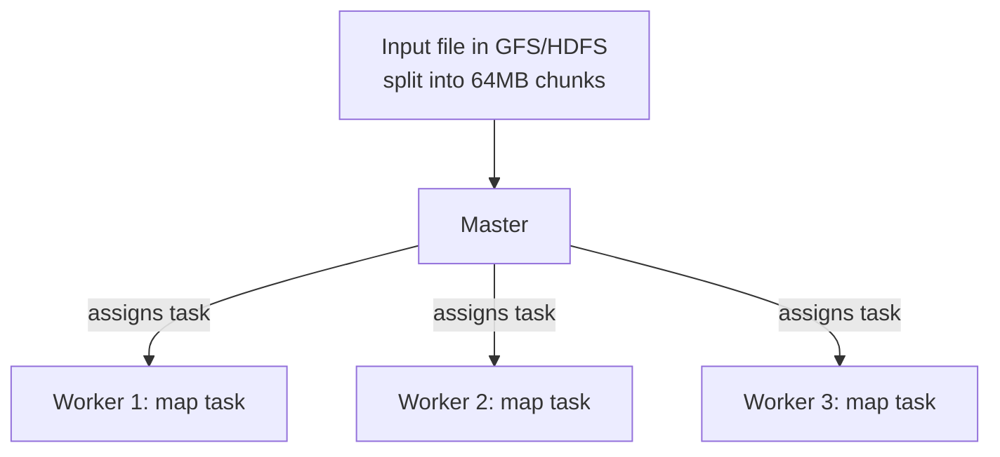

This Master/Worker pattern is itself a classic HLD concept: a single coordinator tracking state and assigning work, while the actual heavy lifting happens on many workers. You'll see this exact shape again in Kubernetes (control plane/nodes), HDFS (NameNode/DataNode), and Kafka (controller/brokers).

### Problem 2: Data locality — don't move petabytes over the network

Here's a subtlety interviewers love to probe: **network bandwidth is far more precious than disk bandwidth** at this scale. If the Master naively assigned map tasks to random workers, every task would need to pull its 64MB input chunk over the network from wherever it's stored. Multiply that by thousands of tasks and you saturate the network — the whole cluster grinds down.

The fix: **the Master tries to schedule a map task on a worker machine that already has a local copy of that data chunk** (since GFS/HDFS replicates each chunk on 3 machines anyway). If that's not possible, it at least picks a worker in the same network rack, so the data travels over a fast local switch instead of a slow cross-datacenter link.

This is called **data locality optimization** — moving computation to the data, instead of moving data to the computation. This single idea is one of the most repeated principles in distributed systems, and it's worth remembering by name for interviews.

### Problem 3: What does a map worker actually produce, and where does it put it?

Each map worker:
1. Reads its input split.
2. Runs the user's `map` function on it, producing `(key, value)` pairs.
3. **Doesn't send this data anywhere yet.** Instead, it partitions the output into R local files on its own local disk — one per reduce task (R = number of reduce tasks configured for the job). Which partition a key goes to is usually `hash(key) % R`.

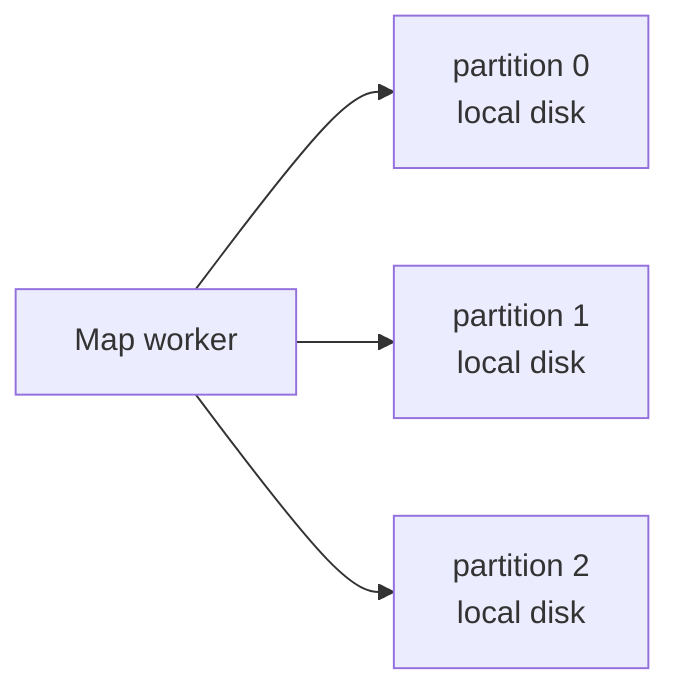

Why write to local disk instead of streaming straight to reducers? Two reasons that matter a lot in interviews:
- **Decoupling.** Map tasks can finish independently of whether reducers are ready yet.
- **Fault tolerance** (we'll get to this in a second) — if a reducer crashes, it can just re-read from disk instead of forcing all mappers to redo work.

### Problem 4: The shuffle — getting the right data to the right reducer

Once a map task finishes, the Master is notified of the *locations* of its R output partitions (not the data itself — just "partition 1 for this task is sitting on worker X at this path").

When a reduce task starts, it asks the Master for the locations of "partition K" from every single map task, then **pulls (fetches over the network) all those pieces** from each map worker's local disk.

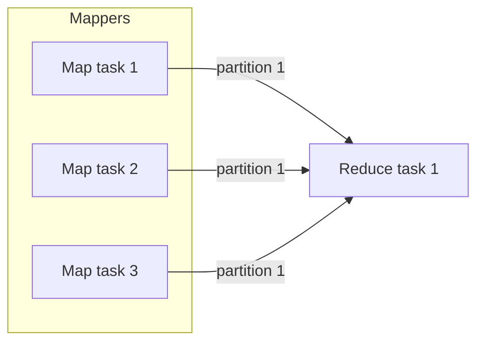

This network-heavy data movement is **the shuffle**, and it's usually the most expensive, most failure-prone part of the whole job — worth remembering as the answer whenever an interviewer asks "what's the bottleneck in MapReduce?"

Once a reduce task has pulled its partition from every mapper, it **sorts** the combined data by key (so all values for a key are contiguous), then calls the user's `reduce` function on each key group, and writes the final output (usually back to GFS/HDFS).

### Problem 5: What happens when a machine dies mid-job?

At the scale of thousands of commodity machines, hardware failure isn't an edge case — it's a certainty happening constantly. The system had to be designed assuming failure as the *normal* case, not the exception.

- **Worker dies during a map task:** The Master notices (via periodic heartbeats — worker pings "I'm alive" every few seconds; missed pings = presumed dead). The Master simply **re-runs that map task** on a different worker, since map output was only on that dead worker's local disk anyway — it's gone, so redo it.
- **Worker dies during a reduce task:** Same idea — re-run the reduce task elsewhere. Since reduce tasks read from disk (map outputs) rather than depending on other live processes, this is safe to redo.
- **Master dies:** This is the scary one — single point of failure for the whole job. Classic MapReduce handled this poorly (job just fails, restart it); later systems added Master checkpointing or standby masters.

This "just re-run the task from scratch" strategy works *only* because `map` and `reduce` functions are expected to be **deterministic and side-effect-free** — re-running them on the same input gives the same output. That determinism assumption is a subtle but important interview point: it's *why* MapReduce's simple retry strategy is even correct.

---

Here's the full picture stitched together:

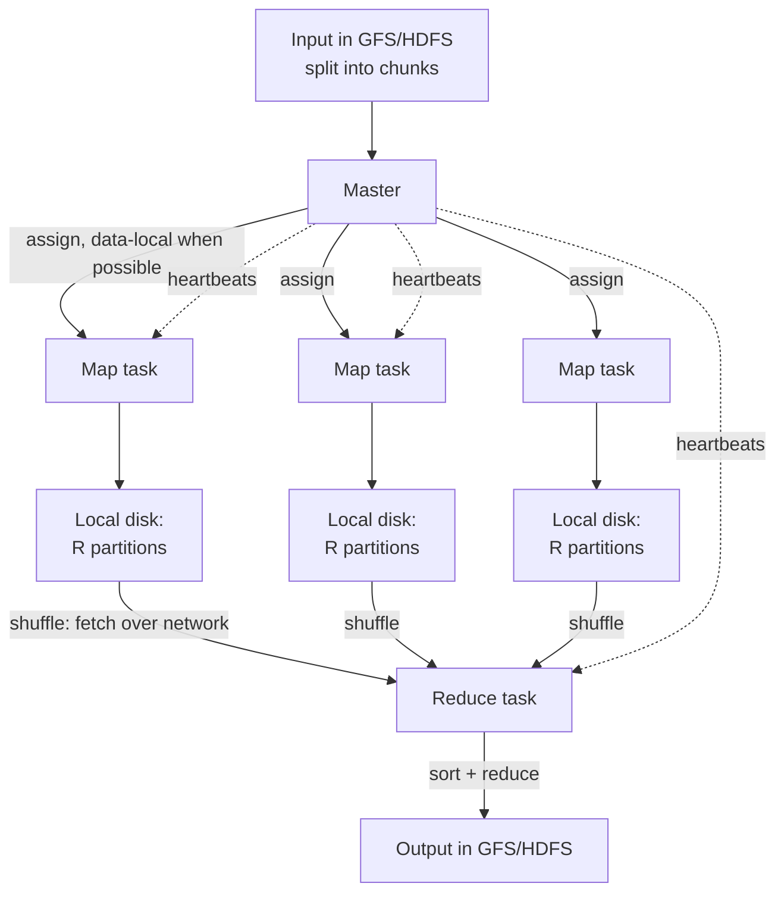

Before we move to the next piece (what happens with **stragglers** — slow-but-not-dead workers — and the **combiner** optimization, which are the two things interviewers most often follow up with), does this master/worker/shuffle/failure-handling flow make sense so far?

---

## Chapter 4: Stragglers and the Combiner optimization

Two more problems the original engineers hit almost immediately once MapReduce ran at real scale. Both come up constantly in HLD interviews as "what would you optimize next?" follow-ups.

### Problem 6: The straggler problem

Failure handling (Chapter 3) covers machines that **die**. But there's a sneakier problem: a machine that's still *alive* and still working, just... slow. Maybe its disk is failing and retrying reads silently, maybe it's overloaded with someone else's job, maybe it's on flaky hardware.

Here's why this matters more than it sounds like it should: a MapReduce job doesn't finish until **every single task** finishes — the last reducer to complete determines the total job time. If you have 2,000 map tasks and 1,999 finish in 2 minutes but one straggler takes 30 minutes, your whole job takes 30 minutes. One slow machine can dominate the runtime of a job running on thousands of machines.

The fix Google shipped: **speculative execution**. Near the end of a job (once most tasks are done), the Master looks at the tasks still in progress. For any task taking unusually long compared to its peers, the Master **launches a duplicate copy of that same task on a different, idle worker** — as a backup, running in parallel with the original.

Whichever copy finishes first "wins," and the result is used; the other is simply discarded (safe to discard, again, because of the determinism assumption from Chapter 3).

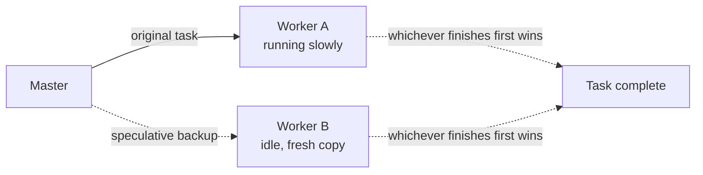

Interview framing to remember: **speculative execution trades a small amount of wasted compute for a large reduction in tail latency.** This exact trade-off — "duplicate the slow request/task and take whichever answer comes back first" — reappears in other systems under the name "hedged requests" (e.g., in distributed storage, search fan-out). Worth knowing that name too.

### Problem 7: Too much data crossing the network in the shuffle

Go back to the word-count example, but scale it up: a document with 100,000 occurrences of the word "the" produces 100,000 separate `("the", 1)` pairs from a single map task, all needing to be shuffled across the network to a reducer. That's extremely wasteful — you're shipping 100,000 tiny integers over the network when you could ship one number.

The fix: the **Combiner**. A combiner is essentially a **mini-reduce that runs locally on the map worker, before the shuffle**, to pre-aggregate values that share a key.

```
map output on this worker: ("the",1)("the",1)("the",1)...  (100,000 times)
combiner locally does:      ("the", 100000)
shuffle now sends:          just ("the", 100000) over the network
```

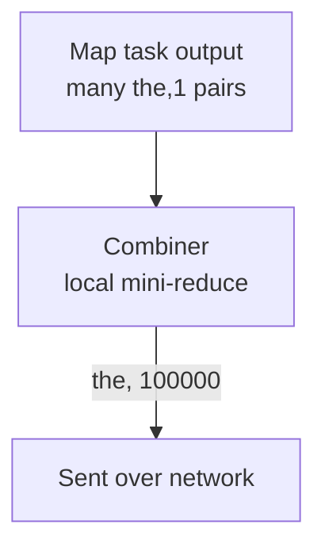

Important nuance interviewers probe here: **the combiner is an optimization, not a guarantee.** The engine may run it zero, one, or multiple times on a given worker's output — so your combiner function must be safe to skip entirely and must produce the same final result whether it runs or not. This is why the combiner function is usually **identical to the reduce function** for operations that are associative and commutative (sum, count, max, min) — but you *cannot* use a combiner for something like "average," because averaging partial averages doesn't equal the true average (a classic interview trap question).

---

That's the core MapReduce engine end to end: splitting, scheduling with data locality, local partitioned map output, the shuffle, sort, reduce, failure recovery via re-execution, stragglers via speculative execution, and combiners to cut network traffic.

Before we move to **Chapter 5** — the cracks that eventually showed in this whole model at Google, and why they built successors (this is where things like Dataflow/Spark/the "MapReduce is dying" narrative come from, plus how this connects to sharding/replication concepts you'll need for the interview) — do stragglers and the combiner make sense?

---

## Chapter 5: The cracks — where MapReduce started to hurt

By the mid-2000s to early-2010s, teams across the industry were running MapReduce jobs constantly. Real usage patterns exposed painful weaknesses that the original design hadn't been built for.

### Crack 1: Disk I/O between every single stage

Look again at the pipeline: map writes output to **local disk** → shuffle reads it over network → reduce reads it, sorts it, then writes final output to **HDFS/GFS**. Two full disk round-trips per job, minimum, even for something simple.

Now imagine a real-world need: **PageRank**. To rank web pages, you don't run one map-reduce pass — you need to repeat a similar computation **dozens of times** (each iteration refines the rank based on the previous iteration's results), until the ranks converge.

With classic MapReduce, that means: iteration 1 writes its full output to HDFS (disk, replicated 3x) → iteration 2 has to **read that entire dataset back from disk** → compute → write to disk again → iteration 3 reads it back again... 40 iterations means 40 rounds of writing and re-reading the *entire dataset* from disk, even though most of the data barely changes between iterations.


Disk is roughly 100x slower than RAM. Iterative algorithms (PageRank, k-means clustering, gradient descent for ML) turned into disk-thrashing marathons. This is the single biggest complaint that shaped what came next.

### Crack 2: Everything is batch — nothing is interactive or low-latency

MapReduce jobs are built to run for minutes to hours over huge static datasets. There's no notion of "give me an approximate answer in 2 seconds" or "keep processing new data as it streams in." Analysts wanting to explore data interactively (run a query, tweak it, run again) had to wait minutes per query — miserable for exploration.

### Crack 3: Rigid two-stage shape forces ugly pipelines

Real data pipelines are rarely "one map, one reduce." They're often: filter → join → aggregate → sort → filter again. Under classic MapReduce, each of those steps had to be **its own separate MapReduce job**, each one writing its full output to HDFS and the next job reading it back from HDFS.

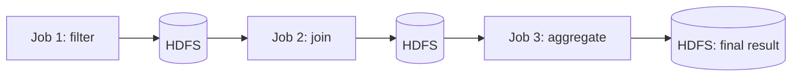

Tools like **Hive** and **Pig** were built to hide this pain — you'd write SQL-like queries, and they'd compile down into chains of MapReduce jobs under the hood. But the underlying inefficiency (disk round-trip between every stage) didn't go away; it was just hidden from the programmer.

### The fix: keep data in memory, and describe the whole pipeline as one plan

This is where **Apache Spark** enters the story (2012ish, born out of research at UC Berkeley). Spark's core bets, directly aimed at the cracks above:

1. **Keep intermediate data in memory (RAM) across steps**, instead of forcing a disk write between every stage. For iterative jobs like PageRank, this alone gave 10-100x speedups.
2. **Don't force everything into rigid map-then-reduce.** Instead, let the programmer describe an arbitrary chain of transformations (filter, join, group, map, aggregate...), build that chain into a **DAG (directed acyclic graph)** of operations, and let the engine figure out the optimal execution plan across that whole chain at once — rather than running disconnected jobs.
3. **Lazy evaluation** — nothing actually runs until you ask for a final result, which lets the engine optimize the *entire* pipeline (e.g., pushing filters early) instead of optimizing each stage in isolation.

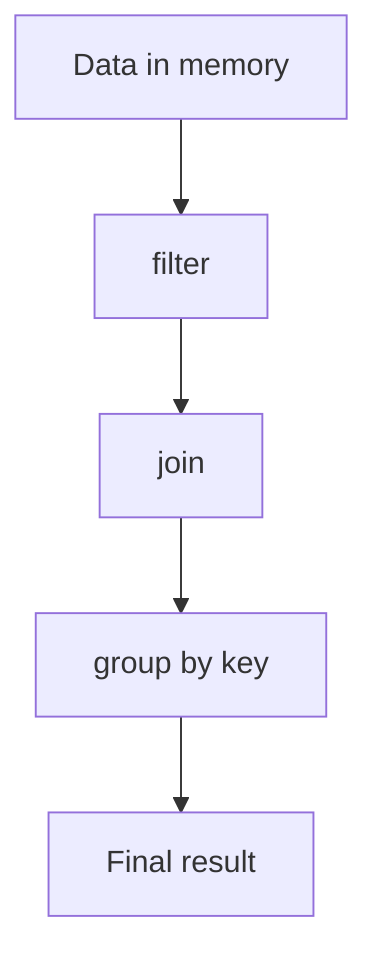

Fault tolerance also had to be rethought here, since data now lives in RAM (which vanishes when a machine dies) rather than on replicated disk. Spark's answer: instead of replicating in-memory data across machines (expensive), it tracks the **lineage** — the sequence of transformations that produced each piece of data. If a machine holding some in-memory data dies, Spark just **recomputes that piece from its lineage** (re-runs the chain of transformations that built it), rather than needing a replica sitting around. This is a genuinely different fault-tolerance philosophy from MapReduce's "just re-run the whole task from disk-backed input" — worth contrasting explicitly if an interviewer asks.

---

This is a natural fork in the road for how we go deeper. A couple of directions we could take next — happy to let you pick, or I can just pick the most interview-standard path:

---

## Chapter 6: Spark's core abstraction — the RDD

Everything in Spark is built around one abstraction: the **RDD (Resilient Distributed Dataset)**.

Break the name down — it tells you exactly what it is:
- **Resilient** — it can recover from failure (via lineage, as we touched on).
- **Distributed** — it's split into **partitions**, spread across many machines in the cluster.
- **Dataset** — it's just a collection of records (rows, objects, whatever your data is).

Think of an RDD as: "a big dataset, cut into N partitions, where each partition lives on some machine, and Spark remembers exactly how each partition was produced." That last part — remembering *how* it was produced — is the lineage we mentioned, and we'll come back to it.

Crucially, an RDD is **immutable**. You never modify an RDD in place. Every operation on an RDD produces a **new** RDD. This immutability is what makes the lineage/recompute trick safe — since data never changes underneath you, "recompute this partition the same way" always gives the same answer.

### Transformations vs Actions — and why laziness matters

Spark operations split into two categories:

- **Transformations** (`map`, `filter`, `join`, `groupByKey`, `reduceByKey`...) — take an RDD, return a **new** RDD describing "apply this operation." They are **lazy**: calling `.filter(...)` does **not** actually scan any data. It just records "there will be a filter step here" as a node in a graph.
- **Actions** (`count`, `collect`, `saveAsTextFile`, `foreach`...) — these actually trigger computation, and produce a real result (a number, a list, a file written to storage).

Why be lazy? Because it lets Spark see your **entire chain of transformations at once** before running anything, and optimize across the whole thing — instead of naively executing each step in isolation the moment you write it (which is what forced separate MapReduce jobs to always fully materialize to disk between stages).

Example, in pseudo-code:
```
rdd1 = read("logs.txt")          // transformation — nothing happens yet
rdd2 = rdd1.filter(is_error)     // transformation — still nothing happens
rdd3 = rdd2.map(extract_ip)      // transformation — still nothing happens
result = rdd3.count()            // ACTION — now Spark actually runs the whole chain
```

Nothing touches disk or executes until `.count()` is called. At that point, Spark looks at the *whole* recorded chain and builds an execution plan.

### Narrow vs wide dependencies — this is what determines stages

This is one of the most interview-tested Spark internals concepts, so let's slow down here.

- **Narrow dependency**: each partition of the parent RDD is used by **at most one** partition of the child RDD. Example: `map`, `filter` — a record in partition 3 of the input only ever affects partition 3 of the output. No data needs to move between machines. These can be **pipelined together** — executed back-to-back on the same machine, on the same data, without a network hop.
- **Wide dependency**: a partition of the child RDD depends on data from **multiple** parent partitions, scattered across different machines. Example: `groupByKey`, `reduceByKey`, `join` — to group all records with the same key, you need records that might live on *any* machine. This **requires a shuffle** — data has to move across the network, exactly like the shuffle in classic MapReduce.

Wide dependencies are where **stage boundaries** get drawn. Spark's DAG Scheduler looks at your chain of transformations and cuts it into **stages** at every point a shuffle is required. Everything narrow gets pipelined inside one stage (no disk writes in between!); every wide dependency starts a new stage.

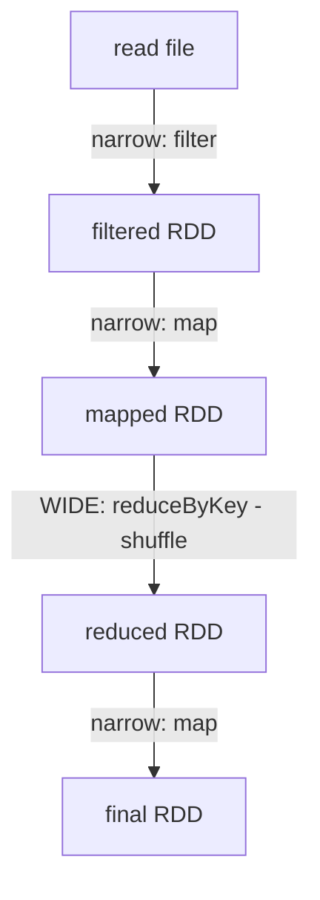

Here, `filter` and `map` chain together inside **Stage 1** with zero network movement (that's the pipelining win over classic MapReduce — no forced disk round-trip between filter and map). `reduceByKey` forces a shuffle, so it becomes the boundary into **Stage 2**.

### Driver, executors, and how a job actually runs

- The **Driver** is where your program runs. It builds the DAG of RDDs, and contains two schedulers:
  - **DAG Scheduler**: splits the job into stages (cutting at wide dependencies, as above).
  - **Task Scheduler**: within each stage, creates one **task per partition**, and hands tasks out to executors — preferring data-local placement, same idea as classic MapReduce.
- **Executors** are worker processes on cluster machines. They run tasks, and importantly, **can hold data in memory** (this is the in-memory win over MapReduce) between stages, instead of forcing a write to disk.

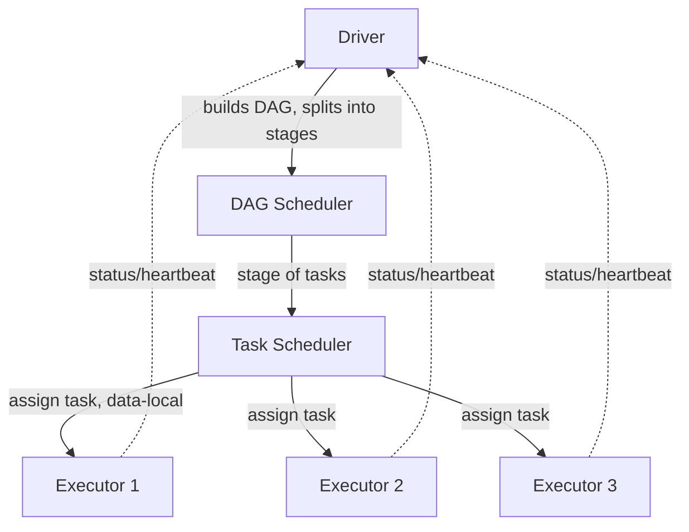

Same master/worker skeleton as MapReduce (Driver ≈ Master, Executors ≈ Workers), but now the stages can chain in-memory instead of forcing disk between every one.

### Lineage-based fault tolerance, precisely

Now the payoff of immutability + laziness: Spark doesn't need to replicate every intermediate RDD across machines (expensive, uses lots of memory). Instead, it keeps a **lineage graph** — a record of "RDD D = reduceByKey(map(filter(readFile(path))))".

If an executor holding a partition of RDD D dies, Spark doesn't restart the whole job. It looks at the lineage, sees exactly which parent partitions and which transformation produced the lost partition, and **recomputes only that lost partition** on a different executor.

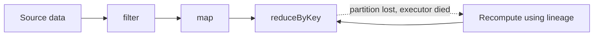

One caveat worth knowing for interviews: if an iterative algorithm chains hundreds of transformations (like 100 rounds of PageRank), the lineage graph gets very long — a single lost partition near the end could trigger a long recomputation chain. The fix is **checkpointing**: periodically, Spark writes an RDD's actual data to reliable storage (like HDFS) and **truncates the lineage** at that point, so recovery never has to replay more than one checkpoint's worth of history.

And one more practical point that trips people up: since RDDs are lazy and don't persist by default, calling two different actions on the same RDD chain **recomputes the entire chain twice** — unless you explicitly call `.cache()` / `.persist()` to tell Spark "keep this one in memory (or disk), don't throw it away after this action." This is exactly what makes iterative algorithms fast in Spark — you cache the RDD that's reused across iterations, instead of MapReduce's forced full re-read from disk every round.

---

Quick check: does the narrow/wide → stage split, the driver/executor roles, and lineage-based recovery all make sense? Once you're solid here, natural next stop is either **zooming into GFS/HDFS storage (sharding & replication of the raw data these engines operate on)**, or moving to the **general distributed-systems pillars** (sharding, replication, caching, CDN) that interviewers expect regardless of which engine you're discussing.

---

