# Distributed ID Generation — The Story (v2, narrative edition)

> **What this file is.** The original `12-Sequencer-FAANG-Guide.md` is the reference — requirements, API shapes, every trade-off table, the full cheat sheet. This file is a *second way in*: the same material told as one continuous story of engineers hitting a real wall, fixing it, and hitting the next wall — until we land on exactly the same designs the reference file documents. Read this first if you want the "why would anyone invent this" intuition; read the original for the "recite this cold in an interview" density.
>
> The company in this story — **Shutter**, a photo-sharing app — is fictional, but every wall it hits and every fix it reaches for is something a real company actually shipped and wrote about: Flickr's ticket servers (2010), Twitter's Snowflake (2010), Instagram's sharded-ID scheme (2012), Amazon Dynamo's vector clocks (2007), and Google Spanner's TrueTime (2012). I'll name the real system at each step so you can tell "this happened" from "this is illustrative."

---

## Chapter 1 — One database, one column, one very normal Tuesday

It's 2009. Shutter is three engineers and a Postgres box. The `photos` table has a primary key:

```sql
id SERIAL PRIMARY KEY  -- Postgres auto-increment, 1, 2, 3, 4...
```

This is free. One database, one sequence, one writer at a time (Postgres serializes it internally) — there is *no way* for two photos to get the same ID, because there's only one place IDs come from. At 50 photo uploads a second, this is not even a design decision, it's just what a database does.

Eighteen months later, Shutter has passengers: 40 million users, and the single Postgres box is failing over disk I/O long before the ID column is anyone's concern. The fix everyone reaches for first is **sharding** — split the `photos` table across, say, 20 Postgres instances by `user_id % 20`, so each shard only holds a slice of the users and a slice of the write load.

And that's the moment the free lunch ends. Shard 3 has its own `SERIAL` sequence starting at 1. So does shard 7. So does shard 14. **Every shard is independently counting from 1**, which means shard 3's photo #500,002 and shard 14's photo #500,002 are both real rows with the same ID:

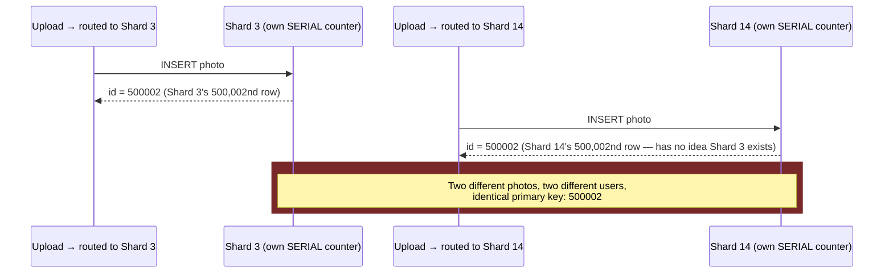

The instant you have more than one writer, "just auto-increment" stops being a database feature and becomes a **coordination problem**: multiple independent counters need to agree on non-overlapping output without one of them being in charge.

*(This is exactly the wall Flickr hit and wrote about publicly in their 2010 engineering post "Ticket Servers: Distributed Unique Primary Keys on the Cheap" — sharded MySQL, and auto-increment no longer meant unique.)*

**How I'd say this in an interview:** "The moment you shard a table, per-shard auto-increment breaks uniqueness globally — two different shards will eventually produce the same ID, because each one only knows about its own counter. That's the whole reason distributed ID generation is its own topic instead of a database feature."

---

## Chapter 2 — "Just use a UUID" and the bill that arrives later

The on-call engineer's instinct is reasonable: stop trying to count. Generate a **UUID v4** — 128 bits, 122 of them random — independently, on each shard, with zero coordination between them. `gen_random_uuid()` in Postgres, `uuid.uuid4()` in Python, one line, done. The math backs this up: with 2^122 possible values, you'd need to generate roughly 2.7 quintillion UUIDs before a 50% chance of any collision — nobody at Shutter's scale will ever hit that.

This actually *does* fix Chapter 1's problem. No shard needs to ask any other shard for permission. Uniqueness is now a probability so close to 1 that it's functionally a guarantee.

Six months later, a different alarm fires: **insert latency on the `photos` table has crept from 2ms to 40ms**, and it's getting worse as the table grows. The DBA's diagnosis: the primary key is the *clustered index* in InnoDB (MySQL, which Shutter migrated to for this exact sharding project) — meaning rows are physically stored on disk in primary-key order. A `SERIAL` key always inserts at the end of that order — cheap, sequential disk writes. A random UUID inserts at a **random point** in a multi-gigabyte B-tree, forcing a random-access disk seek and, worse, page splits, on nearly every single insert. This is a documented, widely-benchmarked cost (Percona and others have published exactly this UUID-vs-sequential-key insert benchmark showing multi-x slowdowns at scale) — not a theoretical concern, a real production one.

On top of the performance bill, there's a size bill: 128 bits doesn't fit a `bigint` column, so every index on every foreign key referencing `photo_id` is now twice as wide, which means fewer index entries fit in a memory page, which means more disk reads for the same query. And there's a *feature* bill too — product wants "show me the last 100 photos uploaded," and a random UUID carries zero information about *when* it was created, so that query now needs a separate `created_at` column and index it didn't need before.

**New problem, stated plainly:** UUIDs solved coordination by throwing away two things Shutter didn't realize it was relying on — a compact numeric key, and the free ordering-by-time that came from counting upward.

**How I'd say this in an interview:** "UUIDs remove coordination entirely, which is great for availability, but you pay for it twice — 128 bits instead of 64 doesn't fit a `bigint` cleanly, and random values as a clustered primary key wreck B-tree locality on insert. I'd reach for UUIDs for things like trace IDs or idempotency keys, where pure uniqueness matters more than size or order — not as a hot-path primary key."

---

## Chapter 3 — Bringing back a single source of truth (and its one failure mode)

Shutter's next move is the obvious compromise: keep a **single, centralized counter**, but make it a dedicated service instead of a table column — a **ticket dispenser**, the kind you pull a paper number from at a deli counter. One machine, one number, handed out strictly in order, and every shard calls it before inserting a row.

Concretely, this is a tiny MySQL table with one row and one auto-increment column, hit with:

```sql
REPLACE INTO Tickets64 (stub) VALUES ('a');
SELECT LAST_INSERT_ID();
```

This is *literally* Flickr's real, documented "ticket server" design. And to avoid Chapter 1's per-shard-counter collision, Flickr didn't hand each shard its own counter — they ran **exactly two** ticket servers, one seeded to emit only odd numbers (`1, 3, 5, ...`) and one seeded to emit only even numbers (`2, 4, 6, ...`), each independently auto-incrementing by 2. Two fixed, non-overlapping number lines, so there's never a reconfiguration to get wrong.

This is worth sitting with, because the tempting *generalization* of this idea is a trap. If instead of "2 fixed servers, fixed odd/even" you build "N servers, each stepping by N," you've reintroduced a coordination problem the moment N has to change. Say Shutter runs 3 counters with step `m=3` — server A owns `{1,4,7,...}`, B owns `{2,5,8,...}`, C owns `{3,6,9,...}`. Server B dies. Someone reconfigures the cluster down to `m=2` to keep serving traffic. Server A's *next* value is `7 + 2 = 9`. **Server C already issued 9.**

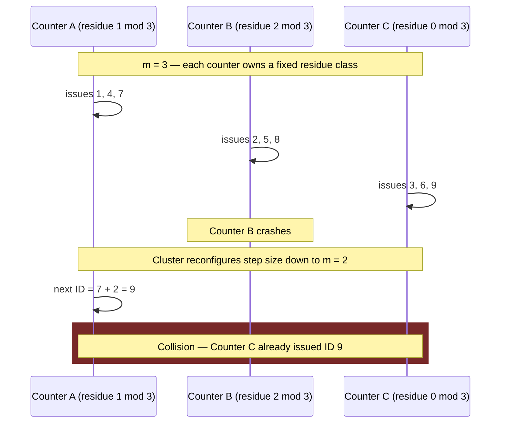

Two rows, same ID, silent collision — discovered only when a duplicate-key error shows up in a log line nobody's watching, or worse, doesn't show up because the column isn't even declared unique. Flickr's actual design sidesteps this specific trap by keeping the step size and residue classes *fixed forever* (2 servers, odd/even) rather than dynamically rebalancing — which is precisely why it's the design people cite, not the "N servers, dynamic step" version.

Either way — Flickr's real fixed-step design, or the naive N-server version — a **second** problem remains even without any reconfiguration: this is one machine (or a small fixed pair) fielding a network round trip for *every single ID*, ever. At Shutter's peak — say 5,000 uploads/sec at Friday-evening peak, each upload needing 3–4 IDs (photo row, thumbnail row, two index rows) — that's 15–20K round trips/sec hitting one MySQL row. Row-level lock contention on a single hot row starts queuing requests well before the box runs out of CPU or disk.

**New problem:** centralizing fixed the collision issue, but "call one server for every ID" is a throughput ceiling and a single point of failure baked into the architecture, not just an ops risk to mitigate with more hardware.

**How I'd say this in an interview:** "A centralized ticket server is exactly what Flickr shipped — one authority per parity class avoids the residue-class collision you get from rebalancing a stepped counter. But it still means a network round trip to one place for every ID, so it caps your throughput at whatever one row on one machine can do, and it's a SPOF unless you run a failover pair."

---

## Chapter 4 — Stop asking for one ticket at a time; ask for a *book* of them

The fix is almost embarrassingly simple once you see it: **stop calling the ticket dispenser once per photo. Call it once, and ask for a thousand tickets at a time.**

This is the **range handler** (also called a "hi/lo" allocator — Hibernate's ORM ships one under exactly that name). Shutter's app server, on startup, asks the central range service for a lease: *"give me a block of IDs."* The range service marks `[3,000,001–4,000,000]` as taken in its own replicated store and hands the whole block back in one response. From then on, the app server hands out IDs from that block **entirely in local memory** — `local_counter++`, zero network calls — until it runs out, at which point it goes back for one more block.

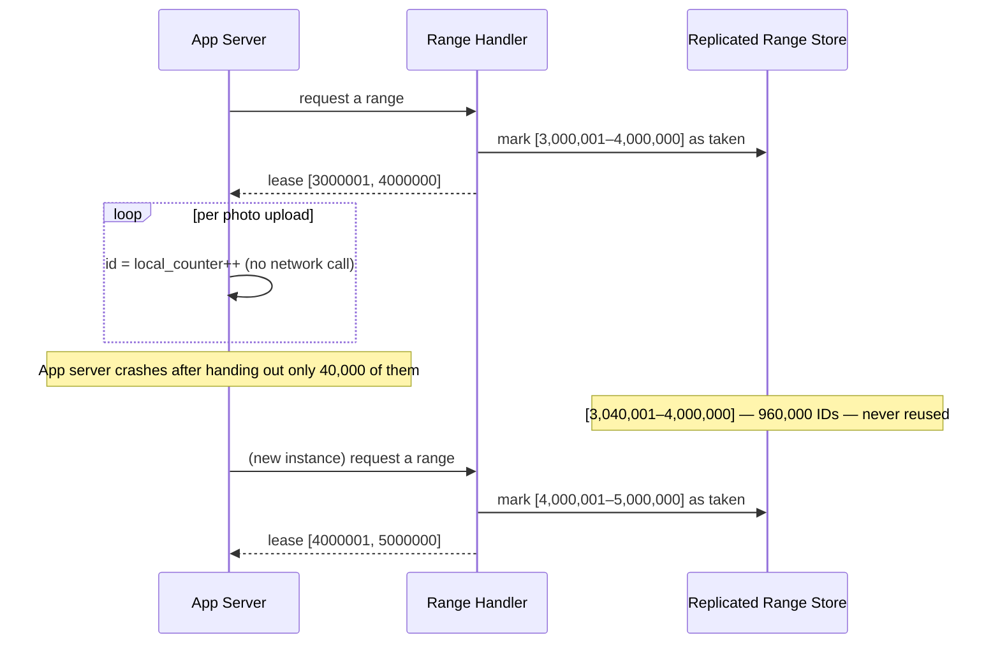

The deli-counter analogy holds perfectly here: instead of every customer walking up to the dispenser, the store manager tears off a whole booklet of a thousand pre-numbered tickets and hands the *booklet* to a cashier, who tears one off locally per customer. The dispenser only gets a visit when a booklet runs out — not once per customer.

The arithmetic that makes this work: at Shutter's 15–20K IDs/sec peak, calling the range service once per 1,000,001-ID block instead of once per ID cuts the round-trip rate from "20,000/sec" to "0.02/sec" — the network hop essentially disappears from the hot path. And because the range service now only needs to durably record "range X is taken" instead of racing to increment a hot row on every request, it can run with a **replicated failover pair** without the residue-class trap from Chapter 3 — the failover reads the latest checkpoint of "which ranges are taken" and picks up from there, no dynamic rebalancing needed.

This is genuinely the first design that checks every one of Shutter's boxes: unique, scales with the number of app servers, no SPOF with a failover replica, fits in a `bigint`.

But it introduces its own, quieter cost. If an app server crashes holding block `[3,000,001–4,000,000]` after only handing out 40,000 of them, the remaining 960,000 IDs are simply **gone** — never reused, wasted forever (mitigated by making blocks smaller, at the cost of more range-service round trips — a direct dial you tune). And the range handler tells you *nothing* about time. Two IDs, `3,041,207` and `3,041,208`, could have been created a millisecond apart or three weeks apart, if they came from different blocks leased at different times — there's no way to tell without a separate `created_at` column, which is exactly the feature gap Chapter 2 already ran into with UUIDs.

**New problem:** throughput and availability are solved, but "when was this created" is still not encoded anywhere in the ID itself — and product just asked for it again, this time for a *feed* that needs to paginate by recency without a secondary index.

**How I'd say this in an interview:** "A range handler amortizes the network round trip over an entire block instead of paying it per ID — that's the whole trick, and it's why it satisfies uniqueness, scale, and availability simultaneously. The cost is wasted ID space when a server crashes mid-block, and it still carries zero time information, which is the next thing to solve if you need IDs sortable by creation time."

---

## Chapter 5 — Putting a clock inside the ticket

If IDs need to sort by creation time, the obvious next move is to put a timestamp *in* the ID — not next to it in a separate column, inside the bits themselves. Take milliseconds-since-epoch, shift it left, OR in a worker ID so two servers don't collide: `id = (timestamp_ms << 22) | worker_id`.

This mostly works, and it's genuinely useful — sort by ID, and you've sorted by creation time, no index required. But it collides on exactly the case that matters at Shutter's scale: **millisecond resolution gives you at most ~1,000 distinct values per second per worker**, and a single app server handling a burst of photo uploads (a viral post, a batch import job) can easily produce more than one row in the same millisecond.

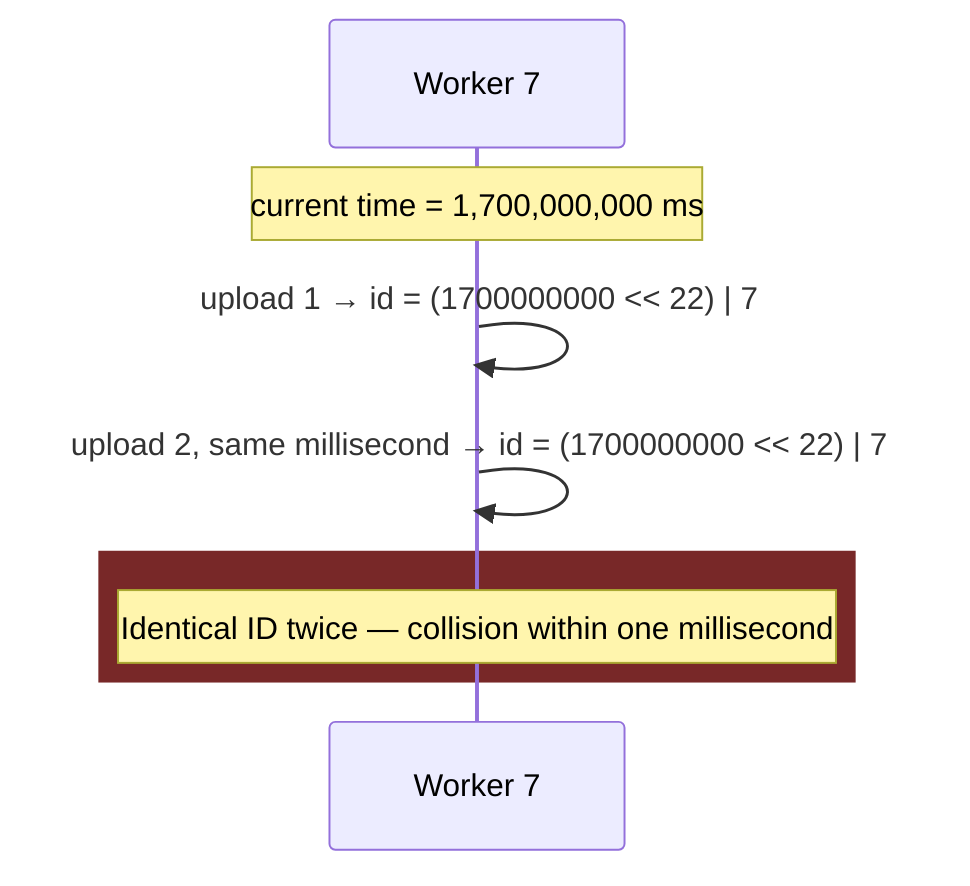

Two photos, same millisecond, same worker ID, same timestamp bits — **collision**, right back to square one.

**New problem:** timestamp + worker ID buys ordering but reopens uniqueness the instant you exceed one event per millisecond per worker — which any real burst of traffic does immediately.

**How I'd say this in an interview:** "Timestamp-plus-worker-ID gives you time-ordering almost for free, but at millisecond granularity you're capped at roughly a thousand IDs per second per worker before two events in the same millisecond collide — that's the gap the next design closes with a sub-millisecond sequence counter."

---

## Chapter 6 — Twitter's answer, and the one thing it can't promise

The fix is to give each worker a **sequence counter that resets every millisecond** — pack four fields into one 64-bit integer instead of two. This is **Twitter Snowflake**, publicly released in 2010 to solve exactly this problem for tweet IDs, and it's the design Instagram, Discord, and Sony's "Sonyflake" all later forked with minor re-slicing of the same 64 bits.

```
[0][----------- 41 bits: timestamp -----------][-- 10 bits: worker --][-- 12 bits: seq --]
```

Read it left to right as **"one sign bit (always 0, keeps it a positive number in every language), forty-one bits of milliseconds since a custom epoch, ten bits of *who*, twelve bits of *which one this millisecond*."** `1 + 41 + 10 + 12 = 64` — that arithmetic is the whole mnemonic.

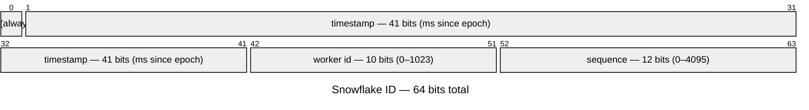

The capacity math follows directly from the bit widths, so it's safe to say cold, not hedge: 2^41 milliseconds is about 69.7 years of headroom before the timestamp field wraps (pick your own epoch to push that further out — Twitter's is `1288834974657`, Nov 4, 2010). Twelve sequence bits give 4,096 distinct values per millisecond per worker — 4,096 × 1,000 = **4.096 million IDs/sec, per worker**, which makes Chapter 5's 1,000/sec ceiling look almost quaint. Ten worker bits allow 1,024 distinct workers running concurrently without coordinating on every ID.

The deli-ticket booklet from Chapter 4 gets its final shape here: every ticket now has the **date printed at the top, the register number that issued it, and which ticket-of-the-millisecond it is** — one self-describing number instead of a row lookup.

This closes Shutter's actual feature request: sort by ID, get sort by creation time, and you can even decode a timestamp back out of any ID later with pure bit-shifting — no `created_at` index needed, which is the same payoff Chapter 5 was reaching for, now without the collision risk.

But Snowflake buys this speed by making two very specific promises that turn out to be softer than they look:

**First — a new coordination problem, quietly reintroduced.** Every worker needs a `worker_id` nobody else is using, and the "obvious" way to assign one — a static number in a config file — is exactly how you get a silent collision: someone copies a host's config to spin up a new box and forgets to bump the number, and now two workers are emitting IDs with the same worker bits, timestamp bits ticking the same milliseconds. **Fix:** a coordination service — ZooKeeper or etcd — where each process claims an **ephemeral sequential znode** on startup (`/workers/worker-0000000042` → `worker_id = 42`). "Ephemeral" is the whole point: it's tied to the process's live session, so if the process crashes without a graceful shutdown, the znode disappears automatically and the ID frees up for reuse — nobody has to remember to hand back the badge, the badge is on a wire that yanks it back the second you leave the building.

**Second, and the one that actually causes production incidents: the timestamp assumes the clock only moves forward.** NTP corrections don't guarantee that. If a worker's system clock gets stepped *backward* — a routine NTP correction, a VM migration, a hypervisor pause — the worker might read a timestamp *smaller* than the one it used a moment ago, and reusing an old millisecond risks emitting a duplicate or non-monotonic ID. Production Snowflake implementations detect this explicitly: compare the new reading to `last_time_ms`; if it's smaller, don't emit — for a small drift (a few milliseconds, the kind NTP applies routinely), **wait it out** until the local clock catches back up; for a large jump (seconds, the kind that means something more serious happened), **halt and pull the node from the load-balancer rotation** rather than silently emit a dubious ID. And separately — burst traffic can genuinely exhaust 4,096 IDs in one millisecond on a single worker; the standard response there is to **spin** (busy-wait for the next tick), not reject or sleep, because a millisecond boundary is guaranteed to arrive within, at most, one millisecond.

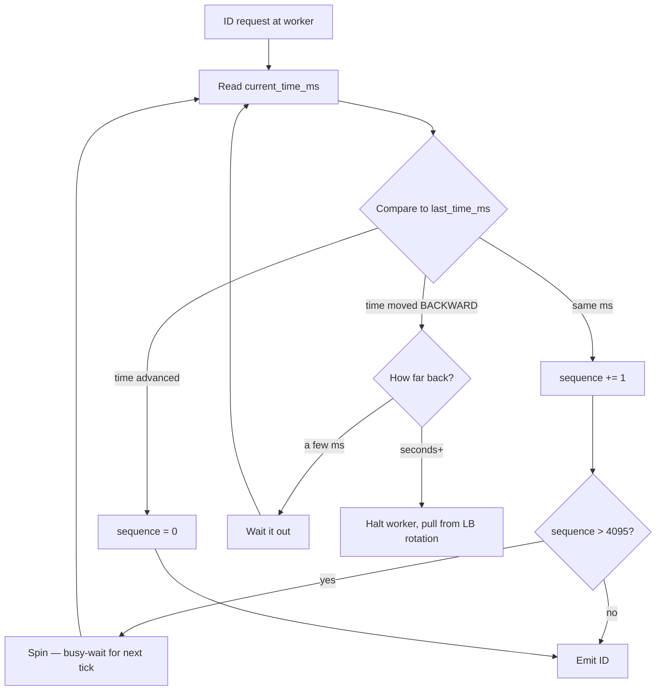

Even handled perfectly, there's a ceiling to what the ordering promise itself can mean: because each worker's clock is only *approximately* synced to every other worker's clock, Snowflake IDs give you **strict ordering within one worker**, and only **best-effort, sort-by-recency** ordering *across* workers. Two IDs from two different workers, close in time, can interleave slightly out of true creation order. That's fine for "show recent photos" — it is not strong enough to *prove* "event A definitely happened before event B" if two workers wrote to the same object and you need to resolve a conflict.

**New problem:** Shutter now needs exactly that — a "likes" counter and a caption-edit feature where two servers can genuinely race on the *same* photo, and "roughly ordered by wall clock" isn't a strong enough guarantee to resolve who wins.

**How I'd say this in an interview:** "Snowflake packs a sign bit, a 41-bit timestamp, a 10-bit worker ID, and a 12-bit sequence into one 64-bit int, generated in-process so there's zero network call per ID — that's basically the industry-default answer for time-sortable IDs at scale. The real production risk is clock drift: if NTP steps a worker's clock backward, it can reuse a timestamp, so real implementations detect that and either wait it out or halt the worker rather than emit a bad ID."

---

## Chapter 7 — When "roughly in order" stops being good enough

### 7.1 The feature that breaks Snowflake's promise

Shutter ships **shared albums** — anyone in a group can add photos or add a collaborator, from any device, and everyone's view should converge. The `collaborators` field is really a *set*, and this is the exact scenario **Amazon's Dynamo paper (DeCandia et al., 2007) uses to motivate vector clocks in the first place** — a shopping cart that different devices add items to. "Concurrent additions to a shared, replicated set" is one of the purest cases where two writes can both be legitimate and neither should just steamroll the other.

Concretely: Priya opens the album on her phone mid-flight, no signal. At the same moment, Alex adds a collaborator, "Meg," from his laptop. A few minutes later Priya's phone comes back online and adds a different collaborator, "Sam" — from the *same starting version of the album Alex started from*, because her phone never saw Alex's edit. Two devices, two legitimate additions, from the same base version, neither aware of the other. **Both are valid. Losing either one is a bug a user notices within a day.**

### 7.2 What goes wrong with plain last-write-wins

The instinct Shutter already has a tool for, from Chapter 6, is to keep whichever write has the higher Snowflake ID — last-write-wins by timestamp:

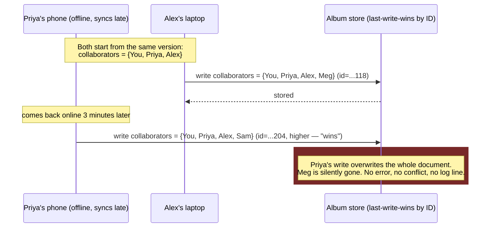

This is worse than Chapter 3's collision, in a specific way: a primary-key collision throws a loud, visible duplicate-key error. This throws *nothing*. The write succeeds, the API returns 200, and a real user's edit vanished. The question underneath it: **did Priya's write actually know about Alex's, or were the two genuinely independent?** Snowflake's ID can't answer that — it only encodes *what time my clock said*, never *what this write knew about when it happened*.

### 7.3 First attempt: Lamport clocks — an order, but not the right kind

A **Lamport clock** is one integer per node. On a local event, increment it. When sending a message, attach the value. When receiving one, set `local = max(local, received) + 1`. If A really did happen-before B — a message went from one to the other, a value was read that depended on it — this guarantees `LamportClock(A) < LamportClock(B)`. That's genuinely useful: it gives you *an* order consistent with causality, for free, with one number.

It doesn't help Shutter's actual case, though:

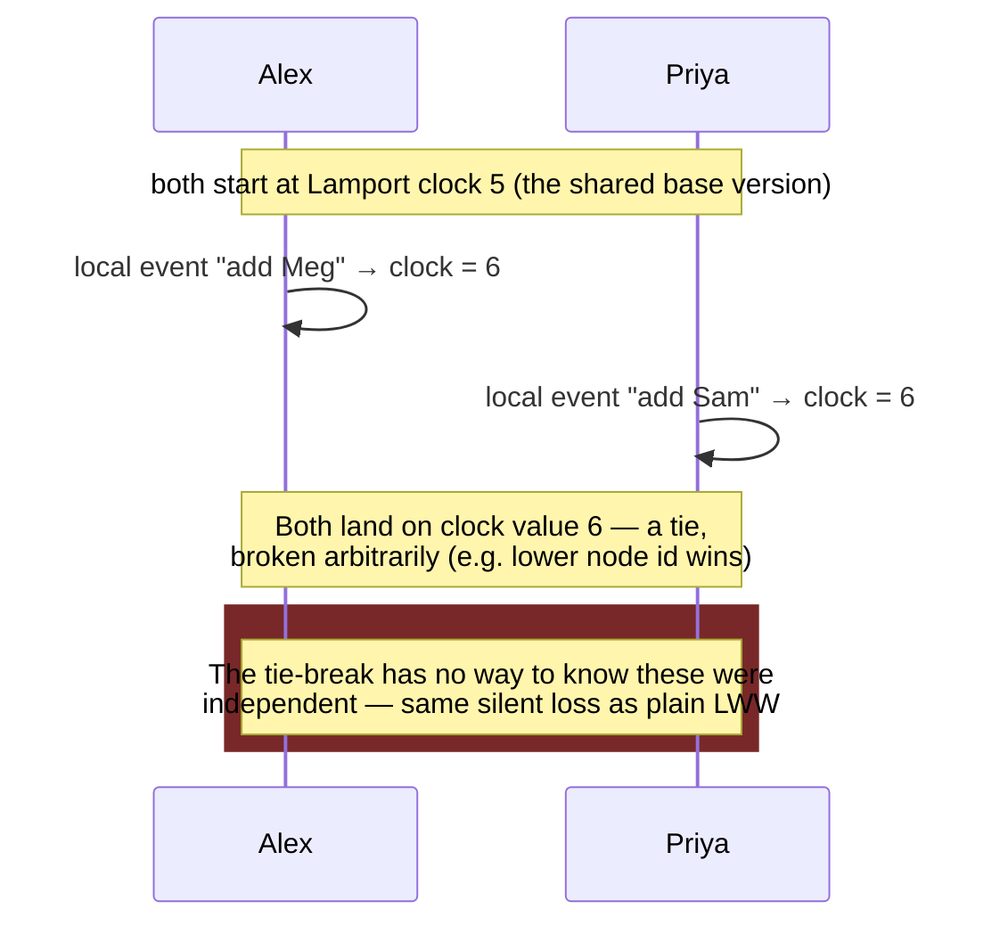

And even when it isn't a literal tie, the deeper problem doesn't go away: handed two Lamport numbers — say `6` and `7` — from two nodes that never exchanged a message, you **cannot tell** whether one genuinely depended on the other or they just happened to land close together. Lamport clocks can prove "these are ordered." They can never prove "these are unrelated." That's precisely the yes/no question Shutter needs answered — *"should I merge these two writes, or did one supersede the other?"* — and a single scalar structurally cannot answer it.

### 7.4 The real fix: vector clocks — a scoreboard instead of a wristwatch

Instead of one shared number, give every node its **own slot in a shared vector**. On a local event, a node bumps only its own slot. On send, it attaches the whole vector; on receive, the receiver takes the element-wise max of both vectors, then bumps its own slot. Comparing two vectors is now precise instead of a single ambiguous number: `V1 < V2` (causally before) if every slot of `V1` is ≤ the matching slot of `V2`, with at least one strictly less. **If neither vector dominates the other, the two writes are provably concurrent** — the exact distinction a Lamport clock (or a Snowflake timestamp) couldn't make.

Walking Shutter's album example through it end to end — this is structurally identical to the worked example in Dynamo's own paper, just with collaborators instead of cart items:

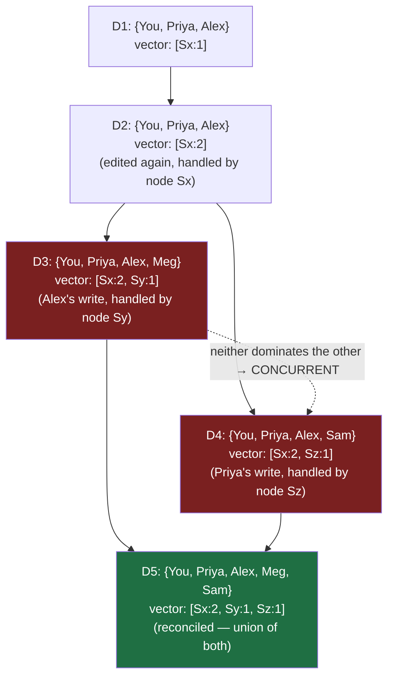

The comparisons that make this work, spelled out:

| Comparing | Result | Why |
|---|---|---|
| `[Sx:2]` vs. `[Sx:2, Sy:1]` (D2 vs. D3) | D2 < D3 | Every slot of D2 ≤ the matching slot of D3, one strictly less — D3 causally depends on D2 |
| `[Sx:2, Sy:1]` vs. `[Sx:2, Sz:1]` (D3 vs. D4) | Concurrent | Sy:1 vs. Sy:0 favors D3; Sz:0 vs. Sz:1 favors D4 — neither dominates |
| `[Sx:2, Sy:1]` vs. `[Sx:2, Sy:1, Sz:1]` (D3 vs. D5) | D3 < D5 | Every slot of D3 ≤ the matching slot of D5 |

### 7.5 Why we need this: what the store actually does with a concurrency verdict

The payoff isn't the comparison rule itself — it's what the store does *because* of it. On a read, if the two candidate versions' vectors are comparable, just return the dominant one — ordinary causality, nothing to resolve. If they're concurrent, this is where Dynamo's real, documented design differs from every earlier approach in this story: instead of guessing, **it returns both versions to the application as "siblings"** and lets the app (or, in Dynamo's original design, sometimes the end user) reconcile them.

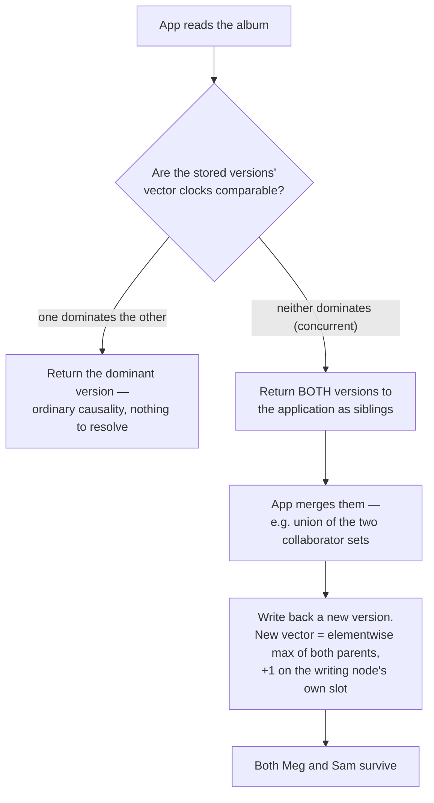

This is the actual answer to "why do we need vector clocks at all": **without them, the store has no way to know it's looking at two legitimate siblings instead of one write superseding another — it has to silently guess, and a wrong guess is data loss with no error anywhere in the system.** Vector clocks turn "silently guess and hope" into "detect the conflict and merge it" — which is exactly the guarantee Chapter 7.2's failure needed and didn't have.

### 7.6 The bill: vector clocks don't stay small forever

Every node that ever *coordinates* a write to an object earns a permanent slot in that object's vector — permanent because nothing removes it by default. Inside Dynamo or Riak, "node" means a small, fixed set of storage replicas, typically 3 to 10 — so in practice a healthy object's vector clock stays a handful of entries, forever. That's the case Shutter's shared-album feature actually lives in, and it's genuinely cheap.

The trap is scoping "node" to something that *isn't* bounded. If Shutter let every phone, or every ephemeral app-server instance in a rolling fleet, earn its own slot, the vector would never stop growing — every new deploy, every new device, adds an entry that never expires on its own:

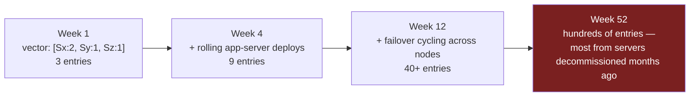

This isn't hypothetical — it's a documented, named operational problem at Basho/Riak: **"vector clock explosion."** Certain access patterns (many distinct coordinator IDs writing the same key over time, or node handoff during failover cycling through several physical nodes) caused individual objects' vector clocks to balloon into hundreds or thousands of entries — bloating storage, and slowing down the comparison itself, since an element-wise compare is `O(n)` in the number of entries.

Riak's real, documented fix is **pruning**: attach a timestamp to each `(node, counter)` entry, and once a vector exceeds a configured size, drop the oldest entries first, keeping a bounded number of the most recent. This caps the size, but it's a stated correctness trade-off, not a free fix — a pruned entry means the system has *forgotten* a write happened, and in a rare pathological case (a long-offline replica returning with an update descended from a since-pruned ancestor) that forgetting can reintroduce exactly the false "superseded" or false "concurrent" call vector clocks exist to prevent. It's a bounded risk traded for a bounded vector, not an eliminated one.

**New problem:** vector clocks solve concurrency detection, and stay cheap, exactly as long as the node set is small and mostly stable — true for Dynamo/Riak's replica sets, true for Shutter's shared albums. The harder version of the question — *prove causality with a size that never grows, no matter how many machines are ever involved* — is still open. Chapter 8 closes it a completely different way: stop tracking who-knew-what-about-whom at all, and make the clock's own uncertainty the thing you reason about directly.

**How I'd say this in an interview:** "Lamport clocks give a valid happened-before order but can't tell you whether two events were actually related or just coincidentally close — Dynamo's shopping-cart problem needs to *detect* concurrency, not just order it. Vector clocks do that with one counter per node: if neither vector dominates the other, the writes are provably concurrent, and the store returns both as siblings for the app to merge instead of silently picking a loser. The cost is that the vector's size is tied to the number of distinct nodes that ever wrote the object — bounded and cheap in Dynamo/Riak's small replica sets, but prone to what Riak calls 'vector clock explosion' if that node set isn't actually bounded, like tracking every client device instead of a handful of replicas."

---

## Chapter 8 — The version that doesn't pretend clocks are perfect

Shutter, realistically, stops at Snowflake plus app-level conflict handling — a photo-caption "last writer wins, with a manual merge UI if timestamps are within a suspicious window" is a perfectly good, shippable answer for a photo app. But it's worth finishing the story, because there's one more rung, and it's the one that actually resolves the root cause sitting underneath every design so far: **every one of these approaches assumes a clock reading is a single, trustworthy point in time — and it never is.** Two machines' clocks, even NTP-synced, disagree by some amount, and every design up to now has just quietly hoped that disagreement stays small enough not to matter.

Google's **Spanner** (published 2012) is the system that stopped hoping and started **measuring the disagreement explicitly**. Its `TT.now()` call — TrueTime — doesn't return a single timestamp. It returns an **interval**, `[earliest, latest]`, an honest, bounded uncertainty window, backed by GPS receivers and atomic clocks in every data center (Google's own published number for the resulting uncertainty is on the order of a few milliseconds — treat that as a real, cited figure, not one to quote to the exact millisecond, since it depends on hardware and network conditions Google alone controls).

The clever part isn't the hardware, it's what Spanner does with the *width* of that interval. If transaction A's `latest` bound is before transaction B's `earliest` bound, Spanner knows for certain A happened first — done, no ambiguity. If the two intervals overlap, ordering is genuinely uncertain — so instead of guessing, Spanner's commit path **waits out its own uncertainty**: it picks a commit timestamp `s = latest`, then stalls committing until `TT.now().earliest > s`.

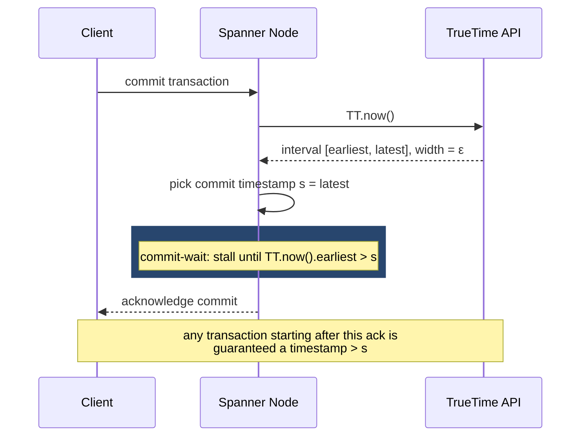

That deliberate stall — **commit-wait** — is the entire trick. Spanner doesn't achieve certainty by having a perfect clock; it achieves certainty by refusing to tell anyone a commit happened until it's *certain* no other transaction could still be assigned an earlier timestamp. Same idea as printing "accurate to within ±7ms" on a clock's face and simply waiting out the ± before trusting what it says, instead of pretending the ± isn't there.

This is the only design in the whole story that satisfies every requirement Shutter started with — unique, scalable, available, fits a fixed numeric format, and *provably* causally ordered, not best-effort. It's also, honestly, the design Shutter should never build itself: dedicated atomic-clock and GPS hardware in every data center, and the elaborate monitoring to keep it trustworthy, is a Google-scale investment, not a photo-app-with-40-million-users one.

**How I'd say this in an interview:** "TrueTime doesn't eliminate clock uncertainty — it makes the uncertainty explicit as an interval, and then Spanner engineers around it with commit-wait, stalling just long enough that no later transaction could possibly get an earlier timestamp. It's the one design that gets full causal ordering, but the hardware and infra cost only make sense at Google's scale."

---

## Where the story actually lands

```mermaid
flowchart LR
    A["Ch1: per-shard\nauto-increment"] -->|"fixes: free, simple\nbreaks: collides across shards"| B["Ch2: UUID v4"]
    B -->|"fixes: zero coordination\nbreaks: 128-bit, wrecks B-tree locality"| C["Ch3: central ticket\nserver (Flickr)"]
    C -->|"fixes: back to 64-bit, unique\nbreaks: 1 call/ID, SPOF, rebalancing risk"| D["Ch4: range handler\n(hi/lo lease)"]
    D -->|"fixes: amortized network cost\nbreaks: no time info"| E["Ch5: timestamp\n+ worker id"]
    E -->|"fixes: adds ordering\nbreaks: same-ms collisions"| F["Ch6: Snowflake\n(Twitter)"]
    F -->|"fixes: real throughput + rough order\nbreaks: NTP drift, no true causality"| G["Ch7: Lamport /\nVector clocks"]
    G -->|"fixes: provable causality\nbreaks: O(n) size, doesn't fit 64-bit"| H["Ch8: TrueTime\n(Spanner)"]
```

Every real system you'll actually be asked to design sits *somewhere on this line*, and the interview skill isn't reciting all eight steps — it's stopping at the one your stated requirements actually justify. Twitter, Instagram, and Discord all stop at Chapter 6 because "sortable by recency" is enough for a feed. Dynamo and Riak use Chapter 7's mechanism, but scoped internally to a handful of replicas, never exposed as the public ID. Only Spanner-scale systems pay for Chapter 8. If an interviewer asks "design a unique ID generator" and never mentions causality, stopping at the range handler (Chapter 4) or Snowflake (Chapter 6) is a **complete answer** — walking all the way to TrueTime unprompted reads as not knowing when to stop, not as extra credit.

---

## Interview transfer — adversarial follow-ups

**Q1: "Why not just use UUIDs everywhere and skip all this history?"**
Because UUIDs solve uniqueness for free but cost you twice — they're 128 bits, not 64, and random values as a clustered primary key wreck B-tree insert locality at scale. They're the right call for things like trace IDs or idempotency keys, where pure uniqueness matters more than size or sortability — not for a hot-path row primary key.

**Q2: "Walk me through exactly what happens when a Snowflake worker's clock jumps backward."**
The worker compares the freshly-read timestamp to `last_time_ms`; if it's smaller, it knows reusing that millisecond risks a duplicate ID. For a small drift — a few milliseconds, the kind routine NTP corrections apply — it just waits until the local clock catches back up. For a large jump, seconds or more, it halts, fails its health check, and gets pulled out of load-balancer rotation instead of quietly emitting a bad ID.

**Q3: "Why doesn't the central ticket-server design scale by just adding more counter servers?"**
Because the moment the number of servers (and therefore the step size) changes, you get real collisions — I can walk the concrete A/B/C example: three servers on step 3, one dies, the cluster reconfigures to step 2, and a surviving server's next value collides with an ID another server already issued. Flickr's actual fix was to never rebalance at all — two fixed servers, hardcoded odd and even, forever.

**Q4: "Two Snowflake workers end up with the same worker_id — how?"**
Almost always a static-config mistake: someone copies a host's config to bring up a new box and forgets to bump the number. The real fix is dynamic assignment through a coordination service like ZooKeeper or etcd — each process claims an ephemeral sequential znode on startup, and a crash auto-frees that ID because the znode is tied to the process's live session.

**Q5: "Does Snowflake give you strict global ordering?"**
No — only within a single worker. Across workers it's best-effort, sort-by-recency, because each worker's clock is only approximately synced to the others. If you need to actually prove one event happened before another across workers, that's Lamport or vector clocks, or TrueTime — not Snowflake.

**Q6: "What's the actual difference between Lamport and vector clocks, and why not just always use vector clocks?"**
A Lamport clock is one number and guarantees a valid order consistent with causality, but two Lamport numbers alone can't tell you if the events were related or just coincidentally sequenced. A vector clock replaces that with one counter per node and element-wise comparison, which *can* prove two events are concurrent — but the vector's size grows with the number of nodes, so it only fits inside a system with a small, bounded replica set, like Dynamo or Riak, not as a public 64-bit ID at consumer scale.

**Q7: "If these IDs get exposed in a public URL, does anything change?"**
Yes — a sequential or Snowflake-style ID leaks business signal, like daily volume or growth rate, to anyone watching two consecutive IDs. I'd add a random or obfuscated component before exposing it externally, or encode/hash the sortable internal ID at the API boundary, and I'd ask up front whether the ID is ever user-facing before committing to a scheme.

**Q8: "You're using a monotonically increasing ID as a row key in a database like Spanner or a range-partitioned store. Any concern?"**
Yes, hotspots — Spanner explicitly warns against monotonic row keys because all recent writes land on the same shard, the "last" leaf of the index. The fix is to shuffle or reverse the bit order of the timestamp before using it as the actual row key, or shard on a separate hashed key while keeping the sortable ID as a secondary attribute.

**Q9: "What does TrueTime actually return, and how does Spanner turn that into a real guarantee?"**
Not a single timestamp — an interval, `[earliest, latest]`, an explicit bound on clock uncertainty backed by atomic clocks and GPS. Spanner turns that bounded uncertainty into real external consistency with commit-wait: it stalls a commit until the interval has moved far enough forward that no future transaction could possibly get an earlier timestamp than the one just committed.

**Q10: "Given everything in this story, what would you actually propose if an interviewer just says 'design a unique ID generator' cold?"**
State the requirements first — uniqueness, target throughput, availability, whether it needs to fit 64 bits, and whether ordering/causality matters at all — because the answer genuinely depends on which one dominates. Then walk the escalation only as far as those requirements demand: if nobody asked for causality, a range handler or Snowflake is a complete, senior-level answer, and stopping there on purpose is the signal, not a gap.

---

## Cheat sheet — one line per stop on the story

- **Per-shard auto-increment**: free until you shard — then every shard's counter collides with every other shard's.
- **UUID v4**: zero coordination, 128-bit, probabilistic uniqueness — bad clustered primary key (random B-tree inserts), no time info.
- **Central ticket server (Flickr)**: fixes uniqueness/size, but one network round trip per ID and rebalancing a stepped counter causes real collisions — Flickr's real fix was two fixed servers, hardcoded odd/even, never rebalanced.
- **Range handler / hi-lo**: lease a whole block, hand out IDs from local memory — amortizes the network call over the whole block; cost is wasted range on a crash, still zero time info.
- **Timestamp + worker ID (naive)**: adds ordering, collides the instant a worker produces >1 event/ms.
- **Twitter Snowflake** = `[sign:1][timestamp:41][worker:10][sequence:12]`; ~69.7 years timestamp headroom, 4.096M IDs/sec/worker; real risk is NTP clock drift (wait small drift out, halt on a big jump) and sequence overflow (spin, don't reject/sleep).
- **Worker-ID assignment**: static config collides silently past a handful of hosts — use ZooKeeper/etcd ephemeral sequential znodes so a crash auto-frees the ID.
- **Lamport clocks**: one counter, valid happened-before order, cannot detect concurrency.
- **Vector clocks (Dynamo/Riak)**: one counter per node, `O(n)` size, the only mechanism that can *prove* concurrency — fits a bounded replica set, not a public ID at consumer scale.
- **TrueTime (Spanner)**: returns `[earliest, latest]`, not a point; commit-wait turns bounded uncertainty into real external consistency; only worth it at Google-scale infra investment.
- **The meta-lesson**: uniqueness, strict ordering, and gaplessness can't all be cheap in a distributed system at once — every design here is a decision about which one to relax, on purpose, for a stated reason.
