# Distributed Monitoring — FAANG Interview Guide

> **Enhancement notes (pass 2 — interview-delivery pass):** pass 1 (kept
> below) added the "does this cover the material" pieces: Requirements,
> Capacity estimation, Data model, API design, cardinality/retention
> depth, the v1→v2→v3 evolution, query-performance-at-scale, and
> rule-evaluation-at-scale. This pass adds the "can you actually *deliver*
> this live, under pressure" pieces, which is a different skill:
> **moved** "how to identify this topic" up to §2 and added an
> adjacent-topics table (was §17, buried at the end); **added** an
> **Interview Playbook** (§3) with a time-budgeted flowchart; **added** a
> "redo the math with different inputs" pass inside Capacity estimation
> (§6); **added** a named, timed **end-to-end trace** (§14) — the guide
> previously had no single request walked through the whole pipeline;
> **added** a two-sentence version to every major section, distinct from
> and shorter than the existing 60-second skeletons; **audited every
> number in the document** and tagged each **[say cold]** (follows
> deterministically from a stated spec — state as fact) or
> **[illustrative/approximate]** (measured/reported/estimated — hedge
> it); **added** a confidence tag (well-documented public info vs.
> plausible inference) to every named-system claim in §19; **added** a
> consolidated **Anti-Patterns / Red Flags** section (§20, separate from
> the cheat-sheet); **added** an **Adversarial Q&A** section (§21, 15
> questions, including pushback on this guide's own trade-offs and one
> wrong-premise question); **added** a full **interview pacing script**
> (§22) — first 60 seconds, minute-by-minute for 45 minutes, and a
> contingency for a mid-interview redirect; **added** an **Active Recall
> drill** (§23, question-only, plus spaced-repetition cadence). Self-check
> against the full checklist before finalizing: the sections that needed
> the most net-new work were the Adversarial Q&A and the pacing script
> (nothing to graft onto); everything else layered onto existing prose.
> Nothing from pass 1 was removed — only reordered and re-tagged.
>
> <details><summary>Pass 1 notes (original enhancement pass, kept for history)</summary>
>
> This pass added the pieces a FAANG interviewer expects but the original
> draft assumed or skipped: a **Requirements** section, a **Capacity
> estimation** walkthrough with illustrative numbers, an explicit **Data
> model** section for metric+labels→series, and an **API design** section
> covering push/pull/query endpoints. It also deepened existing sections:
> a cardinality-explosion flowchart + retention-tiers table, an
> architecture **evolution diagram v1→v2→v3**, a query-performance-at-scale
> subsection, and a rule-evaluation-at-scale explainer with a sequence
> diagram. All net-new headings were marked 🆕; everything else (mental
> model, cost numbers, failure domains, metric types, push/pull core
> comparison, alert lifecycle, client-side deep-dive, three pillars, real
> systems) was untouched apart from small clarity tweaks and
> cross-references.
>
> </details>

**Notation used throughout:** any specific number is tagged **[say
cold]** (it follows deterministically from a stated spec or formula —
state it as fact, no hedge needed) or **[illustrative/approximate]** (a
reported, measured, or estimated figure — say "roughly" or "on the order
of"). Structural counts that aren't measurements (e.g., "four metric
types") aren't tagged — there's nothing to hedge.

## The whole chapter in one picture

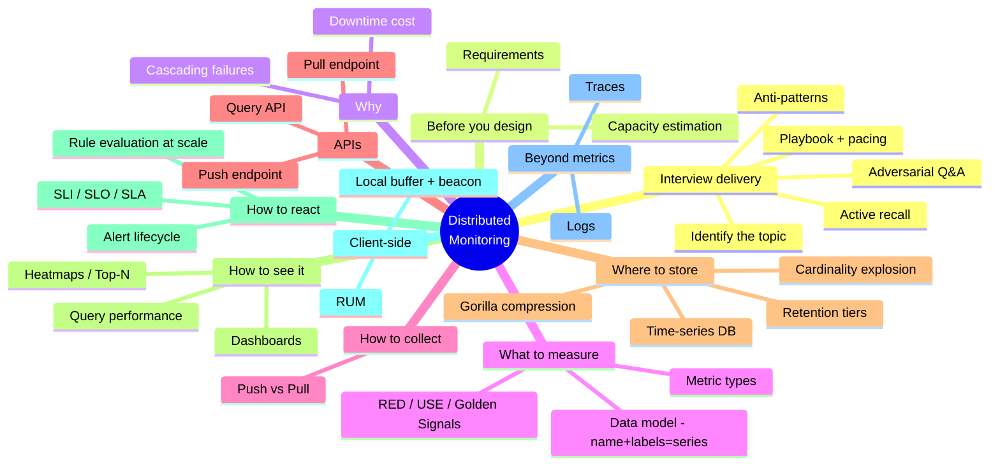

Come back to this picture after reading the guide once — if you can regenerate every branch from memory, you're interview-ready.

---

## 1. Mental model

> **Two-sentence version:** Monitoring turns a distributed system's silent
> internal state into signals a human or automated system can act on,
> ideally before a customer becomes the alarm. It's one pipeline —
> instrument → collect → store → query/alert → notify — and every section
> in this guide is one box in that pipeline, examined in depth.

A distributed system is a black box made of thousands of moving parts across
hundreds of servers and dozens of data centers. Monitoring is the
**nervous system** — it converts silent internal state (CPU load, error
rates, queue depth) into signals a human or an automated system can act on.

Three questions a monitoring system must answer, in order of urgency:

1. **Is something on fire right now?** → alerting
2. **What does "normal" look like, and are we drifting?** → metrics + dashboards
3. **Why did it break, after the fact?** → logs + traces (root cause)

Without monitoring, the only failure signal is a user complaint or a
support ticket — by which point the damage is already done. The goal is to
detect failures **before** they cascade, not after.

The whole discipline collapses into one pipeline — every section below is
one box in this picture:

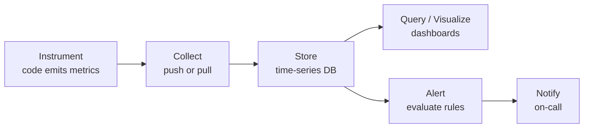

### Why cascading failures matter (from the course example)

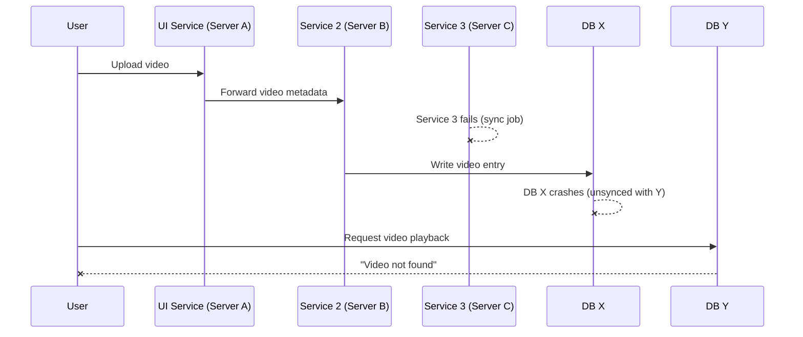

One silent failure (service 3) turns into a **customer-visible** error
several hops downstream. Nobody paged on service 3 failing — the first
signal anyone got was a user-facing 404. That gap is exactly what
monitoring closes.

**Interview cheat-sheet:**
- Frame monitoring as "convert unknowns into knowns, early."
- Always mention **early warning** and **root-causing** as the two jobs — interviewers listen for this split.
- Cascading-failure example is a great 30-second opener to justify *why* the interviewer should care about this building block.

---

## 2. How to identify this topic in an interview — and tell it apart from lookalikes

> **Two-sentence version:** The signal is any variant of "how would you
> know your service is degrading before customers complain" or "design a
> system to track metrics/alerts across a fleet." The trap is conflating
> it with logging, tracing, or ad-hoc analytics — those are adjacent
> pillars with different cost/cardinality profiles, not this design.

Signals that the interviewer wants a monitoring-system design (not just a
mention):
- "How would you know if your service is degrading before customers complain?"
- "Design a system to track metrics/logs/alerts across thousands of servers."
- "How do you detect and alert on failures in a distributed system?"
- Follow-ups on any other system design ("Design YouTube") asking "how would you monitor this in production?"

Common trap: candidates jump straight to "I'd use Prometheus and Grafana"
without explaining **why** those tools embody the right trade-offs (pull
model, PromQL for aggregation, Alertmanager for dedup). Naming tools is
fine, but always justify with the underlying design decision.

### Adjacent topics that get confused with this one

| If the interviewer says... | They probably want... | Why it's *not* this guide |
|---|---|---|
| "Design a system to track metrics/alerts across N servers" | **This guide** — metrics collection, storage, alerting | — |
| "How would you find out exactly what happened on host X at 3:02am?" | Log aggregation/search (ELK/Loki-style) | Logs are high-cardinality, per-event, text-searchable — the opposite cost profile of low-cardinality numeric series |
| "Which of these 12 microservices added the latency to this one request?" | Distributed tracing (Jaeger/Zipkin/OTel) | Causally-linked spans for a *single* request, not aggregated series across a fleet |
| "Design a real-time analytics dashboard for ad-hoc business queries" | Ad-hoc analytics on raw structured events (Scuba-style) | Deliberately high/unbounded cardinality per query — the opposite of the low-cardinality-by-design metric model |
| "Design a rate limiter" | Per-key request counting for *enforcement* | Overlaps only on "counting things fast"; no storage tiering, dashboarding, or alert lifecycle |
| "Design a health-check / service-discovery system" | Binary up/down per instance | A narrow slice of what a full metrics pipeline gives you for free (a failed scrape *is* a liveness check) |

If you're not sure which one is wanted, ask: "Are we talking about
numeric time-series metrics and alerting specifically, or does this also
need to cover logs and distributed tracing?" — this single question
signals you know the three pillars are distinct (see §18) and saves you
from over-scoping.

---

## 3. Interview playbook — phases and time budget

> **Two-sentence version:** Clarify and estimate before you draw a single
> box; draw the evolution ladder before the final architecture; leave
> real time for a deep dive and a wrap-up. Budget roughly 45 minutes as
> six phases, and treat the budget as a guide you narrate, not a script
> you're locked into.

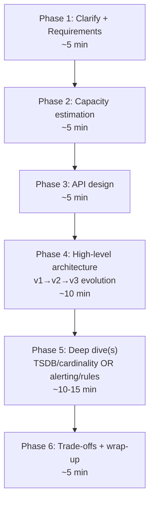

| Phase | Time [illustrative — scale to your actual slot] | What you're producing |
|---|---|---|
| Clarify + Requirements | ~5 min | Functional/non-functional list stated out loud, scope boundary named (§4) |
| Capacity estimation | ~5 min | `hosts × metrics/host ÷ interval = points/sec`, cardinality, storage (§6) |
| API design | ~5 min | Pull/push/query endpoint shapes (§12) |
| High-level architecture | ~10 min | v1→v2→v3 evolution, naming what breaks at each step (§13) |
| Deep dive(s) | ~10-15 min | Whichever the interviewer steers toward — TSDB internals or alerting at scale (§11, §16) |
| Trade-offs + wrap-up | ~5 min | Trade-off table, failure modes, one real system named per component |

This is the *compact* version of the plan — §22 gives the detailed
minute-by-minute script including what to actually say, plus what to do
when the interviewer breaks this order.

---

## 4. Requirements — what to clarify before you design anything

Ask these out loud in the first couple of minutes. They drive every later
decision — push vs. pull, retention length, how strict your cardinality
limits need to be.

> **Two-sentence version:** State the pipeline out loud — collect, store,
> query, visualize, alert — then immediately ask for fleet size and
> scrape interval, because every later number depends on those two
> inputs. Explicitly scope out logs and traces so the interviewer knows
> you know the boundary, not that you forgot they exist.

**Functional requirements**
- Collect metrics from every host/service/container in the fleet — both OS-level (CPU, memory, disk) and custom application metrics.
- Store metrics as time series, queryable by metric name plus labels, over an arbitrary time range.
- Visualize metrics on dashboards (ad-hoc exploration + saved dashboards).
- Continuously evaluate alerting rules and notify on-call when a rule fires.
- (Stretch, mention and move on) support both real-time queries (seconds-old data) and historical queries (years-old, downsampled data).

**Non-functional requirements**
- **Scale**: a fleet of 100K+ hosts, each emitting hundreds to thousands of metrics — that's millions of active time series (see capacity estimation below).
- **Low collection overhead**: instrumentation must not itself slow down the thing being measured — "death by observability" is a real failure mode.
- **Write-heavy**: ingestion volume dwarfs read volume. Optimize the write path first, the read path second.
- **The monitoring system must be more available than what it watches** — if it shares a failure domain with the systems it monitors, an outage can blind you at the exact moment you need visibility.
- **Durability vs. cost**: losing the last few seconds of raw samples in a crash is tolerable; silently losing historical trend data is not.
- **Fast queries over huge ranges**: "p99 latency for the last 30 days" should render in a couple of seconds, not minutes.

**Explicitly out of scope for a first pass** — say this so the interviewer knows you know the boundary: distributed tracing internals, log storage/search, synthetic/blackbox probing. Acknowledge the three pillars exist (§18 below), then keep the rest of the interview focused on metrics.

**Cheat-sheet:**
- Lead with "collect → store → query → visualize → alert," then immediately flag fleet size × metrics-per-host as the number that drives every architecture choice.
- If the interviewer doesn't hand you a fleet size, pick one and label it illustrative (e.g., "let's say 100K hosts") — never leave capacity estimation undefined.

---

## 5. The cost of not monitoring (memorize these numbers)

> **Two-sentence version:** Downtime cost is (revenue/sec + SLA penalties
> + churn), not just infra spend, and top-tier consumer apps lose tens of
> thousands of dollars per minute of outage. Use one concrete number as a
> 30-second opener to justify spending interview time on observability at
> all.

| Incident | Date | Cost |
|---|---|---|
| Meta (FB/IG/WhatsApp/Oculus) outage | Oct 2021 | ~$13M / hour **[illustrative/approximate — publicly reported estimate]** |
| AWS us-east-1 network congestion outage | Dec 7, 2021 | ~$66,240 / minute **[illustrative/approximate — publicly reported estimate]** |
| General rule of thumb interviewers expect | — | "Every minute of downtime for a top-tier consumer app costs tens of thousands of dollars, plus reputational/SLA damage" **[illustrative]** |

Use these numbers to justify **why** you're spending interview time on
observability instead of jumping straight to a data model — monitoring is a
first-class non-functional requirement, not an afterthought.

**Cheat-sheet:**
- Downtime cost scales with (revenue/sec + SLA penalties + churn), not just infra cost.
- Root cause of the AWS Dec 2021 outage **[well-documented — AWS published its own post-incident summary]**: an automated capacity-scaling job triggered a connection storm that congested internal network devices — a **feedback loop**, not a hardware failure. Good example of "monitoring must watch for retry storms," not just raw errors.

---

## 6. Capacity estimation (the numbers interviewers want to see)

> **Two-sentence version:** The formula is `hosts × metrics/host ÷
> scrape_interval = points/sec`, and cardinality (`hosts × metrics/host`
> = active series) is the number that actually threatens the system, not
> point volume. Memorize the shape of the calculation — the interviewer
> cares more about what multiplies by what than the exact digits.

Treat the base numbers below as an assumption you state out loud, then
compute from — the interviewer cares more about the *method* (what
multiplies by what) than the exact digits.

**Ingest rate**
- Assume 100,000 hosts, each emitting 1,000 distinct time series, scraped/pushed every 15s. **[illustrative — a stated assumption, not a fact]**
- Data points/sec = 100,000 × 1,000 ÷ 15 ≈ **6.7M data points/sec** fleet-wide. **[say cold, given the assumption above]**
- At roughly 2 bytes/point after Gorilla-style compression (see § TSDB below) **[illustrative — an assumed per-point cost, not a guarantee]**, that's ~13 MB/sec of compressed write throughput, ~1.1 TB/day. **[say cold, given the 2-bytes/point assumption]**

**Cardinality**
- Active time series = hosts × metrics-per-host = 100,000 × 1,000 = **100M active series**. **[say cold, given the assumption above]**
- Each series needs an in-memory index entry (metric name + label set). At ~500 bytes/series **[illustrative — an assumed index-entry cost]** that's ~50 GB just for the index — before a single sample is stored. **[say cold, given the 500-byte assumption]** This is why cardinality, not raw point volume, is the scarce resource in a TSDB.
- Contrast: a label with unbounded cardinality (e.g., `user_id` with 10M distinct values) can turn 1,000 base metrics into up to **10 billion** series **[say cold, given those inputs]** — this is the failure mode covered in the cardinality-explosion section below.

**Storage / retention**
- Raw (15s resolution), kept 15 days: 6.7M points/sec × 86,400s × 15 days × ~2 bytes ≈ **~17 TB** compressed. **[say cold, given the stated inputs]**
- 5-min rollups, kept 13 months: roughly 1/20th the point rate of raw **[illustrative — depends on the rollup functions kept]** → a few TB.
- 1-hour rollups, kept years: smaller still — effectively "free" to retain forever.
- Rule of thumb: each downsampling tier costs roughly an order of magnitude less than the tier below it. **[illustrative]** That's why tiered retention — not "keep everything at full resolution forever" — is the only economical option at this scale.

**Query load**
- Reads (dashboards opening, alert rules ticking) are bursty, not constant. Provision for peak concurrent queries, not the average.

### Redo the math with different inputs — a mobile/IoT fleet

This is the check that the *formula* is what you memorized, not the
digits. Swap in a completely different shape of fleet and see the same
two lines of arithmetic still drive the answer:

- New assumption: 2,000,000 mobile devices, each emitting only 20 metrics, pushed once every 60s (battery-constrained, so a much longer interval than a 15s server scrape). **[illustrative — a stated, different assumption]**
- Points/sec = 2,000,000 × 20 ÷ 60 ≈ **666K data points/sec**. **[say cold, given this assumption]** — an order of magnitude *below* the 100K-host server fleet, even with 20x more devices, because the interval is 4x longer and the metrics/device is 50x smaller. The interval and per-unit metric count dominate over raw device count.
- Active series = 2,000,000 × 20 = **40M active series**. **[say cold, given this assumption]** — smaller than the 100M-series server fleet, for the same reason.
- Takeaway to say out loud: "Cardinality and ingest rate scale with *device count × metrics-per-device*, and get divided by scrape interval — so a much larger fleet with sparser instrumentation and a longer interval can be cheaper than a smaller, densely-instrumented one. I'd re-run this formula the moment any of those three inputs changes, rather than assuming 'more devices' always means 'more load.'"

**Cheat-sheet:**
- Memorize the *shape* of the calculation, not the digits: `hosts × metrics/host ÷ scrape_interval = points/sec`.
- Cardinality (unique label combinations) — not raw point count — is what actually breaks a TSDB. Call this out explicitly; it's the thing interviewers probe for.
- If the interviewer changes an input mid-interview (fleet size, interval, retention), re-run the same two formulas live rather than re-deriving from scratch — that's the "redo the math" muscle above.

---

## 7. Two failure domains: server-side vs. client-side

| | Server-side errors | Client-side errors |
|---|---|---|
| **HTTP class** | 5xx | 4xx (visible) / nothing at all (invisible) |
| **Visibility** | Always visible to the backend — it generated the error | Sometimes invisible — request never reached the server |
| **Detected via** | APM agents, server logs, exception tracking | RUM (real user monitoring), client-side SDKs, beacon pings |
| **Example** | DB connection pool exhausted → 503 | User's WiFi drops before request is sent → server sees *nothing* |
| **Tooling** | Prometheus, Datadog APM, New Relic | Sentry, Bugsnag, Google Analytics RUM, Firebase Crashlytics |

The invisible case (request never arrives) is the hard one — you cannot
instrument a server for a request it never received. This is why
client-side monitoring needs its **own** pipeline (client SDK batches
events locally, sends them opportunistically) rather than piggybacking on
server logs.

**Cheat-sheet:**
- If the interviewer says "how would you know a user's request never made it to your service" — that's the client-side/invisible-error signal. Answer: client SDK + periodic beacon/heartbeat + local buffering with retry-on-reconnect.

---

## 8. Metrics: the atomic unit of monitoring

> **Two-sentence version:** A metric is a name, a set of labels, and a
> timestamped value; the four types — counter, gauge, histogram, summary
> — differ in whether they monotonically increase, hold a point-in-time
> value, or represent a distribution. Always prefer histograms over
> summaries for anything aggregated across a fleet, because bucket counts
> sum but quantiles don't.

A **metric** = what to measure + the unit + a timestamped value.
Good metrics have low collection overhead — measuring must not itself
degrade the system (avoid death-by-observability).

### Metric types (the source glosses over this — know it cold)

| Type | Semantics | Example | Aggregation |
|---|---|---|---|
| **Counter** | Monotonically increasing, resets on restart | `requests_total`, `errors_total` | `rate()` / `increase()` over time window |
| **Gauge** | Point-in-time value, goes up or down | `queue_depth`, `memory_used_bytes` | last value, avg, min/max |
| **Histogram** | Distribution of values bucketed by range | `request_latency_ms` buckets: `<10, <50, <100, <500, +Inf` | compute p50/p90/p99 from buckets |
| **Summary** | Pre-computed quantiles client-side | `request_latency_ms{quantile="0.99"}` | can't re-aggregate across instances (major limitation) |

**Trade-off interviewers love to probe:** histogram vs. summary. Histograms
are aggregatable across servers (bucket counts sum), summaries are not
(you cannot average two p99s and get a correct global p99). Always prefer
histograms for anything you'll aggregate across a fleet.

**Pick-the-metric-type flowchart** — run through this in your head any time
you instrument something new:

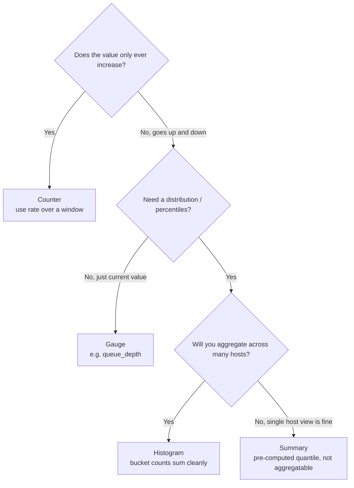

### What to actually collect
- OS-level: CPU (user/sys/iowait), memory (RSS, page faults, swap), disk (IOPS, latency, free space), network (throughput, retransmits).
- App-level (via code instrumentation): request rate, error rate, latency percentiles, queue depths, cache hit ratio, thread-pool saturation.
- The **RED method** (for request-driven services): **R**ate, **E**rrors, **D**uration.
- The **USE method** (for resources): **U**tilization, **S**aturation, **E**rrors.

**Cheat-sheet:**
- RED = "how are my services doing" (front-end for user traffic).
- USE = "how are my resources doing" (back-end, hardware/infra).
- Always tie a metric to an **action** — a metric nobody alerts on or dashboards is dead weight and adds collection overhead for nothing.

---

## 9. Data model: how a "metric" becomes a "time series"

> **Two-sentence version:** A metric name plus a label set defines one
> time series, and every unique label-value combination is stored as its
> own indexed series. Cardinality multiplies across labels — that's why
> label schema *is* the capacity-planning decision, not an afterthought.

A **metric name** plus a **set of labels (key/value tags)** together
define one **time series** — a stream of `(timestamp, value)` pairs
ordered in time. Change any label *value* and you get a different
series, not the same one with more data.

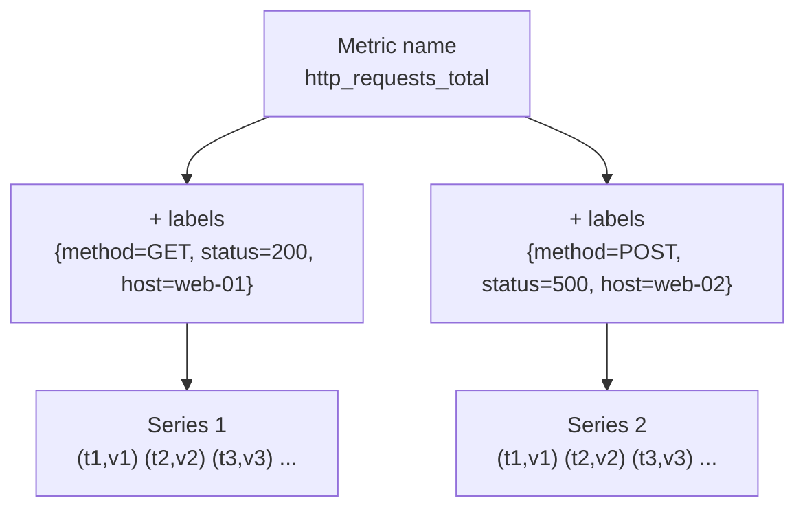

Concretely, one sample looks like this (Prometheus exposition style):

```
http_requests_total{method="GET", status="200", host="web-01"} = 42893  @ t=1737200015
```

- **Metric name** — what's being measured (`http_requests_total`, `cpu_usage_percent`).
- **Labels/tags** — dimensions you'll want to slice or filter by (`method`, `status`, `region`, `host`). Every unique combination of label values is its own series, indexed separately.
- **Timestamp** — when the sample was taken (usually collection time, not event time).
- **Value** — a single float for counters/gauges, or a set of bucket counts for a histogram.

This is exactly why label choice *is* the capacity-planning decision —
adding a label multiplies series count by that label's cardinality (see
the cardinality-explosion section under TSDBs, below).

**Cheat-sheet:**
- Mnemonic: **"Name + Labels = Series."** Same name, different label values → different series, each indexed and stored separately.
- Cardinality multiplies across labels, it doesn't add: a metric with 3 labels of cardinality 10, 5, and 2 produces `10 × 5 × 2 = 100` series, not `10 + 5 + 2 = 17`. **[say cold — arithmetic on stated inputs]**

---

## 10. Push vs. pull — the central design decision

> **Two-sentence version:** Pull means the monitoring system decides when
> to scrape, keeping it in control of its own load and giving a free
> liveness check on every scrape; push means each host decides when to
> send, which is friendlier through firewalls but risks overwhelming the
> collector. Default to pull for long-lived services, add a push gateway
> for jobs too short-lived to be scraped.

The course frames this correctly: **always describe push/pull from the
monitoring system's point of view**, not the server's, or you'll confuse
your interviewer mid-explanation.

A sequence diagram makes the key asymmetry obvious — **who initiates, and
on whose schedule**:

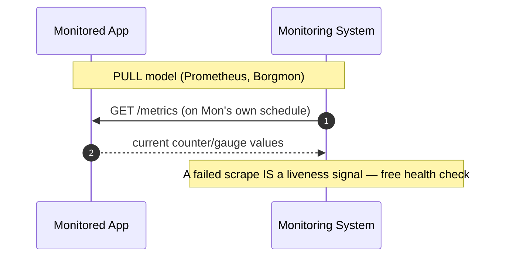

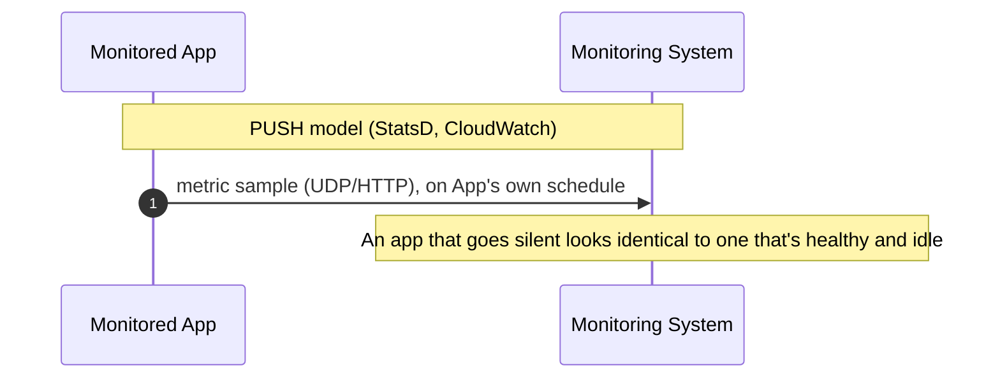

| | Pull (Prometheus-style) | Push (StatsD/Graphite-style) |
|---|---|---|
| **Who controls cadence** | Monitoring system (scrape interval) | Each server (can flood or under-report) |
| **Overload risk** | Low — monitoring system paces itself | High — many servers can push simultaneously and overwhelm the collector |
| **Firewall/NAT friendly** | No — monitoring system needs network access to every target | Yes — servers only need outbound access |
| **Short-lived jobs (batch/cron)** | Bad fit — job may finish before next scrape | Good fit — push-and-die, or push via a gateway (Prometheus Pushgateway) |
| **Service discovery need** | Yes — monitoring system must know all targets (via Consul/K8s API/DNS) | No — servers self-register by pushing |
| **Real examples** | Prometheus, Google Borgmon/Monarch | StatsD, Graphite, AWS CloudWatch (custom metrics), Facebook ODS |

**Why Prometheus actually chose pull** *(well-documented — this reasoning
is stated directly in Prometheus's own project docs and maintainer
talks, not an inference)*: three reasons, in order of how often
interviewers ask for them —
1. **The monitoring system stays in control of its own load.** With push, a bug that makes every host push twice as often can overwhelm the collector; with pull, the scraper paces itself no matter what the targets do.
2. **A failed scrape is a free liveness check.** You don't need a separate heartbeat mechanism — "can I reach `/metrics`" already tells you the process is up and responsive.
3. **It composes cleanly with service discovery.** Point Prometheus at Kubernetes'/Consul's target list and it scrapes whatever exists right now — no per-host config push needed when hosts come and go.

The trade-off it accepts: the monitoring system needs network reachability
to every target (harder across firewalls/NAT), and short-lived jobs need
a workaround (Pushgateway) since they may not exist at the next scrape.

**Interview answer skeleton:** "I'd default to pull for long-running
services — it's simpler to reason about load on the monitoring system and
plays well with service discovery in Kubernetes. I'd add a push path (via a
gateway) for short-lived batch/cron jobs that die before a scrape would
catch them."

**Cheat-sheet:**
- Pull = monitoring system in control, self-throttling, needs service discovery.
- Push = server in control, better through firewalls, needs a push-gateway for ephemeral jobs, risk of thundering herd.
- Real systems often run **both**: Prometheus pulls app instances directly but pulls a Pushgateway that batch jobs push into.

---

## 11. Persisting the data: time-series databases

> **Two-sentence version:** A TSDB is optimized for append-only,
> timestamp-ordered writes with heavy compression and cheap range scans —
> nothing like a general OLTP database. Retention only stays affordable
> because of tiered downsampling: full resolution for days, 5-minute
> rollups for months, hourly rollups effectively forever.

A centralized in-memory store works at small scale. At FAANG scale (millions
of time series, thousands of samples/sec), you need a **time-series
database (TSDB)** purpose-built for:
- Append-only, timestamp-ordered writes (never random-access updates)
- Massive compression (timestamps and values are highly predictable)
- Efficient range queries ("give me this metric for the last 6 hours")
- Downsampling / rollups for long retention without unbounded storage

### Key compression trick (bring this up for depth)
Facebook's **Gorilla** (paper: "Gorilla: A Fast, Scalable, In-Memory Time
Series Database") compresses timestamp+value pairs ~12x **[illustrative/
approximate — a reported result on Facebook's own workload, well-
documented via the published paper, but not a universal guarantee on
arbitrary data]** using:
- **Delta-of-delta encoding** for timestamps (samples arrive at near-fixed intervals, so the *second* delta is usually 0)
- **XOR encoding** for floating-point values (consecutive values are usually close, so XOR-ing them yields mostly leading/trailing zero bits)

This is the single most "I've done my homework" fact you can drop in a
monitoring deep-dive.

### Real-world TSDBs
| System | Origin | Notes |
|---|---|---|
| Prometheus TSDB | CNCF/Kubernetes ecosystem | Local disk, 2-hour blocks, pull-based scraping |
| InfluxDB | Open source | Push-based, SQL-like query language |
| OpenTSDB | Built on HBase | Horizontally scalable, older-generation |
| Gorilla / Beringei | Facebook | In-memory, ~12x compression, feeds Grafana-like dashboards |
| M3DB | Uber | Built for horizontal scale + long retention, powers Uber's M3 stack |
| Amazon CloudWatch | AWS managed | Push-based, integrates natively with AWS services |
| Monarch | Google | Multi-tenant, hierarchical, backs Google's internal monitoring |

Retention is a straight-line pipeline — picture it as a conveyor belt that
gets coarser as data ages:

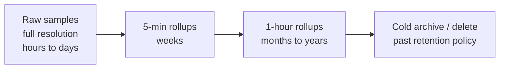

#### Retention tiers, with illustrative numbers

| Tier | Resolution | Typical retention | Storage vs. raw | Use case |
|---|---|---|---|---|
| Raw | Every scrape (e.g., 15s) | Hours–days (Prometheus default: 15d) | 1x (baseline) | "What happened 10 minutes ago" |
| 5-min rollup | avg/max/min per 5 min | Weeks–13 months | ~1/20th **[illustrative]** | Dashboards over days/weeks |
| 1-hour rollup | avg/max/min per hour | Months–years | ~1/240th **[illustrative]** | Long-term/year-over-year trends |
| Cold archive | Same as last rollup, on object storage (S3/GCS) | Years, or forever | Negligible marginal cost | Compliance, historical analysis |

Mnemonic for the tiers: **Raw → Rolled → Really-old (archive)** —
resolution drops and retention length grows at every step.

**Cheat-sheet:**
- Retention strategy: keep raw samples for hours/days, downsample (avg/max per 5-min bucket) for weeks, further downsample for years. This bounds storage growth (a classic system design trade-off: **precision vs. storage cost**).
- **If a query's range is more than a few hours, it should read from a downsampled tier, not raw** — otherwise the query engine scans far more points than the dashboard can even render.

#### Cardinality-explosion protection flowchart

Cardinality explosion is the #1 operational risk in a TSDB — a single
poorly-chosen label can multiply series count by orders of magnitude.
**Example:** 1,000 base time series with a `user_id` label carrying
100,000 distinct values turns into up to **100,000,000 series**
**[say cold, given those inputs]** — the in-memory index alone can exceed
available memory and take the whole TSDB down. Real incidents at this
scale are almost always a label like `user_id`, `request_id`,
`session_id`, `raw_url`, or a client IP baked directly into a label.

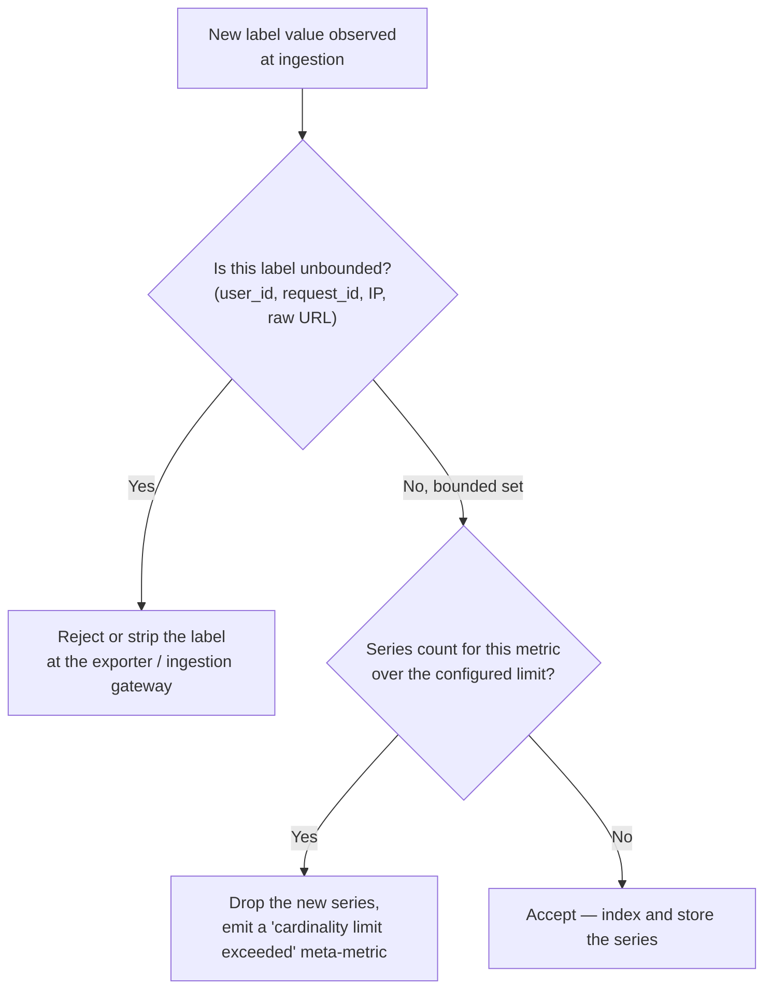

**Cheat-sheet:**
- **If a label's set of possible values is unbounded or user-controlled → never put it in a label.** Bucket it, hash it into a bounded set, or move it to a log/trace instead — metrics are for low-cardinality dimensions only.
- Always mention a hard per-metric series limit and an ingestion-time rejection rule — this is the concrete mechanism that turns "watch out for cardinality" from a slogan into a design decision.

---

## 12. API design: push, pull, and query

> **Two-sentence version:** Three distinct surfaces — expose (`GET
> /metrics` for a scraper to pull), ingest (`POST /push` for the push
> model or a gateway), and query (`GET /query_range`, used by both
> dashboards and the alerting engine). Don't conflate the write API with
> the query API; their load profiles are opposite (constant/high-volume
> vs. bursty).

Three API surfaces worth naming explicitly — interviewers want to see
you separate "how metrics get in" from "how metrics get out."

**1. Pull endpoint (exposed by every monitored instance)**
```
GET /metrics
```
Response — plain text, one line per series (this is the real Prometheus
exposition format, worth reciting from memory):
```
# TYPE http_requests_total counter
http_requests_total{method="GET",status="200"} 42893
http_requests_total{method="POST",status="500"} 12
# TYPE queue_depth gauge
queue_depth 47
```
The scraper hits this on a fixed interval (e.g., every 15s) per target.

**2. Push endpoint (for the push model, or a gateway for ephemeral jobs)**
```
POST /api/v1/push
Body: [{ "metric": "job_duration_seconds",
         "labels": {"job": "nightly-etl"},
         "value": 812.4,
         "timestamp": 1737200015 }]
```

**3. Query API (used by dashboards and the alerting engine alike)**
```
GET /api/v1/query_range?query=rate(http_requests_total{status="500"}[5m])&start=...&end=...&step=60s
```
Returns `(timestamp, value)` points per matching series. The same
query language (PromQL-style) powers both a dashboard panel and an
alert rule — one query engine, two consumers, by design.

**Cheat-sheet:**
- Three verbs to say out loud: **expose** (pull target), **ingest** (push target), **query** (read). Don't conflate the write API with the query API — they have very different load profiles: writes are constant and high-volume, queries are bursty.
- The query API is the one both Grafana and the alerting engine call — say this explicitly to show alerting is "just another query consumer," not a separate data path.

---

## 13. High-level architecture of a monitoring system

> **Two-sentence version:** A monitoring system grows from one
> Prometheus-and-Grafana box, to sharded scrapers writing into a
> horizontally-scaled TSDB, to a v3 with a dedicated downsampling
> pipeline and an independently-shardable rule-evaluation tier so
> dashboard load never delays a page. Each extra piece of complexity
> exists because something concrete broke at the prior scale, not because
> bigger is inherently better.

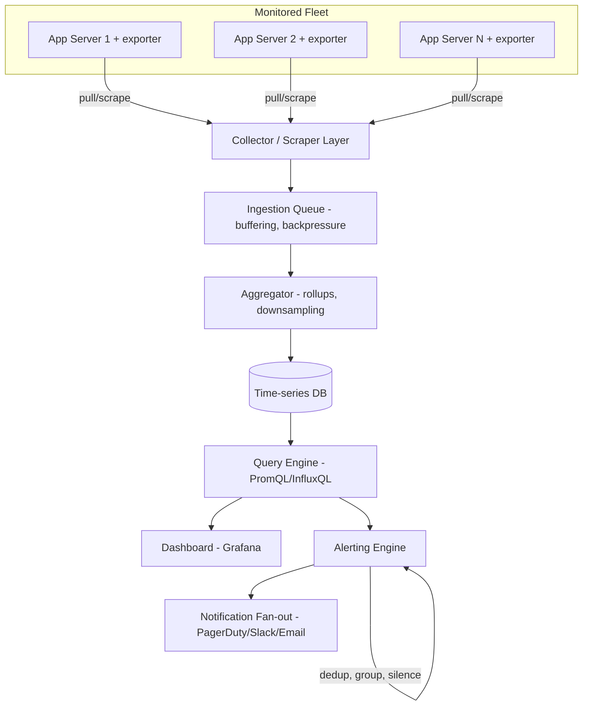

**Components to name in an interview, in this order:**
1. **Agents/exporters** on every host — expose or push metrics (node_exporter, StatsD client, custom app instrumentation).
2. **Collector/scraper layer** — horizontally sharded, does service discovery to know what to scrape.
3. **Ingestion buffer/queue** — absorbs bursts, gives backpressure protection (a Kafka-like buffer is common at scale).
4. **Aggregator** — computes rollups, downsamples for long-term storage.
5. **Time-series storage** — the durable store discussed above.
6. **Query engine** — PromQL-style query layer for both dashboards and alert rules.
7. **Dashboarding** — Grafana-style visualization.
8. **Alerting engine** — evaluates rules against the query engine, handles **deduplication, grouping, silencing, and escalation** (Prometheus Alertmanager is the canonical example).

**Cheat-sheet:**
- Always mention that the monitoring system itself must be **more available and more decoupled** than the systems it monitors — if the primary DB and the monitoring system share infra, an outage can blind you exactly when you need visibility most (monitor the monitor / use a separate failure domain).
- Sharding the collector layer by service or by data center avoids one scraper trying to pull from every host globally.

#### Architecture evolution: v1 → v2 → v3

Walk through this progression out loud when asked "how would this scale
as the fleet grows" — it shows you know *why* each extra piece of
complexity gets added, not just that it exists.

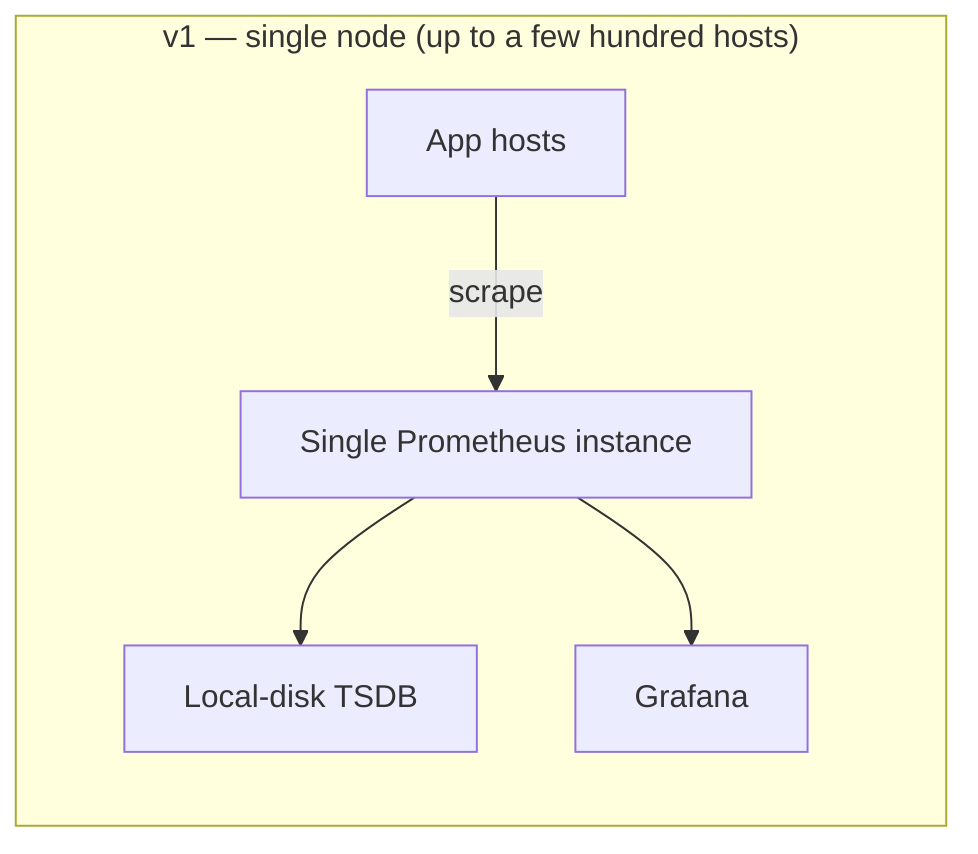
*Why it breaks:* one process can't hold millions of series in memory,
and one scraper can't reach thousands of hosts inside a 15s interval.

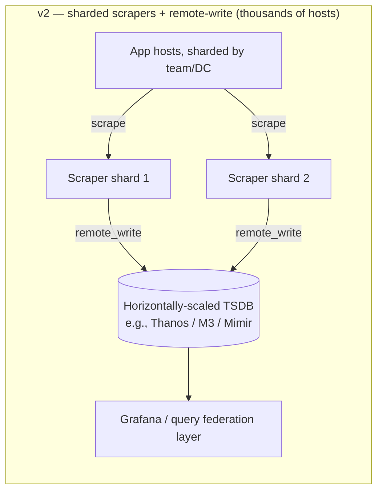
*Why it still isn't enough:* downsampling is ad hoc (or missing), and
alert-rule evaluation shares the same query engine as dashboards — a
burst of dashboard traffic can slow down alert evaluation right when
something is on fire.

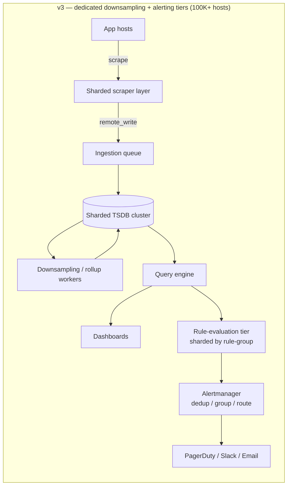
*What changed:* downsampling runs as its own background pipeline
instead of a one-off script, and rule evaluation is a horizontally
shardable tier that only needs read access to the query engine — so a
spike in dashboard queries never delays a page. Same "monitor the
monitor" principle as above, applied to the alerting path specifically.

---

## 14. End-to-end trace: catching a real incident, minute by minute

This is the "walk one request through every layer" device the rest of
this course leans on — here the "request" is a failure event flowing
through the whole pipeline, not a user request. All timestamps below are
**[illustrative]** — a made-up but internally-consistent scenario built
from the real mechanics described above (15s scrape interval, 30s rule
evaluation, a 2-minute `for` window).

**Scenario: `payments-service` starts throwing DB timeouts.**

- **3:14:00pm** — pod `payments-7f3a` starts failing DB calls; its `/metrics` endpoint's `http_requests_total{status="500"}` counter begins incrementing faster than usual. Nothing outside the pod knows yet.
- **3:14:15pm** — the scraper shard responsible for this pod's target group hits its next scheduled scrape (fixed 15s cadence — it doesn't scrape early just because something's wrong). The updated counter value is pulled and handed to the ingestion queue.
- **3:14:16pm** — the aggregator writes the raw sample into the sharded TSDB, Gorilla-compressed inline (§11).
- **3:14:30pm** — the rule-evaluation shard for `payments-service`'s alert group runs its scheduled query (every 30s): `rate(http_requests_total{service="payments",status="500"}[5m]) > 0.01`. The just-written point pushes the ratio over 1%. The rule transitions **Inactive → Pending**, starting a 2-minute `for` timer (§16) — this window exists specifically so a five-second blip doesn't page anyone.
- **3:16:30pm** — the evaluator runs again; the breach has held for the full 2 minutes, so the rule transitions **Pending → Firing**.
- **3:16:31pm** — Alertmanager receives the firing alert, **groups** it with ~40 other `payments-service` alerts firing from other pods behind the same load balancer (one incident, not 41 pages), and confirms it isn't silenced.
- **3:16:40pm** — PagerDuty pages the on-call engineer. **Total time from first failing request to a human being paged: ~2 minutes 40 seconds** — dominated almost entirely by the deliberate 2-minute `for` window, not by pipeline latency (scrape + ingest + write added roughly 30 seconds of that).
- **3:18pm** — on-call opens the golden-signals dashboard for `payments-service`, confirms the RED-method panel (rate/errors/duration) shows the spike, and pivots to distributed traces to find *which* downstream call is the actual root cause (DB pool exhaustion). Metrics told them *that* and *how bad*; tracing tells them *why* (§18).

**Cheat-sheet:**
- The dominant latency in "how fast do we detect this" is almost always the deliberate hysteresis window (`for` duration), not the collection pipeline — say this explicitly if asked to account for detection time.
- This trace is the concrete answer to "walk me through exactly what happens when a service starts failing" — reuse this shape, don't invent a new one live.

---

## 15. Visualizing enormous volumes of data

> **Two-sentence version:** Dashboards can't render millions of raw
> points, so aggregate before you render and surface outliers instead of
> dumping every series. The same principle — never return more points
> than there are pixels to show them — is what makes queries over huge
> time ranges fast, too.

Dashboards at scale can't render millions of raw points — a few techniques
worth naming:
- **Downsampling for display**: querying a week-long range returns 5-min averages, not raw per-second samples.
- **Heatmaps** for latency distributions over time (better than overlaying hundreds of percentile lines).
- **Top-N / anomaly-highlighting views**: instead of showing every host, surface the outliers (e.g., "these 3 of 10,000 hosts have p99 > 3x fleet median").
- **Golden signals dashboards**: one screen per service showing rate, errors, duration, saturation — the first thing an on-call engineer opens.

**Cheat-sheet:**
- If asked "how do you show a human millions of data points without melting their brain," answer: aggregate before you render, and surface outliers, don't dump raw series.

#### Query performance over huge time ranges

A dashboard panel asking for "error rate over the last 90 days" must
not scan 90 days of raw 15-second samples. Four techniques make this
fast:

- **Recording rules**: pre-compute expensive queries (e.g., `rate(...)[5m]`) on a schedule and store the *result* as its own time series. The dashboard then reads the cheap pre-computed series instead of recomputing the aggregation on every page load.
- **Automatic resolution selection**: the query engine picks raw, 5-min, or 1-hour data based on the requested range and display width — no point returning more points than there are pixels on screen.
- **Query fan-out + merge**: a sharded TSDB runs the query on every shard in parallel and merges partial results at the query layer — the same scatter-gather pattern as any other sharded datastore.
- **Result caching**: cache query results keyed on `(query, range, step)` for a few seconds — an auto-refreshing dashboard shouldn't recompute an unchanged historical range on every tick.

**If X then Y:** if a query's range spans more than a few hours, route it to a downsampled tier and/or a recording rule — never let one ad-hoc dashboard query force a full raw-resolution scan across weeks of data.

---

## 16. Alerting

> **Two-sentence version:** An alert is a condition plus an action, but
> the real design problem is alert fatigue — solved with a
> Pending→Firing state machine so blips don't page, dedup/grouping, and
> alerting on SLO burn rate rather than raw thresholds. The alerting
> engine is just another consumer of the same query API dashboards use,
> not a separate data path.

An alert = **condition/threshold** + **action**. Two components, but the
hard part in practice is avoiding **alert fatigue**.

Alerts aren't just on/off — they move through a real state machine
(this mirrors Prometheus Alertmanager's actual states, worth reciting
verbatim in an interview):

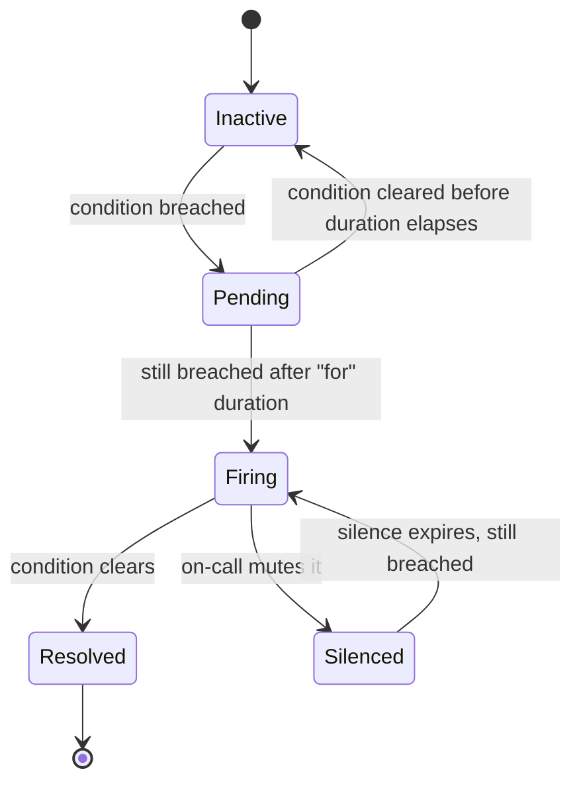

The `Pending` state is the quiet hero here — it's what stops a single
5-second blip from paging someone; only a breach that survives the `for`
window becomes `Firing`. (See §14 for exactly this playing out with real
timestamps.)

| Technique | Purpose |
|---|---|
| **Deduplication** | Same root cause firing 500 alerts across 500 hosts → collapse to 1 |
| **Grouping** | Alerts for the same service/incident bundled into a single notification |
| **Silencing/muting** | Suppress known, expected alerts (e.g., during planned maintenance) |
| **Escalation policies** | Page on-call → escalate to secondary → escalate to manager, on a timer |
| **Multi-window, multi-burn-rate alerts** | Alert only if an SLO error budget is burning fast (Google SRE technique) — avoids paging for tiny blips |

### SLI / SLO / SLA — bring these up, interviewers expect it
- **SLI** (indicator): the actual measured metric, e.g., "% of requests under 300ms."
- **SLO** (objective): the internal target, e.g., "99.9% of requests under 300ms over 30 days."
- **SLA** (agreement): the external, often contractual, commitment with financial penalties for breach — usually looser than the SLO to leave margin.
- **Error budget**: `1 - SLO`. If SLO is 99.9%, you have a 0.1% error budget per period **[say cold — direct arithmetic from the stated SLO]** — alerting logic should be built around **burn rate** against this budget, not raw thresholds.

**Cheat-sheet:**
- Alert on **symptoms** (user-facing latency/error rate), not causes (CPU is at 80%) — causes should feed dashboards, not pages, or you get paged for things that don't actually hurt users.
- Alerting engine should be a distinct component from the query/storage engine — Alertmanager pattern (rule evaluation is stateless and can run independently of storage).

#### How rule evaluation actually runs at scale

An alert rule is just a query, run on a timer, compared against a
threshold. The scale problem isn't the metrics again — it's **sharding
the rules themselves** so one node isn't evaluating every rule for the
whole fleet.

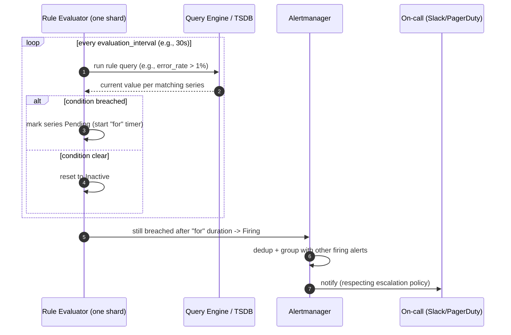

Rule groups are sharded across many evaluator workers — by service,
team, or a hash of the rule name — so no single node evaluates every
rule in the fleet. Each worker only needs read access to the query
engine, not the raw storage layer, which keeps the alerting tier
decoupled from TSDB internals (same "monitor the monitor" principle as
the v3 architecture diagram above).

**Cheat-sheet:**
- Rule evaluation is "a query on a timer" — the interesting scale problem is sharding *rules*, not re-sharding metrics.
- If asked "what happens if the rule evaluator falls behind," the answer is: it's just another consumer of the query API, so it can be scaled out horizontally like any other stateless read client.

---

## 17. Client-side monitoring deep-dive

> **Two-sentence version:** Client-side failures can be totally invisible
> to the server — the request never arrived — so client monitoring needs
> its own pipeline: an SDK that buffers events locally and flushes
> opportunistically, plus heartbeats to detect silence. You can't
> instrument a server for a request it never received; that's the entire
> reason RUM exists.

Server-side pain is always visible somewhere; client-side pain can be
**totally invisible** to the backend (the request never arrived). Real
systems solve this with:

- **RUM (Real User Monitoring)** SDKs embedded in the client (web/mobile) that record page-load time, JS exceptions, API call failures, and crash reports.
- **Local buffering + batch upload**: client buffers events and flushes them opportunistically (on a timer, on app foreground, or via `navigator.sendBeacon` on page unload) so flaky connectivity doesn't lose data.
- **Sampling**: at billions of events/day, sample (e.g., 1% of successful requests, 100% of errors) to control cost while still catching every failure.
- **Session replay / breadcrumbs** (Sentry-style): capture the sequence of user actions leading up to a crash for debugging without full video capture.
- **Beaconing/heartbeat**: a lightweight periodic "I'm still alive and my last N requests looked like X" ping lets you detect the case where the client can't reach the primary service at all, distinguishing "client crashed" from "client can't reach us."

The resilience trick is the local buffer sitting *between* the event and
the network call — draw this whenever asked "how does client-side
monitoring survive a flaky connection":

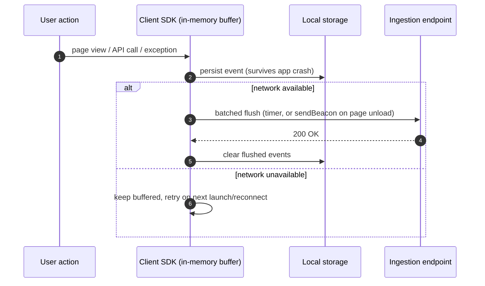

**Real-world examples** **[well-documented — public products]**: Sentry,
Bugsnag, Firebase Crashlytics, Google Analytics/Search Console Core Web
Vitals, New Relic Browser, Datadog RUM.

**Cheat-sheet:**
- Client-side pipeline is architecturally separate from server-side: client SDK → batched HTTP POST to an ingestion endpoint → same pipeline (queue → aggregator → TSDB) from there on.
- The invisible-failure case (packet never leaves the device) can only be caught by watching for **drop-offs in expected client heartbeats**, not by anything server logs can show.

---

## 18. Logs vs. Metrics vs. Traces (the three pillars)

> **Two-sentence version:** Metrics tell you something's wrong and how
> bad, logs tell you exactly what happened at a moment in time, and
> traces tell you which hop in a call chain added the latency — picking
> the wrong pillar for the question is the single biggest way candidates
> lose points here. OpenTelemetry is the modern instrumentation layer
> that emits all three from one SDK.

| | Metrics | Logs | Traces |
|---|---|---|---|
| **Shape** | Numeric time series | Unstructured/structured text events | Causally-linked spans across services |
| **Cardinality** | Low (aggregatable) | High (every event) | High (per-request) |
| **Cost** | Cheap to store long-term | Expensive at scale, needs retention limits | Expensive, usually sampled |
| **Answers** | "Is something wrong, and how bad?" | "What exactly happened at 3:02:17am?" | "Which of these 12 microservices added the latency?" |
| **Tools** | Prometheus, CloudWatch, Datadog | ELK/OpenSearch, Splunk, Loki | Jaeger, Zipkin, OpenTelemetry, AWS X-Ray |

Pick the right pillar for the question actually being asked — this is the
#1 place candidates lose points by forcing metrics to answer a tracing
question:

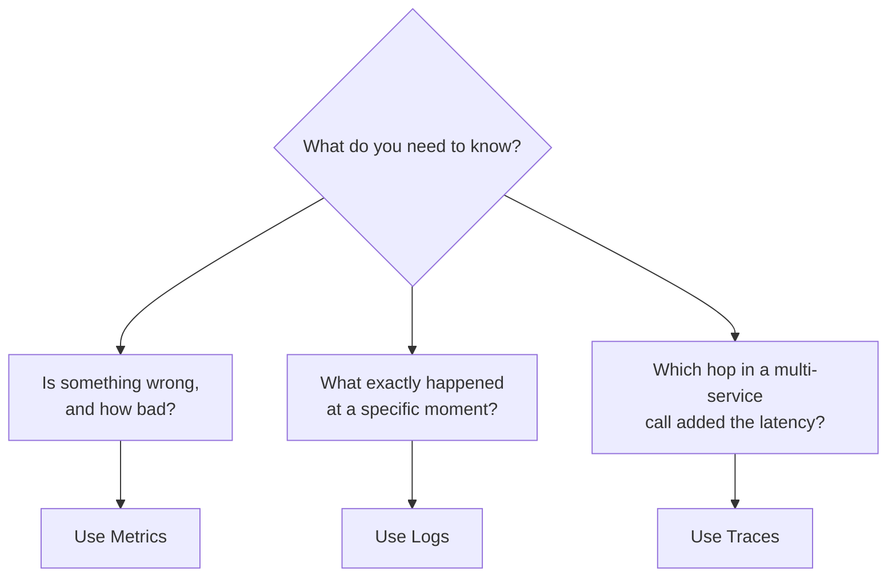

**Cheat-sheet:**
- If the interviewer pushes into "how do you find *why* a specific slow request was slow across 10 microservices" — that's distributed tracing, not metrics. Know the difference and pivot correctly instead of forcing metrics to answer a tracing question.
- OpenTelemetry is the current industry-standard instrumentation layer that emits all three (metrics, logs, traces) — worth name-dropping as the modern unification point.

---

## 19. Real-world systems to cite

Confidence tag legend: **[well-documented]** = drawn from a published
paper, official docs, or an engineering blog the company itself
published — safe to state as fact. **[plausible inference]** = a
reasonable simplification about how public pieces fit together, not a
verified statement of current internal architecture.

| Company | System | Notable design choice | Confidence |
|---|---|---|---|
| Google | Borgmon → Monarch | Hierarchical, multi-tenant time-series monitoring; Monarch trades some query flexibility for massive scale | **[well-documented]** — Monarch: VLDB 2020 paper; Borgmon: Google SRE book |
| Facebook/Meta | ODS + Gorilla + Scuba | Gorilla TSDB for in-memory time series; Scuba for ad-hoc real-time analytics on structured events | Gorilla and Scuba individually **[well-documented]** (published papers); exactly how ODS wires them together today is **[plausible inference]** |
| Amazon | CloudWatch | Push-based, deeply integrated with every AWS service, per-account/region isolation | **[well-documented]** — public product docs |
| Uber | M3 (M3DB + M3 Aggregator) | Built for horizontal scalability of Prometheus-compatible metrics at Uber's scale | **[well-documented]** — Uber Engineering blog, open-sourced M3DB |
| CNCF/Kubernetes ecosystem | Prometheus + Grafana + Alertmanager | De facto open-source standard; pull-based scraping, PromQL, became the template most interviewers expect | **[well-documented]** — open source, docs are the source |
| Netflix | Atlas | In-memory dimensional time-series DB, built for very high cardinality | **[well-documented]** — Netflix Tech Blog, open-sourced |

---

## 20. Anti-patterns / red flags — moves that read as junior

Pulled together in one place rather than scattered — these are the
specific phrasings that signal "hasn't internalized this topic," even
when the surrounding answer is otherwise fine:

1. **"We'd use a database"** without naming which kind — should be "a time-series DB, because writes are append-only, range-scan-heavy, and highly compressible — not a general RDBMS or document store."
2. **Naming Prometheus/Grafana with no justification** — tools are fine to name, but say *why* (pull model, PromQL aggregation, Alertmanager dedup), or it reads as memorized rather than reasoned.
3. **Treating push vs. pull as strictly either/or** — real systems mix them (Pushgateway for batch jobs behind a pull-based core); presenting it as a single global choice misses this.
4. **Skipping capacity estimation entirely, or doing it with no stated assumptions** — jumping to "millions of series" without saying where the numbers came from.
5. **Confusing pillars** — trying to answer "why was this one request slow across 10 services" with a metrics-only design instead of pivoting to tracing.
6. **Mentioning cardinality as a buzzword with no mechanism** — saying "watch out for cardinality" without naming a concrete mitigation (limits, ingestion-time rejection, bucketing).
7. **Alerting on causes instead of symptoms** — paging on "CPU is at 80%" instead of "user-facing latency/error rate breached" is a classic giveaway.
8. **Proposing a client-computed summary/quantile as fleet-aggregatable** — confusing histogram and summary semantics (you cannot average p99s across hosts).
9. **Presenting the final architecture with no evolution ladder** — jumping straight to the v3 diagram reads as recited, not derived; always show what broke at v1 and v2 first.
10. **Never addressing "who monitors the monitor"** — putting the monitoring system in the same failure domain as what it watches, with no separate control plane.
11. **Treating retention as "store everything forever"** — ignoring the precision-vs-storage-cost trade-off that tiered downsampling exists to solve.
12. **Missing that alerting shares the query engine with dashboards** — presenting alert evaluation as a wholly separate data path instead of "just another consumer of the same query API."

---

## 21. Adversarial Q&A — realistic interviewer pushback

Answers are written as something you'd actually say out loud, not an
essay. Two of these (marked 🔁) push back on a trade-off this guide
itself picked; one (marked ⚠️) hides a wrong premise you should correct
rather than accept.

**1. 🔁 "Why not just use push for everything — it's simpler and works through firewalls?"**
Push is simpler for the client, but it hands cadence control to hundreds of thousands of hosts — a bug that doubles push frequency can overwhelm the collector with no backpressure. Pull keeps the monitoring system in control of its own load and gives a free liveness check on every scrape. I'd still add a push path via a gateway for batch jobs that die before the next scrape.

**2. "Walk me through exactly what happens when a scrape target is unreachable."**
The scrape simply times out, and that failure *is* the signal — Prometheus marks the target `up=0` as its own meta-metric, no separate heartbeat needed. If that persists past the alerting rule's `for` duration, the rule fires a "target down" alert. Absence of data becomes the data point.

**3. "You said cardinality, not raw point volume, is what breaks a TSDB — doesn't more points also mean more disk I/O?"**
More points does cost disk bandwidth, but that scales linearly and predictably, and Gorilla-style compression keeps it to a couple bytes per point. Cardinality is the dangerous one because it's a multiplicative, often accidental blowup — one bad label can 100x your series count and exhaust the in-memory index before you've written a single extra byte of point data. Both are real costs; cardinality is the one that takes the system down with no warning.

**4. 🔁 "Why not just store every metric at full resolution forever — storage is cheap?"**
Storage is cheap per byte, but at 100M+ active series and years of retention, cheap-per-byte still adds up to petabytes, and scanning raw resolution over a multi-year range would make every long-range dashboard panel take minutes. Downsampling trades precision you don't need at that age for both storage and query-latency wins — nobody needs 15-second resolution from two years ago.

**5. "How would you compute a global p99 latency across 10,000 hosts if each host reports its own histogram?"**
Sum the bucket counts for matching bucket boundaries across all 10,000 hosts, then compute the percentile from the merged counts — that's exactly why histograms use fixed bucket boundaries rather than client-side quantiles. You can't average 10,000 p99s and get a correct answer; that's the summary trap.

**6. "What happens if the rule evaluator falls behind and evaluation lags the actual data?"**
It's a stateless read client of the query engine, so the first fix is to scale it out horizontally like any other consumer. But if lag persists you're effectively paging on stale data, so I'd also emit a meta-metric on evaluation lag itself and alert on that — monitoring the monitor, again.

**7. "Isn't the Pending state just adding latency to detection — why not fire immediately?"**
That's intentional latency, trading a few minutes of slower detection for not paging on a five-second network blip. Firing immediately turns every hiccup into a page, and alert fatigue means real incidents get ignored — the delay pays for itself in signal quality.

**8. "You have a hard per-metric cardinality limit — doesn't dropping the overflow mean that data's problem goes untracked?"**
The overflow series gets dropped at ingestion, not the whole metric — and we emit a "cardinality limit exceeded" meta-metric so the blindness is visible rather than silent. It's a deliberate trade of some lost granularity for keeping the whole TSDB up, since losing one dimension beats an outage that blinds everything.

**9. "Why do you need a separate ingestion queue between the scraper and the TSDB — can't the scraper write directly?"**
The queue absorbs bursts and gives backpressure so a slow TSDB write doesn't stall scraping across the whole fleet or push the scraper past its interval. It's the same producer/consumer decoupling pattern you'd put in front of any write-heavy store.

**10. ⚠️ "Since you're using Prometheus, how do you handle multi-year log retention in it?"**
That's actually a logs question, not a metrics one — Prometheus and TSDBs in general aren't built for unstructured event retention or full-text search. I'd route that to a separate logs pipeline (ELK/Loki-style) with its own retention policy; metrics and logs are different pillars with very different cost and cardinality profiles.

**11. "Why is your alerting tier separate from the query engine instead of just running alert queries against Grafana?"**
Grafana is a dashboard client of the query engine, not a rule-evaluation engine — it doesn't run on a timer with hysteresis and dedup built in. Keeping alerting as its own tier means a spike in dashboard traffic never delays rule evaluation, and vice versa; they're two independent consumers of the same read API.

**12. "What's the actual failure mode if your collector layer and the fleet it monitors are in the same data center and that DC goes dark?"**
You lose visibility into the outage exactly when you need it most — that's the "monitor must be more available than what it monitors" principle. In practice that means running the monitoring control plane, or at least a cross-DC federation layer, in a separate failure domain, so a DC-wide outage still pages someone.

**13. "Counters reset on restart — doesn't that make `rate()` wrong right after a deploy?"**
`rate()` is specifically designed to detect a counter reset (value drops) and handle it by not counting a negative delta, effectively restarting the window. There's a brief undercount right at the reset instant, but it self-corrects within one scrape interval — no custom logic needed.

**14. 🔁 "You picked histograms over summaries — doesn't that cost you upfront? Aren't histograms more expensive to compute client-side?"**
Yes — histograms cost a fixed set of bucket counters maintained per observation, plus more series (one per bucket) than a single summary would produce, so it's real cardinality and CPU overhead. I'd still choose it for anything aggregated fleet-wide, because a summary literally can't be merged correctly across hosts — you're trading a small constant overhead for the ability to answer the question at all.

**15. "How would dashboards and alerts behave differently during a partial TSDB outage — say one shard is unreachable?"**
Fan-out queries hitting that shard should return a partial-result flag rather than silently omitting the missing data, so a dashboard shows "data may be incomplete" instead of a falsely-clean graph. For alerting, a rule that can't get a full result set should fail closed for critical rules — don't resolve an alert you can't actually confirm cleared, since silently treating "no data" as "healthy" is a classic false-negative bug.

---

## 22. Full interview pacing script

The compact time-budget table is in §3; this is the detailed version —
what to actually say, minute by minute, and what to do when the plan
gets interrupted (it will).

### First 60 seconds

> "Before I design anything, I want to nail down scope and scale — I'll
> ask a few clarifying questions, then ballpark the numbers, sketch the
> API, and only then draw boxes. I'm assuming we're designing the
> metrics-collection-storage-alerting path specifically, not logs or
> tracing, unless you want those in scope too. Does that sound right?"

This does three things in ten seconds: states your plan (so silence
later reads as "thinking," not "lost"), stakes out scope (so you don't
get penalized for not designing logs you were never asked to design),
and invites a correction early, when it's cheap.

### Minute-by-minute (45-minute slot)

| Minutes | What you're doing | Say out loud |
|---|---|---|
| 0–2 | Opener (above) | Plan + scope framing |
| 2–7 | Requirements (§4) | Functional list, then the two NFRs that matter most: scale and write-heavy |
| 7–12 | Capacity estimation (§6) | State the formula symbolically first, *then* plug numbers, so the interviewer can follow the method even if they disagree with your inputs |
| 12–17 | API design (§12) | The three surfaces — expose, ingest, query — before any box diagram |
| 17–27 | Architecture evolution (§13) | v1 breaks at ~a few hundred hosts because of X, v2 breaks because of Y, here's v3 |
| 27–38 | Deep dive (§11 or §16) | Pick based on what the interviewer's questions have hinted they care about; if no signal, offer a choice: "I can go deeper on the storage/cardinality side or the alerting/rule-evaluation side — which is more useful?" |
| 38–43 | Trade-offs + failure modes | One sentence of cost per decision, restated; name one real system per major component |
| 43–45 | Wrap-up | One-sentence summary of the whole pipeline; ask if they want more depth anywhere |

### Contingency: the interviewer redirects you at minute 15

This is the realistic failure mode — not running out of material, but
getting pulled off your planned order. If they jump straight to
alerting before you've drawn the architecture:

- **Don't resist, but anchor first.** Spend ten seconds placing the answer in the pipeline before diving in: "Alerting sits after storage — it evaluates rules on a timer against the same query engine dashboards use." That sentence costs nothing and keeps the interviewer's mental model of where this fits, even though you're answering out of order.
- **Fold the skipped section in opportunistically, later.** If you never got to formally present capacity estimation, mention the cardinality numbers when you reach the TSDB deep dive anyway — "at the scale we're talking about, 100M+ series, this label choice matters" — rather than trying to force a return to your original slide order.
- **Never say "I was going to get to that" as a complaint.** It reads as rigid. Just adapt the running order; the checklist of things to cover stays the same, only the sequence changes.
- **If they redirect again**, that's a signal they're probing depth on a specific area rather than breadth — lean into it fully rather than trying to rescue the rest of your plan; a strong deep dive beats a shallow tour of everything.

---

## 23. Active recall drill — cover the answer, test yourself

Question-only — no answer beside it. Answer out loud or on scratch
paper, then check yourself against the matching section. Test today,
again in 2–3 days, again in a week; if any answer takes more than
~10 seconds to surface, reread that section before your next mock
interview.

1. What's the one-sentence mental model for what monitoring "is"?
2. What are the three questions monitoring must answer, in order of urgency?
3. State the fleet-wide points/sec formula symbolically, then compute it for 100K hosts × 1,000 metrics ÷ 15s.
4. Why is cardinality more dangerous to a TSDB than raw point volume?
5. Give the aggregation rule for each of the four metric types.
6. Why is a summary not aggregatable across hosts, but a histogram is?
7. State the three reasons Prometheus chose pull over push.
8. What does a failed pull scrape give you for free that push doesn't?
9. Name the two concrete limits that break the v1 single-node architecture.
10. What specifically changes between v2 and v3, and why does it matter for alerting rather than for storage?
11. Name the two encoding tricks in Gorilla's compression and what property of the data each one exploits.
12. Walk the alert lifecycle state machine from Inactive all the way to a page landing in Slack.
13. What is an error budget, and what should you alert on instead of a raw threshold?
14. Why does client-side monitoring need its own pipeline instead of piggybacking on server logs?
15. Give the one-line test for choosing between metrics, logs, and traces for a given question.

---

## Master Cheat Sheet

**Requirements in one breath:** collect → store → query → visualize → alert, at fleet scale, without the monitoring itself becoming a bottleneck or a single point of failure.

**Capacity math (illustrative inputs, arithmetic follows deterministically):** `hosts × metrics/host ÷ scrape_interval = points/sec`. Example: 100K hosts × 1,000 metrics ÷ 15s ≈ 6.7M points/sec; same fleet ≈ 100M active series. Re-run the same formula if the interviewer swaps any input — don't re-derive from scratch (§6).

**Data model mnemonic:** "Name + Labels = Series." Cardinality multiplies across labels (10 × 5 × 2 = 100 series), it doesn't add.

**API surfaces:** expose (`GET /metrics` for pull), ingest (`POST /push` for push/gateway), query (`GET /query_range` — the one both dashboards and alert rules call).

**Two failure domains:** server-side (5xx, always visible) vs. client-side (4xx or fully invisible — request never arrived).

**Metric types:** counter (monotonic, use `rate()`), gauge (point-in-time), histogram (aggregatable buckets — prefer this), summary (client-side quantiles, NOT aggregatable across hosts).

**RED method** (services): Rate, Errors, Duration. **USE method** (resources): Utilization, Saturation, Errors.

**Push vs pull:**
- Pull (Prometheus): monitoring system controls cadence, self-throttling, needs service discovery, bad for ephemeral jobs (use a Pushgateway).
- Push (StatsD/CloudWatch): server controls cadence, firewall-friendly, risk of thundering herd on the collector.

**TSDB compression trick:** Facebook Gorilla — delta-of-delta timestamps + XOR'd float values, ~12x compression (reported figure, well-documented via the published paper).

**Architecture pipeline:** exporters/agents → collector/scraper (sharded, service discovery) → ingestion buffer → aggregator/downsampler → TSDB → query engine → {dashboard, alerting engine} → notification fan-out (dedup/group/escalate).

**Architecture evolution:** v1 single-node scraper+TSDB → v2 sharded scrapers + remote-write into a horizontally-scaled TSDB → v3 adds a dedicated downsampling pipeline and a separately-shardable rule-evaluation tier, so dashboard load never delays a page.

**Cardinality explosion** is the #1 way to accidentally kill a monitoring system — never put unbounded-cardinality fields (user_id, request_id) directly into metric labels. If a label's values are unbounded or user-controlled, reject/strip it at ingestion or bucket it instead.

**Retention tiers mnemonic:** Raw → Rolled → Really-old (archive). Each tier costs roughly an order of magnitude less than the one before it.

**Query performance over big ranges:** recording rules (pre-aggregate), automatic resolution selection (don't return more points than pixels), sharded fan-out + merge, short-lived result caching.

**Rule evaluation at scale:** an alert rule is just a query on a timer; scale by sharding rule groups across evaluator workers, not by re-sharding metrics.

**SLI/SLO/SLA:** SLI = measured value, SLO = internal target, SLA = external contractual commitment (looser than SLO). Error budget = `1 - SLO`; alert on burn rate, not raw threshold.

**Alert on symptoms (user-facing), not causes (CPU%)** — causes belong on dashboards, not pages.

**Three pillars:** metrics (is it broken + how bad), logs (what exactly happened), traces (which hop in the call chain added the latency). OpenTelemetry unifies instrumentation for all three.

**Downtime costs to quote (illustrative, publicly reported):** Meta Oct 2021 ≈ $13M/hour; AWS Dec 2021 ≈ $66,240/minute (root cause, well-documented via AWS's own postmortem: automated capacity-scaling job → connection storm → network congestion, a feedback-loop failure, not hardware).

**Client-side monitoring:** RUM SDK, local buffer + batch/beacon upload, sampling (100% errors, 1% success), heartbeats to catch "never reached us" failures that server logs can never show.

**Real systems to namedrop:** Prometheus + Grafana + Alertmanager (open source standard), Google Monarch/Borgmon, Facebook Gorilla/ODS/Scuba, AWS CloudWatch, Uber M3, Netflix Atlas, Sentry/Datadog RUM (client-side). See §19 for which of these claims are well-documented vs. plausible inference.

**Delivery, not just content:** know the adjacent-topic boundary (§2), budget your 45 minutes (§3/§22), expect a redirect at minute 15 and adapt rather than resist, and know the 15 anti-patterns (§20) that read as junior even when the content is right.
