# Distributed Cache — The Story (narrative edition)

> **What this file is.** The reference file, `16-Distributed-Cache-FAANG-Guide.md`, is the one to recite from — requirements, API shapes, every trade-off table, the master cheat sheet. This file is a second way in: the same material as one continuous story of engineers hitting a wall, fixing it, and hitting the *next* wall the fix itself created — until we land on the same architecture the reference file documents. The company, **PixelFeed** (a photo-feed app), is fictional, but every wall it hits and every fix it reaches for is something a real, named system actually shipped: Facebook's Memcached tier (the "Scaling Memcache at Facebook" paper, Nishtala et al., NSDI 2013 — the throughline for most of this story), Amazon Dynamo / Cassandra's hash-ring (2007/2008), Redis Sentinel and Redis Cluster, and Netflix's EVCache. I'll flag it explicitly any time I'm inferring rather than quoting a documented fact.

**The trigger phrases**: an interviewer reaching for this topic says things like *"how would you reduce load on the database,"* *"we need sub-millisecond reads at this scale,"* or *"this one profile/post is getting hammered — what do you do."* Say the two requirements that drive literally every fix in this story out loud, first, before anything else: **(1) this is a read-heavy workload with heavy locality of reference — a small hot subset of data gets asked for constantly, and (2) the cache is allowed to lose data and rebuild itself from the database — it's an accelerator, not a source of truth.** Every design below is in service of those two facts. Lose sight of either one and the naive answers stop making sense.

---

## Chapter 1 — One box, one cache, one very bad 2 a.m.

It's 2016. PixelFeed has 20 million daily users, a Postgres database, and a feed that's read constantly and written rarely — a textbook case for requirement #1. An engineer drops a single Redis box in front of it, caching user profiles: `GET user:42:profile`, miss, query Postgres, `SET` the result with a TTL. Free win, almost no code.

At 20,000 profile reads/sec with a healthy 95% hit rate, the database only ever sees the 5% that miss — about 1,000 queries/sec, comfortably under the DB's provisioned ceiling of roughly 5,000/sec. Everyone forgets the database is even back there.

Eighteen months later, two things happen on the same week. First: the profile working set — the actual data being repeatedly requested — has grown to about 40GB, but the Redis box only has 32GB of RAM. It starts **evicting** entries it needs a few requests later, hit rate quietly slides from 95% down to 60%, and now the database is catching 40% of 20,000 req/sec — **8,000 queries/sec against a box built for 5,000**. Query latency climbs, then timeouts start.

Second, and worse: at 2 a.m. on a Saturday, that single Redis box OOMs and restarts empty. Every one of the 20,000 req/sec that used to be a cache hit is now a guaranteed miss, and the database — which was only ever built to see the leftover 1,000/sec — takes the **full 20,000/sec at once: a 20x spike, four times over its own ceiling even before the RAM problem.** Postgres falls over. The on-call engineer's dashboard is a single, undifferentiated wall of timeouts.

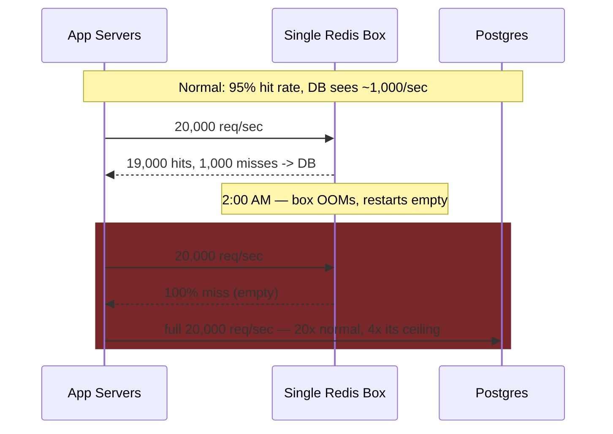

The obvious next question an engineer asks staring at this: *okay, so one box clearly can't hold the data and can't be the only copy — how do we split this across more than one machine without just moving the same problem?* That question is the entire rest of this story.

**How I'd say this in an interview:** "A single cache node has two failure shapes, not one — it runs out of RAM for the working set, and it's a single point of failure that turns a routine restart into a stampede on the DB, because the DB was sized for the *leftover* traffic, not the *whole* traffic. That second one is the sneaky part: the DB looks fine right up until the exact moment the cache that was protecting it disappears." A common junior mistake here is treating "add a cache" as the finished answer — the size ceiling and the SPOF are both inevitable at scale, not edge cases to mention in passing.

---

## Chapter 2 — Sharding the obvious way, and the resize that remaps everything

The fix everyone reaches for first: don't run one Redis box, run several, and split the keyspace across them with `hash(key) % N`. PixelFeed stands up 4 nodes, 8GB RAM each — plenty of headroom under the 40GB working set — and routes `user:42:profile` to node `hash("user:42:profile") % 4`. Each node independently handles its own eviction and its own restart blast radius shrinks to a quarter of the traffic. This is a real, meaningful fix: no single box needs to hold the whole working set anymore, and no single box's failure sends 100% of traffic to the DB.

Ten months later, DAU has grown enough that PixelFeed adds a **5th** node to spread the load further. And this is the moment the whole scheme quietly breaks: `hash(key) % 4` and `hash(key) % 5` send almost every key to a *different* node than before. Only keys where the hash happens to land the same way under both moduli keep their old home — for going from 4 to 5 nodes, that's roughly **1 in 5 keys staying put and 4 in 5 moving** to a node that has never seen them.

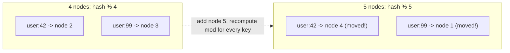

The instant that 5th node goes live, roughly 80% of all keys are misses, everywhere, at once — not because anything is broken, but because the cache is now checking the *wrong* address for most requests. Traffic hasn't grown that much yet, but the effective hit rate craters from 95% to roughly 15% for the minutes it takes the cluster to re-warm, and the database — now provisioned for a comfortable 6,000/sec ceiling — sees something on the order of **30,000/sec, a 5x overshoot, from a deploy that was supposed to be a routine capacity add.**

**New problem, framed as a trade-off:** `hash(key) % N` gained PixelFeed independent, parallel cache nodes — real progress over Chapter 1. What it gave up is the one thing that made Chapter 1's fix durable: *N can never change without a mass-eviction event.* Every future scale-up or scale-down of the cache fleet is now, by construction, a self-inflicted stampede.

**How I'd say this in an interview:** "Modulo sharding fixes the single-node ceiling but ties every key's home address to the total node count — change N by one, and you've changed the destination for almost every key at once. That's specifically why nobody runs plain `hash % N` in production caches at scale; it's the textbook setup for the next fix, consistent hashing." Reaching for `hash % N` as a *final* answer, instead of naming this exact resize problem unprompted, is the tell that someone hasn't actually operated a sharded cache before.

---

## Chapter 3 — The ring: only the neighbors' keys move

The question that has to come next: *can we shard so that adding or removing a node only disturbs the keys near that one node, and leaves everyone else alone?* Yes — this is **consistent hashing**, and it's the actual documented mechanism behind Amazon's Dynamo (2007) and Cassandra's ring, both of which exist specifically to solve this resize problem.

The analogy that carries the whole idea: picture a circular coat-check counter with numbered pegs arranged around a clock face, instead of numbered shelves in a straight line. Each server claims a peg position (by hashing the server's own ID onto the same clock face). Each key also lands on the clock face by hashing, and it's stored at **whichever server's peg comes next, going clockwise.** Removing a peg only sends its coats to the next peg clockwise — nobody else's coats move. Adding a peg only steals the coats that now fall between it and its counter-clockwise neighbor.

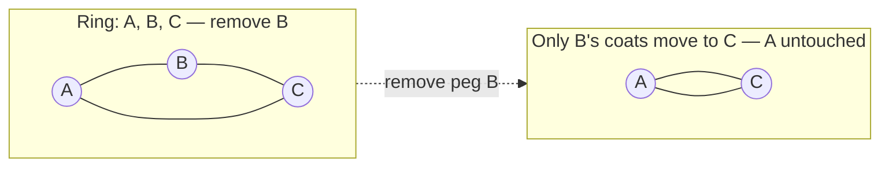

Redo Chapter 2's exact scenario on a ring instead: 4 nodes on the ring holding 400,000 keys total (100K each). Add a 5th peg between two existing ones — only the keys that now fall in that 5th peg's arc move, roughly **400,000 / 5 ≈ 80,000 keys**, and the other **320,000 never move at all.** Same operation, same node count change, and the database sees a bump proportional to 80K keys warming up — not the 5x database overshoot from Chapter 2's version of the same day.

(One real-world wrinkle worth knowing cold, because it's a common mix-up: Redis Cluster, in production, doesn't actually use a hash ring — it partitions the keyspace into a **fixed 16,384 hash slots**, each assigned to a node, and resharding means reassigning whole slots rather than walking a ring. Same *goal* — bounded, not total, remapping on resize — different mechanism. Saying "Redis Cluster uses a hash ring" in an interview is a small, specific inaccuracy worth not making.)

Consistent hashing alone still produces a lumpy ring with only a few nodes — one peg might, by bad luck of the hash, own half the clock face. The documented fix, used by both Dynamo and Cassandra, is **virtual nodes**: each physical server claims dozens or hundreds of positions on the ring instead of one, which averages out the lumps by the law of large numbers.

PixelFeed ships this, growth continues, and eighteen months later a very different alarm goes off: one specific key — `post:88214:likes`, attached to a photo that just went viral — is pulling **60,000 req/sec on a shard whose other few thousand keys combined don't even add up to 12,000 req/sec.** The ring is working exactly as designed — keys are spread evenly — and it's still on fire.

**New problem, framed as a trade-off:** consistent hashing gained PixelFeed a resize that costs roughly `K/N` keys instead of nearly all of them — a durable fix to Chapter 2's actual bug. What it never promised, and structurally cannot fix, is **traffic** distribution: it balances *keyspace*, not *popularity*. One key can dominate a perfectly balanced ring.

**How I'd say this in an interview:** "Consistent hashing turns a resize from 'almost every key moves' into 'only the keys between the changed node and its neighbor move' — that's the entire pitch, and it's the same mechanism Dynamo and Cassandra actually ship. The thing to say next, unprompted, is that it solves *placement*, not *load* — a single viral key can still overwhelm one shard even on a perfectly even ring, and that's a genuinely different problem." The common trap here is treating "we added more shards" as the fix for a hotkey — it isn't, and saying so unprompted is a strong signal.

---

## Chapter 4 — Cloning the one coat everyone wants

The obvious next question: *if one specific key is the problem, why does every request for it have to go all the way to the same one peg on the ring at all?* It doesn't have to. Two fixes, cheapest first:

**Replicate just that one key** across, say, 6 nodes, and have the client pick one at random (or round-robin) per request. Same coat-check analogy, extended: instead of one peg holding the one wildly popular coat, the attendant makes 6 identical copies and hangs one on 6 different pegs — anyone who wants it can grab whichever copy is nearest, instead of all 60,000 people converging on peg #1. `60,000 / 6 = 10,000 req/sec per replica` — back to a normal shard's workload.

**Or, for the truly hottest keys, skip the network hop entirely**: an **L1, in-process cache** living inside each app server, in front of the distributed (L2) cache. Same analogy again — instead of cloning the coat onto more pegs at the coat-check counter, hand every cashier their own personal copy under their own register, so they never have to walk to the counter at all. Facebook's Memcached paper documents exactly this move — replicating heavily-read keys across multiple servers within a pool to spread load — and Netflix's EVCache, documented on their engineering blog, ships a near-cache (in-process) plus a remote-cache tier for precisely this reason.

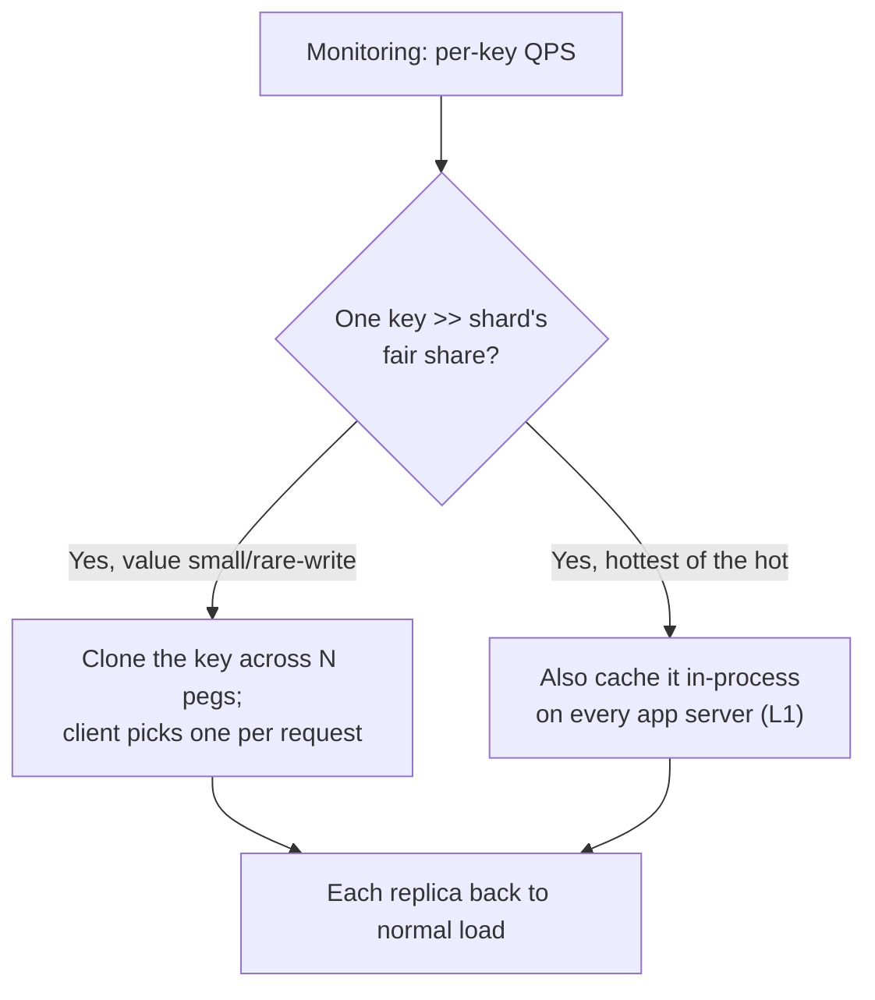

This closes Chapter 3's actual gap — a single popular key no longer has a single point of overload. But look at what just happened to the *shape* of the data: `post:88214:likes` now physically exists in up to 6 places on the ring, plus a copy inside the local memory of every one of PixelFeed's hundreds of app servers. That's no longer one authoritative slot with one clear owner — it's dozens to hundreds of independent copies, all serving reads simultaneously.

**New problem, framed as a trade-off:** replication and L1 caching gained PixelFeed the ability to absorb arbitrary load on one key. What they gave up is a single place to update when the *underlying* value changes — the moment someone likes that photo again, or a moderator takes it down, there are now many copies that all need to somehow find out, and nothing in this chapter's fix says how.

**How I'd say this in an interview:** "For a hot key, I'd replicate it across a handful of nodes if it's cheap and rarely written, or push it into an L1 in-process cache on the app servers if it's the single hottest thing in the system — same idea Netflix's EVCache ships as a near-cache tier. The cost either way is that you've multiplied the number of copies of that value, which is exactly the setup for the invalidation problem, not a coincidence." Jumping to "just add an L1 cache everywhere" for every key, not just the genuinely hot ones, is the over-corrected version of this mistake — it multiplies the invalidation problem for no benefit on keys that were never contended in the first place.

---

## Chapter 5 — The cleaning schedule isn't the same as knowing something changed

With copies of data scattered across shards, replicas, and app-server memory, PixelFeed needs *some* answer to staleness, and the cheapest one is already built into Redis and Memcached: a **TTL**. `SET post:88214:likes 4021 EX 60` — after 60 seconds, gone, next read repopulates it. Think of it as a sticky note with a use-by date on every item in the fridge — nobody has to remember to check; it just gets thrown out on schedule, and Redis actually runs this two ways simultaneously (both documented, standard behavior): **passively**, checking on the next access, and **actively**, via a background sweep that reclaims memory even for keys nobody's touched recently.

This is genuinely enough for a large share of PixelFeed's traffic — a feed that's 30 seconds stale is invisible to a scrolling user. But it silently fails the moment correctness actually matters. A user changes their display name. Their profile is cached with a 300-second TTL. For up to five minutes, **anyone who requests that profile — say 500 requests/sec on a moderately followed account — gets the old name back, with no error, no warning, and no way to tell from the response that it's wrong.** The write to Postgres succeeded. The API returned 200. The bug is invisible until someone screenshots it.

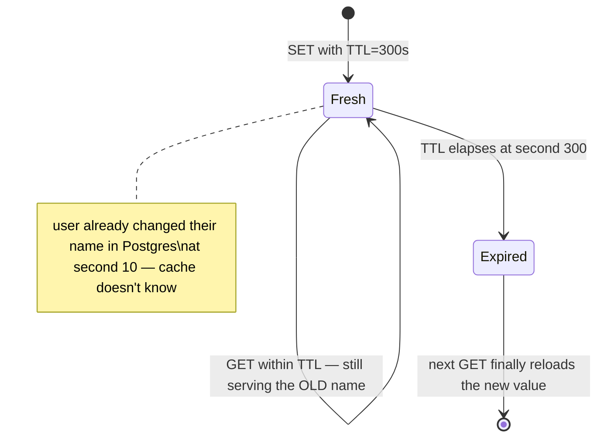

**New problem, framed as a trade-off:** TTL gained PixelFeed automatic, hands-off cleanup — nobody has to write cleanup code, memory reclaims itself. What it gave up is *timeliness*: TTL only knows the *age* of an entry, never whether the underlying truth actually changed. A "hot but wrong" entry looks identical to a "hot and correct" one from the cache's point of view.

**How I'd say this in an interview:** "TTL solves staleness that accrues gradually over time, which covers a lot of traffic, but it has zero awareness of *events* — a write to the database doesn't make the cache's clock run any faster. Anything where a user can immediately re-read their own write needs a second mechanism that fires the instant the source of truth changes, not on a timer." Treating TTL as the *only* invalidation strategy — "it'll expire eventually" as the answer to "the DB just changed, how does the cache find out" — is one of the most common junior tells on this entire topic.

---

## Chapter 6 — Pulling the fire alarm instead of waiting for the cleaning crew

The fix: when a write actually happens, actively delete (or refresh) the cache key on the write path, instead of waiting for the TTL sticker to expire. Same fridge, new rule: the moment the milk actually goes bad, someone throws it out right then — you don't wait for the weekly cleaning schedule if you already know.

At PixelFeed's single-database scale this is one extra line in the write path: `UPDATE profile SET name=... WHERE id=42; DEL user:42:profile`. At Facebook's actual multi-region scale, this needed to become infrastructure, not a line of app code — the "Scaling Memcache at Facebook" paper documents exactly this: a daemon (called **mcsqueal** in that paper) tails the MySQL replication stream itself and fires the corresponding cache deletes, including across regions, so invalidation happens as close to "the write actually landed" as the database's own replication allows, rather than trusting every single app-code path to remember the `DEL`.

This closes Chapter 5's actual gap — the cache now hears about writes, not just clocks. But shipping it across regions surfaces a new, subtler bug, one the same paper names explicitly: a **stale-set race**. A write commits in the primary region. The invalidation delete has to travel across the WAN to a replica region — call it a few hundred milliseconds, ordinary cross-region replication lag. In that window, a **read** in the replica region can miss (because the old cached value just got deleted locally, or was never cached there), go fetch from the *replica* database (which hasn't caught up to the new write yet), and re-populate the cache with the **stale** value — with a brand-new TTL clock, right after the delete that was supposed to fix exactly this.

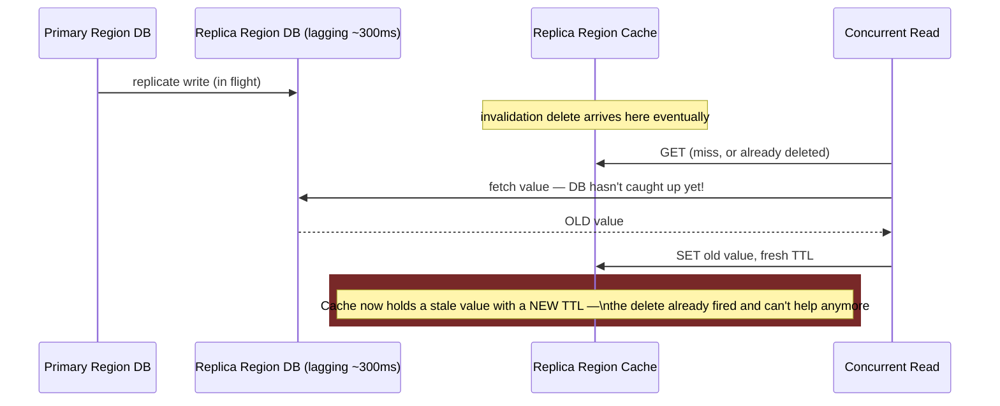

**New problem, framed as a trade-off:** explicit invalidation gained PixelFeed event-driven correctness instead of pure time-based hope. What it gave up is a false sense that "we deleted it, so it's fixed" — a delete and a concurrent read can race, and the read wins often enough at real traffic volumes that this needs its own fix, not a shrug.

**How I'd say this in an interview:** "Explicit invalidation on the write path is the real fix for event-driven staleness, and Facebook's paper documents a whole daemon — mcsqueal — built specifically to fire those deletes reliably by tailing the DB's own replication log. The thing that surprises people is that a delete doesn't fully close the door: a read racing that same write can still repopulate the cache with the stale value milliseconds later, which is a documented, named failure mode, not a hypothetical."

---

## Chapter 7 — One ticket per question, and voiding it the moment the truth changes

The obvious next move: whatever mechanism decides "you're allowed to repopulate this key" needs to also know about deletes in-flight — a plain `DEL` alone can't coordinate with a read that's already mid-fetch. This is also, conveniently, the exact same shape as an unrelated problem PixelFeed's about to hit anyway: a hot key's TTL expires under heavy load, and every one of the concurrent requests that miss in that same instant goes and queries the database **simultaneously** — a **cache stampede** (thundering herd). Worked number: a product/post page cached for 60 seconds getting 2,000 req/sec — the instant the TTL clock hits zero, roughly 2,000 requests miss in that same second and all hit the database at once.

Facebook's Memcached paper solves *both* of Chapter 6's and this chapter's problems with one mechanism: **leases**. On a miss, memcached hands the *first* requester a lease token and tells everyone else who misses in that same window to either wait briefly or accept a slightly stale value instead of going to the database themselves. The analogy: a box office puts up exactly one numbered ticket for the person at the front of the line to go ask the manager a question; everyone else waits on that one answer instead of everyone storming the manager's office. And critically — a lease token is **invalidated the instant a delete fires for that key**, which closes Chapter 6's race directly: a stale write that shows up holding a now-voided lease gets rejected instead of silently accepted.

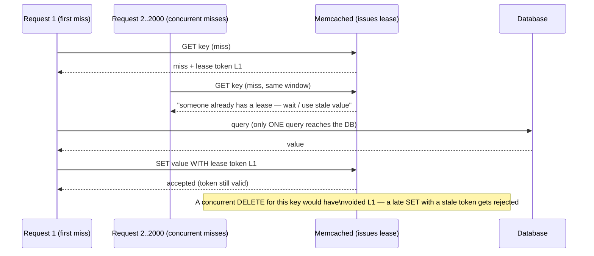

This is a genuinely elegant two-for-one: one mechanism fixes the herd (only the lease-holder queries the DB) and the race (a voided lease rejects a stale write). But it introduces its own sharp edge: **what if the lease-holder crashes mid-fetch?** Every other request that was told "wait, someone already has this" is now waiting on a lease that will never be fulfilled. The fix has to be a **lease timeout** — after some bounded window, the lease expires and the *next* miss gets to try, rather than the whole herd waiting forever on one now-dead request.

**New problem, framed as a trade-off:** leases gained PixelFeed a single mechanism that closes both the herd and the stale-write race — genuinely better than solving them separately. The cost is a new failure mode of its own (a dead lease-holder stalls everyone else) that needs an explicit timeout, and the lease state itself has to live somewhere globally visible — inside the cache tier, not inside any one app server's memory — or two different app servers can each think *they're* the lease-holder.

**How I'd say this in an interview:** "Leases solve the stampede and the stale-set race with one mechanism — the first miss gets a token, everyone else waits or gets a stale value instead of hammering the DB, and a concurrent delete voids the token so a late write can't overwrite a fresher delete. I'd flag the lease-holder-crashes case unprompted: it needs a timeout, or every waiting request just hangs forever on a request that's never coming back." A common miss here is proposing "just use a mutex/lock" without saying what happens when the lock-holder dies mid-critical-section — that's the difference between a toy answer and a production one.

---

## Chapter 8 — Handing out yesterday's map on purpose

Leases still make some requests *wait*, even if only briefly. For traffic where a slightly-stale answer right now beats a fresh one a few milliseconds later, PixelFeed reaches for a different family of fixes that never make anyone wait at all:

- **Jittered TTL** — instead of every replica of a popular object expiring at exactly `T+60s`, add a random ±10-20% so expirations spread out instead of landing in the same instant. Doesn't help one already-viral key with one true expiry moment, but it stops thousands of *unrelated* keys from all expiring in the same synchronized wave (a real risk if they were all `SET` in the same bulk-warming pass).
- **Probabilistic early refresh** — recompute the value slightly *before* it actually expires, with a probability that rises the closer the clock gets to zero. Nobody ever sees a true miss; the refresh happens quietly in the background ahead of the deadline.
- **Stale-while-revalidate** — serve the expired value immediately, kick off a background refresh, and let the *next* request get the fresh one. The analogy: the tourist-info desk hands over yesterday's printed map right now, while today's is reprinting in the back — nobody stands at the counter waiting.

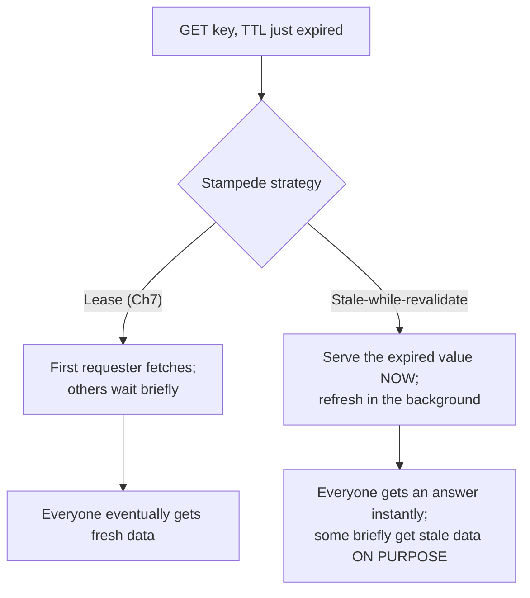

**New problem, framed as a trade-off:** these techniques gained PixelFeed zero added latency for anyone, ever — a real win leases can't fully claim, since a lease still makes some requester wait. What they gave up, deliberately and by design, is a guarantee of freshness: stale-while-revalidate means some fraction of reads are *knowingly* wrong for a bounded window, which is a fine trade for a public feed and a bad one for, say, an account balance.

**How I'd say this in an interview:** "Leases and coalescing stop the herd but still make someone wait. Stale-while-revalidate and probabilistic early refresh avoid waiting entirely by accepting bounded, deliberate staleness — which is the right trade for a feed or a product page, and the wrong one for anything where 'briefly wrong' is a correctness bug, not a UX nit." The failure mode to avoid here is picking stale-while-revalidate for something like a payment balance just because it's the "no-latency" option — the requirement (§ correctness vs. UX tolerance) has to drive the choice, not the other way around.

---

## Chapter 9 — The traffic that was never real to begin with

A completely different alarm fires: someone's scraping PixelFeed, hitting `GET user:99999999:profile` and thousands of IDs like it — **8,000 req/sec for user IDs that don't exist in the cache *or* the database.** Every one of Chapters 4 through 8's fixes is useless here, because there's no key to replicate, no value to keep fresh, no write to invalidate on — this traffic guarantees a cache miss and a database miss, every single time, forever, by construction. This is **cache penetration**, and it's a different failure mode from a stampede: a stampede is too many requests for a key that *does* exist; penetration is requests for keys that never will.

The fix, cheapest case first: **negative caching** — when the DB confirms "not found," cache *that* result too, briefly, so the next request for the same nonexistent ID doesn't round-trip to the DB again. This works well when the space of bogus IDs is small and repeats. It falls over against a scraper generating a *new* nonexistent ID on every request — negative-caching each one individually still means storing (and eventually evicting) millions of garbage entries, one per attempt.

For that unbounded case, the real fix is a **Bloom filter** — a probabilistic structure that can say "definitely not in the dataset" with zero false negatives, at the cost of occasional false positives. The analogy: a bouncer holding a compressed, lossy photocopy of the guest list instead of walking backstage to check with the manager every time — it can occasionally, rarely, mistakenly wave through someone who isn't actually on the list (false positive — a wasted DB lookup, but never a wrong *answer*), but it will **never** turn away someone who genuinely is on the list (no false negatives, by construction). This is exactly how Cassandra avoids unnecessary SSTable reads, documented in its own architecture material — same structure, different backstage.

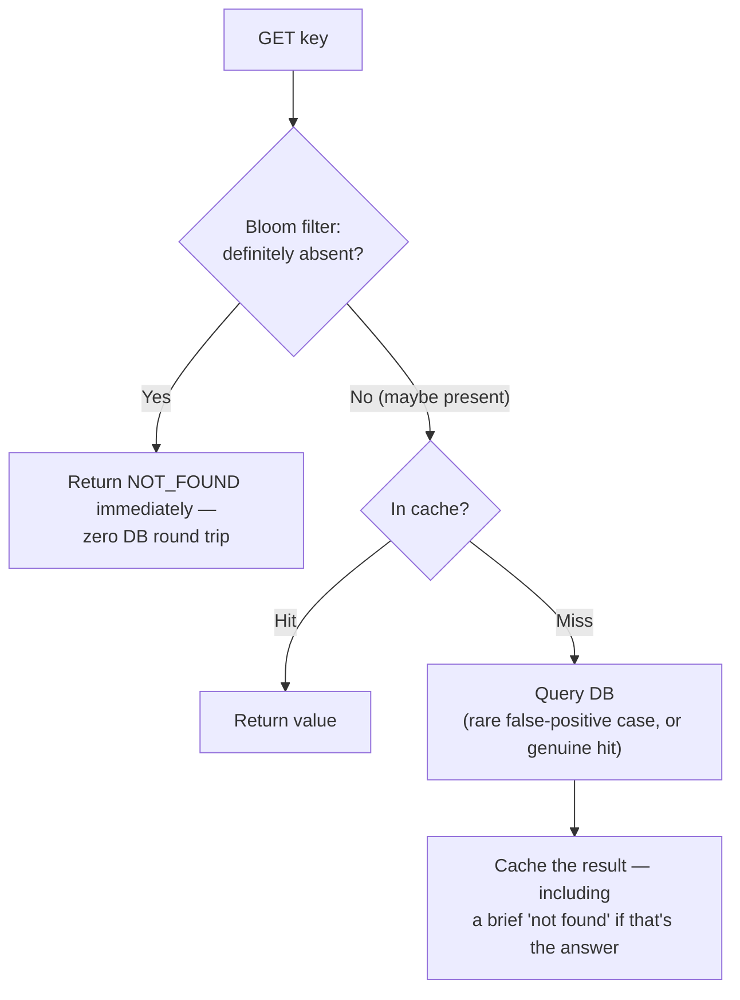

**New problem, framed as a trade-off:** a Bloom filter gained PixelFeed a cheap, constant-time "definitely not here" answer that stops an unbounded attack from ever reaching the database. What it costs: it's an *extra* structure that has to be told about every real key up front, kept roughly in sync as the dataset grows, and periodically resized — one more moving part that isn't the cache and isn't the DB, and it can get subtly wrong (in the "occasionally wastes a lookup" direction, never the "silently loses data" direction) if it's stale relative to what's actually in the DB.

**How I'd say this in an interview:** "Negative caching handles a small, bounded set of known-missing keys cheaply. When the missing-key space is effectively unbounded or adversarial — a scraper generating new bogus IDs — I'd reach for a Bloom filter in front of the cache, which can say 'definitely not here' without ever touching the DB, at the cost of a rare, harmless false positive. It's the same structure Cassandra uses to skip SSTable reads, not a novel idea specific to caching."

---

## Chapter 10 — Making the cluster survive itself

Zooming out: every fix so far assumes each shard's peg on the ring is reliably *up*. It isn't. A shard's only copy of the data can die exactly like Chapter 1's single box did — same failure, now scoped to one slice of the ring instead of the whole cache. The fix looks like Chapter 1's inverse: give every shard a **primary and at least one replica**, and put a **configuration service** in charge of health-checking and telling every client the current, agreed-upon topology — structurally identical to service discovery (ZooKeeper, etcd), and the real, documented role Redis's **Sentinel** plays for exactly this in a Redis deployment.

This closes the SPOF, but reopens a version of Chapter 2's exact bug in disguise: what if two different app servers *disagree* about which node is currently the primary for a shard — one still thinks it's node A, the other has already heard it's now node B? They'll route the same logical key to two different physical machines, silently, with no error — a **split-brain**, the cache-topology cousin of the residue-class collision that broke a naively-rebalanced counter cluster in an entirely different topic. The fix is the same shape too: a **single source of truth** every client pulls from, never two independently-updated views of the world.

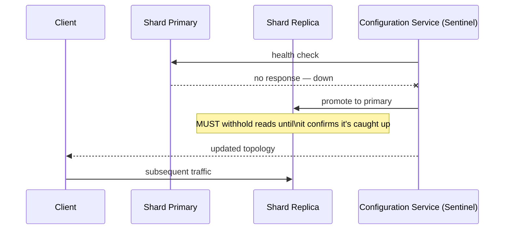

One more sharp edge, worth saying unprompted: the newly-promoted replica has to **withhold reads** until it's certain it's caught up with the dead primary's last writes — promoting it a beat too early serves confidently-wrong data right in the middle of the outage it was supposed to fix.

**New problem, framed as a trade-off:** replication plus a configuration service gained PixelFeed a cache tier that survives a single machine dying — genuinely closing Chapter 1's SPOF for good. The cost is real complexity: a whole extra system (Sentinel, ZooKeeper, etcd — something) whose entire job is making sure every client agrees on the truth, and a promoted replica that has to actively refuse traffic for a short window rather than serve it immediately.

**How I'd say this in an interview:** "Primary-plus-replica-per-shard, with a configuration service like Redis Sentinel deciding who's currently the primary, is the standard fix for the single-copy-per-shard SPOF. The subtlety I'd volunteer unprompted: a newly-promoted replica has to hold off serving reads until it's confirmed caught up, and every client has to be pulling topology from the *same* source, or you get a silent split-brain instead of a loud failover."

---

## Chapter 11 — The new node that DDoSes its own database

Last wall, and it's a direct callback to where this whole story started: a shard restarts (crash, deploy, autoscale-up) and rejoins the ring with an **empty cache — 0% hit rate.** If the configuration service routes it full production traffic immediately, this is Chapter 1's exact disaster, self-inflicted this time by routine maintenance instead of an OOM. Worked number, same shape as Chapter 1: a shard normally serving 50,000 req/sec at a 95% hit rate only sends 2,500/sec to the database; cold-started, that same shard's hit rate is briefly ~0%, and the database sees the **full 50,000/sec — a 20x spike, on a shard that was never provisioned for it.**

Facebook's paper documents a specific, named safety net for a close cousin of this problem: the **Gutter pool** — a small standby pool of spare memcached servers that step in when a *regular* server becomes unreachable, serving slightly-stale cached values instead of routing that traffic straight through to the database. It's the same instinct as a cold start — don't let a temporarily-unavailable cache mean a full-strength hit to the DB — applied to "server unreachable" rather than "server just joined empty," but the two problems and the two fixes are close enough to be worth citing together.

For the cold-join case specifically, the standard playbook is a **gradual ramp**, not a flip:

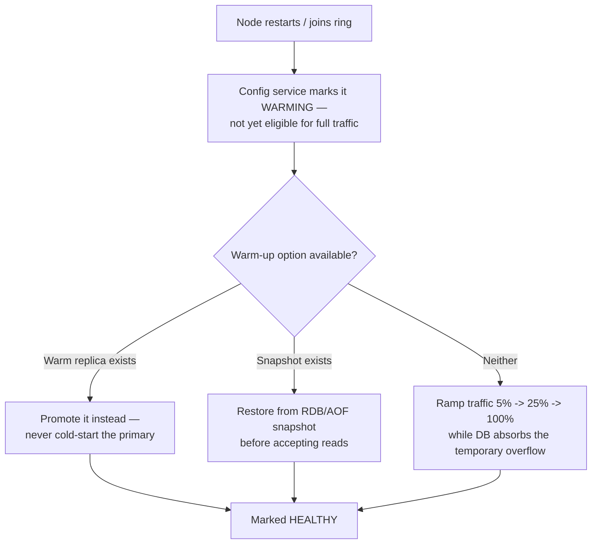

**New problem, framed as a trade-off:** a gradual ramp (or a Gutter-style standby pool) gained PixelFeed protection against the exact spike this chapter opened with. What it costs is time and complexity: a node isn't "done" the instant it's technically reachable — it has to earn full traffic over minutes, which means slower recovery from a routine restart than the naive "just turn it on" approach, on purpose.

**How I'd say this in an interview:** "A freshly restarted or newly joined node is a self-inflicted stampede — same shape as a cache outage, just triggered by a lifecycle event instead of a crash. I'd ramp its traffic share gradually rather than flip it to 100%, and if a warm replica or a recent snapshot exists, promote or restore from that instead of cold-starting at all — which is close in spirit to Facebook's documented Gutter pool, a standby tier built to absorb exactly this kind of gap without hitting the DB at full force."

---

## Where the story actually lands

```mermaid
flowchart LR
    A["Ch1: single box\n(RAM ceiling + SPOF)"] -->|"fixes: parallel nodes\nbreaks: resize remaps ~all keys"| B["Ch2: hash % N sharding"]
    B -->|"fixes: bounded resize\nbreaks: hotkey overload"| C["Ch3: consistent hashing ring"]
    C -->|"fixes: spreads the one hot key\nbreaks: many copies, who invalidates?"| D["Ch4: key replicas + L1"]
    D -->|"fixes: automatic cleanup\nbreaks: no event-awareness"| E["Ch5: TTL"]
    E -->|"fixes: event-driven correctness\nbreaks: delete-vs-read race"| F["Ch6: explicit invalidation"]
    F -->|"fixes: herd AND race, one mechanism\nbreaks: dead lease-holder stalls waiters"| G["Ch7: leases"]
    G -->|"fixes: zero added latency\nbreaks: deliberate staleness"| H["Ch8: stale-while-revalidate"]
    H -->|"(separately) fixes: penetration\nbreaks: extra structure to maintain"| I["Ch9: negative cache + Bloom filter"]
    I -->|"fixes: shard SPOF\nbreaks: split-brain risk"| J["Ch10: replicas + config service"]
    J -->|"fixes: node-death stampede\nbreaks: cold-join stampede"| K["Ch11: gradual warm-up / Gutter pool"]
```

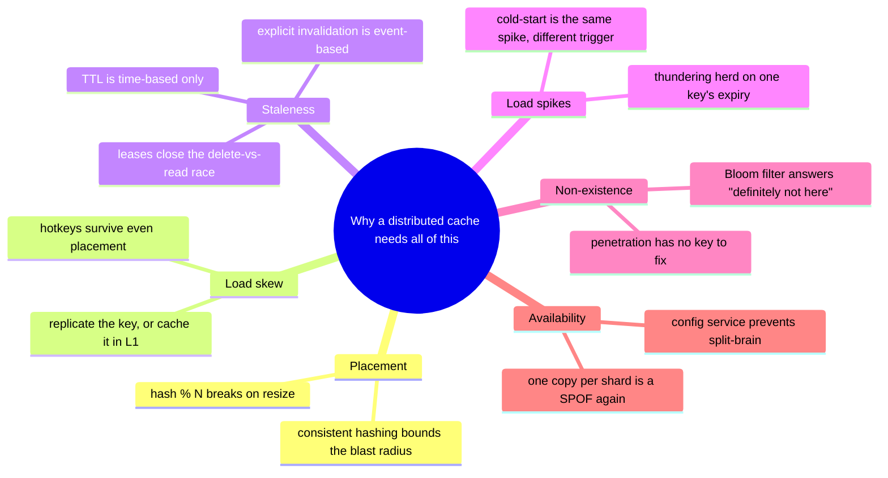

Every real production cache system you'll be asked to design sits *somewhere* on this chain, and the actual skill being tested isn't reciting all eleven chapters — it's stopping where the stated requirements say to stop. A read-heavy feed with tolerable staleness might reasonably stop at Chapter 4 or 5. A payments-adjacent cache that can never serve a stale balance has to reach Chapter 6 and 7 and probably skip Chapter 8 entirely. If nobody's mentioned scraping or bot traffic, walking all the way to Chapter 9 unprompted reads as padding, not depth.

---

## Grill me — adversarial follow-ups

**Q1: "Why not just make the cache bigger instead of dealing with all this sharding complexity?"**
Because "bigger" has a ceiling — a single machine's RAM is finite and a lot more expensive per GB past a point than adding commodity boxes — and it doesn't touch the other half of Chapter 1's problem, which is that one box is a single point of failure no matter how much RAM it has. Sharding solves size *and* blast radius; a bigger box only ever solves size.

**Q2: "Walk me through exactly what happens the instant you add a node to a consistent-hashing ring."**
The new node claims a position (or, with virtual nodes, many positions) on the ring; only the keys that fall between the new node and its counter-clockwise neighbor get remapped to it — roughly `total_keys / N` of them. Every other key on the ring keeps pointing at the same node it always did, which is the entire reason this doesn't reproduce Chapter 2's mass-remap problem.

**Q3: "Doesn't replicating a hot key just move the problem — now you've got 6 copies to keep in sync?"**
Yes, and that's exactly the trade-off I'd name when proposing it — replication buys load relief at the cost of turning one authoritative copy into several that all need the same invalidation signal. It's the right trade for a value that's read constantly but written rarely (a like count, a viral post); it's a bad trade for something that changes every few seconds, where the sync cost would dominate.

**Q4: "Why do leases need a timeout — what actually breaks without one?"**
If the single requester holding the lease crashes or hangs mid-fetch, every other request that was told "wait, someone else already has this" is waiting on an answer that will never arrive — without a timeout, that's an unbounded stall for every one of them. A timeout lets the *next* miss take over the lease after a bounded wait, converting an indefinite hang into a small, predictable delay.

**Q5: "You said explicit invalidation fixes staleness — doesn't the stale-set race in Chapter 6 mean it actually doesn't?"**
Explicit invalidation fixes the common case — a write now actively evicts the cache instead of waiting on a timer. The stale-set race is a narrower, real edge case where a concurrent read wins a timing race against the delete, and that's specifically what leases close by voiding the read's ability to overwrite with a token that's already been invalidated. So the honest answer is: invalidation alone narrows the staleness window enormously but doesn't fully close it; leases are the piece that closes the remaining gap.

**Q6: "Bloom filters have false positives — isn't that a correctness bug?"**
No, and this is worth being precise about: a false positive just means the filter said "maybe present" for something that's actually absent, which costs one wasted DB lookup that correctly returns "not found." A false negative would be a correctness bug — claiming something's definitely absent when it's actually there — and Bloom filters are constructed so that never happens. The cost of a false positive is latency, never a wrong answer.

**Q7: "If TTL and explicit invalidation both exist, why not just skip TTL entirely and rely only on explicit deletes?"**
Because explicit invalidation only covers writes you know about and successfully hook — any write path you forgot to instrument, or a value that goes stale for a reason that isn't a database write at all (an external API's data changing, a computed aggregate drifting), has no delete to trigger. TTL is the safety net under explicit invalidation, not a competing strategy — you want both, not either.

**Q8: "What's actually different between a cache stampede and cache penetration — don't they both flood the database?"**
Both flood the DB, but the shape of the traffic and the fix are opposite. Stampede is many requests for a key that *does* exist, all missing at the same instant — fixed by coordinating who's allowed to refetch (leases, coalescing). Penetration is requests for keys that will *never* exist, so there's nothing to coordinate refetching of — fixed by answering "definitely not here" before a DB call happens at all, via negative caching or a Bloom filter.

**Q9: "Your split-brain fix is 'a single configuration service' — isn't that just a new single point of failure?"**
Fair pushback, and the real answer is that the configuration service itself needs to be a small, highly-available cluster with its own consensus (that's literally what ZooKeeper, etcd, and Redis Sentinel's own quorum are for) — it's not one box, it's a system specifically designed so that losing one node of *it* doesn't cause a second split-brain one layer up. The point isn't "zero SPOFs anywhere," it's "push the hardest consistency problem into one purpose-built, well-tested system instead of solving it ad hoc in every client."

**Q10: "Given this whole story, what would you actually propose if someone just says 'design a caching layer' cold, with no other detail?"**
State the two driving requirements out loud first — is this read-heavy with real locality of reference, and can it tolerate losing data and rebuilding from the DB — because everything downstream depends on the answer. Then walk forward only as far as the stated requirements demand: cache-aside plus consistent hashing plus basic TTL is a complete, senior-level answer if nobody's mentioned hotkeys, multi-region, or zero-tolerance staleness; reaching for leases and Bloom filters unprompted, with no signal they're needed, reads as reciting a checklist, not solving the problem in front of you.

---

## Pacing note

**If this is 60 seconds inside a bigger question:** state the two driving requirements (read-heavy + locality of reference, disposable-not-durable), name cache-aside as the default read pattern, and name consistent hashing as the placement mechanism — then say "and I'd handle hotkeys, invalidation, and stampedes as deep-dives if you want to go there," which signals you have the depth without spending the time on it uninvited.

**If this is the whole 15-20 minute focus:** walk the actual chapter order — single node's two failure modes, naive sharding's resize bug, consistent hashing as the fix, hotkeys as the thing consistent hashing *can't* fix, invalidation (TTL then explicit), stampedes (leases or coalescing), then whichever of penetration/availability/cold-start the interviewer's follow-ups point toward. Don't walk all eleven chapters unprompted — pick the 3-4 the conversation is actually asking for and go deep on those, closing with the ones you skipped as your "if I had more time" line.

---

## Active recall — no answers, test yourself cold

1. What are the two requirements stated at the very top that every fix in this story serves?
2. Why does adding a 5th node to a `hash(key) % 4` cluster remap almost every key, and what's the fix?
3. What's the difference between what consistent hashing solves and what a hotkey problem needs — and why can't more shards fix a hotkey?
4. Name the two hotkey mitigations from Chapter 4, and when you'd reach for each.
5. Why isn't TTL alone enough to keep a cache correct after a write?
6. What specific race condition does explicit invalidation alone fail to close, and what mechanism closes it?
7. What two problems does Facebook's lease mechanism solve with one design, and what new failure mode does it introduce?
8. What's the actual difference between cache stampede and cache penetration?
9. Why does a promoted replica need to withhold reads immediately after a failover?
10. Why is a freshly restarted cache node described as a "self-inflicted stampede," and what's the standard mitigation?

*Spaced repetition: test this list today, again in 2-3 days, again in a week.*

---

## Cheat sheet — one line per stop on the story

- **Single cache node**: two separate failure modes — RAM ceiling on the working set, and SPOF that turns a restart into a full-traffic hit on the DB it was shielding.
- **`hash(key) % N` sharding**: fixes size and blast radius, but any change to N remaps almost every key at once — a self-inflicted stampede baked into every future resize.
- **Consistent hashing (ring)**: resize cost drops to `~K/N` keys, not nearly all of them — the real Dynamo/Cassandra mechanism; virtual nodes fix ring lumpiness. (Redis Cluster uses fixed hash slots, not a literal ring — same goal, different mechanism.)
- **Hotkey mitigation**: replicate the single key across N nodes, or push it into an L1 in-process cache — a load problem consistent hashing structurally cannot fix.
- **TTL**: automatic, hands-off, but purely time-based — no awareness that a write just happened.
- **Explicit invalidation**: event-driven correctness on the write path (Facebook's mcsqueal tails the DB replication stream to do this across regions) — but a concurrent read can still race a delete and repopulate a stale value.
- **Leases (Facebook)**: one mechanism that fixes both the stampede and the stale-set race — first miss gets a token, a concurrent delete voids it; needs a timeout or a dead lease-holder stalls everyone.
- **Stale-while-revalidate / jittered TTL / probabilistic early refresh**: zero added latency for anyone, at the cost of deliberate, bounded staleness — right for a feed, wrong for a balance.
- **Cache penetration**: requests for keys that exist nowhere — negative caching for a bounded miss-space, a Bloom filter for an unbounded/adversarial one (no false negatives, ever; rare, harmless false positives).
- **Replication + configuration service**: closes the per-shard SPOF; needs a single source of truth for topology or you get silent split-brain, and a promoted replica must withhold reads until caught up.
- **Cold start / warm-up**: a freshly joined or restarted node is Chapter 1's exact spike, self-inflicted — ramp traffic gradually or promote/restore instead of flipping to 100% (Facebook's Gutter pool is the documented safety-net cousin of this fix).
- **The meta-lesson**: every fix in this story buys one property (durability of resize, load spread, freshness, no-wait, availability) by spending a different one — the interview skill is naming the exact trade in the same sentence you propose the fix.
