# Distributed Cache — FAANG Interview Guide

> **Enhancement notes (this pass)**: this pass focused on live-delivery skills the previous version didn't cover — recognizing the topic, pacing a real 45-minute loop, surviving pushback, and drilling recall — plus a full numeric/citation confidence audit.
> - Added **§2 "How to identify this topic in an interview"** — trigger phrases plus a disambiguation table against the topics distributed caching gets confused with (CDN, distributed KV store/database, rate limiter, message queue, session store). The guide previously jumped straight from the mental model into the playbook with no framing step.
> - Added **§4 "Full-interview pacing script"** — what to say in the first 60 seconds, a minute-by-minute plan for a 45-minute loop, and an explicit contingency for "interviewer redirects you away from your planned deep-dive at minute 15" (the realistic failure mode — not running out of material).
> - Added a **"redo the math with different inputs" pass** inside §15 (capacity estimation) — the original had one worked example and no live parameter swap, which the requirements for this kind of guide call out as the more instructive half of the exercise.
> - Added **§23 Anti-patterns / red flags**, **§24 Adversarial Q&A** (15 interviewer-pushback questions, including challenges to this guide's own trade-offs and a wrong-premise question), and **§25 Active recall drill** (15 cover-the-answer prompts + a spaced-repetition note).
> - Added a **"Two-sentence version"** callout to every major section — a shorter, more compressed answer than the 60-second pacing script, for when the interviewer moves on fast.
> - Ran a **number-confidence labeling pass** over the entire document: `[say cold]` marks a figure that follows deterministically from a stated spec or formula (safe to state as fact); `[illustrative/approx]` marks a reported, measured, or estimated figure (state with a hedge). Also flagged confidence on named-system claims (Facebook's Memcached paper, Redis internals, Cassandra bloom filters) as well-documented public information vs. plausible inference.
> - Renumbered every section to make room for the above (old §3–§20 shifted down); every internal `§N` cross-reference in the document was updated to match.
> - Everything else — content, structure, diagrams, worked numbers from the prior pass — is preserved as-is.

## 1. Mental model (read this once, never forget it)

A cache is a bet: most requests ask for a small, hot subset of your data, so keep that subset in RAM, in front of the database, and most requests never touch disk. **Locality of reference** (temporal — recently accessed data gets accessed again soon; spatial — nearby data gets accessed together) is the entire justification for caching. If access is uniformly random, caching buys you nothing — say this out loud if an interviewer asks "would you cache this?"

Think of a distributed cache as **a hash table that outgrew one machine**. Everything hard about it — consistent hashing, replication, hot keys, invalidation — is what you get when you're forced to shard `HashMap<K,V>` across a fleet and keep it correct under failure.

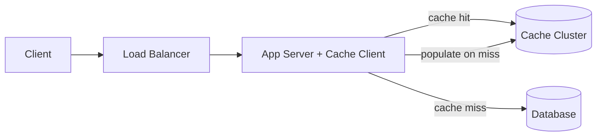
```mermaid
graph LR
    C[Client] --> LB[Load Balancer]
    LB --> App[App Server + Cache Client]
    App -->|cache hit| Cache[(Cache Cluster)]
    App -->|cache miss| DB[(Database)]
    App -->|populate on miss| Cache
```

> **Memory hook**: "Cache = commodity RAM standing between you and a slow, expensive disk." Facebook's Memcached tier turned 50M web-layer requests/day into 2.5M DB requests — a **95% hit rate** `[illustrative/approx — well-documented: figures from Facebook's published "Scaling Memcache at Facebook" paper, NSDI 2013, not a live measurement]`. That single number is why caches exist.

**Two-sentence version** (for when the interviewer only gives you a breath before moving on): "A distributed cache is a sharded, replicated in-memory hash table sitting between the app and the DB that exploits locality of reference to absorb most reads. The hard parts are placement (consistent hashing), staleness (invalidation), and load skew (hotkeys) — everything else is engineering around those three."

---

## 🆕 2. How to identify this topic in an interview

Interviewers rarely say "design a distributed cache" outright — recognizing that this is the question being asked (or that caching is the right *addition* to another question) is itself a scored skill.

**Trigger phrases** — any of these should make you say "this smells like a caching problem" out loud:
- "Design a system that needs sub-millisecond reads at scale."
- "How would you reduce load on the database?"
- "Design Memcached / Redis / a key-value cache."
- "This feature is read-heavy — 100:1 reads to writes."
- "Handle a celebrity/viral-post/hotkey problem."
- A follow-up bolted onto another design question: "...now the DB is falling over, what do you do?"

**Disambiguation — the topics this gets confused with, and the tell that separates them:**

| Confused with | The actual difference | The tell in the prompt |
|---|---|---|
| **Distributed KV store / database** (Dynamo-style) | A cache is *disposable* — it can lose data and rebuild from a source of truth. A KV store **is** the source of truth and needs durability guarantees, quorum writes, and a consistency model that survives forever, not just until the next eviction. | "No data loss, ever" / "this is the primary store" → it's a database question, not a cache question. Say so and redirect. |
| **CDN / edge cache** | A CDN caches static assets or full responses geographically close to *users*, optimizing last-mile network latency. A distributed cache sits inside your data center between app and DB, optimizing internal read latency and DB load. | "Users all over the world downloading video/images" → CDN. "App servers hammering the DB" → distributed cache. |
| **Rate limiter** | Both are often built on Redis with TTLs and counters, but a rate limiter's job is enforcing a request quota, not serving data faster. | "Prevent abuse / cap requests per user" → rate limiting, even if the implementation reuses your Redis cluster. |
| **Message queue / pub-sub** | Redis can do both, but a queue's job is ordered, at-least-once delivery between producers and consumers — durability of *message order* matters, which a cache never promises. | "Guarantee delivery" / "process exactly once" → queueing, not caching. |
| **Session store** | Structurally *is* a distributed cache — same mechanics, just a narrower NFR (losing sessions logs everyone out, so durability tolerance is stricter). Treat it as a caching problem with a tighter NFR, not a different topic. | "Store logged-in session state" → still §1's mental model, just tune the durability answer. |

> **Say this explicitly** if the interviewer's prompt is ambiguous between cache and database: "Before I design this — do we need this store to be a durable source of truth, or is it accelerating reads in front of one? That changes almost everything downstream."

**Two-sentence version**: "If the prompt says 'reduce DB load' or 'sub-millisecond reads' with an existing source of truth behind it, it's a caching problem. If it says 'never lose data' or doesn't mention a backing store at all, it's actually a database question wearing a cache costume."

---

## 3. The interview playbook — say things in this order

Interviewers score structure as much as content. Walk through these seven steps out loud, in this order, whether the question is "design a distributed cache" or "how would you add caching to X." Time budgets below assume a **45-minute loop** `[illustrative/approx — a common FAANG default, but confirm the actual slot length up front]`; see §4 for the minute-by-minute version.

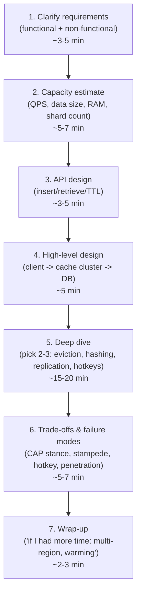
```mermaid
flowchart TD
    A["1. Clarify requirements\n(functional + non-functional)\n~3-5 min"] --> B["2. Capacity estimate\n(QPS, data size, RAM, shard count)\n~5-7 min"]
    B --> C["3. API design\n(insert/retrieve/TTL)\n~3-5 min"]
    C --> D["4. High-level design\n(client -> cache cluster -> DB)\n~5 min"]
    D --> E["5. Deep dive\n(pick 2-3: eviction, hashing, replication, hotkeys)\n~15-20 min"]
    E --> F["6. Trade-offs & failure modes\n(CAP stance, stampede, hotkey, penetration)\n~5-7 min"]
    F --> G["7. Wrap-up\n('if I had more time: multi-region, warming')\n~2-3 min"]
```

**Cheat-sheet**
- Never jump straight to "I'll use Redis." Earn it — requirements first, then capacity math, then the design.
- When the interviewer interrupts to go deep on one box, that's a signal, not a derail — follow it, then return to the checklist. (Full contingency script in §4.)
- Always close with the "if I had more time" line — it shows you know the edges of your own design.

---

## 🆕 4. Full-interview pacing script

A time-budget table tells you *how much* time per phase; this section tells you *what to actually say*, minute by minute, and what to do when the plan breaks — because the realistic failure mode in these interviews is not running out of material, it's losing the thread when the interviewer steers you somewhere you didn't plan for.

### The first 60 seconds

Say, roughly, in this order:
1. Restate the problem in one sentence to confirm scope: *"So we're designing a caching layer that sits in front of \[the DB/service they named\] to cut read latency and DB load — is that the right framing?"*
2. Ask 2-3 clarifying questions before saying anything about design — generic cache or one specific access pattern? Read:write ratio? Any durability requirement? (Full list in §5.)
3. State the one-sentence mental model out loud: *"At its core this is a sharded, replicated in-memory hash table — the hard parts are placement, staleness, and load skew."* This tells the interviewer you already have the shape of the answer before you've drawn a single box, which is itself a strong opening signal.

### Minute-by-minute plan (45-minute loop) `[illustrative/approx — adjust proportionally for a 30- or 60-minute slot]`

| Minutes | What's happening |
|---|---|
| 0–5 | Requirements (§5) — functional surface, read:write ratio, staleness tolerance, durability, availability target |
| 5–12 | Capacity estimate (§15) — full formula chain out loud, plug in numbers |
| 12–17 | API design (§6) — GET/SET/DELETE/TTL surface, key namespacing, value serialization |
| 17–24 | High-level design (§17) — narrate v1 → v2 → v3, naming what breaks at each step |
| 24–38 | Deep dive — pick 2-3 from eviction (§10), consistent hashing (§13), replication (§14), hotkeys (§13), stampede (§22) |
| 38–43 | Trade-offs & failure modes (§20, §22) — CAP stance, what you'd volunteer unprompted |
| 43–45 | Wrap-up — "if I had more time" line naming multi-region and warm-up (§19) |

### Contingency: interviewer redirects you at minute 15

This is the realistic failure mode, so have a script for it, not just an intention. When it happens:
1. **Drop your plan immediately and follow the redirect fully.** It's the interviewer telling you exactly what they're scoring right now — treating it as an interruption to get back from is the mistake, not the redirect itself.
2. **Bank a one-line mental note of what you skipped** so you can surface it later: *"let me hold the capacity math for a moment and come back to it"* — say this out loud once, don't silently drop a whole playbook step without acknowledging it.
3. **Never say "I was going to talk about X"** as a complaint or a way to steer back. If there's time at the end, offer it as part of the wrap-up instead: *"if I had more time, I also wanted to cover \[X\]."*
4. If the redirect eats the rest of the clock, that's fine — a strong deep-dive on the interviewer's chosen topic outscores a shallow tour through all seven playbook steps. Depth on their question beats breadth on your plan.

**Two-sentence version**: "Open by restating the problem and your one-sentence mental model before touching a diagram. If the interviewer redirects you off-plan, follow it completely and bank what you skipped for the wrap-up — don't fight to get back to your outline."

---

## 🆕 5. Clarify requirements first (step 1 of the playbook, spelled out)

Don't design anything until you've said these out loud and gotten a nod. Interviewers deliberately leave this vague — asking the right questions here is itself a scored signal.

**Functional requirements** — pin these down:
- `get`/`set`/`delete` on a key — is that the whole surface, or do we also need `exists`, batch `mget`/`mset`, atomic `incr`/`decr`?
- Does every key need a **TTL**, or is expiry opt-in per key?
- Is this a **generic cache** (any service, any shape of data) or built for one specific access pattern (e.g., a session store, a leaderboard)? This changes whether Redis's richer data structures earn their keep (§21) or a plain Memcached-style KV store is enough.
- Do we need an explicit invalidation/delete API, or is TTL-based staleness acceptable? (Directly sets up §11.)

**Non-functional requirements** — the ones that actually drive the design:

| Question | Why it matters | Typical FAANG-interview default if unstated |
|---|---|---|
| What's the read:write ratio? | Read-heavy → optimize hit rate and read replicas; write-heavy → worry about write-back durability | Read-heavy, often 80:20 to 99:1 `[illustrative/approx — a common assumption to state, not a derived fact]` |
| What latency is acceptable on a hit? | Sets the RAM-only vs. RAM+disk decision | Sub-millisecond to low single-digit ms `[illustrative/approx]` |
| Can the system tolerate stale data, and for how long? | Determines TTL length and whether write-through is required | A few seconds to a few minutes is usually fine `[illustrative/approx]` |
| Does the cache need to survive a restart (durability)? | A cache is normally a *disposable* accelerator, not a source of truth | No — DB is source of truth; cache rebuilds itself (§19) |
| What's the working-set size and growth rate? | Feeds directly into capacity estimation (§15) | Ask for DAU/QPS and item size, then compute it live |
| What availability target? | Drives replica count and failover design (§14) | 99.9%+, no single point of failure `[illustrative/approx]` |

> **Say this explicitly**: "A cache is allowed to lose data and rebuild itself from the database — that's what makes it a cache and not a database. If we need durability guarantees, we're really asking for a data store, not a cache." Interviewers listen for this line because it's the thing junior candidates miss.

**Two-sentence version**: "I'd nail down the get/set/delete/TTL surface, the read:write ratio, and staleness tolerance before drawing anything. The one non-negotiable line to say out loud: a cache is allowed to lose data and rebuild from the DB — if that's not true here, this is a database question."

---

## 🆕 6. API design and data model

Keep the API tiny — a cache earns its keep by being simple and fast, not feature-rich.

```
GET    key                          -> value | NOT_FOUND
SET    key, value, ttl_seconds?     -> OK
DELETE key                          -> OK | NOT_FOUND
EXISTS key                          -> bool
EXPIRE key, ttl_seconds             -> OK          # update TTL without rewriting the value
TTL    key                          -> seconds_remaining | -1 (no TTL) | -2 (missing)
MGET   [key, ...]                   -> {key: value}   # batch read, one round trip instead of N
MSET   {key: value, ...}, ttl?      -> OK             # batch write
INCR   key, delta=1                 -> new_value       # optional — needs an atomic counter, Redis-style
```

**Data model** — a distributed cache almost always stores **opaque bytes**, not typed objects:

- **Key**: a string, conventionally namespaced as `entity:id:field` (e.g. `user:42:profile`, `product:9981:price`) so multiple services sharing one cluster don't collide.
- **Value**: serialized bytes (JSON, Protobuf, or MessagePack) — the app serializes before `SET` and deserializes after `GET`. The cache itself doesn't know or care what's inside.
- **Metadata per entry** (kept alongside the value, not part of it): TTL/expiry timestamp, last-access time and/or access count (whichever the eviction policy needs, §10), and optionally a version number for the versioned-key pattern (§11).
- **Size limits matter**: most caches cap a single value (Memcached defaults to 1MB/item `[say cold — a documented, configurable default (the -I startup flag), not a measurement]`) — oversized blobs (a whole page of search results, a big serialized object) either get chunked across multiple keys or don't belong in the cache at all.

**Concrete example**: caching a user profile. Key = `user:42:profile`, value = 800-byte JSON blob, TTL = 300s. On write to the DB, the write path issues `DELETE user:42:profile` (or a fresh `SET`) so the next `GET` reloads the current row — this is explicit invalidation from §11, not eviction.

**Two-sentence version**: "The API stays to GET/SET/DELETE/TTL plus batch MGET/MSET — a cache earns its keep by being small and fast, not by growing a feature surface. Keys are namespaced strings, values are opaque serialized bytes the cache never inspects."

---

## 7. Where caching lives in a system

| Layer | Technology | What it accelerates |
|---|---|---|
| Client / browser | HTTP cache headers, browser cache | Avoids the network round-trip entirely |
| CDN / edge | Akamai, CloudFront, Fastly | Static assets, sometimes API responses |
| DNS | Resolver caching | Name resolution |
| Application | Local (in-process) cache, Redis/Memcached | Computed results, session data, hot objects |
| Database | Buffer pool, query cache | Reduces disk I/O and query latency |

Naming the layer signals you understand caching isn't one knob. "I'd cache static assets at the CDN, feed data at the application layer with Redis, and rely on the DB's own buffer pool for the rest" is a stronger answer than "add a cache."

**Two-sentence version**: "Caching exists at every layer — browser, CDN, DNS, application, and the DB's own buffer pool — and naming which layer you're adding to is part of the answer. This guide is specifically about the application-layer distributed cache: Redis/Memcached sitting between your app servers and your DB."

---

## 8. Access patterns — who populates the cache, and when

This is the most commonly mis-named concept in interviews. There are two independent axes: **who fills the cache on a miss** (app vs. cache library) and **when the DB gets written** (sync, async, or never-through-cache).

### 8a. Read path: Cache-Aside vs. Read-Through

| Pattern | Who checks cache, who fetches DB on miss | Used by |
|---|---|---|
| **Cache-aside (lazy loading)** | **Application code** checks cache; on miss, app queries DB and writes result back to cache | Most hand-rolled Redis/Memcached usage — this is the default assumption unless stated otherwise |
| **Read-through** | The **cache library/proxy** itself owns the DB connection; app only ever talks to the cache, which transparently loads on miss | Managed caching layers (e.g., a caching proxy in front of the DB) |

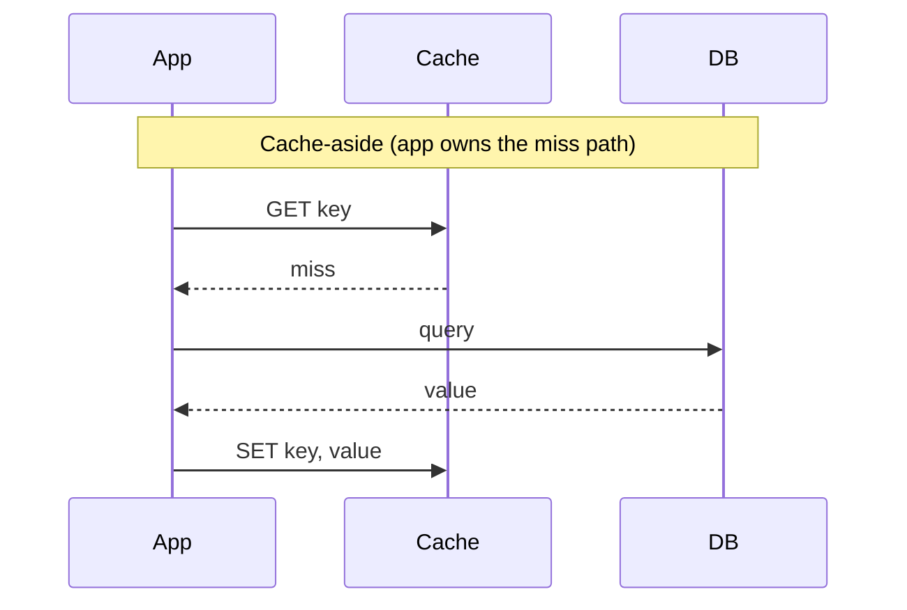
```mermaid
sequenceDiagram
    participant App
    participant Cache
    participant DB
    Note over App,DB: Cache-aside (app owns the miss path)
    App->>Cache: GET key
    Cache-->>App: miss
    App->>DB: query
    DB-->>App: value
    App->>Cache: SET key, value
```

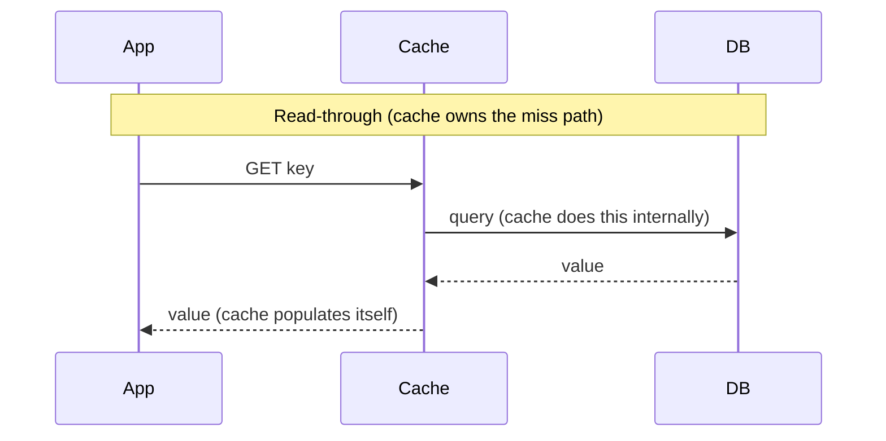
```mermaid
sequenceDiagram
    participant App
    participant Cache
    participant DB
    Note over App,DB: Read-through (cache owns the miss path)
    App->>Cache: GET key
    Cache->>DB: query (cache does this internally)
    DB-->>Cache: value
    Cache-->>App: value (cache populates itself)
```

> **Memory hook**: cache-**aside** = the app steps **aside** from the cache to go fetch data itself. Read-**through**: you never leave the cache, the request passes **through** it into the DB transparently.

### 8b. Write path: Write-Through / Write-Back / Write-Around

| Policy | How it works | Consistency | Write latency | Best for |
|---|---|---|---|---|
| **Write-through** | Write to cache **and** DB before ack | Strong | Higher (waits on DB) | Read-your-writes correctness (balances, inventory) |
| **Write-back (write-behind)** | Write to cache, ack immediately, flush to DB async | Weak — DB lags | Lowest | Write-heavy, tolerant of losing the last few writes (counters, metrics) |
| **Write-around** | Write to DB only; cache fills lazily on next read | DB fresh, cache stale/missing | Low, but guaranteed miss on first read after write | Write-once, rarely-read-immediately data (bulk imports) |

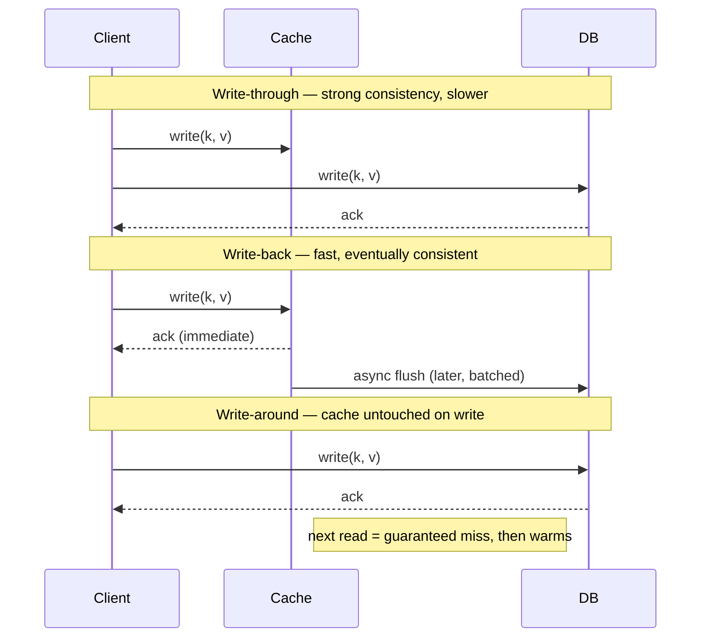
```mermaid
sequenceDiagram
    participant Client
    participant Cache
    participant DB
    Note over Client,DB: Write-through — strong consistency, slower
    Client->>Cache: write(k, v)
    Client->>DB: write(k, v)
    DB-->>Client: ack
    Note over Client,DB: Write-back — fast, eventually consistent
    Client->>Cache: write(k, v)
    Cache-->>Client: ack (immediate)
    Cache->>DB: async flush (later, batched)
    Note over Client,DB: Write-around — cache untouched on write
    Client->>DB: write(k, v)
    DB-->>Client: ack
    Note right of Cache: next read = guaranteed miss, then warms
```

> **Memory hook**: "THRU is True (both stores updated together). BACK is fast but risky (DB lags BEHIND). AROUND means the write goes AROUND the cache entirely."

**Interview trap**: *"write data and read it back immediately, want strong consistency"* → **write-through**, not write-back. Write-back optimizes write latency at the cost of the DB (and any reader bypassing cache) seeing stale data.

**Two-sentence version**: "Read path is about who fetches on a miss — the app (cache-aside, the default) or the cache itself (read-through). Write path is about when the DB gets updated relative to the ack — together (write-through, strong+slow), after (write-back, fast+risky), or never through the cache at all (write-around)."

---

## 9. Single-node internals

Every cache node needs two data structures working together:

1. **Hash map** — O(1) average lookup, key → pointer to value/node.
2. **Doubly linked list** — orders entries by recency so eviction is O(1): move to head on access, evict from tail when full.

This pair **is** the classic "design an LRU cache" coding question — `HashMap<K, Node>` + intrusive doubly linked list, both `get`/`put` in O(1).

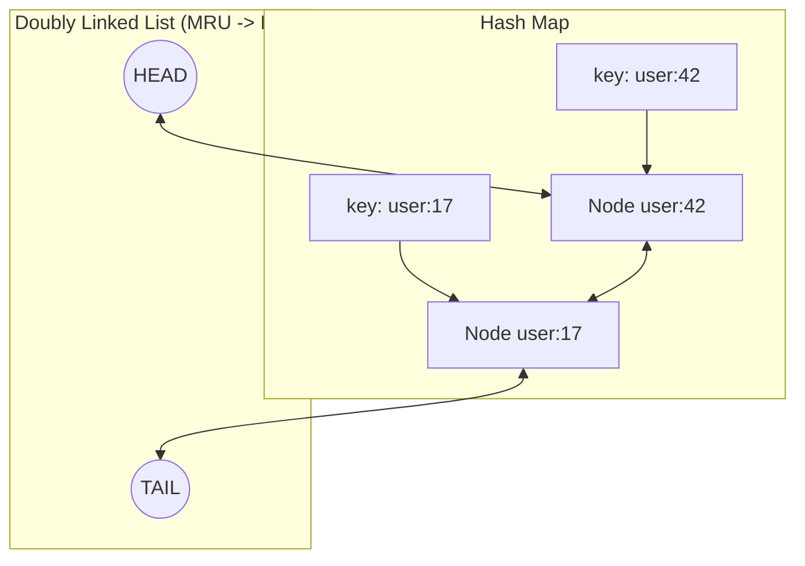
```mermaid
graph TD
    subgraph "Hash Map"
        K1["key: user:42"] --> N1
        K2["key: user:17"] --> N2
    end
    subgraph "Doubly Linked List (MRU  ->  LRU)"
        Head((HEAD)) <--> N1[Node user:42] <--> N2[Node user:17] <--> Tail((TAIL))
    end
```

**Bloom filter**: a probabilistic structure answering "is this key *definitely not* cached?" in O(k) with no false negatives (but possible false positives). Used to skip wasted DB lookups for keys that never existed — this is exactly how Cassandra avoids unnecessary SSTable reads `[well-documented — Cassandra's per-SSTable bloom filters are described in its own architecture docs, not an inference]`, and the standard fix for **cache penetration** (see §22).

**Two-sentence version**: "A single node is just the LRU-cache coding problem: a hash map for O(1) lookup paired with a doubly linked list for O(1) recency-ordered eviction. A Bloom filter bolted on the side answers 'definitely not cached' cheaply, which is the standard fix for cache penetration."

---

## 10. Eviction policies

RAM is small and expensive, so something must be evicted to make room.

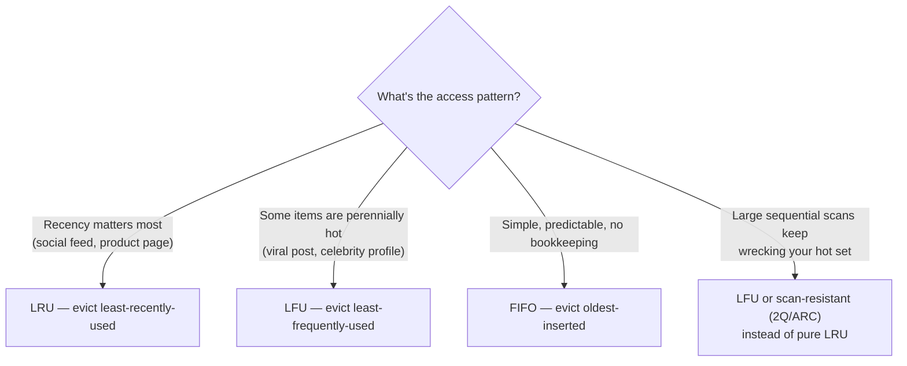
```mermaid
flowchart TD
    Q{"What's the access pattern?"} -->|"Recency matters most\n(social feed, product page)"| LRU["LRU — evict least-recently-used"]
    Q -->|"Some items are perennially hot\n(viral post, celebrity profile)"| LFU["LFU — evict least-frequently-used"]
    Q -->|"Simple, predictable, no bookkeeping"| FIFO["FIFO — evict oldest-inserted"]
    Q -->|"Large sequential scans keep\nwrecking your hot set"| SCAN["LFU or scan-resistant (2Q/ARC)\ninstead of pure LRU"]
```

| Policy | Evicts | Good for | Bad for |
|---|---|---|---|
| **LRU** | Oldest-accessed entry | General purpose, default answer | Sequential scans evict the whole hot set ("cache pollution") |
| **LFU** | Lowest access count | Long-tail popularity (viral content) | New items get evicted before they build up count |
| **FIFO** | Oldest-inserted entry | Cheap, predictable | Ignores actual access pattern |
| **Random** | Random entry | O(1), no bookkeeping | No guarantees — anecdotally competitive at scale though (Redis `allkeys-random`) `[illustrative/approx — plausible/commonly cited, not a documented universal guarantee; workload-dependent]` |

> **Memory hook**: "LRU = **last touched** wins. LFU = **most touched** wins. FIFO = **oldest born** dies first."

### Why the eviction algorithm choice matters — the EAT formula (memorize this)

```
EAT (Effective Access Time) = Ratio_hit × Time_hit + Ratio_miss × Time_miss
```

Given: cache hit = 5ms (p99.9) `[illustrative/approx — a stated assumption for this example, not a universal constant]`, cache miss = 30ms (p99.9, includes DB round-trip + cache repopulation) `[illustrative/approx]`:

- MFU, 10% miss rate: `EAT = 0.90×5 + 0.10×30 = 7.5ms` `[say cold — pure arithmetic once the inputs above are accepted]`
- LRU, 5% miss rate: `EAT = 0.95×5 + 0.05×30 = 6.25ms` `[say cold]`

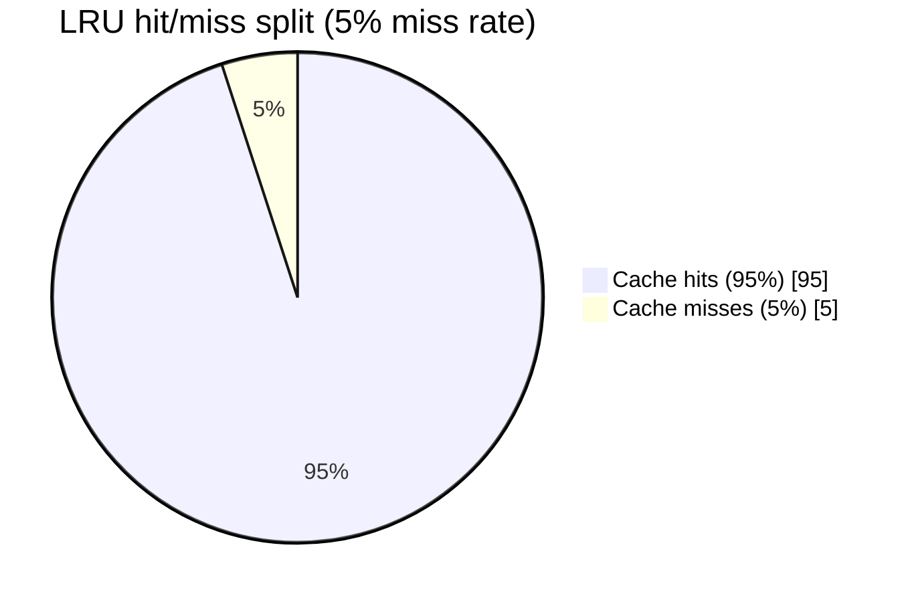
```mermaid
pie showData
    title LRU hit/miss split (5% miss rate)
    "Cache hits (95%)" : 95
    "Cache misses (5%)" : 5
```

**A 5-point hit-rate improvement is a ~17% latency improvement** `[say cold — (7.5-6.25)/7.5 ≈ 17%, derived directly from the two lines above]`. Know the formula, not the memorized number — interviewers will hand you different inputs.

**Two-sentence version**: "Default to LRU; switch to LFU when some items are perennially hot regardless of recency, and watch for sequential scans blowing away your hot set (cache pollution), which is LRU's specific weakness. The EAT formula — hit_ratio×hit_time + miss_ratio×miss_time — is what actually justifies the choice, not a memorized hit-rate number."

---

## 11. Cache invalidation ("one of the two hard things in CS")

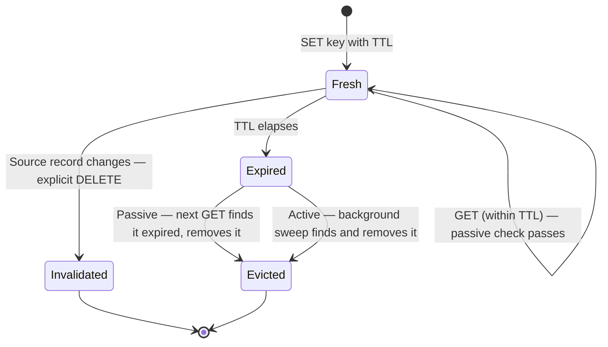
```mermaid
stateDiagram-v2
    [*] --> Fresh: SET key with TTL
    Fresh --> Fresh: GET (within TTL) — passive check passes
    Fresh --> Expired: TTL elapses
    Expired --> Evicted: Passive — next GET finds it expired, removes it
    Expired --> Evicted: Active — background sweep finds and removes it
    Fresh --> Invalidated: Source record changes — explicit DELETE
    Invalidated --> [*]
    Evicted --> [*]
```

- **TTL — active expiration**: a background daemon periodically scans and evicts expired keys (reclaims memory proactively, costs CPU).
- **TTL — passive expiration**: checked only on access; expired entries removed lazily (cheap, but stale entries linger in RAM until touched). Redis does **both** in production `[well-documented Redis behavior]`.
- **Explicit invalidation / delete-on-write**: when the source-of-truth record changes, the write path must actively delete or update the cache key. TTL alone won't catch this — an LRU entry can be "hot" and simultaneously *wrong*.
- **Versioned keys** (`user:42:v3`): sidesteps delete-race conditions entirely — old versions just age out via normal eviction.

**Cheat-sheet**: TTL handles *time-based* staleness. Explicit invalidation handles *event-based* staleness (a write happened). If asked "how do you keep cache and DB in sync after a delete" — the answer is always the write path, never the eviction policy.

#### Invalidation strategies at a glance

| Strategy | Triggers on | Catches writes? | Cost | If asked... |
|---|---|---|---|---|
| TTL — active | Background sweep timer | No | CPU, always running | "reclaim memory proactively" |
| TTL — passive | Next GET after expiry | No | Cheap, but stale entry lingers in RAM | "lazy, low overhead" |
| Explicit delete-on-write | The write path, immediately | Yes | One extra call per write | "how do we stay in sync with the DB" |
| Versioned keys | New version written, old key just ages out | Yes (no race) | Slight key-space growth | "avoid delete-race conditions" |

**If X then Y**: *if the interviewer says "the DB changed, how does the cache find out" → your answer is explicit delete-on-write, never "wait for the TTL."* TTL is a safety net for staleness you didn't catch, not the primary invalidation mechanism.

**Two-sentence version**: "TTL handles staleness that accrues over time; explicit delete-on-write handles the instant a source record actually changes — the two are complementary, not interchangeable. If asked how the cache learns about a DB write, the answer is always the write path, never 'it'll expire eventually.'"

---

## 12. Sharding topology: dedicated vs. co-located

| Model | Description | Pros | Cons |
|---|---|---|---|
| **Dedicated cache servers** | Cache on separate hosts from app/web servers | Scale cache and compute independently; shareable as "cache as a service" across microservices | Extra network hop, extra hardware |
| **Co-located cache** | Cache embedded on the same host as the app | Lower CAPEX/OPEX; scales automatically with the service | Host failure kills both cache and service together |

**Real-world anchor**: Facebook's Memcached tier is dedicated — ~28TB RAM across 800+ servers (2013) `[illustrative/approx — well-documented, from the published "Scaling Memcache at Facebook" paper; a point-in-time figure, not current]`, because Memcached is shared across many services, not owned by one.

**Default to dedicated** when multiple services share the cache or scale at different rates. Choose co-located only when operational simplicity matters more than isolation.

**Two-sentence version**: "Dedicated cache servers let you scale cache and compute independently and share one cluster across services, at the cost of an extra network hop. Co-located caches are cheaper and simpler but tie cache and app-server failure together — default to dedicated unless simplicity outweighs isolation."

---

## 13. Finding the right server: consistent hashing

Plain `hash(key) % N` breaks catastrophically when `N` changes — adding/removing a node remaps nearly every key, causing a stampede on the DB. **Consistent hashing** places servers and keys on a hash ring; adding/removing a node only remaps the keys between it and its neighbor — roughly `K/N` keys move, not nearly all of them.

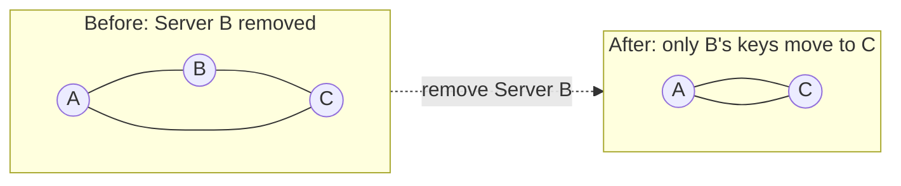
```mermaid
flowchart LR
    subgraph Before["Before: Server B removed"]
        direction LR
        A1((A)) --- B1((B)) --- C1((C)) --- A1
    end
    subgraph After["After: only B's keys move to C"]
        direction LR
        A2((A)) --- C2((C)) --- A2
    end
    Before -.->|"remove Server B"| After
```

#### Ring rebalancing on node addition

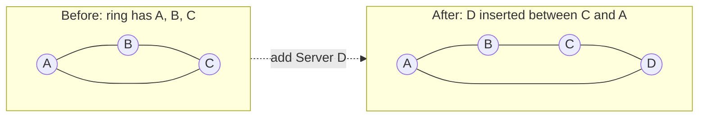
```mermaid
flowchart LR
    subgraph Before2["Before: ring has A, B, C"]
        direction LR
        A3((A)) --- B3((B)) --- C3((C)) --- A3
    end
    subgraph After2["After: D inserted between C and A"]
        direction LR
        A4((A)) --- B4((B)) --- C4((C)) --- D4((D)) --- A4
    end
    Before2 -.->|"add Server D"| After2
```

**Worked example**: 3 shards holding 300K keys total (100K each). Add a 4th shard: only the keys that now fall in D's slice of the ring move — roughly `300K / 4 ≈ 75K` keys relocate, and the other ~225K keys never move `[say cold — pure arithmetic under the stated assumption of an even ring; virtual nodes are what make that assumption realistic in practice]`. Plain `hash(key) % N` would have remapped nearly all 300K keys on that same resize (`N` changed from 3 to 4 changes almost every `key % N` result) — that difference is the entire pitch for consistent hashing.

- Lookup complexity with a sorted ring + binary search: **O(log N)**, N = number of shards.
- **Virtual nodes** (each physical server mapped to many points on the ring) fix uneven load distribution — without them, a small N can produce a lumpy ring where some servers get disproportionately more keys.
- **Hotkey problem**: even with perfectly even key distribution, one *key* can dominate traffic (viral post, celebrity profile). This is a **load** problem, not a **hashing** problem — consistent hashing can't fix it. Fixes:
  - Read replicas for the hot shard.
  - **L1 local/in-process cache** in front of the distributed cache for the hottest keys (see §18).
  - Further shard within the hot key's range, or replicate that single key across nodes and pick one at random per request.

**Concrete example**: monitoring shows one key (`product:1001:price`, a flash-sale item) taking 50K req/sec on a shard that normally handles 10K req/sec total — a single key is 5x its shard's normal load `[say cold given the two stated QPS figures — the figures themselves would be measured/illustrative in a real system]`. Replicate that key across 5 nodes and route requests to it round-robin/random: each replica now absorbs `50K / 5 = 10K req/sec`, back to a normal shard load `[say cold — deterministic division given the replication factor chosen]`.

#### Detecting and mitigating a hot key

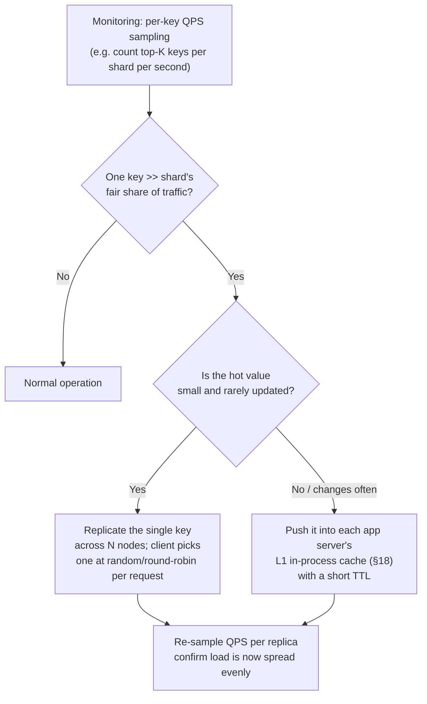
```mermaid
flowchart TD
    Mon["Monitoring: per-key QPS sampling\n(e.g. count top-K keys per shard per second)"] --> Detect{"One key >> shard's\nfair share of traffic?"}
    Detect -->|No| Normal["Normal operation"]
    Detect -->|Yes| Size{"Is the hot value\nsmall and rarely updated?"}
    Size -->|Yes| Replicate["Replicate the single key\nacross N nodes; client picks\none at random/round-robin per request"]
    Size -->|"No / changes often"| L1["Push it into each app server's\nL1 in-process cache (§18)\nwith a short TTL"]
    Replicate --> Recheck["Re-sample QPS per replica\nconfirm load is now spread evenly"]
    L1 --> Recheck
```

**Two-sentence version**: "Consistent hashing places servers and keys on a ring so a resize moves roughly K/N keys instead of nearly all of them, unlike plain `hash % N`. It solves *placement*, not *load* — a single hotkey needs replication or an L1 cache in front of it, because consistent hashing can spread keys evenly and still let one key dominate traffic."

---

## 14. Availability: replication and configuration management

The naive design has three problems: (1) clients have no way to detect a server joining or dying, (2) one server per shard is a single point of failure with no read relief when that shard gets hot, (3) nothing guarantees every client agrees on which server owns which shard — two clients with different views of the topology will send the same key to two different servers.

### Server discovery — three escalating solutions

| Solution | Mechanism | Downside |
|---|---|---|
| Local config file per host | Manually pushed via DevOps tooling | Manual update + redeploy every change |
| Centralized config file | Single source, clients pull | Still manual, no health detection |
| **Configuration service** | Actively monitors health, pushes updates automatically | Most complex, but the only fully automatic option |

This is structurally identical to **service discovery** (ZooKeeper, etcd, Consul) — say that explicitly. Redis uses **Sentinel** for this exact role `[well-documented Redis component]`.

### Replication and failover

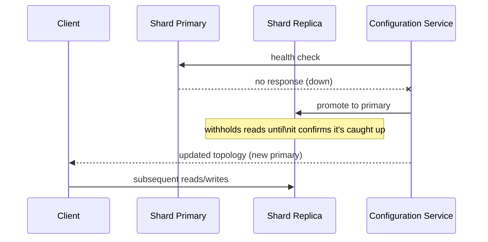
```mermaid
sequenceDiagram
    participant Client
    participant Primary as Shard Primary
    participant Replica as Shard Replica
    participant ConfigSvc as Configuration Service
    ConfigSvc->>Primary: health check
    Primary--xConfigSvc: no response (down)
    ConfigSvc->>Replica: promote to primary
    Note over Replica: withholds reads until\nit confirms it's caught up
    ConfigSvc-->>Client: updated topology (new primary)
    Client->>Replica: subsequent reads/writes
```

- **Same data center**: synchronous replication is affordable — strong consistency, acceptable latency.
- **Cross data center**: synchronous is too slow (WAN RTT) — use **asynchronous** replication, trading consistency for availability. This is a direct **CAP / PACELC** trade-off — name both if asked to justify the choice.
- A **recovering/rejoining replica must not serve reads** until it's confirmed caught up, or clients see stale data right after a failure window.

**Two-sentence version**: "Replication needs a shared source of truth for shard ownership (a configuration service, structurally the same as ZooKeeper/etcd) so clients never disagree on topology, plus a primary+replica pair per shard for failover. Sync replication in-DC buys strong consistency cheaply; cross-DC you go async and accept the CAP/PACELC trade — a rejoining replica must withhold reads until it's caught up, or it serves stale data right after the outage it's recovering from."

---

## 15. Capacity estimation (back-of-the-envelope) — do this math out loud

Interviewers score this step explicitly. The chain is always: **QPS → hit rate → working-set size → RAM per node → shard count → replica factor → network bandwidth check.**

```
QPS_avg   = daily_requests / 86,400
QPS_peak  = QPS_avg × peak_multiplier (commonly 3x)
Cache_QPS = QPS_peak × hit_rate
DB_QPS    = QPS_peak × (1 - hit_rate)

Working_set_size = hot_key_count × (avg_value_size + per_key_overhead)
                    # per_key_overhead ≈ 50-100 bytes (hashmap entry + DLL pointers + metadata)

Shards_needed = ceil(Working_set_size / usable_RAM_per_node)
Nodes_needed  = Shards_needed × replication_factor   # primary + N replicas

Bandwidth_per_node = (Cache_QPS / Shards_needed) × avg_response_size
```

**Worked example** — feed service, 500M DAU, 50 reads/user/day, 2KB avg item, 90% hit rate, 64GB usable RAM/node, replication factor 2. (The inputs are stated assumptions `[illustrative/approx]`; everything below is `[say cold]` — pure arithmetic once you accept them.)

| Step | Math | Result |
|---|---|---|
| Total reads/day | 500M × 50 | 25B/day |
| QPS (avg) | 25B / 86,400 | ~289K QPS |
| QPS (peak, 3x) | 289K × 3 | ~867K QPS |
| Cache QPS | 867K × 0.90 | ~780K QPS |
| DB QPS (miss overflow) | 867K × 0.10 | ~87K QPS |
| Working set (assume top 10% of 1B items covers 90% of traffic — Zipf/power law) | 100M keys × (2KB + ~100B overhead) | ~210 GB |
| Shards needed | 210GB / 64GB | ~4 shards |
| Nodes needed (with 1 replica each) | 4 × 2 | **~8 nodes** (round up for headroom → ~10-12) |
| Bandwidth per node | (780K/4) × 2KB | ~390 MB/s — well under a 10Gbps (1.25GB/s) NIC |

### 🆕 Redo the math live: interviewer changes the inputs

A realistic follow-up: *"Assume the hit rate is actually 70%, not 90% — and average item size is 5KB, not 2KB, because you forgot thumbnails."* Same formula chain, new inputs — this is the moment that actually tests whether you understood the chain or memorized the answer:

| Step | Math | Result | vs. original |
|---|---|---|---|
| QPS (avg/peak) | unchanged — doesn't depend on hit rate or item size | ~289K / ~867K QPS | same |
| Cache QPS | 867K × 0.70 | ~607K QPS | down |
| DB QPS | 867K × 0.30 | ~260K QPS | **~3x jump** from 87K — a 20-point hit-rate drop nearly triples DB load |
| Working set | 100M × (5KB + ~100B) | ~510 GB | ~2.4x the original 210GB |
| Shards needed | 510GB / 64GB | ~8 shards | double |
| Nodes needed | 8 × 2 | **~16 nodes** | double |
| Bandwidth per node | (607K/8) × 5KB | ~379 MB/s | still under the 10Gbps NIC, barely changed despite everything else doubling |

The takeaway to say out loud: **DB load is far more sensitive to hit-rate drops than node count is to item-size growth** — a 20-point hit-rate drop nearly 3x'd the DB, while a 2.5x item-size increase only 2x'd the node count (because sharding absorbs size growth roughly linearly, but a lower hit rate compounds against the *entire* miss-side QPS, not just storage). Say the *method*, not a memorized number — interviewers change the inputs specifically to see if you re-derive or freeze up.

**Two-sentence version**: "Capacity estimation is one formula chain — QPS → hit rate → working set → shards → nodes → bandwidth — stated symbolically, then plugged with real numbers. The graded moment is re-running that same chain live when the interviewer swaps an input, not the first answer."

---

## 16. Numbers worth memorizing

All figures below are `[illustrative/approx]` — typical/measured ranges from general systems knowledge, not derived from a formula; state them with a hedge ("roughly," "on the order of").

| Operation | Approx. latency |
|---|---|
| RAM access | ~100 ns |
| Redis/Memcached GET (same rack, incl. network) | ~0.5–1 ms |
| SSD random read | ~100–150 μs |
| Indexed DB query (same DC) | ~1–10 ms |
| Complex DB query / join, no index | ~50–100+ ms |
| Same-DC network round trip | ~0.5 ms |
| Cross-region network round trip | ~50–150 ms |
| Well-tuned production cache hit rate | 90–99% |
| Typical single Redis node RAM | 16–128 GB (can go higher) |

These are the numbers behind every "why does caching help" justification — RAM access being ~10,000x faster than a cross-region round trip is the entire argument for edge/local caching `[say cold — that ratio follows directly from the two rows above, ~100ns vs ~100ms]`.

**Two-sentence version**: "RAM access is on the order of 100ns, a same-DC cache hit is under a millisecond, and a cross-region round trip is 50-150ms — a roughly 10,000x spread between RAM and a cross-region hop. That spread alone is the entire argument for caching close to where you read."

---

## 17. Full detailed design

#### Architecture evolution: v1 → v2 → v3

Narrating the design as an evolution — not jumping straight to the final diagram — is a strong way to show *why* each piece exists.

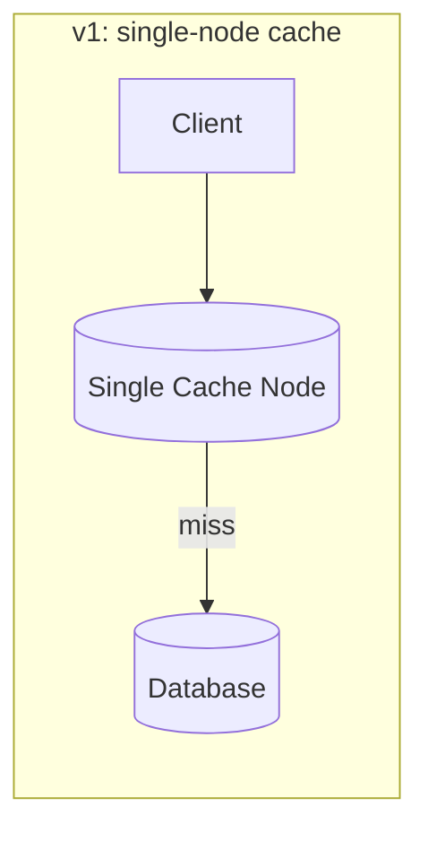
```mermaid
graph LR
    subgraph V1["v1: single-node cache"]
        C1[Client] --> Cache1[(Single Cache Node)]
        Cache1 -->|miss| DB1[(Database)]
    end
```
*Works until the working set outgrows one machine's RAM, or that one machine goes down and every request falls through to the DB.*

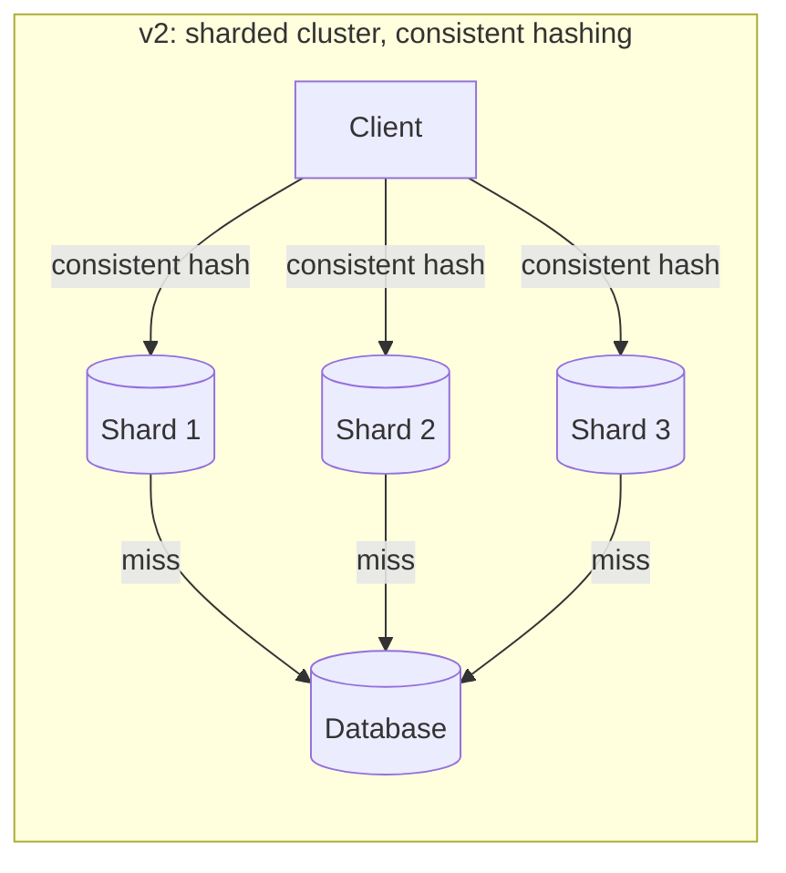
```mermaid
graph LR
    subgraph V2["v2: sharded cluster, consistent hashing"]
        C2[Client] -->|consistent hash| S1[(Shard 1)]
        C2 -->|consistent hash| S2[(Shard 2)]
        C2 -->|consistent hash| S3[(Shard 3)]
        S1 -->|miss| DB2[(Database)]
        S2 -->|miss| DB2
        S3 -->|miss| DB2
    end
```
*Fixes the size ceiling. Still has two problems: no replica if a shard dies, and no defense against a hot key or a stampede.*

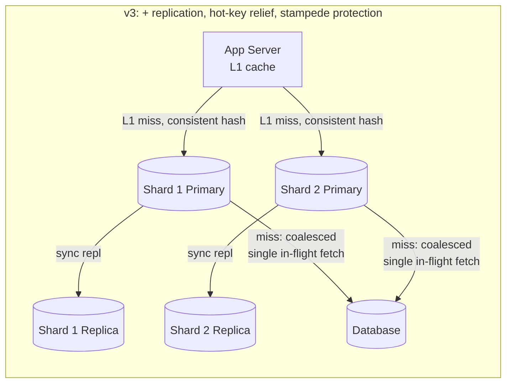
```mermaid
graph LR
    subgraph V3["v3: + replication, hot-key relief, stampede protection"]
        C3[App Server\nL1 cache] -->|L1 miss, consistent hash| S1P[(Shard 1 Primary)]
        C3 -->|L1 miss, consistent hash| S2P[(Shard 2 Primary)]
        S1P -->|sync repl| S1R[(Shard 1 Replica)]
        S2P -->|sync repl| S2R[(Shard 2 Replica)]
        S1P -->|"miss: coalesced\nsingle in-flight fetch"| DB3[(Database)]
        S2P -->|"miss: coalesced\nsingle in-flight fetch"| DB3
    end
```
*v3 is the target end-state: replicas remove the SPOF and absorb hot-shard reads, the L1 cache removes network hops for the single hottest keys, and request coalescing (§22) stops a stampede from ever reaching the DB as N redundant queries.*

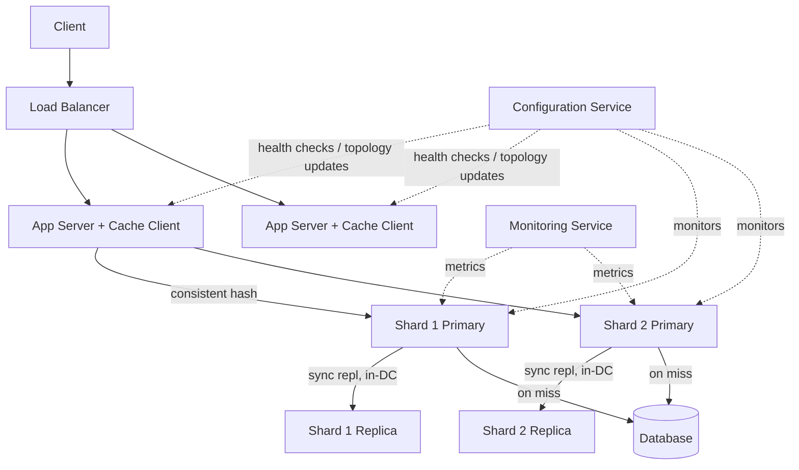
```mermaid
graph TB
    Client --> LB[Load Balancer]
    LB --> App1[App Server + Cache Client]
    LB --> App2[App Server + Cache Client]
    CS[Configuration Service] -.health checks / topology updates.-> App1
    CS -.health checks / topology updates.-> App2
    App1 -->|consistent hash| Shard1P[Shard 1 Primary]
    App1 --> Shard2P[Shard 2 Primary]
    Shard1P -->|sync repl, in-DC| Shard1R[Shard 1 Replica]
    Shard2P -->|sync repl, in-DC| Shard2R[Shard 2 Replica]
    CS -.monitors.-> Shard1P
    CS -.monitors.-> Shard2P
    Shard1P -->|on miss| DB[(Database)]
    Shard2P -->|on miss| DB
    Mon[Monitoring Service] -.metrics.-> Shard1P
    Mon -.metrics.-> Shard2P
```

Narrate in this order: **cache client** (consistent hash, picks shard, TCP/UDP, gets topology from config service) → **cache server** (hash map + DLL, eviction, TTL) → **primary + replica per shard** (availability, hot-shard read scaling) → **configuration service** (health + topology, must be consistent across all clients — disagreement here means split-brain reads) → **monitoring service** (hit/miss rate, latency percentiles, memory pressure).

Note: no delete API in the base design — eviction (algorithm-driven) and expiration (TTL-driven) handle removal locally. A delete API is added only when explicit invalidation is required (§11).

**Two-sentence version**: "Narrate v1 (single node, breaks on size or death) → v2 (sharded via consistent hashing, breaks on shard death or hotkeys) → v3 (add replicas, L1 cache, and request coalescing). The final box diagram is just v3 with a configuration service and monitoring layered on for topology agreement and observability."

---

## 18. Multi-level caching (L1 local + L2 distributed)

A pattern worth volunteering when hotkeys or extreme latency come up: put a small **in-process (L1) cache** inside each app server, in front of the **distributed (L2) cache**.

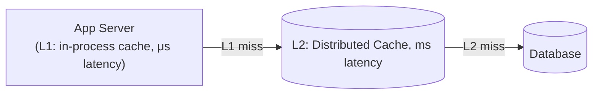
```mermaid
graph LR
    App["App Server\n(L1: in-process cache, μs latency)"] -->|L1 miss| L2[(L2: Distributed Cache, ms latency)]
    L2 -->|L2 miss| DB[(Database)]
```

- L1 absorbs the hottest keys with zero network hop — the direct fix for a single overloaded key that no amount of L2 replication can fully solve, since L2 replicas still cost a network round trip.
- Trade-off: L1 is per-process, so invalidation is harder (N processes to notify, not one cluster) — usually paired with a short TTL rather than active invalidation.

**Two-sentence version**: "An L1 in-process cache in front of the distributed L2 cache absorbs the hottest keys with zero network hop, which is the only real fix for a single key that's overloaded regardless of L2 replication. The cost is that invalidation now means notifying N processes instead of one cluster, so L1 is usually paired with a short TTL, not active invalidation."

---

## 19. Cache warm-up and cold start

A node that just restarted (crash, deploy, autoscale-up) is a **cold cache** — empty, 0% hit rate. If the config service routes full production traffic to it immediately, every one of those requests misses and falls through to the DB at once. This is the same stampede shape as §22, but triggered by a node lifecycle event instead of a key expiring.

**Concrete example**: a shard normally serves 50K req/sec at a 95% hit rate — only 2.5K req/sec reach the DB `[say cold given those two assumed figures]`. If that shard restarts cold, hit rate drops to ~0% until the working set rebuilds, so the DB briefly sees the full 50K req/sec — a **20x spike** on the exact box that was never sized for it `[say cold — 50K vs. the 2.5K baseline above is exactly 20x]`.

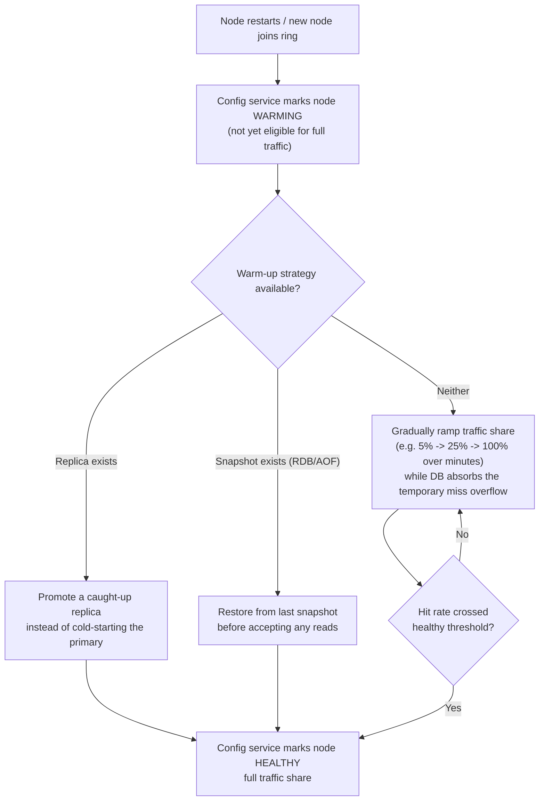
```mermaid
flowchart TD
    Start["Node restarts / new node joins ring"] --> Mark["Config service marks node WARMING\n(not yet eligible for full traffic)"]
    Mark --> Choice{"Warm-up strategy available?"}
    Choice -->|"Replica exists"| Promote["Promote a caught-up replica\ninstead of cold-starting the primary"]
    Choice -->|"Snapshot exists (RDB/AOF)"| Restore["Restore from last snapshot\nbefore accepting any reads"]
    Choice -->|"Neither"| Ramp["Gradually ramp traffic share\n(e.g. 5% -> 25% -> 100% over minutes)\nwhile DB absorbs the temporary miss overflow"]
    Promote --> Healthy
    Restore --> Healthy
    Ramp --> Check{"Hit rate crossed\nhealthy threshold?"}
    Check -->|No| Ramp
    Check -->|Yes| Healthy["Config service marks node HEALTHY\nfull traffic share"]
```

Mitigations, cheapest first:
- **Prefer promotion over cold restart**: if a replica is already warm (§14), promote it and let the old primary rejoin as the (cold) replica instead — reads never hit an empty cache.
- **Snapshot restore**: Redis's RDB/AOF (§21) lets a restarting node reload most of its working set from disk before serving traffic, instead of rebuilding it one DB-fallback at a time.
- **Gradual traffic ramp / canary warm-up**: the configuration service (§14) sends a small percentage of a shard's traffic to a newly-healthy node and increases it as the hit rate climbs, rather than flipping 0% → 100%.
- **Pre-warm from a hot-key list**: replay the top-N known-hot keys (from monitoring, §17) into the node before marking it healthy, so at least the highest-traffic keys don't start cold.
- **Rate-limit the DB during the warm-up window** — the same circuit-breaker discipline as the golden rule in §22 applies here: a cold node is a temporary, predictable spike, not a reason to let the DB fall over.
- **Consistent hashing already limits the blast radius**: a *new* node only owns ~K/N of the keyspace (§13), so a join is naturally cheaper to warm than a full-cluster restart would be.

> **Memory hook**: "A cold node is a self-inflicted stampede — treat it exactly like one: ramp it in, don't switch it on."

**Two-sentence version**: "A freshly restarted node is a 0%-hit-rate self-inflicted stampede — flipping it straight to full traffic can spike the DB by 10-20x. Prefer promoting an already-warm replica or restoring from a snapshot; failing both, ramp traffic in gradually while rate-limiting the DB."

---

## 20. Evaluating against non-functional requirements

Walk NFRs in this order in your answer — each builds on a decision you already justified:

| NFR | How the design satisfies it |
|---|---|
| **Performance** | Consistent hashing → O(log N) shard lookup; hash map → O(1) key lookup; DLL → O(1) eviction; RAM-only storage |
| **Scalability** | Add shards with minimal rehashing; add replicas to absorb hot-shard read load; horizontal scale-out, no single bottleneck |
| **Availability** | Primary + replica per shard; configuration service auto-detects failures; recovering nodes withhold reads until caught up |
| **Consistency** | Tunable: sync in-DC (strong) / async cross-DC (eventual) — explicit CAP/PACELC trade-off |
| **Affordability** | Commodity hardware; RAM provisioned to hot working-set size, not total dataset size |

**Two-sentence version**: "Every NFR traces back to a decision already made earlier: performance to consistent hashing and O(1) local structures, availability to primary+replica plus a configuration service, consistency to the sync/async CAP choice. Walking NFRs this way — as consequences, not new claims — is itself the signal an interviewer is listening for."

---

## 21. Real-world case studies

### Memcached — simplicity, shared-nothing, O(1) throughput
- Pure key-value; keys and values are **strings** — everything must be serialized.
- **Shared-nothing**: servers don't know about each other, no inter-server sync. All "distributed" logic (consistent hashing) lives client-side.
- No built-in persistence or replication (third-party only). Multithreaded — uses multicore machines efficiently.
- **Facebook**: ~28TB RAM / 800+ servers (2013), between web tier and MySQL, ~95% hit rate via approximate LRU, 50M requests → 2.5M DB hits `[illustrative/approx — well-documented, from the published "Scaling Memcache at Facebook" paper; a 2013 snapshot, not a current figure]`.
- Best fit: **simple, read-heavy**, large objects, maximum throughput, no need for built-in HA.

### Redis — data-structure server, built-in HA, single-threaded core
- Rich types: strings, hashes, sorted sets, bitmaps, HyperLogLog, geospatial — computation can happen *inside* Redis (`ZINCRBY` on a leaderboard) instead of round-tripping.
- Also a **database** (AOF + RDB persistence) and a **message broker** (Pub/Sub, Streams).
- **Redis Sentinel/Cluster**: built-in sharding, replication, automatic failover — decouples data plane from control plane. `[well-documented Redis components]`
- **Single-threaded core** per instance — no lock contention; scale via more instances/cluster nodes, not more threads per node. `[well-documented Redis architecture]`
- **Pipelining**: batch commands into one round trip instead of waiting per-response — collapses N RTTs into 1. ~5x latency win even on loopback `[illustrative/approx — commonly cited order-of-magnitude, exact multiplier is workload- and network-dependent]`; biggest win over high-latency links.

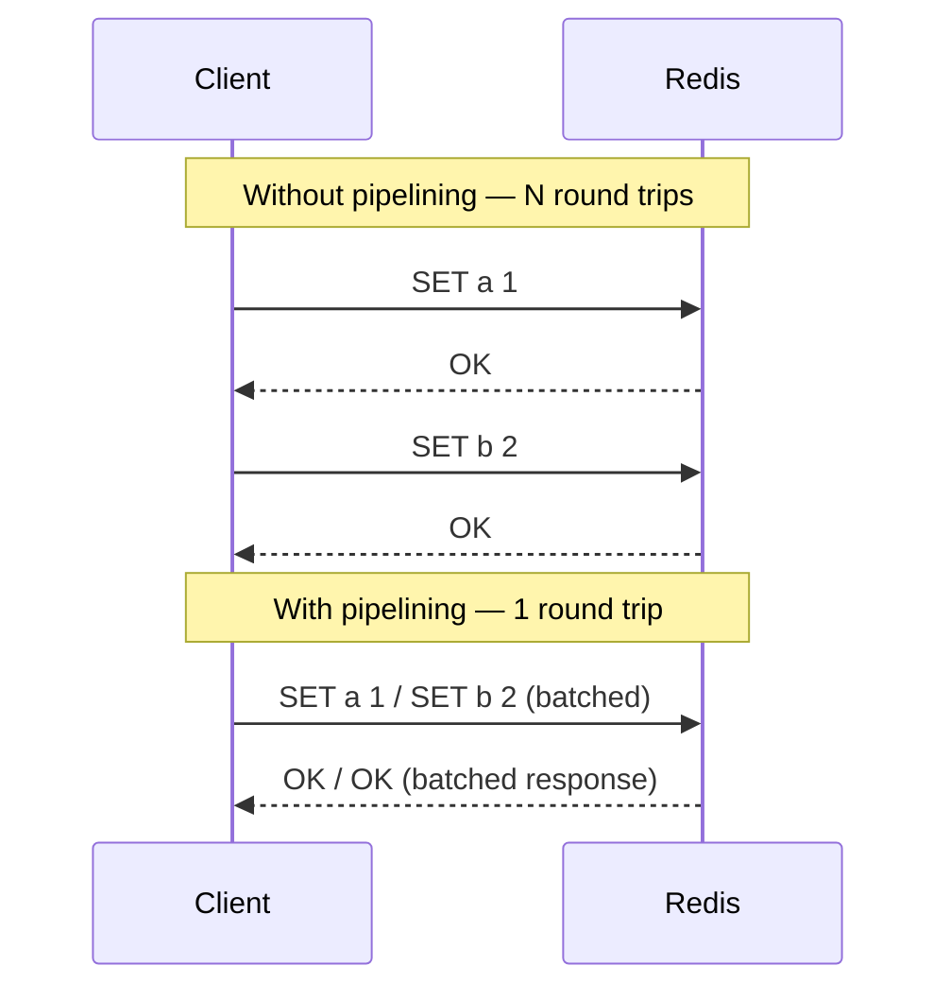
```mermaid
sequenceDiagram
    participant Client
    participant Redis
    Note over Client,Redis: Without pipelining — N round trips
    Client->>Redis: SET a 1
    Redis-->>Client: OK
    Client->>Redis: SET b 2
    Redis-->>Client: OK
    Note over Client,Redis: With pipelining — 1 round trip
    Client->>Redis: SET a 1 / SET b 2 (batched)
    Redis-->>Client: OK / OK (batched response)
```

| Feature | Memcached | Redis |
|---|---|---|
| Data model | Strings only | Strings, hashes, sets, sorted sets, bitmaps, HLL, geospatial |
| Persistence | No (3rd-party only) | Yes — RDB + AOF |
| Sharding | Client-side only | Built-in (Cluster) |
| Replication / HA | 3rd-party | Built-in (Sentinel/Cluster) |
| Threading | Multithreaded | Single-threaded core |
| Transactions | No | Yes (MULTI/EXEC) |
| Scripting | No | Yes (Lua) |
| Best for | Simple, read-heavy, max throughput | Complex, read+write, needs data structures/HA/persistence |

**Two-sentence version (the one-liner interviewers want)**: *"Memcached is a simple, fast, shared-nothing key-value store that pushes clustering complexity to the client — great for pure read-through caching of large blobs. Redis is a data-structure server with built-in replication and persistence — pick it when the cache also needs to do more than GET/SET, or you want cluster management out of the box."*

---

## 22. Failure modes to volunteer (unprompted — this is what separates senior answers)

```mermaid
sequenceDiagram
    participant Req1 as Request 1
    participant Req2 as Request 2 (concurrent)
    participant Cache
    participant DB
    Note over Req1,DB: Cache stampede without coalescing
    Req1->>Cache: GET key (expired)
    Req2->>Cache: GET key (expired)
    Req1->>DB: query (redundant)
    Req2->>DB: query (redundant)
    Note over Req1,DB: With request coalescing
    Req1->>Cache: GET key (expired)
    Cache->>DB: single in-flight query (locks key)
    Req2->>Cache: GET key (expired)
    Cache-->>Req2: wait on in-flight fetch, not a new DB call
    DB-->>Cache: value
    Cache-->>Req1: value
    Cache-->>Req2: value (shared result)
```

#### Cache-miss handling with a stampede lock

```mermaid
flowchart TD
    Get["GET key"] --> Hit{"Key present\nand not expired?"}
    Hit -->|Yes| Return["Return value"]
    Hit -->|No| Lock{"Acquire per-key\nfetch lock?"}
    Lock -->|"Got it (first request)"| Fetch["Query DB, SET cache,\nrelease lock"]
    Fetch --> Return
    Lock -->|"Someone else holds it"| Wait["Wait briefly on the\nin-flight fetch (or return\nslightly-stale value if one exists)"]
    Wait --> Return
```

**Concrete example**: a product page cached for 60s gets 2,000 req/sec `[illustrative/approx assumed figures for this example]`. Without coalescing, the instant the key expires all ~2,000 requests in that second miss and hit the DB simultaneously. With a per-key lock, only the first misses through to the DB — the other 1,999 wait ~10-50ms `[illustrative/approx]` for that one query's result and reuse it, so the DB sees **1 query, not 2,000** `[say cold — follows directly from the coalescing mechanism given the assumed 2,000 req/sec]`.

**Stampede mitigation techniques compared**:

| Technique | How it works | Trade-off |
|---|---|---|
| Request coalescing / mutex lock | First miss fetches, others wait on that in-flight result | Small added latency for waiters; needs a lock per key |
| Jittered TTL | Add random ±10-20% to each key's TTL | Spreads expirations over time, doesn't help a single sudden hot key |
| Probabilistic early refresh | Recompute slightly *before* expiry, with rising probability as TTL nears zero | No thundering herd at all, but adds background refresh traffic |
| Stale-while-revalidate | Serve the expired value immediately, refresh in the background | Best latency; briefly serves stale data by design |

| Problem | What it is | Fix |
|---|---|---|
| **Cache stampede / thundering herd** | Many requests miss simultaneously and all hit the DB at once | Request coalescing (one in-flight fetch per key), jittered TTLs, probabilistic early refresh |
| **Cache penetration** | Repeated requests for keys absent from cache *and* DB, bypassing the cache every time | Bloom filter to short-circuit definitely-absent keys, or cache the "not found" result briefly (**negative caching**) |
| **Hotkey / hot shard** | One key or shard gets disproportionate traffic | Read replicas for that shard, L1 local cache (§18), further sharding within the key's range |
| **Cache pollution** | A one-time large scan evicts the entire genuinely-hot working set | LFU instead of pure LRU, or scan-resistant algorithms (2Q/ARC) |
| **Split-brain / stale topology** | Different clients see different shard-ownership views | Single source of truth (configuration service) all clients pull from |

**Golden rule to say out loud**: *cache failure must never mean system failure*. If a cache node (or the whole cluster) is down, the client should fail open to the DB — degrade latency, don't go offline. Protect the DB during such an outage with rate limiting/circuit breakers, since it wasn't provisioned to take 100% of traffic.

**Two-sentence version**: "Stampede is many requests missing the same expired key at once — fix with coalescing, jitter, or early refresh. Penetration is requests for keys that don't exist anywhere — fix with a Bloom filter or negative caching. Either way, the golden rule is cache failure must never mean system failure: fail open to the DB, but rate-limit it while you do."

---

## 🆕 23. Anti-patterns / red flags

Specific phrasings and moves that read as junior on this topic — pulled together in one place rather than scattered:

- **"I'll use Redis"** as the first sentence, before any requirements are stated. Earn the technology choice; don't lead with it.
- **"We'd add a cache"** without naming the layer (CDN? application? DB buffer pool?) or the library (Redis? Memcached? in-process?) — see §7's disambiguation.
- Treating TTL as the *only* invalidation mechanism — saying "it'll expire eventually" when the interviewer describes a write that just happened right now. That's an explicit-invalidation gap, not a staleness-tolerance question.
- Confusing consistent hashing (a *placement* problem) with the hotkey problem (a *load* problem) — proposing "just add more shards" to fix one overloaded key. More shards redistributes keys, not the traffic hitting one already-placed key.
- Describing cache-aside behavior, then later describing the cache "transparently loading on miss" (that's read-through) — without noticing the contradiction. Pick one read pattern and stay consistent.
- Never mentioning what happens when the cache cluster itself is down — implicitly assuming 100% cache availability instead of stating a fail-open stance.
- Sizing cache RAM to the **entire dataset** instead of the **working set** — inflates the node count by 10-100x for no reason, and signals you missed why locality-of-reference is the whole point.
- Discussing TTL expiration under high QPS without ever saying "stampede" or "thundering herd" — the interviewer is listening for that specific vocabulary.
- Presenting the final architecture directly, skipping the v1→v2→v3 evolution — reads as a memorized diagram, not a reasoned one.
- Stating a latency number with false precision (e.g., "exactly 2ms") instead of a hedged range, or conflating a p50 with a p99.9 — undermines credibility on every other number in the answer.
- Treating single-DC replication as the complete answer without being asked about multi-region — silently assuming away the CAP trade-off instead of naming it.

---

## 🆕 24. Adversarial Q&A

Realistic interviewer pushback, answered the way you'd actually say it out loud — 2-4 sentences, not an essay. Two of these (marked ⚔) directly challenge a trade-off this guide itself chose; one (marked ❓) poses a wrong premise to correct rather than accept.

**1. "Why not just use `hash(key) % N` — it's simpler?"**
Because it remaps almost every key on any resize — in the 300K-key/4-shard example, `%N` remaps close to all 300K keys on a resize that consistent hashing would only move ~75K for. That remap storm hits the DB as a stampede at exactly the moment you're trying to scale up or recover from a failure — the worst possible time.

**2. "Walk me through exactly what happens when a shard primary dies mid-request."**
The configuration service's health check stops getting a response and promotes the caught-up replica to primary, which withholds reads until it confirms it's caught up. In-flight requests to the dead primary fail or time out and retry against the new topology once the client's config service pushes the update — there's a brief window (bounded by health-check interval + promotion time) where that shard's reads/writes are unavailable, not silently wrong.

**3. ⚔ "You said cache-aside is the default — doesn't that mean every service reimplements the same miss-fetch-populate logic? Isn't that a maintenance burden?"**
Yes — that duplication is the actual cost cache-aside pays for keeping the cache itself dumb and generic, and I stated that cost when I introduced the pattern. It's usually mitigated with a shared client library across services, not by switching to read-through, unless you're willing to own and operate a caching proxy layer.

**4. ⚔ "Your v3 puts an L1 cache in every app server — doesn't that make invalidation impossible at scale, since now you're notifying N processes instead of one cluster?"**
Correct, and that's the specific trade-off I named when introducing L1: invalidation gets harder because there's no single place to issue a delete. The mitigation is a short TTL instead of active invalidation, which only works because L1 is reserved for the hottest keys — the ones most tolerant of a few seconds of staleness.

**5. "Why replicate synchronously in-DC but asynchronously cross-DC — isn't that an inconsistent design?"**
No — it's the same consistency decision (favor correctness when latency is cheap) applied to two different latency budgets. In-DC RTT is sub-millisecond so sync is nearly free; cross-DC RTT is 50-150ms, so sync would tank write latency for a guarantee most cache workloads don't need.

**6. ❓ "If the cache is 'allowed to lose data,' why bother with replicas at all — just let it rebuild from the DB?"**
That's conflating two different jobs replicas do — durability isn't one of them, the DB already owns that. Replicas exist for availability (no downtime on a primary failure) and for absorbing hot-shard read load; losing a replica costs you read capacity and failover speed, not correctness, since the DB remains the source of truth either way.

**7. ❓ "Doesn't consistent hashing already fix the hotkey problem since keys are spread evenly?"**
That's a common mix-up worth correcting directly: consistent hashing spreads *keys* evenly across shards, but a hotkey is a *traffic* skew on one already-placed key, regardless of how evenly the keyspace is distributed. Even a perfectly balanced ring can have one key take 5x its shard's normal load — that needs replication or an L1 cache, not more hashing.

**8. "If 90% of your traffic is a nightly batch job scanning the whole table, doesn't your default LRU just evict everything actually useful?"**
Yes — that's cache pollution exactly as described, LRU's specific weakness. The fix is switching to LFU or a scan-resistant algorithm like 2Q/ARC for that workload, or better, routing the batch job around the cache entirely since it was never going to benefit from caching anyway.

**9. "Why bother with a Bloom filter for cache penetration — isn't negative caching enough?"**
Negative caching alone is enough when the set of "not found" keys is small and stable. A Bloom filter wins when the space of *attempted* invalid keys is unbounded or adversarial — someone brute-forcing IDs generates a new miss-worthy key every request, and negative-caching each one individually still means storing an entry per garbage key.

**10. ⚔ "What's the actual cost of request coalescing — sounds free?"**
It's not free: it adds a per-key lock and a wait path, so the requests that arrive mid-fetch pay extra latency waiting on someone else's result instead of firing their own query. It also gets harder across multiple cache nodes, where you need a distributed lock instead of an in-process one — I'd flag that complexity if asked to implement it, not just draw the flowchart.

**11. "If write-back is 'fast but risky,' why does anyone use it in production?"**
Because for counters, metrics, or analytics, losing the last few seconds of writes on a crash is a small, bounded, and deliberately accepted cost against a large write-latency win. It's a quantified risk being traded on purpose, not a risk anyone's ignoring.

**12. "Your capacity math assumed a 90% hit rate — where did that number come from, and what if it's wrong?"**
It was a stated assumption up front, not a derived fact — I'd flag that explicitly rather than presenting it as measured. If the real number is lower, I redo `DB_QPS` and the working-set math live with the new ratio — which is exactly what the redo-the-math example in §15 shows, and the DB load is disproportionately sensitive to that input.

**13. "Why do you need a configuration service at all — can't clients just retry a few servers until one answers?"**
That works until two clients disagree on current topology and silently write the same logical key to two different physical shards — a silent split-brain that's worse than a slow, visible failover. A single source of truth for topology is what prevents that divergence from happening invisibly.

**14. ❓ "Doesn't Redis being single-threaded mean it can't scale?"**
That's conflating scale-up with scale-out: single-threaded *per instance* just means no lock contention within one node, not a hard ceiling on the system. Redis scales horizontally via Cluster — more instances/shards — rather than by adding threads to one node.

**15. ⚔ "You keep saying 'fail open to the DB' on a cache outage — doesn't that risk sending 100% of traffic at the DB, defeating the entire point of caching?"**
Yes, and that's exactly why I paired fail-open with rate limiting and circuit breakers in the same breath, not as an optional add-on. Fail-open without DB protection is a self-inflicted outage; the two decisions are really one decision.

---

## 🆕 25. Active recall drill

Cover the answers and go through these cold. Test today, again in 2-3 days, again in a week — that spacing is what moves this from "recognized when reading" to "produced under pressure."

1. What's the one-sentence justification for why caching works at all?
2. Name the two independent axes that "cache-aside vs. read-through" and "write-through vs. write-back vs. write-around" each describe.
3. What two data structures does a single cache node need for O(1) LRU, and what role does each play?
4. State the EAT formula from memory, then compute it for a 92% hit rate, 4ms hit time, 40ms miss time.
5. Why does plain `hash(key) % N` break on resize, and what's the fix?
6. What's the difference between a hotkey problem and a hashing problem — and why doesn't adding more shards fix the former?
7. Name three server-discovery mechanisms, in escalating order of sophistication.
8. Write out the full capacity-estimation formula chain from QPS to node count, symbol by symbol.
9. What's the difference between active and passive TTL expiration, and which does Redis use in production?
10. Give the golden rule for cache failure, and the one thing that must accompany it.
11. Name the four stampede-mitigation techniques and one trade-off for each.
12. What's the difference between cache stampede and cache penetration?
13. Why must a recovering replica withhold reads immediately after rejoining?
14. What's the specific cost an L1 in-process cache introduces that a pure L2 distributed cache doesn't have?
15. Memcached vs. Redis: give the two-sentence version distinguishing them.

---

## Master Cheat Sheet

**Definitions**: Cache = small, fast (RAM), nonpersistent store exploiting locality of reference. Distributed cache = multiple coordinating cache servers, needed when data won't fit one node or one node is an availability risk.

**Recognize the topic**: read-heavy / "reduce DB load" / "sub-millisecond reads" with an existing backing store → caching. "Never lose data" with no backing store named → actually a database question (§2).

**The 7-step playbook**: Requirements → Capacity estimate → API → High-level design → Deep dive → Trade-offs/failure modes → Wrap-up. Full minute-by-minute pacing and the "interviewer redirects at minute 15" contingency: §4.

**Requirements to ask for**: get/set/delete surface + TTL semantics, read:write ratio, tolerable staleness, durability (usually none — a cache is disposable by definition), availability target. **API**: `GET/SET/DELETE/EXISTS/EXPIRE/TTL` + batch `MGET/MSET`. **Data model**: opaque serialized bytes, namespaced keys (`entity:id:field`), metadata (TTL, access stats, version) stored alongside the value, not in it.

**Capacity math**: `QPS_avg = daily_requests / 86400` → `× peak_multiplier` → `× hit_rate` (cache) / `× miss_rate` (DB) → working set = `hot_keys × (value_size + overhead)` → `shards = working_set / RAM_per_node` → `nodes = shards × replication_factor`. Practice re-deriving it with swapped inputs (§15) — that's the graded moment, not the first answer.

**Formulas**:
```
EAT = Ratio_hit × Time_hit + Ratio_miss × Time_miss
Consistent hashing lookup: O(log N), N = number of shards
Hash map lookup within a shard: O(1) average
Rehash on scale event (consistent hashing): ~K/N keys move
```

**Read pattern**: cache-aside (app owns the miss) vs. read-through (cache owns the miss).

**Write pattern**: write-through (strong, slow) · write-back (fast, weak) · write-around (DB-first, cache warms lazily). Mnemonic: "THRU is True, BACK lags BEHIND, AROUND skips the cache."

**Eviction**: LRU (default) · LFU (viral/long-tail) · FIFO (simplest) — hash map + doubly linked list, O(1). Mnemonic: "last touched / most touched / oldest born."

**Invalidation**: TTL (active = sweep, passive = check-on-access) + explicit delete-on-write for event-driven staleness.

**Sharding**: dedicated (shared across services) vs. co-located (cheap, correlated failure). Consistent hashing + virtual nodes for placement; hotkeys are a load problem, not a hashing problem.

**Availability**: primary + replicas per shard, sync in-DC / async cross-DC (CAP/PACELC), configuration service for auto-discovery, recovering nodes withhold reads until caught up.

**Multi-level caching**: L1 (in-process, μs) in front of L2 (distributed, ms) for hotkeys.

**Cache warm-up / cold start**: a freshly restarted node is a self-inflicted stampede — ramp its traffic share gradually, promote a warm replica instead of cold-starting, or restore from a snapshot; don't flip 0%→100% traffic on an empty cache.

**Memcached**: simple, shared-nothing, client-side clustering, no persistence, multithreaded, big read-heavy blobs.

**Redis**: data-structure server, built-in replication/persistence/Cluster, single-threaded core, pipelining for RTT reduction, complex read/write workloads.

**Numbers** (all `[illustrative/approx]`): RAM ~100ns · cache GET ~0.5-1ms · SSD read ~100-150μs · indexed DB query ~1-10ms · same-DC RTT ~0.5ms · cross-region RTT ~50-150ms · healthy hit rate 90-99%.

**Failure modes to volunteer**: stampede (coalesce requests), penetration (Bloom filter / negative cache), hotkey (L1 cache / replicas), pollution (LFU / scan-resistant), split-brain (single config service).

**Golden rule**: cache failure ≠ system failure — always fail open to the DB, protect the DB with circuit breakers during the outage.

**Anti-patterns**: leading with a technology name before requirements (§23); treating more shards as the fix for a hotkey; presenting the final architecture without the v1→v2→v3 ladder.

**Before the interview**: run the active recall drill (§25) and skim the adversarial Q&A (§24) — the drill tests recall, the Q&A tests whether you can defend the trade-offs you'd actually choose live.

**Interview signal phrases**: "reduce database load," "sub-millisecond reads," "handle a hotkey/celebrity problem," "read far more than written," "survive a node failure without falling back to the DB entirely."
