# Distributed Messaging Queue — The Story (narrative edition)

> **What this file is.** The reference file, `17-Distributed-Messaging-Queue-FAANG-Guide.md`, is the one to recite from — requirements, API shapes, every trade-off table, the master cheat sheet. This file is a second way in: the same material as one continuous story, told in plain language. Engineers at a company keep hitting a wall, patch it, and the patch itself creates the next wall — until we land on the exact same design the reference file documents. The company, **QuickCart** (an online store), is fictional. But every wall it hits, and every fix it reaches for, is something a real, named system actually does: RabbitMQ's push-based consumers, Apache Kafka (built at LinkedIn, described in Kreps/Narkhede/Rao's 2011 paper and LinkedIn's own engineering blog), and Amazon SQS (visibility timeouts, receipt handles, FIFO queues — all documented in AWS's own docs). I'll say clearly, every time, whether something is a documented fact or just a reasonable guess.

**The trigger phrases** for this whole topic: *"how do we stop a slow downstream service from taking down checkout,"* *"we can't lose a single order,"* or *"these events have to be processed in the order they happened."* Keep one sentence in your head as you read: **a queue's whole job is to let a fast producer and a slow (or unreliable) consumer work at their own separate speeds, without either one waiting on the other or even knowing the other exists.** Everything below is just this one idea, getting harder in small, honest steps.

---

## Chapter 1 — The email that took down checkout

It's 2015. QuickCart is small — about 300 checkouts a second at peak. When someone finishes checking out, the code does one more thing before saying "success": it calls a third-party email API, synchronously, to send the order confirmation. Normal email latency is about 60ms `[illustrative]`. The web server has 500 worker threads, and each checkout request (checkout logic + the email call) takes about 110ms start to finish. That means one worker frees up roughly 9 times a second, so the whole pool can push through **~4,500 requests/sec** — way more than the 300/sec QuickCart actually sees. Nobody worries about this.

One afternoon, the email provider has a bad day (this kind of "a third-party API you depend on gets slow" incident is a well-documented, common failure category — the specific numbers here are illustrative for QuickCart). Its API latency jumps from 60ms to **4,000ms**. Now each checkout request takes about 4,050ms, because the code is still *waiting* on that email call before it can say "success." Redo the math: 500 workers ÷ 4.05 seconds each ≈ **123 requests/sec of capacity** — less than half of the 300/sec still arriving. Every worker thread is now stuck holding a request hostage to a slow email call. Within two minutes, all 500 threads are full, and brand new checkout requests get rejected outright. Customers who want to give QuickCart money can't — because of an email.

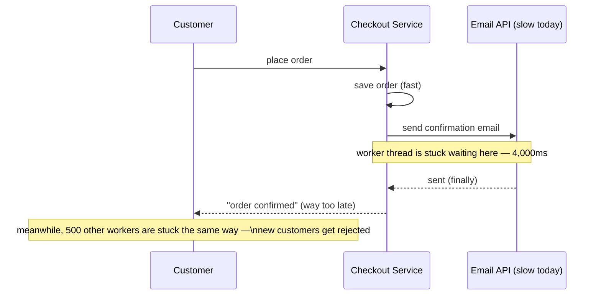

The obvious question: *why does sending an email — something the order doesn't actually need to finish right now — get to break the entire checkout page?* Because the code makes it **synchronous**: it treats "save the order" and "send the email" as one single step that can't finish until both parts are done. If the order itself doesn't need the email to be sent *right this second*, that dependency shouldn't be able to block it at all.

**The fix, and the analogy for the rest of this story:** put a **queue** between the two steps. Think of it as a **surge tank sitting between a fire hose and a garden hose** — the fire hose (checkout) can blast water in bursts, and the garden hose (the email step) drains it out slowly and steadily, on its own schedule. Checkout just drops "send this email" into the tank and immediately tells the customer "success" — it doesn't care how long the email actually takes anymore, or even whether the email service is up right now.

**New problem, already visible in week one:** the fastest thing to build was a plain list living inside the checkout process's own memory — `pending_emails.append(...)`. Six weeks later, during a routine deploy, the checkout service restarts. At that exact moment it's holding **8,200 pending "send email" jobs** in that in-memory list. All 8,200 vanish the instant the process stops. Support tickets about "did my order even go through?" triple the next day.

**How I'd say this in an interview:** "A queue exists to decouple a producer from a consumer — they run at different speeds, and neither should have to wait on the other. But 'a queue' isn't automatically safe — if it's just a list sitting in one process's memory, a crash or a deploy wipes it out completely, and that's the very next thing you have to fix."

---

## Chapter 2 — The logbook that survives the clerk fainting

The fix: before the queue tells the producer "got it," it has to actually **write the message to disk**. QuickCart stands up a single dedicated broker box — think of a basic single-node RabbitMQ setup, a real, documented message broker that does exactly this: durable queues backed by disk.

**The analogy:** picture a mailroom with one clerk and a ledger. Before the clerk says "received," they write your letter's details into the ledger first. If the clerk suddenly collapses, the next clerk just reads the ledger and keeps going from exactly where things left off — nothing is lost, because the *proof* it happened never depended on that one clerk's memory.

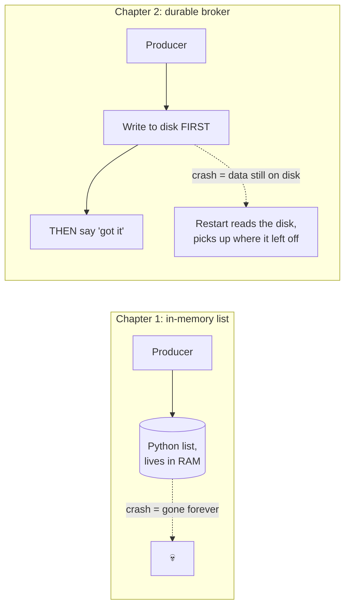

This works. QuickCart deploys 40 more times over the next two years with **zero** messages lost. But the business itself is growing fast — order volume climbs from 300/sec to **3,000/sec**, a realistic 10x over two years for a scaling e-commerce app. QuickCart benchmarks their single broker box and finds it can sustainably write about **2,500 messages/sec** to disk before things start backing up `[illustrative — a stand-in number for "one box's disk has a ceiling," not a real published benchmark]`. At 3,000/sec sustained, the box falls behind by 500 messages every second. After 20 minutes at that rate, the backlog is **500 × 1,200 = 600,000 unsent messages** — confirmation emails and downstream order processing are now running hours late.

The obvious next question: *how do we stop ONE box's disk from being the hard ceiling on our entire system's throughput?* You can't make one disk infinitely fast. So don't rely on one disk — split the work across many.

**How I'd say this in an interview:** "Durability alone — writing to disk before acking — fixes data loss, but it doesn't fix throughput; one machine's disk is always going to have a ceiling. The next move is always the same one you'd make with a database that outgrew one box: split the data across more than one machine."

---

## Chapter 3 — Splitting into lanes, and the lane number that changes underneath you

The fix: instead of one giant log on one machine, split the queue into **N independent ordered logs**, called **partitions**, each living on its own machine. This is exactly what Apache Kafka does — a partition is Kafka's actual unit of both storage *and* parallelism, documented in Kafka's own architecture docs and the original 2011 LinkedIn paper that introduced it. Each order gets routed to a partition using something like `hash(order_id) % N`. QuickCart picks 6 partitions across 6 machines, each handling ~500/sec — comfortably covering the current 3,000/sec.

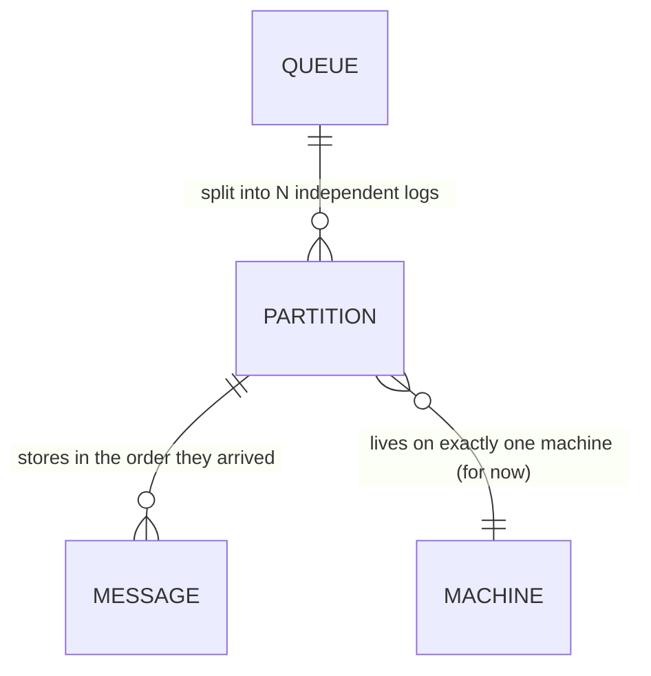

Eight months later, growth continues — 3,000/sec becomes 4,200/sec — and someone adds a **7th** partition/machine to spread the extra load. This is where it quietly breaks. `hash(order_id) % 6` and `hash(order_id) % 7` send the same `order_id` to a *different* partition number for most orders. Concretely: `order_9981`'s first event ("order placed") landed on partition 3 under `%6`. Its *next* event ("payment captured"), sent minutes later after the 7th partition went live, now hashes to a different partition under `%7`. Two events, same order, now sitting in two different partitions — and this system only ever promised order *within one partition*. The very fix that bought more throughput just silently broke "process this order's steps in the order they actually happened," for exactly the orders unlucky enough to straddle the change.

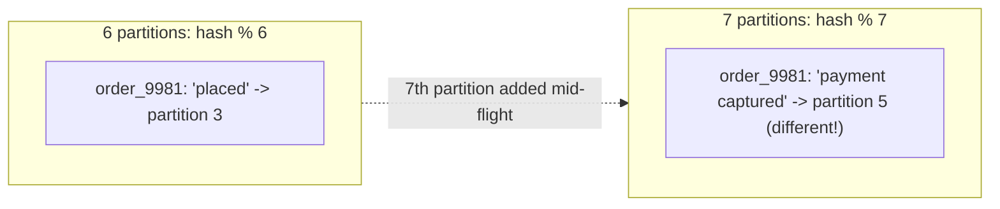

The lesson QuickCart actually needs here isn't a clever new hashing trick — it's a **rule**: decide the partition count up front, with real headroom, and then leave it alone. They pick **60 partitions** (10x current need) once, and commit to never casually changing it again. That's the real answer, and it's the same one Kafka operators actually follow in production.

**New problem, one layer down:** partition *count* is now fixed and safe. But those 60 partitions still have to physically live *somewhere* — on real machines, which fail, get replaced, and get added over time. QuickCart's placement scheme is the same naive trick: `partition_number % num_machines`. That's a completely separate problem from the one just solved, and it breaks the exact same way.

**How I'd say this in an interview:** "Partitioning gives you parallelism, but changing the partition count later silently breaks per-key ordering, because the same key can hash to a different partition. The real answer isn't 'reshard cleverly' — it's pick partition count with headroom once, up front, and treat it as fixed after that."

---

## Chapter 4 — The ring that only loses its neighbors' luggage

Fourteen months later, two of QuickCart's ten broker machines start failing hardware checks, and three new ones are ordered to replace and expand capacity: 10 machines becomes 11. Under `partition_number % 10` versus `% 11`, almost every partition's assigned machine changes overnight. Worked number: going from 10 to 11 remaps roughly **55 of the 60 partitions** — about **92%** of all of QuickCart's queue data would need to be physically copied to a different machine, all at once, just to add a little headroom.

The obvious question: *can we add or remove a machine without reshuffling almost everyone else's data?* Yes — this is **consistent hashing**, the same real, documented mechanism behind Amazon's Dynamo and Cassandra's ring (2007/2008), just applied here to *which machine hosts a partition* instead of *which shard holds a cache key*. Same math, different thing being placed.

**The analogy:** imagine a circular clock face with pegs on it. Every machine claims a spot on the clock (by hashing its own ID). Every partition also lands somewhere on the clock (by hashing its number). A partition is owned by **whichever machine's peg comes next, going clockwise.** Remove a peg, and only its partitions hop to the next peg clockwise — nobody else moves. Add a peg, and it only steals the partitions that now fall in the gap right before it.

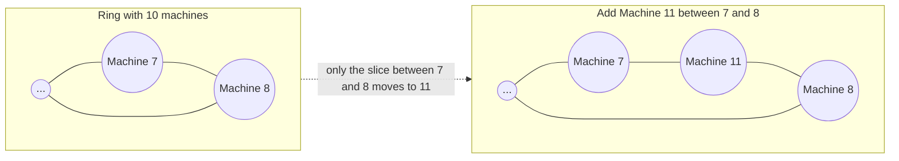

Redo the math on the ring: adding an 11th machine only moves the partitions that fall in its one small slice of the clock — roughly `60 / 11 ≈ 5-6 partitions`, not 55. Same operation, same goal, a fraction of the disruption.

**New problem:** consistent hashing answers *which one machine currently owns partition #37*. It says nothing about what happens if that *one* machine simply dies. A partition still lives on exactly one copy — that's the same disease as Chapter 1's single point of failure, just shrunk down to 1/60th of the system instead of the whole thing. Real number: one machine's disk fails, taking down the 6 partitions it hosted. At 4,200/sec spread over 60 partitions (~70/sec each), that's **~420/sec of order events** with nowhere to go until that data is restored — and if there's no second copy anywhere, whatever was sitting unread on that disk is gone for good.

**How I'd say this in an interview:** "Consistent hashing turns 'add a machine' from 'remap almost everything' into 'remap the one slice near it' — exactly the trick Dynamo and Cassandra ship. But it only solves *placement*. It says nothing about what happens when the one machine holding a partition just dies, and that's a completely separate problem — durability, not placement."

---

## Chapter 5 — Three copies, and how long you wait for them to agree

The fix: don't keep one copy of each partition — keep **three**. One **primary**, two **replicas**. The interesting design question isn't "should we replicate," it's: *when does the primary tell the producer "got it" — the instant it writes locally, or only after the replicas have it too?* This is a real spectrum, not a yes/no switch, and Kafka's own `acks=all` with `min.insync.replicas` setting is the documented, real-world version of exactly this dial.

- **Async**: primary writes locally, acks the producer immediately, replicates in the background. Fastest. If the primary dies one millisecond later, that write never made it anywhere else — gone.
- **Sync-all**: primary waits for *every* replica to confirm before acking. Safest. But you're only as fast as your slowest replica.
- **Quorum**: primary waits for a *majority* (primary + 1 of 2 replicas, here) before acking. Middle ground — survives losing either the primary or the slow replica, without waiting on the slow one.

Worked number: replica A is close and acks in **1ms**; replica B is a bit further away and acks in **40ms**. Sync-all makes *every single write* wait the full 40ms. Quorum only needs the primary plus one replica — it takes A's 1ms and moves on, roughly **40x faster** in this case, while still surviving the loss of either the primary or the slow replica B.

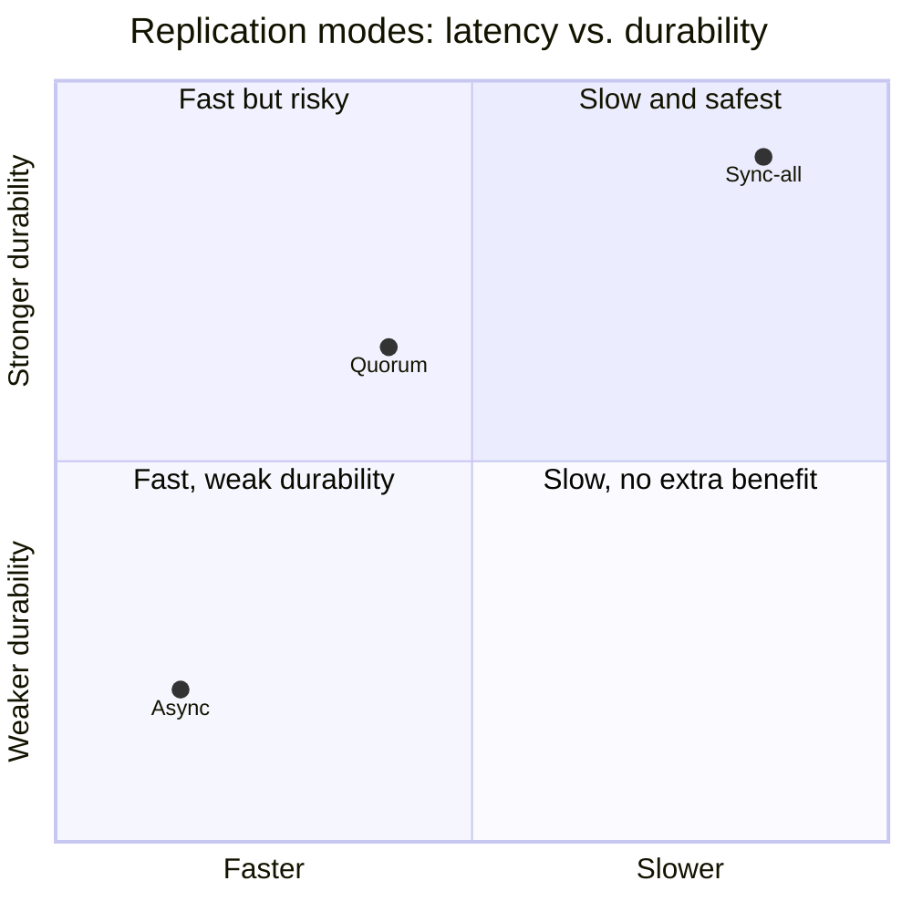

QuickCart picks quorum as the default — the same choice most production Kafka setups make with `acks=all` and `min.insync.replicas=2` of 3.

**New problem:** replication protects the *data*. It says nothing about who's currently *in charge* of a partition. One afternoon, a brief network blip makes the primary for partition #12 look unreachable for a few seconds. A replica gets promoted to take over. Then the blip clears, and the *old* primary comes back online, still fully convinced it's the primary — because nobody told it otherwise. Now **two machines both think they own partition #12** and both start accepting writes. Two different "payment captured" events for what should be one ordered stream land on two disagreeing copies, and nobody notices until the day's numbers don't reconcile.

**How I'd say this in an interview:** "Replication mode is a durability-versus-latency dial, not a fixed property of 'the queue' — quorum is almost always the right default because it's most of sync-all's safety at close to async's speed. But replication alone doesn't answer 'who's in charge right now,' and that's a genuinely separate, harder problem — split-brain."

---

## Chapter 6 — The badge number that expires the moment your manager changes

The fix: a small, separate coordinator tracks exactly one "current owner" per partition, using an ever-increasing number called an **epoch** (or term). This is a real, documented pattern — older versions of Kafka used **ZooKeeper** for this controller-election job; newer Kafka versions replaced it with a built-in Raft-based system called **KRaft** (a real, documented migration Kafka's project actually made). Every write has to carry the *current* epoch number. If the old primary from Chapter 5 comes back and tries to write using its old, now-stale epoch, the replicas reject it outright — this rejection mechanism is called **fencing**.

**The analogy:** every time there's a change of manager, the company reissues everyone's ID badge with a new badge number. An old badge — even in the hands of someone who genuinely used to be the manager — simply doesn't open the door anymore, whether or not that person has realized the change happened yet.

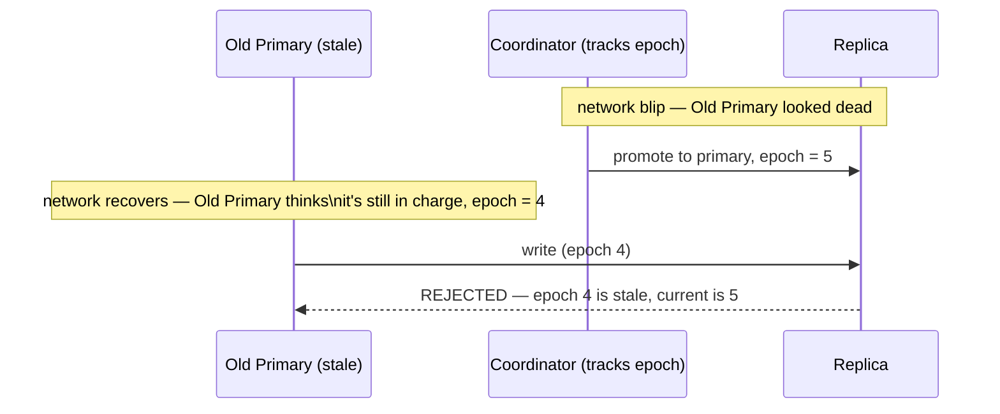

This closes the producer-side problem for good — writes are now safe from double-primary confusion. But notice: every fix so far — durability, partitioning, placement, replication, fencing — has been about **getting messages safely stored.** Nothing yet has touched the other half of this system: the **consumers**, the processes actually reading messages back out and doing real work — sending the email, charging the card. Right now, QuickCart's broker just fires every new message at whichever consumer process happens to be connected, the instant it arrives.

**How I'd say this in an interview:** "Fencing with an epoch number is the standard fix for split-brain — an old, stale leader's writes get rejected because they carry an outdated epoch, the same badge-number idea behind Kafka's move from ZooKeeper to its own Raft-based KRaft controller. That closes the write side. The read side — consumers — is a whole separate set of problems, starting with the fact that the broker's been pushing, not letting consumers pull."

---

## Chapter 7 — The firehose pointed at whoever happens to be standing there

QuickCart's order-processing consumer occasionally gets slow — its own downstream database gets busy sometimes — but the broker has **no idea**. It keeps pushing new messages at that consumer regardless, the same push model RabbitMQ's `basic.consume` uses by default (a real, documented behavior). Worked number: the broker keeps firing **900 msgs/sec** at a consumer that, right now, can only actually *finish* 300/sec. The undelivered backlog piles up **inside the consumer's own memory** — 600 unfinished messages every second — and after a couple of minutes, the consumer itself runs out of memory and crashes, potentially losing track of everything it was still holding.

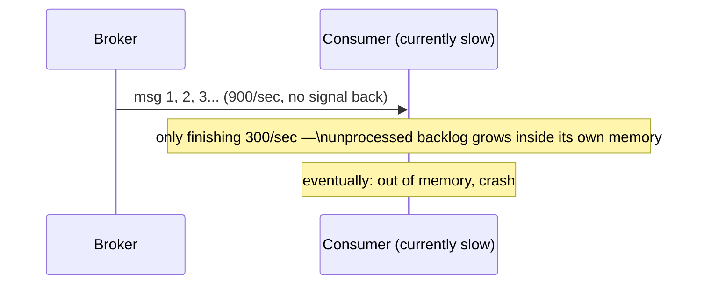

The obvious question: *why is the broker allowed to just keep firing at a consumer that's clearly falling behind?* Because push gives the *broker* control of the pace, and the broker has no visibility into how busy the consumer actually is.

**The fix:** flip it — the consumer **asks** for work only when it's ready, instead of having work forced on it. This is **pull**, and it's the dominant real-world pattern at scale for exactly this reason: Kafka consumers call `poll()`, Amazon SQS consumers call `ReceiveMessage` — both real, documented APIs, both pull. Add **long polling** on top (hold the request open for a few seconds instead of hammering with empty asks every 100ms) so pull doesn't waste money on mostly-empty round trips.

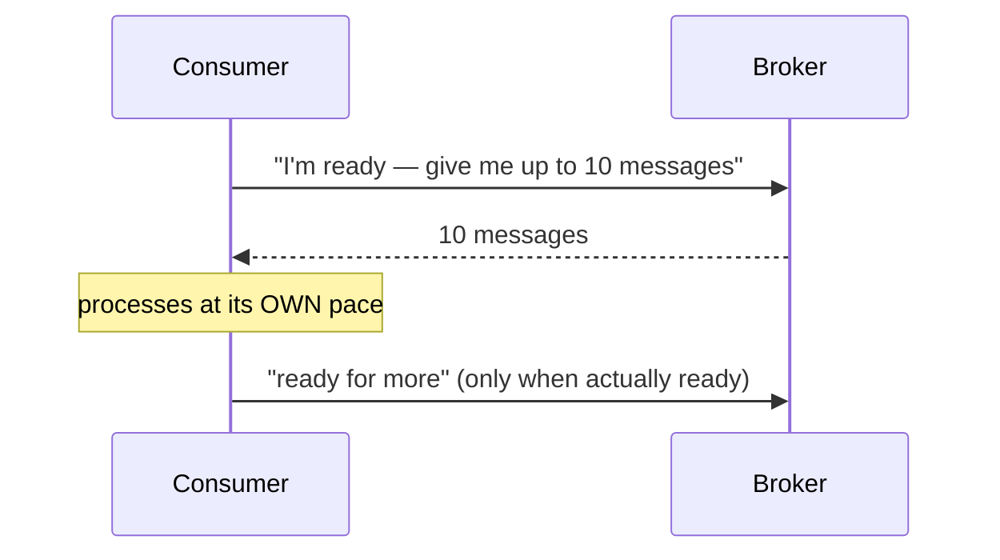

**New problem:** pull fixes "the broker steamrolls one slow consumer." But there's still only **one** consumer process pulling from all 60 partitions, and it can only manage ~300 msgs/sec. Total demand is now **4,200/sec**. One polite, well-paced consumer is still about **14x too slow** — asking nicely doesn't add capacity.

**How I'd say this in an interview:** "Push has no backpressure — the broker can overrun a slow consumer with no signal either way. Pull fixes that because the consumer controls its own pace, which is exactly why Kafka's `poll()` and SQS's `ReceiveMessage` both work this way. But pull alone doesn't add throughput — for that you need more consumers working in parallel, which is the next problem."

---

## Chapter 8 — Handing out numbered folders, one per teammate

The fix: run **many** consumer processes as one team — a **consumer group** — and let the broker hand out partitions so that each partition is read by **exactly one** consumer in that group at a time. This is exactly what Kafka's real consumer-group mechanism does, and it's documented behavior, not an inference.

Worked number: 4,200 msgs/sec demand ÷ ~300 msgs/sec per consumer ≈ **14 consumers needed**. Because QuickCart built with 60 partitions of headroom back in Chapter 3, adding 14 consumers is easy — each one just gets handed roughly 4 partitions to drain in parallel, and throughput is covered.

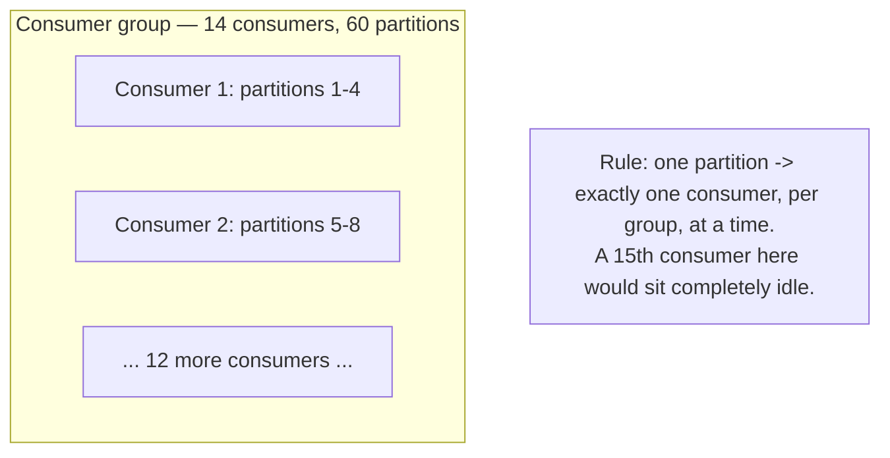

**The rule worth saying out loud:** `#consumers ≤ #partitions` for full parallelism. A 15th consumer added on top of 60 fully-assigned partitions just... sits there, doing nothing, because there's nothing left to hand it.

**New problem, 18 months later:** on-call gets paged. One specific consumer, mid-way through processing a message — charging a customer's card — just **hangs**. No crash, no error. Maybe the payment provider itself is having a bad day (an echo of Chapter 1, one layer deeper in the stack). Nothing has been tracking "this message is currently checked out and might not come back" — as far as the broker knows, that message was handed out and that's the last it heard.

**How I'd say this in an interview:** "Consumer groups are how you actually scale reading, not just writing — one partition per consumer at a time, so partition count is your real ceiling on parallelism, and you plan for that up front. The failure mode that shows up next isn't about throughput anymore, it's about correctness: what happens when a consumer holding a message just disappears mid-work."

---

## Chapter 9 — The message that came back too early, and got processed twice

The fix: the broker doesn't delete a message the moment it hands it out. Instead, the message becomes **invisible** for a set number of seconds — a **visibility timeout.** If the consumer explicitly says "I'm done" within that window, the message is deleted for good. If it doesn't — because it crashed, hung, or is just slow — the message quietly reappears for someone else to try.

Concrete numbers, and a real bug this exact mechanism causes: visibility timeout is set to **30 seconds**. This particular payment job takes **45 seconds** to finish.

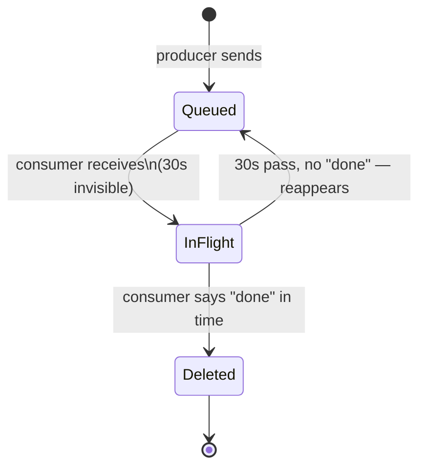

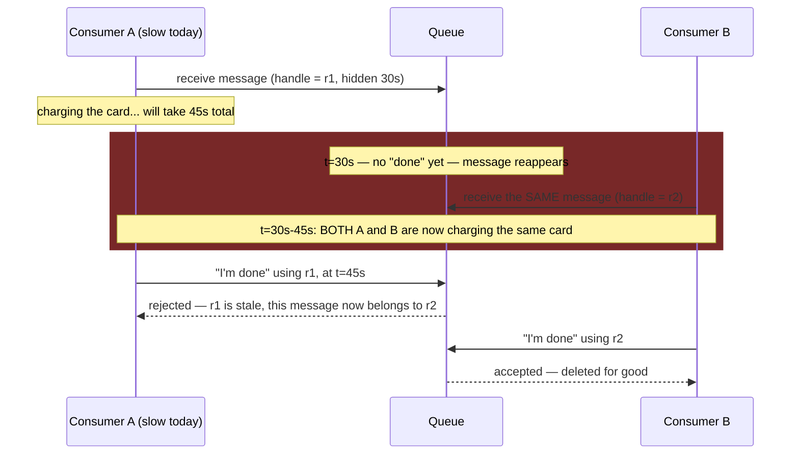

Notice: this happened with **no crash at all** — A was just slower than the timeout. Both A and B genuinely tried to charge the same card. If the card-charging logic doesn't specifically guard against this, the customer gets **charged twice.**

**The real fix isn't the receipt-handle rejection alone** (which only stops A's *late reply* from confusing the system) — it's making the charge itself **idempotent**, keyed on something like `payment_id`, not on which delivery attempt it was. Before charging, check "have I already successfully charged this exact `payment_id`?" If yes, skip the charge and just report success. Now even Consumer B, arriving second, does nothing harmful.

**New problem, stated as an honest cost:** this fix doesn't remove the possibility of a message being handled more than once — it accepts it as permanent, normal behavior ("at-least-once delivery") and pushes the responsibility onto every single consumer to be safe against duplicates. That's not a one-time fix; it's an ongoing tax every future piece of consumer code has to pay.

**How I'd say this in an interview:** "Visibility timeout is what makes at-least-once delivery safe from a crashed consumer, but it can also cause two consumers to process the same message *without* a crash — just a slow one. The fix isn't the timeout itself, it's making the side effect idempotent, keyed on a business ID like `payment_id`, not the message ID — because the message ID changes on every redelivery."

---

## Chapter 10 — The one bad letter that keeps coming back

Separately, a different bug shows up: one specific order has a corrupted field, and it crashes the parsing code every single time *any* consumer tries to process it. Thanks to Chapter 9's own visibility timeout, this broken message just keeps reappearing every 30 seconds, forever — retried infinitely, taking up a consumer's slot each time, and slowing down every legitimate message stuck behind it in that partition.

The obvious question: *how do we stop one permanently-broken message from jamming the line forever?* Two parts to the fix. First, **exponential backoff** — don't retry instantly every 30 seconds forever; wait longer each time (1s, 2s, 4s...) so a struggling downstream gets breathing room instead of getting hammered. Second, a **hard cap** — after, say, 5 failed attempts, stop retrying and move the message to a separate **Dead Letter Queue (DLQ)**, then page a human instead of trying forever.

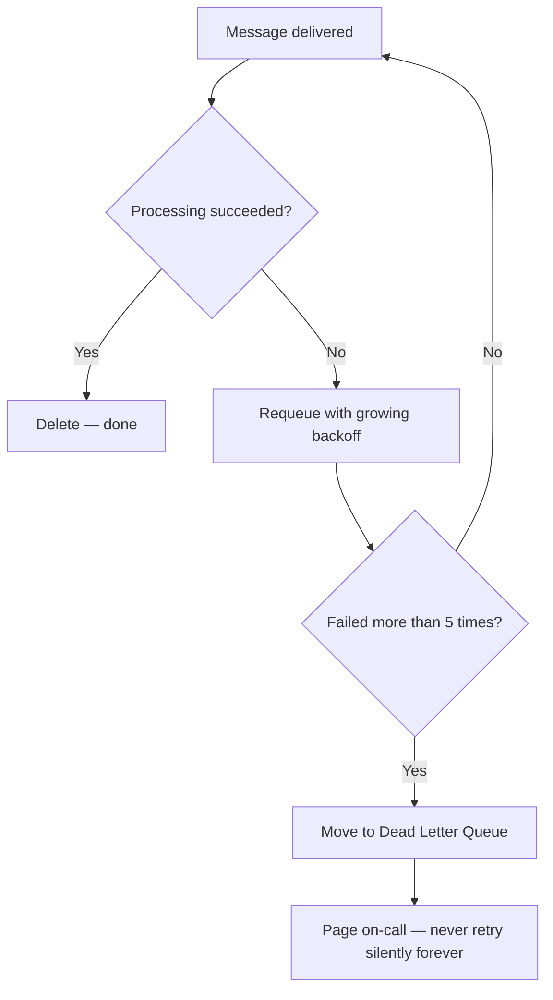

This closes the loop: a single bad message can no longer block the system indefinitely. It gets quarantined, visibly, instead of quietly stealing capacity from everyone else forever.

**How I'd say this in an interview:** "A poison message shouldn't be retried instantly forever, and it shouldn't be silently dropped either — the standard pattern is capped exponential backoff, then a dead-letter queue with an alert. The DLQ's whole job is making 'we gave up' a visible event instead of an invisible one."

---

## Chapter 11 — The one kind of event that isn't allowed to arrive out of order

A new problem shows up — not from load this time, but from a planning meeting. Finance says: *"for a single order, if the refund event gets processed before the payment-capture event is confirmed, we can accidentally double-refund someone."* QuickCart's current ordering is **best-effort** — messages usually come out roughly in the order they were sent, within a partition, but it's not a hard guarantee, and it's definitely not guaranteed *across* the different consumers all working in parallel.

The obvious question: *do we make the whole system strictly ordered, then?* No — that would collapse every bit of parallelism earned since Chapter 3, forcing roughly one event at a time through the entire pipeline. Instead, the fix is scoped to just the traffic that actually needs it: pin every event for the *same* `order_id` to always land in the same partition/group and be handled strictly one-at-a-time, in send order. This is the real, documented shape of Amazon SQS's **FIFO queue** type — a separate queue option, chosen once, that trades throughput and parallelism for strict order, only for the traffic assigned to it.

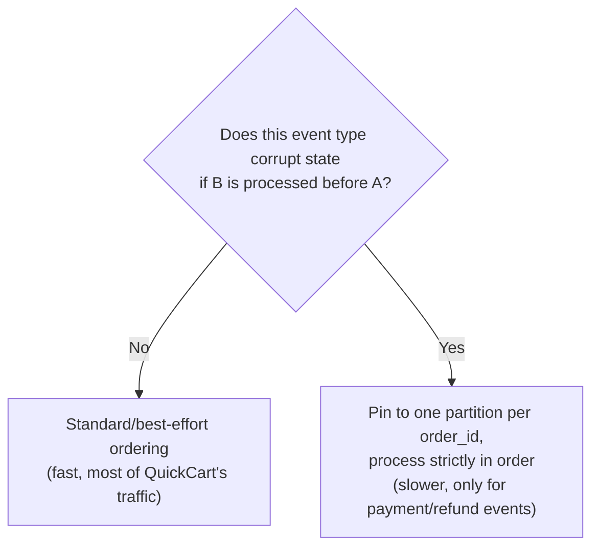

QuickCart ends up with **both**, side by side: best-effort, highly parallel handling for the vast majority of events (emails, analytics, notifications), and a strict, ordered lane just for the payment/refund state machine. This is exactly the real trade-off Kafka's own design makes at the largest scale — order is only ever promised *within one partition*, never across a whole topic, because promising more would kill the parallelism the entire system was built around.

**How I'd say this in an interview:** "Strict ordering and horizontal scale are directly in tension — you don't pick one for the whole system, you scope strict ordering down to the specific key where getting the order wrong actually breaks correctness, and leave everything else best-effort. That's the same shape as SQS offering FIFO as an opt-in queue type instead of making every queue FIFO."

---

## Where the story actually lands

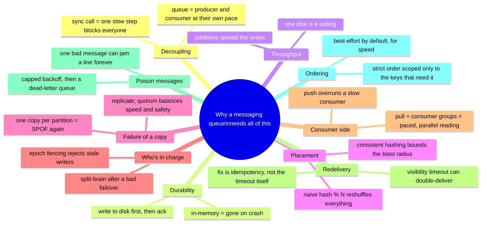

Every real production queue you'll design in an interview sits *somewhere* on this chain. The skill isn't reciting all eleven chapters — it's stopping where the stated requirements say to stop. A notification system with tolerant staleness might reasonably stop around Chapter 8. A payments pipeline that can't double-charge anyone has to reach Chapter 9, 10, and 11. If nobody's mentioned strict ordering, walking all the way to Chapter 11 unprompted reads as padding, not depth.

---

## Grill me — adversarial follow-ups

**Q1: "Why not just make the checkout service's thread pool bigger instead of adding a whole queue?"**
Because that only buys you a little headroom — the moment the downstream call gets slow *enough*, you run out of threads again, just later. It doesn't fix the actual coupling: checkout's success still depends on an unrelated service being fast, no matter how big the pool is. A queue removes that dependency entirely instead of just delaying when it bites.

**Q2: "Walk me through exactly what happens when a partition's primary machine dies mid-write."**
If the write hadn't been acknowledged yet, the producer's retry (with a stable dedup ID) is safe and just resends it. If it *had* been acknowledged under quorum, it's already durable on at least one surviving replica, so the coordinator promotes that replica and fences the old primary's epoch — a brief unavailability window, not silent data loss.

**Q3: "Doesn't partitioning just move Chapter 1's single-point-of-failure problem down to 60 smaller single points of failure?"**
Yes, exactly — that's precisely the problem Chapter 4 and 5 exist to name and fix. Partitioning alone only buys throughput; it takes replication, one primary plus quorum-acked replicas, to actually close that gap.

**Q4: "Why does quorum need a majority — why not just 'any one replica' acking?"**
Because "any one" doesn't guarantee that replica overlaps with whichever replica gets picked to fail over to later — you could ack on replica A, lose the primary, promote replica B, and B never had that write. A majority guarantees any two quorums always share at least one node in common, which is what makes the promoted replica provably have the latest acknowledged data.

**Q5: "You said pull is strictly better than push — isn't push at least lower latency?"**
It can be, slightly — push sends the instant data exists, pull waits for the next ask. But that small latency win isn't worth losing backpressure entirely; a broker that can't tell when a consumer is falling behind will eventually overrun it, which is worse than a few extra milliseconds of polling delay. Long polling closes most of that latency gap anyway.

**Q6: "If visibility timeout can cause double-processing even without a crash, isn't the timeout just broken?"**
It's not broken, it's a deliberate trade-off — you're choosing "maybe process twice" over "maybe lose the message forever if a consumer genuinely dies," and there's no way to know in advance which case you're in. The real fix isn't picking a "perfect" timeout value, it's making the underlying operation idempotent so a duplicate is harmless either way.

**Q7: "Why not just make every queue in the system FIFO — wouldn't that avoid the ordering bug entirely?"**
It would avoid it, but you'd pay FIFO's throughput and parallelism ceiling on every single message type — including the 90%+ that never needed strict order, like notification emails or analytics events. The right call is asking, per event type, whether out-of-order processing actually corrupts state, and only paying the FIFO cost where the answer is yes.

**Q8: "Your Chapter 6 fencing fix relies on a coordinator service — isn't that just a new single point of failure?"**
Fair pushback — and the real answer is that the coordinator itself has to be a small, highly-available cluster with its own consensus, which is exactly what ZooKeeper (and Kafka's newer KRaft) actually are. It's not "one more box that can die," it's "push the one genuinely hard consistency problem into a single, purpose-built, well-tested system" instead of solving split-brain ad hoc in every producer and consumer.

**Q9: "Given this whole story, if someone just says 'design a messaging queue' cold, where do you actually start?"**
Say the two things that decide almost everything downstream out loud first: is this point-to-point or does it need to fan out to multiple subscribers, and is best-effort ordering with at-least-once delivery acceptable, or does something specific need strict order or exactly-once. Then walk forward only as far as those answers require — durability and partitioning are close to a given, but leases, FIFO, and DLQs are things you earn by naming a specific requirement, not defaults you bolt on for their own sake.

---

## Pacing note

**If this is 60 seconds inside a bigger question:** say the surge-tank line — a queue lets a fast producer and a slow consumer run at their own pace — then say "durable, partitioned, replicated with quorum, consumers pull in groups, and I'd handle ordering and duplicate-delivery as deep-dives if you want to go there." That's the whole shape in one breath.

**If this is the whole 15-20 minute focus:** walk the chapters in order — why a queue exists at all, durability, partitioning for throughput, consistent hashing for placement, replication and quorum, split-brain and fencing, push vs. pull, consumer groups, visibility timeout and idempotency, poison messages and the DLQ, then ordering if it comes up. Don't walk all eleven unprompted — follow wherever the interviewer's questions actually point, and use the skipped chapters as your "if I had more time" closer.

---

## Active recall — no answers, test yourself cold

1. What's the one-sentence reason a messaging queue exists at all?
2. Why did QuickCart's in-memory queue lose 8,200 messages, and what's the one-line fix?
3. Why does adding a 7th partition to a `hash(order_id) % 6` scheme silently break per-order ordering?
4. What's the actual difference between what Chapter 3's fix solves and what Chapter 4's consistent hashing solves?
5. Order the three replication modes from fastest/least-safe to slowest/safest, and say which one is the usual production default.
6. What specific bug does fencing with an epoch number prevent?
7. Why does pull give you backpressure "for free" in a way push can't?
8. What's the hard rule connecting partition count and consumer count in one consumer group?
9. Walk through the exact sequence that causes two consumers to process the same message with no crash involved.
10. Why is the fix for that "process it twice" bug idempotency, not a smarter timeout?
11. What's the difference between what a visibility timeout fixes and what a dead-letter queue fixes?
12. Why doesn't QuickCart make the entire system strictly ordered once Finance asks for it on refunds?

*Spaced repetition: test this list today, again in 2-3 days, again in a week.*

---

## Cheat sheet — one line per stop on the story

- **Sync call between services**: one slow, unrelated step can block the entire request — the whole reason a queue exists.
- **Durable broker**: write to disk before acking the producer, so a crash can't erase what was already accepted.
- **Partitioning**: split one log into many independent ones for throughput — but changing partition count later silently breaks per-key ordering, so pick the count with headroom, once.
- **Consistent hashing**: places partitions on physical machines so adding/removing one only moves its neighbor's slice — same ring trick used for cache sharding, applied to a different kind of data.
- **Replication (quorum)**: durability/latency dial — async is fastest and riskiest, sync-all is safest and slowest, quorum (majority ack) is the default production balance.
- **Epoch fencing**: stops a stale, recovered old primary from silently accepting writes after a failover — an old badge number just stops opening the door.
- **Push vs. pull**: push has no backpressure and can overrun a slow consumer; pull lets the consumer set its own pace, which is why Kafka and SQS both use it.
- **Consumer groups**: one partition, one consumer per group, at a time — partition count is the hard ceiling on parallel consumption.
- **Visibility timeout**: makes at-least-once delivery safe from a dead consumer, but can double-deliver to a merely slow one — the real fix is an idempotent side effect keyed on a business ID, not the message ID.
- **Backoff + dead-letter queue**: caps retries so one broken message can't jam a line forever, and makes "we gave up" a visible, alertable event.
- **Scoped strict ordering (FIFO)**: pin only the traffic that truly needs strict order to one partition/group — never make the whole system strictly ordered just because one feature needs it.
- **The meta-lesson**: every fix in this story buys one property (decoupling, durability, throughput, cheap resizing, safety-of-copy, correctness-of-owner, backpressure, parallel reads, safe redelivery, quarantine, or order) by spending a different one — say the trade in the same sentence you propose the fix.
