# Distributed Messaging Queue — FAANG Interview Guide

> **Enhancement notes (this pass):** this pass focused on live-delivery skills and cross-topic transfer the previous version didn't cover, plus a full numeric/citation confidence audit. Everything from the prior pass — the mental model, Requirements/API Design sections, the v1→v2→v3 architecture evolution, the FIFO-vs-Standard table, the worked send→receive→process→delete redelivery diagram, the message-lifecycle state diagram, and the poison-message/DLQ flowchart — was already strong and is preserved, not rewritten.
> - **Relocated** "How to Identify This Topic in an Interview" from near the end up to right after the Big Picture mindmap (it was previously buried after Real-World Systems, long after you'd need it), and added a **disambiguation table** against the topics this gets confused with (distributed cache, pub-sub broadcast, workflow orchestration, stream processing, rate limiter).
> - Added **"Full-Interview Pacing Script"** — what to say in the first 60 seconds, a minute-by-minute plan for a 45-minute loop, and an explicit contingency for "interviewer redirects you away from your planned deep-dive at minute 15."
> - Added a **"Two-Sentence Version"** callout to every major deep-dive section — shorter and more compressed than the pacing script's 60-second opener, for when the interviewer only gives you a breath before moving on.
> - Added an **end-to-end trace** — "Priya's payment event at 3:00:00 PM" — walking one message through every layer (load balancer → front-end dedup → metadata cache → partition primary → quorum replication → consumer pickup → visibility timeout → ack, plus the DLQ branch on repeated failure) with realistic per-hop timings.
> - Added explicit **"same shape as"** cross-references to the CDN (push/pull), Distributed Cache (consistent hashing, replication latency/durability dial), and Sequencer (primary + failover replica) guides — the point is transfer between topics, not just internal consistency.
> - Added **Anti-Patterns / Red Flags**, **Adversarial Q&A** (15 interviewer-pushback questions, including two that challenge this guide's own trade-offs and one that poses a wrong premise to correct), and an **Active Recall Drill** (15 cover-the-answer prompts + a spaced-repetition note).
> - Ran a **number-confidence labeling pass** over the entire document: `[say cold]` marks a figure that follows deterministically from a stated spec/formula (safe to state as fact); `[illustrative/approx]` marks a reported, measured, or estimated figure (state with a hedge, "roughly"/"on the order of"). Also flagged confidence on named-system claims (Kafka, SQS, Kinesis, Pulsar, Pub/Sub internals) as well-documented public information vs. plausible inference where AWS/Google don't publish internals.

## Mental Model

A messaging queue is a **surge tank between a fire hose and a garden hose**. The producer can spray messages in bursts; the consumer drains them at its own steady rate. The queue is the buffer that absorbs the mismatch so neither side has to match the other's speed, and neither side has to know the other exists.

Two purely different plumbing shapes hide behind the word "queue" in interviews — keep them separate from the first sentence you say:

- **Point-to-point (queue)**: one message, **one** consumer eats it. Mailroom with numbered pigeonholes — a letter is removed once picked up. (SQS, ActiveMQ, Kafka-with-single-consumer-group.)
- **Publish-subscribe (topic/log)**: one message, **every** subscriber gets a copy. Radio broadcast — the signal doesn't disappear because one listener tuned in. (SNS, Kafka topics with multiple consumer groups, Google Pub/Sub.)

Everything else in this guide — ordering, replication, delivery semantics — is about making that buffer **durable** (survives crashes), **scalable** (grows past one machine), and **available** (keeps working when a node dies) without giving up too much throughput.

**Two-sentence version** (for when the interviewer only gives you a breath before moving on): *"A messaging queue is a durable, partitioned buffer that decouples producers from consumers in time, space, and speed — point-to-point means one consumer eats each message, pub-sub means every subscriber gets a copy. The hard parts are ordering (best-effort vs. strict), delivery guarantee (at-least-once by default), and durability (replication mode) — everything else is engineering around those three."*

---

## Big Picture — Everything in One Glance

Look at this once before you dive into details. Every branch below is a section in this guide — if you can redraw this from memory, you can reconstruct the whole topic under pressure.

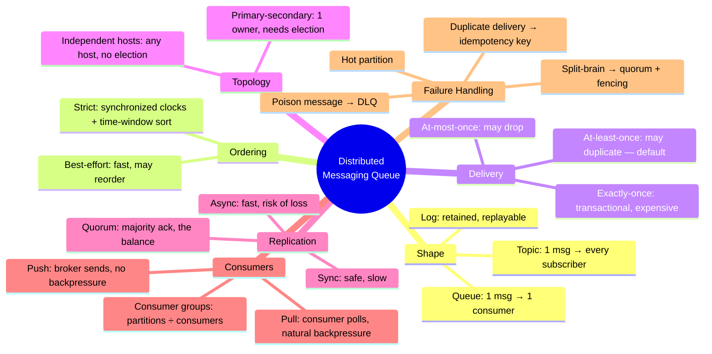
```mermaid
mindmap
  root((Distributed<br/>Messaging Queue))
    Shape
      Queue: 1 msg → 1 consumer
      Topic: 1 msg → every subscriber
      Log: retained, replayable
    Ordering
      Best-effort: fast, may reorder
      Strict: synchronized clocks + time-window sort
    Delivery
      At-most-once: may drop
      At-least-once: may duplicate — default
      Exactly-once: transactional, expensive
    Topology
      Primary-secondary: 1 owner, needs election
      Independent hosts: any host, no election
    Replication
      Async: fast, risk of loss
      Sync: safe, slow
      Quorum: majority ack, the balance
    Consumers
      Push: broker sends, no backpressure
      Pull: consumer polls, natural backpressure
      Consumer groups: partitions ÷ consumers
    Failure Handling
      Hot partition
      Poison message → DLQ
      Duplicate delivery → idempotency key
      Split-brain → quorum + fencing
```

---

## 🆕 How to Identify This Topic in an Interview

Watch for these phrases — they're signals the interviewer wants queue internals, not just "use SQS":
- "Design a system that must survive a downstream service being slow or down"
- "How would you decouple X from Y"
- "Design Kafka / SQS / a notification pipeline / an order-processing pipeline"
- "Messages must be processed in order" → they want the ordering trade-off discussion
- "A consumer might crash mid-processing" → they want visibility-timeout / offset / DLQ discussion
- "We can't lose any messages, ever" → they want durability + replication + at-least-once discussion
- "We need to fan a single event out to five downstream services" → pub-sub, not point-to-point
- "How do you add consumers to process faster" → they want consumer groups + partition-count-is-the-ceiling
- "How do you avoid overwhelming a slow consumer" → they want push vs. pull / backpressure
- "How durable is durable" → they want sync vs. async vs. quorum replication, not just "we replicate it"

**Disambiguation — the topics this gets confused with, and the tell that separates them:**

| Confused with | The actual difference | The tell in the prompt |
|---|---|---|
| **Distributed cache** | A cache is a disposable, low-latency accelerator with no ordering or delivery guarantee; a queue's entire job is guaranteeing every message is eventually delivered and processed, ordering included. | "Sub-millisecond reads, reduce DB load" → cache. "Don't lose this work, process it once, eventually" → queue. |
| **Pub-sub broadcast (topic)** | Same underlying mechanics (partitions, replication) but a different fan-out contract: a queue removes a message after one consumer eats it; a topic keeps delivering an independent copy to every subscriber. | "Every downstream service needs to react to this event" → topic, not a plain queue — see Queue vs. Topic vs. Log below. |
| **Workflow orchestration** (Temporal, Step Functions, Airflow) | A queue moves *data* between independent stages; an orchestrator tracks the *state machine* of one multi-step business process (retries, compensating actions, human approval) across those stages. | "This step must run only after that step succeeds, and we need to see where a specific order currently is in the process" → orchestration, usually built *on top of* queues, not a queue question itself. |
| **Stream processing** (Kafka Streams, Flink, Spark Streaming) | A queue/log is the storage-and-transport layer; stream processing is continuous computation *over* that log (windowed aggregation, joins, stateful transforms). | "Compute a rolling average / join two streams / detect an anomaly as events arrive" → a stream-processing question sitting on top of a log you'd still design the same way. |
| **Rate limiter** | Both often sit in front of a downstream service and use counters/buffers, but a rate limiter's job is rejecting excess requests, not guaranteeing eventual delivery of every one. | "Cap requests per user/IP" → rate limiting, even if it's implemented with a queue-shaped structure internally. |

> **Say this explicitly** if the prompt is ambiguous between queue and topic: *"Is this one consumer processing each event exactly once, or do multiple independent services each need their own copy of every event?"* — that answer alone decides point-to-point vs. pub-sub before you draw anything.

**Two-sentence version**: *"If the prompt says 'don't lose this work, process it once, maybe out of order' with one logical consumer role, it's a point-to-point queue. If it says 'every downstream service needs to react independently to the same event,' it's pub-sub/topic — same replication and partitioning mechanics underneath, a different fan-out contract on top."*

---

## Interview Playbook

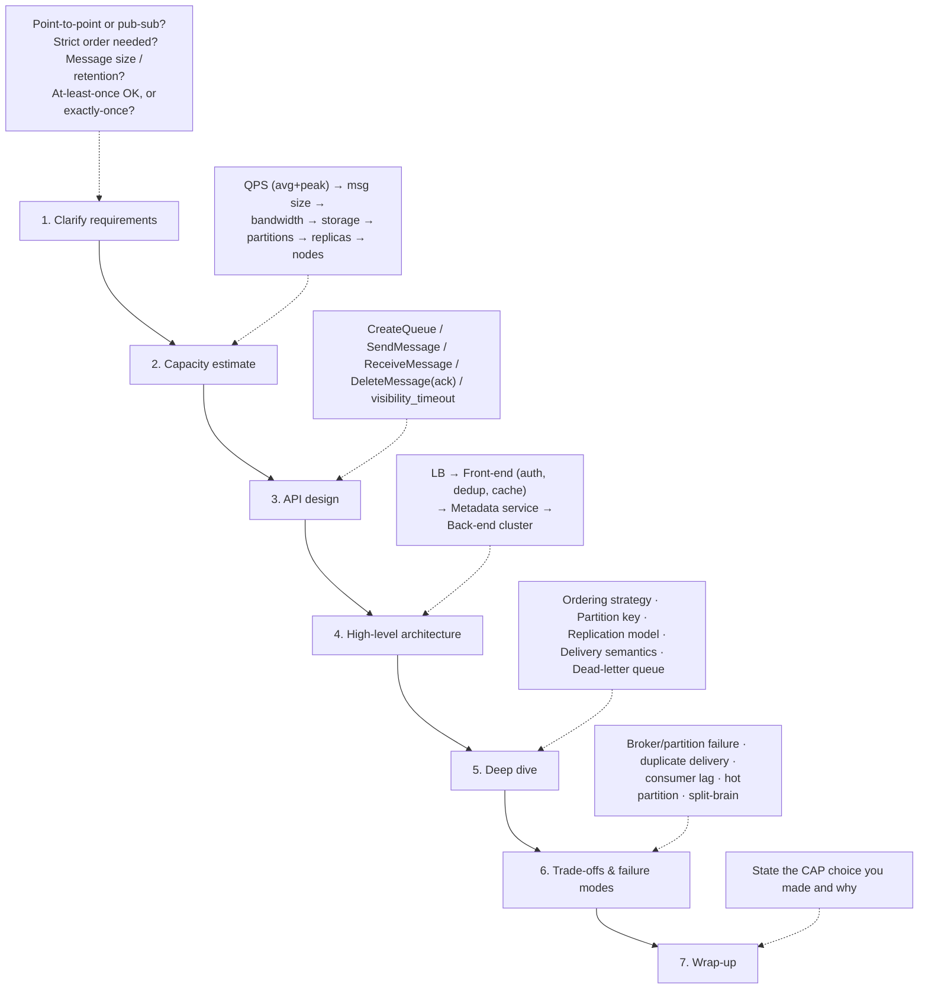
```mermaid
flowchart TD
    A[1. Clarify requirements] --> B[2. Capacity estimate]
    B --> C[3. API design]
    C --> D[4. High-level architecture]
    D --> E[5. Deep dive]
    E --> F[6. Trade-offs & failure modes]
    F --> G[7. Wrap-up]

    A1["Point-to-point or pub-sub?
    Strict order needed?
    Message size / retention?
    At-least-once OK, or exactly-once?"] -.-> A
    B1["QPS (avg+peak) → msg size →
    bandwidth → storage → partitions → replicas → nodes"] -.-> B
    C1["CreateQueue / SendMessage /
    ReceiveMessage / DeleteMessage(ack) /
    visibility_timeout"] -.-> C
    D1["LB → Front-end (auth, dedup, cache)
    → Metadata service → Back-end cluster"] -.-> D
    E1["Ordering strategy · Partition key ·
    Replication model · Delivery semantics ·
    Dead-letter queue"] -.-> E
    F1["Broker/partition failure · duplicate delivery ·
    consumer lag · hot partition · split-brain"] -.-> F
    G1["State the CAP choice you made and why"] -.-> G
```

**Say it out loud in this order.** Interviewers actively listen for #1 and #5 — jumping straight to "I'll use Kafka" without stating what ordering/delivery guarantee you actually need is the single most common way candidates lose points on this topic. See the pacing script below for exactly what to say, minute by minute.

---

## 🆕 Full-Interview Pacing Script

A time-budget table tells you *how much* time per phase; this section tells you *what to actually say*, minute by minute, and what to do when the plan breaks — because the realistic failure mode in these interviews is not running out of material, it's losing the thread when the interviewer steers you somewhere you didn't plan for.

### The first 60 seconds

Say, roughly, in this order:
1. Restate the problem in one sentence to confirm scope: *"So we're designing a durable, asynchronous buffer between \[the producer\] and \[the consumer\] — is that the right framing, and does this need to fan out to multiple independent subscribers, or is it one consumer role eating each message?"*
2. Ask 2-3 clarifying questions before saying anything about design — point-to-point or pub-sub? Strict ordering needed for any key? Is at-least-once acceptable, or must it be exactly-once? (Full list in Requirements below.)
3. State the one-sentence mental model out loud: *"At its core this is a surge tank between a fire hose and a garden hose — the hard parts are ordering, delivery guarantee, and durability."* This tells the interviewer you already have the shape of the answer before you've drawn a single box, which is itself a strong opening signal.

### Minute-by-minute plan (45-minute loop) `[illustrative/approx — adjust proportionally for a 30- or 60-minute slot]`

| Minutes | What's happening |
|---|---|
| 0–5 | Requirements — point-to-point vs. pub-sub, ordering scope, delivery guarantee, retention, message size cap |
| 5–12 | Capacity estimate — full formula chain out loud (QPS → bandwidth → storage → partitions → nodes), plug in numbers |
| 12–17 | API design — `SendMessage` / `ReceiveMessage` / `DeleteMessage`, the receipt_handle-vs-message_id safety detail |
| 17–24 | High-level design — narrate v1 → v2 → v3, naming what breaks at each step |
| 24–38 | Deep dive — pick 2-3: partitioning/consistent hashing, replication mode, ordering strategy, push vs. pull, DLQ |
| 38–43 | Trade-offs & failure modes — CAP stance, what you'd volunteer unprompted (hot partition, poison message, duplicate delivery) |
| 43–45 | Wrap-up — "if I had more time" line naming cross-region replication and schema evolution |

### Contingency: interviewer redirects you at minute 15

This is the realistic failure mode, so have a script for it, not just an intention. When it happens:
1. **Drop your plan immediately and follow the redirect fully.** It's the interviewer telling you exactly what they're scoring right now — treating it as an interruption to get back from is the mistake, not the redirect itself.
2. **Bank a one-line mental note of what you skipped** so you can surface it later: *"let me hold the capacity math for a moment and come back to it"* — say this out loud once, don't silently drop a whole playbook step without acknowledging it.
3. **Never say "I was going to talk about X"** as a complaint or a way to steer back. If there's time at the end, offer it as part of the wrap-up instead: *"if I had more time, I also wanted to cover X."*
4. If the redirect eats the rest of the clock, that's fine — a strong deep-dive on the interviewer's chosen topic outscores a shallow tour through all seven playbook steps. Depth on their question beats breadth on your plan.

**Two-sentence version**: *"Open by restating the problem and your one-sentence mental model before touching a diagram. If the interviewer redirects you off-plan, follow it completely and bank what you skipped for the wrap-up — don't fight to get back to your outline."*

---

## What It Is & Why It Exists

A **messaging queue** is an intermediary between **producers** (write messages) and **consumers** (read and process messages), decoupling them in **time** (producer doesn't wait for consumer), **space** (they don't need each other's address), and **speed** (they run at independent rates).

**Why it exists — the concrete wins:**

| Benefit | Mechanism | Example |
|---|---|---|
| Lower client-perceived latency | Slow work moved off the request path | Upload a video → return 200 OK → transcode later via queue |
| Fault isolation | Producer/consumer crash independently | Email sender crashes; queued emails wait, no data lost |
| Elastic scaling | Add/remove consumers to match queue depth | Black Friday: scale consumer fleet 10x, producers untouched |
| Load leveling / backpressure | Queue absorbs bursts instead of dropping requests | Flash sale spike buffered instead of 503s |
| Decoupling | Producers/consumers don't know each other's internals | Order service doesn't know how notifications are sent |
| Priority handling | Multiple queues, weighted service time | Paid-tier requests get their own high-priority queue |

**Use cases worth naming in an interview:** bulk email/SMS, async media post-processing (transcoding, thumbnailing), recommender-system precomputation, order-processing pipelines, log/metric ingestion, webhook delivery with retries.

---

## Requirements to Clarify First (Functional & Non-Functional)

Ask these before you draw a single box — they change the entire design, and interviewers are grading whether you ask, not just whether you eventually land somewhere reasonable.

**Functional requirements — what operations must the system support:**

| Requirement | Question to ask | Why it matters |
|---|---|---|
| Enqueue | One message at a time, or batches? | Batching changes the API and the throughput math |
| Dequeue | Do consumers pull, or does the broker push? | Drives the push-vs-pull decision later |
| Acknowledge / delete | Is "processed" explicit (ack) or implicit (delete-on-read)? | Determines at-least-once vs. at-most-once by default |
| Visibility / lease extension | Can a long-running job ask for more time? | Without it, long jobs get duplicated |
| Ordering | Must messages for the same key come out in send order? | Standard vs. FIFO queue type |
| Dead-lettering | What happens to a message that keeps failing? | Poison-message isolation |
| Queue management | Create/delete/configure queues via API, or fixed at deploy time? | Multi-tenant systems usually need dynamic queues |

**Non-functional requirements — the dials you're allowed to trade against each other:**

| Requirement | Typical interview answer | Trade-off it implies |
|---|---|---|
| Durability | No message loss once it's acknowledged as sent | Requires replication (sync/quorum, not async-only) |
| Availability | Producers can always enqueue, even if some consumers are down | Queue and consumer availability are decoupled by design |
| Delivery guarantee | At-least-once by default, unless told otherwise | Consumers must be idempotent |
| Ordering guarantee | Best-effort, unless a specific key must stay ordered | Strict order costs throughput (see Ordering section) |
| Latency | Sub-second enqueue and dequeue `[illustrative/approx — confirm the actual SLA with the interviewer, don't assume it]` | Long polling instead of a tight polling loop |
| Throughput | State it as a range (e.g., "thousands to tens of thousands of msg/sec") `[illustrative/approx — unless the prompt gives a number]` | Drives partition count, not node count |
| Scalability | Both queue depth and throughput grow with traffic, not just storage | Partition count needs headroom — see Capacity Estimation |
| Message size | Cap it (e.g., 256 KB–1 MB) `[illustrative/approx — real systems' actual caps are listed and cold-labeled in Numbers Worth Memorizing]` | Large payloads go in blob storage with a pointer in the message |

**Say this out loud:** *"Before I design anything, I want to lock down: point-to-point or fan-out, ordering scope (none / per-key / global), delivery guarantee (at-least-once by default), and whether a message that keeps failing should ever be allowed to block the queue."* Getting this in the first two minutes is worth more than any diagram.

---

## API Design

A point-to-point queue needs a small, boring API — the interview value is in naming every parameter that actually matters, not in the endpoint names.

| Operation | Key parameters | Returns | Notes |
|---|---|---|---|
| `CreateQueue` | `name`, `visibility_timeout` (default 30s `[say cold — SQS's published default]`), `max_receive_count` (e.g. 5), `retention_period` (e.g. 4d `[say cold — SQS's published default]`), `fifo: bool` | `queue_url` | FIFO vs. standard is chosen once, at creation — can't be flipped later without recreating the queue |
| `SendMessage` | `queue_url`, `body`, `delay_seconds` (optional), `message_group_id` (FIFO only), `dedup_id` (FIFO only, or a content hash) | `message_id` | A producer that retries a send on network timeout should pass a stable `dedup_id`, so the retry doesn't create a second message |
| `ReceiveMessage` | `queue_url`, `max_messages` (batch, e.g. 1–10), `wait_time_seconds` (long polling), `visibility_timeout` (optional override) | list of `{message_id, receipt_handle, body}` | Nothing is deleted here — the message just becomes invisible for `visibility_timeout` seconds |
| `DeleteMessage` | `queue_url`, `receipt_handle` | ack | This is the real "I'm done" signal — skip it and the message reappears |
| `ChangeMessageVisibility` | `queue_url`, `receipt_handle`, `new_timeout` | ack | Lets a slow consumer buy more time before the default timeout re-delivers the message |
| `GetQueueAttributes` | `queue_url` | `approx_number_of_messages` (queue depth), `oldest_message_age` | The two numbers you actually alert on — see Failure Modes |

**The one API detail worth memorizing cold:** `ReceiveMessage` returns a **receipt_handle**, not just the `message_id` — and a *new* receipt_handle is issued on every (re)delivery of the same message. `DeleteMessage`/`ChangeMessageVisibility` are keyed by receipt_handle, not message_id, so a stale handle from an earlier, already-expired delivery can't accidentally delete or extend a message a different consumer is now processing. This one design choice is what makes visibility-timeout redelivery safe — see the worked sequence diagram in Delivery Semantics.

---

## How It Works Internally — Architecture

#### Architecture evolution: v1 → v2 → v3

Most candidates try to describe the final production system in one shot. It lands better — for you and for the interviewer — as three steps, each one fixing a concrete problem with the step before it:

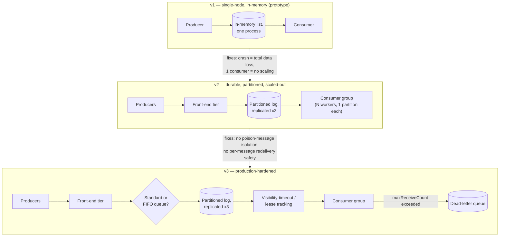
```mermaid
flowchart TD
    subgraph V1["v1 — single-node, in-memory (prototype)"]
    direction LR
    P1[Producer] --> Q1[("In-memory list,<br/>one process")]
    Q1 --> Cx1[Consumer]
    end

    subgraph V2["v2 — durable, partitioned, scaled-out"]
    direction LR
    P2[Producers] --> FE2[Front-end tier]
    FE2 --> PL[("Partitioned log,<br/>replicated x3")]
    PL --> CG2["Consumer group<br/>(N workers, 1 partition each)"]
    end

    subgraph V3["v3 — production-hardened"]
    direction LR
    P3[Producers] --> FE3[Front-end tier]
    FE3 --> QT{"Standard or<br/>FIFO queue?"}
    QT --> PL3[("Partitioned log,<br/>replicated x3")]
    PL3 --> VT["Visibility-timeout /<br/>lease tracking"]
    VT --> CG3["Consumer group"]
    CG3 -->|maxReceiveCount exceeded| DLQ3[("Dead-letter queue")]
    end

    V1 -. "fixes: crash = total data loss,<br/>1 consumer = no scaling" .-> V2
    V2 -. "fixes: no poison-message isolation,<br/>no per-message redelivery safety" .-> V3
```

- **v1 fails on:** a process crash loses every unacknowledged message, and only one consumer can drain it — fine for a take-home toy, not for an interview answer.
- **v2 fixes:** durability (replicated partitioned log) and consumer throughput (a consumer group, one partition per worker) — this is roughly "reinvent Kafka."
- **v3 fixes:** the two failure modes that actually show up under load — a message that keeps crashing every consumer (needs a DLQ) and a message stuck invisible forever if a consumer dies mid-processing (needs the visibility-timeout/lease tracker) — plus lets the caller opt into FIFO where strict order is worth the throughput cost.

**The shape you actually draw in an interview is v3's steady state, in more detail:**

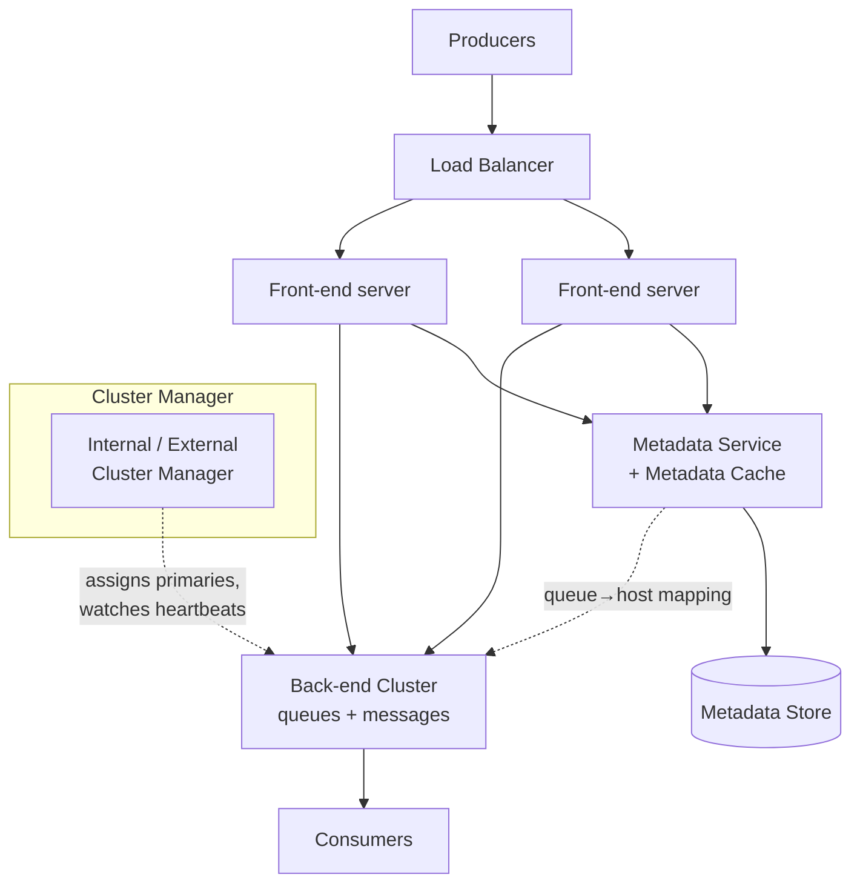
```mermaid
flowchart TD
    P[Producers] --> LB1[Load Balancer]
    LB1 --> FE1[Front-end server]
    LB1 --> FE2[Front-end server]
    FE1 --> MD[Metadata Service<br/>+ Metadata Cache]
    FE2 --> MD
    MD --> MDS[(Metadata Store)]
    FE1 --> BE[Back-end Cluster<br/>queues + messages]
    FE2 --> BE
    BE --> C1[Consumers]
    MD -. queue→host mapping .-> BE

    subgraph "Cluster Manager"
    CM[Internal / External<br/>Cluster Manager]
    end
    CM -. assigns primaries,<br/>watches heartbeats .-> BE
```

**The data model in one picture** — how queues, partitions, messages, and consumer groups actually relate to each other underneath that box diagram:

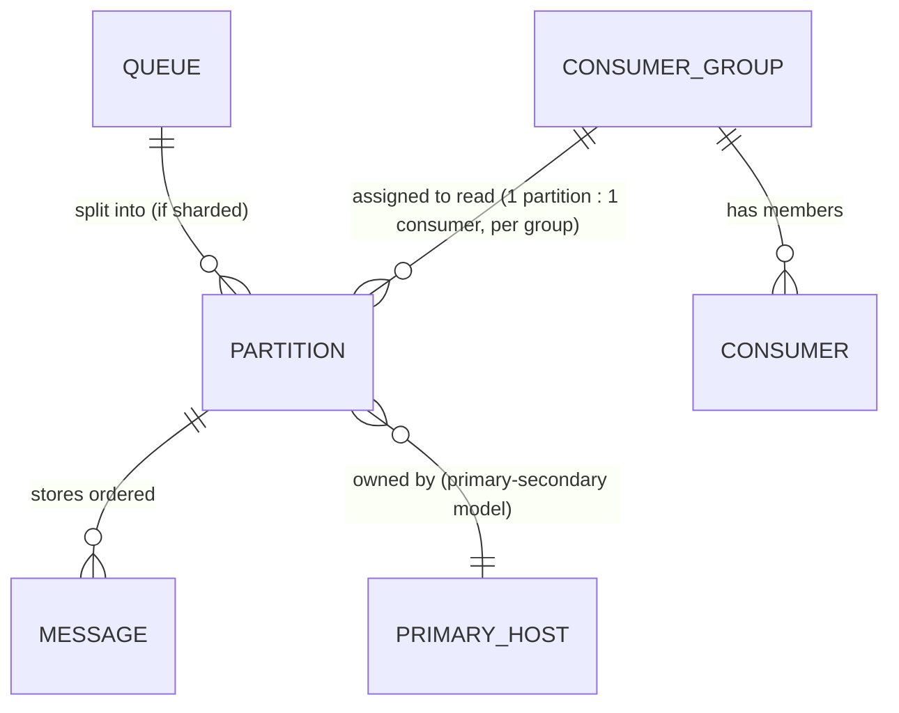
```mermaid
erDiagram
    QUEUE ||--o{ PARTITION : "split into (if sharded)"
    PARTITION ||--o{ MESSAGE : "stores ordered"
    PARTITION }o--|| PRIMARY_HOST : "owned by (primary-secondary model)"
    CONSUMER_GROUP ||--o{ CONSUMER : "has members"
    CONSUMER_GROUP ||--o{ PARTITION : "assigned to read (1 partition : 1 consumer, per group)"
```

**Memory hook:** *a queue is just "many partitions"; a partition is just "an ordered list of messages owned by one host"; a consumer group is just "a claim ticket that says which consumer reads which partition."* Everything else in this guide is detail on top of these four boxes.

### Front-end service (stateless, horizontally scaled)
Does the boring-but-essential work so the back-end stays simple:
- **Request validation** — required fields, size limits.
- **AuthN/AuthZ** — is this producer/consumer allowed on this queue.
- **Caching** — queue metadata + user data, to avoid hitting the metadata store per request.
- **Request dispatch** — routes to metadata service vs. back-end.
- **Deduplication** — hash-key lookup; reject repeats (critical for at-least-once producers that retry).
- **Usage/audit data collection**.

### Metadata service
Stores/retrieves/updates **queue metadata** (owner, size limits, partition map, primary host) — never the message payloads themselves. Sits between front-end and the data layer; front-end checks cache → metadata store on miss → repopulate cache.

**Two ways to organize the metadata cluster**, pick based on data size:

| Metadata fits on one machine | Metadata too large for one machine |
|---|---|
| Replicate identical copy on every cluster node | Shard by partition key / consistent hashing |
| Any node answers any request (LB in front) | Each shard replicated for availability |
| Simple, but wastes memory at scale | Mapping table lives either **only on front-end servers** (front-end must know shard→host map) or **on every back-end host** (any host can redirect — better for read-heavy traffic) |

**Memory hook:** *small metadata → mirror everywhere; big metadata → shard it, and decide who holds the map (front-end = fewer hops for writes, every host = better for read fan-out).*

### Partitioning — consistent hashing in practice

When a queue (or its metadata) is too big for one host, both the source material's "consistent hashing-like scheme" and every real system (Kafka, Cassandra, DynamoDB) solve placement the same way: hash keys and nodes onto the same ring, so adding/removing a node only reshuffles its **immediate neighbors' keys**, not the whole dataset.

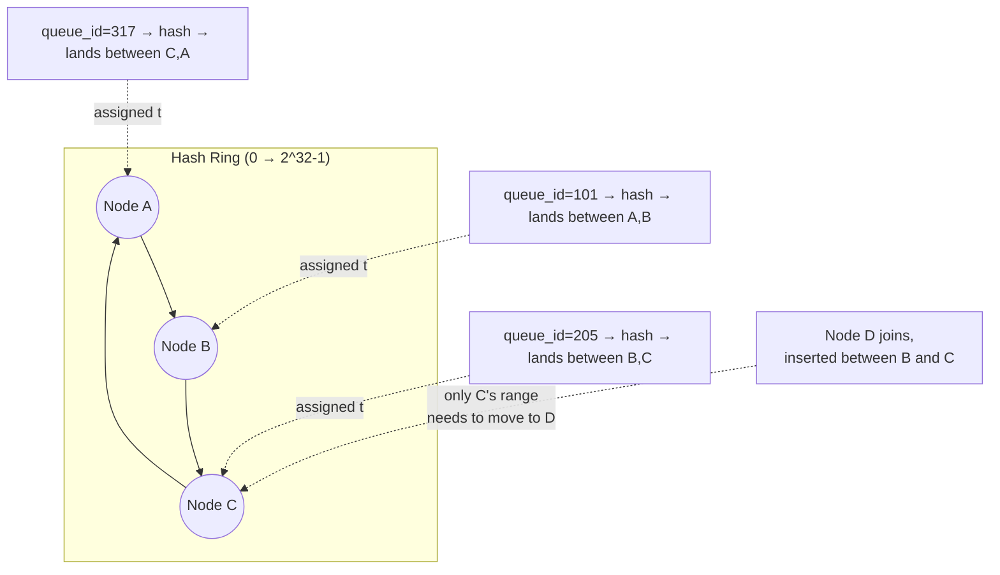
```mermaid
flowchart TD
    subgraph Ring["Hash Ring (0 → 2^32-1)"]
    NA((Node A)) --> NB((Node B)) --> NC((Node C)) --> NA
    end
    K1["queue_id=101 → hash → lands between A,B"] -.assigned to.-> NB
    K2["queue_id=205 → hash → lands between B,C"] -.assigned to.-> NC
    K3["queue_id=317 → hash → lands between C,A"] -.assigned to.-> NA
    ND["Node D joins,<br/>inserted between B and C"] -.only C's range<br/>needs to move to D.-> NC
```

**Why this matters over naive `hash(key) % N`:** modulo hashing remaps almost **every** key when `N` changes (a node join/leave reshuffles the entire cluster); consistent hashing remaps only the slice owned by the neighboring node. Say this explicitly if asked "how do you add a node without a full rebalance."

**Same shape as:** this is the identical ring mechanism the Distributed Cache guide uses for server placement — same ring, same "only the neighbor's slice moves" property — just keyed by `queue_id`/partition key here instead of cache key. Learn the ring once, reuse it anywhere something gets sharded across a fleet.

**Two-sentence version**: *"Hash both nodes and keys onto the same ring so a node join/leave only remaps its immediate neighbor's slice, not the whole keyspace. It's the standard placement answer any time you shard something across a fleet — cache keys, queue partitions, database rows."*

### Back-end service — where messages actually live

Two competing models for organizing back-end hosts. This is the **highest-value disambiguation** in this chapter — interviewers routinely ask "which one and why":

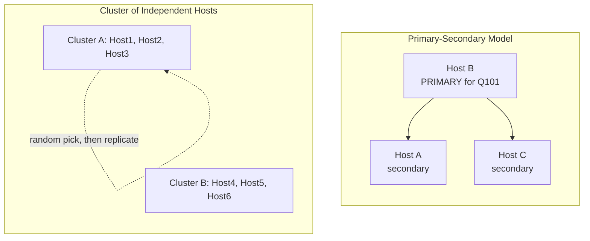
```mermaid
graph TD
    subgraph "Primary-Secondary Model"
    direction TB
    Q101P[Host B<br/>PRIMARY for Q101] --> Q101A[Host A<br/>secondary]
    Q101P --> Q101C[Host C<br/>secondary]
    end
    subgraph "Cluster of Independent Hosts"
    direction TB
    CA[Cluster A: Host1, Host2, Host3] -.random pick, then replicate.-> CA
    CB[Cluster B: Host4, Host5, Host6]
    end
```

| | Primary-secondary model | Cluster of independent hosts |
|---|---|---|
| Who owns a queue | One designated **primary** per queue; it fully owns reads/writes/replication/deletion | No fixed owner; **any** host in the assigned cluster can take a request |
| Who routes | Internal cluster manager tracks primary/secondary mapping | External cluster manager tracks queue→cluster mapping only |
| Failure handling | Must **elect a new primary** on failure (consensus/leader-election) | Just pick another host in the cluster — no election needed |
| Consistency | Simpler — single writer, natural ordering point | Harder — concurrent writers to replicas need reconciliation |
| Scales by | Adding primaries (more queues) | Adding clusters / hosts within a cluster |
| Real-world analog | Kafka partition leader/follower | DynamoDB/Cassandra-style ring, Kinesis shard spread |

**Memory hook:** *primary-secondary = "one captain per queue, promote a new one if they fall overboard"; independent hosts = "any deckhand can grab the next crate, no captain needed."*

**Quick decision — which topology do I say in the interview?**

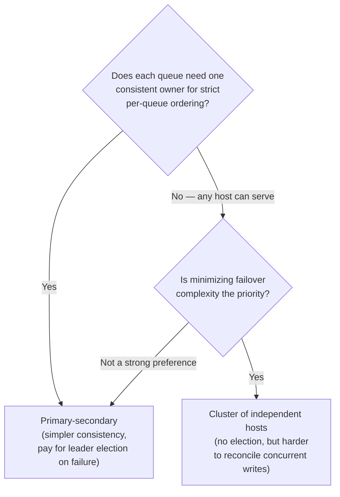
```mermaid
flowchart TD
    T1{Does each queue need one<br/>consistent owner for strict<br/>per-queue ordering?} -->|Yes| PS["Primary-secondary
    (simpler consistency,
    pay for leader election on failure)"]
    T1 -->|No — any host can serve| T2{Is minimizing failover<br/>complexity the priority?}
    T2 -->|Yes| IH["Cluster of independent hosts
    (no election, but harder
    to reconcile concurrent writes)"]
    T2 -->|Not a strong preference| PS
```

**Same shape as:** primary-secondary here is the same pattern as the Sequencer guide's range-handler-plus-failover-replica — one owner, a promotable backup, and a coordinator watching heartbeats. Independent hosts is the opposite pole — no owner, no election, any node answers — the same trade-off DynamoDB/Cassandra make at the storage layer.

**Two-sentence version**: *"Primary-secondary means one host owns a queue and needs leader election on failure; independent hosts means any host in the cluster can serve a request, trading election complexity for harder write reconciliation. Pick primary-secondary when a queue needs one consistent ordering point, independent hosts when minimizing failover complexity matters more."*

### Internal vs. external cluster manager

| | Internal Cluster Manager | External Cluster Manager |
|---|---|---|
| Scope | Inside **one** cluster | **Across** clusters |
| Node visibility | Knows every node in its cluster | Knows clusters, not their internal nodes |
| Listens for | Per-node heartbeats | Per-cluster health |
| Handles | Node failure, add/remove, primary election | Assigning a queue to a cluster, splitting a queue across clusters |

### Push vs. pull — how consumers actually get messages

This is a near-guaranteed interview question ("does the broker send to the consumer, or does the consumer ask?") and it's missing from most candidates' answers entirely.

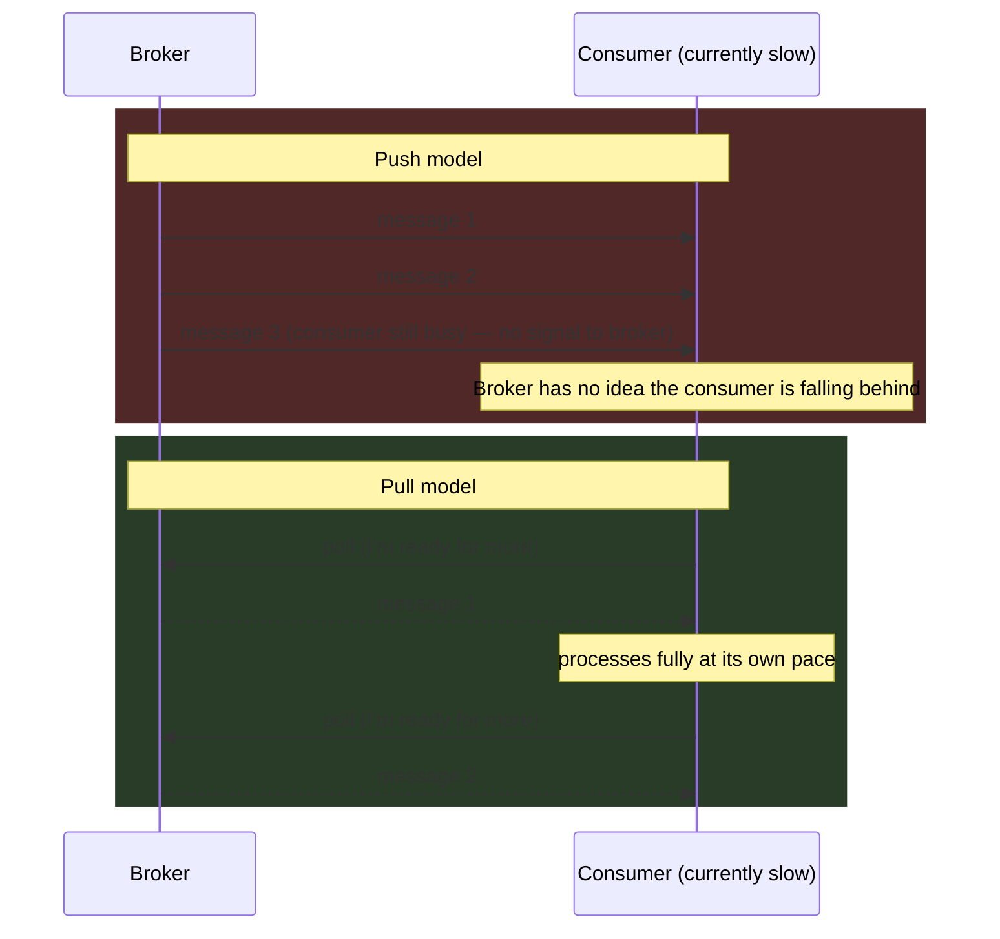
```mermaid
sequenceDiagram
    participant Broker
    participant Consumer as Consumer (currently slow)

    rect rgb(80,40,40)
    Note over Broker,Consumer: Push model
    Broker->>Consumer: message 1
    Broker->>Consumer: message 2
    Broker->>Consumer: message 3 (consumer still busy — no signal to broker)
    Note over Consumer: Broker has no idea the consumer is falling behind
    end

    rect rgb(40,60,40)
    Note over Broker,Consumer: Pull model
    Consumer->>Broker: poll (I'm ready for more)
    Broker-->>Consumer: message 1
    Note over Consumer: processes fully at its own pace
    Consumer->>Broker: poll (I'm ready for more)
    Broker-->>Consumer: message 2
    end
```

| | Push | Pull |
|---|---|---|
| Backpressure | None natively — broker can overrun a slow consumer | Natural — consumer only asks when ready |
| Latency | Lower (broker sends the instant it has data) | Slightly higher (bounded by poll interval) |
| Consumer control | Broker decides the pace | Consumer decides the pace and batch size |
| Real systems | RabbitMQ `basic.consume`, WebSocket-style push | Kafka (`poll()`), SQS (`ReceiveMessage`) — the dominant pattern at scale |

**Long polling — the trick that makes pull cheap:** a naive pull ("ask every 100ms, get empty replies most of the time") wastes calls and money. **Long polling** (SQS `WaitTimeSeconds`, Kafka `fetch.max.wait.ms`) holds the request open server-side until a message arrives or a timeout elapses, collapsing many empty polls into one held connection.

**Memory hook:** *push = firehose pointed at you, hope you can drink; pull = you bring the cup, and you decide how big a cup.* Pull's dominance in high-scale systems (Kafka, SQS) is precisely because it makes backpressure free — the interview answer to "how do you prevent a slow consumer from being overwhelmed" is almost always "we use pull, not push."

**Same shape as:** this is the exact push/pull duality from the CDN guide's push-vs-pull-CDN decision (origin ships proactively vs. edge fetches lazily), and the same "does the sender act first, or does the receiver ask first" question behind fan-out-on-write vs. fan-out-on-read in feed systems. Learn the duality once, recognize it everywhere.

**Two-sentence version**: *"Push means the broker sends the instant it has data, with no backpressure signal; pull means the consumer asks when ready, which makes backpressure free. Pull wins at scale (Kafka `poll()`, SQS `ReceiveMessage`) precisely because the consumer, not the broker, controls its own pace."*

---

## 🆕 End-to-End Trace: Priya's Payment Event at 3:00:00 PM

Every component above is easier to hold onto as one concrete path through them. Priya's checkout service just captured a card and needs to enqueue a `payment.captured` event for the order-fulfillment consumer to react to.

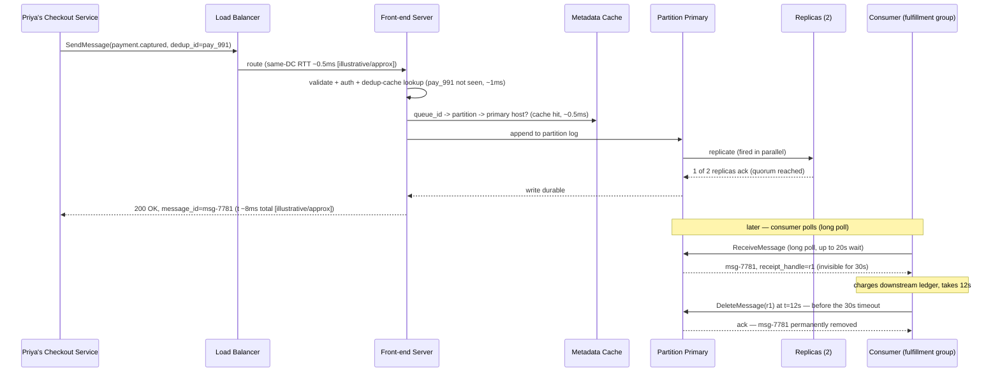
```mermaid
sequenceDiagram
    participant PS as Priya's Checkout Service
    participant LB as Load Balancer
    participant FE as Front-end Server
    participant MD as Metadata Cache
    participant PP as Partition Primary
    participant R as Replicas (2)
    participant CG as Consumer (fulfillment group)

    PS->>LB: SendMessage(payment.captured, dedup_id=pay_991)
    LB->>FE: route (same-DC RTT ~0.5ms [illustrative/approx])
    FE->>FE: validate + auth + dedup-cache lookup (pay_991 not seen, ~1ms)
    FE->>MD: queue_id -> partition -> primary host? (cache hit, ~0.5ms)
    FE->>PP: append to partition log
    PP->>R: replicate (fired in parallel)
    R-->>PP: 1 of 2 replicas ack (quorum reached)
    PP-->>FE: write durable
    FE-->>PS: 200 OK, message_id=msg-7781 (t ~8ms total [illustrative/approx])

    Note over PP,CG: later — consumer polls (long poll)
    CG->>PP: ReceiveMessage (long poll, up to 20s wait)
    PP-->>CG: msg-7781, receipt_handle=r1 (invisible for 30s)
    Note over CG: charges downstream ledger, takes 12s
    CG->>PP: DeleteMessage(r1) at t=12s — before the 30s timeout
    PP-->>CG: ack — msg-7781 permanently removed
```

Two things worth narrating out loud from this trace: the producer-side latency (~8ms end-to-end `[illustrative/approx]`) is dominated by the quorum-replication wait, not the network hop — that's the concrete cost of the durability choice made in Replication Deep-Dive below; and the consumer side is entirely decoupled in time from the producer side — Priya's checkout service got its `200 OK` in single-digit milliseconds while the fulfillment consumer might not even be running yet.

**The failure branch, same message:** if the fulfillment consumer's ledger call throws every time (a downstream schema mismatch, say), `msg-7781` gets redelivered with exponential backoff — attempt 2 after ~1s, attempt 3 after ~2s — and once `receiveCount` exceeds `maxReceiveCount` (5, in this example), it's routed to the DLQ and pages the on-call engineer instead of retrying forever. See Retry, Backoff & Dead-Letter Queues below for the general version of this path.

---

## Replication Deep-Dive: Sync vs. Async vs. Quorum

Durability is a **spectrum**, not a checkbox. This is the level of detail interviewers want once you've said "we replicate the data" — *how* does the primary decide when to acknowledge the producer?

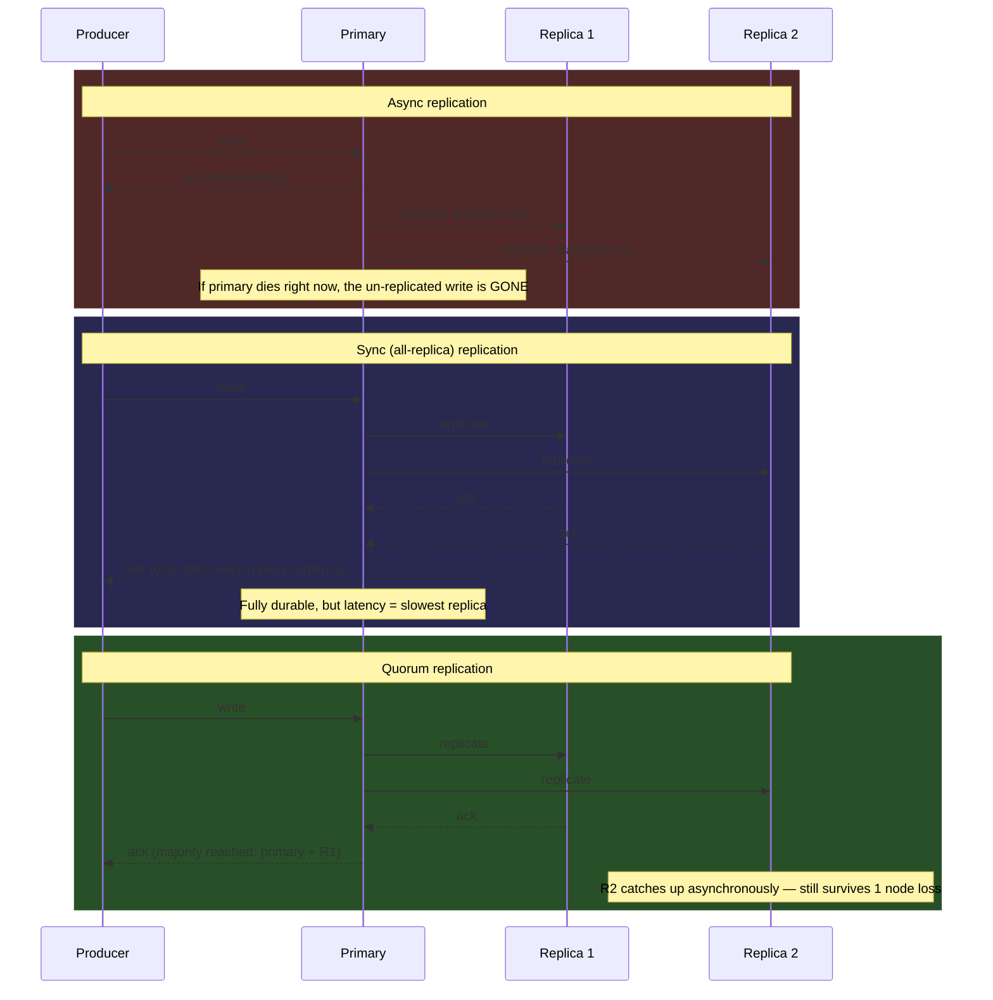
```mermaid
sequenceDiagram
    participant P as Producer
    participant Primary
    participant R1 as Replica 1
    participant R2 as Replica 2

    rect rgb(80,40,40)
    Note over P,R2: Async replication
    P->>Primary: write
    Primary-->>P: ack (immediately)
    Primary-->>R1: replicate (background)
    Primary-->>R2: replicate (background)
    Note over Primary: If primary dies right now, the un-replicated write is GONE
    end

    rect rgb(40,40,80)
    Note over P,R2: Sync (all-replica) replication
    P->>Primary: write
    Primary->>R1: replicate
    Primary->>R2: replicate
    R1-->>Primary: ack
    R2-->>Primary: ack
    Primary-->>P: ack (only after every replica confirms)
    Note over Primary: Fully durable, but latency = slowest replica
    end

    rect rgb(40,80,40)
    Note over P,R2: Quorum replication
    P->>Primary: write
    Primary->>R1: replicate
    Primary->>R2: replicate
    R1-->>Primary: ack
    Primary-->>P: ack (majority reached: primary + R1)
    Note over R2: R2 catches up asynchronously — still survives 1 node loss
    end
```

| Mode | Ack after | Durability | Latency | Who uses it |
|---|---|---|---|---|
| **Async** | Primary writes locally | Weakest — window of data loss on primary crash | Lowest | Systems that favor throughput over zero-loss (some Kafka `acks=1` configs) |
| **Sync (all replicas)** | Every replica confirms | Strongest | Highest — bounded by the slowest replica | Financial ledgers, anything where losing a write is unacceptable |
| **Quorum (majority)** | `⌊N/2⌋ + 1` replicas confirm | Strong enough to survive minority failures | Middle ground | Kafka `acks=all` with `min.insync.replicas`, most production defaults |

**Golden rule to say out loud:** *replication mode is a durability/latency dial, not a fixed property of "the queue" — you pick it per use case, and "quorum" is almost always the right default answer unless the interviewer specifically asks for maximum durability or minimum latency.*

**Same shape as:** the Distributed Cache guide makes the identical latency/durability trade at its replica layer — sync in-DC (cheap, ~0.5ms RTT `[illustrative/approx]`) vs. async cross-DC (expensive, 50–150ms RTT `[illustrative/approx]`) — just without a quorum middle ground, because a cache is disposable and doesn't need one. A queue's messages usually *do* need that middle ground, which is why quorum shows up here and not there.

**Two-sentence version**: *"Replication mode is a durability/latency dial you set per use case, not a fixed property of 'the queue': async is fast but can lose the last unreplicated write, sync-all is safest but as slow as the slowest replica, quorum (majority ack) is the default production answer. Pick sync-all only when losing a write is truly unacceptable, and async only when you're willing to trade some durability for throughput."*

---

## Message Ordering — the Core Design Tension

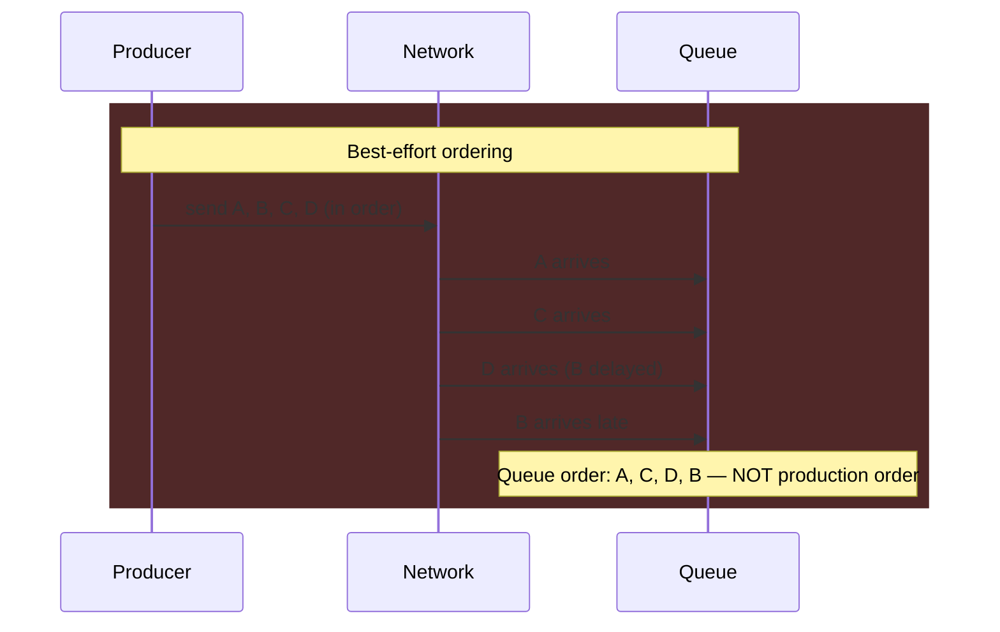
```mermaid
sequenceDiagram
    participant Producer
    participant Network
    participant Queue

    rect rgb(80,40,40)
    Note over Producer,Queue: Best-effort ordering
    Producer->>Network: send A, B, C, D (in order)
    Network->>Queue: A arrives
    Network->>Queue: C arrives
    Network->>Queue: D arrives (B delayed)
    Network->>Queue: B arrives late
    Note over Queue: Queue order: A, C, D, B — NOT production order
    end
```

| Ordering strategy | How | Weakness |
|---|---|---|
| **Best-effort** | Place messages in the order they **arrive** at the server | Cheap, high throughput — but production order ≠ queue order |
| **Monotonically increasing IDs** (server-assigned) | Server hands out 1, 2, 3... in a strict sequence | Serialization point = bottleneck under burst; still can't fix a message that arrives out of production order |
| **Causality-based sorting** | Sort by client-side timestamp | Can't compare timestamps across independent client sessions/clocks |
| **Synchronized-clock timestamps** | Use a synchronized clock (e.g., a sequencer service) to stamp messages; tag with process ID to break ties | The correct general answer — lets the server detect and wait for delayed messages; can double as a global cross-session ordering mechanism |

**Then you still have to sort on arrival** — an online sorting algorithm, typically bounded by a **time-window** (wait N ms to let stragglers catch up) to cap the latency penalty of strict ordering.

**Golden trade-off to say out loud:** *strict ordering trades throughput and latency for correctness of sequence; best-effort buys back throughput by admitting reordering is possible.* This is exactly why Kafka only guarantees order **within a partition**, not across an entire topic — global order across partitions is deliberately not sold, because it would kill parallelism.

**Two-sentence version**: *"Best-effort ordering places messages in server-arrival order — cheap, but production order isn't guaranteed; strict ordering needs synchronized-clock timestamps plus a time-window sort, which caps throughput. Kafka's actual answer is strict *within* a partition only — global order across partitions is deliberately not sold, because it would kill parallelism."*

### Managing concurrency
Two points of contention: multiple producers writing at once, multiple consumers reading at once.
- **Locking** — correctness-simple, but kills scalability and throughput (the single-server queue's exact problem — this is *why* a naive port to distributed doesn't work).
- **Serialize via buffers at both ends** — the practical answer; avoids race conditions without a global lock. Concretely: each partition gets one write buffer that appends sequentially (no two producers interleave writes to the same partition), and one consumer thread applies messages in receipt order (no two threads mutate the same partition's downstream state at once).
- **Multiple queues, dedicated producer/consumer pairs** — keeps per-queue ordering cost low at the price of more complex application logic (this is the mental model behind Kafka partitions: N partitions = N independent ordered logs, but the app must pick a partition key).

#### FIFO vs. Standard queues — the ordering trade-off, productized

This is the same best-effort-vs-strict trade-off from above, worth naming as its own decision because it's exactly how SQS (and similarly-shaped systems) expose it to the caller — as a queue *type*, chosen once at creation:

| | Standard queue | FIFO queue |
|---|---|---|
| Ordering | Best-effort — usually in order, not guaranteed | Strict, per `message_group_id` |
| Delivery | At-least-once, duplicates possible | At-least-once, but with a dedup window (5 minutes `[say cold — SQS's published default dedup window]`) giving effectively exactly-once processing |
| Throughput | Very high, scales near-linearly with partitions | Capped per queue/group — `[illustrative/approx — order of magnitude only, low thousands of msg/sec with batching; check the provider's current published limit, these have grown over time]` |
| Parallelism | Any consumer can take any message | Only one in-flight message per `message_group_id` at a time — more groups buys more parallelism |
| Typical use | Logs, metrics, notifications — anything order-tolerant | Sequenced business events: payment state-machine steps, inventory updates for one SKU — anything where processing B before A corrupts state |

**Memory hook:** *Standard is a fast-food counter — several windows, first available server takes your order, no ticket number. FIFO is a single-file DMV line — one ticket, strict order, and the whole line waits behind the one slow window.* If the prompt ever says "these events must apply in the order they happened for the same `X`" (same user, same order, same SKU), that's your cue to say "FIFO, partitioned by `X`" — not "standard queue."

**Two-sentence version**: *"Standard queues are best-effort-ordered and scale near-linearly; FIFO queues are strictly ordered per `message_group_id` but cap throughput and parallelism to one in-flight message per group. Reach for FIFO only when processing B before A would corrupt state — payment steps, inventory for one SKU — not by default."*

---

## Delivery Semantics — the Other Core Disambiguation

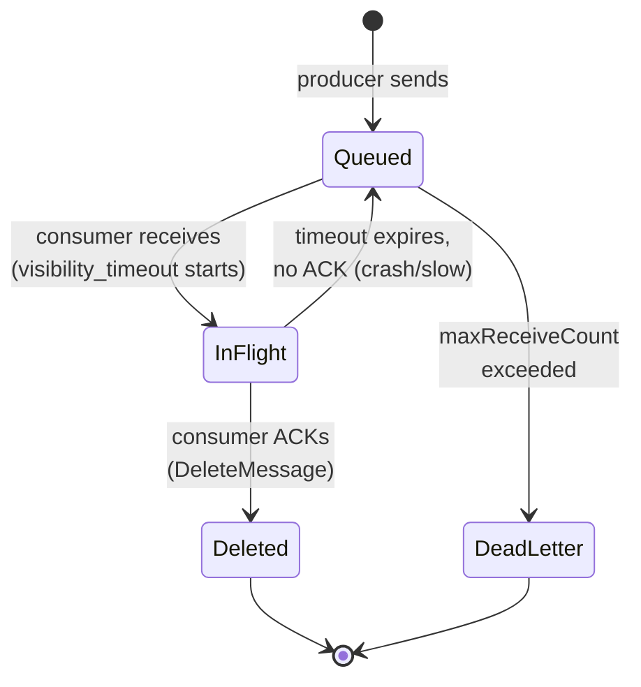
```mermaid
stateDiagram-v2
    [*] --> Queued: producer sends
    Queued --> InFlight: consumer receives<br/>(visibility_timeout starts)
    InFlight --> Deleted: consumer ACKs<br/>(DeleteMessage)
    InFlight --> Queued: timeout expires,<br/>no ACK (crash/slow)
    Queued --> DeadLetter: maxReceiveCount<br/>exceeded
    Deleted --> [*]
    DeadLetter --> [*]
```

| Semantic | Guarantee | Cost | Who uses it |
|---|---|---|---|
| **At-most-once** | Delivered 0 or 1 times — may silently drop | Cheapest, no retry bookkeeping | Metrics/logs where an occasional loss is fine |
| **At-least-once** | Delivered 1+ times — never silently dropped, but duplicates possible | Needs consumer-side idempotency or dedup | SQS (visibility timeout), Kafka (offset commit after processing) — **the default answer in most interviews** |
| **Exactly-once** | Delivered and processed exactly once | Requires transactional writes / idempotent producers + dedup on both ends; hardest and most expensive | Kafka transactions (producer idempotence + read-process-write transactions), payment processing pipelines |

**Two concrete mechanisms behind "don't delete on read" (both give at-least-once):**
1. **Offset-based, no delete** (Kafka model): message stays in the log; consumer tracks its own **offset**. Multiple consumer groups can each read the same message independently. A retention job deletes on expiry, not on consumption.
2. **Visibility-timeout model** (SQS model): message becomes **invisible** for `visibility_timeout` seconds after being received, not deleted. Consumer must call `DeleteMessage` (ack) before the timeout or the message reappears for another consumer to grab.

#### Send → receive → process → delete, with a concrete redelivery

A worked example beats the abstract rule: **visibility timeout = 30s**, and this particular job **takes 45s** to process.

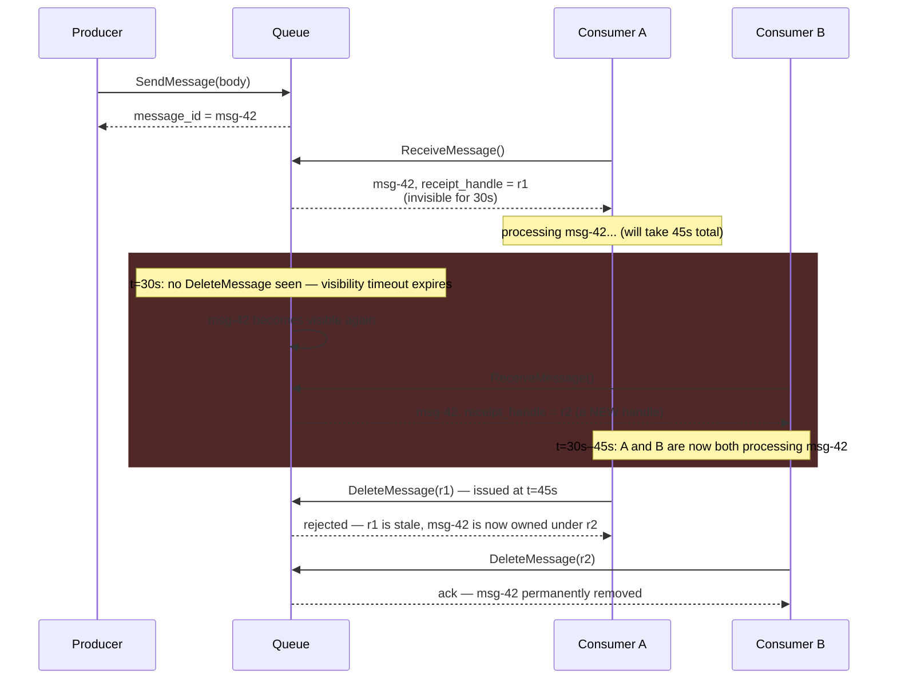
```mermaid
sequenceDiagram
    participant P as Producer
    participant Q as Queue
    participant A as Consumer A
    participant B as Consumer B

    P->>Q: SendMessage(body)
    Q-->>P: message_id = msg-42

    A->>Q: ReceiveMessage()
    Q-->>A: msg-42, receipt_handle = r1<br/>(invisible for 30s)
    Note over A: processing msg-42... (will take 45s total)

    rect rgb(80,40,40)
    Note over Q: t=30s: no DeleteMessage seen — visibility timeout expires
    Q->>Q: msg-42 becomes visible again
    B->>Q: ReceiveMessage()
    Q-->>B: msg-42, receipt_handle = r2 (a NEW handle)
    Note over A,B: t=30s–45s: A and B are now both processing msg-42
    end

    A->>Q: DeleteMessage(r1) — issued at t=45s
    Q-->>A: rejected — r1 is stale, msg-42 is now owned under r2
    B->>Q: DeleteMessage(r2)
    Q-->>B: ack — msg-42 permanently removed
```

Two things worth saying out loud about this diagram: the message reappeared **only** because A took longer than the timeout — nothing crashed — and A's delete is rejected specifically because it names the *old* receipt handle. That rejection is exactly the safety net `receipt_handle` (instead of reusing `message_id`) is designed to provide.

**Making the consumer actually idempotent, concretely:** keep a small dedup store (Redis, or a table with a TTL) keyed by a **business** idempotency key — an `order_id` or `payment_id`, not the queue's `message_id` — because what must not double-apply is the side effect, not the delivery. Before doing anything with a real-world effect (charging a card, sending an email), atomically check-and-set that key; if it's already set, skip the side effect and just acknowledge the message. Set the TTL comfortably longer than the worst-case reprocessing window — e.g., if visibility timeout is 30s and `maxReceiveCount` is 5, a TTL of a few minutes is generous headroom `[illustrative/approx]` — so even a late duplicate gets caught.

**Point to ponder, answered:** if the visibility timeout expires while the consumer is *still* processing, **another consumer can pick up and process the same message concurrently** — this is exactly why at-least-once requires idempotent consumers, and why SQS/Kafka both expose an API to *extend* the timeout (`ChangeMessageVisibility` / Kafka's `max.poll.interval.ms`) for long-running jobs.

**Quick decision — which delivery semantic do I actually need?**

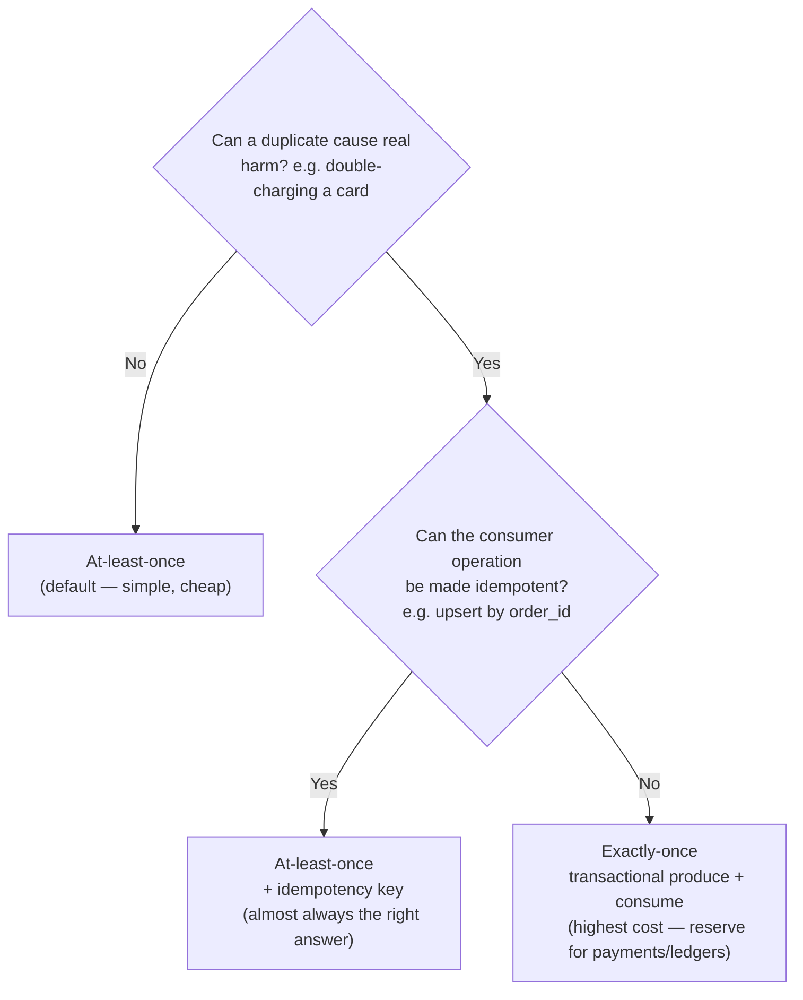
```mermaid
flowchart TD
    Q1{Can a duplicate cause real<br/>harm? e.g. double-charging a card} -->|No| AMO["At-least-once
    (default — simple, cheap)"]
    Q1 -->|Yes| Q2{Can the consumer operation<br/>be made idempotent?<br/>e.g. upsert by order_id}
    Q2 -->|Yes| AMO2["At-least-once
    + idempotency key
    (almost always the right answer)"]
    Q2 -->|No| EO["Exactly-once
    transactional produce + consume
    (highest cost — reserve for payments/ledgers)"]
```

**Two-sentence version**: *"At-most-once may silently drop, at-least-once (the default) may duplicate and needs idempotent consumers, exactly-once needs transactional produce+consume and is the most expensive. Decide by asking: can a duplicate cause real harm, and if so, can the operation be made idempotent — only pay for exactly-once when the answer to both is no."*

---

## Retry, Backoff & Dead-Letter Queues

A message that fails processing shouldn't be retried instantly forever (hammers a possibly-struggling downstream) or dropped immediately (loses data on a transient blip). The standard pattern is **exponential backoff, capped, then quarantine:**

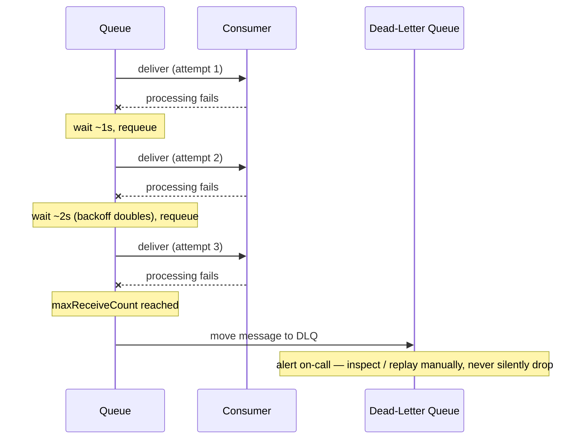
```mermaid
sequenceDiagram
    participant Q as Queue
    participant Consumer
    participant DLQ as Dead-Letter Queue

    Q->>Consumer: deliver (attempt 1)
    Consumer--xQ: processing fails
    Note over Q: wait ~1s, requeue
    Q->>Consumer: deliver (attempt 2)
    Consumer--xQ: processing fails
    Note over Q: wait ~2s (backoff doubles), requeue
    Q->>Consumer: deliver (attempt 3)
    Consumer--xQ: processing fails
    Note over Q: maxReceiveCount reached
    Q->>DLQ: move message to DLQ
    Note over DLQ: alert on-call — inspect / replay manually, never silently drop
```

**Dead-letter queue (DLQ):** after a message exceeds `maxReceiveCount`, it's routed to a separate queue instead of being retried forever — poison-pill isolation so one bad message can't stall the whole pipeline. *(This is a real quiz question in the source material — remember it cold: DLQ = messages that failed and hit the retry ceiling, not "successfully consumed" and not "producer died.")*

**Memory hook:** *backoff buys the downstream time to recover; the cap prevents one poison message from retrying forever; the DLQ makes sure "gave up retrying" is a visible event, not a silent data loss.*

#### Poison-message decision flowchart

The DLQ isn't a separate feature bolted on — it's the answer to one specific question the consumer/queue must ask on every failed delivery:

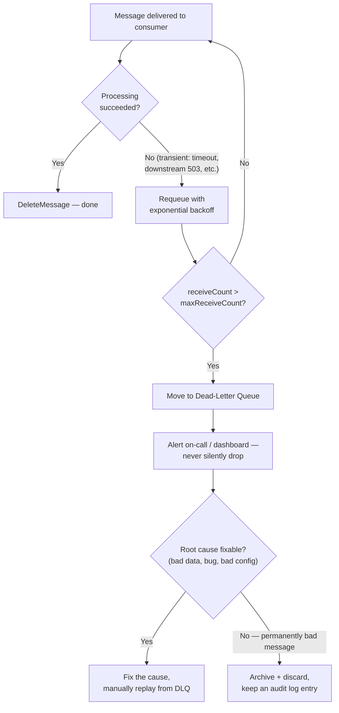
```mermaid
flowchart TD
    R["Message delivered to consumer"] --> P{"Processing<br/>succeeded?"}
    P -->|Yes| Del["DeleteMessage — done"]
    P -->|"No (transient: timeout,<br/>downstream 503, etc.)"| BO["Requeue with<br/>exponential backoff"]
    BO --> Cnt{"receiveCount ><br/>maxReceiveCount?"}
    Cnt -->|No| R
    Cnt -->|Yes| DLQ["Move to Dead-Letter Queue"]
    DLQ --> Alert["Alert on-call / dashboard —<br/>never silently drop"]
    Alert --> Fix{"Root cause fixable?<br/>(bad data, bug, bad config)"}
    Fix -->|Yes| Replay["Fix the cause,<br/>manually replay from DLQ"]
    Fix -->|"No — permanently bad message"| Archive["Archive + discard,<br/>keep an audit log entry"]
```

**If X then Y, cold:** *if a message has failed `maxReceiveCount` times, then it goes to the DLQ, not back to the main queue — retrying it a 6th time when 5 already failed just burns downstream capacity for nothing.*

**Two-sentence version**: *"A failed message gets exponential backoff and a capped retry count, not infinite retries and not an instant drop; once it exceeds `maxReceiveCount` it moves to a dead-letter queue instead of blocking the main queue. The DLQ's whole job is making 'gave up retrying' a visible, alertable event instead of a silent loss."*

---

## Queue vs. Topic vs. Log — Don't Blur These in an Interview

| | Queue (point-to-point) | Topic (pub-sub, fan-out) | Log (Kafka-style stream) |
|---|---|---|---|
| Consumption | One consumer per message | Every subscriber gets a copy | Every consumer **group** gets a copy; within a group, one partition → one consumer |
| Message survives read? | Usually deleted/invisible after ack | Delivered then typically gone (unless replay supported) | **Retained** for a configured time regardless of consumption — replay is native |
| Ordering | Global if single-partition | Per-topic, best-effort typically | Strict **within a partition** only |
| Replay old messages | No | Rarely | Yes — seek to any offset |
| Real systems | SQS, ActiveMQ (queue mode), RabbitMQ (direct) | SNS, RabbitMQ (fanout exchange), Google Pub/Sub | Kafka, Kinesis, Pulsar |

**Memory hook:** *queue = single ticket, one person redeems it; topic = flyer photocopied for everyone on the list; log = a ledger nobody erases, so you can re-read any past page.*

**Two-sentence version**: *"Queue = one consumer eats each message and it's gone; topic = every subscriber gets an independent copy; log = messages are retained regardless of consumption, so any consumer can replay from any offset. Kafka is technically a log that happens to support both queue-like (single consumer group) and topic-like (multiple consumer groups) consumption on top."*

---

## Consumer Groups & Partition Rebalancing

This is how a log-based system (Kafka, Kinesis) actually **scales** consumption — the mechanism behind "add more consumers to read faster," which every candidate claims but few can explain.

**The rule:** within one consumer group, each partition is read by **exactly one** consumer at a time. So `#consumers ≤ #partitions` for full parallelism — a 4th consumer added to a 3-partition topic sits idle. This is the single most common capacity-planning mistake candidates make: *partition count is your ceiling on consumer parallelism, decide it up front, oversharding is cheap insurance, undersharding requires a repartition later.*

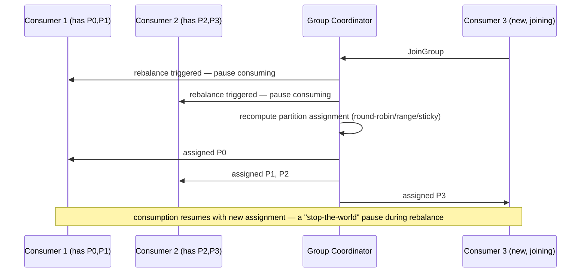
```mermaid
sequenceDiagram
    participant C1 as Consumer 1 (has P0,P1)
    participant C2 as Consumer 2 (has P2,P3)
    participant GC as Group Coordinator
    participant C3 as Consumer 3 (new, joining)

    C3->>GC: JoinGroup
    GC->>C1: rebalance triggered — pause consuming
    GC->>C2: rebalance triggered — pause consuming
    GC->>GC: recompute partition assignment (round-robin/range/sticky)
    GC->>C1: assigned P0
    GC->>C2: assigned P1, P2
    GC->>C3: assigned P3
    Note over C1,C3: consumption resumes with new assignment — a "stop-the-world" pause during rebalance
```

**Rebalancing also triggers on:** a consumer crashing (missed heartbeats), a consumer leaving cleanly, or partition count changing. **The cost interviewers want you to name:** rebalancing pauses the *entire* group briefly (older "eager" rebalance) — modern brokers use **incremental/cooperative rebalancing** so only the reassigned partitions pause, not the whole group. Mentioning this distinction is a strong signal you've operated these systems, not just read about them.

**Memory hook:** *a consumer group is a team splitting a stack of numbered folders (partitions) — one folder per teammate at a time; add a teammate, folders get reshuffled; a teammate quits, their folders go to someone else.*

**Two-sentence version**: *"Within one consumer group, each partition is read by exactly one consumer at a time, so partition count is a hard ceiling on parallelism — a 4th consumer on a 3-partition topic sits idle. Adding/removing a consumer triggers a rebalance; modern brokers use cooperative/incremental rebalancing so only the reassigned partitions pause, not the whole group."*

---

## Numbers Worth Memorizing

| Fact | Value | Confidence |
|---|---|---|
| Kafka default max message size | 1 MB (broker `message.max.bytes`, tunable to a few MB) | `[say cold — documented default, but tunable]` |
| SQS max message size | 256 KB (larger payloads → store in S3, queue the pointer) | `[say cold — documented AWS spec]` |
| SQS default / max visibility timeout | 30 s default, 12 hours max | `[say cold — documented AWS spec]` |
| SQS message retention | 4 days default, 14 days max | `[say cold — documented AWS spec]` |
| Kinesis shard limits | 1 MB/s or 1,000 records/s write; 2 MB/s read | `[say cold — documented AWS spec]` |
| Kafka partition throughput (rule of thumb) | ~10 MB/s write per partition on commodity disks | `[illustrative/approx — a widely-cited operating rule of thumb, hardware- and workload-dependent, not a hard spec]` |
| Typical replication factor | 3 (tolerates 1 node loss with quorum, 2 with best-effort) | `[illustrative/approx — a near-universal convention, not a law]` |
| Same-datacenter round trip | ~0.5 ms | `[illustrative/approx]` |
| Cross-region round trip | ~50–150 ms | `[illustrative/approx — synchronous cross-region replication is a latency tax, not free durability]` |
| Disk sequential write | ~500 MB/s–1 GB/s (SSD) | `[illustrative/approx — varies by device generation]` |

These numbers justify *why* partition count and replication factor are the two levers you tune in a capacity estimate, not arbitrary system-specific trivia. Say the deterministic ones (SQS/Kafka/Kinesis spec limits) cold, and hedge the measured/rule-of-thumb ones ("roughly," "on the order of") — mixing the two registers up is a credibility leak an interviewer will notice.

### Throughput tricks: batching & compression

Two cheap, high-leverage optimizations interviewers expect you to at least name when asked "how do you push more throughput through the same partitions":

| Technique | What it does | Trade-off |
|---|---|---|
| **Producer batching** | Group N messages into one network write (Kafka `linger.ms` + `batch.size`) | Higher throughput, but adds up to `linger.ms` of latency per message |
| **Compression** (snappy/lz4/zstd) | Compress a batch before sending over the wire and storing on disk | Less network/disk I/O, small CPU cost — almost always a net win at scale |
| **Consumer batching** | Pull/process N messages per round-trip instead of 1 | Fewer round-trips, but a batch failure can force reprocessing the whole batch (interacts with at-least-once + idempotency) |

**Memory hook:** *batching trades a few milliseconds of latency for a large multiple of throughput — the right trade almost everywhere except the most latency-sensitive path.*

---

## Capacity Estimation, Worked

**Formula chain:**
```
avg QPS = daily messages / 86,400
peak QPS = avg QPS × peak factor (typically 2–5x)
ingress bandwidth = peak QPS × avg message size
storage = daily messages × avg message size × retention_days
replicated storage = storage × replication factor
partitions needed = peak QPS / max QPS per partition   (or: peak bandwidth / per-partition MB/s)
nodes needed = (replicated storage / disk per node) AND (partitions × replication / partitions per node)
                — take the max of the two
```

**Worked example — order-processing queue for an e-commerce platform:**

- 10M orders/day `[illustrative/approx — stated assumption for this example]` → avg QPS = 10,000,000 / 86,400 ≈ **116 QPS** `[say cold — arithmetic given the stated assumption]`
- Peak factor 4x (flash sales) `[illustrative/approx — assumption]` → peak QPS ≈ **464 QPS** `[say cold — arithmetic given the stated assumption]`
- Avg message size: 2 KB (order payload + metadata) `[illustrative/approx — assumption]`
- **Ingress bandwidth** at peak: 464 × 2 KB ≈ **928 KB/s** ≈ 0.9 MB/s `[say cold — pure arithmetic given the above]` — trivial for one machine, but we still shard for isolation and availability, not raw throughput.
- **Storage** at 7-day retention: 10M × 2 KB × 7 = **140 GB** raw `[say cold — arithmetic given the stated assumptions]`
- **Replicated storage** (factor 3): 140 GB × 3 = **420 GB** `[say cold — arithmetic given the stated assumptions]`
- **Partitions**: even though 0.9 MB/s is tiny, business requires per-customer ordering → partition by `customer_id`, sized for future 20x growth → pick **50 partitions** `[illustrative/approx — a headroom choice, not a derived number]`
- **Nodes**: 420 GB / (say 500 GB usable disk per broker after overhead `[illustrative/approx — assumption]`) ≈ **1 node** for storage, but availability requires spreading 50 partitions × 3 replicas = 150 replica-slots across **at least 3 nodes** (one per replica) — realistically **5–6 nodes** `[illustrative/approx — headroom + rolling-upgrade margin, not a hard minimum]` for headroom and rolling upgrades.

**Redo the math with a different input — what if it's 1B orders/day, not 10M?**

Same four lines, new numbers — this is the graded moment, not the first answer:

- 1B orders/day → avg QPS = 1,000,000,000 / 86,400 ≈ **11,574 QPS** `[say cold — arithmetic]`, a **~100x** jump from 116 QPS.
- Peak factor 4x → peak QPS ≈ **46,296 QPS** `[say cold — arithmetic]`.
- Ingress bandwidth at peak: 46,296 × 2 KB ≈ **90.6 MB/s** `[say cold — arithmetic]` — no longer trivial; now it materially drives partition count, not just isolation.
- Storage at 7-day retention: 1B × 2 KB × 7 = **14 TB** raw `[say cold — arithmetic]`; replicated (×3) = **42 TB** `[say cold — arithmetic]`.
- Partitions: 90.6 MB/s ÷ ~10 MB/s per partition `[illustrative/approx rule of thumb from Numbers Worth Memorizing]` ≈ 9-10 partitions for raw throughput alone — but ordering-by-`customer_id` and headroom for further growth still dominates, so you'd size well above that floor, not to it.
- Nodes: 42 TB / 500 GB usable per broker ≈ **84 nodes** for storage alone `[say cold — arithmetic given the assumption]` — at this scale, storage, not replica-slot count, is now the binding constraint, the opposite of the 10M/day case.

**The reusable takeaway to say in an interview:** *raw throughput rarely dictates partition count at small-to-medium scale — retention × replication dictates storage, and availability/ordering requirements dictate partition count. At large enough scale, that flips: throughput and storage both become binding, and you say so explicitly rather than reciting the small-scale answer.* Redo the same four lines whenever the interviewer changes an input — don't recite a memorized final answer.

---

## Design Decisions & Trade-offs

| Decision | Option A | Option B | What you're trading |
|---|---|---|---|
| Ordering | Best-effort | Strict (synchronized clocks + time-window sort) | Throughput/latency vs. correctness of sequence |
| Back-end topology | Primary-secondary | Cluster of independent hosts | Simplicity/consistency vs. no-election flexibility |
| Deletion model | Offset-based (Kafka) | Visibility-timeout (SQS) | Multi-consumer replay vs. simple single-consumer-per-message semantics |
| Delivery guarantee | At-least-once | Exactly-once | Operational simplicity vs. correctness under retries (payments, ledgers) |
| Metadata mapping location | Front-end only | Every back-end host | Fewer moving parts vs. better read fan-out tolerance |
| Replication | Primary-secondary (async or sync) | Quorum (majority ack) | Lower write latency vs. stronger durability guarantee |

### Where does this sit on CAP?

Interviewers like to check whether you can place your design on the CAP triangle without prompting:

- **Within a partition**, a well-designed queue is effectively **CP** — quorum writes mean you sacrifice some availability (a write can stall if you can't reach a majority) to guarantee the ordered log is consistent and durable.
- **Across the whole system** (many partitions, many queues), it behaves **AP** — the metadata/routing layer keeps serving other partitions/queues even if one partition's quorum is unreachable; a partial outage doesn't take down the whole cluster.
- **Consumer offsets** are typically **eventually consistent** — a consumer group's committed offset lags slightly behind actual processing, which is exactly why at-least-once (not exactly-once) is the default.

**One-liner:** *"Per-partition, I'm choosing consistency over availability via quorum writes; across partitions, the system stays available because a stuck partition doesn't block the others."*

---

## Common Failure Modes

| Failure | Symptom | Mitigation |
|---|---|---|
| Broker/primary node dies | Queue unavailable for writes | Fast primary election (internal cluster manager), replicas promoted |
| Network partition (split-brain) | Two nodes think they're primary | Quorum-based writes, fencing tokens, epoch/term numbers |
| Hot partition | One partition/queue overloaded while others idle | Better partition-key choice, or split queue across more partitions |
| Poison-pill message | Same message crashes every consumer, blocks queue | Dead-letter queue after N retries |
| Consumer crash mid-processing | Message stuck "in-flight" forever if no timeout | Visibility timeout / lease with auto-expiry |
| Duplicate delivery | At-least-once retries create dupes downstream | Idempotency keys, dedup cache at front-end (hash-key lookup) |
| Slow consumer (backpressure) | Queue depth grows unbounded | Auto-scale consumers, alert on queue depth / age-of-oldest-message |
| Metadata store overload | Every send/receive stalls | Cache metadata aggressively at front-end; shard metadata store itself |
| Clock skew | Synchronized-clock ordering breaks | NTP/PTP, hybrid logical clocks, or accept causality-based approach with known limitation |

---

## Real-World Systems — How They Actually Did It

| System | Model | Ordering | Delivery | Notable design choice |
|---|---|---|---|---|
| **Apache Kafka** | Log-based, partition = unit of parallelism | Strict within partition, none across | At-least-once by default; exactly-once via idempotent producer + transactions | Doesn't delete on read — consumer tracks offset; replay is a first-class feature |
| **Amazon SQS** | Point-to-point queue, cluster of independent hosts under the hood | Best-effort (standard) or strict FIFO (dedicated FIFO queues, lower throughput) | At-least-once (standard); exactly-once processing (FIFO, with dedup window) | Visibility timeout instead of delete-on-read; DLQ built in |
| **RabbitMQ** | Broker with exchanges (direct/topic/fanout) routing to queues | Per-queue FIFO | At-least-once (ack) or at-most-once (no-ack) | Flexible routing topology (exchange types) is its signature feature over plain queues |
| **Amazon Kinesis** | Sharded log, similar to Kafka partitions | Strict within shard | At-least-once | Shard = fixed throughput unit (1 MB/s in, 2 MB/s out); resharding is an explicit operation |
| **Apache Pulsar** | Separates compute (broker) from storage (BookKeeper) | Strict within partition | At-least-once / exactly-once | Broker is stateless — storage tier scales independently, unlike Kafka where broker owns the log on local disk |
| **Google Pub/Sub** | Pub-sub, fully managed | Best-effort (ordering keys optional for per-key order) | At-least-once | No fixed partition count exposed to the user — the "cluster of independent hosts" model taken to its logical extreme |

**Confidence check on the claims above** — don't state these with equal confidence, they're not equally sourced:
- Kafka not deleting on read, tracking consumer offsets, and guaranteeing order only within a partition `[well-documented — core, published Kafka design]`.
- Kinesis's 1 MB/s-in / 2 MB/s-out shard limits and Kafka/SQS's message-size and retention defaults `[say cold — documented provider specs]`.
- Pulsar's broker/BookKeeper separation and Google Pub/Sub's lack of user-visible partitions `[well-documented — both providers' own architecture docs describe this explicitly]`.
- **SQS running on "a cluster of independent hosts under the hood"** `[plausible inference — AWS does not publish SQS's internal storage architecture; this is the commonly-taught mental model that fits SQS's externally observable behavior (no ordering guarantee, no fixed shard count exposed), not a confirmed implementation detail]`. Say it as "this is the model that best explains SQS's observed behavior," not as a fact you read in AWS's docs.

**Positioning these systems on two axes** (illustrative, not benchmarked — the point is the *shape* of the trade-off, not exact coordinates):

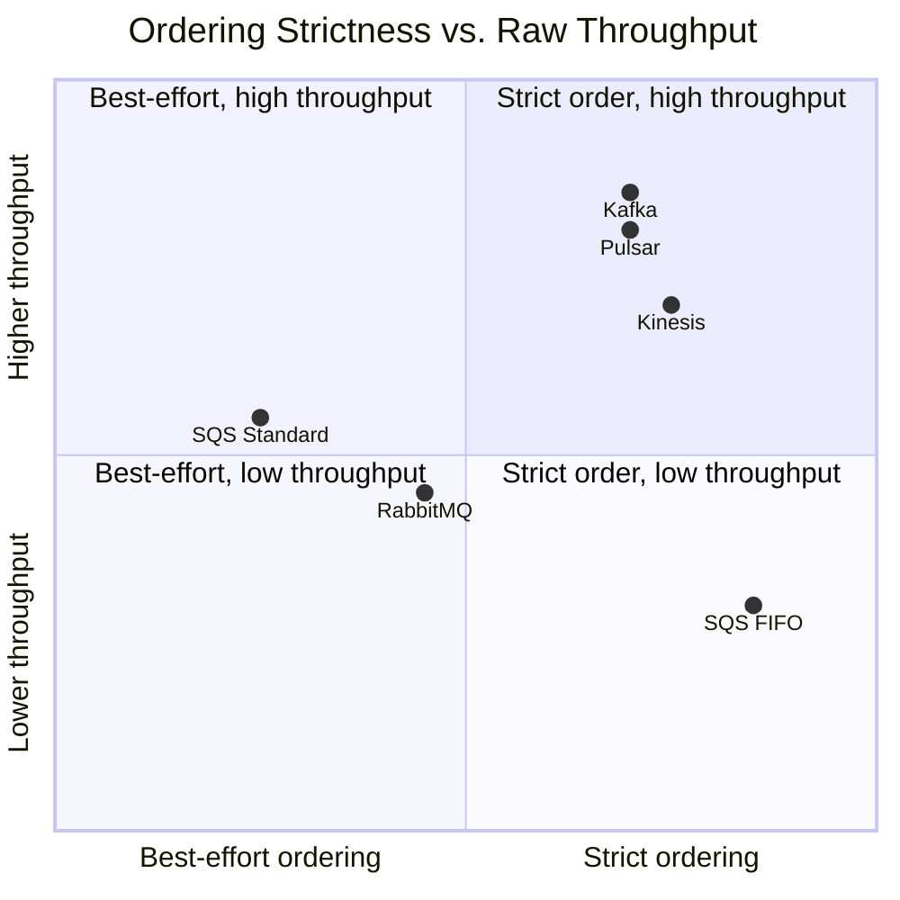
```mermaid
quadrantChart
    title Ordering Strictness vs. Raw Throughput
    x-axis Best-effort ordering --> Strict ordering
    y-axis Lower throughput --> Higher throughput
    quadrant-1 Strict order, high throughput
    quadrant-2 Best-effort, high throughput
    quadrant-3 Best-effort, low throughput
    quadrant-4 Strict order, low throughput
    Kafka: [0.7, 0.85]
    SQS Standard: [0.25, 0.55]
    SQS FIFO: [0.85, 0.3]
    RabbitMQ: [0.45, 0.45]
    Kinesis: [0.75, 0.7]
    Pulsar: [0.7, 0.8]
```

**Read it as:** paying for strict ordering (moving right) generally costs you throughput headroom (moving down) — SQS FIFO vs. SQS Standard is the clearest illustration of that same trade-off inside one product family.

**How to bring this up in an interview:** if asked "design a notification system / order pipeline / log ingestion system," name the closest real system early ("this is essentially the SQS/Kafka trade-off") — it signals you know the landscape, then justify **why** you'd pick one model over the other for *this specific* requirement (ordering need, replay need, fan-out need), rather than defaulting to "I'll use Kafka" for everything.

---

## 🆕 Anti-Patterns / Red Flags

Specific phrasings and moves that read as junior on this topic — pulled together in one place rather than scattered across the guide:

- **"I'll use Kafka"** as the first sentence, before any requirement is stated. Earn the technology choice; don't lead with it.
- **Using "queue" and "topic" interchangeably** — they have different fan-out contracts (see Queue vs. Topic vs. Log); conflating them signals you haven't internalized the distinction.
- Deleting a message **on read** instead of on confirmed processing — this quietly downgrades your delivery guarantee to at-most-once while you're claiming at-least-once.
- Calling `DeleteMessage`/`ChangeMessageVisibility` with a **`message_id`** instead of the current **`receipt_handle`** — misses the exact safety mechanism the API was designed around (see API Design).
- Claiming **exactly-once is free or "just what Kafka gives you by default"** — it requires an idempotent producer plus transactions, and it's the most expensive delivery semantic on purpose, not the default.
- Presenting **FIFO as strictly better than Standard** without naming its throughput/parallelism cost — FIFO is a deliberate trade, not a strict upgrade.
- Discussing retries without ever saying **"exponential backoff"** or **"dead-letter queue"** — the interviewer is listening for that specific vocabulary the moment a consumer failure comes up.
- Conflating **consumer count with partition count** — proposing to "just add more consumers" to a topic without checking whether partition count is already the ceiling.
- Treating **consistent hashing as the fix for a hot partition** — hashing solves *placement*, a hot partition is a *traffic* problem on one already-placed key; the fix is a better partition key or splitting that specific partition, not rehashing everything.
- Presenting the **final architecture directly**, skipping the v1→v2→v3 evolution — reads as a memorized diagram, not a reasoned one.
- Stating a latency or throughput number with **false precision** ("exactly 3ms") instead of a hedged range — undermines credibility on every other number in the answer.
- Never naming **what happens when the metadata store or a partition primary is unavailable** — implicitly assuming 100% availability of a component you just said was a single owner.

---

## 🆕 Adversarial Q&A

Realistic interviewer pushback, answered the way you'd actually say it out loud — 2-4 sentences, not an essay. Two of these (marked ⚔) directly challenge a trade-off this guide itself chose; one (marked ❓) poses a wrong premise to correct rather than accept.

**1. "Why not just run a single beefy queue server instead of all this partitioning complexity?"**
Because it's a single point of failure and a hard throughput ceiling — one machine's disk and network cap your entire system's QPS, and losing that one box loses the whole queue. Partitioning trades that simplicity for horizontal scalability and fault isolation, which is worth it the moment you need more throughput or durability than one machine can give.

**2. "Walk me through exactly what happens when a partition's primary dies mid-write."**
The write in flight either never got acknowledged (producer retries, safe because of the dedup_id) or was acknowledged after quorum replication (durable on at least one surviving replica). The cluster manager detects the missed heartbeat, promotes the most caught-up replica to primary, and in-flight requests to the dead primary fail or time out and retry against the new primary once metadata is updated — a brief unavailability window, not silent data loss, assuming quorum acks were in place.

**3. ⚔ "You said quorum is almost always the right default — doesn't that mean you're accepting weaker durability than sync-all for no good reason?"**
Yes, quorum is objectively weaker than sync-all — a replica that hasn't caught up yet could theoretically be promoted before it's fully current in a pathological failure sequence. I'm trading that small residual risk for latency that isn't bounded by the single slowest replica, which is the right trade for the vast majority of workloads; I'd only choose sync-all if the interviewer specifically told me a single lost write is unacceptable, e.g., a ledger.

**4. ⚔ "Your v3 adds a visibility-timeout tracker — doesn't that just reintroduce the exact race condition of two consumers processing the same message, which you were supposedly avoiding?"**
Correct, and I said so explicitly in the redelivery diagram — visibility timeout doesn't eliminate the race, it bounds it and makes it detectable. The actual fix for correctness isn't the timeout, it's requiring idempotent consumers downstream; the timeout's job is only to make sure a crashed consumer doesn't permanently orphan a message, not to guarantee single-delivery.

**5. ❓ "Since SQS guarantees at-least-once delivery, doesn't that mean messages are also delivered in order?"**
No — those are two independent axes, and that's a common mix-up worth correcting directly. Delivery guarantee (at-least-once, at-most-once, exactly-once) is about whether a message is dropped or duplicated; ordering (best-effort vs. strict/FIFO) is about sequence — SQS Standard is at-least-once *and* best-effort ordered at the same time, which is exactly why FIFO queues exist as a separate product for when you need both.

**6. "If FIFO queues already dedup within a 5-minute window, why do we still need idempotency keys downstream?"**
Because the dedup window only catches duplicates the *queue itself* introduced within that window — a retry due to a network blip on send. It can't catch a duplicate the *consumer* introduces by processing the same message twice due to a visibility-timeout redelivery hours later, or a bug that reprocesses an old message from the DLQ; a business-level idempotency key protects against all of those, not just the narrow producer-retry case.

**7. "Why does pull 'naturally' give you backpressure — couldn't a broker just throttle push based on ACKs?"**
It could, but then the broker has to track per-consumer inflight state and implement its own throttling logic — you've just rebuilt pull with extra steps and extra broker-side complexity. Pull puts that control where the information already lives (the consumer knows its own capacity), which is why it's the dominant pattern rather than a broker-side workaround.

**8. "What's the actual cost of the DLQ pattern — sounds like pure upside?"**
It's not free: someone has to actually watch the DLQ, diagnose why messages are landing there, and either fix the root cause and replay or archive them — an unmonitored DLQ is just a slower, quieter way to lose data. It also means designing a manual or semi-automated replay path, which is extra operational surface most teams underestimate until they need it.

**9. ❓ "If we use Kafka, don't we get exactly-once for free since it's the most advanced system?"**
No — that's treating "advanced" as synonymous with "free," and exactly-once is never free. Kafka's default is at-least-once; exactly-once requires explicitly enabling an idempotent producer and wrapping produce-and-consume in a transaction, which costs coordination overhead and throughput, the same trade every exactly-once implementation makes, Kafka included.

**10. "Why would you ever choose primary-secondary over independent hosts, given election adds complexity?"**
Because primary-secondary gives you a single, natural ordering point per queue for free — with independent hosts, concurrent writers to different replicas need active reconciliation, which is its own complexity, just moved earlier in the pipeline instead of into a failure-time election. If a queue genuinely needs strict per-queue ordering, paying for election on the rare failure path beats paying for write reconciliation on every single write.

**11. "Walk me through what happens if the metadata store goes down."**
Front-end servers serve from their metadata cache for reads they've already seen, so in-flight traffic for known queues keeps flowing for a while; but any cache miss — a new queue, a cache eviction, a cold front-end — stalls until the metadata store recovers. That's exactly why the guide calls out aggressive front-end caching and sharding the metadata store itself as the two mitigations, not just "cache it and hope."

**12. "Why not just make every queue FIFO — wouldn't that be simpler to reason about?"**
Simpler to reason about, but you'd be paying FIFO's throughput and parallelism ceiling on workloads that never needed strict ordering in the first place — logs, metrics, most notifications. The right call is asking per-queue whether processing B before A actually corrupts state, and only paying the FIFO cost where the answer is yes.

**13. ⚔ "You said to oversharding partitions 'for headroom' — isn't that just wasted resources sitting idle?"**
There's a real cost, yes — more partitions means more replica-slots, more open file handles, more rebalancing overhead per membership change, and I should say that cost out loud rather than pretend oversharding is free. But undersharding is worse: it requires a live repartition later, which is operationally disruptive and can reorder or duplicate in-flight messages, so I'm trading a bounded, known resource cost now against an unbounded operational cost later.

**14. "How do you prevent a slow consumer from causing unbounded queue growth?"**
Alert on queue depth and age-of-oldest-message (from `GetQueueAttributes`) and auto-scale the consumer fleet against those signals before the backlog becomes a latency problem for downstream SLAs. If consumers genuinely can't keep up even at max scale, that's a signal to add partitions, not just add consumers, since partition count is the hard ceiling on parallelism.

**15. "If the consumer crashes after processing but before calling `DeleteMessage`, what happens — and is that a bug?"**
The message reappears after the visibility timeout expires and gets reprocessed by another consumer — that's not a bug, it's exactly what at-least-once delivery promises and is why the side effect (charging a card, sending an email) must be guarded by an idempotency key, not the message-processing step itself. The alternative — deleting on receipt instead of on completion — would silently drop work on that exact crash, which is a worse failure mode than a harmless duplicate.

---

## 🆕 Active Recall Drill

Cover the answers and go through these cold. Test today, again in 2-3 days, again in a week — that spacing is what moves this from "recognized when reading" to "produced under pressure."

1. What's the one-sentence justification for why a messaging queue exists at all (the surge-tank analogy)?
2. Name the two fan-out shapes hiding behind the word "queue," and give one real system for each.
3. Why is `receipt_handle` a separate field from `message_id`, and what specific bug does that design prevent?
4. State the golden trade-off between best-effort and strict ordering — and name the one system that deliberately only guarantees order within a partition.
5. What are the three delivery semantics, and what's the deciding question for picking between at-least-once-with-idempotency and full exactly-once?
6. Name the two concrete mechanisms behind "don't delete on read," and which real system uses each.
7. Why does plain `hash(key) % N` break on a node resize, and what's the fix?
8. What's the rule connecting partition count and consumer count within one consumer group, and what's the single most common capacity-planning mistake that ignores it?
9. Name the three replication modes and order them from fastest/least-durable to slowest/most-durable.
10. Why does Kafka's "quorum is the default production answer" claim not apply the same way to a distributed cache's replicas?
11. What's the difference between a hot partition and a poison message, and does either get fixed by adding more partitions?
12. Write out the full capacity-estimation formula chain from daily messages to node count, symbol by symbol.
13. Give the golden rule for what a DLQ is (and, just as important, what it is not).
14. What's the specific business-level idempotency key you'd use to dedup a payment side effect, and why isn't `message_id` the right key for that?
15. Give the two-sentence version distinguishing Queue vs. Topic vs. Log.

**Spaced repetition:** run this drill today, again in 2-3 days, and again in a week before treating this topic as interview-ready.

---

## Golden Rules

- **A queue is a buffer for mismatched speed, not a database** — if consumers must query/scan/filter historical data at will, that's a log or a datastore, not a queue.
- **Global strict ordering and horizontal scalability are in tension** — pick per-partition ordering and shard by the key that must stay ordered, don't try to order everything.
- **At-least-once is the pragmatic default** — exactly-once is achievable but expensive; only pay for it when duplicates are truly unacceptable (money, not metrics).
- **Never delete a message on read** — delete (or make invisible) only on confirmed processing, so a crashed consumer never silently loses work.
- **A poison message should never be allowed to block a queue forever** — always cap retries and route to a dead-letter queue.
- **Metadata is small and hot; messages are large and bulky** — cache the former aggressively, shard the latter deliberately. Conflating the two in one storage tier is a common design smell.
- **Replication factor is a durability dial, partition count is a parallelism dial** — tune them independently, and justify each with a number, not intuition.
- **Partition count is your consumer-parallelism ceiling** — decide it with headroom up front; adding consumers past partition count buys you nothing.
- **Pull beats push at scale because backpressure comes for free** — the consumer, not the broker, decides its own pace.
- **Batch and compress before you add machines** — it's the cheapest throughput multiplier available, always try it before scaling out.

---

## Master Cheat Sheet

**Definitions:** Queue = point-to-point, one consumer eats each message. Topic = pub-sub, every subscriber gets a copy. Log = retained stream, replay by offset.

**Recognize the topic:** "don't lose this work, process it once" with one consumer role → queue. "Every downstream service reacts independently" → topic. Full disambiguation table (vs. cache, orchestration, stream processing, rate limiter) up top.

**Data model:** queue → partitions → ordered messages; partition → owned by one primary host; consumer group → claims partitions 1:1 per member.

**The 7-step playbook:** Requirements → Capacity estimate → API → High-level design → Deep dive → Trade-offs/failure modes → Wrap-up. Full minute-by-minute pacing and the "interviewer redirects at minute 15" contingency are in the Full-Interview Pacing Script section.

**Ordering:** best-effort (arrival order) vs. strict (synchronized-clock timestamp + time-window sort). Strict costs throughput. Kafka's answer: strict *within a partition* only.

**Delivery:** at-most-once (may drop) / at-least-once (may duplicate, default answer) / exactly-once (idempotent producer + transaction, expensive). Decision tree: harm from dupes? → can you make it idempotent? → only then pay for exactly-once.

**Deletion:** offset-tracking (Kafka, supports replay) vs. visibility-timeout (SQS, simpler point-to-point model). Retry with capped exponential backoff, then DLQ — never retry forever, never drop silently.

**Push vs. pull:** push = broker sends, no backpressure. Pull = consumer polls, natural backpressure; long polling avoids wasted empty-poll round trips. Pull wins at scale — same duality as CDN push/pull and feed fan-out-on-write/read.

**Consumer groups:** one partition, one consumer per group, at a time. `#consumers ≤ #partitions`. Adding/removing a consumer triggers a rebalance (cooperative rebalancing limits the pause to only the reassigned partitions).

**Back-end topology:** primary-secondary (one owner per queue, needs leader election on failure — same shape as the Sequencer guide's range-handler failover) vs. cluster of independent hosts (any host serves, no election, harder consistency).

**Replication modes:** async (fast, risk of loss) / sync-all (safest, slowest) / quorum (majority ack — the default production answer). Same latency/durability dial the Distributed Cache guide's replicas use, minus the quorum middle ground a disposable cache doesn't need.

**Partitioning:** consistent hashing — node join/leave only reshuffles the neighboring slice, not the whole ring. Same ring as the Distributed Cache guide's server placement.

**Cluster managers:** internal = inside one cluster, knows every node. External = across clusters, knows clusters not their nodes.

**CAP stance:** per-partition = CP (quorum trades availability for consistency); across partitions = AP (one stuck partition doesn't block the rest); offsets = eventually consistent.

**Formula chain:** QPS → bandwidth → storage (× retention × replication) → partitions (from throughput + ordering key + consumer-parallelism target) → nodes (max of storage-bound and partition-slot-bound). Practice redoing it with a swapped input (10M/day → 1B/day in Capacity Estimation) — that's the graded moment, not the first answer.

**Numbers** (deterministic specs `[say cold]`, everything else `[illustrative/approx]`): Kafka msg ≤1MB, SQS msg ≤256KB, SQS visibility 30s/12h, SQS retention 4d/14d default/max, Kinesis shard 1MB/s in–2MB/s out — all `[say cold]`. Replication factor 3, same-DC RTT ~0.5ms, cross-region RTT 50-150ms, Kafka ~10MB/s/partition — all `[illustrative/approx]`.

**Failure modes to preempt unprompted:** hot partition, poison message → DLQ, duplicate delivery → idempotency key, consumer crash mid-flight → visibility timeout/lease, rebalance storm from flapping consumers.

**Anti-patterns:** leading with "I'll use Kafka" before requirements; conflating queue and topic; deleting on read instead of on ack; using `message_id` instead of `receipt_handle` for delete/extend calls; presenting the final architecture without the v1→v2→v3 ladder.

**Before the interview:** run the Active Recall Drill and skim the Adversarial Q&A — the drill tests recall, the Q&A tests whether you can defend the trade-offs you'd actually choose live.

**One-liner for the wrap-up:** *"I chose [ordering guarantee], [delivery semantic], and [replication mode] because [requirement], which cost us [trade-off] — here's how I'd detect and mitigate [the failure mode that trade-off introduces]."*
