# Publish-Subscribe — The Story (narrative edition)

> **What this file is.** The reference file, `18-Pub-sub-FAANG-Guide.md`, is the one to recite from — requirements, the API table, the Design 1/2/3 progression, every trade-off table, the master cheat sheet. This file is a second way in: the same material as one continuous story, told in plain language. Engineers at a company keep hitting a wall, patch it, and the patch itself opens the next wall — until we land on the exact same design the reference file documents. The company, **ScoreWire** (a live sports score and fantasy-league alert startup), is fictional. But every wall it hits, and every fix it reaches for, is something a real, named system actually does: Apache Kafka (built at LinkedIn, its consumer-group and partition mechanics are documented in Kafka's own architecture docs), AWS SNS + SQS (documented fan-out-to-queue pattern), Google Cloud Pub/Sub, Redis Pub/Sub (documented to have zero persistence), and RabbitMQ. I'll say clearly, every time, whether a number or detail is a documented fact or a reasonable stand-in — those get an `[illustrative]` tag.

**The trigger phrases** for this whole topic: *"design a notification fan-out system,"* *"how do many independent teams all react to the same event without knowing about each other,"* or *"design something like Kafka."* Keep one sentence in your head as you read: **a publisher writes a message once, doesn't know or care who's listening, and any number of independent subscribers each get their own full copy, at their own pace — that's the entire difference from a queue, where one message goes to exactly one consumer.** Everything below is just this one idea getting harder, in small, honest steps.

---

## Chapter 1 — The phone call that four teams are all waiting on

It's ScoreWire's first season. A `match-events` service detects a goal and, to alert fans, calls the `push-notifications` service directly — an RPC, a phone call: dial, wait for pickup, wait for it to finish, then move on. Fine, with one call. Then the `tv-overlay` team wants the same goal event to trigger their live-graphics update, so a second RPC call gets added inside the same function. Then `fantasy-scoring` wants it for live point updates — a third call. Then `analytics` — a fourth. All four calls now fire **synchronously, one after another**, every single time a goal happens, and `match-events` can't move on to the next event until all four have answered.

During a Champions League final, `tv-overlay`'s endpoint — busy compositing a highlight graphic — slows from its normal 50ms response down to **800ms** `[illustrative]`. Because `match-events` waits on every call before continuing, each goal event now takes at least 800ms to fully process. That day, 40 matches are live simultaneously, producing a combined ~120 goal-adjacent events a minute `[illustrative]` — two a second. At 800ms per event just for `tv-overlay`'s slice alone, `match-events` can't keep up, events start queueing behind each other, and fans start seeing "GOAL!" push notifications **5+ seconds** after it actually happened. For a product whose entire pitch is "live," that's a real complaint spike.

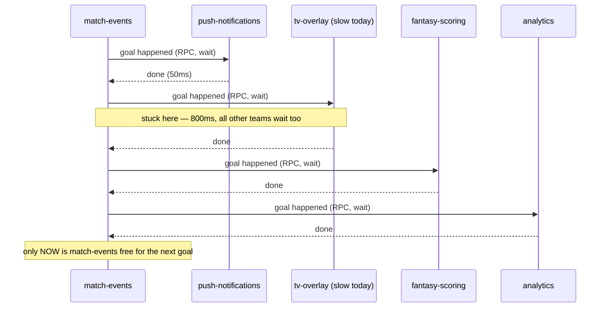

The obvious question: *why does one team's slow graphics renderer get to delay every other team's data, and why does adding a new team mean editing `match-events`'s code at all?* Because this is RPC — a phone call, four times over, every event — and the caller is stuck waiting on every callee, whether or not the callee's speed has anything to do with the caller's job.

**The fix, and the analogy for the rest of this story:** publish the goal event once, to a **topic**, and let anyone who cares subscribe to it. This is **newsletter, not phone call** — the real, documented mental model behind every pub-sub system. A newsletter publisher writes one issue; they don't know how many people subscribe, don't wait for anyone to finish reading, and don't care if a new subscriber joins tomorrow. `match-events` becomes a publisher: it writes "goal, match #482, minute 63" to a `match.goal` topic and immediately moves on — zero knowledge of who's listening or how fast they are.

**New problem, immediately:** okay, so what does "topic" actually run on? If we build it the most obvious way — one delivery queue per subscribing team, wired up by hand — does *that* scale as more teams and more fans show up? That's the very next wall.

**How I'd say this in an interview:** "The tell that you need pub-sub instead of RPC is exactly this: one event, multiple independent consumers, and the producer shouldn't have to know about any of them or wait on the slowest one. The fix is always the same shape — publish once to a topic, let subscribers read independently — that's the newsletter model, and it's the one-sentence answer to 'what's pub-sub' in any interview."

---

## Chapter 2 — The mailroom that photocopies every letter for every reader

The first real implementation: a **message director** process reads the `match.goal` topic and, using a lookup table of subscribing teams, copies each message into a dedicated queue per subscriber — this is "Design 1" from the reference guide, and it's the honest, naive first draft every candidate should propose and then talk themselves out of. With 4 subscriber teams and 1 topic, it works fine.

A year later, product adds **per-fan personalized alerts** — "notify me only about Team X" — implemented as one topic per followed team/competition/player. That's **50,000 topics** `[illustrative]`, and during a marquee match, up to **500,000 individual fan subscriptions** are active for that one match alone `[illustrative]`. Every single goal event for that match now gets physically copied by the message director into 500,000 separate per-fan queues. Storage triples within a month, and the director itself — spending more CPU copying bytes than `match-events` spends detecting goals — becomes the actual bottleneck.

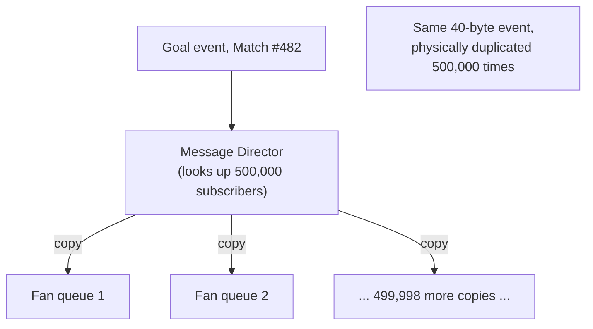

The obvious question: *why does adding a new subscriber require making a brand-new, permanent, physical copy of the message, forever?* Because Design 1 conflates two different things: "a bookmark of what you've read" and "your own private mailbox holding a copy of the mail."

**The fix:** don't copy the message — keep **one physical copy**, in a durable, ordered log, and let every subscriber just track its own **offset**, a bookmark saying "I've read up to here." Nobody gets a private mailbox; everybody reads the same shared, append-only log at their own pace. This is exactly what Kafka (and Google Cloud Pub/Sub, Pulsar) actually do — one log, many independent bookmarks, zero per-subscriber duplication. Keep the bookmark image — it's the analogy for the rest of this story every time offsets come up.

**New problem:** a bookmark only makes sense if there's one unambiguous log to point into. But one machine's disk can't hold or serve all of ScoreWire's traffic forever — the log has to be spread across multiple broker machines for throughput. Once there's more than one log, which one does a given event even land in, and what happens to order? That's the next wall.

**How I'd say this in an interview:** "Design 1 — a physical copy per subscriber — is the design you propose first and then reject, because its cost scales linearly with subscriber count. The fix is a shared, partitioned, durable log where subscribers each track their own offset — a bookmark, not a receipt — so the same bytes on disk serve one reader or a million readers at the same storage cost."

---

## Chapter 3 — The filing drawer that has to hold the whole match's story

The fix from Chapter 2, deployed for real: `match.goal` becomes a **partitioned** topic — 12 independent, ordered logs spread across 12 broker machines, each an append-only sequence of messages addressed by offset (this is Kafka's actual partition mechanism, documented in its architecture). Events are initially spread across partitions round-robin, and throughput problems disappear — no more single mailroom bottleneck.

Then a real bug shows up. `fantasy-scoring` needs to process "goal scored" and then, 90 seconds later, "VAR review: goal overturned" for the *same* match, strictly in that order — otherwise it might award fantasy points for a goal that's since been cancelled. Round-robin placement doesn't care about that: the "goal" event for Match #482 round-robins onto partition 3, and the "VAR overturn" event for that same match round-robins onto partition 7. `fantasy-scoring`'s consumer reading partition 7 happens to be faster that minute and processes the overturn *before* its counterpart on partition 3 even gets to the original goal — awarding points for a goal that, by the time it's processed, has already been cancelled. Real impact: **~40,000 fantasy players** briefly see wrong point totals that afternoon `[illustrative]`.

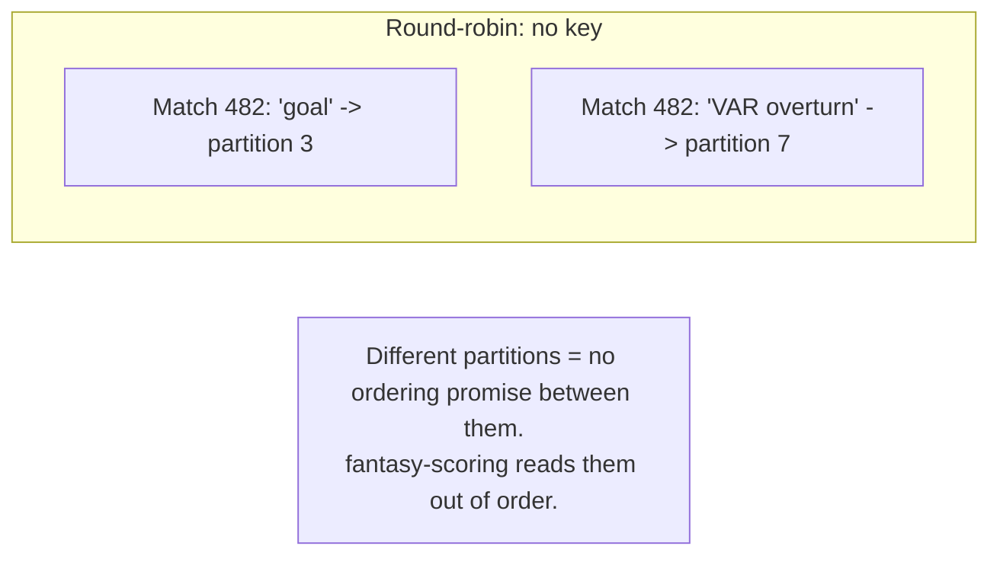

The question: pub-sub promised ordering *within* a partition — so how did two events about the *same match* end up unordered relative to each other? Because "ordered within a partition" is worthless if related events don't land in the same partition together in the first place.

**The fix:** partition by **key**, not round-robin — `hash(match_id) % 12`, so every event for the same match always lands in the same drawer. Think of it as **one filing drawer per match**: every document about Match #482, in the order it happened, always goes in drawer 3, and which drawer holds which match never gets randomized mid-story. Now a single drawer, read start to finish, is a strictly ordered account of that one match — exactly the guarantee `fantasy-scoring` needs.

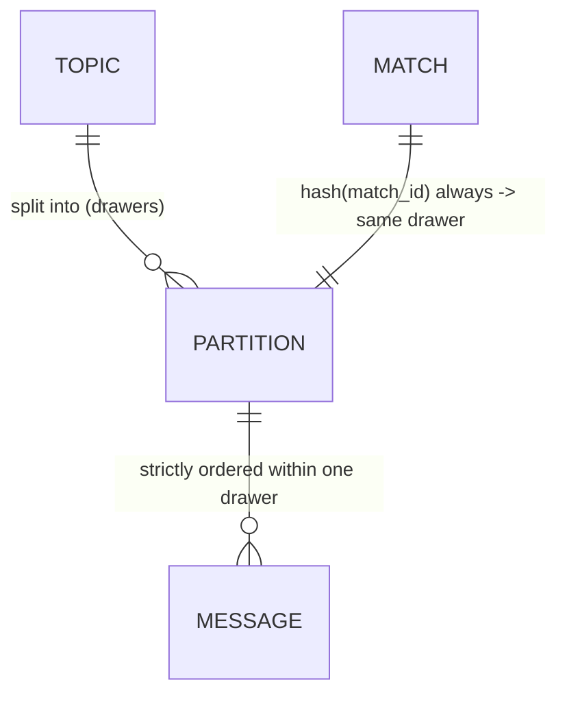

**New problem:** keying by `match_id` fixes per-match ordering — but it also means one match's *entire* traffic always lands in exactly one drawer, no matter how busy that match gets. What happens when one drawer gets far more traffic than the other eleven?

**How I'd say this in an interview:** "Ordering is a per-partition promise, never a global one — and it's only useful if you pin related events to the same partition with a key. Round-robin balances load but scrambles order across a business entity like a match; hashing on `match_id` restores order for that entity at the cost of a hot key becoming a hot partition — which is exactly the next problem."

---

## Chapter 4 — The one drawer that's on fire while eleven others sit empty

World Cup final day. Match #999 alone generates roughly **40% of all match-event traffic system-wide** that day `[illustrative]` — every goal, card, substitution, and VAR check for it, all pinned by `hash(match_id)` to the same single partition, drawer 7. A normal match produces 3-5 events/minute; the World Cup final sustains **35/minute**, spiking to **90/minute** during injury-time chaos `[illustrative]`. Kafka's own rule of thumb caps a healthy partition around **~10 MB/s of durable writes** before it needs help — drawer 7 blows past that ceiling while the other 11 drawers sit nearly idle. Replication lag on drawer 7 climbs, and every consumer reading it falls behind, while consumers on the other 11 partitions have nothing to do.

This is not a hypothetical for pub-sub systems at scale — it's the same shape of problem Twitter/X's engineers cite when one celebrity account's post fans out to 90M+ followers: one key, disproportionate load, everyone else's shard idle.

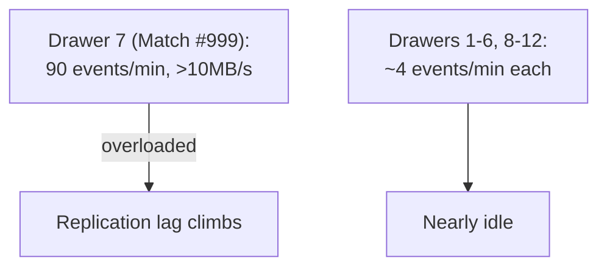

The question: can we spread one match's traffic across more than one drawer without losing the exact ordering guarantee Chapter 3 just bought? Only partly, and it costs something.

**The fix:** for pre-flagged marquee matches, **salt** the key — append a rotating suffix (`match_999_0` through `match_999_3`) so that one match's events spread across 4 sub-partitions instead of 1. ScoreWire applies this selectively: pure stat-tick events (which don't corrupt anything if slightly reordered) get salted; the events that actually decide fantasy correctness — goal validity, VAR outcome — stay on the unsalted key, so `fantasy-scoring`'s ordering guarantee from Chapter 3 is never put at risk. Salting trades strict single-match ordering for load spread, and only for the traffic that can afford to lose it.

**New problem:** spreading load across drawers doesn't protect against a drawer being physically destroyed. A broker's disk can just fail — taking its one and only copy of that partition's data with it.

**How I'd say this in an interview:** "A hash key that's great for ordering can become a hot-partition problem the instant one key's traffic dwarfs everyone else's — same failure mode as a celebrity account on Twitter/X. The fix is scoped salting: spread the load for traffic that can tolerate slightly looser ordering, and keep the correctness-critical events on the unsalted key."

---

## Chapter 5 — One copy of the drawer is a fire hazard, not a filing system

The broker hosting drawer 7 has a disk failure mid–Champions League final. With exactly one copy, whatever hasn't been read yet — roughly **400 unread goal and VAR events from the last 90 seconds** `[illustrative]` — is gone. `fantasy-scoring`, `analytics`, and `push-notifications` all silently lose that slice of the match, permanently, with no way to recover it.

**The fix:** replicate every partition — one **leader**, two **followers** (replication factor 3, the documented Kafka norm). The real design question isn't "should we replicate," it's *when does the leader tell the publisher "got it"* — the instant it writes locally, or only after followers confirm? Think of it as **one signature vs. a notarized form with witnesses**: a single signature is fast, but if the signer vanishes a second later, nobody else can vouch the deal happened; a notarized form with two witnesses present takes longer per signature, but survives losing any one of the three people in the room.

- **acks=1** (leader only): fast, but if the leader dies before replicating, that write is gone.
- **acks=all** (leader + all in-sync followers): safest, but as slow as the slowest follower.
- **Quorum** (leader + a majority of followers): most of the safety, most of the speed.

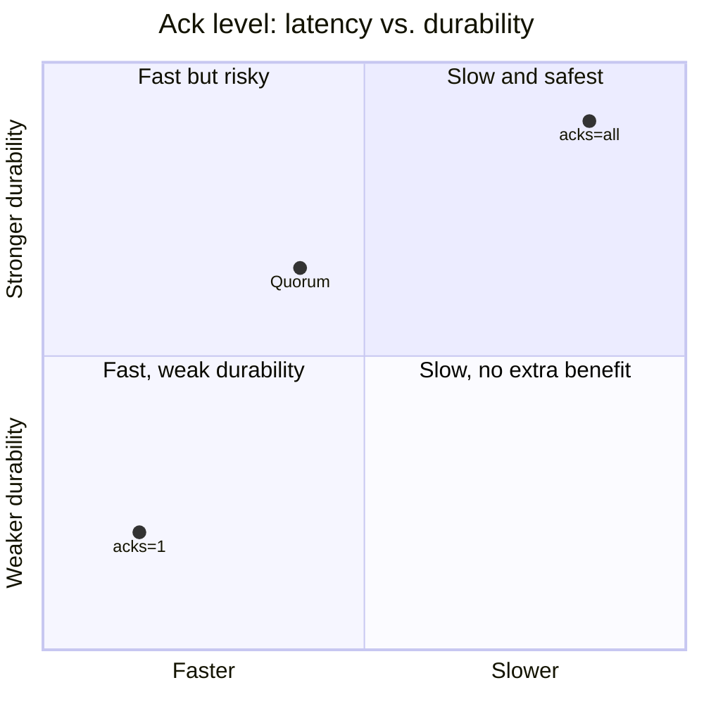

Worked numbers: same-AZ replication runs **~1-5ms** (documented Kafka range); cross-region is **50-150ms+**. ScoreWire uses `acks=all` with `min.insync.replicas=2` for goal/VAR events feeding `fantasy-scoring` (correctness-adjacent, since it eventually touches real payouts), but `acks=1` for pure stat-tick analytics events, where losing a rare one is genuinely cheap.

**New problem:** replication protects the *data*. It says nothing about who's currently *in charge* of drawer 7 if its leader briefly looks dead and then comes back.

**How I'd say this in an interview:** "Ack level is a durability-versus-latency dial, not a fixed property — `acks=1` for cheap, tolerant traffic, `acks=all` (or quorum) for anything that eventually touches money or correctness. Replication factor 3 is the number to say by default; then justify the ack level per topic, not system-wide."

---

## Chapter 6 — Two brokers both convinced they run the same drawer

A brief network blip makes drawer 7's leader look unreachable to ScoreWire's cluster manager (a ZooKeeper- or Raft-based system, like Kafka's own KRaft controller — documented, not invented). A follower gets promoted to leader. The network clears a few seconds later, and the *old* leader comes back online still fully convinced it's in charge — nobody told it otherwise. For a brief window, **two brokers both accept writes for drawer 7**, and roughly **12 goal-related events** land split across the two disagreeing copies `[illustrative]` — reconciling which order actually happened isn't automatic afterward.

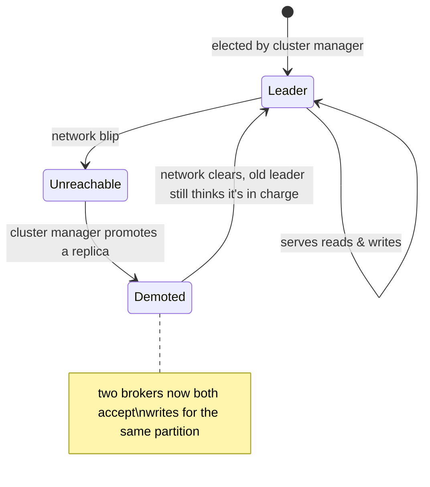

**The fix:** the cluster manager only promotes a replica that is genuinely **in-sync** (caught up within a bounded lag), and any leadership claim requires **majority agreement**, never a lone broker's own say-so. This is why Kafka moved from ZooKeeper to its own Raft-based KRaft controller, and it's the same quorum principle Chapter 5's replication already relies on, just applied to "who's in charge" instead of "how many copies exist."

**New problem:** the write side — durability, replication, leadership — is now solid. But nothing so far has protected the *read* side. What happens when the broker keeps handing messages to a subscriber that simply can't keep up?

**How I'd say this in an interview:** "Split-brain after a flaky failover is a real, named failure mode — solved with a quorum-based cluster manager that only promotes replicas that are actually caught up, and requires majority agreement before anyone gets to call themselves leader. That closes the write side for good; the read side is a completely separate set of problems, starting with backpressure."

---

## Chapter 7 — The firehose pointed at whoever happens to be slow today

`tv-overlay`'s consumer is push-subscribed — the broker sends it messages the moment they arrive, with no signal back about how busy `tv-overlay` actually is. During halftime of a big match, `tv-overlay`'s pipeline gets busy compositing a highlight reel and can only really finish **20 events/sec**, but the broker, having no idea, keeps pushing at the match's full **90 events/sec** pace. `tv-overlay`'s own in-process buffer, sized at **5,000 messages** `[illustrative]`, fills within under a minute, and the process runs out of memory and crashes — losing whatever was still queued.

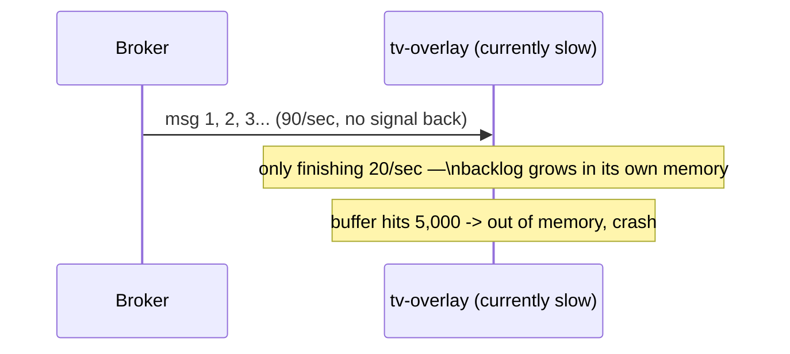

The question: why is the broker allowed to keep firing at a consumer that's visibly falling behind? Because push hands the broker the pacing decision, and the broker has no visibility into how full `tv-overlay`'s buffer already is.

**The fix:** flip control to the consumer — **pull**. `tv-overlay` asks for work only when it's ready to handle more, the same way Kafka consumers call `poll()` and SQS consumers call `ReceiveMessage` — both real, documented pull APIs. But pull alone still leaves an open policy question: what should actually happen while a subscriber is lagging, before it crashes?

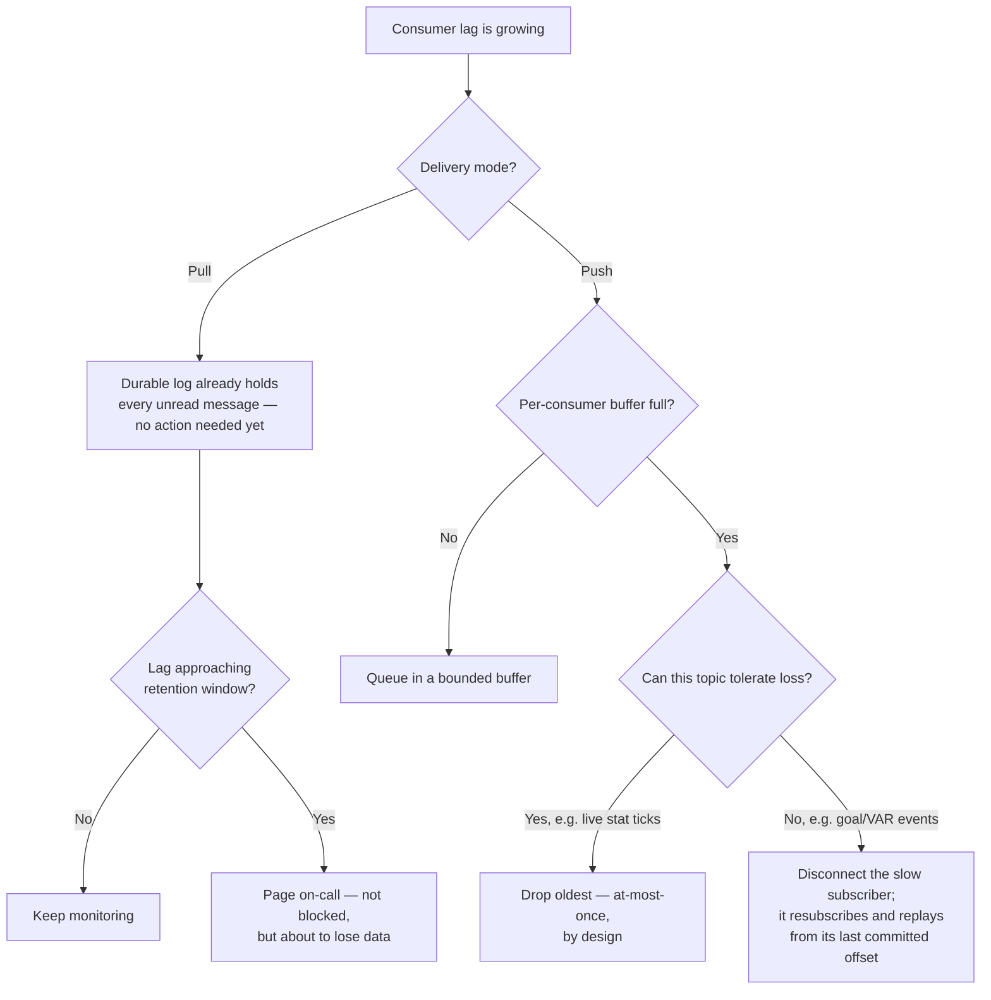

ScoreWire's actual policy: `tv-overlay`'s cosmetic stat overlays are allowed to **drop** under overload — a slightly stale graphic is fine. `push-notifications`, which must never silently lose a real goal alert, gets a bounded **buffer** with lag alerting, and only gets **disconnected** past a hard threshold, forcing it to resubscribe and replay from its last committed offset rather than lose anything.

**New problem:** pull plus a sane backpressure policy fixes "one slow consumer gets steamrolled or crashes." It says nothing about how ScoreWire gets more *total* throughput when one consumer, however well-paced, simply can't process fast enough alone.

**How I'd say this in an interview:** "Push has no backpressure signal — the broker can't tell it's overrunning a consumer until that consumer falls over. Pull fixes that because the consumer sets its own pace, same as Kafka's `poll()` and SQS's `ReceiveMessage`. On top of pull, you still need an explicit buffer/drop/disconnect policy per topic, because 'never block the producer' still leaves three real choices for the lagging consumer's unread messages."

---

## Chapter 8 — The department that got exactly half the memo

ScoreWire now has five independent subscriber teams reading `match.goal`: `push-notifications`, `tv-overlay`, `fantasy-scoring`, `analytics`, and `premium-payout`. To handle World Cup load, `push-notifications` scales from one consumer process to two, both correctly joining the same **consumer group** so the 12 partitions split between them. Someone on `analytics`, copy-pasting a config, accidentally sets their single consumer's group ID to the **same** group name `push-notifications` uses `[illustrative — a realistic config-copy mistake]`.

Because a consumer group guarantees each partition is owned by exactly **one** member of the group at a time, adding `analytics`'s consumer into that group means the 12 partitions now split **three ways** instead of `analytics` getting its own full copy. `analytics` silently receives only about 4 of the 12 partitions' worth of events — it misses roughly **67%** of goal events that day, and league-wide goal counts on its dashboard under-report by a third before anyone notices the box scores look wrong.

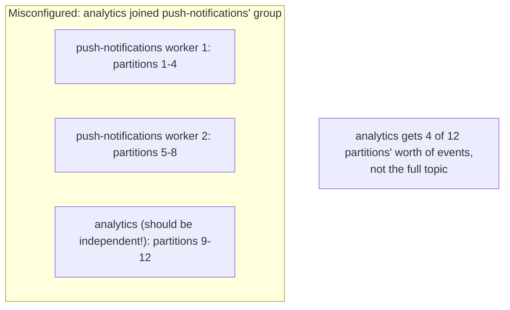

The question: pub-sub's whole promise is "every subscriber gets everything" — so how did adding a subscriber make another team see *fewer* messages? Because a consumer group is queue-like **only inside itself**. Accidentally sharing a group name turns broadcast into competing-consumers by mistake.

**The fix:** one consumer group **per independent subscriber team**, always. Multiple members inside *one* team's group is how that team parallelizes its own work (queue-like split of partitions); a separate group per team is what gives every team its own full, independent copy (true fan-out). Think of it as **interns splitting one stack of resumes to get through it faster (one group, load-balanced) versus five separate departments each getting their own full photocopy of the stack (five groups, each complete)**. This is the exact mechanism behind AWS's own SNS → SQS pattern: SNS fans a message out to N SQS queues, one per subscribing service — that's Design 1's "one queue per consumer" idea from Chapter 2, reappearing legitimately as a managed platform primitive, with each SQS queue then free to have its own competing consumers for that one team's horizontal scaling.

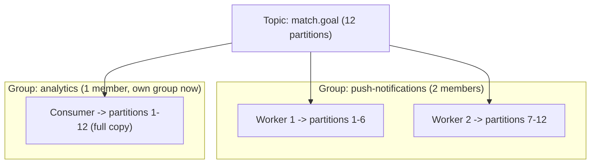

**New problem:** groups are separated correctly now, and every team gets its full, independent copy. But "gets a copy" and "processes it exactly once" aren't the same guarantee — what happens if a worker sends a duplicate?

**How I'd say this in an interview:** "A consumer group is how pub-sub gets queue-like load balancing back — don't say 'Kafka isn't a queue,' say 'Kafka is a queue when you only have one consumer group.' The bug to watch for is exactly this one: two teams accidentally sharing a group ID turns fan-out into competing consumers, and the symptom is one team silently seeing a fraction of the traffic it expects."

---

## Chapter 9 — The goal alert that got texted twice, and the payout that almost was

`push-notifications` occasionally double-sends: a worker processes a goal event, sends the push, then a network blip loses its ack back to the broker before that gets recorded. The broker, hearing no ack within its timeout, redelivers the same event to another worker in the group, which sends the notification **again**. Real rate during a rough match: about **0.3% of pushes duplicated** `[illustrative]` — a fan sees "GOAL!" twice, annoying but harmless.

`premium-payout`, which pays real cash prizes when a contest's final result event fires, reads the same topic through its own independent group. If that same redelivery hits `premium-payout` and its "pay the winner" logic isn't guarded, a fan could get paid **twice** — real money leaving twice for one event.

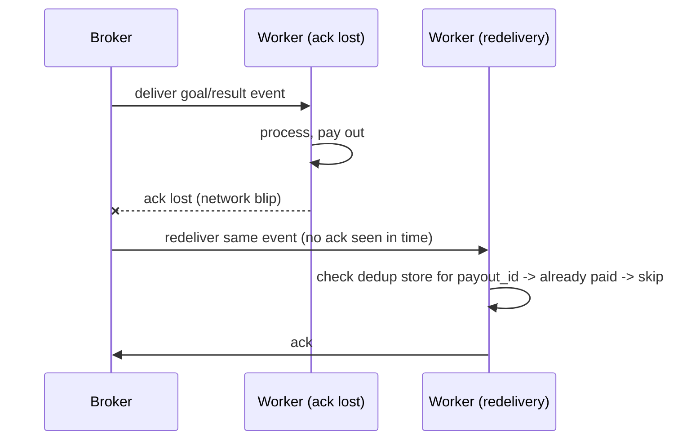

The question: is the fix to make redelivery not happen? No — pub-sub's default here is **at-least-once** (Kafka's default, SQS standard's default) precisely because "never redeliver" risks losing a message forever if a worker dies mid-processing, which is worse than an occasional duplicate. The fix is two-tracked, by cost: `push-notifications` accepts the rare cosmetic duplicate as cheap; `premium-payout` gets a **mandatory idempotency check** — dedupe key `contest_id + match_id`, check a dedup store before paying, skip if already recorded. That combination — an idempotent write plus a dedup check before acting — is exactly how exactly-once behavior gets bolted onto an at-least-once broker in real systems (Kafka's idempotent producer + transactional consumer pattern is the documented version of this same idea).

**New problem:** idempotency covers "processed twice." What about a message so malformed that `premium-payout`'s parser crashes on it every single time, and at-least-once just keeps redelivering it forever?

**How I'd say this in an interview:** "At-least-once is the default because losing a message is worse than duplicating one, but that pushes the duplicate-handling cost onto every consumer. Cheap, cosmetic consumers can just eat the duplicate; anything touching money needs a dedup store keyed on a business ID, not the message ID, because the message ID changes on every redelivery."

---

## Chapter 10 — The one corrupted score line that keeps coming back

A data-feed glitch produces one goal event with a **null `match_id`** — a real, common category of upstream data bug. Every consumer that touches it — `fantasy-scoring`, `premium-payout` — throws a parsing exception on contact. Because at-least-once redelivers anything unacked, this single bad event cycles back every retry interval — **every 10 seconds**, forever `[illustrative interval]` — each time stealing a worker's processing slot and slowing down every legitimate event queued behind it in that partition.

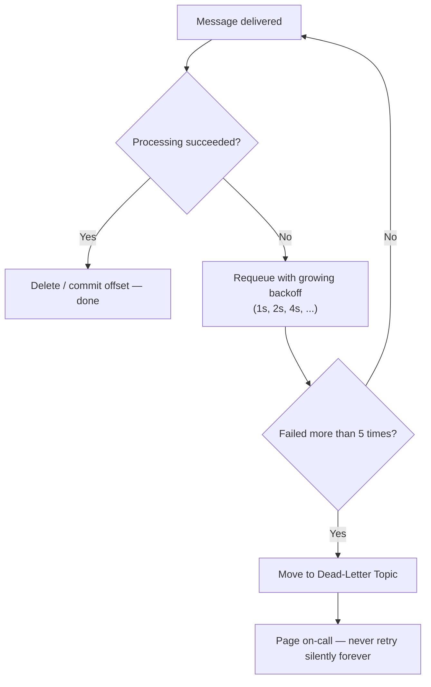

**The fix:** capped exponential backoff (grow the wait between retries instead of hammering every 10 seconds forever), then a hard cap — after, say, 5 failed attempts, move the message to a **Dead-Letter Topic** and alert on-call instead of retrying blindly. One bad event can no longer quietly steal capacity from everyone else in that partition forever; it gets visibly quarantined instead.

**New problem, and a tie-back:** correctness and reliability are solid now. But finance asks a fair question: as ScoreWire adds more sports, more leagues, and more subscriber teams, does the infrastructure bill blow up the way Chapter 2's photocopying mailroom did?

**How I'd say this in an interview:** "A poison message shouldn't retry instantly forever, and it shouldn't be silently dropped either — capped backoff, then a dead-letter topic with an alert, is the standard shape. The DLQ's whole job is making 'we gave up' a visible, actionable event instead of an invisible, infinite loop."

---

## Chapter 11 — The bill that doesn't grow just because more people are reading

Three years in, ScoreWire covers every major football league worldwide plus tennis, cricket, and esports. Peak combined traffic across all sports: **50,000 messages/sec**, average message size **1 KB**, retention **7 days** (for replay and debugging), replication factor **3**.

```
1. Write throughput
   Bandwidth_in = 50,000 msg/s * 1 KB = 50 MB/s

2. Storage per day (before replication)
   50 MB/s * 86,400 s = ~4.32 TB/day

3. Storage for 7-day retention (before replication)
   4.32 TB/day * 7 = ~30.2 TB

4. With replication factor 3
   30.2 TB * 3 = ~90.7 TB

5. Partition count (against the ~10 MB/s per-partition ceiling)
   50 MB/s / 10 MB/s = 5 minimum -> round up + headroom -> ~25-30 partitions
   (grown from Chapter 3's original 12, the same "pick it once with headroom" lesson)

6. Broker count
   If each broker reliably holds ~10 TB: 90.7 TB / 10 TB = ~9-10 brokers for storage,
   plus headroom for failure tolerance -> ~12-15 brokers

7. Fan-out bandwidth check
   Up to 8 independent subscriber groups reading the hottest topics:
   Bandwidth_out = 50 MB/s * 8 = 400 MB/s aggregate egress to plan network for
```

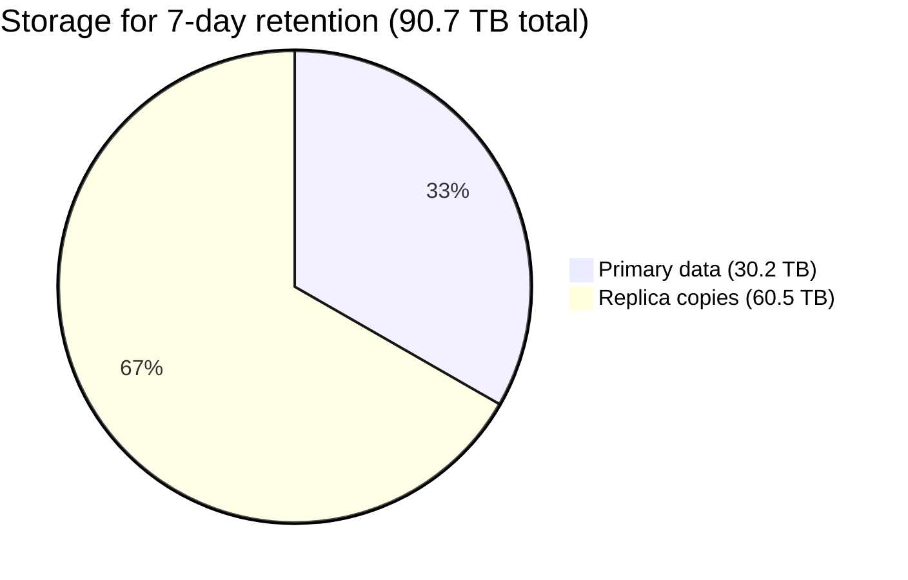

The number to say out loud, and the direct callback to Chapter 2: **storage doesn't care whether 1 team or 8 teams read a topic — it's the same 90.7 TB either way**, because nobody gets a private copy anymore. The only thing that scales with the number of subscriber groups is **read bandwidth** — 8 groups polling the same hot topic multiply read I/O, not disk. This is exactly why Design 2's log-based fan-out (Chapter 2's fix) beats Design 1's per-subscriber-copy mailroom: Design 1's storage bill scaled linearly with subscriber count; this doesn't.

**How I'd say this in an interview:** "The formula chain is msgs/sec times size, times retention, times replication factor, divided by per-broker capacity — memorize the shape, not the numbers, and redo it live if the interviewer changes an input. The one line that shows real understanding: fan-out ratio drives read bandwidth, never storage, and that's the whole reason a shared log beats copying the message per subscriber."

---

## Where the story actually lands

```mermaid
flowchart LR
    A["Ch1: RPC sprawl\n(one slow callee blocks all 4 teams)"] -->|"fixes: decouple\nbreaks: photocopy-per-subscriber design"| B["Ch2: shared log + offsets"]
    B -->|"fixes: no per-subscriber copy\nbreaks: one disk, one log"| C["Ch3: keyed partitions"]
    C -->|"fixes: per-match order\nbreaks: hot match, hot partition"| D["Ch4: salting"]
    D -->|"fixes: load spread\nbreaks: one copy per partition"| E["Ch5: replication + acks"]
    E -->|"fixes: durability\nbreaks: split-brain on failover"| F["Ch6: quorum leader election"]
    F -->|"fixes: writes\nbreaks: broker steamrolls slow reader"| G["Ch7: pull + backpressure policy"]
    G -->|"fixes: safe reading\nbreaks: shared group = fewer messages"| H["Ch8: one group per team"]
    H -->|"fixes: real fan-out\nbreaks: duplicates, sometimes with money"| I["Ch9: idempotency"]
    I -->|"fixes: safe redelivery\nbreaks: poison message loops forever"| J["Ch10: backoff + DLQ"]
    J -->|"fixes: quarantine\nfinance asks: does the bill scale?"| K["Ch11: fan-out is free on storage"]
```

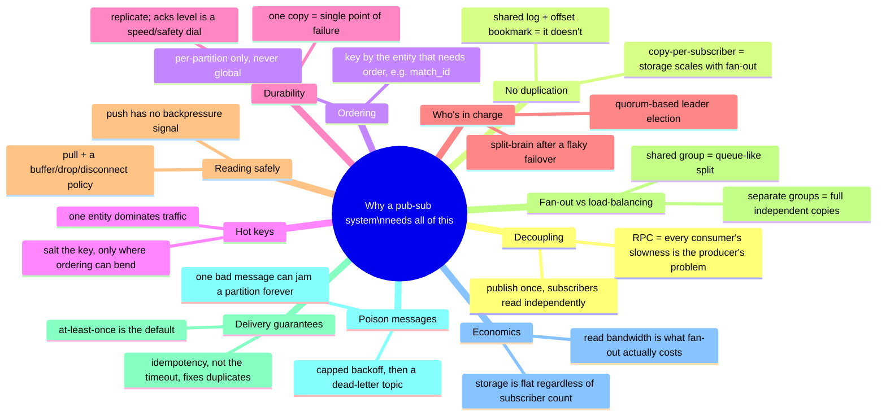

Every real pub-sub system you design in an interview sits somewhere on this chain. The skill isn't reciting all eleven chapters — it's stopping where the stated requirements say to stop. A best-effort notification fan-out might reasonably stop around Chapter 8. A system where a subscriber's action moves real money has to reach Chapter 9 and 10. If ordering never comes up, walking through Chapter 3's keying logic unprompted reads as padding, not depth.

---

## Grill me — adversarial follow-ups

**Q1: "What's the one-line difference between pub-sub and a message queue, and don't hedge?"**
A queue delivers each message to exactly one consumer; pub-sub delivers each message to every subscriber. If someone says "process this task exactly once by one worker," that's a queue question wearing a pub-sub costume — don't reach for consumer groups where a plain queue is the right answer.

**Q2: "Doesn't a consumer group basically turn your pub-sub system into a queue? So which one is it?"**
Both, depending on how many groups are reading. One group behaves exactly like a queue — each partition owned by one member, load split across them. Multiple independent groups on the same topic get full pub-sub fan-out. Kafka gives you both at once; you just choose group boundaries per independent subscriber.

**Q3: "You keyed by `match_id` for ordering — what happens the day you need to change partition count?"**
The same hash with a different partition count sends the same key to a different partition, which silently breaks ordering for anything mid-flight during the change. The real answer isn't a clever rehash — it's picking partition count with real headroom up front and treating it as fixed, the same discipline Kafka operators actually follow.

**Q4: "Why does `acks=all` need a majority, not just any one follower?"**
Because "any one follower" doesn't guarantee that follower is the one that gets promoted later — you could ack on follower A, lose the leader, promote follower B, and B never had that write. A majority guarantees any two quorums always overlap by at least one node, so whichever replica gets promoted provably has the latest acknowledged data.

**Q5: "If push is lower latency, why default to pull at all?"**
Push is only lower latency when the consumer can actually keep up — the moment it can't, push has no way to signal that back, and the consumer falls over. Pull gives up a few milliseconds of polling delay (mostly recovered by long polling) in exchange for a backpressure signal that's free. That trade is almost always worth it at scale.

**Q6: "Isn't at-least-once just a broken guarantee if it can double-deliver with no crash involved?"**
It's a deliberate trade-off, not a bug — the alternative is risking losing a message forever if a worker dies mid-processing, which is worse. The fix isn't a smarter timeout, it's making the consumer's side effect idempotent, keyed on a business ID like `contest_id`, so a duplicate delivery is harmless by construction.

**Q7: "Your hot-partition fix was salting — doesn't that just re-break the ordering you fixed in Chapter 3?"**
Yes, for the salted traffic, and that's said out loud on purpose — salting is only applied to events where slightly looser ordering is affordable (stat ticks), never to the events that decide correctness (goal validity, VAR outcome), which stay on the unsalted key. Every fix in this story buys one property by spending a different one; naming which one you're spending is the actual signal of depth.

**Q8: "If storage doesn't scale with subscriber count, what actually does, and when does that bite you?"**
Read bandwidth. Ten thousand consumers polling one hot topic multiply I/O on the brokers even though the underlying bytes on disk never change — that's the number to check before promising a system "scales infinitely with more subscribers," because the network and broker CPU absolutely don't scale for free.

**Q9: "Given this whole story, if someone says 'design a pub-sub system' cold, where do you start?"**
Ask two things before drawing anything: what delivery guarantee do they actually need (at-least-once is the default, exactly-once only for money-adjacent paths), and does ordering matter globally, per-key, or not at all — global ordering kills parallelism, so confirm it's real before designing around it. Then walk forward only as far as those answers require; partitioning and replication are close to a given, but salting, FIFO-style keyed ordering, and DLQs are things you earn by naming a specific requirement.

**Q10: "Where does Redis Pub/Sub fit into any of this?"**
It doesn't fit into most of this story at all, and that's the point to say explicitly — Redis Pub/Sub has zero persistence; if no subscriber is connected the instant something's published, that message is just gone. It's the right tool only when loss is fully acceptable and latency is everything, like a live cursor position — never for goal events, payouts, or anything this story's chapters 5 through 10 exist to protect.

---

## Cheat sheet — one line per stop on the story

- **RPC between services for a shared event**: every new subscriber means editing the producer, and the slowest callee sets the pace for everyone — the reason pub-sub exists at all.
- **Newsletter, not phone call**: publish once to a topic; the publisher doesn't know or wait on who's subscribed.
- **Shared log + offset bookmark**: replaces "one physical copy per subscriber" — the same bytes on disk serve one reader or a million at the same storage cost.
- **Keyed partitioning**: ordering is a per-partition promise only — pin a business key (like `match_id`) to a partition to get ordering for that entity; round-robin balances load but scrambles it.
- **Hot partition + salting**: one key can dominate traffic and overload its single partition; salting spreads it, at the cost of ordering for exactly that key.
- **Replication + ack level**: replication factor 3 is the default; `acks=1` is fast and risky, `acks=all`/quorum trades some latency for surviving a leader loss.
- **Quorum-based leader election**: prevents split-brain after a flaky failover — only an in-sync replica, backed by majority agreement, gets to be leader.
- **Pull + backpressure policy**: pull gives the consumer control of its own pace; buffer/drop/disconnect is the explicit decision for what happens to a lagging subscriber's unread messages.
- **One consumer group per independent subscriber team**: sharing a group by accident turns fan-out into competing consumers — multiple groups on one topic is what real fan-out looks like.
- **At-least-once + idempotency**: the default guarantee, made safe by deduping on a business key, not the message ID, which changes on every redelivery.
- **Backoff + dead-letter topic**: caps retries so one poison message can't jam a partition forever, and makes "we gave up" a visible, alertable event.
- **Fan-out is free on storage, not on bandwidth**: the single fact that explains why a shared log beats a per-subscriber-copy design at any real scale.
