# Distributed Search — The Story (narrative edition)

> **What this file is.** The reference file, `21-Distributed-Search-FAANG-Guide.md`, is the one to recite from — requirements, capacity math, every trade-off table, the master cheat sheet. This file is a second way in: the same material as one continuous story, told in plain language. Engineers at a company keep hitting a wall, patch it, and the patch itself creates the next wall — until we land on the exact same design the reference file documents. The company, **HireLoft** (a job-listing marketplace), is fictional. But every wall it hits, and every fix it reaches for, is something a real, named system actually does: Google's own 1998 "Anatomy of a Large-Scale Hypertextual Web Search Engine" paper (Brin & Page), Elasticsearch/Apache Lucene, Apache Solr with ZooKeeper, Algolia, Amazon product search, and FAISS (built by Meta) — all documented, real systems. I'll say clearly, every time, whether something is a documented fact or just a reasonable stand-in number, tagged `[illustrative]`.

**The one-sentence core idea, before any of the story:** flip the data from "document → words" (forward index) into "word → documents" (inverted index) — that single flip is what makes search fast — and then almost everything else in this story (sharding, replicas, freshness, ranking, semantic matching) exists only to build and serve that flipped structure at scale without ever falling back to scanning every document by hand.

**The trigger phrases** for this whole topic: *"design a search engine,"* *"how do you search billions of documents in under 200ms,"* *"design Elasticsearch,"* or *"design autocomplete."* Keep one line in your head as you read: **a card catalog beats reading every book, every single time, and the rest of this chapter is just "how do you keep the catalog correct, fast, fresh, and fair at a size no single desk can hold."**

---

## Chapter 1 — The search box that grinds Postgres to a halt

It's 2016. HireLoft is a small job board — 50,000 job postings, one Postgres box. The search bar runs, in plain SQL:

```sql
SELECT * FROM job_postings WHERE description ILIKE '%software engineer%';
```

At 50,000 rows this returns in about 40ms `[illustrative]`. Nobody thinks twice about it — it's simple, it works, ship it.

Two years and a lot of growth later, HireLoft has **5 million** job postings. That exact same query now takes **~9 seconds** `[illustrative]` and pins the database's CPU at 100% for the duration. Every search on the site — from every user, simultaneously — hammers the same table with the same kind of scan. The site's search page starts timing out under normal daytime traffic, not even a spike.

The obvious question: *didn't we already have an index on `description`? Why doesn't it help?* Because a B-tree index helps you find rows *sorted by* a value — it's useless for "does this text contain this substring *anywhere inside it*." With a wildcard on both sides of the term, Postgres has no shortcut: it has to read every single row's full text and check it by hand. That's an O(N) scan, and N just crossed 5 million.

**The fix, and the analogy for the rest of this story:** flip the data around. Instead of "document → does it contain this word," build "word → which documents contain it," once, ahead of time. This is the **inverted index**, and it's the single deepest idea in the entire chapter — Google's own 1998 founding paper (Brin & Page, "Anatomy of a Large-Scale Hypertextual Web Search Engine") describes exactly this: crawler → repository → indexer → inverted index. Elasticsearch and Apache Lucene are the modern, off-the-shelf version of the same flip.

**The analogy — reuse it every time this idea comes back:** think of a phone book. A normal phone book is *name → number* — a **forward index**. What you actually need for search is the *reverse* phone book — *number → who owns it*. You flip the whole book once, and now instead of reading every page to find who has a given number, you look it up directly.

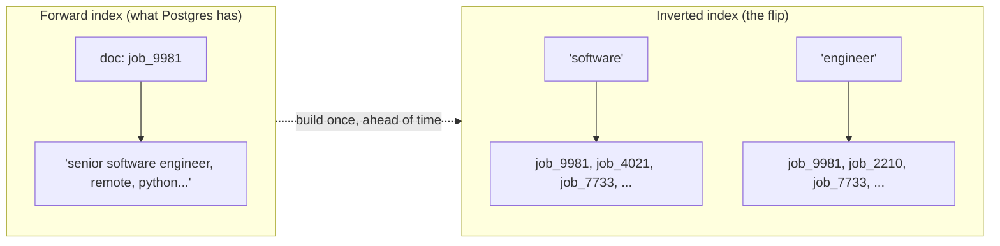

**New problem, immediately:** building the reverse phone book means splitting every posting's raw text into individual words. A naive splitter that just breaks on spaces treats `"Engineer"`, `"engineer,"`, and `"Engineers"` as three completely unrelated words — so the reverse phone book ends up with thousands of near-duplicate drawers that should really be one drawer.

**How I'd say this in an interview:** "The moment someone proposes a `LIKE '%term%'` query for search, that's the tell they haven't done this before — it's an O(N) scan with no way for an index to help. The fix is the inverted index: flip the data once from document-to-words into word-to-documents, and every search becomes a direct lookup instead of a scan."

---

## Chapter 2 — One word wearing five different costumes

HireLoft builds the naive inverted index by splitting on whitespace only. Real number: the term dictionary balloons to roughly **8 million** distinct "words" for a corpus that probably only has around 200,000 genuinely distinct concepts `[illustrative]` — because `"Engineer"`, `"engineer"`, `"engineer,"`, `"Engineers"`, and `"Engineering"` are each their own separate postings list.

Concrete failure: a job seeker searches `"software engineer"`. A real posting titled *"Software Engineers (2 openings)"* never shows up — the query term `engineer` and the posting's term `Engineers` are, to this naive index, two completely different words that happen to share ten letters.

The obvious question: *why not just store the text exactly as written?* Because search needs to match words that mean the same thing, not bytes that are identical — a plural, a capital letter, or a trailing comma shouldn't be able to hide a perfect match.

**The fix, name and analogy:** a **tokenizer/analyzer pipeline** — lowercase everything, strip punctuation, remove stopwords (`"the"`, `"a"`, `"is"`), and stem or lemmatize (`"running"` → `"run"`, `"engineers"` → `"engineer"`). Think of it as **a clerk who re-types every word onto a standard index card before filing it** — same case, same root form, no punctuation — so two people's different spellings of the same word land in the same drawer of the reverse phone book.

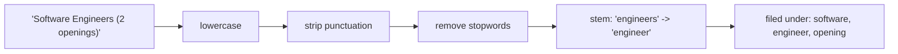

**New problem:** the clerk is now consistent, but that reveals a different issue — some words are used on almost *every* posting (`"job"`, `"opportunity"`, `"apply"`), so their drawer in the reverse phone book holds millions of entries, while a word like `"kubernetes"` holds a few thousand. This uneven, Zipfian spread of word popularity means a "match" on a common word tells you almost nothing about relevance — and right now, HireLoft's search has no concept of relevance at all. It just returns anything that matches, unordered.

**How I'd say this in an interview:** "Before you can build postings lists at all, you need a consistent analyzer — lowercase, strip punctuation, remove stopwords, stem — or the same real word ends up split across multiple, disconnected drawers. That fixes correctness of matching, but it doesn't yet tell you which of the matches is actually the *best* one — that's a separate problem."

---

## Chapter 3 — Every posting "matches," nobody's ranked

With tokenization fixed, `"software engineer"` correctly matches every posting containing both words. Real number: **40,000** of HireLoft's 5 million postings contain both terms somewhere `[illustrative]`. All 40,000 come back as equally valid "matches," in essentially insertion order — the job seeker gets a wall of results with zero signal about which one is actually good.

The obvious question: *how do we know which of these 40,000 is best?* Score them by how rare and how often the query words appear. **TF-IDF**: reward a document where the query's words show up frequently (**term frequency**), but discount words that appear across almost the whole corpus anyway (**inverse document frequency**) — a match on `"jobs"` means far less than a match on `"kubernetes"`, because almost every posting contains the word `"jobs"`.

```
tf-idf score(term, doc) = tf(term, doc) × idf(term)
idf(term) = log(N / doc_frequency(term))
```

**The fix works — and immediately gets gamed.** An employer notices that repeating `"software engineer"` fifty times in their job description makes their posting's term-frequency score balloon, and it rockets to page 1 regardless of whether the posting is actually good. TF-IDF has no ceiling on term frequency — the 50th occurrence of a word counts just as much as the 2nd.

**The real fix, name and analogy:** **BM25** — the actual default in Elasticsearch and Lucene since v5, and Solr's default too. Same underlying idea as TF-IDF ("how rare and how often"), but with **diminishing returns**: the 2nd occurrence of a word adds real score, the 50th adds almost nothing, and longer documents get length-normalized so padding out a description doesn't win by volume alone. Mnemonic: **BM25 is TF-IDF with common sense added.**

```
score(D, Q) = Σ_{t in Q} IDF(t) × ( f(t,D) × (k1+1) ) / ( f(t,D) + k1 × (1 - b + b × |D|/avgdl) )
   k1 ≈ 1.2 (controls how fast extra repeats stop mattering)
   b  ≈ 0.75 (controls document-length normalization)
```

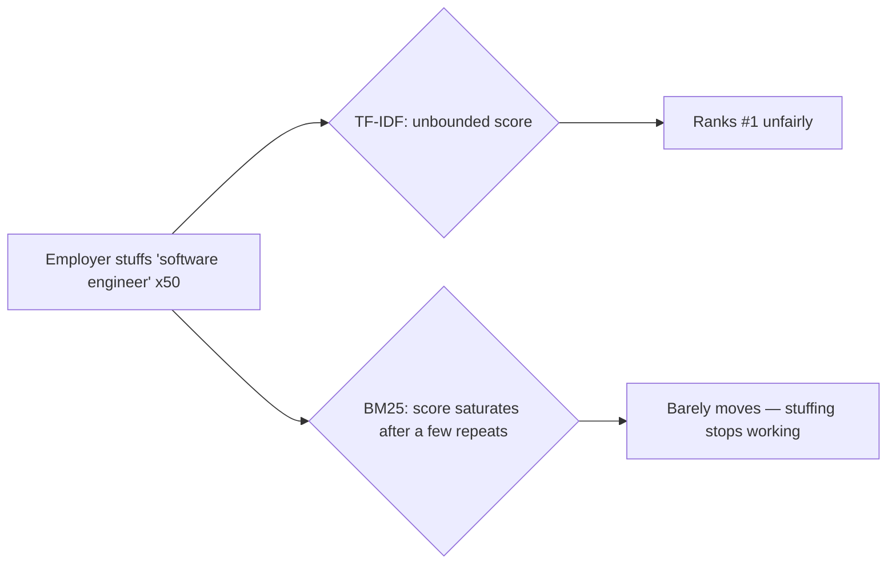

**New problem:** BM25 gives HireLoft genuinely good relevance ranking — but it's all still running against one index, on one machine, and that machine's disk and RAM are running out of room as the postings keep growing.

**How I'd say this in an interview:** "A boolean match tells you *whether* something's relevant, not *how* relevant — you need scoring. TF-IDF is the textbook starting point, but its term frequency has no ceiling, so keyword stuffing breaks it. BM25 fixes that by saturating term frequency and normalizing for document length — it's why it's the real default in Elasticsearch and Lucene today, not just a textbook exercise."

---

## Chapter 4 — The catalog outgrows the librarian's desk

Do the math on index size. Each posting's raw text is about 5KB. After tokenizing and dropping stopwords, roughly 300 distinct terms survive per document `[illustrative]`, and each postings entry (doc id + frequency + positions) costs about 100 bytes — the same per-term storage estimate real systems actually use. That's `300 × 100 = 30KB` of postings overhead, plus the 5KB raw text, so **~35KB per document**.

```
Total index size ≈ 5,000,000 docs × 35KB ≈ 175 GB
```

HireLoft's single search box has **64GB of RAM** `[illustrative]`. 175GB doesn't fit — most of the index lives on disk, every query pays disk-seek latency instead of RAM-speed lookups, and the box is also a hard single point of failure: if it goes down, search goes down entirely, for everyone.

The obvious question: *split by word, or split by document?* Two real options. **Term partitioning** — one node owns a slice of the *dictionary* (say, all words A-M), across *all* documents. **Document partitioning** — each node owns a slice of the *documents*, with a complete mini-index for just that slice. Term partitioning sounds appealing (queries could, in theory, hit fewer nodes) — but almost every real query has multiple words, and intersecting `"software"` on node A with `"engineer"` on node B means shipping one node's entire (possibly huge) postings list across the network just to compute an intersection. Document partitioning keeps every node fully self-sufficient for its own slice.

**The fix, name and analogy:** **document partitioning** — the same choice Elasticsearch, Solr, and Google's own original design make. Think of it as **splitting one overflowing card-catalog room into many smaller reading rooms, each with a complete catalog for its own slice of the books** — no reading room ever needs to phone another one mid-search.

```
Shard target size ≈ 20 GB (comfortably fits in a node's RAM/cache)
Shard count = 175 GB / 20 GB ≈ 9 → round up with headroom → 10 shards, ~17.5 GB each
```

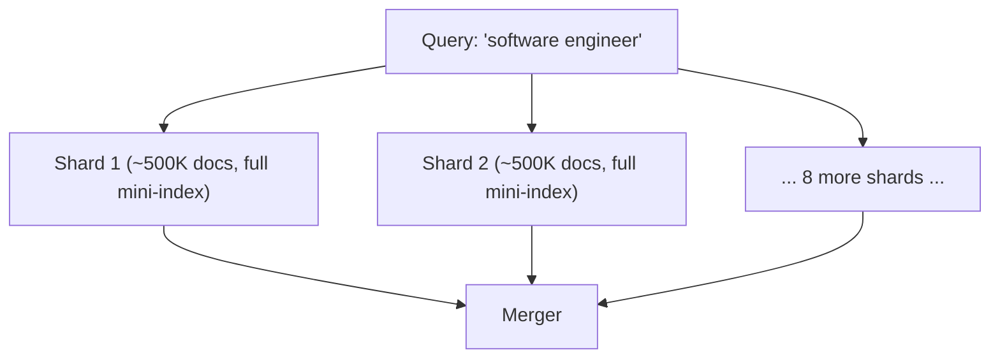

**New problem:** now every query has to fan out to all 10 shards and wait for every one of them to answer before merging results — and the total response time is only ever as fast as the *slowest* shard that responds.

**How I'd say this in an interview:** "Document partitioning wins over term partitioning almost every time in practice, because real queries have multiple words, and term partitioning would force huge postings lists to be shipped between nodes just to intersect them. Document partitioning keeps each shard self-sufficient — the trade-off is every query now has to fan out to every shard, which becomes the next bottleneck."

---

## Chapter 5 — The slowest reading room sets everyone's pace

Real number: HireLoft's query fans out to 10 shards. Nine respond in **20ms**. The tenth — currently running a garbage-collection pause, or just handling a spike of a trending term — takes **3,000ms**. The whole search request takes 3,000ms, even though 90% of the actual work finished in 20ms.

The obvious question: *do we just wait for the slow one?* No — that's the whole tail-latency trap of scatter-gather: your p99 is dominated by your slowest shard, not your average shard. Set a hard budget instead. HireLoft's end-to-end target is **200ms**; they reserve about **100ms** for the shard fan-out specifically, leaving the rest for merging and network overhead.

**The fix, name and analogy:** per-shard **timeout + partial results**, plus optionally a **hedged request** (fire a duplicate request at a replica if the primary hasn't answered by some point, and take whichever comes back first). Think of it as **closing the coffee-shop order line the instant the espresso machine jams — serve everyone who already has a drink, don't make the whole line wait for one broken machine.**

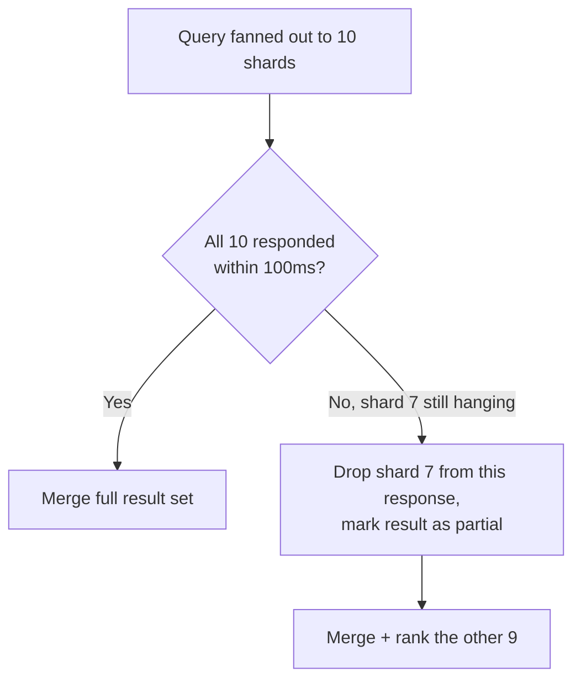

**New problem, an honest one:** a shard that gets dropped from the merge means the perfect result — sitting on exactly that shard — occasionally goes missing from a user's results. This is a deliberate, accepted trade: search already favors availability and speed over perfect completeness (the same AP-leaning consistency choice that runs through this whole design), so "95% complete in 100ms" beats "100% complete in 2 seconds."

**How I'd say this in an interview:** "In any scatter-gather system, your tail latency is set by your slowest shard, not your average one — so you cap it with a hard per-shard timeout, return partial results, and optionally hedge to a replica. It's a deliberate trade of occasional incompleteness for consistently fast, available search."

---

## Chapter 6 — Adding one more room reshuffles the whole building

HireLoft's 10 shards live on 5 machines, 2 shards per machine, placed with `shard_id % num_machines`. Traffic grows, and they add a 6th machine for headroom. Under `% 5` versus `% 6`, the assignment for most shards changes overnight — worked number: **8 of the 10 shards** get reassigned to a different machine `[illustrative]`, meaning roughly **140GB** of index data has to be recopied across the network, just to add one box.

The obvious question: *can we add a machine without reshuffling almost everything?* Yes — **consistent hashing**, the same real, documented mechanism behind Amazon's Dynamo and Cassandra's ring, applied here to "which machine hosts a shard" instead of "which node holds a cache key."

**The analogy — reuse it whenever a machine is added or removed:** picture a **circular clock face with pegs**. Every machine claims a spot on the clock (hash of its own ID). Every shard also lands somewhere on the clock (hash of its shard number). A shard is owned by whichever machine's peg comes next, going clockwise. Add a peg, and it only steals the shards that now fall in the small gap right before it — nobody else on the ring moves.

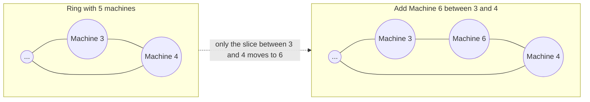

Redo the math on the ring: adding a 6th machine only moves the shards that fall in its one slice of the clock — roughly `10 / 6 ≈ 1-2 shards`, not 8. Same goal, a fraction of the disruption. Mnemonic: **"ring, not modulus"** — a ring reshuffles a slice; a plain modulus reshuffles nearly everything.

**New problem:** consistent hashing answers *which one machine currently owns this shard* — it says nothing about what happens if that *one* machine simply dies. Each shard still has exactly one copy. That's the same single-point-of-failure disease from Chapter 4, just shrunk down to one-tenth of the system instead of the whole thing.

**How I'd say this in an interview:** "Consistent hashing turns 'add a machine' from 'remap almost everything' into 'remap the one slice near it' — the same trick Dynamo and Cassandra use for cache/data placement, just pointed at shard-to-machine assignment here. But it only solves placement — it says nothing about durability when the one machine holding a shard just fails."

---

## Chapter 7 — The printing press: compute once, copy many

One machine hosting shard 7's only copy suffers a disk failure. Real number: that shard held about **500,000** job postings `[illustrative]` — all instantly unsearchable, and because this is document partitioning, it's specifically that 500K slice that vanishes, not a random scattering. Rebuilding it from raw documents (re-tokenize, re-score, rebuild postings) takes real time — easily 20+ minutes for that one slice alone.

The obvious question: *just keep a spare copy of every shard, then?* Yes — but naively, that means each replica independently re-runs the **entire** tokenize-and-BM25-score pipeline on its own copy of the raw documents. Three replicas, three full pipeline runs, for the exact same deterministic output — 3x the CPU for zero extra benefit.

**The fix, name and analogy:** compute the index **once**, on the primary/indexer, then **replicate the resulting binary segment as bytes**. This is the classic "compute once, ship bytes" move — the same principle behind CI/CD build-artifact caching, and the reason HDFS, Cassandra, and Kafka all default to a **replication factor of 3**, spread across availability zones. Think of it as **a printing press**: a book is typeset once, and copies are shipped to branch libraries — branches don't re-typeset their own copy from the manuscript.

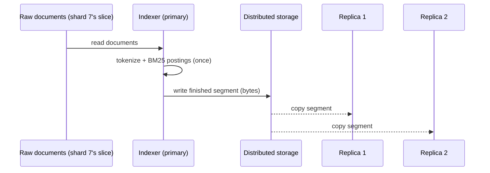

**New problem:** the indexer that just typeset shard 7's segment is running on the *same box* that serves live search queries against that shard. A big reindex job — say, that nightly batch run — hogs the CPU on that box, and search latency for anyone querying shard 7 spikes while it's happening, purely because two very different jobs share one machine.

**How I'd say this in an interview:** "Replicate the computed artifact, never the computation, whenever the computation is deterministic and expensive — compute once on a primary, ship the binary segment to the replicas. RF=3 across AZs is the industry default here for the same reason HDFS and Kafka use it. But that still leaves indexing and searching competing for the same box's resources, which is the next thing to pull apart."

---

## Chapter 8 — The librarian who can't also run the printing press

HireLoft runs a nightly full reindex on the same boxes that serve live search. Real number: the job pins CPU at 95% for **40 minutes** every night, and search p99 latency during that window jumps from **150ms to 2,800ms** `[illustrative]` — job seekers browsing late at night (a genuinely large segment for a job board) get a visibly broken experience, caused entirely by an unrelated batch job.

The obvious question: *why does one job's batch work get to slow down someone else's completely unrelated live query?* Because they're colocated — same node, same CPU pool, same disk queue. Indexing (CPU/IO-heavy batch work) and searching (RAM/latency-sensitive serving) have opposite resource profiles, and sharing a box means one always steals from the other.

**The fix, name and analogy:** split into two fully independent fleets — an **indexer fleet** (batch/MapReduce, write path) and a **searcher fleet** (read path) — that never call each other directly. They only communicate by dropping off and picking up files at a shared **distributed storage layer**. Think of it as **a loading dock**: indexers drop finished boxes off at a shared warehouse dock; searchers grab whatever's on the dock whenever they're ready to; neither one ever picks up the phone to call the other. Each fleet scales on its own metric now — indexing throughput on one side, query QPS on the other.

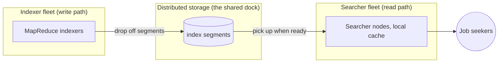

**New problem:** because searchers now only **pull** new segments from the dock on their own schedule, instead of the indexer **pushing** the moment it's done, a brand-new job posting can sit at the dock for a while before any searcher happens to come pick it up. Freshness now depends entirely on how often searchers check the dock — and right now, that's "once a day, at 2am."

**How I'd say this in an interview:** "When two subsystems have opposite resource profiles — batch CPU versus latency-sensitive RAM — you decouple them with a durable intermediate store instead of trying to schedule around the contention on shared boxes. Pull-based updates from that store are also naturally resilient — a new searcher just pulls the latest segment with zero coordination with the indexer. The cost is freshness now depends on how often searchers happen to pull."

---

## Chapter 9 — The corkboard that never needs a full rewrite

HireLoft's batch MapReduce reindex runs once a day, at 2am. Real complaint: an employer posts a job at 9am; a candidate searching at 10am gets **zero results** for it, because the next reindex isn't until 2am the *next* day — up to **17 hours** of total invisibility `[illustrative for HireLoft's specific schedule; the general batch-freshness gap is a real, documented pattern — it's exactly why Twitter/X search needed to move off pure batch indexing]`.

The obvious question: *just run the full nightly job more often — every 5 minutes?* Technically works, but wildly wasteful: reprocessing 5 million unchanged postings from scratch just to pick up the 40 new ones that showed up since the last run.

**The fix, name and analogy:** **near-real-time (NRT) incremental indexing** — append a small new segment containing *only* the new or changed documents, and make it searchable within seconds, without touching the rest of the index at all. This is exactly Elasticsearch's default behavior: a **refresh interval of 1 second** creates a new searchable Lucene segment without a full commit. Think of it as **pinning a new index card to the corkboard right next to the old catalog drawers, instead of retyping the entire catalog every time one thing changes.**

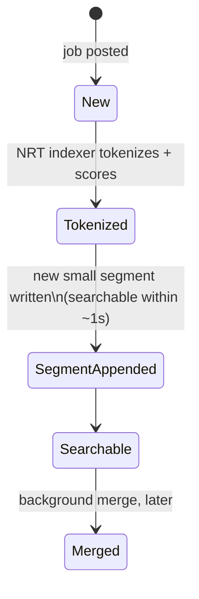

**New problem:** appending nonstop creates hundreds of tiny segments — fragmentation. Every query now has to check dozens of small segments instead of one tidy one, which slows queries back down, and deletes have to be handled as **tombstones** (marked, not physically removed) needing later cleanup.

**The fix to the fix:** a **background segment merge** — Lucene's actual, documented merge policy — compacts small segments together during idle time, paying the cost in the background so query-time cost stays bounded. Mnemonic worth memorizing: **"Rebuild, Append, Merge"** — full rebuild (batch), append new segments (NRT), background merge (keeps read-time cost sane).

**How I'd say this in an interview:** "Batch reindexing has an unavoidable freshness ceiling — you're only as fresh as the last full run. NRT fixes that by appending small segments continuously, which is literally Elasticsearch's default 1-second refresh. The cost is fragmentation, which is why Lucene pairs append with a background merge policy instead of just letting segments pile up forever."

---

## Chapter 10 — The new hire who can't fix yesterday's paperwork

Eight months later, HireLoft's search team notices `"Engineer"` in a job title never matched `"Engineering"` — they'd forgotten to stem the *title* field specifically. They flip on stemming for titles. Real number: the fix applies instantly to any *new* posting appended via NRT — but the other **4.96 million** existing postings were tokenized under the *old* rule and are now silently inconsistent with new documents, in the exact same field, in the exact same index.

The obvious question: *can NRT's append mechanism just quietly reprocess the old docs too, in the background?* No — NRT only ever *appends* new segments forward; it has no mechanism to reach backward and retroactively re-tokenize documents whose postings were already written under the old rule.

**The fix, name and analogy:** a **full reindex** — a MapReduce/Spark pass over the *entire* corpus with the new analyzer, published as a brand-new index version — followed by an **atomic cutover**: flip an alias or version pointer once the new index is fully built and verified, while the *old* index stays live and keeps serving every query the entire time the rebuild is happening.

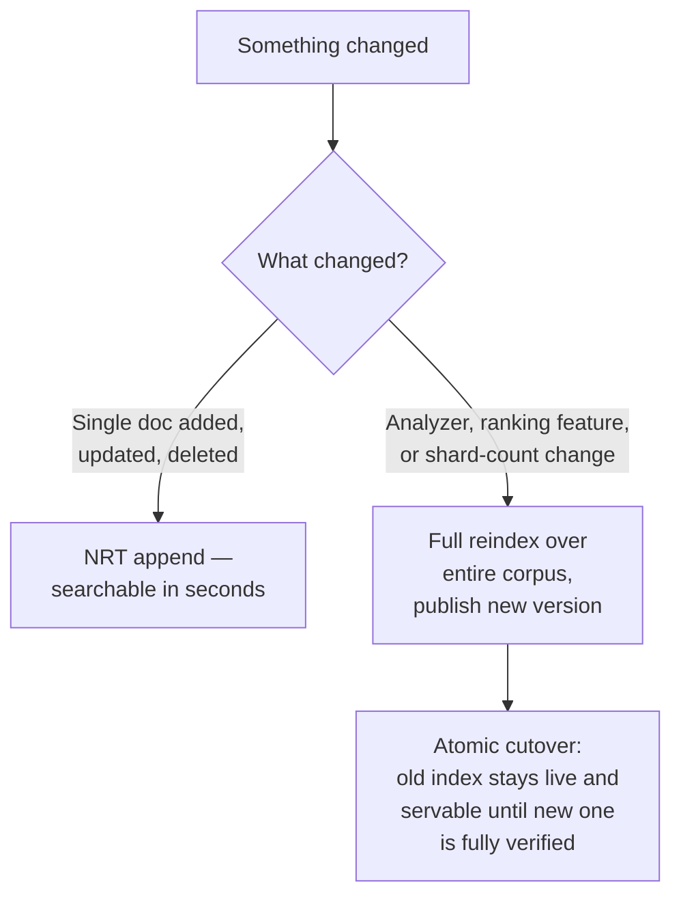

**The rule to say out loud:** *if it's new or changed data → NRT append. If it's new logic applied to old data → full reindex.* Both paths stay permanently available side by side — this isn't a "pick one" decision, it's "know which one this specific change actually needs."

**How I'd say this in an interview:** "NRT and full reindex solve different problems, and real systems keep both. NRT can't retroactively fix how existing documents were tokenized or scored — only a full pass over the whole corpus can, and you cut over atomically so the old index keeps serving until the new one's verified, no downtime either way."

---

## Chapter 11 — The clerk who checks the dictionary, not every book

A job seeker types `"sofware enginer"` — an extremely common typo pattern. The inverted index looks up the term `"sofware"` and finds **zero postings** — that exact string simply doesn't exist as a term. Zero results come back, for a site holding thousands of matching jobs, purely because of two typos.

The obvious question: *do we scan every document looking for near-matches?* Far too slow — that's back to O(corpus). Do it over the **term dictionary** instead — thousands of distinct terms — not the corpus of millions of documents. Same scale trick as the forward-vs-inverted flip from Chapter 1: work against the small structure, not the big one.

**The fix, name and analogy:** **fuzzy search** — either a **Levenshtein-automaton** (bounded edit distance, e.g. Lucene's real `FuzzyQuery`) or **n-gram/trigram indexing** (Elasticsearch's n-gram tokenizer, PostgreSQL's `pg_trgm`), both operating over the dictionary. Think of it as **a spell-check clerk who only has to flip through the dictionary's few thousand entries looking for something close to what you typed — not skim every book on every shelf.**

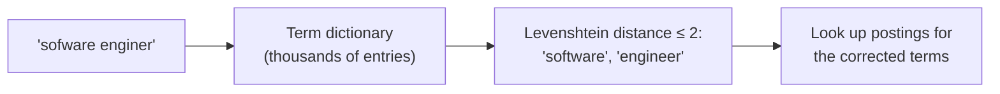

**Same chapter, same underlying trick, a second use case:** autocomplete. The naive approach — running a live search on every keystroke — is slow and wasteful. The real fix is a **precomputed top-K per prefix**, built offline from query logs and refreshed periodically, not computed live. This is exactly Elasticsearch's completion suggester. Analogy: **a cheat sheet already taped under each starting letter, listing the most popular finished words — you just read it, you don't look anything up live.**

**New problem, a quieter one:** even with typos and prefixes handled, the same handful of queries — `"software engineer remote"`, `"data analyst"` — get typed thousands of times a day. Re-running full retrieval and ranking for the exact same query over and over is pure waste. Fix: a thin **query-result cache**, keyed on normalized query + filters, with a short TTL (e.g. 60s) rather than exact invalidation — justified by the fact that query distributions are Zipfian (the top 1% of distinct queries commonly account for 20-30%+ of total volume), and search is already eventually consistent anyway.

**How I'd say this in an interview:** "Fuzzy search and autocomplete both work over the term dictionary, not the documents — that's the same scale trick as the inverted index itself, just applied one level up. Autocomplete specifically should never be a live search per keystroke — it's a precomputed top-K per prefix, refreshed offline, which is exactly how Elasticsearch's completion suggester works."

---

## Chapter 12 — Two librarians, one literal, one who gets the vibe

A job seeker searches `"entry level developer"`. HireLoft has a great, real match — a posting titled *"Junior Software Engineer"* — with **zero literal word overlap** against the query. BM25 gives it a score of essentially zero; it never even enters the candidate set, no matter how good a match it actually is.

The obvious question: *is this a ranking bug?* No — it's a **retrieval** bug, one level earlier than ranking. Pure lexical/BM25 retrieval is fundamentally a term-matching operation; it has no notion of meaning at all. `"entry level developer"` and `"junior software engineer"` share zero words, but they mean almost the same thing to a human.

**The fix, name and analogy:** **embeddings** — a bi-encoder model maps both documents and queries into vectors, positioned so that meaning-similar text lands close together in vector space — plus **ANN (approximate nearest neighbor) search** (HNSW or IVF-PQ, via a library like FAISS, built by Meta) to make nearest-neighbor lookup over billions of vectors fast enough for query time. Run BM25 (lexical) and vector/ANN (semantic) retrieval **in parallel**, then fuse the two ranked lists with **Reciprocal Rank Fusion (RRF)**:

```
RRF_score(doc) = Σ_{retriever r} 1 / (k + rank_r(doc))     where k ≈ 60
```

Think of it as **two librarians working the same desk** — one matches your exact words (BM25), one gets the gist of what you meant (embeddings) — and instead of picking just one librarian's opinion, you shuffle their two stacks of recommendations together.

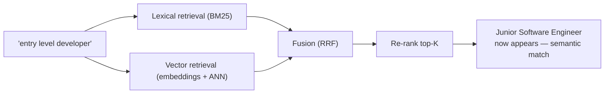

**New problem, a different flavor:** HireLoft's employer dashboard lets an employer search only *their own* postings — maybe 40 out of 5 million. Because sharding is by `hash(doc_id)`, those 40 postings are scattered across all 10 shards, so this tiny, tenant-scoped query still pays the *full* 10-shard scatter-gather cost every single time, for an answer set that would comfortably fit on one shard if the data were laid out with that in mind.

**The fix:** add a `routing_key` (e.g. `employer_id`) at index time so one employer's postings intentionally colocate on a small number of shards; the router checks whether an incoming query carries that key and, if so, targets *only* those shards instead of the full fan-out. Mnemonic: **"a key skips the scatter."**

**How I'd say this in an interview:** "Pure lexical retrieval can't catch the semantic gap — 'entry level developer' and 'junior software engineer' share no words but mean the same thing. The fix is hybrid retrieval: BM25 and vector/ANN search run in parallel, fused with RRF, then re-ranked. Separately, when a query carries a known routing key like a tenant ID, you skip full fan-out and go straight to the shards that own it — don't pay scatter-gather cost you don't need."

---

## Chapter 13 — Tasting the soup before it's on the menu

HireLoft's ranking team tunes BM25's `k1`/`b` parameters, likes what they see on a handful of manual test searches, and ships it straight to 100% of users. Two weeks later, click-through rate has quietly dropped **4%** `[illustrative]` and employer complaints are up — nobody caught it, because nobody measured anything *before* shipping it to everyone.

The obvious question: *how do you actually know a new ranking model is better before risking it on real users?* Gate it in two stages — cheap and safe first, then real signal on a controlled slice of traffic.

**The fix, name and analogy:** **offline evaluation** first — NDCG or MRR against a held-out query set, using labeled or click-log-derived relevance — since it's cheap and puts zero real users at risk. Then **online evaluation** — an A/B test, or **interleaving** (which needs far less traffic than a full A/B split for the same statistical power, since a single query gives a signal, not a whole user session) — on live traffic, always checked against a **guardrail metric** (like p99 latency, or how much the change shifted the mix toward sponsored results) so a model can't "win" on the primary metric by quietly breaking something else that matters.

Think of it as **a chef tasting their own dish first (offline), then sending it out to a few tables as a special before it becomes the whole restaurant's default (online) — and if a food critic (the guardrail metric) hates it, it doesn't make the permanent menu, even if a couple of tables enjoyed it.**

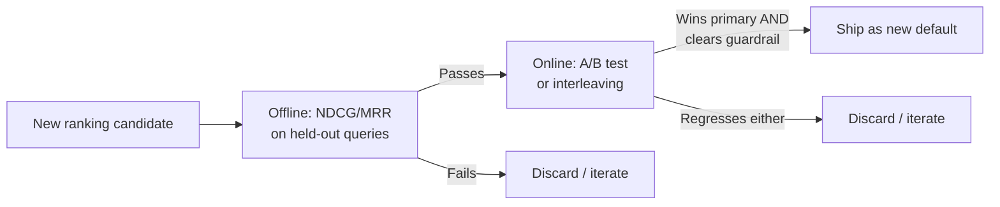

**No new problem here — this closes the loop.** From here, relevance work is continuous iteration against measured behavior, not another architectural wall to break through.

**How I'd say this in an interview:** "Never ship a ranking change on offline metrics alone — offline tells you it *might* be better, online tells you it *is* better. Gate with NDCG or MRR first, then confirm with an A/B test or interleaving on live traffic, and always check a guardrail metric alongside the primary one, so you can't accidentally win by trading away something that matters."

---

## Where the story actually lands


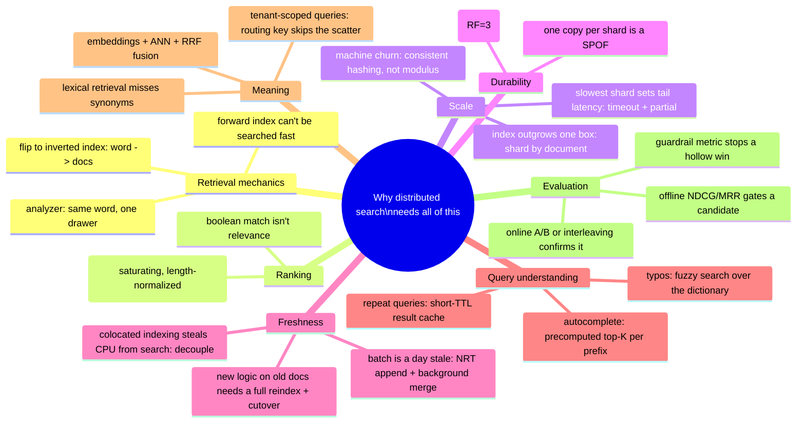

Every real production search system sits *somewhere* on this chain. The skill in an interview isn't reciting all thirteen chapters — it's stopping where the stated requirements say to stop. A small internal tool's search might reasonably stop around Chapter 4 or 5. A consumer-facing, semantically-rich, constantly-tuned search product has to walk all the way to Chapter 13.

---

## Grill me — adversarial follow-ups

**Q1: "Why not just add a proper index on the `description` column instead of building a whole search system?"**
Because a B-tree (or any standard database index) helps you find rows sorted by a value — it can't help "does this text contain this substring anywhere." A `LIKE '%term%'` scan is O(N) no matter what index sits on the column; the only real fix is a structure built specifically for term lookup, which is the inverted index.

**Q2: "Walk me through what happens if a shard's primary dies in the middle of an indexing run."**
If the segment hadn't been published to distributed storage yet, nothing is lost — the indexer job just gets rescheduled and reruns that partition, same as any MapReduce task failure. If it *had* been published, the replicas already have the bytes and searchers keep serving from them uninterrupted; the only work lost is whatever partial segment was still being computed in memory.

**Q3: "Doesn't sharding just turn one single point of failure into ten smaller ones?"**
Yes, exactly — and that's precisely the gap Chapter 7's replication closes. Sharding alone only buys throughput and RAM headroom; it takes replicating each shard's computed segment (RF=3, spread across AZs) to actually remove the single-point-of-failure risk per shard.

**Q4: "Why does document partitioning win over term partitioning given how much the interviewer's example query relies on intersecting multiple terms?"**
Because that's exactly the case that breaks term partitioning — a multi-word query under term partitioning means shipping large postings lists between the nodes owning each term just to intersect them, and almost all real queries are multi-word. Document partitioning avoids that entirely: every node already has everything for its own document slice, so the merge is a cheap union, not an expensive cross-node intersection.

**Q5: "If BM25 solves keyword stuffing, why does TF-IDF still get mentioned at all?"**
Because it's the simplest correct starting point that shows you understand the underlying idea — reward frequency, discount rarity across the corpus — before you explain what's actually wrong with it. Saying "TF-IDF, but it has no ceiling on term frequency, so BM25 fixes that with saturation and length normalization" is a stronger answer than jumping straight to BM25 with no explanation of why it exists.

**Q6: "If NRT can index a new document in about a second, why does full reindex still exist at all?"**
Because NRT only ever appends forward — it has no way to reach back and fix how *existing* documents were already tokenized or scored. Change the analyzer, add a new ranking feature, or change the shard count, and every already-indexed document is now inconsistent with new ones until a full pass reprocesses the whole corpus, which is exactly why real systems like Elasticsearch keep a reindex API alongside NRT rather than picking one.

**Q7: "Why not just run every query through the vector/embedding index and skip BM25 retrieval entirely?"**
Because pure vector search sacrifices exact-match precision — SKUs, IDs, error codes, exact job titles someone typed verbatim all need literal term matching, and embeddings can blur exactly the kind of precision those need. That's why production systems default to hybrid retrieval, running both in parallel and fusing with RRF, instead of replacing lexical search outright.

**Q8: "How do you decide when a query needs a routing key versus just always doing full fan-out?"**
Full fan-out is the correct default for open-ended free-text search, because you generally don't know in advance which shards hold the answer. A routing key only makes sense when the data model has a natural, known access pattern — like one tenant's data always being queried together — where colocating that tenant's documents lets you skip the other shards entirely instead of paying full scatter-gather cost for a query that only ever needs a small slice.

**Q9: "If a shard times out and gets dropped from the merge, isn't that just a wrong answer?"**
It's an intentionally incomplete answer, not an incorrect one — the results that do come back are all still correctly matched and ranked; you've just accepted that a possible additional match sitting on the slow shard didn't make it into this particular response. That's the same AP-leaning trade-off search makes everywhere else: consistently fast and available beats occasionally slow but perfectly complete.

**Q10: "Given this whole story, if someone just says 'design a search engine' cold, where do you actually start?"**
Nail down what's being searched and how fresh it needs to be, because that decides almost everything downstream — a static catalog can live comfortably on batch MapReduce indexing, while live content forces NRT from day one. Then walk forward only as far as the stated requirements demand: inverted index and BM25 are close to a given for any real answer, but sharding, replication, semantic retrieval, and A/B-gated ranking are things you earn by naming a specific scale or quality requirement, not defaults you bolt on for their own sake.

---

## Cheat sheet — one line per stop on the story

- **`LIKE '%term%'` on a database**: O(N) scan, no index can help — the tell that someone hasn't built real search yet.
- **Inverted index**: flip document→words into word→documents once, ahead of time — the single deepest idea in the whole chapter.
- **Analyzer pipeline**: lowercase, strip punctuation, remove stopwords, stem — or the same real word splits across multiple disconnected postings lists.
- **TF-IDF → BM25**: boolean match isn't relevance; TF-IDF scores frequency-vs-rarity but has no ceiling (gameable by stuffing); BM25 saturates term frequency and normalizes for document length.
- **Document partitioning**: shard by document, not by dictionary term — real queries are multi-word, and term partitioning forces expensive cross-node postings-list shuffling to intersect them.
- **Scatter-gather timeout + partial results**: tail latency is set by your slowest shard, not the average — cap it with a hard sub-budget and merge whatever answered in time.
- **Consistent hashing**: adding/removing a machine remaps only the slice near it on the ring, not everyone's assignment like a plain modulus would.
- **Replicate the artifact, not the computation**: compute a shard's index once, ship the binary segment as bytes to replicas — RF=3 across AZs is the industry default.
- **Decoupled indexer/searcher fleets**: opposite resource profiles (batch CPU vs. latency-sensitive RAM) mean they should scale independently, talking only through durable shared storage.
- **NRT append + background merge**: append small new segments for near-instant freshness (Elasticsearch's 1s refresh); merge them in the background so fragmentation doesn't slow every query down.
- **Full reindex + atomic cutover**: new/changed data → NRT append; new logic applied to old data (analyzer, ranking feature, shard count) → full reindex, published and cut over atomically, old index serving the whole time.
- **Fuzzy search + autocomplete**: both operate over the small term dictionary, not the huge corpus — Levenshtein automaton or n-grams for typos, precomputed top-K per prefix for autocomplete, never a live per-keystroke search.
- **Query-result cache**: short TTL beats exact invalidation, justified by Zipfian query traffic (a small set of distinct queries covers a large share of volume).
- **Hybrid retrieval (BM25 + embeddings/ANN + RRF)**: lexical retrieval can't catch synonyms/semantic matches — run both retrievers in parallel and fuse ranks, don't replace one with the other.
- **Routing key / targeted fan-out**: a query carrying a known key (like a tenant ID) can skip most shards entirely instead of paying full scatter-gather cost for an answer that lives in one place.
- **Offline + online ranking evaluation**: NDCG/MRR gates a candidate cheaply first; A/B or interleaving confirms it on real traffic; a guardrail metric stops a "win" that quietly breaks something else.
- **The meta-lesson**: every fix in this story buys one property (searchability, correctness, relevance, scale, low tail latency, cheap resizing, durability, independent scaling, freshness, forgiving queries, semantic recall, or measured trust) by spending a different one — say the trade in the same breath you propose the fix.
