# Distributed Task Scheduler — The Story (narrative edition)

> **What this file is.** The reference file, `23-Distributed-Task-Scheduler-FAANG-Guide.md`, is the one to recite from — requirements, API shapes, the capacity math, every trade-off table, the master cheat sheet. This file is a second way in: the same material as one continuous story, told in plain language. A fictional fintech, **Ledgerly**, keeps hitting a wall running its nightly batch jobs, patches it, and the patch itself creates the next wall — until we land on the exact same architecture the reference file documents (v1 single cron box → v2 leader-elected timing wheel → v3 partitioned shards + worker pool + DLQ). Every wall Ledgerly hits, and every fix it reaches for, is something a real, named system actually does: plain Unix `cron`'s lack of clustering, Quartz Scheduler's `SELECT ... FOR UPDATE` clustering trick, ZooKeeper/etcd leader election, Kafka's internal delay-purgatory and Netty's `HashedWheelTimer`, Kubernetes CronJob's `concurrencyPolicy`/`startingDeadlineSeconds`, the Redis "Redlock" debate, Amazon SQS's visibility timeout, Airflow's `trigger_rule`, DynamoDB/Cassandra's consistent-hashing ring, Linux's CFS fair scheduler, and Google Borg's two-level scheduling. I'll say clearly, every time, whether a number is a documented fact or a reasonable stand-in — tagged `[illustrative]`.

**The one-sentence core idea:** a distributed task scheduler is just three problems stacked on top of each other — durably *accepting* work without losing it, *matching* ready work to a free worker without double-booking anyone, and *guaranteeing* the work actually happened the right number of times even though machines, networks, and clocks all lie to each other sometimes.

---

## Chapter 1 — The disk that died at 1:04 AM

It's 2015. Ledgerly is a small fintech — nightly settlement, reconciliation, and merchant-payout jobs, about 40 scheduled jobs total, all defined as plain Unix `cron` entries on one Linux box. This is completely normal: `cron` has run overnight batch jobs since the 1970s, and for a single machine it's genuinely fine — simple, reliable, zero infrastructure. The catch, and it's a *documented*, well-known limitation of plain cron, is that it has no concept of another machine. There is no clustering built in at all. One box, one crontab, one point of failure.

At 1:04 AM, mid-way through the nightly payout-settlement job — while it's working through **82,000 `[illustrative]` merchant payouts** — that box's disk controller fails. The cron process dies with it. Nothing else in the world knows the job stopped, because nothing else was watching. No error page fires — there's no second system to notice the silence. By 7:40 AM, merchant support tickets start piling up ("where's my payout?"), and by then payouts are running **6+ hours** late against a contractual "funds post by 6 AM" commitment to merchants.

The obvious next question: *why does one disk failure get to take down money movement for the entire business?* Because there was only ever one copy of "the thing that knows to run this job" — the crontab and the process both live on exactly one machine, and that machine is a single point of failure by construction, not by accident.

**The fix:** run the *identical* crontab on a second, standby box. If box A goes dark, box B is already sitting there with the same job definitions, ready to fire. Call this the **hot-standby model** — think of it like keeping a spare delivery driver on call, with the same route sheet, in case the first driver's van breaks down.

**New problem, three weeks later:** box A doesn't crash this time — it just has a brief network blip around 1:00 AM, long enough that it seems to hang but not long enough to actually die. Box B, seeing no sign of A, assumes A is down and fires the payout job itself. A few seconds later, A's network recovers and it fires the *same* payout job too — it was never actually dead, just briefly unreachable. Both boxes now run the same settlement batch. Real number: **$180,000 `[illustrative]`** in duplicate merchant payouts go out that single night, because two "spare drivers" both decided to drive the same route at once.

**How I'd say this in an interview:** "A single cron box is a textbook single point of failure — that's just a documented property of plain cron, it was never built to run on more than one machine. Running an identical standby box fixes availability, but the moment you have two things both capable of firing the same job, you've traded 'job never runs' for 'job might run twice' — and for anything that moves money, that's arguably worse."

---

## Chapter 2 — Only one conductor may raise the baton

The real bug in Chapter 1 wasn't "two boxes" — it was that **both boxes believed, at the same moment, that they were the one in charge.** The fix isn't removing the standby box; it's making sure exactly one box holds "the right to dispatch" at any instant, and everyone else can prove, cheaply, whether they currently hold it or not.

**The fix, and the analogy for the rest of this story:** **leader election** — think of it as a conductor's baton. Only whoever is physically holding the baton may cue the orchestra (dispatch jobs). Everyone else stands ready, watching, but does nothing until the baton visibly passes to them. This is a real, documented mechanism: ZooKeeper's classic leader-election recipe has every candidate create an **ephemeral sequential znode**; the one with the lowest sequence number holds the baton, and every other candidate watches only its immediate predecessor (not everyone — that avoids a stampede of watchers all firing at once on failover). etcd does the same job differently — a `campaign()` call built on the Raft consensus protocol, with lease-bound keys; this is what Kubernetes itself uses for its own controller election.

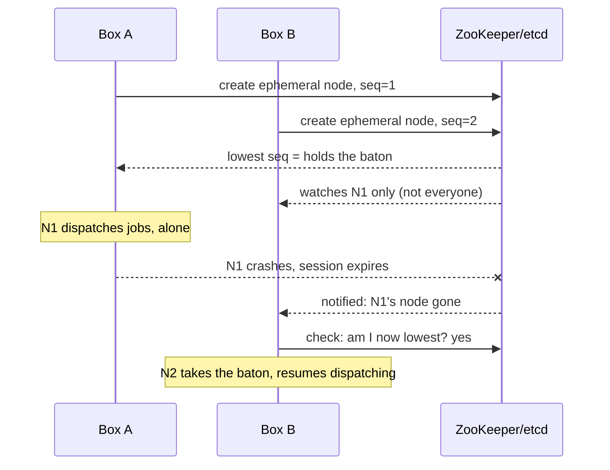

Ledgerly wires this up with a 3-node ZooKeeper ensemble. The failover window — the time between the old leader dying and the new one taking over — is bounded by the session timeout, typically **1-10 seconds** in real ZK/etcd deployments. During that gap, due jobs don't get lost; they just sit durably wherever they're recorded and get picked up the moment a new leader takes the baton. Ledgerly measures their actual failover at **~4 seconds `[illustrative — depends on their specific session-timeout tuning]`**, comfortably inside their SLA tolerance.

**New problem, a month later:** a brief network partition makes the leader (box A) look unreachable to ZooKeeper for just long enough to trigger a failover. Box B takes the baton. Then A's network recovers, and A — which never actually crashed, it just got cut off — is still completely convinced it's the conductor, because nobody physically told it otherwise. For a few seconds, **two boxes both believe they're holding the baton**, and both try to dispatch the same overnight batch. This is the exact same double-payout disease from Chapter 1, just relocated one layer down — leader election tells you *who currently thinks they're in charge*, not *who's allowed to actually act on it after the fact*.

**How I'd say this in an interview:** "Leader election — ZooKeeper's ephemeral-sequential-znode recipe, or etcd's Raft-based campaign — solves 'who dispatches,' and its failover window is bounded and safe because nothing is lost, only delayed, during the gap. What it doesn't solve is a stale ex-leader coming back online still believing it's in charge — that's split-brain, and it needs its own fix."

---

## Chapter 3 — The wristband with today's date on it

Split-brain happens because the old leader has no way to know, from the inside, that the world moved on without it. It feels fine. It has no reason to stop.

**The fix:** every time leadership changes hands, issue a new, strictly higher **term number** (also called a fencing token) along with the baton. **The analogy — a nightclub wristband stamped with today's date.** Yesterday's wristband looks almost identical to today's, and the person wearing it might genuinely believe it still works. The bouncer doesn't care about their sincerity — the door only opens for *today's* stamp, and an old one is just fabric.

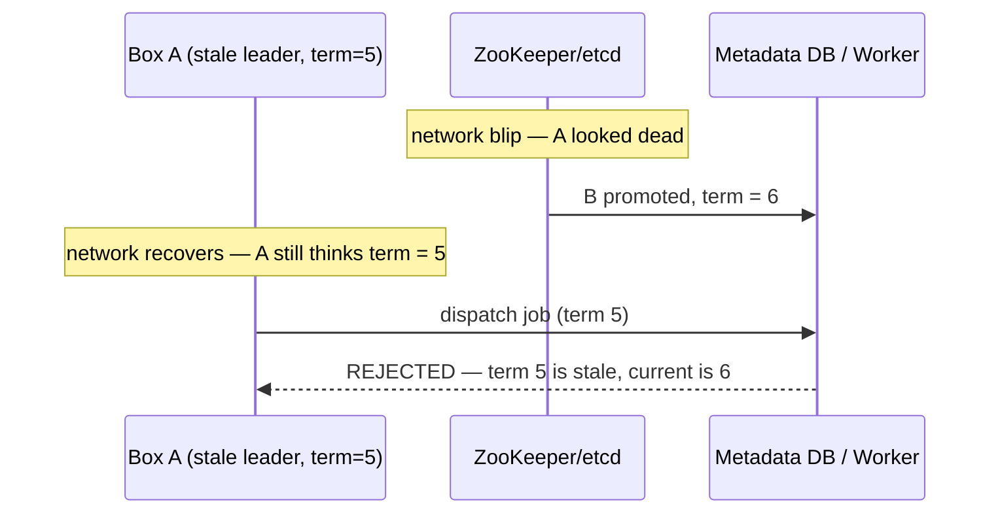

Every write a leader makes now carries its term number, and the metadata store (or the workers themselves) simply refuses any write carrying a lower term than the highest one it's already seen. This closes the door on Chapter 1 and Chapter 2's double-payout bug **for good**, on the leadership side specifically — this is the same real, documented pattern behind Chubby lease fencing, and it's exactly why newer Kafka versions replaced ZooKeeper-based controller election with their own Raft-based KRaft system, keeping the same fencing idea underneath.

**New problem, six months later, once Ledgerly is genuinely a healthy, stable system:** job volume has grown from 40 jobs to roughly **3 million scheduled jobs `[illustrative]`** across the business — hourly reports, per-merchant reconciliation, weekly statements. The elected leader box, sitting there holding the baton, is still trying to *run every job itself*, in-process, one after another. One machine cannot execute 3 million jobs' worth of actual work sequentially and still hit anyone's timing expectations — the leader was only ever supposed to *decide*, not *do*.

**How I'd say this in an interview:** "Fencing tokens are the standard answer to 'what if a leader comes back after a failover' — every leadership grant gets a strictly increasing term, and anything carrying an older term gets rejected outright. That closes split-brain on the decision-making side. But it doesn't change the fact that one machine, even the correctly-elected one, can't physically *execute* work at real scale — deciding and doing need to be different machines entirely."

---

## Chapter 4 — The conductor doesn't play every instrument

The obvious next question: *if the leader shouldn't run jobs itself, who does?* A separate pool of machines — **workers** — whose only job is to execute payloads. The leader's job shrinks down to exactly what a conductor actually does: decide *what* plays *when*, never pick up an instrument itself.

This is the **control plane / data plane split**, and it's the single most important mental model in this whole story: the **control plane** (leader, decides what should run — low volume, correctness-critical) is architecturally separate from the **data plane** (worker fleet, actually runs it — high volume, throughput-critical). Google's Borg does exactly this at enormous scale: a small, Paxos-replicated Borgmaster decides placement, while tens of thousands of worker machines in a cell just execute.

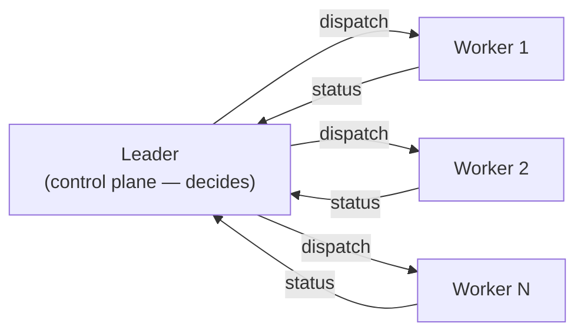

**New problem, immediately:** how does the leader actually *hand off* a job to a worker without losing it? If the leader just holds "next job to run" in its own in-process memory and hands it out from there, this is precisely Chapter 1's bug all over again, one layer down — a crash of the leader process, even for a fraction of a second during handoff, means a job that was "about to be dispatched" simply vanishes, with no record it ever existed at that moment.

**How I'd say this in an interview:** "Splitting control plane from data plane is the answer to 'how does this scale past one machine' — the leader only decides, a separate worker fleet only executes. But the instant you separate deciding from doing, you've created a handoff, and every handoff needs its own durability story — that's the very next problem."

---

## Chapter 5 — Why you keep a ledger *and* a hand-off tray

**The fix:** never let a job exist only in memory, and never let the handoff *be* the only record. Write the job to a durable metadata store **first** — this is the system of record. Only *after* that write succeeds does the job get handed to a fast, ephemeral dispatch queue. **The analogy — a bank's transaction ledger versus the teller's hand-off tray.** The ledger is slow, durable, and answers "show me everything pending for merchant X." The tray is fast and disposable — great for handing the next teller exactly one thing to work on right now, terrible at surviving anyone forgetting to check it. You don't replace the ledger with the tray, and you don't replace the tray with the ledger — you need both, because they're built for opposite jobs.

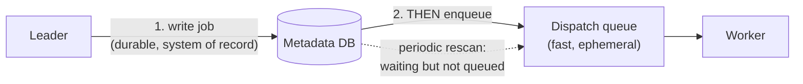

If the leader crashes between step 1 and step 2 — the write succeeded, but the enqueue never happened — the job isn't lost. A periodic background scan of "rows marked waiting that never got queued" catches it and re-queues it. That costs a small delay, never a lost job. This directly answers the natural "why not just one or the other" question: the DB is durable and queryable but not fast for high-throughput handoff; the queue is fast but bad at surviving a crash and bad at answering "what's still pending for this merchant."

**New problem:** with 3 million scheduled jobs sitting in that metadata DB, "what's due right now" has to be answered many times a second. The naive approach — scan the whole table every tick, checking each row's due time — technically works, and it's exactly what most engineers reach for first.

**How I'd say this in an interview:** "The DB is the durable system of record, the queue is a fast ephemeral dispatch cache — write to the DB first, then the queue, and a periodic rescan of 'waiting-but-unqueued' rows is your safety net if a crash happens in between. That single design choice is why a crashed leader never actually loses a job, just delays it slightly."

---

## Chapter 6 — Ten million rows, and a clock that never scans them

By Ledgerly's third year, the schedule table holds roughly **10 million scheduled jobs `[illustrative, but the shape matches the reference guide's own worked example]`**. Scanning all 10 million rows every single second to find "what's due right now" is enormously wasteful — most of those rows aren't due for days, weeks, or months, and you're re-checking every one of them anyway. Ledgerly benchmarks their naive polling approach and finds it chokes badly past a few thousand due-checks per second.

The obvious question: *how do real systems find "what's due" without re-scanning everything, every tick?* The answer real, documented systems use — Kafka's own internal delayed-operation "purgatory," and Netty's `HashedWheelTimer` — is a **timing wheel**, and it's the same trick used inside a mechanical clock.

**The analogy:** picture a circular array of slots, one per second, with a pointer that ticks forward one slot at a time — just like a clock's second hand sweeping around its face. A job due in 47 seconds gets dropped into slot `(now + 47) mod wheel_size`. Draining "whatever's sitting in the current slot" as the pointer passes it is **O(1)**, no matter how many total jobs exist elsewhere in the system — the wheel never looks at jobs that aren't imminent.

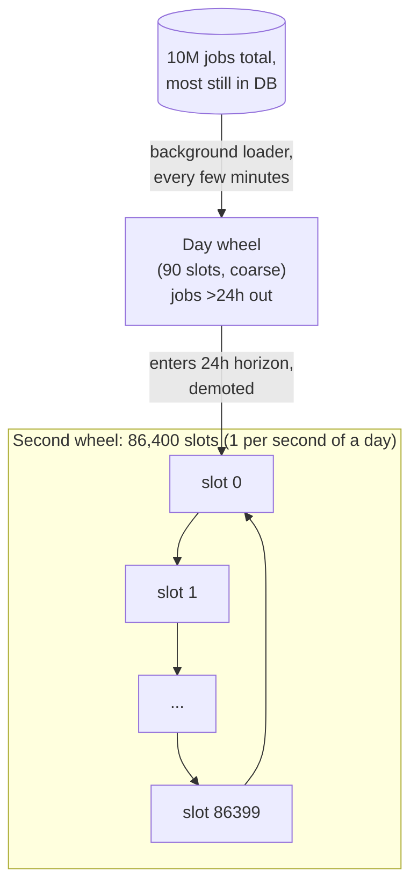

Of the 10 million total jobs, only the ones due in the **next 24 hours** — say **~50,000 `[illustrative]`** — actually get loaded into the fine-grained second wheel; that's roughly half a job per slot on average, a short linked list to drain, not a table scan. Jobs due 1-90 days out sit in a coarser **day wheel**; as a job's due time crosses into the 24-hour horizon, a background sweep demotes it into the second wheel. Jobs beyond 90 days never leave the DB at all until the day-wheel loader eventually picks them up. This is a **hierarchical timing wheel** — coarse levels for the far future, a fine level for right now, jobs cascading downward as their moment approaches.

**New problem:** the timing wheel makes pickup cheap, but it doesn't change *when* jobs are actually due — and a huge fraction of Ledgerly's jobs are cron-style, anchored to round wall-clock times like `0 1 * * *` (1:00 AM nightly). All of them are still due at the exact same second.

**How I'd say this in an interview:** "A naive poll re-checks every row every tick — that's the thing to reject first. A priority queue is a fine middle ground at moderate scale. A hierarchical timing wheel is the right answer once inserts hit tens of thousands a second, because it's the same O(1) bucket trick a mechanical clock uses, and you only ever hold the near-term slice of jobs in memory, not all ten million."

---

## Chapter 7 — Everything wakes up at the same second

At exactly 1:00:00 AM every night, the timing wheel's slot for that second doesn't hold "a job" — it holds **every single nightly job anchored to `0 1 * * *`**. Worked number: Ledgerly has grown to **1,800 jobs `[illustrative]`** all scheduled for that exact tick. The worker pool, sized for a smooth average load, gets slammed with 1,800 simultaneous dispatches in one second, then sits mostly idle the rest of the hour. This is the classic **thundering herd**, and it's a real, well-known failure shape — it's the specific reason Kubernetes CronJob ships two dedicated fields for exactly this problem: `startingDeadlineSeconds` (how late a missed tick is still allowed to fire) and `concurrencyPolicy` (`Allow` / `Forbid` / `Replace` — what to do if the previous run of the *same* job is still going when the next tick arrives).

```mermaid
gantt
    dateFormat  HH:mm:ss
    axisFormat  %H:%M:%S
    title Everything anchored to 01:00:00 fires in the same second
    section Without jitter
    1,800 jobs, all due 01:00:00 :crit, herd, 01:00:00, 1s
    section With jitter
    Job batch A (01:00:00-01:00:05) :a, 01:00:00, 5s
    Job batch B (01:00:05-01:00:10) :b, 01:00:05, 5s
    Job batch C (01:00:10-01:00:15) :c, 01:00:10, 5s
```

**The fix:** spread dispatch across a small **jittered window** (a few seconds) instead of firing on the exact tick — no individual job cares whether it starts at 01:00:00 or 01:00:04, but the worker pool cares enormously about not seeing all 1,800 at once. Pair that with Kubernetes CronJob's two named ideas: `concurrencyPolicy=Forbid` so a slow-running job doesn't get a second overlapping copy dispatched right on top of it, and a `startingDeadlineSeconds` grace window so a missed tick (say, the leader itself was mid-failover) is allowed to fire late rather than being silently skipped forever.

**New problem:** jitter spreads dispatch out over a few seconds, but now more than one worker is polling the wheel/queue at once — during that spread window, it's entirely possible for **two workers to both see the same due job at the same instant** and both try to grab it.

**How I'd say this in an interview:** "Thundering herd at cron boundaries is real and worth naming unprompted — everything anchored to a round wall-clock time converges on the exact same tick. Jitter, `concurrencyPolicy=Forbid` for overlapping runs, and a `startingDeadlineSeconds`-style grace window for missed ticks are the productionized answers, and Kubernetes CronJob ships all of this by name."

---

## Chapter 8 — Two hands reaching for the same ticket

Worker A and Worker B both poll at nearly the same moment and both see "settlement job #4471 is due." Without a rule for who actually gets it, both dispatch it, and the settlement runs twice — Chapter 1's ghost, showing up a third time, in a third form.

**The fix, and a fresh analogy: a deli counter's take-a-number system.** Only the person whose number the counter is *currently calling* gets served — everyone else holding an old or duplicate number just has a piece of paper. The mechanism underneath is a **compare-and-swap (CAS) claim**: `UPDATE jobs SET status='claimed', owner=me WHERE id=X AND status='queued'`. Exactly one of two racing updates can affect a row — the database's own row-level locking *is* the distributed lock here, no separate lock service required.

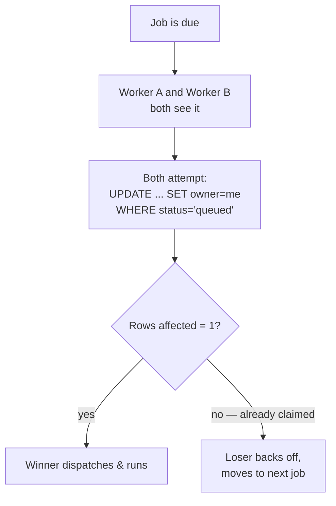

Ledgerly's alternative, for teams already leaning on Redis instead of DB row locks, is the equivalent `SET lock:job_4471 owner NX PX 30000` — atomic "set if not exists, expire in 30s." **The nuance worth stating out loud (the real, documented "Redlock debate")**: that TTL is a *guess* about how long the holder needs, not a guarantee. If the holder stalls past the TTL — a GC pause, a slow network hiccup — Redis expires the lock and hands it to someone else. The original holder then wakes up, still believes it holds the lock, and dispatches anyway. **Two workers now both think they own the same job**, purely because a timer expired while a legitimate process was just slow. The fix is the exact same fencing-token idea from Chapter 3's wristband — every lock grant carries an increasing number, and the eventual write is rejected if it carries an older number than the last one seen.

**New problem:** a worker legitimately wins the claim, starts the job... and then either crashes mid-execution, or the job itself hits a bug and simply hangs forever, holding a worker slot that never gets released.

**How I'd say this in an interview:** "CAS-based claiming — a conditional `UPDATE ... WHERE status='queued'` — is the cheapest correct answer to 'how do you stop two workers dispatching the same job,' and it needs no extra infrastructure if your metadata store already exists. If you reach for a Redis lock instead, know the Redlock TTL failure mode by name: a stalled holder plus an expired TTL means two workers can both believe they hold it, and fencing tokens are what close that gap, not a bigger TTL."

---

## Chapter 9 — The job that never comes back

Six weeks after the CAS fix ships, on-call gets paged for a settlement job that's been "running" for **11 hours `[illustrative]`** — no crash, no error, just silence. It turns out the third-party bank API it calls is having a bad day and the code has no timeout at all, so the worker slot just sits there, permanently held, resources never reclaimed.

**The fix:** two separate mechanisms, and they answer two different questions.
- An **execution cap**, enforced at the *infrastructure* layer — a container/cgroup kill after N minutes, never trusted to the application's own code, because you can't trust arbitrary job payloads to self-terminate.
- A **lease with a heartbeat**, so the system can also notice a worker that's gone quiet *before* hitting the hard cap. **The analogy — a parking garage hall pass with an expiration time stamped on it.** If you don't get it renewed before it expires, the garage assumes the space is free and lets someone else claim it.

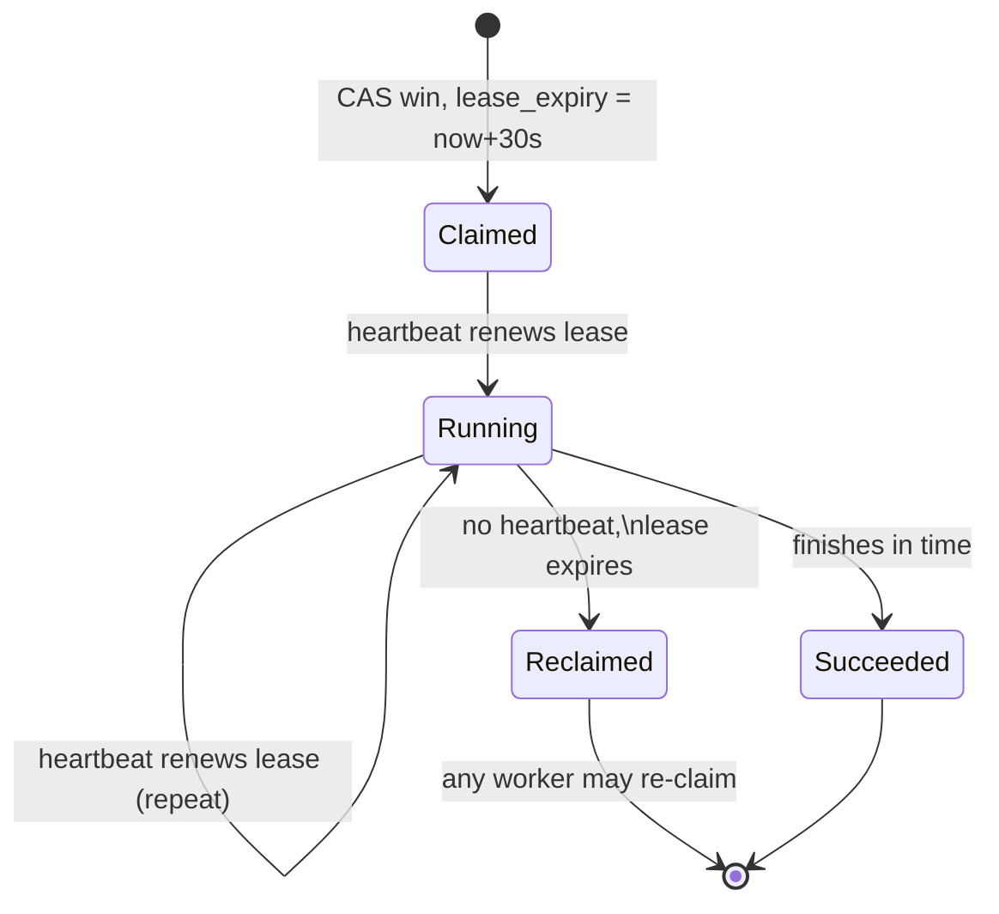

This makes the system genuinely **at-least-once**: a reclaimed job gets retried by someone else. But at-least-once cuts both ways — if the original worker *wasn't* actually dead, just slow past the lease window (an echo of Chapter 8's Redlock nuance), **two workers can end up genuinely executing the same settlement job's side effect**, with neither one crashing. Worked scenario: the lease is 30 seconds; this particular job takes 45. At second 30 it gets reclaimed and re-dispatched to a second worker, while the *first* worker — still alive, just slow — is also still charging ahead. Both attempt to move the same money.

**The real fix isn't a "smarter" lease duration** — it's making the side effect itself **idempotent**: keyed on something durable like `payout_id`, not on which attempt or which worker did it. Before crediting a merchant, check "have I already successfully paid out this exact `payout_id`?" If yes, skip it and report success anyway. This is the same idea as an assembly line's serial-numbered quality stamp — if the stamp for that serial number already says "done," the second inspector doesn't redo the work, they just wave it through.

**How I'd say this in an interview:** "True exactly-once *delivery* isn't achievable over an unreliable network — that's a two-generals-problem consequence, not a skill issue. What you actually build is at-least-once delivery plus idempotent handlers, which gets you exactly-once *effect* — for Ledgerly that means every payout checks its own `payout_id` before moving money, no matter how many times the job gets retried."

---

## Chapter 10 — The bank routing number that will never work

A different bug shows up: one specific merchant's payout job has a malformed bank routing number. It fails every single time, for every worker that ever picks it up. Thanks to Chapter 9's lease mechanism, this permanently-broken job just keeps getting reclaimed and retried, forever, chewing through a worker slot on every attempt and slowing down every legitimate job queued behind it.

The obvious question: *how do you tell "this will work if we just wait and try again" apart from "this will never work no matter how many times we try"?* Timeouts, 5xx errors, and network blips are **transient** — retrying is exactly the right move. A malformed payload or a permissions error is **deterministic** — retrying it a thousand times produces the same failure a thousand times; it's pure wasted capacity.

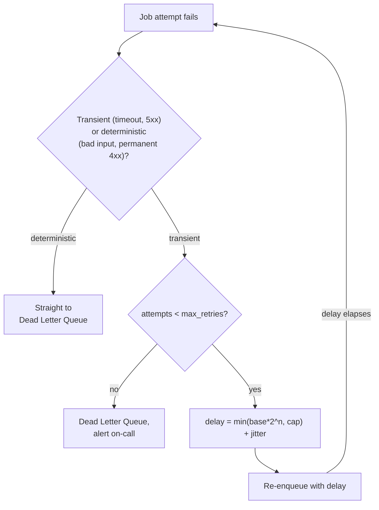

**The fix:** capped **exponential backoff with jitter** for transient failures (`delay(n) = min(base * 2^n, max_delay) + random_jitter` — the jitter matters, because without it every failed job from the same outage retries in lockstep and re-slams whatever just recovered, a "retry storm"). Deterministic failures skip the wait entirely and go straight to a **Dead Letter Queue** — a quarantine, not a silent drop — where a human gets paged and can fix the merchant's routing number, then manually replay the job.

**How I'd say this in an interview:** "A poison message shouldn't retry forever, and it shouldn't be silently dropped either — capped exponential backoff with jitter for transient failures, a Dead Letter Queue with an alert for anything that exhausts retries or is deterministically broken. The DLQ's whole job is turning 'we gave up' into a visible, alertable event instead of an invisible one."

---

## Chapter 11 — The notification that fired before the money moved

Ledgerly adds a new requirement: after settlement succeeds, a separate job should email the merchant a payout notification. One night, a bug causes the notification job to run **before** settlement actually finishes — merchants get "your payout is on its way" emails for payouts that then fail. Up to this point, every job in this story has been independent. This is the first time one job's correctness depends on *another job having already succeeded*.

The fix: model this explicitly as a **DAG (directed acyclic graph)** — this is exactly Apache Airflow's whole reason for existing. Store dependencies as edges (a graph DB, or just an adjacency list in the regular DB — a graph DB is a nice-to-have, not mandatory at this scale). **The analogy — a relay race.** The next runner physically cannot leave the blocks until the current runner hands them the baton; standing near the track isn't enough.

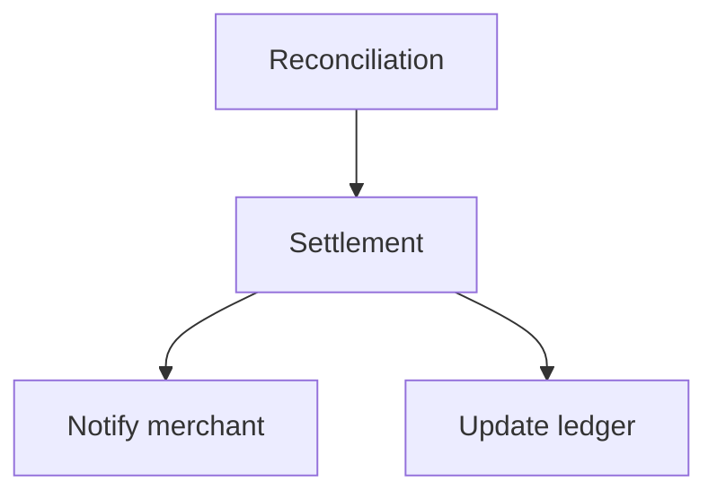

Two mechanics matter here. First, **cycle detection at submission time** — topologically sort the DAG the moment it's registered and reject it outright if there's a cycle, because a cyclic workflow can mathematically never complete; catching this at submission is far cheaper than discovering it at 1 AM. Second, a **per-node pending-parent counter**: each downstream job tracks how many parents haven't succeeded yet, decrementing on each parent's success — zero means "ready to queue." This is an O(1) readiness check per event, versus re-scanning the whole graph every time anything finishes.

**New problem, immediately:** what happens when a parent job — say, reconciliation — fails outright, after exhausting retries and landing in the DLQ? Should "notify merchant" and "update ledger" (its dependents) run anyway, run with a warning, or get auto-cancelled?

**The fix:** an explicit, configurable **failure propagation policy** — this is exactly Airflow's real, documented `trigger_rule` concept: `all_success` (only run if every parent succeeded — fail-fast, cancel descendants otherwise), `all_done` (run regardless of parent outcome), `one_failed`, and others. Naming this configurability, rather than hard-coding one behavior, is a strong signal in an interview.

**How I'd say this in an interview:** "The moment one job's correctness depends on another job's outcome, you need a DAG, not a flat list of independent jobs — cycle-check it at submission, track readiness with a per-node pending-parent counter instead of re-scanning the graph, and make failure propagation an explicit policy, the way Airflow's `trigger_rule` does, rather than an implicit assumption."

---

## Chapter 12 — The fraud team's homework crowds out payroll

Ledgerly's scheduler has quietly become internal shared infrastructure — payments, fraud, and reporting teams all submit jobs to the same worker pool. One afternoon, the fraud team kicks off a retraining batch that materializes **500,000 low-priority analysis tasks `[illustrative]`** in one go. Payments' urgent, time-sensitive settlement jobs — objectively higher priority — get stuck queued behind sheer *volume*, not priority order, because a single shared queue treats "500,000 of fraud's tasks" the same as "3 of payments' tasks" when it comes to raw first-come scheduling within a tier. This is the classic **noisy-neighbor problem**, and it's a distinct concern from ordering-within-one-tenant's-own-work — it's about *how much of the shared pool each tenant is entitled to at all*.

**The fix:** don't split capacity equally — split it by **weight**, tied to something like SLA tier, and reclaim unused share instead of wasting it. **The analogy — Linux's own CFS (Completely Fair Scheduler)**, which allocates CPU time to processes by weight and hands back any unused slack to whoever's still runnable, rather than letting it sit idle. It's the same shape here, just with worker-slots instead of CPU cycles.

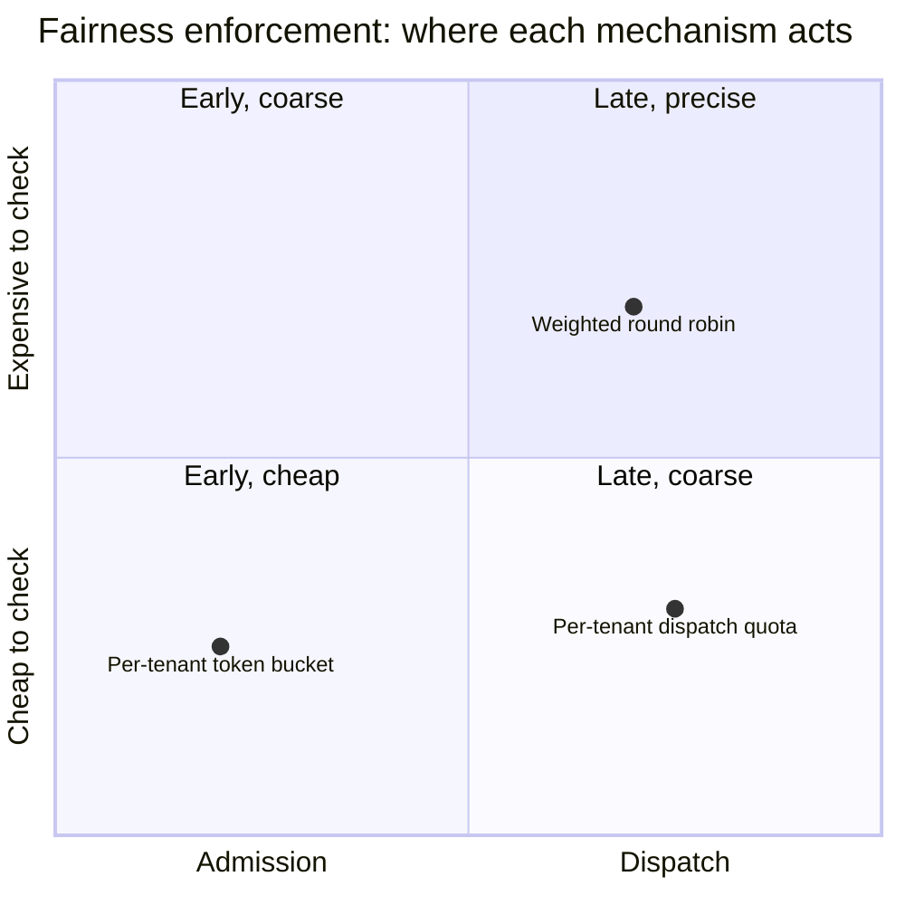

Ledgerly gives payments weight 5, reporting weight 3, fraud weight 2 out of a shared pool of 1,000 worker-slots/sec — 500/300/200 respectively — and enforces it two ways: a **per-tenant token bucket at admission** (caps burst submission rate before it even reaches the queue) and a **per-tenant dispatch quota** (the leader refuses to dispatch a tenant's Nth-in-flight job past its share, even if that job is otherwise next in priority order). If fraud isn't using its full 200, the unused share redistributes to payments and reporting rather than sitting idle — exactly CFS's reclaim-unused-slack behavior.

**New problem:** as Ledgerly's job and worker counts keep climbing into the millions, the naive way of assigning jobs to workers — `hash(job_id) % num_workers` — starts causing a different kind of chaos every time a worker is added or removed.

**How I'd say this in an interview:** "Fairness isn't an equal split, it's a weighted one, tied to SLA tier — the same model Linux's CFS uses for CPU, fair shares with unused slack reclaimed, not wasted. Enforce it at two layers: a token bucket at admission to cap bursts, and a dispatch quota to protect worker slots even for already-admitted work — don't rely on priority ordering alone to solve a volume problem."

---

## Chapter 13 — Adding a machine shouldn't move everyone else's stuff

Ledgerly's worker fleet grows from 10 machines to 11, to absorb load. Under the naive scheme, `partition % 10` versus `partition % 11` sends almost every partition to a *different* machine overnight — worked number: going from 10 to 11 remaps roughly **55 of Ledgerly's 60 job partitions `[illustrative, same shape as the reference guide's own worked example]`**, about 92% of everything, just to add one machine's worth of headroom. This is exactly the same disease as `hash(order_id) % N` breaking per-key ordering when a shard count changes — a real, well-known failure mode of naive modulo partitioning, whether it's applied to job-to-worker assignment or anything else.

**The fix: consistent hashing** — the same real, documented mechanism behind Amazon Dynamo's and Cassandra's partitioning rings, applied here to which worker owns which job partition instead of which node owns which cache key. **The analogy — a circular clock face with pegs.** Every worker claims a spot on the ring (hash of its own ID); every job partition also lands somewhere on the ring (hash of its number); a partition belongs to whichever worker's peg comes next, clockwise. Remove a peg, and only its partitions hop to the next peg over — nobody else moves. Add a peg, and it only claims the slice immediately before it.

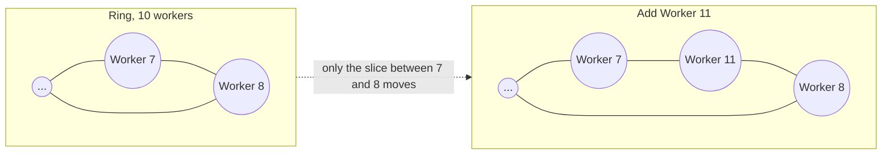

Redone on the ring: adding an 11th worker (with virtual nodes for even spread) only moves roughly `60/11 ≈ 5-6` partitions, not 55 — the same operation, a fraction of the disruption. **A related but separate question:** this partitions the *worker fleet* (who executes). Ledgerly also has to partition the *schedule store itself* — the 10 million-row metadata DB from Chapter 6 — and there are two genuinely different axes for that: **job-ID hash partitioning** spreads writes evenly but means "what's due now" requires fanning out to every shard; **time-bucket partitioning** (jobs due in hour H live in shard `H mod N`) makes "what's due now" a single-shard query, at the cost of hotter shards during busy hours. Ledgerly, like the reference guide recommends, combines both — job-ID hashing for the durable write-heavy store underneath, time-bucket sharding for the near-term "what's due soon" working set that feeds the timing wheel.

**New problem:** with jobs and leases now spread across a dozen machines, each with its own system clock, a worker's self-reported "I finished at 01:00:04.812" can't always be trusted against the leader's own clock.

**How I'd say this in an interview:** "Consistent hashing is the correct answer whenever 'add or remove a machine' shouldn't mean 'reshuffle almost everything' — it's the same ring trick Dynamo and Cassandra use for cache/data sharding, just applied to worker assignment here. And partitioning the worker fleet and partitioning the schedule store are two separate sharding decisions — job-ID hashing for even writes, time-bucket sharding for cheap 'what's due' queries, usually combined rather than picking just one."

---

## Chapter 14 — Whose watch do we trust

A subtle bug: Worker #7's system clock has drifted **5 minutes fast `[illustrative — NTP drift is real and documented, though rarely this extreme; used here to make the failure obvious]`**. It self-reports a job's completion timestamp using its own clock. If the leader directly compared that self-reported timestamp against its *own* clock to decide anything — like whether a lease had expired, or how long the job actually took — it could conclude the job "finished in the future," or compute a nonsensical negative duration, or worse: falsely decide a lease already expired and let a second worker start the exact same job while the first one is still legitimately running it.

The obvious question: *whose clock do we trust?* Nobody's, directly against anybody else's. **The fix — a pit crew, not the driver's own dashboard.** A race pit crew keeps one official stopwatch to decide pit-stop timing; they never ask each driver's own dashboard clock and average the two. Concretely: lease and timeout expiry are computed by **one authority** — the leader — using its *own* clock, measured against its *own* receive-time of the last heartbeat, never by trusting a timestamp a worker embedded in a message. For measuring durations specifically (how long a job ran, how old a lease is), use each machine's **monotonic clock**, which never jumps backward the way a wall clock can after an NTP correction.

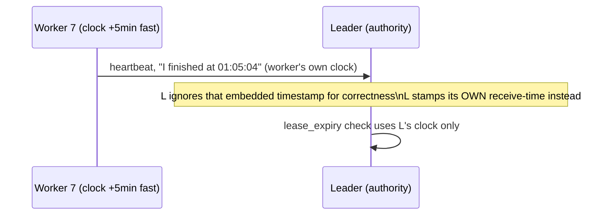

This same "one authority scans for trouble" idea is also exactly how Ledgerly handles **crash recovery** when a leader itself dies mid-dispatch: the new leader, once elected, runs one query — `status IN (Dispatched, Running) AND lease_expiry < now()` — against the metadata DB. That's it. It's not a special crash-recovery subsystem; it's the *same* expired-lease scan a routine health check already runs periodically. Recovery and health-checking are the same query, run at different moments.

**How I'd say this in an interview:** "Never let two different machines' wall clocks decide a correctness question directly against each other — one authority's clock decides timeouts, and monotonic clocks measure durations, because wall clocks can jump backward on an NTP correction and monotonic clocks can't. And crash recovery isn't special-cased code — it's the exact same expired-lease scan your health check already runs, just triggered by a new leader taking over instead of a timer."

---

## Where the story actually lands


```mermaid
mindmap
  root((Why a task scheduler\nneeds all of this))
    Availability
      one box = SPOF
      standby box, then leader election
    Correctness of "who's in charge"
      split-brain after failover
      fencing tokens reject stale writers
    Scale of execution
      one leader can't run everything
      control plane vs data plane
    Durable handoff
      in-memory handoff can vanish
      DB first, then queue, rescan as safety net
    Finding what's due
      scanning millions of rows doesn't scale
      hierarchical timing wheel, O(1) pickup
    Synchronized load
      everything anchored to :00 fires together
      jitter + concurrencyPolicy + startingDeadlineSeconds
    Double dispatch
      two workers claim the same job
      CAS claim, or lock + fencing
    Guarantee
      exactly-once delivery is impossible
      at-least-once + idempotency = exactly-once effect
    Poison work
      deterministic failure retried forever
      capped backoff + Dead Letter Queue
    Dependencies
      one job's correctness depends on another's success
      DAG, cycle check, trigger_rule
    Fairness
      one tenant's volume starves another
      weighted share, reclaim unused slack
    Placement
      naive hash % N reshuffles everything
      consistent hashing bounds the blast radius
    Time itself
      two machines' clocks disagree
      one authority's clock, monotonic for durations
```

Every real distributed task scheduler you'll be asked to design sits *somewhere* on this chain. The skill isn't reciting all fourteen chapters — it's stopping where the stated requirements say to stop. A scheduler for internal cron-style reports might reasonably stop around Chapter 8. Anything that moves money or has dependent steps has to reach Chapter 9, 11, and beyond. If nobody's mentioned multiple tenants, walking all the way to Chapter 12 unprompted reads as padding, not depth.

---

## Grill me — adversarial follow-ups

**Q1: "Why not just make the standby box in Chapter 1 always-on and skip leader election entirely — both boxes just run everything?"**
Because "both always run everything" is precisely the bug that cost Ledgerly $180,000 in one night — without a rule for exactly who's allowed to act, any moment where both boxes are simultaneously reachable (which is most of the time) means both dispatch. Leader election exists specifically to make "who acts" unambiguous at every instant, not just most of the time.

**Q2: "You said exactly-once delivery is impossible — walk me through why, precisely."**
It comes down to the two-generals problem: a sender can never be 100% certain a message was received, because the acknowledgment itself could be lost, and there's no bound on how long to wait for it. So any system that insists on "exactly one delivery, guaranteed" either risks losing the message (stop retrying too early) or risks duplicating it (retry and it turns out the first one actually landed) — there's no third option over an unreliable network. The workable compromise is retry-until-acked (at-least-once) plus idempotent handling, which gets you exactly-once *effect* without needing exactly-once *delivery*.

**Q3: "Doesn't the timing wheel just move the thundering-herd problem instead of solving it — everything anchored to :00 still lands in one slot?"**
Correct, and that's exactly why Chapter 6 (timing wheel) and Chapter 7 (jitter) are separate fixes for separate problems — the wheel makes *finding* what's due cheap, it says nothing about *when* things are due. Jitter is the actual fix for synchronized dispatch load; you need both.

**Q4: "If CAS-based claiming already solves double-dispatch cheaply with no extra infrastructure, why would anyone reach for a Redis lock at all?"**
Mostly when the claiming logic needs to live outside the metadata DB's transaction boundary — for instance, coordinating a resource that isn't a DB row at all, like "only one process may call this rate-limited third-party API right now." If your metadata store already has the row, CAS is strictly simpler and has one fewer moving part to operate.

**Q5: "Your Chapter 9 idempotency fix relies on a durable `payout_id` check — where does that check itself live, and can two workers race on checking it?"**
It has to be the same kind of atomic conditional write as the CAS claim itself — something like `INSERT INTO paid_out (payout_id) VALUES (X) ON CONFLICT DO NOTHING`, checked and set in one atomic operation, not a separate read-then-write. If it were read-then-write, you'd have just reintroduced the exact race you were trying to close.

**Q6: "Why not just make every job in the DAG retry-and-idempotent, and skip explicit failure-propagation policy entirely?"**
Idempotency protects against *duplicate* execution of the same job; it says nothing about whether a *downstream* job should run at all when its *upstream* dependency permanently failed. Those are orthogonal — "notify merchant" being idempotent doesn't help if the real question is whether it should fire at all when settlement never succeeded, which is exactly what `trigger_rule` is for.

**Q7: "Weighted fair scheduling sounds like it just adds latency for the highest-weighted tenant when the system's mostly idle — is that a real cost?"**
Only if you enforce the weights as hard caps instead of reclaimable shares — that's why Ledgerly's design explicitly redistributes unused share, the same way Linux CFS hands back idle CPU to whoever's runnable. Done right, weights only bind when there's real contention; an idle system imposes no artificial slowdown on anyone.

**Q8: "Consistent hashing bounds how much moves when you resize — but doesn't it still cause a hot spot if one physical machine gets unlucky on the ring?"**
Yes, with a naive single point per machine — that's why real implementations (including Dynamo and Cassandra) give each physical machine many "virtual node" positions on the ring, on the order of 100+ per machine, so an unlucky draw for one virtual node averages out across the rest. Say "virtual nodes" specifically if asked this — it's the actual fix, not a footnote.

**Q9: "Your Chapter 14 fix says trust one authority's clock — but what if the leader itself has a bad clock?"**
Then every timeout decision made *while that leader holds the baton* is consistently skewed, but it's at least self-consistent, and duration measurements (monotonic clocks) are unaffected regardless. A genuinely bad leader clock is rare enough at datacenter scale (NTP keeps machines within milliseconds normally) that it's an acceptable residual risk — the real danger this fix removes is comparing *two* clocks against each other, which happens on every single lease check, not just once per leadership term.

**Q10: "Given this whole story, if someone just says 'design a task scheduler' cold, where do you actually start?"**
Ask the three questions that reshape everything downstream: is work one-shot or recurring (cron-style), do jobs depend on each other (DAG or not), and what delivery guarantee is actually needed (at-least-once is almost always the real answer, stated with idempotency). Then walk forward only as far as those answers require — leader election and durability are close to a given at any real scale, but DAGs, multi-tenant fairness, and consistent-hashed resharding are things you earn by naming a specific requirement, not defaults you bolt on for their own sake.

---

## Cheat sheet — one line per stop on the story

- **Single cron box**: no clustering built in — one disk failure takes down every job on it, the whole reason distributed scheduling exists.
- **Leader election**: only one box holds the baton at a time (ZK ephemeral-sequential znodes, or etcd's Raft-based campaign) — due jobs aren't lost during a failover gap, only briefly delayed.
- **Fencing tokens**: a strictly increasing term number rejects a stale ex-leader's writes after failover — a wristband with yesterday's date just doesn't open the door.
- **Control plane vs data plane**: the leader only decides, a separate worker fleet only executes — one machine can never run everything itself at real scale.
- **DB then queue**: write durably first, enqueue for fast dispatch second — a periodic rescan of "waiting but unqueued" rows is the safety net if a crash lands between the two.
- **Hierarchical timing wheel**: bucket jobs by due-second instead of scanning every row — O(1) amortized pickup, same trick as a mechanical clock, only the near-term slice ever lives in memory.
- **Jitter + concurrencyPolicy/startingDeadlineSeconds**: spread dispatch across a small window instead of firing on the exact tick, forbid overlapping runs of the same job, allow a grace window for missed ticks.
- **CAS-based claim / distributed lock**: a conditional `UPDATE ... WHERE status='queued'` is the cheapest correct answer to double-dispatch; a Redis lock needs fencing on top or a stalled holder plus an expired TTL reintroduces the same bug.
- **Lease + heartbeat + idempotency**: execution caps belong at the infrastructure layer, lease expiry catches a dead worker, and the actual fix for redelivery-caused duplicates is an idempotent side effect keyed on a business ID, not a smarter timeout.
- **Backoff + Dead Letter Queue**: capped exponential backoff with jitter for transient failures, straight to the DLQ for deterministic ones — quarantine bad work visibly instead of retrying it forever.
- **DAG + trigger_rule**: cycle-check at submission, track readiness with a per-node pending-parent counter, and make failure propagation an explicit configurable policy, not an assumption.
- **Weighted fair scheduling**: allocate by SLA-tier weight, not equal share, and reclaim unused slack — the same model Linux CFS uses for CPU time.
- **Consistent hashing (with virtual nodes)**: adding or removing a worker only moves its neighbor's slice, not almost everything — the same ring trick behind Dynamo and Cassandra, applied to job-to-worker placement; combine job-ID hashing and time-bucket sharding for the schedule store itself.
- **One clock authority**: never compare two machines' wall clocks directly for a correctness decision — one authority's clock for timeouts, monotonic clocks for durations; crash recovery is just the same expired-lease scan a health check already runs.
- **The meta-lesson**: every fix in this story buys one property (availability, unambiguous ownership, execution scale, durable handoff, cheap lookup, spread load, single ownership, safe redelivery, quarantine, correct dependency order, fairness, cheap resizing, or trustworthy time) by spending a little complexity — say the trade in the same breath you propose the fix.
