# YouTube — Interview Version

A recite-able, version-by-version build-up. Each version adds exactly one idea, shows:
- an **architecture diagram** (cumulative — carried-over pieces are grey, new/changed pieces are highlighted amber, new edges marked 🆕)
- the exact **call sequence** for upload/stream (mermaid sequence diagram)
- the **DB/queue/cache schema** needed for *that* version only
- the **tradeoff** that forces the next version

Ordering note: the story is grouped by thread — first fully close out **Upload** (v1→v3), then fully close out **Stream quality** (v4→v5), then **scale** (v6→v7), then **optimize** (v8→v9) — rather than interleaving upload and streaming concerns.

Read top to bottom like an interview transcript.

---

## 0. Opening the interview

> **Interviewer:** "Design YouTube."
> **Me:** "YouTube has a huge surface area — upload, streaming, search, comments, likes, subscriptions, recommendations, live streaming, monetization... Can we scope to **Upload** and **Stream** first, since everything else (search, likes, comments, recommendations) is a secondary read/write system layered on top of a video that already exists? If time permits, I'll sketch those too."

**Interviewer's clarifying questions, answered up front (these decisions shape every version below):**

| # | Question | Answer we'll design against |
|---|---|---|
| 1 | Max video size / duration? | No hard product limit advertised, but we'll cap uploads at a sane ceiling — e.g. **up to 12 hours / ~256 GB** per file — so the system has a bounded worst case. Typical video: **5–60 min**, tens to a few hundred MB. |
| 2 | Resumable uploads? | **Yes, mandatory.** Mobile/home networks drop mid-upload constantly for a multi-GB file; we can't restart from byte 0. → Solved with **multipart upload** ([v3](#v3--multipart-upload-resumability--speed)). |
| 3 | Multiple resolutions (480p/720p/1080p/4K)? | **Yes.** Different devices/networks need different bitrates. → Solved with **async transcoding** ([v4](#v4--multiple-resolutions-async-transcoding)). |
| 4 | Single region or global? | **Global**, but we'll get there incrementally: single server → single region, multi-DC ([v6](#v6--multiple-data-centers-same-region)) → multi-region ([v7](#v7--multi-region)). |

---

## 1. Requirements

### Functional Requirements

| Priority | Feature |
|---|---|
| P0 | **Upload** a video |
| P0 | **Stream** (watch) a video |
| P1 | Search |
| P1 | Like |
| P1 | Comment |
| P1 | Recommendation |

### Non-Functional Requirements

| NFR | What it concretely means here |
|---|---|
| **Highly Available** | Reads (streaming) must basically never be down — a viewer never expects "YouTube is down." Writes (uploads) can tolerate brief unavailability / retries — a creator retrying an upload in 30s is acceptable, a viewer unable to press play is not. So we bias availability harder on the **read path**. |
| **Highly Scalable** | Must scale independently on three axes: (a) **request rate** — tens of thousands of read QPS vs. a trickle of writes, (b) **storage volume** — petabytes of video growing every day, (c) **compute for transcoding** — CPU-bound, spiky, proportional to uploads, not views. Each axis gets its own service so it can scale on its own. |
| **Low latency & smooth streaming** | Video start time (time-to-first-frame) should be low, and playback shouldn't buffer mid-video even if the viewer's network fluctuates. Solved by CDN edge caching + adaptive bitrate streaming (HLS/DASH), not by a single origin server. |
| **Durability** | Once a creator's upload is acknowledged, the video must never be lost — even if a disk, a rack, or a whole data center fails. Solved by replicating blobs across ≥3 disks/AZs in blob storage (typical "11 nines" durability), independent of how many are used to survive. |

---

## 2. Capacity Estimation

**Traffic**
- DAU = 100M
- Each user watches ~20 videos/day → total watch requests = 100M × 20 = **2B/day**
- 2B/day ÷ (~10^5 seconds/day, rounding 86,400→10^5 for back-of-envelope) = 2×10^9 / 10^5 = **2×10^4 = 20,000 req/sec** average read QPS
- Peak (assume 3–5× average for prime-time skew) ≈ **60,000–100,000 req/sec**
- Read:Write ratio = 1000:1 → write (upload) QPS ≈ 20,000 / 1000 = **20 req/sec** average

**Storage**
- Assume 1 video ≈ 5 min ≈ 30 MB (source only, pre-transcode)
- Daily uploads: write QPS ≈ 20/sec → ~20 × 86,400 ≈ **1.7M uploads/day**
- Raw storage/day = 1.7M × 30MB ≈ **51 TB/day** (source files only)
- After transcoding into 4 renditions (480p/720p/1080p/4K), assume ~3× the source size total across renditions → **~150 TB/day** of stored video
- Over 5 years: 150TB × 365 × 5 ≈ **~270 PB** → this scale is *why* we don't build our own storage; we lean on a blob store (S3-class) from day one.

**A number worth flagging before an interviewer catches it first:** the 20,000 req/sec above is **playback *sessions*** (one manifest fetch per video-start), not the real request volume hitting storage. Once adaptive streaming (v5) is in place, each session is actually **dozens to ~100+ additional segment `GET`s** (a 10-min video at 5s segments ≈ 120 segment fetches). So the *real* backend/CDN request rate is closer to **20,000 × ~100 ≈ 2,000,000 req/sec** at peak — two orders of magnitude above the session-start number. State this distinction explicitly: it's the actual reason a CDN (v9) isn't optional at this scale, not just the manifest-fetch rate alone.

**Takeaway:** this is an extreme **read-heavy** system (1000:1) with **petabyte-scale, ever-growing storage** and a **CPU-heavy async side-job** (transcoding). Every version below is a consequence of these three facts.

---

## 3. API Design (grows per version, summarized here)

| API | Introduced | Purpose |
|---|---|---|
| `POST /videos` | v1 | Upload video (body = metadata, or metadata+bytes in v1) |
| `GET /videos/{id}` | v1 | Fetch video metadata + stream it |
| `POST /videos` → returns presigned URL | v2 | Init upload, get a presigned PUT URL |
| `PUT {presigned_url}` | v2 | Client uploads bytes directly to blob storage |
| `POST /videos/{id}/complete` | v2 | Client notifies backend upload finished |
| `POST /videos/{id}/parts/{n}` → presigned URL per part | v3 | Get a presigned URL for one multipart chunk |
| `POST /videos/{id}/complete-multipart` | v3 | Finalize multipart upload with part ETags |
| `GET /videos/{id}/manifest` | v5 | Fetch the HLS/DASH manifest instead of a raw file URL |

**A REST convention worth stating explicitly, not just implying: every state-mutating `POST` here needs an idempotency key.** `POST /videos`, `POST /videos/{id}/complete`, and `POST /videos/{id}/complete-multipart` all create or transition a resource — a client-side timeout followed by an automatic retry (completely normal on a flaky mobile network, the exact failure mode this whole design is built around) must not create a second `videos` row or double-fire a transcode job. The standard fix: the client sends an `Idempotency-Key` header (a client-generated UUID, stable across retries of the *same* logical request); the server upserts on that key instead of blindly inserting, so a retried request returns the original result rather than creating a duplicate. `POST /videos/{id}/parts/{n}` needs the same property for a different reason — see the `upload_parts` unique-constraint fix in v3 below, which is what actually enforces it at the data layer rather than just at the API layer.

---

## 4. Versions

### v1 — Naive: everything through our server

**Idea:** simplest possible design. One Upload Service, one metadata DB, one blob store.

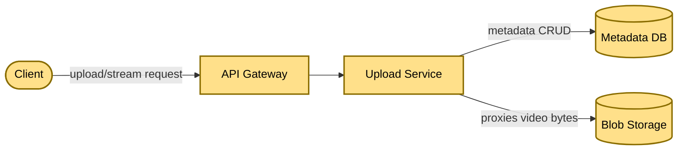
```mermaid
flowchart LR
    classDef new fill:#ffe08a,stroke:#8a6d00,stroke-width:2px,color:#000
    U([Client]):::new -->|upload/stream request| GW[API Gateway]:::new
    GW --> UP[Upload Service]:::new
    UP -->|metadata CRUD| DB[("Metadata DB")]:::new
    UP -->|proxies video bytes| BS[("Blob Storage")]:::new
```

**Upload flow**
1. User calls `POST /videos` with the video file attached, hits API Gateway → Upload Service.
2. Upload Service creates a metadata row (status = `UPLOADING`).
3. Upload Service streams the file bytes into Blob Storage.
4. Upload Service updates the metadata row with the blob URL and status = `READY`.

**Stream flow**
1. User calls `GET /videos/{id}`.
2. Service fetches metadata row → gets blob URL.
3. Service fetches the actual bytes from Blob Storage.
4. Service streams those bytes back to the user.

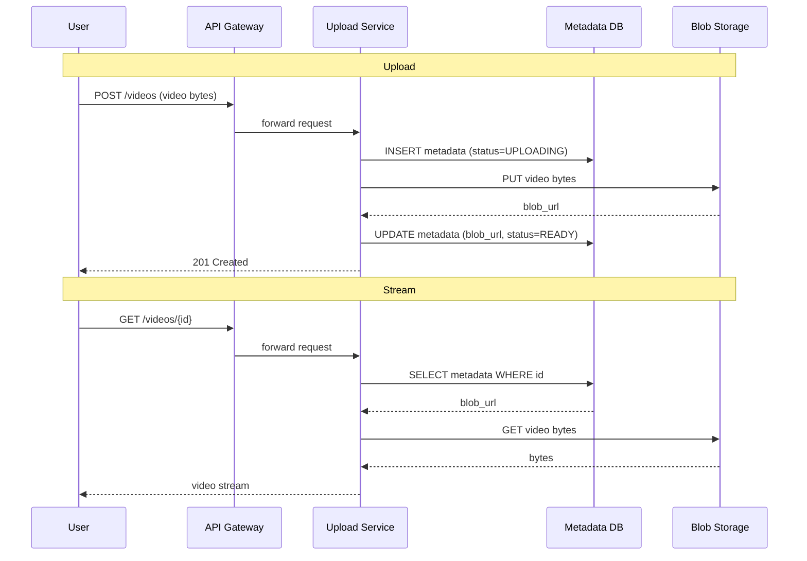
```mermaid
sequenceDiagram
    participant U as User
    participant GW as API Gateway
    participant UP as Upload Service
    participant DB as Metadata DB
    participant BS as Blob Storage

    Note over U,BS: Upload
    U->>GW: POST /videos (video bytes)
    GW->>UP: forward request
    UP->>DB: INSERT metadata (status=UPLOADING)
    UP->>BS: PUT video bytes
    BS-->>UP: blob_url
    UP->>DB: UPDATE metadata (blob_url, status=READY)
    UP-->>U: 201 Created

    Note over U,BS: Stream
    U->>GW: GET /videos/{id}
    GW->>UP: forward request
    UP->>DB: SELECT metadata WHERE id
    DB-->>UP: blob_url
    UP->>BS: GET video bytes
    BS-->>UP: bytes
    UP-->>U: video stream
```

**DB schema**

`videos`

| Column | Type | Notes |
|---|---|---|
| id | UUID (PK) | |
| owner_id | UUID | |
| title | text | |
| status | enum | `UPLOADING`, `READY`, `FAILED` |
| blob_url | text | populated once uploaded |
| created_at | timestamp | |

**Drawback (why we move to v2):** every byte of every upload *and* every byte of every stream passes through our Upload Service. That server now needs enough bandwidth and compute to proxy petabytes of traffic for no reason — blob stores are built to serve/accept bytes directly, far cheaper and faster than we can proxy them.

---

### v2 — Presigned URLs (direct-to-blob-store)

**Idea:** stop proxying bytes through our servers. Blob stores (S3, GCS) support presigned URLs — a short-lived, signed URL that lets a client PUT/GET directly against the bucket without needing bucket credentials.

**Under the hood: what's actually inside a presigned URL, and why the client can't abuse it.** A presigned URL is just the normal bucket URL (`https://bucket.s3.amazonaws.com/raw-videos/{video_id}/original.mp4`) plus three query params the blob store's SDK computes server-side: `expires` (a short TTL, e.g. 15 min), and a `signature` — an HMAC of `{bucket, key, http-method, expiry}` computed with a secret key our Upload Service holds (the client never sees the secret). The blob store recomputes that HMAC on every request and rejects it if the signature doesn't match, the method doesn't match (a PUT-signed URL can't be used as a GET), or the clock has passed `expires`. So the client can upload *exactly one object, one HTTP verb, within one time window* — nothing more, without ever holding real bucket credentials.

**Why does the Upload Service stay in the loop at all, if it never touches bytes?** Four jobs that must happen *before* a presigned URL is even handed out: **auth** (is this user allowed to upload), **quota** (has this user hit a daily upload cap), **validation of the request** (title/visibility fields well-formed), and **owning the metadata write** (the row must exist before the client can reference `video_id` in later calls). None of that requires seeing a single video byte.

**Object storage semantics, stated precisely (interviewers probe this):** a blob store is not a filesystem — it's a flat key→value map addressed over HTTP. `PUT /bucket/key` (body = bytes) creates/overwrites an object; `GET /bucket/key` returns it; there's no "directory," `raw-videos/{video_id}/original.mp4` is just a string key that *looks* like a path. Object storage's durability guarantee (typically "11 nines") comes from replicating each object across ≥3 disks/AZs at write time — this is a property of the blob store itself, independent of anything our services do, and it's why we never write raw video bytes into our relational DB.

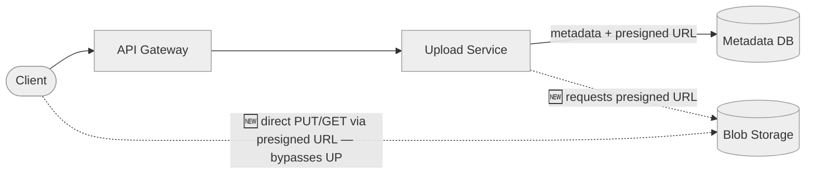
```mermaid
flowchart LR
    classDef new fill:#ffe08a,stroke:#8a6d00,stroke-width:2px,color:#000
    classDef existing fill:#eee,stroke:#999,color:#333
    U([Client]):::existing --> GW[API Gateway]:::existing
    GW --> UP[Upload Service]:::existing
    UP -->|metadata + presigned URL| DB[("Metadata DB")]:::existing
    UP -.->|"🆕 requests presigned URL"| BS[("Blob Storage")]:::existing
    U -.->|"🆕 direct PUT/GET via presigned URL — bypasses UP"| BS
```

**Upload flow**
1. User calls `POST /videos` with metadata **only** (title, description — no bytes).
2. Upload Service creates a metadata row (status = `PENDING_UPLOAD`).
3. Upload Service asks Blob Storage for a **presigned PUT URL**.
4. Upload Service returns `{video_id, upload_url}` to the client.
5. Client `PUT`s the video bytes **directly** to `upload_url` — our servers are not in this path at all.
6. On success, client calls `POST /videos/{id}/complete` (or the blob store's own event notification, e.g. S3 `ObjectCreated`, fires a webhook) → Upload Service updates status = `READY`.

**Stream flow**
1. User calls `GET /videos/{id}`.
2. Upload Service fetches metadata row, returns a presigned **GET** URL (so the file can stay in a private bucket).
3. Client fetches the video bytes **directly** from Blob Storage using that URL. Our server never touches the bytes.

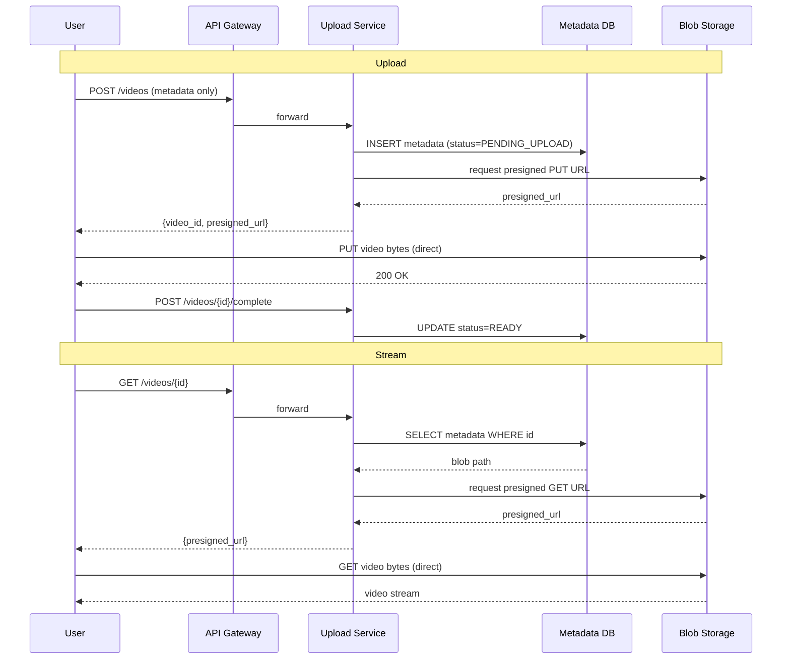
```mermaid
sequenceDiagram
    participant U as User
    participant GW as API Gateway
    participant UP as Upload Service
    participant DB as Metadata DB
    participant BS as Blob Storage

    Note over U,BS: Upload
    U->>GW: POST /videos (metadata only)
    GW->>UP: forward
    UP->>DB: INSERT metadata (status=PENDING_UPLOAD)
    UP->>BS: request presigned PUT URL
    BS-->>UP: presigned_url
    UP-->>U: {video_id, presigned_url}
    U->>BS: PUT video bytes (direct)
    BS-->>U: 200 OK
    U->>UP: POST /videos/{id}/complete
    UP->>DB: UPDATE status=READY

    Note over U,BS: Stream
    U->>GW: GET /videos/{id}
    GW->>UP: forward
    UP->>DB: SELECT metadata WHERE id
    DB-->>UP: blob path
    UP->>BS: request presigned GET URL
    BS-->>UP: presigned_url
    UP-->>U: {presigned_url}
    U->>BS: GET video bytes (direct)
    BS-->>U: video stream
```

**DB schema (delta from v1):** unchanged columns, `status` gains value `PENDING_UPLOAD`.

**Tradeoff — why we did this:** offloads all bandwidth to the blob store (which is built for this, at lower cost per GB transferred, with built-in scaling). Our Upload Service now only handles small metadata requests, so it scales trivially.

**Drawback (why we move to v3):** a multi-GB `PUT` is one giant HTTP request. Any network blip mid-upload and the client must restart from byte 0 — unacceptable given our answer to clarifying question #2 (resumable uploads are mandatory).

---

### v3 — Multipart upload (resumability + speed)

**Idea:** split the *upload* into independently-uploadable parts (typically 5–100MB each). Each part gets its own presigned URL and can be retried independently; parts can even upload in parallel for speed. Blob stores (S3 Multipart Upload API and equivalents) track parts by ETag and stitch them together server-side on completion — no re-upload of already-succeeded parts.

**Concrete numbers worth stating out loud:** S3's real constraint is every part must be **≥5MB except the last part**, max **10,000 parts** per object, max **5GB** per part — so for a 5GB video, ~50–1000 parts depending on chosen part size (we'd pick ~64–100MB parts for a file that size to stay well under the 10,000-part ceiling). Client-side, we cap **parallel part uploads at ~4–6 concurrent** (matches typical mobile/broadband concurrent-connection sweet spot — more parallelism competes for the same finite bandwidth and stops helping past that point).

**Tying this back to our own stated max (clarifying question #1, 256GB):** the 10,000-part ceiling means our *minimum viable average part size* for the largest file we support is `256GB / 10,000 ≈ 25.6MB`. Our chosen 64–100MB part-size policy comfortably clears that floor (256GB ÷ 100MB = ~2,560 parts) — worth stating this derivation out loud rather than just quoting "64-100MB" as a magic number; it shows the part-size choice is a consequence of our own stated limits, not an arbitrary pick.

**The actual resume mechanic (what happens when the app is killed mid-upload and reopened):** the client doesn't have to trust its own local bookkeeping — it can ask the blob store directly via `ListParts(upload_id)`, which returns every part the store has *durably* received an ETag for so far. Diff that against "all parts this file needs" and only the missing ones get re-uploaded. This is what makes resumability survive not just a network drop but a full app/device restart — the source of truth for "what's already uploaded" lives in the blob store, not in local app state.

**Under the hood — the exact question to have a crisp answer for: "does anyone need to know the total chunk count upfront?" No, at no step:**

- **Chunking itself is a pure client-side, local decision** — no server round trip needed to decide it. The client has the file on disk, picks a part size from policy (e.g. "64MB, or 100MB if file > 5GB to stay under the 10,000-part ceiling"), and computes `total_parts = ceil(file_size / part_size)` entirely offline. Nobody outside the client needs to be told this number to make the system work.
- **`POST /videos` (step 1) only carries metadata** (title, visibility, maybe `content_length` for a progress bar) — it is *not* "here are my N chunks." Its only job is to create the metadata row and ask the blob store to open a multipart upload session, which returns an `upload_id`. `CreateMultipartUpload` in the real S3/GCS API takes no part count at all — it doesn't know or care yet how many parts are coming.
- **Each per-part presigned URL (step 2) is scoped to exactly one `(upload_id, part_number)` pair** — nothing about total count is needed to mint it. You could request part #1's URL, upload it, then decide five minutes later you want part #2's URL — the API has no notion of "part 2 of how many."
- **The total part count is only ever established implicitly, at the very end**, when the client calls `complete-multipart` with the *full list* of `{part_number, etag}` pairs it collected. The blob store's completion step validates that the part numbers it received are exactly the contiguous set the client claims finished the object, and reassembles them in order. That list's length *is* the total — nothing before this point ever declares it.

So the real sequence is: **plan chunks locally → open a session (no count needed) → request+upload each part one at a time or in parallel (no count needed per part) → tell the store the final list when done (this is where "how many parts" first becomes known to anyone but the client).**

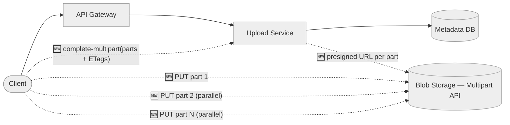
```mermaid
flowchart LR
    classDef new fill:#ffe08a,stroke:#8a6d00,stroke-width:2px,color:#000
    classDef existing fill:#eee,stroke:#999,color:#333
    U([Client]):::existing --> GW[API Gateway]:::existing
    GW --> UP[Upload Service]:::existing
    UP --> DB[("Metadata DB")]:::existing
    UP -.->|"🆕 presigned URL per part"| BS[("Blob Storage — Multipart API")]:::existing
    U -.->|"🆕 PUT part 1"| BS
    U -.->|"🆕 PUT part 2 (parallel)"| BS
    U -.->|"🆕 PUT part N (parallel)"| BS
    U -.->|"🆕 complete-multipart(parts + ETags)"| UP
```

**Upload flow (delta from v2)**

0. Client computes the chunk plan **locally, no network call**: pick a part size from policy → `total_parts = ceil(file_size / part_size)`. This number lives only on the client for now (e.g. to drive a progress bar); it is never sent to the server or the blob store at this point.
1. `POST /videos` → metadata row created (title/visibility only, no chunk info), and Upload Service asks the blob store to open a multipart session → gets back an `upload_id`. The blob store does not need, and does not ask for, the total part count here.
2. For each part `i` from 1 to `total_parts`: client calls `POST /videos/{id}/parts/{i}` → Upload Service asks the blob store for a presigned PUT URL scoped to `(upload_id, part_number=i)` only — again, no total count involved.
3. Client `PUT`s each part directly to blob storage, in parallel (bounded concurrency) — blob storage returns an `ETag` per part.
4. Client tracks `{part_number, etag}` for every succeeded part locally (and can double-check against the blob store's own `ListParts(upload_id)` if it's unsure), so a crashed upload resumes by uploading only the parts still missing.
5. Once all `total_parts` parts succeed, client calls `POST /videos/{id}/complete-multipart` with the full `{part_number, etag}` list, in order — **this is the first time the blob store learns how many parts there were**, implicitly, from the length of that list. It validates the numbering is contiguous and assembles the final object.
6. Same as v2 from here: status flips straight to `READY` — v3 only changes *how* bytes get uploaded (chunked, resumable), not what happens afterward. There's still no transcoding at this point, so "done uploading" and "done, period" are the same moment, exactly like v2.

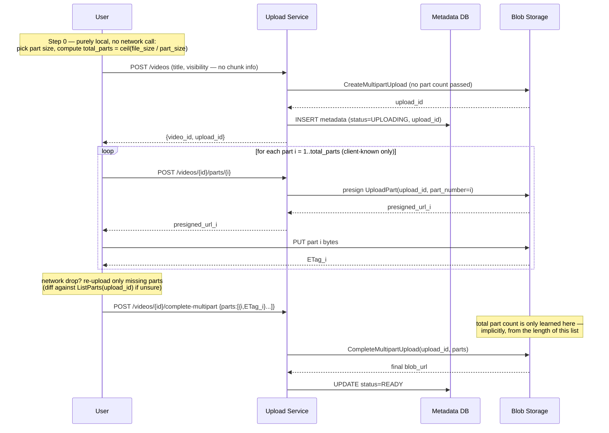
```mermaid
sequenceDiagram
    participant U as User
    participant UP as Upload Service
    participant DB as Metadata DB
    participant BS as Blob Storage

    Note over U: Step 0 — purely local, no network call:<br/>pick part size, compute total_parts = ceil(file_size / part_size)

    U->>UP: POST /videos (title, visibility — no chunk info)
    UP->>BS: CreateMultipartUpload (no part count passed)
    BS-->>UP: upload_id
    UP->>DB: INSERT metadata (status=UPLOADING, upload_id)
    UP-->>U: {video_id, upload_id}

    loop for each part i = 1..total_parts (client-known only)
        U->>UP: POST /videos/{id}/parts/{i}
        UP->>BS: presign UploadPart(upload_id, part_number=i)
        BS-->>UP: presigned_url_i
        UP-->>U: presigned_url_i
        U->>BS: PUT part i bytes
        BS-->>U: ETag_i
    end

    Note over U: network drop? re-upload only missing parts<br/>(diff against ListParts(upload_id) if unsure)

    U->>UP: POST /videos/{id}/complete-multipart {parts:[{i,ETag_i}...]}
    Note over BS: total part count is only learned here —<br/>implicitly, from the length of this list
    UP->>BS: CompleteMultipartUpload(upload_id, parts)
    BS-->>UP: final blob_url
    UP->>DB: UPDATE status=READY
```

**Under the hood — what happens to the parts after `CompleteMultipartUpload`: stitched into one object, not kept as separate chunks.** The blob store reassembles all parts into a **single contiguous object** under the original key — the individual parts stop being separately addressable the moment completion succeeds. A `GET` on that key afterward returns it exactly as if it had been uploaded via one single `PUT`; there is no way to tell from the *outside* that it was ever chunked. Two nuances worth having ready:
- The resulting object's ETag is not a plain content MD5 the way a single-PUT object's is — it's a hash-of-hashes, often rendered like `abc123-14` (the `-14` being the part count), so you *can* tell after the fact that it was multipart-assembled, even though the bytes are one seamless file.
- Internally the blob store may still physically stripe/replicate that "single object" across many disks/nodes for durability — but that's the store's own sharding, invisible to us; logically and via the API it is one object, one key.

**Don't conflate this with the HLS/DASH segments introduced in v5** — those (`seg0.ts`, `seg1.ts`, ...) are a *deliberate, permanent* set of separate objects the player fetches individually for adaptive streaming. Multipart's chunks are a *transient upload mechanism* that disappears into one object the instant upload finishes; segments are a *product decision* made later, at transcode time, for an unrelated reason (letting the player switch quality mid-playback). The video gets "split into pieces" twice in this design, for two unrelated reasons — worth stating that distinction explicitly if it looks like it's getting merged into one idea.

**DB schema (delta):**

`videos` gains `upload_id` column.

New table `upload_parts` (optional — can also be reconstructed by asking the blob store directly, but tracking locally avoids extra API calls)

| Column | Type | Notes |
|---|---|---|
| video_id | UUID (FK, indexed) | |
| part_number | int | |
| etag | text | |
| status | enum | `PENDING`,`UPLOADED` |

**Constraint worth stating explicitly:** `UNIQUE (video_id, part_number)`. Without it, a client retrying `POST /videos/{id}/parts/{i}` after a timeout — normal on the flaky network this whole version exists to survive — inserts a second row for the same part instead of updating the first. The unique constraint turns a naive `INSERT` into a safe `UPSERT` target, which is what actually makes the "request the same part's URL twice" case safe, not just the API-level idempotency-key convention above.

**Tradeoff:** resumability and parallel-part speed, at the cost of more upload-side bookkeeping (part tracking) and a slightly more complex client. **Upload story is now closed** — everything from here is about making the *stream* side better, then scaling, then optimizing.

**Drawback (why v4):** we still only ever store and serve **one resolution** — whatever the client uploaded. A 4K upload is streamed as 4K even to someone on 3G. Transcoding on-the-fly per request is wasteful (this is a 1000:1 read:write system — we'd redo the same CPU work millions of times for the same video). Better: transcode **once**, at upload time, and serve the cached result forever after.

---

### v4 — Multiple resolutions (async transcoding)

**Idea:** on successful upload, kick off a background job that transcodes the source into multiple renditions (480p/720p/1080p/4K) **once**. Do it **asynchronously** so the Upload Service doesn't block on CPU-heavy work — if it transcoded inline, the `complete` call would take minutes, hold a request thread the whole time, and any transcoding failure would fail the whole upload API.

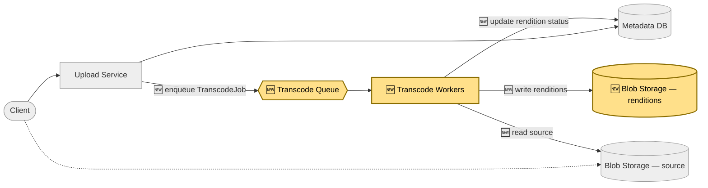
```mermaid
flowchart LR
    classDef new fill:#ffe08a,stroke:#8a6d00,stroke-width:2px,color:#000
    classDef existing fill:#eee,stroke:#999,color:#333
    U([Client]):::existing --> UP[Upload Service]:::existing
    UP --> DB[("Metadata DB")]:::existing
    U -.-> BS1[("Blob Storage — source")]:::existing
    UP -->|"🆕 enqueue TranscodeJob"| Q{{"🆕 Transcode Queue"}}:::new
    Q --> W["🆕 Transcode Workers"]:::new
    W -->|"🆕 read source"| BS1
    W -->|"🆕 write renditions"| BS2[("🆕 Blob Storage — renditions")]:::new
    W -->|"🆕 update rendition status"| DB
```

**Video status lifecycle (introduced here):**

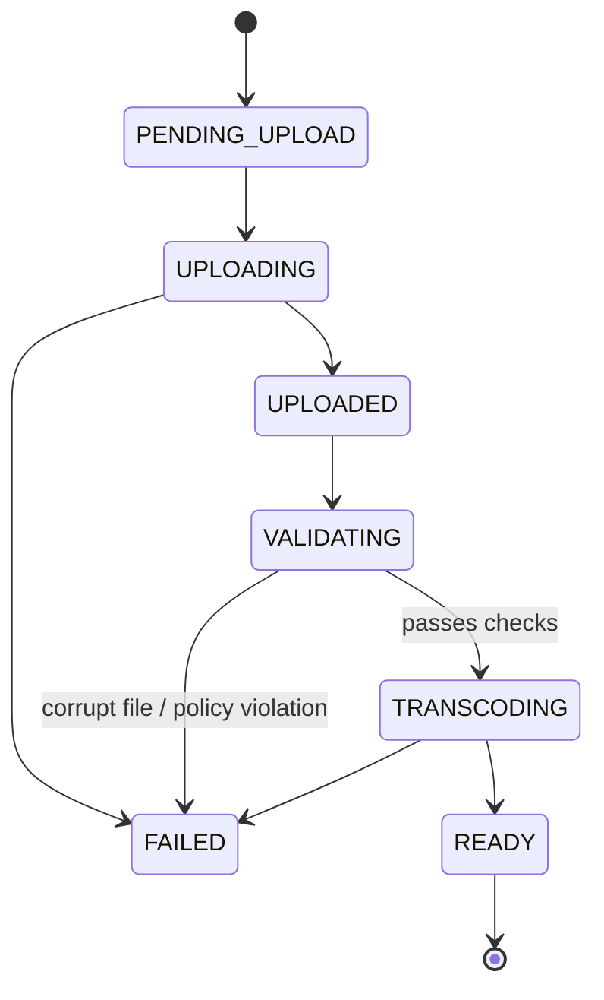
```mermaid
stateDiagram-v2
    [*] --> PENDING_UPLOAD
    PENDING_UPLOAD --> UPLOADING
    UPLOADING --> UPLOADED
    UPLOADING --> FAILED
    UPLOADED --> VALIDATING
    VALIDATING --> FAILED : corrupt file / policy violation
    VALIDATING --> TRANSCODING : passes checks
    TRANSCODING --> READY
    TRANSCODING --> FAILED
    READY --> [*]
```

**Upload flow (delta from v3):** steps 1–5 are the identical multipart mechanics from v3 (chunk, presign each part, upload, complete-multipart) — nothing about *how bytes get uploaded* changes here. What changes is **what "complete" means**: in v3, completion meant the video was immediately watchable, so it went straight to `READY`. Now there's real work left to do before it's watchable, so completion instead lands on `UPLOADED` — an intermediate state that didn't need to exist until this version introduced something that happens *after* upload finishes.
6. `POST /videos/{id}/complete-multipart` → status flips to `UPLOADED` (not `READY` — that's the v3→v4 behavior change, worth calling out explicitly rather than letting it look accidental).
7. Before queueing anything expensive, a worker runs a cheap **validation pass** — inspect the container/codec (e.g. via `ffprobe`), confirm it's actually a playable video, check duration against our cap (clarifying question #1), run a policy/hash check. Status → `VALIDATING`. Fail fast here; don't burn transcode CPU on a corrupt or rejected upload.
8. Upload Service (or the validation worker) publishes a **transcode job** message onto a queue.
9. A pool of **Transcode Workers** consume the queue, pull the source file from Blob Storage, run ffmpeg to produce each rendition, and push each rendition to Blob Storage (same or separate bucket).
10. Worker updates the DB: per-rendition rows with status, and once all renditions are done, flips the video's overall status to `READY`.

**Under the hood: why transcoding a 12-minute video doesn't take (12 min × 4 resolutions) of wall-clock time.** A single worker transcoding one resolution serially, start to finish, roughly tracks source duration per resolution — that would make a 4-rendition ladder take ~4x the video's length, which is far too slow. Instead, the source is split into short **time-chunks** (e.g. 30–60s each) *before* transcoding, and the job fans out across many workers: one worker per `(resolution, time-chunk)` pair. A 12-minute video × 4 resolutions with 30s chunks is ~24 chunks × 4 = 96 independent transcode tasks, farmed out in parallel across the worker pool, then the resulting per-chunk outputs are concatenated (or, if we're already producing HLS/DASH-style segments per v5, they don't even need concatenation — each chunk output *is* already a servable segment). This is why total wall-clock time tracks roughly with worker-pool size, not with `resolutions × duration`, and it's also *why* per-shot/time-chunked transcoding pairs so naturally with segment-based streaming in v5 — we're producing the same chunked artifact either way.

**Concrete blob storage key layout** (say this when asked "what does storage actually look like on disk"):
```
s3://raw-videos/{video_id}/original.mp4              ← untouched source, kept for re-transcodes
s3://renditions/{video_id}/480p/full.mp4
s3://renditions/{video_id}/720p/full.mp4
s3://renditions/{video_id}/1080p/full.mp4
s3://renditions/{video_id}/4k/full.mp4
```

**Stream flow (delta from v3):** `GET /videos/{id}` now also needs the client's preferred/available resolution; response includes URLs per rendition instead of a single blob URL.

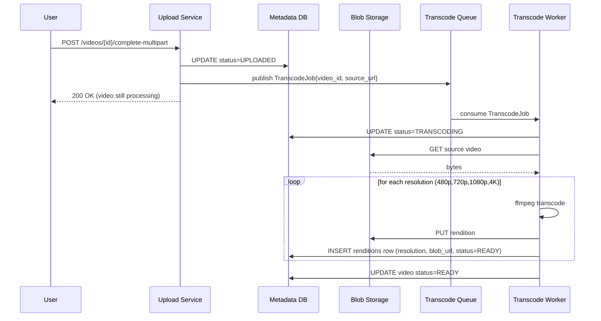
```mermaid
sequenceDiagram
    participant U as User
    participant UP as Upload Service
    participant DB as Metadata DB
    participant BS as Blob Storage
    participant Q as Transcode Queue
    participant W as Transcode Worker

    U->>UP: POST /videos/{id}/complete-multipart
    UP->>DB: UPDATE status=UPLOADED
    UP->>Q: publish TranscodeJob{video_id, source_url}
    UP-->>U: 200 OK (video still processing)

    Q->>W: consume TranscodeJob
    W->>DB: UPDATE status=TRANSCODING
    W->>BS: GET source video
    BS-->>W: bytes
    loop for each resolution (480p,720p,1080p,4K)
        W->>W: ffmpeg transcode
        W->>BS: PUT rendition
        W->>DB: INSERT renditions row (resolution, blob_url, status=READY)
    end
    W->>DB: UPDATE video status=READY
```

**DB schema (delta from v3):**

`videos.status` gains `UPLOADED`, `VALIDATING`, `TRANSCODING` (matching the state diagram above — easy to forget `VALIDATING` since it's a short-lived state, but it needs its own value if we want to show a viewer *why* their upload is stuck, e.g. "checking file" vs. "encoding").

New table `renditions`

| Column | Type | Notes |
|---|---|---|
| id | UUID (PK) | |
| video_id | UUID (FK → videos.id, indexed) | |
| resolution | enum | `480p`,`720p`,`1080p`,`4K` |
| blob_url | text | |
| status | enum | `PENDING`,`PROCESSING`,`READY`,`FAILED` |

**Constraint worth stating explicitly:** `UNIQUE (video_id, resolution)`. This is exactly what makes the earlier claim "the worker's DB write is an idempotent upsert on `(video_id, resolution)`" (§4 under-the-hood, at-least-once delivery) actually true rather than aspirational — a redelivered `video-transcode-jobs` message re-running the same `(video_id, resolution)` transcode must update the existing row, not insert a duplicate. Also index `videos.status` — every operational query this system needs beyond "fetch one video" (e.g. "find uploads stuck in `TRANSCODING` for >1hr" for the ops dashboard) filters on status.

**Topic and message schema:**

- **Topic:** `video-transcode-jobs`
- **Kafka record key:** `video_id` — note this is the *broker-level* record key (what Kafka actually partitions on), not a field inside the JSON payload. Getting this distinction right matters: putting `"partition_key": "video_id"` inside the value body is a common but meaningless gesture — Kafka never reads inside your payload to decide partitioning, only the record key (set separately by the producer call) does that.
- **Producer:** Upload Service (after the validation pass, not before — we don't want to burn queue capacity on jobs that'll just get rejected).
- **Consumer group:** `transcode-workers` (the worker pool from the diagram above).
- **Delivery semantics:** at-least-once — a redelivered message must be safe to reprocess. This is why the worker's DB write is an **idempotent upsert on `(video_id, resolution)`**, not a blind `INSERT` (enforced by the `UNIQUE (video_id, resolution)` constraint above): reprocessing the same job twice must not create duplicate rendition rows.
- **Failure handling:** an `attempt` counter in the payload, incremented by the worker on each retry; after a configured max (e.g. 5), the worker publishes to a **dead-letter topic** `video-transcode-jobs-dlq` instead of retrying forever — a job stuck in an infinite retry loop (e.g. a permanently-corrupt source file that somehow passed validation) would otherwise silently consume worker capacity forever with no operator visibility. The DLQ is what an ops dashboard actually watches.

**Kafka record:**
```
key:   "{video_id}"          ← this is what Kafka partitions on
value (JSON):
{
  "job_id": "uuid",
  "video_id": "uuid",
  "source_blob_url": "s3://raw-videos/abc.mp4",
  "requested_resolutions": ["480p", "720p", "1080p", "4K"],
  "attempt": 1,
  "enqueued_at": "2026-08-12T10:00:00Z"
}
```

**A second topic exists alongside this one** — `video-lifecycle-events`, published whenever a video's status changes, fanning out to search indexing, notifications, and CDN pre-warm decisions without those services needing to know anything about Upload/Transcode internals. See §8 for its schema and consumers — it's the backbone behind the "if time permits" features in §6, not a separate P0 concern, so it's covered there rather than repeated per-version.

**Tradeoff:** we now pay upfront CPU cost per upload (transcode once) instead of per view — correct given 1000:1 read:write. Cost: added system complexity (queue, workers, per-rendition status tracking) and a delay between "upload complete" and "video actually watchable in all resolutions."

**Drawback (why v5):** we're picking *one whole rendition file* to serve. If network conditions change mid-playback (starts on WiFi at 1080p, then user walks onto cellular), we can't downgrade without restarting the video. We need the ability to switch resolution **mid-stream**, at the granularity of a few seconds.

---

### v5 — Adaptive streaming (HLS / DASH)

**Idea:** instead of one file per resolution, chop each rendition into small **segments** (~2–10 sec each) and generate a **manifest** file listing all segments across all resolutions. The player reads the manifest, picks a starting resolution, and can switch resolution at any segment boundary based on measured bandwidth — Adaptive Bitrate (ABR) streaming. HLS uses `.m3u8` manifests + `.ts`/`.mp4` segments; DASH uses `.mpd` + segments — same idea, different formats.

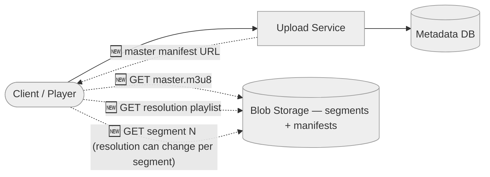
```mermaid
flowchart LR
    classDef new fill:#ffe08a,stroke:#8a6d00,stroke-width:2px,color:#000
    classDef existing fill:#eee,stroke:#999,color:#333
    U([Client / Player]):::existing --> UP[Upload Service]:::existing
    UP --> DB[("Metadata DB")]:::existing
    UP -.->|"🆕 master manifest URL"| U
    U -.->|"🆕 GET master.m3u8"| BS[("Blob Storage — segments + manifests")]:::existing
    U -.->|"🆕 GET resolution playlist"| BS
    U -.->|"🆕 GET segment N (resolution can change per segment)"| BS
```

**Upload flow (delta from v4):** the transcode worker, for each resolution, doesn't just produce one file — it produces N segment files + a per-resolution playlist, then a master manifest referencing all resolution playlists.

**Stream flow (delta from v4):**
1. Client calls `GET /videos/{id}/manifest`.
2. Service returns the **master manifest URL**, pointing to per-resolution playlists.
3. Player picks a resolution (e.g. lowest, to start fast) and requests that resolution's playlist → gets a list of segment URLs.
4. Player fetches segments one at a time, directly from Blob Storage, re-evaluating available bandwidth after every segment and swapping resolution playlist if needed.

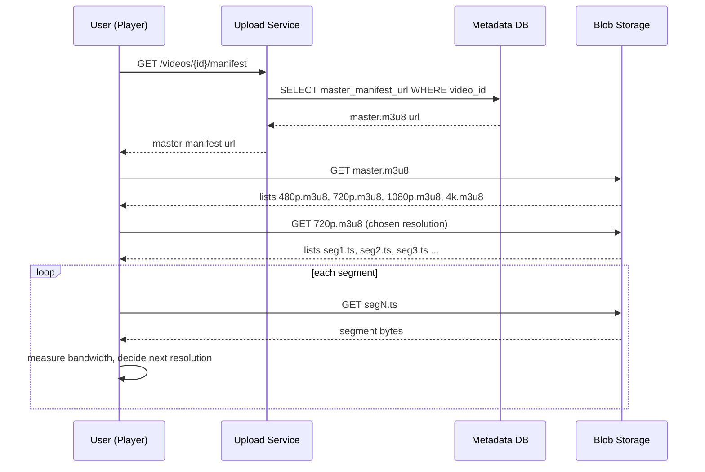
```mermaid
sequenceDiagram
    participant U as User (Player)
    participant UP as Upload Service
    participant DB as Metadata DB
    participant BS as Blob Storage

    U->>UP: GET /videos/{id}/manifest
    UP->>DB: SELECT master_manifest_url WHERE video_id
    DB-->>UP: master.m3u8 url
    UP-->>U: master manifest url

    U->>BS: GET master.m3u8
    BS-->>U: lists 480p.m3u8, 720p.m3u8, 1080p.m3u8, 4k.m3u8
    U->>BS: GET 720p.m3u8 (chosen resolution)
    BS-->>U: lists seg1.ts, seg2.ts, seg3.ts ...

    loop each segment
        U->>BS: GET segN.ts
        BS-->>U: segment bytes
        U->>U: measure bandwidth, decide next resolution
    end
```

**Sample master manifest (`master.m3u8`)**
```
#EXTM3U
#EXT-X-STREAM-INF:BANDWIDTH=800000,RESOLUTION=854x480
480p/playlist.m3u8
#EXT-X-STREAM-INF:BANDWIDTH=2800000,RESOLUTION=1280x720
720p/playlist.m3u8
#EXT-X-STREAM-INF:BANDWIDTH=5000000,RESOLUTION=1920x1080
1080p/playlist.m3u8
```

**Sample resolution playlist (`720p/playlist.m3u8`)**
```
#EXTM3U
#EXT-X-TARGETDURATION=5
#EXTINF:5.0,
seg0.ts
#EXTINF:5.0,
seg1.ts
#EXTINF:5.0,
seg2.ts
#EXT-X-ENDLIST
```

**Under the hood — where do the manifest and segment files actually live? No new storage system: they're plain objects in the *same* blob storage bucket as everything else, just a lot more of them, at predictable keys.**

Concrete key layout, extending the rendition layout from v4:

```
s3://renditions/{video_id}/master.m3u8              ← master manifest (tiny text file, ~1KB)
s3://renditions/{video_id}/480p/playlist.m3u8        ← per-resolution playlist (tiny text file)
s3://renditions/{video_id}/480p/seg0.ts              ← actual video bytes for seconds 0-5
s3://renditions/{video_id}/480p/seg1.ts              ← seconds 5-10
s3://renditions/{video_id}/480p/seg2.ts              ← ...
s3://renditions/{video_id}/720p/playlist.m3u8
s3://renditions/{video_id}/720p/seg0.ts
s3://renditions/{video_id}/720p/seg1.ts
s3://renditions/{video_id}/1080p/playlist.m3u8
s3://renditions/{video_id}/1080p/seg0.ts
...
```

**How they get there mechanically:** ffmpeg's HLS/DASH muxer *directly emits* the playlist file and the segment files as its output — you point ffmpeg at "produce HLS output" instead of "produce one .mp4," and it writes `playlist.m3u8` + `seg0.ts, seg1.ts, ...` straight to local disk on the transcode worker. The worker then just `PUT`s each of those output files to blob storage as its own ordinary object, one per file, exactly like any other upload in this design — a manifest is a text file, a segment is a small binary file; neither needs special handling by the blob store. The worker builds the **master manifest** itself afterward (or via a muxer flag), writing one small text file that references the per-resolution playlist paths.

**How the DB fits in — it stores exactly one pointer, not the tree.** Only `videos.master_manifest_url` (pointing at the `master.m3u8` object) gets written to the DB, once, when the video flips to `READY`. Nothing about individual segments, or even the per-resolution playlists, is tracked in the DB at all — the DB would otherwise have to grow a row per segment (hundreds per video), which is exactly the kind of unnecessary DB scaling this design avoids everywhere else. The player discovers everything else (which resolutions exist, how many segments each has) by *reading the manifest's contents*, not by asking our API.

**How relative paths inside the manifest resolve** (worth knowing precisely, it trips people up): entries like `480p/playlist.m3u8` inside `master.m3u8`, and `seg0.ts` inside a per-resolution playlist, are **relative URLs** — resolved by the player exactly like a relative link in an HTML page, relative to the URL the containing file was itself fetched from. This is *why* the whole rendition tree is portable: it works unchanged whether it's served straight from the blob store's own domain or later fronted by a CDN with a completely different domain (v9) — nothing inside the manifest files needs to be rewritten when we add a CDN, because the paths were never absolute to begin with.

**Under the hood: the exact client-side algorithm that picks a resolution — this is the answer to "how does adaptive bitrate actually decide?", and it's worth memorizing the concrete thresholds, not just the word "adaptive":**

After every segment finishes downloading, the player does two measurements and one decision:
1. **Measure throughput** from the segment that just finished: `size_of_last_segment / time_to_download`. e.g. a 2.5MB segment in 0.5s → 5MB/s → 40 Mbps.
2. **Check buffer health** — how many seconds of *already-downloaded, not-yet-played* segments are queued. This buffer is the safety cushion: if the network died right now, the player could keep playing for exactly this many more seconds before a visible rebuffer.
3. **Decide the next segment's rung**, purely from those two numbers:

| Buffer level | Decision |
|---|---|
| Buffer > 30s **and** measured throughput comfortably covers the next rung up | Step **up** one rung (never jump straight to the top — climb one step at a time, since a bad guess costs a wasted download) |
| Buffer 10–30s | **Hold** current rung |
| Buffer 5–10s | **Consider** stepping down (early warning) |
| Buffer < 5s | **Emergency downgrade now** — drop rungs regardless of throughput; avoiding a rebuffer always wins over quality |
| Buffer = 0 | Rebuffer — the spinner appears; the one outcome the whole algorithm exists to prevent |

**The one-line summary to say out loud:** *if the buffer is draining, drop quality immediately regardless of measured bandwidth — never let it hit zero. Otherwise, if bandwidth comfortably covers the next rung, climb one step at a time.* This is client-only logic reading a shared, static manifest — **no server-side per-viewer transcoding happens at request time**; the server just serves whichever pre-encoded segment file the client asks for next.

**DB schema (delta from v4):** `renditions.blob_url` now points to a per-resolution playlist (not a single file); add `videos.master_manifest_url`. Segment files themselves don't need individual DB rows — they're implied by the playlist content, so the DB doesn't scale with segment count.

**Tradeoff:** smooth, adaptive playback and fast start (client starts on a low resolution while measuring bandwidth), at the cost of many more small objects in blob storage and a more complex transcode-worker output. **Streaming-quality story is now closed.**

**Drawback (why v6):** everything so far assumes **one data center**. A DC-level outage (power, network, disaster) takes down uploads *and* streaming for everyone, violating our "highly available" NFR.

---

### v6 — Multiple data centers (same region)

**Idea:** run the same stack (Upload Service, Metadata DB, Transcode Workers) across ≥2 data centers within one region, behind a load balancer that health-checks and fails over. Metadata DB replicates between DCs; Blob Storage is typically already multi-DC/multi-AZ under the hood (part of its 11-nines durability promise), so this version is mostly about our **compute + DB** tier, not storage.

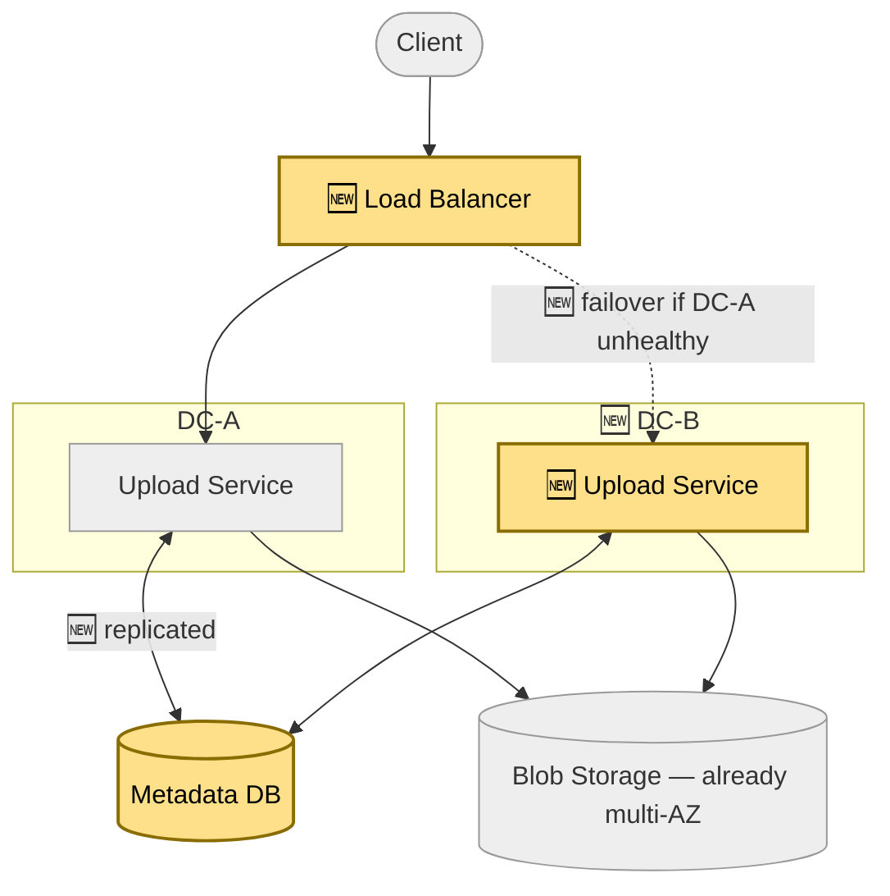
```mermaid
flowchart TD
    classDef new fill:#ffe08a,stroke:#8a6d00,stroke-width:2px,color:#000
    classDef existing fill:#eee,stroke:#999,color:#333
    U([Client]):::existing --> LB["🆕 Load Balancer"]:::new
    subgraph DCA["DC-A"]
        UPA["Upload Service"]:::existing
    end
    subgraph DCB["🆕 DC-B"]
        UPB["🆕 Upload Service"]:::new
    end
    LB --> UPA
    LB -.->|"🆕 failover if DC-A unhealthy"| UPB
    UPA <-->|"🆕 replicated"| DB[("Metadata DB")]:::new
    UPB <--> DB
    UPA --> BS[("Blob Storage — already multi-AZ")]:::existing
    UPB --> BS
```

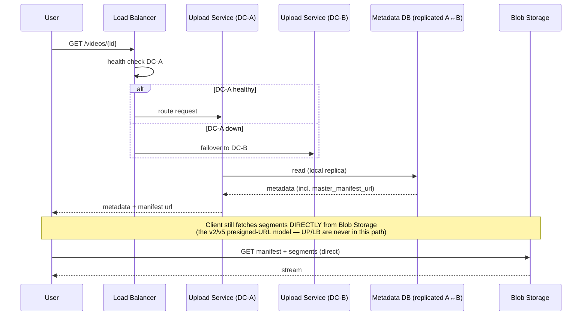
```mermaid
sequenceDiagram
    participant U as User
    participant LB as Load Balancer
    participant UP1 as Upload Service (DC-A)
    participant UP2 as Upload Service (DC-B)
    participant DB as Metadata DB (replicated A↔B)
    participant BS as Blob Storage

    U->>LB: GET /videos/{id}
    LB->>LB: health check DC-A
    alt DC-A healthy
        LB->>UP1: route request
    else DC-A down
        LB->>UP2: failover to DC-B
    end
    UP1->>DB: read (local replica)
    DB-->>UP1: metadata (incl. master_manifest_url)
    UP1-->>U: metadata + manifest url
    Note over U,BS: Client still fetches segments DIRECTLY from Blob Storage<br/>(the v2/v5 presigned-URL model — UP/LB are never in this path)
    U->>BS: GET manifest + segments (direct)
    BS-->>U: stream
```

**DB schema:** unchanged — this is an infra/replication change, not a schema change. Metadata writes go to a primary; reads can go to any DC's replica (acceptable — metadata reads tolerate small staleness; we're not doing financial transactions).

**Tradeoff:** survives a single DC outage. Cost: redundant infra, plus a real (if small, same-region) replication-lag consistency question for metadata.

**Drawback (why v7):** all DCs are still in one **region** — every user on another continent pays cross-ocean latency for every request, and a *regional* disaster (not just one DC) still takes the whole service down.

---

### v7 — Multi-region

**Idea:** deploy the full stack in multiple geographic regions (e.g. US, EU, APAC). Route each user to their nearest healthy region (GeoDNS / Anycast / global load balancer). Two things need cross-region strategy now:
- **Metadata DB**: async cross-region replication — a given video's metadata is "owned"/written in its home region, replicated to other regions' read replicas; reads are served locally everywhere.
- **Blob storage**: replicate video objects to regional buckets (or rely on the blob store's built-in cross-region replication) so a viewer in APAC isn't fetching bytes from a US bucket on every view.

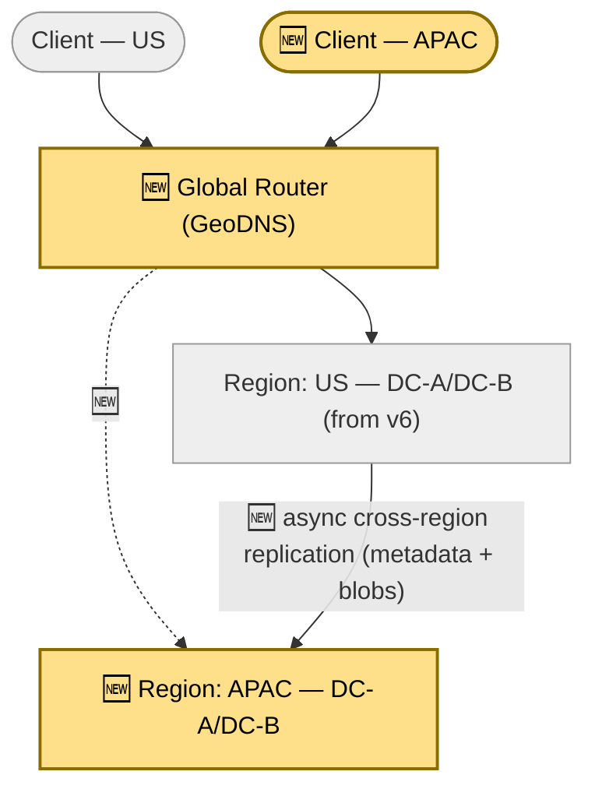
```mermaid
flowchart TD
    classDef new fill:#ffe08a,stroke:#8a6d00,stroke-width:2px,color:#000
    classDef existing fill:#eee,stroke:#999,color:#333
    U1([Client — US]):::existing --> GR["🆕 Global Router (GeoDNS)"]:::new
    U2(["🆕 Client — APAC"]):::new --> GR
    GR --> RUS["Region: US — DC-A/DC-B (from v6)"]:::existing
    GR -.->|"🆕"| RAPAC["🆕 Region: APAC — DC-A/DC-B"]:::new
    RUS -->|"🆕 async cross-region replication (metadata + blobs)"| RAPAC
```

**Upload flow (delta):** upload still lands in the uploader's home/nearest region; the video (and its renditions, once transcoded) are then replicated out to other regions asynchronously, in the background — a brand-new upload may only be "fast" to stream in its home region for the first few minutes, then becomes fast everywhere.

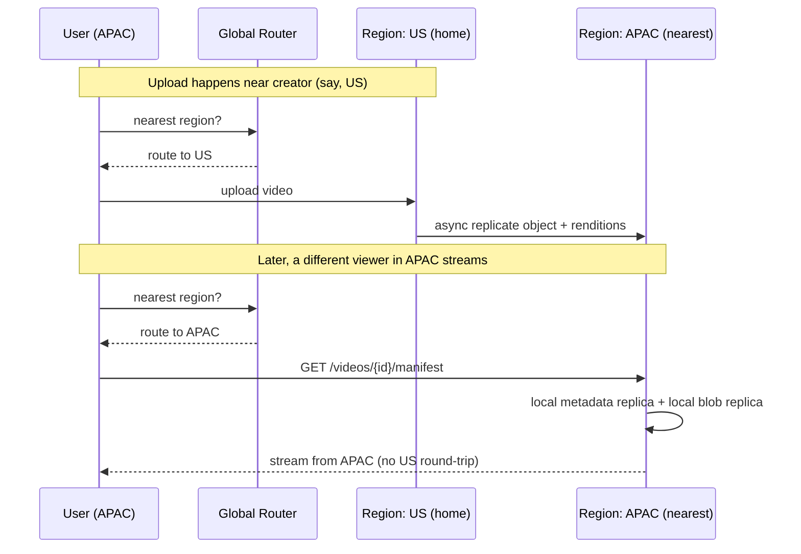
```mermaid
sequenceDiagram
    participant U as User (APAC)
    participant GDNS as Global Router
    participant R1 as Region: US (home)
    participant R2 as Region: APAC (nearest)

    Note over U,R1: Upload happens near creator (say, US)
    U->>GDNS: nearest region?
    GDNS-->>U: route to US
    U->>R1: upload video
    R1->>R2: async replicate object + renditions

    Note over U,R2: Later, a different viewer in APAC streams
    U->>GDNS: nearest region?
    GDNS-->>U: route to APAC
    U->>R2: GET /videos/{id}/manifest
    R2->>R2: local metadata replica + local blob replica
    R2-->>U: stream from APAC (no US round-trip)
```

**DB schema:** add `videos.home_region` and `renditions.replicated_regions` (set) so we know if a viewer's region has the bytes locally yet, or must temporarily pull cross-region.

**Tradeoff:** massively improves latency for a global user base and adds a second failure domain (regional disaster ≠ total outage). Cost: cross-region replication lag (a video may not be instantly available everywhere), and real distributed-systems complexity — mitigated here since a given video's metadata is only ever written from its home region (no multi-writer conflicts).

**Drawback (why v8):** even with a copy of the data sitting in-region, every single metadata read and every manifest fetch still round-trips to the regional DB or regional blob store. A hot, viral video still hammers the same DB row and the same blob object on every one of its millions of views *within that region* — multi-region solved *distance*, not *repeat-read volume*. We need something in front of both that absorbs repeat reads without going back to the DB/blob store at all.

---

### v8 — Cache

**Idea:** even with multi-region + blob storage, every metadata read and every manifest fetch still hits the DB / blob store. This is a 1000:1 read-heavy system with a strong power-law (a small number of videos get most of the views) — an in-memory cache (Redis/Memcached) in front of both eliminates the vast majority of repeat reads.

**What we cache — two distinct things, with two distinct sources of truth (don't merge them into one mental "cache the video" bucket):**
1. **Video metadata** (title, status, `master_manifest_url` itself, etc.) — source of truth is the **Metadata DB** (a row).
2. **Manifest content** — the actual bytes of `master.m3u8` — source of truth is **Blob Storage** (an object), per v5. The DB never stores manifest content, only the URL pointing at it. So caching the manifest means caching a copy of a *blob-storage object*, and its cache-miss path is a `GET` against blob storage, not a DB query.

We do **not** cache raw video segments here — large binary blobs belong at a CDN edge (v9), not app-tier Redis. (Manifests are cached here because they're tiny text files re-read on every playback start; segments are cached at the CDN because they're the actual bandwidth-heavy payload.)

**Cache key design**

| Data | Key format | TTL | Fallback on miss | Invalidation |
|---|---|---|---|---|
| Metadata | `video:meta:{video_id}` | 1 hour | Metadata DB (`SELECT`) | On any write to that video's metadata row, explicitly delete/update the key |
| Manifest content | `video:manifest:{video_id}` | 24 hours (immutable once READY) | **Blob Storage** (`GET master.m3u8`) — *not* the DB | Invalidate only if video is re-transcoded/re-published |

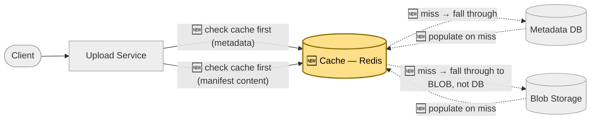
```mermaid
flowchart LR
    classDef new fill:#ffe08a,stroke:#8a6d00,stroke-width:2px,color:#000
    classDef existing fill:#eee,stroke:#999,color:#333
    U([Client]):::existing --> UP[Upload Service]:::existing
    UP -->|"🆕 check cache first (metadata)"| C[("🆕 Cache — Redis")]:::new
    C -.->|"🆕 miss → fall through"| DB[("Metadata DB")]:::existing
    DB -.->|"🆕 populate on miss"| C
    UP -->|"🆕 check cache first (manifest content)"| C
    C -.->|"🆕 miss → fall through to BLOB, not DB"| BS[("Blob Storage")]:::existing
    BS -.->|"🆕 populate on miss"| C
```

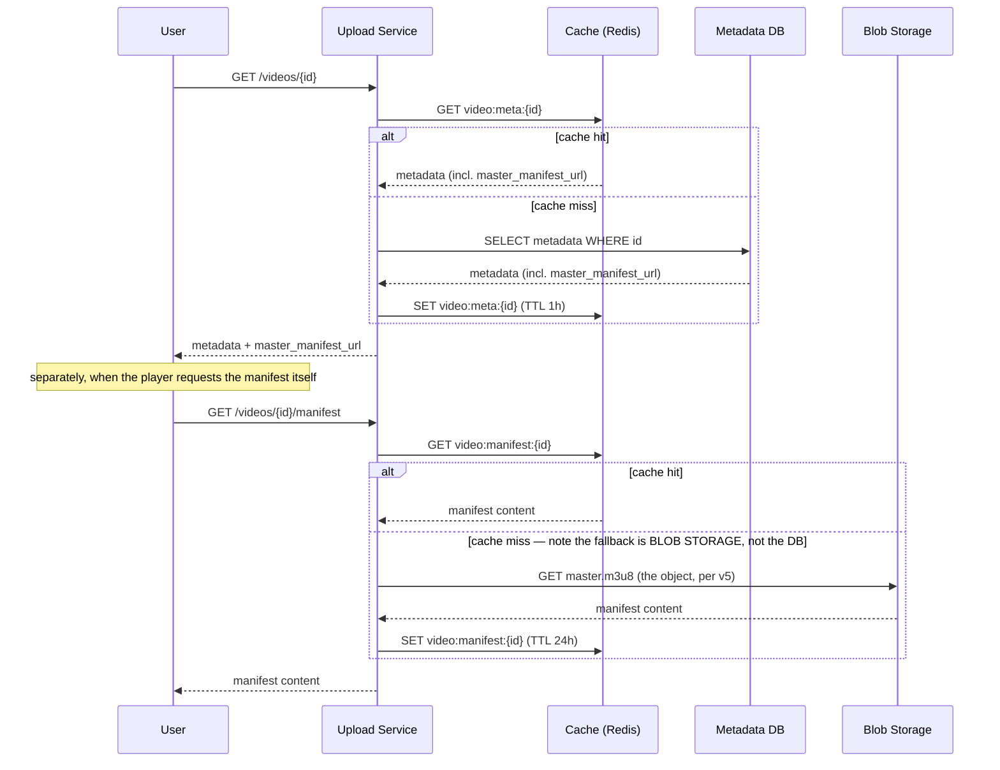
```mermaid
sequenceDiagram
    participant U as User
    participant UP as Upload Service
    participant C as Cache (Redis)
    participant DB as Metadata DB
    participant BS as Blob Storage

    U->>UP: GET /videos/{id}
    UP->>C: GET video:meta:{id}
    alt cache hit
        C-->>UP: metadata (incl. master_manifest_url)
    else cache miss
        UP->>DB: SELECT metadata WHERE id
        DB-->>UP: metadata (incl. master_manifest_url)
        UP->>C: SET video:meta:{id} (TTL 1h)
    end
    UP-->>U: metadata + master_manifest_url

    Note over U: separately, when the player requests the manifest itself
    U->>UP: GET /videos/{id}/manifest
    UP->>C: GET video:manifest:{id}
    alt cache hit
        C-->>UP: manifest content
    else cache miss — note the fallback is BLOB STORAGE, not the DB
        UP->>BS: GET master.m3u8 (the object, per v5)
        BS-->>UP: manifest content
        UP->>C: SET video:manifest:{id} (TTL 24h)
    end
    UP-->>U: manifest content
```

**Tradeoff:** removes most DB *and* blob-storage load, lowers p99 latency, at the cost of a consistency question — a viewer might see slightly stale metadata (e.g. a title edit) for up to the TTL. Acceptable here (metadata edits aren't safety/consistency-critical). Status transitions (`TRANSCODING`→`READY`) should be invalidated explicitly, not just TTL'd, so a viewer isn't told "still processing" long after it's actually ready.

**Under the hood: this Redis cache is one of two cache layers, not the only one.** The other layer is plain **HTTP caching** via `Cache-Control` response headers, enforced by every intermediary (browser, CDN in v9) without any Redis involved — these two layers answer different questions and it's worth being explicit about which is which:

```
# Video segment — content is immutable once written, cache as long as possible
Cache-Control: public, max-age=31536000, immutable

# Manifest — may be replaced if the video is re-transcoded, cache briefly
Cache-Control: public, max-age=300

# Metadata API response containing personalized fields (e.g. "your watch progress")
Cache-Control: private, no-store
```

The Redis key design above governs *our own app tier's* round trip to the DB; the `Cache-Control` headers govern what *browsers and CDN edges* are allowed to cache without asking us at all. Segments get the most aggressive header (`immutable`, 1-year) precisely because a segment's blob key is content-addressed by video+resolution+index and is never overwritten in place — if we re-transcode, we write to a new key, we don't mutate the old one. That's what makes "cache forever" safe rather than reckless.

**Drawback (why v9):** caching in our app tier still means every viewer's segment/manifest bytes physically travel from our (or blob store's) region to the viewer. We haven't solved **network distance to the actual bytes** for the common case of millions of viewers of the same popular video.

---

### v9 — CDN

**Idea:** put a CDN (CloudFront/Akamai/Cloudflare-class) in front of blob storage for manifests and segments. The CDN has edge PoPs close to users worldwide; a popular video's segments get cached at the edge after the first fetch in that region, so the 2nd through millionth viewer in that area never even reach our origin/blob store.

**Under the hood: why v7 (multi-region) alone doesn't already solve this, stated with actual physics.** Data in fiber travels at ~200,000 km/s (roughly ⅔ the speed of light in vacuum). A round trip between, say, Mumbai and a "home region" origin in the US is ~10,000+ km each way → theoretical minimum ≈180ms round trip, and real-world routing/congestion typically makes it 2-3x that. That's tolerable for *one* request. But HLS/DASH playback is not one request — a 10-minute video at 5s segments is ~120 segment requests, and even a fast video start alone needs the manifest + first couple of segments before anything plays. Multi-region (v7) helps once a video's bytes have *already replicated* to the viewer's region — but replication is asynchronous and lags behind upload by design (v7's own tradeoff). A CDN attacks a different axis entirely: instead of pre-placing whole video copies per region ahead of time, it lazily caches *at a much finer grain* (individual edge PoPs, sometimes literally inside an ISP's own network) the instant real traffic asks for something — closing the gap for content that's popular *right now*, not just content whose region-replication job has finished.

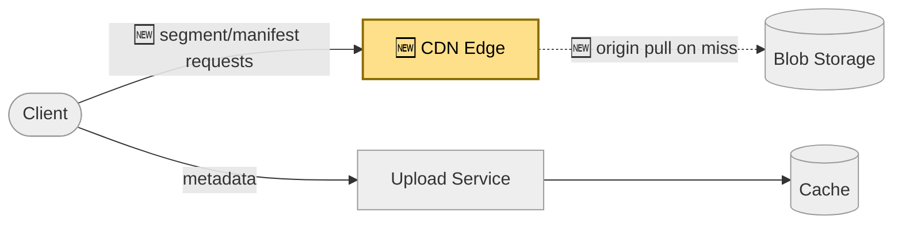
```mermaid
flowchart LR
    classDef new fill:#ffe08a,stroke:#8a6d00,stroke-width:2px,color:#000
    classDef existing fill:#eee,stroke:#999,color:#333
    U([Client]):::existing -->|"🆕 segment/manifest requests"| CDN["🆕 CDN Edge"]:::new
    CDN -.->|"🆕 origin pull on miss"| BS[("Blob Storage")]:::existing
    U -->|metadata| UP[Upload Service]:::existing
    UP --> C[("Cache")]:::existing
```

**Push vs. pull (tradeoff to state explicitly in interview):**
- **Origin-pull (lazy):** CDN fetches from blob storage on first miss, caches it, serves subsequent requests from edge. Simple, no extra step at upload time, but the first viewer(s) in each region pay a cache-miss origin round-trip.
- **Origin-push (pre-warm):** transcode worker proactively pushes new segments to CDN edges right after transcoding. Better first-view latency for anticipated-popular content, at the cost of pushing content that might never be watched in some regions.
- **Practical choice:** pull by default (works for the long tail of videos), push/pre-warm selectively for known-high-traffic uploads.

**Cache key alignment with v8:** CDN cache key = the segment/manifest **URL path** itself (e.g. `/videos/{id}/720p/seg42.ts`), already unique per video+resolution+segment — no extra key scheme needed; this is what makes CDN caching "free" to reuse the same URLs built in v5.

**Stream flow (final form)**
1. Client requests manifest → served from app-tier cache (v8) or DB, quickly.
2. Client requests each segment URL → hits **CDN edge** near the client, not our origin, on cache hit.
3. On cache miss at the edge, CDN pulls from Blob Storage once, caches it, serves it — all subsequent requests in that edge's catchment are pure edge hits.

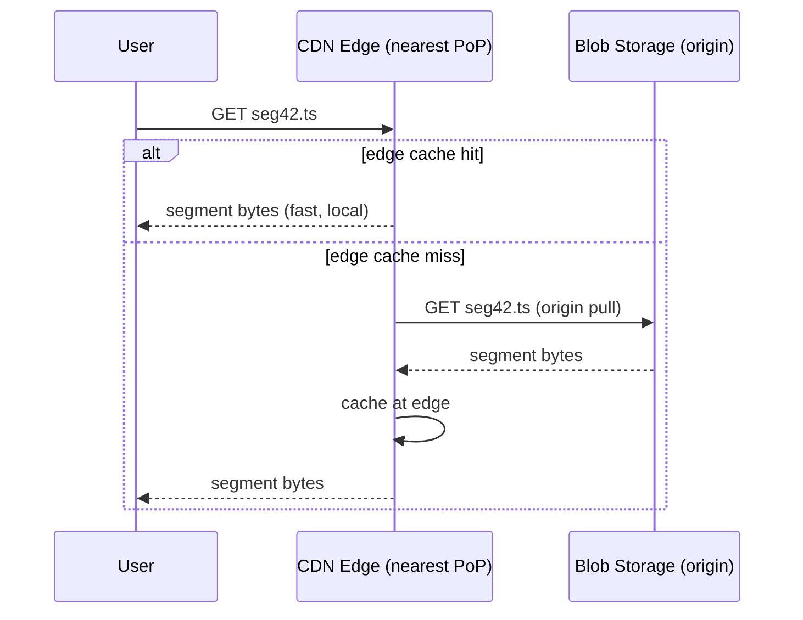
```mermaid
sequenceDiagram
    participant U as User
    participant CDN as CDN Edge (nearest PoP)
    participant BS as Blob Storage (origin)

    U->>CDN: GET seg42.ts
    alt edge cache hit
        CDN-->>U: segment bytes (fast, local)
    else edge cache miss
        CDN->>BS: GET seg42.ts (origin pull)
        BS-->>CDN: segment bytes
        CDN->>CDN: cache at edge
        CDN-->>U: segment bytes
    end
```

**Tradeoff:** the single biggest latency and origin-load win in the whole design — it's *why* streaming sites are viable at global scale — at the cost of CDN cost (pay per GB served from edge) and a cache-invalidation surface if a video is taken down (need to purge CDN cache, not just our DB/Redis, on takedowns).

---

## 5. Consolidated schema (all versions combined)

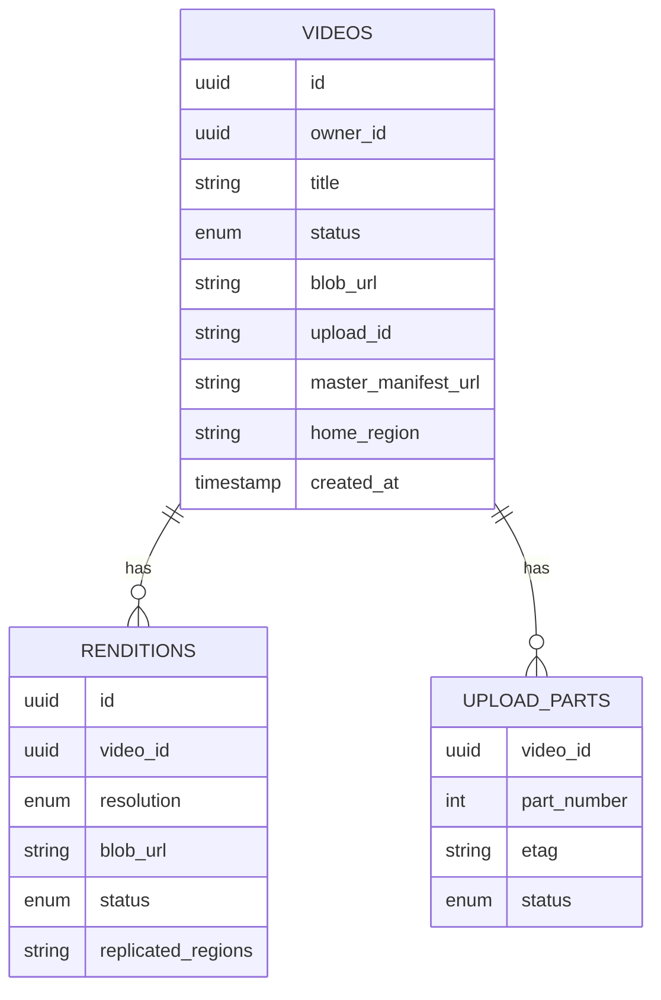
```mermaid
erDiagram
    VIDEOS ||--o{ RENDITIONS : has
    VIDEOS ||--o{ UPLOAD_PARTS : has
    VIDEOS {
      uuid id
      uuid owner_id
      string title
      enum status
      string blob_url
      string upload_id
      string master_manifest_url
      string home_region
      timestamp created_at
    }
    RENDITIONS {
      uuid id
      uuid video_id
      enum resolution
      string blob_url
      enum status
      string replicated_regions
    }
    UPLOAD_PARTS {
      uuid video_id
      int part_number
      string etag
      enum status
    }
```

---

## 6. If time permits — other features (light sketch, not full designs)

- **Search:** index video metadata (title, description, tags, transcript) into a search engine (Elasticsearch/OpenSearch). Write path: the Search Indexer subscribes to the `video-lifecycle-events` topic (§4's v4 and §8) and pushes a document to the index whenever a video reaches `READY` — no direct coupling to Upload/Transcode services. Read path: `GET /search?q=...` hits the search cluster directly, not the metadata DB — search is a fundamentally different query shape (full-text, ranking) than a metadata-DB point lookup.
- **Like:** a `likes` table (`user_id`, `video_id`, unique constraint) plus a denormalized `like_count` on the video row, incremented via an async counter/queue (not a synchronous DB increment on every like — hot videos would create write contention on one row). Classic **sharded counter** pattern.
- **Comment:** a `comments` table keyed by `video_id`, paginated by `created_at`/cursor; at scale, comments for a single viral video are themselves a read-heavy, high-fanout problem — same shape as the top-level system, one level down.
- **Recommendation:** an offline/batch ML pipeline (watch history + engagement signals → candidate generation → ranking) that pre-computes a "home feed" per user, refreshed periodically (not on every request) and served from a cache — recommendation is a **read-mostly, precomputed** system, not something we compute live per request.

---

## 7. Wrap-up cheat sheet

| Version | What changed | Why | Drawback → next version |
|---|---|---|---|
| v1 | Everything proxies through our server | Simplest possible design | Server is a bandwidth bottleneck for every byte |
| v2 | Presigned URLs, direct-to-blob | Offload bandwidth to blob store | One giant `PUT`/`GET` — no resumability |
| v3 | Multipart upload | Resumable, parallel, fault-tolerant uploads | Only one resolution served — no adaptability |
| v4 | Async transcoding via queue + workers | Compute renditions once, not per-view (1000:1 read:write) | Whole-file renditions can't adapt mid-playback |
| v5 | HLS/DASH segments + manifest | Adaptive bitrate — switch resolution as bandwidth changes | Single DC = single point of regional failure |
| v6 | Multiple DCs, same region | Survive a DC-level outage | Cross-continent latency; regional disaster still fatal |
| v7 | Multi-region | Global low latency + regional fault isolation | Every read still round-trips to DB/blob store |
| v8 | Cache (Redis) for metadata & manifests | Huge read-heavy system — avoid redundant DB/blob hits | Bytes still travel from our region to every viewer |
| v9 | CDN for manifests & segments | Serve bytes from an edge near the viewer — the actual scaling unlock | (End of core Upload/Stream design; extend into Search/Like/Comment/Recommendation next) |

---

## 8. Technology choices — DB, Queue, Cache, and why

Naming the concrete tech, and justifying each choice against the *actual access patterns this design produces* (not just "use Postgres for relational data" as a reflex) — this is the question interviewers ask right after the architecture is on the board.

### Metadata DB → relational (MySQL/PostgreSQL), sharded once table size demands it

**Why relational, not NoSQL:** the schema has real foreign-key relationships (`videos` → `renditions` → `upload_parts`), and every upload goes through a genuine multi-step state machine (`PENDING_UPLOAD → UPLOADING → UPLOADED → VALIDATING → TRANSCODING → READY/FAILED`, v4's state diagram). Losing a transition mid-write — e.g. a video flips to `READY` while one rendition row is still `PENDING` — is exactly the class of bug ACID transactions prevent for free. A NoSQL store makes you hand-roll that guarantee at the application layer for no benefit here.

**Why sharding isn't about write throughput:** our own capacity math (§2) puts write QPS at ~20/sec average — trivially handled by a single primary. The real pressure to shard is (a) unbounded row-count growth over years (billions of videos), and (b) needing regional read replicas once v6/v7 exist. Concretely: MySQL/PostgreSQL fronted by **Vitess** (or Citus for Postgres) once table size justifies it, sharded by `video_id` hash — keeps one video's rows (and its renditions) on the same shard, so the common "fetch this video + its renditions" query never crosses a shard boundary. This is also the real, documented choice YouTube's own infrastructure makes.

**If an interviewer pushes for NoSQL anyway:** DynamoDB/Cassandra are workable — access is almost entirely a point lookup by `video_id` — but you give up the free cross-table transaction guarantee above and must reimplement it (e.g. via a saga or a status-reconciliation job). Given write volume never demanded giving that up, it's not the right trade here.

### Queue → Kafka (log-based), not a plain point-to-point queue (SQS/RabbitMQ)

**Why log-based specifically:** this design has more than one independent consumer type reacting to the same event — transcode workers, plus (once §6 is in scope) search indexing, notifications, and CDN pre-warm decisions. A point-to-point queue (SQS-style) deletes a message once *one* consumer acks it — fine for a single job queue, wrong once multiple unrelated services need to see the same event. A log-based broker lets each consumer group track its own offset independently, and a consumer that was down can replay from where it left off instead of losing messages that "someone else" already consumed.

**Kafka record key = `video_id`** on every topic below — guarantees all events for one video land on the same partition, processed in order by whichever consumer instance owns it. Without this, two status-update messages for the same video could land on different workers and get processed out of order. (Worth being precise here: this is the broker-level record key set by the producer call, not a field inside the JSON payload — see v4's note on the same point.)

- **`video-transcode-jobs`** — producer: Upload Service (post-validation); consumer group: `transcode-workers`; at-least-once delivery, so the worker's DB write must be an idempotent upsert on `(video_id, resolution)` (schema + DLQ policy in v4).
- **`video-lifecycle-events`** — producer: whichever service just changed a video's status; consumers, each in its **own** consumer group so one slow subscriber never blocks another: Search Indexer, Notification Service, CDN pre-warm/popularity tracker, Analytics. This is the fan-out backbone behind every §6 feature — Upload/Transcode never need to know search or notifications exist, they just publish one event.
  ```
  key:   "{video_id}"
  value (JSON):
  {
    "event_id": "uuid",
    "video_id": "uuid",
    "event_type": "STATUS_CHANGED",
    "from_status": "TRANSCODING",
    "to_status": "READY",
    "occurred_at": "2026-08-12T10:11:10Z"
  }
  ```
  `event_id` exists specifically so consumers can de-duplicate — at-least-once delivery means Search Indexer et al. may see the same event twice, and each consumer should be tracking "have I already applied this `event_id`" rather than assuming exactly-once.

### Cache → Redis, not Memcached

**Why Redis over plain Memcached:** we need per-key TTLs with different values (1h metadata / 24h manifest, v8) and horizontal scaling via Redis Cluster's built-in consistent hashing. Memcached is a perfectly reasonable, operationally simpler alternative *if* the cache stays purely key→value — the deciding factor here is that Redis's richer data structures (`INCR` for buffered counters, sorted sets, etc.) are exactly what §6's Like counters need next, so picking Redis now avoids running two different caching systems later for what's conceptually the same layer.

**Sharding:** by `video_id` hash across the Redis Cluster — same reasoning as the metadata DB, keeps one video's cache entries colocated so a single request never needs a cross-node lookup.

**Data structure — Hash, not a serialized-JSON String, for `video:meta:{video_id}`.** v8 wrote this as a plain `SET`/`GET` of a JSON blob for simplicity, but the more idiomatic Redis choice is `HSET video:meta:{id} title "..." status "READY" master_manifest_url "..."` / `HGETALL video:meta:{id}` — a Hash. Two concrete reasons: (1) updating just `status` (which changes far more often than `title`) becomes a single `HSET video:meta:{id} status TRANSCODING`, not a full read-modify-write-serialize-write cycle on the whole blob, which is both slower and racier under concurrent writers; (2) a consumer that only needs `status` can `HGET` that one field without deserializing the whole object. Plain String+JSON is fine for the manifest-content cache (`video:manifest:{video_id}`) since that's genuinely opaque, atomic, immutable content with no sub-fields worth reading individually.

**Cache stampede protection — a real gap worth naming, not just TTL tuning.** When a *popular* video's `video:meta:{video_id}` key expires, potentially thousands of concurrent requests for that same viral video can all miss at once and hammer the DB simultaneously — the exact "hot key" scenario this design keeps calling out (v9's whole justification, §6's sharded-counter pattern). Standard fix: a short-lived lock key (`SET video:meta:lock:{video_id} 1 NX EX 5`) — the first request to miss acquires the lock and repopulates the cache; every other concurrent miss sees the lock already held and either waits briefly or serves slightly-stale data instead of all hitting the DB at once. A cheaper complementary trick: jitter the TTL (`3600 + random(0, 300)` seconds) so keys for different videos don't all expire in the same instant, spreading the miss load over time instead of a synchronized wave.

**Eviction policy:** `allkeys-lru` (or `volatile-lru` since every key here already carries a TTL) — under memory pressure Redis evicts least-recently-used keys automatically rather than us hand-managing capacity; this is safe precisely because every cached value here has an authoritative source of truth to fall back to (DB or blob storage) — nothing in this cache layer is the only copy of anything.

### Blob storage → S3-class object storage (already justified throughout v1→v9)

Restating briefly for completeness: this is the one storage tier that isn't a "pick a database" decision at all — object storage's 11-nines replication (v2) is a property we get for free from the store itself, with no equivalent durability story to build ourselves.

### What we deliberately did *not* reach for

**A graph database.** Nothing in Upload/Stream (or even the §6 sketch) has a graph-shaped access pattern — no traversal, no "friends of friends." If Search/Recommendation ever grow past their light sketch, the next tools would be a dedicated search engine (Elasticsearch/OpenSearch, for full-text + ranking) and a vector/embedding store (for recommendation candidate generation) — neither of which is a relational-vs-NoSQL-vs-graph choice; they're a different tool for a fundamentally different access pattern, and naming that distinction is worth more in an interview than defaulting to "graph DB for a social platform" out of pattern-matching habit.
