# Design Quora — FAANG System Design Interview Guide

> **Overview of Improvements:**
> - **Language Simplification:** Complex, dense sentences are broken down into shorter, plain-English sentences. Technical terms are clearly defined upon first mention.
> - **Preserved & Expanded Detail:** All original formulas, worked capacity numbers, comparison tables, code snippets, architectural trade-offs, and cheat sheets are 100% retained and expanded with step-by-step mathematical derivations.
> - **Expanded Walkthrough Examples:** Numerical calculations (QPS, servers, storage, bandwidth, sharded counters, fan-out propagation times, and polling request rates) are expanded into clear, step-by-step walkthroughs.
> - **Cleaned & Fixed Mermaid Diagrams:** All diagrams (`flowchart`, `sequenceDiagram`, `erDiagram`, `stateDiagram-v2`, `pie`, `mindmap`) use clean, verified syntax without cramped text or rendering issues.

---

## 0. Mental Model

Quora combines three distinct system problems into a single user interface:
1. **Stack Overflow's Ranking Problem:** Deciding which answer is best for a given question.
2. **Twitter's Feed Problem:** Delivering personalized timelines to millions of users.
3. **Reddit's Voting Problem:** Processing massive volumes of upvotes and downvotes accurately.

Think of the architecture as three separate engines working together:

```
+----------------------------------------------------------------------------------+
|                                    QUORA APP                                     |
+------------------------------------+---------------------------------------------+
| 1. WRITE ENGINE (Durable Storage)  | Stores questions, answers, comments, and    |
|                                    | votes. Requires high durability and data    |
|                                    | correctness.                                |
+------------------------------------+---------------------------------------------+
| 2. RANKING & FEED ENGINE           | Evaluates engagement signals using offline  |
|    (Heuristic Scoring)             | ML models to score and order content.       |
|                                    | Allowed to be eventually consistent.        |
+------------------------------------+---------------------------------------------+
| 3. SEARCH & DEDUP ENGINE           | Indexes content and detects duplicate       |
|    (Canonical Threads)             | questions to maintain single main threads.  |
+------------------------------------+---------------------------------------------+
```

### The Core Goal of the Interview:
Your primary objective in a system design interview is to **assign the correct consistency, availability, and freshness guarantees to each of these three engines** so that slow background tasks (like ML ranking or search indexing) never block user writes.

* **User Content (Questions/Answers):** Requires high durability and eventual correctness.
* **Engagement Signals (Counters/Ranking):** Requires high availability and eventual consistency.
* **Search & Duplicate Detection:** Requires near-real-time processing on a best-effort basis.

**Real-World Analogy:** Think of Quora as a major university library. The physical archives (questions and answers) must be preserved perfectly. The reference desk (search engine) helps students find the right book quickly. The student recommendation librarian (ranking engine) suggests what to read next—and while their suggestions might not always be perfect, a slight mistake won't ruin the library.

---

## 1. Interview Playbook

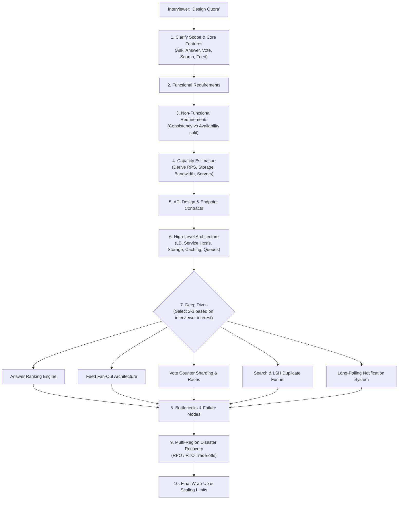

### Identifying This Topic in an Interview
Listen for key prompt phrases such as:
* *"Design Quora"* or *"Design Stack Overflow"*
* *"Design a platform to rank answers to questions"*
* *"How do you stop duplicate questions from being asked?"*
* *"Design a voting or upvoting system at scale"*

All of these prompts rely on the exact same underlying architecture.

---

## 2. Requirements Clarification

### Functional Requirements

| # | Requirement | Description | Architectural Impact |
|---|---|---|---|
| **1** | **Post Questions & Answers** | Users can ask questions and write detailed text answers (with images or videos). | Core synchronous write path; requires high durability. |
| **2** | **Vote & Comment** | Users can upvote, downvote, or comment on answers. | High write volume; requires protection against race conditions and hot keys. |
| **3** | **Search Questions** | Users can search existing questions using text queries. | Requires an inverted search index and query caching. |
| **4** | **Personalized Feed** | Users see a feed of questions and answers tailored to topics they follow. | Requires a hybrid push/pull fan-out architecture. |
| **5** | **Rank Answers** | The best answers appear at the top of a question page. | Requires multi-signal offline machine learning scoring. |

> **Memory Hook — "Q-A-V-S-R":** **Q**uestion, **A**nswer, **V**ote/Comment, **S**earch, **R**ank/Recommend.

#### Questions to Ask the Interviewer:
Proactively ask if out-of-scope features are needed:
*"Should we cover real-time notifications, user/topic follow graphs, spam moderation, anonymous answers, or edit histories?"* 

Frame them clearly: *"I will focus on the core Q-A-V-S-R pipeline first, but we can dive into notifications or moderation if you prefer."*

---

### Non-Functional Requirements (NFRs)

| Requirement | Meaning for Quora | Design Choice |
|---|---|---|
| **Scalability** | The system must handle millions of concurrent users and petabytes of data without degradation. | Stateless service hosts that scale out horizontally. |
| **Consistency** | Questions and answers must look identical across all readers once saved. | Strong consistency for content writes; eventual consistency for vote counts and feeds. |
| **Availability** | The site must remain operational even during component failures or traffic spikes. | High availability ($99.99\%$) for reads; fallback caches when backend services blip. |
| **Performance** | Page loads and searches must feel instant. | P99 read latency under 100ms; heavy caching across all read paths. |
| **Durability** | User-generated answers must never be lost. | Synchronous primary database commits; multi-region backups. |

#### The Golden Clarifying Question:
> Ask out loud: **"Is it acceptable if a new answer or vote takes a few seconds to propagate to all viewers worldwide?"**
>
> Answering **YES** unlocks eventual consistency for vote counters, feeds, and search indexing. This single concession allows us to cache aggressively and handle massive scale cleanly.

---

## 3. Capacity Estimation (Worked Example)

### Step-by-Step Estimation Framework

```
DAU × Requests/User/Day
        │
        ▼
Total Requests/Day ──(÷ 86,400 sec)──► Request Per Second (RPS)
        │
        ▼
RPS ÷ Server Capacity ───────────────► Required Application Servers
        │
        ▼
Content Count × Avg Payload Size ────► Daily Storage Requirements
        │
        ▼
Daily Storage × 365 Days ────────────► Annual Storage Requirements
        │
        ▼
Read/Write Payload Volume ───────────► Network Bandwidth (Ingress / Egress)
```

---

### Worked Numbers (Quora Reference Scale)

#### Core Assumptions:
* **Total Registered Users:** 1 Billion
* **Daily Active Users (DAU):** 300 Million
* **Average User Actions:** 20 requests per user per day
* **Content Generation:** 1 question posted per user/day with 2 answers, 10 upvotes, and 5 comments per question.
* **Media Breakdown:** 15% of questions include an image (~250 KB); 5% include a video (~5 MB). Average text size is ~1 KB.

---

#### Step 1: Request Rate (RPS) Calculation
1. **Total Daily Requests:**
   $$\text{Requests/Day} = 300\text{ Million DAU} \times 20\text{ Requests/User} = 6\text{ Billion Requests/Day}$$

2. **Average Requests Per Second (RPS):**
   $$\text{Average RPS} = \frac{6,000,000,000\text{ Requests}}{86,400\text{ Seconds}} \approx 69,444\text{ RPS} \quad (\approx 70,000\text{ RPS})$$

3. **Peak RPS (Assuming a 2x Peak Factor):**
   $$\text{Peak RPS} = 70,000 \times 2 = 140,000\text{ RPS}$$

---

#### Step 2: Application Server Fleet Estimation
* Assuming a single commodity application server can handle **8,000 RPS** safely:
  $$\text{Required Servers} = \frac{300,000,000\text{ DAU}}{8,000\text{ RPS/Server}} = 37,500\text{ Application Servers}$$

---

#### Step 3: Daily & Annual Storage Calculation
Let's break down daily storage by content type:

1. **Text Storage:**
   $$300\text{ Million Questions} \times 1\text{ KB} = 300,000,000\text{ KB} = 300\text{ GB/Day} = 0.3\text{ TB/Day}$$

2. **Image Storage (15% of questions):**
   $$300\text{ Million} \times 0.15 \times 250\text{ KB} = 11,250,000,000\text{ KB} = 11,250\text{ GB/Day} = 11.25\text{ TB/Day}$$

3. **Video Storage (5% of questions):**
   $$300\text{ Million} \times 0.05 \times 5\text{ MB} = 75,000,000\text{ MB} = 75,000\text{ GB/Day} = 75\text{ TB/Day}$$

4. **Total Daily Storage:**
   $$\text{Total Daily Storage} = 0.3\text{ TB (Text)} + 11.25\text{ TB (Images)} + 75\text{ TB (Videos)} = 86.55\text{ TB/Day}$$

5. **Total Annual Storage:**
   $$\text{Annual Storage} = 86.55\text{ TB/Day} \times 365\text{ Days} \approx 31.6\text{ Petabytes/Year}$$

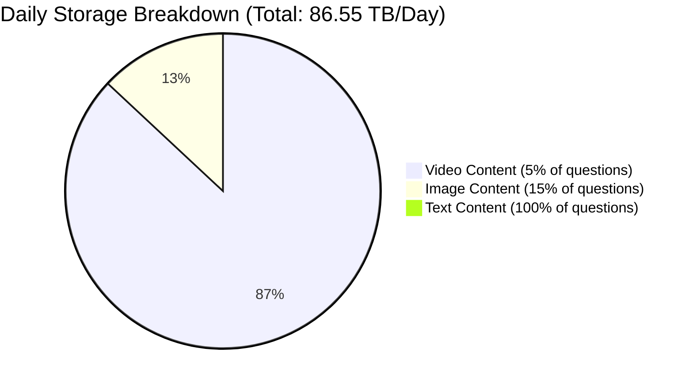

> **Key Interview Takeaway:** 
> *"Video accounts for 87% of daily storage and over 80% of egress bandwidth despite representing only 5% of posts. This proves that offloading media to Blob Storage (S3) and a global CDN is our most critical infrastructure choice—not database scaling."*

---

#### Step 4: Network Bandwidth Calculation

1. **Ingress Bandwidth (Writes):**
   $$\text{Ingress Bandwidth} = \frac{86.55\text{ TB}}{86,400\text{ sec}} \times 8\text{ bits/byte} \approx 8.01\text{ Gbps}$$

2. **Egress Bandwidth (Reads — Assuming 20 Views/User/Day):**
   * **Text Egress:** $\approx 0.56\text{ Gbps}$
   * **Image Egress:** $\approx 20.83\text{ Gbps}$
   * **Video Egress:** $\approx 138.89\text{ Gbps}$
   * **Total Egress Bandwidth:** $0.56 + 20.83 + 138.89 \approx 160.28\text{ Gbps}$

3. **Total Network Bandwidth Requirement:**
   $$\text{Total Bandwidth} = 8.01\text{ Gbps (Ingress)} + 160.28\text{ Gbps (Egress)} \approx 168.3\text{ Gbps}$$

---

### Industry Benchmarks to Memorize

| Metric | Value / Standard Rule |
|---|---|
| **Server Throughput Capacity** | ~8,000 RPS per commodity server host |
| **Average Payload Sizes** | Text: ~1 KB \| Image: ~250 KB \| Video: ~5 MB |
| **Object Storage Durability (S3)** | $99.999999999\%$ (11 nines durability) |
| **Quora Custom Queue Throughput** | ~15,000 tasks/second |
| **HBase P99 Read Latency** | ~80 ms |
| **MyRocks P99 Read Latency** | ~4 ms (After Quora's migration from HBase) |
| **Long-Polling Connection Hold** | Up to 60 seconds |

---

#### Generic-Scale Comparison Example (Illustrative)
If your interviewer presents rounder numbers, run the exact same formula:
* **Monthly Active Users (MAU):** 300 Million (~30 Million DAU)
* **Monthly Content Creation:** 5M questions/month, 50M answers/month
* **Read-to-Write Ratio:** 2.5 Billion page views / 55 Million writes $\approx$ **45:1 Read-to-Write Ratio**

This heavy asymmetry ($45:1$ to $100:1$) is why we place distributed memory caches (Memcached/Redis) in front of primary databases.

---

## 4. High-Level Design

### API Endpoint Contracts

| Endpoint | Method | Request Payload (Key Fields) | Response Payload | Execution Path |
|---|---|---|---|---|
| `/questions` | `POST` | `user_id, title, body, topic_ids[], media_urls[]` | `201 Created { question_id }` | Synchronous DB write; async search indexing and notifications. |
| `/questions/{id}/answers` | `POST` | `user_id, body, is_anonymous` | `201 Created { answer_id }` | Synchronous DB write; async feature extraction. |
| `/answers/{id}/vote` | `POST` | `user_id, value (+1 / -1 / 0)` | `200 OK` | Idempotent upsert; asynchronous count aggregation. |
| `/answers/{id}/comments` | `POST` | `user_id, body, parent_comment_id` | `201 Created { comment_id }` | Capped at 1 nesting level by application convention. |
| `/questions/{id}` | `GET` | *(Query Params)* | `200 OK { question, ranked_answers[] }` | Cache-first read; precomputed score lookup. |
| `/search` | `GET` | `q="monstera yellow", cursor` | `200 OK { ranked_question_ids[] }` | Cache-first inverted index query lookup. |
| `/feed` | `GET` | `user_id, cursor` | `200 OK { feed_items[] }` | Pre-materialized push feed merged with pull topic store. |
| `/updates` | `GET` | `user_id, since_token` | `200 OK { notifications[] }` | Long-poll request held open up to 60 seconds. |
| `/users/{id}/block` | `POST` | `blocker_id, blocked_id` | `200 OK` | Directed edge insert; enforced as a read-time filter. |

---

### Core System Architecture Map

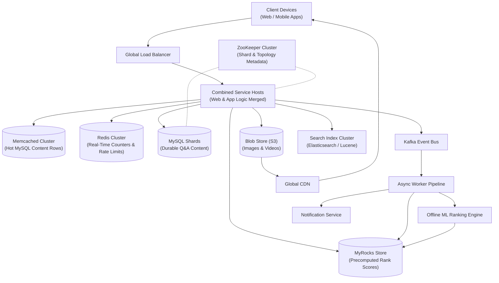

#### Why Combined Service Hosts?
Quora originally separated web servers (handling HTML formatting) from application servers (handling business logic). This separation introduced an extra network hop and internal RPC latency on every request. 

Merging them into **single, homogeneous service host instances** eliminated network overhead and simplified horizontal auto-scaling behind the load balancer.

---

### Datastore Selection Rationale

| Datastore Component | Technology Used | Architectural Purpose |
|---|---|---|
| **Primary Relational Store** | MySQL (Vertically Sharded) | Provides ACID transactions and strong consistency for core questions, answers, and comments. |
| **Low-Latency Rank & Feature Store** | MyRocks (RocksDB on MySQL) | LSM-tree engine optimized for high-write throughput and ultra-low read latency (P99 4ms). Stores precomputed ranking scores. |
| **Hot Content Cache** | Memcached | In-memory key-value cache storing hot database rows using batched `multiget()` operations. |
| **Counter & Rate Limit Store** | Redis | In-memory data store using atomic `INCR` primitives for real-time counters and rate-limiting buckets. |
| **Media Object Store** | Amazon S3 + CloudFront CDN | Cheap, durable blob storage for user-uploaded images and videos, served directly via edge locations. |
| **Asynchronous Message Bus** | Apache Kafka | Decouples non-blocking background processes (notifications, search indexing, moderation) from synchronous user writes. |
| **Cluster Topology Manager** | Apache ZooKeeper | Maintains centralized metadata regarding shard mapping, primary node election, and replica status. |

---

### Architecture Evolution: v1 $\rightarrow$ v2 $\rightarrow$ v3

#### Version 1 — Single Database & Synchronous Writes (Naive Bottleneck)

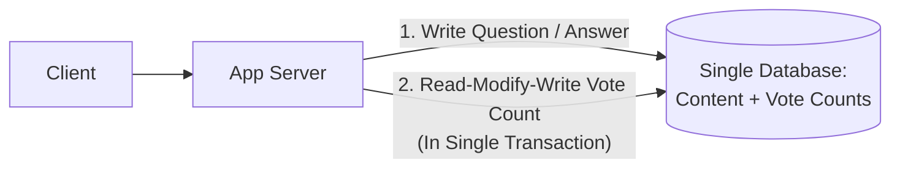

* **Problem:** Content edits and vote increments compete for the exact same database row lock. A viral answer causes write lock contention and lost-update race conditions.

---

#### Version 2 — Asynchronous Vote Aggregation & Cache (Fixes Hot-Key Locks)

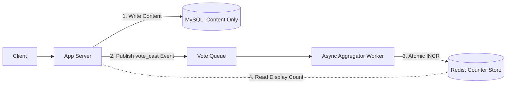

* **Improvement:** Votes move off the content database onto an asynchronous message queue. Background workers perform atomic increments in Redis, eliminating database row lock contention.

---

#### Version 3 — Full Decoupled Pipeline (Production Architecture)

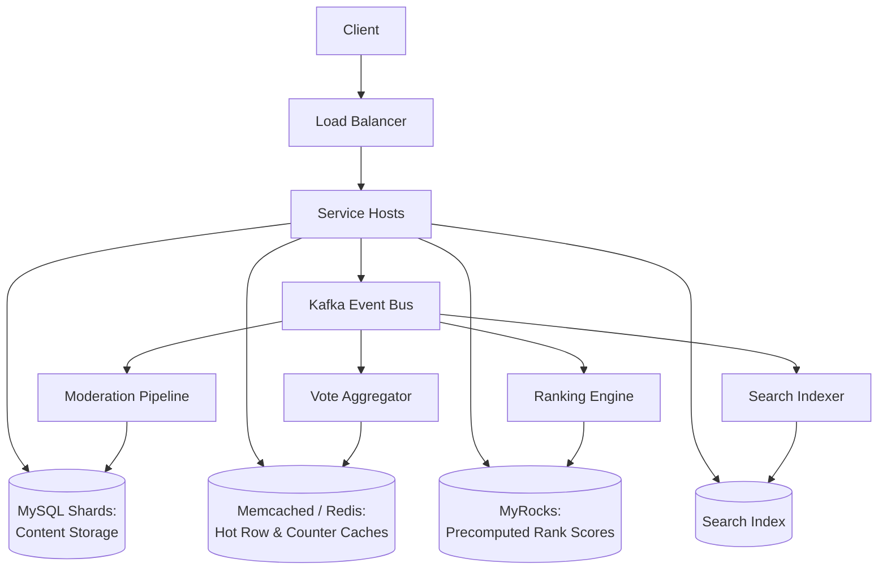

* **End State:** A single Kafka event bus fans out events to independent asynchronous consumers (vote aggregation, ranking, search indexing, moderation). No background task ever blocks synchronous user requests.

---

### Database Schema Design

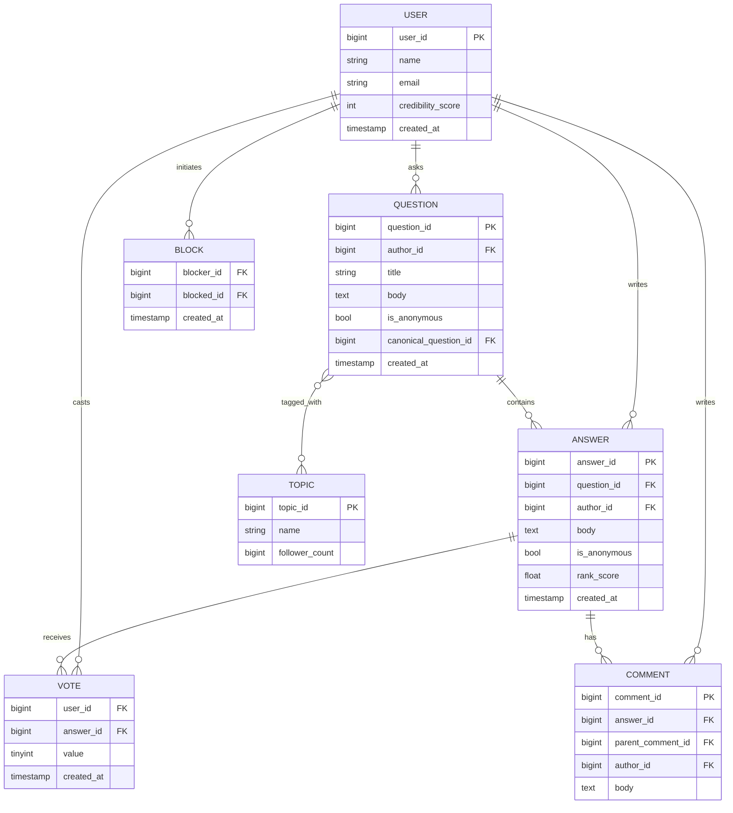

#### Schema Highlights:
1. **`VOTE` Table:** Stored as individual per-user state rows `(user_id, answer_id)` rather than a raw integer counter column. This guarantees vote write idempotency.
2. **`rank_score` Column:** Represents a logical property of the `ANSWER` entity, but is physically stored in MyRocks for ultra-fast $O(1)$ read-time scoring.
3. **`canonical_question_id` Column:** `NULL` by default. If a question is identified as a duplicate, this field points to the primary canonical question ID.
4. **`is_anonymous` Column:** A display-layer boolean flag. The real `author_id` is always recorded to enable moderation tracing.
5. **`parent_comment_id` Column:** Enforces a maximum nesting depth of 1 level by application convention.

---

## 5. Deep Dives

### 5.1 Request Flow: Posting Questions & Answers

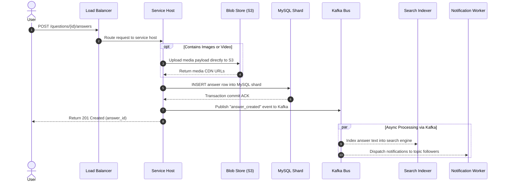

#### End-to-End Walkthrough: Priya Posts an Answer
1. **$t = 0\text{ms}$:** Priya submits a 600-word answer to a question tagged `#MachineLearning` (followed by 40,000 users).
2. **$t = 5\text{ms}$:** The service host writes the answer row to the MySQL shard owning that `question_id`. MySQL commits the transaction. **This is the only step that blocks Priya's HTTP request.**
3. **$t = 8\text{ms}$:** The client receives a `201 Created` response. Perceived user latency is ~10ms.
4. **$t = 10\text{ms}$ (Kafka Async Fan-Out):**
   * **Feed Worker:** Because 40,000 followers is below the high-follower threshold (100,000), workers push the new answer directly into all 40,000 follower feed caches.
   * **Notification Worker:** Emits real-time notification events to long-polling connections held open by active followers.
   * **Cache Invalidator:** Evict old question page answer lists from Memcached.
5. **Minutes Later:** Background feature extractors track view rates and dwell time. The offline ML model calculates a updated `rank_score` and writes it to MyRocks.

---

### 5.2 Voting: Race Conditions & Sharded Counters

#### The Naive Read-Modify-Write Race Condition

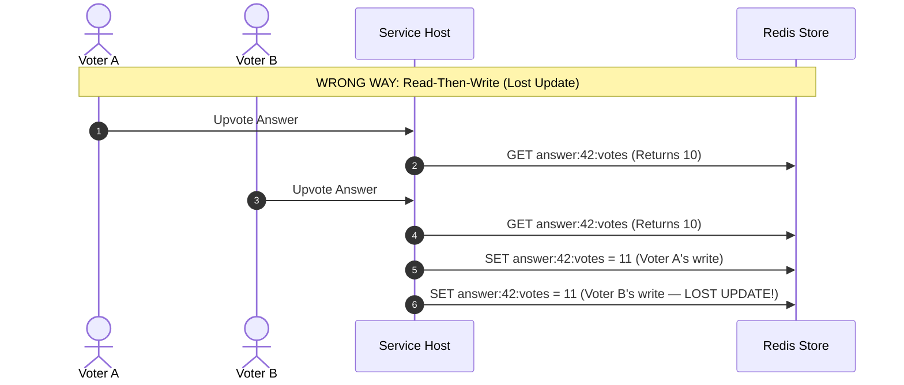

#### The Fix: Sharded Counter Architecture
To prevent hot-key contention during traffic spikes, split the counter key into **20 separate shards**:
$$\text{shard\_id} = \text{hash}(\text{user\_id}) \pmod{20}$$

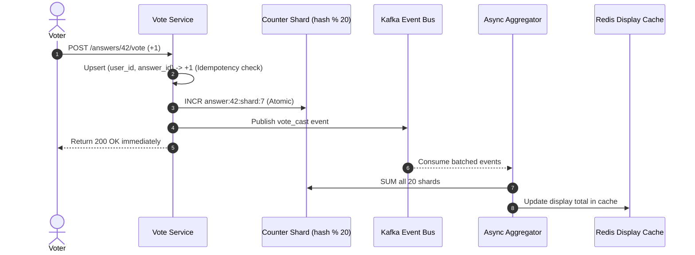

#### Counter Implementation Comparison

| Metric | Naive Read-Modify-Write | Atomic `INCR` (Single Key) | Sharded Counters + Async Aggregation |
|---|---|---|---|
| **Race Condition Safe?** | No — Concurrent writes overwrite each other. | Yes — Operations execute atomically. | Yes — Operations execute atomically per shard. |
| **Viral Traffic Bottleneck?** | High lock contention. | High single-key contention on Redis buffer. | **Zero Bottleneck:** Writes spread across 20 independent shards. |
| **Read Overhead** | Low (Single GET) | Low (Single GET) | Low (Reads pre-aggregated sum from cache). |
| **Voter Request Latency** | High (Blocks on DB row lock). | Low (Blocks on Redis network round trip). | **Ultra-Low:** Acks immediately; aggregation is async. |

---

### 5.3 Answer Ranking Architecture

Sorting answers purely by upvote counts rewards short jokes and viral memes over expert answers. 

Quora uses an **offline multi-signal ML model** to score answers.

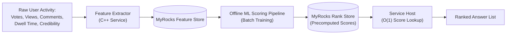

#### Multi-Signal Scoring Inputs

| Signal Name | What It Measures | Why Raw Upvotes Fail Without It |
|---|---|---|
| **Upvotes / Downvotes** | Direct user feedback. | Memes collect upvotes quickly regardless of accuracy. |
| **Total Views & Dwell Time** | Average time spent reading an answer. | Catches clickbait answers that users leave after 2 seconds. |
| **Author Credibility** | Author's track record in the topic area. | Authoritative answers from verified experts get ranked higher. |
| **Comment Engagement** | Discussion depth underneath the answer. | High-quality answers provoke thoughtful comments rather than quick jokes. |
| **Time Decay & Edit Recency** | Content age and update frequency. | Prevents obsolete answers from remaining stuck at #1 permanently. |

#### Architectural Contrast: Platform Ranking Approaches

```
+-----------------------------------------------------------------------------------+
| PLATFORM           RANKING PHILOSOPHY & ARCHITECTURE                              |
+-----------------------------------------------------------------------------------+
| QUORA              Offline ML Scoring Model (MyRocks Store, P99 4ms).            |
|                    Personalized per reader based on topic interest.               |
+-----------------------------------------------------------------------------------+
| REDDIT             Public Deterministic Log Formula ("Hot" Ranking).              |
|                    Optimizes for fresh, real-time news virality.                  |
+-----------------------------------------------------------------------------------+
| STACK OVERFLOW     Transparent Deterministic Scoring (Votes + Decay + Accepted).  |
|                    Optimizes for auditability on vertically scaled SQL Server.    |
+-----------------------------------------------------------------------------------+
```

---

### 5.4 Feed Fan-Out Architecture: Push vs. Pull

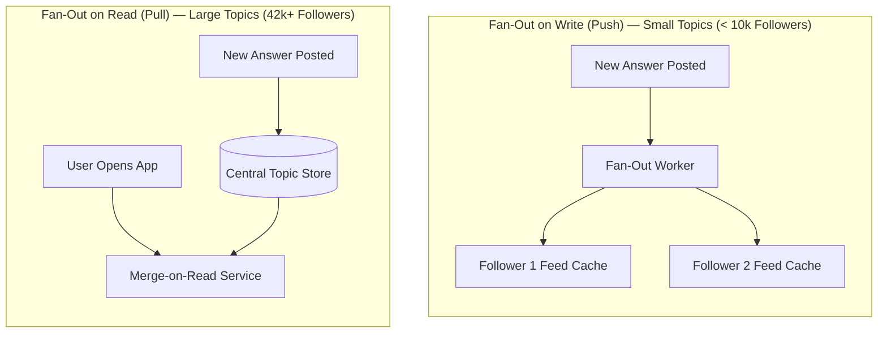

#### Fan-Out Strategy Decision Matrix

| Strategy | Write Performance | Read Performance | Ideal Use Case |
|---|---|---|---|
| **Fan-Out on Write (Push)** | High write cost for large topics ($N$ inserts). | Instant read ($O(1)$ pre-materialized cache fetch). | Topics or users with few followers (< 10,000). |
| **Fan-Out on Read (Pull)** | Low write cost ($1$ central insert). | Slower read (requires multi-topic timeline merging). | Popular topics or celebrities with massive followings. |
| **Hybrid Model** | **Optimized:** Push for normal topics; pull for viral topics. | **Fast:** Balances write fan-out costs with fast read feeds. | Large-scale UGC networks (Twitter, Quora). |

> **Rule of Thumb:** *"Push what is rare, pull what is massive."*

---

#### Read Path Sequence: Loading a Question Page

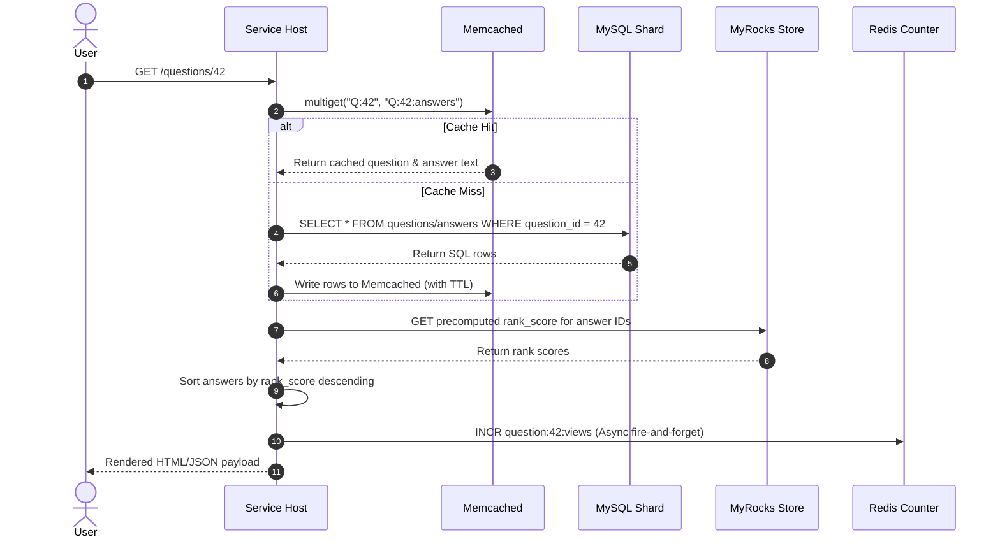

---

### 5.5 Search & Duplicate Question Detection Funnel

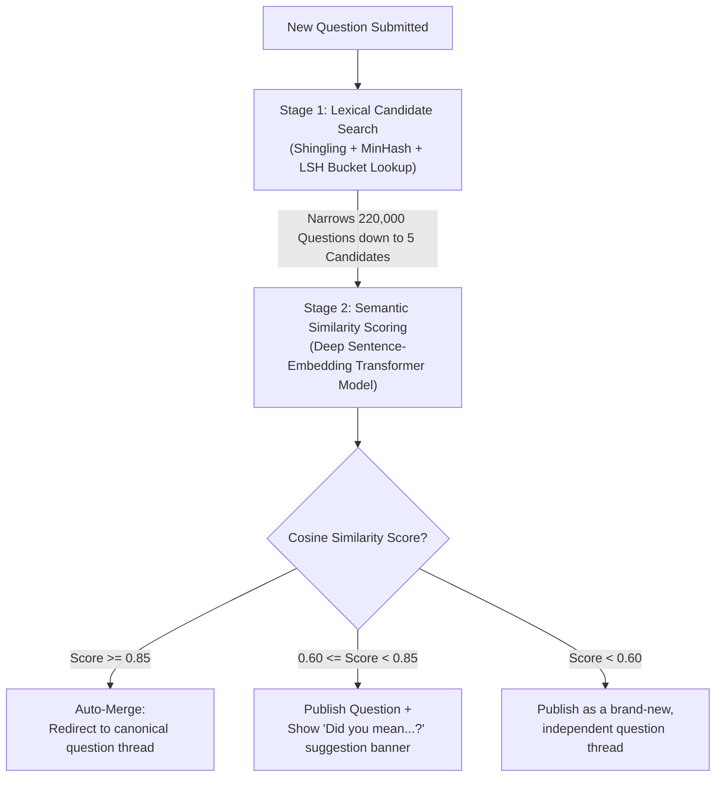

#### Step-by-Step Duplicate Funnel Architecture:
1. **Stage 1 (Coarse Lexical Filter):** **Shingling + MinHash + Locality-Sensitive Hashing (LSH)**. Hashes questions into buckets to retrieve top candidate duplicate matches in sub-5ms without scanning the database.
2. **Stage 2 (Fine Semantic Filter):** **Sentence-Transformer Embeddings**. Calculates exact cosine similarity scores ($0.0$ to $1.0$) against the top candidate matches.
3. **Stage 3 (Decision Thresholding):**
   * **$\ge 0.85$:** Auto-merge and redirect to canonical question.
   * **$0.60 - 0.84$:** Publish question, but display a *"Did you mean...?"* banner.
   * **$< 0.60$:** Publish as an independent thread.

---

### 5.6 Notification Delivery: Long Polling Mechanics

```mermaid
sequenceDiagram
    autonumber
    actor Client as Mobile Client
    participant Server as Notification Server
    participant Queue as User Event Queue

    Client->>Server: GET /updates (Long Poll Request)
    activate Server
    Note over Server: Server holds connection open<br/>(Up to 60-second hold timeout)
    
    alt Event Arrives Within 60 Seconds
        Queue->>Server: Event emitted (e.g., "New Answer")
        Server-->>Client: 200 OK + Notification Payload
        deactivate Server
        Client->>Server: GET /updates (Immediately re-open long poll)
    else Timeout Reached (60 Seconds Elapsed)
        Server-->>Client: 204 No Content (Connection Timeout)
        deactivate Server
        Client->>Server: GET /updates (Immediately re-open long poll)
    end
```

#### Delivery Technology Trade-offs

| Mechanism | Connection State | Server CPU Utilization | Real-Time Latency |
|---|---|---|---|
| **Short Polling** | Stateless (Opens new connection every 3s). | Extremely wasteful (99% empty responses). | High (Bound by 3-second poll interval). |
| **WebSockets** | Stateful (Full-duplex TCP socket). | High state management per connected user. | Ultra-Low (Instant push). |
| **Long Polling** *(Quora Choice)* | Stateless HTTP (Held open up to 60s). | Low (Collapses idle round trips into 1 held connection). | **Near-Real-Time** (Delivered instantly upon event emission). |

---

### 5.7 Moderation, Rate Limiting & Coordinated Abuse

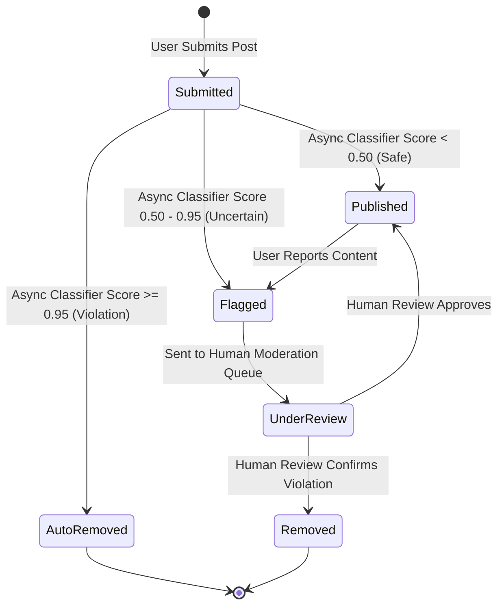

#### Bot & Vote Manipulation Defense Matrix

| Attack Vector | Detection Mechanism | Mitigation Strategy |
|---|---|---|
| **Raw Spam Flooding** | Token-bucket rate limiter at API Gateway (e.g., max 10 answers/hour per IP). | Block requests at gateway using Redis atomic counters before touching databases. |
| **Purchased Vote Bursts** | Velocity spike detection (e.g., 900 upvotes in 40 minutes on new account). | Down-weight votes in ranking models silently; do not notify bad actors. |
| **Coordinated Vote Rings** | Offline graph clustering (identifying accounts that exclusively vote for each other). | Exclude cluster votes from `rank_score` calculations; queue accounts for manual review. |

---

### 5.8 Privacy Architecture: Anonymity & User Blocking

* **Anonymous Answers:** Stored with the real `author_id` in the database to allow abuse tracing. Anonymity is enforced as a **display-layer mask** at API serving time by stripping author fields for public viewers.
* **User Blocking:** Stored as a directed edge table `BLOCK(blocker_id, blocked_id)`. Enforced at **read time** by applying a set-exclusion filter during feed generation and search queries.

---

### 5.9 Monitoring & Service Level Objectives (SLOs)

We monitor system health using the **RED Method** (Rate, Errors, Duration):

| Metric Target / SLO | Target SLA | Operational Threshold |
|---|---|---|
| **Write Availability** | $99.95\%$ | Includes questions, answers, and votes. |
| **Read Availability** | $99.99\%$ | Highly resilient due to aggressive edge caching. |
| **P99 Write Latency** | $< 200\text{ ms}$ | Time to commit to primary database shard. |
| **P99 Cached Read Latency** | $< 100\text{ ms}$ | Time to render page from Memcached + MyRocks. |
| **Kafka Consumer Queue Lag** | $< 30\text{ seconds}$ | Alert on-call engineers if lag exceeds 2 minutes. |

> **Alerting Philosophy:** *"Alert on user-facing symptoms (high P99 latency, elevated 5xx error rates), not internal causes (single replica CPU spikes)."*

---

### 5.10 Multi-Region Disaster Recovery (DR)

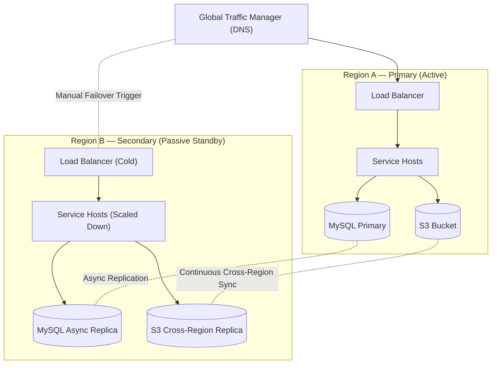

* **Recovery Point Objective (RPO):** Bounded by database replication lag (typically seconds to a few minutes).
* **Recovery Time Objective (RTO):** Tens of minutes required to promote standby replicas, warm memory caches, and update global DNS routing.

---

## 6. Key Design Decisions & Trade-offs

| Design Decision | Primary Benefit | System Cost / Trade-off |
|---|---|---|
| **Combined Service Hosts** | Eliminates internal network RPC latency between web and app tiers. | Reduces strict separation of concerns across code layers. |
| **Vertical MySQL Sharding** | Enables SQL joins within a topic partition without cross-shard chatter. | Requires eventual horizontal sharding if a table outgrows single host capacity. |
| **MyRocks Engine Migration** | Dropped P99 read latency from 80ms down to 4ms compared to HBase. | Requires specialized RocksDB operational and tuning expertise. |
| **Offline Answer Ranking** | Removes expensive ML computations from the synchronous write path. | Brand-new answers face a cold-start delay before ranking accurately. |
| **Eventual Counter Consistency** | Provides ultra-fast vote writes and high availability during viral bursts. | Users may temporarily view slightly stale vote counts across edge caches. |

---

### Mental Model Summary (Mindmap)

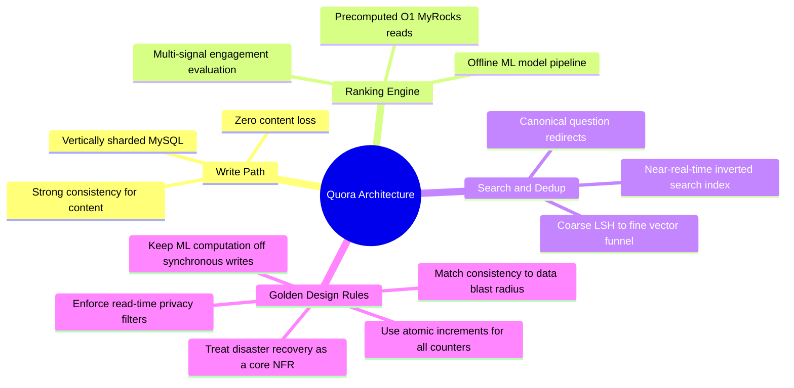

---

## 7. Master System Design Cheat Sheet

### Essential Capacity Formulas
$$\text{RPS} = \frac{\text{DAU} \times \text{Requests/User/Day}}{86,400\text{ Seconds}}$$

$$\text{Required Servers} = \frac{\text{DAU}}{\text{RPS Capacity per Server (Default: 8,000 RPS)}}$$

$$\text{Daily Storage} = \sum \left(\text{Content Count} \times \text{Average Payload Size}\right)$$

---

### Core Architectural Mnemonics
* **Functional Scope:** **Q-A-V-S-R** (*Question, Answer, Vote, Search, Rank*).
* **Fan-Out Strategy:** *"Push what is rare, pull what is massive."*
* **Duplicate Detection:** *"Cheap lexical candidates first, expensive semantic vectors second."*
* **Ranking Signals:** *"Votes lie; Views, Comments, Credibility, Dwell Time, Decay, and Edits don't."*
* **Abuse Defense:** *"Rate-limit the request at the gateway, pattern-match the graph offline."*
* **Privacy & Trust:** *"Anonymous hides the name, not the row; blocking hides the person, not the post."*
* **Monitoring:** *"Alert on user-facing symptoms, diagnose internal causes."*
* **Disaster Recovery:** *"Replicate continuously, promote deliberately."*

---

### Top Interview Follow-Up One-Liners

1. **Why not rank answers by upvotes alone?**
   > *"Upvotes reward virality and jokes over correctness. We compute multi-signal scores (views, dwell time, author credibility, decay) offline and store them in MyRocks for $O(1)$ serving."*

2. **How do you stop duplicate questions?**
   > *"We use a two-stage funnel: cheap MinHash/LSH hashes find candidates in milliseconds, deep sentence embeddings confirm similarity, and high-confidence matches auto-redirect to the canonical thread."*

3. **How do you handle vote race conditions and hot keys?**
   > *"We store votes as per-user state rows for write idempotency, and shard counter keys across 20 shards in Redis to eliminate single-key contention during viral traffic spikes."*

4. **Why long polling over WebSockets for notifications?**
   > *"Long polling holds HTTP requests up to 60 seconds to deliver near-real-time events without the memory cost of maintaining stateful full-duplex WebSocket connections for millions of idle users."*

5. **How are anonymous answers handled?**
   > *"Anonymity is a display-layer mask over a fully tracked `author_id`. The database records the real author for moderation and abuse tracing, while the API masks identity fields for public viewers."*
