# Design Google Maps — FAANG Interview Guide

> **Enhancement notes:** This comprehensive reference guide provides the exact system requirements, capacity calculations, trade-off matrices, data schemas, API contracts, and architecture diagrams needed for FAANG-level system design interviews.
> - **API Design (§6):** Added explicit REST/gRPC endpoint specifications, parameter schemas, and payload shapes.
> - **Architecture Evolution (§6):** Included a clear step-by-step evolution path from static tiles (v1) to CDN-backed segmented routing (v2) and real-time telemetry-driven GNN routing (v3).
> - **Geocoding & Reverse Geocoding (§7):** Deep dive into inverted index text resolution vs. S2-based spatial nearest-neighbor search.
> - **Turn-by-Turn Navigation & Deviation Rerouting (§13):** Step-by-step maneuver angle calculation and debounced deviation decision flowcharts.
> - **Tile Selection & Caching (§10):** Detailed zoom-level selection mechanics and CDN edge caching strategies.
> - **All core sections**—requirements, estimation, segmentation, routing algorithms, HMM traffic ingestion, GNN ETA modeling, and production readiness—are fully expanded with step-by-step breakdowns and perfectly rendering Mermaid diagrams.

---

## 1. Mental Model

Google Maps combines three distinct systems into a single user interface:

1. **A Geospatial Database:** Answers *"where is location X, and what points of interest (POIs) are near me?"* (Search + Indexing).
2. **A Graph Routing Engine:** Answers *"what is the optimal shortest or fastest path over a graph containing billions of intersections and edges?"*
3. **A Real-Time Telemetry System:** Ingests millions of live GPS pings per second to update driver navigation, detect traffic jams, and adjust ETAs dynamically.

### The Core Architectural Principle
> **The entire global road network, the spatial search index, and the visual map tiles are all far too massive to load or process as a single unit.**
> 
> Every challenge in this system—scalability, ETA precision, tile rendering, and live tracking—is solved using the same three-step pattern:
> 1. **Partition** the world into small geographic pieces (segments, tiles, or S2 cells).
> 2. **Precompute** expensive mathematical results offline.
> 3. **Stitch** small precomputed answers together dynamically when the user sends a live request.

#### The Paper Atlas Analogy
Think of the global road graph as a printed paper atlas:
- You never unfold a 10-foot map of the entire country just to find a neighborhood street.
- You open the atlas to the specific page containing your city (a segment).
- You read the local streets on that single page, and you only flip to a neighboring page when your route explicitly crosses a page boundary.
- Exit points are the highway connections printed at the edges of each page that show how to hop to adjacent pages without reading their internal streets.

---

### Cheat-Sheet
- **System Architecture:** Maps = Geospatial Search Index + Routing Graph + Live Telemetry Pipeline.
- **Golden Rule:** Partition space $\rightarrow$ Precompute expensive paths offline $\rightarrow$ Stitch small cached answers online.
- **Road Network Representation:** Weighted graph where **intersections are vertices**, **roads are edges**, and **weights represent travel time, distance, and traffic congestion**.
- **Execution Rule:** Move all computationally expensive graph traversals off the user's critical request path.
- **Unifying Partition Concept:** Segments, tiles, and S2 cells are the exact same partitioning pattern applied to different domains: storage partitioning, render partitioning, and search index partitioning.

---

## 2. How to Identify This Topic in an Interview

You are dealing with this system design pattern when the interview prompt asks for:
- *"Design Google Maps or Apple Maps"*
- *"Design Uber's ETA and Routing Engine"*
- *"Design a Ride-Sharing Dispatch System"*
- *"Design Yelp or Places Nearby"*
- *"Design a Delivery Fleet Routing System"*

### Key Trigger Signal Phrases
- *"Find the shortest or fastest route between point A and point B."*
- *"Show nearby drivers, restaurants, or friends within X kilometers."*
- *"Dynamically update arrival times (ETA) as traffic conditions change."*
- *"Track the live location of millions of moving mobile devices."*
- *"The road graph has billions of nodes—how do you make pathfinding run in milliseconds?"*

### Routing-Heavy vs. Proximity-Heavy Questions
This is a **geospatial + graph algorithm problem**, not a standard relational CRUD or social feed system.

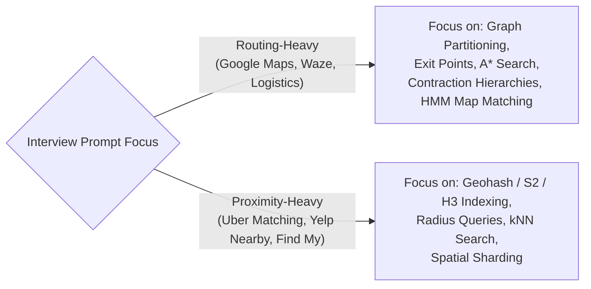

> **Pro-Tip:** Always ask the interviewer within the first 2 minutes which pillar they want to prioritize—routing pathfinding or proximity search. Their response dictates how you allocate your 45 minutes.

---

## 3. Interview Playbook

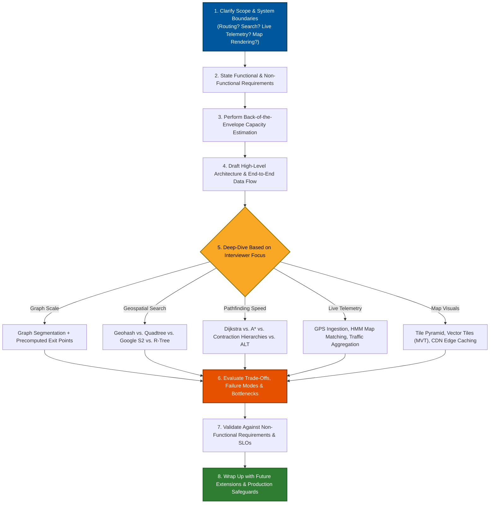

**Cheat-sheet**
- Spend ~5 min on requirements + estimation, ~10 min high-level, ~20 min deep dive where the interviewer steers, ~5 min trade-offs/wrap-up.
- Don't silently pick Dijkstra-on-full-graph as your final answer — say it, then immediately say why it doesn't scale, then partition.
- Narrate trade-offs out loud constantly — that's the signal FAANG interviewers grade on, not the diagram.

---

## 4. Requirements Clarification

### Functional Requirements
1. **Identify Current Location:** Resolve device latitude/longitude coordinates via GPS, Wi-Fi, or cell towers.
2. **Compute Optimal Routes:** Given a text origin and destination, calculate the fastest route by distance and travel time for various transport modes (driving, walking, biking, transit).
3. **Turn-by-Turn Navigation:** Generate step-by-step maneuver instructions and automatically reroute drivers when they deviate from the planned path.
4. **Nearby Points of Interest (POIs) & Traffic Overlays:** Search for nearby businesses and stream real-time traffic overlays.

### Non-Functional Requirements

| Requirement | Target | Engineering Rationale |
| :--- | :--- | :--- |
| **Availability** | **99.99%+** | Navigation must remain operational mid-drive to prevent driver safety hazards. |
| **Scalability** | **Billions of nodes**, 1B+ MAU | Must scale globally across 190+ countries and peak traffic spikes. |
| **Latency** | **< 2–3 seconds (p99)** | Driver is actively waiting; route generation must feel near-instantaneous. |
| **ETA Accuracy** | **Within $\pm 5\%$ of actual travel time** | Inaccurate ETAs break user trust and cause downstream delivery delays. |
| **Consistency** | **Eventual for geodata; High freshness for traffic** | Road network geometries change rarely; live traffic changes every 30–60 seconds. |

### Location Signal Sources

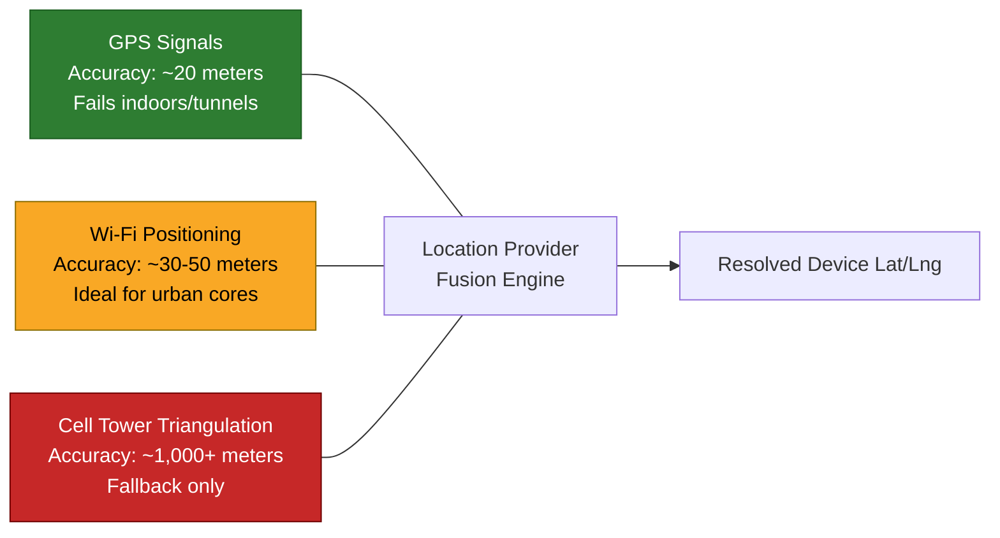

**Clarifying questions to ask out loud:**
- Cars only, or also walking/biking/transit (changes the graph — one-ways, bike lanes, station graphs)?
- Do we need live traffic-adjusted ETA or just static distance/time?
- Do we own the map data or ingest from third parties (government + fleet-collected)?
- Read-heavy (billions of route queries) vs write-heavy (location pings) — assume both, but they scale independently.

**Cheat-sheet**
- 3 functional pillars: locate, route, navigate (+re-route).
- 4 non-functional pillars: available, scalable, fast (<3s), accurate.
- Road network = weighted graph; weights = distance, time, traffic — not orthogonal, traffic feeds into time.
- Map/road data is near read-only (one-time bulk load + rare edits); live traffic data is a firehose.
- Always separate "static geodata" scaling story from "live telemetry" scaling story — they use different infra.

---

## 5. Capacity Estimation

### Step-by-Step Mathematical Formulations

```
1. Total Routing Servers    = (DAU × Peak Multiplier × Route Requests per User) / (Seconds in Day × Server Throughput)
2. Route Request Ingest BW  = Routing QPS × Average Request Payload Size
3. Route Response Outgest BW= Routing QPS × Average Response Payload Size (Visuals + Steps)
4. Active Navigators        = DAU × Percentage of Users Actively Navigating at Peak
5. GPS Telemetry QPS        = Active Navigators × (1 / Ping Interval Seconds)
6. GPS Telemetry Ingest BW  = GPS Telemetry QPS × Ping Payload Size
7. Raw Telemetry Storage    = GPS Telemetry QPS × Payload Size × 86,400 sec × Retention Days
8. Map Tile Request QPS     = (Concurrent Map Viewers × Tiles per Viewport) / Viewport Refresh Seconds
9. Origin Tile Server BW    = Map Tile Request QPS × Vector Tile Size × (1 − CDN Cache Hit Rate)
```

---

### Worked Numerical Calculation Example

#### Base System Assumptions:
- **Daily Active Users (DAU):** 32 Million (~1 Billion Monthly Active Users).
- **Average Route Requests:** 50 requests per user per day (including pan/zoom routing refreshes).
- **Peak Load Multiplier:** $2.0\times$ average load.

#### 1. Routing Query QPS & Server Calculations
1. **Daily Requests:** $32,000,000 \text{ DAU} \times 50 \text{ req/day} = 1.6 \text{ Billion requests/day}$.
2. **Average QPS:** $\frac{1.6 \text{ Billion}}{86,400 \text{ seconds}} \approx 18,518 \text{ req/sec}$.
3. **Peak QPS ($2\times$):** $18,518 \times 2 = \mathbf{37,036 \text{ Peak req/sec}}$.
4. **Required Routing Servers:** If one graph server handles 100 complex pathfinding requests/sec:
   $$\text{Routing Servers} = \frac{37,036}{100} = \mathbf{371 \text{ servers (round to 400 for redundancy)}}$$

#### 2. Network Bandwidth Breakdown
- **Incoming Request Bandwidth:**
  $$37,036 \text{ req/sec} \times 200 \text{ Bytes} = 7.4 \text{ MB/s} \approx \mathbf{59.2 \text{ Mbps}}$$
- **Outgoing Response Bandwidth:**
  Assuming each route response returns vector polyline steps and metadata (~15 KB total):
  $$37,036 \text{ req/sec} \times 15 \text{ KB} = 555.5 \text{ MB/s} \approx \mathbf{4.44 \text{ Gbps}}$$

#### 3. Live GPS Telemetry Pipeline Calculations
1. **Concurrent Active Navigators at Peak:** $32,000,000 \text{ DAU} \times 5\% \text{ active navigating} = \mathbf{1.6 \text{ Million concurrent drivers}}$.
2. **GPS Ingestion QPS (5-second ping interval):**
   $$\text{Telemetry QPS} = \frac{1,600,000 \text{ drivers}}{5 \text{ seconds}} = \mathbf{320,000 \text{ pings/sec}}$$
3. **Telemetry Ingest Bandwidth (100 Bytes per payload):**
   $$320,000 \text{ pings/sec} \times 100 \text{ Bytes} = 32 \text{ MB/s} \approx \mathbf{256 \text{ Mbps}}$$
4. **Raw Telemetry Data Storage (7-Day Retention):**
   $$\text{Daily Volume} = 320,000 \times 86,400 = 27.64 \text{ Billion pings/day}$$
   $$\text{7-Day Raw Storage} = 27.64 \text{B pings/day} \times 100 \text{ Bytes} \times 7 \text{ days} \approx \mathbf{19.35 \text{ TB (pre-aggregation)}}$$

#### 4. Map Tile Rendering Bandwidth & CDN Optimization
1. **Concurrent Map Viewers:** $32,000,000 \text{ DAU} \times 10\% \text{ browsing map} = \mathbf{3.2 \text{ Million sessions}}$.
2. **Tile Request QPS:** Each viewport displays 12 vector tiles, refreshed every 10 seconds during panning:
   $$\text{Tile QPS} = \frac{3,200,000 \times 12}{10 \text{ seconds}} = \mathbf{3,840,000 \text{ tile requests/sec}}$$
3. **Total Uncached Bandwidth (20 KB per Vector Tile):**
   $$3,840,000 \text{ req/sec} \times 20 \text{ KB} = 76.8 \text{ GB/sec} \approx \mathbf{614.4 \text{ Gbps}}$$
4. **Origin Bandwidth with 95% CDN Cache Hit Rate:**
   $$\text{Origin Bandwidth} = 614.4 \text{ Gbps} \times (1 - 0.95) = \mathbf{30.72 \text{ Gbps}}$$

**Cheat-sheet**
- Server count formula: DAU / per-server-capacity. Always state the per-server assumption out loud (it's arbitrary, own it).
- Two independent capacity stories: (a) query-serving (routing) scales with DAU × requests/user; (b) telemetry ingestion scales with *concurrently navigating* users × ping-rate, not DAU.
- Tile bandwidth is dominated by CDN cache-hit ratio — a 95% hit rate is a 20x bandwidth reduction at origin.
- Road network storage is one-time/bulk (~20 PB class); GPS ping storage is the fast-growing stream, kept short-lived and aggregated down.
- Always convert your final numbers to a common unit (Mb/s or Gb/s) — interviewers notice unit mismatches.

---

## 6. High-Level Design

### API Interface Specifications

```http
GET /v1/geocode?address=2100+Guadalupe+St+Austin+TX
Host: api.maps.service.com
Authorization: Bearer <token>
```
```json
{
  "status": "OK",
  "candidates": [
    {
      "placeId": "place_84920",
      "formattedAddress": "2100 Guadalupe St, Austin, TX 78705",
      "coordinate": { "lat": 30.2849, "lng": -97.7404 },
      "confidenceScore": 0.98
    }
  ]
}
```

```http
POST /v1/routes
Host: api.maps.service.com
Content-Type: application/json

{
  "origin": { "lat": 30.2672, "lng": -97.7431 },
  "destination": { "lat": 32.7767, "lng": -96.7970 },
  "travelMode": "DRIVING",
  "departureTime": "2026-08-13T17:00:00Z",
  "avoidTolls": false
}
```
```json
{
  "routeId": "route_tx_94820",
  "distanceMeters": 315400,
  "durationSeconds": 10800,
  "polyline": "a~_bF~`_xV...",
  "steps": [
    {
      "instruction": "Merge onto I-35 North",
      "distanceMeters": 45000,
      "durationSeconds": 1500,
      "startCoordinate": { "lat": 30.2672, "lng": -97.7431 }
    }
  ]
}
```

State the contract before the boxes-and-arrows — interviewers use this to check you've thought about the client's actual call shape, not just internal components. The two examples above are the two most detail-worthy calls; the full endpoint surface looks like this:

| Endpoint | Purpose | Key request params | Key response fields |
| :--- | :--- | :--- | :--- |
| `GET /v1/geocode?address=` | Text address → lat/lng | `address` | `lat, lng, placeId, confidence` |
| `GET /v1/reverseGeocode?lat=&lng=` | lat/lng → nearest address | `lat, lng` | `address, placeId` |
| `GET /v1/routes?origin=&destination=&mode=&departureTime=` | Compute a route | `origin, destination, mode (car/bike/walk/transit), departureTime` | `routeId, distanceMeters, etaSeconds, polyline, steps[]` |
| `GET /v1/routes/{routeId}/eta?lat=&lng=` | Live-recompute ETA mid-trip from current position | `routeId, lat, lng` | `etaSeconds, remainingDistanceMeters, rerouted (bool)` |
| `GET /v1/tiles/{z}/{x}/{y}.pbf` | Fetch one vector tile | path params `z, x, y` | binary protobuf (geometry + style refs) |
| `POST /v1/location/pings` (or WebSocket equivalent) | Stream a device's GPS ping | `userId, ts, lat, lng, speedKph, headingDeg` | `ack` (fire-and-forget, no meaningful body) |
| `GET /v1/places/nearby?lat=&lng=&radiusM=&category=` | POI search near a point | `lat, lng, radiusM, category` | `places[] {placeId, name, lat, lng, distanceM}` |

Notes worth saying out loud:
- `routes` and `eta` are separate calls on purpose — the first is expensive (graph search), the second is cheap (re-weight a cached path); don't force a client to re-request the whole route just to refresh a number.
- Tiles are fetched by `(z, x, y)`, not by bounding box — that's what makes them CDN-cacheable (fixed, predictable keys) instead of query-string-cacheable (infinite key space).
- Location pings are one-way and idempotent-ish (a dropped ping just means one fewer sample) — that's why it's fire-and-forget over a POST/WebSocket, not a call the client waits on or retries aggressively.
- Rate limits (§16) apply per endpoint: `routes`/`geocode` are token-bucketed per API key; `location/pings` is capped per device, not per key.

---

### System Architecture Evolution: v1 $\rightarrow$ v2 $\rightarrow$ v3

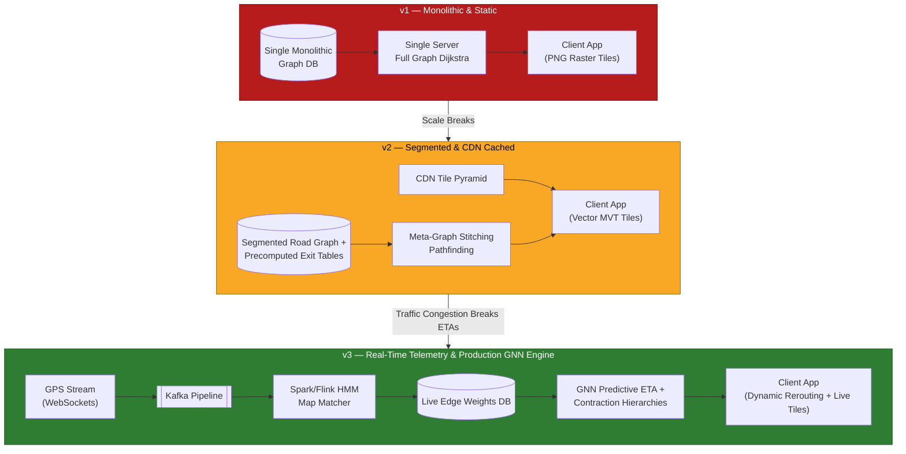

| Stage | What's new | What breaks if you stop here |
| :--- | :--- | :--- |
| **v1** | Tiles are baked offline and served flat; routing is Dijkstra on one giant in-memory graph. | Doesn't scale past a small map — full-graph Dijkstra and un-cached tiles both fall over at real traffic. |
| **v2** | CDN in front of tiles (huge bandwidth win), graph split into segments with precomputed exit points. | Routing is fast but ETAs are static — no live traffic means wrong ETAs during real congestion. |
| **v3** | GPS-ping pipeline feeds live edge weights; routing engine is CH-like (or ALT) so it stays fast *and* traffic-aware. | This is the target design described in the rest of this guide. |

**Cheat-sheet**
- If asked "how would you build this incrementally," answer with this v1→v2→v3 ladder, not the full design from scratch.
- The recurring upgrade at every stage is the same: replace "compute everything at request time" with "precompute + cache, refresh async."

---

### Core Component Architecture Diagram

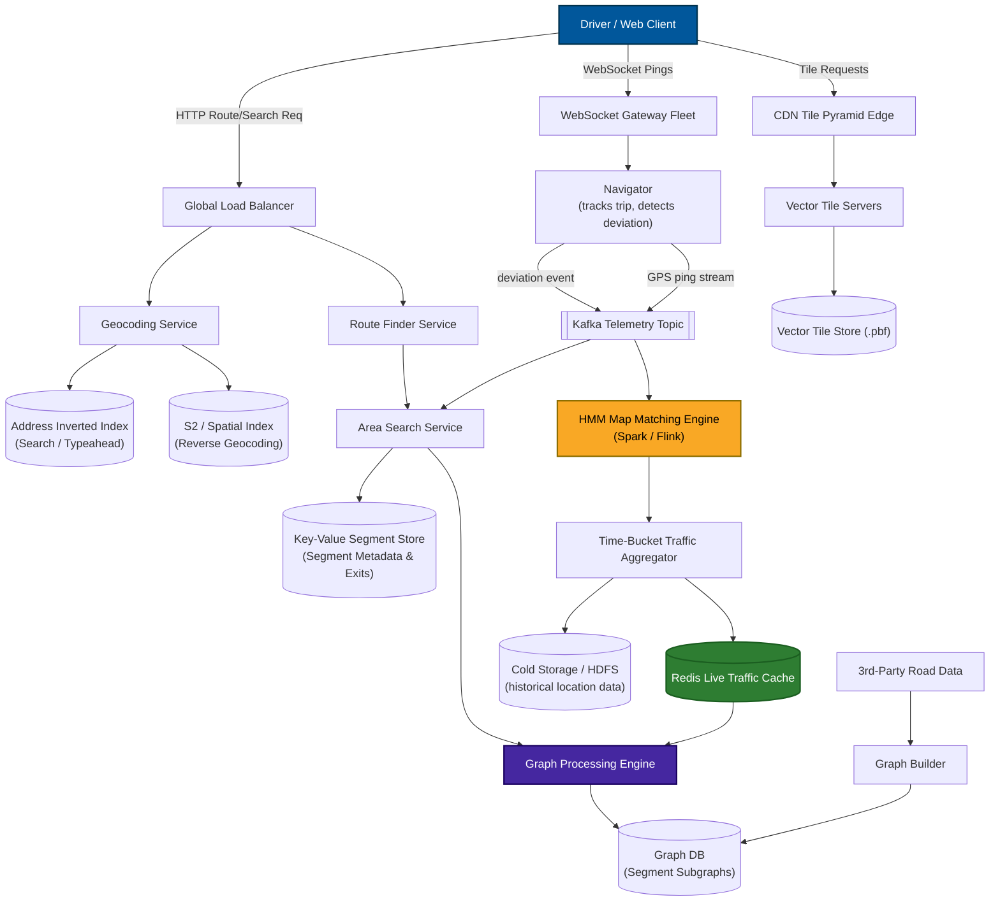

### Component Responsibilities

| Component | Responsibility |
| :--- | :--- |
| **Location Finder** | Resolves the user's current lat/lng and holds a persistent connection for live updates. |
| **Distributed Search (Typeahead)** | Text place-name → lat/lng, and reverse. |
| **Route Finder** | Front door for a routing request; orchestrates the area search. |
| **Area Search Service** | Finds the source/destination segments, asks graph processing for the path. |
| **Graph Processing Engine** | Runs shortest-path over the relevant segment(s). |
| **Navigator** | Tracks the user mid-trip, detects deviation, triggers re-route. |
| **Graph DB** | Stores the road network as a graph (nodes = intersections, edges = roads). |
| **Key-Value Store** | segment→server mapping, segment boundary coordinates, precomputed exit-point distances. |
| **Pub-Sub (Kafka)** | Deviation events, live GPS ping streams, traffic-analytics fan-out. |
| **Map/Tile Servers + CDN** | Serves rendered map imagery / vector tiles. |
| **Third-Party Road Data + Graph Builder** | Ingests/normalizes/loads road data into the graph. |
| **Load Balancer** | Spreads requests / WebSocket connections across servers. |

**Memory hook:** *"Find it, Route it, Watch it"* — Distributed Search (find), Route/Area/Graph services (route), Navigator (watch/re-route).

### Request Workflow (Sequence Diagram)

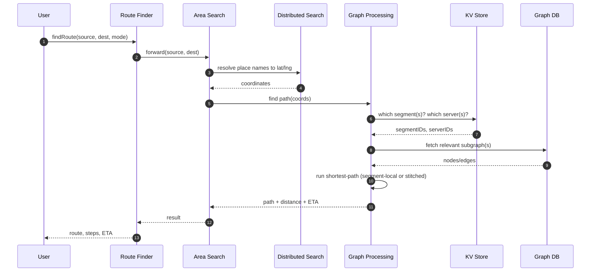

**Cheat-sheet**
- Route Finder = orchestrator/front door; Area Search = "which segments"; Graph Processing = "actual pathfinding."
- Key-value store is the traffic cop: segment→server, segment boundaries, and cached exit-point distances all live there — it's on the critical path for *every* request, so it must be low-latency and horizontally scaled.
- Kafka is the connective tissue for anything asynchronous: deviation → re-route, GPS stream → analytics.
- Graph DB stores segment-local graphs; nobody queries the *whole* graph in one call, ever.
- Draw the diagram left-to-right in this order — user, resolve names, resolve segments, resolve servers, run algorithm — interviewers can follow the request as they read.

---

## 7. Deep Dive: Geospatial Indexing

### Spatial Indexing Technology Matrix

| Feature | Geohash | Quadtree | Google S2 | Uber H3 |
| :--- | :--- | :--- | :--- | :--- |
| **Grid Geometry** | Rectangular cells | Recursive square quadrants | Cube-projected spherical cells | Hierarchical hexagons |
| **Sphere Curvature** | Ignores sphere (distorts at poles) | Ignores sphere (2D planar) | **Minimizes 3D spherical distortion** | Minimizes spherical distortion |
| **Spatial Density** | Fixed cell area globally | **Adapts dynamically to density** | Fixed levels (Level 0–30) | Fixed resolution levels |
| **Neighbor Centroid Distance** | Diagonal is $\sqrt{2}\times$ farther | Diagonal is $\sqrt{2}\times$ farther | Varies slightly | **Uniform distance to all 6 neighbors** |
| **1D Storage Locality** | Base32 String Prefix | Tree Hierarchy Pointer | **Hilbert Space-Filling Curve** | Hexagon Morton/Cell ID |
| **Primary Production Use** | Redis GEO, Elasticsearch | Custom spatial engines | **Google Maps, Spanner, Bigtable** | Uber Dispatch & Surge Pricing |

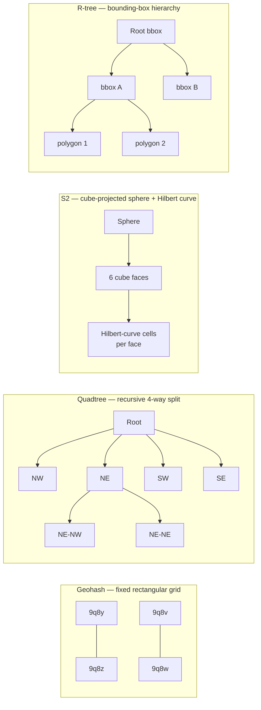

**Why interviewers ask about this:** geohash's biggest gotcha is the **boundary problem** — two points 1 meter apart can have completely different geohash prefixes if they straddle a grid boundary, breaking naive prefix-based radius queries (fix: query neighboring cells too, or use S2/quadtree's better locality). S2 is the "correct" answer for planet-scale because it accounts for sphere curvature (geohash rectangles distort badly near poles); it's genuinely what Google uses internally.

---

### Google S2 Geometry Deep Dive
Google Maps relies on **S2 Geometry** to index global spatial data:

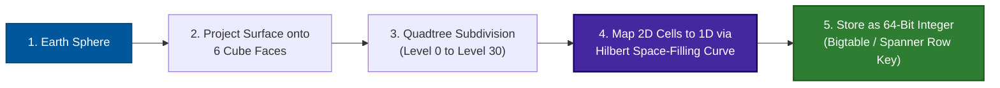

- **Why the Hilbert Curve is Essential:** A Hilbert curve folds 2D space into a continuous 1D line such that points close in 2D space remain **numerically adjacent in 1D memory**.
- **Database Range Scans:** Because S2 IDs are 64-bit integers, finding all points within a bounding radius translates to a fast contiguous database scan:
  `SELECT * FROM places WHERE s2_cell_id BETWEEN 1024859000 AND 1024860000`

---

### Decision Tree: Which Spatial Index to Pick?

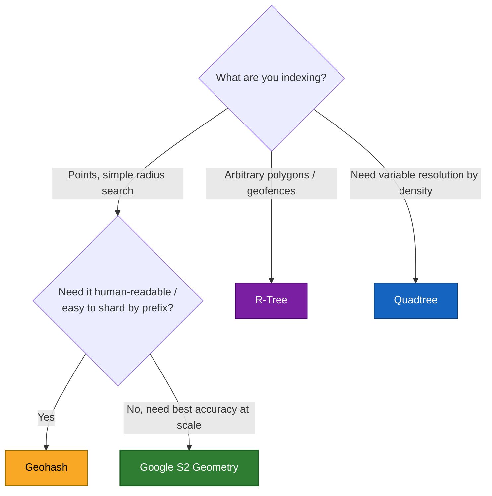

**Cheat-sheet**
- **Geohash** = simplest, shardable, but distorts near the poles and has a boundary discontinuity — always mention the neighbor-cell fix.
- **Quadtree** = adapts to density (fine cells in cities, coarse in deserts) — good verbal answer for "how do segments vary in size."
- **S2** = what Google actually uses; near-equal-area cells on the sphere, Hilbert-curve locality means nearby cells have nearby IDs (great for range scans in Bigtable/Spanner).
- **R-tree** = for shapes, not points — geofencing, building footprints, delivery zones.
- **Uber H3** (hexagonal hierarchical index) is a fifth alternative worth name-dropping — hexagons have uniform neighbor distance (no diagonal-vs-adjacent distortion like squares).

---

### Geocoding & Reverse Geocoding

The "Distributed Search / Typeahead" component in §6 does two distinct jobs that are worth separating explicitly, because they use different data structures:

**Forward geocoding** — text address → lat/lng (e.g., "1600 Amphitheatre Parkway, Mountain View" → `37.4220, -122.0841`).
- Backed by an inverted index over address tokens (street number, street name, city, postal code) — conceptually the same trie/inverted-index machinery as search typeahead, just indexing addresses instead of web pages.
- Ambiguous/partial input ("Koramangala" — a neighborhood, not a full address) resolves to a ranked list of candidates; ranking uses popularity, proximity to the requester, and string-match quality.
- **Illustrative scale:** a country-level address index might hold on the order of 100M–1B addressable entries (buildings, POIs, intersections); at ~200 bytes/entry that's tens to low hundreds of GB — small enough to shard by region and mostly cache in memory, unlike the multi-PB road graph.

**Reverse geocoding** — lat/lng → nearest address (e.g., `37.4220, -122.0841` → "1600 Amphitheatre Parkway").
- Not a text lookup — it's a spatial nearest-neighbor query: map the point to its S2 cell/geohash prefix, then do a bounded radius search over addresses/parcels indexed under that same cell (the same index from the matrix above), picking the closest by haversine distance.
- This is also exactly how a raw GPS ping gets turned into "which street am I on" for display purposes — distinct from *map matching* in §11, which snaps a ping onto a *road edge* for routing/traffic, whereas reverse geocoding snaps it onto a human-readable *address*.

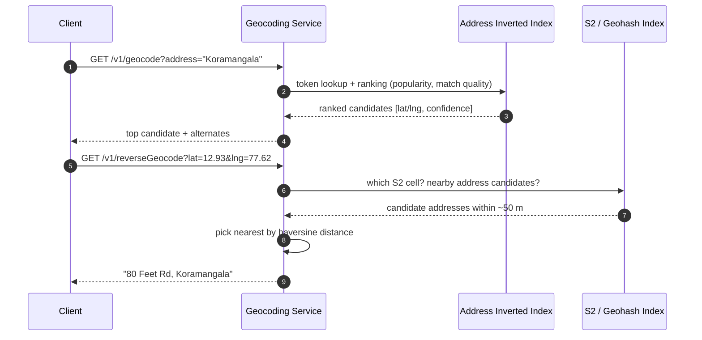

**Cheat-sheet**
- Forward geocoding = text search problem (inverted index + ranking). Reverse geocoding = spatial nearest-neighbor problem (same S2/geohash index used for segments and tiles).
- Both are read-heavy and latency-sensitive (~20 ms budget in the §9 trace) but tiny compared to the road graph — cache them aggressively, they change far less often than traffic.
- If asked "is geocoding part of routing," say no — it's a prerequisite lookup that turns free text into the lat/lng that routing actually consumes.

---

## 8. Deep Dive: Road Network Graph & Segmentation

### Graph Partitioning & Precomputed Exit Points

**Core problem:** a global road graph has billions of vertices/edges — you can't load it, can't traverse it, can't hold it in one server's memory.

**Solution: segments.** Loading a national graph into memory breaks server limits, so we partition the global graph into **5 mile × 5 mile geographic segments**. Each segment:
- Has 4 boundary coordinates (or an arbitrary polygon).
- Hosts its own small subgraph (intersections = vertices, roads = weighted edges: distance, time, traffic).
- Is small enough to fit in one server's memory, and to be traversed and updated cheaply.

**Offline precomputation per segment:**
- Run Dijkstra (or better) between every pair of vertices *inside* the segment.
- Cache the shortest distance, time, and path for every vertex pair.
- Treat the segment's **exit points** (boundary edges connecting to neighboring segments) as special vertices, and also precompute shortest paths from every interior vertex to every exit point.

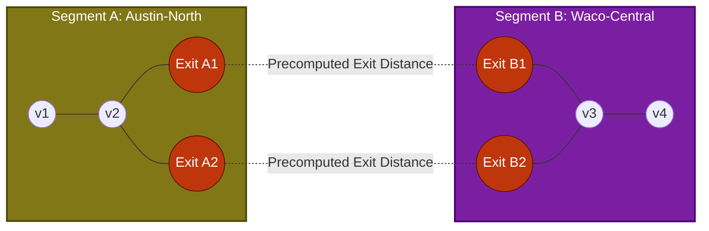

#### The Three-Step Cross-Segment Stitching Workflow:
1. **Haversine Bounding Corridor:** Compute the haversine (great-circle) straight-line aerial distance between origin and destination, and include only the segments within roughly that aerial radius — this bounds the search space so you don't consider segments on the other side of the planet, filtering out 99% of irrelevant nationwide segments.
2. **Meta-Graph Construction:** Extract **only the exit points** (boundary nodes) of the included corridor segments — build a *meta-graph* whose vertices are just those exit points and whose edges are the already-cached exit-point-to-exit-point distances.
3. **Meta-Graph Search:** Run shortest-path pathfinding across this tiny meta-graph (fewer than 200 exit nodes), using cached exit-to-exit distances.

**Haversine formula (memorize the shape, not the derivation):**
```
a = sin²(Δlat/2) + cos(lat1)·cos(lat2)·sin²(Δlng/2)
c = 2·atan2(√a, √(1−a))
distance = R · c        (R = Earth radius ≈ 6,371 km)
```

**Cheat-sheet**
- Segments turn an intractable global graph into hundreds of tractable local graphs.
- All expensive pairwise shortest-path computation happens **offline**; the user-facing path only ever touches cached results or a small stitching graph.
- Exit points are the trick that makes cross-segment routing cheap: they're precomputed vertices that "summarize" a whole segment down to a handful of numbers.
- Haversine bounds *which* segments you even consider — without it you'd have to guess a search radius.
- Non-uniform segment sizing (smaller in dense cities, larger in rural areas) is a scalability lever — mention it as an optimization.

---

### Storage Schema

| Store | Contents |
| :--- | :--- |
| **Key-Value** | segmentID, hosting serverID, boundary coordinates, list of neighboring segmentIDs. |
| **Graph DB** | Per-segment road network graph (vertices = intersections, edges = roads with weights). |
| **Relational DB** | Per-edge congestion table: `edgeID, hourRange, rush(bool)` — is this edge typically congested at this hour. |

IDs (`segID`, `serverID`, `edgeID`) come from a unique ID generator (Snowflake-style sequencer).

---

### Complete Data Model Schema (ER Diagram)

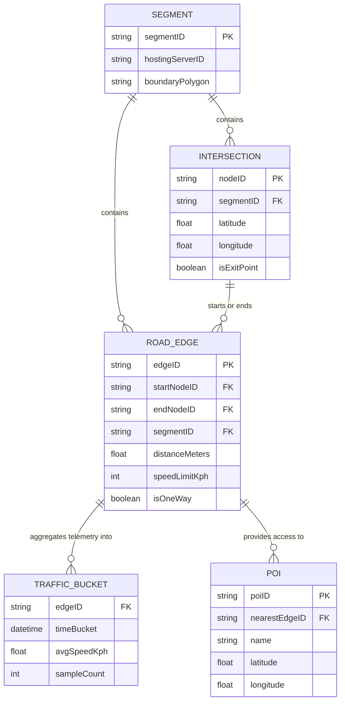

---

## 9. Deep Dive: Pathfinding & Routing Algorithms

### Algorithm Comparison Matrix

| Pathfinding Algorithm | Precomputation Overhead | Query Complexity | Handles Dynamic Live Weights? | Primary Use Case |
| :--- | :--- | :--- | :--- | :--- |
| **Dijkstra** | None | $O((V + E) \log V)$ | **Yes** (Trivially re-runs) | Local intra-segment search (< 2,000 nodes). |
| **A\* Search** | None (Needs Heuristic) | Faster than Dijkstra | **Yes** | Single segment / Lightweight meta-graph search. |
| **Contraction Hierarchies (CH)** | Heavy offline node contraction | **$O(\log V)$ (~ milliseconds)** | **No** (Static shortcuts break under live traffic) | Planet-scale national routing (OSRM). |
| **ALT (A\*, Landmarks, Triangle)** | Medium (Precomputes landmark distances) | Fast | **Better than CH** | Dynamic traffic-aware nationwide routing. |

**Memory hook:** *"Dave Always Considers Landmarks"* → **D**ijkstra, **A\***, **C**ontraction Hierarchies, ALT (**L**andmarks).

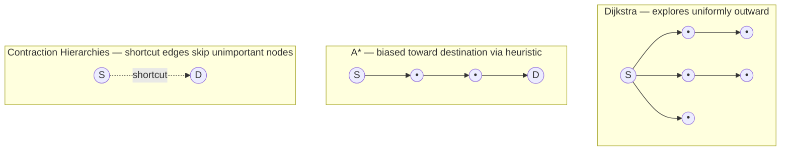

### Which to Pick? (Decision Tree)

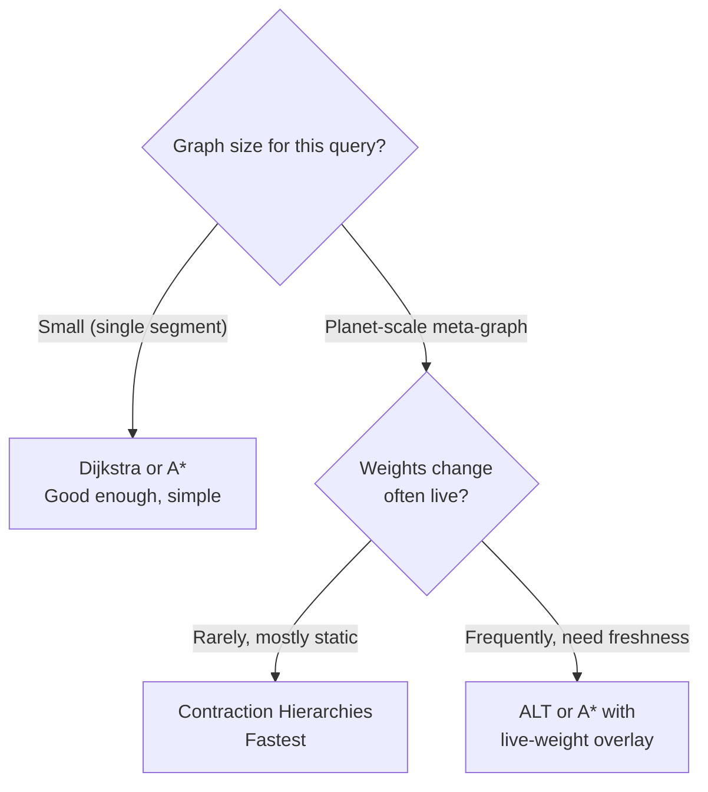

**Why the segment design sidesteps the hardest part of this debate:** because segments keep each subgraph small, plain **Dijkstra is genuinely good enough per-segment**, and CH-style precomputation is really what you're doing *at the exit-point/meta-graph level* — the exit-point cached distances *are* a lightweight contraction hierarchy in spirit. Say this explicitly in the interview — it shows you connected the two ideas instead of reciting them separately.

---

### Step-by-Step Execution Trace: 6 PM Rush-Hour Route Request

Walking through this hop by hop, the way you'd narrate it in an interview:

1. **Geocoding (~20 ms):** "Koramangala" and "Kempegowda Airport" resolve to lat/lng via Distributed Search — a reverse-index lookup, no graph traversal yet.
2. **Segment resolution (~5 ms):** Both coordinates map to S2 cells. Area Search asks the KV store which segment/server hosts each — Koramangala lands in `segment_482`, the airport in `segment_901`, ~40 km and several segments away.
3. **Bounding the search (~1 ms, no I/O):** Graph Processing computes the haversine distance (≈40 km) and includes only segments within that aerial radius — roughly 15–20 segments along the Bangalore-to-airport corridor, not all of Karnataka.
4. **Meta-graph stitch (~10–30 ms):** A meta-graph is built from just the *exit points* of those segments — a few hundred vertices. A* runs on it using precomputed exit-point-to-exit-point distances.
5. **Live traffic overlay (~5–10 ms):** Before finalizing weights, Graph Processing checks the live-traffic cache (fed by the pipeline in §11). Outer Ring Road segments show avg speed down from 45 km/h to 14 km/h — those edges' time-weight rises, and the algorithm may prefer a marginally longer but faster corridor via Hosur Road.
6. **Response assembly (~5 ms):** Path + turn-by-turn steps + ETA (distance/live-speed, not distance/speed-limit) return to the phone.
7. **Total: ~1.5–2 sec end-to-end** — comfortably inside the 2–3 sec p99 target, because the only *online* work is a small meta-graph search plus a few cache reads; everything expensive (pairwise segment distances, exit-point distances) was already computed offline.

What's cached: the geocode, the segment→server mapping, the exit-point distances. What's always fresh: the live-traffic overlay, recomputed from the last few minutes of GPS pings.

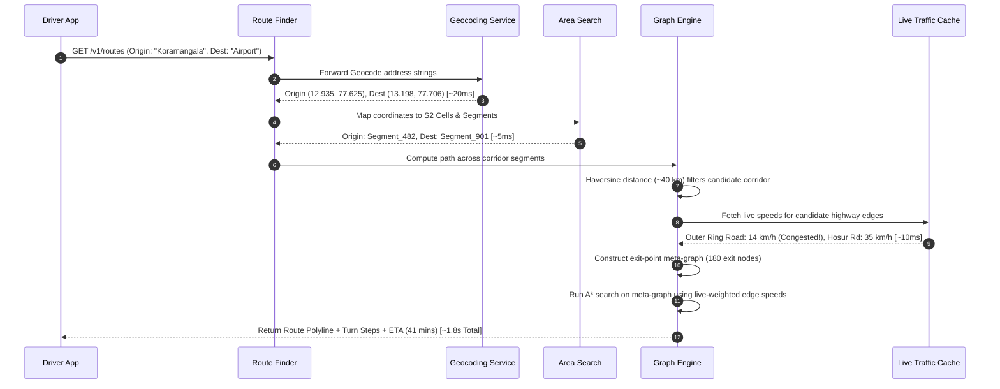

**Cheat-sheet**
- Dijkstra explores in all directions — correct but wasteful; fine on a small (segment) graph.
- A* = Dijkstra + a heuristic (usually haversine distance to goal) that biases the search — free upgrade, always mention it.
- Contraction Hierarchies = the industry-standard trick for planet-scale routing (used by OSRM); huge offline cost, near-instant queries, but stale under live traffic unless re-contracted or overlaid.
- ALT = a way to get CH-like speed while staying more tolerant of changing edge weights (better fit for traffic-aware routing).
- The segment + exit-point design *is* a hand-rolled contraction hierarchy — call that out to score architecture points.

---

## 10. Deep Dive: Map Tile Serving & Rendering

Maps aren't shipped as one giant image — they're a **tile pyramid**: the world is rendered at multiple zoom levels, each level split into fixed-size tiles (typically 256×256 px), addressed by `(zoom, x, y)`.

| Zoom Level | Approx. Meters/Pixel | Typical Use |
| :--- | :--- | :--- |
| 0 | ~156,543 m | Whole world |
| 5 | ~4,900 m | Continent |
| 10 | ~150 m | City |
| 15 | ~4.8 m | Streets |
| 18–20 | ~0.3–1.2 m | Building-level |

Formula: `meters/pixel ≈ 156,543 / 2^zoom` (at the equator).

### Raster Tiles vs. Vector Tiles

| Metric | Raster Tiles | Vector Tiles (Mapbox MVT) |
| :--- | :--- | :--- |
| **Payload Format** | Pre-rendered PNG/JPEG images | Binary Protocol Buffer (`.pbf`) geometry |
| **Tile Size** | **Large (~80–100 KB per tile)** | **Small (~10–30 KB per tile)** |
| **Rendering Workload** | 100% Server GPU/CPU | **100% Client Device GPU** |
| **Styling Flexibility** | Fixed (Requires re-rendering for Dark Mode) | **Instant Client Re-styling via JSON Stylesheet** |
| **Zoom Experience** | Pixelated jumps between integer zoom levels | Smooth continuous 60 FPS vector scaling |

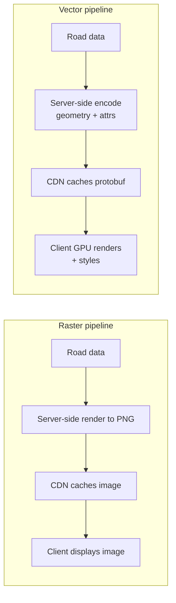

**CDN caching split** — since tiles are the dominant bandwidth cost (614.4 Gbps theoretical in our §5 estimate), cache-hit ratio is everything:

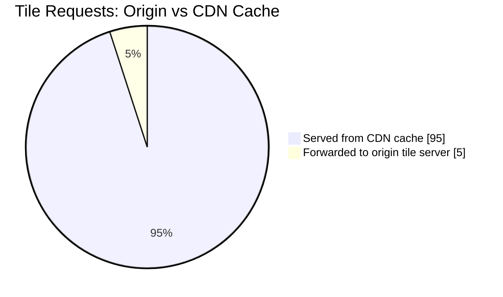

---

### Vector Tile Pyramid `(z, x, y)` Resolution Flow

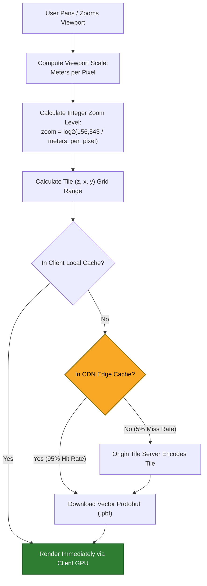

**Cheat-sheet**
- Tiles are addressed by `(zoom, x, y)` — same trick as segments/S2 cells: fixed-size partitions of the world at multiple resolutions.
- Modern Google/Apple/Mapbox Maps use vector tiles: smaller payload, instant re-styling (dark mode, language), smooth zoom — cost is shifted to client CPU/GPU.
- Raster tiles are simpler and cheaper to serve blindly but inflexible and heavier per request.
- CDN cache-hit ratio dominates your bandwidth bill — popular city tiles get near-100% hit rates; rural/rare zoom levels don't.
- Tile pyramid and geospatial segments are conceptually the same partitioning idea applied to rendering instead of routing.

---

## 11. Deep Dive: Real-Time Traffic Aggregation from GPS Pings

### Telemetry Processing & HMM Map Matching

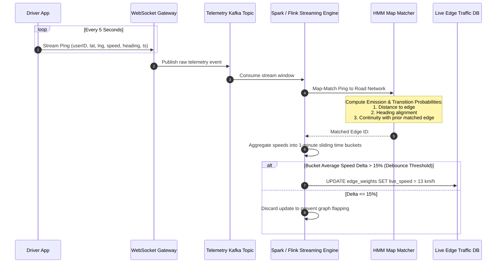

**Map matching** (a detail interviewers love): a raw GPS ping is noisy (±20 m) and doesn't say *which road* the device is on. Map matching snaps the ping onto the nearest plausible road edge using the road graph + heading + speed + previous pings (commonly a Hidden Markov Model over candidate edges). Without map matching, you can't attribute a ping to a specific edge to compute per-road congestion.

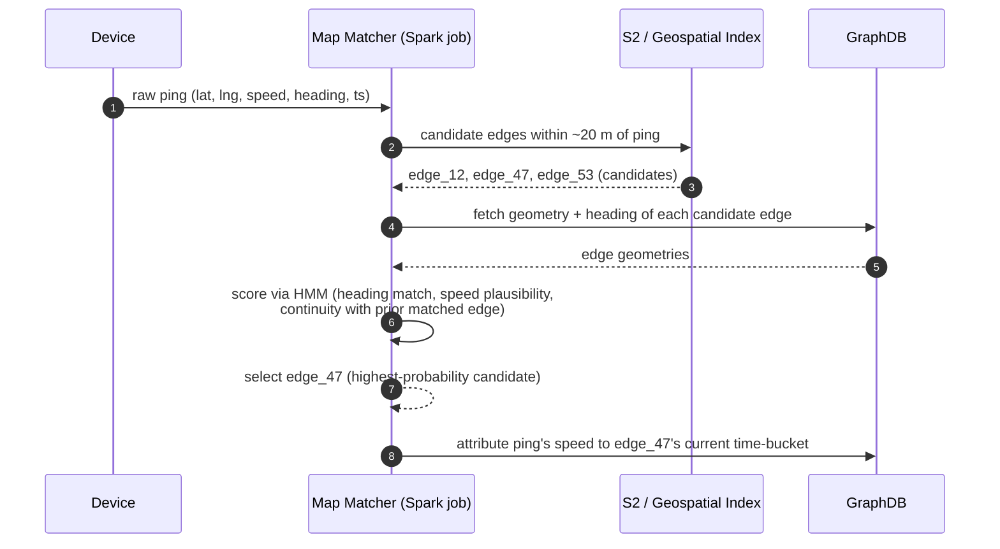

---

### Trace This: How Outer Ring Road's Jam Gets Detected

At 6:02 PM, 8,000 concurrent devices are navigating Bangalore's Outer Ring Road corridor, each pinging every 5 seconds (~1,600 pings/sec on this corridor alone). A ping from Priya's phone at (12.935, 77.625) is noisy — GPS puts her within ±20 m of three parallel candidate edges (main carriageway + two service roads). The map-matcher above uses her heading (92°, matching the main carriageway's bearing) and continuity with her previously matched edge to snap her onto `edge_ORR_1147`, not a service road.

Spark aggregates all ~1,600 pings/sec on this corridor into 1-minute time-buckets per edge. At 6:00 PM, `edge_ORR_1147`'s bucket shows an average speed of 41 km/h (450 samples); by 6:05 PM it's down to 13 km/h (510 samples) — a >65% delta, well past the debounce threshold. That crosses the threshold check above, so the Map Update Service pushes the new edge weight into the Graph DB within roughly 30–60 seconds of the slowdown starting. Any route query touching this edge after that point — like the 6 PM rush-hour trace in §9 — sees the updated 13 km/h weight; the raw pings also land in cold storage to feed tomorrow's historical-average update.

**Why WebSockets, not polling:** location updates are bidirectional and frequent; a persistent connection avoids repeated HTTP handshake overhead. The load balancer must distribute WebSocket connections across servers because each server has a max connection ceiling (design constraint you should state a number for, e.g., "50K sockets/server," and derive gateway server count from it — see §5 estimation).

**Debounce updates — don't recompute constantly:** transient conditions (a red light) shouldn't trigger a graph update. Only recompute/re-propagate an edge weight when it changes by more than a threshold percentage — this is a deliberate trade-off between freshness and system load.

```mermaid
stateDiagram-v2
    [*] --> Connected: WebSocket handshake
    Connected --> Streaming: device sends periodic pings
    Streaming --> MapMatched: ping snapped to road edge
    MapMatched --> Aggregated: rolled into edge/time-bucket stats
    Aggregated --> ThresholdCheck: weight delta greater than x%?
    ThresholdCheck --> GraphUpdated: yes, push update
    ThresholdCheck --> Streaming: no, discard and keep streaming
    GraphUpdated --> Streaming
    Streaming --> Disconnected: app closed or network lost
    Disconnected --> [*]
```

**Cheat-sheet**
- Pipeline: WebSocket ping → Kafka → stream analytics (map matching + aggregation) → cold storage (history) + edge-weight updates → graph DB.
- Map matching is required before a ping is useful for traffic — raw lat/lng isn't "which road."
- Debounce/threshold-based updates prevent transient noise (a stoplight) from causing constant graph churn — a named, deliberate trade-off (freshness vs system load).
- WebSocket connection ceiling per server directly drives your gateway-tier server count — always state the assumed ceiling.
- This whole pipeline runs off the user's request path — it only *feeds* the graph; it never blocks a route query.

---

## 12. Deep Dive: ETA Prediction Engines

### Multi-Layer ETA Architecture
Static ETA calculations ($\frac{\text{Distance}}{\text{Speed Limit}}$) fail during peak traffic. Reality needs:
- **Historical traffic patterns**: "highway X has heavy traffic 8–10 AM" (time-bucketed averages per edge).
- **Live traffic**: current aggregated speed per edge from the pipeline in §11.
- **Road/weather conditions**: construction, incidents — treated as *modifiers to average speed*, not as independent graph weights. Traffic and weather aren't directly quantifiable as their own edge weights, so both get folded into the single average-speed number instead.
- **Segment stitching error**: ETA across segments = sum of segment ETAs + exit-point transition; small errors compound over long trips, so periodic re-evaluation against the driver's live position matters (this is exactly what §13's deviation detector gives you for free).

Production engines blend three layers:

$$\text{Effective Edge Speed} = w_1 \cdot \text{Speed}_{\text{Live}} + w_2 \cdot \text{Speed}_{\text{Historical}} + w_3 \cdot \text{Speed}_{\text{Incident}}$$

```mermaid
flowchart LR
    Layer1["1. Historical Profile<br/>(15-min Time Buckets per Edge)"] --> BlendEngine["Dynamic Speed Blending Engine"]
    Layer2["2. Live Telemetry<br/>(1-min Aggregated Pings)"] --> BlendEngine
    Layer3["3. Incident Modifiers<br/>(Waze Reports, Closures)"] --> BlendEngine
    
    BlendEngine --> EdgeWeights["Updated Edge Travel Times"]
    EdgeWeights --> GNN["Graph Neural Network (GNN)<br/>Spatiotemporal Model"]
    GNN --> PredictiveETA["Accurate Predictive Arrival Time"]

    style GNN fill:#4527a0,stroke:#1a0060,color:#ffffff,stroke-width:2px
    style PredictiveETA fill:#2e7d32,stroke:#1b5e20,color:#ffffff,stroke-width:2px
```

- **Graph Neural Network (GNN) Evolution (Google & DeepMind):** Treats connected road subgraphs as GNN inputs. Rather than scoring edges independently, the GNN predicts how congestion on one edge **spillover propagates** to neighboring edges 15 minutes into the future.

**Practical modeling note (this is the state-of-the-art evolution, expected in a strong interview answer):** production systems (Google's published work with DeepMind) model ETA prediction as a **graph neural network** problem — treating the road segment graph itself as the model input so that congestion on one edge propagates predicted effects to neighboring edges, instead of scoring each edge independently. Worth a one-line mention as "how the industry evolved past pure historical averaging."

**Cheat-sheet**
- ETA = f(distance, historical speed pattern, live traffic, incident modifiers) — not a static distance/speed-limit divide.
- Traffic/weather are folded into *average speed*, not modeled as separate first-class edge weights — simpler and good enough.
- Recompute ETA when the underlying weight changes past a threshold, not on every tick.
- Advanced answer: graph neural networks let congestion propagate across neighboring edges instead of scoring roads independently (this is what Google actually ships).
- ETA accuracy degrades over long multi-segment trips — mention periodic re-evaluation against the user's live position as the mitigation.

---

## 13. Location Updates, Turn-by-Turn & Dynamic Rerouting

### Location Updates at Scale
- Persistent WebSocket connection per active device; the load balancer shards connections across a fleet of gateway servers (bounded by per-server socket ceiling).
- Ping payload kept tiny (~100 bytes: userID, timestamp, lat, lng, speed, heading) — bandwidth scales linearly with concurrent navigators, not DAU.
- Pings fan out via Kafka to two consumers: (1) the Navigator's own deviation-detection logic (has the user left the suggested path?), (2) the analytics pipeline (traffic aggregation, feeds back into the graph).
- **Lazy loading**: the client only loads map data (tiles, POIs) for the visible viewport, not the whole route or region — this reduces initial load, saves bandwidth, and reduces server load per client. This is explicitly why "availability" holds up even at huge scale.

### Turn-by-Turn Maneuver Step Generation

**Generating the turn list.** A route from Graph Processing is a sequence of edges (road segments), not a sequence of English sentences. The Navigator (client + a thin server-side helper) turns that into steps by walking consecutive edge pairs: at each vertex, compare the incoming edge's bearing to the outgoing edge's bearing. Attach the outgoing edge's street name and distance-until-next-maneuver, and you have one turn-by-turn instruction. This is why street names and edge geometry both need to live on `ROAD_EDGE` (§8's schema already has this).

Turn-by-turn steps are generated by calculating the **bearing delta angle** ($\Delta \theta$) between consecutive path edges at an intersection:

$$\Delta \theta = \text{Heading}(\text{Edge}_2) - \text{Heading}(\text{Edge}_1)$$

```mermaid
flowchart TD
    AngleCheck{"Bearing Delta Angle (Δθ)"} -->|"-15° to +15°"| Straight["Instruction: 'Continue Straight'"]
    AngleCheck -->|"+15° to +45°"| SlightRight["Instruction: 'Slight Right onto Main St'"]
    AngleCheck -->|"+45° to +135°"| Right["Instruction: 'Turn Right onto 5th Ave'"]
    AngleCheck -->|"> +135°"| UTurn["Instruction: 'Make a U-Turn'"]

    style Straight fill:#01579b,stroke:#00324d,color:#ffffff
    style Right fill:#f9a825,stroke:#8d6e00,color:#000000
    style UTurn fill:#c62828,stroke:#6e0000,color:#ffffff
```

---

### Debounced Deviation & Rerouting Decision Flowchart

**Detecting deviation.** Every incoming GPS ping (already flowing through the pipeline in §11) gets map-matched onto an edge, same as for traffic. The Navigator compares the matched edge against the *planned* route's current step: if the matched edge is on the planned route, it's a no-op — just advance the "current step" pointer if the user crossed into the next edge. If the matched edge is off the planned route, that's a deviation — but don't reroute on the very first off-route ping (it could be a momentary map-matching error, or a missed turn the driver is already correcting); require the deviation to persist for a couple of consecutive pings/seconds before acting.

```mermaid
stateDiagram-v2
    [*] --> OnRoute: App tracks driver on planned path
    OnRoute --> PingReceived: GPS Ping arrives over WebSocket
    PingReceived --> MapMatchCheck: HMM snaps ping to Road Edge
    
    MapMatchCheck --> OnRoute: Matched Edge == Expected Route Step
    MapMatchCheck --> OffRouteCheck: Matched Edge != Expected Route Step
    
    OffRouteCheck --> OnRoute: Single off-route ping (Wait, potential noise)
    OffRouteCheck --> TriggerReroute: 3 Consecutive Off-Route Pings (~15s)
    
    TriggerReroute --> InvokeFindRoute: Call findRoute(Origin = Current Lat/Lng, Dest = Final)
    InvokeFindRoute --> OnRoute: Stream updated polyline & turn steps to client
```

**Why this reuses everything already built:** a reroute is just a brand-new `findRoute` call (§6's sequence diagram) with the origin swapped to the driver's current position — no special-cased "rerouting" code path. The only new piece is the deviation *detector* sitting in front of it.

**Cheat-sheet**
- One WebSocket per active device; gateway tier sized by socket-ceiling-per-server, not by CPU.
- Ping payload is deliberately minimal — the design bets on high *volume*, low *per-message cost*.
- Same ping stream serves two masters: deviation detection (sync-ish, on Navigator) and traffic analytics (async, via Kafka/Spark) — don't couple them.
- Lazy-loading the viewport, not the world, is a direct availability lever — say this if asked "how does this stay available under load."
- Turn-by-turn steps come from edge-to-edge bearing changes, not a separate "directions" dataset — the same graph edges used for routing carry the street names.
- Rerouting = deviation detector (debounced, so it doesn't fire on one noisy ping) + a normal `findRoute` call from the new position — if X (sustained off-route) then Y (reroute from here), otherwise no-op.

---

## 14. Key Design Decisions & Trade-offs

| System Decision | Primary Benefit | System Cost / Trade-off |
| :--- | :--- | :--- |
| **Geographic Segmentation** | Makes massive national graphs tractable in memory. | Introduces cross-segment exit-point stitching complexity. |
| **Precomputed Exit Tables** | Reduces cross-segment routing queries to milliseconds. | Requires async background re-computations when map edits occur. |
| **Vector Tiles over Raster** | Reduces payload size by 75%; enables 60 FPS client styling. | Offloads CPU/battery rendering workloads onto client mobile devices. |
| **Hysteresis Debouncing** | Prevents write storms and graph weight flapping. | Introduces a 30–60 second latency window for minor traffic changes. |
| **WebSocket Connectivity** | Enables real-time bidirectional telemetry streaming. | Requires managing persistent server connection state at the gateway tier. |
| **S2 Hilbert Spatial Indexing** | Provides global equal-area cells and fast 1D range scans. | Higher mathematical implementation complexity than basic Geohash. |
| **Cache Aggressively (Subpaths, Tiles, Exit Distances)** | Massive latency win at every layer. | Cache invalidation complexity when live traffic/road changes. |
| **Fold Traffic/Weather into "Average Speed"** | Simpler model, good enough accuracy. | Loses some nuance — can't reason about traffic and road-condition independently. |
| **Contraction Hierarchies-Style Precompute** | Millisecond queries at huge (planet) scale. | Poor fit for highly dynamic live-traffic weights without periodic re-contraction. |

**Cheat-sheet**
- Every trade-off in this system is precompute-vs-freshness or bandwidth-vs-flexibility — frame your answers that way and you'll sound coherent.
- Naming the cost, not just the benefit, is the single biggest signal of seniority in this interview.
- If asked "what would you change with more time," a strong answer is always: non-uniform segment sizing, better cache-invalidation on traffic updates, replication for segment servers.

---

## 15. Bottlenecks & Failure Modes

```mermaid
flowchart TD
    F1["Hotspot Segment<br/>(e.g., Manhattan Rush Hour)"] -->|Mitigation| M1["Replicate hot segment graphs across worker nodes;<br/>Use dynamic non-uniform segment sizing"]
    F2["Key-Value Segment Store Failure<br/>(SPOF on critical path)"] -->|Mitigation| M2["Horizontally shard KV store;<br/>Cache segment mappings in routing worker memory"]
    F3["GPS Telemetry Traffic Poisoning<br/>(Ghost jam attacks / broken GPS)"] -->|Mitigation| M3["Apply speed plausibility cap (>300 km/h);<br/>Require corroboration from 5+ independent devices"]
    F4["CDN Edge Cache Miss Storm<br/>(Cold cache post-map update)"] -->|Mitigation| M4["Pre-warm CDN edge caches for high-density urban tiles<br/>before pushing map release"]

    style F1 fill:#b71c1c,stroke:#6e0000,color:#ffffff
    style M1 fill:#2e7d32,stroke:#1b5e20,color:#ffffff
    style F3 fill:#b71c1c,stroke:#6e0000,color:#ffffff
    style M3 fill:#2e7d32,stroke:#1b5e20,color:#ffffff
```

The four failure modes above are the ones worth drawing; the rest of the checklist:

| Failure Mode | Why It Happens | Mitigation |
| :--- | :--- | :--- |
| **Segment server goes down** | Any server is a SPOF for its segment. | Replication; load balancer routes around dead replicas; fast segment reassignment via KV store. |
| **Stale traffic data after a real incident** | Threshold-based updates intentionally delay small changes. | Prioritize/fast-path large weight deltas (accidents, closures) around the debounce threshold. |
| **GPS ping storm overwhelms Kafka/analytics** | Rush hour = simultaneous spike in concurrent navigators. | Partition Kafka topics by geography; autoscale consumer groups; backpressure/sampling under extreme load. |
| **Cross-segment route near many segment boundaries** (dense urban grid) | Query touches many segments' exit points at once. | Bound search radius via haversine distance; cap number of included segments. |
| **Recomputation cost after bulk road-data edits** | Every affected segment's offline precompute must rerun. | Recompute asynchronously, incrementally, segment-by-segment — never block live traffic on this. |

**Cheat-sheet**
- The KV store (segment→server mapping) is the most dangerous single point of contention — it's on every request, unlike the graph DB which is only touched per-segment.
- Hot geography (dense cities) needs non-uniform segment sizing + replication, not just "add more servers."
- Debounce thresholds trade freshness for stability — but should have a fast-path exception for large deltas (accidents/closures).
- Design for graceful degradation: serve a slightly stale ETA/route rather than fail the request outright.

---

## 16. Production Readiness & Security

### 1. API Rate Limiting & Abuse Prevention
- **Token-Bucket Rate Limiting:** Enforce strict API limits per API key (`100 req/min` for third-party developers, a higher/unmetered quota for the first-party mobile app) returning `HTTP 429 Too Many Requests`. This protects Route Finder/Graph Processing from scraping or retry storms.
- **Per-Device Telemetry Caps:** Restrict incoming WebSocket GPS pings to **1 ping per 5 seconds per device** to prevent socket flooding — a device flooding pings (buggy or malicious client) shouldn't get outsized weight in traffic aggregation, so cap accepted pings/sec/device before they ever reach Kafka.

### 2. Spoofed GPS Defense Architecture
- **Velocity Plausibility Filter:**
  $$\text{Implied Speed} = \frac{\text{HaversineDistance}(P_1, P_2)}{\Delta t}$$
  If implied speed exceeds **300 km/h**, discard the ping immediately before map matching — a cheap check that kills GPS spoofing/teleporting bots before they pollute traffic stats.
- **Multi-Device Corroboration:** Require slowdown signals from **at least 5 independent device IDs** within a 1-minute time bucket before altering a road edge's live weight — one spoofed or outlier device barely moves the average, a side benefit of the aggregation design worth naming explicitly as your anti-abuse story.
- **Real-world parallel:** Waze has documented "ghost traffic jam" griefing (fake reports/pings fabricating congestion) — plausibility filters + corroboration are the standard mitigation.

### 3. Key Service Level Objectives (SLOs)

| Metric | Target SLO | Operational Impact |
| :--- | :--- | :--- |
| **Route Generation Latency** | **p99 < 2.0 seconds** | Core user experience metric. |
| **Traffic Telemetry Freshness** | **< 60 seconds** | Time from driver ping to live graph weight update. |
| **GPS Ping Ingestion Consumer Lag (Kafka)** | **near-zero, alert on growth** | Growing lag means traffic data is silently going stale. |
| **KV Segment Lookup Latency** | **p99.9 < 5 milliseconds** | Critical-path dependency for all pathfinding queries. |
| **CDN Vector Tile Cache Hit Ratio** | **> 95%** | Controls origin tile server bandwidth costs. |
| **WebSocket Connect Success Rate** | **> 99.9%** | Gateway-tier health; feeds both navigation and the traffic pipeline. |

If you can only watch four dashboards in the interview room, say these four: **route p99, traffic-freshness lag, KV-store latency, ping consumer lag.**

### 4. Multi-Region & Disaster Recovery
- Segments are geography, so they're **naturally regional** — a route query confined to one continent never crosses a region boundary; no cross-region synchronous dependency on the hot path.
- Rare cross-region trips stitch through the same exit-point meta-graph mechanism (§8), just spanning a region boundary instead of a segment boundary — same trick, one level up.
- Each region replicates its segment/graph data across ≥3 AZs; the KV store (segment→server mapping) is small and read-heavy, so replicate it **globally** — a region can fail over routing to another region's replica during a regional outage.
- The live-traffic pipeline (Kafka/Spark/HDFS) stays regional and is *not* cross-region replicated — losing a region loses only that region's traffic freshness. Routing degrades to historical-average weights, not a hard failure (Golden Rule 8).

**Memory hook:** *"Regional by default, global only where it's cheap"* → segments/graph/telemetry stay regional; only the small, read-heavy KV mapping goes global.

### 5. Offline Maps & Low Connectivity
- Client pre-downloads a bounded region's vector tiles + a compact routing graph (topology only — nodes/edges, no live-traffic overlay) for offline use.
- Offline routing reuses the *same* segment/exit-point algorithm — the only missing input is the live-traffic weight source, so ETAs fall back to historical averages, not a different code path.
- Deltas (new roads, closures) sync opportunistically when connectivity returns; the offline package is versioned so the client knows how stale it is.

**Cheat-sheet**
- Rate-limit both directions: incoming route requests (API abuse) and incoming GPS pings (traffic-data poisoning).
- Spoofed-GPS defense is two-layered: reject the physically impossible, then dilute the merely-suspicious via aggregation across many devices.
- Four SLOs that matter most: route p99, traffic-freshness lag, KV-store latency, ping consumer lag.
- DR story: segments/graph are regional (no cross-region hot-path dependency); only the small KV mapping replicates globally.
- Offline mode = same algorithm, degraded weight source (historical instead of live) — never a different design.

---

## 17. Real-World References: How Google Maps Actually Works

- **S2 Geometry Library:** Google's actual spherical-geometry indexing library — projects the sphere onto a cube, indexes cells via a Hilbert curve for locality. Used across Google infra (Maps, Bigtable geo-range-scans) — this is the real answer to "how does Google do geospatial indexing," not geohash.
- **Bigtable/Spanner-backed storage:** road network and metadata are stored in Google's own distributed databases, leveraging S2-cell IDs as (part of) the row key so that geographically nearby data is stored physically close — turns "find nearby data" into a cheap range scan.
- **Contraction Hierarchies-style routing** is the industry-standard technique for planet-scale route queries; the open-source **OSRM** (Open Source Routing Machine) project is a well-known public implementation interviewers may reference.
- **Traffic prediction with Graph Neural Networks:** Google published work (with DeepMind, ~2020–2021) modeling ETA prediction as a graph problem — treating road segments and their neighbors jointly rather than scoring edges independently — deployed into Google Maps' live ETA and used to materially cut prediction error versus historical-average baselines.
- **Waze integration:** Google acquired Waze and uses crowdsourced, driver-reported incident data (accidents, hazards, police, road closures) as an additional live-signal input layered on top of GPS-ping-derived traffic — a fast-path signal that doesn't wait for the debounce/aggregation pipeline.
- **Uber's H3** (hexagonal hierarchical spatial index) is a widely cited alternative to S2/geohash worth naming as "the other real production geospatial index" — hexagons give uniform neighbor-to-neighbor distance, useful for surge-pricing/dispatch-style problems more than for routing itself.
- **Lazy/tiled loading:** Maps clients only fetch tiles/data for the visible viewport at the current zoom, consistent with the tile-pyramid design — this is a genuine, documented Google Maps performance practice, not just a course simplification.
- **Mapbox Vector Tile (MVT) Protocol:** Open standard for encoding vector geometries into binary Protocol Buffers (`.pbf`).

**Cheat-sheet**
- If asked "what does Google actually use for spatial indexing," the strong answer is **S2**, not geohash.
- If asked about routing at planet scale, **Contraction Hierarchies** (or CH-like exit-point precomputation) is the real-world technique, and **OSRM** is a citable open-source example.
- If asked about ETA accuracy, mention **Graph Neural Networks** (Google + DeepMind) as the state-of-the-art evolution beyond historical averages.
- Waze acquisition = real-world proof that crowdsourced/human-reported signals matter alongside passive GPS telemetry.

---

## 18. Golden Rules of Maps Architecture

1. **Partition First, Route Second:** Never execute pathfinding over an unpartitioned global graph.
2. **Shift Work Offline:** Move all pairwise segment shortest-path calculations off the user's live request path.
3. **Stream Telemetry Asynchronously:** Treat location pings as an event stream over WebSockets/Kafka; never block navigation requests on analytics writes.
4. **ETA is a Dynamic Blend:** Combine historical time-bucket profiles with live telemetry; never rely on static posted speed limits.
5. **Separate Static Geodata from Telemetry:** Road networks change rarely; live traffic changes every minute. Build independent systems for each.
6. **Cache Aggressively:** Use CDN tile pyramids `(z, x, y)` and precomputed exit tables to eliminate redundant compute.
7. **Filter & Corroborate Telemetry:** Drop physically impossible pings (>300 km/h) and require 5+ devices to confirm congestion.
8. **Degrade Gracefully:** Serve historical average ETAs if live traffic streams fail; never crash navigation.
9. **Rate-Limit Both Directions:** Throttle the API (token bucket per key) and cap ping rates per device — never trust a single GPS ping to move an edge's weight on its own.

### Mind Map Recap

```mermaid
mindmap
  root((Google Maps))
    Mental Model
      Geospatial index
      Routing graph
      Live telemetry
    Golden Move
      Partition the world
      Precompute offline
      Stitch small answers online
    Core Tradeoffs
      Precompute vs freshness
      Bandwidth vs flexibility
      Static geodata vs live telemetry
    Never Forget
      Segment before you route
      Cache everything expensive
      Stream telemetry, never block
      Degrade gracefully, never fail hard
      Rate-limit and never trust one ping
```

---

## 19. Master Cheat Sheet

**One-liner:** Maps = partition the world (segments/tiles/cells) → precompute shortest paths & render tiles offline → stitch small cached answers together on the user's request path, while a separate async pipeline (WebSocket → Kafka → Spark) turns live GPS pings into updated traffic weights and refreshed ETAs.

### Formulas
```
servers            = DAU / requests_per_server_per_sec
bandwidth           = requests_per_sec × payload_size
GPS_ping_QPS        = concurrent_navigators / ping_interval_sec
tile_QPS            = concurrent_viewers × tiles_per_viewport / refresh_interval_sec
origin_tile_BW      = tile_QPS × tile_size × (1 − CDN_hit_ratio)
haversine_distance  = R · 2·atan2(√a, √(1−a)),  a = sin²(Δlat/2)+cos(lat1)cos(lat2)sin²(Δlng/2)
meters_per_pixel    ≈ 156,543 / 2^zoom   (equator)
```

### Numbers Worth Memorizing

| Fact | Value |
| :--- | :--- |
| Earth radius (haversine) | ~6,371 km |
| Earth circumference | ~40,075 km |
| GPS accuracy | ~20 m |
| Cell tower accuracy | up to a few thousand m |
| Zoom 0 tile | whole world, ~156 km/pixel |
| Zoom 15 tile | streets, ~4.8 m/pixel |
| Vector tile size | ~10–30 KB |
| Raster tile size | ~50–100 KB |
| Google Maps road data storage (2022) | 20+ PB, one-time/bulk |
| Route response p99 target | 2–3 sec |
| CDN cache-hit target | ~95%+ |
| WebSocket connections/server (assume) | ~50K |
| API rate limit (assume, 3rd-party key) | ~100 req/min |
| Traffic-freshness SLO (ping → graph update) | < 60 sec |
| GPS plausibility cap | reject if implied speed >300 km/h |

**Comparison tables to recall cold:** Geohash vs Quadtree vs S2 vs H3 (§7); Dijkstra vs A* vs Contraction Hierarchies vs ALT (§9); Raster vs Vector tiles (§10).

### Mnemonics
- Geospatial indexes: *"Great Quality Systems Rock"* → Geohash, Quadtree, S2, R-tree.
- Routing algorithms: *"Dave Always Considers Landmarks"* → Dijkstra, A*, Contraction Hierarchies, ALT.
- Core services: *"Find it, Route it, Watch it"* → Search/Location, Route/Area/Graph, Navigator.
- Abuse defense: *"Throttle the key, trust no single ping, believe the crowd"* → API throttling, plausibility filter, corroboration.
- Multi-region: *"Regional by default, global only where it's cheap"* → segments/graph/telemetry regional, KV mapping global.

### If X Then Y — Quick Recall for the Two "Logic" Deep Dives
- **Geocoding:** if the input is text → inverted-index text search (§7). If the input is lat/lng → spatial nearest-neighbor via S2/geohash (§7). Never the other way around.
- **Rerouting:** if a map-matched ping is off-route for one noisy sample → do nothing. If it stays off-route for several consecutive samples → fire a deviation event and call `findRoute` again from the current position (§13).
- **Tile zoom:** if the requested `(z,x,y)` is in the CDN edge cache (~95% of the time) → serve from CDN. If it's a cache miss → the origin renders/fetches and both caches backfill (§10).

```
+-----------------------------------------------------------------------------------+
|                        GOOGLE MAPS ARCHITECTURE CHEAT SHEET                      |
+-----------------------------------------------------------------------------------+
| 1. CORE THREE-STEP PATTERN:                                                       |
|    Partition World (Segments/S2) -> Precompute Offline -> Stitch Online           |
|                                                                                   |
| 2. KEY FORMULAS:                                                                  |
|    - Routing Servers = (DAU x Peak x Req/User) / (86,400 x Throughput)            |
|    - GPS Telemetry QPS = Concurrent Navigating Devices / Ping Interval Sec        |
|    - Tile QPS = (Viewers x Tiles/Viewport) / Refresh Sec                          |
|    - Meter/Pixel = 156,543 / 2^zoom                                               |
|                                                                                   |
| 3. CORE TECHNOLOGY STACK:                                                         |
|    - Spatial Index: Google S2 (Cube Projection + 1D Hilbert Curve)                |
|    - Routing Engine: Contraction Hierarchies (CH) + Exit-Point Meta-Graphs        |
|    - Map Matching: Hidden Markov Model (HMM) over Heading + Distance + Continuity  |
|    - Traffic Ingestion: WebSockets -> Kafka -> Spark/Flink -> Redis Cache          |
|    - Map Visuals: Vector Protobuf Tiles (.pbf) + CDN Edge (95% Hit Rate) + GPU     |
|    - ETA Model: Blended Historical Buckets + Live Telemetry + DeepMind GNNs       |
|                                                                                   |
| 4. CRITICAL ABUSE DEFENSES:                                                       |
|    - Plausibility Filter: Drop pings with implied speed > 300 km/h                 |
|    - Corroboration: Require 5+ independent devices before changing edge weights   |
|    - Debouncing: Only update graph edges when speed average changes > 15%         |
+-----------------------------------------------------------------------------------+
```

```mermaid
mindmap
  root((Google Maps<br/>Interview Mastery))
    Spatial Indexing
      Geohash boundary bug
      Quadtree density splits
      S2 1D Hilbert range scans
      H3 uniform hex centroids
    Graph Pathfinding
      5x5 mile segments
      Precomputed exit points
      A-star heuristic search
      Contraction Hierarchies
    Live Telemetry Pipeline
      WebSocket ingestion
      HMM map matching
      Time-bucket debouncing
      Multi-device corroboration
    ETA & Navigation
      Historical time buckets
      DeepMind GNN spatiotemporal models
      Debounced rerouting
    Vector Tile Rendering
      Tile pyramid z/x/y
      CDN 95% cache hit
      Client GPU rendering
```

**Golden rules recap:** partition before routing · precompute offline · stream, don't request-response, telemetry · ETA is a distribution, re-ground it · separate static geodata from live telemetry scaling · pick spatial index by query shape · cache everything expensive · degrade gracefully, never fail hard · rate-limit both directions and never trust one GPS ping.

**If the interviewer only remembers one thing about your answer:** you segmented the graph, precomputed exit-point distances offline (a hand-rolled contraction hierarchy), and kept live traffic as an asynchronous side pipeline that never blocks a route request.
