# Design a Proximity Service (Yelp) — The Story (narrative edition)

> **What this file is.** The reference file, `29-Design a Proximity Service - Yelp-FAANG-Guide.md`, is the one to recite from — requirements, capacity math, the spatial-index comparison tables, the master cheat sheet. This file is a second way in: the same material as one continuous story, told in plain language. Engineers at a company keep hitting a wall, patch it, and the patch itself creates the next wall — until we land on the exact same design the reference file documents. The company, **BiteRadar** (a restaurant-discovery app), is fictional. But every wall it hits, and every fix it reaches for, is something a real, named system actually does: Yelp's own documented reasoning for moving off plain SQL range queries, geohashing (used natively by Redis `GEOADD`/`GEOSEARCH`, MongoDB, Elasticsearch), QuadTrees, Google's S2 library, and Uber's H3 hexagonal grid. I'll say clearly, every time, whether something is a documented fact or just a reasonable stand-in number, using an inline `[illustrative]` tag when it's the latter.

**The trigger phrase** for this whole topic: *"find things near me."* Nearby restaurants, nearby drivers, nearby singles, pins within a mile on a map — all of it is the same question asked in different clothes. Keep one sentence in your head as you read: **you never scan every row to find what's close — you shrink the search space first with a spatial index, then only compute real distance on the small set that's left.** Everything below is just this one idea, getting harder in small, honest steps.

---

## Chapter 1 — The Saturday-night query that takes 4 seconds

It's early days. BiteRadar has one city (Austin), one Postgres table called `Place`, and a `search nearby` feature that runs:

```sql
SELECT * FROM Place
WHERE latitude  BETWEEN ? AND ?
  AND longitude BETWEEN ? AND ?
```

With 40,000 places in Austin, this is instant — under 10ms. Nobody thinks twice about it.

Eighteen months later, BiteRadar has launched in 30 cities and has **2 million** places in the table. The query above suddenly takes **1.8 seconds** on a Friday dinner-rush spike `[illustrative — stand-in for "range scan degrades badly at a few million rows," not a benchmarked figure]`. Users on the app are staring at a spinner over their tacos.

The obvious question: *why does adding a B-tree index on `latitude` and another on `longitude` not fix this?* Because a B-tree index is built for **one** column's range at a time. The database picks whichever index it thinks is more selective — say, the latitude one — scans every row inside that latitude band, and only *then* filters those rows by longitude in memory. At Austin's scale that band might hold 5,000 rows. At national scale, that same latitude band (a strip running pole to pole) can hold hundreds of thousands of rows before longitude ever gets to filter anything out. Two single-column indexes can't jointly answer a two-dimensional question — this is a well-documented reason production systems (Yelp included) move off plain SQL range queries for geo-search.

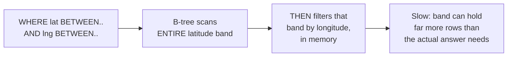

**The fix, and the first analogy for this story:** collapse the two dimensions — latitude and longitude — into **one** value that a normal single-column index can sort and prefix-match on. This is **geohashing**: interleave the bits of latitude and longitude into one string, so that points near each other in *space* end up with strings that share a long common *prefix*. Think of it like a **zip code**: instead of describing a location as two separate numbers, you give it one compact code, and everything inside the same code is roughly the same neighborhood. Search `"9q8yy%"` and you've found "roughly this part of Austin," using one ordinary string-prefix lookup.

**New problem, day one of using it:** two restaurants sit across the street from each other, right at a zip-code-style boundary. One is `9q8yyk`, the other is `9q8yys` — different prefixes, even though they're 15 meters apart. A naive "match my prefix only" search misses the second one entirely.

**How I'd say this in an interview:** "A two-column range scan can't intersect two range predicates efficiently — one dimension ends up scanning way more rows than it needs to before the other filters it down. Geohashing fixes that by folding both dimensions into one sortable string, so one ordinary index does the job — but strings that are 'close' in value aren't always close in space at a boundary, and that's the very next bug."

---

## Chapter 2 — The invisible wall down the middle of the street

The boundary bug from Chapter 1 is real and well-known: geohash prefixes are a grid, and any grid has edges. A location right on a cell's edge can share almost none of its prefix with its literal next-door neighbor, even though geographically they're inches apart. This is a documented, structural property of geohashing, not a bug BiteRadar introduced.

The obvious fix: don't search *only* the user's own cell. Search the user's cell **plus its neighboring cells** — typically the 8 cells that surround it, so a restaurant sitting right on any edge or corner still gets caught.

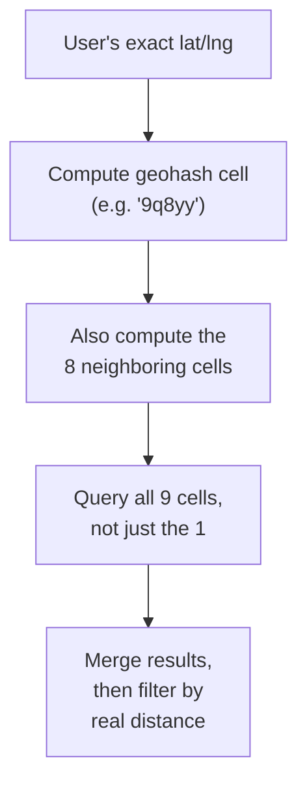

This closes the boundary bug. But it exposes a second, bigger problem the moment BiteRadar looks at cell **sizes**. A geohash of length 6 covers about **1.2 km × 0.6 km**. Drop that fixed-size cell on downtown Austin during SXSW and it might contain **3,000 restaurants and bars** in one cell — every search there scans thousands of rows before ranking even starts. Drop the exact same size cell on rural West Texas and it might contain **2 places**, if any — most of that cell's "index entry" is pure waste. The cell size is fixed by how many characters you use, and the real world's restaurant density is not remotely uniform.

The obvious next question: *can we just pick a smaller geohash precision for cities and a bigger one for rural areas, by hand?* You could, per-region, but that's manual tuning forever, region by region, as density shifts over time — new hot neighborhoods, old ones fading. What's actually needed is a structure that **adapts its own cell size automatically**, based on how crowded a spot actually is, without anyone hand-picking precision per zip code.

**How I'd say this in an interview:** "Searching 8 neighbor cells fixes the boundary problem, but a fixed cell size is still fighting the real world — density isn't uniform, so a fixed-size grid is either too coarse in cities or too wasteful in rural areas. The fix isn't a smarter fixed grid, it's a grid that resizes itself based on how many points actually land in a cell."

---

## Chapter 3 — Grid squares that don't care where people actually eat

Before reaching for anything adaptive, it's worth trying the even simpler idea directly: divide the whole map into a **fixed static grid** of physical squares — say, 10-mile-by-10-mile segments, each one just storing a list of the places inside it. No strings, no bit-interleaving, just literal squares on a map.

Worked number, doing the actual math BiteRadar would do at national scale (roughly the numbers the real Yelp-scale course problem uses): the continental US land area is about 3.8 million square miles; using ~10-mile-radius segments (~400 sq mi each) gives roughly **9,500 segments**. At 500 million places nationwide `[illustrative — BiteRadar's hypothetical scale-up target, matching the course's own Yelp-scale assumption]`, storing segment keys plus place references this way comes out to roughly **4 terabytes** just for the index mapping — because a segment covering the middle of a desert costs exactly as much index bookkeeping as a segment covering downtown Manhattan, even though one holds 2 places and the other holds 50,000.

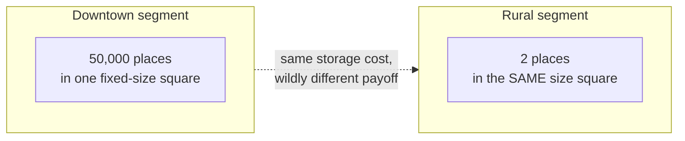

Same disease as Chapter 2's fixed geohash precision, just made concrete in raw bytes now: **a fixed-size grid pays a uniform storage and lookup cost per cell, regardless of how many points actually live there.** Dense cells are slow to scan (50,000 candidates before you've even started ranking), sparse cells waste index space and lookup keys for almost nothing.

The obvious question restated more sharply: *what if the grid could split itself only where it's actually crowded, and stay big and simple everywhere else?* That's exactly the structure the next chapter builds.

**How I'd say this in an interview:** "A static grid is the simplest thing that could possibly work, and it's worth saying out loud before jumping to anything fancier — but it pays a fixed cost per cell no matter how many points are inside it, and real-world density is wildly uneven. That mismatch is the entire reason a density-adaptive structure exists."

---

## Chapter 4 — The sticky-note wall that only grows where it's crowded

The fix: a **QuadTree**. Picture a big whiteboard divided into 4 quadrants — NW, NE, SW, SE. Each quadrant is a "leaf" holding sticky notes, one per restaurant. The rule is simple: **any leaf that collects more than 500 sticky notes automatically splits into 4 smaller quadrants**, and the notes get redistributed among the 4 new leaves. A leaf that never gets crowded just... stays one big leaf, forever, holding as few as one sticky note. Nobody decides cell size by hand — the 500-note threshold does it, uniformly, everywhere.

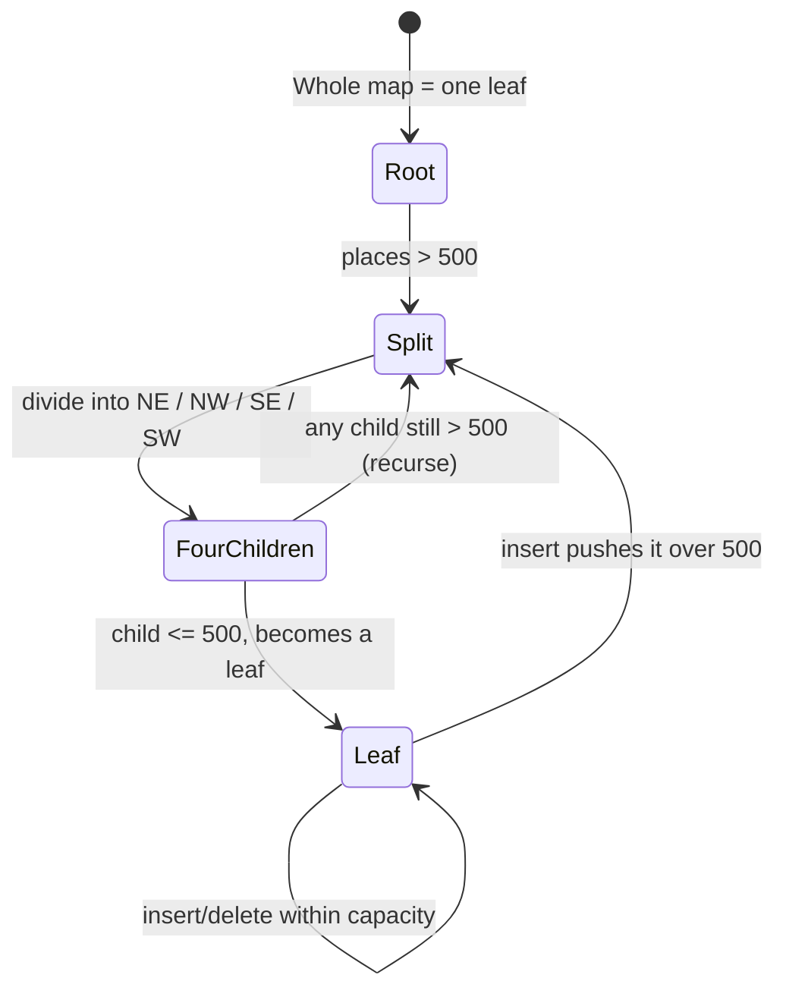

Run this rule on real density: downtown Austin during SXSW, with 3,000 bars packed into what would've been one geohash cell, recursively splits down into dozens of small leaves — maybe covering just 2 city blocks each by the time it stops. West Texas, with a handful of diners spread across hundreds of square miles, never splits at all — it stays one enormous leaf, and that's fine, because there's nothing dense enough there to need dividing. Same rule, wildly different outcomes, zero manual tuning. Storage-wise, this collapses the Chapter 3 problem hard: the same 500-million-place dataset that cost ~4 TB as a static grid fits in roughly **12 GB** as a QuadTree `[matches the reference guide's own worked estimate: ~24 bytes/place × 500M leaf entries + a small internal-node overhead]` — small enough to copy onto a single machine's memory, in full.

**New problem, the very first week BiteRadar bulk-imports a new city's entire dataset (40,000 places, all at once, into what was previously empty leaves):** the leaves along that city's footprint cross the 500-note threshold almost simultaneously, and each overflow triggers a split, which can itself immediately overflow again into a *second* split, cascading several levels deep in one burst. Doing this synchronously, mid-import, would stall every search happening in that region at that exact moment.

**How I'd say this in an interview:** "A QuadTree is a static grid that resizes itself — it recursively splits a leaf only when it actually gets crowded, so a dense downtown ends up with many small leaves and a sparse rural area stays one big leaf, with no manual per-region tuning. The trade you're accepting for that adaptiveness is rebuild cost — a big bulk import can trigger a cascade of splits, which is exactly why you schedule bulk rebuilds for off-hours instead of letting them happen inline with live traffic."

---

## Chapter 5 — Delete-then-insert, never "move"

A separate but related bug shows up when a restaurant relocates — say, a food truck that finally gets a permanent storefront three blocks away. The naive instinct is to "move" its sticky note from one leaf to another in place. But a leaf is defined by a geographic bounding box, and a place's new coordinates almost never fall inside its *old* leaf's box. There's no such thing as "moving a sticky note" here — there's only **removing it from the old leaf, and separately inserting it fresh at the new coordinates**, which means re-descending from the root all over again for the new location.

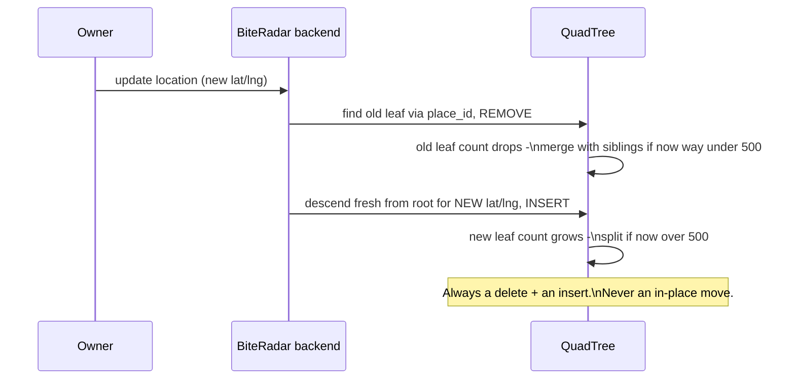

This works cleanly and matches how the real course-level design treats it. But it surfaces the same boundary question from Chapter 2, now one level deeper: what happens when a user searches from a spot where their **local leaf just doesn't have enough restaurants** to answer the question? Say someone stands right at the edge of a small leaf that only has 6 tagged "tacos" places in it, but they asked for the top 20 nearest. The leaf alone can't answer that.

**How I'd say this in an interview:** "A location update in a QuadTree is never an in-place move — it's a delete from the old leaf plus a fresh insert from the root into whatever leaf the new coordinates land in, because leaves are geographic boxes, not labels that follow a point around. That naturally raises the next question: what do you do when the leaf you land in for a *search* just doesn't have enough candidates?"

---

## Chapter 6 — Walking the sticky-note pages sideways

The fix: link every leaf to its neighbors with a **doubly linked list** — each leaf keeps a pointer to the leaf just before it and just after it in some consistent traversal order. When a search lands in a leaf that's short on candidates, instead of climbing back up to the root and re-descending somewhere else (relatively expensive), the search just **walks sideways** along the linked list to the next leaf over, and the next, until it has enough candidates or it's covered the user's whole requested radius.

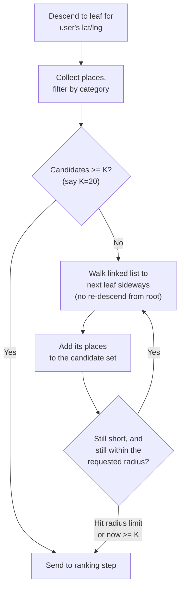

Concrete trace: Diego opens BiteRadar at 12:05pm in downtown Austin, searches "tacos" within 2 miles. He descends to a leaf covering about 4 city blocks — it has 6 taco places, below his implicit K=20. The search walks the linked list outward to the 2 adjacent leaves and now has 23 candidates. Good enough to rank.

**New problem, immediately visible in that same trace:** a leaf is a *rectangle*. The user's requested radius is a *circle*. Walking sideways collects candidates from square-shaped leaf boundaries, which means some of those 23 candidates are actually sitting in the *corner* of a neighboring leaf, more than 2 miles from Diego in a straight line — geographically outside his search radius, even though they're inside the leaves that got walked. The index gave a candidate *set*, not a correct *answer*.

**How I'd say this in an interview:** "Linking leaves sideways is what makes 'this leaf doesn't have enough results' cheap to fix — you walk outward instead of re-descending from the root. But a leaf's boundary is a rectangle and the user's search radius is a circle, so some candidates you collect this way are false positives that need to get filtered out by real distance before anyone sees them — which is exactly what the ranking step has to do next."

---

## Chapter 7 — The sieve and the judge

Diego's 23 candidates now need two very different kinds of work, and mixing them up is the single most common mistake to avoid saying out loud: **the index is a sieve, not a judge.** It shrank 500 million places down to 23 nearby-ish candidates — that's filtering, and it's approximate on purpose, because leaves are rectangles. Now a second, much smaller pass has to actually **judge** those 23: compute real straight-line distance, and rank by more than just "closest."

Real distance between two lat/lng points on a sphere uses the **haversine formula**:

```
a = sin²(Δlat/2) + cos(lat1)·cos(lat2)·sin²(Δlng/2)
c = 2·atan2(√a, √(1−a))
distance = R_earth · c        # R_earth ≈ 6,371 km
```

Run it on Diego's 23 candidates: 3 of them turn out to be genuinely more than 2 miles away in a straight line — exactly the square-leaf-vs-circle-radius mismatch from Chapter 6 — and get dropped. 20 remain.

Now score the 20 with something like `score = w1·(1/distance) + w2·rating + w3·text_relevance`. Here's the bug that shows up the first week someone actually plugs in numbers: a mediocre taco truck 0.1 miles away, rating 3.2, scores **6.06**. A genuinely great restaurant 0.6 miles away, rating 4.6, scores only **2.41** — the raw `1/distance` term blows up as distance shrinks toward zero, and it mathematically steamrolls a much better place that's only slightly farther. This is a real, commonly-probed pitfall, not a hypothetical: production systems dampen it — `1/(distance + 1)` or `-log(distance)` — instead of raw inverse distance, so a place 30 meters away doesn't automatically dominate a genuinely better one 500 meters away.

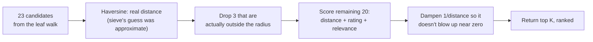

**New problem, once ranking is settled:** ranking needs a `rating` field, and that rating changes every time someone leaves a review. If BiteRadar recomputes a restaurant's average rating synchronously on every single review submission, that's now a write happening on a hot, latency-sensitive path for no good reason — ratings don't need to be accurate to the second.

**How I'd say this in an interview:** "The spatial index only ever produces a candidate set, never the final answer — real ranking always needs a second, much smaller pass with actual haversine distance plus business signals like rating. And watch the raw `1/distance` term specifically — it blows up near zero and lets a mediocre nearby place beat a genuinely better one slightly farther away, unless you dampen it."

---

## Chapter 8 — Photocopying the phonebook instead of splitting it, and doing the ratings math overnight

Two separate "keep it off the hot path" fixes land around the same time, and they rhyme with each other.

**First — where does the tree actually live?** BiteRadar's QuadTree is ~12 GB at 500M places, from Chapter 4's math. The obvious question: does something that size need to be sharded across multiple machines, the way the SQL database eventually will be? No — 12 GB fits comfortably in memory on one modern server. The fix is to **photocopy the whole tree onto every search server**, rather than splitting it up. It's like photocopying a thin local phonebook for every desk in the office instead of splitting the phonebook into volumes and making people walk to the right desk — copying is cheap when the thing being copied is small. Contrast this directly with Chapter 3's static grid, which would've cost ~4 TB for the same data — that's not a "photocopy onto every desk" size anymore, it's a "you'd need a library."

**Second — writes.** A new place, or an updated review, shouldn't have to wait for the in-memory tree to be updated before the API responds "success" to the user. The write goes to the SQL database (source of truth) and gets acknowledged immediately; the tree update happens **asynchronously**, a moment later, in the background. And the rating recompute from Chapter 7 — instead of running on every single review write — becomes a **daily batch job** that recomputes every place's aggregate rating overnight and writes it back into both the SQL table and the QuadTree's leaf metadata.


**New problem, this fix creates on purpose:** async means a brand-new restaurant, or a review that just landed, might not be reflected in search results for a few minutes — and that's a real trade-off BiteRadar has to be honest about, not an accident. It's acceptable here specifically because restaurants don't need millisecond freshness. The read side, meanwhile, is about to get a very different kind of stress: not "is the tree stale," but "what happens when everyone searches the exact same block at the exact same minute."

**How I'd say this in an interview:** "Once you know the tree's actual byte size — 12 GB here — the replicate-versus-shard decision answers itself: something that small gets photocopied onto every search server instead of split up, the same way you wouldn't bother splitting a phonebook thin enough to fit on one desk. And keeping the tree update and the rating recompute off the write's hot path, async and batched respectively, is what keeps 'add a review' fast regardless of how expensive ranking math gets downstream."

---

## Chapter 9 — The counter at the front of the store

BiteRadar adds a **cache** in front of the QuadTree lookup, keyed by a coarse geohash of the search location plus category — like keeping the most-asked-for takeout menus at the front counter instead of making every customer wait while a clerk walks to the back file room. Cache hit rate on popular areas quickly climbs past **80%**, and most searches never even touch the tree.

Then a taco festival goes viral on social media at noon on a Saturday. **Thousands of people**, within the same two minutes, search the exact same festival block for "tacos." The cache key for that block just expired seconds before the surge started. Every single one of those thousands of requests gets a cache **miss**, at the same moment, and all of them fall through to hit the QuadTree and the SQL database simultaneously — the front counter ran empty at the worst possible second, and now everyone's crowding into the back file room at once instead of one clerk fetching one answer for everybody.

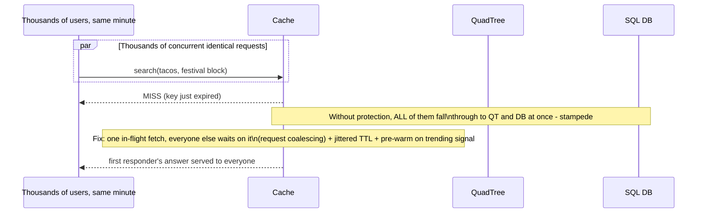

**The fix** is three habits, all standard production practice, not novel: **request coalescing** (let only the *first* of those thousand identical requests actually go fetch the answer; everyone else waits on that one in-flight fetch and gets the same result), **jittered TTL** (don't expire every cache entry at exactly the same instant — stagger it slightly so mass-expiry doesn't line up with a traffic spike), and **pre-warming** (if a place or area is visibly trending, refresh its cache entry *before* it expires, not after).

**New problem, once the read side is this well-defended:** everything so far has assumed BiteRadar's places barely move — a taco truck relocating once a year is rare enough that a monthly tree rebuild and a delete-then-insert are plenty. What if the thing being searched for wasn't a restaurant, but a moving delivery driver, updating position every few seconds?

**How I'd say this in an interview:** "Caching hot areas shaves both the tree lookup and the DB round-trip for popular spots, but a cache alone doesn't survive a sudden, simultaneous mass-miss — that's a stampede, and the standard defense is request coalescing plus jittered TTL plus pre-warming on a trending signal, not just 'add a cache and hope.'"

---

## Chapter 10 — When the pins start moving

Say BiteRadar adds a delivery-driver feature: find the 5 nearest available drivers to a hungry customer. Suddenly the "restaurants barely move" assumption that justified a monthly QuadTree rebuild is completely wrong — a driver's GPS location updates every **3-5 seconds**. Rebuilding or even incrementally re-splitting a QuadTree at that rate, for every one of thousands of drivers, all day, would mean constant split/merge churn instead of a rare, calm, monthly event.

This is documented as exactly the fork real systems make: **Uber uses H3**, its own open-sourced hexagonal geospatial index, specifically because drivers move constantly and the index needs cheap, uniform-cost re-bucketing on every ping — hexagons also have a nice property squares don't: all 6 neighbors of a hexagon are the same distance away, so "check the neighbor cells" (Chapter 2's fix) doesn't distort depending on which direction you're checking. **Google's S2** library takes a related but distinct approach — hierarchical decomposition of the whole sphere using a space-filling curve, built to avoid the distortion a naive lat/lng grid gets near the poles. For simpler cases where the volume doesn't justify a custom index tier at all, real systems just reach for **Redis's `GEOADD`/`GEOSEARCH`** (geohash plus sorted sets, done natively) or **PostGIS's `ST_DWithin`** — both genuinely production-grade, and the honest answer for "what would you use at smaller scale, before building your own index tier."

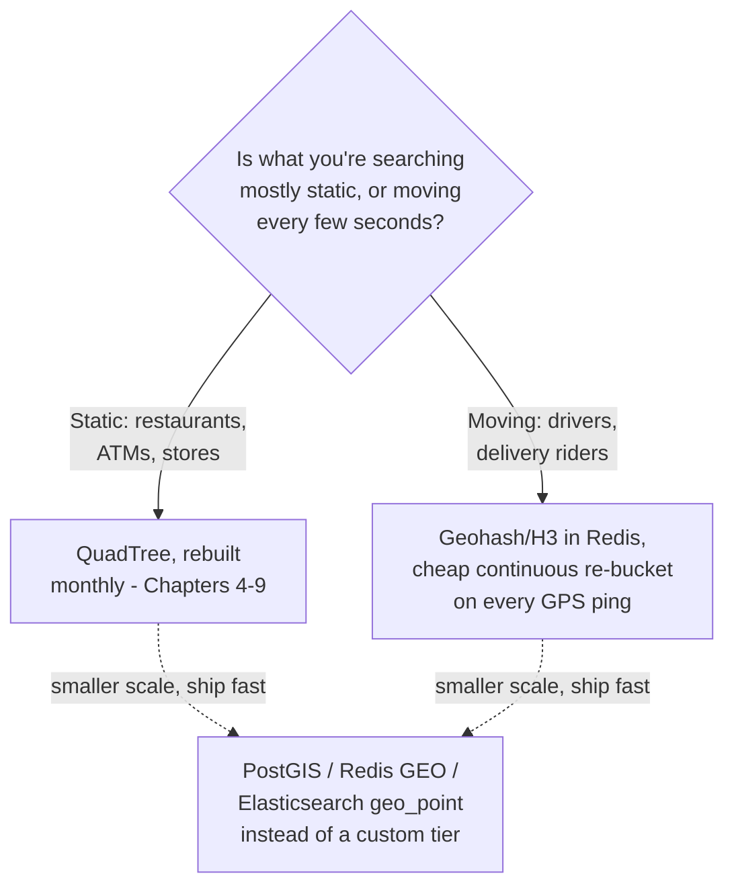

The one-liner worth having ready cold: swap the QuadTree-with-monthly-rebuild for a geohash-or-H3 index with continuous per-ping upsert, and **everything else stays** — the load balancer, the read/write server split, the cache in front of the index, the aggregator doing haversine-plus-ranking. Moving entities change the index's *refresh strategy*, not the whole architecture around it.

**How I'd say this in an interview:** "The single fact that decides your index choice is whether the thing you're indexing moves. Static data — restaurants — gets a QuadTree rebuilt on a calm schedule, like Yelp. Constantly moving data — Uber's drivers — gets a fast, cheap-to-re-bucket index like H3 or geohash-in-Redis, because rebuild cost has to stay near zero. Swap the index, keep everything else — the read/write split, the cache, the ranking pass — exactly as it was."

---

## Where the story actually lands

```mermaid
flowchart LR
    A["Ch1: SQL range scan\n(2 predicates, 1 B-tree)"] -->|"fixes: 1D sortable index\nbreaks: boundary mismatch"| B["Ch2: geohash + neighbor cells"]
    B -->|"fixes: boundary\nbreaks: fixed cell size,\nuneven density"| C["Ch3: static grid, same disease"]
    C -->|"fixes: nothing new\nconfirms: uniform cost per cell"| D["Ch4: QuadTree, splits where crowded"]
    D -->|"fixes: density\nbreaks: move = re-descend, not in-place"| E["Ch5: delete + insert"]
    E -->|"fixes: relocation\nbreaks: under-filled leaf at search time"| F["Ch6: linked leaves, walk sideways"]
    F -->|"fixes: too-few candidates\nbreaks: square leaf, circle radius"| G["Ch7: haversine + dampened ranking"]
    G -->|"fixes: false positives + score bug\nbreaks: rating on hot path"| H["Ch8: replicate tree, async write, batch rating"]
    H -->|"fixes: hot path\nbreaks: no defense against mass simultaneous miss"| I["Ch9: cache + stampede defenses"]
    I -->|"fixes: hot spots\nbreaks: assumes things barely move"| J["Ch10: geohash/H3 for moving entities"]
```

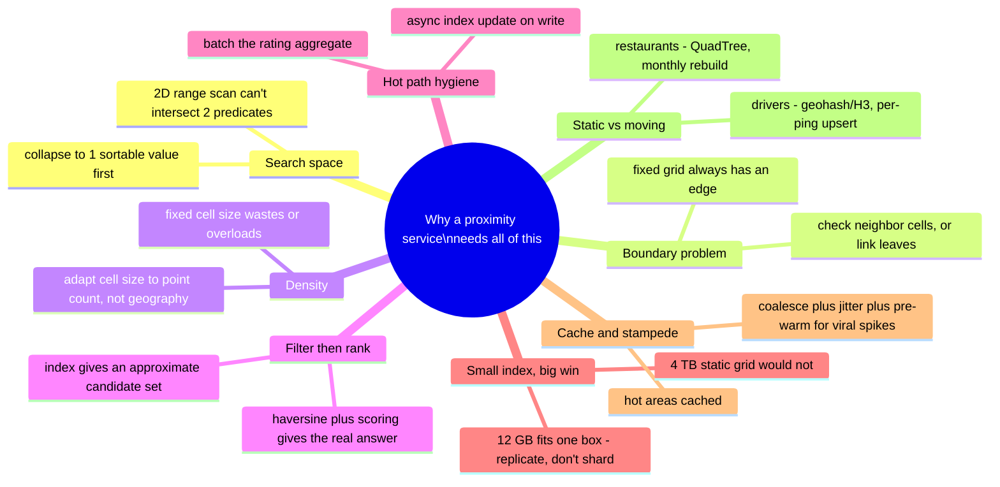

Every real proximity system you'll design in an interview sits somewhere on this chain. A "nearest ATM" feature might reasonably stop around Chapter 4 or 5. A Yelp-scale, review-heavy, viral-event-prone app has to reach Chapter 9. The moment "moving entities" comes up — Uber, food delivery, ride-hailing — Chapter 10 is the one pivot you should reach for instantly, without re-deriving the whole chain from scratch.

---

## Grill me — adversarial follow-ups

**Q1: "Why not just add a spatial index extension to Postgres and call it done — why build a custom QuadTree tier at all?"**
Honestly, at smaller scale you should — PostGIS's `ST_DWithin` with a GiST index is a real, production-grade answer, and saying so shows pragmatism. The custom in-memory tier earns its complexity only once query volume or dataset size (hundreds of millions of points, tens of thousands of QPS) genuinely outgrows what a DB-native geospatial index comfortably handles on one node.

**Q2: "Isn't checking 8 neighbor geohash cells wasteful if most of the time the answer was already in the center cell?"**
A little, yes, but it's a fixed, small, bounded cost — 9 cell lookups instead of 1 — versus the alternative, which is silently missing real results sitting just across a boundary. That trade is easy to accept because the extra 8 lookups are cheap compared to the cost of a wrong answer.

**Q3: "Why 500 as the QuadTree split threshold — why not 50, or 5,000?"**
It's a tuned trade-off, not a law of nature: too low and you get an explosion of tiny leaves with high tree-traversal overhead for very little payoff per leaf; too high and dense-city leaves stay large enough that scanning one is slow again, undoing the whole point of splitting. 100-500 points per leaf is the range real systems land in, and you'd A/B or profile to pick the exact number for your own data.

**Q4: "You said the tree is 'replicated, not sharded' because it's 12 GB — what breaks that story?"**
Growth. If the dataset were 100x bigger, or richer per-node metadata pushed the tree past what fits in one machine's memory, replication stops being viable and you'd shard the tree by macro-region instead — accepting that a search radius spanning two shards now needs an aggregator to fan out and merge results, the same pattern used for cross-shard queries generally.

**Q5: "Doesn't the async index update mean a brand-new restaurant is invisible for a while — isn't that a real user complaint?"**
Yes, and that's an accepted, explicit trade, not an oversight — new places being searchable within a few minutes rather than instantly is fine for a restaurant, because nobody expects a just-added business to show up in the same second it was created. The moment that assumption stops holding — say, an inventory system where "just added" must be visible in seconds — you'd tighten that async window or make it synchronous for that one code path specifically.

**Q6: "Walk me through what happens if the QuadTree server itself crashes."**
Because the tree is fully replicated across multiple search servers, losing one server just routes its traffic to the others — no data loss, since the tree's source of truth is really the SQL database plus a KV-store-persisted snapshot for fast rebuild. The failed server just gets a fresh copy rebuilt from that snapshot once it's back.

**Q7: "The `1/distance` ranking bug — why didn't anyone catch that in testing?"**
Because it only shows up when you actually plug in close-but-mediocre versus far-but-great real numbers side by side, which is exactly why walking through a worked ranking example out loud — not just naming the formula — is worth doing in an interview. It's a subtle-looking formula that behaves fine 95% of the time and badly exactly in the case that matters most: a slightly-farther, clearly-better option losing to a much closer, mediocre one.

**Q8: "If someone says 'design Tinder's nearby people feature' instead of Yelp, what actually changes?"**
The core architecture barely moves — same filter-then-rank recipe, same boundary problem, same cache-hot-areas idea — but privacy becomes the dominant new constraint: you deliberately fuzz the indexed person's own location, snapping it to a coarser cell and showing "0.5 mi away" instead of an exact point, trading precision for privacy on purpose. That's a one-line pivot worth naming unprompted if the interviewer shifts from businesses to people.

**Q9: "Given this whole story, if someone just says 'design a proximity search service' cold, where do you actually start?"**
Ask the one question that decides almost everything downstream: is what's being searched mostly static (places) or constantly moving (drivers, riders)? That single answer picks your whole index-refresh strategy — QuadTree with a calm rebuild schedule, or geohash/H3 with continuous per-ping upsert — and then everything else, caching, ranking, replication, follows the same shape either way.

**Q10: "What's the one sentence you'd want the interviewer to remember if they forget everything else?"**
The spatial index's only job is to shrink 500 million rows down to a small candidate set fast — it is never the final answer, and mixing up "the index found it" with "the index ranked it correctly" is the single most common mistake in this whole problem class.

---

## Pacing note

**If this is 60 seconds inside a bigger question:** say the sieve-and-judge line — a spatial index only ever narrows candidates down, real distance and ranking happen in a smaller second pass — then say "geohash or QuadTree for the index, replicated because it's small enough to fit on one box, async writes, cached hot areas, and I'd swap to H3/geohash-with-continuous-upsert if the entities start moving." That's the whole shape in one breath.

**If this is the whole 15-20 minute focus:** walk the chapters in order — why a naive range scan fails, geohash and the boundary problem, why fixed cell size fights uneven density, the QuadTree's adaptive split, relocation as delete+insert, linked leaves for under-filled searches, filter-then-rank with the dampened-distance gotcha, replicate-vs-shard once you know the byte size, async writes and batch ratings, caching and stampede defense, then the static-vs-moving pivot if it comes up. Don't walk all ten chapters unprompted — follow wherever the interviewer's questions point, and use the untouched chapters as your "if I had more time" closer.

---

## Active recall — no answers, test yourself cold

1. Why can't two single-column B-tree indexes (one on latitude, one on longitude) efficiently answer a 2D range query?
2. What exactly does a geohash prefix collapse two dimensions into, and why does that make a boundary bug almost inevitable?
3. Why does searching the point's own geohash cell plus its 8 neighbors fix the boundary bug, but not the density bug?
4. What's the actual rule that decides when a QuadTree leaf splits, and why does that rule handle a crowded city and an empty rural county differently with zero manual tuning?
5. Why is relocating a place always a delete-plus-insert, and never an in-place move?
6. What problem do doubly linked leaves solve, and what's the tell-tale sign (in a search trace) that they were needed?
7. Why can a leaf-walk's candidate set still contain false positives, even after it has "enough" candidates?
8. What's specifically wrong with a raw `1/distance` term in a ranking formula, and what's the fix?
9. Why does a 12 GB index get replicated onto every server instead of sharded, and what number would flip that decision?
10. Name the three concrete defenses against a cache stampede, and say which one helps *before* the spike even starts.
11. What's the one question that decides whether you reach for a QuadTree or for geohash/H3, and why does that one answer change so much downstream?

*Spaced repetition: test this list today, again in 2-3 days, again in a week.*

---

## Cheat sheet — one line per stop on the story

- **SQL range scan**: two single-column B-tree indexes can't jointly answer a 2D question efficiently — one dimension scans far more rows than the answer needs.
- **Geohash**: folds lat/lng into one sortable string prefix, like a zip code — but any grid has edges, so a same-street neighbor can land in a different prefix.
- **Neighbor-cell search**: check the point's cell plus its 8 neighbors, not just 1, to close the boundary gap.
- **Static grid**: simplest fix that could work, but pays the same fixed cost per cell regardless of density — 4 TB for 500M places, mostly wasted on sparse cells.
- **QuadTree**: a grid that resizes itself — splits a leaf into 4 only when it passes a threshold (e.g. 500 points), so dense areas subdivide and sparse ones don't, ending up ~12 GB for the same 500M places.
- **Delete-then-insert on relocation**: a moved point is never moved in place — it's removed from its old leaf and freshly inserted from the root at its new coordinates.
- **Doubly linked leaves**: when a leaf is short on candidates, walk sideways to neighboring leaves instead of re-descending from the root.
- **Filter then rank**: the index only ever gives an approximate candidate set (rectangle leaves vs. a circular radius) — real haversine distance plus a dampened scoring formula is the second, smaller pass that gives the real answer.
- **Replicate, don't shard**: once you know the index's real byte size (12 GB here), something that small gets copied onto every server instead of split up — shard only once it stops fitting in memory on one box.
- **Async write + batch rating**: keep the write path fast by updating the index and recomputing aggregates off the hot path — in the background, and once a day, respectively.
- **Cache + stampede defense**: cache hot areas for the common case; defend the cache with request coalescing, jittered TTL, and pre-warming for the viral-spike case.
- **Static vs. moving entities**: the single fact that decides your whole index-refresh strategy — restaurants get a QuadTree on a calm rebuild schedule; drivers get geohash/H3 with continuous per-ping upsert; everything else in the architecture stays the same either way.
- **The meta-lesson**: every fix in this story buys one property (a workable index, boundary correctness, density adaptivity, correctness-of-candidates, ranking correctness, cheap replication, hot-spot resilience, or moving-data freshness) by spending a different one — say the trade in the same sentence you propose the fix.
