# Design Uber / Ride-Sharing App — Interview Version

A P0-scoped companion document for designing a real-time ride-hailing platform (like Uber or Lyft). Built for direct interview recital: evaluating architecture against P0 requirements and explaining under-the-hood mechanics in plain, spoken English with zero hand-waving.

---

## 0. Opening the Interview

> **Interviewer:** "Design Uber / Lyft."  
> **Me:** "Uber has a huge surface area — on-demand matching, driver tracking, dynamic surge pricing, scheduled rides, carpooling, fraud detection, and driver payouts. Can we scope the core architecture to the **P0 on-demand ride lifecycle** first? Concretely:
> 1. Ingesting high-frequency driver locations in real time.
> 2. Estimating upfront fares and pickup ETAs.
> 3. Matching a rider with the nearest available driver without double booking.
> 4. Managing the live trip state machine.
> 5. Settling payments accurately and asynchronously.  
> 
> Once that core foundation is solid, I can extend it to surge heatmaps, ML-based ETA corrections, and stadium hotspot handling if time permits."

### Clarifying Questions & Assumed Answers (Fixed Up Front)

| # | Clarifying Question | Answer We Will Design Against |
|---|---|---|
| 1 | **Ride Types & Scheduling** | **On-demand point-to-point rides only.** No scheduled rides or carpooling in the core P0 ladder. |
| 2 | **Driver Location Frequency** | Every active driver streams GPS coordinates **once every 4 seconds**. |
| 3 | **Assignment Consistency** | **Strictly exactly-one driver per ride.** Race conditions must never allow two riders to simultaneously book the same driver. |
| 4 | **Geographic Scope** | **Global service with regional isolation.** Rider-driver matching is strictly local to a city/metro region. |
| 5 | **Routing & Maps** | Use a dedicated **routing engine API** (e.g., self-hosted OSRM with Contraction Hierarchies) for driving distance and ETA. |
| 6 | **Payment Settlement** | Payment capture happens **after trip completion** asynchronously; it must never block the rider from exiting the vehicle. |

---

## 1. Requirements

### Functional Requirements

| Priority | Feature |
|---|---|
| **P0** | **Fare & ETA Estimation:** Rider enters pickup and drop-off points and gets upfront fare options and estimated pickup wait time. |
| **P0** | **Driver Location Ingestion:** Drivers toggle online/offline and send real-time GPS coordinates every 4 seconds while online. |
| **P0** | **Ride Matching & Dispatch:** System identifies nearby candidate drivers, ranks them by driving ETA, and sends sequential offers until one accepts. |
| **P0** | **Live Trip Lifecycle:** Rider and driver track the trip through explicit phases (Assigned → Arriving → In-Progress → Completed). |
| **P0** | **Async Payment & Settlement:** System captures the fare from the rider and credits the driver's ledger upon trip completion. |
| **P1** | Dynamic Surge Pricing (Supply/Demand Heatmaps). |
| **P1** | DeepETA ML Residual Travel-Time Correction. |
| **P1** | Hotspot Shard Mitigation for Stadium / Concert Events. |
| **P1** | Telemetry Sanity Checks (GPS Velocity Spoofing Detection). |

### Non-Functional Requirements

| NFR | Concrete Meaning in this Design |
|---|---|
| **Low Latency Matching** | P95 ride dispatch notification must reach the driver's phone in **under 1 second** from the rider tapping "Confirm". |
| **High Write Throughput** | Must ingest **250,000 location updates/second** sustained (500,000 peak) without database locking or latency degradation. |
| **Strict Single-Assignment Consistency** | A driver can only accept **one active ride at a time**. Two concurrent matching threads must never double-book the same driver. |
| **High Availability & Fault Isolation** | A hardware crash or traffic surge in one city (e.g., Bangalore) must have **zero blast radius** on another city (e.g., London). |
| **Financial Durability** | Payment records and ledger entries must have **ACID guarantees** and support safe retries via idempotency keys. |

---

## 2. Capacity Estimation & Formulas

### Traffic Estimation

* **Daily Active Users (DAU):** 5,000,000 riders, 1,000,000 active drivers.
* **Daily Completed Trips:** 10,000,000 trips/day.
* **Average Trip Request Rate:**
  $$\text{RPS}_{\text{avg}} = \frac{10,000,000 \text{ trips}}{86,400 \text{ seconds}} \approx 116 \text{ requests/sec}$$
* **Peak Trip Request Rate:** Applying a $10\times$ peak rush-hour multiplier:
  $$\text{RPS}_{\text{peak}} \approx 1,200 \text{ requests/sec}$$
* **Driver Location Ingestion Rate:**
  $$\text{Location Writes/sec} = \frac{1,000,000 \text{ active drivers}}{4 \text{ seconds}} = 250,000 \text{ updates/sec sustained}$$
  $$\text{Peak Location Ingest} = 2 \times 250,000 = 500,000 \text{ updates/sec}$$

### Storage Estimation

* **Ephemeral Driver Location (In-Memory RAM):**
  Each location record contains `driver_id` (UUID: 16 bytes), `lat` (8 bytes), `lng` (8 bytes), `status` (1 byte), `timestamp` (8 bytes), plus indexing overhead $\approx 100 \text{ bytes}$.
  $$\text{Total Resident RAM} = 1,000,000 \times 100 \text{ bytes} = 100 \text{ MB}$$
  The entire active global fleet fits resident in RAM on a single modest box.
* **Durable Trip Records (Disk Storage):**
  Each trip record (rider, driver, route polyline summary, timestamps, fare breakdown) $\approx 1 \text{ KB}$.
  $$\text{Daily Storage Growth} = 10,000,000 \times 1 \text{ KB} = 10 \text{ GB/day}$$
  $$\text{Annual Storage Growth} = 10 \text{ GB} \times 365 \approx 3.65 \text{ TB/year}$$
* **Network Ingestion Bandwidth:**
  $$\text{Ingestion Bandwidth} = 250,000 \text{ updates/sec} \times 100 \text{ bytes} = 25 \text{ MB/sec sustained}$$

---

## 3. Core API Design

```http
POST /api/v1/rides/estimate
```
Calculates route distance, estimated travel time, and upfront fare options.
* **Request:**
  ```json
  {
    "rider_id": "usr_101",
    "pickup": { "lat": 12.9352, "lng": 77.6245 },
    "dropoff": { "lat": 12.9716, "lng": 77.5946 }
  }
  ```
* **Response (200 OK):**
  ```json
  {
    "quote_id": "qte_999",
    "expires_at": 1700000300,
    "options": [
      { "tier": "CAB_STANDARD", "fare_cents": 1450, "eta_minutes": 4 },
      { "tier": "BIKE", "fare_cents": 450, "eta_minutes": 2 }
    ]
  }
  ```

```http
POST /api/v1/rides/request
```
Confirms quote and enqueues a matching job.
* **Request:**
  ```json
  {
    "request_id": "req_uuid_888",
    "quote_id": "qte_999",
    "rider_id": "usr_101",
    "tier": "CAB_STANDARD"
  }
  ```
* **Response (202 Accepted):**
  ```json
  {
    "ride_id": "ride_555",
    "status": "SEARCHING_FOR_DRIVER",
    "created_at": 1700000010
  }
  ```

```http
GET /api/v1/rides/{ride_id}/status
```
Polling fallback for checking match status.
* **Response (200 OK):**
  ```json
  {
    "ride_id": "ride_555",
    "status": "DRIVER_ASSIGNED",
    "driver": {
      "id": "drv_777",
      "name": "Vikram",
      "vehicle_plate": "KA-01-AB-1234",
      "current_location": { "lat": 12.9360, "lng": 77.6250 }
    }
  }
  ```

```http
WS /ws/v1/connect?token={auth_token}&user_type={DRIVER|RIDER}
```
Bidirectional WebSocket stream for driver location streaming, ride dispatch offers, and live trip tracking.

```http
POST /api/v1/drivers/offers/{offer_id}/respond
```
Driver accept/reject response.
* **Request:**
  ```json
  {
    "driver_id": "drv_777",
    "action": "ACCEPT"
  }
  ```
* **Response (200 OK):**
  ```json
  {
    "ride_id": "ride_555",
    "status": "ASSIGNMENT_CONFIRMED"
  }
  ```

---

## 4. The Architecture Evolution Ladder

The architecture evolves across 4 logical threads:
1. **Driver Location & Geospatial Ingestion (v1 → v4)**: Solving the 250k writes/sec firehose.
2. **Ride Matching & Concurrency Control (v5 → v7)**: Picking the best driver without double booking.
3. **Real-Time Bidirectional Communication (v8 → v9)**: Connecting riders and drivers over WebSockets.
4. **Trip Lifecycle & Durable Settlement (v10)**: Managing the live trip state machine and money.

---

### Thread 1: Driver Location & Geospatial Ingestion

#### v1 — The Naive Relational Storage

##### The Narrative & How I'd Say This Out Loud
> *"I'll start with the simplest possible approach on purpose: every driver's phone sends an HTTP POST with their latitude and longitude every 4 seconds. The backend server writes this directly to a SQL table `driver_locations`. When a rider requests a ride, we run a query to find all available drivers within a bounding box, calculate the distance in code, and pick the closest one.*
> 
> *Here is why this fails immediately: we have 1 million active drivers reporting every 4 seconds. That is 250,000 database writes every single second. A standard SQL database writes every update to a Write-Ahead Log (WAL), flushes to disk, and updates table indexes. At 250,000 writes a second, the disk I/O and page locks choke the database. On top of that, latitude and longitude are two separate columns. A normal B-tree index on latitude does not help you filter longitude efficiently, so spatial queries end up scanning thousands of irrelevant rows."*

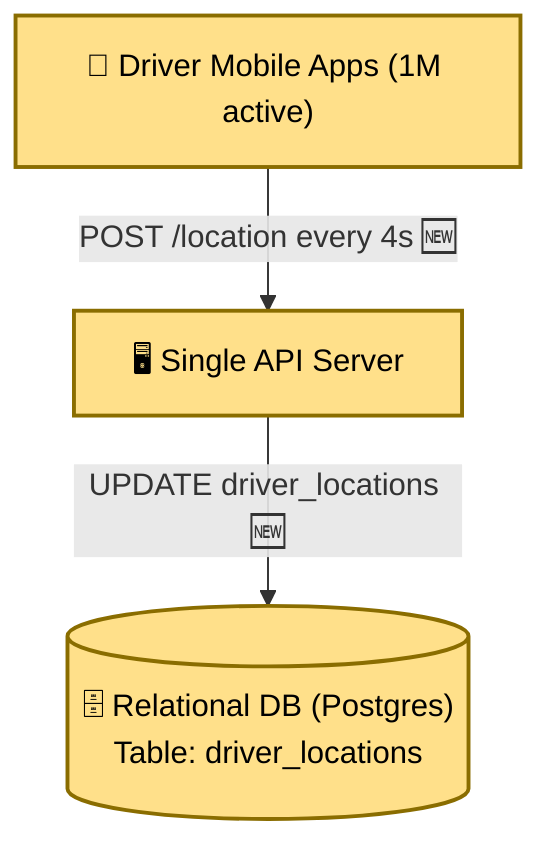

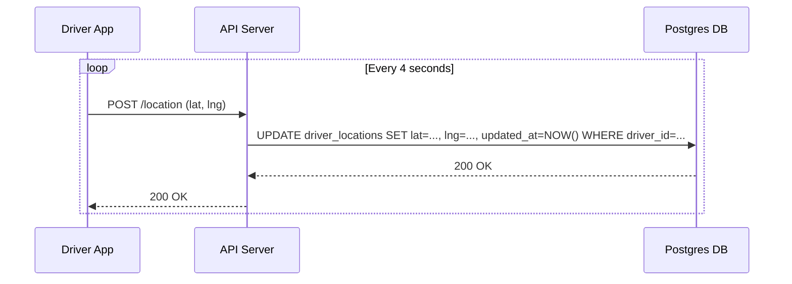

##### Schema Delta (v1)
```sql
CREATE TABLE driver_locations (
    driver_id VARCHAR(36) PRIMARY KEY,
    status VARCHAR(16) NOT NULL, -- 'ONLINE', 'OFFLINE', 'ON_TRIP'
    lat DOUBLE PRECISION NOT NULL,
    lng DOUBLE PRECISION NOT NULL,
    updated_at TIMESTAMP WITH TIME ZONE NOT NULL
);
```

##### Under the Hood: The 2D Bounding-Box Problem
To find drivers near a rider at `(12.9352, 77.6245)`, the server must query a rectangular box:
```sql
SELECT driver_id, lat, lng FROM driver_locations 
WHERE status = 'ONLINE'
  AND lat BETWEEN 12.9052 AND 12.9652 
  AND lng BETWEEN 77.5945 AND 77.6545;
```
Even with compound indexes `(lat, lng)`, a B-tree can only narrow down one dimension first (e.g. `lat`), returning a massive slice of rows, and then linearly filter `lng`. Then the application layer must compute the Haversine distance formula for every candidate to find who is actually inside the circular 3 km radius.

##### Tradeoff & Explicit Drawback
* **Tradeoff:** Simplest possible starting design.
* **Drawback:** Relational disk writes cannot handle 250,000 updates/sec. Write-Ahead Logging (WAL) and row lock contention crash the database.

---

#### v2 — Ephemeral In-Memory Store with Geospatial Indexing

##### The Narrative & How I'd Say This Out Loud
> *"Location data is fundamentally ephemeral. A driver's location from 4 seconds ago is completely useless once a new update arrives. We don't need ACID transactions or disk persistence for this data. So, I will move live location tracking entirely out of SQL and into an in-memory store like Redis.*
> 
> *To solve the 2D search problem, we convert latitude and longitude into a 1D spatial index using Geohashing. Latitude and longitude bits are interleaved into a single string or integer. In Redis, we use `GEOADD` and `GEOSEARCH`. `GEOADD` stores the driver inside a sorted set where the score is a 52-bit Geohash integer. Finding nearby drivers becomes a fast range query across a 1D curve in RAM, taking under a millisecond.*
> 
> *I'll also mention a key limitation: rectangular Geohashes have boundary edge discontinuities and corner distortion where diagonal neighbors are $1.414\times$ farther away. Uber's real production system uses **H3 (a hexagonal grid system)** because hexagons have 6 equidistant neighbors with zero corner ambiguity."*

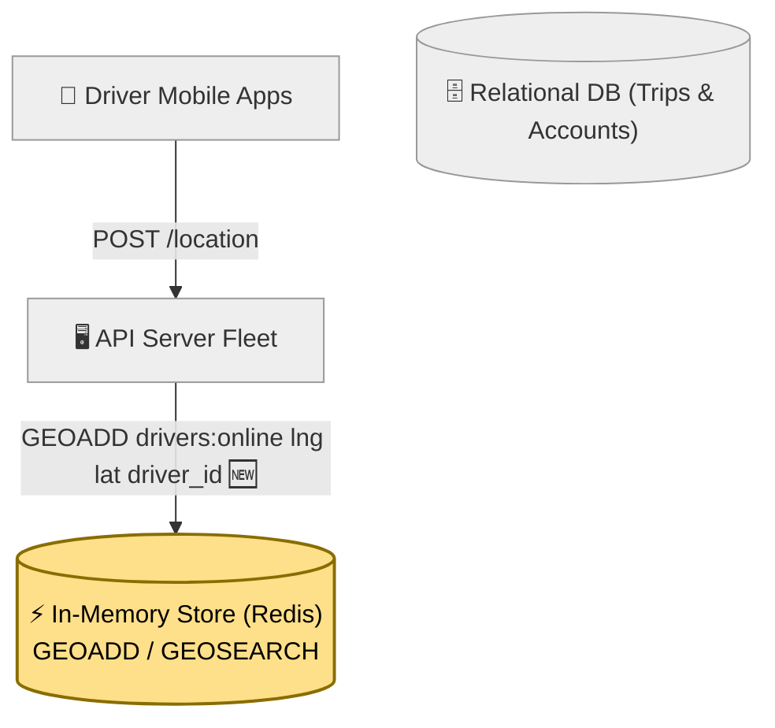

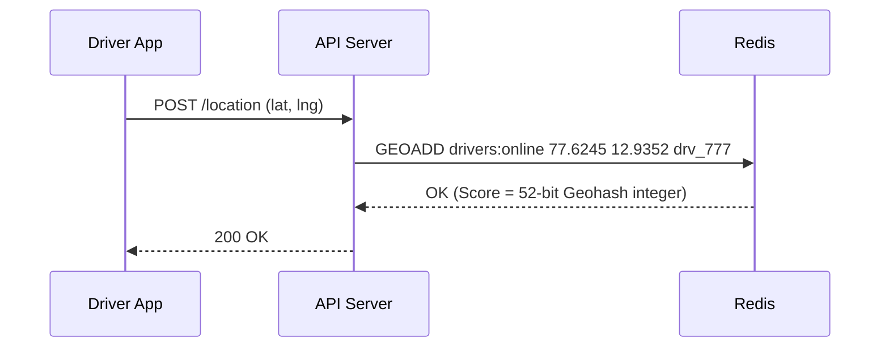

##### Schema Delta (v2)
* Relational DB: Drop `driver_locations`. Relational DB now stores only durable entities (`users`, `vehicles`, `rides`).
* Redis Data Structure: Sorted Set (`ZSET`) keyed as `drivers:online`.
  * Score: 52-bit integer encoding interleaved latitude/longitude bits.
  * Member: `driver_id` string.

##### Under the Hood: Geohashing Mechanics
1. **Bit Interleaving:** If latitude is `12.9352` (binary `1010...`) and longitude is `77.6245` (binary `1101...`), interleaving produces `11001101...`. Nearby physical locations share identical prefix bits.
2. **Redis Execution:** `GEOSEARCH drivers:online FROMLONLAT 77.6245 12.9352 BYRADIUS 3 km` computes the target Geohash box, looks up the bounding scores in the Sorted Set in $O(\log N + M)$ time, and filters candidates in memory in single-digit milliseconds.

##### Tradeoff & Explicit Drawback
* **Tradeoff:** RAM writes eliminate disk I/O bottlenecks. Spatial search runs in sub-millisecond time.
* **Drawback:** A single Redis instance runs on a single event-loop thread and caps out around $\approx 100,000 \text{ ops/sec}$. It cannot handle 250,000 writes/sec plus incoming search queries.

---

#### v3 — Geographic Sharding via Redis Cluster Hashslots

##### The Narrative & How I'd Say This Out Loud
> *"One Redis server cannot handle 250,000 writes per second. We need to shard data across a Redis Cluster.*
> 
> *Now, here is a dangerous trap: if I shard by `driver_id`, drivers sitting in Bangalore get scattered across all 16,384 hashslots and across every node in the cluster. When a rider in Bangalore asks for nearby drivers, our backend would have to scatter-gather query every single node in the cluster and merge the results. That completely defeats the purpose of sharding.*
> 
> *The fix is to **shard by geography, not by driver ID**. We use Redis hash tags `{city_id}` in the key name, like `drivers:{blr}` and `drivers:{hyd}`. All drivers in Bangalore map to the same Redis node. When a rider in Bangalore requests a ride, the query hits exactly one Redis node. Zero cross-node network hops, zero scatter-gather."*

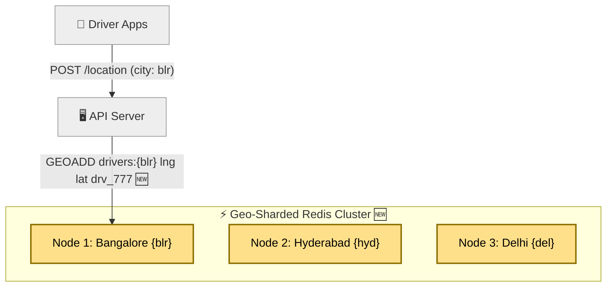

##### Schema Delta (v3)
* Redis Cluster Keys use curly braces `{...}` for hashslot routing:
  * Key: `drivers:{city_id}` (e.g. `drivers:{blr}`)
  * Redis computes `CRC16("blr") % 16384` to deterministically assign all Bangalore drivers to Node 1.

##### Under the Hood: City Border Crossings
* When a driver moves between cities (e.g. Hyderabad to Bangalore), their mobile app transmits the new `city_id` derived from GPS coordinates.
* The ingestion server deletes the driver from `drivers:{hyd}` and writes to `drivers:{blr}`. Because city crossings are rare compared to 4-second within-city updates, the migration overhead is near zero.

##### Tradeoff & Explicit Drawback
* **Tradeoff:** Queries are strictly isolated to single nodes without cross-server scatter-gather overhead.
* **Drawback:** If the single master Redis node for Bangalore crashes, the entire city experiences an immediate, total location blackout.

---

#### v4 — Asynchronous Replica Failover & Ephemeral Heartbeat TTL

##### The Narrative & How I'd Say This Out Loud
> *"If Node 1 dies, Bangalore is completely down. To make this production-ready, we give each primary Redis shard 1 or 2 read replicas using asynchronous replication.*
> 
> *I want to be very clear about the durability trade-off here: replication is intentionally **asynchronous**. The primary does not wait for replicas to ACK before responding to the driver. If the primary crashes, we might lose 10 milliseconds of location writes. That is completely fine to accept out loud in an interview: a driver will send their new location 4 seconds later anyway.*
> 
> *In addition, what happens if a driver's phone battery dies or loses signal in a tunnel? They never send a disconnect message. So, we set a 15-second TTL on a driver heartbeat key `driver:{blr}:{id}:heartbeat`. If no update arrives in 15 seconds, the key expires automatically. The matching engine filters out expired drivers without needing a slow background cleanup job."*

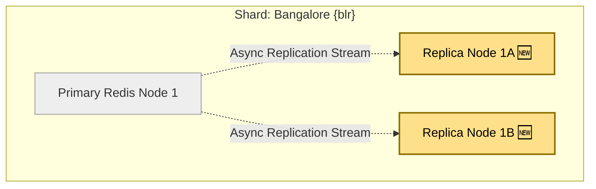

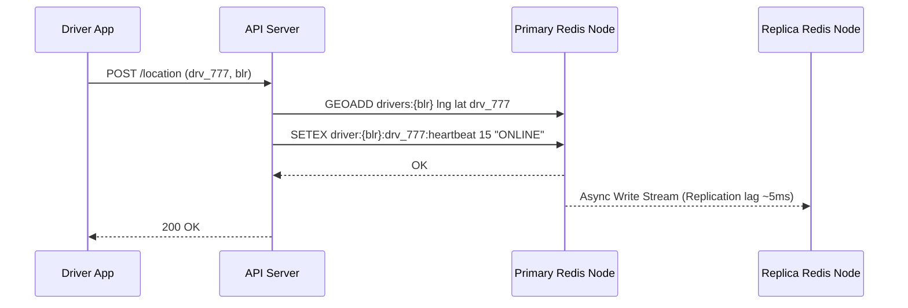

##### Schema Delta (v4)
* Redis Key: `driver:{city_id}:{driver_id}:heartbeat`
  * Type: String
  * Value: `"ONLINE"`
  * Expiration: 15 seconds (`EX 15`)

##### Under the Hood: Gossip & Failover
* **Cluster Bus Gossip:** Redis Cluster nodes ping each other continuously over a dedicated gossip port. If a majority of primary nodes agree that Node 1 is unresponsive for longer than `cluster-node-timeout` (e.g. 3,000 ms), Replica 1A initiates an election and promotes itself to primary.
* **Client Redirection:** The Redis client library receives a `MOVED` or `CLUSTERDOWN` signal during failover and updates its internal routing table to direct traffic to the newly promoted primary within 3–5 seconds.

##### Tradeoff & Explicit Drawback
* **Tradeoff:** High availability with automated failover and dead-driver self-eviction.
* **Drawback:** Location storage is solved, but we haven't built the ride matching and dispatch engine yet.

---

### Thread 2: Ride Matching & Concurrency Control

#### v5 — Candidate Discovery & Two-Tier Routing Ranking

##### The Narrative & How I'd Say This Out Loud
> *"Now let's match a rider with a driver. A rider in Koramangala, Bangalore requests a ride.
> 
> Here's the first matching trap: straight-line distance is not drive time. Driver A might be 500 meters away in a straight line, but there is a lake or an unbridged river between them, taking 20 minutes to drive around. Driver B is 1.5 km away on a direct main road and arrives in 3 minutes.
> 
> So, we use a **two-tier ranking strategy**:
> 1. Step 1: Query the Bangalore Redis node using `GEOSEARCH` to get the closest ~30 drivers by straight-line distance.
> 2. Step 2: Take only the **top 10 candidates** and send their coordinates to a dedicated **Routing Engine API (like self-hosted OSRM)** to get real road network driving ETAs.
> 3. Step 3: Re-rank by combining Driving ETA and Driver Rating:
>    $$\text{Score} = (\text{ETA in minutes} \times 0.7) + ((5.0 - \text{Rating}) \times 0.3)$$
> 
> Limiting the routing API call to only 10 candidates keeps our external routing latency bounded under 20 milliseconds."*

```mermaid
flowchart TD
    classDef existing fill:#eee,stroke:#999,color:#333
    classDef new fill:#ffe08a,stroke:#8a6d00,stroke-width:2px,color:#000
    
    RiderApp["📱 Rider App"]:::new
    MatchService["⚙️ Ride Matching Service"]:::new
    RedisCluster[("⚡ Redis Cluster {blr}")]:::existing
    RoutingEngine["🗺️ Routing Engine API (OSRM)"]:::new
    
    RiderApp -->|"POST /rides/request 🆕"| MatchService
    MatchService -->|"1. GEOSEARCH (Radius 3km) 🆕"| RedisCluster
    RedisCluster -->>|"Returns ~30 candidate IDs"| MatchService
    MatchService -->|"2. Compute Drive-Time ETA (Top 10 only) 🆕"| RoutingEngine
    RoutingEngine -->>|"Returns Real Driving ETAs"| MatchService
    MatchService -->|"3. Select Best Ranked Driver 🆕"| RiderApp
```

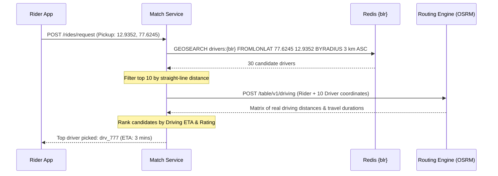

##### Schema Delta (v5)
* Stateless in-memory candidate ranking inside the Matching Service.

##### Under the Hood: Contraction Hierarchies
* Running Dijkstra's algorithm on a raw graph of millions of road intersections takes seconds.
* Production routing engines (OSRM / Valhalla) use **Contraction Hierarchies**. Road networks are pre-processed offline by adding shortcut edges across major highways. At runtime, bidirectional search across pre-computed shortcuts computes the driving matrix in under 5 milliseconds.

##### Tradeoff & Explicit Drawback
* **Tradeoff:** Accurate driving ETA ranking without overwhelming routing servers.
* **Drawback:** Under concurrent load, multiple matching workers will pick the exact same top-ranked driver for two different riders simultaneously.

---

#### v6 — Distributed Locking with Atomic Compare-and-Set (`SET NX EX`)

##### The Narrative & How I'd Say This Out Loud
> *"Now we hit the most critical correctness problem in ride sharing: **the double-booking race condition**.
> 
> Imagine Rider 1 and Rider 2 request a ride in the same neighborhood at the exact same millisecond. Worker 1 and Worker 2 both find Driver D777 as the best match. If both workers send dispatch offers to D777, the driver's phone shows two rides, and both riders think they got their driver.
> 
> To prevent this, before sending an offer to a driver, the matching worker must acquire an **atomic distributed lock** in Redis:
> ```
> SET lock:driver:drv_777 req_101 NX EX 15
> ```
> * `NX` ensures the key is set ONLY if it does not already exist (atomic compare-and-set).
> * `EX 15` sets a 15-second TTL.
> 
> If Worker 1 gets `OK`, it dispatches the offer to D777. Worker 2 gets `NIL` (failed), immediately skips D777, and moves to its second-ranked candidate D888. Double-booking is mathematically impossible.
> 
> If D777 rejects the ride, Worker 1 immediately deletes the lock key so D777 is available for other riders without waiting for the 15-second TTL."*

```mermaid
flowchart TD
    classDef existing fill:#eee,stroke:#999,color:#333
    classDef new fill:#ffe08a,stroke:#8a6d00,stroke-width:2px,color:#000
    
    WorkerA["⚙️ Matching Worker A (Rider 101)"]:::existing
    WorkerB["⚙️ Matching Worker B (Rider 102)"]:::existing
    RedisLock[("⚡ Redis Instance {blr}<br/>Key: lock:driver:drv_777")]:::new
    
    WorkerA -->|"1. SET lock:driver:drv_777 req_101 NX EX 15 🆕"| RedisLock
    WorkerB -->|"1. SET lock:driver:drv_777 req_102 NX EX 15 🆕"| RedisLock
    
    RedisLock -->>|"✅ Returns OK (Locked)"| WorkerA
    RedisLock -->>|"❌ Returns NIL (Failed)"| WorkerB
    
    WorkerA -->|"Dispatch offer to drv_777"| WorkerA
    WorkerB -->|"Pick 2nd ranked candidate (drv_888)"| WorkerB
```

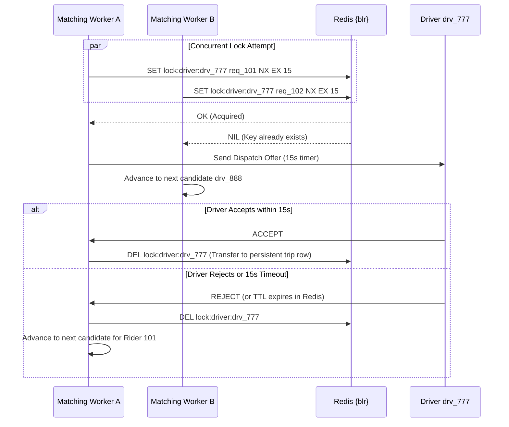

##### Schema Delta (v6)
* Redis Lock Key: `lock:driver:{driver_id}`
  * Value: `request_id`
  * Flags: `NX` (Set if Not Exists), `EX 15` (Expires in 15 seconds).

##### Under the Hood: Deadlock Protection
* If Matching Worker A crashes midway through sending the offer, the 15-second TTL automatically expires. Driver D777 is automatically released back to the general pool without leaving a dangling lock.

##### Tradeoff & Explicit Drawback
* **Tradeoff:** Guaranteed single-driver assignment without slow relational table locks.
* **Drawback:** The HTTP client connection currently sits open synchronously while the server waits up to 15 seconds for a driver to accept. Mobile connections drop easily when held open.

---

#### v7 — Asynchronous Request Queueing with Request-ID Idempotency

##### The Narrative & How I'd Say This Out Loud
> *"Holding a synchronous HTTP connection open for 15 seconds on a mobile phone is a recipe for broken requests. A flaky cell tower drop leaves the rider seeing a spinner while a ride might have been booked on the server.
> 
> We decouple ride requests by making them **asynchronous**.
> When the rider taps 'Confirm', the API Gateway generates a ride record in status `PENDING`, publishes a `RideRequestedEvent` to **Apache Kafka**, and immediately returns `202 Accepted` with a `ride_id`.
> 
> A fleet of Matching Workers pulls jobs off Kafka and executes the matching logic.
> 
> To handle flaky network retries, the mobile app sends a client-generated UUID `request_id`. If the mobile app loses connection and retries the exact same request, the database `UNIQUE(request_id)` constraint catches the duplicate and returns the existing `ride_id` without enqueuing a duplicate ride."*

```mermaid
flowchart TD
    classDef existing fill:#eee,stroke:#999,color:#333
    classDef new fill:#ffe08a,stroke:#8a6d00,stroke-width:2px,color:#000
    
    RiderApp["📱 Rider App"]:::existing
    APIServer["🖥️ API Gateway"]:::existing
    KafkaReq["📨 Queue: ride-requests (Kafka) 🆕"]:::new
    MatchingWorkerFleet["⚙️ Matching Worker Fleet 🆕"]:::new
    PostgresDB[("🗄️ Durable Database (Postgres)")]:::existing
    
    RiderApp -->|"POST /rides/request (request_id: uuid) 🆕"| APIServer
    APIServer -->|"1. Validate & Store PENDING"| PostgresDB
    APIServer -->|"2. Produce RideRequestedEvent 🆕"| KafkaReq
    APIServer -->>|"3. 202 Accepted (ride_id: 555) 🆕"| RiderApp
    KafkaReq -->|"4. Consume matching job"| MatchingWorkerFleet
```

##### Queue & Topic Details (v7)
* **Topic Name:** `ride-requests`
* **Producer:** API Gateway
* **Consumer Group:** `matching-workers-group`
* **Partition Key (Broker Level):** `city_id` (ensures ordered per-city processing without cross-city partition contention).
* **Delivery Semantics:** At-least-once.
* **Idempotency Guarantee:** Deduplicated by unique `request_id` (UUIDv4) in the durable database.

##### Schema Delta (v7)
```sql
CREATE TABLE rides (
    ride_id VARCHAR(36) PRIMARY KEY,
    request_id VARCHAR(36) UNIQUE NOT NULL, -- Idempotency token
    rider_id VARCHAR(36) NOT NULL,
    driver_id VARCHAR(36), -- NULL until matched
    status VARCHAR(32) NOT NULL, -- 'PENDING', 'MATCHING', 'ACCEPTED', 'IN_PROGRESS', 'COMPLETED', 'CANCELLED'
    pickup_lat DOUBLE PRECISION NOT NULL,
    pickup_lng DOUBLE PRECISION NOT NULL,
    dropoff_lat DOUBLE PRECISION NOT NULL,
    dropoff_lng DOUBLE PRECISION NOT NULL,
    fare_cents INT NOT NULL,
    created_at TIMESTAMP WITH TIME ZONE NOT NULL,
    updated_at TIMESTAMP WITH TIME ZONE NOT NULL
);
CREATE INDEX idx_rides_rider_created ON rides(rider_id, created_at DESC);
```

##### Tradeoff & Explicit Drawback
* **Tradeoff:** Request ingestion is buffered and resilient against sudden traffic spikes.
* **Drawback:** The rider must repeatedly poll `GET /rides/{id}/status` over HTTP to know when a driver is matched. Polling drains mobile batteries and wastes server CPU.

---

### Thread 3: Real-Time Bidirectional Communication Layer

#### v8 — Dedicated WebSocket Gateway Fleet & Distributed Connection Registry

##### The Narrative & How I'd Say This Out Loud
> *"Polling over HTTP is wasteful. We need a real-time push mechanism. But our matching workers are stateless compute nodes — they cannot hold millions of open TCP connections.
> 
> So, we introduce a dedicated **WebSocket Gateway Fleet** and a **Redis Connection Registry**.
> 1. When Driver D777 opens the app, they connect via WebSocket to **Gateway Server B**. Server B records in Redis: `conn:driver:drv_777 = "Gateway-B"`.
> 2. When Rider R101 opens the app, they connect via WebSocket to **Gateway Server A**. Server A records: `conn:rider:usr_101 = "Gateway-A"`.
> 3. When a matching worker wants to dispatch an offer to D777, it looks up `conn:driver:drv_777` in Redis, sees `"Gateway-B"`, and publishes the offer to a Redis Pub/Sub channel scoped specifically to `ws:server:Gateway-B`.
> 4. Gateway Server B receives the message and pushes it down the open socket to D777's phone.
> 
> Notice that servers never talk to each other directly. Everything routes through the registry and pub/sub channels, allowing the gateway fleet to scale horizontally to millions of concurrent open sockets."*

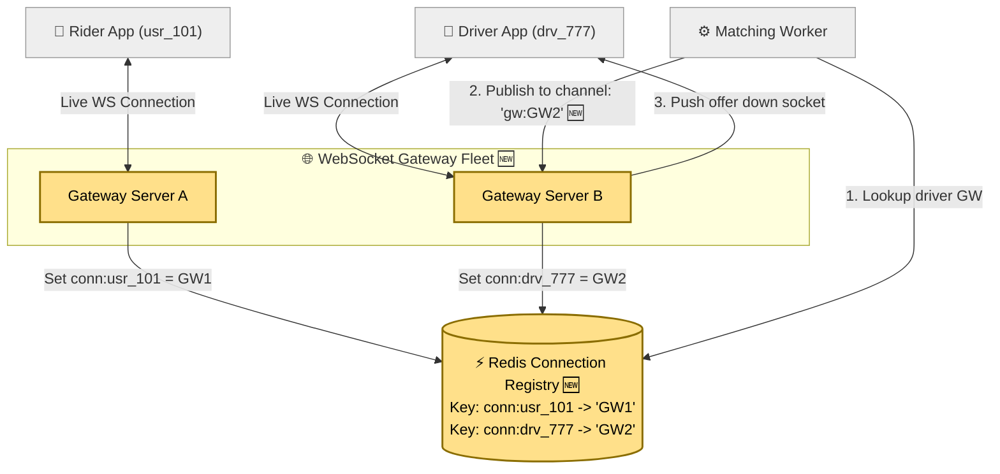

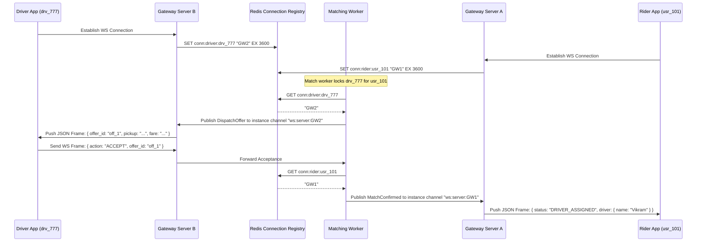

##### Schema Delta (v8)
* Redis Connection Registry:
  * Key: `conn:user:{user_id}`
  * Value: `gateway_instance_id` (e.g. `"gw-node-04"`)
  * Expiration: 60 seconds (refreshed by WebSocket ping/pong heartbeats).

##### Under the Hood: Battery-Saving Push Notification Fallback
* Mobile operating systems (iOS/Android) suspend background apps to preserve battery life. If `conn:driver:drv_777` is missing because the socket was killed by the OS, the system immediately fires an Apple Push Notification (APNs) or Firebase Cloud Message (FCM). The push notification wakes the app in the background, which reconnects and receives the dispatch offer.

##### Tradeoff & Explicit Drawback
* **Tradeoff:** Sub-100ms bidirectional message delivery with zero polling.
* **Drawback:** Drivers now stream their 4-second location updates over this same WebSocket connection. If Gateway servers write directly to Redis, the Gateway becomes tightly coupled to Redis cluster topology and blocks during Redis hiccups.

---

#### v9 — Queue-Decoupled Location Ingestion Pipeline

##### The Narrative & How I'd Say This Out Loud
> *"Should the WebSocket Gateway write driver locations directly into Redis?
> 
> In early versions, direct writing was fine. But at production scale, writing directly to Redis creates three major problems:
> 1. The Gateway server would need to understand the Redis Cluster sharding topology and manage connections across the entire cluster.
> 2. If a Redis node has a brief failover hiccup, direct writes block the Gateway or force us to build complex retry buffers inside the Gateway.
> 3. Other downstream services need this location stream — like Surge Pricing heatmaps, ETA training models, and GPS fraud detection. If the Gateway writes directly to Redis, we would have to add more direct writes for every new consumer.
> 
> The fix is to **decouple ingestion through Kafka**.
> The Gateway does one simple job: it receives the location frame from the WebSocket and drops it into a Kafka topic `driver-locations`.
> A dedicated consumer group reads from Kafka and writes into Redis. Other consumer groups (Surge, Fraud) read the exact same stream independently without touching the Gateway."*

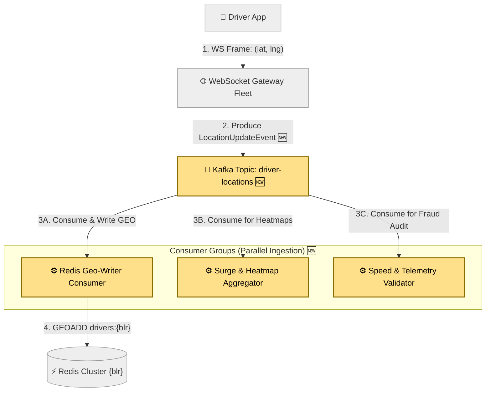

##### Queue & Topic Details (v9)
* **Topic Name:** `driver-locations`
* **Producer:** WebSocket Gateway servers.
* **Broker Partition Key:** `city_id` (e.g. `blr`).
* **Message Size:** $\approx 64 \text{ bytes}$.
* **Consumer Groups:**
  1. `redis-geo-ingestors` (Writes `GEOADD` and updates heartbeat).
  2. `surge-analytics-engine` (Computes supply density per H3 cell).
  3. `fraud-telemetry-checker` (Verifies speed sanity).

##### Under the Hood: Ingestion Buffering
* An extra 10–15ms hop through Kafka is completely negligible against a 4-second update interval.
* If a Redis node fails over for 3 seconds, Kafka safely buffers the 750,000 incoming updates without dropping a single frame.

##### Tradeoff & Explicit Drawback
* **Tradeoff:** Complete operational decoupling and multi-consumer fanout with burst absorption.
* **Drawback:** The system matches riders and tracks locations, but does not manage the full state machine of the trip (pickup, in-progress, drop-off) or durable financial settlement.

---

### Thread 4: Trip Lifecycle & Durable Settlement

#### v10 — Distributed SQL Trip State Machine & Async Double-Entry Payments

##### The Narrative & How I'd Say This Out Loud
> *"Now we close out the entire lifecycle: trip state machine and money.
> 
> A trip moves through explicit states: `REQUESTED` $\rightarrow$ `DRIVER_ASSIGNED` $\rightarrow$ `DRIVER_ARRIVED` $\rightarrow$ `IN_PROGRESS` $\rightarrow$ `COMPLETED`.
> 
> When the driver taps 'Complete Trip', we apply a cardinal rule of payment systems: **never make the rider wait at the car door for a payment processor round-trip**.
> 1. The trip service immediately updates the database row to `COMPLETED` and returns `200 OK`. The rider can step out of the car.
> 2. The service publishes a `TripCompletedEvent` to Kafka topic `trip-completed`.
> 3. A background Payment Worker consumes the event, calls Stripe with an `Idempotency-Key: pay_ride_555`, and confirms the charge.
> 4. Upon success, the worker writes a **double-entry ledger record**:
>    * Debit Rider: $+\$20.00$
>    * Credit Driver: $-\$16.00$ (80% driver payout)
>    * Credit Platform Take: $-\$4.00$ (20% platform revenue)
> 
> The sum of debits and credits is mathematically zero, guaranteeing financial auditability."*

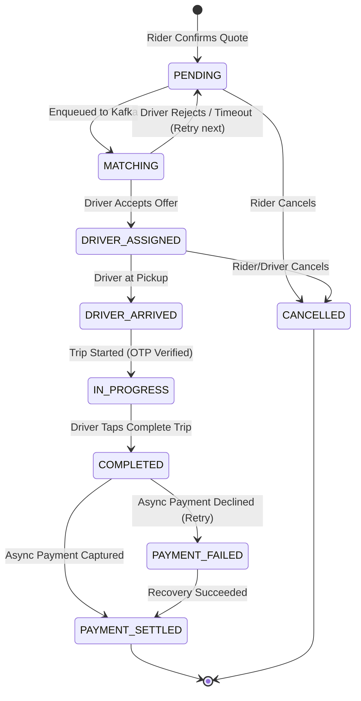

```mermaid
flowchart TD
    classDef existing fill:#eee,stroke:#999,color:#333
    classDef new fill:#ffe08a,stroke:#8a6d00,stroke-width:2px,color:#000
    
    DriverApp["📱 Driver App"]:::existing
    TripService["⚙️ Trip Management Service"]:::existing
    DurableDB[("🗄️ Distributed SQL DB (CockroachDB) 🆕")]:::new
    KafkaPay["📨 Kafka Topic: trip-completed 🆕"]:::new
    PaymentWorker["⚙️ Payment Worker Fleet 🆕"]:::new
    StripePSP["💳 Payment Gateway (Stripe/PSP)"]:::new
    LedgerDB[("📒 Double-Entry Ledger DB 🆕")]:::new
    
    DriverApp -->|"1. POST /rides/555/complete"| TripService
    TripService -->|"2. UPDATE status = 'COMPLETED'"| DurableDB
    TripService -->|"3. Produce TripCompletedEvent 🆕"| KafkaPay
    TripService -->>|"4. 200 OK (Trip Completed)"| DriverApp
    
    KafkaPay -->|"5. Consume event"| PaymentWorker
    PaymentWorker -->|"6. Charge card (Idempotency Key: ride_555) 🆕"| StripePSP
    StripePSP -->>|"7. Charge Confirmed"| PaymentWorker
    PaymentWorker -->|"8. Write Matched Debit/Credit Entries 🆕"| LedgerDB
```

##### Schema Delta (v10)
```sql
CREATE TABLE payments (
    payment_id VARCHAR(36) PRIMARY KEY,
    ride_id VARCHAR(36) UNIQUE NOT NULL, -- 1-to-1 enforcement
    rider_id VARCHAR(36) NOT NULL,
    amount_cents INT NOT NULL,
    currency VARCHAR(3) NOT NULL DEFAULT 'USD',
    status VARCHAR(32) NOT NULL, -- 'PENDING', 'SETTLED', 'FAILED'
    psp_reference VARCHAR(64),
    created_at TIMESTAMP WITH TIME ZONE NOT NULL,
    updated_at TIMESTAMP WITH TIME ZONE NOT NULL,
    CONSTRAINT fk_ride FOREIGN KEY (ride_id) REFERENCES rides(ride_id)
);

CREATE TABLE ledger_entries (
    entry_id VARCHAR(36) PRIMARY KEY,
    payment_id VARCHAR(36) NOT NULL,
    account_id VARCHAR(36) NOT NULL, -- 'rider_usr_101', 'driver_drv_777', 'platform_revenue'
    entry_type VARCHAR(16) NOT NULL, -- 'DEBIT', 'CREDIT'
    amount_cents INT NOT NULL,
    created_at TIMESTAMP WITH TIME ZONE NOT NULL,
    CONSTRAINT fk_payment FOREIGN KEY (payment_id) REFERENCES payments(payment_id)
);
CREATE INDEX idx_ledger_account ON ledger_entries(account_id, created_at DESC);
```

##### Under the Hood: Payment Idempotency & Retries
* If Stripe takes 2 seconds or experiences a network timeout, the Payment Worker retries with exponential backoff.
* Because the call includes `Idempotency-Key: pay_ride_555`, Stripe executes the card charge exactly once regardless of how many times the worker retries.

---

## 5. End-to-End Execution Walkthrough

Let us trace a single complete ride request from start to finish through the final architecture:

```
Rider R101 (Koramangala)          Matching Worker Fleet         Driver D777 (800m away)
       │                                   │                               │
       │── 1. POST /rides/request ─────────▶                               │
       │   (Quote $14.50, Tier: Cab)       │                               │
       │◀─ 2. 202 Accepted (ride_555) ─────│                               │
       │                                   │── 3. GEOSEARCH Redis {blr} ───▶
       │                                   │   (Gets top 10 candidates)    │
       │                                   │── 4. OSRM Drive-Time ETA ─────▶
       │                                   │   (D777 ranked #1, 3 min ETA) │
       │                                   │── 5. SETNX lock:D777 (OK) ────▶
       │                                   │── 6. Push WS Offer ───────────▶
       │                                   │                               │
       │                                   │◀── 7. Driver Taps ACCEPT ─────│
       │                                   │   (within 15s window)         │
       │◀─ 8. Push: Driver Assigned ───────│                               │
       │   (Plate: KA-01-AB-1234)          │                               │
       │                                   │                               │
       │◀══════════ 9. Live GPS Tracking Stream (every 4s via WS) ═════════│
       │                                   │                               │
       │                                   │◀── 10. Driver Starts Trip ────│
       │                                   │                               │
       │                                   │◀── 11. Driver Completes Trip ─│
       │◀─ 12. Push: Receipt ($14.50) ─────│                               │
       │                                   │── 13. Async Kafka Charge ─────▶ Stripe PSP
       │                                   │── 14. Write Double-Entry ─────▶ Ledger DB
```

---

## 6. Consolidated Database Schema

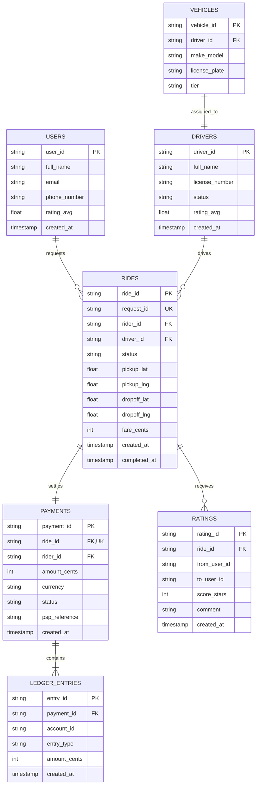

---

## 7. Technology Choices & Justifications

| Tier | Chosen Technology | Why Picked for this Access Pattern | Deliberately NOT Chosen & Why |
|---|---|---|---|
| **Live Driver Locations** | **Redis Cluster** (with GEO extensions) | Sub-millisecond in-memory writes; native spatial indexing (`GEOSEARCH`); zero disk bottleneck for 250k updates/sec. | **Postgres / MongoDB:** Disk write amplification and locking overhead degrade under high write throughput. |
| **Durable Core Store** | **CockroachDB / Sharded Postgres** | ACID transactions for financial records; linear horizontal sharding; guarantees `request_id` uniqueness. | **Cassandra:** Cassandra lacks multi-table ACID transactions needed for consistent ride status and ledger updates. |
| **Event Streaming** | **Apache Kafka** | High-throughput durable event log; allows parallel consumer groups to read the same stream without impacting API servers. | **RabbitMQ:** RabbitMQ message deletion on ack prevents multiple independent consumer groups from replaying streams. |
| **WebSocket Gateway** | **Go / Netty (JVM) with Envoy LB** | Lightweight memory footprint per idle TCP socket; handles 50,000+ concurrent open connections per node. | **Node.js:** Single event-loop thread can suffer GC latency spikes under high message framing volume. |
| **Routing Engine** | **OSRM / Valhalla** (Self-hosted) | Precomputed Contraction Hierarchies calculate driving distance matrix in sub-5ms at fraction of Google Maps API costs. | **Raw Dijkstra on runtime graph:** Exploring uncontracted continental graphs takes 2+ seconds per query. |

---

## 8. If Time Permits (P1 Extensions)

1. **Surge Pricing Aggregator (Dynamic Thermostat):**
   * Computes ratio $R = \frac{\text{Ride Requests}}{\text{Available Drivers}}$ per H3 cell over 60-second tumbling windows.
   * Multiplier: $1.0\times$ for $R \le 1.0$; scaling up to $2.5\times$ for $R \ge 3.0$.
   * Exponential moving average (EMA) smoothing prevents price flickering across adjacent minutes.
2. **DeepETA Machine Learning Correction Layer:**
   * OSRM outputs raw topological travel time.
   * A gradient-boosted tree / neural network model predicts residual error $\Delta t$ based on time-of-day, rain intensity, and intersection congestion history.
3. **Hotspot Shard Mitigation (Stadium / Concert Event):**
   * A single H3 cell around a stadium can experience 5,000 requests/second.
   * Dynamically split the hotspot cell into finer H3 resolution sub-cells or apply key salting (`drivers:blr:stadium_1`, `drivers:blr:stadium_2`) to distribute read queries across multiple Redis replica nodes.
4. **GPS Telemetry Sanity Checker (Fraud Prevention):**
   * Dedicated Kafka consumer checks reported velocity:
     $$v = \frac{\text{HaversineDistance}(p_2, p_1)}{\Delta t}$$
   * If calculated speed exceeds $150 \text{ km/h}$ in urban zones, the location ping is flagged as GPS spoofing and ignored by the matching engine.

---

## 9. Failure Scenarios & Edge Cases (Interview Follow-Up Ready)

When an interviewer drills into unexpected failure modes, be ready with concrete recovery flows:

1. **Driver Device Crash or Sudden Signal Loss:**
   * If a driver enters an underground parking garage or their battery dies, the 15-second TTL on `driver:{city}:heartbeat` expires.
   * Matching queries automatically ignore this driver.
   * If an active offer was in-flight, the atomic lock key `lock:driver:{id}` automatically expires after 15 seconds, returning the ride request to the worker queue to dispatch to candidate #2.
2. **WebSocket Gateway Node Failure:**
   * If Gateway Server B crashes, all TCP connections held by Server B terminate.
   * Mobile clients detect the socket drop and immediately reconnect through the network Load Balancer to a healthy Gateway Server (e.g., Server C).
   * Server C updates the Redis Connection Registry: `conn:driver:drv_777 -> "GW-Server-C"`.
   * The Redis connection registry keys carry an automatic 60-second TTL refreshed by client heartbeats, naturally evicting dead gateway references.
3. **Third-Party Payment Gateway Outage (Stripe/PSP Down):**
   * The ride completion flow is never blocked. `POST /complete` marks the ride `COMPLETED` in the database immediately.
   * Payment events in Kafka enter an exponential-backoff retry queue (1 min, 5 min, 15 min, 1 hr).
   * Once retries are exhausted, the event routes to a Dead-Letter Queue (DLQ) for manual reconciliation, while rider and driver apps remain completely unaffected.
4. **Sudden Regional Redis Node Crash During Peak Ingestion:**
   * Kafka acts as a durable ingestion buffer. Gateway servers keep publishing incoming GPS coordinates to `driver-locations`.
   * Redis Cluster gossip detects the dead primary within 3 seconds and promotes the asynchronous replica.
   * The Kafka consumer group resumes flushing buffered updates to the newly promoted primary without dropping a single coordinate frame.

---

## 10. How to Pace This in a 45-Minute Interview

| Time Window | Focus Area | Goal / Deliverable |
|---|---|---|
| **00:00 – 05:00** | Scope & Requirements | Scope to P0 on-demand lifecycle. State clarifying answers up front. Do capacity math (250k updates/sec, 100 MB resident RAM). |
| **05:00 – 15:00** | Driver Location Ingestion (v1 → v4) | Explain why SQL fails (WAL/page locks). Introduce Redis `GEOADD` + H3. Shard by `{city_id}` hashslot (not `driver_id`). Add async replicas and 15s TTL. |
| **15:00 – 25:00** | Matching & Concurrency (v5 → v7) | Candidate discovery with OSRM 2-tier ETA ranking. Solve double-booking with atomic `SET lock:driver:id req_id NX EX 15`. Decouple intake with async Kafka queue + `request_id` dedup. |
| **25:00 – 35:00** | Real-Time Layer & State Machine (v8 → v10) | Introduce WebSocket Gateway Fleet + Redis Connection Registry. Decouple ingestion via Kafka. Walk through trip state machine and async double-entry payments. |
| **35:00 – 40:00** | P1 Extensions & Hotspots | Pitch stadium surge pricing thermostat (supply/demand ratio), DeepETA ML correction, or GPS spoofing checks. |
| **40:00 – 45:00** | Failure Modes & Wrap-Up | Discuss gateway reconnection, Redis failover, payment retries, and summarize the architecture. |

---

## 11. Master Interview Cheat Sheet

| Version | Core Change Made | Motivation / Solved Problem | Drawback Driving Next Version |
|---|---|---|---|
| **v1** | Naive SQL table with `lat`, `lng`. | Baseline starting point. | Disk WAL and page locks crash under 250k writes/sec. |
| **v2** | Move location to Redis `GEOADD`. | In-memory sub-ms writes and native spatial search. | Single Redis node single-thread limits throughput at 100k ops/sec. |
| **v3** | Shard Redis Cluster by `{city_id}`. | Scales cluster throughput; isolates city lookups to 1 node. | Node crash results in entire city location blackout. |
| **v4** | Async Replicas + 15s Heartbeat TTL. | High availability failover and dead-driver self-eviction. | System stores locations, but matching logic is absent. |
| **v5** | Candidate Discovery + OSRM Ranking. | Ranks real road driving ETAs rather than straight lines. | Concurrent requests pick same driver (double booking). |
| **v6** | Redis Atomic Lock (`SET NX EX 15`). | Prevents double-booking via atomic compare-and-set. | Synchronous HTTP calls block and drop on mobile networks. |
| **v7** | Async Kafka Queue + `request_id` Deduplication. | Absorbs request bursts and guarantees idempotent creation. | Rider must wastefully poll HTTP endpoint to learn match status. |
| **v8** | WebSocket Gateway Fleet + Connection Registry. | Sub-100ms real-time push notifications. | Gateway tightly coupled if writing directly to Redis cluster. |
| **v9** | Decoupled Kafka Location Ingestion. | Buffers updates and enables multi-consumer analytics stream. | Lacks persistent trip state machine and reliable payments. |
| **v10** | Distributed SQL + Async Double-Entry Payments. | Non-blocking trip finalization, Stripe idempotency, and balanced ledger. | **Final Production Architecture.** |
