# Design Uber — The Story (narrative edition)

## What this file is

The reference file, `30-Design Uber-FAANG-Guide.md`, is the one to recite from. It has the requirements, the capacity math, every trade-off table, the golden rules, and the master cheat sheet.

This file is a **second way in** to the same material. It tells the same story, but as one continuous narrative, in plain language.

Here's the shape of it: engineers at a company keep hitting a wall. They patch it. The patch creates the next wall. This keeps happening — chapter after chapter — until we land on the exact same design the reference file documents.

The company, **MetroHop** (a ride-hailing startup), is fictional. But every wall it hits, and every fix it reaches for, is something a real, named system actually does:

| Real system | What it does in this story |
|---|---|
| **H3** | Uber's own open-sourced hexagonal geo-index (2018) |
| **DeepETA** | Uber's documented ML correction layer for ETA (from Uber's engineering blog) |
| **RADAR** | Uber's human-assisted fraud platform |
| **Ringpop** | Uber's consistent-hashing + gossip library |
| **Apache Kafka** | Real streaming backbone for the payments pipeline |
| **Cassandra** | Real storage backbone for trip history |
| **Contraction hierarchies** | Routing technique behind real engines like OSRM |

**A note on numbers:** every time a number shows up, I'll tell you plainly whether it's a documented fact or a reasonable stand-in. Stand-in numbers get an `[illustrative]` tag. This is the same habit the reference guide's capacity-estimation section uses, and I'm keeping it here too.

## The trigger phrases for this topic

Watch for any of these in an interview prompt:

- *"design Uber / Lyft / Grab"*
- *"match moving supply with moving demand in real time"*
- *"track millions of moving things and pair them up in under two seconds"*

Keep one sentence in your head as you read everything below:

> **Uber is three coupled real-time systems wearing one app icon** — a live geo-index (where is everyone), a matching engine (who gets paired with whom), and a ledger with a fraud layer (money moves exactly once).

Everything in this guide is just those three systems, plus the mess of self-inflicted problems it takes to actually build them at scale.

---

## Chapter 1 — The map screen that phones home every five seconds

### The starting point

MetroHop starts as a single-city app. Three years later, after merging with a couple of regional rivals, it looks — on paper — like any FAANG-interview-sized ride-hailing company:

- ~20 million daily active riders
- ~3 million daily active drivers
- ~20 million trips a day

`[illustrative — these are the same round, interview-friendly assumptions the reference guide uses for capacity planning, not a real company's filed numbers]`

The engineering, unfortunately, hasn't grown up with the business. It's still exactly what a two-person team wrote in year one:

- One API server
- One Postgres box
- Both the rider app and the driver app **poll** that server every 5 seconds, asking: *"anything new for me? Should I move my pin?"*

### Where it breaks

At national scale, that polling habit stops being cute. Let's do the math step by step:

1. MetroHop has 3 million active drivers.
2. Each one polls once every 5 seconds.
3. That's `3,000,000 ÷ 5 = 600,000` requests every second — just to ask "anything new?"

Nearly all of those calls come back "nothing changed." That's pure waste. It's not even that far below the load MetroHop will eventually carry once every ping *actually* carries new information — it's just far less useful per request today.

### The obvious next question

*Why poll everyone every 5 seconds when most drivers haven't moved and most riders haven't gotten a new offer?*

Because polling makes the **client** decide when to ask — and the client is blind to whether anything has actually changed. The information should flow the moment it exists, not on a fixed timer.

### The fix — and the analogy for the rest of this story

Switch from **polling** to **push**.

- **Polling:** the dispatcher calls every driver every 5 seconds and asks, "you there? anything new?"
- **Push:** each driver keys up on their own walkie-talkie channel and *reports in* the instant their position changes.

Nothing gets said until there's something to say.

MetroHop implements this as a WebSocket connection per driver, pinging in on its own about every 4 seconds.

### New problem, immediately

The walkie-talkie fix stops the *wasted asking*. But every one of those pings still lands as a row-write into the exact same Postgres table that holds riders, drivers, trips, and payments.

At even a modest write rate, those location writes start taking out row-level locks — and a trip-status update or a payment write has to wait behind them. An unrelated trip query that used to take 5ms is now waiting 40–80ms behind a location-write queue.

`[illustrative — a stand-in number for "shared-table lock contention," not a measured MetroHop metric]`

Push solved the *waste*. It didn't solve the fact that location is a firehose sharing a table with things that need to stay fast and safe.

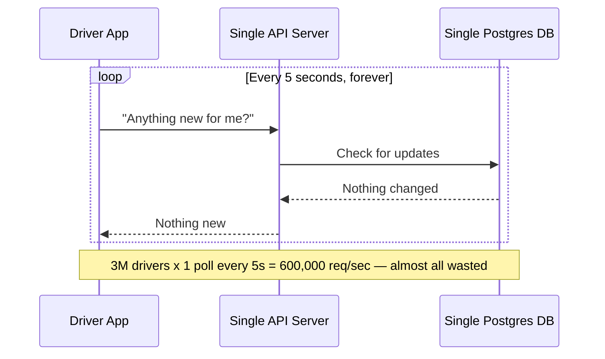

### How I'd say this in an interview

> "I'd start with the naive design on purpose — single DB, polling every 5 seconds — and show it falls over at 600,000 mostly-wasted requests a second. The fix is push over a persistent connection, walkie-talkie style, so a driver only speaks when something's actually changed. That's step one of getting to the real architecture, not the whole answer."

---

## Chapter 2 — The location table that jammed the whole database

### Where things stand

The walkie-talkie fix (push, not poll) is in. But as the last chapter's new problem showed, every ping is still a write into the same relational table as trips and payments.

### The incident

MetroHop's on-call gets paged one Tuesday. `getTripStatus` calls, which used to return in single-digit milliseconds, are now sporadically taking 200–400ms.

`[illustrative]`

Nothing about the trip logic changed. So what did?

The `driver_location` table sits right next to `trips` in the same database. It's now absorbing a constant, heavy stream of overwrites. Index maintenance on that hot table is stealing I/O and lock time from everything else sharing the box.

### The obvious next question

*Why does an unrelated table slow down trip queries at all?*

Because "one database" really means: one shared set of disks, one shared buffer pool, one shared lock manager. A write-hot table and a read-sensitive table end up fighting over the same physical resource — even though they have nothing to do with each other logically.

### The fix

Move live location entirely out of the relational database and into an **in-memory hash table** — a plain key-value store (Redis is the real, common choice), where:

- the **key** is the driver's ID
- the **value** is just their latest lat/long and a timestamp

**The analogy: a sticky-note wall.** Each driver gets exactly one sticky note with their name on it. Every ping, you don't add a new note — you erase the old note and rewrite the same one. There's never a pile of old notes to dig through, and nobody searching *today's* wall ever has to wade through *last week's* notes.

### How big is this wall, really?

Let's size it step by step:

1. MetroHop has 3 million active drivers.
2. Each entry is roughly ~100 bytes (driver ID, lat, long, timestamp).
3. `3,000,000 × 100 bytes ≈ 300 MB` for active drivers alone.
4. Even counting *every driver MetroHop has ever registered* — not just the active ones — the whole wall fits in well under 2GB of RAM.

`[illustrative arithmetic — the real-world number the reference guide lands on is "a couple GB total"]`

The hard part was never the *size* of this data. It's the *rate* it changes at — and that's exactly what the next chapter runs into.

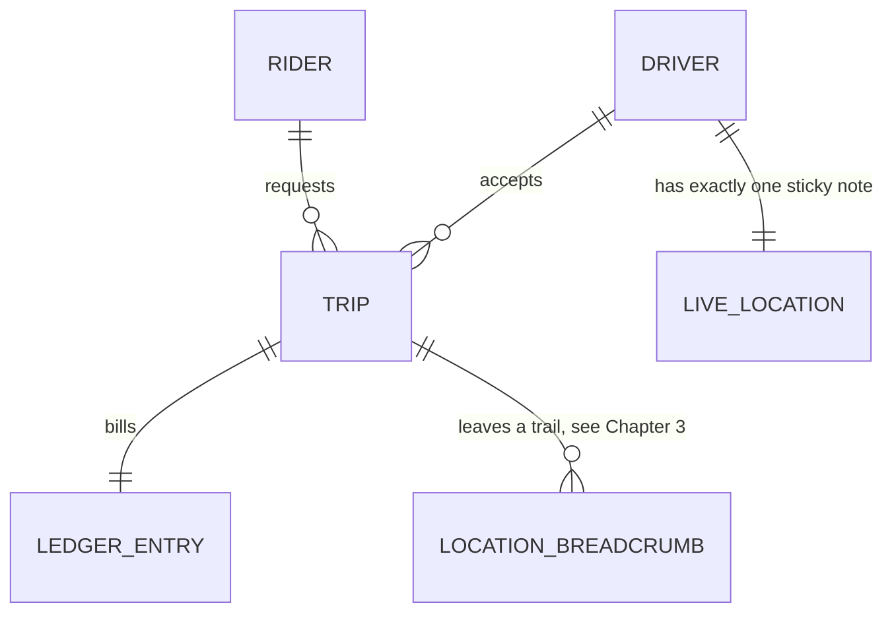

### New problem

The sticky-note wall now updates in O(1) time, with no locks shared with trips or payments. But riders still need to ask "who's near me?" — and that question needs a *spatial* structure (a grid, a tree — something you can search by location, not by driver ID).

If you rebuild that spatial structure every single time any one of 3 million drivers' sticky notes changes, you're paying an expensive rebuild cost 750,000 times a second (3M drivers pinging roughly every 4 seconds). You've just moved the bottleneck, not removed it.

### How I'd say this in an interview

> "The moment write-hot data and relational, ACID-sensitive data share one table, the write-hot one wins and everything else pays the tax. The fix is to pull live location into its own in-memory hash table — a sticky note per driver, always overwritten, never accumulated. That solves the write path, but it immediately raises the next question: how do you search 'who's near me' without rebuilding a spatial index on every single one of those writes?"

---

## Chapter 3 — The sticky-note wall and the search that couldn't keep up

### The mistake

MetroHop's dispatch team wires the sticky-note wall directly into their spatial search structure. Literally: "on every write, also update the search tree."

Let's see why that's a problem:

1. There are 750,000 writes a second (from Chapter 2's math: 3M active drivers, ~4-second ping interval).

   `[illustrative arithmetic — the same formula the reference guide uses]`

2. Each write also triggers a search-tree rebalance.
3. So the search tree is being told to rebalance itself **three-quarters of a million times a second.**

It falls over within minutes of the first rush-hour peak. CPU on the indexing box pegs at 100%, and `findNearbyDrivers` calls start timing out.

### The obvious next question

*Does "who's near me" actually need to see a ping the instant it lands?*

No — and that's the key realization.

- If a driver is 15 seconds away, they haven't moved far. **Discovery** ("show me drivers near me on the map") can tolerate being a little stale.
- But **tracking a specific driver you're already mid-trip with** can't be stale. You want their exact current dot, not a 15-second-old one.

### The fix

Split the two questions and give each one different freshness:

| Question | Reads from | Freshness |
|---|---|---|
| "Where is driver X right now, during an active trip?" | The sticky-note wall directly | Always fresh (O(1) writes) |
| "Who's near me, browsing the map?" | The spatial index | Up to 10–15 seconds stale |

Every ping still writes to the sticky-note wall immediately. But the spatial search structure only gets a **batch flush** every 10–15 seconds, instead of on every write. So it rebalances a few times a minute — not 750,000 times a second.

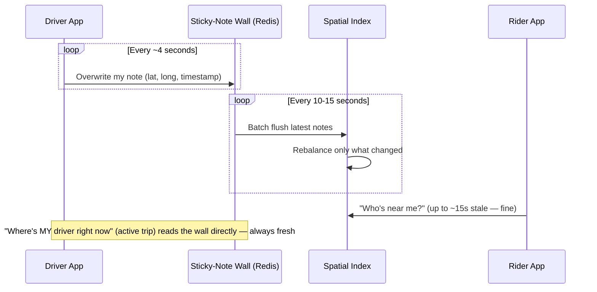

### New problem

The freshness split works. But it doesn't answer *what shape* the spatial index actually is.

MetroHop's first attempt reuses a plain square grid. It turns out square grids have a quiet bug:

- A driver diagonally across two grid cells is treated as roughly the same "distance" as one directly next door.
- But the diagonal neighbor is actually about **1.4x farther away**.

On a busy Friday night, riders start noticing the "nearest" driver assigned to them sometimes isn't actually the nearest one.

### How I'd say this in an interview

> "The killer move here is not indexing on every write — buffer the freshest position in a hash table, and flush to the spatial index on a timer instead of per-ping. Then split freshness by use case: an active trip needs the live wall, discovery can live with 15 seconds of staleness. That buys you the write-rate problem back, but it exposes a second, separate problem — what shape should that spatial index actually be?"

---

## Chapter 4 — Square tiles, round problems: picking the map's grid

MetroHop's engineers try three grid shapes, in order. Each one fails for a specific, nameable reason.

### Attempt one: geohash

**What it is:** encode lat/long into a short string, like `9q8yy`, where a longer string means a smaller area. Simple, and great for quick prefix-based lookups.

**Where it breaks:** two points a few meters apart, right on a grid boundary, can end up with *completely different* hash prefixes. A rider and the nearest driver, standing almost across the street from each other, get treated by the search as if they're in unrelated cells.

### Attempt two: quadtree

**What it is:** recursively split a region into four, going deeper wherever points are dense. This adapts nicely to a crowded downtown versus an empty suburb.

**Where it breaks:** it still has the square-grid diagonal-distance bug from last chapter, *and* rebalancing a tree under a fast-moving population is inherently more expensive than re-encoding a flat grid. The Chapter 3 batch-flush trick helps — but the underlying shape is still working against uniform-radius search.

### The fix MetroHop lands on: H3

**H3** is the real hexagonal grid system Uber built and open-sourced in 2018. Every cell is a hexagon. Here's the one property that fixes both earlier bugs at once:

> **Every one of a hexagon's six neighbors is exactly the same distance away.**

No diagonal-vs-edge distortion, no ambiguous boundary. "Give me everyone within 2 rings of my location" is now a real, undistorted radius search.

**The analogy:** think of the whole map as a giant **honeycomb**. A bee (or a driver) sitting in one cell has six equally-close neighboring cells — not four close ones and four far ones like a square grid gives you.

```mermaid
mindmap
  root((Which grid for<br/>"who's near me"?))
    Geohash
      Simple string-prefix trick
      Bug: nearby points get different prefix at a boundary
    Quadtree
      Adapts to crowded vs empty areas
      Bug: still square, still costly to rebalance fast
    H3 honeycomb
      Hexagons: all 6 neighbors equidistant
      Fixed resolutions 0-15, O(1) parent/child lookup
      Uber's own open-sourced answer, 2018
```

### Picking the right resolution

| H3 resolution | Edge length | Used for |
|---|---|---|
| Resolution 8 | ~461 meters | Natural default for "who's near me" search |
| Resolution 9 | ~174 meters | Finer granularity, e.g. dense downtown dispatch |

One nice bonus: these same honeycomb cells get reused later, unchanged, as the exact zones surge pricing measures supply and demand in (see Chapter 9). One grid, two jobs.

### New problem

The honeycomb search structure works beautifully for one city. But MetroHop is now national. Every driver ping and every rider search — no matter what city it's from — is still hitting the *same* single Redis wall and the *same* single H3 index.

A rider in a city 3,000 miles from MetroHop's one data center is adding 50–150ms of pure network round-trip to every single request, on top of everything else, before any real work even starts.

### How I'd say this in an interview

> "Geohash's boundary discontinuity and a quadtree's rebalancing cost both trace back to the same root issue — square cells don't have uniform neighbor distance. H3's hexagons fix that structurally: every neighbor really is the same distance away, which is exactly why Uber built and open-sourced it. But one honeycomb serving the whole country doesn't hold up once you're truly national — that's a locality problem, not a shape problem."

---

## Chapter 5 — One honeycomb per city, and a ring to keep track of who owns which slice

### Where it cracks

The single, global honeycomb-plus-wall setup starts showing cracks the moment MetroHop expands past one region.

**Scenario:** a stadium concert lets out in one city. That single metro's traffic spike degrades response times for *every* city sharing that one Redis wall and one H3 index. A totally unrelated rider in another state notices their app getting sluggish — for no reason connected to their own city at all.

On top of that, every cross-region call is still paying that 50–150ms round-trip tax from last chapter, for no benefit. A Tokyo-equivalent city's ping never needed to leave its own region in the first place.

### The obvious next question

*Why does one city's traffic spike affect another city at all?*

Because there's only one honeycomb and one wall to share. There's no isolation — every region's load lands in the same blast radius.

### The fix: geo-sharding

Split the sticky-note wall and the honeycomb index **by region**. Each metro area (or a small cluster of them) gets its *own* wall and its *own* honeycomb, entirely independent of every other region's.

A Tokyo-equivalent city's driver ping now never leaves its own region's machines.

**The analogy:** one regional post office per metro area, instead of one national sorting facility that every single letter, anywhere in the country, has to pass through.

### New problem

Now that there are many regional walls instead of one, *something* has to decide:

- which region owns which slice of drivers, and
- what happens when a regional machine gets added, removed, or dies.

A naive "driver ID mod number-of-regions" scheme breaks the same way naive sharding always breaks: add one more regional machine, and the *vast majority* of existing assignments have to move overnight, just to make a little room.

### The fix for that, specifically: consistent hashing + gossip

This is the real approach used by **Ringpop**, Uber's own library for exactly this job.

Here's how it works, step by step:

1. Every machine claims a spot on a conceptual ring by hashing its own ID.
2. Every driver's shard-key also lands somewhere on that same ring.
3. That driver is owned by whichever machine's spot comes next, going clockwise.
4. Add or remove a machine, and only the slice of the ring right next to it moves — everyone else's assignment stays put.
5. Machines gossip with each other (a SWIM-style protocol) to agree on ring membership. There's no single coordinator that becomes its own bottleneck or single point of failure.

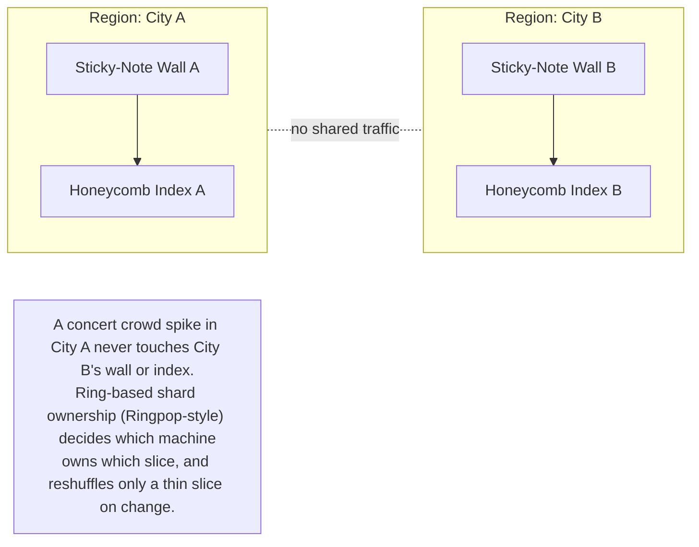

### How I'd say this in an interview

> "Geo-sharding by region does two things at once — it keeps every city's traffic local, so a Tokyo ping never crosses an ocean, and it bounds the blast radius, so a stadium spike in one metro can't degrade another one. The part people forget to mention is *how* shards get assigned to machines without a naive mod-N scheme reshuffling everything on every resize — that's consistent hashing plus gossip membership, which is literally what Uber's own Ringpop library does."

---

## Chapter 6 — The doorknob only one hand can turn

Location is solid now. Riders can find nearby drivers fast, per region, without stepping on each other. Time to actually match a ride — and this is where MetroHop hits its first **correctness bug**, not a scale bug.

### The incident

One Saturday night, two ride requests land almost simultaneously in the same neighborhood. Here's exactly what goes wrong, step by step:

1. Dispatch runs as two independent processes, for throughput.
2. Both processes independently query the honeycomb.
3. Both get back the *same* nearest driver as their top candidate.
4. Both send that driver a ride offer *at the same instant*.
5. The driver's app briefly shows two different pickups.
6. One rider gets confirmed. The other gets a confusing "driver unavailable" a few seconds later — after already being shown "driver assigned."

Nothing crashed. This is a pure race condition, and it will happen every single busy night unless something explicitly prevents it.

### The obvious next question

*Why did two dispatch decisions both succeed against the same driver?*

Because nothing enforced that only one of them was allowed to "claim" that driver. Reading a driver's status and then writing a new status weren't treated as one atomic step.

### The fix: compare-and-swap on the driver's status field

Both dispatch attempts try to flip the same driver from `Available` to `Dispatched`. But the database only lets the *flip* succeed if the driver was still `Available` at that exact instant.

- Whoever's write lands first wins.
- The second write is rejected outright, forcing that dispatcher to go pick its next candidate instead.

**The analogy:** a doorknob only one hand can turn at a time. The second hand to grab it just finds the door already locked, and has to go try the next door down the hall.

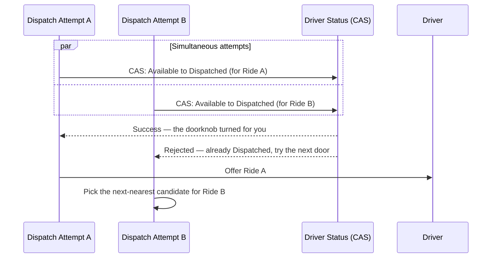

### New problem

The doorknob fix stops two riders from being matched to the *same* driver. But it says nothing about what happens if the winning driver just doesn't answer — network drops, app crash, or they simply ignore the offer.

Right now, a rider whose driver goes silent waits forever, because nothing is watching the clock.

### How I'd say this in an interview

> "Every match decision needs a single-writer guarantee, or you get exactly this: two dispatchers both successfully assigning the same driver at once. Compare-and-swap on the driver's status field — flip Available to Dispatched, and only let it succeed if it was still Available — is the standard fix. It's the single most common follow-up question in this interview, so I'd bring it up before being asked."

---

## Chapter 7 — Casting a wider net, and stopping the "always the closest driver" habit

Two separate problems show up around the same time. Both are about *who* gets picked — not about locking.

### Problem one: nobody's nearby

A rider in a sparse suburb at 2am requests a ride. The honeycomb search at a 1km radius comes back completely empty — every driver has gone home for the night. The naive design just... hangs, with no answer.

### The fix: widen the search net

If the first ring comes up empty, expand it in steps. A memorable shorthand: **1-3-5-15**.

| Step | Radius | Dwell time before expanding |
|---|---|---|
| 1 | 1km | ~15 seconds |
| 2 | 3km | ~15 seconds |
| 3 | 5km (cap) | ~15 seconds |
| Past cap | — | Give an honest wait estimate, or a surge-adjusted fare |

`[illustrative — the exact radius steps and the 15-second dwell time are a reasonable pattern to reason from, not a documented Uber constant]`

Past the 5km cap, don't hang silently. Tell the rider an honest wait estimate, or offer a surge-adjusted fare that might pull in a driver from farther out.

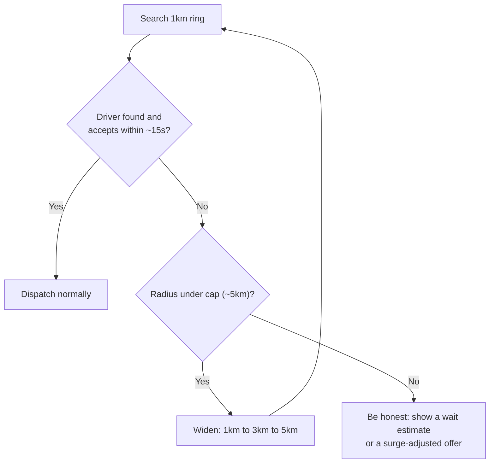

### Problem two: always the closest driver, forever

Even when drivers *are* nearby, MetroHop's dispatch always assigns the single closest one. It feels obviously correct — until dispatch notices a pattern:

- The driver parked right at a busy intersection gets picked for nearly every ride.
- A driver two blocks over sits idle for 20+ minutes at a stretch, night after night.

Locally optimal for one rider at a time. Globally wasteful for the whole fleet. Some drivers churn constantly; others go stale. Idle time isn't spread fairly.

### The fix: batch and solve as an assignment problem

1. Batch ride requests for a short window (100ms to a few seconds).
2. Solve the whole batch as an assignment problem — a bipartite match between all open ride requests and all available drivers in that window.
3. Minimize total wait time across *everyone*, not just optimize each rider one at a time.

This is the real shape of Uber's own dispatch-optimization approach. It costs a small amount of added latency to gather the batch, in exchange for materially better fleet-wide efficiency.

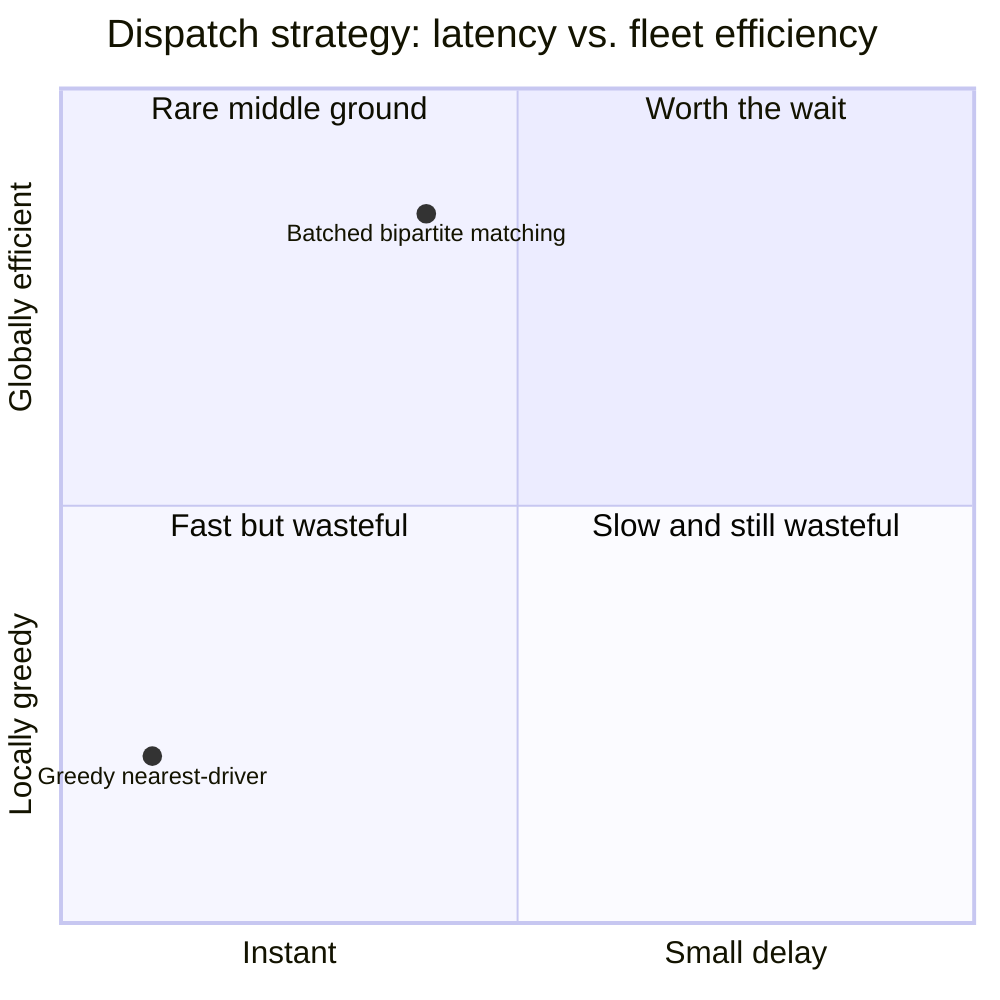

### New problem

Batching and fair spreading make the fleet more efficient. But neither one tells dispatch *how* to rank several similar candidates within a batch. Distance alone isn't enough — these all matter too, once rider- and driver-facing teams push for it after the batching change ships:

- A driver's acceptance rate
- How long they've been idle
- Whether their vehicle type matches the request
- Whether they're already heading in that direction

### How I'd say this in an interview

> "Greedy nearest-driver is a perfectly fine starting answer, but I'd immediately name its failure mode — it's locally optimal and globally wasteful, starving some drivers while overworking others. The real fix is a short batching window solved as an assignment problem, trading a little latency for whole-marketplace efficiency. Separately, when the search radius itself comes up empty, don't hang — widen it in capped steps and be honest with the rider past the cap."

---

## Chapter 8 — Shortcuts on the map, and the forecaster who corrects them

MetroHop needs to answer two different questions that keep getting conflated:

1. *What's the fastest path* from A to B?
2. *How long will that path actually take right now?*

### The first attempt: plain Dijkstra

The first attempt uses classic Dijkstra's algorithm, computed fresh for every single request across the whole road graph. It works for a small test city.

At national scale, one continent-spanning road graph is too large to search from scratch on every request. ETA calls start taking multiple seconds — an eternity for a screen that's supposed to show "3 min away" almost instantly.

### The obvious next question

*Do we need to search the whole graph every time?*

No. Most of the graph's structure doesn't change between requests — only the traffic weights do. So precompute the parts that don't change, once, offline, and only do live work on the parts that do.

### The fix: contraction hierarchies

This is the real technique behind production routing engines like OSRM. Here's how it works:

1. Offline, precompute a layer of long "shortcut" edges between important road-network junctions.
2. A live query barely has to touch the raw road graph at all — it mostly hops across a small number of precomputed shortcuts.
3. MetroHop takes it one step further: split the national road graph into regional partitions, and precompute each partition's shortcuts in parallel.
4. Because every partition's precompute happens simultaneously, wall-clock precompute time depends on the size of *one* partition — not the whole country's graph.

**The analogy:** a road atlas that's already marked the fastest highway between major cities. You're not replanning the entire cross-country route from a blank map every single time — you're just stitching together a few pre-marked shortcuts.

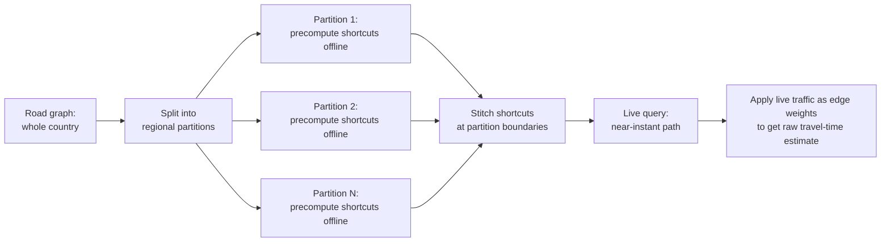

### New problem

Contraction hierarchies nail the *path*. Applying live traffic weights gets a reasonable *time* estimate. But "reasonable" isn't the same as "accurate."

The raw routing estimate is systematically biased in specific, learnable ways:

- Certain intersections always run slower than their listed speed limit suggests.
- Certain highway on-ramps have a predictable backup at 5pm that a generic traffic weight doesn't fully capture.

### The fix: a learned correction layer

This is the real idea behind Uber's documented **DeepETA** system. Here's the two-stage flow:

1. The routing engine still produces the baseline path and a raw time estimate.
2. A machine learning model — trained on the specific history of *this exact segment at this exact time of day* — then predicts a residual correction: how far off the raw estimate is likely to be, and in which direction.

**The analogy:** a local forecaster correcting a generic weather model. The model says 68°F, but the forecaster knows this particular valley always runs 5 degrees cooler in the evening, and adjusts.

### How I'd say this in an interview

> "I'd split this into two problems on purpose — path-finding and time-estimation are different questions with different tools. Raw Dijkstra doesn't survive at scale; contraction hierarchies, precomputed offline and partitioned for parallel precompute, get the path fast. Then a learned correction layer like DeepETA sits on top to fix the routing engine's systematic time bias — graph gives the path, ML corrects the time, not the other way around."

---

## Chapter 9 — The thermostat that prices a crowd

### The incident

A stadium two towns over lets out 15,000 people at once, all wanting a ride within ten minutes.

- The honeycomb cells around that stadium go from a handful of open requests to hundreds.
- The number of available drivers in those same cells barely changes — most of MetroHop's drivers are elsewhere, with no signal telling them to reposition.

Riders wait 20+ minutes. Idle drivers three towns away have no idea there's a rush happening nearby.

`[illustrative]`

### The obvious next question

*How do you tell the market "there's a shortage here, right now" without a human manually watching a map?*

Measure the imbalance directly, in the same grid you already built for search, and turn the imbalance into a price signal.

### The fix: surge pricing, computed per honeycomb cell

Every refresh window (roughly 1–5 minutes), for each H3 cell:

1. Compute a ratio: open ride requests ÷ available drivers in that cell.
2. Map that ratio to a fare multiplier.

| Ratio band | Multiplier |
|---|---|
| ~1.0 or under (supply meets demand) | 1.0x — no surge |
| Moderate | ~1.3x – 1.5x |
| High | ~1.5x – 2.5x |
| Severe | ~2.5x – 3x+, capped by policy |

`[illustrative bands — the exact thresholds and multiplier values are a reasonable pattern to demonstrate the mechanism, not a published formula]`

**The analogy:** a thermostat for a crowd. It doesn't just report the temperature — it actively does something about it. A higher multiplier both:

- **cools demand** (some riders decide to wait it out), and
- **pulls in supply** (idle drivers nearby see the higher fare and reposition toward it).

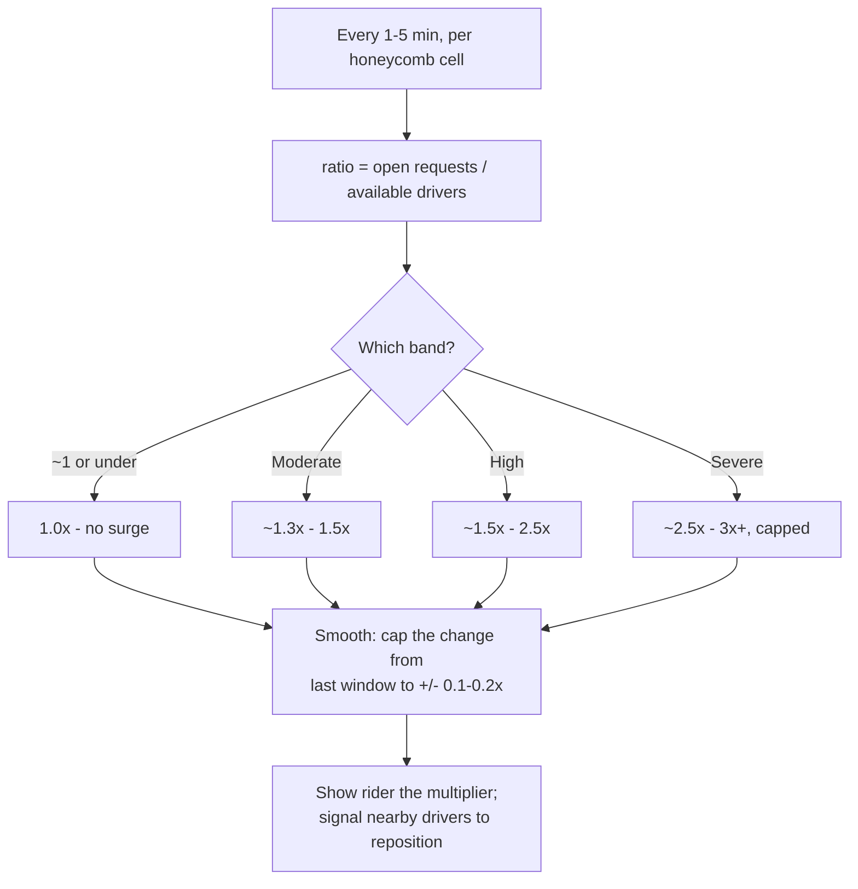

### New problem

The thermostat works. But a *too-responsive* thermostat is its own bug.

Early on, MetroHop refreshes every 30 seconds with no smoothing. Riders start seeing the multiplier visibly flicker — 1.2x, then 2.1x, then 1.4x, within a couple of minutes, right as they're deciding whether to book.

That kind of price whiplash reads as arbitrary and erodes trust fast — even when the underlying math is technically justified in each instant.

### The fix for that

- Cap how much the multiplier is allowed to move between refresh windows.
- Pick a cell size that's neither so small it flickers street-by-street, nor so large it misses the actual hot spot.

Smooth, don't snap.

### How I'd say this in an interview

> "Surge isn't a separate data pipeline — it's a different aggregation over the exact same driver-position data the dispatch honeycomb already has: a request-to-driver ratio per cell, mapped to a fare band. The part that actually matters for trust is smoothing — cap how fast the multiplier can move between refreshes, or you get price whiplash that looks arbitrary even when the math is sound."

---

## Chapter 10 — The bar tab that doesn't make you wait at the register

### The incident

MetroHop's original payment flow charges the rider's card the instant `endTrip` is called, synchronously, as part of the same request that says "trip complete."

One evening, the payment processor MetroHop uses has a slow day. Its response time jumps from a normal 300ms to 1.8 seconds.

`[illustrative — payment-provider slowness is a well-documented real category of incident; the specific number is a stand-in]`

Every single rider ending a trip during that window sits staring at a spinner for almost two seconds — at the exact moment they're trying to get out of the car. It's the worst possible place in the whole experience to make someone wait on an unrelated third party.

### The obvious next question

*Does the rider actually need to see the charge succeed before the trip can end?*

No. The trip is over the moment the driver says it's over. The charge is bookkeeping that can happen a beat later, off to the side.

### The fix: async capture

1. Say "trip complete" to the rider instantly.
2. Separately, publish a "trip finished" event onto a durable stream — Kafka is the real backbone the reference guide uses for exactly this.
3. Let a background service pick that event up and actually run the charge against the payment processor, on its own time, off the critical path the rider is staring at.

**The analogy:** a bar tab. You don't stand at the register waiting for the card machine before you're allowed to leave. The tab gets settled a little after the fact, out of your way.

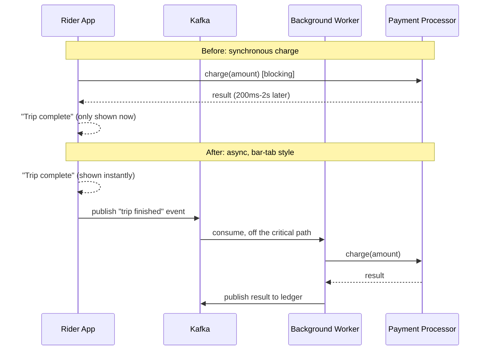

### New problem

Moving the charge off to the side means it can now happen more than once for the same trip — in ways it never could when everything was one blocking call.

- A background worker crashes mid-retry, and a second worker picks up the same event. The same charge fires twice.
- Or the reverse: a worker crashes and *nobody* ever retries. The trip silently never gets billed at all.

### The fix: idempotency keys plus double-entry bookkeeping

**Idempotency keys.** Every charge attempt carries a stable key, tied to the trip — not to which retry attempt it is. Before charging, the system checks "have I already successfully charged this exact key?" and skips the charge if yes.

**Double-entry bookkeeping.** Every successful charge writes not one row but a *matched pair*: a debit from the rider and a credit to the driver — like a two-part carbon-copy receipt. A lone, unmatched entry is itself a signal something went wrong.

**One more concern:** an authorization that was *opened* (like starting a bar tab) but never *closed* (never captured or voided) needs a TTL and a periodic reconciliation sweep, or that tab just sits open forever.

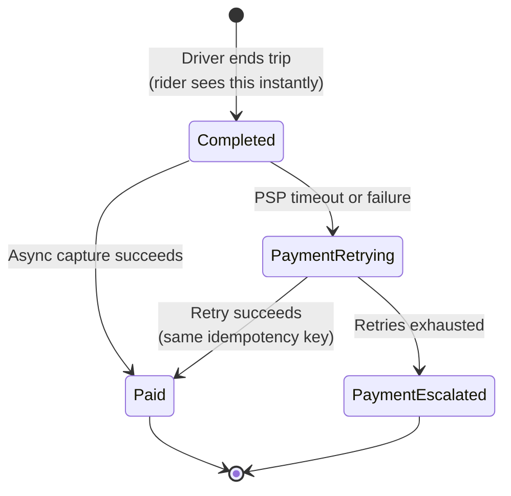

### How I'd say this in an interview

> "Never let a third-party payment round-trip block the user-facing 'trip complete' moment — capture asynchronously through a durable event stream, like a bar tab settled after you've already left. But moving off the critical path means you can no longer treat 'charge happened' as a single atomic step, so you need an idempotency key tied to the trip, and double-entry bookkeeping so every charge is a matched debit-and-credit pair, not a lone row you have to trust blindly."

---

## Chapter 11 — The inspector who writes rules, not just tickets

### The problem

Money moving through the system attracts people trying to cheat it. MetroHop starts seeing patterns:

- A driver spoofing GPS to fake a longer trip.
- A rider claiming a "cleaning fee" dispute they don't deserve.
- A driver accepting a ride and then just never showing up, forcing the rider to cancel and eat a small fee.

A simple fixed rule catches the *first* known pattern easily enough. But each new scam is, by definition, something nobody wrote a rule for yet.

### The obvious next question

*Do we need a human reviewing every single trip, or can a machine catch everything alone?*

Neither extreme works:

- A human can't review millions of trips a day.
- A fully automated model making high-stakes account and payment decisions, with nobody checking it, is an accountability problem waiting to happen.

### The fix: RADAR

**RADAR** is Uber's real, documented human-assisted fraud platform. Here's the loop:

1. A model watches the live stream of trip and payment events.
2. It flags an emerging anomalous pattern.
3. It auto-drafts a candidate *rule* to catch it.
4. A human fraud analyst reviews and approves that rule before it goes live.
5. Once approved, the rule applies automatically, at full scale, to every future trip matching that pattern — with no further human involvement per-instance.

**The analogy:** an inspector who writes new inspection checklists, rather than personally checking every single package. One approved rule then does the checking for millions of future trips on the inspector's behalf.

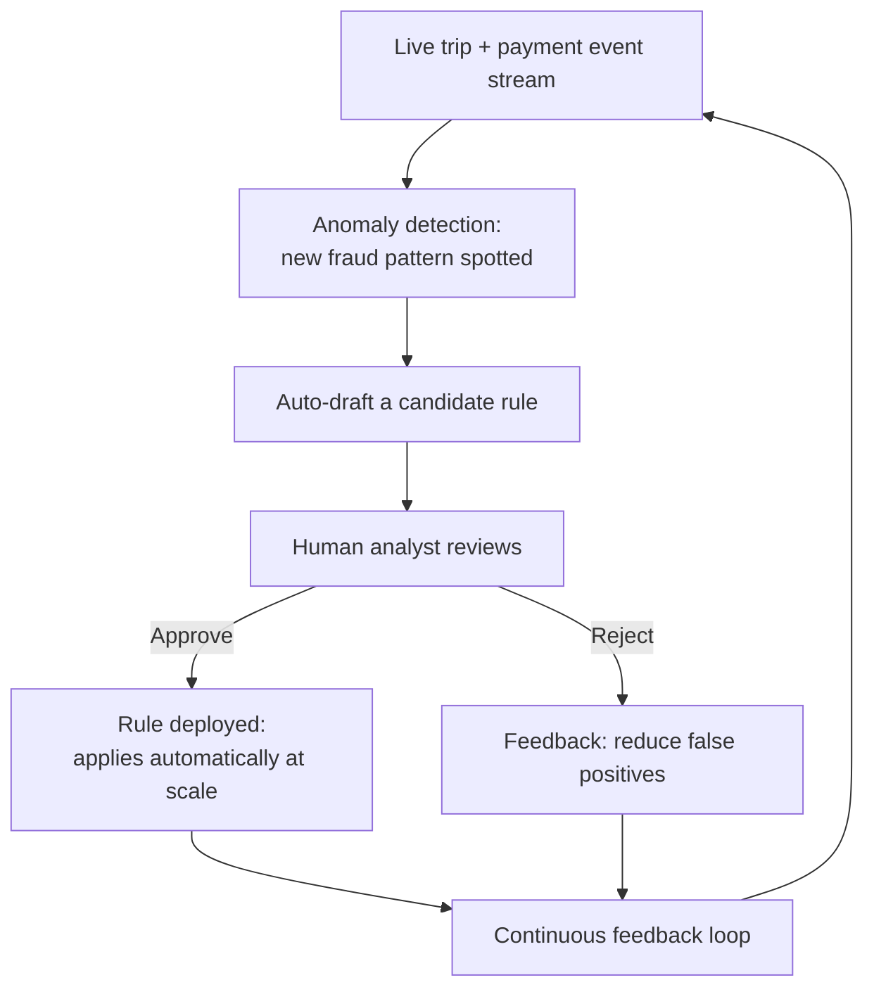

### A memorable shorthand: G.P.S. F.A.K.E.

The categories RADAR watches for:

| Letter | Category |
|---|---|
| G | GPS spoofing |
| P | Padding trip time/distance |
| S | Stolen identity |
| F | Fake fees |
| A | Accept-then-abandon |
| K | Kit/vehicle mismatch |
| E | Entry falsification at signup |

### New problem

RADAR catches fraud *within* the payment system. It does nothing about:

- someone scraping MetroHop's `findNearbyDrivers` endpoint to build a competing supply map, or
- a bot spinning up thousands of fake rider accounts to spam ride requests.

Fraud detection was never meant to be the *only* defense layer.

### The fix, layered on top

- Rate-limit both the read APIs (nearby-driver search) and write APIs (ride requests), per account and per IP.
- Sign and timestamp location pings, so a captured ping can't be replayed later to fake a position.
- Require mutual TLS between MetroHop's own internal services, so a compromised edge service can't quietly impersonate the payment service from the inside.

### How I'd say this in an interview

> "Fraud detection at this scale can't be either pure rules or pure black-box ML — rules alone miss novel patterns, and unaccountable ML making payment decisions is a real risk. RADAR's actual shape is: detect a pattern, draft a rule, have a human approve the *rule*, then let that one approval scale automatically across millions of future trips. And I'd mention rate-limiting and signed location pings unprompted — fraud detection catches money abuse, but scraping and spoofing need their own, separate prevention layer."

---

## Chapter 12 — When the trip itself goes sideways

Every fix so far assumed the happy path. Real trips don't always cooperate, and each of these needed its own explicit answer, not a shrug.

### Case 1: a driver arrives, and the rider never comes out

Left unhandled, the driver just sits there indefinitely, earning nothing, unable to take another ride.

**The fix:** a grace timer starts the moment the driver marks themselves "arrived" — about 5 minutes.

`[illustrative]`

If the rider hasn't confirmed pickup by then:

1. The trip auto-cancels.
2. The rider is charged a no-show fee.
3. The driver is freed back to `Available` immediately.

### Case 2: a phone dies mid-trip — but whose phone matters

**If the *rider's* phone dies:** nothing breaks. The driver's app is the source of truth for `confirmPickup` and `endTrip`, so the trip completes and bills normally off the driver's confirmation regardless. The rider just gets their receipt once they're back online.

**If the *driver's* phone dies:** this is the harder case. The trip doesn't hard-fail. Instead:

1. It uses the last-known position and elapsed time to still compute a fare.
2. It prompts a safety check to the rider.
3. It escalates to support if it doesn't resolve within a timeout.

### Case 3: a regional network partition cuts one city's shard off from the rest of the country

Because of the geo-sharding from Chapter 5, this is almost a non-event for the affected city's own riders and drivers. Their region is self-sufficient — with its own wall, own honeycomb, and own trip database.

Only genuinely cross-region features degrade:

- national trip-history search
- corporate multi-market billing

A rider's ability to get matched with a driver **in their own city** never degrades. This is the direct payoff of geo-sharding, worth naming explicitly the moment a partition question comes up.

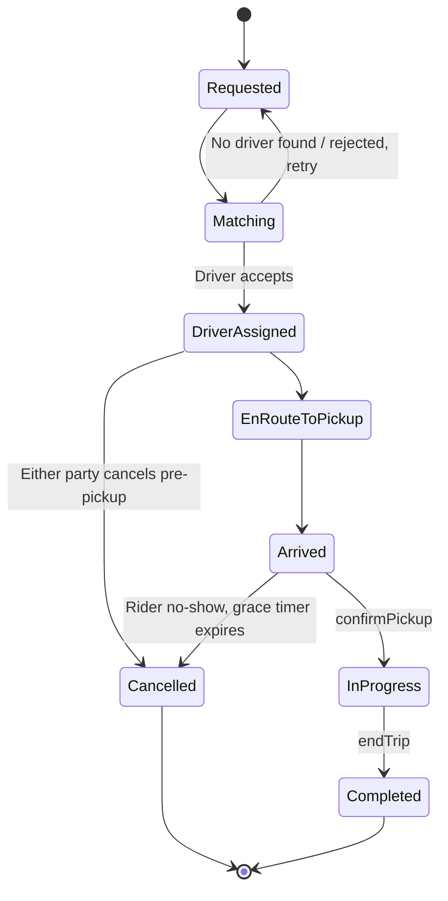

### How I'd say this in an interview

> "Every one of these edge cases follows the same pattern: never leave a party — driver or rider — stuck indefinitely waiting on the other. A no-show gets a grace timer and a fee. A driver's phone dying mid-trip still resolves off last-known state, not a hard failure. And a regional network partition, thanks to geo-sharding, only ever costs you cross-region features — never a city's own core dispatch. That last one is worth saying unprompted; it's the actual return on the sharding investment from Chapter 5."

---

## Where the story actually lands


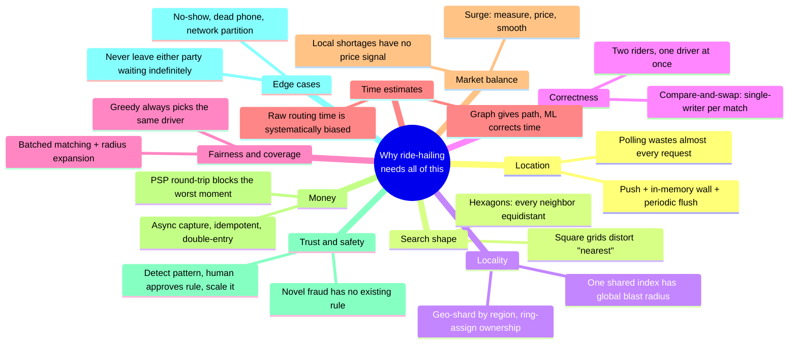

### When to stop walking the chain

Every real ride-hailing design you'll be asked to draw sits somewhere on this chain. The skill isn't reciting all twelve chapters — it's stopping where the stated requirements say to stop.

| If the prompt is about... | Reasonably stop around... |
|---|---|
| A read-heavy "find nearby drivers" feature | Chapter 4 or 5 |
| A full "design Uber" with a payments follow-up | Chapter 10 and 11 |

If nobody's asked about fraud, walking there unprompted reads as padding, not depth. But naming that you *could* go there is still worth a sentence.

---

## Grill me — adversarial follow-ups

**Q1: "Why not just make the polling interval shorter or the thread pool bigger instead of switching to push?"**

Because that only buys headroom, not a fix. A shorter interval means *more* wasted polls, not fewer, and a bigger pool just delays the point where load overwhelms it. The actual problem is that polling makes the client guess when to ask; push lets the information travel the instant it exists, which is a structural fix, not a bigger version of the same waste.

**Q2: "Doesn't the 15-second staleness on 'who's near me' mean riders sometimes see a driver that's already gone?"**

Occasionally, yes — and that's an accepted trade-off, not an oversight. A driver genuinely can move noticeably in 15 seconds. It's why the *dispatch* decision, once a rider actually requests a ride, re-checks live position before finalizing, and why active-trip tracking reads the always-fresh wall directly instead of the index at all.

**Q3: "Why hexagons specifically — couldn't you just use a finer square grid instead?"**

A finer square grid still has the same underlying bug, just at smaller scale — diagonal neighbors are still about 1.4x farther than edge neighbors, no matter how small the squares get. Hexagons fix the shape itself: every one of the six neighbors is genuinely equidistant, so a radius search built on rings of hexagons is actually undistorted, not just "distorted less."

**Q4: "Compare-and-swap on driver status — what stops that from becoming a bottleneck itself under high load?"**

It's a single-row atomic operation scoped to one driver, not a system-wide lock. Two dispatch attempts targeting two *different* drivers never contend with each other at all — only two attempts targeting the *same* driver do, and that's genuinely rare relative to total dispatch volume. It's cheap exactly where you need it to be cheap.

**Q5: "If batched matching adds latency, why not just always use greedy nearest-driver and accept the fairness problem?"**

You could, and it's a legitimate answer for a small system where fleet-wide efficiency doesn't matter yet. At real scale, the fairness problem compounds into a genuine reliability problem — drivers who feel constantly passed over churn off the platform, shrinking future supply. The small batching delay is a deliberate trade for keeping the whole marketplace healthy, not just today's dispatch.

**Q6: "Async payment capture means the rider gets 'trip complete' before you know the charge succeeded — isn't that risky?"**

It's a calculated trade, not a blind risk. The alternative makes every rider wait on an unreliable third party at the worst possible moment, for a guarantee that a background retry-plus-reconciliation pipeline provides anyway, just a few seconds later. The failure modes (retry, DLQ-style escalation, reconciliation sweep) are well understood and don't need the user staring at a spinner to work.

**Q7: "Your fraud fix relies on a human approving every rule — doesn't that cap how fast you can react to a new scam?"**

Somewhat, yes — and that's the accepted cost of accountability. You don't want a payment-and-account-affecting decision made by a fully automated system with no audit trail. The amortization is what makes it work anyway: one human review unlocks automatic enforcement across every future instance of that exact pattern, so the review cost doesn't scale with fraud volume, only with the number of *distinct new patterns*.

**Q8: "Geo-sharding sounds like it just recreates Chapter 1's single-point-of-failure problem, once per region."**

Fair — and that's exactly why each region's shard still needs its own replication underneath it. A regional wall and honeycomb going down should degrade gracefully within that region, not become a second version of the original global outage. Geo-sharding fixes *blast radius* across regions; it doesn't replace the need for redundancy *within* one.

**Q9: "If someone just says 'design Uber' cold, where do you actually start?"**

Name the three-system mental model in one breath — a live geo-index, a matching engine, and a ledger with fraud built in — then ask what scale and what scope: is this the core ride-hailing loop, or does it include surge, fraud, and payments too. Walk forward through location, matching, ETA, and only go as deep into payments and fraud as the interviewer's follow-ups actually pull you.

**Q10: "What's the single most 'aha' number in this whole story?"**

That the entire live-location data for millions of drivers fits in under 2 gigabytes of RAM — the sticky-note wall is tiny. The hard part was never the *size* of the data; it was the *rate* it changes at, 750,000 times a second, which is the number that actually shapes almost every architectural decision in this story.

---

## Cheat sheet — one line per stop on the story

| Stop | One-line takeaway |
|---|---|
| **Polling** | Client-driven "anything new?" wastes almost every request — push lets information travel the instant it exists, walkie-talkie style. |
| **Shared table with location writes** | A write-hot table sharing a database with ACID-sensitive tables (trips, payments) drags them down too — move it to its own in-memory hash table. |
| **Sticky-note wall (Redis)** | One overwritten entry per driver, tiny in total size, but changing hundreds of thousands of times a second — that write *rate*, not the data size, is the real challenge. |
| **Buffered flush + freshness split** | Don't rebuild the spatial index on every write; batch-flush it periodically, and read live position straight from the wall for anything that truly needs to be fresh. |
| **H3 honeycomb** | Hexagons give every neighbor equal distance, fixing the boundary and diagonal-distortion bugs geohash and square quadtrees both have. |
| **Geo-sharding + ring-based ownership** | One wall/index per region keeps traffic local and bounds blast radius; consistent hashing plus gossip (Ringpop-style) reassigns only a thin slice when a machine joins or leaves. |
| **Compare-and-swap on driver status** | The fix for double-dispatch — only one dispatch attempt can flip a given driver from Available to Dispatched; the loser retries against the next candidate. |
| **Radius expansion + batched matching** | Widen the search net in capped steps when nobody's nearby; batch requests briefly and solve as an assignment problem to avoid greedy nearest-driver's fairness problem. |
| **Contraction hierarchies + DeepETA** | Precompute road-network shortcuts offline for fast path-finding; layer a learned correction on top to fix the routing engine's systematic time bias. |
| **Surge pricing** | A per-cell request-to-driver ratio mapped to a smoothed, capped fare multiplier — reads the same geo-index dispatch already built, doesn't need a separate pipeline. |
| **Async payment capture** | Never block "trip complete" on a payment processor's round-trip; settle the charge afterward through a durable event stream, idempotent and double-entry, like a bar tab. |
| **RADAR-style fraud detection** | Detect a pattern, draft a rule, have a human approve the rule once, then let that approval enforce automatically at scale — not a human reviewing every trip. |
| **Edge cases (no-show, dead phone, network partition)** | Never leave either party waiting indefinitely — grace timers, source-of-truth by whichever device is actually present, and self-sufficient regional shards that only lose cross-region features, never core dispatch. |
| **The meta-lesson** | Every fix in this story buys one property (waste reduction, write-rate scale, undistorted search, locality, correctness, fairness, ETA accuracy, market balance, exactly-once money, scalable trust, graceful edge-case handling) by spending something else — say the trade in the same sentence you propose the fix. |
