# Design Twitter — The Story (narrative edition)

> **What this file is.** The reference file, `31-Design Twitter-FAANG-Guide.md`, is the one to recite from — requirements, capacity math, every trade-off table, the master cheat sheet. This file is a second way in: the same material, told as one continuous story in plain language. A fictional one-line-status-update app, **Yappr**, keeps hitting a wall, patches it, and the patch itself opens the next wall — until we land on the exact same hybrid architecture the reference file documents. Yappr is made up. But the walls it hits, and the real systems it eventually converges on, are documented pieces of Twitter's actual engineering history: the "fail whale" era, Raffi Krikorian's 2013 "Timelines at Scale" talk, Snowflake, Manhattan, FlockDB, Earlybird, Finagle, and Home Mixer. Every time a number or detail is a reasonable stand-in rather than a documented fact, it's tagged `[illustrative]`, usually with a short reason why.

**The one-sentence version of this whole problem:** posting is cheap — it's one write — but up to hundreds of millions of people might need to see that one write almost immediately. The entire design of "Twitter" is really just an answer to one question: *who does that expensive distribution work, the writer or the reader, and when?* Everything below is that one question, getting harder in small, honest steps.

---

## Chapter 1 — The query that reads everyone's diary at once

### The setup

It's Yappr's second year. Users post short status lines ("at the gym," "shipped the thing") and follow each other. When a user opens the app, they see a home timeline: everything their follows posted, newest first.

The whole system is one Postgres database with three tables — `users`, `posts`, `follows`. One query does all the work:

```sql
SELECT * FROM posts WHERE user_id IN (SELECT followee_id FROM follows WHERE follower_id = :me)
ORDER BY created_at DESC LIMIT 20;
```

### Why it breaks

This is fine at launch. Yappr has 50,000 users, each following roughly 150 people `[illustrative — Yappr's own invented early numbers]`.

Then a minor celebrity joins. Growth spikes. Six months later, Yappr has 2 million users opening the app several times a day.

Here's what that does to the database:

- Read traffic hits the single database at roughly **18,000 queries/sec** at peak.
- Every single one of those queries is a multi-way join-and-sort against the same `posts` table.
- The database's connection pool saturates.
- Query latency climbs from 40ms to over 3 seconds.
- The home page starts timing out — not just for heavy users, but for *everyone*, because every timeline view runs the same expensive query.

Twitter's own real history has a name for exactly this class of failure: the **"fail whale" era** (roughly 2007–2010). It's a widely documented stretch where a monolithic Ruby-on-Rails app, backed by a single MySQL database, kept buckling under read load it was never shaped to survive. Yappr is now living through its own miniature version of it.

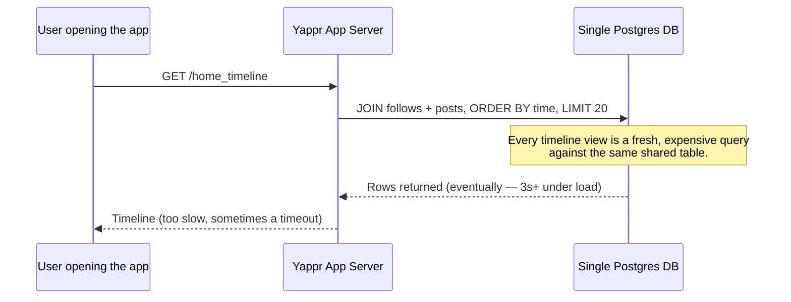

### The insight

The obvious question: *why does viewing a timeline have to be this expensive?*

Because Yappr is doing the "who do I need to hear from" work **at read time, every single time**, for every single view. It's the same join, over and over, for the same person's same follow list — a list that barely changes minute to minute.

### The fix

Stop asking the question at read time. Precompute the answer once, when a post is created, and hand every follower a **pre-sorted mailbox** — a ready-made list waiting for them. Opening the app becomes "check my mailbox," not "go ask everyone I follow if they've written anything."

This is **fan-out-on-write**. Keep the mailbox analogy in mind — it keeps reappearing.

### What breaks next

If every post has to write itself into every follower's mailbox *before* the post is considered "done," posting itself just became expensive. And posting sits on the user-facing critical path: the poster is waiting for their own "posted!" confirmation.

### How I'd say this in an interview

"The naive design does the expensive join at read time, on every single view, which is exactly backwards for a system that's read-heavy by roughly 1000:1. The fix is to move that work to write time and precompute each follower's timeline — but that only works if writing doesn't become the new bottleneck, which is the very next problem."

---

## Chapter 2 — The mailbox gets pre-sorted, and posting gets slow

### The fix from Chapter 1, implemented

Yappr's engineers make posting itself do the fan-out. Here's the flow when you post:

1. The app server looks up your follower list.
2. It inserts your new post's ID into every one of those followers' precomputed timelines.
3. Those precomputed timelines are stored as a list in Redis: `timeline:{user_id}` → list of post IDs.

Reading a timeline is now one cheap list-read, not a join. This is exactly what Twitter's real Timeline Service does — documented publicly in Raffi Krikorian's 2013 "Timelines at Scale" talk: precomputed, Redis-backed timelines, read in O(1).

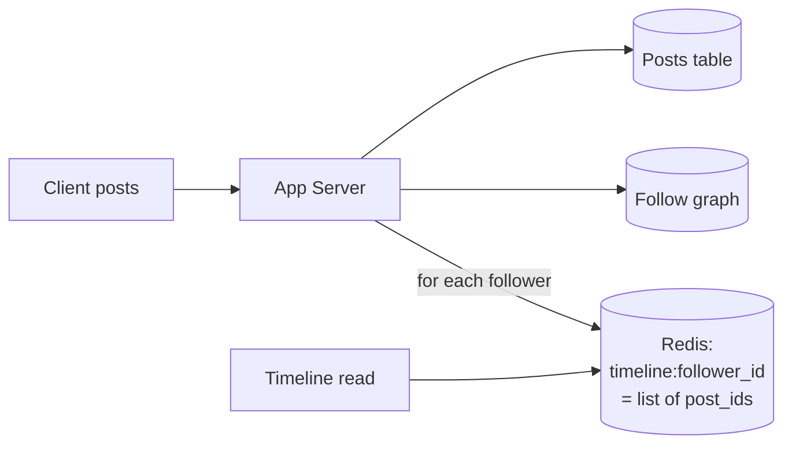

### Reads get fast. Watch what happens to writes.

A typical Yappr user has around 150 followers. Posting costs about 150 Redis list-pushes — a few milliseconds, unnoticeable.

Now a moderately well-known user with **40,000 followers** posts. Walk through what that single post triggers:

1. The app server needs to push this post's ID into all 40,000 followers' mailboxes.
2. It does this **synchronously**, before it can tell the poster "posted!"
3. At roughly 2ms per write, done sequentially, that's **80 seconds** the poster's own request hangs open `[illustrative — a stand-in showing why synchronous fan-out at any real follower count is unacceptable]`.
4. Meanwhile, this burst of 40,000 writes floods the shared Redis cluster, slowing down everyone else's fan-out sitting behind it in the same worker pool.

### The obvious question

*Why should the poster's own request have to wait for 40,000 other people's mailboxes to get updated?*

It shouldn't. Writing to your own database row, and delivering the post to every follower's timeline, are two different jobs. Only the first one needs to finish before you can say "posted."

### The fix

Decouple the two jobs:

- The post write happens **synchronously** — fast, one row.
- Fan-out to followers happens **asynchronously**, off an event stream, after the response has already gone back to the poster.

Yappr adds a Kafka-style event log. The new flow:

1. Post the row.
2. Publish a `PostCreated` event.
3. Ack the client immediately.
4. Background fan-out workers pick up the event and do the 40,000 mailbox updates on their own time.

Twitter's real system does exactly this. Kafka is the documented backbone that decouples the write path from fan-out, search indexing, and counters — all consuming the same event independently.

### What breaks next — the real problem

Async fan-out fixes the poster's own latency. It does **not** fix the *size* of the fan-out.

Now imagine not a 40,000-follower user, but one with **12 million followers**. That's 12 million mailbox writes sitting in a worker queue. While those workers grind through them, every *other* post's fan-out is stuck waiting in line behind it — a queue backlog that delays timelines for millions of unrelated users who never even follow the celebrity in question.

### How I'd say this in an interview

"Fan-out-on-write turns expensive reads into cheap ones, and moving the fan-out off the synchronous write path with a queue fixes the poster's own latency. But neither fix changes the actual amount of work a huge-follower-count post generates — that's a separate, harder problem, and it's the one every real design of this system eventually has to name explicitly: the celebrity."

---

## Chapter 3 — The megaphone problem, and the VIP holding pen

### The scale of the problem

Worked number: Yappr's biggest account has 12 million followers.

Fanning that single post out to 12 million Redis mailboxes — even asynchronously — is still 12 million writes competing for the same shared worker pool and the same Redis cluster that every other, much smaller post is also using. One megaphone announcement can flood every mailbox in the building and jam the whole delivery system for hours.

This is the exact problem Krikorian's "Timelines at Scale" talk names directly: a small number of extremely high-follower accounts (his real example: exactly this kind of huge-audience account) can't go through the same push pipeline as everyone else without breaking it for everyone else too.

### The obvious question

*Do we just… not push the celebrity's post to everyone?*

Right — and the insight is that you don't have to. Think about what a regular user's timeline read actually looks like: they check maybe a few hundred people they follow, and almost none of those people are celebrities. So instead of pushing a celebrity's post into millions of mailboxes nobody's about to check anyway, just **hold it in one place** and fetch it only when someone who actually follows that celebrity opens their timeline.

### The fix: a VIP holding pen

Posts from huge-follower-count accounts skip the mailbox system entirely and sit in one small, shared pool.

When any reader opens their timeline, the Timeline Service does two things at once:

1. Reads their normal precomputed mailbox (fast, from Redis — the Chapter 1/2 fix).
2. Checks the VIP pen for any celebrities that specific reader follows.

Then it **blends the two lists together at read time**, before returning the final timeline.

This is **hybrid fan-out** — push for everyone typical, pull-and-blend for the megaphone accounts. It's exactly what real Twitter's production system does. The blend step is the job of Twitter's real, 2023 open-sourced recommendation-pipeline component called **Home Mixer**.

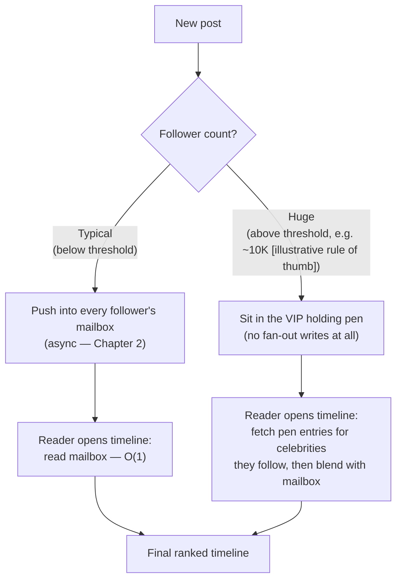

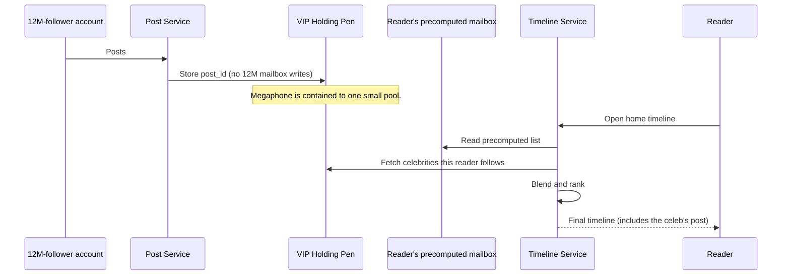

Zoom out on a single post's whole life, from either path, and it looks like this:

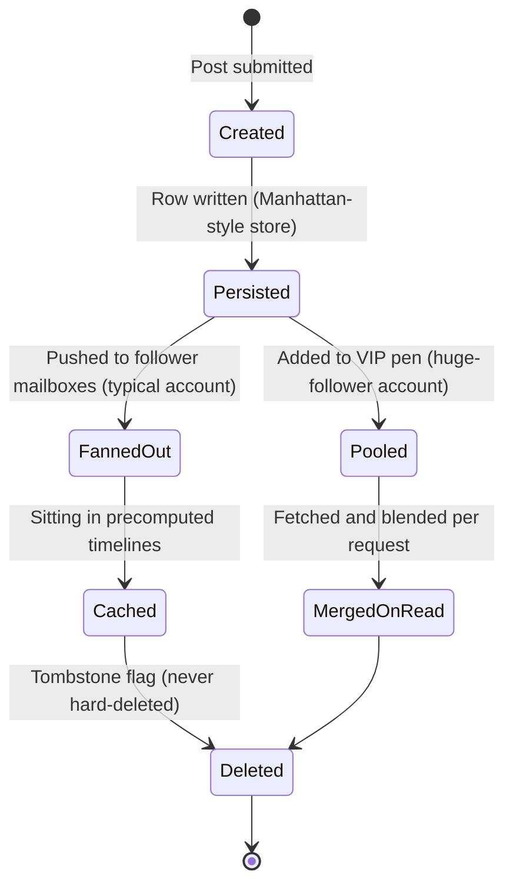

### One layer down: reposts complicate the data model

Yappr adds two more actions:

- **Repost** — share someone else's post as-is.
- **Quote-repost** — share it with your own added comment.

Here's the trap: a repost of a *celebrity's* post is itself a brand-new post. That means it has to walk back through this exact same fan-out decision, from scratch. It's easy to mistakenly treat a repost as a lightweight pointer that just "counts" against the original — and forget that if the person doing the reposting is themselves huge-follower-count, their repost re-triggers the whole VIP-pen path all over again.

The fix here is a modeling one, not a new mechanism:

- A **repost** is a new row in the same `posts` table, with an empty body and a pointer (`repost_of_id`) back at the original.
- A **quote-repost** is the same row shape, except the body is filled in with the quoting user's own text.

Same pointer column, one flag decides which kind it is:

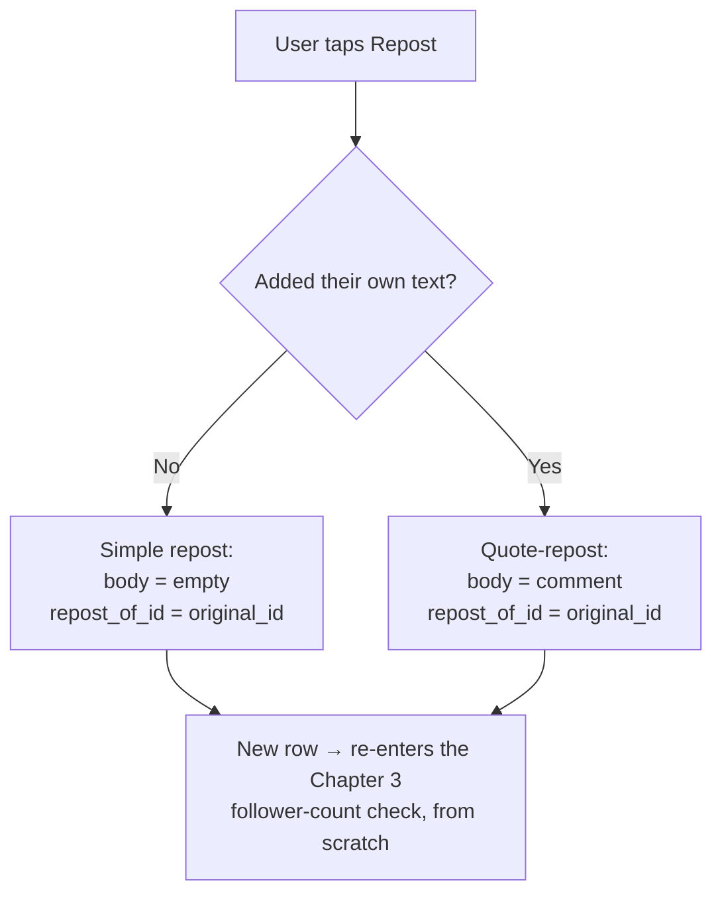

Both re-enter fan-out exactly like any new post, celebrity threshold included — because as far as the fan-out system is concerned, that's exactly what they are.

### How I'd say this in an interview

"Pure push collapses on the celebrity case, and pure pull would make every single read expensive — so real systems, and Yappr, land on hybrid: push for typical accounts, hold-and-blend-at-read-time for huge ones, with the blend happening in something like Twitter's real Home Mixer. The detail people forget: a repost or quote-repost isn't a special 'share event,' it's a brand-new post that walks through this exact same push-versus-pen decision from scratch."

---

## Chapter 4 — The ticket dispenser that needs no coordinator

### The problem, underneath everything else

Every post needs a unique ID. Ideally, IDs also sort roughly by time, so a timeline can just be "IDs in order" — with no separate timestamp index to maintain.

Yappr starts with a single auto-increment column. Fine on one database.

But once posts are being accepted by *many* app servers writing to *many* database shards (needed once volume outgrew one box), a single auto-increment counter becomes, again, one shared, contended resource. That's exactly the kind of single-point bottleneck this whole story keeps running into.

### The fix: Snowflake IDs

Twitter actually built and open-sourced this in 2010, documented in their own "Announcing Snowflake" engineering post.

Each Snowflake ID is a 64-bit number built from three parts:

1. A **timestamp**.
2. A **fixed ID for the machine** that generated it.
3. A **per-machine sequence counter**.

Because of this structure, any machine, anywhere, can hand out a globally-unique, time-sortable ID **without ever asking a coordinator or another machine for permission.**

### The analogy

Think of a bakery with multiple ticket dispensers, one per counter. Each dispenser prints tickets stamped with:

- the time,
- plus its own dispenser number,
- plus a running count.

Two different dispensers never print the same ticket. And because every ticket carries the time it was printed, you can always tell which one came first just by reading the number — no need to check a master log.

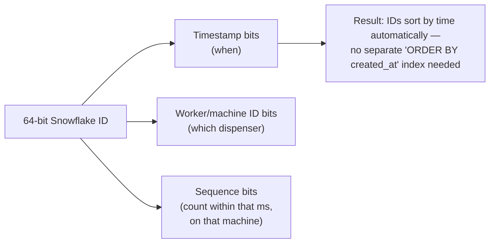

### What breaks next

IDs generated for free is nice — but it exposes a bigger structural gap Yappr's been quietly ignoring. Everything is still crammed into one kind of storage. Post text, huge video files, and the follow graph are three completely different shapes of data, with three completely different access patterns. Treating all of them as "just more rows in the database" is starting to cost real money and speed.

### How I'd say this in an interview

"Time-ordering and uniqueness across many machines, with zero coordination, is exactly what Snowflake IDs give you — timestamp plus machine ID plus a local sequence, so you never need a shared counter or a lock. It's a small fix, but it quietly removes a whole class of contention that would otherwise reappear every time you add another write path."

---

## Chapter 5 — One truck for the piano, a different one for the jewelry

### The problem

Yappr is still storing post text, video files, and follow-relationships in the same relational database.

Worked number: video posts now make up 20% of new content, averaging roughly 1MB each `[illustrative — Yappr's own blended average]`. At Yappr's volume, that's already several terabytes a month of binary data sitting in rows next to 280-character text posts — bloating backups, slowing down unrelated queries, and making the database impossible to reason about capacity-wise.

### The obvious question

*Does one store really have to hold all of this?*

No. The tell is that each kind of data has a completely different shape and query pattern:

| Data type | Shape | Access pattern |
|---|---|---|
| Post text/metadata | Small, structured | Fast key-lookup by ID, huge write volume |
| Video/images | Large, binary | Immutable, read far more than written |
| Follow graph | Relationship pairs | Exactly two query shapes forever: "who follows X" and "who does X follow" — nothing deeper |

### The fix: split by workload, not convenience

One truck per cargo type. Real Twitter did exactly this, and named each piece:

- **Manhattan** — a distributed key-value store Twitter built and moved to in 2014 (documented, after outgrowing an earlier Cassandra deployment). Used for post/account metadata: high-QPS lookups by ID, needs durability, not deep queries.
- **Blobstore** — Twitter's own documented (~2012) object store for media. Video and images live here, never inline in the metadata store, and CDN edge caching sits in front of it for reads.
- **FlockDB** — Twitter's real, documented (open-sourced 2010) social-graph store. Notably *not* a general graph database: it's sharded MySQL underneath, storing a forward table (who I follow) and a backward table (who follows me), because Twitter's actual queries never need multi-hop graph traversal — just "list followers," "list followees," "does A follow B."

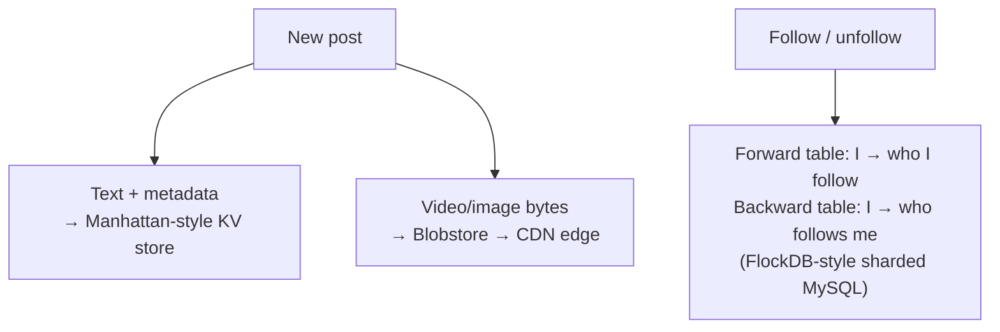

### Why the graph store stays cheap — worked example

Let's actually run the numbers:

- Yappr has 2M users, each averaging 150 follows.
- That's 2,000,000 × 150 = **300,000,000 directed edges**.
- Each edge row stores `follower_id` + `followee_id` + `timestamp` — 8 bytes each, so 24 bytes per row.
- 300,000,000 rows × 24 bytes = **≈7.2 GB** for one direction.
- Store both a forward table and a backward table, and it roughly doubles: **≈14.4 GB** total.

`[illustrative — Yappr's own numbers, same math shape as the reference guide's worked example]`

That's tiny compared to the media store. The follow graph's real cost was never the bytes at rest — it's the fan-out *read/write pattern* against it from Chapters 2–3, not its storage footprint.

### What breaks next

Splitting storage by workload solves "which store," but it does nothing about one specific *key* inside any of these stores getting hammered. A single viral post's like-counter is about to become the next hot spot — and it lives in none of these three stores comfortably.

### How I'd say this in an interview

"Once you have more than one shape of data, one database for everything stops making sense — you match the store to the access pattern: fast KV for metadata, blob storage plus a CDN for media, and for the follow graph specifically, a sharded relational store beats a general graph database because the real query set is shallow — who follows whom, never deep traversal."

---

## Chapter 6 — The cash register that two clerks add up at once

### The problem: a viral counter

A post goes viral: **80,000 likes in ten minutes.** Every like is a `+1` against that one post's like-counter. If that counter lives as a single row, every one of those 80,000 increments is fighting over the same row, the same lock, the same disk page.

It's worse than that, though. Yappr's naive counter code does a **read, then a write**: read the current count, add one, write it back. Under concurrency, that's a race condition. Walk through it step by step:

1. Request A reads the count: `4,201`.
2. Request B reads the count (before A's write lands): also `4,201`.
3. A computes `4,201 + 1 = 4,202`.
4. B computes `4,201 + 1 = 4,202` — same result, because B started from the same stale read.
5. A writes `4,202`.
6. B writes `4,202`.

The true count should be `4,203` (two likes happened). Instead it's stuck at `4,202`. One like just silently vanished — a **lost update**.

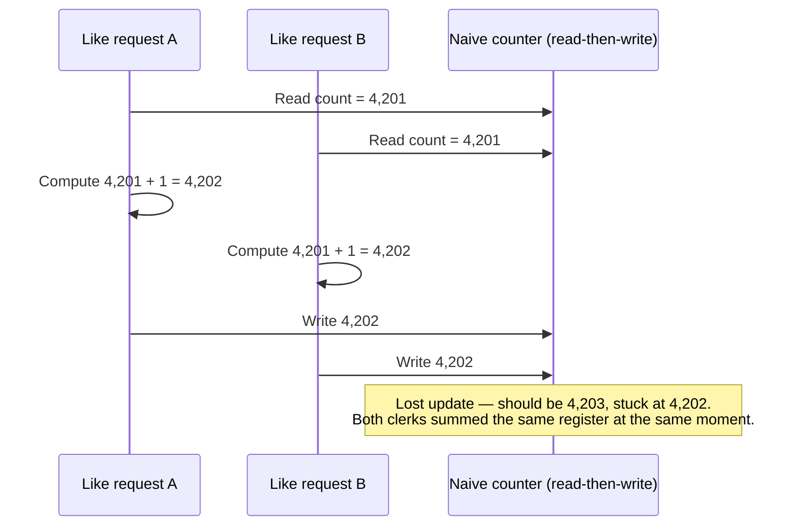

### The obvious question

*Why does a counter need a read step at all?*

It doesn't. Never read-then-write a shared counter. Use an atomic increment instead — Redis `INCR`, or an atomic op on the metadata store — so each like is one indivisible operation with no window for two requests to race.

### That fixes correctness. Throughput is a separate problem.

Even with atomic ops, 80,000 increments a minute all landing on one physical counter is still a throughput problem on a single machine — that one counter is a **hot key**.

### The fix: sharded counters

Split one logical counter into N physical shards, spread across different machines:

- Each increment lands on a random shard.
- Reads sum across shards.
- The sum is periodically pre-aggregated, so a read never has to fan out live to all N shards.

Same idea as many cash registers ringing up sales in parallel, reconciled into one till total at intervals — instead of one register that every clerk has to queue up at.

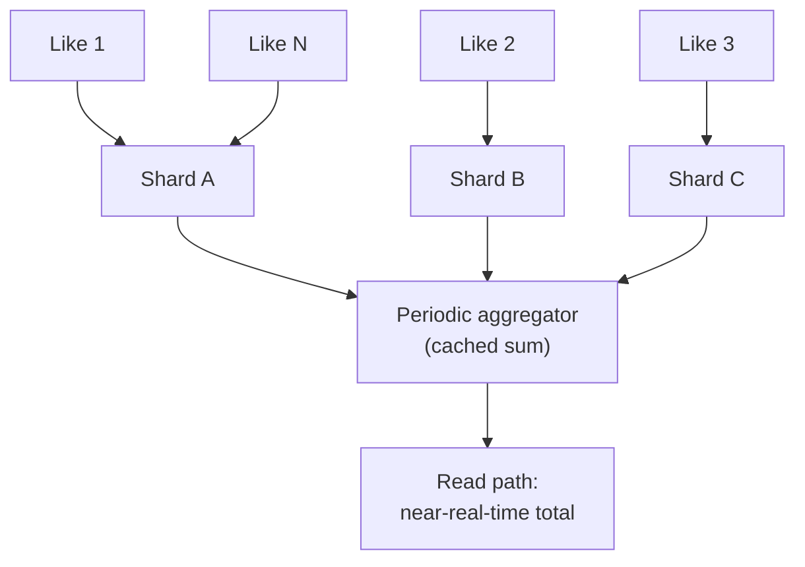

### The same shape of problem, one level up: trending topics

Yappr wants a "trending now" panel — the same heavy-hitter idea, but:

- over *hashtags* instead of one post,
- changing minute to minute, instead of settling on a final number.

The question this raises: what time window do you even count over?

| Window | Pro | Con |
|---|---|---|
| 1 minute | Feels instantly live | Noisy — a burst of bot accounts can fake a trend `[illustrative — general known risk with short windows]` |
| 5–15 minutes | Balances freshness and stability | Misses slow-building trends |
| 1 hour+ | Smooths noise, cheap to recompute | Feels stale for breaking news |

The standard toolkit for this: a **count-min sketch** (an approximate, memory-cheap frequency counter) feeding a **min-heap of size K**, per sliding window, per region. It's the same sharded-counter idea, just applied over a rolling time window instead of one fixed total `[illustrative — general streaming pattern, not confirmed as Twitter's specific internal implementation]`.

### How I'd say this in an interview

"Never read-then-write a shared counter — atomic increment only, or concurrent likes silently lose updates. For the throughput side of the same problem, shard the counter across machines and aggregate on a schedule. Trending topics are the exact same heavy-hitter idea stretched over a sliding time window, usually with a count-min sketch plus a small heap, and a minimum-count floor so a handful of bot accounts can't fake a trend."

---

## Chapter 7 — Two different mailboxes, and only one of them lies

### Two caches, not one

Yappr now has two separate caches, and it matters that they're different:

1. **Timeline cache** (Chapter 1/2's fix) — holds a list of post *IDs* per user, in Redis.
2. **Object cache** — holds the actual hydrated content of each post: text, media links, like counts, keyed by post ID.

Why does the object cache need to exist separately? Because re-fetching post content from Manhattan on every single timeline render would defeat the whole point of caching.

Conflating these two caches causes a real bug.

### The bug

A user deletes a post. Walk through what happens if only the metadata store is updated:

- The object cache still has the old, "deleted" post's content cached.
- Anyone whose page still has that post cached keeps seeing it — it just keeps rendering as if nothing happened.
- Meanwhile, the post's *ID* is still sitting in thousands of followers' timeline lists too — but that part is harmless. A dangling ID that resolves to nothing at hydration time just quietly disappears from the rendered feed.

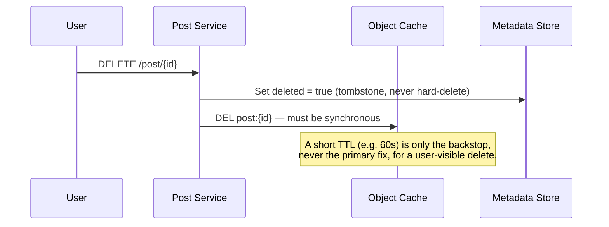

### The fix: treat the two caches differently

| Cache | Behavior on delete |
|---|---|
| Timeline-ID cache | Self-healing — leave stale IDs in it, they just fail to hydrate. No action needed. |
| Object cache | Must be explicitly busted, **synchronously**, the moment a delete happens. A short TTL is only a backstop for the rare miss. |

Twitter doesn't support editing post text at all — only delete. That sidesteps an entire category of "stale edited content" bugs. If a variant of this system does allow edits, treat an edit exactly like a delete-then-recreate for cache purposes.

### What breaks next

Caching keeps *recent* content fast. But Yappr never deletes data — that's a real reliability requirement: tombstone, don't drop the row. And search needs to work over years of history, not just what's warm in a cache.

### How I'd say this in an interview

"There are two caches here, not one — a list of IDs, which is cheap to leave stale, and hydrated content, which is where staleness actually causes user-visible bugs. Delete has to synchronously bust the object cache; a TTL is only the backstop, never the primary mechanism."

---

## Chapter 8 — A sticky note pad for today, an archive room for everything

### The problem

Yappr adds search. The naive approach — scan the posts table for matching text — is fine at small scale and catastrophic once there are billions of rows. A full scan doesn't get cheaper just because you asked nicely.

### The fix: an inverted index

For every word, keep a list of which post IDs contain it. A search for a word becomes a direct lookup, not a scan.

Twitter's real, documented system for this is **Earlybird** — a real-time search engine built on top of Apache Lucene, described in Twitter's own 2011–2012 engineering writeups on real-time search.

### The deeper decision: two tiers, not one

"Recent" and "everything ever" have very different cost profiles, so split the index into two tiers:

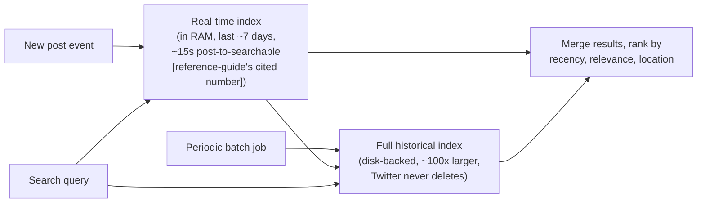

### The analogy

Picture a receptionist's sticky-note pad for today's walk-ins — fast, small, in-memory. That's the RAM tier, and it covers the searches most people actually want.

Now picture an archive room in the basement for everything that ever happened — slower, disk-backed, huge, built by a nightly batch job rather than maintained live.

Most searches never need the archive room. But it has to exist, because "never delete" means the historical record only grows.

### What breaks next

Nothing about search itself creates a new problem. But it exposes the general theme this whole system leans on: cheap-and-fast in front, expensive-and-complete behind.

The next wall Yappr hits isn't about data at all. Yappr now has dozens of internal services (post, timeline, search, graph, notifications) calling each other — and a single central load balancer in front of all of them is quietly becoming its own bottleneck.

### How I'd say this in an interview

"Search over a dataset that only ever grows and is mostly-recent-biased is the standard case for a two-tier index: an in-memory real-time tier that covers what most searches want, backed by a much larger, batch-built historical tier for everything else. Real Twitter's version of the real-time tier is Earlybird, running on Lucene."

---

## Chapter 9 — The dispatcher that becomes the traffic jam

### The problem

Yappr now has dozens of internal microservices, each with many instances, all calling each other. Every call goes through one central load-balancer tier.

As service count grows, that central LB becomes three problems at once:

1. **Latency** — an extra network hop on every single call.
2. **Bandwidth** — a single shared pipe all that traffic squeezes through.
3. **Single point of failure** — if it falls over, it takes every service down with it.

Twitter's own real transition — from a Ruby-on-Rails monolith to a mesh of many independently-deployed JVM services — made this exact pain concrete at their scale. That's why they built **Finagle**, their own documented, open-sourced (2011) RPC framework, with load balancing embedded in every service instead of centralized in one tier.

### The fix

No central dispatcher. Every service instance carries its **own** embedded load balancer and picks who to call itself, using a shared service registry to know who's healthy.

Two separate things need to be balanced fairly here, and they're easy to conflate:

- **Requests** — which single call goes where.
- **Sessions** — the underlying connections themselves, since not every client talks to every server instance.

### Requests: the easy half

**Power of Two Choices (P2C)**: for each request, randomly pick 2 candidate instances, and send it to whichever currently has less load. It's cheap (no global state needed) and provably close to optimal — exponentially better than picking one instance at random.

### Sessions: three real attempts to get right

The evolution here is worth narrating, because each step fixes the previous step's flaw:

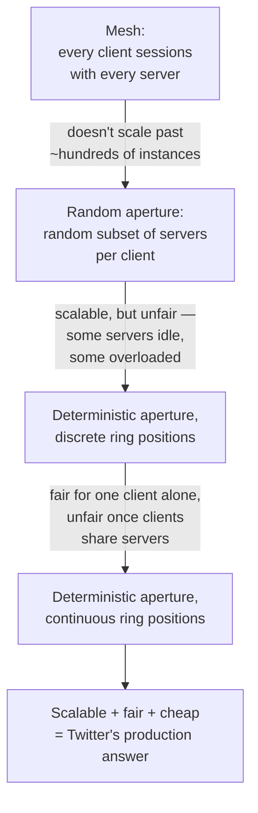

**How the final, continuous-ring version actually works:**

1. Picture every client and every server placed on one shared circle, like numbers on a clock face.
2. Each client claims a contiguous arc of that circle — a start point and a width.
3. The width grows or shrinks with how much traffic that client is sending.
4. Different clients' arcs are allowed to overlap the same servers — that's expected.
5. Inside its own arc, a client just runs P2C to pick who serves each session.

Net effect: adding or removing a server barely disturbs anyone else's arc, and nobody needs a central coordinator to keep the whole thing fair.

### How I'd say this in an interview

"At service-mesh scale, a centralized load balancer becomes the extra hop, the bandwidth chokepoint, and the single point of failure, all at once — so you push load balancing into every client instead. Requests get solved cheaply with power-of-two-choices; sessions took Twitter three real iterations — mesh, then random aperture, then a discrete ring, then a continuous ring — because each earlier version was either unscalable or unfair, and the continuous ring is the one that's actually both scalable and fair."

---

## Chapter 10 — The last few doors, closed one at a time

A handful of smaller problems round out the design. Each one has the same shape as something already seen.

### Media at scale

Routing every video upload through the app servers chokes them on bandwidth alone. The fix:

- The client uploads directly to Blobstore via a short-lived, scoped **presigned URL** — the app server never touches the bytes.
- Reads go through a CDN, falling back to origin only on a cache miss.
- Video is transcoded into multiple resolutions asynchronously, off the post's critical path — the same principle as Chapter 2's "don't block the fast thing on the slow thing."

Worked number: at Yappr's traffic, if media reads for the whole app were served straight from origin, that's easily hundreds of gigabits per second. With a 95%+ CDN cache-hit ratio, origin only has to absorb the 5% miss traffic — a 20x reduction, and served from edges near the reader instead of backhauled globally.

### Notifications are not a timeline fan-out

If every post from someone you follow triggered a push notification, that recreates Chapter 3's megaphone problem — but worse. Push gateways (Apple's APNs, Google's FCM) are third-party, rate-limited services, not something Yappr controls.

The fix:

- Only **high-intent** events notify at all: a mention, a reply, a like on *your* post, a new follower.
- Even those get batched — "12 people liked your post" instead of 12 separate pings.

Worked number: at 10 likes/post average across Yappr's post volume, per-like pushes would run into the thousands per second at peak. A 5-minute batching window collapses that by roughly 10–50x `[illustrative — same shape of math as the reference guide's own worked example]` — and it reads better to the user besides.

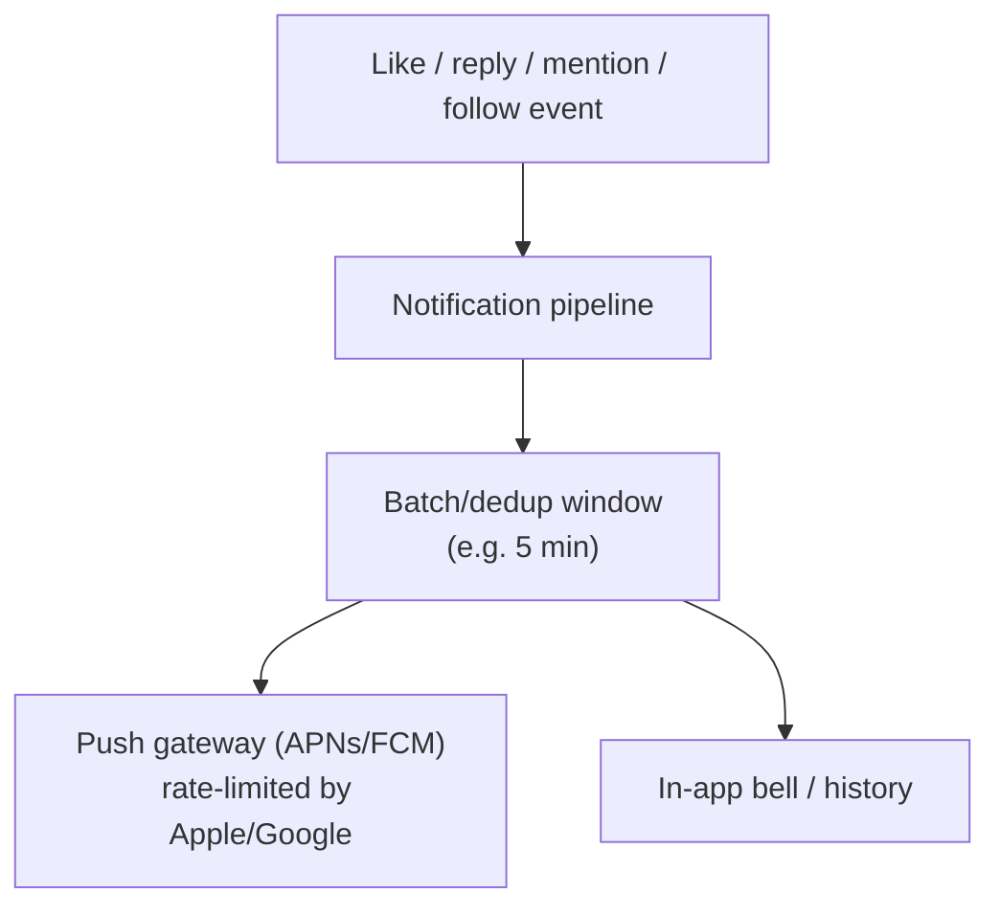

### Rate limiting and spam

A token bucket per `(user_id, action)` catches obvious abuse cheaply, before anything expensive gets involved.

- Twitter's real historical public API limit was 300 posts per 3-hour window.
- Enforced with a Redis counter and an `EXPIRE` on the window.
- Bot-ring graph analysis runs as an offline batch job, not on the live request path.

### Blocked accounts must be filtered everywhere, not just the main feed

Because timelines are precomputed (Chapter 2) and cached (Chapter 7), it's easy to forget that a blocked or private account's posts can leak back in through the *cached* path — unless the fan-out workers or the read-time blend step explicitly filter them out.

This is the single most commonly forgotten detail in this whole design, and worth naming even if nobody asks.

### How I'd say this in an interview

"These last few are smaller, but they all rhyme with earlier fixes: don't route big binary payloads through your app servers, don't let a high-fan-out feature (notifications) recreate the celebrity problem you already solved for timelines, and rate-limit cheaply before you ever run an expensive spam classifier. And always double check that anything precomputed or cached still respects blocks and privacy — caching is exactly where that kind of leak hides."

---

## Where the story actually lands


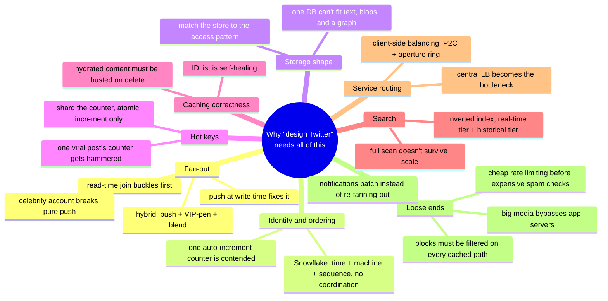

Every real "design Twitter" interview lands *somewhere* on this chain. The skill isn't reciting all ten chapters cold — it's stopping where the actual requirements say to stop.

- If the interviewer never mentions huge-follower accounts, sketch Chapters 1–2 and volunteer Chapter 3 unprompted as the "here's the edge case I'd want to handle" line.
- If they ask specifically about the feed-ranking/fan-out sub-problem in depth, that's a different, deeper conversation. This file covers "design Twitter" end to end; a dedicated deep-dive on feed generation itself goes further than any one chapter here does.

---

## Grill me — adversarial follow-ups

**Q1: "Why not just throw more database replicas at Chapter 1's problem instead of redesigning the whole read path?"**

Replicas help with raw read throughput, but every replica is still running the same expensive multi-way join on every single view. You're paying the same cost per read, just spread across more machines — and you pay it again on the next read a millisecond later. Precomputing the answer once at write time removes the repeated cost entirely, instead of just distributing it.

**Q2: "Isn't fan-out-on-write just moving the same expensive work from read time to write time — why is that better?"**

Because writes happen once per post, and reads happen roughly a thousand times more often than writes for a system like this. Doing the expensive work once, at write time, and reading a precomputed answer a thousand times, is strictly less total work than redoing that same expensive join on every one of those thousand reads.

**Q3: "What's actually different between what Chapter 3's celebrity fix solves and what Chapter 6's sharded counters solve — aren't they both 'hot key' problems?"**

They're the same *shape* of problem — one thing getting disproportionate traffic — but different layers:

- Chapter 3 is about the volume of *fan-out writes* one post triggers, fixed by skipping the write entirely for huge accounts and merging at read time.
- Chapter 6 is about many *concurrent increments* against one counter value, fixed by splitting that counter across shards.

Naming both as "hot key, different layer" is exactly the kind of answer that shows you're not just pattern-matching a buzzword.

**Q4: "If Redis holding the timeline cache goes down, doesn't the whole hybrid design collapse?"**

No. Redis is replicated (primary/replica), and a cache-node loss falls back to a slower cold read from the metadata store rather than losing data. Request coalescing avoids a thundering herd of identical cold reads hitting the origin store at once. It's a latency spike, not data loss — that's the distinction to draw explicitly.

**Q5: "You said Twitter never deletes posts — doesn't that just mean storage grows forever and eventually becomes unaffordable?"**

It grows forever by design — a delete is a tombstone flag, not a row removal. But text/metadata storage is cheap per unit (a few hundred bytes each) compared to media, so the real cost driver is video/image storage. That's exactly why that data lives in a separate, cheaply-scalable blob store instead of inline in the same database as post text.

**Q6: "Why does a repost need to re-run the entire celebrity fan-out check — can't you just increment a counter and call it done?"**

Because a repost isn't a lightweight "share" event — it's a genuinely new post row that appears on the reposting user's own followers' timelines. If that user happens to be huge-follower-count themselves, skipping the check would let exactly the fan-out storm Chapter 3 fixed sneak back in through a different door.

**Q7: "For search, why not just always search the full historical index — isn't the two-tier split just added complexity?"**

Because the full index is disk-backed and roughly 100x larger. Hitting it for every search — when the overwhelming majority of real searches want something from the last few days — pays a latency and infrastructure cost for the common case, just to avoid maintaining a second, smaller tier. The two-tier split exists specifically because "recent" and "everything ever" have such different cost profiles that serving both from one tier is worse for both.

**Q8: "Client-side load balancing puts load-balancing logic in every single service — isn't that a maintenance nightmare compared to one central LB you patch in one place?"**

It's a real cost — which is exactly why Twitter didn't hand-roll it per service. It's packaged once as a shared library (Finagle) that every service links against, so the logic itself is centralized in code even though the *execution* is decentralized across every instance. You pay a small amount of embedded complexity everywhere, in exchange for removing an extra network hop, a bandwidth chokepoint, and a single point of failure.

**Q9: "Given this whole story, if someone says 'design Twitter' cold, where do you actually start talking?"**

1. Say the one-sentence mental model first: cheap write, expensive distribution to readers, and the whole design is about who does that work and when.
2. Then say the two numbers that justify almost everything else: a roughly 1000:1 read-to-write ratio, and the existence of a small set of extreme-follower-count accounts that break any uniform design.

Everything from there — fan-out, hybrid, caching, sharded counters — falls out as a direct answer to those two facts, not as a list of buzzwords to recite.

---

## Cheat sheet — one line per stop on the story

- **Naive read-time join**: one expensive query per view collapses a single database at real read volume — Twitter's own real "fail whale" era is exactly this failure shape.
- **Fan-out-on-write**: precompute each follower's timeline at post time so reads become a cheap O(1) list-read — the "pre-sorted mailbox."
- **Async fan-out via a queue**: decouple the poster's own response from the (potentially huge) job of updating every follower's mailbox.
- **Hybrid fan-out + VIP pen + blend**: push for typical accounts, hold-and-merge-at-read-time for huge-follower accounts — the real fix for the celebrity/megaphone problem, and the job Twitter's real Home Mixer does.
- **Repost/quote-repost**: same row shape, empty body = repost, filled body = quote — and both re-enter fan-out as a brand-new post, celebrity check included.
- **Snowflake IDs**: timestamp + machine ID + local sequence — globally unique, time-sortable, and needs zero coordination between machines.
- **Polyglot storage**: match the store to the data shape — fast KV for metadata (Manhattan-style), blob store + CDN for media, sharded relational tables for the follow graph (FlockDB-style, not a general graph DB).
- **Sharded counters + atomic increment**: never read-then-write a shared counter (race condition, lost updates); split hot counters across shards and aggregate on a schedule.
- **Trending topics**: the same hot-key idea over a sliding time window — count-min sketch plus a small heap, with a minimum-count floor against bot bursts.
- **Two caches, not one**: a list of IDs (self-healing, stale entries just don't hydrate) versus hydrated object content (must be busted synchronously on delete — TTL is only the backstop).
- **Two-tier search**: an in-memory real-time index for recent content, a much larger batch-built historical index behind it — Twitter's real Earlybird, on Lucene.
- **Client-side load balancing**: no central LB at service-mesh scale — every service balances its own calls (Finagle); P2C for requests, a continuous-ring "aperture" for fair session distribution.
- **Media/CDN, notifications, rate limiting, block-filtering**: smaller fixes that rhyme with earlier ones — don't route big payloads through app servers, don't let notifications recreate the celebrity storm, rate-limit cheaply before running expensive spam checks, and never forget that a cached/precomputed path can leak blocked content if nobody explicitly filters it.
- **The meta-lesson**: every fix here buys one property (fast reads, fast writes, surviving one huge account, correct ordering, matched storage cost, correct counts, correct cache freshness, fast search, fair routing, or contained blast radius) by spending something else — say the trade in the same breath you name the fix.
