# Design Newsfeed System — The Story (narrative edition)

## What this file is

The reference file, `32-Design Newsfeed System-FAANG-Guide.md`, is the one to recite from. It has the requirements, the capacity math, every trade-off table, and the master cheat sheet.

This file is a second way in. It's the same material, told as one continuous story, in plain language.

Here's the shape of the story: engineers at a company keep hitting a wall. They patch it. The patch creates a new wall. Eventually, after enough patches, they land on the exact same design the reference file documents.

The company is **Quadster** — a fictional campus social app. But every wall it hits, and every fix it reaches for, is based on something a real, named system actually did:

- Facebook's **EdgeRank**, and the multi-stage ML ranking pipeline that replaced it.
- Instagram's 2016 switch from chronological to ranked feed — and its 2022 reintroduction of a chronological "Following" tab.
- LinkedIn's public **Feed Mixer** architecture.
- Twitter's 2023 open-sourced recommendation algorithm.

Every time a real fact comes up, I'll say clearly whether it's documented fact or just a reasonable, labeled guess.

## The trigger phrases

Watch for these in an interview: *"design a newsfeed / timeline / home page,"* *"how would you rank what shows up first,"* or *"the feed just shows everything in order — what's wrong with that?"*

Keep one sentence in your head as you read everything below:

> **A newsfeed's whole job is deciding, out of everything you could possibly see, what to show first — and that one decision gets harder every time the amount of stuff you could see grows faster than your attention does.**

Everything in this story is that one idea, getting harder in small, honest steps. This version leans hardest into **ranking** and **feed storage**. The fan-out mechanics (push vs. pull, the celebrity problem) are covered elsewhere, and only get a supporting-cast mention here.

---

## Chapter 1 — The feed that only made sense with 20 friends

### The starting point

Quadster launches at one college campus. Students follow roughly **20 people** — actual friends, mostly.

The feed query is the simplest thing that could possibly work:

```sql
SELECT * FROM posts
WHERE author_id IN (following)
ORDER BY created_at DESC
LIMIT 20
```

That's pure reverse-chronological order: newest post first, nothing else considered. It feels great, because with only 20 follows, "most recent" and "most relevant" are basically the same list.

### Where it breaks

Two years later, Quadster is on 40 campuses. The average student now follows **400 accounts** `[illustrative]` — friends, dorm groups, club pages, intramural sports teams, and a meme account called "Quad Memes Daily."

That meme account posts every **4 minutes** — about 360 posts a day `[illustrative]`.

Here's the exact moment it breaks, step by step:

1. A student opens the app the morning after a big night out.
2. Her best friend posted a photo at 11:47pm.
3. By 9am, that post is buried behind **47 more recent posts** — nearly all of them memes and club announcements.
4. Most sessions only scroll through the first 15–20 posts `[illustrative]`.
5. She never sees the photo.

She didn't unfollow her best friend. The meme page just posts *more often*, so it fills the top of a purely time-sorted feed.

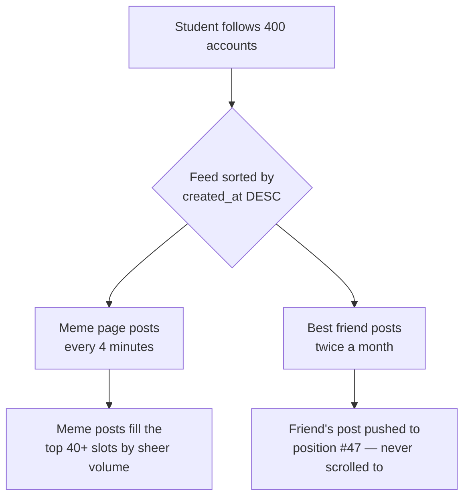

### Why this happens

The obvious question: why does following more of the things you actually chose to follow make the app *worse*?

Because reverse-chronological order silently assumes **recency = relevance** — and that's only true when everyone posts at roughly the same rate. The moment some accounts post 100x more often than others, "most recent" just means "posted most often." That has nothing to do with what you actually care about.

### The fix — hire an editor

Stop printing every story in the order it arrives. Start editing instead.

This is a real, documented move: Facebook replaced its strict-recency feed with a relevance-weighted one in 2010, and called the scoring formula **EdgeRank**.

Think of the difference this way:

| Old model | New model |
|---|---|
| A **wire-service ticker** — prints every incoming story in arrival order, no judgment | A **newspaper's front page** — an editor decides what leads, regardless of when it came in |

Quadster hires the editor.

### The new problem this creates

An editor needs a rule for "what's actually relevant." That rule has to be computed for every candidate post, for every user, every single time they open the app. Vague appeals to "relevance" don't ship — the next problem is turning that vague idea into an actual formula.

### How I'd say this in an interview

"Reverse-chronological quietly assumes every author posts at the same rate. The moment that's false, your loudest, most frequent poster crowds out everyone else. The fix is a relevance-ranked feed instead of a strictly time-sorted one — exactly the move Facebook made with EdgeRank back in 2010."

---

## Chapter 2 — The formula, and the popularity trap it fell into

### The fix, in detail

Quadster's engineers build the same structural formula EdgeRank actually used:

```text
Score(post) = Affinity(you, author) × Weight(action_type) × TimeDecay(post_age)

Affinity   — how much you've interacted with this author historically
Weight     — how much a given action matters (comment > share > like)
TimeDecay  — newer posts score higher, older posts fade
```

It works — for a few months.

### The new pattern that shows up

"Quad Memes Daily" starts getting **500 likes and 80 comments per post** `[illustrative]`. Plenty of students have liked a meme or two at some point. Even a handful of past likes builds real "affinity" in the formula.

Compare that to a real friend who:

- Posts rarely.
- You've quietly enjoyed her posts.
- But you never explicitly clicked "like."

Her affinity score sits near zero — not because you don't care, but because affinity is measured by *past clicks*, and you never clicked.

### Why it compounds

This gets worse over time, in a feedback loop:

1. The meme page starts scoring slightly higher.
2. It gets shown to more people.
3. More people means more likes and comments.
4. More engagement pushes its average affinity up further for the *next* round of scoring.
5. Repeat.

Illustrative trace of that loop: starting at roughly 5% of feed real-estate, a small early scoring edge compounds over about ten daily ranking cycles into **45% of feed real-estate** `[illustrative — a stand-in for "engagement-based scores can snowball," not a measured Quadster number]`.

The formula that was supposed to fix "loudest poster wins" quietly recreated the same problem — just measured in likes instead of post frequency.

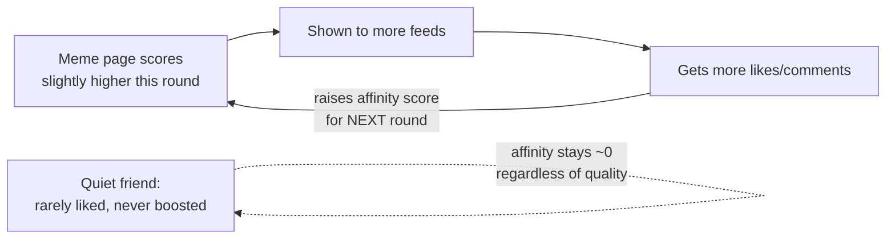

### Why this happens

The obvious question: how do we stop whichever content already has the most engagement from just winning forever?

Because raw historical engagement *is* the input to the formula — of course it snowballs. What's actually needed is a prediction of "will **this specific user** engage with **this specific post**, right now" — not "has this author accumulated engagement from anyone, ever."

### The fix — hire a panel of specialists

Stop trusting one hand-tuned formula with one gut-feel weight. Hire a panel of specialists instead:

- One model predicts "will they like it."
- One model predicts "will they comment."
- One model predicts "will they share it."
- One model predicts "will they hide/report it."
- A separate manager model blends their opinions into a single score.

This is a real, documented shape. Facebook's ranking evolved from EdgeRank's single formula into a multi-stage ML system scoring **thousands of features per candidate**, per Facebook's own public engineering statements.

Quadster names its signal checklist with a memory hook — **CARDS**:

| Letter | Signal | What it means |
|---|---|---|
| **C** | Content type | What kind of post is this (photo, text, video, link) |
| **A** | Affinity | How close you are to this author |
| **R** | Recency | How new the post is |
| **D** | Depth of past interaction | Comments beat passive views |
| **S** | Signals | The panel's predicted engagement probabilities |

### The new problem this creates

Running a panel of ML models — instead of one cheap formula — on every single candidate post, for every user, on every single app open, is a lot more compute. Quadster is about to find out exactly how much.

### How I'd say this in an interview

"EdgeRank's affinity-times-weight-times-decay is the right first answer, because it's simple and structurally correct. But a formula built entirely from past engagement will always amplify whatever's already loud. The real fix is predicting future engagement per post per user with a panel of models, not scoring authors by their engagement history — that's the shift from EdgeRank to a modern multi-signal ranking pipeline."

---

## Chapter 3 — The metal detector before the pat-down

### The scale problem

Quadster is now at **2M DAU** across 40 campuses, each following ~400 accounts.

Suppose the new CARDS panel had to run its full ML scoring on every possible candidate post, for every user, on every refresh. Here's what that actually costs, step by step:

1. The heavy scoring model takes about **5ms per post per user** on its serving hardware `[illustrative]`.
2. The raw candidate pool is roughly ~300 recent posts per user.
3. 300 posts × 5ms = **1.5 seconds** of pure model-inference time per feed load.

That's nowhere close to the reference guide's own P99 < 200ms target — and this is *before* fetching anything from a database.

### Why this happens, and the fix

The obvious question: do we really need to run the expensive model on every single post someone follows?

No. Narrow the field first, cheaply, then only run the expensive model on what's left.

This is exactly how airport security actually works: everyone walks through a quick metal detector; only the handful who set it off get the slow, thorough pat-down. Nobody gets pat-down'd by default.

### The fix, named as a funnel

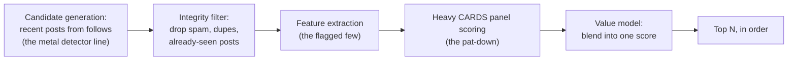

Quadster's candidate generation narrows ~300 raw posts down to the **~80 most plausible ones**. A post makes this shortlist if it's:

- Recent, **and**
- From an account you interact with at all, **and**
- Not already shown to you.

Only these 80 ever reach the expensive panel.

### Redoing the math

80 candidates × 5ms ≈ **400ms**. Still too slow for a live request — but a huge improvement over 1.5 seconds. And it reveals exactly where the remaining cost lives: the pat-down itself, run fresh, on every single app open.

### The new problem this creates

Even a narrowed 80-candidate funnel is still too slow to run **live**, from a cold start, the instant someone taps the app icon. A typical student opens the app **10 times a day** `[illustrative]`. That means this same expensive funnel would need to re-run — mostly on largely the same candidate pool — ten separate times before lunch.

### How I'd say this in an interview

"You never run your most expensive model over every possible candidate — cheap candidate generation and an integrity filter shrink the pool first, and the heavy panel only scores what's left. Same principle as security screening, or as search engines separating retrieval from precise ranking. But even a shrunk funnel is too slow to run fresh on every single app open, which is the next problem."

---

## Chapter 4 — Meal-prepping the feed the night before

### The fix

Stop running the funnel live, per request. Run it **ahead of time**, in batches and streaming updates, and store the *result* — a ranked list of lightweight `<post_id, user_id>` pointers.

That way, a feed read becomes a single cache lookup instead of a live computation.

**The analogy:** meal-prepping. A chef doesn't cook each individual bite fresh the moment a customer sits down. They batch-cook in advance and store trays in the fridge, so serving is just "grab the tray and reheat."

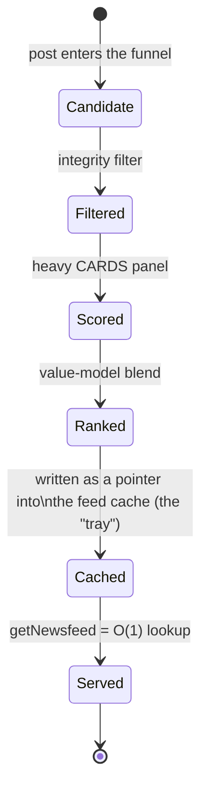

### The numbers

Quadster precomputes the **top 300 ranked pointers** per user, refreshed by a background job, and stores them in a feed cache.

Feed reads drop from a theoretical **1.5-second live funnel run** (Chapter 3) to a **<20ms cache lookup** `[illustrative]`.

This is a real, production pattern. The reference guide's own numbers show a 500-user precomputed feed costs about 8KB of pointers — because you're storing 16-byte references, never full post bodies.

### The new problem this creates

Meal-prepped trays go stale.

- Quadster's background refresh runs every **2 hours** `[illustrative]`.
- A friend posts something 6 minutes ago.
- The tray in your fridge was made almost two hours ago, so it isn't in there yet.

Support tickets start showing up: *"why can't I see my friend's post right after they posted it?"* — the exact freshness complaint a purely batch-precomputed feed always eventually earns.

### How I'd say this in an interview

"Meal-prepping — precomputing ranked feed pointers ahead of time — is what actually gets you under a real latency SLO, because a feed read becomes one cache lookup instead of a live funnel run. The cost is freshness: a tray made two hours ago doesn't have anything posted in the last two hours, and that's the next problem to solve."

---

## Chapter 5 — Topping up the tray with what's fresh

### The fix

Don't wait for the next full batch to refresh the whole tray. Top it up instead.

On every read:

1. Take the precomputed pointers.
2. Merge in a short live query for anything posted very recently (say, the last couple of hours) that hasn't made it into a batch yet.
3. Blend and re-rank that small merged set.

This is a lighter cousin of the write-time/read-time split covered elsewhere for celebrity accounts. Same idea — some content is served fresh at read-time instead of only from a precomputed store — just applied here to *all* recent posts, not specifically to high-follower accounts.

### The result

Quadster's staleness window drops from **2 hours** to **under 5 minutes** `[illustrative]` — a huge win for "why can't I see my friend's post."

### The new problem this creates

Now the list a user is scrolling isn't fixed. It's a moving target, actively being topped up while they scroll.

Walk through it step by step:

1. A student loads page 1 of her feed — ranked positions 1–20.
2. While she's reading it, **6 new posts** get merged in and re-ranked above where she was.
3. She scrolls to page 2. But "page 2" was computed relative to a list that no longer exists in that shape.
4. Some posts she already saw on page 1 now reappear on page 2 — they got pushed down by the newcomers, right past the boundary.
5. A couple of posts get skipped entirely — they fell exactly into the gap between what page 1 and page 2 each fetched.

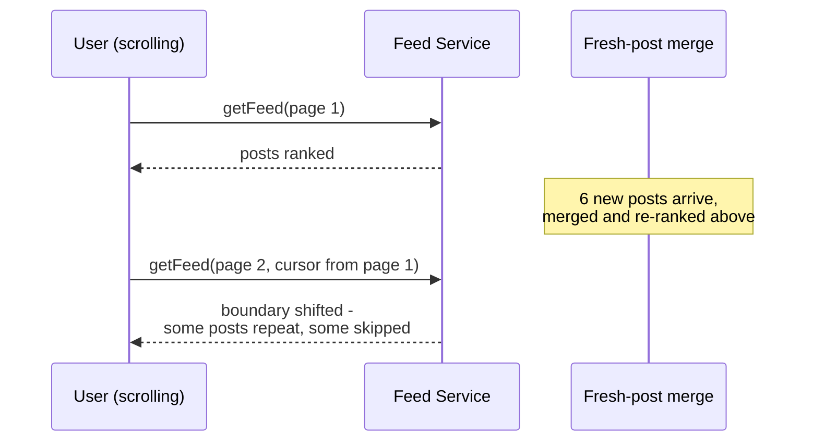

### How I'd say this in an interview

"Topping up the precomputed tray with fresh posts at read-time closes the staleness gap, but it means the ranked list is now literally changing shape while someone is mid-scroll through it. That's not a ranking bug, it's a pagination-consistency bug, and it needs a pagination-layer fix, not a smarter ranking model."

---

## Chapter 6 — Freeze the list, don't reshuffle mid-deal

### The fix

Stop re-slicing a moving target.

The instant a user opens their feed, **freeze** the ranked list of pointers for that session:

- Snapshot it — say, 500 pointers — into a short-lived cache entry (Redis, TTL 10–30 minutes `[illustrative]`).
- Every subsequent page request just slices further into that *same frozen list*.
- New posts that arrive mid-session don't get spliced into the middle. They show up only as an "N new posts" banner at the top.
- Those new posts only actually get merged in when the user explicitly pulls to refresh.

### The analogy

*"Freeze the list, don't reshuffle the deck mid-deal."*

Once you've dealt page 1 as a hand of cards, you don't reshuffle the deck before dealing page 2. You deal from the same frozen deck, and only shuffle again when the player explicitly asks for a new hand.

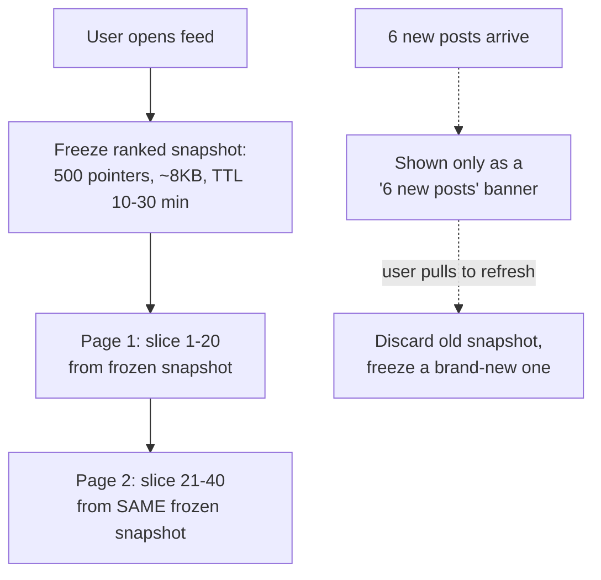

### The numbers

500 pointers × 16 bytes ≈ **8KB per active session**. Trivial cost — and it fully removes the duplicate/skipped-post bug for the life of that session.

This is what Twitter, Facebook, and Instagram all actually do. Pull-to-refresh feels deliberate because it *is*: nothing reshuffles automatically underneath you.

### The new problem this creates

Freezing the list per session is airtight *if the frozen snapshot itself survives*.

But under memory pressure, that snapshot can get evicted from cache mid-session. If the feed service falls back to regenerating it on demand, the regenerated list can genuinely differ slightly from the original — reintroducing a post the user already scrolled past minutes ago.

### How I'd say this in an interview

"The fix for a shifting list isn't a smarter cursor, it's freezing a ranked snapshot for the whole session and only reshuffling on an explicit pull-to-refresh — 'freeze the list, don't reshuffle the deck mid-deal.' The one gap left is what happens if that frozen snapshot itself gets evicted and has to be rebuilt mid-session."

---

## Chapter 7 — The coat-check stub that remembers what you've already handed out

### The fix

Keep a small **seen-set** per session: the `post_id`s already returned to this user this session. Filter every subsequent page against it before sending.

**The analogy:** a coat-check attendant who keeps a stub for every coat already handed back. Even if the rack gets reorganized behind the counter, the attendant still won't hand you the same coat twice.

### Choosing the data structure

- A plain `Set<post_id>` is fine for a short session — a few hundred IDs, trivial memory.
- At real scale — a session that scrolls thousands of posts, or a "don't show me this again for 30 days" feature — Quadster switches to a **Bloom filter**.

A Bloom filter answers "have I shown this before?" with no false negatives and a small, tunable false-positive rate, for a fraction of the memory of a full set.

### The numbers

Tracking the last **1,000** seen post IDs at a **1%** false-positive rate costs about **1,200 bytes** (~9.6 bits per element). Cheap enough to keep per-session in Redis without a second thought.

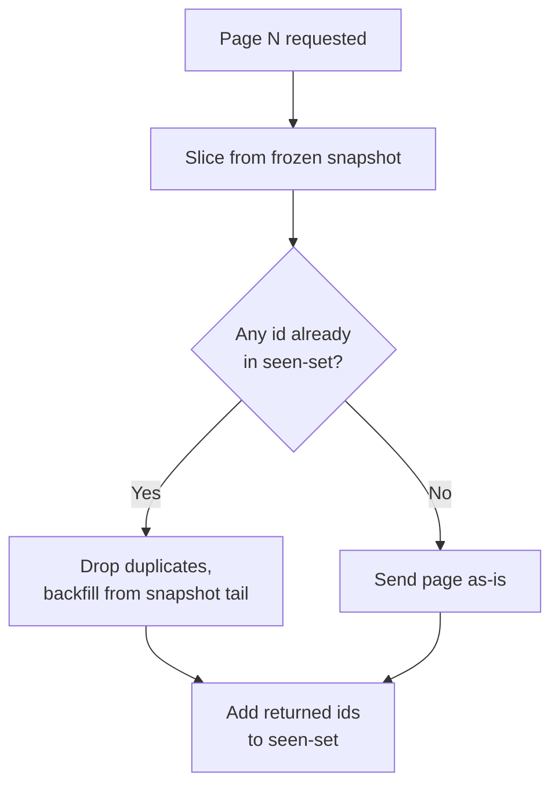

### The new problem this creates

The seen-set and the frozen snapshot both work because the feed cache only ever stores a lightweight **pointer** — `<user_id, post_id>` — never the post's actual content.

That single design choice is the Golden Rule of this whole story: **fan out pointers, never payloads.** It's why all of this is cheap.

But it raises the next obvious question: what happens when the post that pointer refers to gets changed, or removed entirely, after it's already sitting in someone's cache?

### How I'd say this in an interview

"A frozen snapshot handles the normal case, but a cache eviction or on-demand regeneration mid-session can still slip a duplicate back in. The safety net is a seen-set, or a Bloom filter once sessions get long, since it's a fraction of the memory of a full ID set for the same guarantee."

---

## Chapter 8 — Why the ticket only ever points at the coat, never carries it

### The core fact

Every pointer in Quadster's feed cache is a **stub, not the coat itself** — `<user_id, post_id>`, nothing more.

That single fact quietly answers two questions that look identical but aren't: what happens when a post gets **edited**, and what happens when a post gets **deleted**.

### Edits are (almost) free

If your friend fixes a typo in her post, only the Post DB row changes. The stub in everyone's feed cache still says "look up post_id 9981." The *next* time anyone reads it, they get the current text automatically.

No fan-out, no cache invalidation — because the stub never encoded the content in the first place.

With 400 average follows, that's **zero writes** for an edit that would've cost 400 writes if the feed cache had stored full post copies instead of pointers.

### Deletes are not free, but they're cheap

When a post is deleted, going and pulling back every stub that points to it costs exactly as much as the original fan-out did. For a post with 400 followers, that's 400 writes just to "take back" something that was 400 writes to hand out. Not worth it for the common case.

Instead:

1. Mark the post **tombstoned** in the Post DB.
2. Check for that tombstone lazily — at the moment someone tries to redeem the stub.

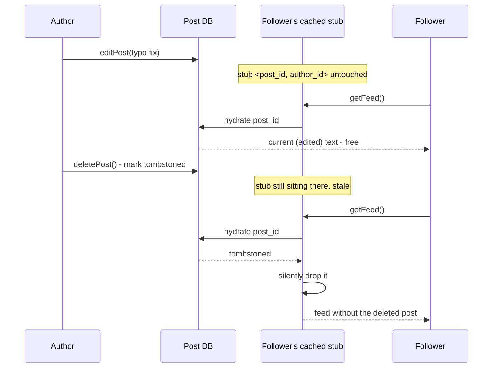

### The new problem this creates

A stub-based feed cache means anyone holding a stub assumes they're allowed to redeem it. That's fine for edits and deletes — the tombstone check happens regardless of who's asking.

But it raises a sharper question: what stops someone from redeeming a stub for a post they were never supposed to see in the first place, if their friendship or follow status changes *after* the stub was already handed out?

### How I'd say this in an interview

"Because the feed cache stores a pointer, not the content, edits are basically free — nothing needs invalidating. Deletes need a tombstone flag checked lazily at read-time, which is far cheaper than proactively clawing back every stub, and it's an acceptable, short-lived staleness window, not a bug you chase with an eager sweep."

---

## Chapter 9 — Who's actually allowed to redeem this ticket

### The feature, and the mistake to avoid

Quadster ships a "close friends" style feature: a post visible only to a hand-picked list, not your whole follow graph.

The obvious mistake to avoid: letting a low relevance score be the reason a private post doesn't show up in someone's feed. That's backwards. A private post that scores low is *still a leak* if it was ever allowed into the candidate pool at all.

**Visibility has to be a gate**, checked *before* ranking ever touches the post — never a discount applied through ranking.

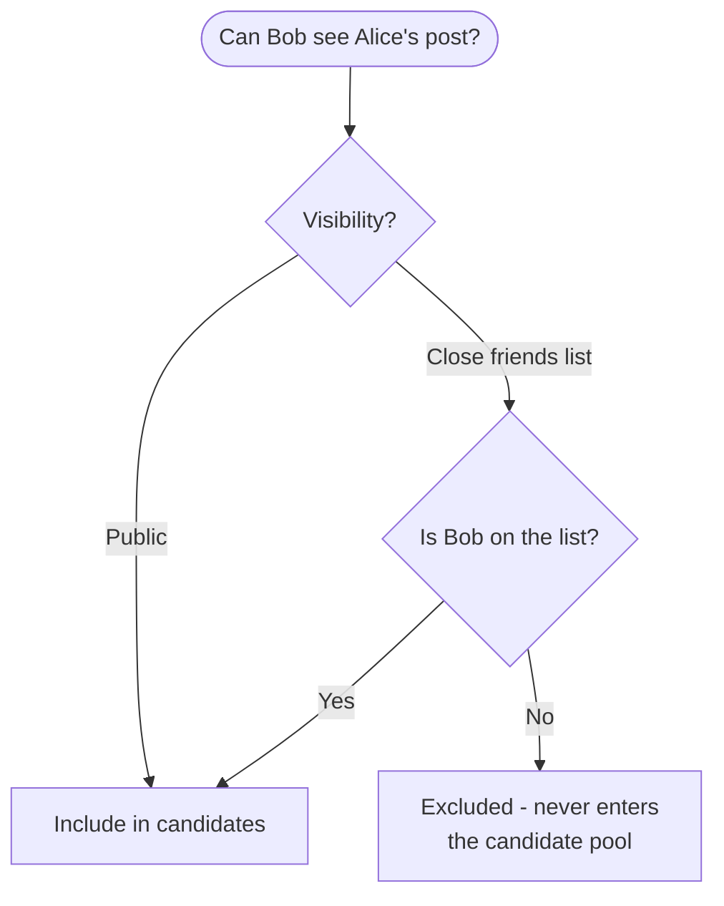

### Where the check runs

Where this check runs depends on how the stub got there:

- For posts precomputed at write-time, the audience is resolved **once**, at post time, from the current close-friends list. Stubs only ever get handed out to people on it at that moment.
- **The gap:** if Alice later removes Bob from her close-friends list, Bob's already-frozen session snapshot (Chapter 6) may still hold a stub pointing at that post — until his next full snapshot refresh.
- Worst case, that staleness window is the snapshot's TTL — up to **30 minutes** `[illustrative]` — plus however long until the next precompute cycle re-resolves the audience.

### The new problem this creates

A 30-minute window where a removed close friend could still see a post is an acceptable trade-off for a birthday photo. It is **not** acceptable for genuinely sensitive content someone urgently deletes from a list.

**The fix:** for high-sensitivity paths, add a live re-check at hydrate-time as a safety net — the same tombstone-style check from Chapter 8, just checking "is this viewer still allowed," not just "does this post still exist."

### How I'd say this in an interview

"Visibility is a pre-filter, not a ranking signal — gate it before scoring, never rely on a low score to hide something private. Write-time audience resolution can go stale after someone's removed from a list, so for anything genuinely sensitive you add a live re-check at read-time as a safety net on top of the precomputed path."

---

## Chapter 10 — The row that gets hammered a thousand times a second

### The scenario

A campus meme about finals week goes viral off-platform, gets reposted onto Quadster, and picks up **1 million likes in its first hour**.

Do the math step by step:

- Sustained average: 1,000,000 / 3,600s ≈ **278 likes/sec sustained**.
- But the first five minutes after a big share carries roughly a third of that total volume: 1,000,000 × 0.3 / 300s ≈ **1,000 likes/sec**.
- All of that lands on the **same single database row** (`like_count` on that one post).

### The correctness bug

The naive approach — read the count, add one, write it back — loses updates under concurrency. Here's the race:

1. Server A reads `count = 100`.
2. Server B also reads `count = 100`.
3. Server A computes `101` and writes it.
4. Server B also computes `101` and writes it.
5. The count is now wrong by one — silently, every time two likes race.

**The fix:** an **atomic increment** — `UPDATE ... SET like_count = like_count + 1`, or Redis `INCR`. There's no read-then-write window for two increments to collide in.

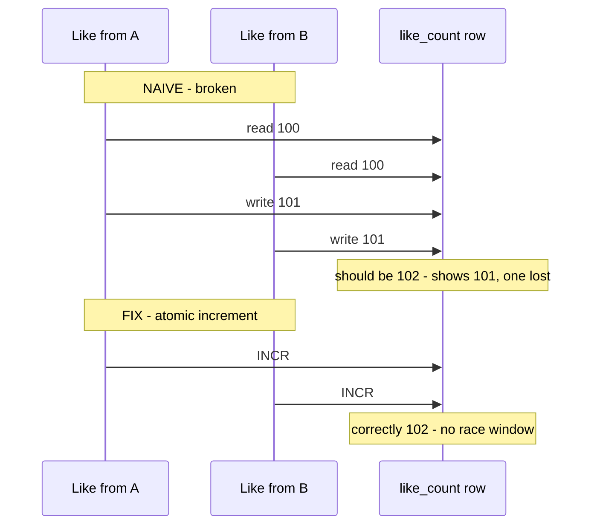

### The new problem this creates

Atomic increments fix the *correctness* bug, but not the *hot-key* bug. One row is still absorbing 1,000 writes/sec — like one stadium turnstile trying to click through a rush of a thousand people a second.

**The fix:** give it more turnstiles.

1. Accumulate likes into an in-memory counter, or several counter shards (e.g. `like_count:post_X:{0..9}`, summed on read).
2. **Batch-flush** the accumulated delta to the durable database every 1–5 seconds, instead of hitting the DB on every single like.
3. Beyond a display threshold, Quadster also stops showing an exact number and shows an approximation ("10K+ likes"). This is a real, documented move — Instagram tested it in 2019 — treating *display precision* as a separate, looser concern from *counting correctness*.

### How I'd say this in an interview

"Atomic increments fix lost updates, but a viral post is still a hot key even with them — one row taking a thousand writes a second. The production fix is write-behind batching, accumulate in memory and flush periodically, plus sharded counters for the truly hot ones, and showing an approximate count above a threshold is a legitimate consistency relaxation, not a shortcut."

---

## Chapter 11 — The bot ring that learned to fake affinity

### The exploit

Back in Chapter 2, Quadster's ranking learned to trust past engagement as a signal of quality. That's exactly the assumption a bad actor can exploit.

A coordinated ring of **50 fake accounts** likes and comments on a spam page's posts within seconds of each one going up `[illustrative]` — deliberately manufacturing the exact affinity and engagement signals the CARDS panel is designed to reward.

To the ranking model, it looks indistinguishable from 50 genuinely engaged real students. The spam page's posts start outranking legitimate content across many real users' feeds.

### The fix — look for the pattern, not the action

The obvious question: how do you tell a real like from a manufactured one, without a human checking every account by hand?

You look for the *pattern* the fakery leaves behind, not the individual action. Quadster uses a memory hook — **SPAM**:

| Letter | Signal | What it catches |
|---|---|---|
| **S** | Similarity | Same content posted hundreds of times — content-hash dedup catches it |
| **P** | Pace | One account liking 500 posts in a minute — rate limiting and velocity anomaly detection catch it |
| **A** | Age/trust | Brand-new accounts get down-weighted engagement and stricter limits by default |
| **M** | Mutual clustering | A group of accounts that only ever like/follow each other is a graph-detectable bot ring |

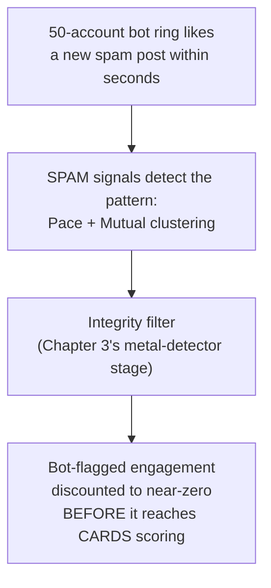

### Where this plugs in

This plugs the exploit back into the funnel from Chapter 3, rather than inventing a new pipeline. The integrity filter — the same stage that already drops spam and already-seen content before expensive scoring — is where fake-engagement discounting lives too.

Two layers of defense:

1. **Rate limiting at the write path** (`likePost`, `addComment`) catches the cheapest version of the attack before it even generates signal.
2. **Discounting low-trust accounts' engagement** inside the ranking features catches the more patient version.

### How I'd say this in an interview

"The same affinity and engagement signals that make ranking work are exactly what a bot ring will try to fake, so abuse detection isn't a separate system bolted on — it's more input to the integrity filter the ranking funnel already has. Rate limits at the write path and low-trust-account discounting inside the ranking features are the two cheapest, highest-leverage places to catch it."

---

## Where the story actually lands

```mermaid
flowchart LR
    A["Ch1: pure chronological\n(loudest poster wins)"] -->|"fixes: relevance over recency\nbreaks: engagement snowballs"| B["Ch2: EdgeRank formula"]
    B -->|"fixes: some nuance\nbreaks: raw engagement compounds"| C["Ch2: CARDS multi-signal panel"]
    C -->|"fixes: real prediction\nbreaks: too slow to score everything live"| D["Ch3: candidate-gen +\nintegrity funnel"]
    D -->|"fixes: cheap narrowing\nbreaks: still too slow live,\nper app-open"| E["Ch4: precompute\n(meal-prep)"]
    E -->|"fixes: fast reads\nbreaks: feed goes stale"| F["Ch5: merge fresh\nat read-time"]
    F -->|"fixes: freshness\nbreaks: list shifts mid-scroll"| G["Ch6: session-pinned\nsnapshot"]
    G -->|"fixes: stable scroll\nbreaks: snapshot can\nstill be rebuilt"| H["Ch7: seen-set /\nBloom filter"]
    H -->|"reveals: pointers not payloads\nis why any of this is cheap"| I["Ch8: edits free,\ndeletes tombstoned"]
    I -->|"raises: who's allowed\nto see it"| J["Ch9: privacy\nas a pre-filter"]
    J -->|"separately: viral posts\nhammer one row"| K["Ch10: atomic increment\n+ write-behind"]
    K -->|"separately: signals\ncan be faked"| L["Ch11: SPAM signals feed\nthe integrity filter"]
```

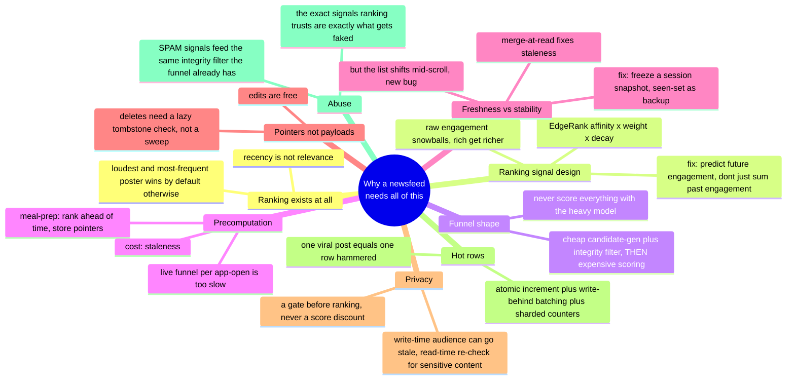

### The real systems that actually walked this path

- **Facebook's** feed went from EdgeRank's single formula (2010, documented) to a multi-stage ML pipeline scoring thousands of features per candidate, per Facebook's own public statements.
- **Instagram** switched from chronological to ranked in 2016, then brought back an optional chronological "Following" tab in 2022 after user pushback — a real example of the ranked-vs-chronological trade-off being revisited *after* shipping, not settled once and forgotten.
- **LinkedIn's** publicly described **Feed Mixer** aggregates candidates from multiple sources (connections, articles, jobs, ads) before one unified ranking pass — the same "candidate generation from multiple sources, then blend" funnel this story built up chapter by chapter.
- **Twitter's** 2023 open-sourced algorithm is a real, public instance of exactly this shape: two-stage candidate generation feeding a heavy neural ranker that predicts multiple engagement probabilities before final blending with ads.

---

## Grill me — adversarial follow-ups

**Q1: "Why not just let users manually sort their own feed instead of building all this ranking machinery?"**

Some do offer that as an option — the chronological tab — but most users never touch it, and the default has to work for people who never open a settings menu. Ranking exists because "most recent" silently breaks the moment posting rates differ across accounts, and almost nobody wants to hand-curate their own feed every session.

**Q2: "Isn't EdgeRank's affinity signal just going to reward whoever already has the most engagement, forever?"**

Yes, if you stop there — that's exactly the rich-get-richer trap Chapter 2 walks into. The fix isn't abandoning affinity, it's not relying on *raw historical* engagement alone; blend it with a model that predicts *this* user's likely reaction to *this* specific post, so a quiet, low-history friend isn't structurally locked out.

**Q3: "Why bother with a cheap candidate-generation stage — why not just make the heavy model faster?"**

Because even a very fast model still costs something per candidate, and the real lever is candidate *count*, not per-candidate latency — shrinking 300 candidates to 80 before scoring saves more than shaving milliseconds off the model itself. It's the same reason search engines separate retrieval from precise ranking instead of trying to make ranking itself instant.

**Q4: "If you precompute the feed ahead of time, doesn't that mean everyone's feed is always a little stale?"**

Yes, and that's an accepted, deliberate trade-off — a feed a few minutes stale is invisible to most users, while a feed that has to compute live on every single app open blows past the latency budget. The fix for the worst of the staleness is merging freshly created posts in at read-time, not abandoning precomputation.

**Q5: "Why freeze a snapshot per session instead of just re-running the ranking funnel on every page request?"**

Re-running it fresh every request is exactly what causes duplicate and skipped posts, because the underlying ranked list keeps shifting between requests as new content arrives. Freezing it once per session gives you a stable list to paginate through, and you only intentionally reshuffle when the user explicitly pulls to refresh.

**Q6: "Since the feed cache only stores pointers, doesn't that mean an edited post could show stale content to some users and fresh content to others?"**

No — that's the nice part of storing only a pointer: every read hydrates the *current* row from the Post DB, so there's no such thing as a stale edit, only a stale pointer (which would mean a deleted or never-fanned-out post, a different problem). Edits are free precisely because the pointer never encoded a snapshot of the content in the first place.

**Q7: "For deletes, why not just eagerly remove the stub from every follower's cache the moment someone deletes a post?"**

Because that costs exactly as much as the original fan-out did — for a post with hundreds of followers, that's hundreds of writes just to take something back. A lazy tombstone check at read-time is nearly free and closes the same gap with a short, acceptable staleness window instead.

**Q8: "Your privacy pre-filter runs at write-time for the precomputed path — what actually happens the moment someone gets removed from a close-friends list?"**

Their existing cached stub can still be sitting in an already-frozen session snapshot until that snapshot's TTL expires or the next precompute cycle re-resolves the audience — a real, bounded staleness window, typically tens of minutes. For anything genuinely sensitive, you add a live re-check at hydrate-time as a safety net on top of that, rather than trying to make the write-time resolution instantaneous everywhere.

**Q9: "A viral post's atomic-increment counter is still a hot row — why not just add more database replicas to spread the load?"**

More replicas help spread *reads*, but every increment still has to land on the one row that holds the true count, so replicas don't fix a write hot-spot. The actual fix is write-behind batching — accumulate in memory, flush periodically — and, if it's still hot, sharding the counter itself into multiple rows summed on read.

**Q10: "How do you stop a bot ring from just gaming whatever anti-spam signal you build, the same way it gamed affinity?"**

You never rely on one signal alone — similarity, pace, account age/trust, and mutual clustering each catch a different shape of fake behavior, so a ring has to fake all four simultaneously to slip through, which is much harder and more expensive than faking one. And because this feeds the same integrity filter the ranking funnel already runs, it's one more input to an existing stage, not a brand-new system to keep in sync.

---

## Cheat sheet — one line per stop on the story

| Stop on the story | The one-line takeaway |
|---|---|
| **Pure chronological feed** | Breaks the moment posting rates differ across accounts — recency quietly stops meaning relevance. |
| **EdgeRank (affinity × weight × decay)** | The right first answer — simple, explainable, structurally correct — but raw-engagement affinity alone snowballs toward whatever's already loud. |
| **CARDS multi-signal panel** | Predicts *future* per-user, per-post engagement (P(like), P(comment), P(share), P(hide)) instead of just summing an author's past engagement. |
| **Funnel shape** | Cheap candidate generation + integrity filter narrows the field; the expensive model only ever scores what's left — never flood it with everything. |
| **Precomputation ("meal-prep")** | Rank ahead of time, store `<user_id, post_id>` pointers, so a read is a cache lookup — the only way to hit a real latency SLO at scale. |
| **Merge fresh at read-time** | Closes the staleness gap precomputation creates, but makes the ranked list a moving target mid-scroll. |
| **Session-pinned snapshot** ("freeze the list, don't reshuffle mid-deal") | Fixes the moving-target bug by freezing the ranked list per session; new content only shows via a banner until an explicit refresh. |
| **Seen-set / Bloom filter** | The safety net for the rarer case where the frozen snapshot itself gets evicted and regenerated mid-session. |
| **Pointers, not payloads** | The reason edits are free (content re-hydrates fresh every read) and deletes are cheap, not free (a lazy tombstone check at read-time, not an eager sweep). |
| **Privacy as a pre-filter** | Gate visibility before ranking ever scores a candidate; write-time audience resolution can go stale after an unfollow/removal, so sensitive content needs a live read-time re-check too. |
| **Hot counter rows** | Atomic increment fixes lost updates; write-behind batching and sharded counters fix the remaining hot-key problem on a viral post; approximate display counts are a deliberate, acceptable relaxation. |
| **SPAM signals** (Similarity, Pace, Age/trust, Mutual clustering) | Feed the same integrity filter the ranking funnel already has — abuse detection isn't a new subsystem, it's more input to an existing stage. |
| **The meta-lesson** | Every fix in this story is really the same question, asked at higher scale — "of everything this person could see right now, what's actually worth showing first" — and every new problem it creates is that same question getting harder in one specific new way (speed, freshness, stability, privacy, or trust). |
