# Design Instagram — The Story (narrative edition)

## What this file is

The reference file, `33-Design-Instagram-FAANG-Guide.md`, is the one to recite from in an interview. It has the requirements, the API shapes, every trade-off table, and the master cheat sheet.

This file is a second way in. It's the same material, told as one continuous story, in plain language.

The company in the story, **Shutterly** (a small photo-sharing app), is fictional. But every wall it hits, and every fix it reaches for, is something a real, named system actually does:

- Instagram's own 2012 engineering blog (sharded Postgres, a Snowflake-style 64-bit ID with an embedded shard number)
- Meta's TAO graph store
- Cassandra, used for the timeline
- Meta's "Scaling Memcache at Facebook" paper (leases, request coalescing)

This story deliberately does **not** re-derive three things that already have their own dedicated stories:

- Blob storage internals — that's file 20
- Feed-ranking ML internals — that's file 32
- Search-index internals — that's file 21

Instead, it leans on those lightly and spends its depth on what's actually distinctive to Instagram: the ID scheme, sharding by `user_id`, the follow graph, private accounts and blocking, the celebrity problem's *two* separate failure surfaces, counters, chunked upload, and Stories.

Wherever a number shows up, I'll say clearly whether it's a documented fact or just a reasonable stand-in — stand-ins are tagged inline with `[illustrative]`.

## The one-sentence core idea

Instagram is a **read-heavy fan-out problem wrapped around a blob store**.

Nearly every fix in this story exists to answer one of two questions faster:

1. "Where are this post's bytes?"
2. "Whose feed does this post belong in?"

And the fix always has to answer that question *without* making the upload button, the like button, or the follow button sit around waiting for the answer.

---

## Chapter 1 — The photo that lived inside the database

### The setup

Shutterly launches with the simplest thing that could possibly work:

- One Postgres database.
- One `photos` table.
- A `bytea` column that holds the actual JPEG bytes of every upload, sitting right next to the caption and the `user_id`.

It's an app in a hurry — why stand up a second system just to hold files?

It works fine for the first few thousand users.

### Why it breaks

Then Shutterly hits **50,000 photos**, averaging 3MB each. That's **150GB** sitting inside the database.

Two things go wrong at once:

- **Backups get slow.** Nightly backups used to take 4 minutes. Now they take **50+ minutes** `[illustrative — a stand-in for "backing up a DB with megabytes-per-row bloats badly," not a measured Shutterly benchmark]`. Why? The backup tool copies full JPEG bytes through the same pipe it uses to copy tiny user rows.
- **Small queries get slow too.** Every query that touches the `photos` table pays the same tax — even one that just wants a caption for a search result has to page through rows that are, byte for byte, mostly image data the query never asked for.

The obvious question: *why does a caption lookup have to drag 3MB of pixel data along for the ride?*

Because the database treats "this row" as one indivisible unit. It can't cheaply give you the small part without also touching the big part.

### The fix

Move the actual bytes out to a separate blob/object store, and leave behind only a **coat-check ticket** — a small pointer (a URL or key) — in the database row.

Here's the analogy, and we'll reuse it every time this shape of problem returns: you never store the actual coat at the coat-check counter's front desk. You hand out a ticket, and the coat lives in the back room.

The result:

- A caption query now touches a few hundred bytes, not megabytes.
- Backups of the metadata database shrink back down to seconds.

Note: *how* the blob store itself avoids a filesystem-per-file seek penalty at scale — Haystack-style packed storage, CDN placement — is the whole subject of the companion Blob Store story. Shutterly reuses that pattern wholesale rather than reinventing it here.

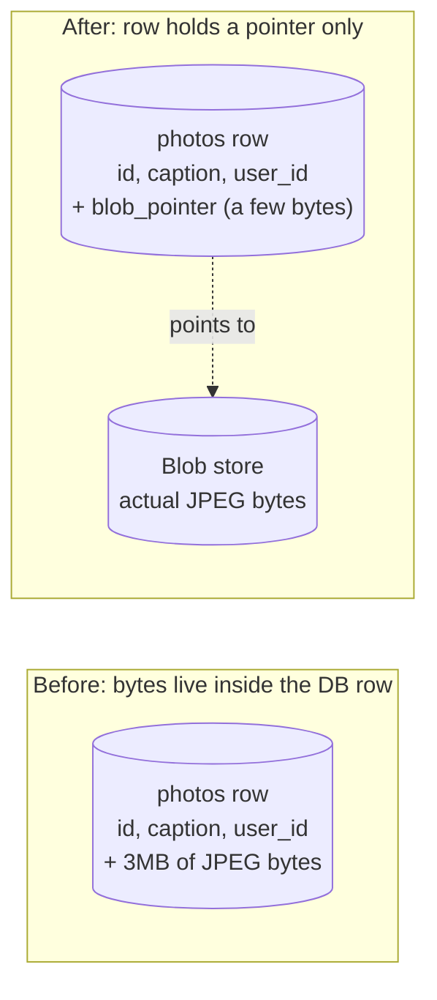

### What breaks next

One week after the migration, Shutterly runs the upload path on three app servers instead of one, for redundancy.

Two users upload at nearly the same instant, hitting different servers. Both rows land using Postgres's own `SERIAL` auto-increment. That's fine *for now*, because there's still just one database.

But the team already knows the next milestone is "split the database in two once we pass 1M photos." And a single auto-increment counter can't exist in two places at once — it either collides, or it needs a phone call between the two halves every time a new ID is handed out.

The pointer problem is solved. The *identity* problem is about to start.

### Interview soundbite

> "Media bytes never belong inside the relational row — you store a pointer to a blob store and keep the database holding only small, query-able metadata. That's the same 'ticket, not the coat' idea you'll see again anywhere a value could grow past what a row should reasonably hold — like an old Stories list overflowing out of a timeline row."

---

## Chapter 2 — The ID that forgot which drawer it came from

### The setup

Shutterly splits its single database into two shards to handle growth. It picks the simplest scheme anyone could think of: each shard keeps running its **own** `SERIAL` auto-increment, starting from 1.

### Why it breaks

Shard A's photo #4,001 and Shard B's photo #4,001 are now two completely different photos with the **identical ID**.

The bug shows up fast: a "share this photo" link encodes only the numeric ID. Roughly half the shared links now open the *wrong photo* — whichever shard the reader's app server happens to query first.

The obvious question: *how do you generate an ID that's unique across many independent machines, without making every single insert phone home to one central counter?*

A central counter would just recreate Chapter 1's single-database bottleneck one layer up. One machine, one lock, one point of contention — no matter how many shards you have underneath it.

### The fix

Bake the shard number *into* the ID itself, along with a timestamp and a small per-shard counter. That way no two shards can ever produce the same number, and nobody has to ask a central authority for the next value.

This is Instagram's own real, documented answer from its 2012 engineering blog. Think of it like a **hotel room number that encodes its own floor** — room 1204 tells you "floor 12" the instant you read it, no front-desk lookup required.

Instagram's actual scheme packs this into a 64-bit integer, split into three fields:

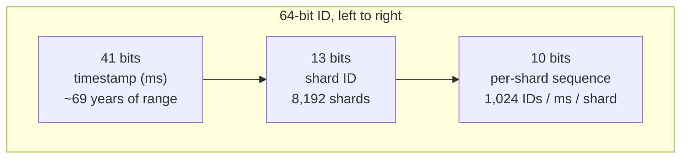

| Field | Size | What it gives you |
|---|---|---|
| Timestamp | 41 bits | Milliseconds since a custom epoch. 2^41 ms ≈ 69 years — nobody on the team will be maintaining this system when it overflows. |
| Shard ID | 13 bits | 2^13 = **8,192** possible shards, read directly out of the ID. No lookup table needed. |
| Per-shard sequence | 10 bits | 2^10 = **1,024** IDs per millisecond, per shard. Resets every millisecond. Each shard hands out its own sequence independently — nothing to coordinate. |

**Worked ceiling, step by step:**

1. Each shard can hand out 1,024 IDs per millisecond.
2. There are 1,000 milliseconds in a second, so one shard's ceiling is 1,024 × 1,000 = **1,024,000 IDs/sec**.
3. Multiply by the 8,192 possible shards: 1,024,000 × 8,192 ≈ **8.39 billion IDs/sec**, system-wide, in theory.

That's wildly more than any real post rate needs — a system doing roughly 1,100 posts/sec averaged across a day is nowhere near stressing this.

The point of the scheme isn't squeezing out every bit of ID space. It's that **the ID alone tells you which shard the row lives on.** Read an ID, mask out the 13 shard bits, and you know exactly which machine to query — no separate directory-lookup service sitting in the critical path.

### What breaks next

During a load test, two app servers behind the same shard generate IDs milliseconds apart. But one server's clock is running 400ms behind the other's — a bad NTP sync `[illustrative]`.

Here's the problem: the timestamp bits are the *most significant* bits of the ID. So a slightly-behind clock can hand out an ID that sorts *earlier* than a photo that was actually posted moments before it. IDs are meant to be roughly time-sortable, and clock skew quietly breaks that promise for anything generated in the skewed window.

The real-world fix is boring but firm:

- Keep clocks NTP-synced.
- Have a shard's ID generator simply **refuse to move backward** — if its clock appears to have gone back in time, it stalls momentarily rather than emit a duplicate or out-of-order ID.

### Interview soundbite

> "A plain auto-increment is a single point of contention the moment you shard. The real fix, and the one Instagram actually shipped in 2012, is a Snowflake-style ID that packs a timestamp, a shard number, and a per-shard sequence into one 64-bit integer — so the ID itself routes you to the right shard with zero coordination between shards. The one thing you have to guard against is clock skew, since the timestamp is what keeps IDs roughly sortable."

---

## Chapter 3 — Splitting the filing cabinet without losing files

### The setup

Shutterly now has to decide *what* the shard number in that ID actually means — sharded by which column? There are two real options:

- Shard by `user_id`
- Shard by `post_id`

### Why it matters

The obvious question, asked out loud in a design review: which one do we pick?

Test each option against the query Shutterly runs constantly — "show me this user's own profile grid of posts."

- **If shards are split by `user_id`:** that query hits exactly one shard. Every post a user ever made lives in the same drawer as the rest of their stuff.
- **If shards are split by `post_id`:** that same profile-grid query has to fan out and ask *every* shard "do you have any posts by this user?" and merge the answers. That's a scatter-gather, every single time, for one of the most common reads in the whole app.

### The fix

Shutterly picks `user_id` — the same real choice Instagram made — for the same reason: **shard by the entity whose data you read together most often.**

Here that's "all of one person's stuff," so keep it together. Think of a filing cabinet where every folder for one client lives in the same drawer, not spread across the building.

### What breaks next — two separate problems

**Problem 1: a hot shard.** Six weeks later, one user's post goes unexpectedly viral — 2 million likes in a day. Because posts shard *with* their author, every one of those 2 million likes, plus the comments, plus every read of that user's profile, lands on **the same single shard**. That shard's CPU and disk I/O climb far past its five sibling shards, which are all sitting comfortably idle.

Sharding by `user_id` traded away "some read pattern always needs a scatter-gather" for "one popular user can create one hot shard." That's a fair trade — mitigated later by caching and by how counters get handled (Chapter 8) — but it's a real cost, not a free lunch.

**Problem 2: resharding is expensive.** Shutterly starts on 4 physical database nodes and, a year later, needs to add a 5th. The naive approach is `shard_id % num_nodes`. But that formula remaps almost every shard's home the moment the node count changes — going from `% 4` to `% 5` reshuffles roughly **80% of all shards** onto a different machine, just to add one box.

The real fix is **consistent hashing**:

1. Place both machines and shards on a circular ring, by hashing their IDs.
2. A shard belongs to whichever machine's position on the ring comes next, going clockwise.
3. Add a 5th machine, and it only claims the slice of the ring immediately before it. Everyone else stays put.

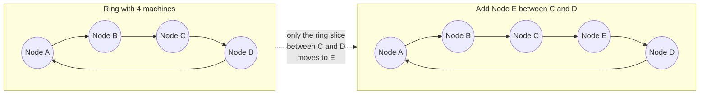

**Concrete example**, using the same shape Instagram's own resharding discussions use:

- Shutterly has 4,096 logical shards spread across 32 physical nodes — 128 shards per node.
- Adding a 33rd node under consistent hashing moves only about **1/33 ≈ 3%** of the shards.
- Adding a 33rd node under naive `% 32 → % 33` modulo would remap **~97%** of them.

### Interview soundbite

> "Shard by whatever you read together most — here that's `user_id`, so a profile page is a single-shard read, at the cost of a viral user creating a hot shard. Separately, *placing* shards onto physical machines needs consistent hashing, not naive modulo, or adding one box means moving almost everything you already had."

---

## Chapter 4 — The fan mail problem

### The setup

Shutterly adds "follow" — and immediately learns it isn't like being someone's friend. If Alice follows Bob, Bob doesn't automatically follow Alice back. It's a one-way relationship, like sending fan mail: you can be someone's fan without them ever writing back.

Shutterly's first table is a single `followers` list: `(follower_id, followee_id)` pairs, with no special structure.

### Why it breaks

The table works fine for "who does Alice follow" — that's a simple filter on `follower_id`.

It falls over on the *other* direction: "who follows Bob." Two things need this reverse lookup constantly:

- A growing creator's profile page, to show a follower count.
- The fan-out pipeline (next chapter), which needs to know who to notify.

Filtering the same table by `followee_id` instead means scanning the same giant table a different way — a direction nothing about the table's layout favors. At **40M follow edges** `[illustrative — a stand-in scale matching the guide's billions-of-rows-at-Instagram-scale shape]`, that reverse lookup takes noticeably longer than the forward one.

The obvious question: *why does one direction feel free and the other feel expensive, when it's the same data?*

Because an index only makes *one* access pattern cheap. You need a separate index built the other way if you need the reverse direction to be fast too.

### The fix

Keep **two** indexes on the same follow data:

- A **forward index**, keyed by `follower_id` — "who do I follow." Used by the fan-out reader.
- A **reverse index**, keyed by `followee_id` — "who follows me." Used by the profile page and the fan-out writer.

Think of it as maintaining two separate address books for the same fan-mail relationship: one organized by sender, one by recipient. Neither book can be cheaply derived from the other at this size — you genuinely need to look things up both ways, fast.

This is the real, documented shape Meta's TAO takes:

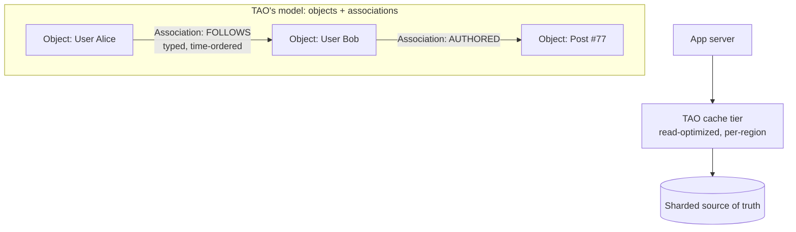

TAO models nodes as **objects** (users, posts) and edges as **associations** (follows, likes) — typed, time-ordered, and cached read-optimized in front of a sharded durable store. Cross-region cache propagation happens asynchronously.

That async propagation is exactly the eventual-consistency slack Shutterly's own non-functional requirements already granted — "it's fine if a follow takes a couple seconds to show up for someone across the world." The graph store isn't inventing a new trade-off. It's spending one Shutterly already agreed to.

### What breaks next

The fan mail model works fine for public accounts. But Shutterly's product team wants **private accounts** — where a follow has to be *approved* before it counts for anything.

A plain edge (exists / doesn't exist) can't represent "requested but not yet approved." That's the very next wall.

### Interview soundbite

> "A follow graph is directed and asymmetric, so you need both a forward and a reverse index — neither is cheaply derivable from the other at scale. Meta's actual answer, TAO, models this as objects and typed, time-ordered associations, cached per-region in front of a sharded store, which lines up exactly with the eventual-consistency slack most feed systems already accept."

---

## Chapter 5 — The knock that needs an answer first, and the door that stays shut

### The setup

To add private accounts, Shutterly's first instinct is a separate `follow_requests` table, distinct from the real `followers` table. A request gets promoted into a real follow edge once approved.

### Why it breaks

It technically works, but now three different consumers — the fan-out pipeline, the notification service, and the profile page — all have to remember to check **two** tables instead of one.

Worse, it's easy for a future engineer to write a new feature that reads the `followers` table directly and accidentally exposes a private account's content to someone who was never approved.

The obvious question: *do we really need a second table, or is "pending" just another value the follow edge itself can hold?*

It's the second one.

### The fix

A follow relationship isn't binary (exists / doesn't) — it has a **state**: `pending` or `accepted`.

Model that directly on the same `FOLLOWS` association from Chapter 4. Every piece of code that already reads "is this person a follower" just adds one filter — `state = accepted` — instead of learning about a whole new table.

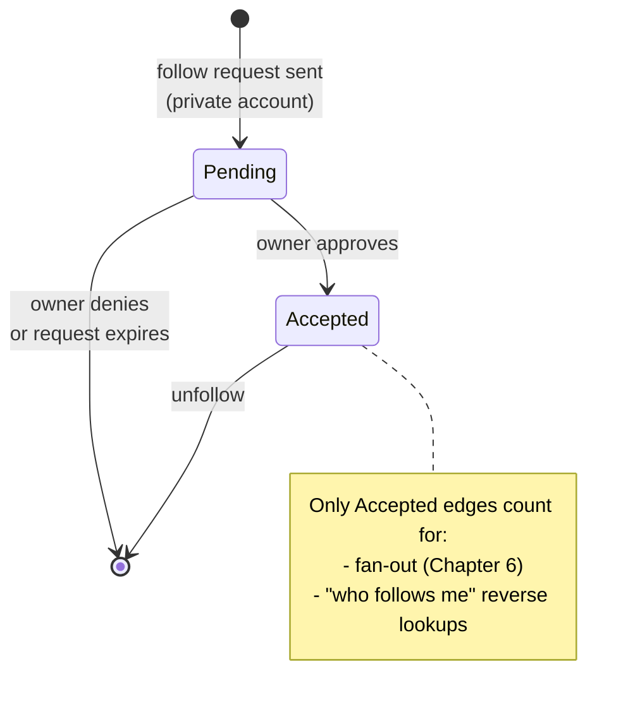

### What breaks next

Shutterly ships it. A month later, a harassment report comes in: a blocked user is still showing up in someone's feed.

Digging in: the block feature was implemented by trying to **delete the blocked user's already-fanned-out posts** out of the victim's timeline, the moment a block happens. But fan-out (next chapter) already copied that content into potentially thousands of cached and pre-computed places. The block-time cleanup job simply didn't reach all of them in time.

Worse, the block can be lifted later, and nothing re-adds anything cleanly either.

### The fix

Stop treating a block as an event that has to *chase down* every place a post already went.

Instead, add a `BLOCKS` association — the same shape as `FOLLOWS` — and check it **at read time**, in every path that shows content to a user:

- The feed's filtering stage.
- Search results.
- Notifications.

A block isn't "go clean up the past." It's "add one more filter to every future read." That's a single, robust checkpoint, instead of an unbounded cleanup chase.

### Interview soundbite

> "Private-account approval and blocking are both graph-edge concerns, not separate subsystems — model 'pending vs accepted' as state on the follow edge, and enforce blocking as a read-time filter, not a write-time cleanup job, because you can never guarantee you've reached every copy a post already fanned out to."

---

## Chapter 6 — One flyer, a hundred million mailboxes

### The setup

Shutterly's feed reader, for a while, just does the obvious thing at read time: look up who you follow, fetch their recent posts, merge, sort by time, done.

This is **pull** — nothing precomputed, everything assembled fresh, on demand. Like walking up to a public billboard and reading whatever's currently posted.

### Why it breaks

It's fine, until an account with **1.2 million followers** posts. At the same moment, Shutterly separately tries the opposite extreme for a test cohort: **push**.

The instant a post goes up, push immediately writes a reference to it into every single follower's own pre-built timeline. Like hand-delivering a flyer to every subscriber's mailbox the moment it's printed.

Push makes every *later* feed read instant — `O(1)`, just fetch the pre-built list. But the write cost is `O(followers)`.

**Worked math, step by step:**

1. Assume an optimistic 0.1ms per write.
2. Fanning out to 1.2 million followers **serially** takes 1,200,000 × 0.1ms = **120 seconds** — just for that one account.
3. Scale the same math up to Instagram's real celebrity tier — 100M followers: 100,000,000 × 0.1ms = **~2.8 hours** to hand-deliver one flyer, one mailbox at a time.

That 2.8-hour number is the one that ends the "just push to everyone" idea for good.

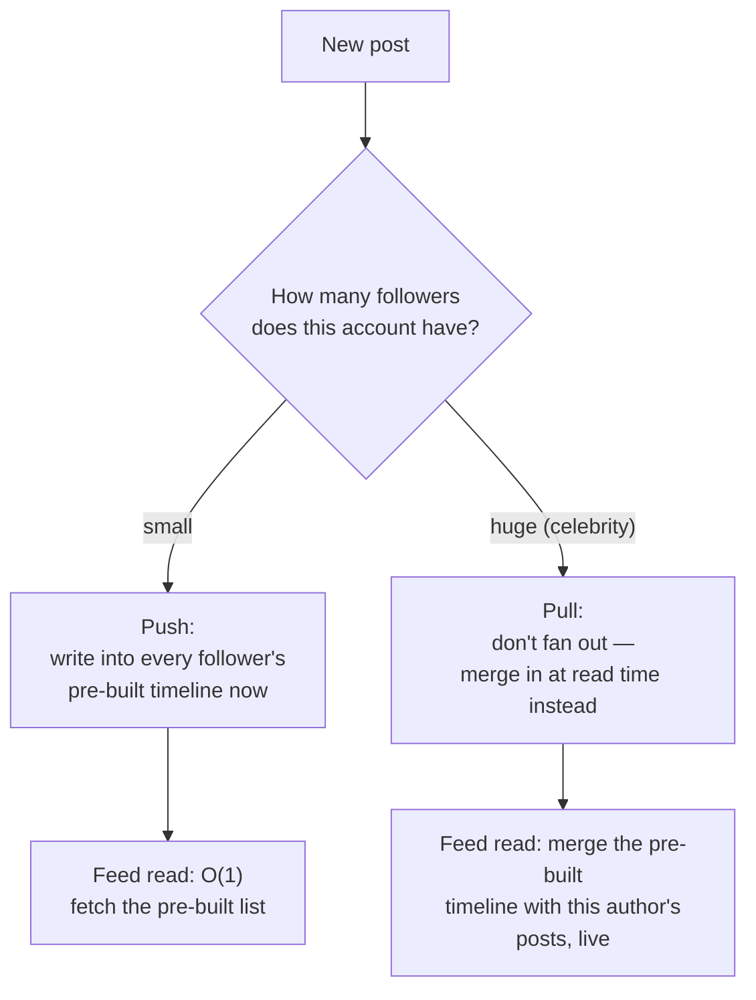

### The fix

Neither extreme survives on its own:

- Pull is too slow for an active social user with hundreds of followees to merge at read time.
- Push is too slow — and too much wasted write work — for an account with millions of followers.

Shutterly lands on the **hybrid** model:

- **Push** for normal accounts, because the write cost is small when the follower count is small.
- **Pull** for accounts past a follower-count threshold — skip the flyer delivery entirely, and merge their posts in live at read time instead.

*Push what's small, pull what's huge.*

The full derivation of this trade-off — including the tiered thresholds real systems use between "regular user" and "mega-celebrity," and the sequence diagrams for each mode — is the signature deep dive of the companion Design Twitter story. It applies here without needing to be re-derived: same directed follow graph, same math, same conclusion.

What's worth adding here, specific to Shutterly, is a second, *separate* failure mode. It shows up only once a celebrity account is pull-based, and it isn't a write-side problem at all — that's the next chapter.

### Interview soundbite

> "Push gives you instant reads but its write cost scales with follower count — a 100M-follower account would take hours to fan out serially, which is the whole reason hybrid exists: push for normal accounts, pull for the huge ones, merged at read time. I'd go deeper on the exact tiering if you want, but the shape doesn't change from a Twitter-style follow graph to an Instagram-style one."

---

## Chapter 7 — The doorbell that rang a million times in one second

### The setup

A celebrity account on Shutterly, set to pull-mode because of its follower count, posts a new photo. Because it's pull-mode, nothing was pre-written into anyone's timeline.

### Why it breaks

Every one of that account's followers who opens the app has to trigger a **live fetch** of "this account's recent posts."

The problem: a huge fraction of those followers open the app in the *same few seconds*, right after getting a push notification.

**Worked number:** **40,000 followers** hit "fetch recent posts for this celebrity" within one second `[illustrative — a stand-in for "a viral post causes a synchronized read spike," proportional to the guide's "thousands of concurrent requests" framing]`.

All 40,000 of those requests are asking the exact same question, at the exact same time, of the exact same row in the post store. That's not a slow trickle of load — it's a self-inflicted flash mob at your own database's front door.

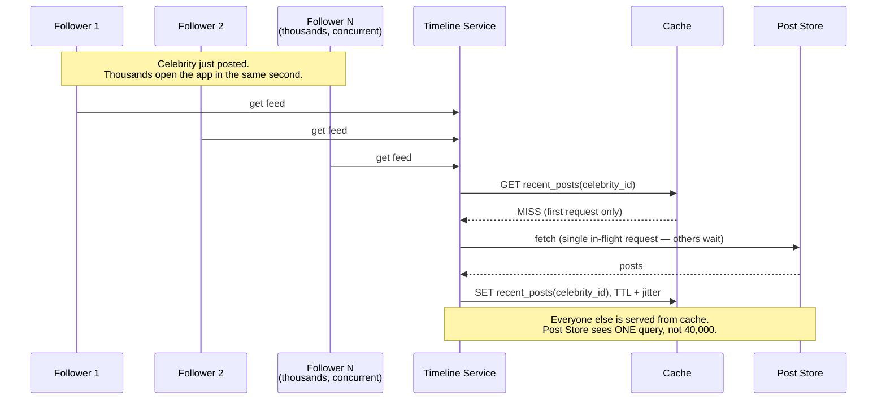

This is a **completely different failure surface** from Chapter 6's write-side fan-out cost:

- Chapter 6 was about how expensive it is to *write* a post out to everyone.
- This chapter is about how expensive it is when everyone tries to *read* the same thing at once — and it can happen even in a system that correctly chose pull specifically to avoid the write-side cost.

### The fix

This is the same real pattern Meta's own "Scaling Memcache at Facebook" paper documents as leases:

- The first request that misses the cache is allowed through to the Post Store.
- Every other concurrent request for that same key waits on that one in-flight fetch instead of launching its own.

Think of a single bouncer at a door, telling everyone behind the first person: "hang on, they're already checking, I'll tell you what they find."

Once the answer comes back, it's written into the cache with:

- A TTL.
- A little random jitter, so many popular keys don't all expire at the exact same instant later and recreate the same stampede.

The Post Store ends up seeing **one** query instead of 40,000.

### What breaks next

Once this pattern is trusted and reused everywhere, the cache tier itself is now doing a lot of load-bearing work — it's the only thing standing between a viral moment and a database meltdown.

That raises the stakes on the *next* thing that reads a hot key constantly: likes and comments. Unlike a viral post, they don't wait for a viral moment to spike — they spike on *every* moderately popular post, all the time.

### Interview soundbite

> "The celebrity problem has two separate failure surfaces — the write-side fan-out cost, and this read-side thundering herd on a cache miss — and they need two separate fixes. The read-side fix is request coalescing plus a jittered TTL, the same lease pattern Meta documented for Memcache, not just 'add more cache.'"

---

## Chapter 8 — The like button that tried to DDoS itself

### The setup

A single popular post on Shutterly gets liked **3,000 times in one second** at its peak.

### Why it breaks

The naive implementation is the most obvious SQL you'd write:

```sql
UPDATE posts SET like_count = like_count + 1 WHERE post_id = ?
```

Every one of those 3,000 likes-per-second is a write to the *exact same row*. And a row can only be locked and updated by one writer at a time.

The database doesn't fall over from total load. It falls over because **one specific row** became the bottleneck for the entire system, while every other row sits comfortably idle.

This is a hot-key problem, not a "we need a bigger database" problem — buying a bigger machine doesn't fix a single row's write serialization.

The obvious question: *if the problem is one row taking all the writes, why not just... not have one row?*

Exactly right.

### The fix, in layers

**Layer 1 — sharded counters.** Split the one counter into, say, 10 sub-counters, and route each incoming like to one at random (or by hash of the liker's ID). Reading the total count means summing all 10 — trading one hot row for ten warm ones.

**Layer 2 — an in-memory counter that absorbs the burst.** Use `Redis INCR` on the counter key. It's fast enough to eat thousands of increments per second without touching the durable database at all. The aggregated delta is flushed back to the database only periodically.

**Layer 3 — approximate display counts.** The number shown to users ("1.2M likes") doesn't need to be exactly, instantaneously correct down to the last unit. It's fine if it's a few seconds stale. That's an explicit, acceptable simplification — the same eventual-consistency slack the graph store already leans on.

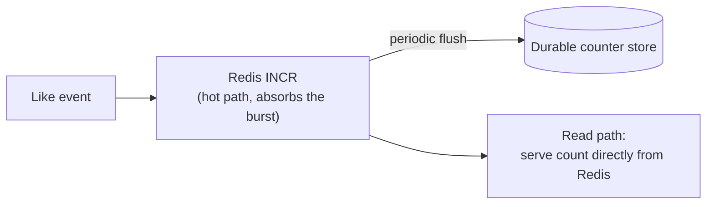

This is the same **write-behind** shape that Chapter 7's fan-out-and-read cache uses conceptually — just applied to a different problem: absorb a hot, bursty write in memory, and let the durable store catch up on its own schedule, asynchronously.

It's worth naming *why* this differs from the feed's own caching pattern (cache-aside):

| Pattern | Used for | Why |
|---|---|---|
| Cache-aside (feed reads) | Read-mostly data | Tolerates staleness by reading around a miss. |
| Write-behind (like counters) | Write-mostly data | Needs to absorb the burst *before* it ever reaches the database row. Cache-aside doesn't help if the write itself is the bottleneck — only write-behind does. |

### What breaks next

Once counters are safely sharded and buffered, the team notices comments have the exact same hot-key shape as likes — a viral post's comment count is written to just as often.

But comments also carry actual *text*, which can't be summarized down to a number the way a like can. The counter-sharding trick still applies to the *count*. The comment *rows themselves* still need to be stored, paginated, and served — which reuses the same cursor-based pagination the feed already uses (Chapter 6), rather than inventing a new pattern.

### Interview soundbite

> "A viral like count is a hot-row problem, not a capacity problem — the fix is splitting one counter into several sub-counters, absorbing the burst in something like Redis `INCR`, and treating the number shown to users as approximate, since exact real-time accuracy was never actually required for a like count."

---

## Chapter 9 — The upload that died at 95 percent

### The setup

Shutterly adds video posts. A user on a flaky train wifi connection uploads a **150MB** video as a single HTTP request.

### Why it breaks

At **95% uploaded** — 142.5MB in — the connection drops.

Because the upload was one indivisible request, there is no partial credit. The client has to start over from **byte zero**, re-sending all 150MB again. It fails a second time too. The user gives up and posts nothing.

The obvious question: *why does losing the last 5% of a transfer cost you the other 95% you already successfully sent?*

Because the server never had any concept of "partial progress." From its point of view, a request either fully arrived or it didn't happen at all.

### The fix

Split the file client-side into chunks that can each be sent, acknowledged, and retried **independently**. This is the same real pattern behind S3 multipart upload and the `tus.io` resumable-upload protocol.

Think of it like shipping a large item in several labeled boxes instead of one giant crate — if one box gets lost or damaged in transit, you only reship *that* box, not the whole shipment.

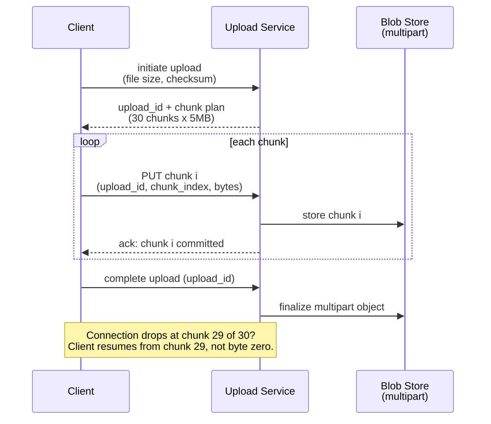

**Worked math, step by step:**

1. File size: 150MB. Chunk size: 5MB.
2. Number of chunks: 150 ÷ 5 = **30 chunks**.
3. A dropped connection at chunk 29 of 30 now costs a **5MB** retry, instead of a **150MB** one.
4. That's a **30x smaller** cost for the exact same network hiccup.

Chunk size is itself a small trade-off: smaller chunks resume more cheaply, but add more per-chunk request overhead. Something in the **4–8MB** range is a common middle ground `[illustrative — a reasonable default, not a fixed spec]`.

### What breaks next

The client got an instant "your video is uploading" state. But the *server* still has 150MB of raw bytes that need to become something actually watchable:

- Resized.
- Transcoded into multiple resolutions, so a phone on 3G doesn't get served the same file as one on wifi.

Only *after* that transcoding does the post's metadata row get written, and the fan-out event get triggered. None of that should happen while the uploader is still staring at a spinner.

The fix is the same "never block on the expensive part" idea Chapter 6's async fan-out already uses, just one step earlier:

1. Acknowledge the upload immediately.
2. Hand the raw bytes off to a transcoding pipeline that does the slow work off the request path entirely.

The deep mechanics of that pipeline (multi-resolution renditions, CDN pre-warming) belong to the companion Blob Store story, not repeated here.

### Interview soundbite

> "Large file uploads should never be one all-or-nothing request — split them into independently retryable chunks, the same shape as S3 multipart or `tus.io`, so a dropped connection costs one chunk, not the whole file. And once the bytes are safely in, the actual transcoding work still shouldn't block the response — same async-off-the-request-path principle as fan-out, just one layer earlier."

---

## Chapter 10 — The whiteboard note that erases itself

### The setup

Shutterly's product team asks for Stories: a post that's visible for exactly 24 hours and then must actually disappear — not just get hidden from the UI, genuinely gone.

The first implementation treats a story exactly like a regular post, plus a nightly batch job that scans for anything older than 24 hours and deletes it.

### Why it breaks

A bug report raises the obvious question: *if the job only runs once a night, how is a story that was supposed to expire at 2:00am still visible to some users at 9:00am?*

Because a once-a-night sweep has, on average, a **12-hour** lag behind the actual 24-hour promise. The deletion job is a batch process, not a real-time guarantee. "24 hours" quietly became "24 to 36 hours," depending on when in the cycle a story was posted.

### The fix

Stop treating expiry as a job you have to remember to run. Instead, treat it as a property of the *storage itself*.

This is exactly like a whiteboard note with a self-erasing timer built in — you don't need a janitor to come check the room and manually wipe the board at the right moment. The board itself just stops showing the note once its time is up.

Concretely:

- Store an `expires_at` field on the story row.
- Use the storage engine's own native TTL feature. Cassandra, for instance, supports a per-row TTL natively.

Expiry becomes a property the storage engine enforces for free — not a custom scheduled job someone has to keep maintaining.

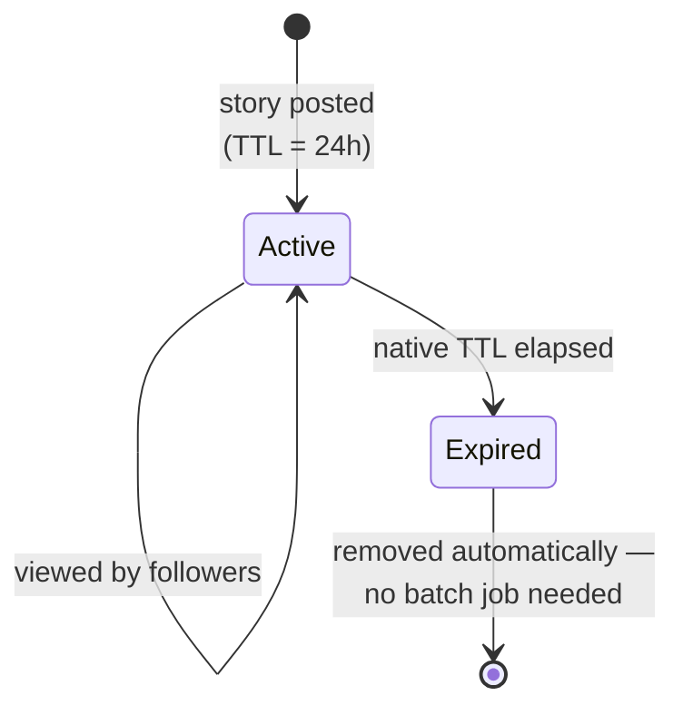

### The reuse point

Mechanically, this reuses the exact same timeline-store infrastructure that regular posts already use:

- Chapter 6's fan-out.
- Chapter 4's follow graph, for "who sees this."

A story isn't a new subsystem — it's a post with an expiry property attached. That's worth saying explicitly in an interview, because it's tempting to over-design a whole separate "ephemeral content service" for what is genuinely just a TTL field plus reused plumbing.

### Interview soundbite

> "Ephemeral content is a TTL problem, not a new architecture — reuse the same timeline/fan-out infrastructure a normal post uses, and prefer a storage engine's native per-row TTL over a custom scheduled-deletion batch job, since a nightly sweep has a lag the actual expiry promise can't afford."

---

## Chapter 11 — Two ways to find something you didn't know you wanted

### The setup

Shutterly's search bar lets someone type a hashtag or a username and get back matching posts, ranked roughly by how much reach they've gotten (likes plus views).

That's a fairly standard inverted-index problem (`hashtag → [post_ids]`). The deep mechanics of that belong to the companion Distributed Search story, rather than being re-derived here.

### The distinctive question

What do you show someone who **isn't typing anything at all** — just idly scrolling a "for you" tab, hoping to find something new from accounts they've never followed?

That's not search — there's no query to match against. This is **Explore/Discovery**, and the obvious wrong instinct is to build it as a whole second system from scratch.

### The fix

Explore isn't a new architecture. It's the *same* candidate-generation-then-ranking funnel the main feed already uses (the ranking mechanics themselves are the subject of the companion Newsfeed story) — just with a different **source** for candidates.

- The main feed's candidates come from "posts by people you follow."
- Explore's candidates come from "posts that people similar to you engaged with."

Swap one input into the same funnel, and reuse everything downstream: the same light-then-heavy ranking stages, the same dedup/diversity/privacy filtering pass.

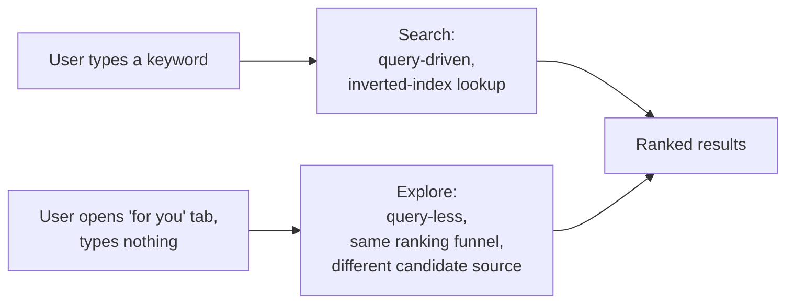

### A related problem, same family

One more thing worth naming in the same breath as search, because it's the same "protect the system from unbounded demand" family of problem — just at the API layer instead of the content layer.

Shutterly's API has no protection against a scraper hammering `searchPhotos` thousands of times a second, or a broken client stuck in a retry loop.

The fix — enforced at the API gateway, before a request ever reaches an app server — is a **token bucket** per user and per IP. Think of it like a ride at an amusement park where you need a ticket stub to get on, and stubs regenerate at a fixed rate. A burst of a few rides in a row is fine, but you can't ride nonstop forever.

Over the limit, the request gets a clean **HTTP 429 with a `Retry-After` header** — never a silent drop, and never something the database has to feel at all, because it's rejected at the edge before it gets anywhere near a shard, a graph read, or a search index.

### Interview soundbite

> "Search is query-driven pull; Explore is query-less push — but mechanically it's the same candidate-generation-and-ranking funnel with a different candidate source, not a second system. And separately, at the API layer, a token bucket per user and per IP at the gateway is what stops an abusive client from ever becoming the database's problem in the first place."

---

## Where the story actually lands

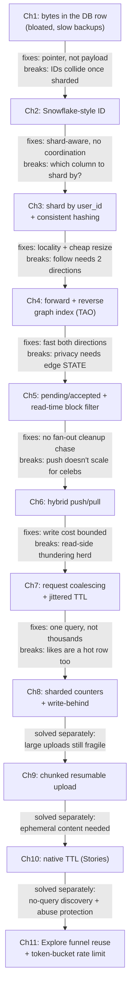

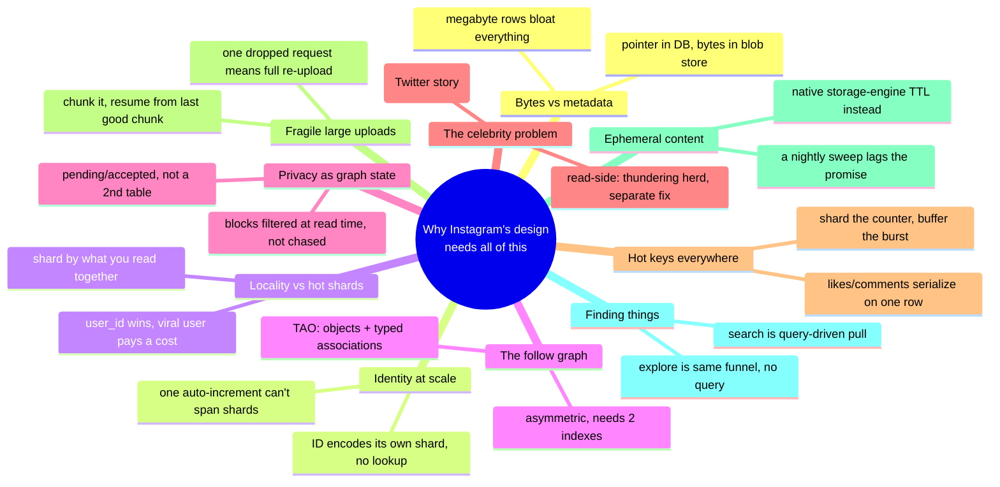

---

## Grill me — adversarial follow-ups

**Q1: "You moved bytes out of the database in Chapter 1 — doesn't that just move the problem to the blob store instead of solving it?"**

It moves the problem to a system actually built to solve it. A blob store is optimized for exactly this shape of workload — huge, immutable, write-once, read-many — the way a relational database is optimized for joins and small, structured rows. You're not hiding the cost, you're putting each kind of data on the storage engine whose trade-offs actually fit it.

**Q2: "Why embed the shard ID in the post ID instead of just keeping a lookup table of post_id → shard?"**

A lookup table is one more service in the critical path of every single read, and it becomes its own bottleneck and its own single point of failure at scale. Embedding the shard number in the ID means any server can compute the right shard from the ID alone, in memory, with zero network calls.

**Q3: "You sharded by user_id to avoid scatter-gather on profile reads — doesn't that just guarantee a hot shard for anyone who goes viral?"**

Yes, and that's a named, accepted trade-off, not an oversight. The mitigation isn't re-sharding around one user — it's the caching and hybrid fan-out layers doing their job, plus sharded counters absorbing the write-heavy part of "going viral" specifically. Sharding by post_id would trade that hot-shard risk away, but make the single most common read — "show me this user's posts" — expensive for everyone, all the time. That's a worse average-case trade.

**Q4: "Isn't 'pending/accepted' on a follow edge just a soft delete with a different name?"**

Not quite. A soft delete usually means "this used to be real and we're pretending it isn't," while pending/accepted means "this relationship never became real yet." The distinction matters operationally: fan-out and reverse-follower-count logic should treat a pending edge as if it doesn't exist at all, not as an edge that existed and got revoked.

**Q5: "The read-side thundering herd fix — request coalescing — only helps the first cache miss. What protects the tenth cache miss five minutes later when the TTL expires?"**

The jitter on the TTL is specifically for that. Instead of every replica's cached copy expiring at the exact same instant and recreating the exact same stampede, each one expires at a slightly randomized time nearby, so misses spread out instead of syncing back up. It doesn't eliminate misses — it just stops them from re-synchronizing into another herd.

**Q6: "Why not just use the database's own auto-increment for likes/comments counters and add more read replicas — isn't that simpler?"**

Read replicas fix read scaling, but the problem here is a **write** hotspot on one row. Every replica still has to receive that same serialized stream of writes from the primary, so replicas don't help at all. The actual fix has to reduce contention on the write itself — which is exactly what sharding the counter and buffering in something like Redis does.

**Q7: "Chunked upload adds real complexity — client-side chunking logic, a chunk-tracking table, resume logic. Is it worth it for every upload?"**

No. It's worth it specifically for large files on unreliable connections, which in practice means video, and often specifically mobile. A 3MB photo on decent wifi almost never benefits enough to justify the extra moving parts. The decision should be based on file size and expected connection quality, not applied uniformly to every upload type.

**Q8: "If Explore reuses the main feed's ranking funnel, what actually makes Explore results feel different from the main feed at all?"**

Only the candidate-generation input changes — "posts by people you follow" versus "posts similar users engaged with." Everything downstream (light ranking, heavy ranking, dedup, diversity, ad insertion, privacy filtering) is the same machinery. That's deliberate: it means you get a second product surface almost for free once the ranking funnel already exists, instead of maintaining two systems that could quietly drift out of sync with each other.

**Q9: "Where would you actually stop, if an interviewer just says 'design Instagram' cold, given how many chapters this story has?"**

Functional scope, non-functional priorities, and the capacity math first, always — those decide how much of the rest even matters. Then I'd go deep on whichever one or two areas the interviewer steers toward, most likely hybrid fan-out or media storage, and only walk through the ID scheme, counters, Stories, or rate limiting if they specifically come up. Depth on one or two areas beats a shallow tour of all eleven chapters.

---

## Cheat sheet — one line per stop on the story

| Stop | Takeaway |
|---|---|
| **Bytes in the DB row** | Never store megabytes in a relational row — keep a pointer to a blob store. This is the coat-check-ticket pattern. |
| **ID generation** | Instagram's real 2012 scheme: 41-bit timestamp + 13-bit shard ID (8,192 shards) + 10-bit sequence (1,024/ms/shard). The ID alone tells you which shard owns the row, no lookup service needed. |
| **Sharding key** | Shard by whatever you read together most (here, `user_id`). Accept the hot-shard risk on a viral user as a named trade-off, mitigated by caching and hybrid fan-out — not by re-sharding. |
| **Resharding** | Consistent hashing moves only ~1/N of the data when a node is added. Naive modulo remaps almost everything. |
| **Follow graph** | Directed, asymmetric — needs a forward AND a reverse index. Meta's TAO models it as typed, time-ordered associations cached per-region in front of a sharded store. |
| **Privacy & blocking** | Private-follow is edge *state* (pending/accepted), not a second table. Blocking is enforced at read time (feed filter, search, notifications) — never by chasing an already-completed fan-out. |
| **Celebrity problem, write side** | Push cost scales with follower count — a 100M-follower account would take hours to fan out serially. That's why hybrid (push small, pull huge) exists. Full derivation lives in the Twitter story. |
| **Celebrity problem, read side** | A synchronized read spike on a cache miss is a separate failure surface — fixed with request coalescing (leases) plus a jittered TTL, not more cache alone. |
| **Counters** | Likes/comments are a hot-row problem, not a capacity problem. Shard the counter, absorb bursts with something like Redis `INCR`, and treat the displayed count as approximate. |
| **Chunked upload** | Large files upload in independently-retryable chunks (S3 multipart / `tus.io` shape). A dropped connection should cost one chunk, not the whole file. |
| **Stories** | Ephemeral content is a TTL problem. Prefer a storage engine's native per-row TTL over a custom scheduled-deletion job, which always lags the promised expiry. |
| **Search vs. Explore** | Search is query-driven pull against an inverted index. Explore is query-less push through the *same* ranking funnel with a different candidate source — not a second system. |
| **Rate limiting** | Token bucket per user and per IP, enforced at the API gateway, 429 + Retry-After. Stop abusive traffic before it ever reaches a shard, a graph read, or a search index. |
| **The meta-lesson** | Nearly every fix in this story is answering one of two questions faster — "where are this post's bytes" or "whose feed does this post belong in." Say which one you're solving before you propose the fix. |
