# Design a URL Shortening Service (TinyURL) — The Story (narrative edition)

> **What this file is.** The reference file, `34-Design a URL Shortening Service - TinyURL-FAANG-Guide.md`, is the one to recite from. It has the requirements, the capacity math, every deep-dive table, and the master cheat sheet.
>
> This file is a second way in. It tells the same material as one continuous story, in plain language. Engineers at a company keep hitting a wall, patch it, and the patch creates the next wall — until we land on the exact same design the reference file documents.
>
> The company, **ClickPeak**, is fictional. It's a startup that shortens marketing-campaign links for brands and sells them click-analytics dashboards.
>
> But every wall it hits, and every fix it reaches for, is something a real, named system actually does:
> - TinyURL and bit.ly's own product choices
> - Flickr's real "ticket server" ID dispenser
> - Twitter's real Snowflake ID generator
> - Base58's real Bitcoin origin
> - Google Safe Browsing's real phishing-blocklist API
>
> I'll say clearly, every time, whether something is a documented fact or just a reasonable illustrative guess.

**The trigger phrases** for this whole topic: *"design bit.ly / TinyURL,"* *"design a link shortener,"* or *"design a service where a short code maps to something bigger — pastebin, coupon codes, QR redirects."*

Keep one sentence in your head as you read:

> **A URL shortener is a giant key-value store with two hot paths — mint a short, unique, unguessable key for a long URL, and turn that key back into the long URL almost instantly, about a hundred times more often than you mint one.**

Everything below is just this one idea, getting harder in small, honest steps.

---

## Chapter 1 — The locker room where you guess first, ask later

### The setup

It's ClickPeak's first year. The whole product is one form: paste a long campaign URL, get back `clickpeak.co/xK9p2Q`.

The code does the simplest possible thing:
1. Generate a **random** 5-character string from a 62-character alphabet (`A-Z a-z 0-9`).
2. Check the database for whether that string is already taken.
3. If it collided, retry with a new random string.

Why five characters? Marketing loves how punchy it looks. And `62^5 ≈ 916 million` slots feels enormous for a startup.

### The problem

It *is* enormous, for a while. At 3 million stored links, a fresh random draw has roughly a `3M / 916M ≈ 0.3%` chance of already being taken. Collisions are so rare nobody notices the retry loop even exists.

Two years and several big retail clients later, ClickPeak has **400 million** stored links `[illustrative — ClickPeak's own growth curve, but the math itself is the real birthday-paradox math any random-key scheme runs into]`.

Do the same division: `400M / 916M ≈ 44%`.

During a Black Friday campaign push — 500 shortens/sec arriving from ten different brands launching at once — the odds get ugly fast:
- **Nearly every other new link now collides with one already in the database on the first try** (44% of the time).
- About `0.44 × 0.44 ≈ 19%` collide **twice** in a row.

Each collision means a wasted database round trip before ClickPeak even attempts the real insert. p99 latency on "create my link" balloons, and a handful of requests exhaust their retry budget and fail outright — right in the middle of the campaign everyone's watching.

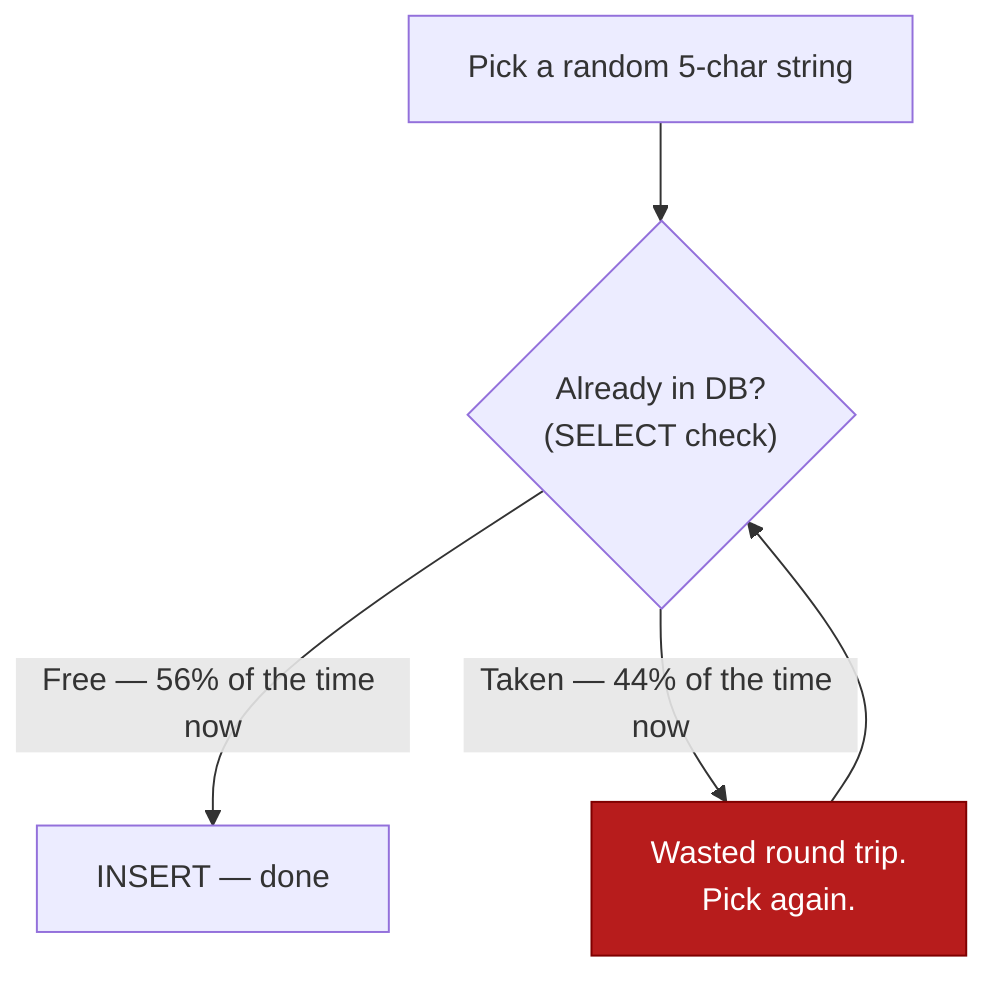

### Why it gets worse, not just stays bad

The obvious next question: *why does this get worse and worse the more successful ClickPeak becomes, instead of just staying roughly as reliable as day one?*

Because guessing-then-checking against a shrinking pool of free slots is exactly the **birthday paradox**. The more of the room is already "taken," the more of your guesses land on someone else's birthday. There was never a ceiling on *how bad* it gets — there's only a ceiling on the room (916 million slots), and ClickPeak is now walking straight toward it.

### The fix

Stop *guessing* a number and checking if it's free. Instead, hand out numbers from a **dispenser** — like the numbered-ticket machine at a deli counter. You never guess "is 4,021 taken?" — you just pull the next ticket, and it's *guaranteed* to be a number nobody's holding yet.

This is **counter-based ID generation**: a single auto-increment column (or an in-memory counter) hands out `1, 2, 3, 4, …`, one per request, with zero collision checks needed, ever.

This is also the analogy that will carry the rest of this story: coordination-free, guaranteed-unique dispensing, versus guess-and-check.

### The new problem this creates

Two new problems show up immediately:

1. A deli ticket is a plain number. `5001203` isn't remotely "tiny," and it's definitely not the punchy `xK9p2Q`-style code ClickPeak's product promises. Something has to turn that number into a short, typeable string.
2. Deli tickets are handed out `5001202, 5001203, 5001204, …` — dead sequential. Anyone who figures out today's ticket number can just count backward and forward to see every link anyone has ever created.

### How I'd say this in an interview

"Guess-a-random-string-then-check-the-DB feels fine at low volume, but it's the birthday paradox in disguise — collision odds climb non-linearly as the keyspace fills up, and eventually you're wasting a database round trip on every other request. The standard fix is a counter, not a guess — but a raw counter hands you a big, boring, and *predictable* number, which is the very next problem."

### A worthwhile detour: hash-based ID generation

ClickPeak's abandoned random-guess scheme has a real, named cousin: **hash-based ID generation** — hash `long_url + salt`, then truncate to 6-8 characters.

It's not identical to ClickPeak's scheme. Hashing derives the string from the URL's content instead of drawing it from thin air. But it has the *exact same disease*: two different inputs can truncate to the same short prefix, so it still needs a collision-check-and-retry loop.

The one genuine advantage hashing has over ClickPeak's pure-random version: it needs **no shared counter at all**. Any server can compute it alone — exactly the property Chapter 3 has to work hard to get *from* a counter.

| | Counter-based (Chapter 1's fix) | Hash-based (ClickPeak's near-cousin) |
|---|---|---|
| Uniqueness guarantee | Structural — a counter never repeats | Probabilistic — collisions possible, must check |
| Needs coordination? | Yes (a shared counter, or later a shared range) | No — stateless, any server computes it alone |
| Predictable? | Yes, sequentially — the exact Chapter 2 problem | Only if unsalted; a salt reintroduces the Chapter-1-style retry loop |
| Dedups identical URLs? | No — a fresh ID every time | Naturally, unless salted — a feature or a bug depending on intent |

---

## Chapter 2 — Stamping the ticket number onto a tiny license plate

### The fix

Take the deli-ticket integer and **encode** it into a short, URL-safe string, using a higher base than decimal. This is exactly what TinyURL-style services actually do:

- **Base62**: `A-Z a-z 0-9` — 62 symbols.
- **Base58**: the same alphabet with the four visually-confusable characters `0 O I l` removed — 58 symbols. This is the exact alphabet Bitcoin popularized for wallet addresses, for the exact same reason: humans misread these characters.

Encoding is just repeated division. Divide the number by the base, and the remainders — read in reverse — are your string.

### Worked example, traced by hand

Use a Base62 alphabet where index 0 is `'0'`, index 13 is `'D'`, and so on. Let's encode `12345`, one division step at a time:

**Step 1:** `12345 ÷ 62 = 199`, remainder `7` → character `'7'`

**Step 2:** `199 ÷ 62 = 3`, remainder `13` → character `'D'`

**Step 3:** `3 ÷ 62 = 0`, remainder `3` → character `'3'`

We stop once the quotient hits 0. Now collect the remainders **in the order we computed them**: `[7, 13, 3]`. Reverse that list to get the final string: `"3D7"`.

```text
12345 ÷ 62 = 199 remainder 7   -> '7'
  199 ÷ 62 =   3 remainder 13  -> 'D'
    3 ÷ 62 =   0 remainder 3   -> '3'
Remainders collected in order computed: [7, 13, 3] -> reversed -> "3D7"
```

So `encode(12345) = "3D7"` — three characters instead of five decimal digits.

**Decoding runs it backward.** For each character, left to right: `num = num*62 + digit_value`. Feeding `"3D7"` back through this recovers exactly `12345`.

**Why this scales:**
- Three characters already cover `62^3 = 238,327` combinations.
- Six characters cover `62^6 ≈ 56.8 billion` combinations — comfortably past ClickPeak's entire multi-year link volume.

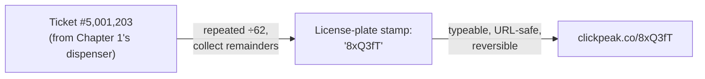

ClickPeak ships this and it's an immediate improvement. Links are short and typeable, and every one is guaranteed unique — because the *encoding* is deterministic and reversible. It never collides; it just relabels a number nobody else has.

### The new problem — and it's the one from the end of Chapter 1, fully exposed

`encode(5001203)` and `encode(5001204)` are neighboring license plates on a production line. A script that decodes ClickPeak's own encoding scheme — trivial, since Base62 math is public — can walk `id, id+1, id+2, …` and enumerate **every private campaign link ClickPeak has ever issued**, including unlisted ones a client explicitly didn't want scraped.

Worse, that single auto-increment column is still one shared resource. A benchmark on ClickPeak's DB shows one MySQL auto-increment column sustaining about **2,500 writes/sec** before row-lock contention starts backing things up `[illustrative — a stand-in for "one shared counter column has a ceiling," not a measured figure]`.

A coordinated multi-brand launch pushes ClickPeak to **4,000 shortens/sec**. The dispenser itself — not the database storage, not the encoding — becomes the bottleneck.

### How I'd say this in an interview

"Base62/Base58 encoding solves 'make the number tiny and typeable' — it's deterministic math, so it never introduces a collision of its own. But encoding a sequential counter just relabels the sequential-ness. `encode(n)` and `encode(n+1)` are trivially related, so you've moved the enumeration problem, not solved it — and you've still got one shared counter as a write bottleneck."

---

## Chapter 3 — Giving every clerk their own booklet of tickets

### The fix

Stop making every app server queue at one central dispenser for every single ticket. Instead, hand each server a whole **booklet** — a pre-reserved block/range of IDs, like `[5,000,000 – 5,999,999)` — that it can hand out locally, in memory, with zero coordination per request.

This is Flickr's real, documented **ticket server** pattern in production: two MySQL instances, one configured to increment by 2 starting on evens, the other on odds, used purely as distributed ID dispensers.

**The math for ClickPeak:**
- ClickPeak runs 8 app servers.
- Each needs roughly `4,000 / 8 = 500` IDs/sec.
- A booklet of a million IDs lasts one server over 30 minutes at that rate.
- So the shared "central office" (a small coordination table, or Zookeeper) only fields a booklet-refill request every half hour or so per server — nowhere near its ceiling.

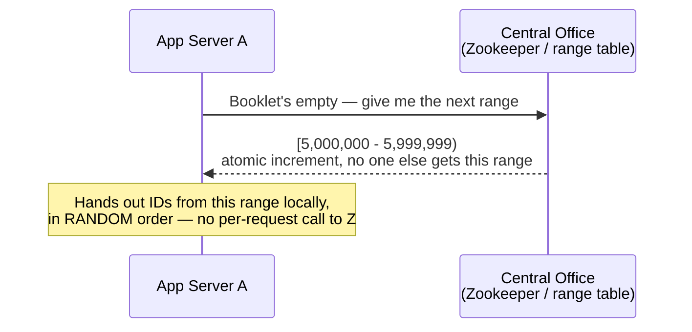

**One more tweak that matters:** randomizing which ticket in the booklet gets handed out next — instead of handing them out in order — is what finally kills the Chapter 2 enumeration problem. Two links created seconds apart no longer decode to two nearby numbers.

### The new problem

The booklet hand-out itself is still a shared resource, and two servers *can* hit it at the exact same instant. For example: both exhaust their booklets during the same traffic spike, and both ask the central office for a new range within the same millisecond.

If the central office does a naive "read the current value, then write value+1M," both servers can read the *same* current value and get overlapping, duplicate ranges.

**The fix has to be an atomic operation, not a read-then-write.** The central office's own atomic increment (Zookeeper's atomic counter node, or a DB `UPDATE ... RETURNING`) is the sole arbiter. Whichever request the database's own atomicity happens to serialize first gets the lower range, full stop — with no window for both to see the same starting number.

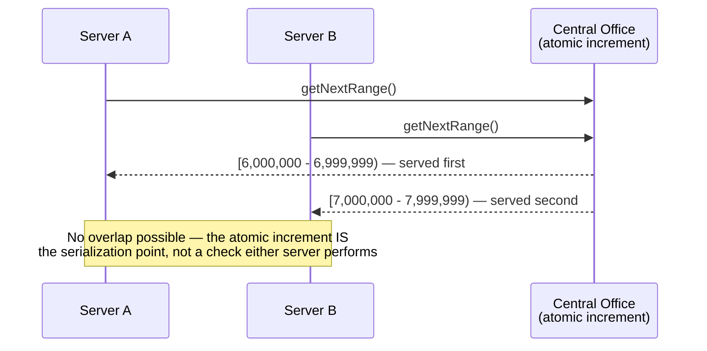

If a server crashes while holding a half-used booklet, the unused remainder is simply lost. Against a `56.8 billion`-slot keyspace, that's a rounding error, not a real cost.

### How I'd say this in an interview

"Range-based ID generation — Flickr's real ticket-server trick — moves contention from 'every write' to 'once per block,' so it scales past a single counter without giving up uniqueness. The one thing you must get right is making the block hand-out itself atomic — an atomic increment, not a read-then-write — otherwise two servers can grab overlapping ranges at the exact same instant."

---

## Chapter 4 — The branch office that stamps its own receipts

### The setup

Three years in, ClickPeak opens a European data center so EU redirects don't cross the Atlantic. Now booklet refills occasionally have to phone the original "central office" back in the US. That's rare, but each such refill call now costs an extra **~80ms round trip** `[illustrative — cross-Atlantic RTT is genuinely in this range, but "80ms" for ClickPeak specifically is a stand-in]`.

It's tolerable today. But the underlying question is now live: *can we mint IDs with truly zero coordination at all, across data centers, forever?*

### The real-world answer: Snowflake

The real answer at that scale is Twitter's actual **Snowflake** ID generator. It packs a 64-bit ID from pieces every machine already knows *locally*, with no phone call to anyone:

```text
| 1 bit unused | 41 bits timestamp (ms) | 10 bits machine ID | 12 bits sequence number |
```

**The analogy:** it's like every branch office printing its own receipt numbers from its own date stamp, its own fixed branch code, and its own daily counter — no call to headquarters, ever, because nothing on the receipt depends on anything headquarters knows that the branch doesn't already have.

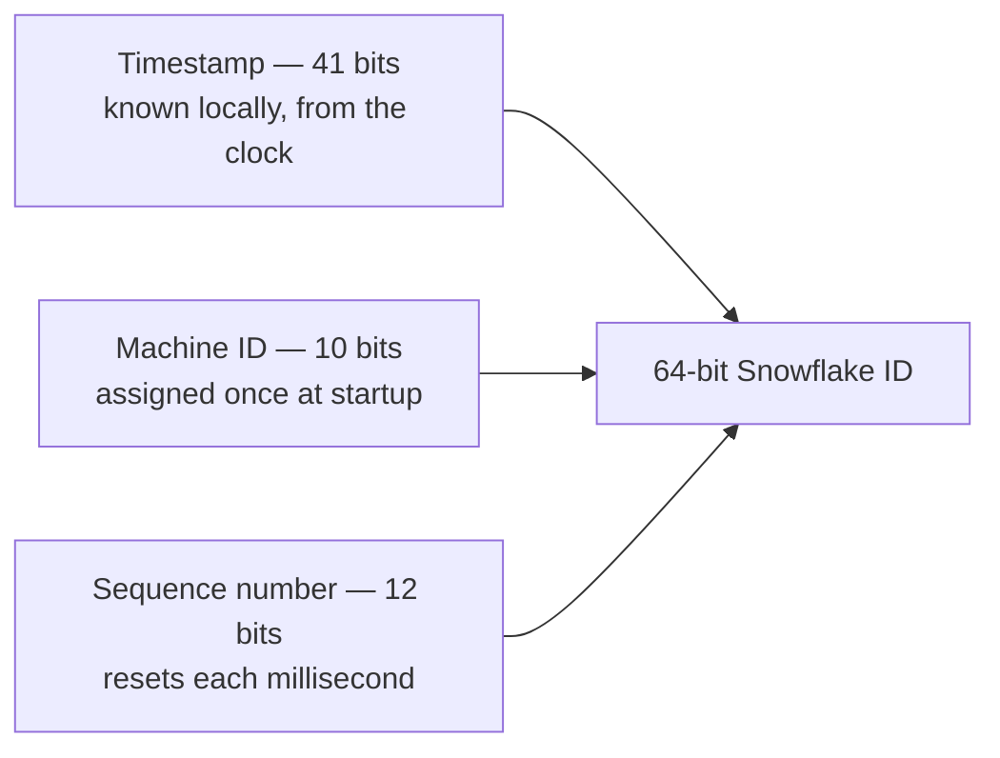

### The new problem

All three pieces of a Snowflake ID assume every machine's *clock* is trustworthy. If a machine's clock jumps backward — an NTP correction, a VM migration pausing and resuming — it can mint an ID that duplicates or precedes one it already generated.

The real, documented fix is a **guard, not a smarter algorithm**: detect the rollback and simply *refuse to generate* until the clock catches back up to where it already was.

### Why ClickPeak doesn't need this yet

ClickPeak's actual scale is 8 app servers across two data centers — not thousands of independent writers. That doesn't need Snowflake yet. The range-based booklets from Chapter 3 are proven, simple, and have no clock dependency at all.

ClickPeak documents Snowflake as "the answer the day we have real multi-region writers with zero tolerance for any shared state," and moves on with booklets. That honesty — knowing the fancier tool and still not reaching for it — is itself the signal an interviewer is listening for.

### How I'd say this in an interview

"Snowflake gets you fully decentralized ID generation — no shared state, no per-request coordination, proven at Twitter's scale — by packing a timestamp, a machine ID, and a sequence number into 64 bits. The cost is a dependency on clock correctness, which needs its own guard against rollback. I'd only reach for it once range-based booklets genuinely run out of runway, not by default."

---

## Chapter 5 — The coat hook that only fits one coat

### The setup

ClickPeak adds a paid feature: brands can request a **custom alias** — `clickpeak.co/summer-sale` instead of a generated code.

Two people on the same marketing team, both trying to lock in `"summer-sale"` before a launch meeting, click submit within two milliseconds of each other.

### The problem

Both requests run `SELECT ... WHERE short_key = "summer-sale"`, and both see: not found. Both proceed to `INSERT`.

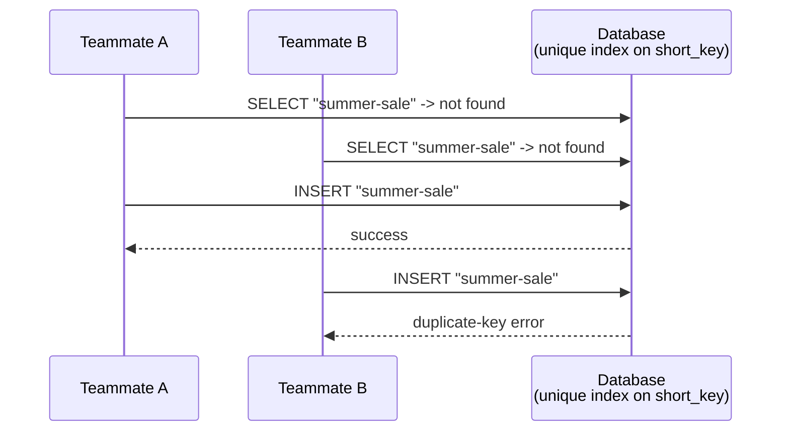

### The fix

The obvious question: *how do we check availability without this "check, then act" gap ever opening?*

We don't try to close the gap in application code. Locking across app servers doesn't scale, and it's still racy the instant you have more than one server.

**The fix is to make the coat hook itself the referee**: put a **unique index on `short_key`**, and treat the SELECT as only a fast, friendly UX hint. The *real* answer to "is this alias free" is whatever the `INSERT`'s unique-index constraint decides — because that's the only check that's atomic.

Only one coat physically fits on a coat hook. It doesn't matter who *looked* at the empty hook first — only who actually hung their coat on it.

### The new problem — smaller, but real

Now that aliases are user-chosen strings instead of encoder output, ClickPeak needs two extra guards:

1. **Cap the length**, to match what the encoder can even produce — 11 characters, matching a 64-bit ID's Base58 ceiling.
2. **Screen against a small blocklist** (`admin`, brand names, slurs) — before the uniqueness check ever runs. Otherwise a fast client could reserve `"nike"` or `"coca-cola"` for something ClickPeak really doesn't want to host.

### How I'd say this in an interview

"Custom alias is a textbook check-then-act race. You don't fix it with a smarter check — you fix it by making the database's own unique constraint the actual source of truth, and treat any earlier availability check as just a UX nicety that can be wrong."

---

## Chapter 6 — The sticky note on the filing cabinet

### The setup

By year three, ClickPeak's redirect traffic dwarfs its shorten traffic — the same shape the reference guide's own capacity math shows: roughly **100 redirects for every 1 new link**.

At ClickPeak's volume, that works out to:
- **~76 shortens/sec**
- **~7,600 redirects/sec**

### The problem

Every one of those 7,600 reads/sec was hitting the sharded database directly. During a client's TV-ad campaign launch, redirect p99 latency — normally ~20ms — balloons past **400ms** `[illustrative — the specific ceiling depends on hardware, but "one DB under 7,600 QPS of point-lookups starts to choke" is the real, general failure mode]`.

Why? Because every single click — even for the same three or four viral links — re-runs a full database lookup.

### The fix

The fix is a **cache-aside** layer. Think of it as a sticky note taped to the front of the filing cabinet with the answer already written on it, so most people never open the drawer at all.

On a redirect:
1. Check the sticky note (cache) first.
2. Only open the drawer (DB) on a miss.
3. Write a fresh sticky note before answering.

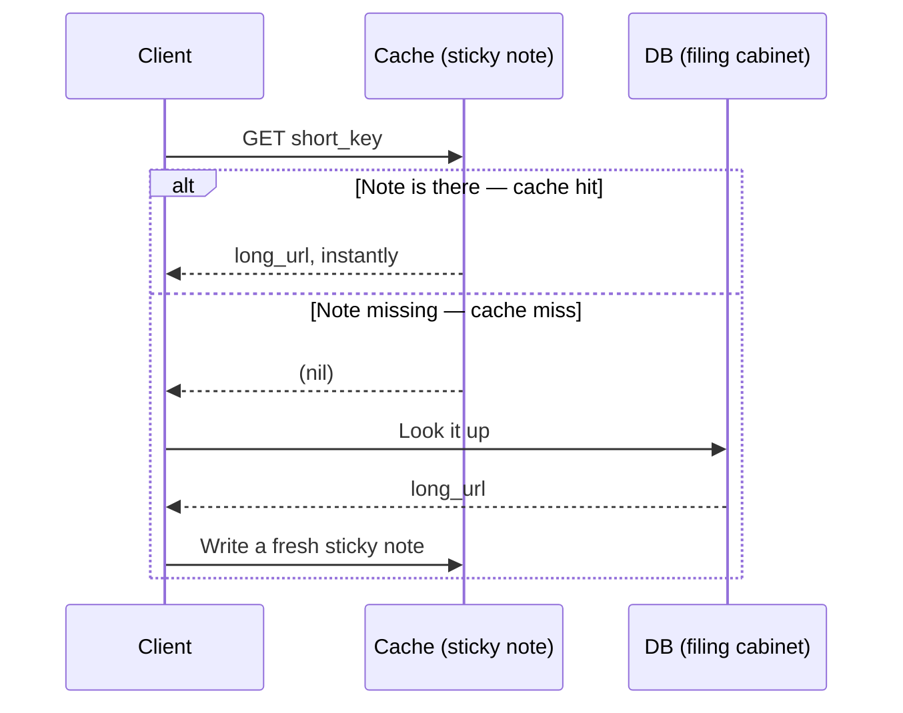

**Why this is cheap:** the 80/20 rule. The hottest 20% of links drive about 80% of reads. So caching just that hot slice — roughly **66 GB** at ClickPeak's scale — fits comfortably in RAM across a small handful of nodes. There's no need to ever try to cache the full multi-terabyte dataset.

### The new problem

A sticky note has a TTL — it eventually gets taken down so it can be refreshed. What happens the instant a *wildly* popular note's tape lets go, right when thousands of people are asking for it at once?

### How I'd say this in an interview

"The redirect path is a hundred-to-one read-heavy lookup, so cache-aside plus the 80/20 rule is the default, not an optimization — cache the hot 20% of keys, not the whole dataset, and most reads never touch the database at all. The failure mode that shows up next isn't 'no cache,' it's 'what happens exactly when a hot cache entry expires under load.'"

---

## Chapter 7 — When the sticky note falls off during a stampede

### The setup

A shoe brand's link gets tweeted by a celebrity. That one short link spikes to **12,000 requests/sec** `[illustrative — a plausible viral-spike number, not a measured one]`.

### The problem

Its cache entry's TTL happens to expire in the exact middle of the spike. Every one of those 12,000 requests, in that same instant, sees a miss at the same moment — and stampedes the database *simultaneously* for the *same* row.

This is a classic **thundering herd**: instead of one refresh, the DB just took 12,000 redundant identical queries in the same second.

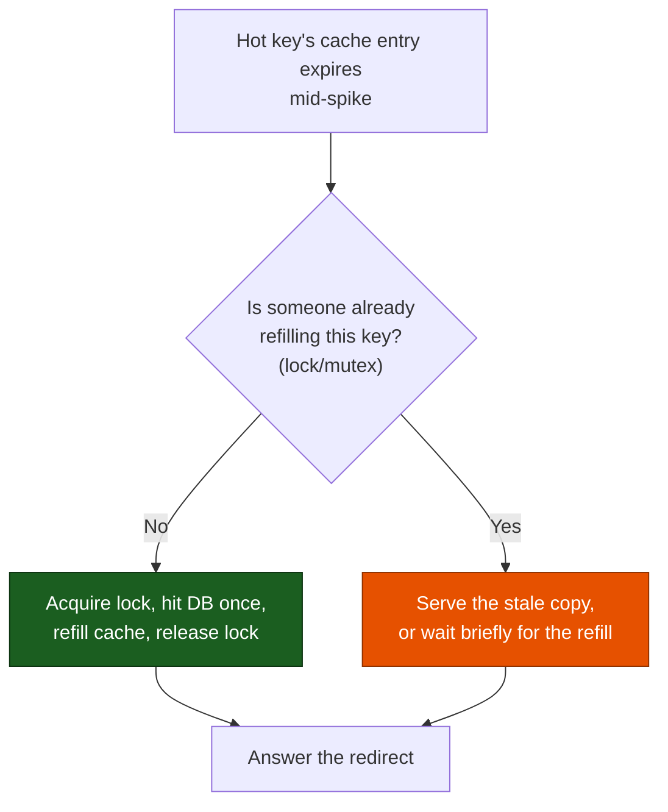

### The fix — two parts, plus a third layer for the extreme tail

1. **Lock-on-miss**: only the first request actually refills the cache. Everyone else waits briefly, or is served the slightly-stale copy, instead of also hitting the DB.
2. **Jittered TTLs**: spread expiry times randomly, so many hot keys don't expire in the exact same instant to begin with.
3. **CDN edge cache**, for the *hottest of the hot* — the true viral tail. Same sticky-note idea, but taped up at the mall entrance itself instead of back at the filing cabinet — so most of those 12,000 requests/sec never even reach a ClickPeak server.

### The new problem

Now that reads are fast, cheap, and resilient, the brands paying for these links start asking the obvious business question: *how many people actually clicked, from where, on what device?* Redirect speed and analytics accuracy are about to pull in opposite directions.

### How I'd say this in an interview

"A hot key's cache TTL expiring under load is a thundering herd waiting to happen — the fix is lock-on-miss so only one request repopulates the cache, jittered TTLs so hot keys don't all expire together, and a CDN edge layer in front for the true viral tail so the origin never even sees that traffic."

---

## Chapter 8 — The redirect that has to stick around long enough to be counted

### The setup

ClickPeak's business model is bit.ly's real business model: sell brands a click-analytics dashboard, not just a shortener.

Early on, ClickPeak used **301 (Moved Permanently)** redirects, because they're fast and browser-cacheable.

### The problem

During a pilot with one client, ClickPeak's dashboard reported **35–40% fewer clicks** `[illustrative]` than the client's own ad-platform impression counts.

The reason: a 301 tells the browser "remember this forever." After the *first* click, the browser just redirects locally on every repeat visit and never asks ClickPeak's server again. So ClickPeak silently stops seeing most of the real traffic.

| | 301 (Moved Permanently) | 302 (Found / Temporary) |
|---|---|---|
| Browser caching | Cached — repeat clicks skip ClickPeak's server | Not cached — every click hits the server |
| Click analytics | Undercounted, badly | Accurate — every click is seen |
| Server load | Lower | Higher (guaranteed every time) |
| Right fit | Pure "just redirect" utilities | Analytics-driven products, bit.ly's actual real choice |

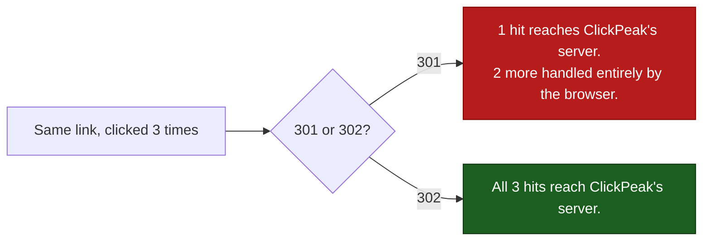

### The fix

ClickPeak switches to **302** for analytics-tier links — exactly bit.ly's documented real-world choice, made for the exact same reason. Click counts become accurate immediately, at the cost of every single click, forever, hitting a server. (The caching from Chapters 6–7 already made that cheap to absorb.)

### The new problem

Now that every click reliably reaches ClickPeak's server, someone wires up "log this click's referrer, geo, device" directly into the redirect handler. The very call that must be instant just picked up a brand-new side effect sitting right on its critical path.

### How I'd say this in an interview

"301 versus 302 has no universally right answer — it's a straight trade of server load for analytics accuracy. If click counting is a real product requirement, like it is for bit.ly, you pay for 302's extra server hits on purpose. If it's a pure utility link with no analytics ambition, 301 is strictly cheaper."

---

## Chapter 9 — Dropping the postcard in the mailbox on the way out

### The problem

ClickPeak measured that logging click details synchronously into the database added **15–25ms** `[illustrative]` to every single redirect — a real, meaningful chunk of an otherwise near-instant response.

### The fix

The fix is the same shape as any "don't let a side effect block the main thing" problem: **push the click event onto an async queue and let the redirect response leave immediately.**

Fire the event at a queue (Kafka or SQS — either real, documented at-least-once queue works here), and let a completely separate consumer pipeline write it into an analytics store on its own time.

**The analogy:** it's dropping a postcard in a mailbox on your way out the door. You don't stand at the mailbox waiting for a delivery confirmation before you leave — the postcard gets where it's going on its own schedule, and your leaving was never blocked on it.

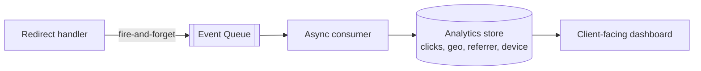

Redirect latency drops right back down to the cache-hit numbers from Chapter 6. The dashboard clients pay for keeps working exactly the same — just fed a beat later instead of inline.

### The new problem — this one's about growth, not design

Years of accumulated campaign links across hundreds of client brands push ClickPeak's dataset past a single database node's comfortable size — into the hundreds of gigabytes, heading toward low terabytes.

### How I'd say this in an interview

"Analytics is a side effect, never a blocking dependency of the redirect — same pattern as an order-confirmation email after checkout. Fire the click event at a queue, let a separate pipeline consume it into the analytics store, and the redirect's latency budget never has to include 'and also write an analytics row.'"

---

## Chapter 10 — The roulette wheel that only reshuffles its neighbors

### The setup

ClickPeak's `URLS` table crosses a size no single machine wants to hold. The reference guide's own worked example lands around **6 TB at a 5-year horizon**; ClickPeak's real number is smaller, but the shape is identical.

The fix is to **shard**: split the table across many machines.

### The first attempt — and why it fails

ClickPeak's first instinct is to shard by `owner_id` — after all, "which client owns this link" feels like the natural grouping.

It backfires almost immediately: one enterprise client dumping **50,000 campaign links a day** into their own account floods a *single* shard, while nine other shards sit nearly idle.

### The fix

The actual right shard key is `hash(short_key)`, placed on a **consistent-hash ring** — the same real mechanism behind Amazon's Dynamo and Cassandra's ring design, here applied to picking which shard holds which row instead of which broker holds which partition.

**The analogy:** a roulette wheel where every shard claims a slice of the wheel, and every key spins to land somewhere on it — owned by whichever slice it lands in. Adding a shard only steals a thin slice from its immediate neighbor; nobody else's data moves.

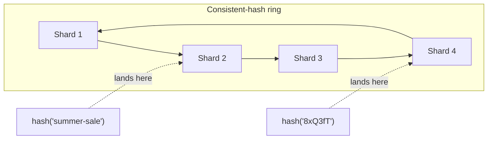

**Redoing the math with the fix:** shard by `hash(short_key)` instead of `owner_id`, and no single client's write pattern can flood one shard anymore. A client's links scatter uniformly across the whole ring, regardless of who owns them. Read traffic spreads the same way — and note that the redirect path only ever has `short_key`, never `owner_id`, so this also happens to be the only shard key that even *helps* reads.

### The new problem — the last structural one

Sharding fixes storage and load distribution. But every fix up to this point still assumes a link, once created, lives forever exactly as issued. What actually happens to a link over its life — and can a retired short code ever be handed to someone new?

### How I'd say this in an interview

"Shard by `hash(short_key)` on a consistent-hash ring, never by `owner_id` or alphabetically — both of those create hot shards the moment one client or one letter range gets popular. Consistent hashing is what makes adding a shard later cheap: it only reshuffles that shard's immediate ring neighbors, not the whole dataset."

---

## Chapter 11 — Why a dead locker never gets a new coat, and who's watching the door

Two last, independent threads close the story.

### Thread 1 — Lifecycle

A link that's expired or been deleted by its owner is never — ever — reused for a new URL, even though the keyspace could easily afford it.

The reason isn't storage — it's trust. An old, possibly still-bookmarked or still-indexed link could suddenly start pointing at unrelated new content. That's a correctness violation, not a technical inconvenience.

ClickPeak handles this with two separate mechanisms:
- **Lazy expiry check on every read**: one cheap field comparison, effectively free, catching a stale click before it ever redirects anywhere.
- **A low-priority nightly reaper**: tombstones expired rows purely to reclaim storage.

Correctness is free on every read. Storage cleanup is scheduled janitorial work.

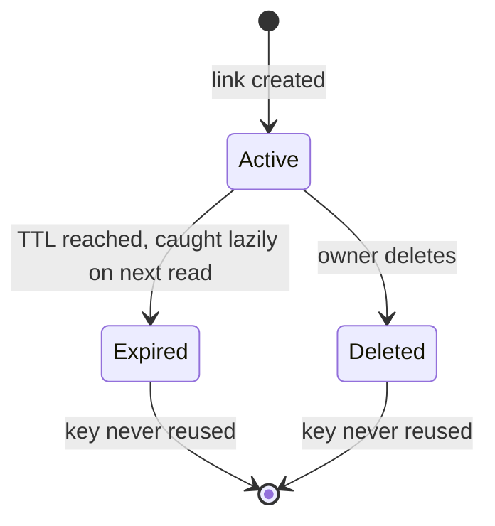

### Thread 2 — Abuse

Abuse shows up in direct proportion to how popular ClickPeak gets. There are three separate threats here, and it's worth keeping them distinct rather than waving at "we'd add security":

| Threat | Real-world fix |
|---|---|
| A shortened link hides its destination, making it an attractive phishing vector | Check `original_url` against Google Safe Browsing (a real, documented threat-intel API) **synchronously at creation**, and **re-scan periodically** afterward — a clean site can turn malicious after the link's already circulating |
| A script hammers the shorten endpoint | A fixed-window limiter is enough for authenticated `api_dev_key` traffic; anonymous, no-login shortening needs its *own*, stricter per-IP sliding-window or token-bucket limiter, since rotating keys defeats a per-key limit alone |
| Someone tries to enumerate every link ClickPeak has ever issued | Already closed, back in Chapter 3 — random draw within a booklet, not sequential hand-out — but worth restating: it's the same random-key discipline paying off twice |

### How I'd say this in an interview

"Lifecycle and abuse are the last two things I'd bring up even if not asked. A retired key is never reused — that's a trust decision, not a keyspace one, and the keyspace was never actually tight. And a shortener is a phishing target *because* it hides the destination, so I'd scan URLs at creation and again periodically, not just once."

---

## Where the story actually lands


Every real production URL shortener you'll design in an interview sits *somewhere* on this chain.

- A quick "sketch it in five minutes" answer might reasonably stop around Chapter 6 or 7: counter-based IDs, encoding, caching.
- A "go deep for twenty minutes" answer walks the whole thing — including the parts that only bite once the product is genuinely popular: custom aliases, sharding, security.

---

## Grill me — adversarial follow-ups

**Q1: "Why not just use a UUID and skip ID generation entirely?"**

A UUID solves uniqueness with zero coordination, which is genuinely appealing. But it's 36 characters with dashes — and the entire point of this product is a *tiny* link. It fails the one requirement that actually defines the system. It's a good answer to "why not a coordinator," but a bad answer if you stop there without mentioning length.

**Q2: "Walk me through what happens if two app servers both exhaust their ID booklet in the same millisecond."**

Both ask the central office for a new range at nearly the same instant. But the central office resolves it with an atomic increment — not a read-then-write — so whichever request the database serializes first gets the lower range, and the second gets the next one, with zero possibility of overlap. That's the same "let the shared resource's own atomicity decide" principle as the custom-alias race in Chapter 5.

**Q3: "Isn't randomizing IDs within a range just security theater — can't someone still brute-force scan the whole 56-billion keyspace?"**

They could try. But scanning 56.8 billion random-looking six-character strings to find the handful that are actually assigned is a completely different cost than counting `1, 2, 3, …`. It turns a trivial enumeration into a practically infeasible brute force — and pairing it with rate-limiting the redirect endpoint itself closes the gap further.

**Q4: "You said cache the hot 20% — what if the traffic distribution isn't actually 80/20 for us?"**

Then you size the cache off your *actual* observed hit-rate curve, not the rule of thumb. 80/20 is a starting assumption to justify "cache a slice, not everything" — it's not a law of physics. The mechanism (cache-aside, TTL, lock-on-miss) doesn't change; only the sizing math does.

**Q5: "If 302 is more accurate for analytics, why would anyone ever choose 301?"**

Because 301 is strictly cheaper when you don't need click accuracy at all. A pure personal link-shortening utility with no analytics ambition has nothing to gain from paying for every repeat click to hit its server. It's a requirements-driven trade, not a "302 is just better" call.

**Q6: "Doesn't putting click-logging on a queue mean you could lose some click events?"**

Yes — and that's an accepted trade. A queue like Kafka or SQS is at-least-once by design, and even a dropped or duplicated click event is a rounding error on an analytics dashboard, unlike a lost order in a payments system. That asymmetry — "this side effect can tolerate loss, the main path cannot" — is exactly why it's safe to make analytics async in the first place.

**Q7: "Why does sharding by `owner_id` fail specifically, when it seems like the natural grouping?"**

Because it ties storage and load distribution to something with wildly uneven real-world skew — one big client can generate far more links than a thousand small ones combined. It also doesn't even help the read path, since a redirect only ever has the `short_key`, never the `owner_id`. `hash(short_key)` spreads both reads and writes independent of who owns what.

**Q8: "What's actually different between the encoding step and the ID-generation step — aren't they solving the same problem?"**

No. Encoding is deterministic, reversible math with zero possibility of collision — the same number always encodes to the same string and back. Uniqueness is entirely the ID generator's job, upstream of encoding. Blurring the two is a common mistake — "collision" only ever means "two different requests got the same ID," never "the encoding broke."

**Q9: "If someone says 'design a URL shortener' cold, where do you actually start?"**

State the read:write ratio out loud first — it's roughly 100:1 for this system — because that one number is what justifies caching aggressively and not over-engineering the write path. Then walk forward only as far as the interviewer's questions actually point: ID generation and encoding are close to a given, but sharding, custom aliases, and the security triad are things you earn by naming a specific requirement, not defaults you bolt on for their own sake.

---

## Cheat sheet — one line per stop on the story

- **Random string + DB check**: works until the keyspace fills up — birthday-paradox collision odds climb non-linearly, and every collision wastes a full DB round trip.
- **Counter-based ID generation**: a ticket dispenser, not a guess — guaranteed unique, but produces a big, boring, sequential number.
- **Base62/Base58 encoding**: deterministic, reversible math that stamps a number onto a tiny license plate — never the source of a collision, and never fixes predictability on its own.
- **Range-based booklets (Flickr's ticket server)**: hand each server its own block of IDs so contention happens once per block, not once per request — the block hand-out itself must be an atomic increment, never a read-then-write.
- **Randomize within the booklet**: the actual fix for enumeration — sequential hand-out is what makes `id, id+1, id+2` scraping possible in the first place.
- **Snowflake (timestamp + machine ID + sequence)**: the answer once you need zero coordination across many independent writers in many data centers — the cost is a dependency on clock correctness.
- **Custom alias race**: a coat-hook problem — the database's unique index is the real arbiter; any earlier "is it free" check is just a UX hint that can be wrong.
- **Cache-aside + 80/20 rule**: cache the hot 20% of keys to absorb 80% of reads — a sticky note on the filing cabinet, not a second copy of the whole cabinet.
- **Lock-on-miss + jittered TTL + CDN**: what stops a hot key's cache expiry from becoming a thundering herd, and stops the true viral tail from ever reaching the origin at all.
- **301 vs 302**: a straight trade of server load for click-accuracy — pick 302 the moment analytics is a real product requirement, not by default.
- **Async click queue**: analytics is a side effect, never a blocking dependency of the redirect — drop the postcard in the mailbox and keep walking.
- **Consistent-hash sharding on `hash(short_key)`**: spreads load independent of who owns what — never shard by `owner_id` or alphabetically, both create hot shards.
- **Never reuse a retired key**: a trust decision, not a keyspace one — lazy expiry check protects correctness for free, a scheduled reaper reclaims storage on its own time.
- **Security triad**: scan URLs at creation and again periodically, rate-limit authenticated and anonymous traffic differently, and keep keys unguessable — three separate threats, three separate fixes.
- **The meta-lesson**: every fix in this story buys one property — uniqueness, brevity, unpredictability, no-contention, correctness, low latency, accuracy, or even load distribution — by spending something else. Say the trade in the same sentence you propose the fix.
