# Spectacular Failures — The Story (narrative edition)

> **What this file is.** The reference file, `39-Spectacular-Failures-FAANG-Guide.md`, is the one
> to recite from — the mental model, the nines table, the three incident deep-dives, every
> cross-cutting pattern, the golden rules, the master cheat sheet. This file is a second way in:
> the same material told as one continuous story.
>
> It differs from the other "-story" companions in this folder on purpose. Those retell a fictional
> company hitting fictional walls, because their source material is a general design problem. This
> one can't do that. **Every incident below is real, named, and documented in a public
> postmortem** — Meta's October 4, 2021 outage, AWS Kinesis's November 25, 2020 outage, and AWS
> US-EAST-1's December 7, 2021 outage. Fictionalizing them would misrepresent what actually
> happened.
>
> So the story here is the real chronological and causal chain: three real outages in the order
> they happened, then the general patterns the industry pulled out of incidents exactly like these.
> Every number is the actual documented or widely-reported figure, and every estimate is flagged as
> an estimate — same as the reference file.

**The one sentence to hold onto:** distributed systems don't fail because one thing breaks. They
fail because the safety net turns out to share a dependency with the thing it was supposed to
catch. Watch for that exact shape recurring across all three incidents below.

---

## Chapter 1 — The four ways a system can betray you

A distributed system fails in exactly one of four shapes:

- **Crash** — a process or box dies, and its memory state is lost.
- **Confuse** — it keeps running, but the logic is wrong or deadlocked.
- **Cut-off** — nothing is actually down, but components can't reach each other.
- **Corrupt** — a replica or disk goes bad.

Memory hook: *Crash, Confuse, Cut-off, Corrupt.*

No real outage has one root cause. It's always a chain of individually-reasonable decisions,
each one making the next failure a little more likely:

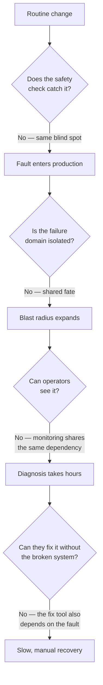

Every "No" on that diagram is a design decision an interviewer wants you to make correctly ahead of
time. All three incidents below walk down this exact ladder, step by step.

**How I'd say this in an interview:** "Failures reduce to crash, confuse, cut-off, or corrupt — but
they become outages, not blips, almost always because the safety net shared a blast radius with the
fault it was meant to catch."

---

## Chapter 2 — Putting a number on "acceptable failure"

Before the story starts, one bit of vocabulary: how much downtime does each "nines" number actually
buy you?

| Availability | Downtime/year | Colloquial |
|---|---|---|
| 99% | 3.65 days | "two nines" |
| 99.9% | 8.76 hours | "three nines" |
| 99.99% | 52.6 minutes | "four nines" |
| 99.999% | 5.26 minutes | "five nines" |

A 99.9% monthly SLO gives a team roughly **43 minutes of error budget a month**. That budget can be
burned fast without anyone noticing until it's nearly gone.

**Worked example.** Picture a team that has burned 34 of its 43 minutes by day 10 of the month:

- 34 minutes burned ÷ 43 minutes total = **79% of the whole month's budget gone in the first
  third of the month.**
- Only 9 minutes of budget remain for the other 20 days.

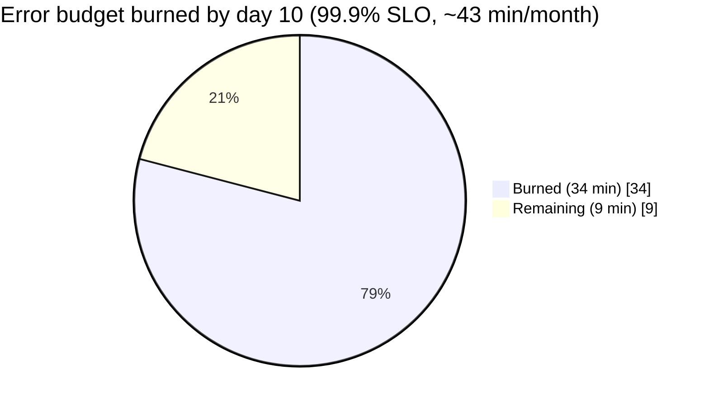

At that burn rate, the disciplined move is to **freeze risky changes for the rest of the month**.
All three incidents below started as exactly the kind of "routine" change a freeze is meant to
defer.

Availability also has a second trap: **composite availability multiplies down, it doesn't
average.** Five services at 99.9% each chained together give:

```
0.999 × 0.999 × 0.999 × 0.999 × 0.999 ≈ 0.995 (99.5%)
```

That's worse than any single one of the five services on its own. Every extra hop in a call path is
a cost. This is exactly how one Kinesis problem became a Cognito problem, a CloudWatch problem, and
a Lambda problem all at once — which is where Chapter 3 picks up.

**How I'd say this in an interview:** "Nines compose by multiplying, not averaging, so every extra
dependency drags the effective availability down. Error budgets turn 'be reliable' into a number a
team can spend or freeze."

---

## Chapter 3 — The capacity add that hit a ceiling nobody had drawn (AWS Kinesis, Nov 25, 2020)

**What happened.** On **November 25, 2020**, AWS added a small, routine amount of capacity to the
Kinesis front-end fleet in US-EAST-1. Nothing about that sounds dangerous on its own.

**Why it broke anyway.** Kinesis's front-end caching design required **every server to hold a
thread to every other server** in the fleet, just to keep its shard-ownership map current. That
cost grows with the *size of the fleet*, not with the size of the change you're making. So:

1. AWS added a modest number of new servers.
2. Every existing server now had to open one more thread — to talk to each new server.
3. That pushed every server in the fleet past the operating system's max thread count.
4. Threads exhausted. The shard-map cache failed to build.
5. Front-end servers lost the ability to route requests to the back-end at all.

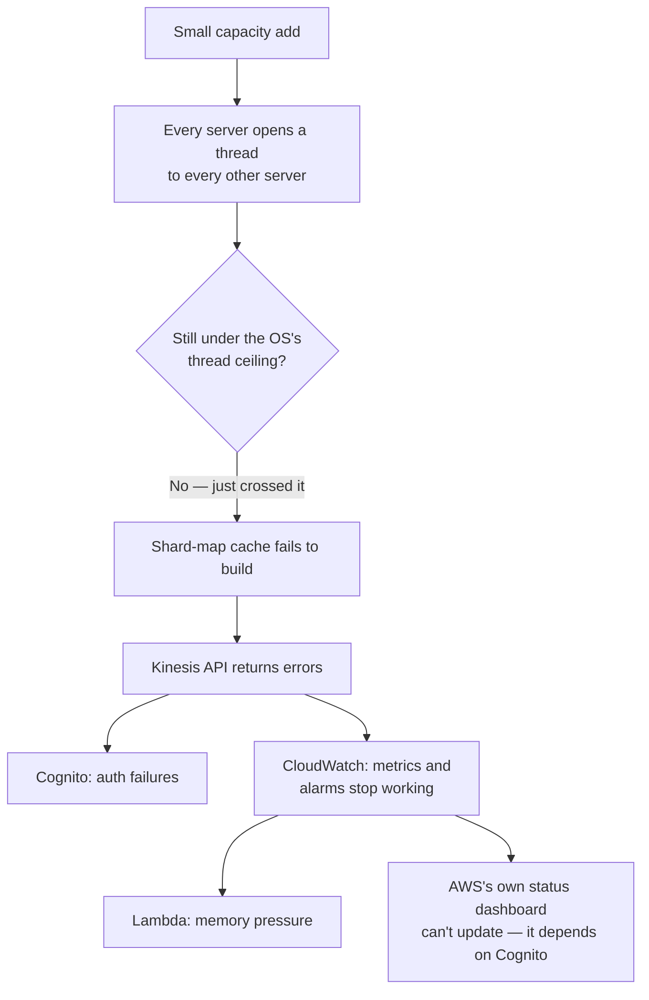

**Obvious next question: why didn't restarting fix it right away?**
Because every restarted server rebuilt its **full mesh of threads** again — all at once. That
created a second, self-inflicted stampede. This is the **thundering herd** pattern, covered in
Chapter 6.

**Name the pattern:** a full-mesh design has a hidden **O(n²) ceiling** — cost grows with the
*square* of fleet size, not linearly with it.

- Analogy: a party where every guest must shake every other guest's hand before anyone can eat.
- Add a few more guests, and the number of handshakes explodes far faster than the guest list did.
- Same math here: a few more servers, and the thread count explodes far faster than the server
  count did.

**The recurring shape, first appearance:** CloudWatch is the tool operators would normally use to
diagnose an incident like this — and **CloudWatch was itself a victim**, because it consumes
Kinesis internally to work. The fire alarm was wired into the building that was on fire. This exact
sentence recurs twice more in this story (Chapters 4 and 5).

**Impact:**

- The fleet itself substantially recovered in roughly **~5 hours** (start ~5:15am PST, core
  mitigation by mid-morning).
- Some dependent services took several more hours beyond that to drain their backlog of queued
  work (this part is an illustrative estimate, not a confirmed figure).
- Dozens of consumer products had public outages, including iRobot/Roomba, Ring, and various
  delivery dashboards — because they all sat on top of Cognito, CloudWatch, or Lambda without
  realizing those three services shared one underlying fleet.
- Even AWS's own Service Health Dashboard couldn't post real-time updates during the incident,
  because posting to it needed Cognito.

**What changed afterward:**

- Fewer, larger front-end nodes — this lowers the total thread count needed for the same capacity.
- A dedicated, isolated fleet for tier-0 consumers (Cognito, CloudWatch), so they can never again be
  starved by a customer-side capacity change.
- A faster cold-start path, so a fleet-wide restart doesn't force every server to rebuild the whole
  mesh at once.

**How I'd say this in an interview:** "A capacity add that looks linear can hit a nonlinear, O(n²)
ceiling in a full-mesh design — I'd game-day capacity changes against topology cost, not just
correctness. And I'd never let my own monitoring and auth run on the same fleet as the traffic
they're watching."

---

## Chapter 4 — The fail-safe that fired on a condition nobody tested (Meta, Oct 4, 2021)

Ten months earlier in real time — but next in this story's causal chain of "same shape, different
company" — a different mechanism produced the exact same lesson.

**What happened.** On **October 4, 2021**, an engineer ran a routine command auditing spare
capacity on Facebook's backbone network. A bug in the command — one that the audit tool was
supposed to catch, and missed — disconnected **all** backbone links between all data centers at
once. Not a scoped subset. Every single one.

**Why the fail-safe made it worse, not better.** Facebook's authoritative DNS servers run a health
check: if a DNS server can't reach the internal backbone, it withdraws its own BGP route
advertisements. This fail-safe was built and tested for *partial* problems — a few links down, or
one data center isolated.

The scenario "zero of N data centers reachable" was never tested. When that condition fired, it
fired **everywhere, at once**.

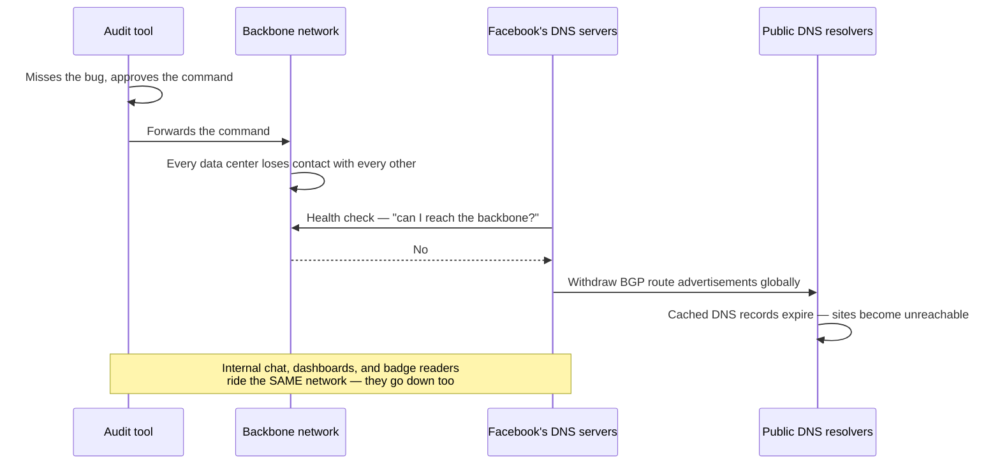

**Obvious next question: why couldn't engineers just fix it remotely?**
Because the same disconnection took down Facebook's own internal tools, and it complicated physical
badge access to the data centers. The rescue plan was standing in the burning building — the same
problem as Chapter 3's CloudWatch issue, just wearing different clothes.

**Impact** (widely reported, but not all of these figures are Meta-confirmed):

- Roughly **~6 hours** of total unreachability (start ~11:40am ET).
- Facebook, Instagram, WhatsApp, Messenger, and Oculus all went dark together.
- Combined addressable user base on the order of **3+ billion** people (not all concurrently
  active — this is the size of the audience that *could* have been affected, not a count of people
  actually online at the time).
- Lost ad revenue was estimated at the time to be on the order of **tens of millions of dollars**
  for the outage window. Meta never published an official figure, so treat this number as
  illustrative, not confirmed.
- The blast radius even crossed a company boundary: every third-party site whose *only* login
  option was "Login with Facebook" broke too, even though those sites had nothing to do with the
  outage themselves.

**What changed afterward:**

- Hardened the audit tool with additional checks before this class of command is allowed to
  execute.
- Rate-limiting, so a single command can no longer take effect network-wide all at once.
- A faster way to halt this kind of cascade once it's detected.
- Faster, more resilient physical and emergency access to data centers, for situations where normal
  remote tooling is unusable.

**How I'd say this in an interview:** "The health check fired exactly as designed — the design just
never accounted for a total, not partial, failure. I'd game-day the 'everything is gone' case, and
make sure break-glass access never resolves through the same network as the thing it fixes."

---

## Chapter 5 — The retry storm that jammed the one bridge everyone needed (AWS, Dec 7, 2021)

Two months after Meta's outage, AWS had its own version of the same story — same underlying shape,
third variation on it.

**What happened.** On **December 7, 2021**, an automated action expanded capacity for a component
on AWS's *internal* network. This is the separate network that carries AWS's own DNS, its
monitoring, and the control-plane APIs behind EC2/ELB (i.e., the APIs you call when you want to
*create* new resources, as opposed to using resources that already exist).

**The exact break:** that capacity-expanding action triggered unexpected client behavior, which
produced a sudden surge in connection activity. That surge saturated the **networking devices that
bridge** the internal network to the main network — the one seam connecting the two networks
together.

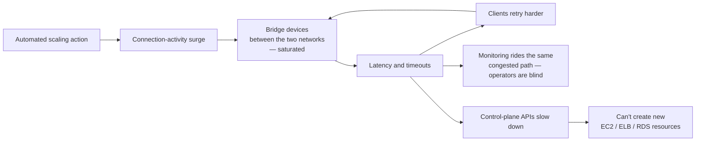

**Why this got worse instead of settling down:** rising latency caused timeouts, timeouts caused
more retries, and those retries added even more load onto a bridge that was already saturated. This
is **congestion collapse** — the same failure shape that TCP exhibits, just playing out one layer
up, at the level of application retries.

Monitoring rode that same congested path. This is the third and final appearance of the recurring
sentence in this story: **the fire alarm shared the fire's network.** Operators had to fall back to
manually grepping raw logs.

**Obvious next question: if control plane and data plane are decoupled, why did anything break at
all?**
Because they were decoupled for *existing* traffic only. Already-running EC2 instances and load
balancers kept serving live traffic the entire time — that part genuinely worked as designed.
But creating anything *new* is a control-plane call, and the control plane's own dependencies
(network, DNS, monitoring) were not isolated from the failure. **Partial decoupling gave partial
protection** — enough to save existing traffic, not enough to save new requests.

**Impact:**

- Roughly **~5-8 hours** end to end (start ~7:30am PST).
- Publicly-reported impact included Amazon's own retail and delivery operations, Ring, some Prime
  Video and Alexa features, and third-party services running on AWS — Disney+ and DoorDash both
  reported degraded service. This list is illustrative of the breadth of impact, not a confirmed,
  exhaustive count.

**What changed afterward:**

- Throttles on the class of scaling action that triggered the surge.
- Expanded bridge capacity, so the same size surge no longer saturates it.
- Better isolation between the internal network's monitoring path and its data path.
- A hardened internal DNS failover path.

**How I'd say this in an interview:** "Data plane survived, control plane didn't — I'd volunteer
that distinction unprompted. And I'd never call two networks 'independent' without asking what
their bridge's own capacity ceiling is — that seam is exactly where this one broke."

---

## Chapter 6 — Naming what actually happened three times

Same handful of named patterns underneath three different literal mechanisms. This — naming the
pattern, not just retelling the anecdote — is what an interviewer actually grades.

**SPOF (single point of failure):**

- Meta — a shared audit tool.
- Kinesis — a shared fleet serving both customers and AWS's own control-plane traffic.
- AWS Dec 2021 — a shared network bridge.

SPOFs hide in places nobody audits as "infrastructure." Notice that **DNS shows up in 2 of the 3
incidents** — once broadcasting Meta's outage to the whole internet, once blinding AWS's operators
mid-incident. DNS sits underneath almost everything, while usually being treated as a boring,
assumed-reliable utility that nobody double-checks.

**Cascading failures and retry storms:** failure in component A raises load on component B, which
then fails component C, and so on down the chain. For retries with no backoff at all, the math
looks like this:

```
effective_load ≈ base_load / (1 - error_rate)
```

**Worked example.** At a 50% error rate:

- `effective_load ≈ base_load / (1 - 0.5) = base_load / 0.5 = 2 × base_load`
- In plain terms: naive retries **double** the offered load on a system that is already failing
  half of its requests.

That's a death spiral — exactly what saturated the bridge in Chapter 5.

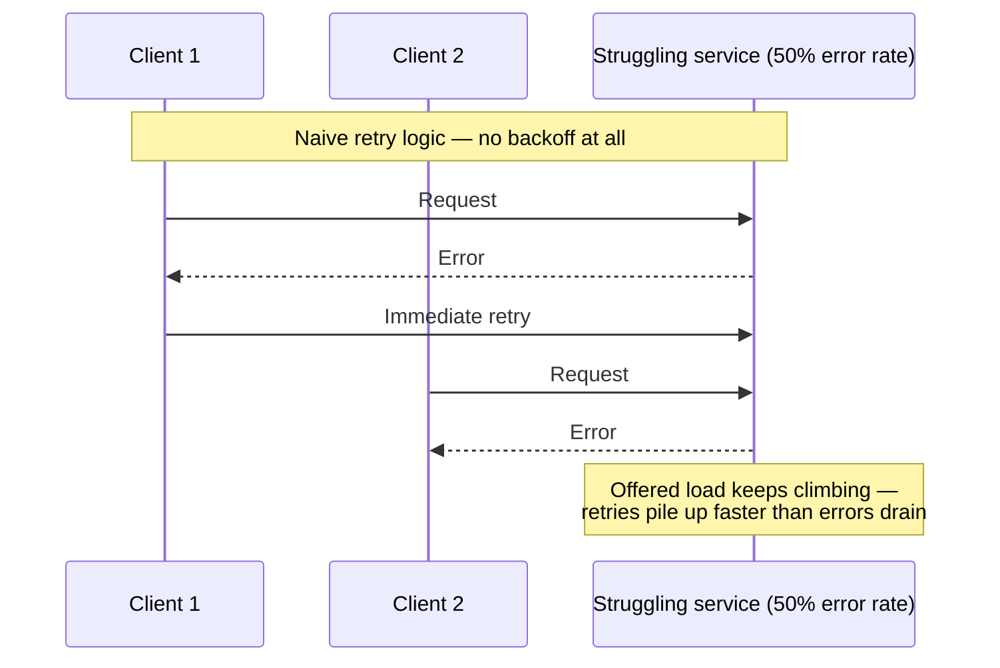

**The fix:** backoff + jitter + a retry budget. Spread retries out over time, and cap how much
extra load any single client is allowed to offer.

**How I'd say this in an interview:** "Say the pattern name out loud — SPOF, cascading failure,
retry storm — not just the anecdote. That's literally the rubric interviewers use."

---

## Chapter 7 — The structural fixes: bulkheads, circuit breakers, degradation

**Bulkheads**, borrowed from ship design, mean: partition the system so one breach doesn't sink the
whole ship. This is literally AWS's Kinesis fix — isolating tier-0 consumers from customer-facing
capacity, so that one can't drown the other.

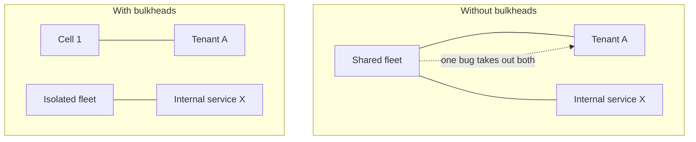

**Circuit breakers** stop a caller from repeatedly hammering a dependency that's already failing:

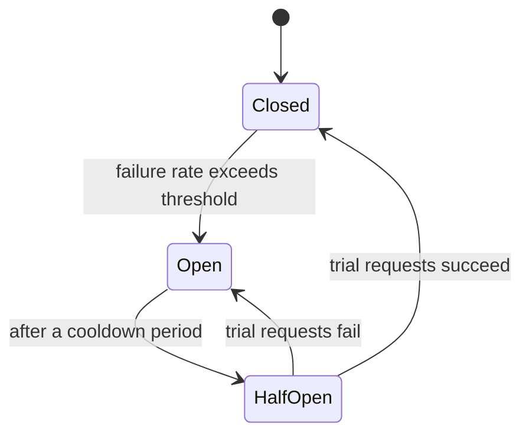

Illustrative starting values for a circuit breaker:

- Open the circuit once error rate passes 50% over a 20-request window.
- Cooldown for 30 seconds before trying again.
- In the half-open state, send 5 trial requests.
- If all 5 succeed, close the circuit. Otherwise, reopen it and double the cooldown period.

**Graceful degradation:** when a non-critical dependency fails, serve cached or stale data, or fall
back to a simplified feature, instead of returning a hard error. Rule of thumb: "cache failure must
never mean system failure."

**How I'd say this in an interview:** "For every component: this is a SPOF unless I bulkhead or
replicate it; if it fails slowly, my mitigation is a circuit breaker with a stated threshold; if
it's non-critical, I'd degrade gracefully rather than fail hard."

---

## Chapter 8 — Finding cascades on purpose: chaos engineering and postmortems

All three incidents above were found by production — the expensive way to find a problem. Could
they have been found first, on purpose, before they hit real users? **Chaos engineering**
deliberately injects failure to test assumptions ahead of time. Netflix's Simian Army is the
canonical example, and it forms a ladder of increasingly severe failures:

| Tool | Injects | Answers |
|---|---|---|
| **Chaos Monkey** | Randomly kills production instances | "What if a node dies?" |
| **Latency Monkey** | Injects artificial delay/errors | "What if it's slow, not down?" |
| **Chaos Kong** | Simulates losing an entire AWS region | "What if a whole region is gone?" |

- A chaos drill that killed *all* backbone links at once would have caught Meta's fail-safe misfire
  during a game day, instead of in production.
- A capacity-add drill that modeled thread consumption at full fleet scale would have caught
  Kinesis's O(n²) ceiling before a real capacity change did.

**Blameless postmortems** treat an incident as a systems and process failure, not a person's
mistake. The goal is surfacing the true root causes, not getting fewer people willing to admit what
happened. All three incidents in this story got detailed public postmortems.

A good postmortem covers:

1. Timeline
2. Impact
3. Root cause
4. Contributing factors
5. A committed action-item list, with named owners

**An incident with an empty action-item list is the real failure** — the outage itself is just the
trigger for finding it.

**How I'd say this in an interview:** "I'd name Chaos Monkey, Latency Monkey, Chaos Kong
specifically — node dies, node is slow, region is gone is the same ladder an interviewer uses on
you. And a postmortem without owned action items is just a well-written story."

---

## Chapter 9 — The hardest failure mode: slow-but-alive, and safe retries

Every incident above escalates from "what if it's down" to "what if it's slow" — and slow is the
harder case, because health checks catch "down" easily, but they rarely catch "degraded." A
half-dead dependency keeps receiving full traffic and keeps timing out expensively, instead of
failing fast and obviously.

Nothing in Chapter 3 or Chapter 5 was cleanly "down" at the very start. Latency crept up gradually,
until the system functionally *was* down, even though nothing had technically crashed.

**The fix:**

- Set timeouts shorter than what the *caller* can tolerate — not based on the callee's stated SLA.
- Use a bulkheaded connection pool per dependency, so one slow dependency can't exhaust the
  connection pool shared by everything else.
- Treat elevated p99 latency as its own alert, separate from the error-rate alert. A system can look
  healthy on error rate while already being unhealthy on latency.

**Retries need one more ingredient to be safe.** Every "retry with backoff" fix only works if the
operation being retried is **idempotent** — meaning replaying it twice has the same effect as doing
it once.

Stripe's payments API is the canonical, documented example of this:

- Every `POST /charges` call takes an `Idempotency-Key`.
- A retry sent with the *same* key returns the original charge, instead of creating a second,
  duplicate charge.

**Worked example, step by step:**

1. Client sends `POST /charge` with idempotency key `abc123`.
2. The API checks its idempotency store: has key `abc123` been seen before? No.
3. The API executes the charge, and stores the result under key `abc123`.
4. The API returns `200 OK` to the client.
5. The client's connection times out before it sees that response (the charge already happened, the
   client just doesn't know it yet).
6. The client, believing the request failed, retries: it sends `POST /charge` again, with the
   *same* key `abc123`.
7. The API checks its idempotency store again: has key `abc123` been seen before? Yes.
8. The API returns the *stored* result — the original charge — instead of creating a new one.
9. The client gets `200 OK` again, for the exact same charge. No duplicate.

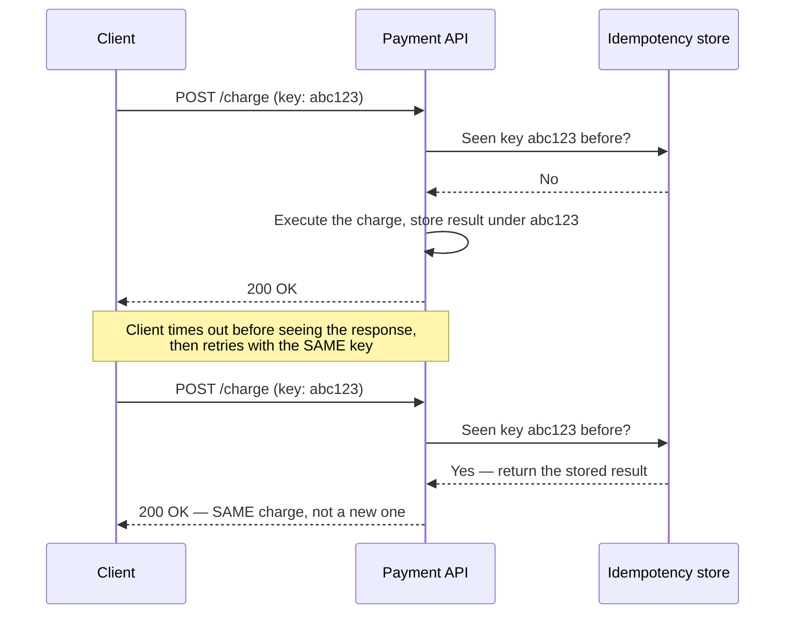

**How I'd say this in an interview:** "'Retry' and 'idempotent' are a package deal — I'd never
propose retries on a write path without saying how the retry is made idempotent."

---

## Chapter 10 — Spending the resilience budget: tiers, active-active, canary, command

Not every dependency deserves equal investment. FAANG-scale orgs tier their services by blast
radius:

| Tier | Meaning | Example from this story |
|---|---|---|
| **Tier-0** | Company-wide outage if it fails | Facebook's DNS; AWS's internal network |
| **Tier-1** | A major platform fails | Kinesis feeding Cognito/CloudWatch/Lambda |
| **Tier-2** | One feature degrades | — |
| **Tier-3** | Internal tooling | — |

Naming tiers tells you where to spend your bulkhead budget. Chapter 3's fix — an isolated fleet for
tier-0 consumers — is exactly a tiering decision that AWS made *after* an incident, but that
should've been made at design time, before anything broke.

**None of the three incidents were fixed by "add a standby" alone.** All three were single-region
or single-namespace failures. That's exactly why multi-region redundancy is the natural next
question after answering any SPOF question:

- **Active-passive** is simpler, and it costs you a failover window (some downtime while the
  standby takes over).
- **Active-active** costs you more consistency complexity, but has near-zero failover impact — the
  standby isn't standing by, it's already serving traffic.

Netflix, which runs active-active on AWS and verifies this regularly with Chaos Kong drills, is the
standard counter-example to all three incidents in this story.

**Look back at what triggered all three incidents:** a backbone command, a capacity add, a scaling
action — each one pushed everywhere at once, with no staged rollout. **Canary and blast-radius
limited rollouts** are the single most preventable fix common to all three incidents:

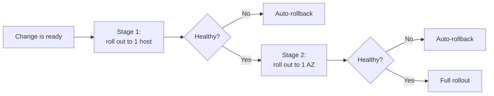

**Incident command** matters too: an IC (incident commander) who coordinates rather than personally
debugs, a comms lead who owns the status page, and a severity rubric agreed on in advance — together
these mean "who does what" is never decided live, under pressure, for the first time.

- This is exactly what Meta's engineers needed, with no working internal chat available.
- This is exactly the situation AWS's log-grepping fallback in Chapter 5 was built for.

**How I'd say this in an interview:** "None of these three needed a smarter safety check as much as
a smaller *first* blast radius — canary to AZ to region to global, with automatic abort. And I'd
tier dependencies so tier-0 gets the strictest change control."

---

## Where the story actually lands

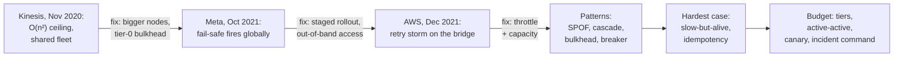

Three real incidents keep rhyming: a routine change, a safety check with a blind spot, an unscoped
blast radius, and a fix path sharing a dependency with the fault. Say that sentence once, and you
can say it about almost any distributed-systems outage you'll ever be asked about.

---

## Grill me — adversarial follow-ups

**Q1: "Isn't this just AWS/Meta trivia?"**
No. Three unrelated companies hit the same shape of failure independently: routine change, blind
safety check, recovery path sharing a dependency with the fault. That repetition is the lesson —
the company names are just how you cite the evidence.

**Q2: "Meta's fail-safe did exactly what it was designed to do — was that really a bug?"**
Not in the code — in the design's test coverage. It was correct for a partial problem. "Zero of N
data centers reachable" was never tested, so an untested condition made a locally-reasonable
fail-safe fire globally.

**Q3: "AWS's 'fewer, bigger nodes' fix just delays the same ceiling, right?"**
Right, and the postmortem says as much — it buys headroom, not immunity. The part that actually
changes the failure mode is the bulkhead: the next ceiling breach hits only customer traffic, not
AWS's own control and observability plane.

**Q4: "AWS Dec 2021 says data plane survived — isn't that just luck?"**
Not luck. Already-provisioned resources don't need the control plane to keep serving traffic they
were already configured for. The failure was scoped to *creating new things*, which inherently
needs the control plane.

**Q5: "If retries without backoff are dangerous, why not remove retries entirely?"**
Because a call that fails transiently and just gives up is worse for availability. The fix is
backoff, jitter, and a retry budget, so that aggregate retry traffic never exceeds what the
dependency can absorb.

**Q6: "Isn't 'the fire alarm shared the fire' just 'have redundant monitoring,' restated?"**
More specific than that. Redundant monitoring still fails if both copies share the same network,
DNS, or auth as the service they're watching. The real requirement is an independent failure domain
for your monitoring's vantage point.

**Q7: "Isn't randomly killing production instances reckless?"**
Not if it's scoped and monitored — it forces every service to handle instance loss as a routine
event, instead of as an untested emergency. The real risk is discovering intolerance to instance
loss during a live incident instead of during a planned drill.

**Q8: "How far down this list do I need to go for my own design?"**
As far as the requirements demand. A tolerant system might stop at circuit breaker plus bulkhead. A
payments or auth system has to reach idempotency, tiering, and staged rollouts, because a duplicate
charge is a correctness failure, not just an availability problem.

**Q9: "What's the one thing you'd actually change after reading these three?"**
Say this, per component, unprompted: this is a SPOF unless X; its failure mode is crash, slow, or
cut-off; the mitigation is Y; the residual blast radius if Y fails is Z; and monitoring lives
outside Z's failure domain. That one paragraph beats a five-minute tangent about any famous outage.

---

## Cheat sheet — one line per idea, no repeated story

- **Four failure types**: crash, confuse, cut-off, corrupt — every outage is one of these, or a
  chain of them.
- **Nines compose by multiplying**: every extra dependency hop costs you; error budgets make
  reliability spendable.
- **Kinesis, Nov 2020**: a "small" capacity add hit an O(n²) full-mesh thread ceiling; fixed by
  fewer/bigger nodes plus bulkheading tier-0 consumers.
- **Meta, Oct 2021**: a DNS fail-safe, correct for a partial failure, fired globally on an untested
  total failure; fixed by staged rollout plus out-of-band emergency access.
- **AWS, Dec 2021**: an unthrottled scaling action triggered a retry storm on the one bridge between
  two networks; data plane survived, control plane didn't.
- **The recurring sentence**: the fire alarm shared a dependency with the fire, in all three
  incidents.
- **SPOF hides in shared automation and shared fleets**, not just single boxes.
- **Retry storms**: `effective_load ≈ base_load / (1 - error_rate)` — always pair retries with
  backoff, jitter, and a cap.
- **Bulkheads and circuit breakers**: contain the blast radius, then stop hammering a failing
  dependency.
- **Chaos engineering finds cascades on purpose**: Chaos Monkey (node dies), Latency Monkey (node is
  slow), Chaos Kong (region is gone).
- **Blameless postmortems** need owned action items — an incident without them is the real failure.
- **Slow is worse than down**: health checks catch "down" easily, "degraded" rarely.
- **Retry is only safe with idempotency** — a key, a conditional write, or a naturally idempotent
  operation.
- **Tier your dependencies** (tier-0 to tier-3) and spend redundancy budget accordingly.
- **Stage rollouts by blast radius** — host, AZ, region, global — with automatic abort.
