# Design a Deployment System — The Story (narrative edition)

## What this file is

The reference file, `40-Design-a-Deployment-System-FAANG-Guide.md`, is the one to recite from. It has the requirements, the API shapes, every trade-off table, and the master cheat sheet.

This file is a second way in: the same material, told as one continuous story, in plain language.

Here's the shape of the story: engineers at a company keep hitting a wall. They patch it. The patch creates a new wall. They patch that too — and so on, until they land on the exact same design the reference file documents.

The company is **PawPost**, a fictional pet-photo-sharing app. But every wall it hits, and every fix it reaches for, is something a real, named system actually does:

- Kubernetes' rolling-update controller
- Netflix and Google's Kayenta canary-analysis engine (built on top of Spinnaker)
- Google's SRE Workbook on multiwindow burn-rate alerting
- AWS's own documented staggered-wave rollout practice
- LaunchDarkly-style feature flags
- The real 2012 Knight Capital incident

I'll say clearly, every time, whether something is a documented fact or just a reasonable illustrative guess.

## The trigger phrases for this topic

- "How do we ship a bad build to only 1% of users instead of all of them?"
- "How does the system know a deploy is bad and undo it itself?"
- "Design a system that safely rolls out new code to thousands of servers."

Keep one sentence in your head as you read:

> **A deployment system's whole job is to decide, automatically and fast, whether a new binary is safe to keep exposing to more traffic — and to undo it faster than a human can page anyone, if it isn't.**

Speed is not the product here. Controlled, observable, reversible speed is. Everything below is just this one idea, getting harder in small, honest steps.

---

## Chapter 1 — The Friday everyone still talks about

### The setup

It's early days at PawPost.

- 40 servers
- About 2,000 requests/sec at peak `[illustrative]`

Deploying looks like this: an engineer runs a script that SSHes into all 40 servers, one after another but fast. On each one, it runs:

```
git pull && sudo systemctl restart pawpost
```

It takes about 90 seconds to loop through all 40 servers. Nobody thinks twice about it. It's fast, it's simple, and it's worked for a year.

### What went wrong

One Friday afternoon, someone ships a change to the image-upload handler. There's a null-pointer bug in it that only triggers on a specific, common image format.

The script does its usual 90-second loop. By the time it finishes, **all 40 servers** are running the broken build. That's what the script does, every single time: replace everyone, all at once, with no pause to check whether the new build is actually okay.

Within two minutes, upload requests across the *entire* app start failing. Why doesn't anything catch this sooner? There's no health check gating any of this. The script's only notion of "did it work" is "did the SSH command exit with status 0" — and it does, because the process starts up fine. It just crashes on real traffic.

Engineers scramble to find the last good commit and re-run the same script in reverse. Total user-facing outage: **22 minutes** `[illustrative]`, on a Friday, on the entire app's core feature.

### The diagram

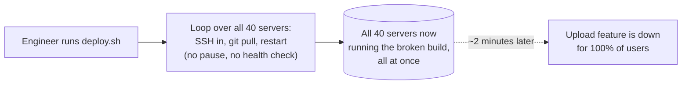

### Why it happened

The obvious question: why does one bad commit get to touch 100% of the fleet before anyone — human or machine — gets a chance to notice?

Because the script has no concept of "some now, most later." It treats "deploy" as one atomic, all-at-once action. There's no gate, and there's no automated undo. Just a human, re-running the same blunt instrument backwards, as fast as they can type.

### The fix

Never let one action touch everyone. Replace the fleet in **small batches**, and only replace the next batch if the current one looks healthy.

**The analogy:** think of a **bouncer checking IDs at the door of a nightclub, one person at a time.** Nobody floods in as a mob — people are let in in small groups. If the bouncer sees a problem with the first group, the rest of the line never gets in at all.

### What's next

New problem, already visible in week two: the "is this batch healthy" check the team bolts on is just "did the process start and stay up." That's a real improvement over nothing. But it's about to prove it isn't enough, because a process can start up perfectly fine and still be quietly wrong.

**How I'd say this in an interview:** "A deploy script that SSHes into every host and restarts them all is the strawman to name and reject immediately — it has no blast-radius control and no automated way to know it broke anything, let alone undo it. The first real fix is always the same one: replace the fleet in small, gated batches instead of all at once."

---

## Chapter 2 — The staging binary that quietly lied

### What went wrong

Before batching even gets built out, a second bug bites.

Someone deploys a fix to staging. It works perfectly. An hour later they promote the "same" fix to prod — except prod's build ran with a different environment variable set (a timezone default staging never exercised), and the fix behaves differently in prod.

It's not that the code was different. The *build* was different, because each environment ran its own fresh `git pull` and its own fresh build step.

Over three months, PawPost logs **1 in 12 deploys** `[illustrative]` as "worked in staging, broke in prod." That's not because staging testing was sloppy — it's because "staging" and "prod" were never running the same bytes. Every environment quietly compiled its own copy.

### Why it happened

The obvious question: if staging and prod run different binaries, what was staging testing even asking, exactly?

Nothing meaningful. A rebuild is a different program, even from identical source, if the build environment differs even slightly — compiler flags, base image, env vars, dependency resolution at build time. "It worked in staging" only means something if staging and prod are running the *exact same bytes*.

### The fix

Build **once**, package it as an immutable artifact, and move that exact same artifact — never rebuilt — through dev → staging → prod.

**The analogy:** think of a **sealed shipping container.** Whatever gets packed into it at the factory is exactly what arrives at every stop. Nobody re-packs the box at each warehouse along the way. The container gets a unique, content-addressed label (a hash of its contents), so nobody can swap what's inside without it being obvious.

### The diagram

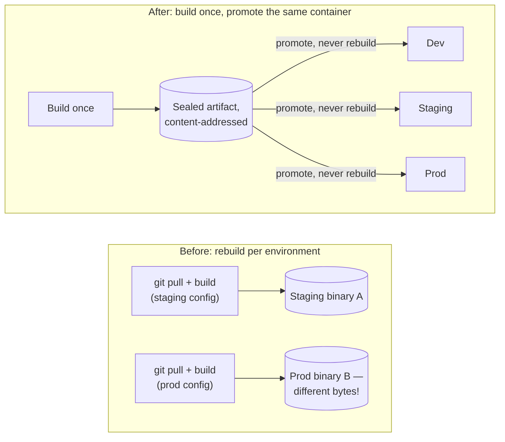

This closes the "worked in staging" lie for good. The sealed container that passed staging is *literally* the container running in prod, byte for byte.

### What's next

New problem: the sealed container fixes *what* gets shipped. It says nothing about *how fast* it gets shipped to how many servers. PawPost is still batching servers with nothing smarter than "did the process start" as the gate from Chapter 1 — and that gate is about to let something through it shouldn't.

**How I'd say this in an interview:** "Rebuilding per environment quietly invalidates the whole point of testing in staging, because you're not testing the binary that ships to prod — you're testing a sibling of it. The fix is build once, store it as an immutable, content-addressed artifact, and promote the exact same bytes everywhere. It's the same idea as a sealed shipping container: nobody repacks the box at each stop."

---

## Chapter 3 — The bouncer who only checks if you're breathing

### The setup

With sealed artifacts and batched rollouts in place, PawPost's deploys now look like Kubernetes' own `Deployment` rolling-update mechanic — a real, documented pattern:

- Replace instances in batches, sized by `maxSurge`/`maxUnavailable` (Kubernetes defaults both to 25% of replicas)
- Each new instance must pass a **readiness probe** — "are you actually able to take traffic right now" — before it's added to the pool

This genuinely helps. A build that crashes on startup, or can't connect to the database, simply never becomes ready, and traffic never reaches it.

There's also a **liveness probe** — a separate, ongoing pulse-check that restarts an instance if it stops responding entirely. With both probes running, PawPost goes months without a repeat of Chapter 1's all-at-once outage.

### What went wrong

Then a subtler bug ships: a caching change that adds roughly **300ms to p99 upload latency**. But the process:

- Starts up completely fine
- Connects to the database fine
- Passes every readiness and liveness check with no complaints

Batch by batch, all 40 (now 90) servers get the new build. Nobody notices until six hours later, when app-store reviews start mentioning "uploads feel slow now."

### The diagram

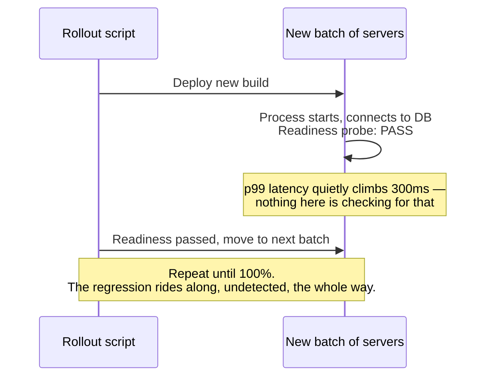

### Why it happened

The obvious question: why does "the process started and can reach the database" count as "this build is fine"?

Because a readiness probe is a **binary** gate. It answers "did it start," not "does it perform as well as what was running before." Those are genuinely different questions. The bouncer at PawPost's door is only checking IDs, not watching how people behave once they're inside.

### What's next

The fix isn't ready yet — it needs a comparison, not just a pass/fail. That comparison is the entire next several chapters.

But first, one more strategy is worth naming, because it solves a different problem than this one: what if you want an *instant*, guaranteed-clean way to undo a bad cutover, rather than a gradual batch-by-batch rollback?

**How I'd say this in an interview:** "Readiness and liveness probes fix 'did the process even start' — genuinely useful, but they're a binary gate, not a comparative one. A build that starts fine and is silently 25% slower than before sails straight through a readiness-probe-only rollout, batch after batch, all the way to 100%. That gap is exactly what canary analysis exists to close — but there's a separate, orthogonal strategy worth naming first: blue-green."

---

## Chapter 4 — The two full houses and the fast trapdoor

### The setup

A different team at PawPost owns the payments path (in-app "tip the photographer" purchases). They have a different worry than latency creep: *if something's wrong, we need to be back on the old version in seconds, not minutes of batch-by-batch rollback.*

### The fix

Stand up a **second, full copy of the fleet.** Call the currently-live one "blue" and the new one "green."

1. Deploy the new build entirely onto green, while blue keeps serving 100% of traffic.
2. Once green looks ready, flip a router so all traffic goes to green — instantly.
3. If it's bad, flip the router back to blue, which never stopped running. You're reverted in the time it takes a load-balancer config to propagate, not the time it takes to redeploy anything.

### The diagram

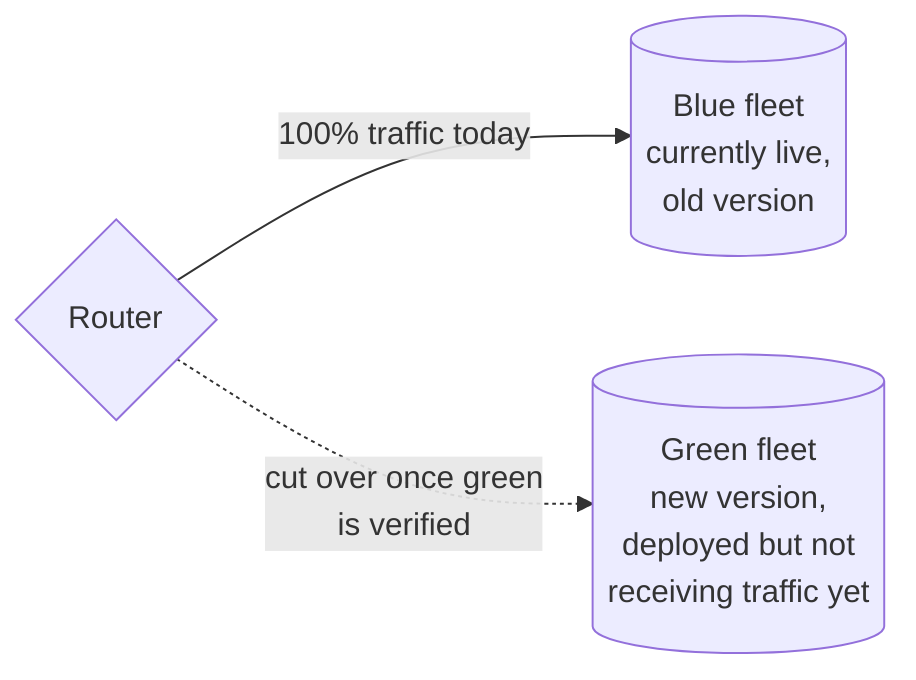

This is genuinely the fastest possible rollback path in this whole story so far — flipping a router is much faster than re-running any deploy. PawPost's payments team adopts it for exactly the service where an instant, clean undo matters more than anything else.

### The honest cost

New problem, and it's an honest cost, not a bug: running two full fleets simultaneously costs **2x the infrastructure** for the duration of every rollout. That's real money, all the time green exists alongside blue.

And worse: the "is green ready" check *before* cutover is still the same readiness-probe gate from Chapter 3. Blue-green makes rollback instantly fast, but it doesn't, by itself, make the decision to cut over any smarter. A build that's silently 25% slower still passes readiness and still gets 100% of traffic the instant the router flips — just with a faster undo button once someone notices.

**How I'd say this in an interview:** "Blue-green solves rollback *speed* — flip a router, you're back to the old fleet instantly, at the cost of running two full fleets during the rollout. It doesn't solve rollback *judgment* — that's still whatever gate you put in front of the cutover. Canary is the strategy that actually improves the judgment side, and it's usually layered on top of a rolling or blue-green mechanic rather than replacing it."

---

## Chapter 5 — The tasting spoon

### The setup

Back to the latency-regression problem from Chapter 3. PawPost needs a gate that isn't "did it start," but "does it perform as well as the version it's replacing" — measured on live traffic, continuously, while exposure is still small.

### The fix

Send a small slice of real traffic — say 1% — to the new build (the "canary" cohort). Keep the rest on the old build (the "baseline" cohort). Then **compare their metrics directly**, statistically, before deciding whether to send any more traffic to the new build.

This is a direct description of **Kayenta**, Netflix and Google's real, open-source automated canary-analysis engine, built to run alongside Spinnaker. It runs a statistical test (Mann-Whitney U) per metric to get a confidence interval on the canary-vs-baseline difference. It only flags a real regression once that interval clears a "dead zone" tolerance band, sized to absorb ordinary noise.

**The analogy:** it's a **tasting spoon before serving the whole pot at a dinner party.** You don't serve all 40 guests from a pot you haven't tasted. You dip a spoon in, taste it against what you know a good version of the dish tastes like, and only ladle out the rest if the spoon tastes right.

### The diagram

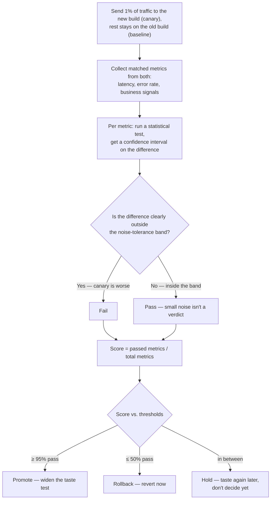

### Worked example: PawPost's own dinner party

Let's walk through the numbers step by step.

- **Baseline cohort:** 20,000 requests, 80 errors → 0.40% error rate.
- **Canary cohort (1% of traffic):** 2,000 requests, 22 errors → 1.10% error rate.

Using a standard-error-of-a-proportion check `[illustrative — the back-of-envelope version of Kayenta's real Mann-Whitney math]`:

1. Combined standard error across both cohorts works out to roughly **0.24 percentage points**.
2. The observed gap between the two error rates is 1.10% − 0.40% = **0.70 percentage points**.
3. Divide the gap by the standard error: 0.70 / 0.24 ≈ **2.9 combined-SEs away from zero** — outside the noise band.

So this single metric fails.

Now suppose this is one of 12 metrics compared at this stage, and it drags two correlated ones down with it (p99 latency, upload-success rate):

- 3 failed of 12 metrics → **75% pass score**
- That score falls squarely in the **Hold** band — not an automatic pass, and not an automatic rollback either.

The action: extend the taste test, sample more traffic, and decide again shortly.

### What's next

New problem: the tasting spoon tells you whether the new build is healthy *in this cohort, in this traffic mix, right now*. It says nothing about whether the same build behaves the same way once it has to survive a different region's traffic pattern, or a different failure domain entirely.

PawPost serves users worldwide from three regions — and right now, a canary pass in one region gets rolled out to all three simultaneously.

**How I'd say this in an interview:** "Canary analysis is the tasting-spoon idea made statistical — split live traffic into a canary and baseline cohort, run a real statistical test per metric with a noise tolerance band, and treat the result as three outcomes, not two: promote, rollback, *or* hold, because the ambiguous middle is where a real system spends most of its time. Kayenta is the real, named implementation of exactly this."

---

## Chapter 6 — Which spoon do you taste first

### The setup

PawPost's three regions are US, EU, and a smaller APAC region that carries maybe 8% of total traffic `[illustrative]`.

Right now, once the canary judge in Chapter 5 says "promote," the rollout goes to **all three regions at once.**

### What went wrong

One Tuesday, a build passes its canary check cleanly in aggregate. But it turns out to interact badly with a specific EU-only compliance middleware that never runs in the canary cohort's traffic sample — because that middleware only triggers on a header pattern common in EU requests and rare elsewhere.

The tasting spoon tasted fine because it never actually tasted that part of the dish.

### The fix

The obvious question: if a region-specific failure mode exists, how do we bound the damage from it, the way we bound damage from a bad build in general?

Same idea as before, one level up: don't let a bad build reach every region at once, either. Pick a **canary region first** — smallest, lowest-stakes, least business-critical — and only widen to the rest afterward, in waves.

This mirrors AWS's own documented staggered-deployment practice:

- Every production wave starts with a **one-box stage** — a single host, container, or availability zone — before anything wider.
- Even when a wave covers multiple regions in parallel, each region *independently* starts at its own one-box stage before ramping up internally.

Blast radius gets bounded twice: once by which regions are even in this wave, and again by how much of each region has the new code.

### The diagram

```mermaid
sequenceDiagram
    participant Orch as Rollout controller
    participant Box as One box (single host)
    participant Canary as Canary region: APAC<br/>(lowest stakes)
    participant Waves as US + EU<br/>(parallel, after APAC bakes clean)
    participant Judge as Tasting-spoon judge<br/>(Ch5)

    Orch->>Box: Deploy to a single host first
    Box-->>Judge: Report metrics
    Judge-->>Orch: Clean — smallest possible blast radius passed
    Orch->>Canary: Ramp 1% → 10% → 50% → 100% inside APAC
    Canary-->>Judge: Metrics per step
    Judge-->>Orch: Clean after full bake
    Orch->>Waves: Roll out to US + EU in parallel,<br/>each still ramping internally
    Note over Orch,Waves: A regression caught in US halts US (and everything after it),<br/>but never touches EU's already-clean rollout.
```

### Worked example: mapping it onto PawPost's fleet

PawPost has grown to 2,000 hosts by this stage. Here's how a rollout stages across both axes — percentage-within-region, and one-box-first:

| Stage | Weight | Hosts exposed | Bake window | Cumulative time |
|---|---|---|---|---|
| One-box | n/a | 1 | 10 min | 10 min |
| 1% | 1% | 20 | 10 min | 20 min |
| 10% | 10% | 200 | 15 min | 35 min |
| 50% | 50% | 1,000 | 20 min | 55 min |
| 100% | 100% | 2,000 | — | 55 min |

Here's why staging both axes matters: if the judge fires a rollback while sitting at the 10% stage, exactly 200 of 2,000 hosts (10%) ever saw the bad build — never the full 2,000. That's the entire payoff of staging both axes (percentage-within-region, and which-regions-first) instead of collapsing them into one "canary %" number.

### What's next

New problem: every check so far — the tasting spoon, the region ordering — only runs *during* an active rollout, at a specific stage. What about a regression that doesn't show up until traffic is fully at 100%, hours after the rollout technically "finished"? "Done" can't mean "we stopped watching."

**How I'd say this in an interview:** "A single-region canary answers 'is this build healthy under this traffic mix' — it doesn't answer 'will it survive a different region's failure domain.' The fix is staging on two independent axes at once: percentage within a region, and canary-region-first ordering across regions, exactly like AWS's documented one-box-then-wave pattern. Conflating those two axes into one number is the most common gap I see."

---

## Chapter 7 — Two odometers, one short and one long

### What went wrong

Three weeks after adopting region-ordered canaries, a build passes every canary stage cleanly. The tasting spoon genuinely tasted fine at 1%, 10%, and 50%.

Then, at 100%, under load patterns that simply don't show up until *everyone's* actual traffic hits it, a memory leak starts degrading response times.

By the time anyone notices, the rollout has been sitting at "Promoted" for four hours. Nobody's watching it anymore, because "promoted" felt like "done."

### Why it happened

The obvious question: if the canary judge only runs during active stages, what's watching a service after it's fully rolled out?

Nothing, currently — and that's the gap. A rollout needs a separate, continuous watchdog that doesn't care what stage you're in — only whether the service's actual error budget is being burned through too fast, right now.

### The fix

This comes straight from Google's own SRE Workbook — a real, documented technique called **multiwindow, multi-burn-rate alerting.**

Never trigger off a single time window:

- A short window alone is noisy (blips look like outages).
- A long window alone is slow (a real outage burns half a month's error budget before it fires).

Instead, pair a **short window** ("is this happening right now") with a **long window** ("is this sustained, not a blip"), and only act when *both* agree.

**The analogy:** picture **two odometers on the same dashboard** — one that resets every 5 minutes, one that resets every hour.

- If only the 5-minute one is spinning fast, that might just be a bump in the road.
- If only the 1-hour one is elevated, something's off, but it's not urgent.
- It's when *both* are spinning too fast, at the same time, that you actually pull over.

### The severity table

| Severity | Long window | Short window | Burn rate | What it means |
|---|---|---|---|---|
| Page now | 1 hour | 5 minutes | 14.4x | 2% of the month's error budget gone in an hour |
| Urgent ticket | 6 hours | 30 minutes | 6x | 5% of the month's error budget gone in 6 hours |
| Investigate | 3 days | 6 hours | 1x | 10% of the month's error budget gone in 3 days |

### The diagram

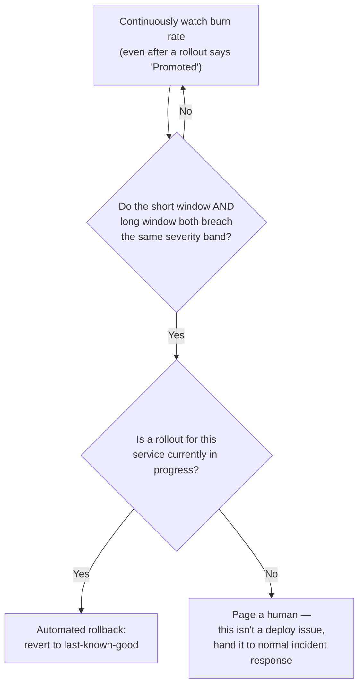

This closes Chapter 3's original gap for good: the leak that only shows up at full 100% traffic gets caught by the same automated system, not by luck and app-store reviews six hours later.

### What's next

New problem: the automated rollback controller just reverted PawPost to "the last known good version." What if *that* version has its own, separate problem nobody caught before — and the fix reverts straight into a second outage?

**How I'd say this in an interview:** "The canary judge answers 'is this healthy compared to baseline, right now, during this stage.' The burn-rate trigger answers a different, ongoing question: 'is the service's error budget being consumed too fast, whether or not a rollout is even active.' You need both — pairing a short and long window, the same way Google's SRE Workbook documents it, is what keeps an automated rollback from being either too slow or too trigger-happy."

---

## Chapter 8 — The emergency brake that must never jam

### What went wrong

The rollback controller from Chapter 7 fires and reverts to the previous version. But that previous version turns out to have a *different*, unrelated bug that was already lurking — it just never triggered before.

Now PawPost has auto-rolled-back into a second bad state. Worse: the automation, seeing things still look unhealthy, tries to "fix" it by rolling back again, and again — flapping between two bad versions every few minutes while on-call scrambles to even understand what's happening.

### Why it happened

The obvious question: should "revert" ever be allowed to just keep firing on its own, forever?

No. A rollback needs to be treated as seriously as a forward deploy, not as some free, infinitely-repeatable undo button.

### The fix, in two parts

1. **Freeze after firing.** The moment an automated rollback executes, freeze all further automated rollout activity for that service until a human explicitly acknowledges what happened. No auto-retry loop against a target that might itself be broken.
2. **Give rollback its own priority lane.** Rollback should be separate from, and higher-priority than, starting new rollouts. If the control plane is ever degraded, the ability to *revert* an active bad deploy should be the very last thing to fail — not the first — because that's the exact moment it matters most.

**The analogy:** think of the **emergency brake in a car.** You want it to work every single time you need it, including on the day the rest of the car is having electrical problems. You do *not* want it engaging itself repeatedly on its own opinion of what "safe" means, with no driver in the loop.

### The diagram

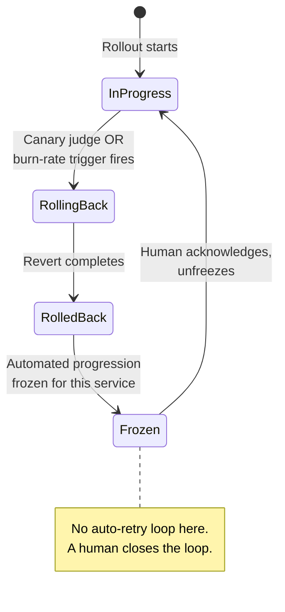

### One more piece: the orchestrator itself

This also forces a related, uncomfortable question about the *orchestrator itself*: it's the one component that must never be down at the exact moment a bad rollout needs reverting.

PawPost's answer, matching how Kubernetes' own controller-manager stays available, is **leader election among stateless orchestrator workers, backed by a durable, replicated state store.** Any worker can pick up any rollout's state the instant a leader fails over, because the state lives in the store, not in one process's memory.

**How I'd say this in an interview:** "A rollback has to be a first-class, pre-tested code path with its own priority lane — not 'run the deploy backward' and definitely not something allowed to auto-retry against a target that's itself unverified. Freeze-and-page-a-human after an automated rollback fires is the standard discipline; without it, you can flap between two bad versions forever."

---

## Chapter 9 — Renovating the bridge while the cars keep driving

### What went wrong

Separately, PawPost's team adds a new required column to the "photo" table — `moderation_status`, `NOT NULL` — in the *same* deploy as code that assumes every row already has it.

During the rolling batch window (Chapter 3), some servers are still running the old binary while others are running the new one — **both hitting the same database at the same time.**

- The old binary's inserts don't set `moderation_status` at all. They violate the new constraint and start failing.
- The new binary, reading rows the old binary just wrote before the migration ran, sometimes reads a null it wasn't expecting and crashes.

### Why it happened

The obvious question: why does a schema change and the code depending on it get shipped in the same deploy, when a rolling rollout guarantees old and new code run side-by-side for minutes at a time?

Because nobody accounted for the fact that "old and new code coexisting, both hitting the same database" is the *normal* state during any rolling or canary rollout — not an edge case to occasionally worry about.

### The fix

**Expand/contract**, done as three separate, independently-safe deploys.

**The analogy:** it's like **renovating a bridge while cars are still driving across it, one lane at a time.** You never close all lanes and rebuild the whole thing in one shot while traffic is live. You widen it first (add a lane nobody's forced to use yet), migrate traffic onto the new lane gradually, and only close the old lane once you're certain nothing is still using it.

### The diagram

```mermaid
sequenceDiagram
    participant Old as Old binary<br/>(still running on some hosts)
    participant DB as Database
    participant New as New binary<br/>(rolling in)

    Note over DB: Deploy N — EXPAND
    DB->>DB: Add moderation_status column,<br/>nullable, additive only
    Old->>DB: Unaffected — doesn't know<br/>the column exists

    Note over DB: Deploy N+1 — MIGRATE
    New->>DB: Writes moderation_status on every new row;<br/>backfill job fills old rows
    Old->>DB: Still fine — column is still nullable

    Note over DB: Deploy N+2 — CONTRACT
    Note over Old: Fully retired fleet-wide by now
    DB->>DB: Make moderation_status NOT NULL —<br/>safe now, nothing writes without it
```

Each phase is independently backward-compatible with the one before it. That's exactly why a rolling deploy — where old and new code coexist for minutes — never breaks: at every instant, every version of the code that's actually running is compatible with the database as it currently exists.

This is the real, documented pattern that tools like **pgroll** (Xata's open-source Postgres migration tool) automate directly.

### What's next

New problem, a step sideways rather than downward: every one of these deploys — schema or otherwise — still requires a full binary rollout, minutes to hours, even for something as small as flipping a behavior on or off for 5% of users. PawPost wants a faster lever for that, one that doesn't require the whole build-and-canary machinery every time.

**How I'd say this in an interview:** "Never ship a breaking schema change and the code that depends on it in the same deploy — expand, migrate, contract, each one independently safe for a fleet that's currently running a mix of old and new code, because during any rolling deploy, that mix is the normal state, not an edge case."

---

## Chapter 10 — The light switch versus rewiring the house

### The setup

PawPost wants to test a new "auto-caption" feature on 5% of users, and be able to turn it off in an instant if something looks wrong — without re-running canary analysis, region ordering, and a full rollout just to flip it back off.

Right now, "on" and "off" only exist as a full binary deploy each way. Turning a bad feature off means going through the *entire* Chapter 5–9 machinery again, in reverse, under pressure, while it's actively causing problems.

### Why it happened

The obvious question: does turning a feature off really need to be as slow and heavy as shipping a new binary in the first place?

No — and it shouldn't be, because "the code exists on the server" and "the code is currently doing something to users" are two genuinely different facts.

### The fix

Decouple **deploy** (the new code is present on the server, possibly inactive) from **release** (real users are actually seeing its behavior), using a **feature flag service** — the same real pattern LaunchDarkly and similar platforms provide.

The auto-caption code can be *deployed* to 100% of servers, dark and doing nothing, days before anyone decides to flip it on for even one user.

**The analogy:** it's the difference between a **light switch and rewiring the house.**

- Deploying new code is running the new wiring — a real, sometimes slow, sometimes risky job.
- Flipping a feature flag is just the light switch on that wiring — instant, reversible, and it doesn't require touching the walls again to turn it back off.

### The diagram

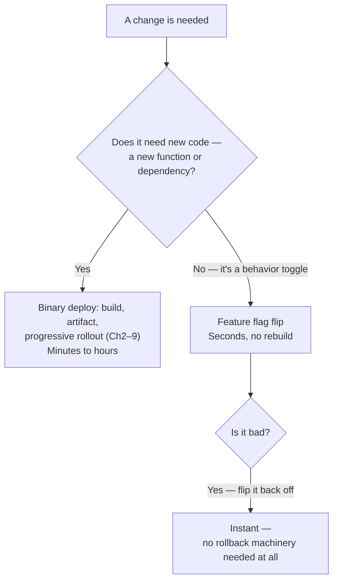

This gives PawPost a kill switch that's strictly faster than any rollback: if a canary judge can't immediately tell whether a regression is the *binary* or a *flag-gated feature that shipped inside it*, "flip the flag off" is the cheaper thing to try first.

### The honest cost

New problem, an honest cost rather than a bug: flags accumulate. Six months later, PawPost has 40+ flags in the codebase. Some are genuinely temporary. Some quietly became permanent branches nobody ever cleaned up — code like `if (newCaptionFlag && !oldCaptionFlag && legacyModeFlag)`.

That's a real maintenance and testing burden, and a place bugs hide. This is exactly the same shape of debt as leaving Chapter 9's "contract" phase undone forever.

**How I'd say this in an interview:** "Deploy and release are different events — deploying puts new code on disk, possibly dark; releasing is what makes it visible to real users. Feature flags decouple the two, and it's the fastest kill switch you have, faster than any rollback. The honest cost is flag debt — stale flags need expiry and cleanup discipline, or they become permanent, untestable branches."

---

## Chapter 11 — The eighth server nobody updated

### The real story

Everything in this story so far exists to prevent one specific shape of disaster — and that disaster actually happened, for real, to a real company: **Knight Capital, August 1, 2012.**

Here's what happened, step by step:

1. Knight Capital deployed a new order-routing feature manually to 8 production trading servers.
2. One server didn't get the update. It kept running old, dormant test code, gated behind a flag identifier that got reused for the new feature instead of being properly retired.
3. When the new flag flipped on fleet-wide, 7 servers ran the intended new logic.
4. The 8th server's stale binary interpreted the same flag as the trigger for a years-old, never-fully-removed test function. That function flooded the live market with erroneous orders.
5. There was no automated check comparing that one server's behavior against its 7 siblings, and no automated kill switch.

It took roughly **45 minutes** to detect and stop. By then, Knight Capital had lost an estimated **$460 million** — and the firm was acquired within months.

### The diagram

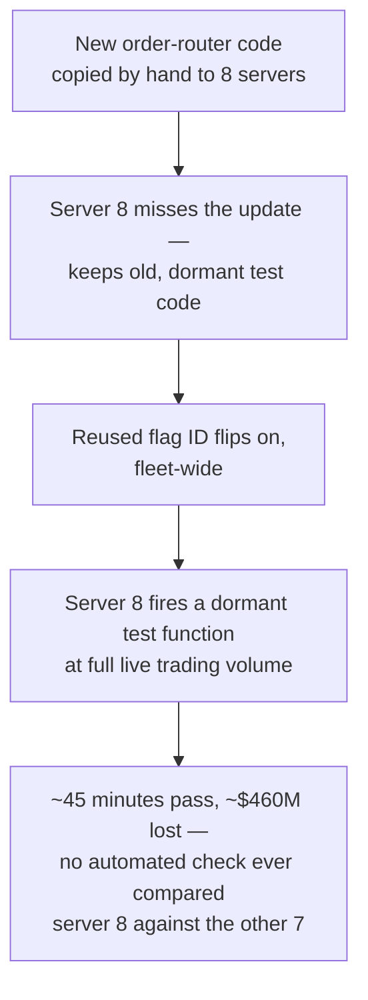

### Mapping it onto every fix this story already built

| Fix from earlier | What it would have caught |
|---|---|
| Chapter 1's batched, gated rollout | Even a simple one-box-first stage would have put the mismatched server through an isolated health check before the flag ever went live everywhere. |
| Chapter 5's tasting-spoon comparison | Order volume and error rate from server 8 would have diverged wildly from its 7 siblings within seconds — exactly the comparative signal a canary judge is built to catch, and exactly what a "did the process start" gate (Chapter 3) would have missed too. |
| Chapter 10's flag hygiene | The root cause was a repurposed flag riding on top of code that should have been deleted, not left dormant. That's flag debt from the end of Chapter 10, at a scale that ended a company. |
| Chapter 7's automated burn-rate rollback | An anomalous order-rate spike, caught and acted on automatically within seconds instead of the ~45 minutes it actually took humans, is the entire premise this story exists to replace. |

**How I'd say this in an interview:** "Knight Capital wasn't really a bug in the new code — it was a partial, unverified, manual rollout that left old and new logic simultaneously live in production with no automated way to detect the mismatch or shut it down. It's the Chapter-1 strawman — copy code to servers by hand, no gate, no automated undo — playing out at a scale that ended a company, and it's exactly the failure this whole design exists to prevent."

---

## Where the story actually lands

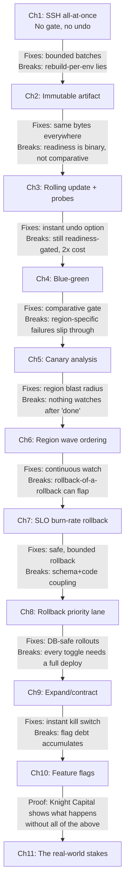

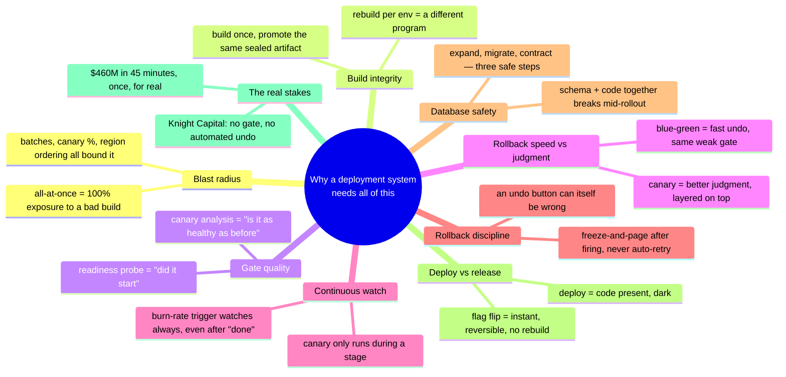

Every real deployment system you'll design in an interview sits somewhere on this chain. The skill isn't reciting all eleven chapters — it's stopping where the stated requirements say to stop.

- A low-stakes internal tool might reasonably stop around Chapter 3 or 4.
- A payments-adjacent, user-facing service at scale has to reach canary analysis, region ordering, and automated rollback (Chapters 5–8).
- If nobody's mentioned multi-region or database migrations, walking there unprompted reads as padding, not depth.

---

## Grill me — adversarial follow-ups

**Q1: "Why not just make the readiness probe smarter instead of adding a whole separate canary-analysis system?"**

Because a readiness probe answers one question about one instance at one moment — "can you take traffic right now" — and no amount of smartening that up turns it into a *comparison* against what the previous version was doing. Canary analysis is a fundamentally different mechanism: it needs a baseline cohort running side by side, a statistical test, and a tolerance band, none of which fit inside a single instance's own health check.

**Q2: "Doesn't canary analysis just move the risk to whichever 1% of users happen to be in the canary cohort?"**

Yes, and that's a real, accepted cost, not a flaw to paper over — canary cohort size is itself a trade-off. Too small and everything looks statistically inconclusive; too large and you've defeated the entire point of limiting blast radius. Production systems pick a size that balances statistical power against exposure, and say so explicitly rather than pretending the 1% is risk-free.

**Q3: "If canary analysis already catches bad builds, why do you also need the SLO burn-rate trigger?"**

Because canary analysis only runs *during* an active rollout stage, comparing a small cohort against baseline in that traffic mix. A regression that only shows up at full 100% traffic, or hours after a rollout technically finished, has nothing left to compare against — the burn-rate trigger watches continuously, independent of what stage (or whether any stage) is active.

**Q4: "What actually stops the rollback controller from rolling back into another broken version, forever?"**

The freeze-after-rollback rule from Chapter 8 — the moment an automated rollback fires, all further automated progression for that service stops until a human explicitly acknowledges it. Without that rule, you can genuinely flap between two bad versions, each rollback triggering the next.

**Q5: "Isn't blue-green strictly better than canary, since its rollback is instant?"**

No — they solve different halves of the problem. Blue-green makes *undoing* a bad cutover fast; it doesn't make the *decision* to cut over any smarter, because the gate before cutover is still just a readiness check. Canary makes the decision smarter with a comparative, statistical gate, but its rollback (shrinking a weight to zero) is gradual, not instant. Real systems often layer canary analysis on top of a blue-green or rolling mechanic rather than picking one exclusively.

**Q6: "Why can't the schema migration and the code that needs it just ship together — isn't expand/contract overkill for a small change?"**

Because "small" schema changes are exactly what causes outages during a rolling deploy — old and new code run side-by-side for the whole rollout window, hitting the same database, and a change only one of them tolerates breaks the other half of the fleet mid-rollout. Expand/contract isn't overkill; it's the minimum discipline for that coexistence window to be safe.

**Q7: "Given feature flags give you an instant kill switch, why bother with canary rollouts of the binary at all?"**

Because a flag only controls behavior that's already been coded to check a flag — it can't protect you from a bug in code that runs unconditionally, a startup crash, a memory leak, or anything structural about the binary itself. Flags and canary rollouts are complementary levers, not substitutes: one controls which bytes are running, the other controls what those bytes are currently allowed to do.

**Q8: "How is Knight Capital actually a deployment-system failure, and not just 'a bad flag'?"**

Because the flag reuse was the trigger, but the actual failure was that nothing in their process could *detect* one server behaving differently from its 7 siblings, and nothing could *automatically revert* it once it started. A canary judge comparing per-server metrics, or a burn-rate trigger watching order volume, would have caught it in seconds instead of 45 minutes — the flag bug is the spark, the missing safety machinery is why it became a $460M fire.

**Q9: "Where do you actually start if someone says 'design a deployment system' cold, no other context?"**

Say the two things that shape almost everything downstream:

1. Is this a stateless service where a mixed old/new fleet is safe (then rolling or canary), or does it need instant guaranteed rollback (then blue-green, possibly layered with canary)?
2. What's the acceptable blast radius — a batch job tolerating some downtime, or a user-facing payments path where 1% exposure for 10 minutes is already a real dollar figure?

Answer those first, then only build as far down this story as the requirements actually demand.

**Q10: "If I only have time for one deep dive, which one matters most?"**

Canary analysis — it's the mechanism that turns "did it start" into "is it actually healthy," and it's the load-bearing idea the multi-region ordering, the burn-rate trigger, and even the Knight Capital lesson all build on top of. Everything else in this story either feeds it data or reacts to its verdict.

---

## Pacing note

**If this is 60 seconds inside a bigger question:** say the core idea — safety is the product, speed is the constraint you optimize under — then say "build once as an immutable artifact, roll out in small gated batches with a comparative canary check, bound blast radius by both traffic percentage and region ordering, and back it with an automated rollback triggered by sustained SLO burn, not just a single bad sample." That's the whole shape in one breath.

**If this is the whole 15-20 minute focus:** walk the chapters in order:

1. Why the naive script fails
2. Immutable artifacts
3. Readiness-probe rolling updates and their gap
4. Blue-green for instant rollback
5. Canary analysis as the comparative gate
6. Region-ordered blast radius
7. SLO burn-rate rollback
8. Rollback discipline itself
9. DB migration coordination
10. Feature flags for the fastest kill switch

Then close with Knight Capital as the "here's what happens without any of this" proof. Don't walk all eleven unprompted if the interviewer keeps redirecting — follow their questions, and use the skipped chapters as your "if I had more time" closer.

---

## Active recall — no answers, test yourself cold

1. What's the one-sentence reason a deployment system's job is "safety," not "speed"?
2. Why did PawPost's original SSH script take down 100% of the fleet, and what's the one-line fix?
3. Why does rebuilding per environment make "it worked in staging" stop meaning anything?
4. What's the actual difference between what a readiness probe checks and what a canary judge checks?
5. Blue-green gives you the fastest rollback in this whole story — so why isn't it enough on its own?
6. Walk through the exact statistical idea behind a canary "Pass/Fail/Hold" verdict, in your own words.
7. Why does a single-region canary pass, then still let a region-specific bug through?
8. Why does an SLO burn-rate rollback trigger need to keep working even after a rollout says "Promoted"?
9. What specific rule stops an automated rollback from flapping between two bad versions?
10. Why can't a schema change and the code that depends on it ship in the same deploy?
11. What's the actual difference between "deploy" and "release," and what mechanism splits them?
12. Name the two specific missing mechanisms that let the Knight Capital failure run for 45 minutes instead of seconds.

*Spaced repetition: test this list today, again in 2-3 days, again in a week.*

---

## Cheat sheet — one line per stop on the story

| Stop on the story | One-line summary |
|---|---|
| Naive SSH-all-at-once deploy | No gate, no automated undo — 100% blast radius on the very first bad build, the strawman to name and reject. |
| Immutable artifact (sealed shipping container) | Build once, promote the exact same bytes through every environment — a rebuild is a different program, even from identical source. |
| Rolling update + readiness/liveness probes | Bounds blast radius by *instance count* and gates on "did it start" — a real improvement, but binary, not comparative. |
| Blue-green | Full standby fleet, instant router-flip rollback — fastest undo in this story, at 2x infra cost, but the pre-cutover gate is still just readiness. |
| Canary analysis (tasting spoon) | Split live traffic into canary vs. baseline, run a real statistical test per metric with a noise tolerance band, decide promote/hold/rollback — Kayenta is the real, named implementation. |
| Region-ordered blast radius (which spoon first) | Bound damage on two axes — percentage within a region, and canary-region-first ordering across regions — AWS's documented one-box-then-wave pattern. |
| SLO burn-rate rollback (two odometers) | Pair a short window (is it happening now) with a long window (is it sustained) before an automated revert fires — watches continuously, even after "Promoted." |
| Rollback discipline (the emergency brake) | Freeze automated progression and page a human after a rollback fires — never let an undo button auto-retry against a target that might itself be broken. |
| Expand/contract (renovating the bridge) | Never couple a breaking schema change to the code that depends on it in the same deploy — three independently-safe phases instead. |
| Feature flags (light switch vs. rewiring) | Decouple deploy (code present, dark) from release (behavior visible) — the fastest kill switch you have, at the honest cost of flag debt if left uncleaned. |
| Knight Capital, 2012 | A partial, manual, unverified rollout left old and new logic live simultaneously with no automated way to detect or undo it — $460M in 45 minutes, the real-world proof for every fix above. |
| The meta-lesson | Every fix here buys one property (blast-radius control, build integrity, comparative judgment, rollback speed, continuous watch, rollback safety, database safety, or release agility) by spending a different one — say the trade in the same sentence you propose the fix. |
