# Design a ChatGPT-like System — The Story (narrative edition)

## What this file is

The reference file, `42-Design-a-ChatGPT-System-FAANG-Guide.md`, is the one to recite from. It has the requirements, capacity math, API shapes, every deep dive, and every cheat sheet.

This file is a second way into the same material. It tells the same story as one continuous narrative, in plain language.

Here's the setup: engineers at a company keep hitting a wall, patch it, and the patch itself creates the next wall. They keep doing this until they land on the exact same design the reference file documents.

The company is **Verlby**, a small, fictional AI-chat startup. But every wall it hits, and every fix it reaches for, is something a real, named system or paper actually does:

- Streaming responses over Server-Sent Events
- The **Orca** paper's continuous batching (Yu et al., OSDI 2022)
- **vLLM**'s PagedAttention (Kwon et al., UC Berkeley)
- NVIDIA TensorRT-LLM and HuggingFace TGI as production serving engines
- Tensor/pipeline model parallelism
- Speculative decoding
- Token-based rate limiting, the way OpenAI's own public API enforces it

Every time a number or claim shows up, I'll say clearly whether it's a documented fact or a reasonable, labeled guess. Guesses are tagged `[illustrative]`.

## The one sentence to keep in your head

Designing a system like ChatGPT is really one core idea wearing four hats:

1. Keep an obscenely expensive GPU busy every millisecond.
2. Still stream words to a human in real time.
3. Remember a conversation the model itself doesn't remember.
4. Never produce something dangerous.

Almost every fix to one of those four problems cracks open a new problem in one of the other three. Everything below is just that idea, getting harder in small, honest steps.

---

## Chapter 1 — The essay nobody got to read

### The starting setup

It's early days. Verlby wraps a single on-prem GPU — one A100 — running an open 13B-parameter model. The API behind it is the simplest thing anyone would build first:

1. The client `POST`s a prompt.
2. The server calls the model and waits for the *entire* response to finish generating.
3. Only then does the server send back one JSON blob with the full answer inside.

Nothing streams. The connection just sits there, doing nothing visible, until the model is completely done talking.

### The numbers, for a normal question

For a typical question, this setup is fine:

- Unbatched, a 13B model on one A100 decodes at roughly **35 tokens/sec** `[illustrative — a plausible single-sequence decode speed for a 13B model on that hardware, not a published benchmark]`.
- A typical 300-token answer takes `300 / 35 ≈ 8.6 seconds`.
- Users wait through a spinner for nine seconds. Mildly annoying, but it works.

### The numbers, for a big question

Then a user asks for something bigger: "write me a 2,000-word blog post."

- That request is roughly 2,600 output tokens.
- Generation time: `2,600 / 35 ≈ 74 seconds`.
- Verlby's load balancer is a standard AWS Application Load Balancer, and it has the default idle timeout AWS ships with: **60 seconds** — a real, documented default.

Here's what happens at the 60-second mark:

- Zero bytes have been sent back yet, because the API only sends the answer once it's fully done.
- The load balancer sees 60 seconds of silence and drops the connection.
- The client sees a network error.
- The GPU has no idea anyone stopped listening, so it keeps grinding.
- 14 seconds later, the GPU *does* finish the full 2,600-token answer — for absolutely nobody.

The result: full GPU cost paid, zero value delivered. Worse, the user sees a failure and hits retry, which doubles the load on the exact GPU that just wasted a minute.

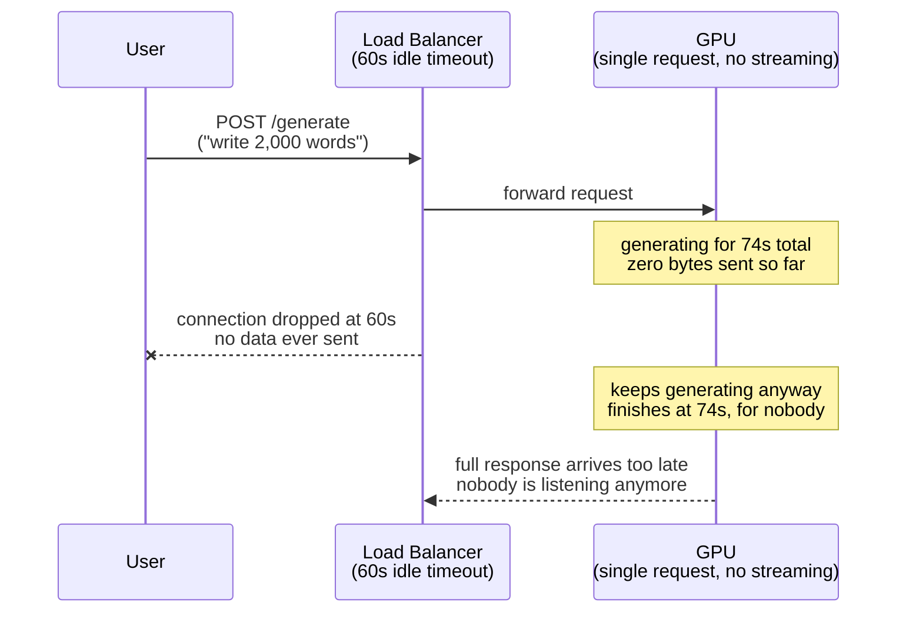

### Why this happens

The obvious question: why does one long answer kill the entire connection for something the model actually finished computing?

The answer: the API is **synchronous end-to-end**. The client gets zero bytes until the very last token exists. That means "time to any visible output" and "time to the full answer" are the same number. So every network hop's timeout budget applies to that one giant number, instead of to each small piece of it.

### The fix, and the analogy for the rest of this story

Stream the answer as it's produced, instead of buffering the whole thing. Chapter 2 is that fix.

### How I'd say this in an interview

"A synchronous, wait-for-the-full-response API ties 'time to first visible byte' to 'time to the entire answer,' which means every proxy and load balancer's timeout budget now applies to the *whole* generation instead of to getting started. The fix every real chat product uses is to stream tokens as they're born, not buffer the full response."

---

## Chapter 2 — Sushi, not a seven-course blackout

### The fix

As soon as the model produces a single token, send it to the client immediately. Do this over a connection that stays open and keeps emitting small chunks: **Server-Sent Events (SSE)**, plain HTTP that never closes until generation ends. Each token becomes its own `data:` line the moment it exists.

### The analogy — sushi conveyor belt

Picture a conveyor-belt sushi restaurant. The chef doesn't hold every plate in the kitchen until the entire order is done, then dump twelve plates on your table at once. Instead:

- Each piece goes on the belt the second it's ready.
- You start eating the first piece while the rest is still being made.
- Nobody waits for the whole meal to exist before tasting any of it.

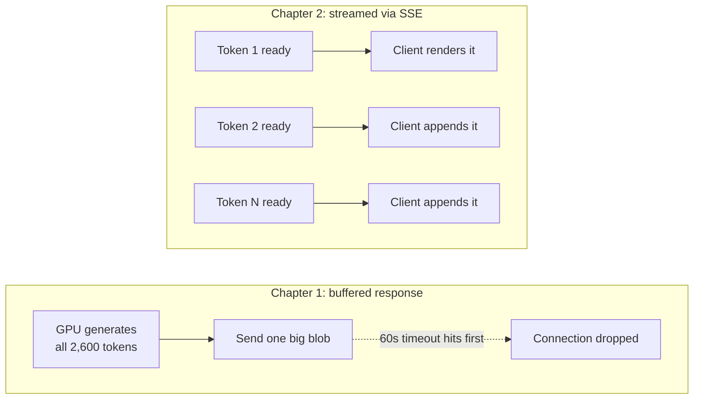

This immediately fixes the timeout problem too. As long as *some* bytes keep flowing, the load balancer's idle timer keeps resetting. A 74-second answer now survives just fine, because the connection is never actually idle for 60 straight seconds.

### New problem: no way to stop

Day one of streaming going live, a new problem shows up.

- A user asks for that 2,000-word essay.
- They read the first two sentences and realize it's not what they wanted.
- They want to stop.

Right now the *only* way to stop is to close the browser tab. Why? SSE is one-directional — the server pushes tokens, and the client has no channel to push anything back on that same connection. The server has no idea the user walked away.

The GPU, blind to this, keeps decoding all 2,600 tokens for a reader who left at token 40.

- Concrete waste: `(2,600 - 40) / 35 ≈ 73 seconds` of pure GPU time.
- All of it spent generating text nobody will ever read.

### Partial fix for now

Add a tiny, separate REST endpoint: `POST /stop`. It flags this specific generation as cancelled.

- The decode loop checks that flag before producing the next token.
- Waste is capped at roughly one token's worth of latency, instead of thousands.
- This is a *separate* call, never a message on the SSE channel itself — SSE literally can't carry anything client-to-server.

This checked-every-token version is good enough for one request per GPU. It gets revisited once batching enters the picture in Chapter 3.

### How I'd say this in an interview

"SSE over plain HTTP, not WebSockets — the completion stream is one-directional server push, so I don't need WebSocket's full-duplex machinery. Stop and regenerate are separate, rare REST calls, not messages on the stream, because SSE literally has no channel for the client to talk back on."

---

## Chapter 3 — The elevator that waits for the last passenger

### The setup

Verlby grows to 200 concurrent users on that same one A100. Streaming and the stop button haven't changed one thing: the GPU still serves **one request at a time**. Streaming changed *when* bytes arrive, not *how many requests run at once*.

### The numbers

- A typical 300-token response occupies the GPU for `300 / 35 ≈ 8.6s`.
- That means one GPU's raw capacity is `1 / 8.6 ≈ 0.116 requests/sec`.
- Verlby's 200 users, each sending roughly one message a minute, arrive at about `200 / 60 ≈ 3.3 requests/sec`.
- Demand outstrips capacity by roughly **28x**.

Within the first hour, the queue of waiting messages balloons into the thousands. A brand-new message can sit waiting for minutes before a GPU even starts on it.

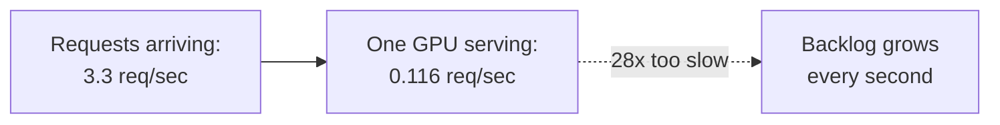

### Why "just add more GPUs" isn't the real fix

At a 28x gap, one more GPU barely dents it — you'd need dozens.

There's also a deeper waste hiding underneath: decoding one sequence at a time doesn't even use the GPU's full parallel hardware. LLM decode is memory-bandwidth-bound, and a batch size of one leaves most of the chip's compute idle on every single forward pass.

The real fix isn't "buy more GPUs." It's "get more useful work onto each GPU at once."

### The fix, and the analogy for the batching family of ideas — the elevator

Instead of sending the elevator up for one passenger at a time, load several passengers who are all waiting in the lobby, and take them all up together in one trip.

- One forward pass through the model now advances several requests' next token simultaneously, instead of just one.
- Verlby groups up to 8 pending requests into a batch and runs them together.
- This is **static (request-level) batching**.

### New problem, visible within days

The elevator (the batch) can't return to the lobby to pick up new passengers until *every single passenger currently riding* has reached their floor.

Response lengths are wildly unpredictable:

- One user asks "yes or no?" — 10 tokens.
- Another asks for a full essay — 300 tokens.

**Worked example.** Take a batch of 4 requests with output lengths 10, 15, 300, and 300 tokens.

- Useful decode-ticks: `10 + 15 + 300 + 300 = 625`.
- Maximum possible slot-ticks the batch occupies: `4 × 300 = 1,200`. Every slot is held hostage until the two 300-token requests finish.
- GPU utilization: `625 / 1,200 ≈ 52%`.

Two of the four elevator seats sit **empty and idle** for 290 straight ticks each. They can't pick up anyone new, because the whole elevator can't return to the lobby until the slowest rider gets off.

```mermaid
gantt
    dateFormat X
    axisFormat %s
    title Static batching — short requests finish, then their slot sits idle
    section Slot 1 (10 tok request)
    generating          :done, a1, 0, 10
    idle, waiting for batch : crit, a2, 10, 300
    section Slot 2 (15 tok request)
    generating          :done, b1, 0, 15
    idle, waiting for batch : crit, b2, 15, 300
    section Slot 3 (300 tok request)
    generating          :active, c1, 0, 300
    section Slot 4 (300 tok request)
    generating          :active, d1, 0, 300
```

### How I'd say this in an interview

"Static batching fixes GPU underutilization from serving one request at a time, but the whole batch is locked together — it can't admit a new request until its slowest sequence finishes. With response lengths varying wildly, that idle time adds up fast — in a small 4-request example it's already down to roughly half the GPU's time being wasted."

---

## Chapter 4 — The elevator that never stops moving

### The fix

Schedule at the level of a single decode step, not a whole request. This is **continuous batching**, also called iteration-level scheduling:

- The technique comes from the **Orca** paper (Yu et al., OSDI 2022).
- It's implemented today in serving engines like **vLLM**, **NVIDIA TensorRT-LLM**, and **HuggingFace TGI**.

### Same elevator analogy, upgraded

The elevator never has to return empty-handed to the lobby to reload. The instant any single passenger reaches their floor and steps out, whoever's next in the lobby line steps into that freshly-opened slot on the very next stop, without disturbing anyone else still riding to their own floor.

```mermaid
gantt
    dateFormat X
    axisFormat %s
    title Continuous batching — a finished slot is backfilled immediately
    section Slot 1
    request A, 10 tok :done, a1, 0, 10
    request E, 20 tok :active, a2, 10, 30
    section Slot 2
    request B, 15 tok :done, b1, 0, 15
    request F, 25 tok :active, b2, 15, 40
    section Slot 3
    request C, 300 tok :active, c1, 0, 300
    section Slot 4
    request D, 300 tok :active, d1, 0, 300
```

### The payoff

As long as the lobby line isn't empty, every slot does useful work on every single tick. Utilization climbs from that ~52% toy example toward something close to 100%.

Orca's own paper reports up to **36.9x higher throughput** than request-level batching on their benchmarks. That's the headline number worth remembering — with the caveat that it's benchmark-specific, not a universal multiplier you can promise in every interview.

### New problem, one layer down

Now that the elevator swaps riders constantly, mid-trip, with wildly unpredictable trip lengths, a second question appears — one that batching itself never answered.

Each rider needs somewhere to sit down their bags for the whole trip. In model terms: the model's per-sequence "working memory" — the key/value cache, or **KV cache**, that every future token attends back over.

If you don't know how long a ride will last when it starts, how much bag-storage do you reserve for it up front?

### How I'd say this in an interview

"Continuous batching, from the Orca paper and shipped in vLLM, TensorRT-LLM, and TGI, schedules at the granularity of one decode step instead of one whole request — a finished sequence's slot gets backfilled on the very next step instead of sitting idle until the whole batch's slowest member finishes. It's the single most-tested mechanism in this interview for a reason: it's roughly the difference between 50% and 100% GPU utilization."

---

## Chapter 5 — The parking garage that outsmarts the valet

### The problem

Every token a sequence generates has to attend back over every previous token's key/value vectors — its KV cache. That cache grows with sequence length, and its final size is **unknown up front**: a reply might be 20 tokens or 2,000, and you don't find out which until it's over.

### The naive approach Verlby ships first

Reserve a slab of GPU memory sized for the *maximum possible* length, per request, the instant it starts.

**Worked numbers** `[illustrative, since exact bytes depend on model architecture]`:

- One 80GB A100, minus ~40GB of model weights, leaves ~35GB for KV cache.
- At ~512KB of KV cache per token for this model size, reserving for a 4,000-token maximum costs `4,000 × 512KB ≈ 2.0GB per request`.
- That means `35GB / 2.0GB ≈ 17 concurrent requests` fit on the GPU, no matter how short most of them actually turn out to be.

Most conversations only run ~800 tokens. So the vast majority of each 2GB reservation just sits empty. Worse, differently-sized leftover chunks fragment the remaining memory into pieces too small to reuse.

### The fix — PagedAttention

From the **vLLM** project at UC Berkeley (Kwon et al.): borrow the fix straight from how an operating system manages RAM.

### The analogy — a parking garage, not a reserved row

Instead of reserving an entire row of parking spots for a car for the longest possible stay it *might* need the moment it pulls in:

- Hand it one spot at a time from a shared pool, as it actually needs space.
- A small ticket records which scattered spots belong to which car — they don't need to be next to each other.
- The instant a car leaves, its spots go straight back into the shared pool for the very next car.

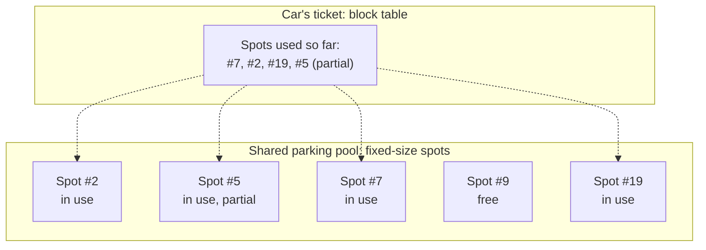

### Redo the math with paging

- Allocate only what's actually used, at the real average of ~800 tokens: `800 × 512KB ≈ 0.4GB per request`.
- So `35GB / 0.4GB ≈ 87 concurrent requests` fit on the same card.
- That's roughly **5x more concurrent conversations**, purely from not reserving for a worst case almost nobody hits.

Waste is now bounded to at most one partially-filled spot per car — the last, still-growing one.

**Bonus, straight from the same trick:** two cars following an identical route for part of their trip (two requests sharing the same system prompt) can literally share the same parking tickets for that overlapping stretch. This is called **prefix sharing**, and it comes back with real money attached in Chapter 11.

### New problem

Now that a GPU can genuinely hold dozens of concurrent conversations cheaply, attention turns back to the conversations themselves.

- The model is **stateless between calls** — every single message resends the entire prior conversation.
- Verlby's longest-running power users eventually hit the model's fixed context ceiling.

**Concrete numbers** on an 8,000-token model:

- A 40-turn conversation has accumulated exactly 8,000 tokens of history.
- The next 150-token message pushes the total to 8,200.
- That's **200 tokens over budget**, on a hard ceiling that can't just be ignored.

### How I'd say this in an interview

"PagedAttention pages KV-cache memory into fixed-size blocks with a per-sequence block table, the same trick an OS uses for virtual memory — so fragmentation drops to at most one partial block per sequence, and in a worked example that's roughly a 5x jump in how many conversations fit on one GPU. It's also what makes prefix sharing possible later, which turns out to be one of the biggest cost levers in this whole system."

---

## Chapter 6 — The notebook that runs out of pages

### The problem

Every call resends the whole conversation, and the model's context window is a hard ceiling — 8,000 tokens in Verlby's case. Something has to give when `system prompt + history + new message` goes over that line.

### First fix — sliding window / hard truncation

Keep only the most recent N turns, drop everything older.

**The analogy — a notebook that's full.** Once every page is used, you tear out the oldest pages and throw them away to make room for new ones.

- Cheap, and it works mechanically.
- But the assistant now genuinely "forgets" anything written on those torn-out pages.
- That includes an instruction given at the very start of the conversation, like "always answer in French" or "I'm vegetarian, don't suggest meat."

This is exactly the complaint that shows up in Verlby's support queue within a week: *"it forgot what I told it three messages ago."*

### Second fix — summarize-then-append

Instead of throwing torn-out pages away, run a small, cheap model call over them, replace them with a short summary, and keep only the *newest* pages verbatim.

**Same notebook analogy, extended.** You still tear out the old pages, but before you do, you leave a sticky note on the next page saying what those pages covered. The gist survives, even though the exact wording doesn't.

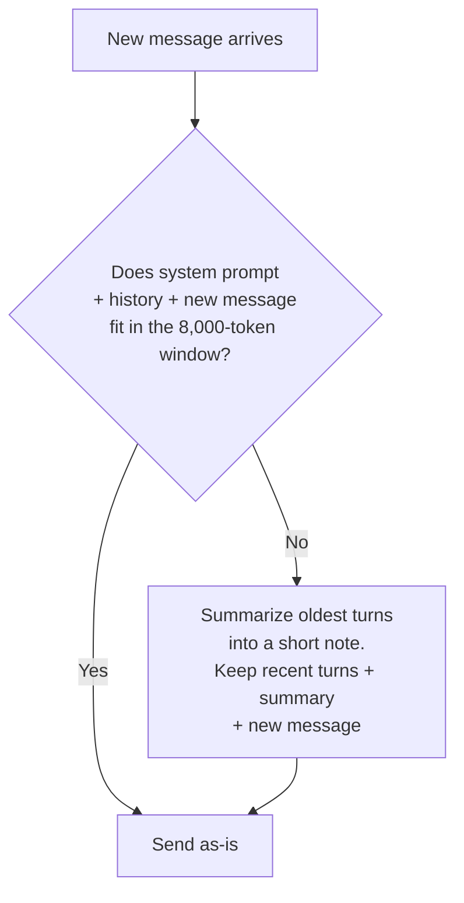

### Worked example

- Starting point: 40 turns, 8,000 tokens of history, plus a 150-token new message = 8,200 tokens. Over budget.
- Step 1: summarize the oldest 35 turns (7,800 tokens) down to a roughly 400-token sticky note, via one cheap model call.
- Step 2: keep the 5 most recent turns verbatim (600 tokens).
- Step 3: keep the 50-token system prompt pinned.
- New total: `50 + 400 + 600 + 150 = 1,200 tokens`.
- That's comfortably under the 8,000-token ceiling, with over 6,000 tokens of headroom left for the response and future turns.

### New problem

Summarization isn't free:

- It's a whole extra model round-trip, adding latency and cost on the write path for that one message.
- If the summarizer garbles or drops the *original* system instruction while compressing, you're right back to the same forgetting bug, just one layer sneakier.

**The real production answer:** treat the system prompt and any explicitly "remember this" fact as **pinned, never-evictable, never-summarized**. Only the compressible middle of the conversation gets torn out or condensed.

### How I'd say this in an interview

"Context management is a store-vs-resend problem, since the model is stateless — sliding window is cheap but forgetful, summarize-then-append costs one extra model call but preserves the gist, and pinning the system prompt plus any explicitly important turns protects against both losing them entirely and losing them to a bad summary. Most production systems run a hybrid: sliding window as the fast path, summarization only once a conversation actually crosses a length threshold."

---

## Chapter 7 — The bouncer and the customs officer

### The problem

Verlby goes public. A viral post shows someone got the bot to output genuinely harmful instructions, using a prompt that, read on its own, looks completely innocent. It's a cleverly worded, multi-step setup that only becomes dangerous once the model actually starts answering it.

This is a well-documented category of attack against real public chat products, usually called a **jailbreak**. The "DAN"-style prompts that circulated against ChatGPT are the famous, documented example of exactly this pattern.

Verlby's only existing filter is a keyword check on the raw incoming prompt. It didn't catch this one, because there was nothing to catch: the prompt itself wasn't the harmful part.

### Why filtering only the output, or only the input, both fail

The obvious question: so just filter the output instead, and skip checking the input?

No. You need both, and they catch two structurally different failures:

- **Filtering only the output**: every blocked prompt still burned a full GPU generation for nothing, every single time, for prompts you were always going to refuse anyway.
- **Filtering only the input**: structurally *cannot* catch a jailbreak, because by definition the harm only exists in what the model generates, not in what the user typed.

### The fix — a two-sided filter

**The analogy — a bouncer and a customs officer at an airport.**

- The bouncer stands at the front door and turns away anyone obviously trouble before they even get inside. This is the pre-generation filter, checked against the raw prompt, before it burns any GPU time.
- A customs officer checks bags on the way *out*, as they're being packed — not only after the traveler has already left the building. This is the post-generation filter, running on a rolling window of the live streamed tokens, not waiting for the whole response to finish. By the time the response finishes, the harmful content already fully exists in memory and the GPU time is already spent.

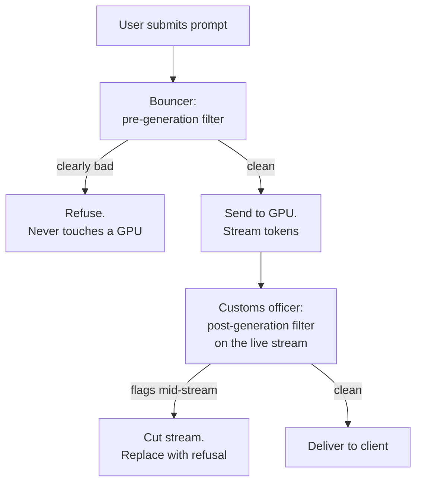

### New problem

Both checkpoints have to be fast — a few milliseconds, not hundreds — or every single message on the platform gets slower. That rules out running the full-size model to check itself. Both filters run small, cheap classifier models instead.

Small and cheap means occasionally wrong the other direction too. Verlby starts getting a *different* complaint: "the bot refused a completely normal question."

A hard block on every borderline case is too blunt. The fix:

- Route genuinely borderline (not clearly bad) prompts to a more conservative model, or a stricter system prompt, instead of an outright refusal.
- Log every flagged case for the filters to be retrained on later.

### How I'd say this in an interview

"Moderation has to be two-sided: pre-generation to avoid burning GPU time on a prompt you'd refuse anyway, post-generation because a jailbreak is defined as harmful output from a seemingly benign input — the input filter structurally cannot catch that class. The output filter has to run on the live stream in a rolling window, or you lose the entire point of streaming and pay the full generation cost anyway."

---

## Chapter 8 — The truck that needs loading before it can drive

### The problem

The jailbreak story goes viral for the *wrong* reason. Verlby's concurrent users spike from around 200 to roughly 3,000 within an hour `[illustrative — a plausible viral-spike shape, not a specific measured incident]`.

The autoscaler dutifully notices queue depth breaching its threshold and spins up 5 fresh GPU nodes. But a new GPU node isn't useful the instant it exists.

**What has to happen before a new node can serve one token:**

1. Pull the model's weights from blob storage. By now Verlby runs a bigger, better model — roughly 140GB at fp16 for a 70B-class model.
2. That transfer happens at maybe **2GB/sec** `[illustrative network/disk throughput]`, which alone takes `140 / 2 ≈ 70 seconds`.
3. Then CUDA/driver initialization and warm-up kernels run on top.

Total: two to three minutes before that node serves a single token.

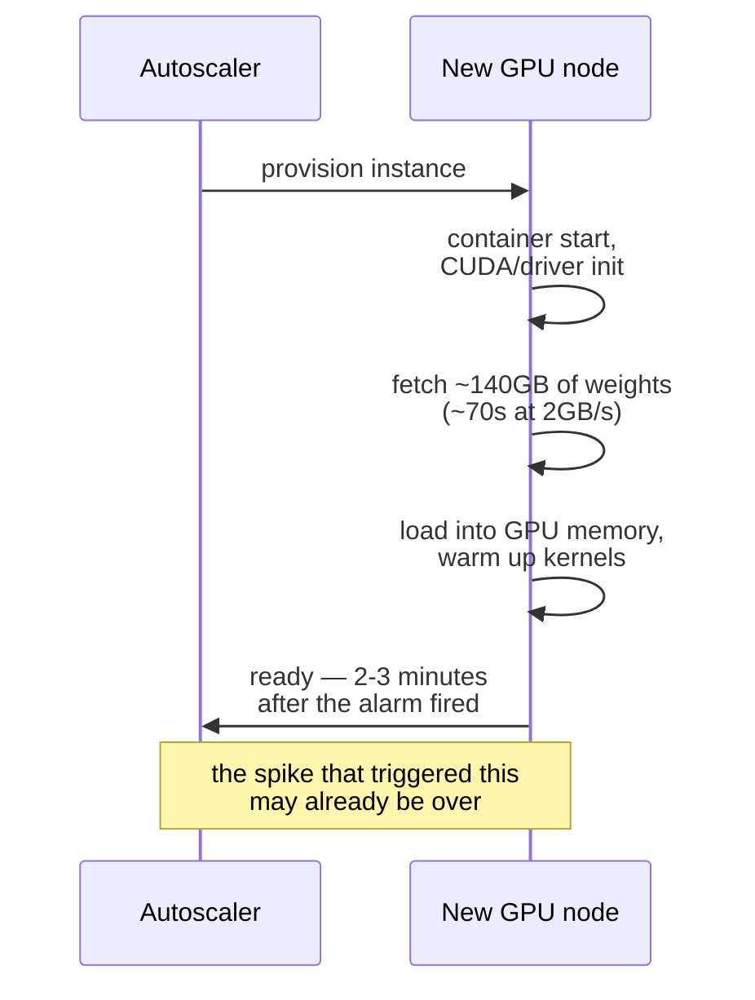

### Why "doesn't autoscaling just fix this" doesn't hold

Not the way you'd autoscale a stateless web server.

- A web-tier pod is useful in milliseconds.
- A GPU node carrying a 140GB model is useful in *minutes*.

By the time the 5 new nodes finish loading, the worst of the spike may have already passed. Every user who hit the wall in those first three minutes waited on a queue that new capacity couldn't touch in time.

### The fix — the same analogy extended: keep a truck already loaded, idling

Instead of only starting to load a moving truck with cargo after the doorbell rings, keep a small number of trucks pre-loaded and idling in the lot, engines running, ready to pull out the instant they're needed.

In GPU terms:

- A **warm floor** of always-on nodes, sized to normal trough traffic.
- Plus a small **pre-warmed standby pool**: nodes with weights already loaded, not yet taking live traffic, ready to be slotted in instantly rather than starting a cold load from zero.

### New problem

Idling, fully-loaded trucks cost real money sitting in the lot doing nothing most of the day. And if the *next* viral spike is bigger than the standby pool's size, you eventually run out of pre-warmed spares and land right back in a cold-start race — just starting from a slightly better position.

**The remaining mitigations:**

- Predictive/scheduled scaling ahead of known daily traffic peaks. Chat traffic is strongly diurnal, so don't wait for a reactive alarm on a *predictable* peak.
- A firm rule that new requests never queue behind a still-loading node — route around it, don't wait on it.

### How I'd say this in an interview

"GPU autoscaling has a cost a stateless web tier doesn't — loading model weights can take minutes, not milliseconds, so brand-new capacity often shows up after the spike that triggered it has already passed. The standard fix is a warm floor sized to trough traffic plus a pre-warmed standby pool that's already loaded and idling, backed by predictive scaling ahead of known daily peaks rather than pure reactive scaling."

---

## Chapter 9 — The model too big for one loading dock

### The problem

Verlby wants to compete on quality and upgrades toward a bigger, smarter model. New problem, immediately:

- That model's weights alone (~140GB at fp16 for a 70B-class model) don't fit inside a single 80GB A100's memory.
- This is *before* even leaving room for the KV cache work from Chapter 5.

The obvious question: just buy a GPU with more memory? Eventually you hit a ceiling no single card clears. And even a card that *could* hold the weights still only gives you one card's worth of compute. A model this large genuinely has to be split across multiple physical GPUs.

### The fix — two ways to split, and the analogy — an assembly line

Picture building a car:

- **Tensor parallelism**: split a *single layer's* matrix multiply across GPUs. It's like a crew of several mechanics all working on the *same* door, at the *same* station, at the *same* time, each bolting on a different piece of it simultaneously. This needs constant, fast back-and-forth between the mechanics, so it only works well when the GPUs are tightly connected — think NVLink, within one physical node.
- **Pipeline parallelism**: assign different *layers* to different GPUs. It's like an actual assembly line, where the door gets attached at station 1, painted at station 2, and fitted with windows at station 3. Each station only ever talks to its immediate neighbor, handing off a partially-finished piece. This tolerates GPUs that are farther apart (across nodes), and it's what lets a model exceed a single node's total memory, not just a single card's.

| | Tensor parallelism | Pipeline parallelism |
|---|---|---|
| What's split | one layer, across GPUs | different layers, across GPUs |
| Talk pattern | frequent, needs fast interconnect | only neighbor-to-neighbor, less chatty |
| Best for | cutting latency for one request | letting a model exceed one node's memory |
| Typical scope | within a node (NVLink) | across nodes |

Real deployments combine all three axes:

- Tensor-parallel within a node.
- Pipeline-parallel across nodes.
- Plain **data parallelism**: full independent copies of the whole sharded model running side by side, to scale total *request throughput*.

Sharding a model across more GPUs makes each request's step no faster once you're past the point of diminishing communication returns. It just makes bigger models *possible*.

### New problem

Sharding solves "does the model fit." Replication solves "can we serve more requests." Neither one directly shrinks the *time per token* a single user's stream sees.

A request sharded across 8 chatty GPUs is still bound by however slow the slowest, most-communication-heavy GPU in that group is on every single decode step.

Verlby's paying customers, mid-migration to the bigger model, start complaining the bot "feels slower to type than it used to."

### How I'd say this in an interview

"If the model doesn't fit in one GPU's memory, that's pipeline parallelism's job — split layers across GPUs like assembly-line stations. If a single request needs to be faster and the GPUs are tightly connected, that's tensor parallelism — split one layer's work across GPUs like several mechanics on the same door. Neither one, by itself, adds request throughput — for that you replicate the whole sharded group with data parallelism."

---

## Chapter 10 — The intern who drafts, the boss who skims

### The setup

Verlby wants to claw back some of that per-token speed the bigger model cost it, without undoing the sharding decision from Chapter 9.

The fix is a decode-latency trick that composes on top of everything already built, rather than replacing any of it: **speculative decoding**.

### The analogy — an intern drafting, a boss skimming

Instead of a busy executive typing every single line of an email herself, word by word:

- She has an intern (a small, fast "draft" model) write the next several lines first.
- She doesn't then re-type them one at a time either — she glances at all of them in **one quick read**. This is the big "target" model verifying, in a single parallel forward pass, whether it would have generated the same tokens.
- She either approves the whole run in one motion, or stops at the exact point where she'd have written something different, then takes over from there herself.

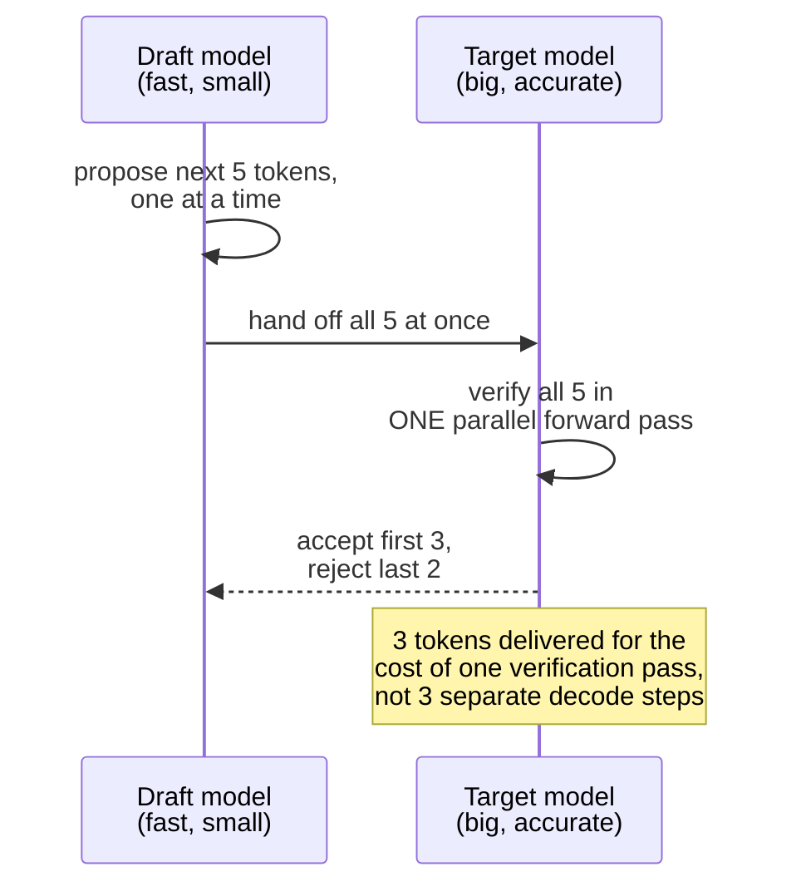

### The numbers

Because verifying several draft tokens in one parallel pass is cheaper than generating them one at a time autoregressively, an accepted run of tokens arrives far faster than normal decode would produce them.

**Illustrative worked number** `[illustrative — acceptance rate is workload- and model-pair-dependent, not a fixed constant]`: if the draft model's guesses match the target model on average across 2.5 tokens per verification round, the effective decode speed on those accepted runs improves by roughly that same multiplier.

The payoff scales with the draft model's **acceptance rate** — how often it guesses right — not with how good the draft model is at language in general.

### Where this fits, said plainly

Speculative decoding is a decode-latency optimization layered *on top of* continuous batching and tensor/pipeline parallelism from earlier chapters. It doesn't replace any of them, and it doesn't add fleet throughput or fix cost per token.

Which leaves exactly one problem still fully unsolved: money.

### How I'd say this in an interview

"Speculative decoding runs a small draft model ahead and has the big target model verify several tokens in one parallel pass instead of generating them one at a time — the payoff scales with how often the draft model's guesses are right, not its raw quality, and it composes cleanly on top of batching and sharding rather than replacing either one."

---

## Chapter 11 — The one user who quietly outspent the marketing budget

### The problem

Verlby bills the way most APIs start: a flat fee per request.

A power user discovers they can paste an entire 50,000-word internal wiki — roughly 65,000 tokens — into the very first message of a conversation. Because the model is stateless, that entire wiki gets **resent in full on every single follow-up message** in that thread.

- One of this user's ordinary-looking exchanges now costs the GPU fleet roughly as much compute as **200 of Verlby's normal 300-token conversations** combined.
- But the user pays the exact same flat per-request fee as everyone else.

A handful of users doing this quietly consume a large share of the entire GPU fleet's capacity, while looking, by request count, like completely ordinary customers.

### Why capping prompt length isn't the real fix

The obvious question: just cap prompt length? That helps a little, but it treats a symptom. The actual bug is billing and rate-limiting on the wrong axis.

Request count hides the real cost driver, which is **how many tokens** a call actually pushes through the model. A single 65,000-token call is not the same unit of cost as a 300-token one.

### The fix — bill and rate-limit on tokens, not requests

**The analogy — a buffet charging by the weight of your plate, not a flat fee per visit.**

Someone piling a mountain of food onto one plate should pay proportionally more than someone with a small salad. Charging everyone the same flat entry fee regardless of what's actually on the plate is exactly Verlby's original mistake.

**The real mechanism:** a **token-bucket** per user.

- Refilled continuously at a tokens-per-minute rate.
- Drawn down by `prompt_tokens + completion_tokens` on every call.

This mirrors, as a documented fact, how OpenAI's own public API enforces both requests-per-minute *and* tokens-per-minute limits simultaneously — with the tokens-per-minute limit being the one that actually protects shared GPU capacity.

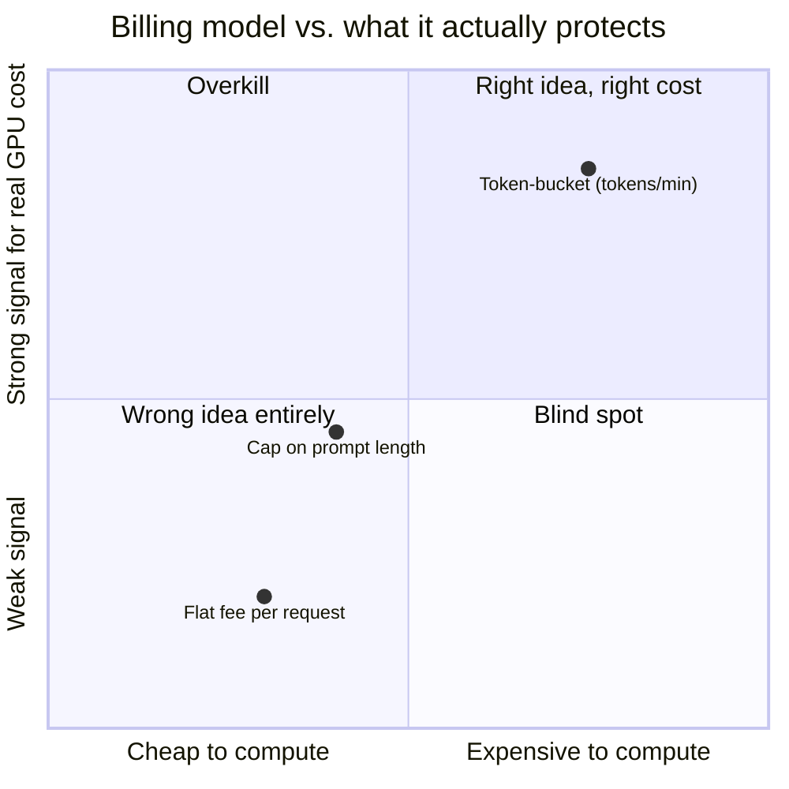

### Two more cost levers

Both connect straight back to earlier chapters rather than being new ideas:

- **A tiered model fleet**: route easy, short queries to a cheap/fast model, and only send genuinely hard queries to the large, expensive one. Same "different tool for the job" instinct as picking a batching strategy per workload, just applied to model size.
- **Prefix/KV-cache reuse**: Chapter 5's PagedAttention makes KV-cache blocks shareable by reference. Most of every resent conversation's tokens are *unchanged* from the previous turn. So the system can skip recomputing the KV cache for the part that hasn't changed at all, directly cutting both latency and GPU cost for exactly the resent-history tokens that dominate daily volume in a chat product.

The parking-garage trick from Chapter 5 is what makes this possible. Billing correctly on tokens is what makes it *matter* financially.

### How I'd say this in an interview

"Rate-limit and bill on tokens, not request count — a single huge-context request can cost far more GPU time than a hundred short ones, and a flat per-request fee hides that completely. Pair a token-bucket limiter with a tiered model fleet and prefix/KV-cache reuse, and you're covering the three biggest cost levers in a real production LLM-serving stack, more or less exactly where this story lands."

---

## Where the story actually lands

```mermaid
flowchart LR
    A["Ch1: sync API<br/>one long answer<br/>kills the connection"] -->|"fixes: stream tokens<br/>breaks: can't stop mid-stream"| B["Ch2: SSE +<br/>stop endpoint"]
    B -->|"fixes: cheap cancel<br/>breaks: one req/GPU too slow"| C["Ch3: static<br/>batching"]
    C -->|"fixes: some utilization<br/>breaks: idles on slowest seq"| D["Ch4: continuous<br/>batching"]
    D -->|"fixes: near-100% util<br/>breaks: KV cache wastes memory"| E["Ch5: Paged-<br/>Attention"]
    E -->|"fixes: 5x concurrency<br/>breaks: convos outgrow context"| F["Ch6: sliding window<br/>+ summarization"]
    F -->|"fixes: long convos<br/>breaks: jailbreaks slip past filter"| G["Ch7: two-sided<br/>moderation"]
    G -->|"fixes: safety<br/>breaks: new GPUs slow to warm up"| H["Ch8: warm floor +<br/>standby pool"]
    H -->|"fixes: spike readiness<br/>breaks: model too big for one GPU"| I["Ch9: tensor/pipeline<br/>parallelism"]
    I -->|"fixes: fits & scales<br/>breaks: per-token speed capped"| J["Ch10: speculative<br/>decoding"]
    J -->|"fixes: faster streams<br/>breaks: flat billing hides cost"| K["Ch11: token-based<br/>billing"]
```

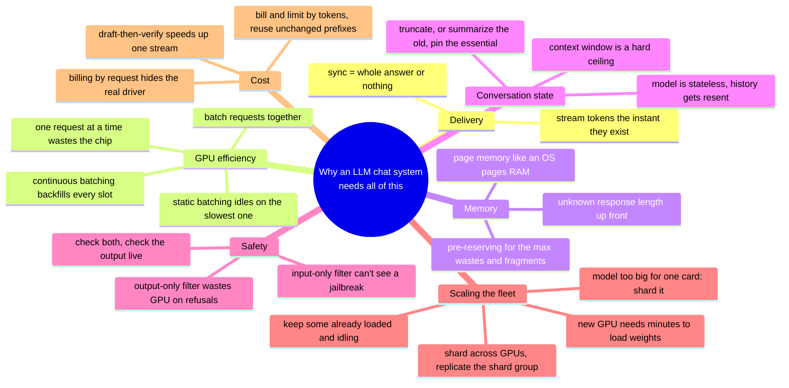

Every real production chat system sits *somewhere* on this chain.

- A weekend-project chatbot might reasonably stop around Chapter 4.
- A consumer product at real scale has to reach Chapter 8, 9, and 11.
- Walking all eleven chapters unprompted, when nobody's asked about cost or multi-GPU sharding, reads as padding, not depth. Follow wherever the interviewer's own questions point.

---

## Grill me — adversarial follow-ups

**Q1: "Why not just make the synchronous API's timeout longer instead of building streaming at all?"**

Because that only buys you a bigger number before the exact same failure — the moment someone asks for something long enough, you time out again, just later and with a bigger delay for the user in the meantime. It doesn't fix the actual coupling: the client still gets zero visible output until the entire answer exists, which is the real problem, not the specific timeout value.

**Q2: "Isn't continuous batching just static batching with a smaller batch window?"**

No — the difference is the unit of scheduling, not the size. Static batching schedules whole requests and can't touch a batch's membership until every member finishes; continuous batching schedules individual decode steps, so a finished sequence's slot gets replaced on the very next step regardless of what else in the batch is still running.

**Q3: "If PagedAttention lets you overcommit memory, what happens if every sequence in a batch turns out to run long at the same time?"**

The shared pool of physical blocks can genuinely run out — that's the real limit paging manages, not eliminates. Production schedulers cap how many new sequences they admit based on current free-block count, and can pause admitting new work rather than let an in-flight sequence fail mid-generation.

**Q4: "Why not just always summarize instead of using a sliding window as the fast path?"**

Because summarization costs a whole extra model call and adds latency on the write path, and most conversations never get close to the context ceiling at all — paying that cost on every message for the common short case is waste for no benefit. The hybrid only pays for summarization once a conversation actually crosses the length threshold where it's needed.

**Q5: "Your two-sided moderation filter adds latency to every single message — why not just filter output only, less often?"**

Because a jailbreak's entire definition is harmful output from an input that looked fine going in — an output-only strategy still needs to catch that, so you can't skip the output side. What you can do is keep both filters small and fast (single-digit milliseconds) rather than skip one of them, which is exactly why they're cheap classifier models, not the main model checking itself.

**Q6: "Doesn't a pre-warmed standby pool just move the cost from 'slow during a spike' to 'wasting money 24/7'?"**

Yes, and that's a real, named trade-off, not a free fix — you're paying idle GPU cost to buy eliminated cold-start latency. The size of that pool is a genuine business decision sized to how bad a slow spike is allowed to be, layered with predictive scaling ahead of known daily peaks so you're not paying for standby capacity you could have scheduled for instead.

**Q7: "If tensor parallelism needs fast interconnects and pipeline parallelism doesn't, why not just always use pipeline parallelism?"**

Because pipeline parallelism doesn't reduce a single request's latency the way tensor parallelism can — each stage still has to wait for the previous one to hand off a partial result, so a lone request crawls through every stage sequentially. Tensor parallelism trades needing fast interconnects for actually splitting one layer's work in parallel across GPUs, cutting latency directly, which is why real deployments combine both rather than picking only one.

**Q8: "Speculative decoding sounds like free speed — what's the catch?"**

The catch is you're now running two models instead of one, and the draft model's forward passes aren't free even when its guesses get rejected — if the draft model's acceptance rate is low for a given prompt, you've paid for extra compute with little payoff. It's a net win only when the draft model's guesses are right often enough, and that rate is workload-dependent, not guaranteed.

**Q9: "Why does prefix/KV-cache reuse matter more here than in most systems?"**

Because in a chat product, most of the tokens processed on any given message are the *same* resent conversation history from the turn before, not new content — that's structurally different from most request/response systems, where each request is mostly fresh work. Skipping recomputation on the unchanged part directly cuts the majority of daily GPU work, not an edge case.

**Q10: "Given this whole story, if someone just says 'design ChatGPT' cold, where do you start?"**

Name the four coupled problems in one breath first — streaming delivery, GPU batching/scheduling, context-window management, and two-sided moderation — and say GPU scheduling is the one that's genuinely novel compared to a typical web-scale system. Then walk forward only as far as the interviewer's follow-ups actually point; continuous batching and KV-cache paging are close to a given at any real scale, but multi-GPU sharding, speculative decoding, and token-based billing are things you earn by the interviewer asking about latency, model size, or cost, not defaults you volunteer for their own sake.

---

## Cheat sheet — one line per stop on the story

- **Synchronous full-response API**: ties "first visible byte" to "entire answer done" — every timeout downstream now applies to the whole generation.
- **SSE streaming**: flush each token the instant it exists, over a one-directional connection; stop/regenerate are separate REST calls, since SSE can't carry anything back.
- **Static batching**: groups requests into one GPU pass, but the whole batch waits on its slowest member — idle slots can't be reused until everyone finishes.
- **Continuous batching (Orca/vLLM/TensorRT-LLM/TGI)**: schedules at the decode-step level, so a finished slot is backfilled on the very next step — utilization climbs from roughly half to near 100%.
- **PagedAttention (vLLM)**: pages KV-cache memory into fixed-size blocks with a per-sequence block table, the same trick an OS uses for virtual memory — bounds waste to one partial block per sequence and enables prefix sharing.
- **Context-window management**: sliding window is cheap but forgetful; summarize-then-append preserves the gist at the cost of one extra model call; pin the system prompt and explicitly important turns so neither truncation nor summarization can lose them.
- **Two-sided moderation**: pre-generation avoids wasting GPU on a prompt you'd refuse anyway; post-generation on the live stream is the only backstop for a jailbreak, since the harm only exists in the output.
- **GPU autoscaling**: new nodes take minutes to load model weights, not milliseconds — a warm floor plus a pre-warmed standby pool covers spikes that reactive scaling alone shows up too late for.
- **Tensor vs. pipeline parallelism**: tensor parallelism splits one layer across tightly-connected GPUs to cut latency; pipeline parallelism splits layers across looser-connected GPUs/nodes to let a model exceed one node's memory; data parallelism replicates the whole shard group for throughput.
- **Speculative decoding**: a small draft model proposes tokens ahead, the big target model verifies them in one parallel pass — payoff scales with acceptance rate, and it composes on top of batching and sharding rather than replacing either.
- **Token-based billing and rate limiting**: bill and limit on tokens, not request count, because a single huge-context call can cost as much as hundreds of short ones — flat per-request pricing hides the real cost driver completely.
- **The meta-lesson**: every fix in this story buys one property (responsiveness, GPU utilization, memory efficiency, conversational memory, safety, spike readiness, model scale, per-token speed, or honest cost accounting) by spending a different one — say the trade in the same breath you propose the fix.
