# Design an AI Code Assistant — The Story (narrative edition)

> **What this file is.** The reference file, `45-Design-an-AI-Code-Assistant-FAANG-Guide.md`, is
> the one to recite from — requirements, API shapes, every deep dive, the master cheat sheet. This
> file is a second way in: the same material as one continuous story, told in plain language.
> Engineers at a company keep hitting a wall, patch it, and the patch itself creates the next wall
> — until we land on the exact same design the reference file documents. The company, **CodeCove**
> (a small dev-tools startup building a VS Code ghost-text extension called **Cove**), is
> fictional. But every wall it hits is something a real, named system actually does: **GitHub
> Copilot's** documented sub-100ms ghost-text latency target and fill-in-the-middle prompting,
> **Cursor's** incremental codebase-indexing approach, and the secret-scanning/push-protection
> style gate real Copilot tooling ships. I'll flag any stand-in number with `[illustrative]`.

**The one-sentence core idea:** an AI code assistant is really three systems wearing one UI:

1. A disposable-request, sub-100ms prediction loop for inline ghost text.
2. A repo-context retrieval pipeline that must stay fresh without ever re-scanning the whole
   codebase.
3. A zero-tolerance safety gate.

Nearly every decision below exists to keep those three systems from fighting each other for the
same compute.

---

## Chapter 1 — The ghost text that arrives after you've already moved on

### The starting point

CodeCove is eight months old, with 4,000 beta developers. Version one does the simplest thing
possible:

- On every pause — even mid-word — it sends the whole current file to one large hosted model
  (frontier chat-model weight class).
- It does this synchronously, and waits for the full reply.
- There is no caching, no cancellation, and no fast path.

### How slow is "too slow"

- The large model's honest time-to-first-token is **~700-900ms** `[illustrative]`.
- The bar this whole category is judged against — the one GitHub has publicly targeted for
  Copilot's ghost text — is roughly **p50 < 60ms, p90 < 100ms**.
- CodeCove is **8-15x too slow** against that bar.

### A concrete moment

A developer types `def calculate_monthly_total(orders):` and pauses to think. By the time a
suggestion streams back 850ms later, she has already typed four more characters. The ghost text
still renders — for a cursor position that no longer exists. A third of the beta channel disables
the extension in week one.

### Why is it this slow?

Two reasons stack on top of each other:

1. A model sized to write an essay is the wrong tool for "predict six words." Bigger models are
   inherently slower to produce a first token.
2. Nothing short-circuits anything. Every pause fires a full, fresh request, no matter how small
   the edit was.

### The fix, and the analogy for this whole story

**Right-size the kitchen.** A five-star kitchen (the large model) can cook anything, but it takes
twenty minutes to plate a dish. Ghost text needs a **drive-thru window** instead: small menu, fast
turnaround, order out in under a minute. Swap inline completion onto a small, fast model.

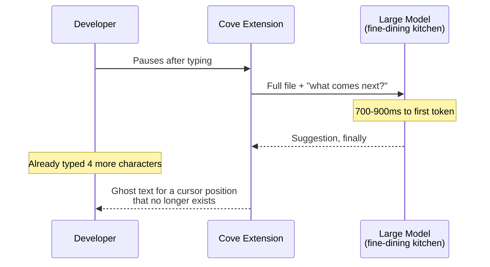

### New problem

The drive-thru is fast per order now. But a customer still shouts a new order through the window
on *every keystroke* — including orders overwritten a second later. It's a cheaper kitchen with
the same habit: cooking meals nobody eats.

### Say this in an interview

> "The naive version calls one big model synchronously on every keystroke — wrong model, full
> stop. First fix: route inline completion to a small model sized for a 100ms budget. That alone
> doesn't stop wasted work; it just makes each wasted order cheaper."

---

## Chapter 2 — Five orders placed for one meal

### What changed, what didn't

The small model is in place, and per-request latency now looks fine (~70ms median). But nothing
changed about *when* a request fires. Typing `"total"` — five keystrokes, about 200ms apart —
fires **five separate requests**, one per keystroke.

### The numbers

- 4,000 beta developers, roughly one request per keystroke while typing.
- Peak load: **~15,000-20,000 requests/sec** `[illustrative]`.
- The fleet was sized for far less.
- GPUs pin at 100% by lunchtime on launch day.
- Real completions queue behind requests for keystrokes that were already overwritten.

### Why cook an order for every keystroke?

Because nothing waits to see if the customer is actually done ordering before the kitchen starts
cooking — even when the customer immediately changes their order.

### The fix

**Don't submit the order until the customer stops talking.** This is **debounce**:

- A timer (CodeCove picks 300ms) starts on the first keystroke.
- Every keystroke before the timer fires **resets** it.
- Only a real pause — no keystroke for 300ms — sends a request at all.

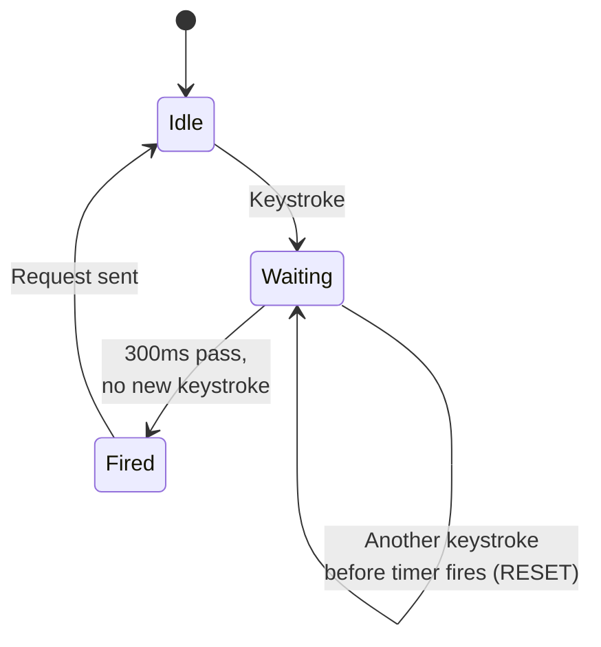

### Worked example

Typing `"total"` at ~200ms per keystroke:

| Step | Event | Gap since last keystroke | Timer state |
|---|---|---|---|
| 1 | types `t` | — | starts (300ms) |
| 2 | types `o` | ~200ms | resets (200ms < 300ms) |
| 3 | types `t` | ~200ms | resets |
| 4 | types `a` | ~200ms | resets |
| 5 | types `l` | ~200ms | resets |
| 6 | pause | 300ms+ | **fires** |

Every gap between keystrokes is shorter than the 300ms window, so the timer keeps resetting and
never fires mid-word. Result: five keystrokes, **zero** requests during the burst. Only the pause
afterward fires **one** request, for the whole word.

### New problem

Debounce stops the client from *sending* a wasted order. It says nothing about an order that is
already **cooking** when the customer changes their mind mid-flight — a very ordinary thing for a
typist to do.

### Say this in an interview

> "Debounce is 'wait for a pause before you place the order' — it kills most wasted requests
> before they're sent. It can't help a request that already left before the next keystroke
> landed. That's a separate mechanism, and it's next."

---

## Chapter 3 — The order that's already cooking when you change your mind

### The math didn't fully add up

GPU spend drops after debounce, but not as much as the "~90% fewer requests" math predicted.
Digging in:

- Of the requests that *do* fire, roughly **two-thirds** answer a prefix that's already stale by
  the time the model replies.
- Why: the developer resumed typing within the ~70-100ms the model takes to respond.
- The kitchen doesn't know the customer walked away — it keeps cooking regardless.

### Why is spend still high, if debounce already worked?

Because debounce only protects the moment *before* sending. Once a request is sent, the kitchen
has started cooking. Stopping a dish mid-cook needs someone to actively say "stop" — and nothing
does that yet.

### The fix

The customer calls back and cancels the order already cooking:

- Every request carries a **cancellation token**.
- The instant a newer keystroke fires a new request, the extension tells the server to abort the
  old one.
- "Abort" means actually stop generating tokens right now — not just ignore the eventual reply.

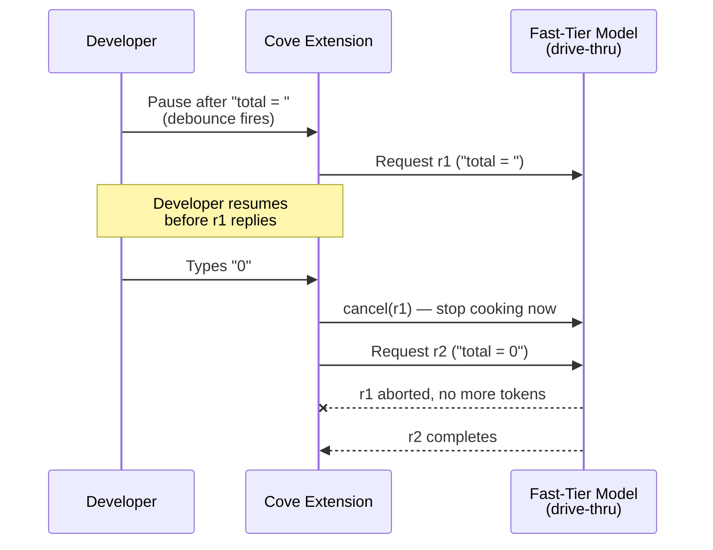

### Two mechanisms, two jobs

| Mechanism | Job | Stops... |
|---|---|---|
| Debounce | Decide whether to send | Sending a request at all |
| Cancellation | Decide whether to finish | Finishing a request already sent |

Skip cancellation, and a fast typist who pauses then resumes quietly costs you back the GPU time
that debounce was supposed to save.

### New problem

The kitchen now stops on cancel. But everything it *does* finish only knows the code **before**
the cursor. Inserting a line in the middle of an existing function ignores what's already written
after it — and starts duplicating that code.

### Say this in an interview

> "Debounce and cancellation are two mechanisms, not one feature with two names. Debounce cuts
> what's sent; cancellation cuts what's finished once sent. You need both, or the capacity math
> from Chapter 2 quietly comes back."

---

## Chapter 4 — The suggestion that duplicates a line two lines down

### The demo goes sideways

A prospect places the cursor inside `for order in orders:`, with `return total` already two lines
below, untouched. Cove suggests:

```
total += order.amount
return total
```

That second line **duplicates code that already exists** — on camera. The root cause: Cove has
been sending only text **before** the cursor, like reading a book with your hand covering every
page after the one you're on.

### The question

How do we let the model see what's after the cursor, without shipping the whole file?

**Answer:** split the file at the cursor and hand over both halves, telling the model explicitly:
only fill this gap.

### The fix, a new analogy

**Fill-in-the-middle (FIM)** — exactly a **cloze test**, the fill-in-the-blank exercise from
school. Given the sentence before *and* after the blank, you supply only the missing word.
GitHub's own reporting attributes a real, documented **~10% relative quality lift** to FIM.

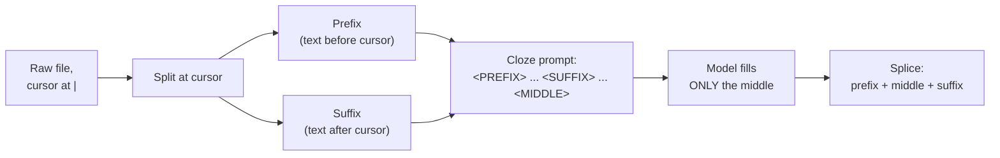

### What changes with the suffix visible

With the suffix visible, the model knows `return total` already exists downstream. So it
generates just `total += order.amount` — no duplicate, no dead code.

### New problem

FIM fixes blindness *inside* the open file. It does nothing for a helper function that lives in a
teammate's file the developer doesn't have open — the model has never seen that file and never
will, unless something changes.

### Say this in an interview

> "FIM is prefix plus suffix plus a token telling the model 'fill in exactly this gap' — why
> completions insert cleanly instead of only ever appending. It fixes blindness within one file,
> not blindness across files — that's the next wall."

---

## Chapter 5 — The helper function nobody told the model about

### The customer notices

First serious customer, real multi-service codebase. The right completion for
`def calculate_total(orders):` should call a `discount_rate()` helper. That helper:

- Lives in a different file the developer doesn't have open.
- Was written by a teammate three days ago.

Cove's model has never seen it, so it reimplements discount math from scratch — badly. The
customer notices in week one.

### The question

How does the model see code it's never had open, across a repo that changes daily, without
stuffing the whole codebase into every request?

**Answer:** build a searchable map ahead of time, and pull in only what's relevant per request.

### The fix, a new analogy

A **repo-wide vector index** — a **librarian who's read every book on every shelf** and points
you to the right paragraph by *meaning*, not exact words.

- Every function-sized chunk of code becomes an embedding.
- A query searches the nearest matches in milliseconds.

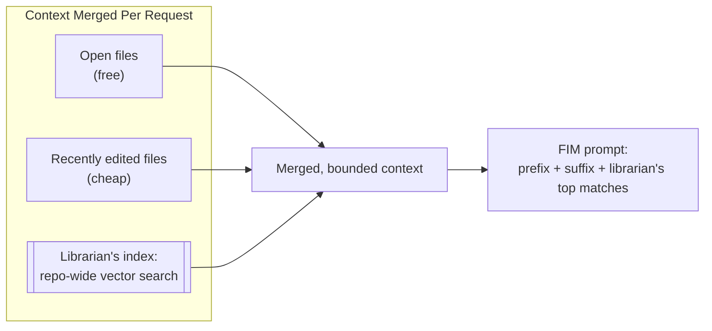

### What changes

Context now merges three sources:

| Source | Cost |
|---|---|
| Open file | Free |
| Recently edited files | Cheap |
| Librarian's top repo-wide matches | Expensive |

The top match for `calculate_total` is now correctly `discount_rate()`.

### New problem

A librarian who read every book once, on day one, is only useful until someone writes a new book.
This repo gets pushed dozens of times a day — an index built once goes stale within a week.

### Say this in an interview

> "Prefix/suffix solves blindness inside one file. A repo-wide vector index — embed every chunk,
> search by meaning, merge top hits into context — solves blindness across the whole codebase. An
> index built once and never updated is stale the moment the next commit lands."

---

## Chapter 6 — The librarian who re-reads the whole library every night

### The first attempt at freshness

First fix for staleness: re-embed the entire repo nightly. But this customer's repo is **2
million lines**, and:

- A full re-embed takes **~40 minutes** `[illustrative]`.
- It costs real money every single night, whether anything changed or not.
- Code written *that day* isn't in the index until the next run.

### Why re-read the entire library nightly?

If only a handful of files change per hour, why re-embed everything? Because the librarian can't
tell which pages changed without re-reading them — unless she's given a shortcut.

### The fix

Give every chunk a **content hash**:

1. On save, re-chunk only the touched file.
2. For each chunk, check the fingerprint (hash).
3. Seen before → skip it.
4. New or changed → re-embed just that chunk.

This is the same idea as Cursor's actual codebase-indexing approach, and the same as **sticky
notes only on the pages that changed**.

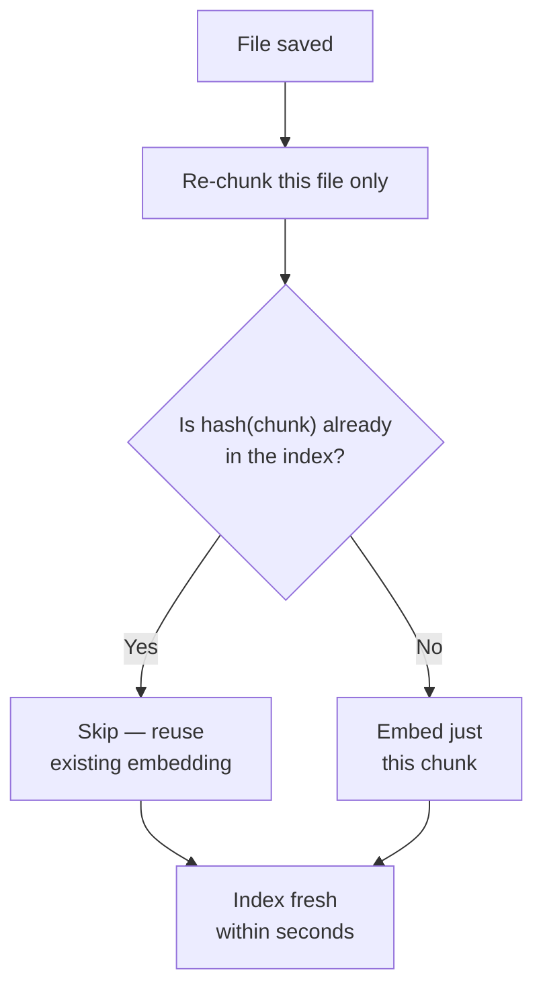

### Worked number

A 2,000-line file with one function edited triggers **one** re-embedding call — not 2,000 lines
of rework.

| Metric | Before | After |
|---|---|---|
| Freshness | Up to 24h stale | Seconds-to-minutes stale |
| Cost per update | Full repo re-embed | One changed chunk |

A periodic full rebuild still runs as a drift safety-net.

### New problem

The librarian is fresh now. But she's built for "point to a relevant paragraph," not "answer a
multi-file reasoning question" or "make a change and run tests." The same small drive-thru model
is the wrong tool again — for the same reason it was wrong in Chapter 1.

### Say this in an interview

> "Content-hash each chunk, re-embed only chunks whose hash changed, on save — never a nightly
> full scan, and never a re-embed on every keystroke either, since mid-edit code is often invalid
> anyway."

---

## Chapter 7 — Asking the drive-thru window to plan a three-course meal

### Chat ships, wired to the wrong model

CodeCove ships chat, wired straight into the existing fast-tier model, because it's already
deployed. First real question:

> "Where do we retry failed payment webhooks, and is the backoff exponential?"

The drive-thru model — small, distilled, built to blurt six words in 70ms — names the wrong file
and invents backoff behavior that isn't even in the code.

### Why would a fast model be a bad reasoner?

"Fast at short local predictions" and "good at reasoning across files" are close to opposite
design goals. The model was distilled specifically to be small and quick — not deep.

### The fix, same analogy extended

A restaurant needs a dining room too.

- **Drive-thru** (small/fast) stays for ghost text.
- **Chat** and, later, **agent mode** route to the **dining room**: a larger, more capable model,
  slower and more relaxed.

A real question is "wait for a proper answer," not "flow-state typing."

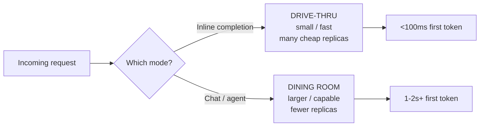

### Two fleets, two scaling signals

| Fleet | Scales on | Handles |
|---|---|---|
| Drive-thru | Keystroke volume | Inline ghost text |
| Dining room | Concurrent chat/agent sessions | Chat, agent mode |

They stay on **separately-scaled fleets**, so a lunch rush in one never starves the other.

### New problem

The dining room now reasons well enough that the natural next ask is: "don't just answer, *make
the change*." That's a much bigger trust problem than a wrong ghost-text suggestion ever was.

### Say this in an interview

> "Never let one model own both latency budgets — route by mode, not load, and scale the two
> fleets independently, because their bottlenecks — keystroke volume versus reasoning depth — are
> different problems."

---

## Chapter 8 — The intern who pushes straight to main

### Agent mode, first dogfood run

Agent mode: give it a goal, and it reads files, writes a patch, and runs tests — autonomously, on
the dining-room model. The first dogfood run does what was asked. It also, unasked, "cleans up"
an unrelated function two files away, and pushes the whole thing straight into a feature branch
with no review. Nobody notices until CI turns red on an unrelated PR.

### Why is this dangerous, if the reasoning was correct?

"Reasoning correctly most of the time" and "safe to apply unreviewed" are different bars. Even a
good agent occasionally does something unasked. The cost of that landing unreviewed is much
higher than the cost of a wrong ghost-text suggestion.

### The fix, a new analogy

Treat the agent like **a junior engineer who drafts a pull request, but never merges it
themselves.**

A bounded loop with a fixed toolset:

```
read_file → propose_diff → run_tests → re-plan on failure → report
```

By default, every `propose_diff` is a **pause point**: shown to the developer, and nothing
touches disk until approved.

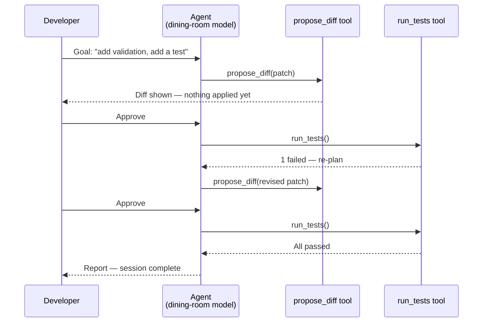

### The opt-in fast path

An opt-in `auto-apply-with-rollback` mode exists for teams that want it. But every step is still
recorded, so a whole session reverts atomically if a later step fails. The intern still can't
merge without earned trust — and even then, every commit is a revertible unit.

### New problem

Review-before-apply stops a *bad idea* from landing. It does nothing to stop a *dangerous string*
from landing — a human skimming a diff for logic doesn't reliably notice one line quietly
containing a real, live-looking API key.

### Say this in an interview

> "Agent mode is a bounded tool-use loop, not an open shell — read, propose, test, re-plan,
> report. By default nothing touches disk without human approval per diff, because reasoning well
> most of the time isn't the same as being safe unreviewed."

---

## Chapter 9 — The suggestion that quietly contains a real API key

### The security engineer's flag

A security engineer flags a ghost-text suggestion — shown, never accepted — that contains a
string in the exact shape of a real cloud-provider API key, reproduced from something the model
saw in training. "Never accepted" doesn't matter here: a screenshot of that moment is a headline.
CodeCove has zero systematic protection against it happening again, on any tier.

### Can we just tell the model not to output secrets?

No. A model can't be instructed into perfect reliability on a zero-tolerance requirement. The
only dependable fix is a separate, deterministic check on every output.

### The fix, a new analogy

**Airport security scanning every bag, no matter which gate** — fast drive-thru or slow dining
room. Before any suggestion reaches the editor, a synchronous, blocking scan checks:

- Does it match a known secret-token shape?
- Does it match a known dangerous pattern — string-concatenated SQL, disabled TLS, weak crypto?

This is exactly the gate real Copilot tooling ships: secret scanning/push protection plus a
security-review-style pass.

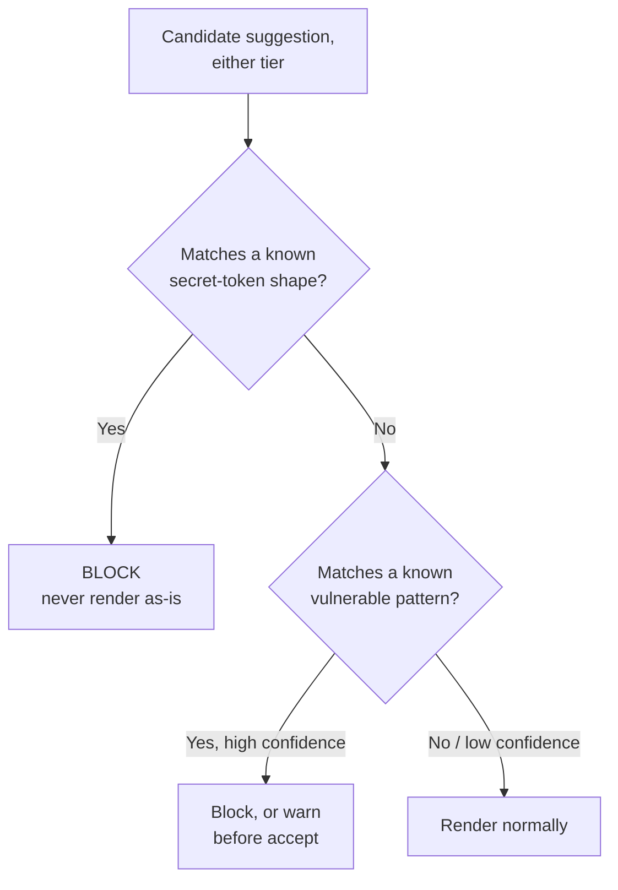

### Two tolerances, stated out loud

| Finding | Response | Tolerance |
|---|---|---|
| Suspected **secret** | Block, always | Zero tolerance for false negatives — never "show with a warning" |
| Suspected **vulnerable pattern** | Often warn, let a human decide | Some flagged patterns are legitimate in context |

This gate is defense-in-depth, not a replacement for CI-time scanning.

### New problem

The scanner catches a stranger's leaked secret. It says nothing about whether *this customer's
own* proprietary code stays safe from crossing into another customer's suggestions or training
data — a different kind of leak entirely.

### Say this in an interview

> "This gate is synchronous, blocking, on 100% of outputs from either tier — the one place 'skip
> it for latency' is never acceptable. Secrets get zero tolerance; vulnerable patterns get
> warn-and-let-a-human-decide, on purpose."

---

## Chapter 10 — The mailbox with no lock on it

### The load test that proved the fear right

Second enterprise customer, a direct competitor of the first. The vector index is one shared
table, filtered by `WHERE tenant_id = ?` in application code. A load test proves the fear right:

- A retry path drops the filter.
- For **four minutes**, Customer B's chat queries retrieve chunks from Customer A's proprietary
  billing code.
- Nothing was *shown* to a human — but being *retrievable at all* is the kind of finding that ends
  a contract on disclosure alone.

### Isn't `WHERE tenant_id = ?` supposed to prevent this?

Only if every code path remembers it, forever — including retries, caches, and every future
engineer who touches the query. An application-code filter is one mistake away from silently
missing.

### The fix, a new analogy

**An apartment building with a locked mailbox per unit**, not a shared mail room trusting a
clerk. `tenant_id` (and `repo_id`) becomes part of the storage **namespace/partition key**,
enforced at the storage layer. The wrong mailbox simply doesn't open with your key — missing
filter or not.

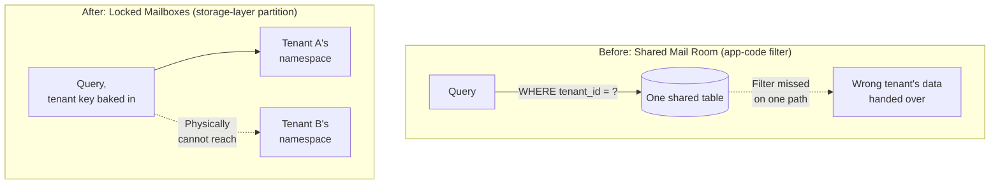

### Paired policy

- Enterprise/org repos are, by contractual default, **excluded** from training any shared model.
- Any per-tenant fine-tuning stays scoped to that tenant's own served model — never mixed into a
  shared base.
- Regulated prospects get an **on-prem/VPC** option: code and embeddings never leave their
  network.

### New problem

Every mechanism so far — cancellation, FIM, retrieval, indexing, routing, the gate, isolation —
was solved one at a time. The real test is all of them holding up *simultaneously*, under real
load, for the first time.

### Say this in an interview

> "Tenant isolation has to live at the storage/namespace layer, not an application-level `WHERE`
> clause — a filter is one missed code path from a leak; a locked mailbox physically can't open
> with the wrong key. Pair it with a no-train-on-enterprise-code default and an on-prem option."

---

## Chapter 11 — The morning 2 million developers show up at once

### Launch morning

CodeCove lands a license covering **2,000,000 developers**. Launch morning:

- ~20% are concurrently active → 400,000 developers typing at once.
- At ~0.5 requests fired per active developer per second, that's **200,000 QPS** hitting the
  drive-thru window.
- The fleet, sized for the old customer base, falls over in minutes.

### The trap: which number do you provision for?

Should you provision for the 200,000 QPS **fired**, or the smaller number that actually
**renders**?

- Roughly **65-70%** of fired requests get cancelled server-side before finishing — Chapter 3
  working exactly as designed.
- Only **~64,000 QPS** ever render.
- But the kitchen still has to **start** cooking all 200,000 QPS before any of it can be told to
  stop.
- Provisioning for 64,000 is exactly what fell over.

### The fix

Provision for requests **fired**, not **rendered**:

- "Staff the kitchen for every order that walks in, even the cancelled ones" — a hard capacity
  rule.
- Layer a **circuit breaker** on top: past a queue-depth threshold, fail open (no suggestion)
  rather than queue past budget.

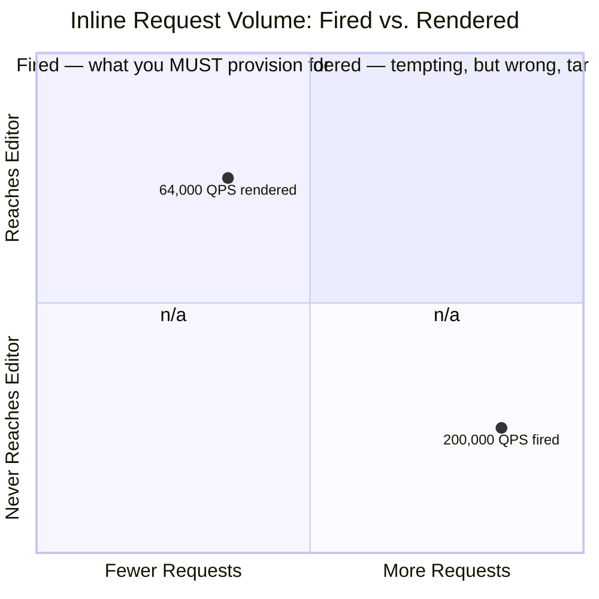

### The analogy holds

A revolving door that loses power doesn't lock people out — it stops spinning, and people push it
open manually. CodeCove's breaker works the same way: trip it, and the editor shows no ghost text,
exactly as if the assistant were off. Losing the assistant never means losing the editor.

### Where this all lands

| Mechanism | What it protects |
|---|---|
| Debounce / cancellation | Bounds fast-tier work |
| Two-tier routing | Splits completion from reasoning |
| Vector index + incremental re-embedding | Keeps context fresh without a full re-scan |
| Security gate + storage-layer isolation | Keeps outputs safe and tenants walled off |
| Provisioning for fired requests + fail-open | Keeps the stack standing on launch morning |

This is the real system.

### Say this in an interview

> "The number that matters for capacity is requests fired, not rendered — cancellation saves
> finishing wasted work, not starting it. The fast path always fails open: no suggestion beats a
> stale one, and a stale one beats a frozen editor."

---

## Where the story actually lands


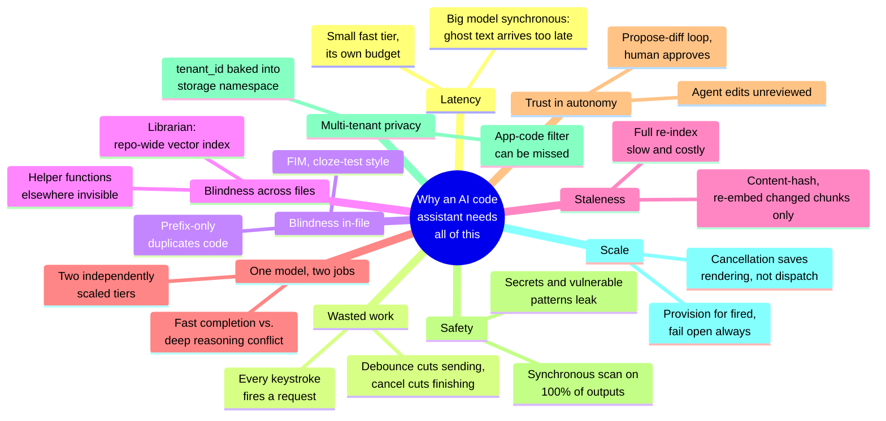

Every real production code assistant sits somewhere on this chain. The skill isn't reciting all
eleven chapters — it's stopping where the requirements say to stop.

- A single-player, local tool might reasonably stop around Chapter 4 or 5.
- A multi-tenant SaaS product has to reach Chapters 9, 10, and 11.
- If nobody's mentioned agent mode, walking to Chapter 8 unprompted reads as padding, not depth.

---

## Grill me — adversarial follow-ups

**Q1: "Why not always use the small, fast model — for chat and agent too?"**

Chat and agent need to reason across files and use tools correctly, and a small distilled model
measurably underperforms there. It was shrunk specifically to be fast at short, local predictions
— a different skill from depth. You'd get fast, wrong answers instead of slower, right ones.

**Q2: "Why not always use the large model everywhere — simpler architecture?"**

It can't hit 100ms at 200,000 QPS without a GPU fleet sized for the wrong problem. You'd be
provisioning your most expensive compute for the highest-volume, lowest-value-per-request
traffic, and every suggestion renders after the developer's already typed past it.

**Q3: "Debounce already stops most bad requests — why also cancel server-side?"**

Debounce only protects the moment before sending; it can't reach a request that already left. A
developer who pauses, triggers a request, then resumes before the reply produces exactly this
case, and only an explicit cancellation token stops the GPU work.

**Q4: "If FIM already stops duplicate code, why also need a vector index?"**

FIM only sees inside one open file. A helper in a file the developer doesn't have open is
invisible no matter how good the prefix/suffix split is — a completely separate blindness only a
repo-wide index fixes.

**Q5: "Why re-embed on save instead of on every keystroke for max freshness?"**

Mid-edit code is often syntactically invalid, so keystroke-level re-embedding is mostly wasted
work on garbage input, at enormous cost relative to benefit. Save-triggered, hash-scoped
re-embedding gets seconds-to-minutes freshness for a fraction of that cost.

**Q6: "Doesn't pausing for human approval on every diff defeat the point of an autonomous agent?"**

The point of the agent is doing multi-file reasoning and drafting automatically; the point of the
pause is making sure a wrong change never lands unreviewed. Skipping the pause is opt-in, once a
team's earned that trust — and even then, every step is recorded so a bad session rolls back
atomically.

**Q7: "Vulnerability false positives are annoying — won't developers just disable the gate?"**

That's exactly why secrets and vulnerabilities get different tolerances: secrets are always
blocked, zero tolerance. Vulnerable patterns are often just a warning, precisely to keep the
false-positive rate low enough that nobody learns to ignore or disable the whole gate.

**Q8: "Isn't `WHERE tenant_id = ?` good enough if the code is reviewed carefully?"**

It's good enough until exactly one path — a retry, a cache, a future one-line change — forgets it,
and then it silently isn't. Baking the tenant key into the storage namespace means no code path
can physically retrieve the wrong tenant's data, missed filter or not.

**Q9: "Provisioning for 200,000 QPS fired when only 64,000 render — isn't that wasteful?"**

It looks wasteful until you remember cancellation only stops a request from finishing, not from
starting — the model's already generating tokens before a newer keystroke could cancel it.
Under-provisioning for the rendered number is exactly what took the fast tier down at launch.

**Q10: "Given all this, if someone says 'design a code assistant' cold, where do you start?"**

Ask the two questions that decide everything downstream:

1. Single-player/local, or multi-tenant SaaS across many private repos?
2. Is agent mode actually in scope, or just completion and chat?

Then walk forward only as far as those answers require. The two-tier split and the security gate
are close to non-negotiable. Agent mode and on-prem are things you earn by naming a requirement.

---

## Cheat sheet — one line per stop on the story

| Stop | One-line summary |
|---|---|
| **One big model, synchronous** | Wrong model for a 100ms job — the reason a separate fast tier exists. |
| **Debounce** | Wait for a typing pause before sending — kills most wasted requests before they're sent. |
| **Server-side cancellation** | Abort a request already cooking the instant it's superseded — debounce alone can't catch what already left. |
| **Fill-in-the-middle (FIM)** | Prefix + suffix, cloze-test style — fixes blindness to code already written after the cursor, within one file. |
| **Repo-wide vector index** | A librarian who retrieves by meaning — fixes blindness to code in files that were never open. |
| **Content-hash incremental re-embedding** | Sticky notes only on changed pages — fresh in seconds-to-minutes without a costly full re-scan. |
| **Two-tier model routing** | Drive-thru for inline, dining room for chat/agent — never let one model own both latency budgets; scale the fleets independently. |
| **Agent mode as a propose-diff loop** | Read, propose, test, re-plan, report — a junior engineer who drafts a PR, never merges without approval by default. |
| **Security gate** | Airport security on every bag from every gate — synchronous, 100% of outputs, zero tolerance for secrets, warn-and-decide for vulnerable patterns. |
| **Storage-layer tenant isolation** | Locked mailboxes, not a shared mail room with a filter — `tenant_id` belongs in the namespace key, not a `WHERE` clause. |
| **Capacity for requests fired, fail open** | Provision for what's dispatched, not what renders — show no suggestion rather than a stale one or a frozen editor. |
| **The meta-lesson** | Every fix buys one property (latency, no wasted work, in-file context, repo-wide context, freshness, reasoning depth, safe autonomy, safety, privacy, or resilience) by spending a different one — say the trade in the same breath you propose the fix. |
