# Design an IP Allowlist/Blocklist Service — The Story (narrative edition)

## What this file is

The reference file, `46-Design-an-IP-Allowlist-Blocklist-Service-FAANG-Guide.md`, is the one to recite from. It has the requirements, the API shapes, every trade-off table, and the master cheat sheet.

This file is a second way into the same material. It tells the same story in plain language, as one continuous narrative.

Here's the setup. Engineers at a company keep hitting a wall. They patch it. The patch creates the next wall. This repeats until the team lands on the exact same design the reference file documents.

The company is **Anchorly** — a fictional B2B SaaS that sells enterprise access-control gateways. Its customers use it to restrict who can hit their admin dashboards and APIs.

Anchorly itself is made up. But every wall it hits, and every fix it reaches for, is something a real, named system actually does:

- **CIDR-based IP range matching** — a standard networking technique.
- **Trie-based longest-prefix-match** — the way routers and firewalls have done it for decades.
- **Cloudflare's edge firewall** — which matches IP/CIDR rules at global scale.
- **AWS Security Groups and WAF IP sets** — a documented, real feature for CIDR-based allow/deny.
- **Government sanctions feeds** (like OFAC's SDN list) — a well-documented category of data source that is slow, rate-limited, and outside anyone's control.

I'll say clearly, every time, whether a number is a documented fact or just a reasonable stand-in — tagged `[illustrative]`.

## The trigger phrases for this topic

Watch for these phrases in an interview — they signal this exact problem:

- *"We block or allow traffic by IP or CIDR range."*
- *"The list comes from a government or regulatory body we don't control."*
- *"The source is slow and unreliable, but we still need an answer in milliseconds."*

Keep one sentence in your head as you read everything below:

> **The slow, external, rate-limited job of keeping the list up to date has to be a completely different system from the fast, internal, all-local job of answering "is this IP allowed right now" — and the second one must never wait on the first.**

Everything that follows is just this one idea, arrived at the hard way — one broken assumption at a time.

---

## Chapter 1 — The list that grew legs

### The starting point

It's early days at Anchorly. A customer configures which IPs are allowed to hit their admin API. The check is about as simple as it gets:

- An array of exact IP strings, stored as a JSON blob.
- Looped over on every single request: `for ip in allowlist: if request_ip == ip: allow`.

One of Anchorly's first big customers is a bank we'll call **Meridian**. They start with 40 registered IPs. Fine. Fast. Nobody thinks about it again.

### Three years later

Meridian now has 4,000 employees, many of them remote. Anchorly's only way to grant access is still "add this exact IP." So every new hire, every employee whose home internet provider rotates their address, and every new office becomes a support ticket — each one ending with one more string appended to Meridian's array.

Here's where that leaves things:

| Metric | Value |
|---|---|
| Meridian's allowlist size | 3,800 entries |
| Meridian's traffic | 220 requests/sec |
| Anchorly's latency budget for this check | under 5ms |
| Measured p99 latency at 3,800 entries | **24ms** `[illustrative]` |
| Budget overrun | ~5x |

That 24ms is just for the linear scan — before the rest of the request even starts.

Then a product launch doubles Meridian's request rate to 440/sec. CPU on the shared gateway pool spikes, and **2% of Meridian's requests start timing out** during the peak ten minutes.

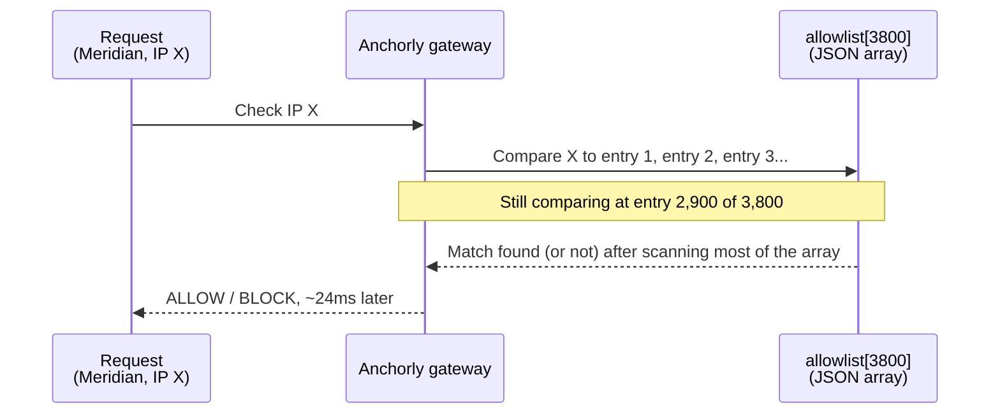

### Why does this get slower as the list grows?

A plain array scan is **O(n)**. Every entry costs one more comparison. There's no shortcut, no index — nothing smarter than "read the next one."

### The fix: swap the array for a hash set

Think of it like the difference between reading a phone book page by page versus looking up a name by its index. A hash set turns "compare against every entry" into "jump straight to the one bucket that entry would live in."

Lookup drops from O(n) to effectively **O(1)**, regardless of list size.

### The new problem, within the same week

A hash set is **exact-match only**. It can tell you "is this precise IP in the set." It cannot tell you "is this IP inside this /24 office network" — and that's actually what customers want.

Meridian doesn't want to register 4,000 individual employee IPs. They want to register "our office network" and "our VPN's exit range" as single entries. The hash set solves the speed problem, but for the wrong shape of data.

### How I'd say this in an interview

"A linear scan over a growing list is the first thing that breaks, and the textbook fix is a hash set for O(1) exact-match lookup. But that only works if you're matching exact IPs — the moment customers want to allow a whole network range instead of one address at a time, a hash set stops being the right tool entirely."

---

## Chapter 2 — The badge that works for the whole building

### The fix: CIDR ranges

Let customers register **CIDR ranges** instead of individual IPs. For example, `203.0.113.0/24` covers all 256 addresses in Meridian's office network in one entry.

Meridian collapses their list:

| Before | After |
|---|---|
| 3,800 exact IPs | 40 CIDR ranges (one per office, VPN exit block, and cloud NAT gateway) |

That's roughly a **95x reduction** in list size. The DHCP-churn ticket flow (employees' home IPs rotating) mostly disappears too, because most employees now route through a company VPN range instead of registering their personal IP.

### The analogy

A CIDR range is like an access badge that works for an entire building floor instead of one that only opens a single office door. Register the floor once, and everyone on it is covered — no matter which desk they're sitting at today.

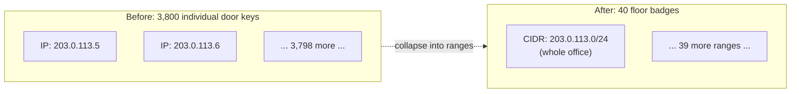

### The catch

This works beautifully for Meridian's own list. But checking "does this range contain that IP" isn't a hash lookup anymore.

- It's **bit math**: compute the network address, compare against the range.
- That math has to run against **every range**, one at a time, because ranges can't be hashed the way exact values can.

On top of that, Anchorly's security team wants a **shared, platform-wide** blocklist too — known VPN providers, Tor exit nodes, and data-center ASNs that get abused for credential stuffing. This list is checked on *every* request for *every one* of Anchorly's ~1,200 customers, not just Meridian's own list.

Ops keeps adding newly-discovered bad ranges to this shared list. Over 18 months it grows to **46,000 CIDR ranges.**

### The numbers get worse

At Anchorly's total peak traffic — 8,000 requests/sec across all customers — running a naive per-range loop against 46,000 entries for the shared blocklist alone measures p99 latency of **12ms** `[illustrative]` for this one check. That's on top of whatever each customer's own smaller list costs.

The 5ms internal budget is blown again — by a wider margin than Chapter 1.

### How I'd say this in an interview

"CIDR ranges fix the 'one badge per range instead of per address' problem, and it's a huge win for list size. But you've traded an O(1) exact-match problem for an O(n) range-match problem, because you can't hash a range the same way — and once that list is shared platform-wide instead of per-customer, it grows fast enough that the linear scan itself becomes the bottleneck again."

---

## Chapter 3 — Twenty questions, walking one branch at a time

### Why "make the hash set smarter" doesn't work

The data is genuinely **ranges**, not points. IPv4 alone has 4.3 billion addresses. You cannot — and should not — enumerate every address in a /16 into a set just to hash it.

### The fix: a binary trie over the IP's bits

This is a **Patricia/radix trie**, used for **longest-prefix-match**. It's exactly the structure real routers and firewalls have used for this exact problem for decades. It's the same mechanism behind:

- Cloudflare's edge firewall, matching IP/CIDR rules at global scale.
- AWS Security Groups and WAF IP sets — documented, real features built on this same idea.

### The analogy — worth keeping for the rest of this story

Think of it as **twenty questions, but each question is one bit of the address**. You only ever walk down one branch of the tree, bit by bit, from the root.

- Every branch you pass that has a rule attached, you remember as "the best match so far."
- When you run out of bits, whichever remembered match was **most specific** — the longest chain of correct bits — wins.

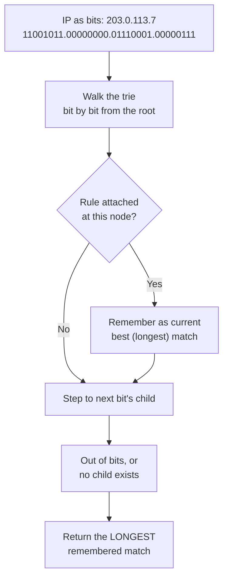

### Why "longest" has to win

Here's a concrete case where two rules disagree:

1. The shared blocklist has `203.0.0.0/16` tagged `BLOCK` — a whole data-center ASN flagged for abuse.
2. Meridian's own cloud NAT gateway, `203.0.113.0/24`, happens to sit inside that exact /16.
3. Meridian has that /24 explicitly allowed on their own list.

A plain scan gives no principled way to decide which rule wins when two overlapping ranges disagree. The trie walk naturally returns the **more specific** one, so Meridian's carve-out correctly beats the broader block.

### The IPv6 beat — worth raising before anyone asks

The same trie works for IPv6, just walking 128 bits instead of 32.

Several of Anchorly's newer enterprise customers run cloud NAT gateways that are **IPv6-only**. An IPv4-only trie would silently leave every one of their requests unmatched — not erroring, just quietly falling through to whatever the "no match" default is. That's a much scarier failure than a loud one.

### Sizing check

| Item | Value |
|---|---|
| Ranges compiled into the trie | 46,000 |
| Resulting trie size | a few hundred thousand nodes — low single-digit megabytes |
| Fits in memory? | Comfortably, on every server |
| Lookup cost | Bounded by IP bit-length (32 or 128), not list size — microseconds, not milliseconds |
| The 12ms check from Chapter 2 drops to | **under 1ms** `[illustrative]` |

### New problem — the real pivot of this whole story

The *structure* is now solved. But Anchorly is about to launch a payments feature, and compliance drops a new requirement that has nothing to do with structure at all:

> *"Screen every transaction's IP against the government's list of sanctioned-country IP ranges."*

That list isn't Anchorly's. Anchorly can't move faster than the government publishes it, can't call it more often than it allows, and can't make it more reliable than it is.

### How I'd say this in an interview

"CIDR ranges need a prefix trie for longest-prefix-match, not a hash set and not a linear scan — it's the same structure routers, Cloudflare's edge firewall, and AWS WAF IP sets all use, and it naturally resolves overlapping ranges by letting the most specific one win. That solves the shape of the data. The much harder problem is next: what do you do when the data itself comes from a source you don't control and can't make faster?"

---

## Chapter 4 — The ministry doesn't do webhooks

### The naive first move

When a payment request comes in, call the government's sanctions API directly, synchronously, to check the IP right then. It looks like it should just work — it's "one more API call," same shape as any other dependency.

### The math that kills it

| Fact | Value |
|---|---|
| Ranges in the government feed | ~500,000 `[illustrative]` |
| Government API rate limit | 10 requests/minute (a real, common constraint for this class of regulatory data portal — the exact number is a stand-in) |
| Anchorly's target screening scale | 300,000 requests/sec `[illustrative]` |
| Rate limit converted to req/sec | 10/min ≈ **0.17 req/sec** |
| Gap between what's needed and what's allowed | ~**1.8 million times** |

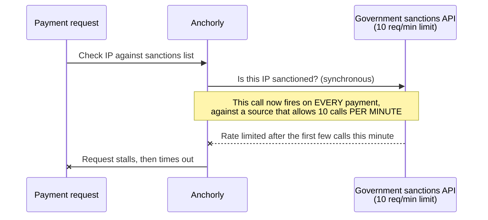

### What actually happens during soft launch

The break is immediate and dramatic:

- Checkout endpoint p99 latency goes from a normal ~40ms to **over 30 seconds.**
- Then requests start timing out outright.
- Within the hour, the sanctions-feed vendor's own ops team emails Anchorly, asking why they're being hit with thousands of calls a minute against a 10-per-minute limit.
- They warn that continued abuse will get the API key revoked entirely.

### The obvious next question

*Isn't this just a slow dependency — can't a cache fix it?* That's the next thing every engineer reaches for. It's a reasonable instinct — it's just not enough on its own, as the next chapter shows.

### How I'd say this in an interview

"Calling a rate-limited external source synchronously, per request, isn't just slow — it's capacity-bounded by someone else's quota, and the gap here is about six orders of magnitude. No amount of 'let's just make the call faster' closes a gap that size; the call has to come out of the request path entirely."

---

## Chapter 5 — The cache that still calls home for strangers

### The next fix everyone reaches for: cache-aside

- Cache hit → answer instantly.
- Cache miss → call the government API once, populate the cache, move on.

This is the standard cache-aside pattern that solves most "slow external dependency" problems. It looks like it should solve this one too.

### It doesn't — for two reasons, on the same bad day

**Reason 1: the thundering herd.**

A credential-stuffing bot wave hits Anchorly's checkout endpoint from IPs in a fresh /20 block nobody has ever seen before.

| Step | What happens |
|---|---|
| 1 | Every one of those IPs is a cache miss — **1,400 concurrent misses in the same second** `[illustrative]` |
| 2 | Every miss fires its own synchronous call to the government API |
| 3 | That's ~**140x** the 10-requests/minute limit, blown through in one second |
| 4 | The API key gets throttled or banned for the next hour, on top of the timeouts from Chapter 4 |

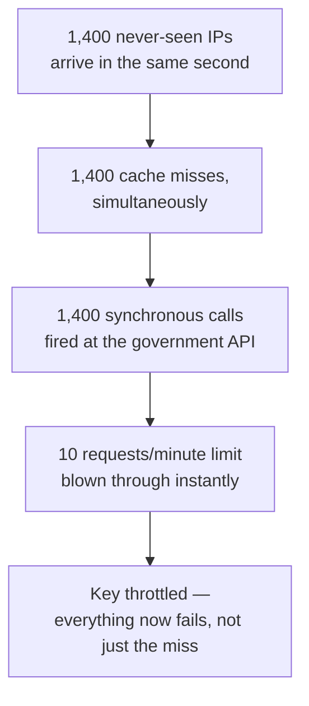

**Reason 2: the unseen-IP gap — quieter, but worse for a compliance system.**

A lazy, request-driven cache only ever learns about an IP **after** someone has actually sent a request from it. Any sanctioned IP that hasn't shown up yet is invisibly "unknown."

For a sanctions block-list, you need to know an IP is sanctioned **before** the first request arrives from it, not after the fact. The whole point of screening is defeated if the very first request from a bad actor is the one that "teaches" the cache what it is.

### How I'd say this in an interview

"Cache-aside is the trap here, and it's a good trap because it looks like the right pattern from every other slow-dependency problem. It breaks for two reasons specific to this one: a burst of never-before-seen IPs still fires a thundering herd of calls at the exact rate limit that broke the naive version, and a lazily-populated cache has no way to know an IP is sanctioned until someone has already requested from it — which is backwards for a block-list."

---

## Chapter 6 — One archivist, one noticeboard

### The real fix: stop treating this as a caching problem

Split the system into two pieces that never talk to each other on the request path:

1. **One small, dedicated ingestion pipeline.** This is the *only* thing in all of Anchorly that ever calls the government API — on its own schedule, respecting the rate limit. It pulls the full list, builds a compiled, versioned snapshot (the same trie structure from Chapter 3), and publishes it to Anchorly's own internal storage.
2. **Every payment-checking server** reads *that* snapshot — never the government, never a peer server's cache.

### The analogy — keep this for the rest of the story

Picture one licensed archivist who has the only visitor badge into the ministry's records office.

- They go in on a schedule, photocopy the pages.
- They pin dated, numbered copies to a public **noticeboard** back at Anchorly.
- Every other server just walks past the noticeboard and reads whatever's currently pinned up.
- Nobody else ever gets a badge into the records office. There's no reason to — every additional badge-holder would just be another way to accidentally get the whole office banned.

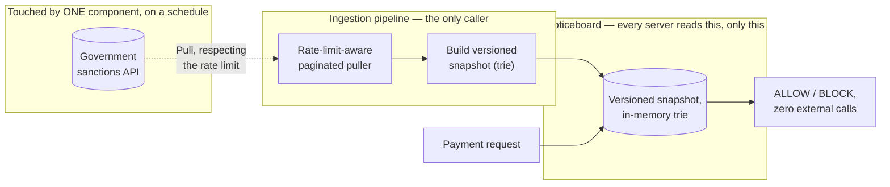

### Why this kills both of Chapter 5's problems

- **No thundering herd**: no request ever triggers a call to the government.
- **No unseen-IP gap**: the archivist pulls the **entire** list proactively — not just IPs someone happened to ask about.

### The new problem

The archivist only has one visitor badge, and the ministry only allows 10 visits a minute. How often can they realistically go back for a fresh stack of papers? And how stale does the noticeboard get in between trips?

### How I'd say this in an interview

"The fix isn't a better cache, it's decoupling entirely — one component owns talking to the slow external source, on its own schedule, and everyone else reads a versioned snapshot that component publishes to infrastructure Anchorly owns. That single split is what makes the request path immune to the government API's rate limit and downtime at the same time."

---

## Chapter 7 — How many trips can the archivist make

### Sizing the snapshot

Numbers, worked the same way the reference guide does it.

| Fact | Value |
|---|---|
| Ranges in the government feed | 500,000 |
| Bytes per entry (start IP, prefix length, decision code, source rule id, overhead) | ~40 bytes |
| Raw snapshot size | ~**20 MB** |

Trivial to hold fully in memory on every server. The hard part was never "does it fit."

### How long does a full pull take?

| Fact | Value |
|---|---|
| Rate limit | 10 requests/minute |
| Rows per page | 1,000 |
| Pages needed for 500,000 rows | 500 pages |
| Pages pullable per minute | 10 |
| Time for one complete refresh | 500 ÷ 10 = **50 minutes** |

That's 50 minutes even running as a dedicated background job with nothing else competing for that quota. This 50-minute number is what makes Chapter 4's "just call it per request" obviously impossible — before you even get to the QPS math.

### What if delta pulls exist?

If the ministry supports **delta pulls** ("give me changes since timestamp X") instead of always a full dump, the picture changes a lot.

| Fact | Value |
|---|---|
| Illustrative daily change volume | 2,000 changed ranges/day |
| Pages needed for that | 2 pages |
| Time to pull | ~**12 seconds** |

Delta support turns "refresh a few times a day" into "refresh hourly, or more, for almost free against the rate-limit budget."

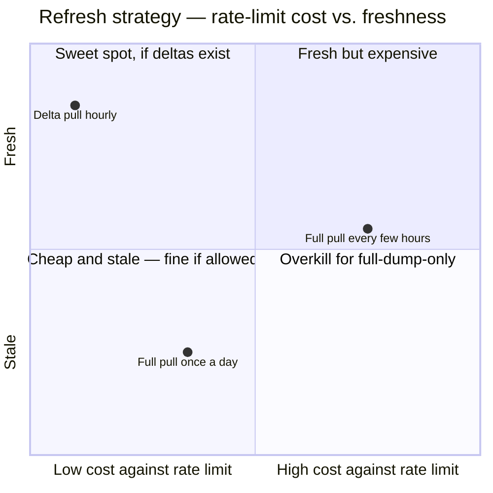

### The rule that falls out of this

Refresh cadence is bounded by what the *source* can sustain, not by how fresh Anchorly would like the data to be.

Push the archivist to pull too aggressively, and the realistic outcome isn't fresher data — it's a throttled or revoked API key. That's a self-inflicted, total outage of the freshness pipeline, not a performance tweak.

### How I'd say this in an interview

"Compute the pull time from the source's own rate limit, page size, and dataset size — don't just assert a refresh interval. At 10 requests a minute and 500,000 rows, a full pull costs about 50 minutes; if delta pulls exist, that same freshness costs seconds instead, which is the whole argument for asking the source, upfront, whether they support incremental queries."

---

## Chapter 8 — The new server that inherits an empty desk

### The new problem — unrelated to freshness

Anchorly deploys a routine update. 40 payment-checking servers restart at roughly the same time. Each one boots with nothing: no trie, no snapshot, nothing loaded yet.

What happens to a payment request that arrives in that gap?

### Two bad options

1. **Error every request** until the first snapshot loads — a self-inflicted outage during every deploy.
2. **Silently default to "allow everything"** until data shows up — worse. For a sanctions screen, this means every deploy opens a real, if brief, window where sanctioned traffic passes through completely unchecked.

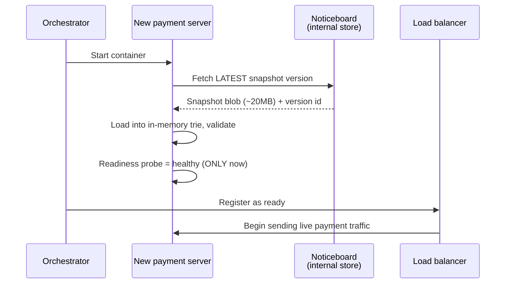

### The fix

Every server's boot sequence fetches the **latest known-good snapshot** from the noticeboard first. The readiness probe depends on that load actually succeeding — not on the process simply having started.

Two guarantees this gives you:

- No server ever joins the traffic pool empty.
- No server calls the government API directly on boot either. If it did, "we deployed 40 servers" would turn into "the government API just got hit by 40 simultaneous pulls" — reintroducing the exact rate-limit stampede this whole design exists to avoid.

### How I'd say this in an interview

"Startup is a scaling event too — a fleet restart has to get its data the same way normal traffic does, from Anchorly's own infrastructure, never from a peer server and never from the government directly. Gate the readiness probe on 'snapshot loaded and validated,' not 'process started,' because the silent failure mode — defaulting to allow-everything — is far more dangerous than being slow to come up."

---

## Chapter 9 — When the ministry goes dark for a weekend

### The problem that separates a real design from a lucky one

The government's sanctions API goes down for **30 hours** one weekend `[illustrative — real regulatory portals do have unplanned multi-hour outages, though this exact duration is a stand-in]`. No warning, no SLA to hold anyone to.

What do Anchorly's payment servers do while it's down?

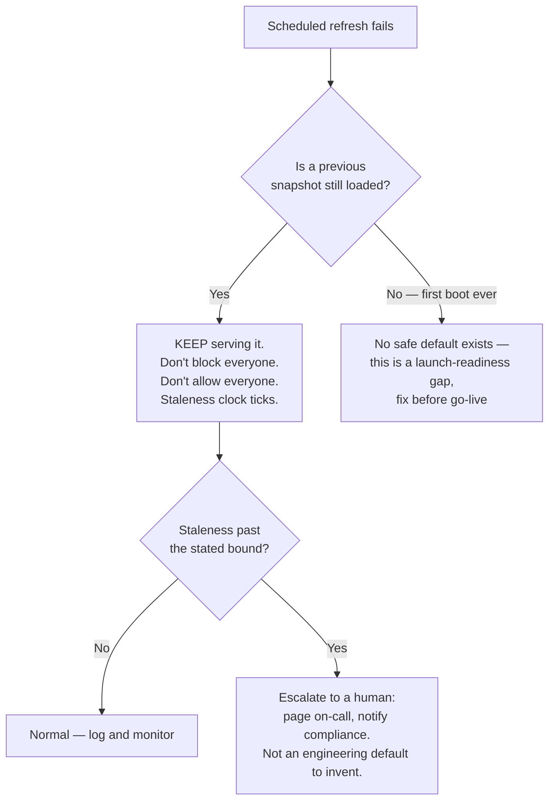

### Both obvious defaults are wrong

| Default | Why it's wrong |
|---|---|
| **Fail-open** (let every payment through) | Defeats the entire point of a sanctions screen the moment the feed hiccups. The outage window becomes exactly when a sanctioned actor could slip through undetected. |
| **Fail-closed** (block every payment) | Turns a third-party's bad weekend into a complete, self-inflicted outage of Anchorly's own payments product. The government going dark should degrade *freshness*, not *availability*. |

### The actual answer

- **Keep serving the last known-good noticeboard snapshot indefinitely.** It was correct as of a real point in time, and it remains the best available approximation of the truth.
- **Layer a staleness SLA on top.** Below some stated bound — say, 24 hours, set by legal/compliance, not invented by an engineer at 2am — this is just a normal, monitored degradation.
- **Past that bound, escalate to a human.** "Is serving 30-hour-old sanctions data still acceptable" is a policy question, not something code should decide silently.

### How I'd say this in an interview

"Default to serving the last known-good snapshot through an outage — staleness is almost always a smaller harm than a false allow-everyone or a self-inflicted block-everyone. But say out loud that 'how stale is too stale to keep serving' is a policy decision with a real, stated number, not something to leave undefined until an incident forces the question."

---

## Chapter 10 — Six noticeboards, still one archivist

### Anchorly expands to six regions for latency

The first instinct from a new engineer on the team: sync each region's cache to its neighbors, so every region has a fresh copy. It sounds reasonable. It's exactly the wrong move — for the same reason cache-to-cache sync is the wrong move anywhere in distributed systems.

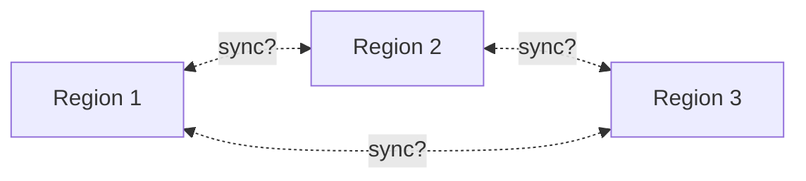

### Three concrete problems with region-to-region sync

1. **No leader.** If Region 1 updates first and pushes to the rest, Region 1 has quietly become a hidden single point of failure and bottleneck — exactly what going multi-region was supposed to avoid.
2. **Latency compounds.** Chained syncing means the last region's freshness depends on every hop before it being healthy.
3. **It doesn't touch the actual bottleneck.** The problem was never "how do regions talk to each other" — it was "how does data get from the government into many places." If each region's cache miss still falls back to calling the government directly, six regions means six times the load on a 10-requests/minute source, for zero benefit.

### The actual answer — the same noticeboard from Chapter 6, restated for six regions

Every region independently pulls the **same immutable, versioned snapshot** from Anchorly's own internal store, on its own schedule.

- No region ever syncs from another region.
- No region ever calls the government directly.

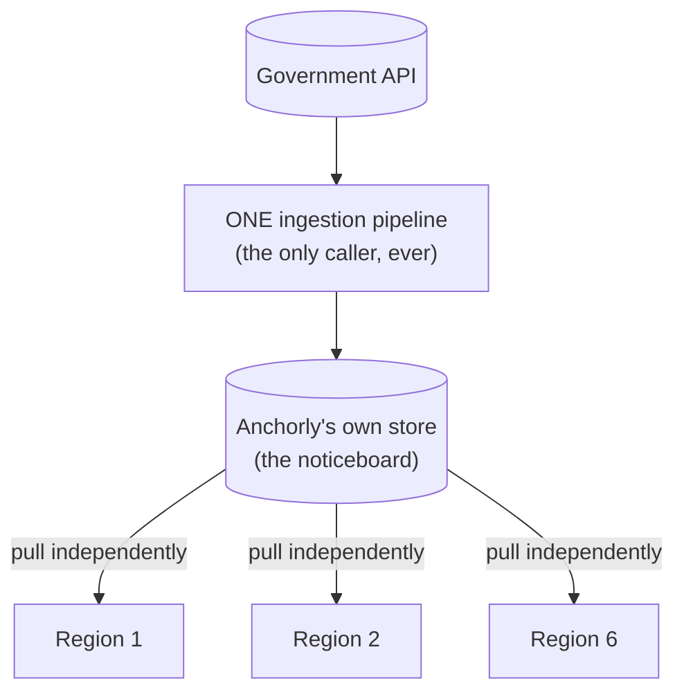

### What "consistency" means here

Consistency becomes one boring, explicit number to monitor: how far behind the newest snapshot version any given region is allowed to lag.

Example: "no region serves a snapshot more than 15 minutes older than the newest one." That's a much simpler problem than an open-ended cache-sync consistency problem with no natural leader.

### How I'd say this in an interview

"Going multi-region doesn't mean syncing N caches to each other — it means N independent readers pulling the same canonical, versioned artifact from infrastructure you own. There's no leader, no mesh, and the government API is still called exactly once per refresh cycle, from exactly one place, no matter how many regions you add."

---

## Chapter 11 — The override that can't wait for the next noticeboard

### The last problem — a business one, not a scaling one

A real, six-figure Anchorly customer's cloud NAT gateway happens to fall inside a broad `/16` the government flagged as a sanctioned data-center ASN. Every one of that customer's legitimate payments starts getting blocked.

- Support escalates within the hour.
- Waiting for the next scheduled snapshot — a minimum of the ~50-minute full-pull cost from Chapter 7, possibly hours depending on cadence — is not an acceptable answer for revenue actively being blocked right now.

### The fix: a small, separate override layer

- Manual allow/block entries, checked *before* the government-sourced snapshot.
- Most-specific-match wins — the same longest-prefix-match logic from Chapter 3, applied across both layers together.
- An ops engineer adds one override entry, and the customer's payments start flowing again in seconds — without touching the immutable, government-sourced snapshot at all.

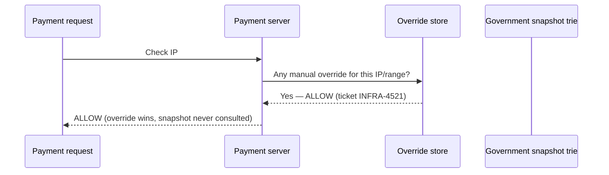

### The last piece — tying back to why any of this matters

Every decision — from the trie, or from an override — gets logged with:

- The **exact rule that matched.**
- The **exact snapshot version** it was checked against — not just a timestamp.

Why the version matters more than a timestamp: a timestamp says roughly *when*. The version id says precisely *which set of rules was live* — which is what "reproduce this decision during a compliance audit" actually needs. Re-deriving "which snapshot was active at 14:32:07" from timestamps alone falls apart across deploys, clock skew, and overlapping refresh windows.

### How I'd say this in an interview

"Overrides sit in a small, separately-audited layer checked before the government snapshot, not as edits to the snapshot itself — that keeps the government data an untouched, versioned artifact, and gives you a false-positive fix that takes seconds instead of waiting on the next refresh cycle. And every decision, override or not, needs to carry the exact snapshot version it was checked against — that's what makes it explainable months later, not just logged."

---

## Where the story actually lands

```mermaid
flowchart LR
    A["Ch1: Linear scan<br/>list grows, gets slow"] -->|"Fixes: O(1) lookup<br/>Breaks: exact-match only"| B["Ch2: CIDR ranges"]
    B -->|"Fixes: fewer entries<br/>Breaks: range scan is O(n) again"| C["Ch3: Trie / LPM"]
    C -->|"Fixes: fast, correct overlap resolution<br/>Breaks: data now from a slow external source"| D["Ch4: Naive sync call"]
    D -->|"Fixes: nothing — 1.8M x gap<br/>Breaks: obviously impossible"| E["Ch5: Cache-aside"]
    E -->|"Fixes: nothing — thundering herd<br/>+ unseen-IP gap"| F["Ch6: Decouple ingest / serve"]
    F -->|"Fixes: request path never calls source<br/>Breaks: how often can we pull"| G["Ch7: Refresh cadence math"]
    G -->|"Fixes: real cadence number<br/>Breaks: fleet restart boots empty"| H["Ch8: Warm-start boot"]
    H -->|"Fixes: never boot empty<br/>Breaks: source goes dark for hours"| I["Ch9: Fail-open vs. fail-closed"]
    I -->|"Fixes: serve last-known-good<br/>+ staleness SLA<br/>Breaks: naive multi-region sync"| J["Ch10: N independent pulls"]
    J -->|"Fixes: no leader, no mesh<br/>Breaks: false positive can't wait for refresh"| K["Ch11: Overrides + audit"]
```

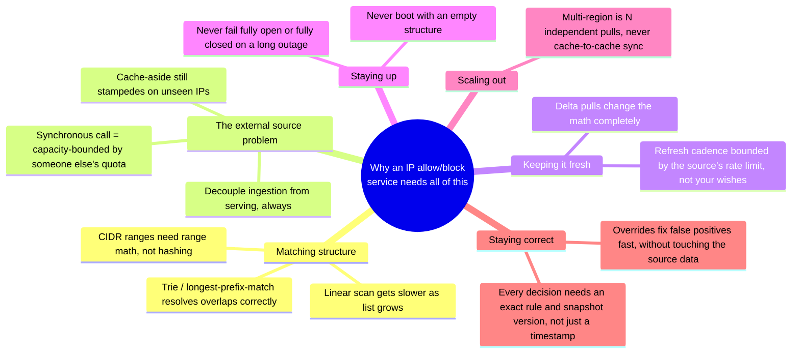

The skill isn't reciting all eleven chapters — it's knowing which one the interviewer's constraints actually demand.

- A simple per-customer allowlist might reasonably stop around Chapter 3.
- Anything involving an external regulatory feed has to reach Chapter 6 at minimum.
- A real compliance answer needs Chapter 9 and Chapter 11 too.

---

## Grill me — adversarial follow-ups

**Q1: "Why not just make the trie lookup itself faster instead of building this whole separate ingestion pipeline?"**

Because the trie was never the bottleneck once it existed — a trie lookup is already microseconds. The actual bottleneck is the government API's rate limit, and no amount of optimizing the read path changes how many times per minute you're allowed to ask an external system a question.

**Q2: "Isn't a versioned snapshot on a noticeboard just... a cache with extra steps?"**

The difference is who populates it and when. A cache is populated lazily, by requests — which is exactly what caused the unseen-IP gap in Chapter 5. A snapshot is populated proactively and completely, on a schedule, by one dedicated pipeline. It's push-the-whole-dataset, not learn-as-you-go — that's the property that actually matters for a block-list.

**Q3: "What happens if the ingestion pipeline itself crashes, not the government API?"**

Nothing happens to serving at all — that's the entire point of decoupling. Every payment server keeps answering from the last snapshot it already loaded; only freshness degrades, the same as if the government API itself were down. The two failure domains are deliberately kept separate.

**Q4: "Why not enumerate every IP in a range into a hash set instead of building a trie?"**

Because a /16 alone is 65,536 addresses, and the full published list can be hundreds of thousands of ranges. Enumerating would blow up storage for no benefit, and it still wouldn't solve overlapping ranges at different specificities the way longest-prefix-match naturally does.

**Q5: "Your fail-open/fail-closed answer is 'serve last known good' — isn't that just fail-open by another name, since sanctioned traffic from before the outage could still be flowing?"**

No — it's serving data that was true as of a real, known point in time, not fabricating a permissive default. The distinction matters: a snapshot from an hour ago reflects the actual published rules then; "allow everyone because the feed is down" reflects no rules at all. One is stale truth, the other is no truth.

**Q6: "If overrides can bypass the government snapshot, isn't that a compliance hole — someone could override away a real sanction?"**

That's exactly why overrides need their own access control, a required reason, a named approver, and full audit logging — the same rigor as the automated decisions, arguably more, since a human is making a judgment call that overrides government-sourced data. It's a deliberate, logged exception path, not an unguarded backdoor.

**Q7: "Why does refresh cadence matter if you're serving from an in-memory snapshot anyway — just refresh as often as possible?"**

Because every refresh consumes the source's own rate-limit budget, not yours. Refreshing too aggressively risks getting throttled or having the API key revoked entirely, which would take the freshness pipeline down completely — the cadence has to be bounded by what the source can sustain, computed from the numbers, not just wished for.

**Q8: "For the multi-region design, why not have Region 1 be the leader and push to the others directly — wouldn't that be faster than every region pulling independently?"**

It would shave a little latency, but it reintroduces exactly the hidden-leader problem the design exists to avoid — Region 1 becomes a single point of failure and a bottleneck for everyone else's freshness. Independent pulls from a shared store cost a bit more in aggregate pull traffic against your own infrastructure, which is cheap, in exchange for having no leader at all.

**Q9: "Given all this, if someone says 'design an IP allow/block-list service' cold, where do you start?"**

The first question that changes everything downstream is: who owns the source data, and how fast and reliable is it.

- If it's fully internal and fast, this collapses to a matching-structure problem — CIDR trie, done.
- If it's external, slow, and rate-limited — like a government feed — the entire design has to be built around decoupling ingestion from serving before anything else, because that's the one decision every other chapter here falls out of.

---

## Cheat sheet — one line per stop on the story

- **Linear scan over a growing list**: O(n) cost that gets worse as the list grows — the first thing that breaks, fixed by a hash set for exact matches only.
- **CIDR ranges**: let one entry cover a whole network instead of one IP at a time, but ranges can't be hashed the way exact values can — you're back to a scan, just over fewer, bigger entries.
- **Trie / longest-prefix-match**: the real fix for range matching at scale — same structure routers, Cloudflare's edge firewall, and AWS WAF IP sets all use; naturally resolves overlapping ranges by letting the most specific one win. Works the same for IPv4 (32 bits) and IPv6 (128 bits) — don't silently assume v4-only.
- **Calling a rate-limited external source per request**: not slow, capacity-bounded — the gap between what the source sustains and what you must serve is usually orders of magnitude, closed only by removing the call from the request path, not by optimizing it.
- **Cache-aside in front of a slow source**: looks like the standard fix, isn't — a burst of unseen IPs still stampedes the rate limit, and a lazily-populated cache can't know about a sanctioned IP before someone's already requested from it.
- **Decoupled ingestion pipeline**: one component, on a schedule, is the only thing that ever talks to the external source; it builds a versioned snapshot that every server reads locally — the actual fix, not a bigger cache.
- **Refresh cadence**: bounded by the source's own rate limit and page size, not by how fresh you'd like the data — compute the real pull time before promising a number.
- **Warm-start boot**: every server loads the latest known-good snapshot before serving anything; readiness gates on that load, never on "process started" alone — a fleet restart must never stampede the external source either.
- **Fail-open vs. fail-closed**: neither is the default — keep serving the last known-good snapshot through an outage, with a monitored staleness SLA that escalates to a human decision past a stated bound.
- **Multi-region distribution**: N independent pulls of one canonical, versioned snapshot from infrastructure you own — never cache-to-cache sync, which has no natural leader and doesn't touch where the data originates.
- **Overrides**: a small, separately-audited layer checked before the source-derived snapshot, for fixing false positives in seconds without touching the immutable government data.
- **Audit trail**: every decision logged with the exact matched rule and exact snapshot version, not just a timestamp — that's what makes a decision reproducible during a compliance review months later.
