# Design a Sanctions Watchlist Screening System — The Story (narrative edition)

> **What this file is.**
> The reference file, `47-Sanctions-Watchlist-Screening-System-FAANG-Guide.md`, is the one to
> recite from. It has the requirements, API shapes, trade-off tables, and the master cheat sheet.
>
> This file is a second way in: the same material told as one continuous story. Engineers at a
> company keep hitting a wall, patch it, and the patch creates the next wall — until we land on
> the exact design the reference file documents.
>
> The company, **RemitLane** (a small cross-border remittance startup), is fictional. But every
> wall it hits is something a real, named system or a real regulatory event actually involves:
> - OFAC's SDN list — the U.S. Treasury's real, published Specially Designated Nationals list
> - Fuzzy-matching algorithms like Levenshtein distance and Jaro-Winkler
> - Phonetic algorithms like Soundex and Metaphone
> - Real, documented sanctions settlements against BNP Paribas, HSBC, and Standard Chartered
>
> Numbers I made up for the story are flagged with `[illustrative]`.

**The trigger phrase** for this topic: *"check a payment or new customer against a government
sanctions list before letting it through."*

**One sentence to hold onto:** a sanctions screening system's whole job is to turn a messy,
misspelled, transliterated human name into a confident decision — clear it, block it, or hand it
to a person — because names never match exactly, and getting this wrong has legal, not just
quality-metric, consequences.

---

## Chapter 1 — The compliance check that called Washington on every payment

### The setup

RemitLane's first version of "compliance" is paranoid in the naive way. On every single payment,
it does two things inline:

1. Downloads OFAC's SDN list fresh (a real, government-published file of designated names and
   aliases)
2. Does a plain string comparison against it

The file is roughly **40,000 lines** of entities plus aliases `[illustrative]`. Downloading and
parsing it inline costs about **650ms** `[illustrative]`.

### Where it breaks

At 20 payments/sec, 40 workers give about 61/sec of capacity — comfortably enough. That's fine
for a while.

Ten months later, volume has grown to **150 payments/sec**. Capacity is still stuck at ~61/sec,
because nobody revisited the design. That's an **89/sec shortfall** — the system can't keep up
with 89 payments every second. Within two minutes, that shortfall piles up to roughly **10,700
stuck payments**, some of which start timing out and retrying, making the backlog worse.

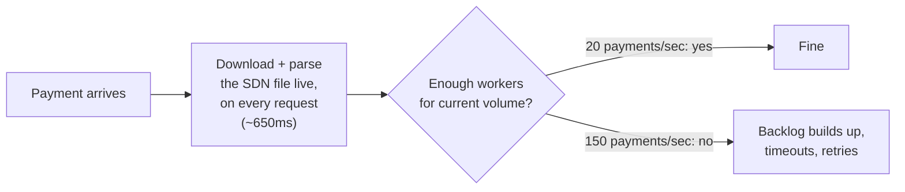

### Why it happened

The obvious question is: *why re-download and re-parse the whole list on every single request?*

Because two separate jobs got fused into one:

- **Keep our copy of the list fresh**
- **Check a name against the list**

Nobody ever split them apart. As a result, the slowest part of the first job (the network
download and parse) becomes the slowest part of the second job (a simple lookup) too.

### The fix — and the analogy for this whole story

Split the two jobs:

- **Job one** pulls the list on a schedule into a local, versioned index.
- **Job two** checks names against that local copy — no network call on the request path, ever.

Think of **a border guard with a photocopied binder**, refreshed by headquarters once a shift,
instead of phoning HQ for every single car that drives up.

### New problem

The binder is now a scheduled local copy. So what happens the day HQ stops answering the phone?

**Interview line:** "Decouple pulling the list from checking against it — the same move as any
slow external authority. Screening reads a local, versioned index; it never makes a live call on
a payment's hot path."

---

## Chapter 2 — The guard who wouldn't open the gate

### The setup

At 400 payments/sec, OFAC's file server has a bad six-hour outage `[illustrative outage length]`.

An engineer's first instinct is *fail closed*: block everything until freshness can be
guaranteed. They ship that fix.

### Where it breaks

For six hours, every single payment gets rejected. At 400 payments/sec, that's roughly **8.6
million** legitimate payments blocked — for a reason that had nothing to do with any of them.
The sanctions list itself hadn't actually changed during those six hours; only the ability to
re-download it had gone down.

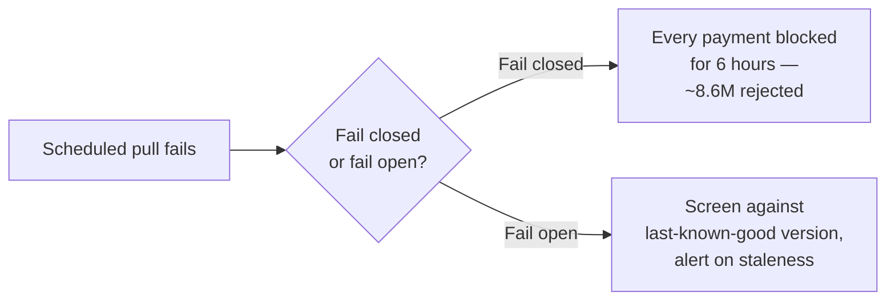

### The fix

Extend the binder analogy: **the guard keeps using yesterday's binder** rather than locking the
gate just because HQ isn't picking up the phone. A supervisor only gets flagged once staleness
crosses some defined bound.

In concrete terms: screening always runs against the last successfully-ingested version of the
list. Staleness becomes a monitored metric, not a silent risk that nobody notices.

### New problem

The guard reliably has a binder now. But nobody has checked whether the binder's matching logic —
still plain exact string comparison — actually catches anything at all.

**Interview line:** "A source outage should degrade freshness, never availability — serve the
last known-good version and alert on staleness. Failing closed on someone else's hiccup turns
their minor outage into your total outage, for zero safety gain."

---

## Chapter 3 — The wire that should have been stopped

### The test

Someone finally puts the exact-match logic under a real test. They take 200 real alias variants
pulled from OFAC's own alias field — things like "Jon Smith," "J. Smith," and various
transliterations — and check each one against the canonical form, "Smith, Jon A."

### The result

- Only **6 of 200 match exactly** — that's **3%**.
- The other **194 of 200 (97%) slip through completely undetected**.

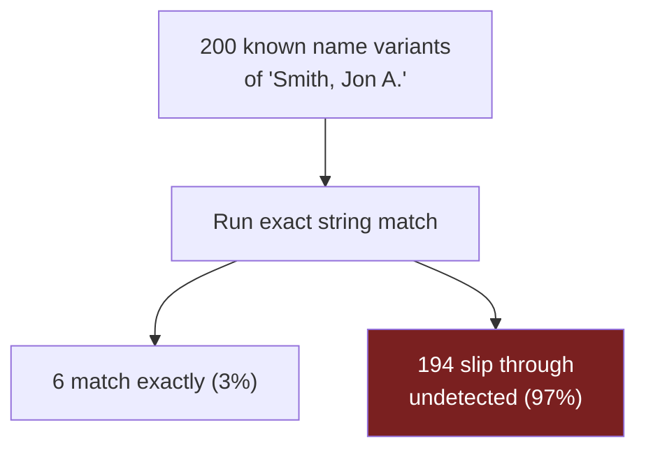

### Why this matters beyond the story

This is the same *shape* of failure that sits behind real, documented enforcement actions:

| Institution | Settlement amount | Year |
|---|---|---|
| BNP Paribas | ~$8.9 billion | 2014 |
| HSBC | ~$1.9 billion | 2012 |
| Standard Chartered | ~$1.1 billion | 2019 |

These are all real sanctions/AML settlements. RemitLane's 194-of-200 test is illustrative and is
not one of those actual cases — but it demonstrates the exact same gap that led to them.

### The fix

Replace exact match with a similarity **score**, using one of two real, documented algorithms:

- **Levenshtein distance** — counts single-character edits needed to turn one string into
  another.
- **Jaro-Winkler** — weights matching prefixes heavily; it's the standard choice for personal
  names.

Think of it as **counting typos**: "Jon Smith" is really just a two- or three-edit typo away from
"Smith, Jon A." — not some unrelated string that happens to share a few letters.

### New problem

A score isn't a decision by itself. Someone still has to say *how similar is similar enough* —
and RemitLane's first answer to that question is about to backfire.

**Interview line:** "Exact match on a legal name is close to useless — real names have
transliteration and punctuation variance that defeat it almost every time. Fuzzy similarity
scoring, Levenshtein or Jaro-Winkler, is the standard fix — but a score alone isn't a decision
yet."

---

## Chapter 4 — The single number that can't make everyone happy

### The setup

RemitLane picks the simplest possible rule: **score > 0.75 → block.**

### Where it breaks — two ways at once

Testing this single threshold surfaces two bad outcomes simultaneously:

1. **False positive.** An innocent "John Smith" scores **0.78** against "Smith, Jon A." — pure
   coincidence of a common name. Roughly **40 legitimate customers a day** get auto-blocked
   `[illustrative]`.
2. **False negative.** Meanwhile, a genuinely correct match only scores **0.82**. If you raise the
   threshold to stop annoying legitimate customers, that real hit slips through undetected
   instead.

They try lowering the threshold to 0.60 to catch more real hits — but then false blocks climb
past **90 a day**.

**No single number can serve both goals.** The binary shape of the rule is the actual flaw here —
not the specific number chosen.

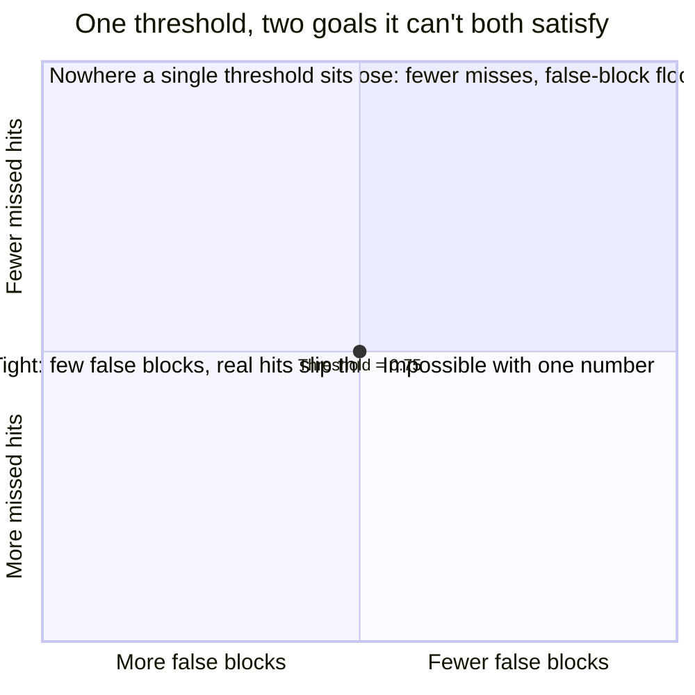

### The fix

Use two thresholds and three outcomes instead of one threshold and two outcomes:

- **Below the low threshold** → auto-clear.
- **Above the high threshold** → auto-block.
- **In between** → a human decides.

Think of **a traffic light**: green means go, red means stop, and yellow means a person looks
before anything moves — because some cases are genuinely ambiguous and no formula should
pretend otherwise.

### New problem

The yellow band needs people to staff it. But before we get to that, scoring every single name
against the whole 40,000-entry list is about to get too slow to run at all.

**Interview line:** "One threshold forces one number to serve two goals in tension. The fix is
shape, not a better number: two thresholds, three outcomes, because some scores are genuinely
ambiguous and deserve a human, not a coin flip."

---

## Chapter 5 — The library drawer that saves you from reading the whole shelf

### The math problem

At peak load — 3,000 payments/sec — one Jaro-Winkler score costs about 0.05ms `[illustrative]`.

Now do the arithmetic for scoring one incoming name against the entire list:

```
40,000 entries × 0.05ms per score ≈ 2,000ms per payment
```

That's **two full seconds** just to screen one payment. Completely unworkable at this volume.

### The fix

Narrow the field first, before running any expensive score, using cheap **blocking keys**:

- Phonetic codes — Soundex or Metaphone, both real, standard algorithms that group
  similar-sounding names together.
- First-letter and name-length buckets.

Think of **a library card catalog**: you go straight to the drawer for names that sound similar,
rather than reading every single book on the shelf to find the one you want.

### The payoff, step by step

1. Blocking keys narrow 40,000 entries down to roughly **10–50 candidates**.
2. Only those candidates get the full, expensive similarity score:
   ```
   50 candidates × 0.05ms per score ≈ 2.5ms per payment
   ```
3. Compare that to the brute-force 2,000ms from before: that's roughly an **800x
   improvement**.

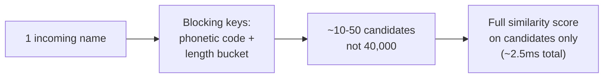

### New problem

A blocking key can miss an unusual transliteration entirely — a silent miss that happens *before*
scoring even runs. Real systems mitigate this by running more than one blocking strategy in
parallel, so a gap in one strategy doesn't silently drop a candidate.

There's a bigger problem waiting next, though: even a perfect name score, all on its own, still
confuses two unrelated people who happen to share a common name.

**Interview line:** "Never brute-force score against the full list — blocking keys turn an
O(list-size) problem into O(candidates). It's a real risk too: run more than one blocking
strategy so a miss in one doesn't silently drop a candidate."

---

## Chapter 6 — The twins test

### The problem

Roughly **60% of everything landing in the review queue** turns out to be a common-name
collision — unrelated people who simply happen to resemble a listed name `[illustrative]`.

### The fix

Stop scoring on name alone. Combine name similarity with **date of birth and country/address**
into one weighted score.

Think of it as **the twins test**: a shared name doesn't settle anything by itself — a birth
certificate does. A high name score paired with a birthdate that's decades off is almost
certainly a different person entirely.

### Worked example

**Case A — likely a real hit:**
- Name similarity: 0.86
- Date of birth: exact match
- Country: matches
- Combined score: **0.91 — confident hit**

**Case B — likely a different person:**
- Name similarity: 0.86 (same as Case A)
- Date of birth: off by 22 years
- Country: no match
- Combined score: **0.35 — likely a different person**

Same name similarity score in both cases. Wildly different combined outcome, because the other
fields tell the two people apart.

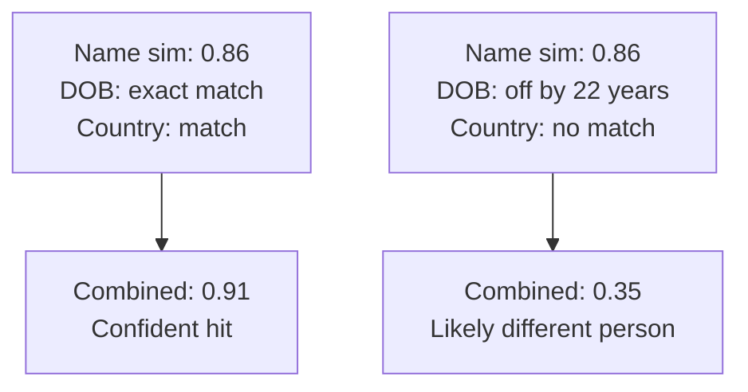

### New problem

This cuts collisions significantly, but the review queue is still huge in absolute terms. The
real driver of the low threshold isn't accuracy at all — it's an asymmetric cost that nobody has
stated out loud yet.

**Interview line:** "Never score name alone when DOB or address is available — weighting them in
sharply cuts common-name false positives, since a strong name match with a wildly mismatched
birthdate is almost certainly a different person."

---

## Chapter 7 — The smoke detector that's supposed to annoy you

### The question

Why bias the low threshold loose instead of tuning it for the fewest total mistakes overall?

### The answer: the two mistakes don't cost the same

- **A false negative** — a real hit goes through undetected. This is the legal and regulatory
  category behind BNP Paribas's ~$8.9B settlement, HSBC's ~$1.9B settlement, and Standard
  Chartered's ~$1.1B settlement.
- **A false positive** — costs one delayed payment and a few analyst-minutes to clear.

These are not the same scale of consequence. Not close.

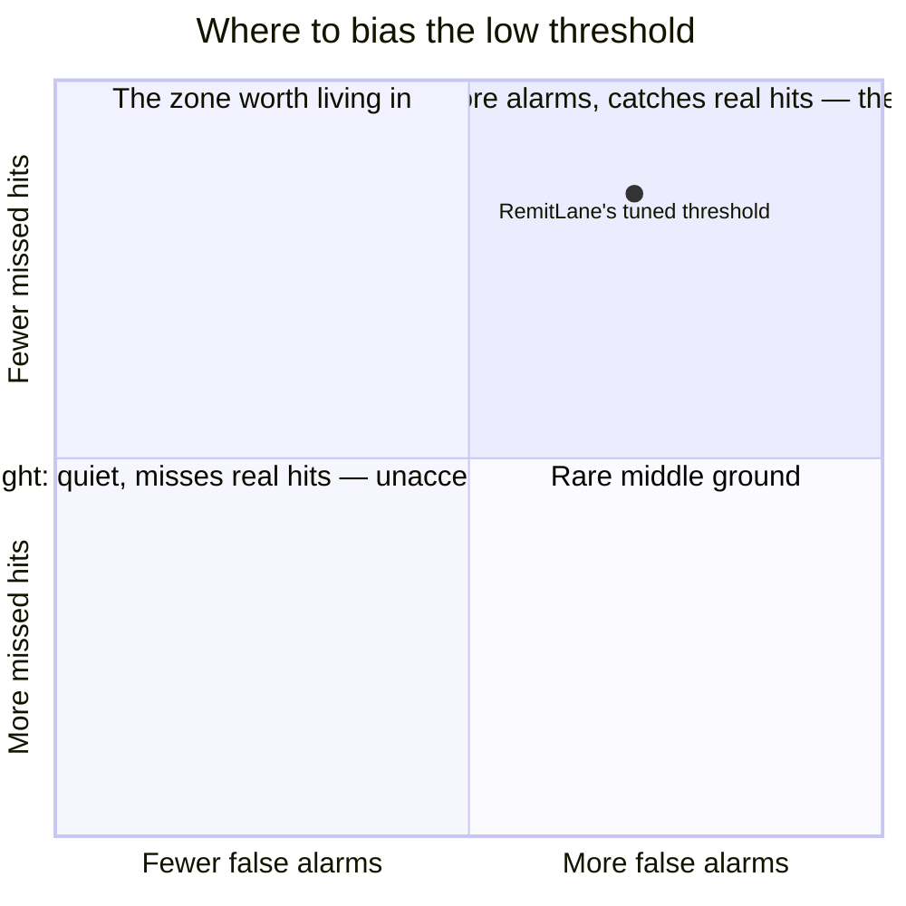

### The fix

Think of **a smoke detector**: you want it to go off at burnt toast, because a detector tuned to
never annoy you is also a detector more likely to miss a real fire.

Set the auto-clear threshold conservatively loose — biased toward routing more cases to human
review — even though that costs headcount.

### New problem

"Bias toward more review" has a real, computable price tag that nobody has actually worked out
yet.

**Interview line:** "False negatives here are legal events, false positives are delayed payments
— that asymmetry should visibly bias the low threshold loose, the same logic as tuning a smoke
detector to trip on burnt toast rather than risk missing a real fire."

---

## Chapter 8 — The waiting room nobody sized

### The numbers

At 50,000,000 payments a day, RemitLane's tuned thresholds produce roughly this split:

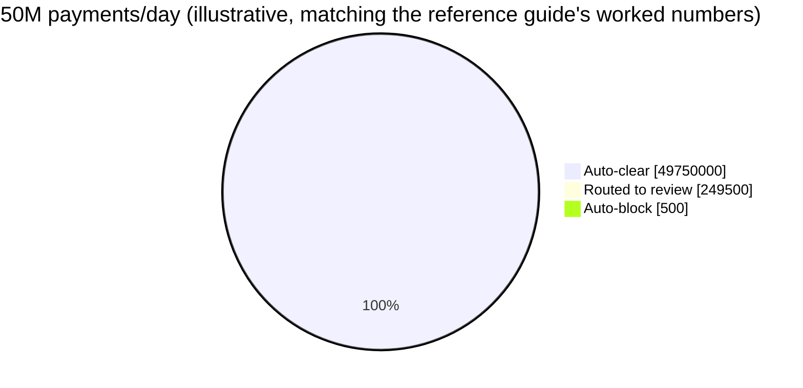

### Working out the staffing implication

The review slice is **249,500 payments a day**. At 200 reviews per analyst per day, that works
out to:

```
249,500 reviews / 200 reviews per analyst ≈ 1,250 analysts
```

That's a whole department — implied directly by a threshold choice, not by any staffing plan
anyone actually sat down and designed.

### Where it breaks

RemitLane's first review queue is a shared spreadsheet. It collapses fast, for a few reasons:

- Nothing in it has an age limit.
- Urgency is completely invisible — an urgent case looks the same as a routine one.
- Overwhelmed analysts start rubber-stamping "clear" just to keep the count down — quietly
  defeating the entire point of having a human review step at all.

### The fix

Treat the queue like **an ER triage desk**, not a first-come-first-served line:

- **Priority tiers.** A match tied to a brand-new designation, on a customer who's already
  cleared and currently active, jumps to the front of the line.
- **An SLA per tier.**
- **Headcount planned against expected volume**, not against hope.

Every resolution an analyst makes is also a labeled data point. Feed it back into threshold
tuning so the system gets smarter over time.

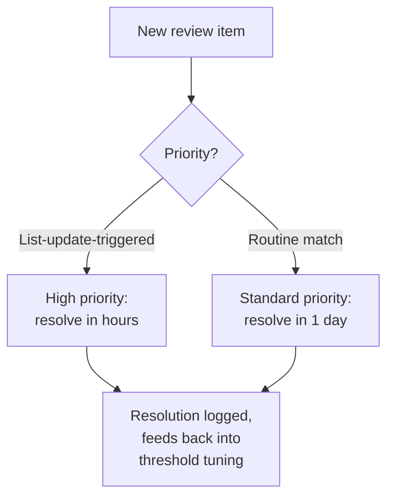

### New problem

The queue now handles *new* cases well. But what about a case that was cleared weeks ago, and a
brand-new designation just made wrong?

**Interview line:** "Review headcount is a directly computable function of the threshold — 1,250
analysts from 249,500 reviews/day at 200 each. Treat it like triage: priority tiers, an SLA, and
resolutions feeding back into tuning."

---

## Chapter 9 — The recall notice for a car that already passed inspection

### The question that exposes the gap

A compliance officer asks a simple question: *"If someone we already cleared gets sanctioned next
week, does anything re-check them?"*

The honest answer is: no.

### The concrete failure

- A customer scored **0.20** against list version v88, and was cleared. Nothing about this
  customer changed since then.
- List version v89 gets published, adding a brand-new designation.
- Against v89, that same customer — unchanged — now scores **0.91**.
- Nobody is watching for this. The customer stays cleared, indefinitely, until someone happens to
  look again.

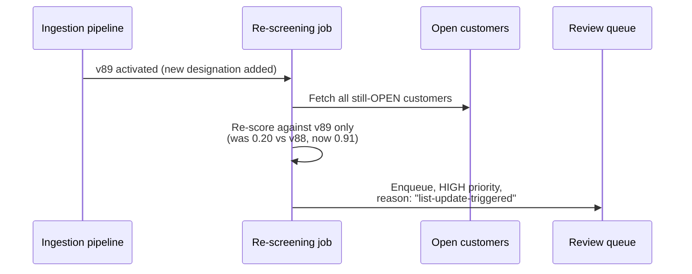

### The fix

Think of **a recall notice**: a car passed inspection yesterday, and today the manufacturer
recalls that exact part. Nobody expects the car to drive itself back in on its own.

The fix, concretely: every new list version automatically triggers a job that re-screens every
still-**open** relationship against just the newly-added entries.

### Scoping this correctly

Re-screening the full historical ledger forever is usually neither required nor useful — a
transaction closed years ago typically can't be undone anyway. The real requirement is almost
always:

- Open relationships, and
- Recent in-flight transactions.

This scope should be **confirmed explicitly with stakeholders**, not assumed by the engineering
team.

### New problem

This closes the gap for the routine update cadence. But not every designation waits politely for
the next scheduled pull.

**Interview line:** "A cleared decision is only correct as of the version it was cleared against
— every new version has to auto-trigger re-screening of open relationships, scoped to open, not
full history, and never left to a human to remember."

---

## Chapter 10 — Breaking news versus the evening paper

### The setup

RemitLane's ingestion pulls the list every 12 hours. That cadence is fine for routine updates.

### Where it breaks

Urgent designations happen too — tied to real-world events, meant to take effect immediately, not
on the next scheduled pull.

If an urgent designation is announced at 9 AM, and the next scheduled pull isn't until 9 PM,
that's a **12-hour window** where the newly-designated name still screens clean. That's not
because the matching logic failed — it's because the freshest available copy simply didn't
contain the new name yet.

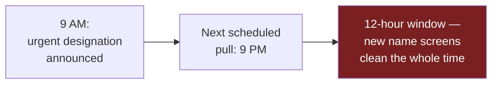

### The fix

Extend the binder analogy one more time: **for routine updates, HQ sends the evening paper. For
something urgent, HQ faxes an emergency page right now.**

Concretely: add a separate, tighter-cadence pull path — hourly, or webhook-driven if the source
supports it — for out-of-band designations. This path feeds into:

- The same versioned index, and
- The same automatic re-screening job from Chapter 9

— just sooner, and at higher priority.

### New problem

Every part of this system now makes real decisions constantly, around the clock. Eventually,
someone in a suit is going to ask to see exactly why one of those decisions, from months ago,
came out the way it did.

**Interview line:** "Routine and urgent updates aren't the same event and shouldn't share a
cadence — a separate, faster pull path exists for urgent designations, feeding the same index and
re-screening job, just sooner."

---

## Chapter 11 — The flight recorder

### The setup

A regulatory examiner pulls a transaction from six months ago and asks: *"Show me exactly why this
wasn't blocked."*

### Where it breaks

RemitLane's system stores only the word `CLEARED`. No score. No matched fields. No list version.

"We're pretty sure it was fine" is close to the worst possible answer to give in a regulatory
exam — regardless of whether the original decision was actually correct.

This isn't hypothetical. Real consent orders — including BNP Paribas's and HSBC's — specifically
cited **inadequate systems, controls, and recordkeeping** as part of the enforcement basis. That
finding stood alongside, not instead of, the underlying missed transactions.

### The fix

Think of **a flight recorder**: every decision gets logged in a form built to be pulled apart
later by someone who wasn't in the room when it happened.

Every screening event permanently records:

- The list version it ran against
- The top candidates and their scores
- Which fields matched (name, DOB, country, etc.)
- The final decision
- If a human was involved: who resolved it, and why

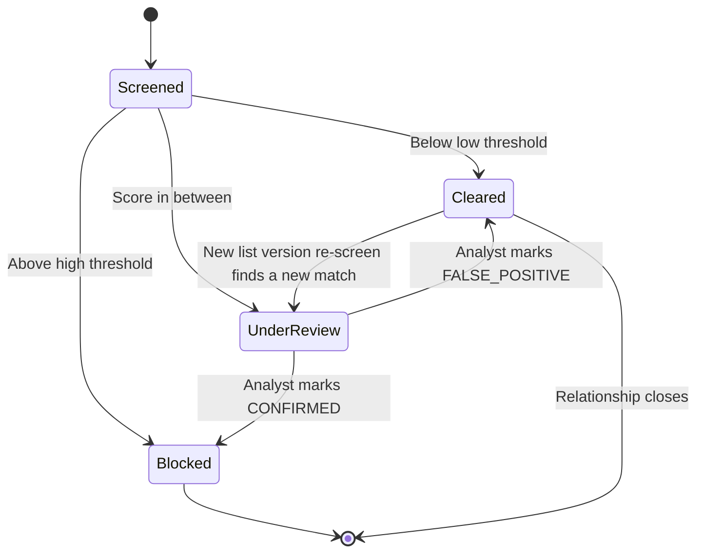

The `Cleared → UnderReview` arrow is Chapter 9's re-screening loop, made visible directly in the
lifecycle diagram. A cleared decision was never permanent — and the audit trail has to show both
the original clearance and the later re-flag, with both list versions attached to the record.

### New problem

None left. This is the system the reference guide documents.

Every earlier fix's leftover risk is now explainable. That's exactly what makes each of them
*provable* after the fact, not just true in theory.

**Interview line:** "Every decision has to be explainable on demand — which list version, which
fields, what score, who decided — because regulators audit by literally asking that. Real
settlements have cited bad recordkeeping as part of the failure, not just the missed hits — this
isn't polish, it's load-bearing."

---

## Where the story actually lands

```mermaid
flowchart LR
    A["Ch1: Live pull\non every request"] -->|"Decouple.\nBreaks: what happens\non a source outage?"| B["Ch2: Fail-open,\nserve last-known-good"]
    B -->|"Availability protected.\nBreaks: exact match\nmisses 97% of variants"| C["Ch3: Fuzzy\nsimilarity score"]
    C -->|"Catches variants.\nBreaks: 1 threshold\ncan't serve 2 goals"| D["Ch4: Two thresholds,\nthree outcomes"]
    D -->|"Shape fixed.\nBreaks: full-list scoring\nis too slow"| E["Ch5: Blocking keys\nnarrow candidates"]
    E -->|"Fast enough.\nBreaks: common-name\ncollisions flood review"| F["Ch6: Weighted\nmulti-field scoring"]
    F -->|"Fewer collisions.\nBreaks: no principled\nbias stated yet"| G["Ch7: Asymmetric-cost\nbias, loose threshold"]
    G -->|"Principled threshold.\nBreaks: review queue\nfloods, no plan"| H["Ch8: Triage-style\nreview queue"]
    H -->|"Capacity planned.\nBreaks: cleared decisions\ngo stale over time"| I["Ch9: Automatic\nre-screening"]
    I -->|"Stale clearances fixed.\nBreaks: urgent updates\ntoo slow to land"| J["Ch10: Separate\nurgent pull path"]
    J -->|"Urgent updates fast.\nBreaks: can't explain\nold decisions later"| K["Ch11: Full\naudit trail"]
```

Every real sanctions-screening system, in an interview setting, sits somewhere on this chain.

Don't recite all eleven chapters by default:

- A low-risk onboarding flow might reasonably stop around Chapter 4.
- A real payments company moving real money has to reach Chapters 9, 10, and 11 — because "we'll
  add auditability later" isn't actually an option in this domain.

---

## Grill me — adversarial follow-ups

**Q1: "Why not set the review band to catch everything and route it all to a human?"**

At 50M payments/day, that's not a review queue anymore — it's the entire payment system rebuilt
as a manual process, needing hundreds of thousands of analysts, not 1,250. Auto-clear exists
precisely so that unambiguous cases don't eat capacity that's needed for the genuinely ambiguous
ones.

**Q2: "Why not skip fuzzy matching and just hand-curate known alias spellings?"**

A curated list is always a step behind reality. New transliterations and typos show up
constantly, and nobody can pre-enumerate every way a name might get written down. Fuzzy scoring
generalizes to variants nobody has ever seen before; a curated list only covers the ones someone
already happened to think of.

**Q3: "Doesn't the blocking-key optimization risk missing a real match?"**

Yes — and that's a named risk, not a hidden one. An unusual name's sound might not land in the
same candidate bucket under one particular phonetic algorithm, and it never gets scored at all.
The mitigation is running more than one blocking strategy in parallel, so a miss in one strategy
doesn't silently drop the candidate entirely.

**Q4: "Why scope re-screening to open relationships instead of the full historical ledger?"**

Because a transaction closed years ago typically can't be undone — re-screening it forever
produces ongoing cost with no corresponding action available at the end of it. The real
requirement is almost always open relationships plus recent in-flight transactions, and that
scope should be confirmed with stakeholders, not assumed by engineering.

**Q5: "Couldn't a diligent compliance team just remember to recheck customers periodically?"**

No. "Remember to recheck" isn't a control a regulator will accept — it's a habit that gets
skipped under workload pressure, with no way to prove it happened consistently. An automatic job,
triggered on every list-version activation, is both more reliable and more auditable than any
manual process could be.

**Q6: "Fail-open protects availability — what if the outage is the source being tampered with?"**

Fair distinction. Fail-open covers a slow or unreachable server — it does not cover unvalidated
data. Ingestion should validate whatever it pulls (format, size range, signature if available)
before activating it as a new version. Fail-open means "serve the last *validated* good version,"
never "activate whatever showed up, unchecked."

**Q7: "How would you cut review workload without weakening false-negative protection?"**

Mostly by making the model better, not the threshold looser: better field weighting, more
blocking strategies, and feeding analyst resolutions back into recalibration. If pressed for a
number: halving the review-routing rate roughly halves both queue volume and headcount — that's a
real trade-off, not a free win.

**Q8: "What's the single biggest cost lever in this system?"**

Analyst headcount for the review queue — not infrastructure. Compute for scoring and indexing is
comparatively tiny. Queue size is a direct, linear function of where the auto-clear threshold
sits — so that threshold is really a staffing decision wearing a compliance-tuning costume.

**Q9: "Cold start — where do you begin if asked to design this from scratch?"**

Clarify three things first:
1. What's being screened — payments, onboarding, or both?
2. How many list sources are involved?
3. What's the acceptable false-negative tolerance? — which basically has to be "as close to zero
   as possible."

Then state the one-picture version up front: decoupled ingestion, feeding a fuzzy, scored,
three-way decision, with a capacity-planned human review layer on top. Go deep wherever the
interviewer pushes.

---

## Cheat sheet — one line per stop on the story

- **Live per-request list pull**: the slowest dependency becomes the slowest part of every
  request — decouple ingestion (pull, version, index) from serving (check the local copy).
- **Fail-open on staleness**: a source outage degrades freshness, never availability — serve the
  last known-good version, alert on staleness.
- **Exact string match**: near-100% false-negative rate on real names — transliteration and
  punctuation defeat it almost every time.
- **Fuzzy similarity scoring**: Levenshtein/Jaro-Winkler turn "how different" into a number — but
  a number isn't a decision.
- **Two thresholds, three outcomes**: one threshold can't serve both goals — clear/block/review is
  the minimum viable shape.
- **Blocking-key candidate generation**: never brute-force score the whole list — phonetic keys
  narrow it to a handful of real candidates first.
- **Weighted multi-field scoring**: name alone causes common-name collisions — DOB and country
  tell two "John Smiths" apart.
- **Asymmetric cost, biased loose**: a false negative is legal, a false positive is a delayed
  payment — bias the auto-clear threshold conservatively toward more review.
- **Review queue as triage**: SLA, priority tiers, and headcount computed from the threshold —
  every resolution feeds back into tuning.
- **Automatic re-screening**: a cleared decision is only correct as of the version it was cleared
  against — every new version re-screens open relationships automatically.
- **Urgent out-of-band updates**: routine and urgent designations aren't the same event — a
  separate, faster pull path exists for the ones that can't wait.
- **Full audit trail**: every decision — version, fields, score, who decided — must be
  reconstructable on demand.
- **The meta-lesson**: every fix buys one property (freshness-safety, availability, matching
  correctness, decision shape, speed, precision, principled bias, review capacity,
  decision-durability, urgency-handling, accountability) by spending a different one — say the
  trade in the same sentence you propose the fix.
