# Design a Toll Vehicle Insurance Validity Check System — The Story (narrative edition)

> **What this file is.** The reference file, `49-Toll-Vehicle-Insurance-Validity-Check-FAANG-Guide.md`, is the one to recite from — requirements, API shapes, every trade-off table, the master cheat sheet. This file is a second way in: the same material told as one continuous story, in plain language.
>
> Engineers at a fictional national tolling operator, **Meridian Tollways**, keep hitting a wall, patch it, and the patch itself creates the next wall — until we land on the exact same design the reference file documents.
>
> Meridian Tollways is fictional. But the physics it runs into are real: highway ANPR/RFID tolling systems like **E-ZPass** (US) and **FASTag** (India's national RFID electronic-toll-collection system) genuinely have to decide at highway speed. The general engineering principle behind this story — *"an edge decision must never depend on a live remote call"* — is the same one embedded and IoT/offline-first systems lean on, and for the same reason: a network hop you don't control cannot sit on your critical path when milliseconds and physical safety are both on the line.
>
> This is a niche, applied domain, so most of the specific numbers below are **reasoned estimates**, not documented case studies. I'll tag those `[illustrative]` every time, honestly, rather than pretend they're published facts.

**The one sentence to keep in your head:** a vehicle crossing a toll gantry at highway speed gives you a physically bounded, sub-100ms window to decide "does this vehicle have valid insurance right now." So the decision has to already be sitting locally, in memory, before the car ever arrives — because there is no time left to ask anyone.

---

## Chapter 1 — The clerk who calls the DMV for every single car

### The setup

It's Meridian Tollways' first year running electronic tolling. The design is the obvious one:

- A camera at each gantry reads a plate.
- The tolling software calls the government's central **Vehicle Insurance Registry** — a real, government-owned authority, the same kind of system FASTag ultimately settles against in real life.
- The call is synchronous, per car: "is this plate currently insured?"

A normal call to that registry takes about **80ms** `[illustrative — a reasonable stand-in for "a government API call," not a documented number]`.

At a quiet regional gantry doing maybe 3 vehicles/sec, 80ms per car is no problem at all. The registry keeps up, and cars keep flowing.

### Where it breaks

Then Meridian switches on gantries along the busiest interstate corridor, and rush hour hits.

- **18 vehicles/sec** now pass a single gantry, several lanes wide, all at highway speed.
- The registry call still takes 80ms on a good day.
- A vehicle at 100 km/h covers about **2.8 meters every 100 milliseconds**.

Do the math on those two facts together: by the time the registry answers, the car isn't approaching the gantry anymore. It's already past it — and in some lane configurations, already approaching the *next* gantry.

Worse, the registry itself has a hard ceiling. It's a legacy government system with a real sustained capacity of roughly **50 queries/sec nationwide** `[illustrative]`. Meridian's busiest corridor alone, at 18 vehicles/sec, is already eating more than a third of that national ceiling — and Meridian runs 2,000 gantries, not one.

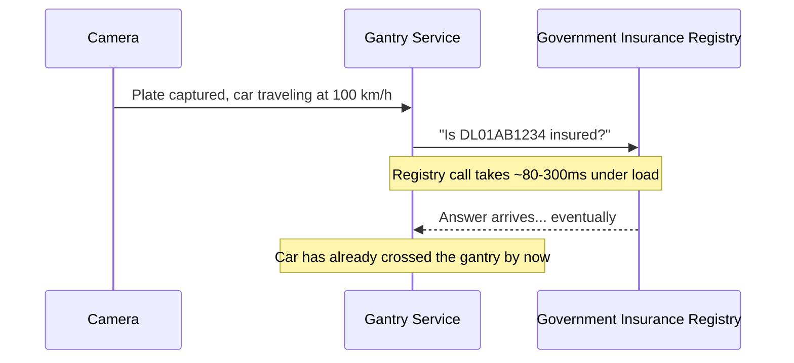

### Why "just make it faster" doesn't work

The obvious next question: *why not just make the registry call faster, or throw more servers at it?*

Because the ceiling isn't on Meridian's side. It's the government registry's own aging infrastructure. Meridian doesn't own it, can't scale it, and can't reliably speed it up just by asking nicely.

This is the same shape of problem as calling any slow third party synchronously on a hot path — just with a much less forgiving deadline. A typeahead search can tolerate "feels slow." A physical car cannot.

### The fix

Stop asking the registry a question per car. Instead, build Meridian's own **guest list**: a full local copy of "who's currently insured," refreshed on Meridian's own schedule, sitting right at the gantry — so the gantry never has to phone anyone while a car is approaching.

> **Analogy.** Think of a nightclub bouncer who keeps a printed guest list at the door instead of calling the venue owner for every single guest. The owner still maintains the real list somewhere, but the bouncer works entirely off their own copy in the moment.

**New problem, immediately:** the guest list can't just cover "the busy corridor's regular commuters." A national highway network sees cars from every region, and the very next car might be someone Meridian's local gantry has never seen before.

**How I'd say this in an interview:** "The registry's throughput ceiling, not just its latency, rules out a synchronous per-vehicle call entirely — this isn't a timeout-tuning problem, it's a hard capacity mismatch. The fix is the same one you'd reach for with any slow external authority: decouple the decision from the live call, and keep a local copy the gantry can check without ever leaving the building."

---

## Chapter 2 — The guest list that only covers the regulars

### The setup

Meridian's next attempt: cache each vehicle's status locally at the gantry the first time it's seen, and only call the registry on a **cache miss** — an unfamiliar plate.

This feels reasonable at first glance: most cars on a given commuter corridor are, in fact, regulars.

### Where it breaks

It breaks on a long weekend. A national holiday sends traffic from every region onto the interstate corridors. Out-of-state travelers show up that Meridian's regional gantries have simply never cached before.

Walk through the worked numbers `[illustrative]`:

| Condition | Cache-miss rate | Traffic | Registry calls/sec (this one gantry) |
|---|---|---|---|
| Normal day | ~5% | 12.5 vehicles/sec | ~0.6 |
| Holiday surge | ~40% | 25 vehicles/sec (doubled) | ~10 |

That "10 registry calls/sec" is from just *one* gantry. Meridian has hundreds of gantries seeing the same holiday surge at the same time. All of them fall back to the registry at once, and the registry's 50-queries/sec national ceiling is blown through by a wide margin within minutes. Cars queue up behind gantries that can no longer get an answer in time.

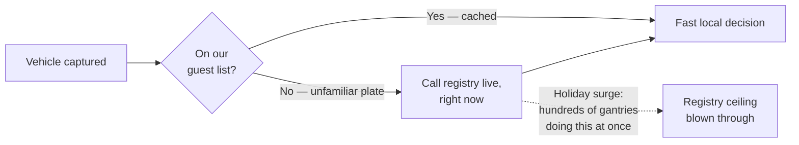

### Why the miss path is still the problem

The obvious question: *why does a cache miss still have to call the registry live, on the hot path, at all?*

Because this design still treats "unfamiliar" as "go ask right now" — which is exactly the same synchronous dependency from Chapter 1, just triggered less often. "Less often" isn't good enough when the trigger is a burst, not a steady trickle. The whole point of a burst is that it defeats "usually rare."

### The fix

Stop keeping a *partial* guest list built lazily from whoever happens to pass by. Instead, copy the **entire national list** — every one of the roughly 250,000,000 registered vehicles `[illustrative capacity estimate from the reference guide]` — to every gantry, ahead of time, refreshed on Meridian's own schedule. Never build it from a live miss.

**Sizing the dataset:**

- Each compact record (plate, status, expiry, insurer ID, overhead) is roughly 35 bytes.
- 250,000,000 records × 35 bytes ≈ **8.75 GB**.

That's a fully normal, fits-in-memory dataset for a modern server — nothing close to a real storage problem.

### New problem: pulling that much data without breaking the source

Pulling 250 million records from a registry that can only sustain ~50 queries/sec means paging through it carefully. Here's the arithmetic:

1. Pull in pages of 5,000 records each.
2. 250,000,000 records ÷ 5,000 per page = **50,000 pages**.
3. At 50 queries/sec, 50,000 pages takes 50,000 ÷ 50 = **1,000 seconds ≈ 17 minutes** for one full national refresh `[illustrative, using the guide's own worked numbers]`.

Seventeen minutes is fine for a scheduled job that runs a few times a day. But if Meridian's ingestion pipeline gets greedy and tries to pull faster than the registry's ceiling allows, it's right back to overloading the very registry it depends on — this time from the *ingestion* side instead of the serving side.

### Redo-the-chain check

If the registry were modernized tomorrow and its ceiling jumped from 50 queries/sec to 500, that same full refresh would drop from ~17 minutes to under 2 minutes — letting Meridian refresh far more often.

The *shape* of the fix doesn't change either way: decouple ingestion from serving, always. Only the achievable freshness bound changes. That's the number worth confirming with an interviewer rather than assuming — the registry's real throughput ceiling, not the network's total vehicle volume, is what decides how fresh Meridian's data can realistically be.

**How I'd say this in an interview:** "A partial cache with live fallback on miss just relocates the throughput problem to whenever a burst of unfamiliar traffic hits — and highway traffic is bursty by nature, holidays being the obvious case. The real fix is a full local replica of the entire registry, refreshed on a schedule paced to the registry's own real ceiling, never triggered by a live miss."

---

## Chapter 3 — Copying the whole guest list to every door, on a schedule the source can actually survive

### The setup

Meridian builds a proper ingestion pipeline:

- It's the *only* thing that ever talks to the government registry.
- It pulls the full dataset in paginated batches, paced to that ~50-queries/sec ceiling.
- Once a full pull completes (roughly every 17 minutes `[illustrative]`), it packages the result into a **versioned snapshot**.
- It pushes that snapshot out to all 2,000 gantries over Meridian's own internal network.

No gantry ever independently hits the government system.

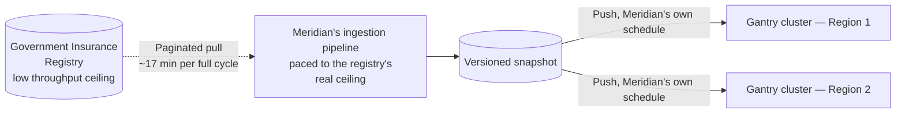

Now every gantry holds the *entire* national guest list — 8.75 GB, fully in memory — and the registry is only ever bothered on Meridian's own paced schedule, a handful of times a day. That's completely decoupled from however many cars are actually crossing gantries at any given second. Rush hour, holidays, sudden surges — none of it touches the registry anymore.

### Where it breaks

This genuinely fixes both Chapter 1's and Chapter 2's failures. But once this is running, someone benchmarks the *lookup itself*, not the refresh.

A full in-memory index lookup against 250 million records still takes real time — call it low-single-digit milliseconds per lookup once you include the actual key-comparison work `[illustrative]`.

That's fine on its own. But it collides with Meridian's total decision budget: camera capture, then OCR, then lookup, then signaling the toll actuator — all meant to fit inside **single-digit-to-low-double-digit milliseconds, end to end**. The physical deadline from Chapter 1 hasn't gone away just because the data is now local.

Every millisecond spent on the *common* case — a totally unremarkable, definitely-fine plate, which is the overwhelming majority of traffic — is a millisecond stolen from the budget OCR itself needs.

**The obvious next question:** *do we really need a full index lookup for the 98% of cars that are completely fine, or is there something cheaper that handles the common case even faster?*

**How I'd say this in an interview:** "Full local replication fixes the throughput mismatch completely — the registry is now touched on a schedule it can actually survive, and the dataset, under 10GB, is a non-issue to hold fully in memory at every gantry. What's left isn't a scaling problem anymore, it's a raw speed problem on the read path itself, because the physical deadline is still just as tight as it was in Chapter 1."

---

## Chapter 4 — The bouncer's quick glance before the full ID check

### The fix

Don't run every plate through the full index. Instead, run it through a **bloom filter** first — a small, deliberately probabilistic structure built only from the *flagged* subset (lapsed, invalid, or enforcement-flagged vehicles), not the whole registry.

A bloom filter answers one narrow question, extremely fast: **"is this plate definitely not in the flagged set?"**

- If yes → the car is fine. Skip the full index entirely, and let it through.
- If "possibly flagged" → fall through to the full index for the real, authoritative answer.

> **Analogy, continuing the bouncer picture.** The guest list from Chapter 1 is the full, authoritative record at the door. The bloom filter is the bouncer's **half-second glance** at someone walking up: if they obviously don't match anyone on the "known troublemakers" sheet, wave them straight through without ever pulling out the full guest list. Only a face that *might* match gets the full check.

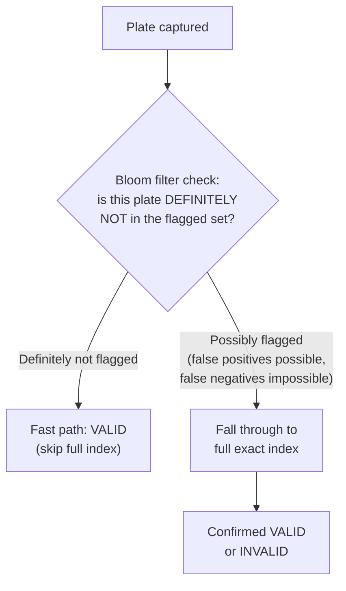

### Why this is safe

A bloom filter, by construction, **never produces a false negative**. If it says "definitely not flagged," that's unconditionally correct.

It can occasionally say "possibly flagged" about a car that's actually fine — a false positive. But that only costs an extra full-index lookup, never a wrong decision, because the full index is still the one that gives the real answer.

**Sizing it, worked through:**

1. Roughly 2% of the 250 million vehicles are currently flagged → about **5,000,000 entries**.
2. At a 1% false-positive rate, the bloom filter itself comes out to roughly **tens of MB** `[illustrative]`.
3. That's tiny next to the 8.75 GB full dataset.
4. It shaves the *common* case (98% of traffic) down from a full-index lookup to a handful of memory accesses.

### New problem, months later

The flagged-vehicle population grows over time — more lapsed policies get reported, more enforcement flags accumulate. But nobody resizes the bloom filter to match.

- It was sized for 5,000,000 flagged entries.
- It's now tracking 9,000,000.

The false-positive rate creeps up. More plates than intended start falling through to the full index unnecessarily.

This isn't a correctness bug — the full index still gives the right answer every time. It's a quietly worsening **performance regression**: the bouncer's "quick glance" stops being quick for a growing share of ordinary, perfectly innocent cars.

This is a genuine memory-vs-fall-through-rate dial, worth a sentence if an interviewer pushes on it. In absolute terms it's usually a small trade-off, since the full index is already fast and always resident in memory anyway:

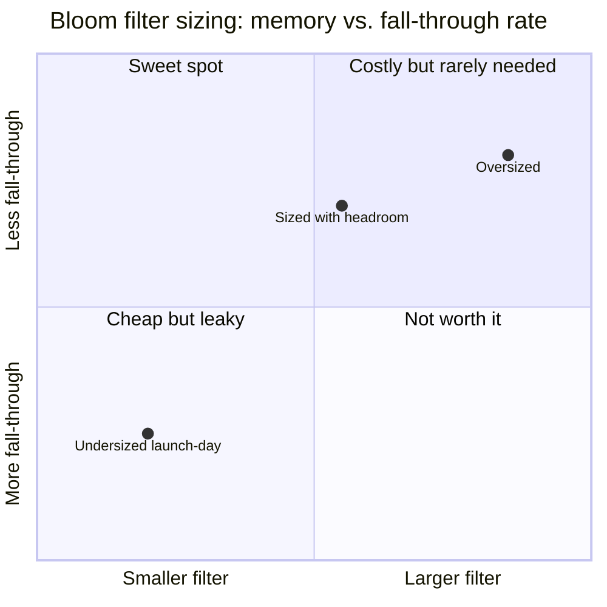

**How I'd say this in an interview:** "A bloom filter is a safe fast-path pre-check specifically because it never false-negatives — it only ever shortcuts the 'definitely fine' case, and every 'maybe flagged' result still falls through to the real, authoritative index. The one thing you have to actively manage is sizing it with headroom for how the flagged set grows, or the fall-through rate quietly creeps up over time."

---

## Chapter 5 — The door that opens before the guest list arrives

### The setup

A separate incident, unrelated to lookups: a gantry server crashes and restarts during a software rollout.

- The process comes back up fast — it starts in under a second.
- But the 8.75 GB national snapshot takes real time to load and validate into memory — several seconds `[illustrative]`.

Someone wires the lane controller to open to normal traffic the instant the process reports as running — not once it's actually ready to make decisions. That's the bug.

### Where it breaks

For those few seconds, cars are approaching a lane whose decision service has nothing loaded: no bloom filter, no index, nothing to check a plate against.

Something has to happen anyway, because the lane is physically open. If the fallback silently defaults to "let everyone through," that's a lane that's effectively not checking anything — quietly, for as long as the gap lasts. Every fix so far becomes worthless for exactly the vehicles unlucky enough to arrive in that window.

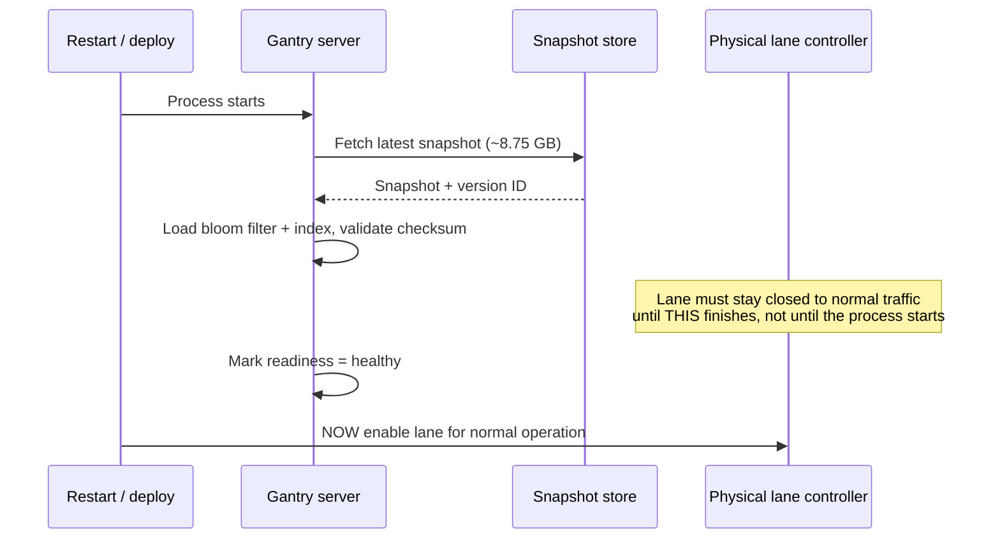

### The fix

Gate lane activation on **data readiness**, not process start. The same "guest list" analogy applies at boot: the bouncer doesn't open the door and start waving people in before the guest list has actually arrived and been checked. The door stays shut until the list is verified and loaded.

If the lane genuinely has to open before that finishes, every car in that window resolves to a non-blocking `UNKNOWN` — exactly like an unrecognized plate. Never a silent, permissive default of "assume fine."

**New problem, and it's really the same shape as this one:** readiness isn't only about *loading* the guest list correctly. It's also about whether the *camera* handed the lookup a plate it can actually trust in the first place. A perfectly loaded dataset checked against a badly misread plate is just as dangerous as an unloaded dataset.

**How I'd say this in an interview:** "A gantry doesn't open to normal traffic until its local dataset is loaded and validated — gating on readiness, not process start, because the physical consequence of skipping this isn't an error page, it's a lane silently letting every car through, or worse, silently defaulting to block, with cars already committed to the lane."

---

## Chapter 6 — The blurry photo that almost got treated as a confirmed violation

### The setup

Meridian's cameras read plates with an OCR confidence score attached to every capture.

- Most reads are clean: confidence above 0.9.
- But glare, rain, mud, and obscured plates are a normal, everyday fraction of traffic — not a rare edge case.

Meridian's own data shows roughly **1% of captures** come back with genuinely low-confidence reads `[illustrative]`. At 5,000 vehicles/sec network-wide at peak, do the math: 1% of 5,000 is **50 low-confidence reads every second**. That's not a rounding error.

### The near-miss

An early build of the decision service takes whatever plate the OCR returns — low confidence or not — and just runs it through the bloom filter and index like any other read.

One day, a badly obscured plate gets OCR'd as a string that happens to closely resemble a genuinely flagged, lapsed-insurance plate. The index confirms a match: flagged, invalid. The system is about to route this car into an enforcement action, on the strength of a guess dressed up as a lookup result.

Zooming out to the whole network at peak, the decision mix looks roughly like this `[illustrative]`. The `UNKNOWN` slice is deliberately not tiny, because misreads are a normal, everyday fraction of highway traffic — not a rare edge case worth ignoring:

| Outcome | Vehicles/sec (of 5,000 total) |
|---|---|
| VALID | 4,850 |
| INVALID (confirmed, high-confidence) | 100 |
| UNKNOWN (low-confidence read or no match) | 50 |

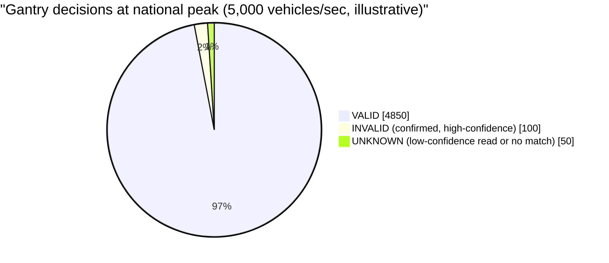

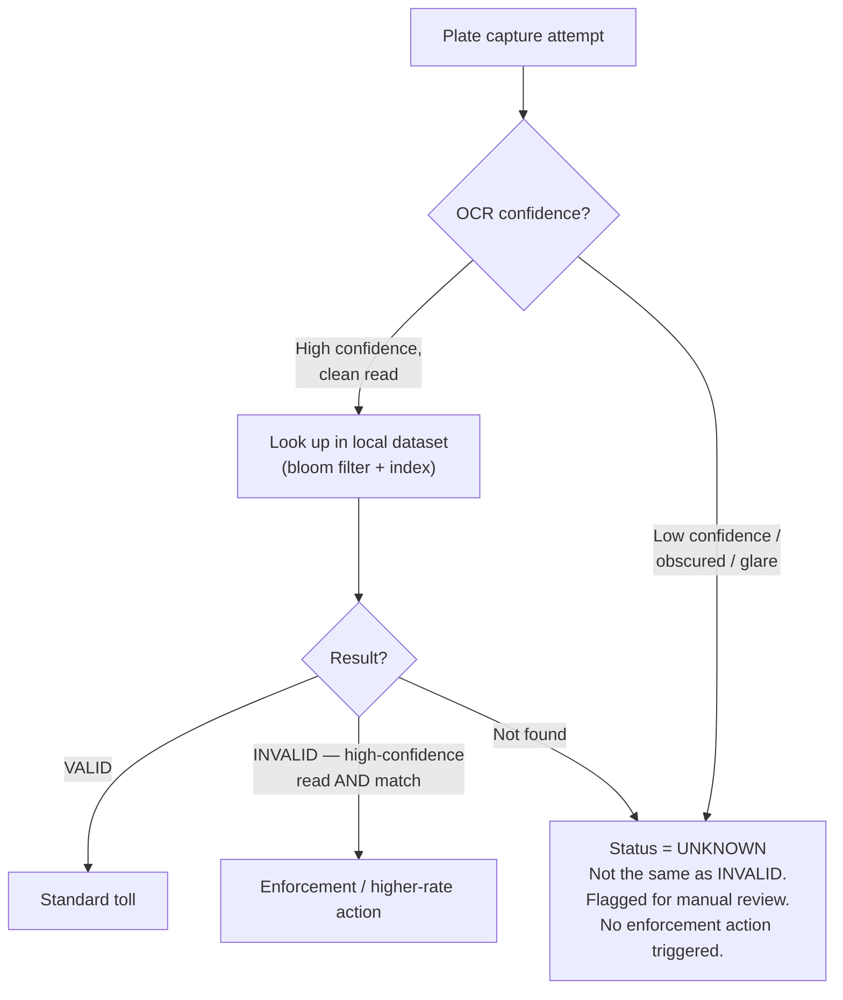

### The fix

Treat OCR confidence as a **gate that happens before the lookup even runs**. Below a set confidence threshold, the result is `UNKNOWN` — flagged for manual/enforcement review, with zero automated consequence. Never `INVALID`.

This is a genuinely three-way outcome (`VALID` / `INVALID` / `UNKNOWN`), not a two-way `ALLOW`/`BLOCK`, precisely because an ambiguous camera read is a data-quality problem, not evidence of anything.

A blurry photo that merely *resembles* a flagged plate is not the same fact as a confirmed match on a clean read. Collapsing the two together turns a technical limitation (bad OCR) into a false accusation against an innocent driver.

**New problem, immediately downstream:** even once a plate is confidently read and confidently confirmed `INVALID`, what should actually *happen* physically? A barrier arm coming down on a car already committed to a highway lane at 100 km/h is not the same kind of "block" as an app returning a 403.

**How I'd say this in an interview:** "Low-confidence reads resolve to `UNKNOWN`, never to a confirmed `INVALID` — ambiguous camera signal is a data-quality problem, not a compliance finding, and treating it as one risks a real, unjustified consequence against an innocent driver. The three-way outcome exists specifically so 'we're not sure' is never silently promoted into 'we caught you.'"

---

## Chapter 7 — The barrier that shouldn't be a barrier

### The setup

Someone on the product side asks the obvious next question: "great, so on a confirmed `INVALID`, we drop the barrier?"

This is where the software design has to explicitly hand a decision back to physics. Stopping a vehicle already traveling at highway speed, on the strength of a software signal, is fundamentally a **stopping-distance and safety-engineering question**:

- How far out does the signal need to fire?
- How fast can a barrier actually move?
- What happens to the car directly behind it?

None of these are questions a tolling decision service can answer on its own — and none of them should be *assumed away* just because "INVALID" sounds like it obviously means "block."

### The actual answer

Meridian's actual answer — and the realistic one most tolling systems land on — is: a confirmed `INVALID` triggers an **enforcement flag and a different toll rate**, routed to a back-office review and billing process. Not a physical barrier at highway speed.

Physical barriers, where Meridian uses them at all, exist only at dedicated **low-speed toll plazas**, designed around that exact stopping-distance problem from the ground up. That's a completely different physical layout than a highway-speed ANPR gantry.

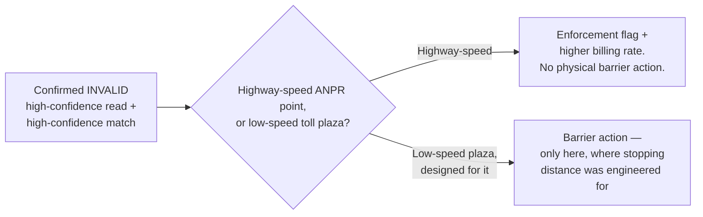

### Why this matters as a design boundary, not just a caveat

If an interviewer pushes "what does the system *do* about an invalid vehicle," the honest, defensible answer is that the software design should **interface with** a physical actuation decision, not **own** it outright. That's the same discipline as knowing where your system's responsibility ends and a different, physically-grounded engineering discipline begins.

**New problem, once enforcement and billing decisions are flowing:** every one of these decisions — flag, rate change, review outcome — is now the kind of thing a driver can dispute. "I had insurance, your camera misread my plate" is a completely foreseeable, common complaint. Right now Meridian has no systematic way to prove what actually happened at the moment of decision.

**How I'd say this in an interview:** "A confirmed INVALID doesn't automatically mean 'drop a barrier' — at highway speed that's a safety-engineering decision about stopping distance that belongs to the physical design, not the software. The realistic default is an enforcement flag and a billing-rate change, with a hard physical barrier reserved for purpose-built, low-speed toll plazas that were actually engineered for it."

---

## Chapter 8 — The receipt stapled to every decision

### The setup

Disputes start arriving, as expected: drivers claiming a flagged decision was wrong, insurers claiming their policy was active when the system said otherwise.

Without a record of exactly what the system knew *at the moment* it decided, Meridian has no way to adjudicate any of it. Just two people's word against each other, months later, with no evidence on Meridian's side either way.

### The fix

Log **every single gantry decision** — every one, not just the flagged ones — with:

- the plate as read,
- the OCR confidence score,
- the gantry ID,
- the timestamp,
- the decision reached, and
- critically, the **exact registry snapshot version** it was checked against.

> **Analogy.** Think of it as stapling a dated receipt to every decision: months later, "what did the system know, and when" is a lookup, not a guess.

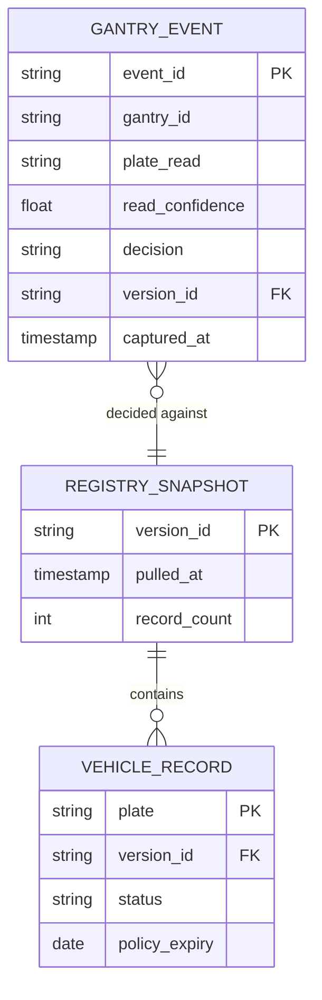

### What this buys Meridian

This resolves the dispute Meridian was actually worried about: "did the system have wrong data, or did it have the right data and the driver's insurance was actually lapsed" is now answerable straight from the log.

It also surfaces something useful for free: Meridian can now see, in aggregate, how often low-confidence reads happen at which gantries — feeding back into camera maintenance and OCR threshold tuning. A genuine improvement loop, not just a compliance artifact.

### Where this actually settles

This is the real system, end to end:

1. Full national dataset replicated to every gantry, refreshed on a schedule paced to the registry's own throughput ceiling — never per-vehicle.
2. A bloom filter shortcuts the common "definitely fine" case ahead of the full index.
3. Lane activation is gated on data readiness, not process start.
4. OCR confidence gates the lookup itself, resolving ambiguous reads to a non-blocking `UNKNOWN` that's structurally distinct from a confirmed `INVALID`.
5. Physical actuation is scoped to where it was actually engineered for.
6. Every decision is logged against the exact snapshot it was made against, for disputes that are a when-not-if.

**How I'd say this in an interview:** "Every decision gets logged with enough detail to reconstruct exactly what the system knew at that moment — plate, confidence, gantry, decision, and which registry snapshot version it checked against. Toll and insurance enforcement disputes are routine, not rare, so this isn't an afterthought, it's the thing that makes every other decision in this design defensible after the fact."

---

## Where the story actually lands

```mermaid
flowchart LR
    A["Ch1: Synchronous<br/>per-vehicle registry call"] -->|"Fixes: nothing yet.<br/>Breaks: physically too slow,<br/>registry ceiling too low."| B["Ch2: Partial cache<br/>+ live fallback on miss"]
    B -->|"Fixes: most traffic.<br/>Breaks: burst of unfamiliar<br/>plates overloads registry."| C["Ch3: Full national<br/>replica, paced refresh"]
    C -->|"Fixes: throughput mismatch.<br/>Breaks: full-index lookup<br/>still costs real ms."| D["Ch4: Bloom filter<br/>pre-check"]
    D -->|"Fixes: common-case speed.<br/>Breaks: opens before data<br/>is actually loaded."| E["Ch5: Readiness-gated<br/>lane activation"]
    E -->|"Fixes: unloaded-dataset risk.<br/>Breaks: low-confidence OCR<br/>treated as a real match."| F["Ch6: Confidence gate,<br/>UNKNOWN vs INVALID"]
    F -->|"Fixes: false accusations.<br/>Breaks: what does INVALID<br/>actually DO physically."| G["Ch7: Scoped physical<br/>actuation, not assumed"]
    G -->|"Fixes: safe actuation.<br/>Breaks: disputes with<br/>no evidence trail."| H["Ch8: Full decision<br/>audit log"]
```

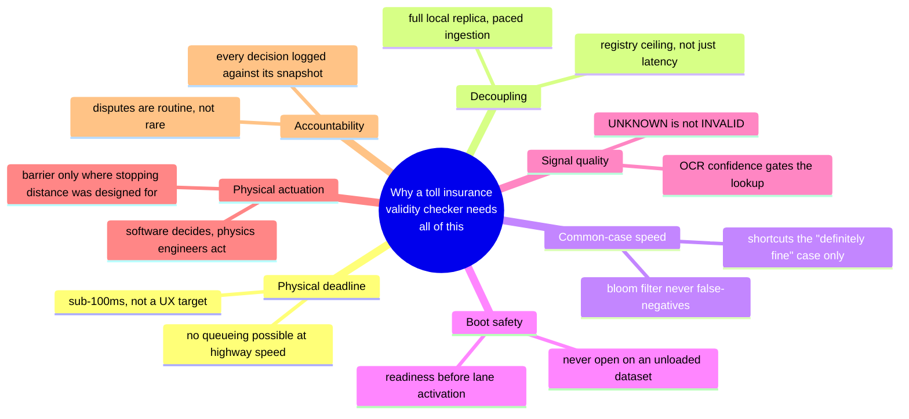

Every real design in this chapter's genre sits somewhere on this chain. A system where the only outcome is "flag for billing, no barrier" can reasonably stop after Chapter 6 or 7. A system that genuinely gates physical hardware needs the full walk through Chapter 8's audit trail, because that's exactly where the safety and dispute stakes are highest.

---

## Grill me — adversarial follow-ups

**Q1: "Why not just make the government registry call faster instead of building all this local infrastructure?"**
Because the ceiling isn't a latency problem you can shave down — it's a throughput ceiling on a legacy system Meridian doesn't own and can't scale on request. Even if the call got instant, a legacy system built for a slower era simply cannot sustain thousands of concurrent queries per second, so the fix has to be structural — decouple entirely — not incremental.

**Q2: "Isn't 8.75GB per gantry, times 2,000 gantries, a huge amount of storage to replicate?"**
Not really — modern servers hold that comfortably in memory, and it's the same "full replication is cheap" pattern as almost every design that depends on a slow external authority. The genuinely scarce resource here is the registry's own throughput ceiling, not Meridian's storage or bandwidth.

**Q3: "What happens if a car's insurance lapses five minutes after the last refresh?"**
It won't be caught until the next scheduled pull — that's an accepted, stated limitation, not a bug, because the underlying data source itself, insurers reporting to the government, often isn't real-time either. The right move in an interview is to say this staleness bound out loud and justify it against how fast insurance status actually changes in practice, rather than promise same-second accuracy the source data can't support.

**Q4: "Why not skip the full index entirely and just trust the bloom filter?"**
Because a bloom filter can have false positives — it can say "possibly flagged" about a car that's actually fine — so trusting it alone would wrongly flag innocent drivers some percentage of the time. It's only safe to shortcut the "definitely not flagged" branch; every "maybe" still has to go to the authoritative full index.

**Q5: "Could you get away with a smaller bloom filter to save memory?"**
You could, but the trade-off is a rising false-positive rate, meaning more traffic falls through to the full index than necessary — a performance cost, not a correctness one, since the index is still right every time. It's a real trade-off worth mentioning, but not worth over-engineering, because the full index is fast and always in memory anyway.

**Q6: "Why treat a low-confidence OCR read as UNKNOWN instead of just re-running OCR until it's confident?"**
Because there's no time to re-run anything — the car is still moving, and the whole decision window is single-digit milliseconds. The honest answer under a physical deadline is to accept the ambiguity, route it to a non-blocking review, and never let an unconfident guess masquerade as a confirmed match.

**Q7: "Doesn't gating lane activation on readiness just delay opening the lane, which is its own problem during a busy restart?"**
Yes, briefly — but the alternative is worse: a lane open with no data loaded either has to fail every vehicle to UNKNOWN, which is safe, or silently default to VALID for everyone, which quietly defeats the entire system's purpose. A short, bounded readiness delay during restarts is a far smaller cost than either of those outcomes.

**Q8: "If a confirmed INVALID doesn't trigger a barrier at highway speed, what's actually stopping an uninsured driver?"**
The enforcement flag and billing consequence — a higher toll rate, a referral to enforcement action, a paper trail — not a physical stop at the moment of passage. Physical barriers are reserved for dedicated low-speed toll plazas engineered with real stopping distance in mind; conflating the two is exactly the mistake this design is built to avoid.

**Q9: "How would you actually prove a disputed decision was correct, months later?"**
Pull the logged `GantryEvent` for that plate and timestamp, which carries the exact registry snapshot version it was checked against, then pull that snapshot version and show what the registry said at that moment. That's the entire point of stamping every decision with its snapshot version instead of just logging the outcome.

**Q10: "Given this whole story, if someone says 'design a real-time vehicle validity check at toll gates' cold, where do you start?"**
Ask what the actual decision deadline is and whether there's a physical barrier involved at all, because that single answer changes how hard the millisecond budget really is. Then immediately name the registry's throughput ceiling as the binding constraint that rules out any synchronous per-vehicle call, and walk forward from full local replication — everything else in this story is a refinement on top of that one decision.

---

## Pacing note

**If this is 60 seconds inside a bigger question:** say the guest-list line — the decision has to already be sitting locally, in memory, before the car arrives, because there's no time left to ask anyone — then say "full local replica refreshed on the registry's own paced schedule, a bloom filter to shortcut the common case, readiness-gated lane activation, and a three-way outcome so ambiguous reads never become false accusations." That's the whole shape in one breath.

**If this is the whole 15-20 minute focus:** walk the chapters in order — why a synchronous per-vehicle call is physically impossible, why a partial cache still breaks on bursts, full replication paced to the source's real ceiling, the bloom filter as a common-case shortcut, readiness-gating at boot, the OCR confidence gate and the three-way outcome, scoping physical actuation to where it's safe, then the audit trail if disputes come up. Don't walk all eight unprompted — follow wherever the interviewer's questions point, and use the untouched chapters as your "if I had more time" closer.

---

## Active recall — no answers, test yourself cold

1. What's the one-sentence reason a synchronous per-vehicle registry call is ruled out here, before you even talk about latency?
2. Why does a partial cache with live fallback on miss still break, even though it handles most traffic fine day to day?
3. Roughly how big is the full national dataset, and why is that size a non-issue while the registry's throughput ceiling is the real constraint?
4. What's the one narrow question a bloom filter is allowed to answer, and why is it safe to trust its "definitely not" answer completely?
5. What's the actual failure if a gantry's lane opens to traffic before its local dataset has finished loading?
6. Why must a low-confidence OCR read resolve to `UNKNOWN` instead of `INVALID`, even if the misread plate happens to closely resemble a flagged one?
7. Why is a hard physical barrier usually the wrong actuation for a confirmed `INVALID` at highway speed — what discipline does that decision actually belong to?
8. What does every logged `GantryEvent` need to carry to make a months-later insurance dispute resolvable?
9. If the bloom filter's false-positive rate creeps up over time, is that a correctness bug or a performance regression — and why?
10. Walk through, end to end, why "fail open" here doesn't just mean "let everyone through" — what's the actual safe default at each failure point in this story?

*Spaced repetition: test this list today, again in 2-3 days, again in a week.*

---

## Cheat sheet — one line per stop on the story

- **Synchronous per-vehicle registry call**: physically too slow and throughput-capped by a legacy system Meridian doesn't own — ruled out immediately, not tuned.
- **Partial cache + live fallback on miss**: relocates the same problem to whenever a burst of unfamiliar traffic hits, which highway travel guarantees will happen.
- **Full national replica, paced refresh**: the real fix — entire dataset local at every gantry, registry touched only on a schedule paced to its own real ceiling.
- **Bloom filter pre-check**: safe because it never false-negatives — shortcuts only the "definitely fine" case, everything else still hits the authoritative full index.
- **Readiness-gated lane activation**: a lane never opens to normal traffic until its local dataset is actually loaded and validated, not just when the process starts.
- **OCR confidence gate**: low-confidence reads resolve to `UNKNOWN`, never `INVALID` — ambiguous signal is a data-quality problem, not a compliance finding.
- **Scoped physical actuation**: a confirmed INVALID triggers enforcement/billing consequences by default; a hard barrier is reserved for low-speed plazas engineered for stopping distance.
- **Full decision audit log**: every decision stamped with the exact registry snapshot it was checked against, because disputes are routine, not rare.
- **The meta-lesson**: every fix buys one property — throughput decoupling, common-case speed, boot safety, signal-quality honesty, physical safety, or accountability — by spending something else; say the trade in the same breath as the fix.
