# Design a National ID / KYC Verification System — The Story (narrative edition)

## What this file is

The reference file, `50-National-ID-KYC-Verification-System-FAANG-Guide.md`, is the one to recite
from. It has the requirements, the API shapes, every trade-off table, and the master cheat sheet.

This file is a second way in. It tells the same material as one continuous story, in plain
language. A team at a company keeps hitting a wall, patches it, and the patch itself creates the
next wall — until the team lands on the exact same design the reference file documents.

The company, **NimbusPay** (a fintech wallet app), is fictional. But every wall it hits, and every
fix it reaches for, is based on something a real, named system actually does:

- **India's Aadhaar eKYC system**, run by UIDAI. Documented scale: 1.3 billion+ people enrolled,
  with a real, contractual per-organization quota on verification calls.
- **Document-authenticity vendors like Jumio and Onfido.** They solve a genuinely different
  problem — "is this uploaded photo of an ID doctored," not "does this person match the
  government's record." This is mentioned once, on purpose, to draw the boundary between the two
  problems.
- The same **event-driven, quota-aware patterns** documented in the reference guide itself.

Every time a number shows up, this file will say clearly whether it's a documented fact or a
reasonable stand-in, tagged `[illustrative]`.

## The trigger phrase for this whole topic

*"Design an identity-verification flow backed by a government ID authority, where that authority
has a hard daily quota, not just slow latency."*

Keep one sentence in your head as you read:

> Every other "verify against an external source" system in this genre gets to pull the whole
> dataset in bulk and serve it locally forever after. This one can't — because the dataset is an
> entire population's private identity records, checked one consenting person at a time, against a
> fixed daily budget that belongs to the government, not to you.

Everything below is just this one structural fact, getting harder in small, honest steps.

---

## Chapter 1 — The two analysts and the line that never gets shorter

### The starting point

It's NimbusPay's first year. To open a wallet, a new user uploads a photo of their government ID.
Two compliance analysts sit in a back office and manually eyeball each one, checking:

- Does the photo look real?
- Does the name match what the user typed?
- Does the face look like the same person?

Each review takes about **6 minutes** `[illustrative]`.

### The math that works, at first

At launch, NimbusPay gets **40 signups/day**. That's comfortably inside what two analysts can
clear:

- 2 analysts × 8-hour day × 10 reviews/hour = **160 reviews/day** of capacity.

Nobody worries about this yet.

### The math that breaks

Then NimbusPay signs a partnership with a big retail bank, and the app gets bundled into the
bank's own onboarding flow. Signups jump to **3,000/day** overnight.

Redo the math:

- Two analysts still clear only 160/day.
- The backlog grows by **3,000 − 160 = 2,840 unreviewed signups every single day.**

This isn't a one-time spike that clears on its own — 3,000/day is the *new normal*, not a burst.
Within two weeks, the backlog is over 30,000 people waiting to open an account they already tried
to sign up for. Some of them need that money *now*.

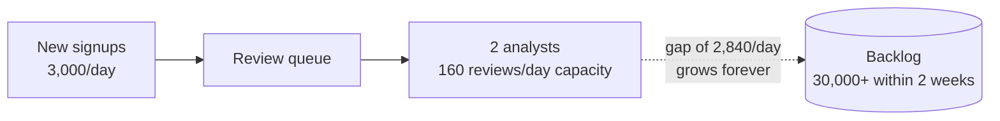

### Why this isn't just a "hire more analysts" problem

The obvious question: *why is a human looking at a photo the bottleneck for something a computer
should be able to check?*

Because "does this photo match a real government record" isn't actually a question a human
eyeballing an image can answer well in the first place. A human can spot an obviously fake photo.
But a human cannot confirm that the ID number, name, and date of birth are real and currently
valid against the government's own database. That needs a different check entirely: asking the
government's own identity authority directly.

### The fix — and a boundary worth drawing right away

There are two separate problems hiding inside "verify this person's ID":

| Problem | Who answers it | Example |
|---|---|---|
| Is this uploaded document itself authentic, not doctored? | Document-authenticity vendors (Jumio, Onfido) using OCR and template matching | "Is this a real ID template, or a photoshopped one?" |
| Does this name/ID number/date-of-birth actually match a real government record for a real, living person? | Only the government's own identity authority — because only it holds the actual records | "Does Aadhaar have a real, live record matching these details?" |

NimbusPay's compliance requirement is the second one — a real match against **Aadhaar**, India's
national ID system, run by **UIDAI**. This story is about that second problem. Document
authenticity is a real, separate deep dive, deliberately parked here and not explored further.

### How I'd say this in an interview

"Manual review of an uploaded photo doesn't scale linearly, and worse, it's not even answering the
right question — a human can't confirm a match against a government database just by looking at a
photo. The real fix is calling the actual identity authority's API directly, which immediately
raises a new question: how does that call behave under load?"

---

## Chapter 2 — The API call that works fine, until the quota runs out at noon

### The fix that seems obvious

Instead of a human eyeballing a photo, NimbusPay's signup flow now calls Aadhaar's eKYC API
directly, **synchronously**, right there inside the signup request:

1. Send the ID number and consent.
2. Get back a match / no-match.
3. Finish signup.

On a normal day this feels great. Aadhaar's typical call latency is a few seconds `[illustrative —
real eKYC calls are documented as taking real, non-trivial time, but the exact per-call latency
varies by load and integration]`. Signup just feels a little slower than before, not broken.

### The spike that breaks it

Then NimbusPay's bank partnership runs a marketing push, and signups spike:

- Normal day: **120,000 signups/day**
- Spike day: **600,000 signups in one day** `[illustrative, matching the reference guide's worked
  capacity numbers]`

Here's the part that actually breaks things. Aadhaar doesn't grant NimbusPay unlimited calls. Like
every real requesting organization, NimbusPay's contract comes with limits:

- A **hard daily quota**: 200,000 verifications/day.
- A **per-second cap**: 50/sec sustained, bursts to 100/sec `[illustrative]`.

Nobody paced the synchronous calls against that daily number. Walk through what happens:

- Signups keep flowing in all morning, each one immediately calling Aadhaar.
- By around **11:40am**, NimbusPay has already burned through all 200,000 of today's quota.
- Every signup attempt *after* that gets a flat rejection from Aadhaar's side — not "pending," a
  hard error — for the rest of the day.

New users trying to open an account get a broken-looking app, not a queue.

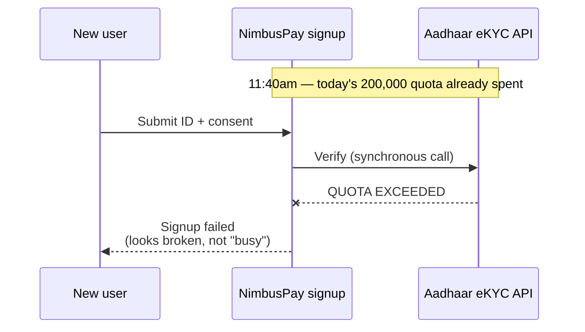

### The obvious next question

*Why not just cache everyone's ID data ahead of time, the way you'd bulk-pull a dataset for almost
anything else in this genre?*

That question is the whole next chapter — and the answer is genuinely "you can't," not "you
shouldn't."

### How I'd say this in an interview

"A synchronous call to an external authority inherits two of its constraints at once — its
per-call latency, and its quota. A signup spike hits the quota wall a lot faster than most people
expect, because nothing in a plain synchronous call paces demand against a fixed daily budget. The
instinct at this point in every other chapter in this genre is to cache the source data — here,
that instinct is a dead end, and it's worth naming why explicitly."

---

## Chapter 3 — The notary who only notarizes the person standing in front of them

### The tempting shortcut

Someone on the team, having worked on a different project that bulk-cached an IP address list,
asks the obvious question: *"Why don't we just bulk-download India's national ID database once,
and check against our own local copy forever after — the same way we cached that IP list?"*

### Why the answer is no, on two grounds

**Ground 1 — legally.** NimbusPay has no basis to hold or bulk-query identity records for people
who haven't even signed up yet, let alone consented. Aadhaar's own regulations (a real, documented
restriction under India's identity-authority framework) permit verification only for a specific,
consenting individual, at the moment they request it.

**Ground 2 — technically.** The authority won't answer that question anyway. Its eKYC API
verifies:

- **One individual**
- **One submission**
- **Under explicit consent**

There's no "give me the whole dataset" endpoint. That dataset is 1.3 billion+ people's private
records. The entire point of consent is that nobody gets to hold that in bulk — including the
government's own commercial partners.

### The analogy to keep for the rest of this story

Think of a notary public who only ever notarizes the document of the person physically standing in
front of them, with their own ID in hand, right now.

You cannot hand a notary a phone book and ask them to pre-notarize everyone in it "just in case."
The notary's entire job is built around verifying one specific, present, consenting person at a
time.

Aadhaar's eKYC API is that notary. There is no back room with a photocopy of every signature
already notarized in advance.

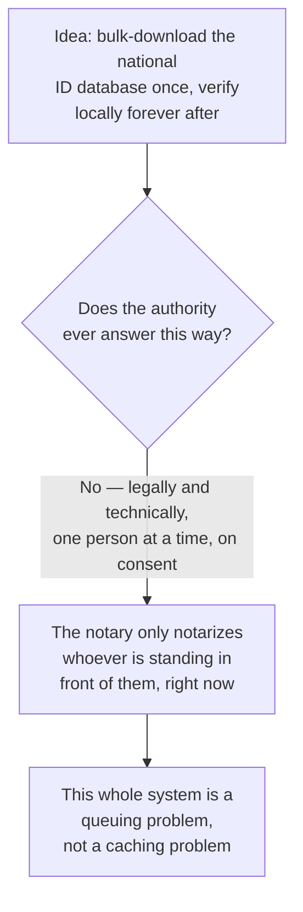

### Why this reframes everything

Every other "verify against a slow external source" system in this genre solves the problem by
pulling a bounded dataset in bulk, once, and serving it locally forever. That playbook is
structurally unavailable here.

What's left is:

> Pace an unpredictable, bursty stream of one-at-a-time requests against a fixed daily supply,
> without ever double-spending that supply or leaving a user in limbo.

### How I'd say this in an interview

"The instinct to bulk-cache the source doesn't apply here, and it's worth saying out loud,
unprompted, why not — the authority is a notary, not a database export: one consenting person, one
request, at a time, by law and by API design. That single fact turns this into a queuing and
backpressure problem, not a caching problem, and it should reframe every design decision from here
on."

---

## Chapter 4 — Async fixes the wrong half of the problem

### The fix everyone reaches for next

Stop making the user wait on the call. Instead:

1. Accept the signup immediately.
2. Drop "go verify this person" into a queue.
3. Let a pool of background workers call Aadhaar as fast as they can.
4. Notify the user later when it resolves.

This *does* fix one real problem: the user isn't stuck staring at a spinner while Aadhaar's API
takes its sweet time.

### But watch what happens to the quota

NimbusPay sizes the worker pool for throughput — the same instinct you'd apply to literally any
other background job system. Walk through the numbers:

- **30 workers**, each calling Aadhaar at **~7 calls/sec**.
- Combined throughput: 30 × 7 = **~210 calls/sec**.
- The day's quota is 200,000 calls.
- Time to exhaust it: 200,000 ÷ 210 ≈ **952 seconds — under 16 minutes.**

And this isn't even during a spike. This happens on an *ordinary* Tuesday, because nothing in this
design paces dispatch against the quota at all. It only removed the user-facing wait — not the
underlying demand-versus-supply mismatch.

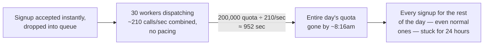

### Why this is arguably worse than Chapter 2

| | Chapter 2's failure | Chapter 4's failure |
|---|---|---|
| Visibility | Visible and immediate | Invisible |
| User experience | A broken-looking error at signup time — unpleasant but obvious | A cheerful "we'll notify you soon," then nothing happens for the rest of the day |
| Root cause | Sync call has no pacing | Background workers already spent the budget before lunch |

Async alone didn't remove the quota wall. It just moved it somewhere the team can't see it hit.

### How I'd say this in an interview

"Making the call asynchronous fixes the user-facing latency problem, but it does nothing about the
actual bottleneck, which is a fixed daily quota, not latency. A worker pool sized for throughput
will cheerfully burn an entire day's budget in the first few minutes if nothing paces it — async
without quota-awareness just delays when you notice the same wall from Chapter 2, and arguably
makes it quieter and worse."

---

## Chapter 5 — The rationed fuel pump: always let the car in line, never let it drink more than its share

### The real fix, in two parts that must ship together

1. **Always accept the submission instantly.**
2. **Pace the actual calls to Aadhaar** against a live, tracked remaining-budget counter.

### The analogy

Think of a small town with exactly one fuel pump, and exactly one truck's worth of fuel —
**200,000 liters** — delivered each morning.

The attendant's job isn't to turn cars away once the tank gets low. Instead, the attendant:

- Lets every car join the line the moment it arrives.
- Doles out fuel car-by-car for as long as the tank has anything left.
- Tracks the exact remaining liters after every single fill-up.

When the tank hits zero, the pump doesn't explode, and it doesn't start turning people away
rudely. It just stops dispensing until tomorrow's delivery — and the line that's already formed
simply waits, visibly, honestly.

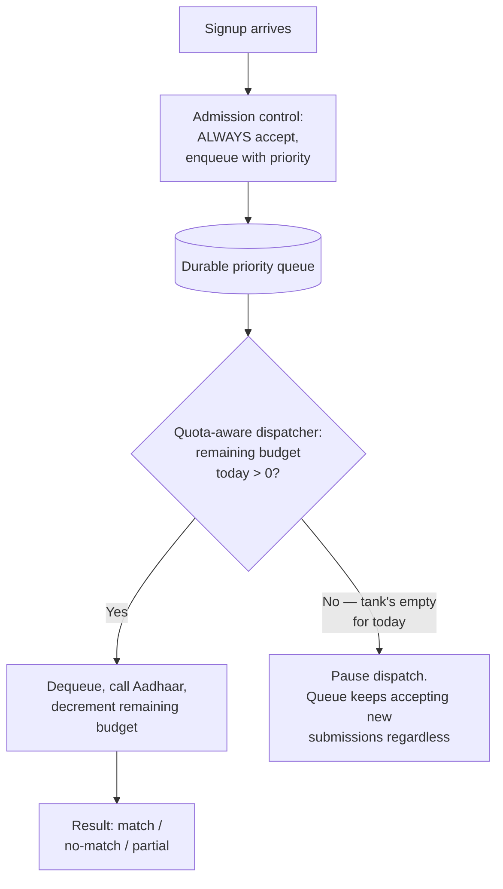

### Walking the 600,000-signup spike through this fix

Recall the spike day from Chapter 2: 600,000 signups arrive, but the fuel pump attendant still only
has 200,000 liters today.

- **Step 1:** All 600,000 people get let into the line. Nobody is turned away at the gate.
- **Step 2:** 200,000 of them get their fuel (verified) today.
- **Step 3:** The other 400,000 wait, still in line, still accepted.
- **Step 4:** Once signups return to normal, the dispatcher keeps clearing at a steady 200,000/day.
- **Step 5:** That backlog of 400,000 clears in about **2 additional days** — a concrete, sayable
  number, instead of a vague "the queue will handle it eventually."

### Why "always accept, pace the work" beats "reject when the tank's low"

| Approach | What happens |
|---|---|
| Reject outright when quota is tight (Chapter 2's hard error) | Forces the user to somehow know to come back later, with zero guarantee they will — quietly losing real signups |
| Accept every submission into a durable queue, be honest ("verification pending, may take a bit longer today") | Preserves every single one and lets the backlog drain automatically as tomorrow's fuel truck arrives, without asking the user to do anything at all |

### How I'd say this in an interview

"Never reject a submission because the quota's tight — always accept it into a durable,
priority-ordered queue, and pace the actual calls to the authority against a live
remaining-budget counter, exactly like a pump that tracks how much fuel is actually left in
today's delivery. The queue is the backpressure; the user-facing promise stays honest —
'pending,' never a lie about instant results, and never a dead end either."

---

## Chapter 6 — Don't let a retry drink twice from the same tank

### The problem with naive retries

A verification call to Aadhaar occasionally fails transiently — a network blip, a timeout, a 5xx
from the authority's own side under its own load. Naturally, the dispatcher retries.

But here's the catch nobody in the earlier, non-quota-limited chapters of this genre has to think
about: **every retry drinks from the exact same 200,000-liter tank as a brand-new signup.** A
naive retry-until-success policy can quietly let a wave of transient failures eat a chunk of the
day's budget that was meant for fresh, first-time users.

### Working the retry-budget numbers `[illustrative]`

- About **3% of calls** need at least one retry.
- Each of those needs, on average, **1.5 retries**.
- Reserved retry budget: 200,000 × 0.03 × 1.5 ≈ **9,000 liters**, set aside out of the 200,000.
- That leaves **≈191,000** as the *effective* fresh-submission capacity the admission-control
  queue should actually pace against — not the headline 200,000.

That 191,000 is a small slice smaller on paper, but it's the exact number that keeps a retry storm
from starving new users of their fair share.

### The second, sneakier failure mode

There's a true "drink twice from the same tank" bug hiding here: what if the network blip happens
*after* Aadhaar already processed the call successfully, but the response never made it back to
NimbusPay?

Walk through it:

1. Dispatcher calls Aadhaar to verify a person.
2. Aadhaar successfully processes the verification.
3. The response is lost in transit on the way back.
4. NimbusPay's dispatcher times out and assumes failure.
5. A naive retry would fire a whole *new* verification call for a person who's already been
   verified — spending a second fuel unit for the same car.

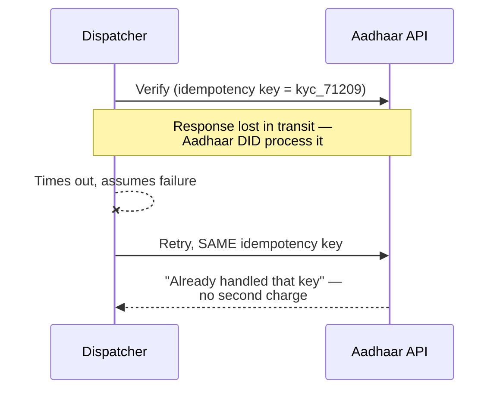

### The fix

Reuse the *same idempotency key* across a retry of the same verification attempt. Real
identity-verification APIs support this precisely because retries are expected. A retried call
carrying the same key doesn't get double-charged against the quota — even though the network made
it look like a fresh failure.

Retries should also queue *behind* fresh submissions once the 9,000-unit retry reserve is
exhausted for the day. A retry storm shouldn't be allowed to out-compete a brand-new user's very
first attempt.

### How I'd say this in an interview

"Retries consume the exact same scarce quota as a first attempt, so budget for them explicitly in
capacity planning — a few percent, sized from the actual transient-failure rate. And reuse the
same idempotency key on every retry of the same attempt, so a lost response doesn't turn into a
second charge against a fixed daily budget for one person who was already verified."

---

## Chapter 7 — The intercom, not five people calling the front desk

### The setup

Verification now finishes asynchronously — anywhere from seconds to, on a bad day, hours.
Multiple downstream services at NimbusPay need to know the second it resolves:

- The account-limits service (how much can this wallet hold)
- The feature-gating service (can this user send money yet)
- Fraud scoring
- And more

### The naive move, and the numbers that break it

The naive move: each of those services just **polls** the verification service's status endpoint
every few seconds for every pending user.

Work through the numbers `[illustrative]`:

- **200,000 pending verifications** on a busy day.
- **5 downstream services**, each polling every 5 seconds.
- Total poll rate: 200,000 × 5 ÷ 5 = **200,000 status checks every second.**

That's a firehose of "still pending? still pending? still pending?" hammering the verification
service — for a status that, per user, changes **exactly once.**

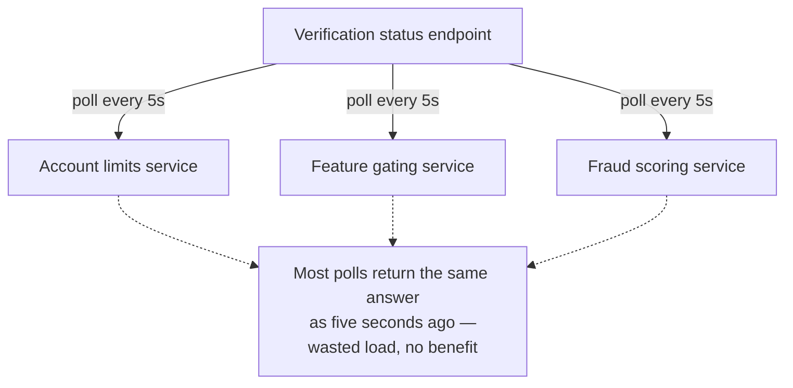

### The fix, and the analogy

Instead of five departments each calling the front desk over and over asking "has the visitor
arrived yet," the front desk pages the building **once, over the intercom**, the instant the
visitor actually arrives. Every department hears it at the same time, updates its own records, and
nobody had to ask twice.

Concretely: the moment a verification resolves, publish a single `KYC_RESOLVED` event — carrying
status, `userId`, `verificationId` — to an event bus. Every downstream service subscribes once and
reacts, instead of polling.

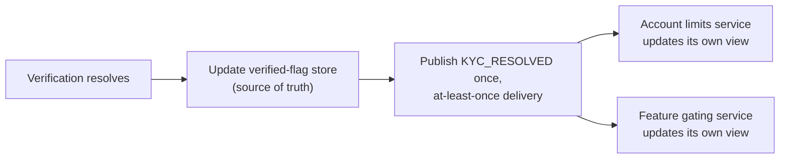

### The dedup requirement that comes free with "at-least-once"

The event bus can redeliver. A consumer that already processed `kyc_71209`'s resolution needs to
recognize the redelivery by `verificationId` and ignore it — rather than, say, doubling someone's
account limit by mistake.

This is standard event-driven hygiene, but it's worth naming out loud rather than assuming perfect,
exactly-once delivery is either achievable or necessary here.

### How I'd say this in an interview

"Push a `KYC_RESOLVED` event once, at-least-once, with a stable id for dedup — never make every
downstream service poll a verification service for a status that only changes once per user,
ever. It's the intercom-announcement pattern: tell everyone once, let each department act on its
own copy, instead of five people separately calling the front desk on a loop."

---

## Chapter 8 — The two analysts come back, but only for the cases the computer can't decide

### The residual problem

Not every Aadhaar response is a clean match or a clean no-match. Sometimes:

- The name matches but the date of birth is off by a transliteration quirk.
- The address has changed since the record was last updated.

These are **partial/ambiguous matches**. About **2% of calls** come back this way `[illustrative]`.
At 200,000 verifications/day, that's **≈4,000/day** needing a human judgment call.

### This looks like Chapter 1's problem again — but it isn't, quite

Notice what just happened: this is almost exactly Chapter 1's problem again, at a smaller scale.

- 2 analysts still only clear 160/day.
- 4,000/day is *still* 25x too many for them.

But it's a much better version of the same problem, for one crucial reason: **it's now scoped to
just the 2% the computer genuinely can't decide, not 100% of all signups.** Manual review didn't
disappear — it got rescoped from "everyone" to "only the ambiguous cases." That's a review queue
NimbusPay can actually staff and plan capacity for, sized against its own real volume, the same way
any other queue in this system gets sized.

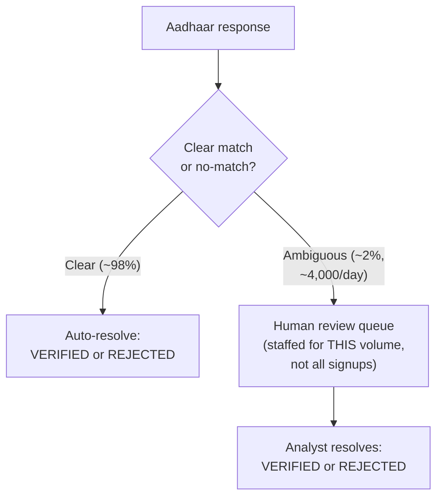

### Never a plain yes/no

The outcome of a verification is always one of three things — never a boolean:

| Outcome | Meaning |
|---|---|
| `VERIFIED` | Clearly matched |
| `REJECTED` | Clearly didn't match |
| `NEEDS_REVIEW` | A human needs to look at this |

Collapsing these three into a single true/false would either wrongly approve ambiguous cases or
wrongly bounce good users who just have a messy record.

### How I'd say this in an interview

"The human review path from Chapter 1 doesn't vanish — it gets rescoped to just the ambiguous
slice the automated match can't confidently call, roughly a couple percent of volume here. That's
a completely different staffing problem than reviewing 100% of signups, and it's the same
three-way decision shape — match, no-match, needs-review — you'd use for any scored, ambiguous
matching system."

---

## Chapter 9 — One shared bank account, not five branch ledgers

### The setup, and the first naive fix

NimbusPay runs dispatchers in two data centers for redundancy.

**Naive fix #1: split the quota evenly.** Each DC gets half: **100,000/day** each.

This breaks the first time demand isn't evenly split:

- A regional marketing push floods DC-East with signups.
- By noon, **DC-East has burned its whole 100,000.**
- Meanwhile, **DC-West is sitting at 40,000 used, 60,000 idle.**

That 60,000 is real, unused capacity — but DC-East has no way to borrow it.

### The second naive fix, and why it's worse

**Naive fix #2: let each DC track its own counter, syncing every few minutes.**

This has the same disease as any cache-to-cache sync of a mutable number: between syncs, **both
DCs can believe they have headroom left, and both dispatch against it.** That jointly exceeds the
real 200,000 for the day.

This is a genuine double-spend of a shared, consumable, external budget — not a harmless staleness
like a cached IP list being a version behind.

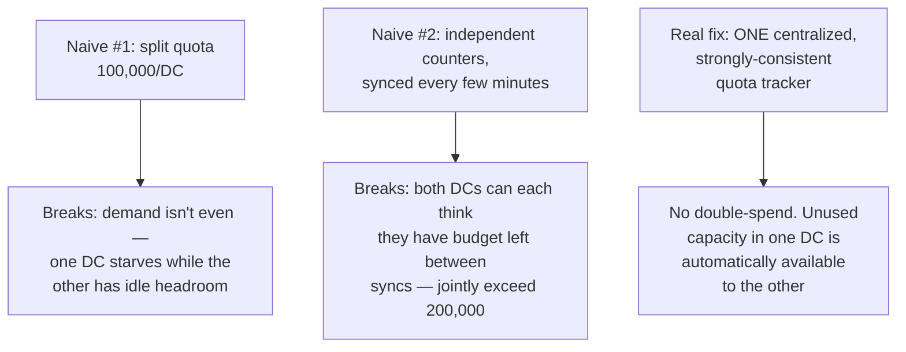

### The analogy

Think of the difference between:

- One shared bank account with a **live balance** that every branch checks before approving a
  withdrawal, versus
- Five separate branch offices, each keeping their own **paper ledger**, only reconciling with each
  other every few minutes.

The paper-ledger version is fine for an end-of-day report. It is not fine for deciding, in real
time, whether there's still money left to spend right now — two branches can each approve a
withdrawal against money that, combined, doesn't exist.

The fix is the shared, live-balance account: **one centralized, strongly-consistent quota
tracker**, and every DC's dispatcher checks it before every single call.

### Why this is the one place in the whole system that needs strong consistency

| State | Tolerates eventual consistency? | Why |
|---|---|---|
| Cached IP block-list snapshot | Yes | Being a version behind causes basically no harm |
| Quota counter | **No** | Being stale in the "we think we have more left than we actually do" direction directly causes exceeding Aadhaar's real quota — which risks throttling or even suspension of NimbusPay's access entirely |

Every other piece of state in this design can tolerate eventual consistency. The quota ledger
cannot.

### How I'd say this in an interview

"The quota is a shared, consumable resource, not a replicable snapshot — it needs one centralized,
strongly-consistent tracker every DC checks before every call, like a shared bank account with a
live balance, not per-DC slices and not periodic sync, either of which risks double-spending a
fixed external budget you can't just top up yourself."

---

## Chapter 10 — The bouncer who remembers "yes, over 21," not a photocopy of your ID

### The last problem — legal, not scaling

This one isn't a scaling problem — it's a legal one, and it was implicit from Chapter 3 onward:
what exactly does NimbusPay get to *keep* after a verification resolves?

### The naive instinct, and why it's illegal

**The naive instinct:** store the full Aadhaar response and the raw ID number, "just in case we
need it later" — the same instinct that leads teams to log everything by default.

This is precisely what real identity-authority regulations, including Aadhaar's own framework,
explicitly restrict. Many such regimes prohibit third parties from retaining the raw national ID
number at all, let alone the government's full response payload.

### The fix, and the analogy

A good bouncer checking IDs at a bar doesn't photocopy your license and file it away. They check it
once, and all that persists afterward is "yes, this person is over 21."

NimbusPay's verified-flag store works the same way. It keeps:

- A **hash** of the ID number (not the raw number)
- A **derived status** (`VERIFIED` / `REJECTED` / `NEEDS_REVIEW`)
- An **audit trail**

It never keeps the raw government response. That raw response is used transiently to compute the
status, then discarded — never archived.

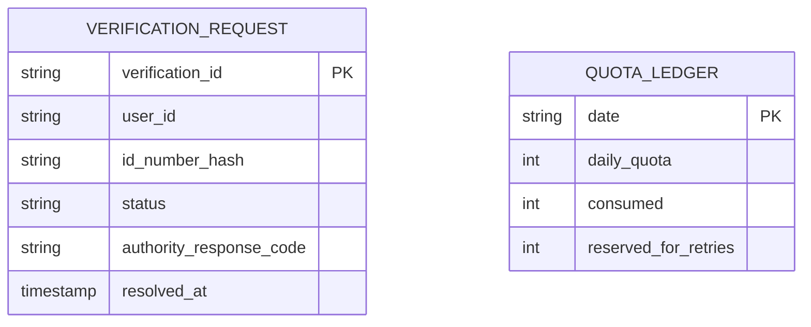

### Consent is a hard prerequisite, not a UX nicety

Every single call to Aadhaar must carry a valid, logged consent token. This is:

- A **legal requirement**, and
- Practically, a **condition of keeping API access at all** — an integration caught calling the
  authority without consent risks losing access entirely, which would break every chapter of this
  design at once.

### How I'd say this in an interview

"Store a hash of the ID number and a derived status, never the raw ID number or the raw government
response — the same 'remember the conclusion, not the document' discipline as a bouncer checking
IDs. And consent isn't optional UX polish; it's a hard legal gate on every single call, logged,
because the authority's own access agreement depends on it."

---

## Where the story actually lands

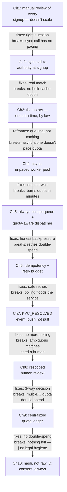

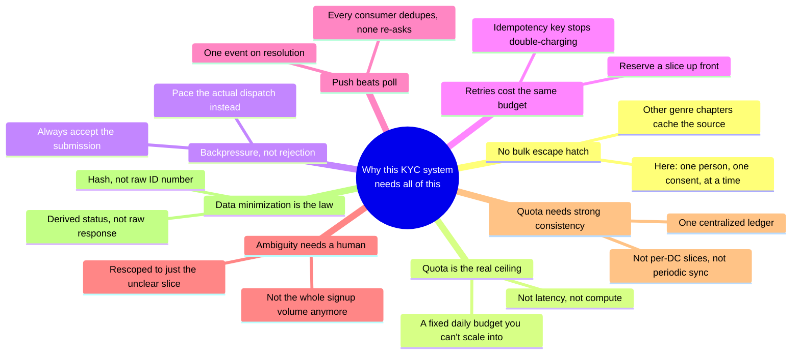

Every real KYC-against-an-authority system you'll design in an interview sits somewhere on this
chain.

- A product that can tolerate slow, honest onboarding might reasonably stop around Chapter 5.
- One with real compliance teeth has to reach Chapter 8, 9, and 10.

Walking all ten chapters unprompted when nobody's asked about multi-DC or data retention reads as
padding, not depth. Stop where the stated requirements say to stop.

---

## Grill me — adversarial follow-ups

**Q1: "Why not just negotiate a much bigger quota instead of building all this queuing
machinery?"**

That's genuinely often the highest-leverage move, and worth saying unprompted — sometimes the
right systems-design answer is "renegotiate the contract," not "engineer around it harder." But
you still need the queue and the dispatcher regardless of the quota's size, because demand will
always be bursty and unpredictable relative to *whatever* fixed number you're granted. A bigger
tank still needs the same rationing logic, just with more headroom.

**Q2: "If the authority is down entirely for an hour, what happens to the queue?"**

Nothing gets lost. Submissions keep being accepted into the durable queue exactly as before — the
dispatcher just has nothing to successfully dispatch. A circuit breaker should trip after enough
consecutive failures so the dispatcher stops burning retry budget hammering a dependency that's
clearly down, and resumes once the authority's health signal recovers.

**Q3: "Couldn't you just increase the number of workers to push through the backlog faster after a
spike?"**

No — that's the mistake Chapter 4 already made. The bottleneck was never worker throughput; it's
the authority's fixed daily quota. More workers just means you hit the same 200,000-call ceiling
even faster, not that you process more calls in total that day.

**Q4: "Why does the retry idempotency key have to be the same across retries — why not just make
each retry attempt look like a fresh call?"**

Because a fresh call for the same underlying attempt is exactly how you double-spend the quota. If
the first attempt actually succeeded on the authority's side and only the response got lost, a
"fresh" retry becomes a second real charge against a fixed daily budget for a person who's already
been verified.

**Q5: "Isn't storing just a hash of the ID number pointless — can't you re-derive the original from
a hash of a fairly small ID-number space?"**

That's a real, fair concern, and it's why the hash needs a proper salt or HMAC keyed on a secret
NimbusPay controls, not a bare unsalted hash of a predictable number space. The point isn't
theoretical unguessability from public info alone — it's meeting a legal minimization requirement
while keeping enough of a stable reference to detect the same person resubmitting. That design
detail is worth naming if pressed.

**Q6: "What happens if the same person tries to sign up twice, maybe on two different devices?"**

An idempotency key derived from the user's identity (not just their session) at the
admission-control layer catches this before it ever reaches the queue. The second submission gets
recognized as a duplicate of an in-flight or already-resolved verification, rather than consuming a
second unit of the day's quota for one real person.

**Q7: "Why push a `KYC_RESOLVED` event instead of just writing directly to each downstream
service's database from the verification service?"**

Because that couples the verification service to the internal schema and availability of every
downstream consumer, and a new consumer means changing the verification service's code every time.
A published event lets any number of consumers subscribe independently, react in their own time,
and be added or removed without touching the source of truth at all.

**Q8: "You said the quota ledger needs strong consistency — doesn't that make it a single point of
failure across your whole multi-DC design?"**

Fair, and the honest answer is yes, in the sense that it's one small, critical, highly-available
service every DC depends on. But it's a small, well-bounded piece of state (one counter per day),
which is much easier to make highly available with real consensus than the large bulk datasets
elsewhere in this genre. The alternative — per-DC independence — trades that single point of
failure for a guaranteed double-spend risk, which is strictly worse.

**Q9: "How would you handle a second country with a completely different national ID authority and
API contract, and where would you start cold if someone just said 'design a KYC verification system
backed by a government ID authority'?"**

Treat the second country as a second instance of the same shape: its own quota ledger, its own
dispatcher pacing its own limits, its own consent and data-minimization rules — rather than one
global tracker across two legally unrelated authorities. Only the admission-control and queue layer
stays shared.

And starting cold, say the structural fact first, unprompted: unlike almost every other "verify
against a slow external source" system, there's no bulk-cache option here, because the source only
answers one consenting person at a time against a fixed daily quota. That one sentence tells the
interviewer this is a queuing-and-backpressure problem, not a caching problem, before a single box
gets drawn.

---

## Cheat sheet — one line per stop on the story

- **Manual review**: doesn't scale linearly, and worse, can't actually confirm a match against a
  real government record — that needs the authority itself, not a human eyeballing a photo.
- **Synchronous call to the authority**: inherits both its latency and, more dangerously, its fixed
  quota — a signup spike can burn a whole day's budget by lunchtime with a hard error, not a queue.
- **The notary (no bulk-cache escape hatch)**: the authority only verifies one consenting person at
  a time, by law and by API design — there is no dataset to pre-fetch, which reframes this whole
  system as queuing, not caching.
- **Async without quota-pacing**: fixes user-facing wait time, does nothing about the quota wall —
  an unpaced worker pool can burn a full day's budget in minutes, invisibly.
- **The rationed fuel pump (always accept, pace the dispatch)**: never reject a submission for lack
  of quota — queue it, communicate honestly, and pace outbound calls against a live
  remaining-budget counter.
- **Retry budget + idempotency**: retries spend the same scarce quota as first attempts — reserve a
  slice explicitly, and reuse the same idempotency key across retries so a lost response never
  becomes a second charge.
- **The intercom (push, not poll)**: publish one `KYC_RESOLVED` event on resolution, at-least-once,
  with a dedup key — never make every downstream service poll a status that changes once per user.
- **Rescoped human review**: ambiguous matches still need a person, but only a couple percent of
  volume, not 100% of signups — a three-way outcome (`VERIFIED` / `REJECTED` / `NEEDS_REVIEW`),
  never a plain boolean.
- **The shared bank account (centralized quota ledger)**: the quota is a shared, consumable
  resource across DCs, not a replicable snapshot — one centralized, strongly-consistent tracker,
  checked before every call, is the one place in this design that can't be eventually consistent.
- **The bouncer (data minimization)**: keep a hash of the ID number and a derived status, never the
  raw ID number or the raw authority response — and never call the authority without a logged
  consent token, full stop.
- **The meta-lesson**: every fix here trades one property for another — a bigger quota buys
  headroom, not correctness; a queue buys honesty, not speed; strong consistency on the ledger buys
  safety, not availability. Say the trade in the same sentence you propose the fix.
