# Design a Multi-Source Sanctioned-Country Payment Blocking System — The Story (narrative edition)

> **What this file is.** The reference file,
> `51-Multi-Source-Sanctioned-Country-Payment-Blocking-FAANG-Guide.md`, is the one to recite from —
> it has the requirements, the API shapes, the aggregation formula, and the master cheat sheet.
>
> This file is a second way in. It tells the same material as one continuous story, in plain
> language. Engineers at a fictional cross-border payments processor, **Tradewind Payments**, keep
> hitting a wall. They patch it. The patch creates the next wall. This keeps happening until we
> land on the exact design the reference file documents.
>
> Tradewind itself is fictional. But every wall it hits is something real:
> - The US Treasury's OFAC and its Specially Designated Nationals (SDN) list.
> - The EU's own consolidated sanctions list.
> - The UN Security Council Consolidated List.
> - The well-documented fact that OFAC maintains a comprehensive embargo on Cuba that the EU does
>   not mirror.
> - The real 2019 escalation of US sanctions on Venezuela.
> - The largest sanctions-violation settlement in history — BNP Paribas's $8.9 billion fine in 2014.
>
> I'll say clearly, every time, whether a number is documented fact or a reasonable stand-in,
> tagged `[illustrative]`.

**The one-sentence core idea:** a cross-border payment is never sanctioned or cleared by *one*
authority's yes/no. It's governed by however many independent regulators actually have a legal
claim on it. And the hardest part of this whole system isn't checking a list — it's figuring out
*which* lists even apply to this specific payment before you can ask any of them anything.

---

## Chapter 1 — The list taped above the terminal

It's 2016. Tradewind is a small cross-border payments startup. It connects merchants in Southeast
Asia and Latin America to buyers worldwide.

An engineer gets a ticket: "add sanctions compliance," due this sprint. He reads the OFAC website
once, and writes this:

```python
BLOCKED_COUNTRIES = ["IR", "KP", "SY", "CU"]  # Iran, North Korea, Syria, Cuba
```

This matches OFAC's traditional comprehensively-sanctioned countries at the time — a real,
documented list. It ships. For two and a half years, it works fine. Nobody touches it again.

### The Venezuela gap

In January 2019, the US Treasury sharply escalates sanctions on Venezuela's government and its
state oil company, PDVSA. This is Executive Order 13884 — a real, documented action. It moves
Venezuela from "some restrictions" to something close to a comprehensive government-level block.

Tradewind's hardcoded array still reads `["IR", "KP", "SY", "CU"]`. Venezuela was never on it. And
nothing about this new executive order changes a Python list sitting in a repo nobody has opened
in years.

Here's what that gap actually costs, worked out step by step:

1. By early 2019, Tradewind processes roughly **40,000 cross-border payments/day** `[illustrative]`.
2. A small slice of those touch Venezuelan payers or payees — say **0.4%** `[illustrative]`.
3. That's about **160 payments/day** `[illustrative]` now flowing straight through, fully approved,
   to a jurisdiction the US government just placed under sweeping restrictions.
4. It takes **11 days** `[illustrative]` before a compliance analyst doing a routine sample review
   notices and escalates.

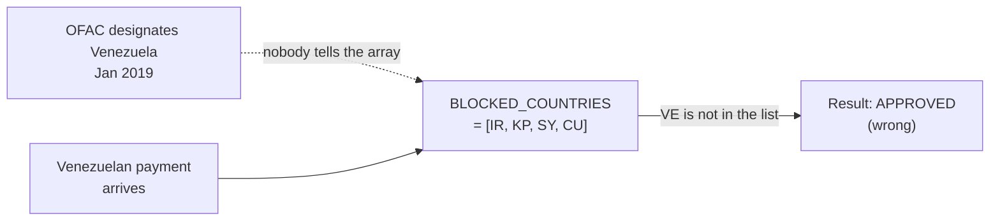

### Why does an eleven-day gap happen at all?

Because nothing in the system watches the list itself. It's just a constant, and constants don't
expire loudly. Nobody gets paged when a hardcoded array becomes outdated — it just sits there,
quietly wrong.

The real-world stakes for getting this wrong are not abstract. BNP Paribas paid **$8.9 billion**
in 2014 — still the largest sanctions-violation settlement ever — for processing transactions tied
to sanctioned countries including Sudan, Iran, and Cuba. This is a real, widely documented case.

Tradewind is nowhere near that scale. But the failure mode is identical: a payment that should
have been blocked, wasn't, because the list making that call was stale.

### The fix: stop hardcoding, start pulling

Stop hardcoding the list. Pull it from the actual source instead. OFAC publishes its SDN list as a
downloadable, machine-readable file, so pull it on a schedule, automatically.

Call this **the photocopy**. Instead of one engineer reading a webpage once and typing it into
code by hand, a job goes and photocopies OFAC's actual, current list every day. Tradewind's checks
now run against *that* — not against anyone's memory of what the list used to say.

### New problem, immediately

OFAC doesn't only publish on a nice fixed daily schedule. Designations can land the moment a
real-world event happens. A once-a-day photocopy job means the *worst* case gap between "OFAC
changed the list" and "Tradewind's copy reflects it" is a full day — not zero.

> **How I'd say this in an interview:** "The very first bug in this whole space is always the same
> one: someone hardcodes a snapshot of a sanctions list at one point in time, and nothing re-checks
> it. The fix is automating the pull from the actual authoritative source on a schedule — but that
> immediately raises the next question, which is how fresh 'on a schedule' actually needs to be."

---

## Chapter 2 — The photocopy that's a day behind reality

Tradewind builds the photocopy job. Here's what it does, step by step:

1. Pull OFAC's SDN file nightly.
2. Parse roughly **15,000 entries** (the real, documented rough size of OFAC's SDN list).
3. Build a lookup index from those entries.
4. Swap the new index in, replacing the old one.

This is mechanically identical to the ingestion pattern any single-source sanctions-list guide
would teach: pull, validate, version, swap.

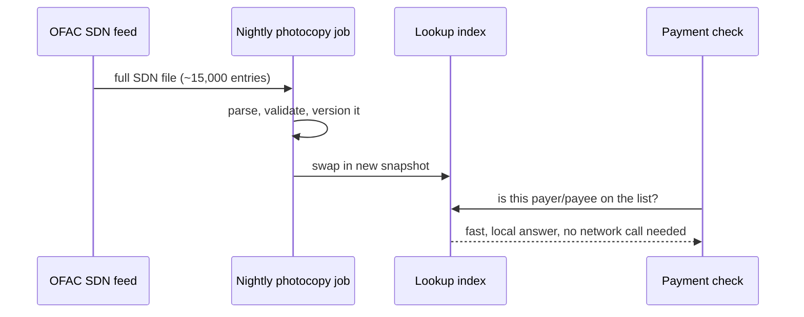

### The out-of-cycle designation

Six months later, OFAC issues an out-of-cycle designation in response to a real-world event. This
is documented, normal OFAC behavior — urgent designations don't wait for a convenient publishing
day.

Here's the timeline of the gap:

- Tradewind's job runs at 2 AM.
- It won't run again for **24 hours**.
- A newly-designated entity's payment can sail through for up to that entire day, simply because
  the photocopy hadn't been retaken yet.

Worked number: at 40,000 payments/day, even a worst-case one-day staleness window on a single
freshly-designated entity is a real, live compliance gap. It's not theoretical — it's just smaller
and rarer than Chapter 1's eleven-day gap.

### Doesn't more frequent pulling just fix this?

The obvious next question: *why not just photocopy more often — every hour, every minute?*

You can. Tradewind moves to hourly pulls, and that shrinks the worst case from 24 hours down to
roughly **1 hour**. But notice what this does and doesn't do:

- It **shrinks** the staleness window.
- It does **not remove** the window.
- It does **not** fix the actual problem coming next in this story.

> **How I'd say this in an interview:** "Automating the pull fixes 'nobody's watching the list,'
> but it doesn't make staleness zero — there's always a window between when the source changes and
> when your copy reflects it. The right move is to make that window small, monitored, and
> disclosed — not to pretend it's zero. That's a fine place to stop if the interviewer's only asked
> about one source. The next problem shows up the moment legal says one source isn't enough."

---

## Chapter 3 — Three embassies, three clipboards

Tradewind starts settling payments for EU-based merchants. Separately, it starts clearing some
transactions in US dollars through a US correspondent bank.

Legal flags two new obligations at once:

- **EU law** requires screening against the EU's own consolidated sanctions list.
- **USD clearing** through the US financial system pulls OFAC's jurisdiction into transactions that
  have nothing to do with American parties.

Both are real, documented sources Tradewind now has to check. Neither replaces OFAC — they are
*additions*.

### The Cuba disagreement

The team pulls in the EU list and immediately finds a disagreement.

Real, long-documented fact: OFAC maintains a **comprehensive US embargo on Cuba**. The EU does
not. The EU has run active diplomatic and trade relations with Cuba for years, and imposes nothing
close to a comprehensive block.

So walk through what happens to a Cuban-linked payment:

- On OFAC's list, this payment should be **blocked outright**.
- On the EU's list, this payment is simply... **absent**. No entry, no restriction.

Nobody made an error here. Two governments genuinely disagree, on purpose, as a matter of foreign
policy.

### The name for this: three embassies, three clipboards

Picture three separate embassy booths. Each one holds its own clipboard of names it personally
won't clear. None of them call each other before updating their own clipboard.

A traveler can be waved through by embassy A and stopped cold by embassy B. That's not a bug in
either booth — it's just what happens when independent authorities keep independent lists.

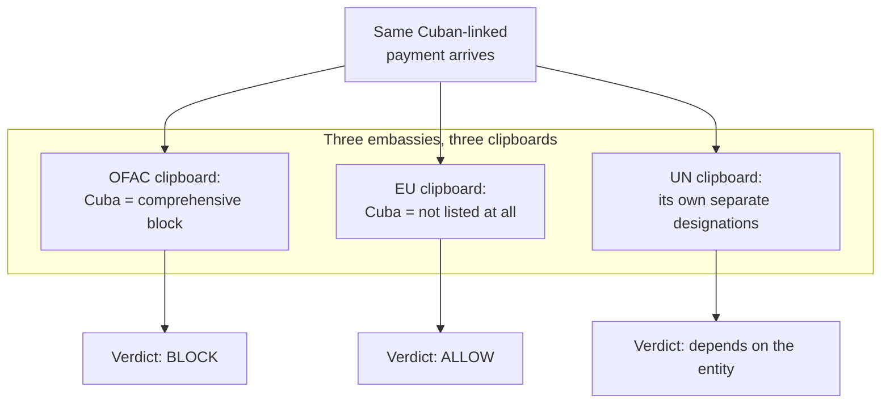

### Who wins when lists disagree?

The obvious question: *if the lists disagree, which one wins?*

Tradewind doesn't have an answer yet. And right now, they don't even have three separate
clipboards — they've been trying to just add EU entries into the *same* array as the OFAC entries,
to save time. That shortcut is about to bite them.

> **How I'd say this in an interview:** "The moment you operate in more than one jurisdiction, you
> don't have 'the sanctions list' anymore — you have several, run by different governments, on
> different cadences, and they genuinely disagree by design, like Cuba under OFAC versus the EU.
> That's not a data-quality bug to fix, it's a structural fact you have to design around."

---

## Chapter 4 — The stapled clipboard

Under deadline pressure, an engineer takes the fast path. He merges OFAC's and the EU's entries
into one combined table at ingestion time, with a single `is_blocked` boolean per entity.

Call this **the stapled clipboard**. Picture literally stapling embassy A's and embassy B's
clipboards together, writing just one "yes" or "no" per name on the front page, and then throwing
the original two pages away.

### It works — until an audit asks the wrong question

At first, this seems fine. Payments still get blocked or allowed correctly.

Six weeks later, a compliance audit asks a very specific question about one blocked payment:

> "Which list actually flagged this — OFAC or the EU list — and what was each one's individual
> verdict?"

Tradewind's engineers open the database and find... one boolean. The staple already happened.
There is no way to reconstruct which of the two original clipboards said "block" and which said
"allow." That information was thrown away the moment the two lists were merged.

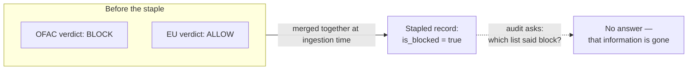

This isn't a hypothetical concern in this industry. Sanctions enforcement settlements routinely
come with detailed record-keeping and monitoring requirements attached. HSBC's 2012 deferred
prosecution agreement — a real, documented $1.9 billion settlement — explicitly required years of
enhanced, auditable transaction-monitoring going forward.

A system that can't say which source drove a decision fails exactly the kind of audit that real
settlements actually demand.

### The fix: un-staple, and never staple again

Keep every source's data, and every source's individual verdict, in its own separate lane, forever.
Never merge two sources' answers into one flag at ingestion time.

This is the direct opposite instinct from Chapter 3's shortcut. It's the rule Tradewind commits to
for good:

> **N independent sources means N independent pipelines and N independently-stored verdicts,
> combined only at the very last step — and even then, without throwing the individual answers
> away.**

### New problem, immediately visible

Now that OFAC and the EU list both exist as their own separate lookups, a new question appears:
what stops Tradewind from just checking *every* source against *every* payment, all the time —
regardless of whether that payment has anything to do with the EU or the US at all?

> **How I'd say this in an interview:** "Merging independent sources into one flag at ingestion
> time destroys attribution permanently — you genuinely cannot answer 'which list said block' after
> the fact, and that's a hard requirement in this domain, not a nice-to-have. The fix is to keep
> every source's pipeline, index, and verdict separate all the way through, and only combine them
> at decision time, never before."

---

## Chapter 5 — Checking every booth for every traveler

With OFAC and the EU list now kept properly separate, Tradewind does the simplest correct-looking
thing: check *both* sources against *every* payment, every time.

### The wasteful version

A purely domestic Belgian merchant pays a purely domestic Belgian buyer. It's in euros. There is
zero US or Cuban connection whatsoever. This payment still gets run through OFAC's Cuba-embargo
logic — because nobody told the system it didn't need to.

That's wasteful. But the next version of this same mistake is actually dangerous.

### The dangerous version

Tradewind adds the **UN Security Council Consolidated List** as a third source. UN member states
are independently obligated to enforce UN designations on their own transactions.

Here's what goes wrong:

1. A UN designation exists against some entity.
2. A purely intra-EU transfer happens, with **no connection to that designated entity's
   jurisdiction at all**.
3. The transfer gets flagged anyway — purely because the entity's name happens to loosely match.

Worked number: this generates roughly **340 unnecessary payment holds per week**
`[illustrative]`. A review team has to manually clear every one of them. Each one is a legitimate
transaction delayed for no real jurisdictional reason.

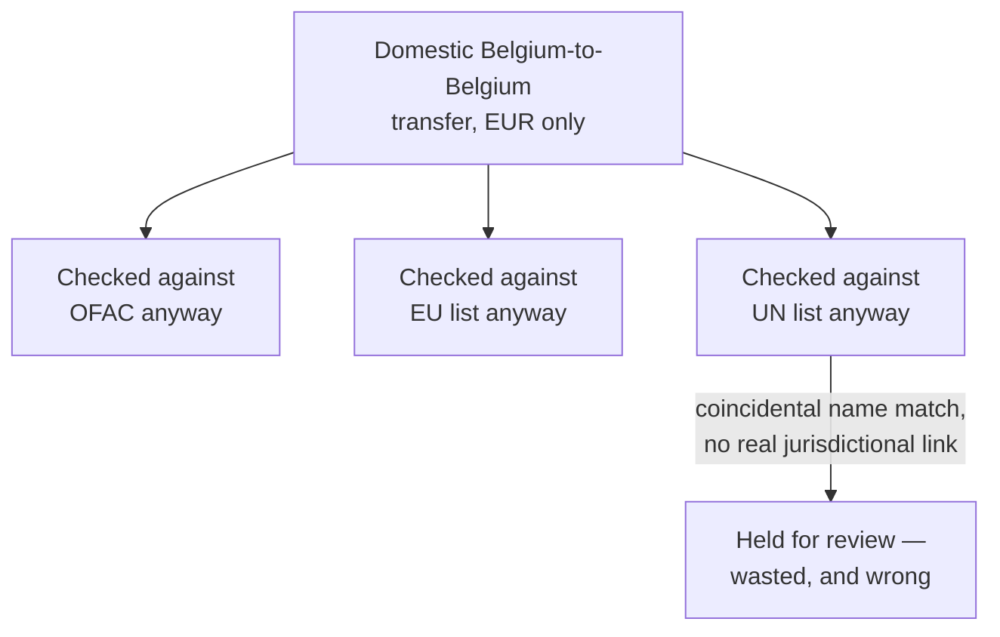

### Isn't checking everything at least safe?

The obvious question: *isn't checking every source at least safe, even if it's wasteful?*

No. And this is the part that trips people up.

A source with no real legal claim on a transaction shouldn't be allowed to block it just because a
name happened to match. A UN designation does not obligate enforcement against a purely domestic
transfer between two parties in a country with no connection to that designation.

> **Applying a source that doesn't actually apply is a wrong answer, not just wasted computation.**

> **How I'd say this in an interview:** "Checking every source against every transaction feels
> safe, but it's wrong in both directions — it's wasteful for the sources that obviously don't
> apply, and it's a real correctness bug when a source with no actual jurisdictional claim ends up
> blocking a transaction it never had legal authority over. The fix has to be figuring out *which*
> sources actually apply to *this* transaction, before checking any of them."

---

## Chapter 6 — Three witnesses, three addresses, and the dollar that always walks through the US booth

So: which sources apply to a given payment? Tradewind's first instinct is "check the payer's
country and the payee's country." But even that turns out to be ambiguous.

### Problem one: "the country" has three different answers

Consider one payer, and ask three different signals what country they're in:

| Signal | What it says |
|---|---|
| Billing address | Argentina |
| IP address | Brazil (could be a VPN, or just an imprecise geolocation database) |
| Bank account domicile | United States |

Three signals, three different, all individually defensible, answers. Call this **three
witnesses, three addresses**.

This is a real, recurring headache in this space — not a corner case. None of billing address, IP,
and bank-account country are guaranteed to agree, and a bad actor can deliberately make them
disagree.

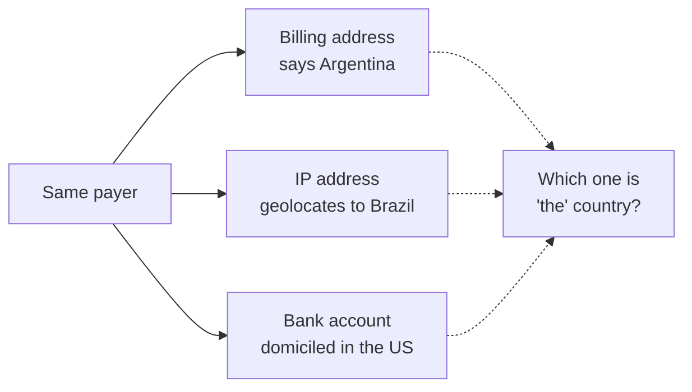

### Problem two: the dollar always walks through the US booth

A second, sharper problem sits on top of the first one. Walk through this example:

1. A company in Turkey sends money to a company in Brazil.
2. Neither party is American.
3. But the payment is denominated and cleared in US dollars, routed through a US correspondent
   bank.

Real, documented legal fact: because of how dollar-clearing routes through the US financial
system, **OFAC's jurisdiction can attach to this transaction regardless of where either
transacting party is located.**

Call this **the dollar always walks through the US booth**. It doesn't matter whose passport the
money is carrying — if it's dollars clearing through a US bank, it has to go through the US
checkpoint too.

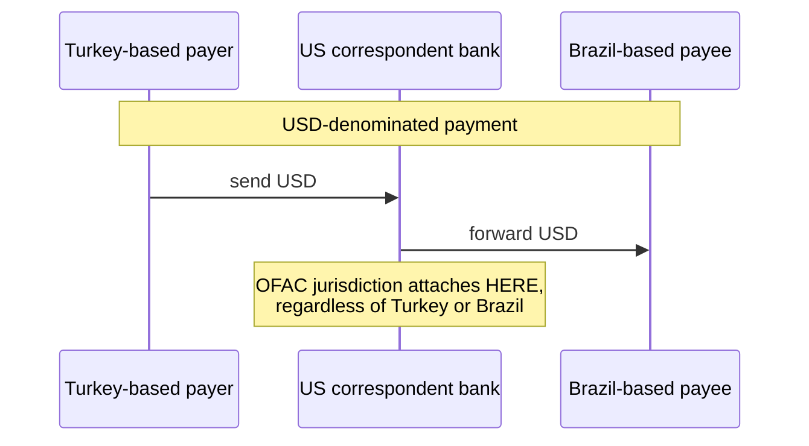

Most candidates, and Tradewind's own first design, miss this entirely. They check party countries
and stop — never noticing that currency-clearing jurisdiction is its own, separate trigger. Missing
it means a genuinely OFAC-applicable transaction between two non-US parties would sail through
unscreened.

### The fix: an explicit jurisdiction-nexus resolver

Build a small, rules-based mapping — written and reviewed by legal/compliance, never inferred by
pattern-matching. It maps transaction attributes to the set of sources that legally apply:

- **Inputs:** payer country, payee country, clearing currency, routing path.
- **Output:** the *set* of sources that actually have a legal claim on this specific payment.

Two concrete rules that fall out of this:

- USD clearing through a US bank adds OFAC to that set **unconditionally**.
- Party country adds each party's own local regulator, plus any supranational source their country
  is obligated to enforce.

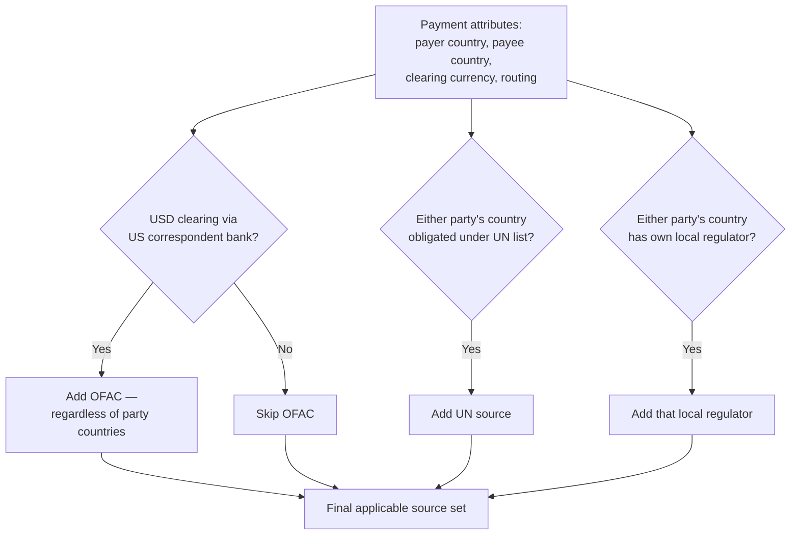

### New problem, right behind this one

Knowing which sources apply is only half the job. Those applicable sources can still individually
disagree about the *verdict* for this specific payer or payee — exactly like Chapter 3's Cuba
example, just now scoped down to one transaction instead of a whole country.

> **How I'd say this in an interview:** "Figuring out 'the' country of a transaction is genuinely
> ambiguous — billing address, IP, and bank domicile can all disagree — and on top of that,
> currency clearing creates its own jurisdiction: a USD payment between two non-US parties can
> still be OFAC's business because of how dollar-clearing routes through US correspondent banks.
> That's the single most commonly missed nuance in this whole space, and the fix is an explicit,
> legally-reviewed rules engine mapping transaction attributes to applicable sources — never an
> inferred guess."

---

## Chapter 7 — Guards don't vote, they veto

Back to the Turkey-to-Brazil, USD-cleared payment from Chapter 6. Walk through what happens:

1. Jurisdiction-nexus resolution correctly says both **OFAC** (because of USD clearing) and
   **Turkey's local regulator** (because of the payer's home country) apply.
2. Tradewind screens against both.
3. OFAC's index returns a hit — the payee matches a designated entity.
4. Turkey's local regulator returns clean.

So now there are two applicable sources, and they disagree: one says block, one says allow. What
does Tradewind actually do?

### The tempting wrong answers

- **Average them somehow.** This is meaningless — there's no numeric middle ground between
  "sanctioned" and "not."
- **Pick whichever source feels more authoritative, ignore the other.** This is arbitrary, and
  indefensible on audit.

### The actual answer: guards don't vote, they veto

Picture the three embassy booths from Chapter 3 again. If *any one* guard says stop, the traveler
stops — full stop — regardless of what the other two guards think. Guards don't hold an election.
Any single applicable veto ends it.

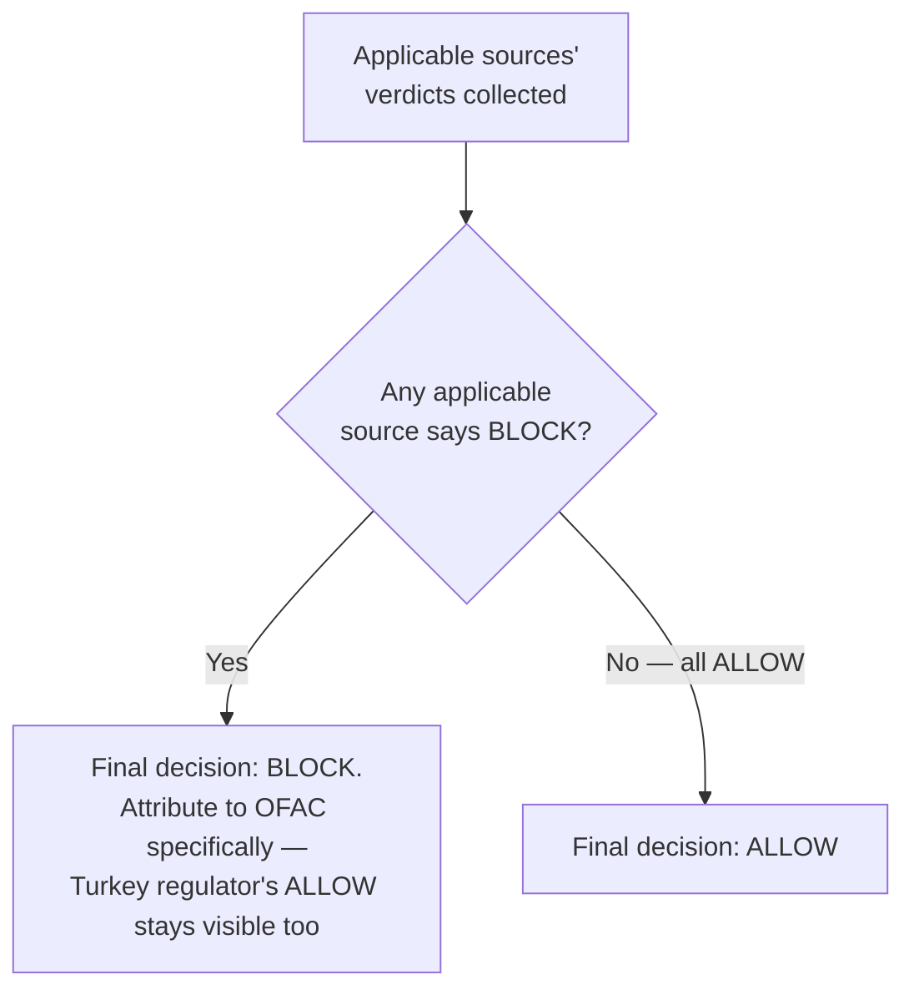

### Why this is the correct default, not just the cautious one

Allowing a payment that even one legally-applicable regulator would block is a direct violation of
that regulator's rules, full stop. It doesn't matter that a second regulator was fine with it —
that second regulator's approval carries no authority to excuse a violation of the first.

This is the same asymmetric-cost logic behind BNP Paribas's $8.9 billion fine: the cost of one
confirmed violation dwarfs the cost of occasionally holding a payment that, on reflection, could
have gone through.

### One thing worth being precise about

This is *not* the same as one court order overturning an earlier one. Independent sanctions
sources don't supersede each other:

- OFAC's designation and Turkey's own regulator's clearance are two separate, simultaneously-valid
  obligations.
- They are **not** two competing rulings on the same case.

The rule is: "all applicable sources' obligations apply at once" — never "the newer or stricter one
legally cancels the other out."

### New problem

The decision itself is now correct and defensible. But it's built from data that isn't equally
fresh:

- OFAC's list was pulled an hour ago.
- Turkey's local regulator's list was pulled a week ago.

And the team is about to make the mistake of reporting one blended "our data is at most X stale"
number to compliance.

> **How I'd say this in an interview:** "When applicable sources disagree, the default has to be:
> any one applicable source saying block wins, full attribution kept for both the source that
> blocked it and the ones that didn't. That's not the same as one order overriding another — these
> are parallel, simultaneously-valid obligations, and there's no principled way to average or vote
> across independent regulators."

---

## Chapter 8 — Three clocks on three walls

A well-meaning ops lead wants one clean number for the compliance dashboard: "our sanctions data
is at most 4 hours stale."

The team blends three very different update cadences into that one number:

| Source | Update cadence |
|---|---|
| OFAC | Hourly pull |
| EU list | Daily pull |
| UN list | Genuinely irregular — only when the Security Council actually acts, no fixed schedule at all |

### Two weeks later: two opposite failures, same day

1. **False alarm.** The UN list hasn't changed in **19 days**. Nothing is broken — there's simply
   been no new Security Council action. But the blended dashboard flags it "abnormally stale" and
   pages someone for nothing.
2. **Real failure, missed.** The EU pipeline genuinely broke two days ago, after a file-format
   change on the EU's publishing side. Because it's buried inside one averaged number alongside
   OFAC's healthy hourly pulls, nobody notices for those two full days.

### The name for this: three clocks on three walls

Each source keeps its own clock, and they don't run at the same speed:

- OFAC's clock ticks roughly hourly.
- The EU's clock ticks roughly daily.
- The UN's clock has no fixed tick at all — it just says "time since the last actual designation."

Averaging three different clocks into one number produces a number that's wrong about all three.

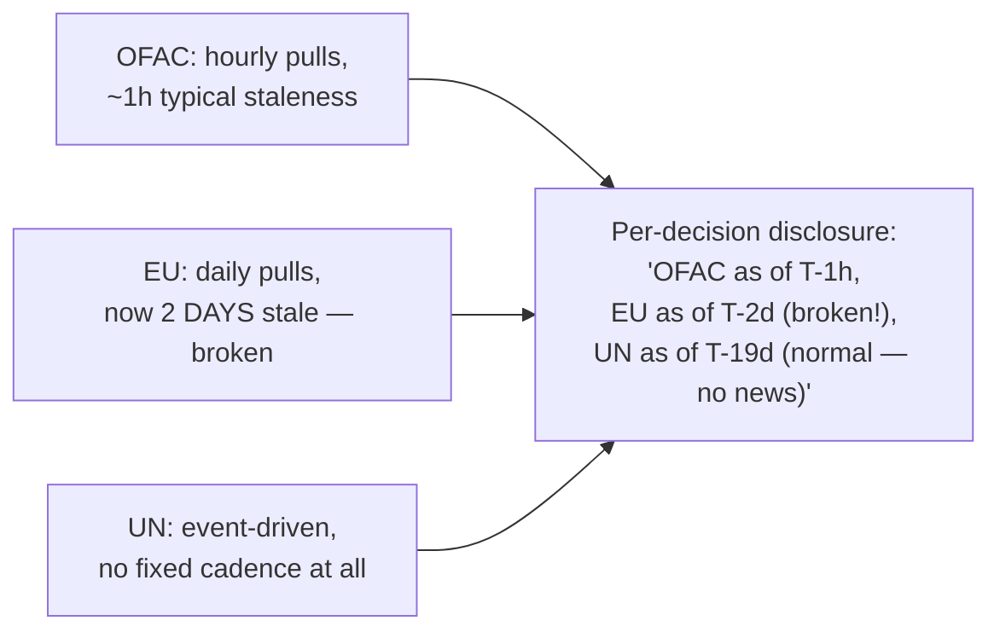

### The fix: disclose staleness per source

Track and disclose staleness **per source**, never blended into one figure. Each decision's
response should be able to show "here's how current each individual source was when this specific
verdict was made." This is the same attribution instinct from Chapter 4 — now applied to freshness
instead of to the verdict itself.

### New problem

Tracking staleness per source is only useful if the system actually *does* something sensible when
one source's staleness crosses from "normal" into "broken." Right now:

- Nothing distinguishes "the UN simply hasn't acted" from "our EU pipeline is down."
- Nothing decides whether a broken source should stop screening altogether.

> **How I'd say this in an interview:** "Don't blend staleness across sources with genuinely
> different cadences — a source that updates rarely because nothing's happened isn't the same kind
> of stale as a source that's supposed to update daily and silently stopped. Track and disclose
> staleness per source, so 'is this decision based on current data' is always answerable per
> source, not as one misleading average."

---

## Chapter 9 — One booth's fax machine breaking

The EU pipeline's silent two-day break from Chapter 8 turns out to be the beginning of a longer
outage. The EU's publishing side changed their file format, and Tradewind's parser has been
silently failing for **4 days** before anyone notices — because nobody built an alert for "this
specific source stopped updating."

The question that actually matters now: while the EU pipeline is down, should Tradewind **stop
screening every payment that needs an EU-list check**, or keep going using the EU list's last
known-good snapshot?

### The name for this: one booth's fax machine breaking

If the EU embassy booth's fax machine jams and it can't get today's updated clipboard, that doesn't
mean every other booth stops checking travelers too. It means that *one* booth is working from
yesterday's clipboard until its fax gets fixed. Everyone should be told that specific fact, but the
checkpoint as a whole keeps operating.

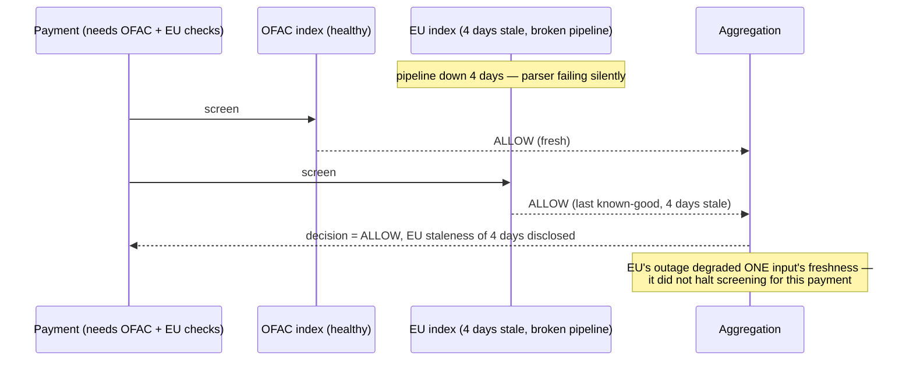

### What this means concretely

- A payment needing only OFAC, with no EU nexus, is completely **unaffected** by the EU outage.
- A payment that does need the EU list still gets a decision. It uses the EU list's last
  known-good snapshot, with that 4-day staleness explicitly disclosed in the response.
- The whole screening call does **not** fail, and the EU check is **not** silently skipped with no
  record that it was skipped.

### A related, smaller wrinkle

OFAC's and the EU's entries for the *same* real-world entity sometimes have slightly different
spellings or dates of birth, since each source is independently maintained.

Treating those as two unrelated entities — just because the strings don't match exactly — is its
own gap. The fix borrows the fuzzy-matching approach used for individual-entity screening, rather
than assuming any two sources will agree on exact spelling.

> **How I'd say this in an interview:** "One source's pipeline breaking should degrade *that
> source's* contribution only, disclosed clearly, never gate every decision that doesn't actually
> need it, and not silently gate the ones that do either. It's the same fail-open instinct as any
> single-source pipeline, just applied per source instead of globally, plus a monitor that actually
> watches each source's own health independently."

---

## Where the story lands

Here's the whole arc, one row per chapter, in the same fix-then-break shape as the story itself:

| Chapter | What it fixes | What it breaks (the next problem) |
|---|---|---|
| Ch1 | — | Hardcoded list, stale forever, silently |
| Ch2 | Automate the pull (the photocopy) | Still a staleness window |
| Ch3 | — | One source isn't enough (three embassies, three clipboards) |
| Ch4 | Separate sources, keep attribution (un-staple) | Checking every source against everything, always |
| Ch5 | — | Applicability matters — checking everything is wrong, not just wasteful |
| Ch6 | Jurisdiction-nexus resolver + long-arm currency rule | Applicable sources can still disagree |
| Ch7 | Guards veto, never vote (deterministic decision) | One blended staleness number hides real problems |
| Ch8 | Per-source staleness, never blended | What happens when a source actually dies |
| Ch9 | Fail-open per source, with disclosed staleness | — (this is where the design lands) |

```mermaid
flowchart LR
    A["Ch1: hardcoded list<br/>stale forever, silently"] -->|"fixes: automate the pull<br/>breaks: still a staleness window"| B["Ch2: the photocopy"]
    B -->|"fixes: shrink the window<br/>breaks: one source isn't enough"| C["Ch3: three embassies,<br/>three clipboards"]
    C -->|"fixes: separate sources<br/>breaks: merged at ingestion, staple"| D["Ch4: un-staple,<br/>keep attribution"]
    D -->|"fixes: attribution kept<br/>breaks: checking every source, always"| E["Ch5: applicability matters"]
    E -->|"fixes: figure out which<br/>sources apply<br/>breaks: 'country' itself is ambiguous"| F["Ch6: jurisdiction-nexus<br/>resolver + long-arm currency"]
    F -->|"fixes: right applicable set<br/>breaks: applicable sources disagree"| G["Ch7: guards veto,<br/>never vote"]
    G -->|"fixes: deterministic decision<br/>breaks: one blended staleness number"| H["Ch8: three clocks,<br/>three walls"]
    H -->|"fixes: per-source staleness<br/>breaks: what if a source dies"| I["Ch9: fail-open per source"]
```

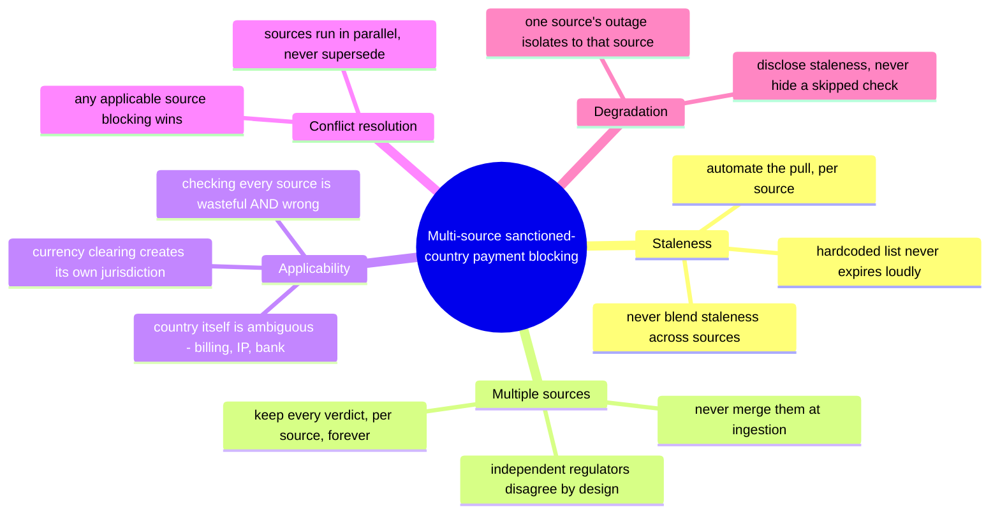

### The actual skill being tested

The skill isn't reciting all nine chapters in every interview — it's knowing which ones the
requirements actually demand.

- A single-market payments company screening against one list can reasonably stop around Chapter 2.
- The moment "multiple regulators" or "USD clearing" enters the prompt, Chapters 3 through 7 aren't
  optional depth — they're the actual question being asked.

---

## Grill me — adversarial follow-ups

**Q1: "Why not just always screen against every source, all the time — isn't that the safest
option?"**

It feels safest, but it isn't. Applying a source with no real jurisdictional claim on a transaction
is a wrong answer, not just wasted work — the same way a UN designation has no authority to block a
purely domestic transfer with no connection to it. Safety here comes from applying the *right*
sources correctly, not from applying all of them indiscriminately.

**Q2: "Isn't 'any applicable source blocking wins' just going to make this system block way too
much?"**

Some over-blocking is the accepted cost, and it's a much cheaper cost than a confirmed violation.
A wrongly-held payment goes to a review queue and usually clears in hours, while a confirmed
sanctions violation is a multi-billion-dollar regulatory event, as BNP Paribas's case shows. The
asymmetry is real, and it's the entire justification for the veto rule.

**Q3: "Walk me through why a USD payment between a Turkish company and a Brazilian company would
ever be OFAC's business."**

Because of how dollar clearing works. A USD-denominated payment routes through the US financial
system via a US correspondent bank, and that routing is what creates OFAC's jurisdiction — entirely
independent of where either transacting party is located. This is a real, documented legal
principle, and it's the single most commonly missed nuance in this space.

**Q4: "If OFAC and the EU list disagree about Cuba, doesn't that mean one of them is just wrong?"**

No — they're both correct under their own government's foreign policy. The US maintains a
comprehensive embargo on Cuba and the EU doesn't, and neither authority is obligated to match the
other. The system's job isn't to resolve that disagreement into one "true" answer — it's to apply
each source correctly wherever it actually has jurisdiction.

**Q5: "Why keep every source's own verdict instead of just storing the final aggregate decision —
isn't that simpler?"**

Because the first time a real audit or investigation asks "which specific list flagged this
payment," a system that only stored the final boolean has no answer. That information was thrown
away the moment sources were merged, and there's no reconstructing it after the fact. Attribution
has to be designed in from the start, not bolted on later.

**Q6: "How is jurisdiction-nexus resolution different from just checking the payer's and payee's
country?"**

Party country is only one input. Currency-clearing jurisdiction is a separate, independent trigger
that can apply regardless of where either party is. Even "party country" itself is ambiguous
between billing address, IP geolocation, and bank domicile. Nexus resolution has to be an explicit
rules engine covering all of those inputs, reviewed by legal — not an inferred shortcut based on
party country alone.

**Q7: "What happens if one source's pipeline is completely down — do you just block everything that
might need it, to be safe?"**

No — that turns one source's outage into a system-wide outage, which is a worse failure than the
one you're trying to avoid. The right answer is to keep screening using that source's last
known-good snapshot, disclose its staleness explicitly in the decision, and only genuinely alarm
when staleness crosses a monitored threshold for that specific source.

**Q8: "Two sources list the same real entity with a slightly different spelling — does the system
treat them as different people?"**

It shouldn't, and this is a real gap if you assume exact-identifier matching across independently
maintained sources. The fix borrows the same fuzzy-matching approach used for individual entity
screening, applied per source, rather than assuming any two government lists will agree on exact
spelling or formatting.

**Q9: "Given everything in this story, where do you actually start if someone just says 'design
sanctions blocking for a payments company' cold?"**

First question: is this one source or genuinely multiple regulators — that decides whether you
need any of the nexus/conflict machinery at all. If it's multiple sources, say up front that you'll
keep them separate through ingestion and attribution, resolve applicability before checking
anything, and default to any-applicable-source-blocks — then go as deep as the interviewer asks
into currency-clearing jurisdiction or staleness tracking.

**Q10: "Isn't jurisdiction-nexus resolution just a fancy way of avoiding doing the actual sanctions
check on some transactions?"**

It's the opposite. Without it, you either over-apply sources that have no legal claim on a
transaction (a real correctness bug, not just waste), or, worse, under-apply a source that does
apply, like missing OFAC's currency-clearing jurisdiction entirely. Nexus resolution is what makes
sure the *right* sources get checked — not fewer sources getting checked.

---

## Cheat sheet — one line per stop on the story

| Stop in the story | The one-line takeaway |
|---|---|
| Hardcoded sanctions list | Never expires loudly — automate the pull from the actual source on a schedule, and monitor the list itself, not just the payments running against it. |
| The photocopy | Pulling on a schedule shrinks the staleness window but never removes it — make the window small, monitored, and disclosed, never pretend it's zero. |
| Multiple independent sources | Each regulator keeps its own list, on its own cadence, and they genuinely disagree by design (OFAC's Cuba embargo vs. the EU's, for example) — that's a structural fact, not a data-quality bug. |
| Never merge sources at ingestion | Stapling multiple sources into one boolean destroys attribution permanently — keep every source's pipeline, index, and verdict separate all the way through. |
| Checking every source against every transaction is wrong, not just wasteful | A source with no real jurisdictional claim on a payment shouldn't be able to block it just because a name happened to match. |
| "The country" of a transaction is genuinely ambiguous | Billing address, IP geolocation, and bank domicile can all disagree — jurisdiction-nexus resolution has to account for all of them. |
| Currency-clearing jurisdiction is its own trigger | A USD payment between two non-US parties can still be OFAC's business because of how dollar clearing routes through US correspondent banks — the most commonly missed nuance in this space. |
| Any applicable source blocking wins | Independent regulators' obligations run in parallel, not by vote or average — and they don't supersede each other the way one court order can override another. |
| Track staleness per source, never blended | Different cadences (hourly, daily, event-driven) carry genuinely different, non-comparable meanings of "how stale is this." |
| One source's outage isolates to that source | Screen using its last known-good snapshot with disclosed staleness — never let one source's trouble halt decisions that don't need it, or silently skip the ones that do. |
