# Design Airbnb Search Ranking — The Story (narrative edition)

## What this file is

The reference file, `52-Design-Airbnb-Search-Ranking-FAANG-Guide.md`, is the one to recite from. It has the requirements, the API shapes, the funnel math, every deep dive, and the master cheat sheet.

This file is a second way into the same material. It tells the same story in plain language, as one continuous narrative.

Engineers at a fictional home-rental startup, **Nestly**, keep hitting a wall. They patch it. The patch creates the next wall. This keeps happening until they land on the exact same funnel-plus-two-stage-ranking design that the reference file documents.

Nestly itself is made up. But every wall it hits, and every fix it reaches for, points at something a real, named system actually does:

- Airbnb's own 2018 KDD paper, *"Real-time Personalization using Embeddings for Search Ranking at Airbnb"* (Haldar et al.) — a real, documented paper about exactly this problem.
- The industry-wide candidate-generation-then-rerank pattern used by every large-scale search/recommendation system. Google, Amazon, and Airbnb all publish variants of it.
- The same atomic-reservation discipline used in flash-sale inventory systems and Dynamo-style distributed stores.

Every time a number shows up, I'll flag clearly whether it's a documented fact or a reasonable stand-in for the story.

## The trigger phrase and the core idea

**The trigger phrase** for this whole topic is: *"design Airbnb search"* or *"design a marketplace search-and-ranking system."*

**The tell** that you're in this chapter, and not a plain geo-search chapter: the interviewer cares about **date-range availability** and **ranking beyond distance**.

Keep one sentence in your head as you read:

> **This is a funnel, not a single query.** Geography and availability narrow millions of listings down to a small candidate set cheaply. Only that much smaller set is worth spending expensive ranking compute on.

Everything below is just this one idea, earned the hard way, one broken assumption at a time.

---

## Chapter 1 — The listing that's ten minutes old and the superhost that's invisible

### What Nestly built first

It's early days. Nestly has just launched in a handful of cities. The engineering team does the simplest possible thing: when a guest searches "Lisbon, Aug 12-16," the backend runs:

```sql
SELECT * FROM listings WHERE city = 'Lisbon' ORDER BY created_at DESC
```

Newest listing first. It works fine with 200 listings in Lisbon.

### Where it broke

Six months later, Lisbon has **4,000 listings**. Someone actually looks at what guests see, and it isn't good:

- A listing posted **11 minutes ago** — no reviews, three blurry phone photos, host who hasn't even filled out their bio — sits at position **#1**.
- A **4.9-star superhost** listing two blocks from the beach, with 340 reviews and a 98% response rate, sits on **page 4**. It was listed eight months ago, and "newest first" doesn't care how good it is.

Booking conversion from page-1 results sits around **2.1%** `[illustrative — a stand-in to make the gap concrete, not a published Nestly metric]`. When the team manually checks what guests actually click versus what's ranked #1, the two lists barely overlap.

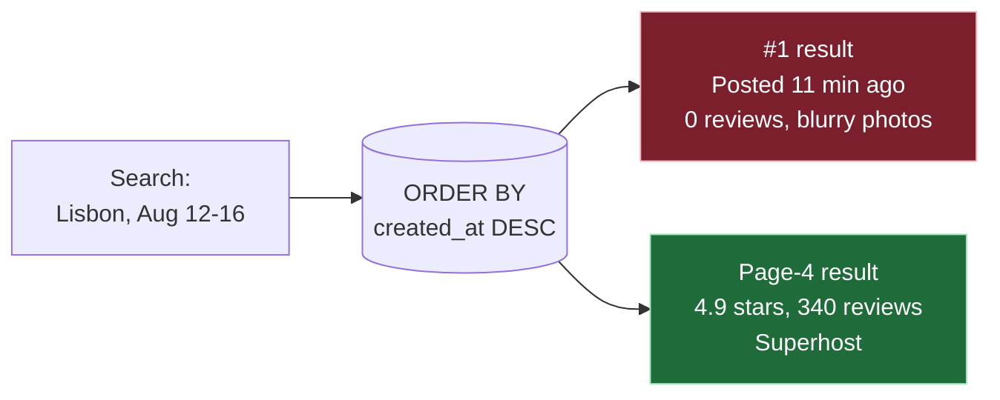

### The obvious question

*Why would "newest" ever be a good proxy for "best result for this guest"?*

It isn't, and it never was. Recency was just the cheapest thing to sort by — not a signal anyone chose on purpose. Sorting by `created_at` tells you nothing about whether a listing actually matches this guest's search.

### The fix

Rank by **relevance**, not recency. This is the first analogy for the whole story:

> Think of it as **the difference between a librarian who hands you the newest book on the shelf and one who actually listens to your question and hands you the book that answers it.** A good librarian doesn't care when a book arrived — they care whether it's the right book for you, right now.

### New problem, immediately

To rank by "how good a match is this," you need some kind of model or scoring function. And the very next thing the team tries is running that scoring function over **every single listing in the system**, on every query — because nobody's thought about candidate volume yet.

### How I'd say this in an interview

"The first version of almost any search system sorts by something free, like recency. It always looks fine at small scale and falls apart once there's enough inventory that recency and relevance visibly diverge. The fix is 'rank by relevance,' but that immediately raises the next question: relevance according to what, computed over how many listings? That's where the real design work starts."

---

## Chapter 2 — Ranking 7 million listings to answer one search

### What Nestly built next

The fix lands: Nestly builds a scoring function — distance, price, star rating, a few blended together — and applies it to every listing before sorting. It works great in Lisbon with 4,000 listings.

Nestly keeps growing. Two years later it's global:

- **7,000,000 active listings** `[illustrative, matching the reference guide's own scale assumption]`.
- The naive code still does the same thing it always did: pull every listing in the requested city, score it, sort it.

### Where it broke

For a popular destination, this is now **~50,000 listings in one city** `[illustrative]`, scored on every single search.

Let's do the math at Nestly's peak traffic, **~6,000 searches/sec** `[illustrative, same order of magnitude as a large travel marketplace]`:

- 6,000 searches/sec × 50,000 listings scored per search = **300 million scoring calls a second**, just from geography-matched listings.
- Most of those listings aren't even close to what the guest is looking at on the map.

Latency on Lisbon searches during peak hours creeps past **900ms**. The on-call engineer traces it straight to the scoring loop running over listings on the far side of the city — listings that never had a chance of being shown.

### The obvious question

*Why is the ranking step scoring listings that a much cheaper check could have ruled out first?*

Because nobody separated "which listings are even geographically relevant" from "how do we order the relevant ones." It's all one loop.

### The fix

Put a cheap, coarse **geo filter** in front of ranking.

> Think of it as **a food-delivery app that only shows you restaurants inside your delivery radius before it starts ranking them by rating and price.** You'd never expect a delivery app to rank a restaurant 40 minutes away right alongside one two blocks over — it excludes the far one before ranking even begins.

Nestly builds a spatial index (an S2/geohash-style grid) so "listings near this point" becomes a fast lookup, not a full scan.

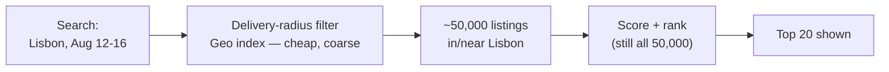

### New problem

The geo filter shrinks 7 million down to 50,000 for a popular city — real progress. But a chunk of those 50,000 aren't even bookable for the dates the guest asked for. Some are already booked for Aug 12-16. Some are blocked by the host.

Right now, those unavailable listings still get scored and ranked right alongside everything else. Worse — sometimes one of them ranks #1, the guest clicks it, and hits a "sorry, not available for these dates" wall at checkout.

### How I'd say this in an interview

"The first fix for 'ranking too much stuff' is almost always a cheap filter that removes obviously-irrelevant candidates before the expensive step runs. Here, that's geography — the same delivery-radius idea any local-search product uses. But geography alone doesn't mean 'bookable,' and that gap is the very next thing that breaks."

---

## Chapter 3 — The bouncer who checks dates, not just location

### What Nestly built next

A support ticket pattern emerges: guests rank a listing #1, click it, love the photos, hit "book" — and get told it's not available for their dates.

It turns out the team's fix for this was to just **down-rank** unavailable listings slightly. They treated "not available" as one more negative signal blended into the score, the same way "far from city center" or "no wifi" gets blended in.

### Where it broke

On a bad week, **around two-thirds of the 50,000 geo-relevant Lisbon listings** are unavailable for a popular date range `[illustrative, matching the reference guide's own occupancy assumption]`. That means most of what's being ranked — and sometimes shown near the top — was never a valid answer to begin with.

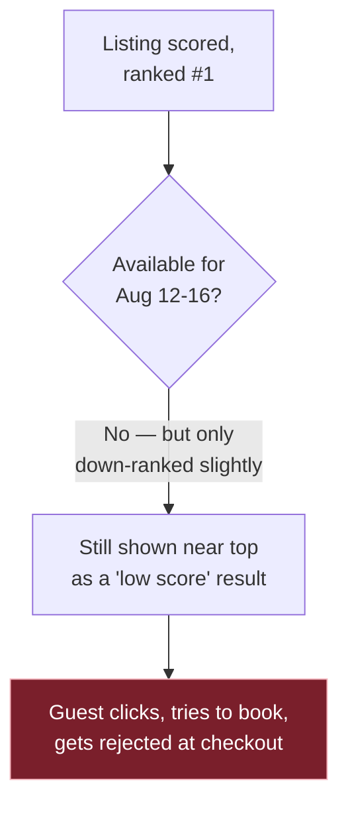

### The obvious question

*Why treat "impossible to book" as a bad score instead of just... not a valid result at all?*

Because whoever wrote the scoring function was thinking of availability as one signal among many — the same shape as price or distance. But it isn't like the others.

- A listing that's too expensive is still a worse-but-valid answer.
- A listing that's booked solid for those exact dates is not a worse answer — it's not an answer.

### The fix

Availability becomes a **hard filter**, applied *before* ranking. It is never a ranking signal.

> Think of it as **a bouncer standing at the door checking dates like an ID.** The bouncer doesn't rank people by how cool their outfit is and let the ones with bad outfits in anyway, at a lower position on the guest list. If your ID doesn't check out, you don't get past the door — full stop, regardless of how good you'd otherwise look inside.

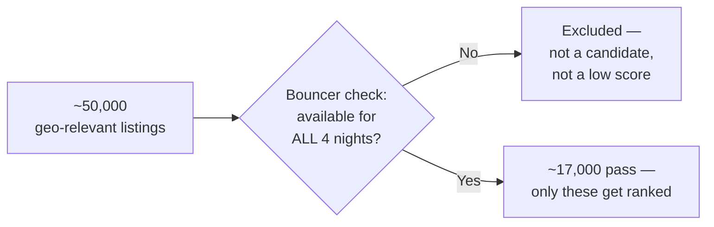

### Redo the math

With the bouncer in place: roughly **17,000 of the 50,000** survive `[illustrative, matching the reference guide's funnel]`.

- That's a third of the candidate pool.
- Every single one of them is actually bookable.
- Ranking now only ever spends effort on valid answers.

### New problem

The bouncer needs an accurate, up-to-the-second guest list to check against — a calendar of which nights are open per listing.

Right now that calendar is a plain table of booking date-ranges, checked with a slow per-listing scan. It isn't even guaranteed to reflect a booking that completed ten seconds ago. Two guests, same last-available weekend, both think they got in.

### How I'd say this in an interview

"Availability has to be a hard filter, not a ranking signal. An unavailable listing isn't a worse result — it's not a valid result at all. Treating the two the same is probably the single most common mistake in this chapter. The bouncer-at-the-door framing is the whole idea: you check ID before you rank the outfit, never instead of it."

---

## Chapter 4 — The one-key rule, and the sticky note on the chair

### What Nestly built next

The bouncer needs a fast, correct way to answer "is every night in this range open." Nestly's first version of that calendar is a naive booking-range table, scanned per query.

It's slow, and worse, it isn't atomic. "Check if open, then write booked" is two separate steps.

### Where it broke

One Saturday night, two guests both search the same last studio apartment in Porto for the same weekend.

1. Both see "available."
2. Both click "confirm booking" within **400 milliseconds** of each other.
3. Both bookings succeed.
4. The host finds out from two different guests showing up at the same door.

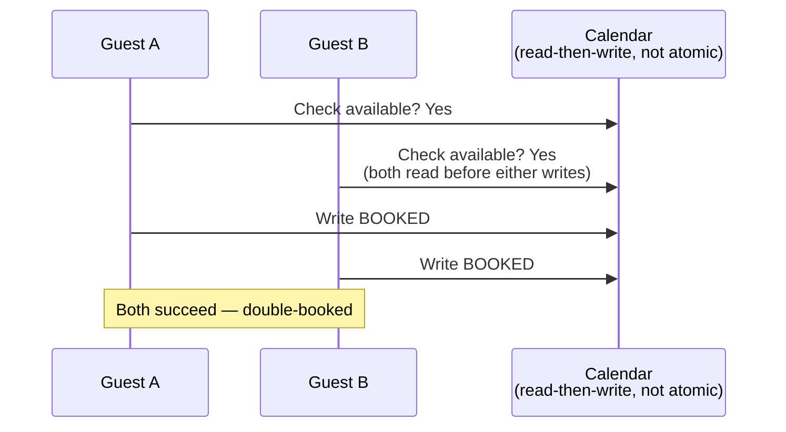

### The obvious question

*Why did checking and booking as two separate steps ever seem safe?*

Because it looks safe in a demo with one user. The race only shows up when two people hit the same narrow window at close to the same time — rare per-listing, but not rare across millions of listings.

### The fix: atomic compare-and-set

Make booking an **atomic compare-and-set** against a compact per-listing bitmap calendar (one bit per night: open/booked/blocked). The rule: "mark these nights BOOKED, but only if they're still ALL open — in one atomic step."

> Think of it as **the bouncer handing out exactly one key per room.** The second person to ask for a key to an already-occupied room doesn't get a copy — they get told "sorry, taken," cleanly and immediately. That's because the one-key handoff and the "is it free" check are the same indivisible action, not two steps someone can slip between.

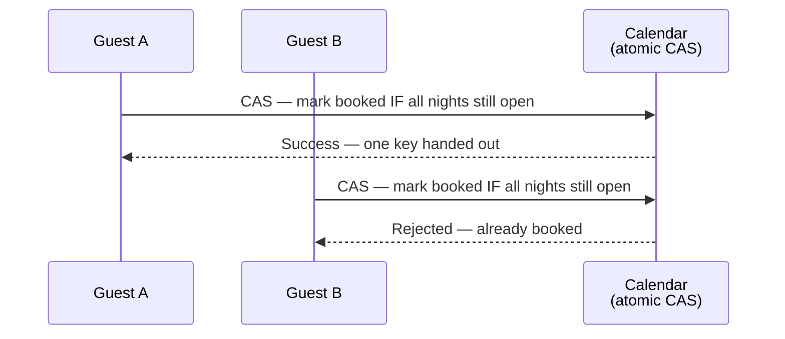

### New problem, right on schedule

A guest who's mid-checkout — card entered, about to hit confirm — needs those dates held *for them* for the next few minutes. Otherwise a second guest could grab the room out from under them while the first guest is still typing their card number.

A strict binary open/booked calendar has no room for "reserved for now, but not confirmed yet."

### The fix on top of the fix: pending hold

A short-TTL **`Pending`** state, distinct from `Open` and `Booked`.

> This is the **sticky note on the chair**: you don't book the chair, but you also don't let someone else sit in it while you've stepped away to grab your coat — for as long as the sticky note says. If checkout doesn't complete before the TTL expires, the sticky note comes off automatically and the chair goes back to `Open`.

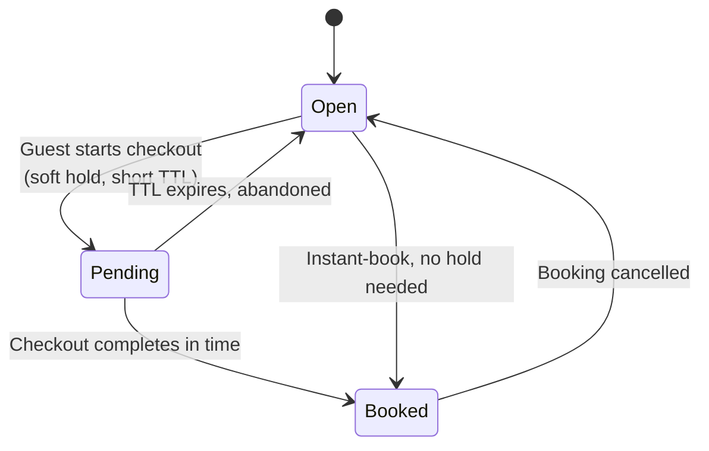

### How I'd say this in an interview

"Booking has to be a single atomic compare-and-set against the same structure the availability filter reads. 'Check, then write' as two steps is exactly what causes double-bookings — the one-key-per-room idea. On top of that you need a short-TTL pending state for in-progress checkouts, the sticky-note-on-the-chair, or a guest mid-checkout can get outrun by someone else."

---

## Chapter 5 — The triage nurse and the specialist who can't see everyone

### Where things stand

With the bouncer and the one-key rule in place, the funnel is solid: geo filter, then hard availability filter, leaving **~17,000 valid candidates** per Lisbon search.

Ranking those 17,000 well is the next problem. Nestly's rich scoring model has dozens of features: listing quality, host reliability, price competitiveness against comparable listings, personalization. It's expensive to run — it was built to be *accurate*, not *cheap*.

### Where it broke

Do the math at Nestly's real traffic:

- **~6,000 searches/sec**, each needing the rich model run on **~17,000 candidates**.
- 6,000 × 17,000 ≈ **100 million rich-model scoring calls per second** at peak `[illustrative, matching the reference guide's own worked math]`.

No realistic model-serving fleet does that within a "still feels responsive" latency budget of a couple hundred milliseconds. The team tries throwing more machines at it. The bill triples and p99 latency barely improves — because the bottleneck is the *number of scoring calls*, not raw compute headroom.

### The obvious question

*Does every one of those 17,000 candidates really need the expensive model's full attention?*

No. Most of them are obviously not going to make the top 20, no matter how carefully you score them. A cheap, rough pass could throw out the obviously-bad ones fast, so only the expensive model needs to look closely at what's left.

### The fix: two-stage ranking

Split ranking into **two stages**.

> Think of it as **a triage nurse and a specialist doctor.** The triage nurse sees every single patient and takes basic vitals fast — temperature, blood pressure — then sends the ones that look serious deeper into the building. The specialist doctor is expensive and slow per patient, but never has to see the walk-in with a mild cough; the nurse already handled that.

Concretely:

- A cheap **light ranker** scores all 17,000 candidates on cheap features (distance, price, basic rating) and keeps the top ~500.
- An expensive **heavy ranker** scores only those 500 with the rich feature set.

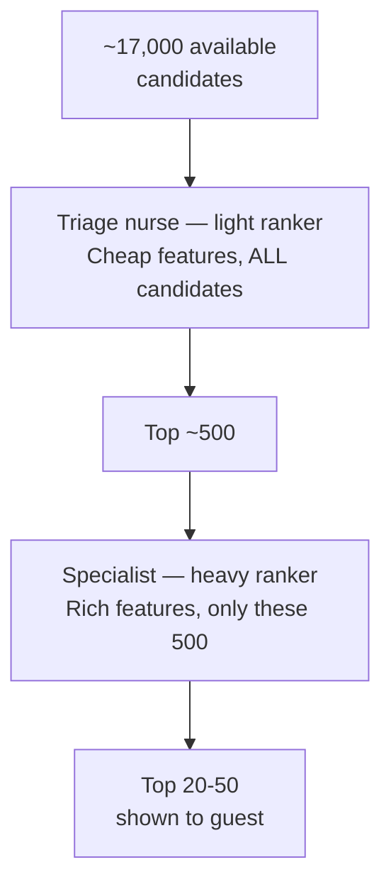

### Redo the math

The heavy model now only runs:

- 6,000 searches/sec × 500 candidates = **3,000,000 scoring calls/sec** `[illustrative, matching the reference guide's math]`.
- That's roughly **30-40x fewer calls** than scoring all 17,000 — squarely within what a real serving fleet can do in budget.

### New problem

The triage nurse's quick vitals check has to actually be *right enough* to not send a genuinely sick patient home.

- If the light ranker's top-500 cut excludes a listing that would've scored well on the rich features, the specialist doctor never gets the chance to catch that mistake. It's just gone, permanently, before the expensive model ever sees it.
- There's a whole class of listing the light ranker is systematically bad at: brand new ones with zero booking history.

### How I'd say this in an interview

"Two-stage ranking exists because cheap-and-covers-everyone and expensive-and-accurate can't be the same model at this scale. The triage-nurse-then-specialist split is what makes both stages simultaneously affordable and good. But a mistake the light ranker makes — dropping a genuinely good listing before the heavy ranker ever sees it — is unrecoverable. So its recall needs its own monitoring, not just how good the final results look."

---

## Chapter 6 — The new listing that never gets a chance to earn a review

### Where it broke

Three weeks after two-stage ranking ships, someone notices new hosts churning off the platform at a higher rate than expected.

Digging in: a brand-new listing in Lisbon — great photos, fair price, first week live — gets essentially **zero impressions** `[illustrative]` in its first ten days.

Why? Walk through the chain:

1. The light ranker's cheap features are exactly the ones a new listing can't have yet: no review count, no booking history, no established star rating.
2. Every cheap-feature score for a new listing defaults to something mediocre.
3. So it never cracks the top 500.
4. So it never reaches the heavy ranker.
5. So it never gets shown.
6. So it never gets booked.
7. So it never gets a review — which is the only thing that would've helped it rank better in the first place.

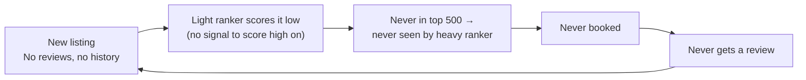

### The obvious question

*Isn't this just... correctly ranking an unproven listing low?*

It would be, if the goal were only "rank well right now." But the marketplace needs a supply of listings that eventually *become* well-reviewed. A ranking system that can never let a new listing accumulate the signal it needs to compete quietly strangles its own future supply. This is genuinely a two-sided problem: rank purely for today's guest experience, and you starve tomorrow's host supply.

### The fix: exploration slots

Carve out a small, deliberate **exploration slot** in the light ranker's top-500 output, reserved for under-exposed listings that would otherwise never surface.

> Think of it as **the community bulletin board next to the wall of five-star Yelp reviews.** A brand-new restaurant with zero reviews still gets a pin on the board where a handful of people will actually see it — specifically so it has a *chance* to earn its first reviews, instead of being invisible forever behind restaurants that already have hundreds.

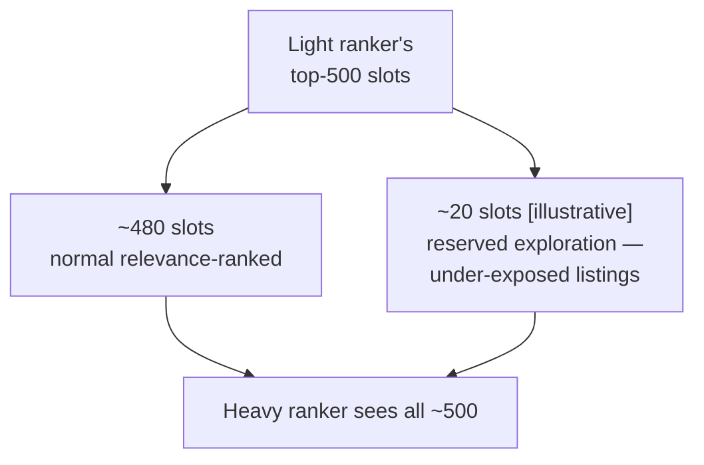

### New problem

Exploration slots cost something real: a guest occasionally sees a genuinely less-proven listing in a slot that a more established one "deserved" by pure relevance.

That's a deliberate short-term-quality-for-long-term-supply trade. It means the ranking objective is no longer *only* "best result for this guest right now" — it now has to balance the guest side against the host side of a two-sided marketplace, which is a much bigger idea than anything the light-vs-heavy split alone was solving.

Nestly starts tracking cancellation rate and review-score trend as **guardrail metrics** on every ranking experiment from here on.

### How I'd say this in an interview

"A ranker that only optimizes for the current guest's relevance will systematically starve new listings of the exposure they need to ever earn the signal that would let them compete. That's a real cold-start trap in any two-sided marketplace. The fix is a small, monitored exploration budget carved out of the light ranker's output — same instinct as giving a new restaurant with no reviews a spot on the community board instead of hiding it behind everyone who already has hundreds."

---

## Chapter 7 — The shop assistant who watches what you just picked up

### Where it broke

With exploration slots in place, the funnel and cold-start problem are handled. Now the team looks hard at what the *heavy* ranker actually optimizes for.

A strange pattern shows up in the data: a guest who has spent the last ten minutes clicking exclusively on entire-home listings near the beach still gets a top-20 dominated by generic city-center studio apartments. Those studios are technically well-reviewed, well-priced, geographically fine — but clearly not what this particular guest is looking for *right now*.

The heavy ranker's features are all static: price, quality, distance. Nothing about *this specific guest, in this specific session*.

### The obvious question

*Shouldn't a search engine notice what I just clicked on, thirty seconds ago, in this very session?*

Yes. And this is the real, documented core of Airbnb's own 2018 KDD paper, *"Real-time Personalization using Embeddings for Search Ranking at Airbnb."*

- Listings get represented as learned embeddings — vectors capturing "what kind of listing is this, and what similar listings do guests who like it also like."
- A guest's clicks and skips **within the current session** shift what gets ranked higher for their *very next* query in that same session.
- Not tomorrow. Not after an offline retrain. Immediately.

### The fix: real-time, session-scoped personalization

> Think of it as **a shop assistant who watches what you just picked up off the shelf and quietly adjusts what they show you next.** Not a shop assistant working off a decade-old loyalty-card profile — one paying attention to the last five minutes of what you're actually doing, right now, in this visit.

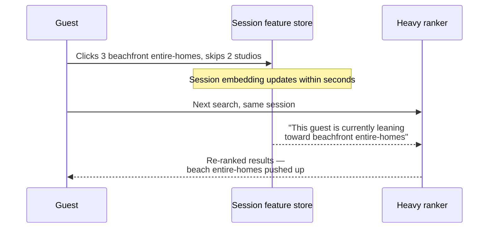

### New problem

Personalization features have to update fast enough to matter *within* a session. A feature store that only refreshes every few hours is useless here, because the session that generated the signal will be long over by the time it lands.

But there's an upside worth naming: this is the first ranking signal in the whole pipeline where "eventually consistent, lagging by a few minutes" is genuinely tolerable. Unlike the bouncer's availability calendar back in Chapters 3 and 4, a personalization signal that's 30 seconds stale doesn't cause a trust failure — it just makes that one query slightly less sharp.

That's a real, useful distinction to say out loud: not every signal in this pipeline needs the same freshness guarantee.

### How I'd say this in an interview

"Static features like price and rating tell you if a listing is generally good. They say nothing about what *this* guest wants *right now*. Real-time personalization — the shop-assistant idea — closes that gap, and it's genuinely what Airbnb's own published KDD paper on listing embeddings is about. It's also a good moment to point out that availability needs to be immediately consistent, but personalization can lag by seconds without real harm. Not every signal in the ranking pipeline needs the same freshness bar."

---

## Chapter 8 — The critic who checks the kitchen, not just the storefront photo

### Where it broke

Personalization ships, and conversion goes up — guests book more, faster. Three months later, a different number goes the wrong way: **cancellation rate climbs**, and so do support tickets about listings that "didn't look like the photos."

Digging in, the team finds a pattern:

- A handful of listings with dramatically staged, borderline-misleading photos and aggressively low intro pricing are getting ranked very high.
- Why? The ranking objective — tuned hard on click-through and booking conversion — is doing exactly what it was told to do: promote whatever gets clicked and booked the most.
- It has no idea, and no reason to care, that a chunk of those bookings turn into cancellations, refunds, and one-star reviews two weeks later.

One specific listing: **34% cancellation rate** `[illustrative]`, still ranking in the top 10 for its area — because cancellations happen *after* the click-and-book moment the ranker was scored on.

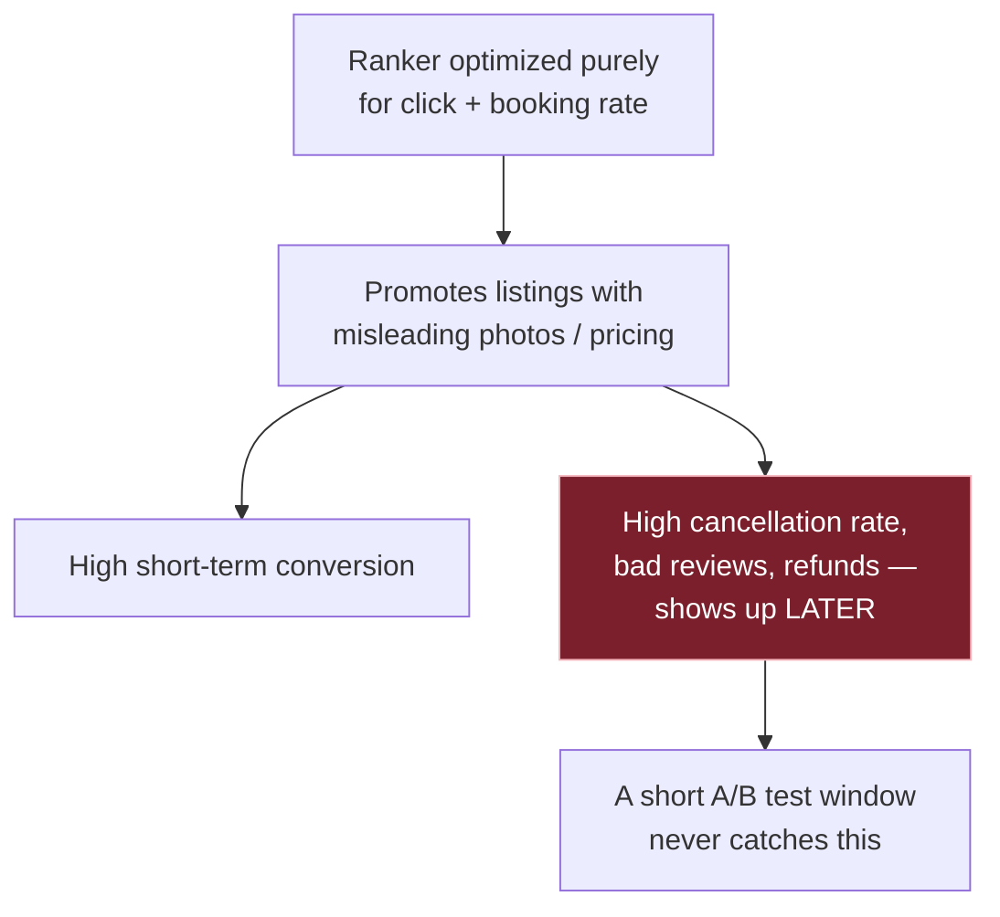

### The obvious question

*Wouldn't an A/B test just catch this and stop it?*

No. This is the trap worth naming unprompted.

- A short A/B test measures booking-rate lift over days or weeks.
- The marketplace-health cost — cancellations, disputes, guest churn from a bad experience — surfaces on a longer horizon than the test window.
- A test that only measures conversion will reliably declare the misleading-listing-promoting model the winner, every time, because it's measuring exactly what that model is good at.

### The fix: marketplace health as an explicit feature

Bring marketplace health into the ranking **objective itself**, as explicit features blended in alongside relevance and personalization. It's not a filter bolted on after the fact.

> Think of it as **a restaurant critic who checks the kitchen, not just the storefront photo.** A critic who only rates the front window would rate every restaurant with a beautiful sign highly — right up until the health inspector shows up. A critic who actually checks conditions in the kitchen catches the problem before it becomes a customer's problem.

Concretely, these all become heavy-ranker features:

- Host cancellation rate.
- Guest-reported issue rate after check-in.
- Review-score *trend* — not just the average. A recently declining trend matters even if the historical average still looks fine.
- Response time to booking requests.

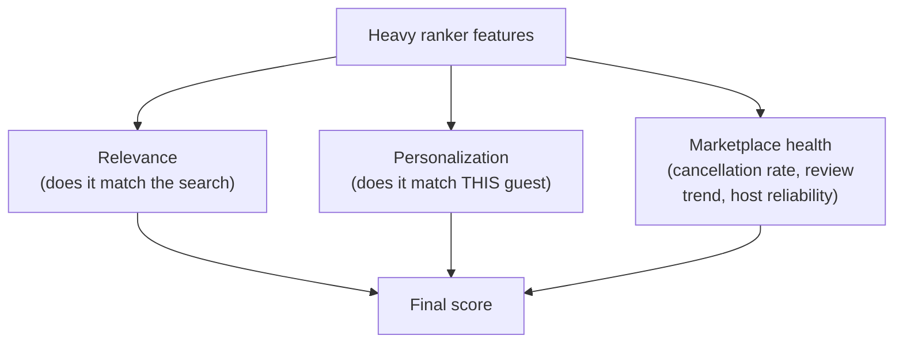

### New problem

This is a genuine trade: some short-term conversion is deliberately given up to protect the marketplace's long-term health. That trade has to be *monitored*, not just baked in once and forgotten.

Nestly starts tracking cancellation rate and review-score trend as **guardrail metrics** on every ranking experiment from here on, alongside the usual conversion-lift number. If a new ranking model wins on conversion but the guardrails move the wrong way, it doesn't ship.

### How I'd say this in an interview

"A ranker that only maximizes click-through or booking conversion will find and promote exactly the failure modes that hurt the marketplace later — the critic-who-checks-the-kitchen framing. Cancellation rate, review trend, and host reliability need to be explicit ranking features and explicit guardrail metrics, because a short-window A/B test measuring conversion alone will never catch the cost on its own."

---

## Chapter 9 — The shelf editor who arranges the display after the librarian's picks

### Where it broke

One last wrinkle. With relevance, personalization, and marketplace health all blended into the heavy ranker's score, the top-20 for a popular search sometimes ends up looking oddly repetitive: five near-identical mid-range apartments in the same building complex, back to back, because they all score almost identically well on every feature the model has.

Separately, the business team wants to be able to guarantee a promoted-listing slot for a marketing partnership, without waiting for a full model retrain every time a business rule changes.

### The obvious question

*Should diversity and promoted slots be features fed into the ranking model itself?*

Tempting, but no. Mixing "business rule that changes weekly" into a model that takes weeks to retrain means every small policy change becomes a machine-learning problem. Better to keep them as a separate, deliberate layer.

### The fix: a business-rules layer

A thin **business-rules layer**, applied *after* the heavy ranker, doing simple, explainable adjustments:

- Enforce that no more than 2 near-duplicate listings appear consecutively.
- Guarantee a promoted slot at a fixed position.
- Apply fairness constraints.

> Think of it as **a shelf editor arranging the store display after the librarian has already picked the best books.** The librarian's ranking (relevance + personalization + marketplace health) still decides what's *good*. The shelf editor just decides how the display physically looks, without re-deciding what's good.

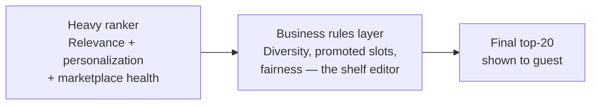

### This closes the loop

This is the real system now:

**Geo filter → availability bouncer → light ranker (triage nurse, with an exploration slot for cold-start) → heavy ranker (specialist, scoring relevance + personalization + marketplace health) → business rules (shelf editor).**

Nothing invented past this point — every layer exists because a specific, numbered failure forced it.

### How I'd say this in an interview

"Business rules like diversity and promoted slots deserve their own layer after the ML ranker, not a spot inside the model's feature set — the shelf-editor idea. That way a marketing team can change a business rule this afternoon without anyone retraining a ranking model, and the ML model stays focused on the actual hard problem: is this a good, relevant, healthy-for-the-marketplace result."

---

## Where the story actually lands

```mermaid
flowchart LR
    A["Ch1: Newest-first<br/>(recency ≠ relevance)"] -->|"Fixes: rank by relevance<br/>Breaks: ranks EVERY listing"| B["Ch2: Geo filter"]
    B -->|"Fixes: shrinks to one city<br/>Breaks: ranks unavailable listings"| C["Ch3: Availability bouncer"]
    C -->|"Fixes: only valid candidates ranked<br/>Breaks: check-then-book races"| D["Ch4: Atomic CAS +<br/>pending hold"]
    D -->|"Fixes: no double-booking<br/>Breaks: rich model too slow at scale"| E["Ch5: Light + heavy<br/>two-stage rank"]
    E -->|"Fixes: affordable + accurate<br/>Breaks: new listings never surface"| F["Ch6: Exploration slots"]
    F -->|"Fixes: cold-start gets a chance<br/>Breaks: no session personalization"| G["Ch7: Real-time embeddings"]
    G -->|"Fixes: ranks for THIS guest now<br/>Breaks: pure-conversion trap"| H["Ch8: Marketplace-health<br/>features"]
    H -->|"Fixes: healthier marketplace<br/>Breaks: business rules stuck in the model"| I["Ch9: Business-rules layer"]
```

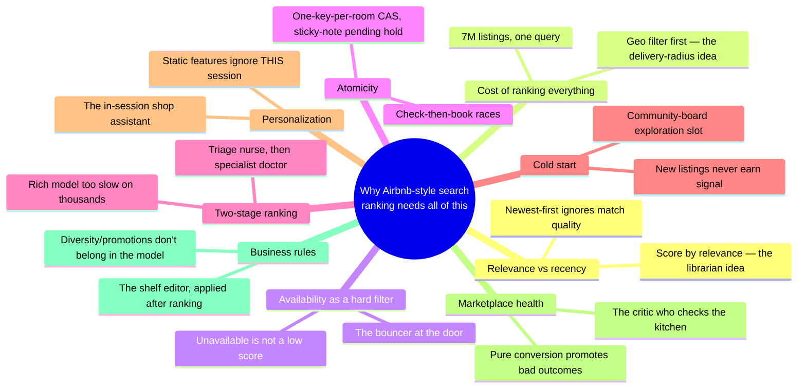

Every real production search-ranking system you'll design in an interview sits somewhere on this chain.

- A simpler prompt might reasonably stop around Chapter 5 (the funnel plus two-stage ranking).
- A prompt that explicitly asks about new-listing fairness or marketplace trust needs Chapters 6 and 8.
- Walking all nine chapters unprompted, when the interviewer only asked about the funnel, reads as padding, not depth. Follow where the questions actually point.

---

## Grill me — adversarial follow-ups

**Q1: "Why not just make the ranking model itself smarter instead of adding a whole funnel of filters?"**

Because no model, however smart, changes the fact that scoring millions of irrelevant listings is wasted compute. A smarter model still can't outrun the math of scoring 7 million listings per query. The funnel isn't a workaround for a weak model — it's recognizing that most listings fail a hard, cheap-to-check constraint (location, availability) before ranking quality is even a relevant question.

**Q2: "Couldn't you just cache the availability check instead of hitting the calendar live every time?"**

No — that's exactly the mistake that causes double-bookings. Availability is the one signal in this whole pipeline that can't tolerate staleness, because a booking that completed ten seconds ago has to be reflected on the very next read, or two guests both think they got the room. Every other signal (quality score, personalization) can lag by seconds to minutes safely, but this one specifically can't.

**Q3: "Isn't the light-ranker-then-heavy-ranker split just premature optimization if you're not actually at Airbnb's scale?"**

At small scale, sure — an MVP should start with a single ranking stage, and only split into light/heavy once the math (candidates × QPS × model cost) actually shows the single stage can't hit the latency budget. The point isn't "always build two stages," it's "know the math that tells you when you need to."

**Q4: "Your exploration-slot fix for cold-start costs the guest some relevance. Why is that an acceptable trade at all?"**

Because a marketplace that never lets new supply earn the signal it needs to compete eventually runs out of the supply guests want to search in the first place. It's a small, deliberately monitored cost paid now to avoid a much bigger supply problem later. The key word is monitored: exploration slots aren't unlimited, they're a small, bounded budget with its own metrics.

**Q5: "Why does personalization need to be real-time within a session — isn't a daily-updated profile good enough?"**

A daily profile captures who you generally are; it says nothing about what you're doing in this specific search session right now, which is often a much stronger, more immediate signal. A family looking at beachfront entire-homes for the next ten minutes wants that reflected in their very next query, not tomorrow. That's the actual point of Airbnb's published work on real-time embeddings: session behavior is a live signal, not something to batch.

**Q6: "How would a short A/B test even measure something that shows up weeks later, like cancellation rate?"**

It mostly can't, within the test's own window — which is exactly why marketplace health can't be left as something the experiment framework will catch on its own. It has to be an explicit guardrail metric tracked on every ranking experiment, checked even after the headline conversion number looks good. Sometimes a longer-horizon holdback group is needed specifically to observe effects the short window would miss.

**Q7: "Why put diversity and promoted slots in a separate business-rules layer instead of just adding them as model features?"**

Because business rules change on a business timescale — days, sometimes hours — and a model feature change means a retrain-and-redeploy cycle. Keeping them as a thin, deterministic layer applied after the ML ranker means a policy change ships without touching the model at all. It's also easier to reason about and debug, because it's simple, explicit logic, not something buried in learned weights.

**Q8: "What's the actual difference between what the light ranker optimizes for and what the heavy ranker optimizes for?"**

The light ranker's whole job is recall at low cost — don't lose good candidates, using only cheap features, because it has to run on thousands of candidates within a tight budget. The heavy ranker's job is precision on the final order, using rich, expensive features like personalization embeddings and marketplace-health signals, because it only ever has to score the few hundred the light ranker already vouched for.

**Q9: "If a listing gets excluded by the light ranker, is there any way to recover it later in the same query?"**

No — that's the real risk of a funnel architecture, and it's worth saying unprompted. Once the light ranker's top-500 cut happens, anything outside it is gone for that query. The heavy ranker never even sees it, which is exactly why light-ranker recall gets its own separate offline monitoring against relevance-judged listings, not just "does the final top-20 look good."

**Q10: "Given all nine chapters, if an interviewer just says 'design Airbnb search' cold, where do you start?"**

Say the funnel sentence first — geography and availability narrow millions of listings to a small candidate set cheaply, and only that set gets expensive ranking — then ask what ranking signals are in scope (just relevance, or also personalization and marketplace health) before deciding how deep to go. Availability-as-a-hard-filter and the two-stage ranking split are close to load-bearing defaults; cold-start exploration, real-time personalization, and marketplace-health guardrails are things you earn by naming a requirement, not defaults you bolt on for their own sake.

---

## Pacing note

**If this is 60 seconds inside a bigger question:**

Say the funnel sentence — geography and availability narrow millions of listings to a small candidate set cheaply, and only that set gets expensive ranking. Then say: "availability is a hard filter, ranking is two-stage (cheap then expensive), and I'd cover cold-start, personalization, and marketplace health as deep dives if you want to go there." That's the whole shape in one breath.

**If this is the whole 15-20 minute focus:**

Walk the chapters in order:

1. Why recency-based ranking fails.
2. Why you need a geo filter before ranking.
3. Why availability must be a hard filter (with the atomic-booking and pending-hold mechanics).
4. Why two-stage ranking exists and what it costs.
5. Cold-start exploration.
6. Real-time personalization.
7. Marketplace health versus pure conversion.

Don't walk all nine unprompted — follow wherever the interviewer's questions actually point, and use the skipped chapters as your "if I had more time" closer.

---

## Active recall — no answers, test yourself cold

1. Why does sorting by `created_at DESC` look fine at small scale and only break once inventory grows?
2. What's the actual difference between what a geo filter removes and what the availability filter removes?
3. Why is availability a hard filter and never a ranking signal — what breaks if you treat it as the latter?
4. Walk through the exact race that causes a double-booking when "check availability" and "book" are two separate steps.
5. What does the short-TTL `Pending` state protect against that the atomic compare-and-set alone doesn't?
6. Why can't a single ranking model be both cheap enough to score every candidate and rich enough to produce the final order?
7. What's the one risk of a two-stage funnel that doesn't exist in a single-stage ranker, and how do you monitor for it?
8. Walk through exactly why a brand-new listing can get stuck at zero impressions forever without an exploration mechanism.
9. Why does real-time, session-scoped personalization matter more than a daily-updated guest profile?
10. Why won't a short A/B test on booking conversion catch a ranker that's quietly promoting bad-for-the-marketplace listings?
11. Why do diversity rules and promoted slots live in a layer after the ML ranker instead of as model features?
12. Which signal in this whole pipeline is the one place eventual consistency is not acceptable, and why?

*Spaced repetition: test this list today, again in 2-3 days, again in a week.*

---

## Cheat sheet — one line per stop on the story

| Stop | The one-line takeaway |
|---|---|
| **Newest-first ranking** | Recency isn't relevance — sorting by `created_at` looks fine at small scale and visibly breaks once inventory grows. The fix: the librarian who listens. |
| **Geo filter** | Cheap, coarse, huge reduction — the delivery-radius idea, applied before any ranking cost is spent. |
| **Availability as a hard filter** | Unavailable is excluded, never down-ranked — the bouncer-at-the-door idea. This is the single most common mistake to name and avoid. |
| **Atomic booking + pending hold** | Check-then-book as two steps races. A single compare-and-set (one key, one room) plus a short-TTL pending state (the sticky note on the chair) closes it. |
| **Two-stage ranking** | A cheap light ranker (triage nurse) scores every candidate to protect recall. An expensive heavy ranker (specialist) scores only the light ranker's top few hundred to protect precision. A light-ranker miss is unrecoverable, so watch its recall specifically. |
| **Cold-start exploration slots** | New listings can't compete on signals they haven't earned yet. A small, monitored exploration budget (the community-board slot) gives them a chance without unbounded cost. |
| **Real-time personalization** | Static features say what's generally good; session embeddings (the in-session shop assistant) say what *this guest, right now* wants. Unlike availability, personalization can tolerate a little staleness. |
| **Marketplace health as an explicit ranking feature** | Pure click/booking optimization finds and promotes exactly the listings that hurt the marketplace later — the critic-who-checks-the-kitchen idea. A short A/B test won't catch this on its own, so track guardrail metrics explicitly. |
| **Business-rules layer** | Diversity, promoted slots, and fairness live after the ML ranker (the shelf editor), not inside it, so policy changes don't require a retrain. |
| **The meta-lesson** | Every fix in this story buys one property — relevance, cheap candidate reduction, correctness of availability, atomicity, latency-affordable accuracy, fair cold-start exposure, session-awareness, long-term marketplace trust, or business flexibility — by spending a different one. Say the trade in the same sentence you propose the fix. |
