# Design Airbnb's Search + Ranking System — FAANG Interview Guide

> Source chapter type: two-sided marketplace search. Distinct from
> [the Proximity Service/Yelp guide](./29-Design%20a%20Proximity%20Service%20-%20Yelp-FAANG-Guide.md),
> which is pure geo-radius search over mostly-static points of interest — here, a listing is only
> a valid result if it's **available for the exact date range the guest asked for**, and the final
> order isn't "nearest first," it's a **multi-signal ranking** balancing relevance, quality, price,
> and marketplace health. Availability filtering and ranking are the two mechanisms this chapter
> adds on top of geo-search fundamentals.

## Mental model

A guest searches "Lisbon, Aug 12-16, 2 guests." The system must answer with listings that are:

1. **Geographically relevant** — in or near Lisbon.
2. **Actually available** for that exact 4-night window — not "available now," available for
   *these specific dates*, which changes every time someone else books or a host blocks a date.
3. **Ordered by more than distance** — a mediocre listing 200m from the city center shouldn't
   outrank an excellent one 2km away. Ranking has to blend relevance, listing quality (reviews,
   photos, response rate), price competitiveness, and *personalization*, while also protecting
   **marketplace health** — a purely CTR-optimized ranker would over-promote listings that get
   clicked but generate cancellations or bad reviews, which is bad for the marketplace long-term
   even if it's good for this session's click-through rate.

**The one sentence to say out loud:** *"This is a funnel, not a single query: geography and
availability narrow millions of listings down to thousands of candidates cheaply, and only that
much smaller candidate set is expensive to rank."*

**The one picture to remember forever:**

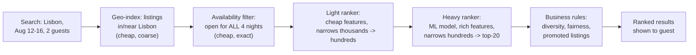

**Memory hook:** *"Geo narrows by where. Availability narrows by when. Only what survives both
gets ranked — ranking the full inventory on every query would be throwing compute at listings that
were never valid answers in the first place."*

---

## Table of contents
[How to Identify This Topic](#how-to-identify-this-topic-in-an-interview) ·
[Interview Playbook](#interview-playbook) · [Requirements](#requirements-clarification) ·
[Capacity Estimation](#capacity-estimation-worked) · [API Design](#api-design) ·
[High-Level Architecture](#high-level-architecture) ·
[Architecture Evolution v1→v2→v3](#architecture-evolution-v1--v2--v3) ·
[End-to-End Walkthroughs](#end-to-end-request-walkthroughs) ·
[Deep Dive: Availability-Calendar Filtering](#deep-dive-availability-calendar-filtering-at-scale) ·
[Deep Dive: Geo-Indexing + Availability Fusion](#deep-dive-fusing-geo-indexing-with-availability) ·
[Deep Dive: Two-Stage Ranking](#deep-dive-two-stage-ranking-light-then-heavy) ·
[Deep Dive: Marketplace Health vs. CTR](#deep-dive-marketplace-health-vs-pure-ctr-optimization) ·
[Data Model](#data-model) · [Failure Modes](#failure-modes--mitigations) ·
[Non-Functional Walkthrough](#non-functional-walkthrough) ·
[Security & Compliance](#security--compliance) · [Cost & Trade-offs](#cost--trade-offs) ·
[Wrap-Up](#wrap-up-mvp-vs-stretch) · [Golden Rules](#golden-rules) ·
[Cheat Sheet](#master-cheat-sheet)

---

## How to identify this topic in an interview

- "Design Airbnb search" or "design a marketplace search + ranking system."
- The tell that separates this from a plain geo-search chapter (like Yelp/Proximity Service): the
  interviewer emphasizes **date-range availability** and **ranking beyond distance** — if either
  is missing from the prompt, ask about it, because both are the actual substance of this chapter.
- A follow-up like "what if a host has instant-book off and needs to manually approve" tests
  whether you can extend the availability model to a soft-hold/pending state, not just a binary
  available/unavailable flag.

---

## Interview playbook

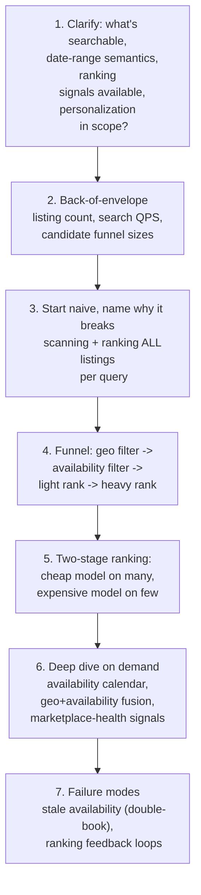

**What the interviewer is actually grading at each step:**
- Step 3: do you recognize, unprompted, that ranking every listing in a city on every query is
  wasteful when most fail a hard availability constraint anyway — filter before you rank?
- Step 5: do you know *why* two ranking stages exist — a heavy model can't run on hundreds of
  thousands of candidates within a latency budget, and a light model alone isn't accurate enough
  for the final top-20 a guest actually sees?
- Step 6: when pushed on "what should the ranker optimize for," do you push back on pure
  click-through rate and bring up marketplace health (cancellations, review scores, host
  reliability) unprompted?

---

## Requirements clarification

### Functional

| # | Requirement | Notes |
|---|---|---|
| F1 | Search listings by location + date range + guest count + filters (price, amenities) | The core query |
| F2 | Return only listings **available for every night in the requested range** | Not "available today" — a specific, contiguous date-range constraint |
| F3 | Rank results by a blend of relevance, quality, price, and personalization signals | Not pure distance, not pure price |
| F4 | Reflect near-real-time availability changes (a booking made seconds ago should remove that listing from future searches for those dates) | Stale availability directly causes double-bookings, a severe trust failure |
| F5 | Support host-side controls (minimum stay, instant-book vs. request-to-book, blocked dates) | Availability isn't purely booking-driven — hosts manually shape it too |

### Non-functional

| Requirement | Target | Why this number |
|---|---|---|
| Search latency (p99) | Low hundreds of milliseconds end-to-end | A search results page is an interactive, "still browsing" UX — not real-time-critical like a payment, but slow search directly hurts conversion |
| Availability correctness | Strict — a listing shown as available must actually be bookable at that moment, or booking must fail cleanly with a clear reason | Double-booking (two guests both think they booked the same dates) is a severe trust and support-cost failure |
| Ranking freshness | Minutes for most signals (reviews, quality scores); near-real-time for availability itself | Availability is the hard constraint that must be current; a ranking signal like "recent review score" can lag by minutes without real harm |
| Search availability (system uptime) | Very high | Search is the primary entry point to the whole marketplace; an outage here is an outage of the product |
| Personalization consistency | Eventual, session-scoped | A user's own recent searches/wishlist should influence ranking within the session; a short propagation lag to a shared feature store is acceptable |

**Clarifying questions worth asking the interviewer up front — and what each answer changes:**

| Question | If the answer is... | ...then this changes |
|---|---|---|
| "Is availability strictly binary, or can hosts require request-to-book approval?" | Both modes exist | Availability model needs a third state (pending/held) in addition to available/booked — see the [availability deep dive](#deep-dive-availability-calendar-filtering-at-scale) |
| "What ranking signals are available — just relevance/price, or also quality, personalization, business rules?" | All of the above | Confirms the two-stage light/heavy ranking architecture is warranted, not overkill |
| "Should ranking purely optimize for booking conversion, or also long-term marketplace health?" | Marketplace health matters (cancellation rate, host reliability) | Confirms the [marketplace-health deep dive](#deep-dive-marketplace-health-vs-pure-ctr-optimization) — a pure CTR/conversion optimizer is the wrong target function |
| "How fresh must availability be after a booking completes?" | Effectively immediate (seconds) | Rules out any batch-refreshed availability index — it must update on the write path, not a periodic rebuild |

**Say this out loud in the interview:** *"Availability is a hard filter, not a ranking signal — a
listing that isn't available for these dates is not a worse result, it's not a valid result at
all, and treating it as a low-ranked result instead of an excluded one is the most common design
mistake in this chapter."*

---

## Capacity estimation, worked

```
Given (illustrative, a global short-term rental marketplace):
  Active listings, globally               = 7,000,000
  Searches per day                          = 150,000,000
  Peak search QPS                           = 150,000,000 / 86,400 ~= 1,700 QPS average,
                                               say ~6,000 QPS at peak

Funnel narrowing per search (the number that justifies two-stage ranking):
  Listings in/near the searched city        = ~50,000 (a popular destination)
  Pass geo filter                            = 50,000
  Pass availability filter (typical
    occupancy ~60-70% for the dates)        = ~15,000-20,000 remain
  -> ranking 15,000-20,000 candidates per query, at 6,000 QPS, with a full heavy ML model per
     candidate, is the math that makes single-stage heavy ranking impossible: that's roughly
     90-120 million heavy-model scoring calls per second at peak. No realistic model-serving
     fleet does that within a low-hundreds-of-ms budget.

Two-stage funnel:
  Light ranker scores ALL ~15,000-20,000 survivors  -> cheap features, cheap model,
                                                          narrows to top ~500
  Heavy ranker scores only the top ~500              -> rich features, expensive model,
                                                          narrows to the ~20-50 actually shown
  -> heavy-model scoring calls per second at peak = 6,000 QPS x 500 ~= 3,000,000/sec -- still
     large, but ~30-40x less than scoring the full post-availability candidate set, and this is
     exactly the number the light-ranker stage exists to make tractable.

Availability calendar size:
  Listings x nights tracked (rolling 1-year booking window)
    = 7,000,000 x 365 ~= 2.5 billion date-cells
  Bytes per cell (bitmap: available/booked/blocked, ~1 bit, packed)
    ~= 2.5 billion bits / 8 ~= ~320 MB total, globally
  -> trivially small in aggregate; the hard part is never storage size, it's serving
     range-intersection queries ("available for ALL of these N nights") fast at high QPS,
     covered in the availability deep dive.
```

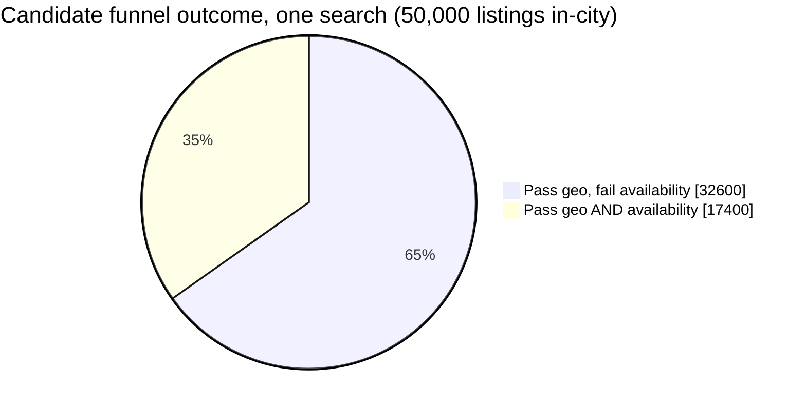

Roughly two-thirds of geo-relevant listings are filtered out by the hard availability
constraint alone, before ranking ever runs — the concrete illustration of why availability must
be a filter, not a ranking signal.

**Redo-the-chain test:** if the destination is a less popular city (5,000 listings instead of
50,000), the funnel narrows faster and the heavy ranker's input set shrinks proportionally — the
two-stage architecture still holds, it just does less work per query, which is the sign of a
funnel that scales with actual candidate volume rather than a fixed cost per query.

**The number worth memorizing:** ranking the full post-availability candidate set with the
expensive model is off by 1-2 orders of magnitude from what's servable at real QPS — the two-stage
split isn't an optimization nicety, it's what makes ranking possible at all within budget.

---

## API design

### `GET /v1/search` (the core query)

```json
{
  "location": { "city": "Lisbon", "lat": 38.72, "lng": -9.14, "radiusKm": 15 },
  "checkIn": "2026-08-12",
  "checkOut": "2026-08-16",
  "guests": 2,
  "filters": { "priceMax": 250, "amenities": ["wifi", "kitchen"] },
  "page": 0
}
```

Response:
```json
{
  "results": [
    {
      "listingId": "l_88213",
      "score": 0.91,
      "priceForStay": 480,
      "rankSignals": { "relevance": 0.85, "quality": 0.93, "priceCompetitiveness": 0.7 },
      "distanceKm": 1.2
    }
  ],
  "candidatesAfterAvailabilityFilter": 17400,
  "totalResults": 20
}
```

| Field | Notes |
|---|---|
| `rankSignals` | Exposed for debuggability/explainability — a ranking decision should never be a single opaque number if it can be avoided, same principle as the multi-source attribution requirement in the compliance chapters of this course |
| `candidatesAfterAvailabilityFilter` | Useful operationally — tracks funnel health per query, the same instinct as monitoring per-stage drop-off in any funnel system |

### `POST /v1/listings/{listingId}/hold` (soft hold during checkout)

```json
{ "checkIn": "2026-08-12", "checkOut": "2026-08-16", "ttlSeconds": 600 }
```

A short-lived hold prevents two guests from both completing checkout for the same dates — see the
[availability deep dive](#deep-dive-availability-calendar-filtering-at-scale) for why this can't
just be "check availability, then book" as two separate steps.

**The one sentence worth saying about the API surface:** *"Search returns candidates that already
passed a hard availability filter — a listing that can't be booked for these dates should never
even reach the ranker, let alone be returned with a low score."*

---

## High-level architecture

### Architecture evolution (v1 → v2 → v3)

**v1 — scan and rank everything:**

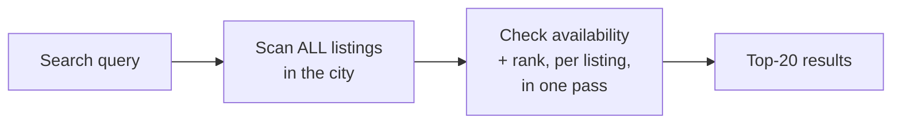

**Why it breaks:** ranking is the expensive operation, and this design pays that cost for every
listing regardless of whether it's even available — per the capacity estimate, that's 2-3x more
ranking work than necessary before even considering that a single-stage heavy ranker can't hit
latency budget at real QPS at all.

**v2 — filter then rank, but single-stage ranking:**

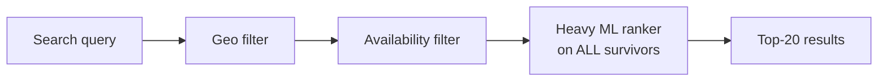

**Why it breaks:** filtering before ranking is the right instinct, but per the capacity estimate,
15,000-20,000 survivors per query at real QPS still overwhelms a heavy model's realistic serving
throughput — filtering alone doesn't close the gap, only two-stage ranking does.

**v3 — the real system: filter, then light rank, then heavy rank:**

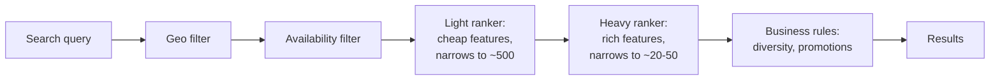

**What v3 fixes, one line each:** the availability filter removes invalid candidates before any
ranking cost is spent on them; the light ranker cheaply narrows a large survivor set down to a
size the expensive model can actually afford; and the heavy ranker only ever runs on that small,
already-promising set, hitting both latency budget and ranking quality.

---

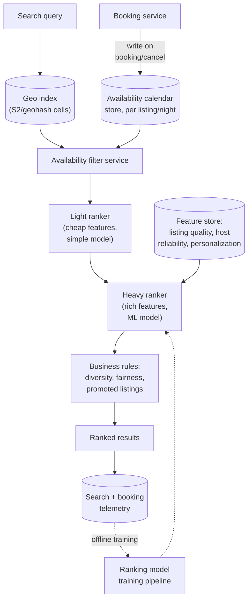

| Component | Role |
|---|---|
| Geo index | Coarse, cheap spatial filter — same family of structure as the Proximity Service guide's geo-indexing |
| Availability calendar store | The hard-constraint filter — see the [availability deep dive](#deep-dive-availability-calendar-filtering-at-scale) |
| Light ranker | Cheap model/heuristic, runs on every post-availability survivor — its only job is to narrow the set enough for the heavy ranker to be affordable |
| Heavy ranker | Rich-feature ML model, runs only on the light ranker's small output — this is where quality, personalization, and price-competitiveness signals actually get weighed |
| Business rules | Post-ranking adjustments (diversity so results aren't all near-identical listings, promoted-listing slots, fairness constraints) — deliberately kept separate from the ML ranker so business logic changes don't require retraining a model |
| Booking service | The only writer to the availability calendar — same "one writer, many readers" discipline as any authoritative-source system |

---

## End-to-end request walkthroughs

### Walkthrough 1 — a normal search, full funnel

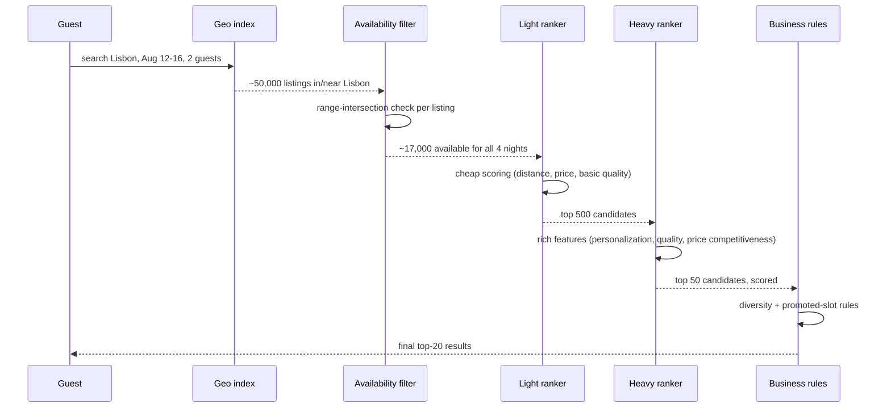

### Walkthrough 2 — a booking completes mid-search-session, availability updates immediately

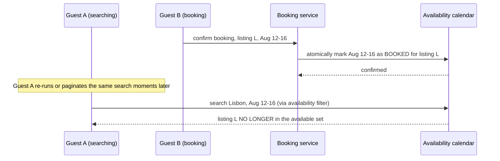

The write to the availability calendar is what the [availability deep dive](#deep-dive-availability-calendar-filtering-at-scale)
is really about — it has to be atomic and immediately visible to the next read, not eventually
consistent, or two guests can both believe they booked the same dates.

### Walkthrough 3 — two guests race to book the same last-available dates

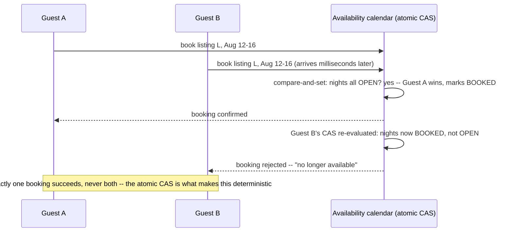

This is the concrete case the [availability deep dive](#deep-dive-availability-calendar-filtering-at-scale)
exists to prevent — without an atomic compare-and-set, both guests' "check then book" could
interleave and both succeed, a double-booking.

---

## Deep dive: availability-calendar filtering at scale

The hard constraint. A listing is a valid candidate only if every single night in the requested
range is open — not "mostly open," not "open as of the last cache refresh."

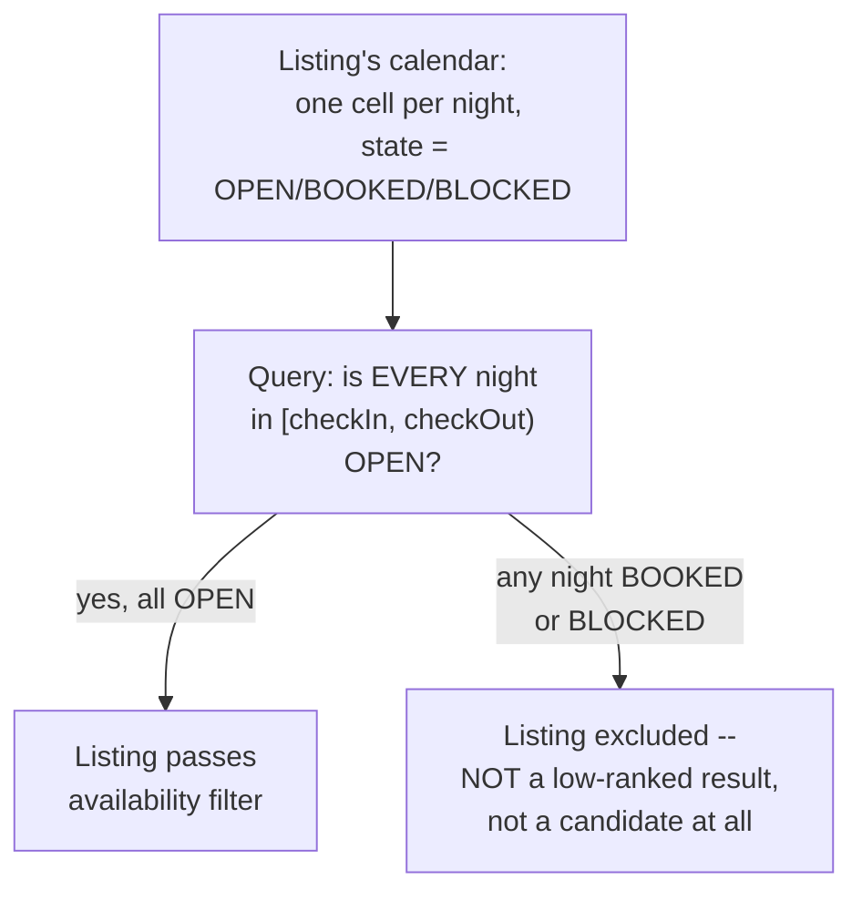

**Why a bitmap-per-listing, not a booking-range table scanned per query:** representing each
listing's calendar as a compact bitmap (one bit per night over a rolling window, per the capacity
estimate's ~320MB global total) turns "is this range fully open" into a fast bitwise AND/range
check, instead of scanning a variable number of booking-range rows per listing per query — the
same "precompute into a query-friendly structure" instinct as the CIDR trie in this course's
IP-allowlist chapter, just applied to date ranges instead of address ranges.

**Booking must be atomic against the same calendar the filter reads.** A booking is a
compare-and-set: "mark these nights BOOKED, but only if they were all still OPEN" — if two guests'
booking requests race for the same dates, exactly one succeeds and the other gets a clean
"no longer available" rather than both succeeding and creating a double-booking. This is the same
atomic-decrement discipline as inventory reservation in a flash-sale system, applied to a calendar
instead of a stock count.

**The soft-hold problem:** a guest who starts checkout needs the dates reserved for a short window
(the `POST /v1/listings/{listingId}/hold` endpoint) so they aren't outrun by another guest mid-
checkout — implemented as a short-TTL `PENDING` state distinct from `OPEN` and `BOOKED`, released
automatically if checkout isn't completed in time.

**Interview cheat-sheet:** *"Represent each listing's calendar as a compact bitmap for fast
range-intersection queries, make booking an atomic compare-and-set against that same structure,
and add a short-TTL soft-hold state for in-progress checkouts — three distinct mechanisms, not
one 'check then book' two-step that would race."*

---

## Deep dive: fusing geo-indexing with availability

Geo-indexing alone (as in the Proximity Service chapter) answers "what's nearby." This chapter
needs "what's nearby **and** available for these dates" — and the order you apply the two filters
in matters for cost.

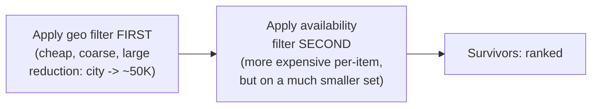

**Why geo first, not availability first:** geo filtering is comparatively cheap (a spatial index
lookup) and produces a large reduction (millions of global listings down to tens of thousands in
one city); availability filtering is comparatively more expensive per listing (a range-
intersection check) — applying the cheap, high-reduction filter first means the expensive filter
only ever runs on a small, geographically-relevant set, never on the global listing pool.

**Interview cheat-sheet:** *"Order filters by cost-per-item times expected reduction — cheap,
high-reduction filters (geo) go first; more expensive filters (availability range-intersection)
run only on what survives, never on the full unfiltered set."*

---

## Deep dive: two-stage ranking, light then heavy

Already motivated by the capacity math — restated here as the concrete mechanism.

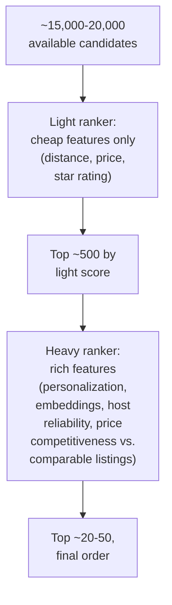

**Why not just make the light ranker better and skip the heavy stage?** The light ranker is
deliberately cheap — it has to score tens of thousands of candidates per query within a tight
budget, which rules out expensive features like personalized embeddings or cross-listing
comparisons. The heavy ranker's richer features measurably improve final ordering quality, but
only because it only ever has to score hundreds, not tens of thousands, of candidates — the
two-stage split is what makes both stages simultaneously cheap-and-fast and rich-and-accurate,
neither of which is achievable alone at the required scale.

**A candidate that the light ranker excludes can never be recovered by the heavy ranker** — this
is the real risk of the funnel, and it's why light-ranker recall (does it reliably keep genuinely
good listings in its top 500) matters as much as heavy-ranker precision. Monitor light-ranker
recall against heavy-ranker/human-judged relevance offline, not just heavy-ranker output quality
in isolation.

**Interview cheat-sheet:** *"Two stages exist because 'cheap and covers everything' and 'expensive
and highly accurate' can't be the same model at this scale — but a mistake made by the light
ranker (dropping a good listing before the heavy ranker ever sees it) is unrecoverable, so light-
ranker recall needs its own monitoring, not just heavy-ranker output quality."*

---

## Deep dive: marketplace health vs. pure CTR optimization

The subtle trap: optimizing purely for click-through or immediate booking conversion can promote
listings that look attractive in a search result but generate poor outcomes afterward.

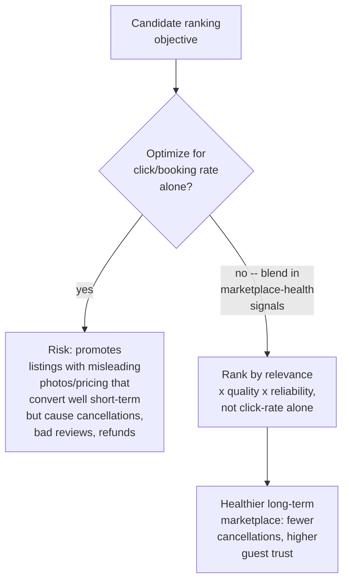

**Concrete signals worth naming as part of "marketplace health":** host cancellation rate,
guest-reported issue rate after check-in, review-score trend (not just average — a declining
trend matters), response time to booking requests. These get blended into the heavy ranker's
feature set alongside relevance and personalization, not bolted on as an afterthought filter.

**Why this can't be left to an A/B test on conversion alone:** a short A/B test measuring
booking-rate lift will reliably favor whichever ranker maximizes immediate conversion — the
marketplace-health cost of that choice (cancellations, disputes, refunds, guest churn from a bad
experience) surfaces on a longer time horizon than a typical experiment window, so it has to be an
explicit term in the ranking objective, not something the experiment framework will catch on its
own.

**Interview cheat-sheet:** *"A ranker that only maximizes click-through or booking conversion will
find and promote exactly the failure modes that hurt the marketplace later — cancellation rate,
review trend, and host reliability need to be explicit ranking features, not an afterthought, and
this can't be caught by a short-window conversion-only A/B test."*

---

## Data model

**Listing availability lifecycle** — the state machine behind the availability deep dive:

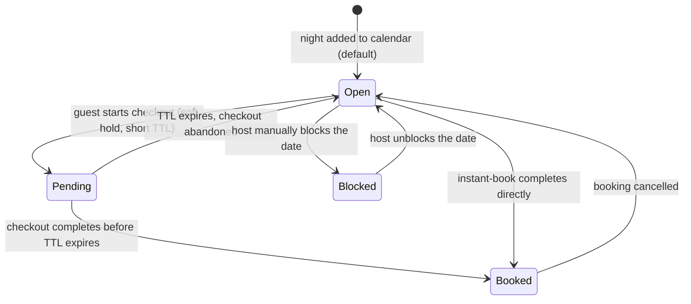

The `Pending` state with its short TTL is the one most designs skip, and it's exactly what
prevents two simultaneous checkouts from both succeeding for the same dates.

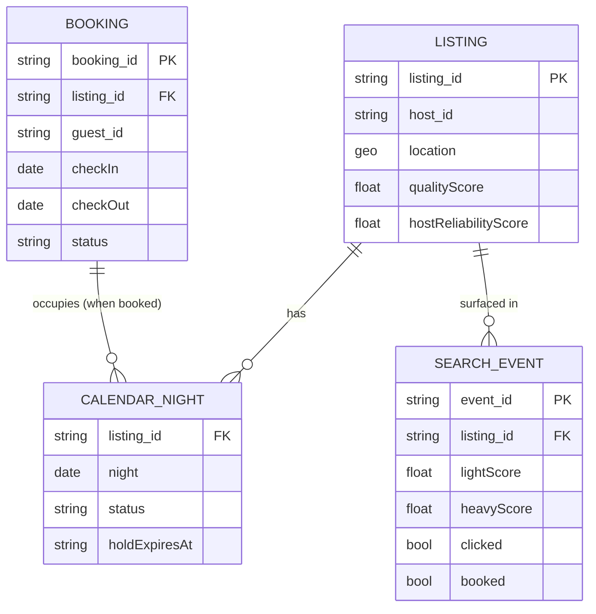

| Table | Storage choice & why |
|---|---|
| `CalendarNight` | A structure supporting fast range-intersection reads and atomic compare-and-set writes (bitmap per listing, or an equivalent range-indexed store) — the single hottest read+write path in the whole system |
| `SearchEvent` | High-write-throughput telemetry, feeds both funnel-health monitoring and offline ranking-model training, same pattern as the telemetry tables elsewhere in this course |

---

## Failure modes & mitigations

| Failure mode | Impact | Mitigation |
|---|---|---|
| **Two guests both complete checkout for the same dates** (race on the availability write) | Double-booking — a severe trust and support-cost failure | Booking is an atomic compare-and-set against the calendar, never a separate "check then write"; the `Pending` soft-hold state further reduces the race window |
| **Availability index lags actual booking state** (a caching layer serving stale reads) | Guests shown listings that are actually already booked, leading to failed checkout | Reads for availability filtering must go against the authoritative, immediately-consistent calendar store on the hot path — this is one of the few places in a search system where eventual consistency is not acceptable |
| **Light ranker systematically drops a class of genuinely good listings** (e.g. new listings with few reviews) | Cold-start listings never reach the heavy ranker, starving them of bookings and reviews, compounding the problem | Reserve a small exploration slot in the light ranker's output for under-exposed listings, monitored separately from the main relevance-driven funnel |
| **Ranking overfits to short-term conversion** | Marketplace-health metrics degrade even as booking-rate A/B tests look positive | Track cancellation rate, review-score trend, and dispute rate as guardrail metrics on every ranking experiment, not just conversion lift |

---

## Non-functional walkthrough

**Scaling the geo and availability filters is embarrassingly parallel by geography** — sharding
the availability calendar and geo index by region means most queries only touch a small, local
shard, similar to how a proximity-search system shards by geo cell.

**Availability correctness is the one place this system cannot tolerate eventual consistency** —
every other component (light/heavy ranking, personalization features) can lag by seconds to
minutes without real harm; the availability calendar's read-for-filtering and write-on-booking
must be immediately consistent against each other.

**Ranking freshness is deliberately tiered**: availability is real-time, quality/reliability
scores update on the order of minutes to hours (recomputed from recent reviews/cancellations), and
personalization features update within a session — three different freshness bars in one ranking
pipeline, worth naming explicitly if asked to characterize consistency.

---

## Security & compliance

- **Host and guest PII in listing/booking data** requires standard access controls and
  minimization — search results should expose only what's needed to evaluate a listing, not raw
  host contact details.
- **Anti-discrimination considerations in ranking** — quality/personalization signals must be
  audited to ensure they don't encode proxies for protected characteristics; this is a real,
  litigated risk area for marketplace ranking systems, worth naming if asked about ranking
  fairness.
- **Fraud/fake-listing detection** feeds into the quality score — a listing with suspicious review
  patterns or pricing anomalies should be down-ranked or flagged for review before it can harm
  guest trust at scale.

---

## Cost & trade-offs

**Two-stage ranking trades model-serving cost for latency headroom.** Running the light ranker on
every survivor and the heavy ranker only on the top few hundred is cheaper in aggregate compute
than a hypothetical single expensive model that could somehow serve the full candidate set — but
it requires maintaining two models with a defined hand-off, a real engineering cost worth naming
if asked to compare against a simpler single-model design.

**Exploration slots for cold-start listings cost some short-term ranking quality for long-term
marketplace health** — a small, deliberate trade-off, same shape as the marketplace-health deep
dive's broader point.

---

## Wrap-up: MVP vs. stretch

**In scope for an MVP:**
- Geo filter + availability filter funnel with an atomic, immediately-consistent calendar.
- A single-stage ranker (defer the light/heavy split until scale actually demands it — but design
  the funnel so adding a light-ranker stage later doesn't require re-architecting).
- Basic quality signals (review average, response rate) blended into ranking.

**Explicitly out of scope for an MVP:**
- Full personalization (per-guest embeddings, session-based re-ranking) — start with
  non-personalized relevance + quality ranking, add personalization once there's enough
  interaction data to train on.
- Marketplace-health guardrail automation — start with manual monitoring of cancellation/dispute
  trends, automate the feedback into ranking once the signal is well understood.

**Stretch goals, worth naming if asked "what's next":**
1. **Two-stage light/heavy ranking**, once candidate volume and latency pressure justify the added
   complexity of maintaining two models.
2. **Personalized re-ranking** using a guest's own search/booking history.
3. **Dynamic exploration budget** for cold-start listings, tuned automatically based on how quickly
   new listings accumulate enough signal to compete on quality alone.

---

## Golden rules

- **Availability is a hard filter, never a ranking signal.** An unavailable listing is not a
  low-scored result, it's not a candidate at all.
- **Order filters by cost-per-item times expected reduction** — cheap, high-reduction filters
  (geo) run before more expensive ones (availability range-intersection).
- **Booking must be an atomic compare-and-set against the same calendar structure availability
  filtering reads** — never a separate check-then-write that can race.
- **Two-stage ranking exists because cheap-and-covers-everything and expensive-and-accurate can't
  be the same model at scale** — but a light-ranker miss is unrecoverable, so its recall needs its
  own monitoring.
- **Never optimize ranking purely for click-through or conversion** — marketplace-health signals
  (cancellation rate, review trend, host reliability) belong in the objective itself, not an
  afterthought filter, because a short A/B test won't catch their long-term cost.

---

## Master cheat sheet

**One-liners:**
- The funnel is geo (cheap, coarse) → availability (hard constraint, must be immediately
  consistent) → light rank (cheap, broad) → heavy rank (expensive, narrow) → business rules.
- A listing failing the availability filter is excluded, not down-ranked — conflating the two is
  the most common mistake in this chapter.
- Booking is a compare-and-set against the calendar, with a short-TTL `Pending` soft-hold state
  during checkout — two guests can never both win a race for the same dates.
- Two-stage ranking exists because the full post-availability candidate set is 1-2 orders of
  magnitude too large for an expensive model to score at real QPS.
- Marketplace health (cancellations, review trend, host reliability) must be an explicit ranking
  feature — pure conversion optimization will find and promote exactly the listings that hurt the
  marketplace later.

**Formula chain:**
```
post_availability_candidates ~= geo_candidates x (1 - occupancy_rate_for_dates)
heavy_ranker_load = search_QPS x light_ranker_output_size   [NOT x post_availability_candidates]
```

**Numbers:** low-hundreds-of-ms search latency budget · availability reads/writes must be
immediately consistent, unlike every other ranking signal in the pipeline · two-stage ranking
typically narrows a ~15-20K candidate set to ~500 before the expensive model ever runs, a
30-40x reduction in expensive-model load versus single-stage ranking.
