# Design Uber's Surge Pricing Engine — FAANG Interview Guide

> Source chapter type: real-time demand/supply modeling at scale. Distinct from
> [the generic Uber guide](./30-Design%20Uber-FAANG-Guide.md), which covers ride matching and trip
> lifecycle — this chapter is specifically about **computing a price multiplier per geographic
> cell, continuously, from a constantly-shifting ratio of ride requests to available drivers**,
> and doing it without the price itself becoming unstable (surge flapping) or triggering a feedback
> loop that defeats its own purpose.

## Mental model

When demand for rides in an area outstrips available drivers, prices rise — both to ration scarce
supply toward the riders who value it most and to incentivize more drivers to move into that area.
The hard parts are not "compute a ratio," they're:

1. **Defining "an area" and "right now" precisely enough to be useful.** Demand and supply have to
   be measured per small geographic cell (a city-wide average is useless — one neighborhood can
   be surging while another two kilometers away has excess supply) and over a short, rolling time
   window (an hour-old snapshot of demand is stale the moment a concert lets out).
2. **Smoothing, so price doesn't flicker.** A raw, instant demand/supply ratio is noisy — a
   momentary cluster of requests shouldn't cause price to jump and immediately drop back down
   seconds later; riders and drivers both need price to feel stable enough to act on.
3. **The feedback loop the system itself creates.** Surge pricing is designed to pull drivers
   toward high-demand areas — which, if it works, *reduces* the demand/supply ratio that caused
   the surge, which should lower price again. Getting this loop to converge smoothly instead of
   oscillating (surge triggers driver influx, influx overcorrects, price crashes, drivers leave,
   surge returns) is a control-systems problem hiding inside a pricing feature.

**The one sentence to say out loud:** *"This isn't a lookup, it's a real-time control loop: measure
local demand/supply, smooth it, price it, watch how the priced response changes demand/supply, and
avoid the swings that make price feel arbitrary rather than responsive."*

**The one picture to remember forever:**

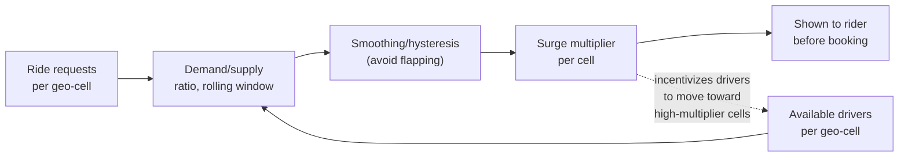

**Memory hook:** *"Demand and supply feed a ratio, the ratio feeds a smoothed price, and the price
feeds back into supply — draw the feedback arrow, because that arrow is the entire reason this
system needs damping, not just a formula."*

---

## Table of contents
[How to Identify This Topic](#how-to-identify-this-topic-in-an-interview) ·
[Interview Playbook](#interview-playbook) · [Requirements](#requirements-clarification) ·
[Capacity Estimation](#capacity-estimation-worked) · [API Design](#api-design) ·
[High-Level Architecture](#high-level-architecture) ·
[Architecture Evolution v1→v2→v3](#architecture-evolution-v1--v2--v3) ·
[End-to-End Walkthroughs](#end-to-end-request-walkthroughs) ·
[Deep Dive: Geo-Cell Demand/Supply Aggregation](#deep-dive-geo-cell-demandsupply-aggregation) ·
[Deep Dive: Smoothing & Anti-Flapping](#deep-dive-smoothing--anti-flapping) ·
[Deep Dive: The Feedback-Loop Problem](#deep-dive-the-feedback-loop-problem) ·
[Deep Dive: Price Propagation & Fairness Bounds](#deep-dive-price-propagation--fairness-bounds) ·
[Data Model](#data-model) · [Failure Modes](#failure-modes--mitigations) ·
[Non-Functional Walkthrough](#non-functional-walkthrough) ·
[Security & Compliance](#security--compliance) · [Cost & Trade-offs](#cost--trade-offs) ·
[Wrap-Up](#wrap-up-mvp-vs-stretch) · [Golden Rules](#golden-rules) ·
[Cheat Sheet](#master-cheat-sheet)

---

## How to identify this topic in an interview

- "Design Uber/Lyft's surge/dynamic pricing system."
- Any variant asking specifically about **how the price is computed**, not the ride-matching flow
  — the generic Uber guide covers matching; this chapter is the pricing control loop feeding into
  it.
- A follow-up like "what stops price from jumping around every few seconds" is the
  [smoothing deep dive](#deep-dive-smoothing--anti-flapping) — a strong signal the interviewer
  wants to see control-theory instincts, not just a formula.
- A follow-up like "what happens once surge pricing successfully attracts more drivers" is the
  [feedback-loop deep dive](#deep-dive-the-feedback-loop-problem) — the single most-missed nuance
  in this chapter.

---

## Interview playbook

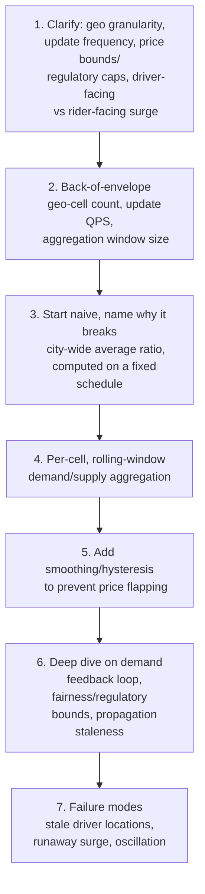

**What the interviewer is actually grading at each step:**
- Step 3: do you recognize, unprompted, that a city-wide average hides exactly the localized
  imbalance surge pricing exists to correct — granularity has to be small enough to be
  meaningful?
- Step 5: do you know that a raw ratio is noisy and needs damping, and can name a concrete
  mechanism (rolling average, minimum-duration-before-change, hysteresis band) rather than just
  asserting "we'd smooth it"?
- Step 6: do you spot the feedback loop unprompted, or only when the interviewer explicitly asks
  "what happens after surge attracts more drivers"? Spotting it yourself is the differentiator.

---

## Requirements clarification

### Functional

| # | Requirement | Notes |
|---|---|---|
| F1 | Compute a surge multiplier per geographic cell, updated continuously | The core output |
| F2 | Show riders the current multiplier before they confirm a booking | Price transparency at time of commitment |
| F3 | Surface surge information to drivers to influence where they position themselves | The supply-side half of the feedback loop, deliberately designed in |
| F4 | Respect price bounds — regulatory caps in some markets, and internal fairness/anti-gouging limits | Surge isn't unbounded even where demand/supply would justify a higher number |
| F5 | Log every priced trip with the multiplier and the demand/supply inputs that produced it | Needed for pricing disputes, regulatory audits, and offline model evaluation |

### Non-functional

| Requirement | Target | Why this number |
|---|---|---|
| Price update latency | Seconds, not milliseconds — surge doesn't need to react to a single request, it needs to react to a sustained shift | Over-reacting to instantaneous noise is worse than reacting a few seconds late to a real trend |
| Price stability | Bounded rate of change — no more than one "step" of multiplier change within a short cooldown window per cell | Directly prevents flapping; see the [smoothing deep dive](#deep-dive-smoothing--anti-flapping) |
| Geo granularity | Small enough that adjacent cells can have meaningfully different prices (hundreds of meters to a couple of kilometers, depending on density) | A citywide average defeats the purpose — see the mental model |
| Availability | High — if the pricing engine is down, the system must fall back to a safe default (no surge, i.e. 1.0x), never block ride requests entirely | Losing dynamic pricing is a business/revenue problem, not a rider-facing outage |
| Auditability | Strict — every priced trip must be explainable from its inputs | Regulatory and dispute-resolution requirement in many markets |

**Clarifying questions worth asking the interviewer up front — and what each answer changes:**

| Question | If the answer is... | ...then this changes |
|---|---|---|
| "What geo granularity — city, neighborhood, hexagon grid?" | A fine-grained hex grid (e.g. H3/S2 cells) | Confirms per-cell aggregation at a grid resolution fine enough to capture localized imbalance, and the aggregation deep dive should assume a grid index, not administrative boundaries |
| "Are there regulatory price caps in some markets?" | Yes, varies by city/country | Confirms price bounds are a per-market configuration, not a single global constant — see the [fairness-bounds deep dive](#deep-dive-price-propagation--fairness-bounds) |
| "Should drivers see surge zones to influence positioning?" | Yes | Confirms the feedback loop is intentional, not an accident to be avoided — the design should embrace it while damping its instability, not try to eliminate it |
| "How often can the multiplier change for a cell?" | At most every N seconds/minutes | Directly sizes the cooldown window in the smoothing mechanism |

**Say this out loud in the interview:** *"Surge pricing is a closed loop by design — it's supposed
to change supply, and that changed supply is supposed to change the price back. The engineering
problem isn't computing a ratio, it's making that loop settle instead of oscillate."*

---

## Capacity estimation, worked

```
Given (illustrative, a large city's ride-hailing operation):
  Geo cells covering the metro area (hex grid, ~0.5-1 km^2 per cell) = ~5,000 cells
  Ride requests per day, metro-wide                                   = 2,000,000
  Peak requests/sec, metro-wide                                        = 2,000,000 / 86,400 ~= 23,
                                                                          say ~150 QPS at rush-hour peak
  Available drivers, metro-wide, online at peak                        = ~40,000

Per-cell aggregation load:
  Average requests per cell per minute at peak = 150 QPS x 60 / 5,000 cells ~= 1.8/min/cell
  -> most cells see well under one request per second even at peak -- this is why a rolling
     WINDOW (e.g. 2-5 minutes) is necessary for a statistically meaningful ratio; computing a
     ratio from a single second's data in most cells would be almost entirely noise.

Driver location updates:
  Driver app ping interval        = every 4 seconds
  Metro-wide location update QPS   = 40,000 / 4 ~= 10,000 QPS
  -> this, not ride requests, is the dominant write load on the geo-aggregation layer --
     surge pricing's supply-side signal updates far more frequently than its demand-side signal.

Multiplier recompute cadence:
  Illustrative recompute interval  = every 30 seconds per cell
  Recomputes/sec, metro-wide        = 5,000 cells / 30 sec ~= 167/sec
  -> a small, cheap number -- the hard part in this system is never the compute cost of the
     ratio-to-multiplier function itself, it's the continuous aggregation feeding it (driver
     pings at 10,000 QPS) and the smoothing logic that prevents the OUTPUT from being noisy
     even though the recompute cadence itself is fast enough to react quickly.
```

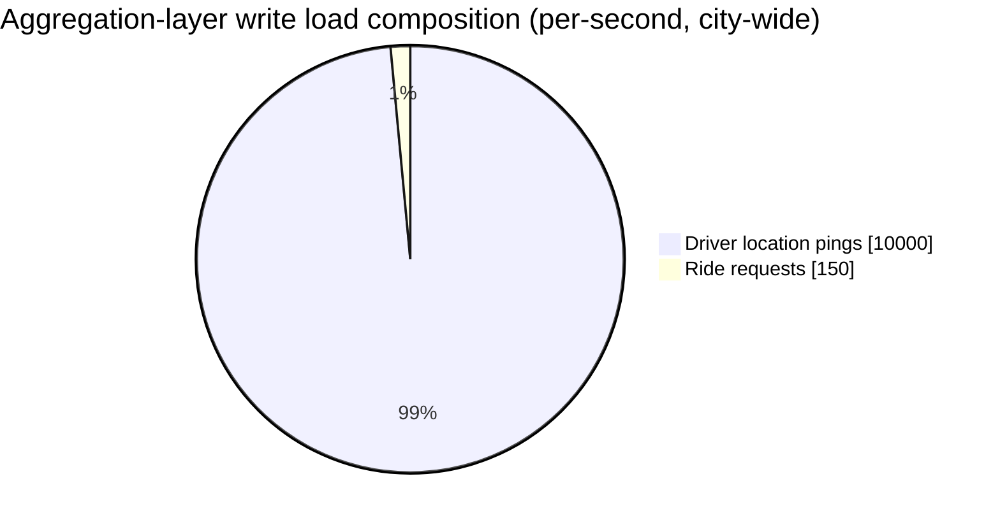

Driver pings dominate the aggregation layer's write volume by roughly 65x over ride requests
themselves — the supply-side signal, not demand, is what actually sizes this system's ingest
capacity.

**Redo-the-chain test:** if driver ping interval drops to 2 seconds (more responsive positioning
data), location-update QPS doubles to ~20,000 — the aggregation layer's write load scales directly
with ping frequency, a concrete trade-off between supply-signal freshness and infrastructure load
worth naming if asked "how would you make this more responsive."

**The number worth memorizing:** at real-world request density, most geo-cells see far less than
one ride request per second even at peak — the ratio has to be computed over a rolling time
window, not an instant, or it's measuring noise, not demand.

---

## API design

### `GET /v1/pricing/quote` (called before a rider confirms a booking)

```json
{
  "pickupLocation": { "lat": 37.77, "lng": -122.41 },
  "destination": { "lat": 37.79, "lng": -122.40 }
}
```

Response:
```json
{
  "baseFareEstimate": 12.50,
  "surgeMultiplier": 1.8,
  "finalEstimate": 22.50,
  "cellId": "h3_8a2830828017fff",
  "multiplierValidUntil": "2026-07-24T18:32:00Z"
}
```

| Field | Notes |
|---|---|
| `surgeMultiplier` | Locked in for a short validity window (`multiplierValidUntil`) — a rider shouldn't see one price at quote time and be charged a different one moments later purely due to the multiplier recomputing mid-booking |
| `cellId` | Exposed for debuggability/audit — same "show your work" instinct as the attribution fields in this course's compliance chapters |

### `GET /v1/driver/surge-map` (driver-facing, informs positioning)

```json
{
  "cells": [
    { "cellId": "h3_8a2830828017fff", "multiplier": 1.8 },
    { "cellId": "h3_8a2830828013fff", "multiplier": 1.0 }
  ]
}
```

**The one sentence worth saying about the API surface:** *"The multiplier a rider is quoted is
locked for a short window — recomputing it out from under an in-progress booking would make price
feel arbitrary, exactly the instability the smoothing mechanism is supposed to prevent in the
first place."*

---

## High-level architecture

### Architecture evolution (v1 → v2 → v3)

**v1 — citywide average ratio, recomputed on a fixed schedule:**


**Why it breaks:** a single citywide number hides exactly the localized imbalance surge pricing
exists to address — a stadium letting out floods one neighborhood with demand while the rest of
the city has ample supply, and a citywide average smooths that signal into irrelevance.

**v2 — per-cell ratio, computed instantaneously:**

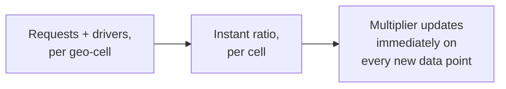

**Why it breaks:** per the capacity estimate, most cells see well under one request per second —
an instant ratio computed from that sparse a signal is dominated by noise, and updating the
multiplier on every new data point makes price flicker constantly, which is worse for both rider
trust and driver decision-making than a slightly-stale-but-stable number.

**v3 — the real system: per-cell, rolling-window, smoothed:**

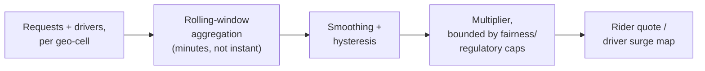

**What v3 fixes, one line each:** the rolling window gives the ratio enough data to be meaningful
in even a sparsely-trafficked cell; smoothing and hysteresis prevent the output from flickering
even as the underlying ratio continues to update frequently; and explicit price bounds keep the
result within fairness/regulatory limits regardless of how extreme the raw ratio gets.

---

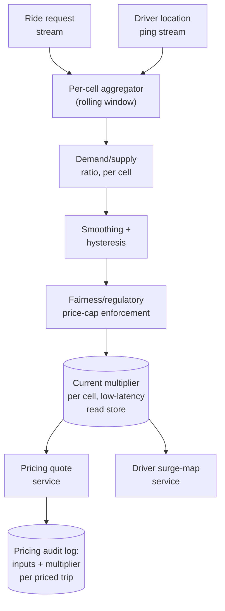

| Component | Role |
|---|---|
| Per-cell aggregator | Consumes both request and driver-location streams, maintains a rolling-window count per cell — the supply-side stream (driver pings) dominates its write volume per the capacity estimate |
| Smoothing + hysteresis | The mechanism that turns a noisy raw ratio into a stable, slowly-changing multiplier — see the [smoothing deep dive](#deep-dive-smoothing--anti-flapping) |
| Fairness/regulatory bounds | Per-market configuration clamping the multiplier regardless of how extreme the raw ratio is |
| Current-multiplier store | Low-latency read path — every quote and every driver's surge map read this, never the raw aggregator directly |
| Pricing audit log | Every quoted multiplier plus the inputs that produced it, for disputes and regulatory review |

---

## End-to-end request walkthroughs

### Walkthrough 1 — a normal surge computation cycle

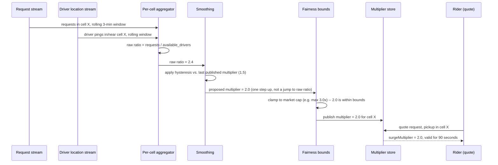

### Walkthrough 2 — surge successfully attracts drivers, feedback loop resolves smoothly

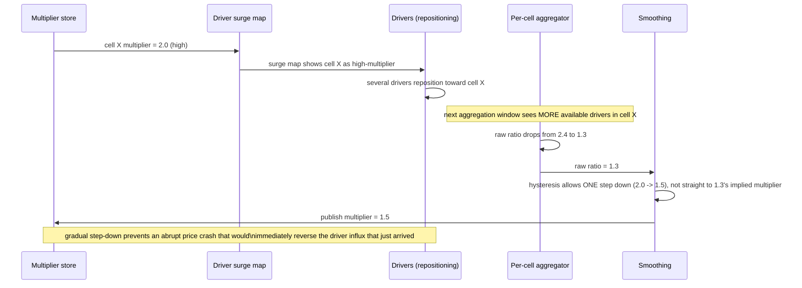

The gradual step-down in walkthrough 2 is the entire point of the
[feedback-loop deep dive](#deep-dive-the-feedback-loop-problem) — a naive design that snaps
straight back to the new raw ratio would create an oscillation, not a smooth resolution.

### Walkthrough 3 — an extreme ratio gets clamped by the regulatory cap

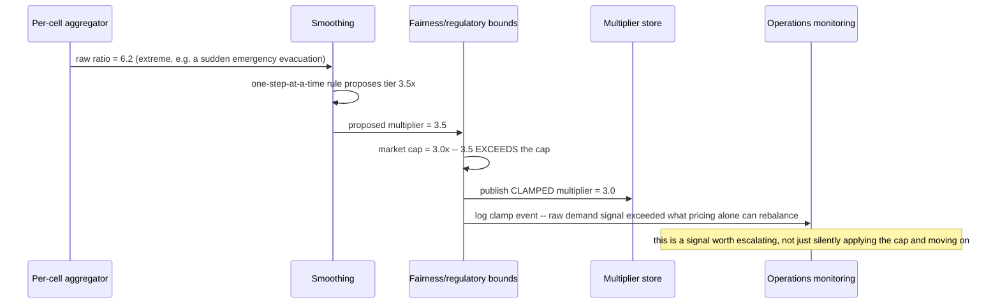

The clamp event is deliberately visible to operations, not silently absorbed — per the
[fairness-bounds deep dive](#deep-dive-price-propagation--fairness-bounds), a clamp is itself a
signal that demand has outstripped what price alone can correct.

---

## Deep dive: geo-cell demand/supply aggregation

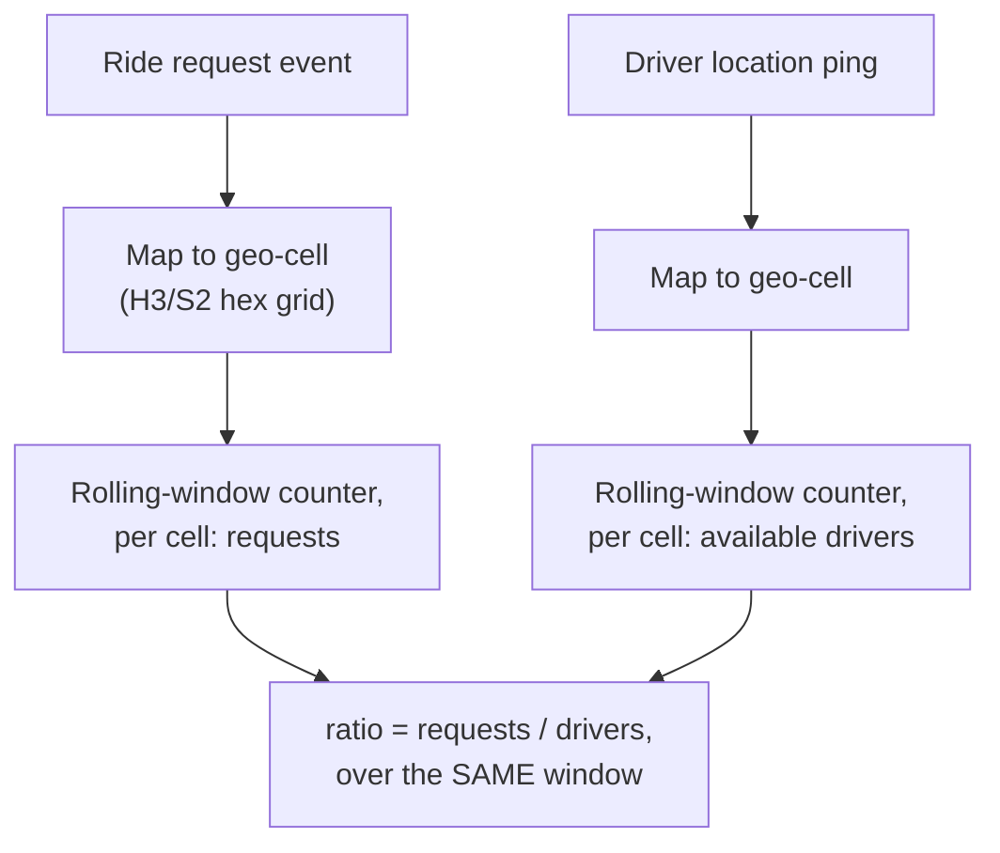

**Why a hex grid (H3/S2), not administrative boundaries:** a uniform grid gives every cell roughly
the same area regardless of location, so a ratio computed in one cell is comparable to a ratio
computed in a neighboring cell — administrative boundaries (neighborhoods, zip codes) vary wildly
in size and shape, making ratios computed across them inconsistent in what they actually measure.

**Why the rolling window must cover both signals over the exact same interval:** requests and
driver availability have to be measured over a matching time window, or the ratio compares
apples to oranges — e.g. requests summed over 3 minutes divided by an instantaneous driver count
would overweight demand relative to a supply figure that's really an instant snapshot, not a
3-minute average.

**Interview cheat-sheet:** *"Aggregate both demand and supply over the same rolling window, per
uniform-area geo-cell — a hex grid keeps ratios comparable across cells, and matching the window
for both signals keeps the ratio measuring the same thing on both sides of the fraction."*

---

## Deep dive: smoothing & anti-flapping

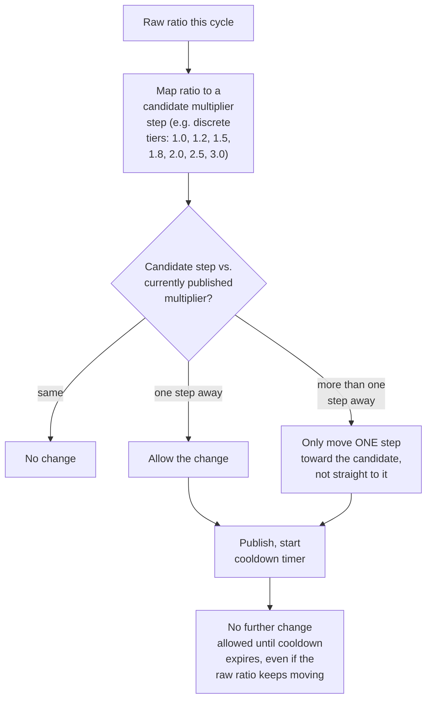

**Two independent damping mechanisms, both needed:** discrete pricing tiers (instead of a
continuous multiplier) mean small ratio fluctuations often don't cross a tier boundary at all;
**and** a cooldown window plus a one-step-at-a-time rule means even a large, sudden ratio swing
only moves the published price gradually. Either alone helps; together they're what actually
prevents flapping.

**Why discrete tiers, not a continuous multiplier:** a continuous value gives the false impression
of precision the underlying noisy ratio doesn't support, and it's much easier to reason about "did
the price change" — both for riders comparing quotes and for an auditor reviewing pricing
decisions — when there's a small, fixed set of possible values.

**Interview cheat-sheet:** *"Snap the raw ratio to a small set of discrete pricing tiers, and only
allow the published multiplier to move one tier per cooldown window regardless of how far the raw
ratio has moved — the combination of tiering and rate-limited change is what prevents flapping,
neither alone is sufficient."*

---

## Deep dive: the feedback-loop problem

The mechanism this chapter is most often graded on spotting unprompted.

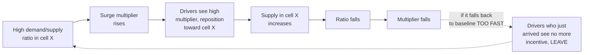

**Why an un-damped loop oscillates:** if the multiplier reacts instantly to the ratio, a successful
influx of drivers causes an immediate price crash, which removes the incentive for those same
drivers to stay, which lets demand outstrip supply again, restarting the cycle — the system would
be perpetually surging and crashing in the same cells rather than settling at a stable equilibrium.

**Why the smoothing mechanism from the previous deep dive is what actually fixes this, not a
separate mechanism:** the one-step-per-cooldown rule means even a successful driver influx only
lowers price gradually — by the time price has fully normalized, drivers have had a real window
to decide whether to stay based on a still-somewhat-elevated price, rather than an abrupt,
immediate drop the instant they arrive. Smoothing isn't just cosmetic UX polish, it's the load-
bearing mechanism that makes the feedback loop converge instead of oscillate.

**Interview cheat-sheet:** *"Surge pricing is a closed loop by design — it's meant to change
supply, and changed supply is meant to change price back. The same smoothing/hysteresis mechanism
that prevents flapping from noisy input is also what prevents this intentional feedback loop from
oscillating — naming both effects of one mechanism is the sign you've actually understood why it's
there, not just that it exists."*

---

## Deep dive: price propagation & fairness bounds

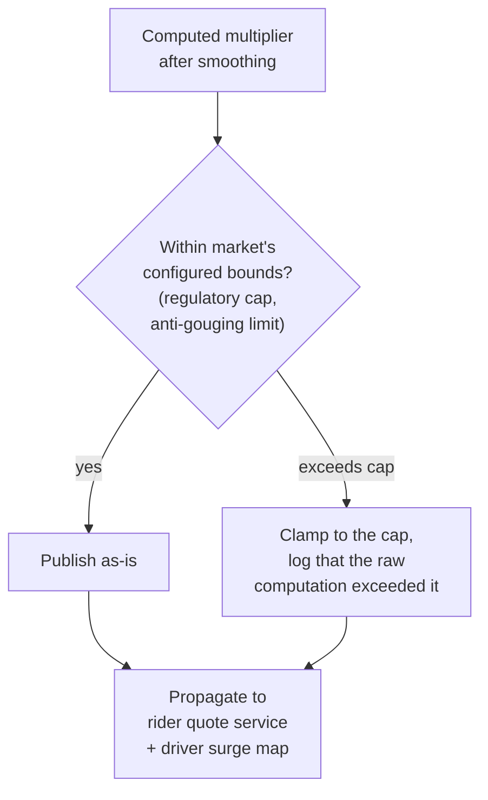

**Why bounds are per-market configuration, not a single global constant:** regulatory caps on
surge multipliers vary by city/country, and some markets have none at all — hardcoding one global
cap either under-caps markets that need a stricter limit or over-restricts markets with no
regulatory requirement at all.

**Logging a clamp event, not just silently capping:** if the raw, smoothed computation would have
exceeded the cap, that's a real signal (demand is far outstripping supply even beyond what pricing
alone can rebalance) worth surfacing to operations — capping silently and discarding that signal
loses visibility into genuinely extreme imbalance events.

**Interview cheat-sheet:** *"Fairness/regulatory bounds are the last step before publishing, are
configured per market, and a clamp event should be logged as a signal in its own right — not just
silently applied and forgotten."*

---

## Data model

**Per-cell multiplier lifecycle** — the state machine behind the smoothing deep dive:

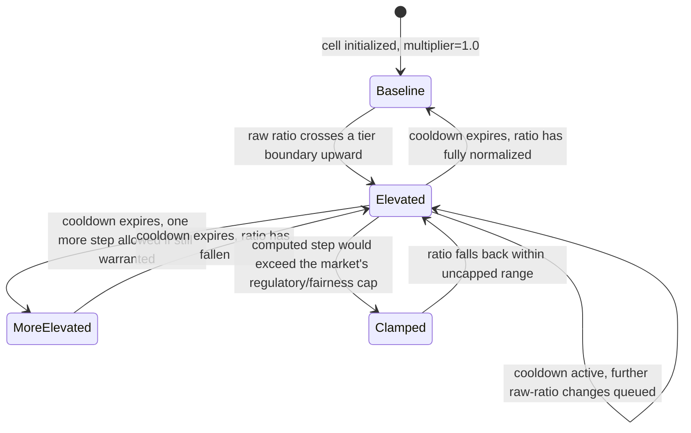

`Clamped` is a distinct state from `Elevated` worth modeling explicitly — it's the state that
should be logged and monitored as its own signal, per the fairness-bounds deep dive.

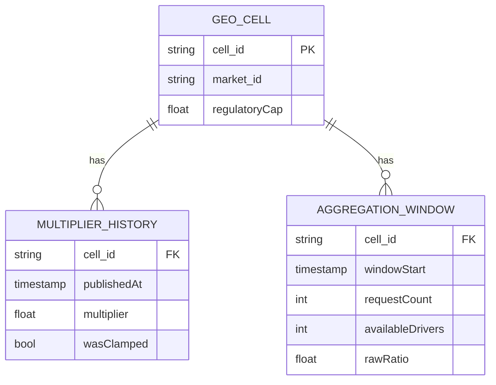

| Table | Storage choice & why |
|---|---|
| `AggregationWindow` | High-write-throughput, time-windowed store — one row per cell per window, continuously overwritten/rolled, similar shape to a stream-processing state store |
| `MultiplierHistory` | Append-only, feeds the pricing audit log requirement and offline analysis of smoothing/oscillation behavior |

---

## Failure modes & mitigations

| Failure mode | Impact | Mitigation |
|---|---|---|
| **Driver location pings stop arriving for a cell** (app issue, connectivity) | Supply signal understates real driver availability, ratio artificially inflates, multiplier rises incorrectly | Treat missing/stale driver data as a distinct signal from "zero drivers" — degrade to a safe default (no surge change) rather than computing a ratio off stale-to-zero supply data |
| **A sudden, real demand spike** (e.g. a major event ending) | Raw ratio spikes sharply; smoothing intentionally limits how fast price can respond | This is an accepted, deliberate trade-off — smoothing prioritizes stability over instant reactivity; if genuinely needed, a larger one-time step (not unlimited) can be configured for known, predictable high-demand events |
| **Smoothing tuned too conservatively** | Multiplier lags real demand/supply shifts by too long, under-correcting during genuine imbalance | Tune cooldown window and tier granularity against historical oscillation and lag metrics, not by guesswork — this is the parameter most worth A/B testing |
| **Pricing engine itself is down** | No fresh multiplier can be computed | Fall back to the last known-good multiplier per cell for a bounded grace period, then decay toward baseline (1.0x) rather than freezing indefinitely on a potentially very stale high multiplier |

---

## Non-functional walkthrough

**Scaling the aggregation layer is embarrassingly parallel by geo-cell** — each cell's rolling
window is independent, making this a natural fit for a partitioned stream-processing system keyed
by cell ID.

**Availability degrades gracefully to "no surge," never to blocking ride requests** — this mirrors
the fail-open instinct from this course's compliance chapters, applied to a revenue mechanism
rather than a safety one: losing dynamic pricing temporarily is a business cost, not a rider-facing
outage.

**Consistency is deliberately loose on the multiplier itself (a few seconds to tens of seconds of
propagation lag between compute and rider-visible quote is acceptable) but strict on the "quoted
price honored for the validity window" contract** — a rider must never be charged a different
multiplier than what they were quoted within that window, even if the underlying cell's multiplier
changes moments later.

---

## Security & compliance

- **Regulatory price caps are a per-market compliance requirement**, not an internal business
  choice in many jurisdictions — the fairness-bounds mechanism doubles as the compliance
  enforcement point and should be treated with the same rigor as this course's other
  regulator-facing systems.
- **Pricing audit trail** — every priced trip's multiplier and the aggregation inputs behind it
  should be reconstructable, both for individual rider disputes and for regulatory inquiries into
  pricing practices during high-demand events (e.g. emergencies), a scenario several jurisdictions
  specifically regulate against.
- **Anti-gouging safeguards during declared emergencies** — some markets require surge to be
  capped or disabled entirely during officially declared emergencies; this should be an
  operational override capable of an immediate, market-wide multiplier freeze/cap, independent of
  the normal smoothing/tiering logic.

---

## Cost & trade-offs

**Smoothing trades reactivity for stability** — a tighter cooldown and finer tiers react faster to
genuine demand shifts but risk more perceptible flapping; a looser cooldown and coarser tiers feel
calmer but lag real imbalance longer. This is the central tuning knob of the whole system and
worth naming explicitly as a trade-off rather than asserting one "correct" smoothing parameter.

**Driver-ping frequency trades infrastructure load for supply-signal freshness** — per the capacity
estimate, halving the ping interval doubles location-update QPS; this is a direct, computable cost
of wanting fresher supply data.

---

## Wrap-up: MVP vs. stretch

**In scope for an MVP:**
- Per-cell, rolling-window demand/supply aggregation on a uniform geo grid.
- Discrete pricing tiers with a cooldown-based, one-step-at-a-time smoothing rule.
- Per-market regulatory/fairness price caps, with clamp events logged.
- Rider-facing quote lock for a short validity window; driver-facing surge map.

**Explicitly out of scope for an MVP:**
- Predictive surge (forecasting demand ahead of an event using historical patterns) — start
  reactive, add predictive elements once reactive smoothing is well-tuned.
- Cross-cell coordination (e.g. explicitly modeling driver movement between adjacent cells) — start
  with independent per-cell computation, treat cross-cell dynamics as an emergent property to
  monitor, not something to explicitly model day one.

**Stretch goals, worth naming if asked "what's next":**
1. **Predictive surge for known high-demand events** (concerts, sports games ending at a known
   time) — pre-emptively adjusting smoothing parameters or seeding an anticipated multiplier ahead
   of the event.
2. **Cross-cell driver-flow modeling**, explicitly accounting for how a multiplier in one cell
   affects supply in neighboring cells, rather than treating each cell as fully independent.
3. **Personalized/segment-aware pricing experiments** within regulatory limits, layering
   additional signals beyond raw demand/supply.

---

## Golden rules

- **Compute demand/supply per small geo-cell over a matching rolling window** — a citywide average
  or an instantaneous snapshot both hide the localized, time-sensitive imbalance surge pricing
  exists to address.
- **Snap to discrete tiers and rate-limit how fast the published multiplier can change** — both
  mechanisms are needed together to prevent flapping; neither alone is sufficient.
- **Surge pricing is an intentional feedback loop, not a side effect** — the same smoothing that
  prevents flapping is also what makes the loop converge instead of oscillate; name both effects.
- **Regulatory/fairness bounds are per-market configuration and the enforcement point for legal
  compliance** — clamp events are a signal worth logging, not just silently applying.
- **Fail open to no-surge (1.0x), never to blocking ride requests**, if the pricing engine itself
  degrades.

---

## Master cheat sheet

**One-liners:**
- This is a real-time control loop, not a lookup: measure, smooth, price, and watch the price
  change what it's measuring.
- Per-cell, rolling-window aggregation over a uniform hex grid keeps ratios comparable across
  cells and meaningful despite sparse per-cell request volume.
- Discrete pricing tiers plus a cooldown-based one-step-at-a-time rule together prevent flapping —
  this is the single most-tested mechanism in the chapter.
- The feedback loop (surge attracts drivers, which lowers surge) is intentional — the same
  smoothing mechanism that prevents noise-driven flapping is what makes this intentional loop
  converge instead of oscillate.
- Regulatory/fairness caps are per-market, are the compliance enforcement point, and a clamp event
  is itself a signal worth logging.
- Fail open to no-surge, never to blocking ride requests, on pricing-engine degradation.

**Formula chain:**
```
raw_ratio(cell, window)   = requests(cell, window) / available_drivers(cell, window)
tier(raw_ratio)           = nearest discrete pricing tier
published_multiplier      = one_step_toward(tier, previous_published_multiplier)  [rate-limited]
final_multiplier          = clamp(published_multiplier, market_regulatory_cap)
```

**Numbers:** rolling windows on the order of a few minutes, not instantaneous · cooldown windows
on the order of tens of seconds to a few minutes between allowed multiplier changes · driver
location pings typically dominate aggregation write load over ride requests by an order of
magnitude at real-world densities.
