# Design an AR Virtual Furniture Placement System — The Story (narrative edition)

## What this file is

The reference file, `54-Design-an-AR-Virtual-Furniture-Placement-System-FAANG-Guide.md`, is the one to recite from. It has the requirements, the API shapes, every trade-off table, and the master cheat sheet.

This file is a second way into the same material. It's the same content, told as one continuous story, in plain language.

Here's the setup: engineers at a fictional furniture retailer, **Birchwood Home**, keep hitting a wall. They patch it. The patch creates the next wall. This repeats until the team lands on the exact same design the reference file documents.

Birchwood is made up. But every wall it hits, and every fix it reaches for, leans on something real and named:

- Apple's **ARKit** and Google's **ARCore** — both real, documented on-device plane-detection/camera-tracking frameworks, shipping since 2017.
- **IKEA Place** — a real, documented consumer AR app that does exactly this kind of placement.
- **Level-of-detail (LOD)** — the technique game engines like Unreal and Unity have used for decades to manage 3D asset cost.
- The same **CDN / adaptive-streaming instincts** behind video delivery.

Wherever a specific number is a reasonable stand-in rather than a documented fact, it's flagged with `[illustrative]`.

## The one sentence to hold onto

An AR furniture app is really three different problems wearing one UI:

1. A **client-only rendering/tracking problem** the backend can't touch.
2. A **3D-asset-delivery problem** — basically adaptive-bitrate video, but for meshes instead of frames.
3. A tiny **state-persistence problem** that only *looks* big because the *room* it describes looks big.

Everything below is just this idea getting harder, one honest step at a time.

---

## Chapter 1 — The couch that takes 17 seconds to show up

### The setup

This is Birchwood Home's first crack at "See It At Home," their AR try-before-you-buy feature. It's built the fastest way anyone could think of:

- The catalog page shows a "View in your room" button.
- Tapping it downloads the item's **full-detail 3D model** — a high-poly mesh plus 4K textures, roughly 25MB for an average sofa `[illustrative, within the 15-40MB range real AR asset pipelines report for this level of detail]`.
- Only *after* that download finishes does the AR camera view even open.

### Why that's slow, step by step

- A typical US LTE connection runs somewhere around 10-15 Mbps down (documented in mobile speed-test aggregates like Ookla's). Call it roughly 1.5MB/sec.
- A 25MB model at that speed takes **~17 seconds** to arrive.
- For those 17 seconds, the user is staring at a spinner — not their living room.

Early analytics on the pilot: **42% of sessions abandon** before the model even finishes loading `[illustrative]`. Nobody bought a couch. They just closed the app.

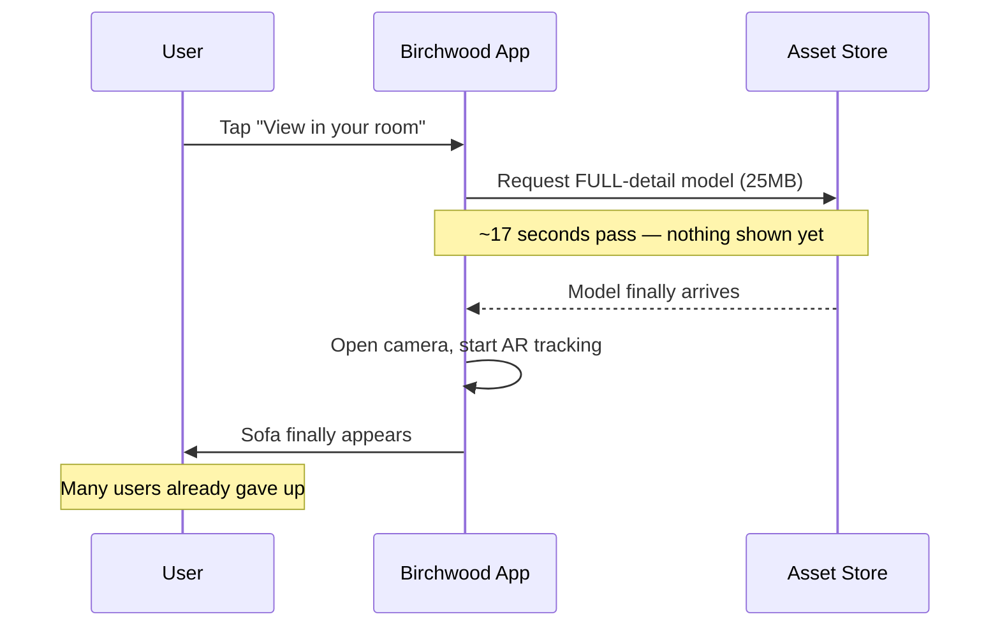

### The obvious question

Why does the user need the full-detail, ready-to-manufacture-looking model just to check whether a couch roughly fits in the corner?

They don't. That level of fidelity only matters once they're actually looking at it in their space, deciding. Browsing and deciding-to-place are two different jobs, with two different quality bars.

### The fix — and the analogy for the rest of this story

Split every item into **two tiers**:

| Tier | Purpose | Size |
|---|---|---|
| **Preview** | For browsing | Tiny (~300KB) |
| **Full-detail** | Fetched only once the user commits to placing that item | Big (~25MB) |

Think of it like a furniture showroom's own paper catalog. You flip through *photos* (the preview) to decide what you like. Only once you've picked one do you request the *actual floor sample* (full detail) to go stand next to. Nobody ships you the real couch just so you can flip past its page.

### New problem, immediately

Browsing is fast and cheap now — previews are ~300KB, essentially instant. But tapping "place" still triggers the same 17-second full-detail download as before. It just happens later in the flow. The blank wait didn't go away — it moved.

### How I'd say this in an interview

> "The naive version fetches full-detail geometry for every interaction, browsing included, and that's 40-80x more data than browsing actually needs. The fix is a two-tier asset model — cheap previews for browsing, full detail only on commit — but that alone doesn't fix the placement moment itself, which is the very next problem."

---

## Chapter 2 — The floor sample you can show *right now*

### The setup

Splitting into tiers fixed browsing. Placement is still broken. The user taps "place," and for ~17 seconds there's an empty camera feed with nothing rendered. That reads as *broken*, not *loading*.

### The obvious question

Does the user really need to see nothing at all for those 17 seconds?

No. They already have something useful sitting in memory: the small preview model they were just browsing with, a second ago, still cached on the phone.

### The fix

Show that cached preview model **immediately** — full-size, anchored at the tapped spot — while the real full-detail mesh streams in behind it.

This extends the showroom analogy: it's the floor sample again. You get to see a stand-in couch, the right size and shape, in your actual room *right now*, while the fabric-and-frame you specifically ordered gets built and delivered in the background. When it's ready, swap it in.

This is the same "show something plausible now, sharpen it progressively" idea behind progressive JPEG loading or a blurred placeholder in a photo feed — just applied to 3D geometry instead of pixels.

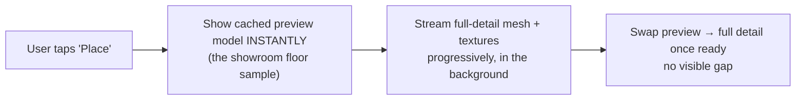

### Worked result, step by step

1. Perceived wait for *something* to appear: drops from 17 seconds to **well under a second**. The preview was already cached from browsing a moment earlier.
2. The full 25MB swap-in still takes roughly the same ~17 seconds on that connection.
3. But it now happens invisibly, in the background, while the user is already looking at a reasonable stand-in and deciding whether the shape and scale work.

### New problem

This assumes the full-detail stream *eventually* finishes. What happens if the connection is bad enough that it never does?

### How I'd say this in an interview

> "The fix isn't making the full download faster — it's never letting the user stare at nothing while it happens. Show the already-cached preview instantly as a placeholder, stream full detail in behind it, swap when ready. It's the same progressive-loading instinct as a blurred photo placeholder, just for meshes."

---

## Chapter 3 — The download that never finishes

### The setup

Birchwood pilots "See It At Home" in a few physical stores too. Customers stand in the showroom, phone in hand, on the store's guest wifi.

- That wifi, on a bad day, gives out roughly **200 Kbps** `[illustrative — a stand-in for "genuinely bad in-store wifi," not a measured figure]`.
- At 200 Kbps, that same 25MB full-detail model takes **over 15 minutes**.
- Nobody's holding their phone up for 15 minutes.

The stream just... never completes, and the app has no plan for that.

### The obvious question

What should happen when full detail simply isn't going to arrive in any reasonable time?

### The fix

Put a cap on the wait. If the full-detail stream hasn't completed within a few seconds:

- Stop waiting.
- Stay on the showroom-floor-sample placeholder.
- Add a **visible tag** so the user knows more detail is still coming — for example, "upgrading quality...".
- Keep streaming quietly in the background, in case it eventually catches up.

The rule: never an indefinite spinner, never a silent stall. Either it loads, or the user is clearly told they're looking at the stand-in and why.

```mermaid
sequenceDiagram
    participant U as User
    participant App as Birchwood App
    participant CDN as Asset Store

    U->>App: Tap "Place" (in-store, bad wifi)
    App->>App: Show preview placeholder instantly
    App->>CDN: Start streaming full-detail asset
    Note over App,CDN: 200 Kbps — stream stalls past a reasonable wait
    App->>App: Give up waiting; keep placeholder;<br/>add "upgrading quality" tag
    App->>U: Sofa shown at reduced detail, clearly labeled, never blank
    Note over App,CDN: Full stream keeps going quietly;<br/>swaps in if it ever finishes
```

### New problem

The per-item loading experience is solid now. But zoom out from "one user, one item" to the whole business: Birchwood's catalog is growing toward **20,000 SKUs**, and hundreds of thousands of sessions a day are hitting it. Is fetching *any* of this, at that scale, actually affordable and fast for everyone, everywhere?

### How I'd say this in an interview

> "A stalled stream is a UX decision, not a networking one — cap the wait, fall back to the placeholder you already have, tag it visibly, and keep trying in the background. The user should never be left guessing whether the app is broken or just slow."

---

## Chapter 4 — The regional warehouse trick

### The setup

Birchwood's catalog has grown to **20,000 SKUs**. "See It At Home" now sees **500,000 sessions a day**.

The worked estimate below uses the same shape the reference guide walks through:

- Each session previews roughly **15 items** while browsing, at ~350KB average preview size each.
- Each session places roughly **3 items** in AR, at ~25MB average full-detail size each.

### Doing the math, step by step

**Preview bandwidth:**

```
500,000 sessions  x  15 items/session  x  ~350KB/item  ~=  2.6 TB/day
```

**Full-detail bandwidth:**

```
500,000 sessions  x  3 items/session  x  ~25MB/item  ~=  37.5 TB/day
```

### What that math is telling you

The full-detail tier moves **~14x more data** than the preview tier — despite covering **5x fewer items per session** (3 vs. 15). That's because a full-detail asset is 40-80x bigger than a preview one.

That size gap is the whole reason the two-tier split from Chapter 1 exists at all. This bandwidth bill is just what it costs if you skip it.

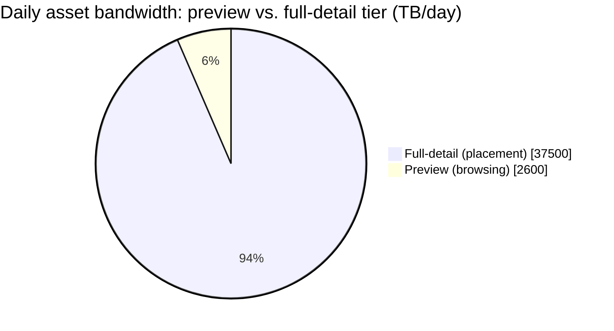

### The obvious question

Does Birchwood need to run beefy servers, everywhere in the world, to serve 40 TB/day of the same 20,000 SKUs' worth of files?

No. Here's the giveaway: **every single user is requesting the same shared catalog.** This isn't a personalized feed where every response is unique. It's the same file — say, "sofa_4471, full-detail, v3" — being requested over and over by different people. That's the single most cacheable shape a workload can have.

### The fix

A CDN, populated from one **origin store** that holds the master, versioned copy of every SKU at every LOD tier.

Think of it as a **regional warehouse network**:

- One central factory (the origin store) makes each item once.
- Regional warehouses (CDN edge nodes) keep the popular ones stocked close to shoppers.
- Almost every request is served locally and fast, without a slow trip back to the factory.
- The factory only gets bothered on a genuine stock-out — a cache miss.

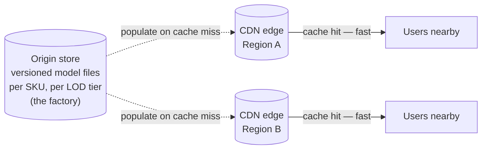

### New problem

The asset pipeline is now fast, affordable, and scaled. But it only covers *getting a model to the phone*. It says nothing about what happens after: a user spends 20 minutes placing 5 items, gets called away for dinner, and closes the app. They come back the next day. Where did that arrangement go?

### How I'd say this in an interview

> "At this scale it's a standard CDN problem, not a novel one — the catalog is shared, heavily cacheable content, so you scale by adding edge capacity, exactly like any video or image CDN. The interesting number is that full-detail assets dominate total bandwidth despite being fetched far less often, purely because of the size gap — that's the number that justifies the whole two-tier design."

---

## Chapter 5 — Saving a photo of the room vs. saving the moving company's sheet

### The setup

A user places a sofa, two side tables, and a rug. They close the app and come back tomorrow, expecting it all still there.

The team's first instinct: *"just save what the room looked like."* Capture a screenshot, or export the whole rendered 3D scene as a file, and replay that on reopen.

### Why that instinct is wrong, worked out

- **Size:** a rendered export or point-cloud snapshot of a 5-item scene could easily run several megabytes `[illustrative]` — dwarfing anything else in this design.
- **Staleness:** it goes stale the instant Birchwood fixes a texture bug on one of those SKUs. The saved snapshot never picks that up, because it's a frozen picture, not a live reference.
- **Not editable:** nudging one side table ten centimeters means re-capturing the entire room, not adjusting one number.

### The obvious question

What's the smallest thing that fully describes "which item, where," without describing what it looks like?

### The fix

Don't save a photo of the room. Save the **moving company's placement sheet** instead — a list of *which piece goes where*:

- Item ID
- Position
- Rotation
- Scale

Nothing about geometry, nothing about textures. Those live once, in the catalog, and get re-fetched (often still cached) whenever the sheet is replayed.

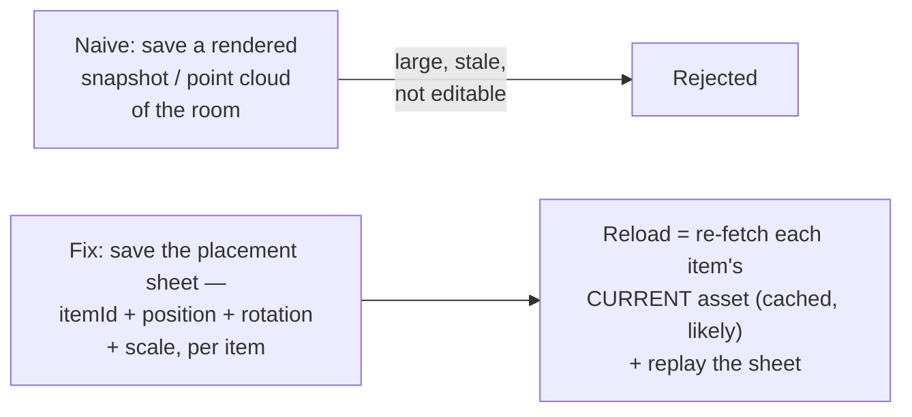

### Worked number, step by step

- A scene with 8 placed items.
- Roughly 80 bytes per item (id + position + rotation + scale).
- Total: **8 × 80 bytes ≈ 640 bytes.**

That's smaller than this paragraph — regardless of how visually rich the room looks — because the actual 3D data lives once, in the shared catalog, not once per saved room.

### New problem

This placement sheet references items by SKU ID. Furniture retailers discontinue and redesign SKUs constantly. What happens when a sheet points at a couch Birchwood stopped selling eight months ago?

### How I'd say this in an interview

> "A scene should be metadata — a small graph of item references and transforms — never rendered output. That's what makes save and reload cheap, fast, editable, and automatically up to date with whatever the catalog asset currently looks like, instead of frozen at save time."

---

## Chapter 6 — The placement sheet that outlives the couch

### The setup

Six months after a customer saves a room with `sku_4471` (a particular sofa) placed in it, Birchwood discontinues that exact model as part of a seasonal refresh — a completely normal, real retail lifecycle event.

The customer reopens their saved room:

- Their placement sheet still says `sku_4471`, position (1.2, 0, 0.8).
- But that SKU's asset is gone from the live catalog.

### The obvious question

Does the app crash? Show a hole in the room? Or something else?

### The fix — two things, layered onto Chapter 5's reference-based model

**1. Assets are versioned per SKU, per LOD tier.**

So "discontinued" doesn't have to mean "deleted" — the last-known version can still be served to old scenes, even after it's pulled from active browsing.

**2. Give a scene (and its items) an explicit lifecycle**, so "this reference is stale" is a defined state, not an unhandled crash:

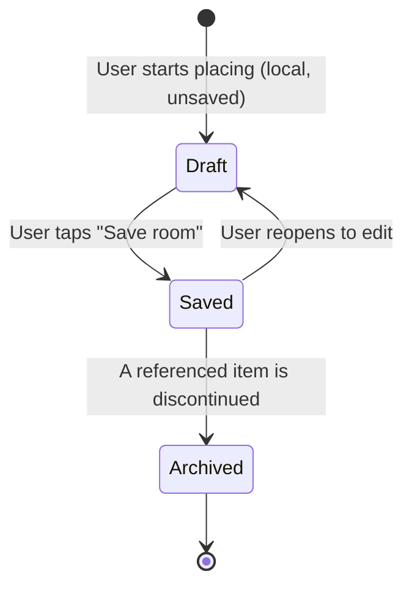

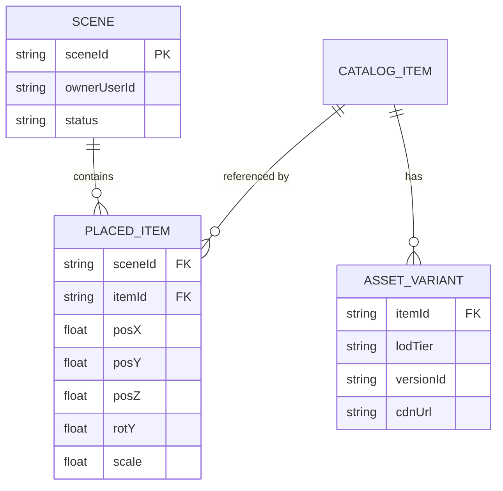

### The result

With this in place, reopening the sheet for `sku_4471` shows the last-known cached version, with a small "discontinued" tag — instead of a hole in the floor or a crash. That's a deliberate product decision, not an accident.

### New problem

Nothing from lifecycle handling itself. But a completely different request lands on the team: a couple furnishing an apartment together wants to see each other's changes to the *same* room, live, at the same time.

### How I'd say this in an interview

> "Reference-based persistence buys you editability and freshness, but it comes with a real decision to make explicitly: define what happens when a reference goes stale. `Archived` with a defined fallback — never an unhandled missing reference — is the concrete answer."

---

## Chapter 7 — Sticky notes on a shared placement sheet

### The setup

Two people, same account-linked session, both looking at the same room. One moves the sofa. The other should see it move too, quickly.

Birchwood's first pass reuses the *existing* save pipeline:

- Every nudge triggers a full `POST` of the whole scene.
- The other device does a full `GET` to reload it.

Worked number from the first internal build: a single couch-nudge took **~800ms** to show up on the other phone `[illustrative]`. Not terrible, but visibly laggy for something that should feel instant — and wasteful: re-sending and re-parsing the *entire* 8-item sheet just to move one item 10cm.

### The obvious question

Does moving one couch really need to go through the whole "save the entire room" pipeline every time?

### The fix

A lightweight realtime layer that broadcasts just the **one small transform delta** that changed:

- Not the whole scene.
- And critically, **not any asset data** — because both phones already have that item's asset cached from browsing a moment ago.

Sticking with the placement-sheet analogy: you don't reprint and redistribute the whole sheet every time someone moves a sticky note on it. You just say "sofa moved to here" out loud, and everyone updates their own copy of the sheet.

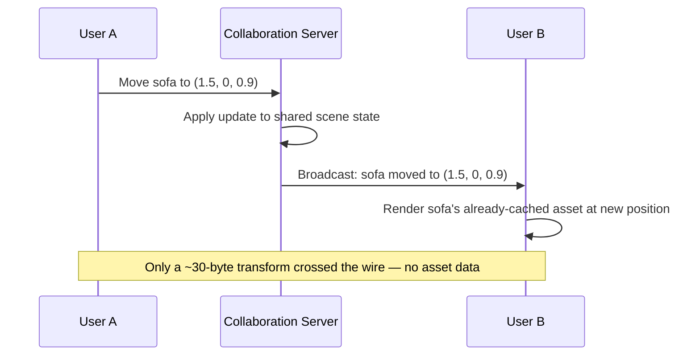

### Why this is a much easier sync problem than text editing

- A transform update (position/rotation/scale) is naturally last-writer-wins *at the object level*.
- Two people grabbing the *exact same* couch at the *exact same* instant is rare and low-stakes.
- Whichever update lands last wins, and it visually settles in well under a second.

That's a much lighter bar than true text-collaboration CRDTs, which have to reconcile interleaved edits to the *same characters*.

### New problem

Nothing introduced by collaboration itself. But it raises an obvious question from the rest of the team: given how much machinery this design already has, why not just render everything on a beefy cloud GPU and stream the video down — so the phone never needs any LOD tiers or streaming at all?

### How I'd say this in an interview

> "Broadcast the delta, not the scene, and definitely not the asset — every client already has the asset cached. Last-writer-wins per object is fine here specifically because same-object collisions are rare and low-stakes, unlike text editing where two people can genuinely be typing into the same sentence."

---

## Chapter 8 — The friend on the phone who can't catch your fall

### The setup

Someone on the team proposes it seriously: render the sofa on a powerful cloud GPU, always full detail, and stream the AR view down as video — the same idea behind cloud game streaming.

The pitch: no LOD tiers, no progressive loading, no placeholder swap. The cloud always has full detail ready.

### They prototype it

Real number: round-tripping a camera frame to the cloud, rendering, encoding, and streaming a frame back adds roughly **150-250ms** on top of render time on a decent connection `[illustrative — network RTT + encode/decode overhead, not a measured Birchwood figure]`. Compare that to a few milliseconds for rendering directly on the phone's own GPU.

### Why that number kills the idea outright — not just makes it "a bit slower"

AR isn't a normal video stream, where a little lag is tolerable. Here's why:

- The rendered sofa has to track the **camera's live movement**, frame by frame, to look glued to the floor as the user walks around it.
- Any gap between "phone moves" and "rendered image catches up" shows up immediately as the sofa swimming or lagging behind.
- The whole illusion of "it's really there" collapses.

### The analogy

Imagine trying to balance on one foot. But instead of your own inner ear telling you *instantly* that you're tipping, you have to describe your position to a friend on a phone call and wait for them to say "lean left." By the time you hear it, you've already fallen.

Camera tracking and rendering have to happen as fast and as locally as your own sense of balance. You can't outsource that over a network round trip, no matter how good the connection is.

```mermaid
quadrantChart
    title Where should rendering happen?
    x-axis Low latency --> High latency
    y-axis Breaks live tracking --> Works for live tracking
    quadrant-1 Fine for non-AR preview
    quadrant-2 The right call for AR
    quadrant-3 Wrong for anything
    quadrant-4 Breaks AR's tracking loop
    On-device (client): [0.15, 0.8]
    Cloud-rendered video: [0.75, 0.2]
```

### The actual conclusion

Client-side rendering isn't really a *choice* for AR specifically — the camera-to-render latency budget doesn't tolerate a network hop.

Cloud rendering is still a perfectly legitimate answer for a **different, non-AR** feature Birchwood also has: a 360° "spin the couch" product viewer, with no live camera involved. There's no tracking loop there to protect.

Say that distinction out loud in an interview. It shows you're not rejecting cloud rendering wholesale — just correctly scoping where its latency cost is, and isn't, acceptable.

### New problem

Given the phone *must* render and track locally, the backend has genuinely zero lever over one very visible failure mode: what happens when the phone's own tracking gets confused?

### How I'd say this in an interview

> "AR rendering is client-side by near-necessity, not by preference — the render has to track the camera in real time, and a network round trip breaks that illusion immediately, the same way a delayed balance signal would make you fall. Server-side rendering is a fine answer for a non-AR 3D preview with no camera tracking loop, but not for anything anchored to a live feed."

---

## Chapter 9 — When the phone loses its footing

### The setup

A user tries "See It At Home" in a dimly lit bedroom, moving the phone quickly to check the sofa from different angles.

- ARKit and ARCore — real, documented on-device frameworks — do plane detection and camera tracking using the phone's camera plus its inertial sensors.
- Both frameworks document that poor lighting, low-texture or reflective surfaces, and fast motion all degrade that tracking.

In this session, tracking briefly loses its lock. The placed sofa visibly **drifts a few centimeters and clips through the floor** for a couple of seconds `[illustrative — a concrete stand-in for a real, well-known class of AR-tracking failure]`, before re-anchoring.

### The obvious question

This is the one interviewers like to ask specifically to see if a candidate overreaches: *what does the backend do about this?*

### The honest answer

Basically nothing — and that's correct, not a gap.

- Plane detection and camera tracking are entirely a client/platform-framework concern.
- There is no backend service, queue, or database that improves it.
- Saying this plainly, without trying to sketch a fix for it, is itself the right move in an interview. It's the same "AR tracking is the phone's problem" boundary drawn all the way back at the start of this story.

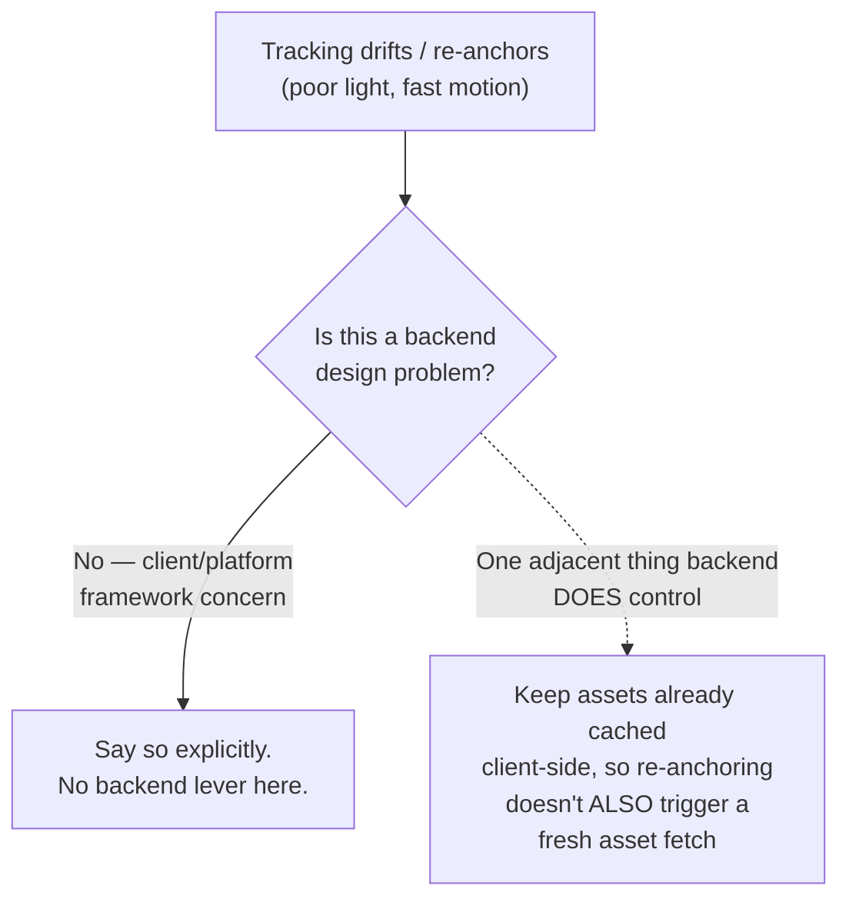

### The one adjacent thing the backend design does still control

Make sure re-anchoring doesn't compound into a second problem, by keeping the item's asset already cached client-side (per the CDN work in Chapter 4). Recovering from a tracking hiccup should be instant — not also a fresh multi-second download.

### Worth naming alongside this — the privacy angle

- The raw camera frames used for tracking are processed entirely on-device.
- They are never uploaded or stored server-side.
- The backend only ever sees the *result* — position/rotation transforms — never a video of someone's living room.

That's a meaningfully smaller and safer privacy surface than it might sound like at first. It's worth stating explicitly, rather than leaving it implied.

### New problem

Tracking and rendering are settled. One more everyday scenario remains — not about multiple *people* this time, but the same person using multiple *devices*.

### How I'd say this in an interview

> "This one has no backend fix, and saying that clearly is the correct answer, not a dodge — plane detection and tracking are a client-framework capability I'm treating as a given. The one thing I'd still design for is making sure re-anchoring doesn't also trigger a fresh asset download, by keeping things cached."

---

## Chapter 10 — The tablet that overwrites the phone

### The setup

A customer starts a room layout on their phone at the store, then continues at home on a tablet — same account. Both devices had the scene open before either one saved.

Sequence of events:

1. Phone edits the sofa's position and saves, at t = 0s.
2. The tablet is still holding the *old* state from before that edit.
3. The tablet gets touched 45 seconds later, and saves too — silently overwriting the phone's more recent change.
4. The sofa snaps back to where it was. The customer has no idea why.

### The obvious question

Does this need the same real-time collaboration machinery from Chapter 7 — broadcasting live transform deltas between the phone and tablet?

### No — and it's worth explaining why not

This is a genuinely different shape of problem:

- Chapter 7's collaboration server exists because *two different people* are actively editing *together*, live, and need to see each other's changes propagate.
- This is *one person's own two devices*, not editing at the same instant — just occasionally out of sync.
- It's a much lower-collision case that doesn't justify standing up a live sync layer.

### The fix

Simple **optimistic concurrency**:

- Each saved scene carries a version number (or `updatedAt`).
- A save only succeeds if the device's local version matches what the server currently has.
- If the tablet tries to save against a version the phone has already moved past, the save is rejected (or flagged) instead of silently overwriting.

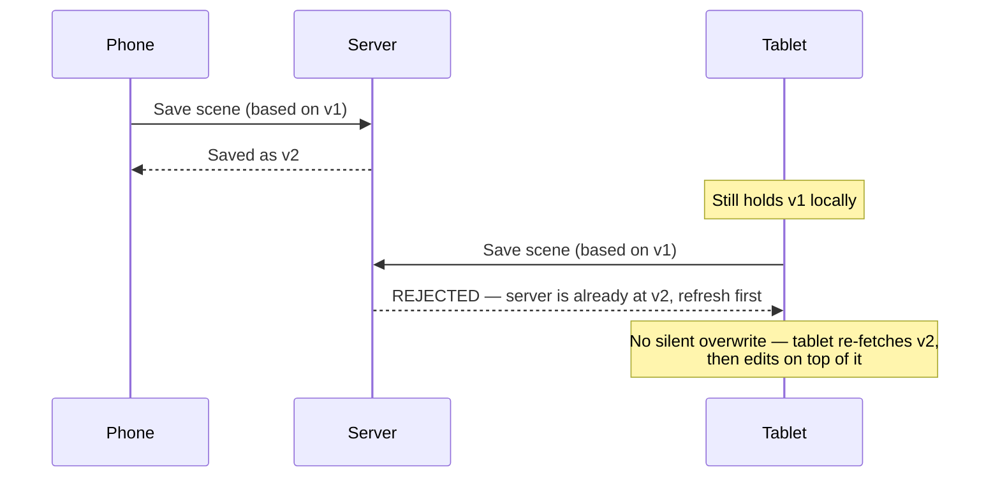

This closes the loop for single-owner scenes, without borrowing any of the heavier real-time infrastructure that genuinely-collaborative editing needs.

### How I'd say this in an interview

> "This looks like the same problem as multi-user collaboration but it isn't — one owner across two devices is low-collision, so a cheap version check on save is enough. Reaching for full real-time sync machinery here would be solving a problem that doesn't actually exist yet."

---

## Where the story actually lands


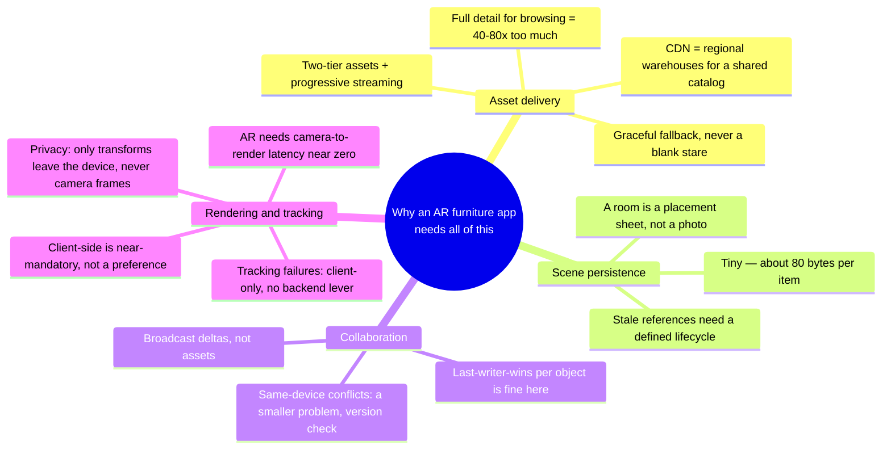

### The skill this story is really teaching

The skill isn't reciting all ten chapters — it's knowing where the stated requirements say to stop.

- A single-user MVP reasonably stops around Chapter 6.
- The moment "share with someone else" comes up, you're in Chapter 7.
- If nobody's asked about multi-device conflicts, walking there unprompted reads as padding, not depth.

---

## Grill me — adversarial follow-ups

**Q1: "Why not just always show the full-detail model — why bother with a preview tier at all?"**

Because the size gap is the whole problem: a full-detail asset is 40-80x bigger than a preview, and most of a session is spent browsing, not placing. Fetching full detail for every browsed item means paying that 40-80x cost for items the user never actually places. The two-tier split exists purely because browsing and deciding-to-place have different fidelity needs.

**Q2: "Isn't the mid-LOD placeholder just a nicer-looking loading spinner? What's actually different?"**

A generic spinner tells the user "wait, unknown duration, unknown outcome." A placeholder at the item's real size and position, in the right spot, tells them "this is roughly what you're getting, and it's about to get sharper" — same UX principle as a blurred image placeholder. It lets the user start evaluating fit and scale immediately, instead of waiting for full resolution to make any judgment at all.

**Q3: "Why is a scene stored as a graph of references instead of just caching the last-rendered frame?"**

Because a cached frame is frozen. It doesn't stay in sync if the catalog updates that item's texture. It can't be nudged without re-rendering everything. And it's enormously larger than a list of positions. References plus transforms are small, editable, and automatically current with whatever the catalog's latest asset version looks like.

**Q4: "Given the collaboration chapter, why not just always use the same real-time layer for the multi-device-same-user case too?"**

Because it's solving a different problem at a different collision rate. Two people editing together live is genuinely simultaneous and needs propagation. One person's phone and tablet being out of sync by 45 seconds is a rare, low-stakes conflict that a cheap version check resolves — without standing up any live infrastructure.

**Q5: "You said AR rendering has to be client-side — isn't that true of any real-time app, so why call it out specially here?"**

Most real-time apps tolerate some latency — a chat message landing 200ms late is barely noticeable. AR specifically renders on top of a live camera feed that the user's own eyes are also watching in real time. Any lag between camera motion and render update is instantly visible as the object swimming or lagging. There's no comparable tolerance window to hide behind.

**Q6: "What actually breaks if you skip the CDN and just serve assets from one origin server?"**

At 500,000 sessions a day pulling from a shared 20,000-SKU catalog, that's tens of terabytes a day hitting one machine's network and disk. It becomes the throughput ceiling — and, being one machine, a single point of failure too. A CDN is the standard fix precisely because this catalog is the exact shape of workload CDNs are built for: the same content, requested repeatedly, by everyone.

**Q7: "If tracking failures are entirely a client concern, why mention them in a backend system design interview at all?"**

Because correctly scoping something as out-of-scope is itself a signal. Interviewers sometimes probe this exact spot to see if a candidate tries to redesign SLAM or plane detection, instead of stating the boundary and moving on. The one legitimate backend-adjacent point is making sure re-anchoring doesn't also trigger a fresh asset fetch, since that part actually is under your control.

**Q8: "What's the actual cost trade-off of maintaining multiple LOD tiers per SKU?"**

You're trading art-production and pipeline complexity — someone has to generate and maintain a low-poly preview and a high-poly full-detail version of every SKU — for a bandwidth saving on the order of 40-80x on the tier that dominates daily traffic. At any catalog size beyond a handful of items, that trade is easy to justify.

**Q9: "How would you handle a user placing 30 items in one room instead of 5 — does anything in this design change?"**

Almost nothing changes on the backend. A 30-item scene is still on the order of a couple kilobytes of transforms — trivial to store and transmit. The only place it shows up is the client needing to manage more concurrently cached assets and more simultaneous AR-anchored objects. That's a rendering-performance concern for the client platform, not a scene-storage concern for the backend.

**Q10: "If you had to cut this whole design down to the one thing that matters most, what is it?"**

Decompose first, out loud, before designing anything: AR tracking and rendering are a client-platform capability, not something you're redesigning. Asset delivery and scene persistence are the actual backend problems, and that's where the interview time should go. Getting that split right in the first minute is worth more than any individual deep dive that follows it.

---

## Cheat sheet — one line per stop on the story

| Stop | The one-line takeaway |
|---|---|
| **Full-detail-for-everything** | 40-80x more data than browsing needs — the reason a two-tier asset model exists at all. |
| **Two-tier assets** | Small preview for browsing, big full-detail only fetched on commit — like a catalog photo vs. the actual floor sample. |
| **Cached preview as instant placeholder** | Show what you already have the instant the user commits, stream full detail in behind it, swap when ready — never a blank stare. |
| **Timeout + visible fallback** | If full detail stalls past a reasonable wait, keep the placeholder, tag it clearly, keep streaming quietly in the background. |
| **CDN, regional-warehouse model** | The catalog is shared, identical content for every user — extremely cacheable. Scale by adding edge capacity, not origin capacity. |
| **Scene = placement sheet, not a snapshot** | Item references + position/rotation/scale, ~80 bytes per item — small, editable, and automatically current with the live catalog. |
| **Versioned assets + Archived lifecycle** | A discontinued SKU still referenced by an old scene needs a defined fallback, never an unhandled missing reference. |
| **Broadcast deltas, last-writer-wins** | Real-time collaboration here only needs to move small transforms, not assets — same-object collisions are rare and low-stakes, unlike text-editing CRDTs. |
| **Client-side rendering, near-mandatory for AR** | The camera-to-render latency loop has ~zero tolerance for a network round trip; cloud rendering is fine for non-AR previews with no tracking loop to protect. |
| **Tracking failures are a client-only concern** | No backend lever beyond keeping assets already cached, so re-anchoring doesn't also trigger a fresh download; camera frames never leave the device. |
| **Optimistic concurrency for same-user multi-device** | A cheap version check on save is enough — don't reach for live-collaboration machinery for a low-collision, single-owner case. |
| **The meta-lesson** | Every fix here buys one property — browsing speed, placement responsiveness, bandwidth affordability, persistence cheapness, reference safety, collaboration liveliness, tracking fidelity, or conflict safety — by spending effort somewhere specific. Say the trade in the same breath as the fix. |
