# Design an AR Virtual Furniture Placement System (3D Room Planner) — FAANG Interview Guide

> Source chapter type: hybrid client-heavy product system. This is the exact genre of question
> that trips up candidates who've only practiced backend-heavy classics (Twitter, TinyURL, Uber):
> the hard problems here are split across **client-side rendering**, **3D asset delivery**, and
> **scene-state persistence**, with backend distributed-systems fundamentals playing a smaller,
> supporting role. The fix for "unfamiliar domain + standard fundamentals" panic is the same
> decomposition every time: **UI, storage, compute, realtime, scale** — applied below.

## Mental model

A user points their phone camera at their living room and places virtual furniture (a sofa, a
table) that appears anchored to the real floor, at real-world scale, from any angle they move the
phone. Three genuinely different problems are bundled into one product feature:

1. **An AR rendering problem, almost entirely client-side.** Detecting the floor plane, tracking
   the phone's position as the user moves, and rendering a 3D model anchored convincingly in
   camera-space happens on-device, in real time, using the phone's own AR framework (ARKit/
   ARCore) — the backend has almost no role in this part at all, and knowing that boundary is the
   single most important thing to say early in the interview.
2. **A 3D asset delivery problem.** Furniture models are large (textures, meshes) — thousands of
   SKUs, each needing to load fast enough that a user doesn't stare at a blank space after tapping
   "place." This is a CDN + level-of-detail (LOD) streaming problem, structurally similar to video
   adaptive bitrate but for 3D geometry instead of frames.
3. **A scene-persistence problem.** Once a user places 5 items in their room, that arrangement — a
   "scene" — needs to be saved, reloaded later, and (if the product supports it) shared or
   co-edited with someone else, which is a state-persistence and optional-realtime-collaboration
   problem layered on top of the rendering and asset problems.

**The one sentence to say out loud:** *"Decompose this into what runs on the phone and what runs
on the backend — AR tracking and rendering is a client problem I'd treat as mostly out of my
control as a backend-focused designer; asset delivery and scene persistence are exactly the kind
of storage/CDN/state problems I do design for, and I'd spend my interview time there."*

**The one picture to remember forever (this is literally the doc's own hint, formalized):**

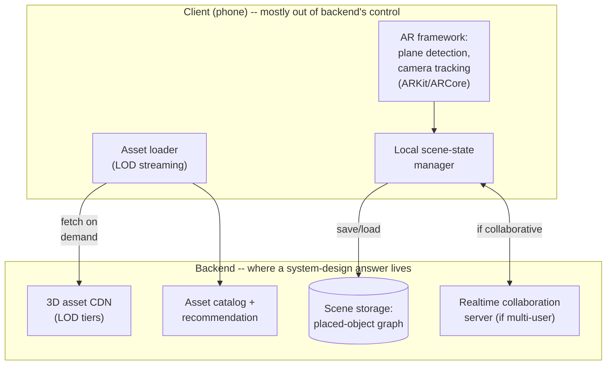

**Memory hook:** *"AR tracking is the phone's problem. Getting the right 3D model to the phone
fast, and remembering what the user placed, is my problem — say the boundary out loud before
diving into either half."*

---

## Table of contents
[How to Identify This Topic](#how-to-identify-this-topic-in-an-interview) ·
[Interview Playbook](#interview-playbook) · [Requirements](#requirements-clarification) ·
[Capacity Estimation](#capacity-estimation-worked) · [API Design](#api-design) ·
[High-Level Architecture](#high-level-architecture) ·
[Architecture Evolution v1→v2→v3](#architecture-evolution-v1--v2--v3) ·
[End-to-End Walkthroughs](#end-to-end-request-walkthroughs) ·
[Deep Dive: LOD Asset Streaming](#deep-dive-level-of-detail-lod-asset-streaming) ·
[Deep Dive: Scene-Graph Persistence](#deep-dive-scene-graph-persistence) ·
[Deep Dive: Collaborative Scene Editing](#deep-dive-collaborative-scene-editing) ·
[Deep Dive: Client vs. Server Rendering Trade-off](#deep-dive-client-side-vs-server-side-rendering) ·
[Data Model](#data-model) · [Failure Modes](#failure-modes--mitigations) ·
[Non-Functional Walkthrough](#non-functional-walkthrough) ·
[Security & Compliance](#security--compliance) · [Cost & Trade-offs](#cost--trade-offs) ·
[Wrap-Up](#wrap-up-mvp-vs-stretch) · [Golden Rules](#golden-rules) ·
[Cheat Sheet](#master-cheat-sheet)

---

## How to identify this topic in an interview

- "Design a virtual try-on / AR placement feature" (furniture, makeup, glasses — the pattern is
  identical: client-side AR + asset delivery + scene/state persistence).
- Any "place a virtual object in the real world via camera" prompt — this is a **hybrid
  client/backend** system, and the single biggest interview risk is trying to design the AR
  tracking algorithm itself (out of scope for a backend system design round) instead of correctly
  identifying it as a client-side boundary and moving to the backend problems that actually are
  yours to design.
- A follow-up like "what if two people in the same room want to see the same placed furniture" is
  the [collaborative-editing deep dive](#deep-dive-collaborative-scene-editing).

---

## Interview playbook

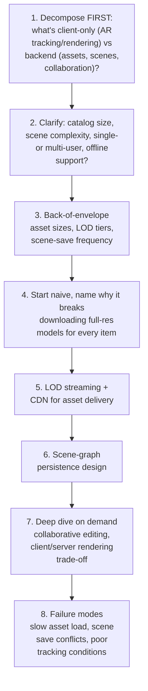

**What the interviewer is actually grading at each step:**
- Step 1: do you correctly scope AR tracking as a client/platform-framework concern and avoid
  burning interview time trying to design SLAM or plane-detection algorithms? This single
  decision is the difference between a confident, well-paced answer and the "amplifying the
  limitations" failure pattern the original feedback called out.
- Step 5: do you know *why* streaming a full-resolution 3D model for every catalog browse is
  wrong — same "don't fetch more than you need up front" instinct as adaptive bitrate video?
- Step 6: do you treat a "room layout" as a **graph of objects with transforms** (position,
  rotation, scale) rather than something vague like "a 3D file" — this is the concrete data model
  that makes persistence and collaboration tractable.

---

## Requirements clarification

### Functional

| # | Requirement | Notes |
|---|---|---|
| F1 | Browse a catalog of furniture items and preview them in AR in the user's real space | The core try-before-you-buy feature |
| F2 | Place, move, rotate, and resize items within a session | Local, real-time client interaction |
| F3 | Save a room layout ("scene") and reload it later | Persistence across sessions |
| F4 | (If in scope) share a scene or collaboratively edit it with another user | Adds a real-time sync dimension |
| F5 | Recommend items that plausibly fit the detected space (size, style) | A catalog/recommendation problem layered on top |

### Non-functional

| Requirement | Target | Why this number |
|---|---|---|
| Time-to-first-render for a placed item | Well under a second for a reasonably-sized preview asset; can be higher for the full-detail model, loaded progressively | Staring at empty space after tapping "place" reads as broken, not loading |
| AR tracking stability | Owned by the client platform framework, not this design | Explicitly out of scope for the backend design — say this, don't attempt to solve it |
| Scene save/load latency | Low, a few hundred milliseconds — this is a small state object (a scene graph), not a 3D file | Sets expectations correctly: saving a scene is cheap because a scene is metadata (positions/rotations/references), not rendered geometry |
| Asset catalog size | Thousands to tens of thousands of SKUs, each needing multiple LOD tiers | Drives the CDN/LOD deep dive |
| Collaborative edit latency (if in scope) | Sub-second propagation of another user's placement changes | Same fan-out shape as the real-time collaboration chapters elsewhere in this course, applied to object transforms instead of text |

**Clarifying questions worth asking the interviewer up front — and what each answer changes:**

| Question | If the answer is... | ...then this changes |
|---|---|---|
| "Is AR tracking itself in scope, or can I treat it as a client-framework capability?" | Out of scope, treat as a client capability | Frees the entire interview to focus on asset delivery and scene persistence — ask this early, it's the single highest-leverage clarifying question in this chapter |
| "Single-user only, or collaborative?" | Both should be supported | Confirms the scene model needs a real-time sync layer, not just save/load — see the [collaborative-editing deep dive](#deep-dive-collaborative-scene-editing) |
| "How large is the catalog, and how detailed are the models?" | Thousands of SKUs, professionally modeled (higher poly/texture detail) | Confirms LOD streaming is necessary, not optional — a catalog this size can't reasonably ship full-detail models to every browsing session |
| "Does the room layout need to work offline (no connectivity in-store)?" | Yes, for an in-store use case | Confirms local-first scene storage with background sync, not a server-round-trip-per-edit design |

**Say this out loud in the interview:** *"I'm going to explicitly scope AR tracking and rendering
as a client-platform capability I'm not redesigning — my system design is the asset pipeline that
gets the right 3D model to that client fast, and the scene-persistence layer that remembers what
they built. That's where the real backend problem is."*

---

## Capacity estimation, worked

```
Given (illustrative, a furniture retailer's AR app):
  Catalog size                                    = 20,000 SKUs
  Full-detail model size (high-poly mesh + 4K textures) = ~15-40 MB per item
  Preview/low-LOD model size (for catalog browsing)      = ~200-500 KB per item
  -> a 40-80x size difference between preview and full detail -- this ratio is WHY LOD
     streaming exists; shipping full-detail models for a catalog browse would be
     40-80x more bandwidth than necessary for a use case that doesn't need it yet.

App sessions per day                             = 500,000
Items previewed per session (browsing)            = ~15
Items actually placed in AR per session            = ~3

Preview-tier bandwidth (catalog browsing):
  500,000 sessions x 15 items x ~350 KB avg  ~= 2.6 TB/day
  -> served almost entirely from CDN edge cache, since the same ~20,000 preview assets are
     requested repeatedly across all users -- extremely cacheable, unlike a per-user feed.

Full-detail-tier bandwidth (AR placement):
  500,000 sessions x 3 items x ~25 MB avg    ~= 37.5 TB/day
  -> ~14x the preview tier's bandwidth despite 5x fewer items per session, because full-detail
     assets are 40-80x larger -- this is the number that justifies progressive loading (preview
     first, stream full detail only for items actually placed) rather than fetching full detail
     for every browsed item "just in case."

Scene storage:
  Average scene = ~8 placed items x (itemId + position + rotation + scale) ~= 8 x ~80 bytes
    ~= 640 bytes per scene
  -> a scene is metadata, not geometry -- trivially small regardless of how visually complex
     the room looks, because the actual 3D data is the CATALOG's asset (shared, cached, fetched
     once), not duplicated per scene.
```

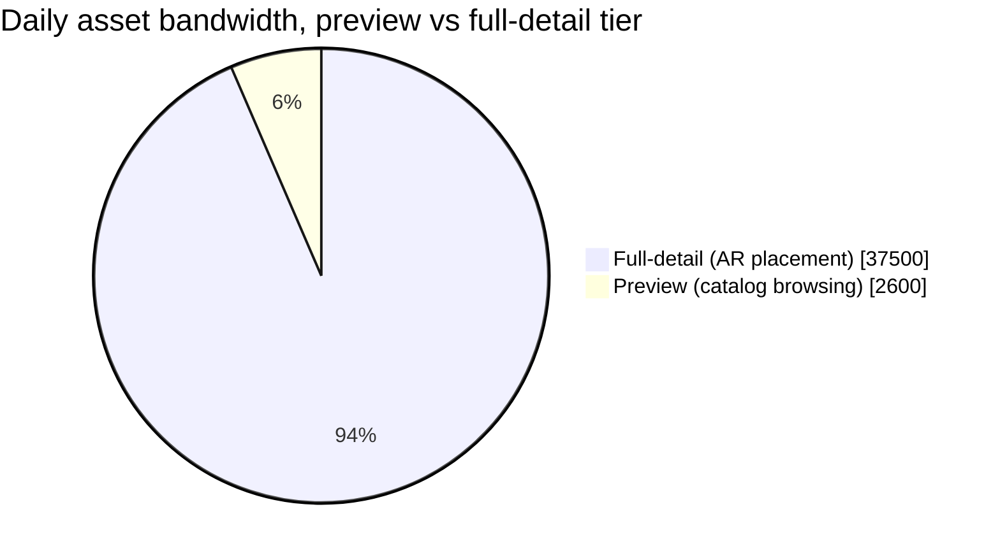

Full-detail assets dominate total bandwidth despite being fetched for far fewer items per
session — the direct consequence of the 40-80x per-asset size gap between tiers, and the reason
progressive loading only for placed items (not every browsed one) matters.

**Redo-the-chain test:** if the retailer adds AR-placement analytics (which items get placed vs.
just previewed, dwell time per item), that's additional event-telemetry volume roughly
proportional to session count — a separate, much smaller pipeline from the asset-bandwidth
numbers above, worth distinguishing if the interviewer asks about instrumentation.

**The number worth memorizing:** full-detail 3D assets can be 40-80x larger than a preview-tier
asset — LOD streaming isn't a nice-to-have optimization here, it's the difference between a
usable and unusable catalog-browsing experience at realistic asset sizes.

---

## API design

### `GET /v1/catalog/{itemId}/asset?lod=preview` (catalog browsing)

Returns a CDN-backed URL to the low-detail model — small, cacheable, fetched for every browsed
item without hesitation.

### `GET /v1/catalog/{itemId}/asset?lod=full` (user taps "place in AR")

Returns a CDN-backed URL to the full-detail model, fetched only at the moment a user commits to
placing that specific item — not prefetched for the whole catalog.

### `POST /v1/scenes` (save a room layout)

```json
{
  "sceneId": "scene_88213",
  "roomId": "room_local_scan_1",
  "placedItems": [
    { "itemId": "sku_4471", "position": [1.2, 0, 0.8], "rotation": [0, 45, 0], "scale": 1.0 },
    { "itemId": "sku_9021", "position": [-0.5, 0, 1.5], "rotation": [0, 0, 0], "scale": 1.0 }
  ]
}
```

| Field | Notes |
|---|---|
| `placedItems` | The entire persisted payload — a scene is a small array of object references + transforms, **not** a saved 3D render or point cloud; this is the concrete answer to "what do we persist" |
| `roomId` | Ties the scene to whatever local spatial-anchor data the AR framework itself manages for re-detecting the same physical space later — the backend stores a reference, not the spatial-anchor data itself, which is a client/platform concern |

### `GET /v1/scenes/{sceneId}` (reload a saved layout)

Returns the same small `placedItems` payload — the client re-fetches each item's asset (from CDN,
likely still cached locally) and re-renders the scene from the transforms, rather than the backend
storing or replaying any rendered output.

**The one sentence worth saying about the API surface:** *"A scene is a small graph of item
references and transforms — saving and loading it is cheap and fast precisely because the backend
never stores or transmits rendered 3D output, only the metadata needed for the client to
re-render it."*

---

## High-level architecture

### Architecture evolution (v1 → v2 → v3)

**v1 — ship full-detail models for everything, everywhere:**

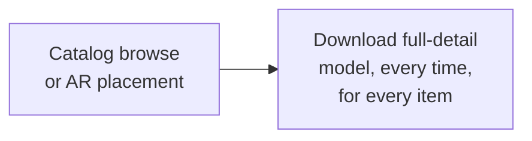

**Why it breaks:** per the capacity estimate, full-detail assets are 40-80x larger than a preview
would need to be — a user browsing 15 items to find one they like would download 15 full-detail
models just to look at thumbnails, which is both slow and enormously wasteful of bandwidth for
assets that, in most cases, are never placed in AR at all.

**v2 — two-tier assets (preview + full), but no progressive loading within the full tier:**

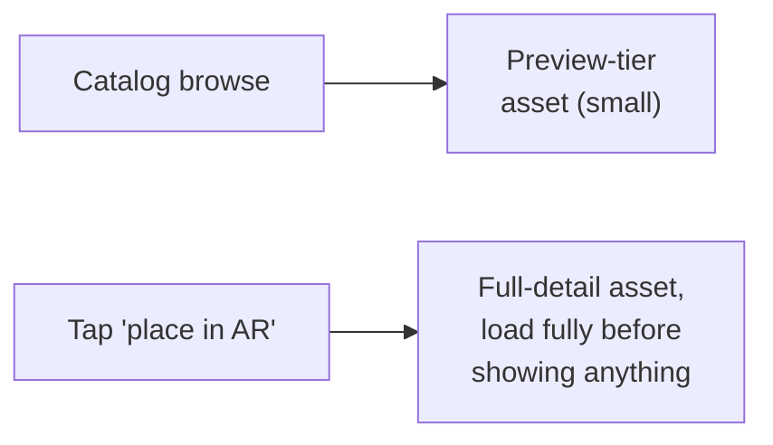

**Why it breaks:** better — browsing is now cheap — but placement still has a "blank space until
fully loaded" moment for a 15-40MB asset, which on a real mobile connection can take a
user-noticeable amount of time with nothing shown in between, reading as broken rather than
loading.

**v3 — the real system: preview tier for browsing, progressive LOD streaming for placement:**

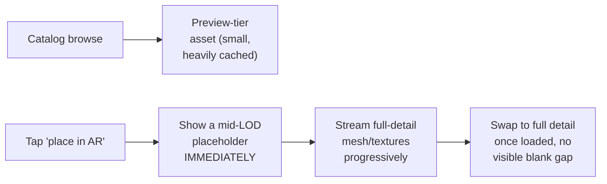

**What v3 fixes, one line each:** the preview tier keeps catalog browsing cheap and instant; a
mid-detail placeholder renders immediately on placement so the user always sees *something*
plausible right away; and progressive streaming fills in full detail in the background, matching
the same "show something now, refine progressively" instinct as adaptive-bitrate video or
progressive JPEG loading.

---

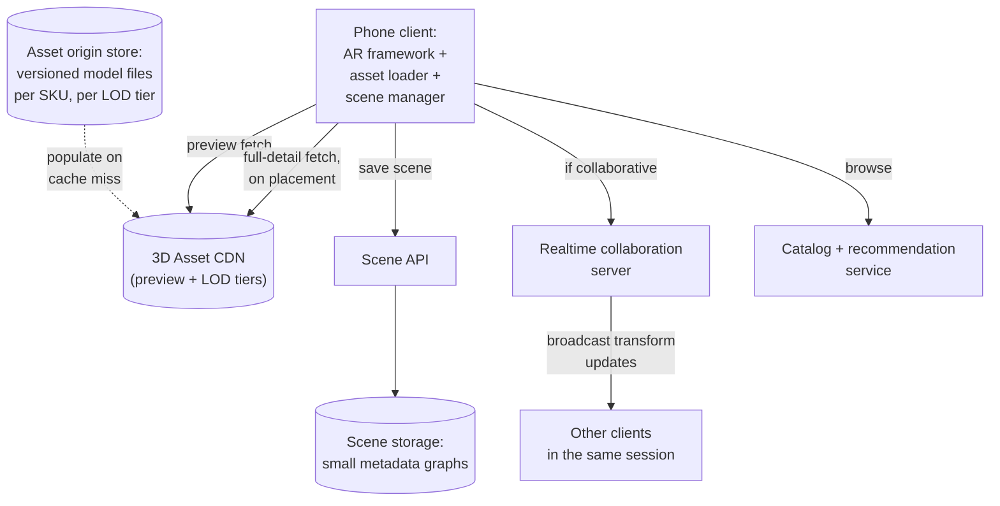

| Component | Role |
|---|---|
| 3D Asset CDN | Same architectural role as any media CDN — cache preview and LOD-tiered full-detail assets close to users; the vast majority of requests are cache hits since the catalog is shared across all users, not per-user content |
| Asset origin store | Versioned per-SKU, per-LOD-tier model files — the source CDN populates from on cache miss |
| Scene API + storage | Small metadata graphs, cheap to read/write, per the capacity estimate |
| Realtime collaboration server | Only instantiated when a multi-user session is active — broadcasts transform updates (position/rotation/scale changes), not rendered frames |
| Catalog + recommendation service | Standard product-catalog search/ranking, with recommendations informed by detected room dimensions/style where available |

---

## End-to-end request walkthroughs

### Walkthrough 1 — browse, then place an item, progressive load

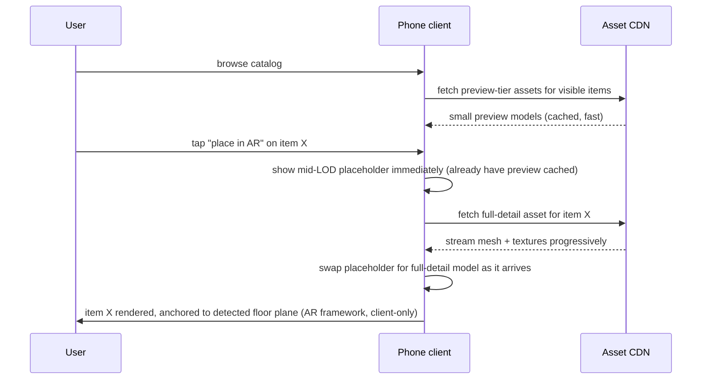

### Walkthrough 2 — save and later reload a scene

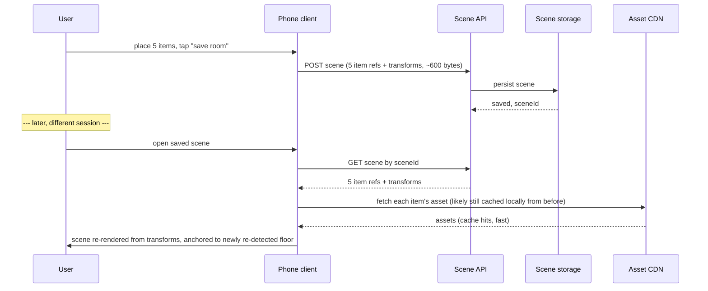

Notice walkthrough 2 never transmits or stores any rendered 3D output — only small metadata plus
re-fetched (often cached) assets, which is exactly why scene save/load is fast and cheap regardless
of how visually rich the scene looks.

### Walkthrough 3 — asset load stalls on a slow connection, graceful fallback

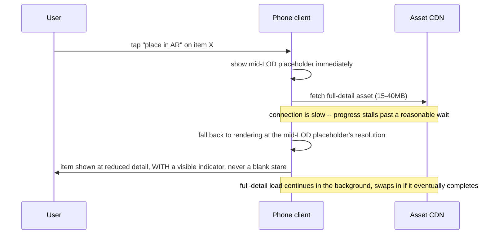

This is the concrete fallback behind the [failure-modes table](#failure-modes--mitigations)'s
"progressive streaming with a visible progress indicator" mitigation — a stalled full-detail load
degrades to a lower but real resolution, never an indefinite empty wait.

---

## Deep dive: level-of-detail (LOD) asset streaming

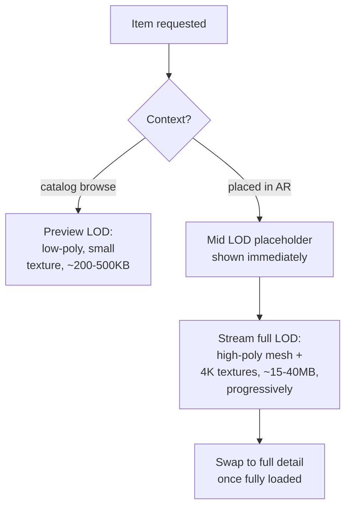

**Why LOD tiers, not a single "good enough" resolution for everything:** the two use cases have
fundamentally different requirements — browsing needs speed and low bandwidth across potentially
dozens of items per session; placement needs visual fidelity for the one or few items a user is
actually evaluating in their real space. One resolution tier can't serve both well, mirroring the
same "different SLA for different use case" instinct as the two-tier model routing in this
course's AI-code-assistant chapter, just applied to 3D assets instead of language models.

**Why a mid-LOD placeholder specifically, not just "show a loading spinner":** a plausible-looking
placeholder that progressively sharpens reads as *loading detail*, not *broken* — the same UX
principle behind progressive JPEG or blurred-image placeholders in a photo feed, applied to 3D
geometry.

**Interview cheat-sheet:** *"At least two LOD tiers: cheap and small for browsing, rich and large
for the one or two items actually being placed — loaded progressively with an immediate
placeholder, never a blank wait for the full asset."*

---

## Deep dive: scene-graph persistence

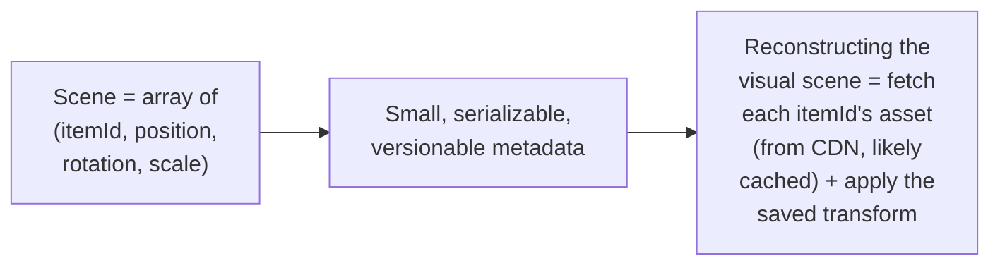

**Why a scene is a graph of references, never a rendered snapshot:** storing rendered output
(an image, a point cloud, a full 3D export) would be enormously larger, wouldn't stay in sync if
the underlying catalog asset is updated (e.g. a corrected texture), and couldn't be edited after
the fact (move one item without re-rendering everything) — storing structured references +
transforms keeps the persisted state small, editable, and automatically current with the latest
version of each referenced asset.

**Versioning consideration worth naming:** if a SKU is discontinued or its model updated, old
saved scenes referencing it need a defined behavior (show the archived version, substitute a
placeholder, or flag it to the user) — a small but real product decision that falls out of
choosing reference-based persistence.

**Interview cheat-sheet:** *"Persist a scene as a small graph of item references and transforms,
never as rendered output — this is what makes save/load fast, editable, and automatically
consistent with the current catalog asset for each referenced item."*

---

## Deep dive: collaborative scene editing

Only relevant if multi-user editing is in scope — confirmed by the earlier clarifying question.

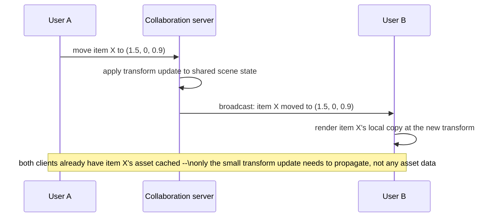

**Why this is a much simpler sync problem than the text/canvas collaboration chapters elsewhere in
this course:** per-object transform updates (a position, rotation, scale) are naturally
last-writer-wins at the property level — two users moving the *same* item at the *same* moment is
a rare, low-stakes conflict (whichever update arrives last wins, visually reconciled in under a
second), unlike text editing where character-level interleaving needs a real CRDT/OT algorithm.
Say this contrast explicitly if asked to compare — it's a legitimate reason to reach for a much
simpler sync mechanism here than in a text or canvas editor.

**Interview cheat-sheet:** *"Broadcast transform updates, not asset data — every client already
has the referenced item's asset cached, so real-time sync only needs to move small position/
rotation/scale deltas, and last-writer-wins per object is an acceptable conflict policy given how
low-stakes and rare a same-object collision actually is."*

---

## Deep dive: client-side vs. server-side rendering

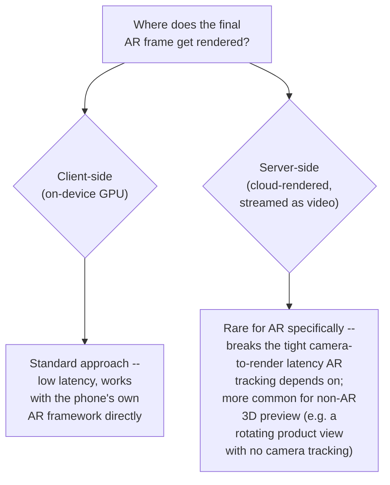

**Why client-side rendering is the default, and worth stating as a default rather than a choice
you're making:** AR fundamentally requires the rendered object to track the camera's real-time
movement with minimal latency — round-tripping every frame to a server for rendering would add
network latency directly into that tracking loop, breaking the illusion of the object being
anchored in real space. Server-side rendering is a legitimate answer for **non-AR** 3D preview
(e.g., a rotating product view with no camera involved), where there's no tight tracking loop to
protect.

**Interview cheat-sheet:** *"AR rendering has to be client-side because the render has to track the
camera in real time with minimal latency — server-side rendering is a reasonable answer for a
non-AR 3D preview, but not for anything anchored to a live camera feed."*

---

## Data model

**Scene lifecycle** — the state machine behind the persistence deep dive:

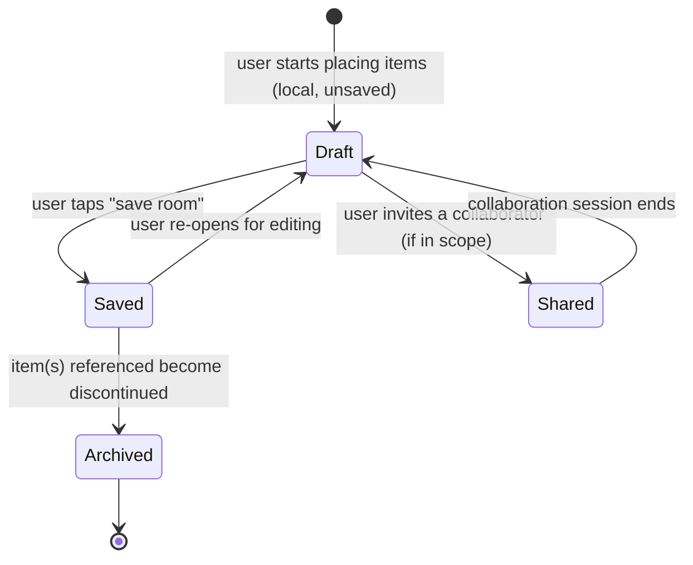

`Archived` exists because of the versioning consideration in the persistence deep dive — a saved
scene referencing a since-discontinued item needs a defined, non-crashing behavior.

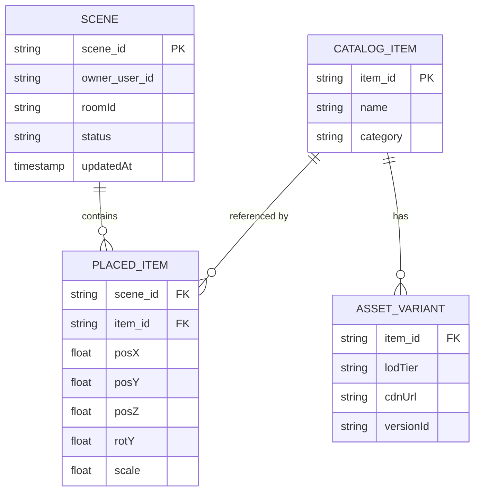

| Table | Storage choice & why |
|---|---|
| `Scene` / `PlacedItem` | Small, relational — per the capacity estimate, a scene is a few hundred bytes to a few KB, needing simple read-after-write consistency for the owning user, not a specialized store |
| `AssetVariant` | Versioned per-item, per-LOD-tier references to CDN-backed asset files — the origin store the CDN populates from on cache miss |

---

## Failure modes & mitigations

| Failure mode | Impact | Mitigation |
|---|---|---|
| **Full-detail asset load stalls on a slow connection** | User stares at a placeholder indefinitely | Progressive streaming with a visible progress indicator; fall back to a lower LOD tier if the full tier hasn't completed within a reasonable time, rather than blocking indefinitely |
| **AR tracking loses the floor plane** (poor lighting, fast camera movement) | Placed items appear to drift or lose anchoring | Entirely a client/platform-framework concern — the backend design has no lever here beyond ensuring assets are already cached so re-anchoring doesn't also require a fresh asset fetch |
| **A saved scene references a since-discontinued item** | Reload would show a broken reference | `Archived` scene state, with a defined client behavior (show a placeholder or the last-known asset version, never crash on a missing reference) |
| **Concurrent edits to the same scene from two devices of the same user** (phone + tablet) | Last save silently overwrites the other | Simple optimistic concurrency (a version/updatedAt check on save) is sufficient given single-owner scenes are low-collision — no need for the heavier collaborative-editing machinery unless multi-**user** editing is actually in scope |

---

## Non-functional walkthrough

**Scaling the asset-delivery path is a standard CDN scaling problem** — the catalog is shared,
heavily cacheable content, not per-user data, so this scales the same way any media CDN does:
add edge capacity, not origin capacity, as traffic grows.

**Scaling scene storage is trivial relative to asset delivery** — per the capacity estimate, a
scene is a few hundred bytes; even a huge number of saved scenes is a small dataset by this
course's usual standards.

**Availability of AR tracking itself is not this design's responsibility** — worth restating in
the non-functional section specifically, since interviewers sometimes probe "what if AR tracking
fails" to see if a candidate tries to solve a client-framework problem instead of correctly
deferring it.

---

## Security & compliance

- **Camera data privacy** — the AR framework processes camera frames on-device for tracking;
  the backend design should make clear that raw camera frames are never transmitted or stored
  server-side, only the resulting placement data (transforms), which is a meaningfully smaller
  privacy surface.
- **Room-scan data**, if the product stores any spatial-anchor or room-scan data to help
  re-detect a physical space later, is itself sensitive (it's a map of someone's home) and should
  be scoped, retained, and access-controlled accordingly.
- **Collaborative session access control** — only invited participants should be able to join or
  modify a shared scene; the collaboration server should authenticate and authorize joins, not
  rely on an unguessable session ID alone.

---

## Cost & trade-offs

**LOD tiering trades storage/pipeline complexity (maintaining multiple asset resolutions per SKU)
for bandwidth savings that, per the capacity estimate, are on the order of 40-80x for the
browsing use case** — an easy trade to justify at any catalog size beyond a handful of items.

**Client-side rendering is essentially not a choice for AR** (per the rendering deep dive) — the
real cost trade-off in this system lives in asset pipeline investment (how many LOD tiers, how
much art-production cost per additional tier), not in rendering architecture.

---

## Wrap-up: MVP vs. stretch

**In scope for an MVP:**
- Two-tier assets (preview + full-detail) served via CDN, with progressive loading and a
  placeholder for the full tier.
- Scene save/load as a small metadata graph, single-user.
- Explicit scoping of AR tracking/rendering as a client-framework capability, not redesigned.

**Explicitly out of scope for an MVP:**
- Real-time collaborative editing — start single-user, add the (comparatively simple, per the
  collaboration deep dive) transform-broadcast mechanism once multi-user is actually required.
- Room-dimension-aware recommendations — start with basic catalog browsing, add
  size/style-aware suggestions once there's usage data to inform them.

**Stretch goals, worth naming if asked "what's next":**
1. **Room-scan-informed recommendations** — using detected room dimensions to filter/rank catalog
   suggestions that plausibly fit.
2. **Cross-session persistent spatial anchors**, so a saved scene re-anchors precisely to the same
   physical location on return visits, a genuinely hard platform-level capability worth naming as
   a stretch rather than attempting to design.
3. **Multi-LOD adaptive streaming based on device/network conditions**, mirroring adaptive
   bitrate video's own client-side quality-selection logic, applied to mesh/texture resolution.

---

## Golden rules

- **Scope AR tracking and rendering as a client-platform concern up front** — this single
  decision determines whether the rest of the interview is well-paced or spent re-deriving
  something out of scope.
- **LOD tiering is not optional at any realistic catalog scale** — the size gap between preview
  and full-detail assets (40-80x, per the capacity estimate) makes single-tier delivery
  impractical either for browsing speed or placement bandwidth.
- **A scene is a small graph of references and transforms, never rendered output** — this is what
  makes persistence cheap, editable, and automatically consistent with the current catalog.
- **Collaborative editing here is much simpler than text/canvas CRDTs** — broadcasting small
  transform deltas with last-writer-wins per object is sufficient, because same-object collisions
  are rare and low-stakes.
- **Client-side rendering is close to mandatory for AR specifically** — the camera-to-render
  latency loop doesn't tolerate a network round-trip.

---

## Master cheat sheet

**One-liners:**
- Decompose immediately into client (AR tracking/rendering) vs. backend (asset delivery, scene
  persistence, optional collaboration) — this is the single highest-leverage first move.
- LOD tiers exist because preview and full-detail assets differ by 40-80x in size — one tier
  can't serve both browsing and placement well.
- A scene is metadata (item references + transforms), not rendered 3D output — small, fast,
  editable, and automatically current with the latest catalog asset version.
- Collaborative scene editing only needs to broadcast small transform deltas with last-writer-wins
  per object — a much simpler sync problem than text or canvas CRDTs.
- AR rendering is client-side by near-necessity — the camera-to-render latency loop can't tolerate
  a network round-trip to a server-side renderer.

**Formula chain:**
```
full_detail_bandwidth  = sessions x items_placed_per_session x avg_full_asset_size
preview_bandwidth       = sessions x items_browsed_per_session x avg_preview_asset_size
scene_storage_size      = placed_items_count x bytes_per_transform   [independent of asset size]
```

**Numbers:** full-detail 3D assets typically 40-80x larger than a preview tier · a saved scene is
on the order of hundreds of bytes to a few KB regardless of visual complexity · AR tracking/
rendering latency loop has essentially zero tolerance for a network round-trip, ruling out
server-side rendering for anything anchored to a live camera feed.
