# Design a Real-Time Collaborative Canvas (Figma) — The Story (narrative edition)

## What this file is

The reference file, `55-Design-a-Real-Time-Collaborative-Canvas-Figma-FAANG-Guide.md`, is the one to recite from. It has the requirements, API shapes, every trade-off table, and the master cheat sheet.

This file is a second way in. It tells the same material as one continuous story, in plain language.

Engineers at a fictional design-tool startup, **SketchSync**, keep hitting a wall. They patch it. The patch itself creates the next wall. This keeps happening until we land on the exact same design the reference file documents.

The company is made up. But every wall it hits, and every fix it reaches for, points at something a real, named system actually does — mostly **Figma**. Figma's own engineering blog documents its custom C++ multiplayer server, its property-level "last edit wins" merge model, and its move to WebAssembly/WebGL for rendering performance. Every time something is a documented fact versus a reasonable stand-in, I'll say so clearly — stand-ins are tagged `[illustrative]`.

One more thing up front: this guide is the *canvas* sibling of the Google Docs guide (`38-Design-a-Collaborative-Document-Editing-Service-Google-Docs-FAANG-Guide.md`). If you want the deep, character-by-character OT/CRDT mechanics for a *text* stream, that's chapter 38's job. This story only goes as deep as canvases actually need, and no deeper.

## The trigger phrases

Watch for: *"design Figma,"* *"a collaborative whiteboard,"* *"a design tool with multiplayer cursors."*

Keep one sentence in your head the whole way through:

> **A canvas is a bag of independent objects, each with independent properties — not one shared sequence like text.** So almost none of the hard text-editing conflict machinery is needed here. The actual hard problems are somewhere else entirely: what you send, who you send it to, and what you paint on screen.

Everything below is just this one idea, getting harder in small, honest steps.

---

## Chapter 1 — The file that got slower every time someone joined

### The shortcut that shipped v1.0

It's 2019. SketchSync is a scrappy Figma-style design tool with a few thousand users. Nothing fancy under the hood.

Here's the engineering shortcut that got version 1.0 out the door: whenever *anything* changes on the canvas — drag a rectangle one pixel, change one hex code — the client just re-serializes the **entire document** to JSON and sends it over the WebSocket. The server does the same thing back out: it rebroadcasts the whole document JSON to every other connected client.

This is simple. One code path. No per-property bookkeeping needed anywhere.

### Where it breaks

It works fine solo. It works fine with two people. Then a design review happens.

- Three editors open the same file — a fairly typical file with 600 objects.
- One of them starts dragging a rectangle across the canvas.

Let's do the math on what that costs:

- That file's full JSON is about **310KB** `[illustrative — a stand-in size for "a few hundred canvas objects serialized," not a measured Figma file]`.
- Drag events are sampled at roughly **24 times a second** (an animation-frame-paced rate, not literally every pixel).
- So the dragging client is now pushing **24 × 310KB ≈ 7.4MB every single second** — and that's just what one person's drag costs, *before* the server even rebroadcasts it to the other two editors.

Most office upload connections don't have 7.4MB/sec (≈59Mbps) of *upload* headroom sitting idle `[illustrative]`. So the WebSocket's outgoing buffer starts filling faster than the network can drain it.

The result: within a few seconds of dragging, updates are queued three, four, five deep. By the time they arrive, they're stale. The shape doesn't glide across the other two editors' screens — it **teleports**, jumping every 1.5-2 seconds instead of smoothly following the mouse.

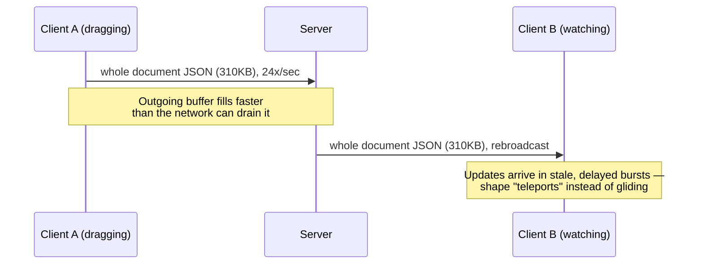

### Why this happens

The obvious question: *why does moving ONE rectangle five pixels require re-sending 599 rectangles that didn't change at all?*

Because the code never bothered to ask "what actually changed." It just re-dumps everything, every time — because that was the easiest line of code to write on day one.

### The fix

Think of this fix as the analogy for the rest of this story: send a **postcard, not the whole letter**.

Instead of re-mailing the entire document every time, send only the one line that changed: *"shape S1, its x is now 240, its y is now 118."*

This is a **property-level delta**. It's exactly the shape of what Figma's own multiplayer protocol actually sends — small, targeted mutations, never a whole-document resend for a single edit.

### The new problem this creates

Deltas are tiny now — under 100 bytes each instead of 310KB. But the server is still doing the other half of the old habit: broadcasting every delta to **every** connected client, regardless of whether that client can even see the shape that changed.

That's fine for a 3-person file. It stops being fine the day SketchSync's biggest customer opens a 10,000-object design-system file with 50 people in it at once.

### How I'd say this in an interview

"The very first bug in any naive real-time canvas is resending the whole document on every tiny edit. It looks like a rounding error until someone actually drags something — and then bandwidth and staleness both blow up together. The fix is a property-level delta: send only what changed, never the whole object or the whole document."

---

## Chapter 2 — The design review that made everyone's browser stutter

### The setup

Eight months later, SketchSync's biggest enterprise customer builds a shared file: 10,000 objects — icon sets, component variants, the works. They schedule an all-hands review: **50 people**, one file, live at the same time.

Deltas are small now (chapter 1's fix), so bandwidth per message isn't the problem anymore. But the server is still broadcasting **every** delta to **every** connected client. And every client is still receiving and evaluating updates for objects it can't even see on its own 1920×1080 screen.

### The math

- 50 people each make roughly **2 edits/sec** during active work (a mix of moving things and just clicking around).
- That's **100 edits/sec**, document-wide.
- Broadcast to the other 49 clients each: **4,900 fan-out messages/sec** hitting the server.
- Each of the 50 browsers now has to receive and at least check the relevance of roughly **98 incoming messages/sec**.

And here's the kicker: a typical viewport, at any zoom level, only actually shows **50-150 objects** out of the file's 10,000 — no matter how big the file is. Most of that traffic is for shapes nobody in that browser tab can currently see.

### The symptom

Main-thread time gets spent just deciding "is this update relevant to what I'm showing right now" — for objects that will never even be painted. That eats directly into the browser's frame budget.

- Frame time creeps from a smooth **16ms (60fps)** toward **35ms** `[illustrative]`.
- Result: visible stutter while scrolling and panning, for someone who's only ever looking at one corner of this huge file.

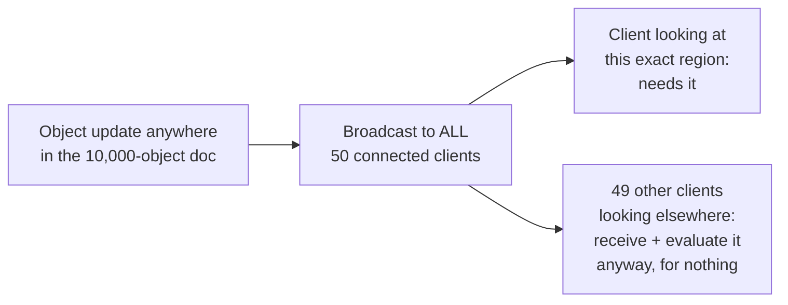

### Why this happens

The obvious question: *why is a client receiving updates for objects it can't even see on screen?*

Because the server has no concept of "where" each client is currently looking. It just has a flat list of connected sockets and fires at all of them.

### The fix

Think of the server as a **museum guard standing at the door of every exhibit room**.

- Each visitor (client) tells the guard which room they're currently standing in — their **viewport**, a rectangle of canvas coordinates.
- When something changes in Room 7, the guard only radios the visitors currently *in* Room 7.
- Visitors in Room 12 hear nothing about it. Not because the update is hidden from them forever — just because it's irrelevant *right now*. They'll get it the moment they actually walk into Room 7.

Concretely:

- Clients send a `viewport-subscribe` message with their visible bounds.
- The server indexes those subscriptions by spatial region — a grid or quad-tree over canvas coordinates. (Same family of trick as the geo-cell indexes used for ride-hailing dispatch, just applied to design-file coordinates instead of GPS ones.)
- On every object update, the server looks up which subscribed regions overlap that object's position *before* fanning out.

### The payoff

Redo the math with viewport-scoping in place: fan-out volume and per-client evaluation cost now scale with **viewport-visible object count (~50-150, roughly constant)**, not with the document's total 10,000 objects.

A 10,000-object file now costs roughly the same per-client rendering work as a 500-object one, for the same amount of actual on-screen activity.

### Walking through it: three clients, two shapes

Three clients, one file, two different shapes far apart on the canvas.

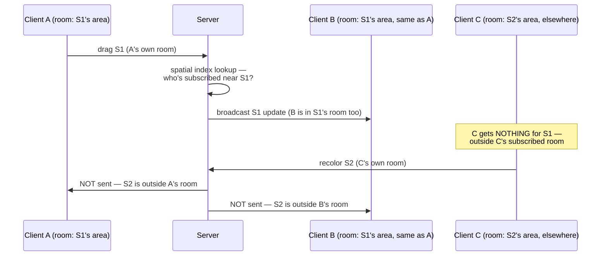

### The new problem

The museum guard now only tells you about *your own room*. But rooms change as people walk around — pan and zoom the canvas, and your room boundary moves.

If the client doesn't re-tell the guard "I just walked into a new room" on every pan/zoom, it either:

- misses updates for stuff that just scrolled into view, or
- keeps wasting bandwidth on stuff that scrolled out.

That re-subscribing has to fire continuously, not just once at file-open. Worth naming explicitly — but it's a mechanical detail, not a new category of problem.

The bigger new problem is a different one: what happens when **two** people are in the *same* room, touching the *same* shape, at the *same* time?

### How I'd say this in an interview

"Fan-out has to be viewport-aware, or cost scales with total document size instead of what's actually visible — that's the difference between a design tool that stays fast as files grow and one that doesn't. The mechanism is a spatial index over client viewport subscriptions, re-fired on every pan and zoom, not a flat broadcast list."

---

## Chapter 3 — The resize that got silently erased by a recolor

### The setup

Two designers, Priya and Marco, are in the same file, both looking at the same rectangle.

- Priya resizes it — width goes from 200 to 260.
- At almost the same instant, Marco changes its fill color. Marco hasn't seen Priya's resize yet — his last full snapshot of that object still says width=200.

Under SketchSync's current logic, each update still carries the object's **whole property set**, as of the sender's last known state. Not because anyone wants that — "diff just the true delta" hadn't been built yet, only "diff instead of the whole document" (chapter 1's fix stopped at object-level granularity, not property-level).

### Step by step

1. Priya's resize arrives at the server first, tagged server-version **v10**. Object is now `{width: 260, height: 140, color: "#3355FF"}`.
2. Forty milliseconds later, Marco's recolor arrives, tagged **v11**. But because Marco's payload is his whole locally-known copy of the object, it says `{width: 200, height: 140, color: "#FF0000"}` — width is stale, still 200.
3. The server does the simplest possible thing: last-writer-wins **on the whole object**. v11 replaces the object entirely.
4. Result: Priya's resize, which Marco never even touched, silently reverts to width=200.

Marco only meant to change a color. He just erased someone else's unrelated edit, without knowing it.

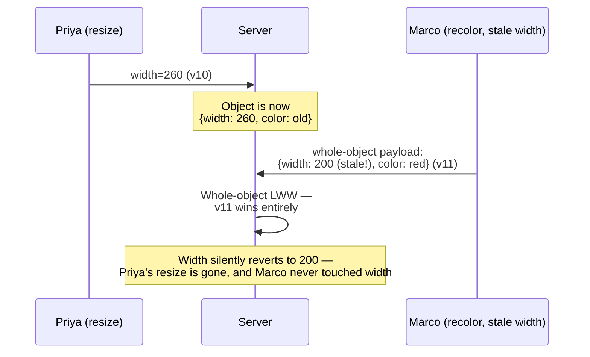

### Why this happens

The obvious question: *if two people are editing genuinely different properties of the same object, why should either edit ever get clobbered?*

It shouldn't. The bug isn't that two people touched the same object at the same time. It's that the conflict resolution is scoped one level too coarse: **per object**, when it should be **per property**.

### The fix

Think of each canvas object as a **filing cabinet with independent, individually-locked drawers**: one drawer for `x`, one for `y`, one for `width`, one for `color`, one for `zOrder`. Each drawer has its own tiny "who touched this last" tag.

- Priya's resize only ever writes to the `width` and `height` drawers.
- Marco's recolor only ever writes to the `color` drawer.
- They never touch the same drawer, so there's nothing to actually conflict. Both edits land cleanly, at the same time, with no data lost from either side.

This is a **per-property last-writer-wins register**. It's genuinely the single most important design decision in the whole chapter: it's *why* a canvas doesn't need the heavyweight OT/CRDT sequence machinery that guide 38 builds for text. Text is one shared sequence where two edits can interleave character by character. A canvas's objects are independent entities with independent properties, so the actual conflict surface is naturally tiny.

### The new problem

Per-property LWW still needs *some* rule for when two people touch the exact *same* drawer at the exact same moment — say, both dragging the same shape's `x` position simultaneously. Whoever's update "wins" has to be decided the same way on every single client, or different viewers will end up disagreeing about where the shape actually is.

### How I'd say this in an interview

"The bug isn't concurrent edits to the same object — it's resolving conflicts at the object level instead of the property level. Model each property as its own independent last-writer-wins register, and edits to different properties of the same object never conflict at all, which is exactly why this domain doesn't need text-style OT or CRDT sequence machinery."

---

## Chapter 4 — The clock that lied about who went first

### The setup

Same-drawer collisions are rare, but they do happen — two people drag the exact same shape at the exact same moment.

SketchSync's first instinct for breaking the tie: trust each client's own timestamp — "whoever's clock says later wins." Sounds reasonable. It quietly breaks the very first week it ships.

### Why it breaks

Here's the sequence:

1. Priya's laptop clock is running **3 seconds behind** real time `[illustrative — ordinary consumer-laptop clock drift, a well-documented general phenomenon, not a measured SketchSync incident]`.
2. Priya drags shape S1 to x=100. Her laptop stamps it with her own (slow) clock.
3. A split-second later, in real wall-clock time, Marco drags the same shape to x=105. His laptop's clock is accurate.
4. Because Priya's clock is behind, her timestamp reads as *earlier* — even though, if you asked an outside observer, Marco actually moved second, just barely.

That part alone is survivable. "Whoever's later wins" still picks *someone* consistently, as long as every client agrees on the same two timestamps.

Here's the part that actually breaks convergence: network jitter means Priya's and Marco's two updates don't necessarily *arrive* at every other viewer in the same order.

- Viewer C's connection happens to deliver Marco's message first, then Priya's.
- Viewer D's connection delivers them in the opposite order.

If each client is independently comparing "whichever timestamp is bigger" as messages trickle in — doing that comparison itself instead of trusting one shared referee — two different viewers can end up applying the two updates in different apparent orders. They land on genuinely different final positions for the same shape: one screen shows x=100, another shows x=105. Nothing about the system knows anything is wrong.

That's a broken convergence guarantee, not just an ugly edge case.

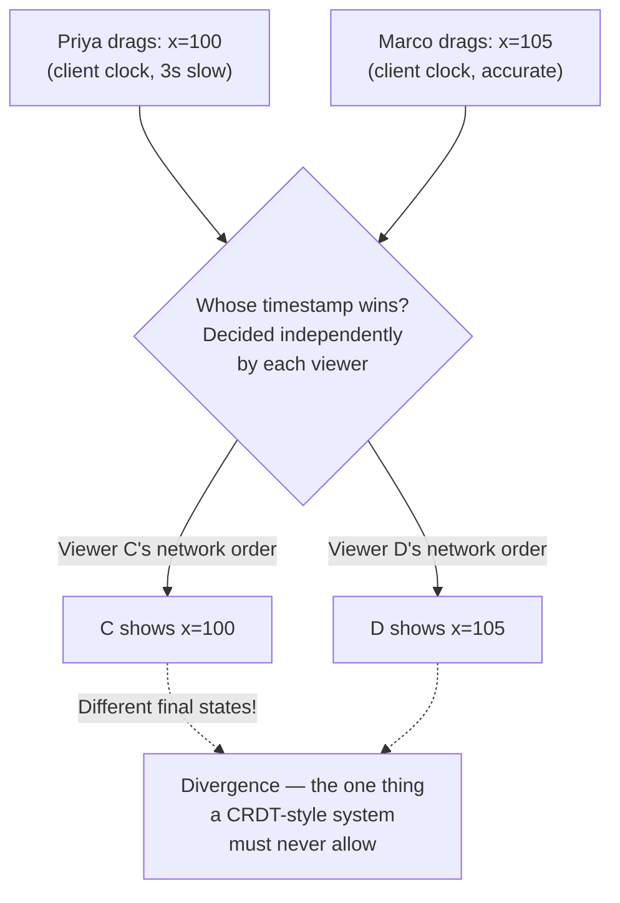

### Why this happens

The obvious question: *if every client agreeing matters, why let every client make its own decision at all?*

Don't. Have exactly one place decide, and have everyone else just trust that decision.

### The fix

The server hands out a **wristband stamped at the door**, not a watch on your wrist.

- Every client's clock is irrelevant.
- The **server**, the moment it *receives* an update — not when the client sent it — stamps it with its own monotonically increasing version number.
- That's the only ordering that matters, ever.

So: Priya's update gets `v_srv_500`. Marco's, arriving a moment later at the server, gets `v_srv_501`. Every client, regardless of its own clock or network path, converges on the same fact: 501 beats 500, Marco's position is final. No client clock ever enters the decision.

### The new problem

Every conflict-resolution problem this story has hit so far has been about *making sure edits don't get lost or scrambled*. None of it has been about the other half of "collaborative": **making the canvas actually feel fast to look at**, once a document gets big.

That's a completely different kind of problem — not about correctness, about raw rendering performance.

### How I'd say this in an interview

"Client clocks can drift and network delivery order isn't guaranteed to match send order, so if every client independently breaks ties by comparing timestamps, different viewers can converge on different final states — which defeats the whole point. The fix is a single server-assigned version stamp at receipt time; every client trusts that one number instead of comparing clocks."

---

## Chapter 5 — The file where scrolling itself became the bottleneck

### The setup

SketchSync's canvas, up to this point, renders every shape as an actual DOM element — a `
` styled and positioned per rectangle, per circle, per line. That's fine at a few hundred objects. It stops being fine the day a customer opens a 5,000-object icon library and just tries to **pan around** it.

### The math

- Panning the canvas means updating position/transform on every visible DOM node.
- The browser has to recompute layout and style for all **5,000 live DOM elements** on every frame — whether or not they're currently in view.
- Frame time balloons from a smooth **16ms (60fps)** to roughly **220ms** `[illustrative]`.
- That's a 4-5fps crawl. Visibly janky, for an action as basic as scrolling a design file.

Nobody's even editing anything yet — just *looking* at the file is the bottleneck.

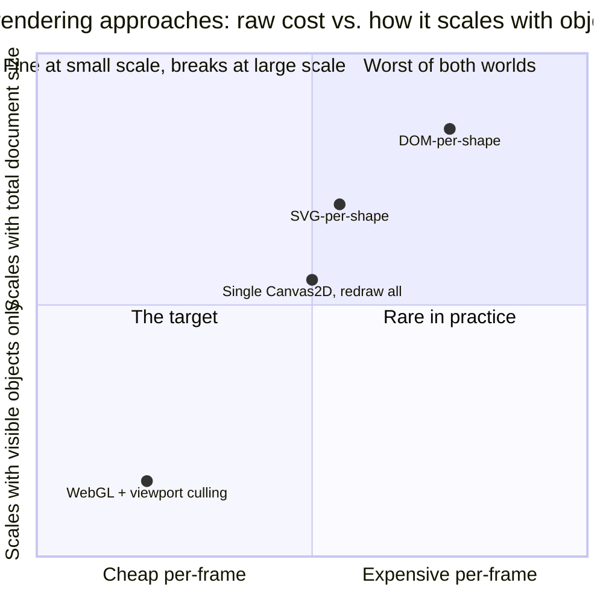

### Why this happens

The obvious question: *why is the browser doing per-element bookkeeping work at all, for something that's ultimately just supposed to be pixels on a screen?*

Because a `
`-per-shape model asks the browser's whole layout/style engine — built for *documents*, with text flow and box models — to track thousands of independent, individually stylable, individually hit-testable living elements. That's a mismatch for "draw some rectangles fast."

### The fix

This is real, documented Figma engineering: Figma renders its canvas on a single **WebGL** surface, GPU-accelerated, instead of thousands of separate DOM/SVG nodes — specifically because DOM-based rendering doesn't hold up once files get large.

Figma went further: it compiled its core rendering/geometry engine from C++ to **WebAssembly**, a move Figma's own engineering blog credits with cutting the app's load time by roughly 3x.

Think of it as swapping **thousands of individually-tracked living actors on a stage for one big movie screen**. Instead of the browser individually managing 5,000 elements, the renderer paints everything as pixels onto one shared GPU surface, once per frame. The browser doesn't need to know or care that there were ever 5,000 separate "things."

### The new problem, immediately

Painting *everything* onto one big screen every frame is still wasteful if most of what's being painted is off-screen. This is the exact same "only care about what's currently visible" idea from chapter 2's museum guard — just moved from the *network* layer into the *renderer* itself.

SketchSync adds **viewport culling**: before painting a frame, skip any object whose bounding box doesn't overlap the current camera viewport (plus a small buffer margin for smooth panning). GPU work now scales with what's on screen, not with total document size.

### A second spot the same trick shows up

Worth naming, even though it's not the star of this chapter: clicking to *select* a shape has the same shape of problem.

- With 10,000 objects, testing every single one's bounding box against a click point takes roughly **8ms per click** `[illustrative]` — which feels sluggish for something that should feel instant.

The same "index by spatial region" trick from chapter 2 fixes it client-side, too: a local grid index over object bounding boxes narrows a click test down to the handful of objects actually near that point, instead of all 10,000.

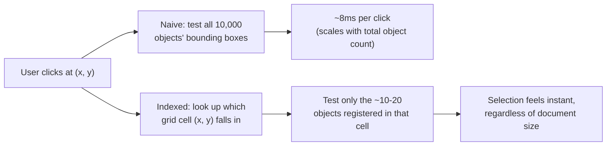

Worth being precise about what this grid buys versus chapter 2's spatial index: they're structurally the same data structure (regions mapped to the things inside them). But they answer two different questions for two different audiences.

| | Chapter 2's index | Chapter 5's index |
|---|---|---|
| Question it answers | "Which *remote clients* care about this network update?" | "Which *local objects* are near this click?" |
| Where it runs | Server-side | Client-side |

Same trick, reused in two different places in the stack.

### How I'd say this in an interview

"DOM-per-shape rendering breaks down once files get into the thousands of objects, because the browser's layout engine is tracking far more living elements than it needs to. The fix is GPU-accelerated canvas rendering — Figma's own real move — plus viewport culling so paint cost scales with what's visible, not total document size; and the same spatial-indexing idea that scopes network fan-out also speeds up local hit-testing for clicks."

---

## Chapter 6 — The meeting where the mouse cursors drowned out the actual edits

### The setup

A 50-person design review, same file as chapter 2. Everyone's cursor is visible to everyone else in real time — a nice feature, standard for this category of tool. Naively, every `mousemove` event just gets broadcast as-is.

### The math

- Raw `mousemove` fires roughly **60 times/sec** per user.
- Even throttled down to a more reasonable **10 updates/sec** per user (matching the sampling rate this guide's own capacity math uses), the fan-out gets ugly fast for a 50-person session:
- **50 users × 10 updates/sec × 49 other recipients each ≈ 24,500 cursor messages/sec** `[illustrative — a direct scale-up of the guide's own 3-person formula to a 50-person meeting]`.

Actual edit-delta traffic in that same room, even during active work, is a small fraction of that — around 100/sec, per chapter 2's math.

Cursor chatter alone can dwarf real editing traffic. And it was riding the same WebSocket connection and the same delivery-guarantee machinery as actual document edits — meaning real edits were sometimes visibly queued up behind a flood of mouse-position spam.

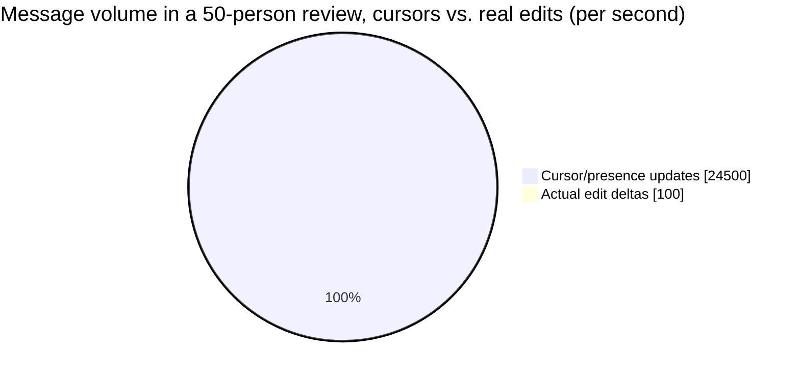

### Why this happens

The obvious question: *does a dropped cursor update actually matter?*

No. If one cursor-position packet gets lost, the little arrow just visually catches up on the next update, half a beat later, and nobody notices.

A dropped **edit** delta, on the other hand, is a permanent, real divergence between clients that must never silently happen.

Those are two completely different reliability classes. Treating them the same either wastes reliability machinery on a disposable signal, or — worse — risks losing a real edit by lumping it in with traffic that's allowed to drop.

### The fix

Split them onto two different channels with two different rules — **walkie-talkie chatter versus certified mail**.

- Cursor/presence updates go out on a best-effort channel: throttle to a sane rate, coalesce rapid-fire positions, and it's fine if some get dropped under load.
- Edit deltas stay on the reliable, guaranteed-delivery channel from every earlier chapter — never coalesced away, never allowed to silently vanish.

### The new problem, worth naming even as a stretch

Splitting channels fixes *priority*. But the raw fan-out math for presence is still roughly `O(n²)` in the number of viewers — every cursor still goes to every other viewer. That's fine at 50 people. It stops being fine at 500 spectators watching a huge public file `[illustrative — SketchSync doesn't actually have a 500-person use case yet, but it's the obvious next wall]`.

The real answer there — some form of view-only/broadcast mode that doesn't fan every cursor out to every viewer individually — is a genuinely separate scaling problem from anything this chapter solves. Worth flagging rather than pretending the same mechanism trivially covers it.

### How I'd say this in an interview

"Presence traffic can actually outweigh real edit traffic in ordinary use, and it has a totally different reliability bar — fine to drop or coalesce a cursor update, never fine to drop an edit. So they go on separate channels with separate guarantees; conflating them either over-engineers presence or risks losing a real edit."

---

## Chapter 7 — The undo that erased a teammate's work

### The setup

SketchSync's undo, up to this point, is one shared stack per document — the same model a single-player desktop app would use, because nobody had thought to question it yet.

1. Priya drags a shape.
2. A minute later, Marco, working on a completely different part of the file, tweaks some text.
3. Priya, wanting to undo *her own* drag, hits Cmd+Z.
4. The global stack doesn't know or care whose action it's popping. It just reverts the **most recent** action in the document — which happens to be Marco's text edit, not Priya's drag.

Marco's work vanishes off his own screen mid-session, with no warning, from an undo he didn't even trigger.

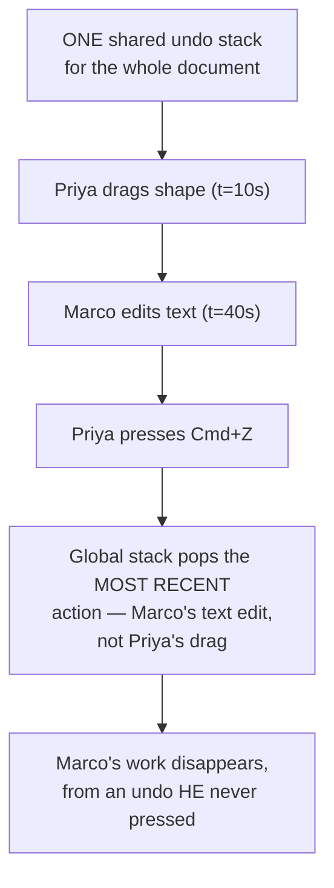

### Why this happens

The obvious question: *whose action should "undo" actually undo?*

Obviously the *user's own* last action — that's what "undo" means to every person pressing the key. A single global stack conflates "most recent in the document" with "most recent by me," and those are only the same thing when exactly one person is editing.

### The fix

Give every user their **own personal tape recorder** — a private operation history, tracking only their own actions, in their own order.

- Priya's Cmd+Z looks up *Priya's* most recent not-yet-undone operation (the drag) and reverts only that, regardless of anything Marco did in between.

Crucially, "revert" isn't implemented as rewinding shared document state to some earlier snapshot — that would also erase whatever Marco did *since* Priya's original drag. Instead:

- Undo computes the **inverse** of Priya's own last operation (move the shape back to where it was).
- It applies that inverse as a brand-new, ordinary forward edit, broadcast exactly like any other update from chapter 1 onward.

That inverse-operation naturally coexists with anything anyone else did in the meantime. It's the same "compensating action" pattern used for correcting financial ledger entries: you never erase history, you add a new entry that cancels the old one out.

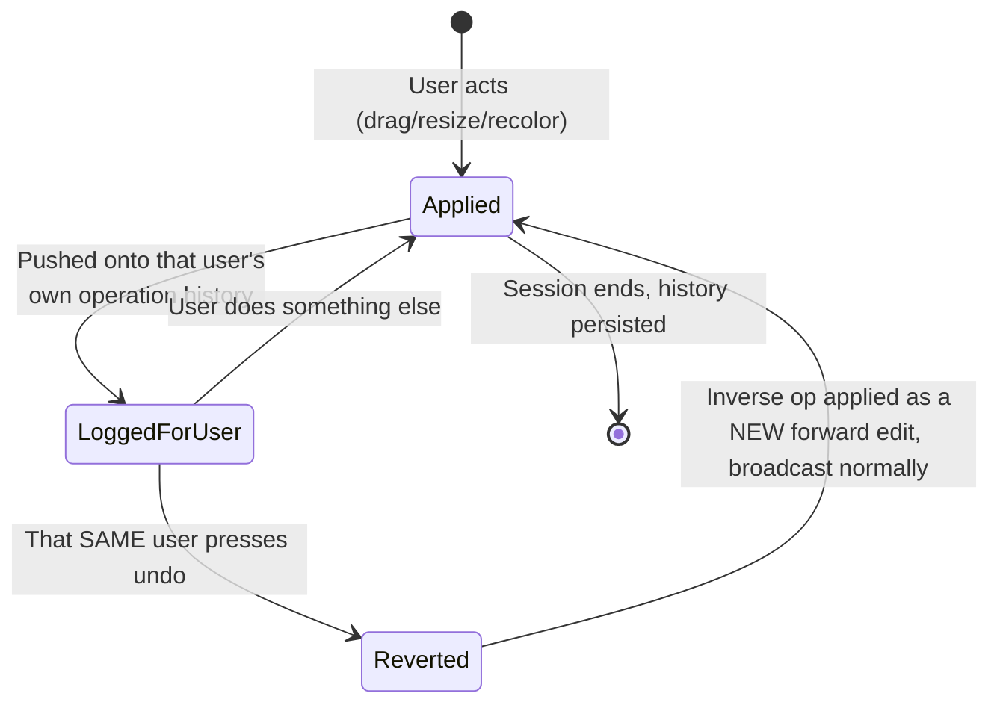

### The new problem

Per-user undo assumes the user is continuously connected, sending and receiving operations in real time. What happens when someone's undo history and edit history were built up entirely **offline** — say, on a train with no signal — and only now, minutes later, meet the server for the first time?

### How I'd say this in an interview

"A single global undo stack is wrong the moment more than one person is editing — it conflates 'most recent in the doc' with 'most recent by me.' The fix is a per-user operation history, and undo is implemented as a compensating forward operation, the inverse of your own last action, never a rewind of shared state that would erase someone else's work too."

---

## Chapter 8 — The laptop that came back from the train and almost erased 40 edits

### The setup

A designer's laptop drops off WiFi for six minutes on a commute. She keeps working locally the whole time — drags four shapes, recolors two — and SketchSync buffers those as local operations with local version stamps, since there's nowhere to send them yet.

Meanwhile, back in the office, two colleagues keep editing the same live file. They rack up **40 edits** `[illustrative]` — some touching the very shapes she just moved, most touching things she never went near.

### What almost goes wrong

Her laptop reconnects. The naive move — and this is genuinely the same original sin as chapter 1, just resurfacing in a new spot — would be to push her local document as one big final snapshot and let it overwrite the server's current state.

That would wipe out all 40 of her colleagues' edits from the last six minutes, the instant her laptop found WiFi again. A teammate's logo redesign, gone — because someone else's train happened to have a dead zone.

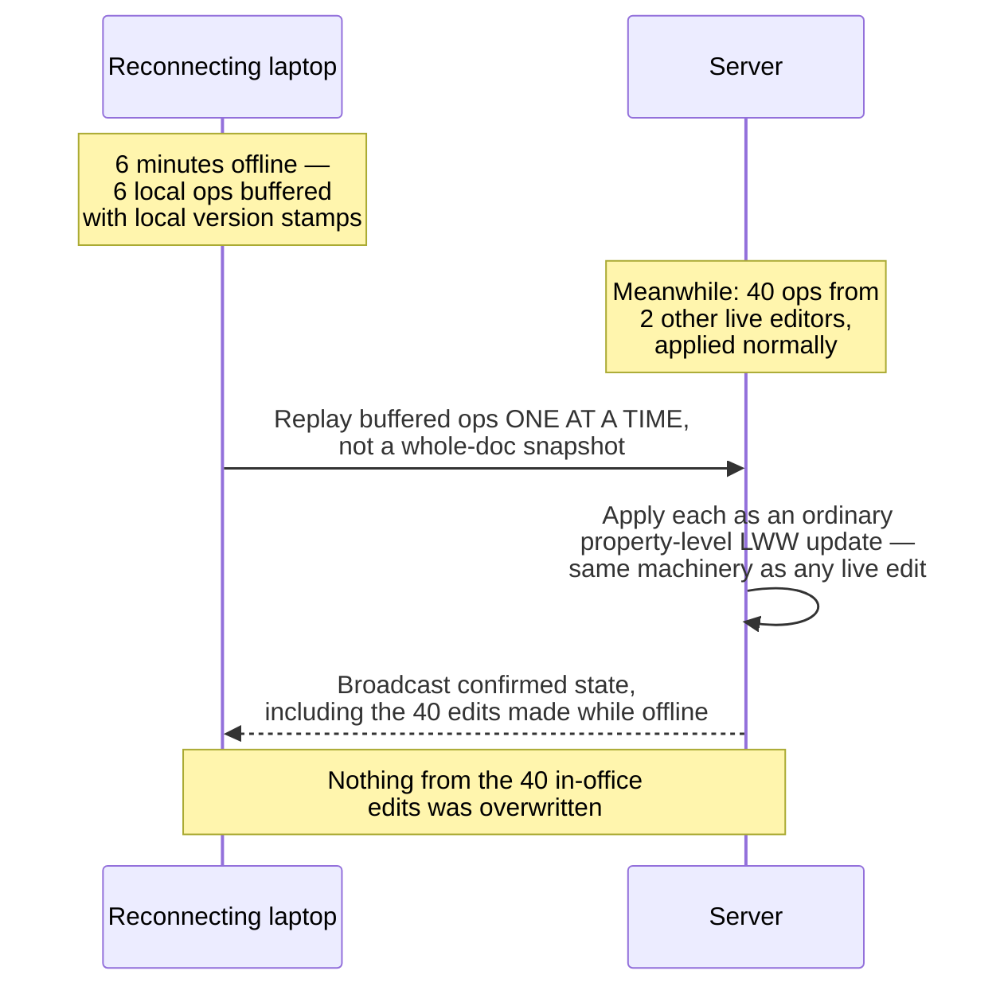

### Why this doesn't need a new algorithm

The obvious question: *how is a laptop that's been offline for six minutes different from a laptop that's just on a slightly slower network connection?*

It isn't, really — that's the actual insight.

### The fix

Replay her buffered local operations one at a time, as ordinary property-level deltas, using the exact same server-versioned last-writer-wins machinery from chapters 3 and 4. No special-case "offline merge" algorithm needed at all.

It's the same idea as **catching a room up on a diary, page by page**: you read your entries aloud one at a time and they slot into whatever's already happened, rather than handing over your whole diary and telling everyone else's story to shut up.

Being offline for six minutes is just a longer-latency version of the same conflict model every other chapter already solved. It earns no new machinery — just a local buffer and a replay step on reconnect.

### One closing loose end

All of this — property deltas, viewport fan-out, per-property versions, undo, presence, offline replay — lives in the collaboration server's **in-memory** state for each open document, for speed.

If that server process restarts, that in-memory state is gone, unless it's backed by something durable. The real answer, same shape as every durable system in this course: periodic snapshots of document state plus an append-only operation log. That way a restart (or a brand-new collaborator opening the file for the first time) can rebuild current state without replaying the document's entire history from day one.

### How I'd say this in an interview

"Offline editing doesn't need a separate conflict-resolution algorithm — it needs a local buffer of operations and a replay step on reconnect, using the exact same per-property last-writer-wins logic as any live concurrent edit. The one thing you must never do is push a whole-document snapshot on reconnect, because that silently overwrites everything that happened on the server while you were gone."

---

## The shape all eight fixes actually left behind

Every chapter above was a behavior change. Underneath, they only ever needed four kinds of records — worth drawing once, now that all eight fixes are in place:

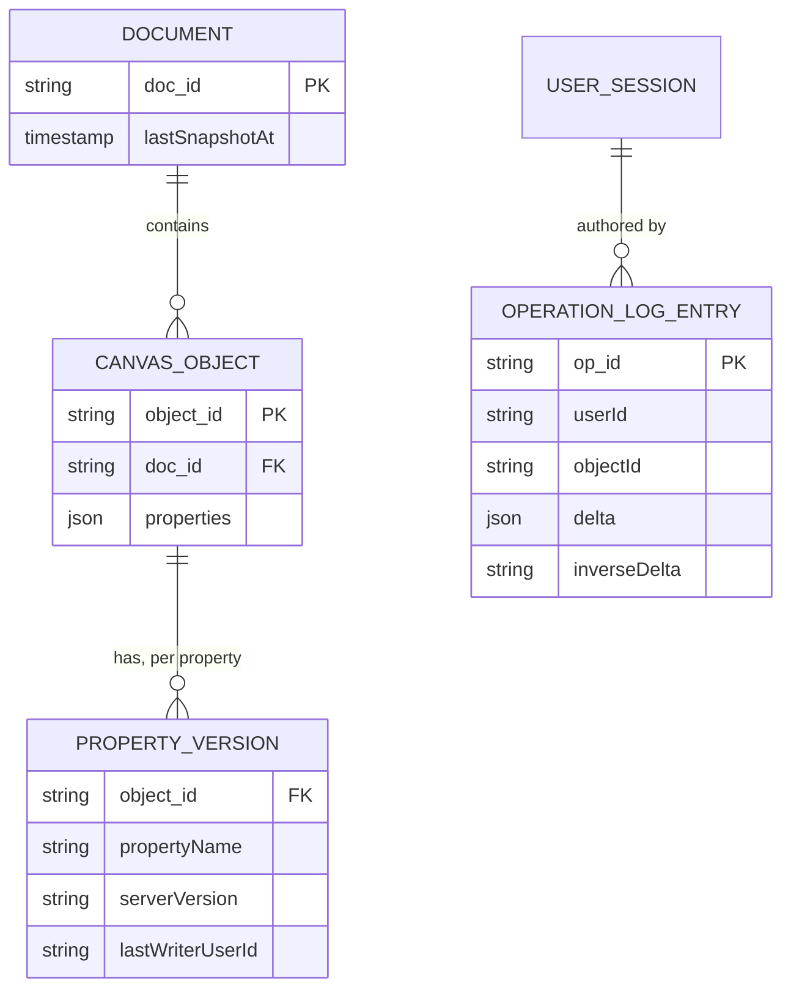

- `PROPERTY_VERSION` is chapters 3 and 4 in one row — the independent filing-cabinet drawer, stamped with the wristband-at-the-door version, not a client clock.
- `OPERATION_LOG_ENTRY` is chapters 7 and 8 in one row — it's what makes a user's own undo history findable, and it's what a reconnecting (or replaying-offline) client's buffered ops ultimately turn into once they're applied.

Nothing about chapters 1, 2, 5, or 6 needed new tables at all. They're transport, fan-out, and rendering concerns sitting on top of this same small, boring data model.

---

## Where the story actually lands

```mermaid
flowchart LR
    A["Ch1: whole-doc<br/>resync every edit"] -->|"fixes: bandwidth<br/>breaks: still broadcasts<br/>to everyone"| B["Ch2: viewport-scoped<br/>fan-out"]
    B -->|"fixes: fan-out scales with<br/>visible, not total<br/>breaks: same-object<br/>conflicts clobber"| C["Ch3: per-property<br/>LWW"]
    C -->|"fixes: different properties<br/>never clobber<br/>breaks: client clocks<br/>can't be trusted"| D["Ch4: server-assigned<br/>version stamps"]
    D -->|"fixes: deterministic ordering<br/>breaks: DOM rendering<br/>doesn't scale"| E["Ch5: WebGL + culling<br/>+ spatial hit-test index"]
    E -->|"fixes: paint cost scales with<br/>visible, not total<br/>breaks: cursor spam<br/>drowns real edits"| F["Ch6: presence on its own<br/>best-effort channel"]
    F -->|"fixes: edits never queue<br/>behind cursors<br/>breaks: global undo<br/>steals others' work"| G["Ch7: per-user undo,<br/>compensating ops"]
    G -->|"fixes: undo only touches<br/>your own work<br/>breaks: reconnect can<br/>overwrite others' edits"| H["Ch8: buffer + replay<br/>on reconnect"]
```

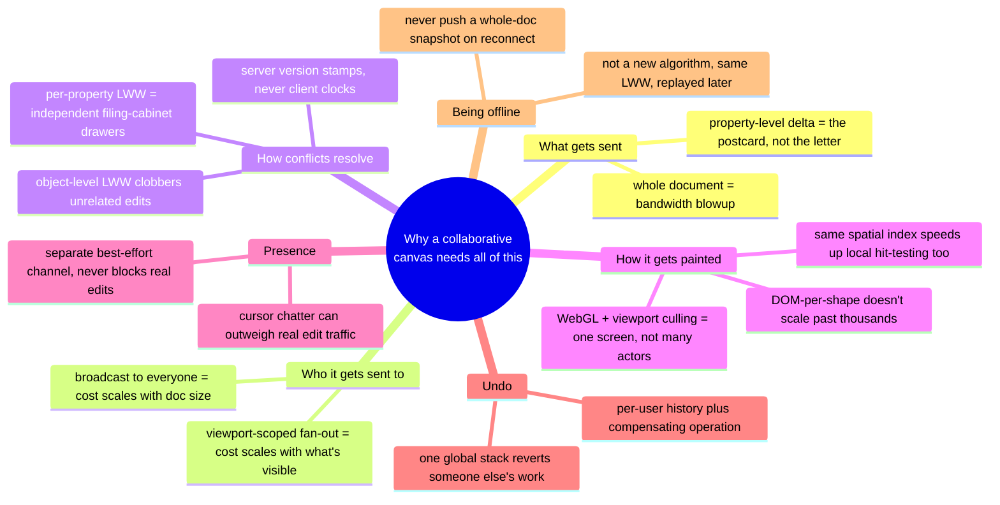

Notice what's *not* in this chain: no OT transform functions, no operational-transform server, no character-level merge algorithm. That machinery exists for a **shared sequence** — text — where two edits can genuinely interleave inside the same string.

A canvas's objects don't share a sequence. They're independent entities with independent properties, so the entire conflict surface here is naturally smaller. Every fix in this story is sized to match that — not a corner cut, the right-sized tool.

If an interviewer wants the character-interleaving depth, that's guide 38's job, not this one's.

---

## Grill me — adversarial follow-ups

**Q1: "Why not just reuse Google Docs' OT/CRDT machinery here — wouldn't it obviously also work for a canvas?"**

It would work, but it's solving a harder problem than the one that actually exists. OT/CRDT sequence algorithms exist to handle character-by-character interleaving in one shared string. A canvas's objects have independent properties that essentially never interleave, so per-property last-writer-wins gets the same convergence guarantee for a fraction of the complexity. Reaching for the heavier tool here is over-engineering, not thoroughness.

**Q2: "Doesn't per-property LWW mean you can just silently lose someone's edit if two people touch the exact same property at once?"**

Yes, and that's an accepted, deliberate trade for this domain. The same-property, same-instant collision is rare, and the visual outcome (the shape ends up wherever the later edit put it) is a reasonable, expected result, not data corruption. It's genuinely different from a text editor, where naive last-writer-wins on a whole line would destroy someone's actual keystrokes.

**Q3: "Walk me through what happens to viewport-scoped fan-out if a client just never re-subscribes after panning."**

That client keeps receiving updates for its stale old viewport and misses updates for whatever it panned into — a correctness-adjacent staleness bug, not data loss, since the object state itself is still safe on the server. The fix is mechanical: re-fire the viewport-subscribe message on every meaningful pan/zoom, and prune subscriptions on disconnect via the same heartbeat/timeout every WebSocket system already needs.

**Q4: "You said server version stamps fix ordering — what if the collaboration server itself restarts mid-session?"**

Then whatever wasn't yet snapshotted needs to be recoverable from the append-only operation log, replayed forward from the last snapshot — that's exactly why the durable store isn't just periodic snapshots alone. A restart should cost a brief reconnect and resync, never silent loss of an already-acknowledged edit.

**Q5: "Is WebGL rendering actually required, or is that overkill for a smaller product?"**

It's earned, not default. DOM-per-shape is genuinely fine up to a few hundred objects, and jumping straight to a custom GPU renderer for an MVP would be solving a problem you don't have yet. The honest answer is you build the message protocol (small deltas, viewport scoping) to be renderer-agnostic from day one, and only invest in GPU rendering once real files start hitting the thousands-of-objects range where DOM genuinely falls over.

**Q6: "Why does presence get its own channel instead of just a lower sequence-number priority on the same connection?"**

Because the actual difference isn't priority, it's the delivery *guarantee* — presence is allowed to drop and coalesce, edits never are. If they share one channel with one delivery contract, you either apply edit-grade reliability overhead to disposable cursor blips, or worse, let the "it's fine to drop this" mindset leak into how edit deltas get handled under load.

**Q7: "Per-user undo as a compensating operation — what stops that from creating an infinite trail of tiny reverting edits nobody can follow?"**

Nothing needs to stop it structurally — each undo is just one more ordinary operation in the log, same as any edit, and the operation log's job (chapter 8's closing point) is to make that history replayable and auditable, not to hide it. If the product wants a cleaner audit trail, that's a display/compaction concern on top of the log, not a reason to change how undo itself works.

**Q8: "If offline replay just uses the same LWW machinery as live edits, what actually makes offline harder than being online?"**

Almost nothing, mechanically — that's the whole point of chapter 8. The one thing that's genuinely different is UX: a live editor sees conflicts resolve in real time and barely notices; someone replaying six minutes of buffered edits might see one of their changes get overwritten by something a colleague did while they were gone, all at once, which can feel more jarring even though the underlying resolution logic is identical.

**Q9: "Where would you actually stop, if the interviewer just says 'design Figma' cold with no other hints?"**

Say the one-sentence framing first — independent object properties, not a shared text sequence — then walk property-level deltas, viewport-scoped fan-out, and per-property LWW with server versions as the core three, since those are what make it correct and scalable at all. Presence, undo, offline replay, and rendering performance are the deep dives you go into only as far as the interviewer's follow-ups actually pull you, not all four unprompted.

**Q10: "Everything here treats structural edits — grouping shapes, nesting a frame inside another, reordering z-index — the same as simple property edits. Is that actually true?"**

No, and it's worth flagging as a real gap rather than pretending it. Moving a shape's `x` is a clean single-property register, but "group these three shapes" or "reparent this frame" changes relationships *between* objects, not just one object's own properties, and two people restructuring the same part of a tree concurrently is a genuinely harder merge problem than anything per-property LWW solves. The honest answer in an interview is to name it explicitly as a stretch goal rather than claim the same simple mechanism trivially covers it.

---

## Pacing note

**If this is 60 seconds inside a bigger question:** say the one-sentence framing — a canvas is independent objects with independent properties, not a shared sequence — then say "property-level deltas, viewport-scoped fan-out so cost tracks what's visible not total size, per-property last-writer-wins with server version stamps, and I'd go into presence, undo, and rendering performance as deep dives if you want to go there." That's the whole shape in one breath.

**If this is the whole 15-20 minute focus:** walk the chapters in order — why whole-document sync breaks first, property deltas, viewport-scoped fan-out, per-property conflict resolution, server-assigned ordering, rendering performance at scale, presence/cursor broadcast, per-user undo, then offline reconnect if it comes up. Don't walk all eight unprompted — follow wherever the interviewer's questions actually point, and use the skipped chapters as your "if I had more time" closer.

---

## Active recall — no answers, test yourself cold

1. What's the one-sentence reason a canvas's conflict model is fundamentally simpler than a text editor's?
2. Why did SketchSync's whole-document resync make a simple drag look like the shape was "teleporting"?
3. What's the actual difference between what chapter 1's fix solves and what chapter 2's viewport-scoped fan-out solves?
4. Walk through exactly how Marco's recolor silently erased Priya's resize, and name the one-line fix.
5. Why can't every client just compare timestamps locally to decide who "wins" a same-property collision?
6. What real, documented move did Figma make to fix DOM-based rendering not scaling, and why does it work?
7. Why does presence traffic sometimes exceed actual edit traffic, and what's the one rule that follows from that?
8. Why is a single global undo stack wrong the moment more than one person is editing?
9. What's the difference between "undo as a compensating operation" and "undo as a rewind of shared state," and why does only one of them survive concurrent edits from other people?
10. Why doesn't offline editing need a different conflict-resolution algorithm from live editing?

*Spaced repetition: test this list today, again in 2-3 days, again in a week.*

---

## Cheat sheet — one line per stop on the story

| Problem | Why it breaks | The fix |
|---|---|---|
| Whole-document resync on every edit | Bandwidth and staleness both blow up together | Send only the property-level delta — the postcard, never the whole letter |
| Broadcast to every connected client | Fan-out and client-side evaluation cost scale with total document size | Scope fan-out to viewport subscriptions (a spatial index), so cost scales with what's visible instead |
| Object-level last-writer-wins | Clobbers unrelated concurrent edits to different properties of the same object | Model each property as its own independent LWW register — like separate locked drawers in one filing cabinet |
| Client-timestamp tie-breaking | Clock drift plus out-of-order network delivery can make different viewers converge on different final states | A single server-assigned version stamp at receipt time, not client clocks, is the one ordering everyone trusts |
| DOM-per-shape rendering | Falls over once documents hit the thousands-of-objects range | GPU-accelerated single-surface rendering (Figma's real move: WebGL, plus a WebAssembly-compiled core) plus viewport culling keeps paint cost tied to what's on screen |
| The same spatial index, reused | — | The viewport index that scopes network fan-out is the same trick, applied locally, that makes click-to-select fast on huge documents instead of linear-scanning every object |
| Cursor/presence broadcast | Can outweigh real edit traffic in ordinary use and has a much looser delivery bar | Its own separate, best-effort, coalesce-and-drop-tolerant channel — never sharing a lane with actual edits |
| A single global undo stack | Can revert someone else's unrelated work | Per-user operation history; undo is a compensating forward operation (the inverse of your own last action), never a rewind of shared state |
| Offline editing | Isn't a different conflict-resolution problem, just a longer-latency version of the same one | Buffer local ops, replay them individually on reconnect, never push a whole-document snapshot that could overwrite what happened while you were gone |

**The meta-lesson:** a canvas's conflict surface (independent object properties) is genuinely smaller than text's (one shared sequence). Every fix in this story is sized to match that difference, which is why it looks lighter-weight than guide 38's OT/CRDT machinery — without being any less correct.
